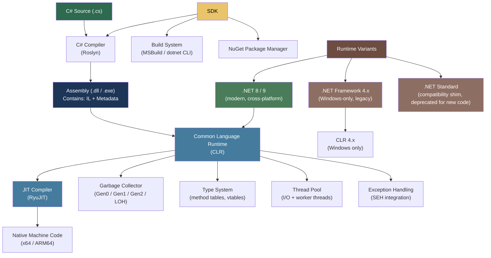
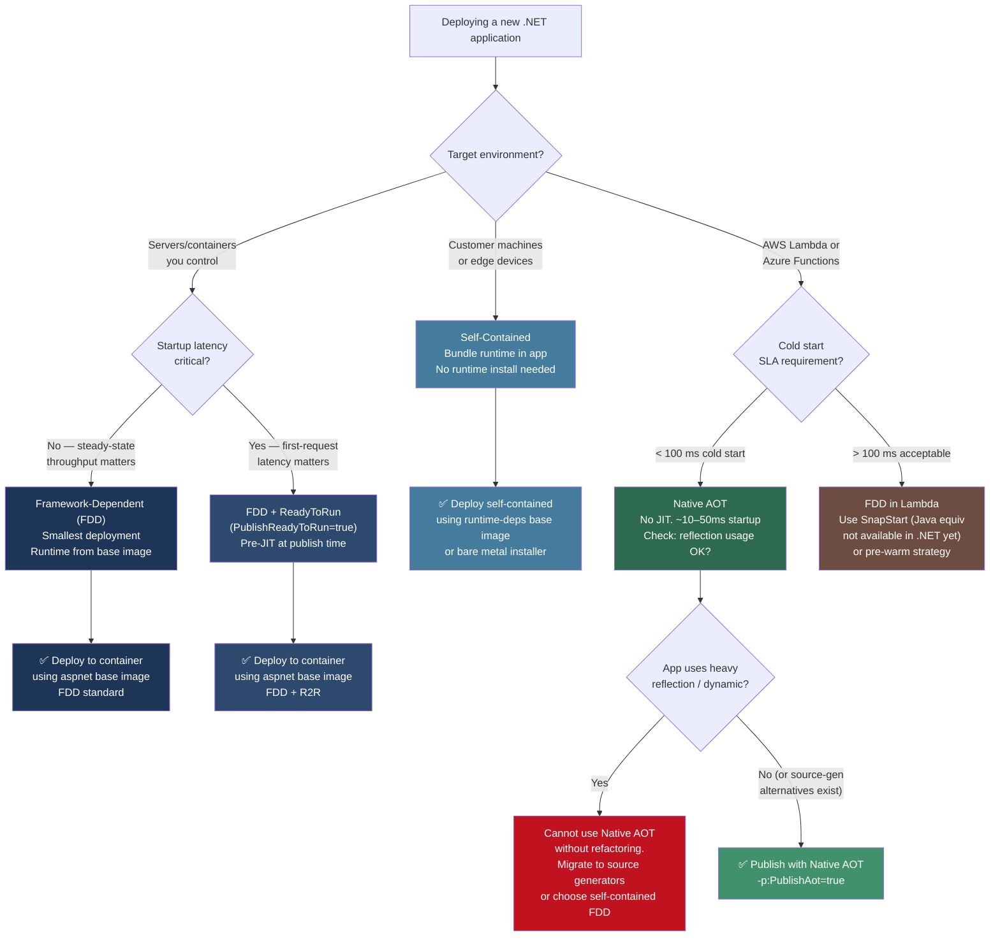

> [!success] Mastery Check
> - [ ] **Studied Well**
> - [ ] **Can explain the concept without notes**
> - [ ] **Can answer interview questions confidently**
> - [ ] **Can implement it in a real project**


## 📍 PART 0 — Navigation & Context

### Where This Topic Lives

```
.NET Ecosystem
└── Platform Fundamentals
    ├── ► The .NET Platform: CLR, SDK, Runtimes, and the Compilation Pipeline  ← YOU ARE HERE
    ├──   C# Program Structure (2.02)
    ├──   Value Types vs Reference Types (2.16)
    ├──   Virtual Dispatch and the CLR Object Model (2.37)
    └──   Tiered Compilation, JIT Internals, and PGO (2.49)
```

### What You Need Before This

- A working understanding of what a "compiled language" means in general terms
- Familiarity with the concept of operating systems and processes
- Basic awareness of what C# source code looks like (a few hours of exposure is enough)

### What This Unlocks After

- **[[2.16 — Value Types vs Reference Types]]** — the managed memory model and GC are CLR features; you need CLR fundamentals first
- **[[2.37 — Virtual Dispatch and the CLR Object Model]]** — vtables and method tables are CLR runtime data structures
- **[[2.49 — Tiered Compilation, JIT Internals, and PGO]]** — goes deep on JIT mechanics that this topic introduces
- **[[2.42 — Reflection]]** — assembly metadata inspection only makes sense once you understand assembly structure

### Why This Topic Matters at Production Scale

Every performance optimization, deployment decision, and runtime bug you encounter is shaped by the CLR's execution model — engineers who don't understand the pipeline between C# source and running machine code are debugging by instinct rather than by knowledge.

---

## 🧠 PART 1 — The Core Mental Model

### The Fundamental Rule

> **C# source compiles to platform-neutral IL (Intermediate Language), which the CLR's JIT compiler translates to native machine code at runtime — per method, on first call. The practical consequence is that .NET code is portable at the IL level and optimizable at the machine level.**

### The Plain-Language Analogy

Think of .NET as a theatrical production company. The **playwright** (you, the C# developer) writes scripts in a universal format that any troupe can perform. The scripts are stored in a **published script library** (the assembly, containing IL). When a show runs in New York, the **local director** (the JIT compiler) takes that universal script and adapts it for the specific theater, local dialect, and available stage equipment (x64, ARM64, AVX-512 CPU instructions). The audience (the OS and CPU) sees a perfectly localized performance — they never see the universal script.

The **production company's infrastructure** (the CLR) provides the theater, the lighting crew (GC), the stage manager (thread pool), and the contract rules (type safety) that every show must follow. You as the playwright only care about those rules; you don't manage the rigging.

What makes this analogy precise: the "universal script" is actual IL bytecode — a stack-based instruction set that has no concept of x64 registers. The "adaptation" is real JIT compilation that produces real x86-64 machine instructions, including SIMD optimizations the playwright never wrote.

### The .NET Taxonomy Diagram



> [!NOTE] .NET Standard Is Dead for New Projects .NET Standard 2.0 was a compatibility surface that let a single library target both .NET Framework and modern .NET. For new code in 2026, target `net8.0` or later. .NET Standard exists only to share libraries with legacy .NET Framework projects.

---

## 🔬 PART 2 — Deep Mechanics

### 2.1 The Compilation Pipeline: Every Step from Source to Execution

```
━━━━━━━━━━━━━━━━━━━━━━━━━━━━━━━━━━━━━━━━━━━━━━━━━━━━━━━━━━━━━━━━━━
PHASE 1: BUILD TIME  (your machine, dotnet build)
━━━━━━━━━━━━━━━━━━━━━━━━━━━━━━━━━━━━━━━━━━━━━━━━━━━━━━━━━━━━━━━━━━

OrderService.cs         ──► Roslyn (C# Compiler) ──► OrderService.dll
OrderRepository.cs      │     • Lexing/Parsing                │
PaymentProcessor.cs     │     • Semantic analysis             │
                        │     • Type checking                 │
                        │     • IL code generation            │
                        │     • Metadata emission             │
                        └─────────────────────────────────────┘
                                                              │
                               OUTPUT: PE file (.dll/.exe)    │
                               ┌───────────────────────────┐  │
                               │ PE Header (Windows compat)│◄─┘
                               │ CLR Header                │
                               │ Metadata Tables:          │
                               │   TypeDef, MethodDef,     │
                               │   MemberRef, AssemblyRef, │
                               │   Attributes, etc.        │
                               │ IL Bytecode(method bodies)│
                               │ Resources                 │
                               └───────────────────────────┘

━━━━━━━━━━━━━━━━━━━━━━━━━━━━━━━━━━━━━━━━━━━━━━━━━━━━━━━━━━━━━━━━━━
PHASE 2: LOAD TIME  (dotnet process starts)
━━━━━━━━━━━━━━━━━━━━━━━━━━━━━━━━━━━━━━━━━━━━━━━━━━━━━━━━━━━━━━━━━━

1. OS loads dotnet.exe (the runtime host)
2. Host loads coreclr.dll (the CLR itself)
3. CLR reads the PE file's CLR header to find entry point
4. Assembly Loader validates strong name / signature (if present)
5. Type Loader reads metadata and builds internal Method Tables
   (one per type, containing slots for every virtual and interface method)
6. Method bodies left as IL — NOT compiled yet.
   Each slot points to a "PreJIT stub" that triggers compilation on first call.

━━━━━━━━━━━━━━━━━━━━━━━━━━━━━━━━━━━━━━━━━━━━━━━━━━━━━━━━━━━━━━━━━━
PHASE 3: EXECUTION TIME  (per-method, on first call)
━━━━━━━━━━━━━━━━━━━━━━━━━━━━━━━━━━━━━━━━━━━━━━━━━━━━━━━━━━━━━━━━━━

First call to ProcessOrder():
  1. CPU hits the PreJIT stub
  2. RyuJIT is invoked with the IL method body
  3. RyuJIT compiles IL → native code (Tier 0: quick, unoptimized)
  4. The method table slot is updated to point to the native code
  5. Execution continues at the native code address
  6. On subsequent calls: the stub is gone, jump goes directly to native code

After ~30 calls (configurable):
  7. Tiered compilation kicks in: method is recompiled at Tier 1
     (full optimization: inlining, loop unrolling, register allocation)
  8. Method table slot updated again to point to optimized code
```

**Cost labels:**

- Roslyn compilation: O(n) in file size, typically 1–5 seconds for large projects
- Type loading at startup: ~50–200 μs per assembly loaded
- First JIT compilation: ~100 μs to ~5 ms per method (RyuJIT Tier 0)
- Tier 1 recompilation: ~500 μs to ~20 ms per method (full optimization)
- Direct native call after JIT: ~1–5 ns (no overhead vs C++ equivalent)

---

### 2.2 IL (Intermediate Language) — What the Compiler Actually Emits

IL is a stack-based bytecode. "Stack-based" means all operations consume and produce values on an evaluation stack — there are no register operands in IL.

```csharp
// C# source:
public static int Add(int a, int b) => a + b;
```

```
// IL emitted by Roslyn (viewed with ildasm / dotnet-ildasm):
.method public hidebysig static int32 Add(int32 a, int32 b) cil managed
{
  .maxstack  2

  IL_0000:  ldarg.0        // Push argument 'a' onto evaluation stack
  IL_0001:  ldarg.1        // Push argument 'b' onto evaluation stack
  IL_0002:  add            // Pop both, add, push result
  IL_0003:  ret            // Return the top of the evaluation stack
}
```

A more complex example showing the IL for a null check:

```csharp
// C# source:
public static int GetLength(string s)
{
    if (s == null) throw new ArgumentNullException(nameof(s));
    return s.Length;
}
```

```
.method public hidebysig static int32 GetLength(string s) cil managed
{
  .maxstack  2
  .locals init (bool V_0)          // Compiler-allocated local for null check result

  IL_0000:  ldarg.0                // Push 's'
  IL_0001:  ldnull                 // Push null
  IL_0002:  ceq                    // Compare equal → push 1 or 0
  IL_0003:  stloc.0                // Store in V_0
  IL_0004:  ldloc.0                // Load V_0
  IL_0005:  brfalse.s  IL_0013     // If false (not null), jump to IL_0013
  IL_0007:  ldstr      "s"         // Load the string "s"
  IL_000c:  newobj     instance void [System.Runtime]System.ArgumentNullException::.ctor(string)
  IL_0011:  throw                  // Throw the exception
  IL_0013:  ldarg.0                // Push 's' (not null, we checked)
  IL_0014:  callvirt   instance int32 [System.Runtime]System.String::get_Length()
  IL_0019:  ret
}
```

> [!TIP] Tools for Reading IL
> 
> - `dotnet tool install -g dotnet-ildasm` — command-line IL disassembler
> - **ILSpy** (free IDE) — decompiles IL back to C# and shows raw IL side by side
> - **SharpLab.io** — web tool: paste C# on the left, see IL/JIT assembly on the right. Essential for understanding what the compiler actually generates.

---

### 2.3 The Managed Heap and GC: The CLR's Memory Manager

The CLR's garbage collector manages all reference type allocations. It is a **tracing, generational, compacting** GC.

```
MANAGED HEAP LAYOUT (.NET 8, Server GC with 8 logical processors)

┌─────────────────────────────────────────────────────────────────┐
│ Gen 0  (~256 KB per heap, 1 heap per logical processor)         │
│   • All new allocations start here                              │
│   • Collected most frequently (every ~1–10 ms in hot loops)     │
│   • Collection is ~0.1–1 ms                                     │
├─────────────────────────────────────────────────────────────────┤
│ Gen 1  (~2 MB per heap)                                         │
│   • Objects that survived one Gen 0 collection                  │
│   • Collected less frequently (~every 50–200 ms)                │
│   • Acts as a buffer between Gen 0 and Gen 2                    │
├─────────────────────────────────────────────────────────────────┤
│ Gen 2  (unbounded — grows to fill available RAM)                │
│   • Long-lived objects: static data, caches, large graphs       │
│   • Full GC (Gen 0 + 1 + 2) is expensive: 10–500 ms             │
│   • High Gen 2 collection rate = serious production problem     │
├─────────────────────────────────────────────────────────────────┤
│ LOH — Large Object Heap  (objects ≥ 85,000 bytes)               │
│   • Collected only during Gen 2 GC                              │
│   • NOT compacted by default (fragmentation accumulates)        │
│   • Byte arrays for buffers frequently end up here              │
├─────────────────────────────────────────────────────────────────┤
│ POH — Pinned Object Heap  (.NET 5+)                             │
│   • For objects that must not move (interop buffers)            │
│   • Eliminates pinning fragmentation from the main heap         │
└─────────────────────────────────────────────────────────────────┘

Object allocation cost: ~2–5 ns  (bump-pointer allocator — just move a pointer)
Gen 0 collection cost:  ~0.1–1 ms (STW pause for background GC)
Gen 2 full GC cost:     ~10–500 ms depending on live set size
```

> [!WARNING] The LOH Fragmentation Trap Renting large arrays (≥ 85 KB) and immediately returning them still causes LOH fragmentation over time because the GC doesn't compact the LOH by default. Use `ArrayPool<byte>.Shared` to rent and return buffers without triggering LOH allocation. This is the single biggest GC pressure point in high-throughput .NET services.

---

### 2.4 Assembly Structure: The Unit of Deployment

An assembly is the unit of versioning, deployment, and security in .NET. It is a PE (Portable Executable) file containing:

```
OrderService.dll
├── PE Header           — Makes Windows think it's a Win32 executable
├── CLR Header          — Entry point method token, flags, strong name hash
├── Metadata            — Compressed binary tables describing every type, method,
│   ├── TypeDef         │   field, property, event, custom attribute
│   ├── MethodDef       │   (this is what Reflection reads — zero IL parsing needed)
│   ├── MemberRef       │
│   ├── AssemblyRef     │   References to OTHER assemblies (version + public key token)
│   ├── CustomAttribute │   [Obsolete], [HttpGet], etc. — stored here
│   └── ...~40 tables   │
├── IL Bytecode         — The actual method bodies
├── Resources           — Embedded files, localized strings (ResX)
└── Strong Name Sig     — RSA signature (if signed; optional in .NET Core era)
```

**Key production implication:** The `AssemblyRef` table is what causes `FileNotFoundException` at startup — if a referenced assembly isn't where the runtime expects it, load fails. The runtime probes in this order:

1. Global Assembly Cache (GAC) — only for .NET Framework, not .NET Core/5+
2. Application base directory
3. Subdirectories named after the assembly
4. NuGet package directories (from `.deps.json` manifest)

---

### 2.5 SDK vs Runtime: The Distinction Engineers Mix Up

```
┌─────────────────────────────────────────────────────────────────┐
│                        .NET SDK                                 │
│   Everything needed to BUILD .NET applications                  │
│                                                                 │
│   • Roslyn (C# / VB compiler)                                   │
│   • MSBuild (project system)                                    │
│   • dotnet CLI (dotnet build, run, publish, test, pack)         │
│   • NuGet client                                                │
│   • Templates (dotnet new)                                      │
│   • Bundled Runtime (one specific version)                      │
│                                                                 │
│   Installed on: developer machines, CI servers                  │
│   NOT required on: production servers                           │
└───────────────────────────┬─────────────────────────────────────┘
                            │ Bundles
                            ▼
┌─────────────────────────────────────────────────────────────────┐
│                      .NET Runtime                               │
│   Everything needed to RUN .NET applications                    │
│                                                                 │
│   • CLR (coreclr.dll / libcoreclr.so)                           │
│   • JIT compiler (clrjit.dll)                                   │
│   • GC                                                          │
│   • Base Class Library (BCL): System.*, collections, etc.       │
│   • ASP.NET Core Runtime (if needed: adds Kestrel, MVC, etc.)   │
│                                                                 │
│   Installed on: production servers, containers                  │
│   Typically: 200–500 MB installed footprint                     │
│   OR: self-contained publish embeds the runtime in your app     │
└─────────────────────────────────────────────────────────────────┘
```

**The three publish modes and when to use them:**

```
Framework-Dependent Deployment (FDD):
  dotnet publish -c Release
  • Requires runtime installed on target machine
  • Small deployment (just your app's DLLs)
  • Runtime updates apply automatically → risk of runtime changes
  ✅ Use for: containers where you control the base image, enterprise servers

Self-Contained Deployment (SCD):
  dotnet publish -c Release --self-contained -r linux-x64
  • Bundles runtime inside your app (~60–120 MB extra)
  • No runtime required on target machine
  • Runtime is locked to your publish version → no surprise runtime updates
  ✅ Use for: edge deployments, customer machines, environments you don't control

Native AOT:
  dotnet publish -c Release -r linux-x64 -p:PublishAot=true
  • No JIT. No CLR. Compiles to native binary like C++.
  • ~10x faster startup, ~3x smaller memory footprint than FDD
  • Constraints: no Reflection.Emit, limited reflection, no dynamic loading
  ✅ Use for: CLI tools, AWS Lambda, serverless, microservices with startup SLAs
```

---

## 💻 PART 3 — Production Code Patterns

### 3.1 Reading Assembly Metadata Safely at Startup

```csharp
// Pattern: Read assembly version at startup for health endpoint and logging.
// Domain: API gateway / health check endpoint.

public static class AssemblyInfo
{
    // Cache at startup: assembly reflection is cheap once, but avoid per-request
    private static readonly Version? _version;
    private static readonly string _informationalVersion;
    private static readonly string _assemblyName;

    static AssemblyInfo()
    {
        var assembly = typeof(AssemblyInfo).Assembly;

        // AssemblyName is always present — safe to dereference
        _assemblyName = assembly.GetName().Name ?? "unknown";

        // Version can be null if not set in .csproj — guard it
        _version = assembly.GetName().Version;

        // InformationalVersion includes git commit hash when set in CI:
        // <InformationalVersion>1.2.3+abc1234</InformationalVersion>
        _informationalVersion = assembly
            .GetCustomAttribute<AssemblyInformationalVersionAttribute>()
            ?.InformationalVersion
            ?? _version?.ToString()
            ?? "0.0.0";
    }

    public static string InformationalVersion => _informationalVersion;
    public static string AssemblyName => _assemblyName;
    public static Version? Version => _version;
}

// Usage in health endpoint:
app.MapGet("/health", () => new
{
    status = "healthy",
    version = AssemblyInfo.InformationalVersion,
    assembly = AssemblyInfo.AssemblyName
});
```

---

### 3.2 Targeting the Right Framework Version in a Multi-Project Solution

```csharp
// ✅ CORRECT: Library that must remain compatible with .NET Framework projects
// OrderProcessor.csproj (shared library):
/*
<Project Sdk="Microsoft.NET.Sdk">
  <PropertyGroup>
    <!-- Targets both modern .NET and .NET Framework 4.8 -->
    <TargetFrameworks>net8.0;net48</TargetFrameworks>
    <Nullable>enable</Nullable>
    <LangVersion>latest</LangVersion>   <!-- Roslyn picks highest available -->
  </PropertyGroup>
</Project>
*/

// ⚠️ WRONG: Forgetting to multi-target when the library is consumed by legacy services
/*
<TargetFramework>net8.0</TargetFramework>    ← Single target; breaks .NET Framework consumers
*/

// ✅ CORRECT: Application that owns its deployment environment
// OrderApi.csproj (the final application, not a library):
/*
<Project Sdk="Microsoft.NET.Sdk.Web">
  <PropertyGroup>
    <TargetFramework>net9.0</TargetFramework>   <!-- Single target: you control the server -->
    <Nullable>enable</Nullable>
    <ImplicitUsings>enable</ImplicitUsings>     <!-- Adds System, Collections, etc. globally -->
    <InvariantGlobalization>true</InvariantGlobalization>  <!-- Saves ~1MB, disables ICU data -->
  </PropertyGroup>
</Project>
*/
```

---

### 3.3 Controlling JIT Behavior with MethodImpl Attributes

```csharp
using System.Runtime.CompilerServices;

// Pattern: Hot-path method in a payment risk scorer that runs per transaction.
// Domain: real-time fraud detection, payment authorization.

public static class RiskScorer
{
    // ✅ Force inlining for a tiny method called millions of times.
    // Without this, the JIT might not inline it if it deems it "too large" by heuristic.
    [MethodImpl(MethodImplOptions.AggressiveInlining)]
    public static bool IsHighRiskAmount(decimal amount)
        => amount > 10_000m;

    // ✅ Prevent inlining for a cold error-handling path.
    // This keeps the hot path's generated code smaller (better instruction cache usage).
    // The JIT can then inline the happy-path method that CALLS this.
    [MethodImpl(MethodImplOptions.NoInlining)]
    private static void ThrowTransactionLimitExceeded(decimal amount, string accountId)
    {
        throw new InvalidOperationException(
            $"Transaction amount {amount:C} exceeds limit for account {accountId}.");
    }

    // ✅ Aggressive optimization: tell the JIT to use its full optimization budget
    // even at Tier 0 (which is normally quick-and-dirty).
    // Use sparingly — it makes startup slower but makes the method faster sooner.
    [MethodImpl(MethodImplOptions.AggressiveOptimization)]
    public static RiskScore CalculateScore(in TransactionContext ctx)
    {
        // ... complex scoring logic in a hot loop
        return default;
    }

    public static void ValidateLimit(decimal amount, string accountId)
    {
        // ⚠️ WRONG: throw inline — makes the JIT treat the entire method as having exception paths,
        // which limits some optimizations (register allocation, loop transforms)
        // if (amount > 10_000m) throw new InvalidOperationException("...");

        // ✅ CORRECT: push the throw into a NoInlining helper to isolate the cold path
        if (amount > 10_000m)
            ThrowTransactionLimitExceeded(amount, accountId);
    }
}

public readonly struct TransactionContext { public decimal Amount; public string AccountId; }
public readonly struct RiskScore { public int Score; }
```

---

### 3.4 Understanding Self-Contained vs Framework-Dependent in Kubernetes

```csharp
// These aren't code patterns, but they are the critical .csproj decisions
// that determine your container image size and startup behavior.
// Domain: order management microservice deployed to Kubernetes.

// ⚠️ ANTI-PATTERN: Framework-dependent + wrong base image
/*
Dockerfile:
  FROM mcr.microsoft.com/dotnet/aspnet:8.0   ← correct base image (runtime only)
  COPY ./publish .                             ← correct
  ENTRYPOINT ["dotnet", "OrderService.dll"]

Problem: If you publish self-contained but use the aspnet runtime base image,
you ship the runtime TWICE — once in the base image, once in your app.
Total image: ~600 MB instead of ~200 MB.
*/

// ✅ CORRECT: Match publish mode to Dockerfile base image
/*
For Framework-Dependent (FDD):
  dotnet publish -c Release -o ./publish
  FROM mcr.microsoft.com/dotnet/aspnet:8.0   ← runtime-only image (~220 MB)
  COPY ./publish .
  ENTRYPOINT ["dotnet", "OrderService.dll"]
  Result: ~250 MB final image

For Self-Contained:
  dotnet publish -c Release --self-contained -r linux-x64 -o ./publish
  FROM mcr.microsoft.com/dotnet/runtime-deps:8.0   ← tiny OS-only image (~130 MB)
  COPY ./publish .
  ENTRYPOINT ["./OrderService"]
  Result: ~200 MB final image (runtime embedded in app)

For Native AOT:
  dotnet publish -c Release -r linux-x64 -p:PublishAot=true -o ./publish
  FROM mcr.microsoft.com/dotnet/runtime-deps:8.0
  COPY ./publish .
  ENTRYPOINT ["./OrderService"]
  Result: ~50–80 MB final image
  Startup time: ~10–50 ms vs ~200–800 ms for FDD
*/
```

---

### 3.5 Diagnosing Assembly Load Failures

```csharp
// Pattern: Production troubleshooting when a service fails to start with
// "Could not load file or assembly" or "FileNotFoundException".
// Domain: plugin-based order processing system that loads business rule assemblies.

public static class PluginLoader
{
    private static readonly ILogger _logger = LoggerFactory
        .Create(b => b.AddConsole())
        .CreateLogger(nameof(PluginLoader));

    public static IEnumerable<IOrderRule> LoadRules(string pluginDirectory)
    {
        // ✅ Hook into the assembly load failure event BEFORE loading anything.
        // This captures the EXACT probe paths the runtime tried — invaluable for debugging.
        AppDomain.CurrentDomain.AssemblyResolve += OnAssemblyResolve;

        try
        {
            foreach (var dllPath in Directory.GetFiles(pluginDirectory, "*.Rules.dll"))
            {
                // Use isolated context to allow unloading + version isolation
                var context = new PluginLoadContext(dllPath);
                var assembly = context.LoadFromAssemblyPath(dllPath);

                foreach (var type in assembly.GetExportedTypes())
                {
                    if (typeof(IOrderRule).IsAssignableFrom(type) && !type.IsAbstract)
                    {
                        var rule = (IOrderRule)Activator.CreateInstance(type)!;
                        yield return rule;
                    }
                }
            }
        }
        finally
        {
            AppDomain.CurrentDomain.AssemblyResolve -= OnAssemblyResolve;
        }
    }

    private static Assembly? OnAssemblyResolve(object? sender, ResolveEventArgs args)
    {
        // Log the failure BEFORE returning null (which causes the FileNotFoundException)
        _logger.LogError(
            "Assembly resolve failed. Requested: {AssemblyName}. " +
            "Requesting assembly: {RequestingAssembly}",
            args.Name,
            args.RequestingAssembly?.FullName ?? "unknown");

        return null; // Returning null triggers FileNotFoundException in the runtime
    }
}

// PluginLoadContext enables isolation and unloadability
public class PluginLoadContext : AssemblyLoadContext
{
    private readonly AssemblyDependencyResolver _resolver;

    public PluginLoadContext(string pluginPath) : base(isCollectible: true)
    {
        _resolver = new AssemblyDependencyResolver(pluginPath);
    }

    protected override Assembly? Load(AssemblyName assemblyName)
    {
        string? assemblyPath = _resolver.ResolveAssemblyToPath(assemblyName);
        if (assemblyPath != null)
            return LoadFromAssemblyPath(assemblyPath);

        // Fall back to the default context for shared framework types
        return null;
    }
}

public interface IOrderRule { bool Evaluate(Order order); }
public class Order { public decimal Total; public string CustomerId = ""; }
```

---

### 3.6 Reading the .deps.json for Deployment Diagnostics

```csharp
// Pattern: Programmatic inspection of what the runtime will load.
// Domain: deployment validation in an order management platform.
// This is rarely needed in application code but critical for devops/deployment tooling.

public static class DeploymentValidator
{
    public static DeploymentReport Validate(string applicationDirectory)
    {
        var report = new DeploymentReport();

        // The .deps.json file is the runtime's manifest of what it expects to find
        var depsFile = Directory
            .GetFiles(applicationDirectory, "*.deps.json")
            .FirstOrDefault();

        if (depsFile == null)
        {
            report.Errors.Add("No .deps.json file found — deployment may be incomplete");
            return report;
        }

        // Read and parse (simplified — real tooling uses System.Text.Json)
        var depsContent = File.ReadAllText(depsFile);
        report.DepsJsonFound = true;
        report.DepsJsonSize = new FileInfo(depsFile).Length;

        // Verify all referenced DLLs exist
        // (In production tooling, parse the JSON properly and check each path)
        var dlls = Directory.GetFiles(applicationDirectory, "*.dll");
        report.AssemblyCount = dlls.Length;
        report.ApplicationDirectory = applicationDirectory;

        return report;
    }
}

public class DeploymentReport
{
    public bool DepsJsonFound { get; set; }
    public long DepsJsonSize { get; set; }
    public int AssemblyCount { get; set; }
    public string ApplicationDirectory { get; set; } = "";
    public List<string> Errors { get; } = new();
}
```

---

## ⚠️ PART 4 — Gotchas & Anti-Patterns

### Gotcha 1: Targeting `net8.0` But Testing Against a Different Runtime

The wrong mental model: "my app targets `net8.0` so it will always run on .NET 8." Experienced engineers forget that the runtime actually used at execution time is determined by the runtime installed on the machine and the `runtimeconfig.json` rollForward policy — not the target framework moniker.

```csharp
// ⚠️ WRONG: Assuming your app always runs on exactly net8.0
// This bites engineers doing perf testing with a net8.0 TFM app
// but running it under the net9.0 runtime (because that's what's installed).
// GC behavior, JIT optimizations, and BCL behavior differ between versions.

// No code to show — this is a deployment/environment configuration error.
// Check the running runtime version in logs:

// ✅ CORRECT: Log the actual runtime version at startup
public static void LogRuntimeInfo(ILogger logger)
{
    logger.LogInformation(
        "Runtime: {RuntimeVersion} | Framework: {FrameworkDesc} | OS: {OsDesc}",
        Environment.Version,
        System.Runtime.InteropServices.RuntimeInformation.FrameworkDescription,
        System.Runtime.InteropServices.RuntimeInformation.OSDescription);
}

// WHY: Environment.Version is the ACTUAL CLR version running your code.
// Your TFM (the <TargetFramework> in .csproj) is the minimum version you compile against.
// They can differ if rollForward in runtimeconfig.json allows it.
```

---

### Gotcha 2: Static Fields Initialized Before the JIT Is Warm

Static constructors (`.cctor`) run the first time a type is accessed. Engineers expect the JIT to be "warm" at this point — it isn't. A static constructor that does heavy work (reading files, establishing connections, compiling regex) runs in JIT Tier 0 (unoptimized) and blocks all threads trying to access the type.

```csharp
// ⚠️ WRONG: Heavy work in a static constructor of a frequently-used type
public static class OrderValidator
{
    // This runs when the class is first touched, blocking any thread that calls IsValid
    // while it runs. The code runs at Tier 0 JIT — unoptimized.
    private static readonly Regex _orderIdPattern = new Regex(
        @"^ORD-[0-9]{8}-[A-Z]{4}$",
        RegexOptions.Compiled);  // ← "Compiled" doesn't mean what you think here

    public static bool IsValid(string orderId) => _orderIdPattern.IsMatch(orderId);
}

// ✅ CORRECT: Use [GeneratedRegex] for compile-time generation (no Tier-0 runtime compilation)
public static partial class OrderValidator
{
    // The regex state machine is SOURCE-GENERATED at build time by Roslyn.
    // Zero runtime regex compilation. Zero Tier-0 JIT overhead. ~3x faster than Compiled.
    [System.Text.RegularExpressions.GeneratedRegex(@"^ORD-[0-9]{8}-[A-Z]{4}$")]
    private static partial Regex OrderIdPattern();

    public static bool IsValid(string orderId) => OrderIdPattern().IsMatch(orderId);
}

// WHY: RegexOptions.Compiled still compiles at runtime (just to IL, not pure interpreted).
// [GeneratedRegex] emits the state machine as C# source during your build. No runtime cost.
```

---

### Gotcha 3: Confusing `AssemblyLoadContext.Default` with Direct Assembly Loading

Engineers building plugin systems use `Assembly.LoadFrom(path)` assuming it loads into an isolated context. It doesn't — it loads into the Default context, causing type identity conflicts when two plugins reference different versions of the same dependency.

```csharp
// ⚠️ WRONG: Loading plugin assemblies into the default context
public static void LoadPlugin(string path)
{
    var assembly = Assembly.LoadFrom(path); // Loads into Default context!
    // If two plugins reference different versions of Newtonsoft.Json,
    // the second load is IGNORED — the first version wins silently.
    // This causes MissingMethodException or InvalidCastException at runtime.
}

// ✅ CORRECT: Use a dedicated AssemblyLoadContext for each plugin
public static void LoadPlugin(string path)
{
    // isCollectible: true = context (and all its assemblies) can be unloaded
    var context = new AssemblyLoadContext(name: Path.GetFileName(path), isCollectible: true);
    var assembly = context.LoadFromAssemblyPath(path);
    // Each plugin gets its own type universe — no version conflicts
    // Unload by calling: context.Unload()
}

// WHY: The runtime's type identity is (AssemblyLoadContext, Assembly, TypeName).
// The "same" type loaded in two different contexts is a DIFFERENT type to the CLR.
// You cannot cast between them, which is intentional — it enforces isolation.
```

---

### Gotcha 4: Assuming IL Optimization Is C# Compiler's Job

Engineers read that "the compiler optimizes code" and try to write "optimized C#" by hand — avoiding local variables to "save the stack", inlining expressions manually, etc. The C# compiler (Roslyn) does almost no optimization. The JIT does all the real work.

```csharp
// ⚠️ WRONG mental model: manual "optimization" in C# source
// Engineers write this thinking it avoids a local variable:
public static decimal CalculateTax(Order order)
    => order.Total * order.TaxRate * (1m - order.Discount);  // "fewer variables"

// vs the "unoptimized" version:
public static decimal CalculateTax2(Order order)
{
    decimal taxableAmount = order.Total * (1m - order.Discount);
    decimal tax = taxableAmount * order.TaxRate;
    return tax;
}

// ✅ REALITY: These compile to almost identical IL. The JIT will optimize both
// identically at Tier 1. Writing "more terse" C# for performance is cargo cult.
// The JIT knows what a local variable is. It will eliminate it if it can.

// What ACTUALLY matters:
// • Algorithmic complexity (O(n²) vs O(n log n))
// • Allocation patterns (struct vs class, pooling)
// • Branch prediction (sort before scanning, use if/else ordering correctly)
// • Cache locality (arrays of structs vs arrays of pointers)
// These are the levers. Squinting at individual C# expressions is noise.
```

---

### Gotcha 5: Forgetting That `dotnet run` Uses Debug Configuration by Default

A pervasive source of misleading performance measurements. Engineers benchmark with `dotnet run` and wonder why their "fast" code is slow. `dotnet run` defaults to `Debug` configuration, which disables JIT optimizations (`[DebuggableAttribute(true, true)]` is emitted) and enables Edit-and-Continue infrastructure.

```csharp
// ⚠️ WRONG: Benchmarking with dotnet run or a Debug build
// dotnet run                         ← Debug config, unoptimized JIT
// dotnet run --project MyBenchmark   ← same problem

// Indicators of a Debug build affecting your measurements:
// • Loops run 3-10x slower than expected
// • Methods that should inline don't
// • BenchmarkDotNet itself warns you if it detects a Debug build

// ✅ CORRECT: Always use Release for any performance measurement
// dotnet run -c Release
// dotnet build -c Release && dotnet bin/Release/net8.0/MyApp.dll
// BenchmarkDotNet: run with dotnet run -c Release (BDN also enforces this itself)

// WHY: The Debug configuration emits [assembly: Debuggable(DebuggableAttribute.DebuggingModes.DisableOptimizations)]
// The JIT reads this attribute and disables inlining, loop unrolling, and register
// allocation. A method that takes 2 ns in Release may take 15 ns in Debug.
// This is NOT a bug — it makes debugging predictable (variables don't get optimized away).
// It's just wrong for performance work.
```

---

## 📊 PART 5 — Performance Implications

### 5.1 Allocation and Timing Characteristics

|Scenario|Allocation Behavior|Approx Cost|
|---|---|---|
|New object on managed heap|Bump-pointer allocation (move a pointer)|~2–5 ns|
|Gen 0 GC collection (background)|Stop-the-world pause on Gen 0|~0.1–1 ms|
|Gen 2 full GC collection|Stop-the-world for entire managed heap|~10–500 ms|
|First JIT compilation of a method (Tier 0)|Allocates native code buffer|~100 μs–5 ms|
|Tier 1 recompilation of hot method|Allocates optimized native code buffer|~500 μs–20 ms|
|Native call after JIT warmup|No overhead vs C|~1–5 ns per call|
|Assembly load from disk|File I/O + metadata parsing + type loading|~1–50 ms per assembly|
|`AppDomain.CurrentDomain.AssemblyResolve` event|Only fires on failure — no cost on happy path|N/A|
|`typeof(T)` operation|Returns cached `RuntimeTypeHandle`|~1 ns|
|`GetType()` on object instance|Reads the method table pointer from object header|~2 ns|
|`Activator.CreateInstance(type)`|Reflection-based instantiation|~1–5 μs|

### 5.2 BenchmarkDotNet: Startup vs Steady-State Performance

```csharp
// This benchmark illustrates the JIT warmup effect:
// First call is slow (Tier 0 JIT); after ~30 calls, Tier 1 kicks in.
// BenchmarkDotNet handles this correctly via its warmup phase.

// Expected output (approximate, .NET 8, x64):
// | Method            | Mean     | StdDev   | Allocated |
// |------------------ |---------:|---------:|----------:|
// | FirstCallSimul    | 3,450 ns |  280 ns  |      48 B |
// | WarmCallSimul     |    2.1 ns|   0.1 ns |         - |
// | AssemblyLoad      | 23.4 ms  |  1.2 ms  |   1,240 B |
// | TypeofOperation   |    1.1 ns|   0.0 ns |         - |
// | ActivatorCreate   |  1,380 ns|   95 ns  |      48 B |

[MemoryDiagnoser]
[BenchmarkCategory("RuntimeModel")]
public class RuntimeCostBenchmark
{
    private static bool _initialized = false;
    private readonly Type _orderType = typeof(Order);

    [GlobalSetup]
    public void Setup()
    {
        // Force JIT compilation of all benchmarked methods
        // BenchmarkDotNet's warmup phase does this automatically
        _ = new Order();
        _ = typeof(Order);
    }

    [Benchmark(Baseline = true)]
    public Order WarmAllocation()
    {
        // After JIT warmup: pure bump-pointer allocation
        return new Order();
    }

    [Benchmark]
    public Type TypeofLookup()
    {
        // Reads a RuntimeTypeHandle — essentially free
        return typeof(Order);
    }

    [Benchmark]
    public Type GetTypeLookup()
    {
        // Reads method table pointer from object header
        return new Order().GetType();
    }

    [Benchmark]
    public object? ActivatorCreate()
    {
        // Reflection-based instantiation — ~1000x slower than new Order()
        return Activator.CreateInstance(_orderType);
    }
}

public class Order
{
    public decimal Total { get; set; }
    public string CustomerId { get; set; } = "";
}
```

### 5.3 When to Care / When to Ignore

**When this costs you:**

- **Startup time in serverless (AWS Lambda, Azure Functions):** Cold starts include CLR initialization (~50–100 ms), assembly loading (~20–200 ms depending on assembly count), and JIT warmup (~100–500 ms for first request). Native AOT eliminates all of this.
- **First-request latency in web services:** The first request after deployment is always slow due to JIT. Pre-warm your service with synthetic requests in your deployment process, or use ReadyToRun (`<PublishReadyToRun>true</PublishReadyToRun>`).
- **LOH pressure from large array allocations:** Any allocation ≥ 85 KB goes to the LOH. High-throughput services that allocate and discard large byte arrays (HTTP request bodies, Kafka messages) will fragment the LOH. Use `ArrayPool<byte>.Shared`.
- **Excessive Gen 2 GC from long-lived caches:** Cached objects survive into Gen 2. A Gen 2 collection is expensive. Use `IMemoryCache` with size limits or `WeakReference<T>` for evictable caches.

**When this doesn't matter:**

- **The specific JIT assembly output for non-hot code:** The JIT is good. For any code called fewer than a few thousand times per second, the JIT's Tier 0 output is fast enough. Only optimize JIT behavior for verified hot paths.
- **Assembly load time for services that are always running:** If your service runs for days, the ~50 ms startup cost of loading assemblies is irrelevant. Optimize for steady-state throughput instead.
- **Choosing between SDK minor versions on the same major:** The observable difference between .NET 8.0.1 and 8.0.6 is negligible for most applications. Stay current for security patches; don't chase minor versions for performance.

---

## 🎤 PART 6 — Interview Arsenal

### 6.1 The Question Bank

---

**Q: "How does C# code go from source to running on a CPU?"**

**Average answer:** "C# is compiled to IL by the compiler, then JIT compiled to native code at runtime."

**Why that's insufficient:** Correct but gives no detail that distinguishes one candidate from another. Every candidate who prepared says exactly this.

**Great answer:**

> "There are two distinct compilation phases. First, Roslyn — the C# compiler — takes source files and emits a PE assembly containing IL bytecode and rich metadata tables. IL is a stack-based, CPU-agnostic instruction set — it has no concept of x64 registers. Second, at runtime, the CLR's JIT compiler — RyuJIT in modern .NET — compiles each method body from IL to native code the first time that method is called. The method table slot that previously pointed to a PreJIT stub gets updated to point to the generated native code, so subsequent calls go directly to native without any JIT overhead. Importantly, .NET 7+ uses tiered compilation: the first compilation is Tier 0 (quick, with instrumentation inserted), and after about 30 calls, the method is recompiled at Tier 1 with full optimization — inlining, loop unrolling, devirtualization driven by actual runtime type profiles. So the very first call is slow, and the code keeps getting faster as the JIT gathers data."

---

**Q: "What is the difference between the .NET SDK and the .NET Runtime?"**

**Average answer:** "The SDK is for development and the runtime is for running applications."

**Why that's insufficient:** Doesn't say what's actually in each, which matters for Docker images and production deployment decisions.

**Great answer:**

> "The SDK contains everything you need to build: Roslyn for compilation, MSBuild and the dotnet CLI for the project system, NuGet for package management, and it bundles a specific runtime version. The runtime contains everything you need to execute: the CLR, RyuJIT, the GC, and the BCL. In production, you only need the runtime — installing the full SDK on a production server is wasteful and a minor security surface. In Docker, this means using the SDK image to build and the runtime or runtime-deps image to run, in a multi-stage Dockerfile. The runtime-deps image is specifically for self-contained and Native AOT deployments where the CLR is embedded in the executable — it provides only the OS-level dependencies the runtime binary needs."

---

**Q: "What is Native AOT and when would you choose it?"**

**Average answer:** "Native AOT compiles your code ahead of time to a native binary without needing a JIT."

**Why that's insufficient:** Doesn't address the tradeoffs, constraints, or the specific scenarios where it wins.

**Great answer:**

> "Native AOT replaces the entire JIT compilation step with static, ahead-of-time compilation — your application ships as a native executable with no CLR or JIT embedded. The benefits are dramatic for cold-start scenarios: startup goes from hundreds of milliseconds to under 50 ms, and memory footprint drops by about 3x because there's no JIT infrastructure loaded. The cost is real constraints: Reflection.Emit doesn't work, dynamic code generation is gone, and unrestricted reflection can fail at runtime unless you annotate your code with [DynamicallyAccessedMembers]. This means many popular NuGet packages — particularly older serializers and ORMs that rely on runtime code generation — don't work without source-generator alternatives. I'd reach for Native AOT for serverless functions where cold start is a billing and SLA issue, CLI tools shipped to developer machines, and microservices where container density and memory cost matter. I'd avoid it for large applications with complex plugin systems or heavy reliance on reflection-based frameworks that haven't added source generator support."

---

**Q: "Explain how the GC works at a high level and what a Gen 2 collection means for your service."**

**Average answer:** "The GC has three generations. Objects start in Gen 0 and move up if they survive. Gen 2 is for long-lived objects."

**Why that's insufficient:** Doesn't say anything about why Gen 2 is a problem in production or how to prevent it.

**Great answer:**

> "The GC uses a generational hypothesis: most objects die young. Gen 0 is small — a few hundred kilobytes — and collected frequently, with pauses measured in tenths of milliseconds. Objects that survive a Gen 0 collection get promoted to Gen 1, and Gen 1 survivors go to Gen 2. Gen 2 is unbounded and collected during a full GC, which can pause your service for tens or hundreds of milliseconds. In production, a high Gen 2 collection rate is a sign that you have long-lived allocations — often caches that grow unbounded, or objects that cross request boundaries and end up surviving into Gen 2. The Large Object Heap is a separate segment for objects 85 KB and larger — it's collected alongside Gen 2 and isn't compacted by default, so it accumulates fragmentation over time. The main lever to control Gen 2 pressure is to minimize allocations on hot paths using structs, ArrayPool<T>, and stack memory via Span<T>, so objects either die in Gen 0 or never reach the heap at all."

---

### 6.2 The Trick Questions

> [!WARNING] These Sound Simpler Than They Are

**"Is C# interpreted or compiled?"** Trap: Saying "compiled" without nuance. Saying "interpreted" is flat wrong. Correct: "Both, in sequence. C# compiles to IL at build time — that's ahead-of-time compilation. IL is then JIT-compiled to native code at runtime — that's JIT. It is never interpreted line-by-line like Python. After JIT warmup, the performance is comparable to C++."

**"Does .NET garbage collect all memory?"** Trap: Saying "yes." Correct: "No. The GC manages the managed heap — reference type allocations via `new`. Stack-allocated value types are reclaimed by unwinding the stack frame (no GC involved). Native/unmanaged memory allocated via `Marshal.AllocHGlobal` or P/Invoke is not GC-managed — you must free it explicitly."

**"If I deploy a .NET 8 app, will it always run on .NET 8?"** Trap: Saying "yes." Correct: "Not necessarily. If it's a framework-dependent deployment, the runtime actually used is determined by the `rollForward` policy in `runtimeconfig.json`. The default policy allows rolling forward to the latest patch on the same minor version, but depending on what's installed, it may run on a later runtime. For exact version pinning, use self-contained deployment."

**"What's the difference between IL and assembly language?"** Trap: Confusing them. Correct: "IL (Intermediate Language) is platform-neutral stack-based bytecode that the CLR understands — it has no concept of registers. Assembly language is CPU-specific (x86-64, ARM64) and works directly with registers, memory addresses, and CPU instructions. The JIT compiler translates IL to assembly language at runtime."

---

### 6.3 Red Flags to Avoid

```
❌ "The JIT compiles everything at startup" 
   — Wrong. JIT compiles per method, on first call. Startup cost is much lower as a result.

❌ ".NET Framework and .NET Core are basically the same thing"
   — They share C# syntax but have different runtimes, class libraries, and deployment models.
   .NET Framework is Windows-only and no longer receiving feature updates.

❌ "Garbage collection pauses are negligible — the GC runs in the background"
   — Partially true for background GC, but Gen 2 / full GC still causes stop-the-world pauses.
   In latency-sensitive APIs, Gen 2 pauses are a real production incident category.

❌ "Native AOT is just a faster version of normal .NET with no downsides"
   — Major constraints: no Reflection.Emit, no dynamic code generation, constrained reflection.
   It's the right choice for specific scenarios, not a universal upgrade.

❌ "You should always use RegexOptions.Compiled for performance"
   — RegexOptions.Compiled still compiles at runtime (to IL via Reflection.Emit).
   [GeneratedRegex] is almost always faster and works with Native AOT. "Compiled" is a legacy option.

❌ Calling .NET Standard a "version of .NET"
   — It's a specification/API surface, not an implementation. No code actually runs on .NET Standard.
   Libraries target it for compatibility; apps target actual runtimes (.NET 8, .NET Framework 4.8).

❌ "The CLR handles everything about memory — I don't need to think about it"
   — The CLR handles the managed heap. Native memory, unmanaged resources (file handles, sockets),
   and large buffers require explicit management (IDisposable, ArrayPool, SafeHandle).
```

---

## 🔀 PART 7 — Decision Framework



---

## ✅ PART 8 — Self-Check

### Conceptual Questions

Answer these in writing. If you cannot answer without looking, that's the gap to close.

1. A method is called for the first time in a running .NET 8 service. Walk through every step the runtime takes from the call instruction until the method body begins executing.
    
2. What is the difference between `<TargetFramework>net8.0</TargetFramework>` and `<TargetFrameworks>net8.0;net48</TargetFrameworks>`? When would you use each?
    
3. An engineer says "I'm going to install the .NET SDK on our production Kubernetes nodes to improve performance." What is wrong with this reasoning?
    
4. A .NET service on Kubernetes has a p99 latency spike every ~60 seconds. Memory usage is steadily growing. What GC-related hypothesis would you form first, and how would you test it?
    
5. Your team wants to migrate a legacy SOAP service from .NET Framework 4.8 to .NET 8. Name three things that will likely break or require significant changes in the migration.
    
6. Explain why `RegexOptions.Compiled` does NOT produce a compile-time artifact, and contrast it with `[GeneratedRegex]`.
    
7. A junior engineer runs a benchmark with `dotnet run` and reports that your new SIMD implementation is only 20% faster than the naive version. You expected 5x. What do you check first?
    
8. Why can't you use `Assembly.LoadFrom(path)` to safely load two plugins that depend on different versions of the same NuGet package?
    
9. What is the LOH (Large Object Heap), what size threshold triggers allocation there, and what is the consequence of high LOH allocation rates?
    
10. A Native AOT-published service fails at runtime with "System.NotSupportedException: Operation is not supported at runtime." What is the most likely cause?
    

---

### Code Puzzles

**Puzzle 1:** What does this print, and why?

```csharp
using System.Reflection;

var assembly = Assembly.GetExecutingAssembly();
var version = assembly.GetName().Version;
Console.WriteLine(version?.ToString() ?? "no version");

// The .csproj contains:
// <PropertyGroup>
//   <Version>2.5.0</Version>
//   <AssemblyVersion>1.0.0.0</AssemblyVersion>
// </PropertyGroup>
```

<details> <summary>Answer (expand after trying)</summary>

**Prints:** `1.0.0.0`

`assembly.GetName().Version` returns the `AssemblyVersion`, not the `<Version>` (which maps to `InformationalVersion` / NuGet package version). `<AssemblyVersion>1.0.0.0</AssemblyVersion>` is explicitly set, so that's what you get. To get `2.5.0`, you'd read `assembly.GetCustomAttribute<AssemblyInformationalVersionAttribute>()?.InformationalVersion`.

</details>

---

**Puzzle 2:** Does this code work in a Native AOT published application?

```csharp
// In a payment processing service published with -p:PublishAot=true

var type = Type.GetType("PaymentProcessors.StripeProcessor, PaymentProcessors");
if (type == null) throw new InvalidOperationException("Processor type not found");

var processor = Activator.CreateInstance(type);
```

<details> <summary>Answer (expand after trying)</summary>

**No, this will fail at runtime with Native AOT.**

`Type.GetType(string)` with a string type name requires the trimmer to preserve that type — but the trimmer can't know from a string literal at build time that `StripeProcessor` needs to be kept. The type will likely be trimmed away, causing `GetType` to return `null`. Even if the type is preserved, `Activator.CreateInstance` uses reflection to call the constructor, which Native AOT doesn't support without `[DynamicallyAccessedMembers]` annotations.

**Fix:** Use a source-generated factory, direct `new StripeProcessor()`, or annotate the type with `[DynamicallyAccessedMembers(DynamicallyAccessedMemberTypes.PublicConstructors)]`.

</details>

---

**Puzzle 3:** This code runs in a freshly started ASP.NET Core service handling its first request. How many JIT compilations occur?

```csharp
app.MapGet("/orders/{id}", async (string id, OrderService svc) =>
{
    var order = await svc.GetByIdAsync(id);
    return order is null ? Results.NotFound() : Results.Ok(order);
});
```

<details> <summary>Answer (expand after trying)</summary>

**Many — dozens to hundreds, not just the lambda.**

Every method called for the first time is JIT-compiled before it runs. The lambda itself is compiled. But also: `OrderService.GetByIdAsync`, any `await` state machine infrastructure methods, `Results.NotFound()`, `Results.Ok()`, any ASP.NET Core middleware methods that haven't run yet, JSON serialization for `Order`, etc. Each one triggers a Tier 0 JIT compilation on first call.

This is why first-request latency in a new service is always slow and why production services should be pre-warmed with synthetic requests after deployment. ReadyToRun (`<PublishReadyToRun>true</PublishReadyToRun>`) pre-compiles assemblies at publish time to reduce (but not eliminate) this first-request overhead.

</details>

---

**Puzzle 4:** An engineer writes this to "validate" that their new microservice builds correctly in CI:

```bash
dotnet build -c Debug
```

Then in production, they deploy the output from:

```bash
dotnet build -c Release
dotnet publish -c Release
```

The Debug build passes. The Release build fails with:

```
error CS0029: Cannot implicitly convert type 'object' to 'OrderStatus'
```

How can the Release build fail if the Debug build passes?

<details> <summary>Answer (expand after trying)</summary>

**Preprocessor directives or conditional compilation.**

The most common cause is `#if DEBUG` / `#if !DEBUG` blocks or `[Conditional("DEBUG")]` attributes that include or exclude code based on the build configuration. A method or overload exists only in Debug configuration, and the Release build exercises a different code path that has a type mismatch.

Less commonly: `<Nullable>enable</Nullable>` combined with `#nullable disable` in a specific file, or different `<DefineConstants>` between configurations.

The fix is: always validate CI with `-c Release`. Debug builds are for local development only. CI should build and test in Release configuration to catch exactly this class of bug.

</details>

---

**Puzzle 5:** Where is the performance bug?

```csharp
public class OrderMetricsService
{
    private readonly ILogger<OrderMetricsService> _logger;

    public OrderMetricsService(ILogger<OrderMetricsService> logger)
        => _logger = logger;

    public void RecordOrder(Order order)
    {
        _logger.LogDebug($"Recording order {order.Id} with total {order.Total:C}");
        // ... rest of recording logic
    }
}
```

<details> <summary>Answer (expand after trying)</summary>

**String interpolation is evaluated before the logger checks if Debug is enabled.**

`$"Recording order {order.Id} with total {order.Total:C}"` creates a new `string` every call — even in Production where `LogDebug` is a no-op because the minimum log level is `Information`. The string allocation happens unconditionally.

**Fix 1: Use structured logging with compile-time message templates (zero allocation when not enabled):**

```csharp
_logger.LogDebug("Recording order {OrderId} with total {Total:C}", order.Id, order.Total);
```

The ILogger extension methods check `IsEnabled(LogLevel.Debug)` before boxing/formatting arguments... but only for the `params object[]` overload, which still allocates the array.

**Fix 2: Use `[LoggerMessage]` source generator for zero-allocation logging:**

```csharp
[LoggerMessage(Level = LogLevel.Debug, Message = "Recording order {OrderId} with total {Total:C}")]
private static partial void LogRecordingOrder(ILogger logger, string orderId, decimal total);
```

This generates a method that checks `IsEnabled` first and uses `ISpanFormattable` to format without string allocation.

</details>

---

## 🔗 PART 9 — Connections & Resources

### Related Topics in This Vault

|Topic|Why It Connects|
|---|---|
|[[2.02 — C# Program Structure]]|Program structure only makes sense with a model of what executes it — namespaces, top-level statements, and project files are a layer above the CLR|
|[[2.16 — Value Types vs Reference Types]]|The managed heap, GC generations, and boxing are CLR features explained in this topic|
|[[2.37 — Virtual Dispatch and the CLR Object Model]]|Object headers, method tables, and vtable dispatch are internal CLR data structures that this topic introduces|
|[[2.40 — GC Interaction, Finalizers, and WeakReference]]|Gen 0/1/2 lifecycle, LOH, and finalization queue are runtime features introduced here and explored deeply there|
|[[2.41 — Performance: Zero-Allocation Patterns]]|ArrayPool, Span, and stack allocation are tools for keeping allocations out of the GC's hands — motivation from this topic|
|[[2.49 — Tiered Compilation, JIT Internals, and PGO]]|Tiered compilation, PGO, and RyuJIT optimization levels extend the JIT pipeline introduced here|
|[[2.52 — Source Generators]]|Source generators run inside Roslyn during Phase 1 of the compilation pipeline described in this topic|
|[[2.53 — Native AOT, Trimming, and Publish-Time Constraints]]|Native AOT replaces the JIT entirely, which is only meaningful after understanding what the JIT does|
|[[2.42 — Reflection]]|Reflection reads the metadata tables that Roslyn emits into the PE assembly — described in this topic|

### Books

|Book|Chapters|Why These Chapters|
|---|---|---|
|CLR via C# — Jeffrey Richter|Ch. 1, 2, 3, 20, 21|Chapters 1–3 cover the CLR's type system foundations, assembly loading, and the managed heap in exhaustive detail. Chapters 20–21 cover garbage collection internals. The definitive source.|
|Pro .NET Memory Management — Konrad Kokosa|Ch. 1, 2, 3|Chapters 1–3 cover the managed heap layout, GC algorithm (mark-and-sweep, compaction), and generational behavior with actual GC source-code references.|
|Writing High-Performance .NET Code — Ben Watson|Ch. 1, 2, 3, 5|Chapter 1 frames the CLR model as the prerequisite for all performance work. Chapters 2–3 on GC and JIT. Chapter 5 on measuring (BenchmarkDotNet predecessor).|

### Essential Articles & Docs

- [Microsoft Docs: .NET Application Publishing Overview](https://learn.microsoft.com/en-us/dotnet/core/deploying/) — FDD vs SCD vs Native AOT, official decision guide
- [Microsoft Docs: CLR Overview](https://learn.microsoft.com/en-us/dotnet/standard/clr) — High-level CLR architecture from Microsoft
- [Stephen Toub: Performance Improvements in .NET 8](https://devblogs.microsoft.com/dotnet/performance-improvements-in-net-8/) — Annual deep dive showing what JIT and GC improvements look like in practice
- [David Fowler: .NET Application Model](https://github.com/davidfowl/AspNetCoreDiagnosticScenarios) — Real-world CLR and runtime pitfalls from the ASP.NET Core architect
- [RyuJIT: The next-gen JIT Compiler for .NET](https://devblogs.microsoft.com/dotnet/ryujit-the-next-generation-jit-compiler-for-net/) — Official explanation of how RyuJIT works, from the .NET team
- [.NET Native AOT deployment](https://learn.microsoft.com/en-us/dotnet/core/deploying/native-aot/) — Official Native AOT guide including constraints and tooling

---

> [!NOTE] Template Meta-Note **This file follows the 9-part C# Language Mastery template.** Each section serves a specific purpose:
> 
> - **Part 0: Navigation** — orients you before content begins; shows what this topic unlocks
> - **Part 1: Core Mental Model** — the one-sentence rule + analogy + taxonomy you can hold in memory
> - **Part 2: Deep Mechanics** — what the runtime actually does; memory diagrams, IL, timing
> - **Part 3: Production Code** — annotated, real-domain patterns ready to paste into production
> - **Part 4: Gotchas** — bugs that appear in experienced engineers' code, with wrong→right→why
> - **Part 5: Performance** — allocation table + benchmark + when to care vs ignore
> - **Part 6: Interview Arsenal** — full questions with great spoken-aloud answers + red flags
> - **Part 7: Decision Framework** — flowchart for live interview questions about when to use what
> - **Part 8: Self-Check** — questions requiring first-principles reasoning + code puzzles with hidden answers
> - **Part 9: Connections** — wiki links, books, authoritative articles; no SEO content
> 
> To create the next topic note: open the Topic Index, pick the next `⬜ Not Started` entry, copy the master prompt from `_main.md`, fill the three placeholders, and send it.

---

_Last updated: 2026-06 · Domain: C# Language Mastery · Topic: 2.01_
