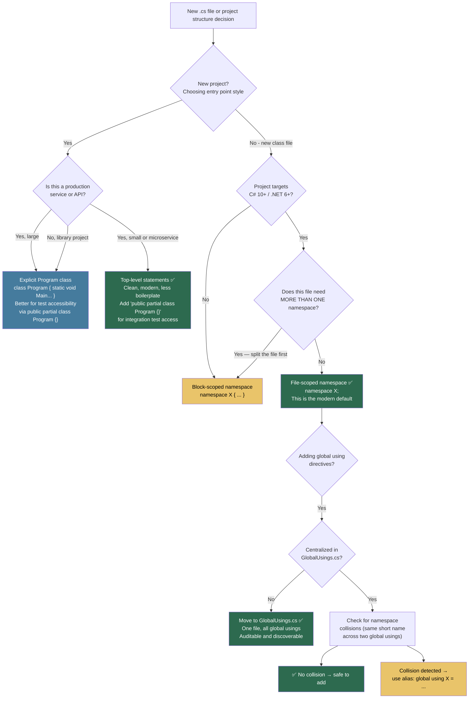

> [!success] Mastery Check
> - [x] **Studied Well** ✅ 2026-06-12
> - [x] **Can explain the concept without notes** ✅ 2026-06-12
> - [x] **Can answer interview questions confidently** ✅ 2026-06-12
> - [x] **Can implement it in a real project** ✅ 2026-06-12


## 📍 PART 0 — Navigation & Context

### Where This Topic Lives

```
C# Language Mastery
└── Level 1 — Foundations
    ├── 2.01  The .NET Platform: CLR, SDK, Runtimes
    ├── ► 2.02  C# Program Structure                ← YOU ARE HERE
    ├── 2.03  Data Types, Literals, and Conversions
    ├── 2.08  Classes (depends on namespaces)
    ├── 2.32  Attributes and Metadata
    └── 2.53  Native AOT, Trimming, and Publish-Time Constraints
```

### What You Need Before This

- [[2.01 — The .NET Platform: CLR, SDK, Runtimes, and the Compilation Pipeline]] — you need to know what an assembly is before you can understand what a .csproj produces
- Basic familiarity with files and directories on your OS
- A mental model that C# source files are inputs to a compiler, not executable scripts

### What This Unlocks After

- [[2.08 — Classes]] — class declarations live inside namespaces; Part 3's patterns are meaningless without this topic
- [[2.32 — Attributes and Metadata]] — `[assembly: ...]`-level attributes require understanding of compilation units and project files
- [[2.53 — Native AOT, Trimming, and Publish-Time Constraints]] — `PublishAot`, `PublishTrimmed`, and related .csproj properties build directly on the .csproj model established here
- Every other topic in this vault — namespace organization, conditional compilation, and project configuration underpin all production C# code

### Why This Matters to a Production Engineer

Getting namespace hierarchy, .csproj configuration, and conditional compilation right is a foundational decision that compounds over a service's lifetime — a poorly organized namespace hierarchy becomes the scaffolding for all future architectural drift, and an incorrectly configured .csproj silently breaks AOT, nullable analysis, and reproducible builds.

---

## 🧠 PART 1 — The Core Mental Model

### The Fundamental Rule

> **Namespaces apply a compile-time prefix to type names in metadata and have zero runtime existence. The .csproj is the authoritative build contract that determines what goes into the assembly and how it is compiled. The practical consequence is that `using System;` and fully qualifying `System.Console.WriteLine()` compile to identical IL — a using directive is pure convenience, not an import or loading mechanism.**

### The Plain-Language Analogy

Think of a namespace like a **postal address system for type names**. The type `Payment.Processing.PaymentGateway` is not a type inside a folder called `Payment/Processing/`. It is a type whose full name, as stored in the assembly's metadata, begins with the prefix `Payment.Processing.`. The street address tells you how to find the house; the namespace tells the compiler how to resolve the name. The house itself (the compiled type in the assembly) exists regardless of whether you spell out its full address or use a `using` directive as a shortcut.

The `.csproj` file is the **recipe card given to the build system**. MSBuild reads it to learn which `.cs` files to compile, which assemblies to reference, which .NET runtime to target, and dozens of other decisions. You never hand MSBuild a list of files verbally — the `.csproj` is the single source of truth for the build.

### The Full Taxonomy

```mermaid
graph TD
    A["C# Program Structure"] --> B["Project File\n.csproj"]
    A --> C["Source Files (.cs)"]
    A --> D["Compiled Output\nAssembly (.dll / .exe)"]

    B --> B1["&lt;TargetFramework&gt;\nnet8.0, net9.0, netstandard2.1"]
    B --> B2["&lt;Nullable&gt;enable\nProject-wide NRT setting"]
    B --> B3["&lt;ImplicitUsings&gt;enable\nAuto-inject global usings"]
    B --> B4["&lt;DefineConstants&gt;\nCustom preprocessor symbols"]
    B --> B5["&lt;ItemGroup&gt;\nPackageReference / ProjectReference"]
    B --> B6["&lt;PublishAot&gt; / &lt;PublishTrimmed&gt;\nAOT and trimmer flags"]

    C --> C1["Top-Level Statements\nC# 9+, one file per project"]
    C --> C2["Namespace Declarations"]
    C --> C3["Type Declarations\nclass / struct / interface / enum"]
    C --> C4["Using Directives"]
    C --> C5["Preprocessor Directives"]
    C --> C6["Assembly-Level Attributes\n[assembly: ...]"]

    C2 --> C2a["Block-Scoped\nnamespace X { ... }"]
    C2 --> C2b["File-Scoped (C# 10+)\nnamespace X;"]
    C2 --> C2c["Nested\nnamespace X { namespace Y { } }"]

    C4 --> C4a["Regular\nusing System;"]
    C4 --> C4b["Static\nusing static System.Console;"]
    C4 --> C4c["Alias\nusing IO = System.IO;"]
    C4 --> C4d["Global (C# 10+)\nglobal using ...;"]

    C5 --> C5a["Conditional\n#if / #elif / #else / #endif"]
    C5 --> C5b["Symbol Definition\n#define / #undef"]
    C5 --> C5c["Pragma\n#pragma warning disable/restore"]
    C5 --> C5d["Regions\n#region / #endregion"]
    C5 --> C5e["Nullable Override\n#nullable enable / disable"]
    C5 --> C5f["Line Mapping\n#line (for code generators)"]
    C5 --> C5g["Compiler Error / Warning\n#error / #warning"]

    style B fill:#1d3557,color:#fff
    style C fill:#2d6a4f,color:#fff
    style D fill:#6b4226,color:#fff
    style B1 fill:#457b9d,color:#fff
    style B2 fill:#457b9d,color:#fff
    style B3 fill:#457b9d,color:#fff
    style B4 fill:#457b9d,color:#fff
    style B5 fill:#457b9d,color:#fff
    style B6 fill:#457b9d,color:#fff
    style C1 fill:#40916c,color:#fff
    style C2 fill:#40916c,color:#fff
    style C3 fill:#40916c,color:#fff
    style C4 fill:#40916c,color:#fff
    style C5 fill:#40916c,color:#fff
    style C6 fill:#40916c,color:#fff
```



> [!NOTE] The N:M Relationship Between Namespaces and Assemblies A namespace can span multiple assemblies (`System.Collections.Generic` exists across `System.Runtime.dll` and `System.Collections.dll`). One assembly can contain multiple namespaces. **Namespace ≠ Assembly** is a fact that trips up engineers moving from Java.

---

## 🔬 PART 2 — Deep Mechanics

### 2.1 The .csproj → Assembly Pipeline

Understanding what the .csproj actually does is more valuable than memorizing its XML. Here is what happens at `dotnet build`:

```
━━━━━━━━━━━━━━━━━━━━━━━━━━━━━━━━━━━━━━━━━━━━━━━━━━━━━━━━━
BUILD PIPELINE: .csproj → Assembly
━━━━━━━━━━━━━━━━━━━━━━━━━━━━━━━━━━━━━━━━━━━━━━━━━━━━━━━━━

.csproj file
    │
    │  MSBuild reads project file
    │  Resolves all PackageReference / ProjectReference
    │  Determines which .cs files to include (default: all **)
    ▼
MSBuild invokes Roslyn compiler (csc)
  Inputs passed to Roslyn:
  ├── All .cs files in project (discovered by **/*.cs glob unless excluded)
  ├── /reference: — every referenced DLL
  ├── /define:  — DEBUG, RELEASE, and any <DefineConstants>
  ├── /nullable: — from <Nullable> project property
  ├── /langversion: — from <LangVersion> (default: latest)
  └── /target:library or /target:exe — from <OutputType>
    │
    ▼
Roslyn Compilation Pipeline:
  ┌─────────────────────────────────────────────────────┐
  │ 1. Preprocessor pass                                │
  │    #if/#define/#undef directives evaluated          │
  │    Excluded blocks removed from token stream        │
  │    (These do NOT exist in IL — never compiled)      │
  ├─────────────────────────────────────────────────────┤
  │ 2. Parsing (Syntax Analysis)                        │
  │    Tokens → Syntax Tree                             │
  │    using directives recorded as name resolution hints│
  ├─────────────────────────────────────────────────────┤
  │ 3. Semantic Analysis (Binding)                      │
  │    Types resolved using namespace + using hints     │
  │    'using System;' + 'Console' → System.Console     │
  │    using directives do NOT appear in output IL      │
  ├─────────────────────────────────────────────────────┤
  │ 4. Lowering (Code Generation)                       │
  │    async/await → state machines                     │
  │    Top-level statements → <Program>$ class          │
  │    Iterators → enumerator classes                   │
  ├─────────────────────────────────────────────────────┤
  │ 5. IL Emission                                      │
  │    Writes PE/CIL to bin/Debug/net8.0/MyApp.dll      │
  └─────────────────────────────────────────────────────┘
    │
    ▼
Output: MyApp.dll (or .exe for self-contained)
  ├── Assembly Manifest (metadata: name, version, culture, references)
  ├── Type Metadata   (all types with their FULL names: Namespace.TypeName)
  └── IL Code         (method bodies, devoid of using directives)

Cost: entire pipeline is compile-time. No component above runs at
      application startup. IL is already on disk before execution begins.
```

**Key .csproj properties every engineer must know:**

```xml
<Project Sdk="Microsoft.NET.Sdk">
  <PropertyGroup>
    <!-- What runtime this runs on. Always set this deliberately. -->
    <TargetFramework>net9.0</TargetFramework>

    <!-- Enable all C# nullable reference type warnings project-wide. -->
    <!-- If not set: annotations compile but no nullability warnings fire. -->
    <Nullable>enable</Nullable>

    <!-- Automatically inject 'global using' for common BCL namespaces. -->
    <!-- Makes: System, System.Collections.Generic, System.Linq etc. -->
    <!-- available in every file without explicit using directives.    -->
    <!-- Set to 'disable' for maximum explicitness in libraries.       -->
    <ImplicitUsings>enable</ImplicitUsings>

    <!-- 'Exe' for console apps / services with an entry point.       -->
    <!-- 'Library' for class libraries. 'WinExe' for WPF/WinForms.   -->
    <OutputType>Exe</OutputType>

    <!-- Extra symbols available to #if in all .cs files. -->
    <!-- TRACE and DEBUG are added automatically in Debug config.     -->
    <DefineConstants>PAYMENT_FEATURE_GATEWAY_V2</DefineConstants>
  </PropertyGroup>
</Project>
```

**Cost label:** All properties above affect _compile-time behavior only_. Zero runtime overhead.

---

### 2.2 Top-Level Statements: What the Compiler Generates

Top-level statements (C# 9+) are syntactic sugar. The compiler wraps them in a class. Knowing exactly what gets generated prevents surprises.

```csharp
// ── What you write (Program.cs) ──────────────────────────────────
using System;

Console.WriteLine("Order service starting...");
await RunServiceAsync();
Console.WriteLine("Done.");

async Task RunServiceAsync()
{
    await Task.Delay(100);
}
```

```
// ── What the compiler generates (approximately) ──────────────────

// Compiler-generated class name: <Program>$
// The $ makes this an invalid C# identifier → cannot collide with
// a user-defined type called Program.
// Marked [CompilerGenerated] and [global::System.Runtime.CompilerServices.NullableContext(1)]

[CompilerGenerated]
internal static class <Program>$
{
    // Synthesized entry point. Name is also compiler-internal.
    // The runtime locates it via the .entrypoint IL directive.
    private static async Task <Main>$(string[] args)
    {
        Console.WriteLine("Order service starting...");
        await RunServiceAsync();
        Console.WriteLine("Done.");

        // Local function — lifted into the generated class body
        async Task RunServiceAsync()
        {
            await Task.Delay(100);
        }
    }
}
```

**Constraints of top-level statements — non-negotiable:**

```
┌──────────────────────────────────────────────────────────────────┐
│ CONSTRAINT 1: One file per project                               │
│   Adding top-level statements to a second file → CS8802.         │
│   The compiler does not pick one for you.                        │
├──────────────────────────────────────────────────────────────────┤
│ CONSTRAINT 2: Must appear before any type declarations           │
│   Top-level code must come first in the file.                    │
│   You CAN declare types AFTER the top-level code in the same     │
│   file — they become part of the generated class's surrounding   │
│   namespace scope.                                               │
├──────────────────────────────────────────────────────────────────┤
│ CONSTRAINT 3: args is a pre-declared magic variable              │
│   string[] args is always in scope in top-level statement files. │
│   You do not declare it. Referencing it compiles fine.           │
├──────────────────────────────────────────────────────────────────┤
│ CONSTRAINT 4: The generated class is accessible                  │
│   Declare the file as partial class Program { } alongside your   │
│   top-level code for test projects to call WebApplication.Create │
│   (the standard ASP.NET Core test pattern).                      │
└──────────────────────────────────────────────────────────────────┘
```

**Cost label:** Generating the `<Program>$` wrapper is compile-time. At runtime, the synthesized entry point is identical in cost to a hand-written `static void Main(string[] args)`. Zero overhead.

---

### 2.3 Namespaces in Metadata: Just a Name Prefix

This is the single most important thing to understand about namespaces: they do not exist at runtime as objects, scope chains, or resolution registries. A namespace is part of a type's name — nothing more.

```
━━━━━━━━━━━━━━━━━━━━━━━━━━━━━━━━━━━━━━━━━━━━━━━━━━━━━━━━━
HOW NAMESPACES APPEAR IN THE ASSEMBLY (IL)
━━━━━━━━━━━━━━━━━━━━━━━━━━━━━━━━━━━━━━━━━━━━━━━━━━━━━━━━━

C# source:
  namespace Payment.Processing
  {
      public class PaymentGateway { }
  }

IL output (ildasm view):
  .class public auto ansi beforefieldinit
         Payment.Processing.PaymentGateway   ← The FULL name is the class name
         extends [System.Runtime]System.Object
  {
  }

There is NO IL namespace directive. There is NO namespace object.
The CLR type table stores the single string "Payment.Processing.PaymentGateway".

━━━━━━━━━━━━━━━━━━━━━━━━━━━━━━━━━━━━━━━━━━━━━━━━━━━━━━━━━
USING DIRECTIVE — COMPILE-TIME ONLY, ZERO IL OUTPUT
━━━━━━━━━━━━━━━━━━━━━━━━━━━━━━━━━━━━━━━━━━━━━━━━━━━━━━━━━

// Version A: with using directive
using Payment.Processing;
var gw = new PaymentGateway();

// Version B: fully qualified, no using directive
var gw = new Payment.Processing.PaymentGateway();

// IL generated for BOTH — IDENTICAL:
  newobj instance void Payment.Processing.PaymentGateway::.ctor()
  stloc.0

The using directive is resolved away during semantic analysis (step 3
of the pipeline). It does not appear in the binary. The two versions
above produce byte-for-byte identical IL.

━━━━━━━━━━━━━━━━━━━━━━━━━━━━━━━━━━━━━━━━━━━━━━━━━━━━━━━━━
NAMESPACE SPANNING MULTIPLE ASSEMBLIES (N:M REALITY)
━━━━━━━━━━━━━━━━━━━━━━━━━━━━━━━━━━━━━━━━━━━━━━━━━━━━━━━━━

Assembly A (Payment.Core.dll):
  Payment.Processing.PaymentGateway
  Payment.Processing.RefundProcessor

Assembly B (Payment.Reporting.dll):
  Payment.Processing.ReportGenerator   ← same namespace, different assembly!

Both assemblies INDEPENDENTLY contain types in the namespace
"Payment.Processing". There is no central namespace registry.
The compiler resolves to the right assembly via the /reference flags.
```

**Cost label:** Type resolution from `Type.GetType("Payment.Processing.PaymentGateway")` costs ~100 ns on cache hit (CLR type table lookup). Accessing a type normally (already-compiled code) is zero cost — the IL address is burned in at compile time.

---

### 2.4 The Preprocessor Pipeline: What Runs Before the Compiler

Preprocessor directives are handled in a pass that runs _before_ the C# compiler sees the source. This matters because it means:

- Preprocessor cannot access C# types or variables
- The C# compiler never receives excluded code — it is as if those lines do not exist
- There is no runtime check, no branch, no dead code — excluded blocks are physically absent from the IL

```csharp
// ── Preprocessor directives and what they do ──────────────────────

// #define / #undef — define or undefine symbols for THIS FILE ONLY
// (symbols set in .csproj <DefineConstants> apply project-wide)
#define PAYMENT_TRACING
#undef PAYMENT_TRACING    // This #undef wins over the #define above — #undef
                          // always takes effect at the point it appears.

// The preprocessor processes this before the compiler:
#if DEBUG
    Console.WriteLine("[DEBUG] Processing payment batch");
    // ↑ In Release builds, this line is ABSENT from IL.
    // It is not a branch that evaluates to false.
    // The CPU never sees this instruction.
#elif PAYMENT_FEATURE_GATEWAY_V2
    Console.WriteLine("[V2] Using new gateway");
#else
    Console.WriteLine("[V1] Using legacy gateway");
#endif

// #pragma warning — suppress specific compiler warnings
// Use sparingly; always include a reason comment.
#pragma warning disable CS8600 // Suppressing: Converting null literal to non-nullable string
string legacyConfigValue = GetLegacyConfig()!;
#pragma warning restore CS8600 // Restore immediately — never leave disabled globally

// #nullable — override the project-level nullable setting per-file
// Useful when gradually migrating a legacy codebase
#nullable enable
string? maybeNull = null;  // CS8600 would fire without the ? here
#nullable disable          // Back to project default

// #region / #endregion — pure IDE collapsing hint, zero semantic meaning
// Widely considered a code smell (regions hide complexity)
#region Legacy Payment Code (to be removed in Q3)
// ... old code ...
#endregion
```

```
━━━━━━━━━━━━━━━━━━━━━━━━━━━━━━━━━━━━━━━━━━━━━━━━━━━━━━━━━
WHAT SURVIVES EACH STAGE
━━━━━━━━━━━━━━━━━━━━━━━━━━━━━━━━━━━━━━━━━━━━━━━━━━━━━━━━━

Stage               What's present
─────────────────── ─────────────────────────────────────────────
Source .cs file     Everything: #if blocks, using directives,
                    comments, whitespace
─────────────────── ─────────────────────────────────────────────
After preprocessor  #if-excluded blocks removed. #define/#undef
                    consumed and gone. #pragma recorded.
                    using directives, comments still present.
─────────────────── ─────────────────────────────────────────────
After compilation   using directives resolved and gone. Comments
(IL / assembly)     gone. #pragma effects baked in (no warning
                    emitted). Only TYPE NAMES, IL OPCODES, and
                    METADATA remain.
─────────────────── ─────────────────────────────────────────────
At runtime          No namespaces. No using directives. No
                    preprocessor symbols. Only compiled methods,
                    type tables, and data.
```

> [!WARNING] `#define` Is File-Scoped, Not Project-Scoped A `#define PAYMENT_DEBUG` at the top of `PaymentProcessor.cs` does **not** define `PAYMENT_DEBUG` in `PaymentGateway.cs`. For project-wide symbols, use `<DefineConstants>` in the .csproj or a `GlobalUsings.cs` file with `#define` at the top. This is the most common preprocessor mistake in large codebases.

**Cost label:** Preprocessing is pure compile-time. `#if`-excluded code contributes zero bytes to the assembly, zero clock cycles at runtime, and zero GC load. This is why `#if DEBUG` assertions are strictly better than `if (isDebug)` runtime checks for cost-sensitive hot paths.

---

### 2.5 Partial Classes and Partial Methods: The Compiler Merge

The compiler merges `partial class` declarations from any number of files in the _same compilation unit_ (same project build). The result in IL is a single class — there is no partial anything at runtime.

```
━━━━━━━━━━━━━━━━━━━━━━━━━━━━━━━━━━━━━━━━━━━━━━━━━━━━━━━━━
PARTIAL CLASS MERGE: TWO FILES → ONE TYPE IN IL
━━━━━━━━━━━━━━━━━━━━━━━━━━━━━━━━━━━━━━━━━━━━━━━━━━━━━━━━━

File: OrderProcessor.cs (hand-written)      File: OrderProcessor.g.cs (generated)
────────────────────────────────            ───────────────────────────────────────
partial class OrderProcessor                partial class OrderProcessor
{                                           {
    public void ProcessOrder(...)               // EF scaffolding adds properties
    {                                           public int Id { get; set; }
        ValidateOrder(order);  // calls         public DateTime CreatedAt { get; set; }
        // partial method declared below    }
    }

    partial void ValidateOrder(Order o);   // No implementation here
}

COMPILER MERGES BOTH INTO:
────────────────────────────────────────────────────────────
IL class OrderProcessor
{
    public void ProcessOrder(...)
    {
        // ValidateOrder call: SEE PARTIAL METHOD RULES BELOW
    }
    public int Id { get; set; }
    public DateTime CreatedAt { get; set; }
    // ValidateOrder slot: ABSENT — silently erased (pre-C#9 rules)
}
```

**Partial method rules (two regimes — know both):**

```csharp
// ────────────────────────────────────────────────────────────
// PRE-C# 9 partial method rules (the restrictive old behavior):
// • Return type must be void
// • No out parameters
// • No accessibility modifier (implicitly private)
// • If no implementation: declaration AND all call sites are erased
// ────────────────────────────────────────────────────────────
partial class OrderProcessor
{
    // ✅ Pre-C# 9 partial method: no implementation = silently erased
    partial void OnOrderCreated(string orderId);

    public void Create(string orderId)
    {
        // If OnOrderCreated has no implementation, this line DISAPPEARS from IL.
        // No NullReferenceException. No call. The code is as if it was never written.
        OnOrderCreated(orderId);
    }
}

// ────────────────────────────────────────────────────────────
// C# 9+ partial method rules (extended — used by source generators):
// • Can have any return type
// • Can have out parameters
// • Can have accessibility modifiers
// • REQUIRES an implementation (no silent erasure)
// ────────────────────────────────────────────────────────────
partial class OrderProcessor
{
    // C# 9+: accessibility modifier → MUST be implemented
    public partial string FormatOrderId(int id);
}

// Implementation in another file:
partial class OrderProcessor
{
    public partial string FormatOrderId(int id) => $"ORD-{id:D8}";
}
```

**Cost label:** Partial class merge is compile-time. At runtime, a `partial class` across 4 files is identical to a single-file class. The merge produces exactly one CLR type entry in the assembly. Zero overhead.

---

## 💻 PART 3 — Production Code Patterns

### 3.1 The Domain Namespace Hierarchy

The most consequential structural decision in a new service. Get this right up front — renaming namespaces later breaks every using directive in the codebase.

```csharp
// ✅ CORRECT: Namespace hierarchy reflects business domain layers.
// Company.Product.Domain.Layer — the standard .NET convention.
// Benefits: namespaces communicate architecture, search is predictable,
//           and cross-team type collisions are avoided.

namespace Acme.OrderService.Domain.Entities
{
    // Core business objects — no infrastructure dependencies allowed here
    public class Order { /* ... */ }
    public class OrderLine { /* ... */ }
}

namespace Acme.OrderService.Domain.Repositories
{
    // Repository contracts (interfaces only — implementations are in Infrastructure)
    public interface IOrderRepository
    {
        Task<Order?> GetByIdAsync(Guid id, CancellationToken ct);
        Task SaveAsync(Order order, CancellationToken ct);
    }
}

namespace Acme.OrderService.Infrastructure.Persistence
{
    // EF Core implementation — depends on Domain, never the reverse
    public class EfOrderRepository : Domain.Repositories.IOrderRepository { /* ... */ }
}

namespace Acme.OrderService.Api.Controllers
{
    // HTTP entry points — depends on Domain (never directly on Infrastructure)
    [ApiController]
    public class OrdersController : ControllerBase { /* ... */ }
}

// ⚠️ WRONG: Flat namespaces that provide no structural information
namespace MyApp { }
namespace Data { }          // Which app? Which data?
namespace Utils { }         // The word "Utils" is a red flag namespace
namespace OrderServiceHelpers { } // "Helpers" signals missing domain concepts
```

### 3.2 The File-Scoped Namespace as the Production Default

Every new file in a .NET 6+ project should use file-scoped namespace. This is the official Microsoft style guideline and reduces horizontal noise across the entire codebase.

```csharp
// ⚠️ WRONG for modern code: block-scoped namespace adds a level of indentation
// to every single line in the file — pure visual noise.
namespace Acme.OrderService.Domain.Entities
{
    public class Order
    {
        public Guid Id { get; init; }
        // All content indented one extra level for no benefit
    }
}

// ✅ CORRECT: file-scoped namespace (C# 10+)
// • Removes the outer brace pair and one indentation level
// • Semantically identical — same IL output
// • Constraint: ONE namespace declaration per file (if you need two
//   namespaces in one file, you need block-scoped — but that's itself
//   a design smell; split the file instead)
namespace Acme.OrderService.Domain.Entities;

public class Order
{
    public Guid Id { get; init; }
    public string CustomerId { get; init; } = default!;
    public IReadOnlyList<OrderLine> Lines { get; init; } = [];
}
```

### 3.3 The Global Using Central Registry

Global usings should live in one file so they are discoverable and auditable. Do not scatter them.

```csharp
// ✅ CORRECT: Acme.OrderService.Api/GlobalUsings.cs
// One file, one purpose: declare all global usings for this project.
// Every .cs file in this project gets these implicitly.

// BCL types used everywhere
global using System.Text.Json;
global using System.Collections.Concurrent;

// ASP.NET Core — only add to the API project, not the domain library
global using Microsoft.AspNetCore.Mvc;
global using Microsoft.Extensions.Logging;

// Domain types used in every controller / handler
global using Acme.OrderService.Domain.Entities;
global using Acme.OrderService.Domain.Repositories;

// ⚠️ WRONG: scattering global usings in every .cs file
// // OrdersController.cs
// global using System.Text.Json;       ← unexpected here; hard to audit
// global using Acme.SomeOtherNamespace; ← adds to entire project silently
```

> [!TIP] Library Projects: Disable ImplicitUsings For NuGet packages and shared library projects, set `<ImplicitUsings>disable</ImplicitUsings>` in .csproj. Implicit usings add `global using System.Linq` and similar to every consumer's compilation — making your library a silent LINQ dependency even if consumers don't want it.

### 3.4 The Internal Test Seam

The single most production-relevant use of assembly-level attributes: granting test projects access to internal types without making them public.

```csharp
// ✅ CORRECT: In Acme.OrderService.Domain/AssemblyAttributes.cs
// Grants the test project access to all 'internal' members.
// This is idiomatic .NET — do not make things public just for tests.

// Must be in a file without a namespace declaration, or at the
// top of any file before namespace keyword (file-scoped namespaces
// must not appear before assembly-level attributes).
using System.Runtime.CompilerServices;

[assembly: InternalsVisibleTo("Acme.OrderService.Domain.Tests")]
// If the test assembly is strong-name signed, include the public key:
// [assembly: InternalsVisibleTo("Acme.OrderService.Domain.Tests, PublicKey=...")]

// ⚠️ COMMON MISTAKE: The assembly name must EXACTLY match the test project's
// <AssemblyName> property (or project file name by default).
// "Acme.OrderService.Tests" ≠ "Acme.OrderService.Domain.Tests"
// The attribute silently has no effect when the name is wrong.
// Verify with: dotnet build && ildasm MyAssembly.dll to check the attribute.
```

### 3.5 The Conditional Compilation Feature Gate

Use `#if` to ship code variations without runtime overhead. This is appropriate for: platform-specific code, debug instrumentation, and build-time feature flags that map to product configurations.

```csharp
// ✅ CORRECT: In .csproj, define the symbol per build configuration
// <PropertyGroup Condition="'$(Configuration)'=='Release'">
//   <DefineConstants>PAYMENT_GATEWAY_V2</DefineConstants>
// </PropertyGroup>

// In PaymentProcessor.cs:
namespace Acme.PaymentService.Processing;

public class PaymentProcessor
{
#if PAYMENT_GATEWAY_V2
    // This entire class section is absent from non-V2 builds.
    // Not a runtime branch — physically not in the assembly.
    private readonly GatewayV2Client _gateway;

    public PaymentProcessor(GatewayV2Client gateway) => _gateway = gateway;

    public async Task<PaymentResult> ProcessAsync(PaymentRequest request)
        => await _gateway.SubmitAsync(request);
#else
    private readonly LegacyGatewayClient _gateway;

    public PaymentProcessor(LegacyGatewayClient gateway) => _gateway = gateway;

    public async Task<PaymentResult> ProcessAsync(PaymentRequest request)
        => await _gateway.SubmitPaymentAsync(request);
#endif
}

// ⚠️ WRONG: Using a runtime bool flag for what should be a compile-time decision
// public bool UseGatewayV2 { get; set; } = true;
// if (UseGatewayV2) { ... } else { ... }
// This ships BOTH code paths in every build, allows accidental toggling at
// runtime, and cannot be reasoned about statically.
```

### 3.6 The Generated Code Partial Class Boundary

Source generators and scaffolding tools (EF Core, gRPC, OpenAPI) produce partial classes. The pattern for keeping generated code clean is a hard boundary: generated files are never manually edited; hand-written logic lives in a companion partial.

```csharp
// ── File: Order.g.cs (generated by EF Core scaffold — never edit) ──
// This file is regenerated on every scaffold run. Manual changes are lost.
namespace Acme.OrderService.Infrastructure.Persistence.Models;

public partial class OrderDbModel
{
    public int Id { get; set; }
    public string CustomerId { get; set; } = null!;
    public decimal TotalAmount { get; set; }
    public DateTime CreatedAtUtc { get; set; }
}

// ── File: Order.cs (hand-written companion — edit freely) ──────────
namespace Acme.OrderService.Infrastructure.Persistence.Models;

public partial class OrderDbModel
{
    // Business logic added here survives scaffold regeneration.
    // The partial class merge combines this with Order.g.cs at compile time.

    public bool IsHighValue => TotalAmount > 10_000m;

    public Domain.Entities.Order ToDomainOrder()
        => new()
        {
            Id = Guid.Parse(CustomerId),
            // ... mapping logic ...
        };
}
```

---

## ⚠️ PART 4 — Gotchas & Anti-Patterns

### Gotcha 1: `using` Does Not Load Code — It Just Resolves Names

Engineers moving from Python or Java assume `using` is like `import` — that it makes code "available" that was "unavailable" before. This leads to mysterious compile errors that look like missing packages but are actually missing assembly references.

```csharp
// ⚠️ WRONG mental model:
// "I need using Newtonsoft.Json to use JsonConvert"
// → This confuses the using directive (name resolution hint)
//   with the assembly reference (what puts the DLL on the compiler's path).

// Scenario: Newtonsoft.Json package is NOT in the .csproj.
using Newtonsoft.Json;                       // Adding this...
var result = JsonConvert.DeserializeObject(json); // Still fails with
                                                   // CS0246: type not found

// ✅ CORRECT: The fix is adding the package reference, not the using directive.
// In .csproj:
// <PackageReference Include="Newtonsoft.Json" Version="13.0.3" />
//
// Now both compile:
var resultA = JsonConvert.DeserializeObject(json);                          // with using
var resultB = Newtonsoft.Json.JsonConvert.DeserializeObject(json);          // without using

// WHY: The using directive is consumed entirely during semantic analysis.
// The assembly DLL being on the /reference list is what makes types available.
// A using directive without the assembly reference changes nothing.
```

### Gotcha 2: Top-Level Statements Cannot Appear in Two Files

Developers scaffolding microservices sometimes extract initialization code into a second "startup helper" file using top-level style. This is a compile error, not a runtime error.

```csharp
// ⚠️ WRONG: Two files with top-level statements
// Program.cs
Console.WriteLine("Starting order service...");
var builder = WebApplication.CreateBuilder(args);

// Startup.cs (trying to add more startup code here)
builder.Services.AddControllers();  // CS8802: Only one compilation unit
                                    // can have top-level statements.

// ✅ CORRECT: All top-level code stays in one file.
// Move initialization into methods in a separate static class if it gets large.

// Program.cs (the ONLY file with top-level code)
Console.WriteLine("Starting order service...");
var builder = WebApplication.CreateBuilder(args);
ServiceRegistration.Configure(builder.Services);    // extract to a method
var app = builder.Build();
app.Run();

// ServiceRegistration.cs (normal class, no top-level statements)
namespace Acme.OrderService.Api;

internal static class ServiceRegistration
{
    public static void Configure(IServiceCollection services)
    {
        services.AddControllers();
        services.AddHealthChecks();
        // ...
    }
}
```

### Gotcha 3: Namespace Does Not Have to Match Folder — But Must in Practice

The C# compiler does not require the namespace to match the folder path. This produces silent confusion, not a build error, making it worse than a compile-time mistake.

```csharp
// ⚠️ WRONG: File is at src/Domain/Entities/Order.cs
// but has the wrong namespace (Visual Studio auto-fix or copy-paste fault)
namespace Acme.OrderService.Infrastructure.Persistence;  // ← wrong layer!

public class Order { }

// Every consumer that does:
//   using Acme.OrderService.Domain.Entities;
// will NOT find Order here. They must use
//   using Acme.OrderService.Infrastructure.Persistence;
// which violates the layered architecture completely.
// The build succeeds. The architectural violation is invisible until review.

// ✅ CORRECT: Namespace matches folder hierarchy exactly.
// File: src/Domain/Entities/Order.cs
namespace Acme.OrderService.Domain.Entities;

public class Order { }

// WHY: Enable the Roslyn analyzer IDE0130 (Namespace does not match folder structure)
// in your .editorconfig to turn this into a build warning:
// [*.cs]
// dotnet_diagnostic.IDE0130.severity = warning
```

### Gotcha 4: `global using` Ambiguity Kills the Entire Project

Adding two global using directives that both expose a type with the same short name makes that name unresolvable in every single file in the project. This produces an error in files that don't even reference the conflicting type.

```csharp
// ⚠️ WRONG: Both namespaces expose 'JsonSerializer'
// GlobalUsings.cs
global using System.Text.Json;      // Has JsonSerializer
global using Newtonsoft.Json;       // Also has JsonSerializer (as JsonConvert actually,
                                    // but this example holds for types that DO collide)

// AnyOtherFile.cs — engineer didn't even write JsonSerializer here
// Compiler error: CS0104 'JsonSerializer' is an ambiguous reference between
// 'System.Text.Json.JsonSerializer' and 'Newtonsoft.Json.JsonSerializer'
// This error fires in EVERY file that uses JsonSerializer, not just GlobalUsings.cs.

// ✅ CORRECT: Use an alias to disambiguate, or remove one global using
global using System.Text.Json;
global using NJson = Newtonsoft.Json;  // Alias prevents ambiguity

// In any file:
var result1 = JsonSerializer.Deserialize<Order>(json);         // System.Text.Json
var result2 = NJson.JsonConvert.DeserializeObject<Order>(json); // Newtonsoft via alias

// WHY: global using directives inject name resolution into every compilation unit.
// A collision at global scope is a collision everywhere, with no local fix possible.
```

### Gotcha 5: Pre-C# 9 Partial Methods Disappear Silently — Including the Call Site

This is the gotcha that causes hours of debugging. You add a partial method for extensibility, call it, compile successfully — and then discover at runtime that the method never ran. No exception, no warning, just silent nothing.

```csharp
// ⚠️ WRONG: Expecting the partial method to throw or log when unimplemented
namespace Acme.OrderService.Domain;

public partial class OrderProcessor
{
    public void Create(Order order)
    {
        // This looks like it should validate the order.
        // Under pre-C# 9 rules with no implementation, it silently does nothing.
        OnOrderValidating(order);
        SaveOrder(order);
    }

    // Pre-C# 9 partial method: void, private (implicit), no out params
    partial void OnOrderValidating(Order order);
}

// If there is no implementation file declaring:
//   partial void OnOrderValidating(Order order) { ... }
// then the compiler REMOVES the call to OnOrderValidating from Create()'s IL.
// The order is saved without validation. No warning. No error. Silent skip.

// ✅ CORRECT: For required extensibility points, use abstract methods, virtual
// methods, or C# 9+ extended partial methods which require an implementation.

public partial class OrderProcessor
{
    // C# 9+: add public/internal modifier → MUST have implementation
    // Compiler error if no implementation exists — fail-fast at build time.
    public partial void OnOrderValidating(Order order);
}

// WHY: Pre-C# 9 partial methods were designed for OPTIONAL extensibility points
// in source-generated code (like EF scaffold hooks). Treating them as
// required contracts is the misuse that causes the silent skip.
```

---

## 📊 PART 5 — Performance Implications

### 5.1 Allocation Characteristics Table

|Scenario|Allocation Behavior|Approx Cost|
|---|---|---|
|`using` directive resolution at compile|Zero runtime allocation — eliminated in semantic analysis|0 at runtime|
|Namespace declaration in source|Zero runtime allocation — type name only in metadata|0 at runtime|
|`file-scoped namespace` vs block namespace|Identical IL — zero difference|0|
|Top-level statements entry method|Identical IL to explicit `static Main`|0|
|`global using` directive|Zero runtime allocation — compile-time only|0 at runtime|
|`partial class` with 3 source files|One CLR type at runtime — no partial anything|0 overhead|
|`#if`-excluded code block|Absent from assembly — not a branch, not dead code|0|
|`[assembly: InternalsVisibleTo]` check|Checked by compiler only — zero runtime cost|0 at runtime|
|`Type.GetType("Full.Namespace.TypeName")`|CLR type table lookup — cached after first call|~100 ns cached, ~1 µs first call|
|Reading `[assembly: ...]` via `GetCustomAttributes()`|Heap allocation per call — attribute object constructed lazily|~500 bytes/call, ~2–5 µs|
|Implicit usings (`<ImplicitUsings>enable`)|Zero runtime cost — injected at compile time as global usings|0 at runtime|

### 5.2 BenchmarkDotNet: Namespace Resolution vs Reflection

This benchmark demonstrates the key performance insight: namespace/using-based type access has zero runtime overhead, while reflection-based type lookup by string name does allocate and costs measurable time.

```csharp
// Expected output (approximate, .NET 9, x64, Release):
// ┌──────────────────────────────┬──────────┬──────────┬──────────┐
// │ Method                       │ Mean     │ Allocated│ Gen0     │
// ├──────────────────────────────┼──────────┼──────────┼──────────┤
// │ DirectInstantiation          │  2.1 ns  │  24 B    │  0.0002  │
// │ FullyQualifiedInstantiation  │  2.1 ns  │  24 B    │  0.0002  │
// │ TypeGetType_Cached           │ 98.4 ns  │    0 B   │  -       │
// │ GetCustomAttribute_Assembly  │ 4,120 ns │ 496 B    │  0.0381  │
// └──────────────────────────────┴──────────┴──────────┴──────────┘

[MemoryDiagnoser]
[BenchmarkCategory("ProgramStructure")]
public class NamespaceResolutionBenchmarks
{
    // Pre-resolved type for the cached lookup benchmark
    private static readonly Type _orderType = typeof(Order);

    [Benchmark(Baseline = true)]
    public Order DirectInstantiation()
    {
        // 'using Acme.OrderService.Domain.Entities;' resolves at compile time.
        // Identical IL to the next benchmark. No difference whatsoever.
        return new Order { Id = Guid.NewGuid() };
    }

    [Benchmark]
    public Order FullyQualifiedInstantiation()
    {
        // No using directive — fully qualified name.
        // Produces IDENTICAL IL to the baseline. Same perf.
        return new Acme.OrderService.Domain.Entities.Order { Id = Guid.NewGuid() };
    }

    [Benchmark]
    public Type? TypeGetType_Cached()
    {
        // Type.GetType with the full CLR type name.
        // After first call, the result is cached by the CLR type system.
        // Still ~100 ns — not free, but deterministic.
        return Type.GetType("Acme.OrderService.Domain.Entities.Order, Acme.OrderService.Domain");
    }

    [Benchmark]
    public Attribute? GetCustomAttribute_Assembly()
    {
        // Reading an assembly attribute via reflection allocates.
        // Each call constructs a new attribute object.
        // NEVER call this in a hot path.
        var asm = typeof(Order).Assembly;
        return asm.GetCustomAttribute<AssemblyVersionAttribute>();
    }
}
```

### 5.3 When to Care / When to Ignore

**When this costs you:**

- Using `Type.GetType("Full.Namespace.TypeName")` in a hot path (e.g., per-request deserialization type lookup in a serializer) — costs ~100 ns cached, ~1 µs first call, and cache misses on string mismatches
- Calling `Assembly.GetCustomAttributes()` per-request instead of caching at startup — allocates ~500 bytes each time and costs ~2–5 µs
- Leaving `<ImplicitUsings>enable</ImplicitUsings>` in a library that gets consumed by many projects — adds implicit `global using System.Linq` and others, which may introduce undesired dependencies into consumers

**When this doesn't matter:**

- The choice between block-scoped and file-scoped namespace — identical IL, purely a source formatting decision
- How many `using` directives are in a file — they disappear before the compiler emits IL
- Top-level statements vs explicit `Program.Main` — same generated code, same startup cost
- The depth of namespace nesting — `A.B.C.D.E.Type` is the same cost as `A.Type` — it's one string in metadata

---

## 🎤 PART 6 — Interview Arsenal

### 6.1 The Question Bank

---

**Q: "What is the difference between a namespace and an assembly in .NET?"**

**Average answer:** "A namespace organizes types, an assembly is a compiled DLL."

**Why that's insufficient:** It doesn't address the N:M relationship, which is the actually interesting part, or what happens when two assemblies share a namespace.

**Great answer:**

> "They're orthogonal concepts with an N:M relationship — one namespace can span multiple assemblies, and one assembly can contain multiple namespaces. The `System.Collections.Generic` namespace, for example, is spread across `System.Runtime.dll` and `System.Collections.dll`. The compiler resolves which assembly contains a type by scanning the referenced DLLs on the `/reference` list, not by inferring from the namespace name. A namespace is a compile-time prefix that becomes part of the type's full name in metadata. An assembly is the physical deployment and versioning unit. In production, you reference assemblies explicitly in your .csproj — the namespace hierarchy is a naming convention that has no runtime enforcement."

---

**Q: "What does a `using` directive actually do at the compiler level?"**

**Average answer:** "It lets you use types without writing the full namespace."

**Why that's insufficient:** It correctly describes the effect but not the mechanism, missing the 'zero runtime cost' and 'no import' aspects that distinguish it from Python/Java.

**Great answer:**

> "A using directive is consumed entirely during Roslyn's semantic analysis pass — it never reaches the IL emitter. When I write `using System.Text.Json;` and then use `JsonSerializer`, the compiler resolves `JsonSerializer` to `System.Text.Json.JsonSerializer` using the using directive as a hint, then emits the fully-qualified name in IL. If I write the fully-qualified name directly without the using directive, the emitted IL is byte-for-byte identical. The using directive is not an import, not a loading mechanism — the type must already be available via an assembly reference in the .csproj. I can demonstrate this: adding `using Newtonsoft.Json;` without the NuGet `PackageReference` still gives me a compile error. The package reference is what makes the types available; the using directive just saves me typing."

---

**Q: "What is a file-scoped namespace and when would you NOT use it?"**

**Average answer:** "It's a C# 10 feature that removes the braces. You use it to reduce indentation."

**Why that's insufficient:** Doesn't explain the constraint (one per file) or the legitimate exception case.

**Great answer:**

> "File-scoped namespace is C# 10 syntax that declares the namespace for the entire file with `namespace X;` at the top, removing the outer brace pair and one level of indentation. The IL output is identical to a block-scoped namespace declaration. The constraint is that you can only have one namespace per file — if you use file-scoped syntax, the whole file belongs to that namespace. In practice, I'd use block-scoped in the rare case where a file legitimately contains types from two different namespaces, which is usually itself a design smell. For all new code in .NET 6+, file-scoped is the Microsoft style guideline and reduces cognitive overhead across the codebase. The only place I keep block-scoped is files with `[assembly: ...]` attributes, since those must appear before any namespace declaration and the interaction with file-scoped syntax can be confusing for the reader."

---

**Q: "What does the compiler generate for a top-level statements program?"**

**Average answer:** "It wraps everything in a Main method automatically."

**Why that's insufficient:** Misses the generated class name (`<Program>$`), the constraint about one file, and the `args` magic variable.

**Great answer:**

> "The compiler generates a class named `<Program>$` — with a dollar sign that makes it an invalid C# identifier, preventing collision with a user-defined `Program` type — and a static entry-point method inside it. In .NET 6+, if the top-level code uses `await`, the entry point is synthesized as `async Task <Main>$(string[] args)`, otherwise it's synchronous. One important consequence: the `args` variable is always in scope in the top-level file without declaring it — it's the compiler's synthesized parameter. Another is that top-level statements can only appear in exactly one file per project; adding them to a second file is a CS8802 compile error. The generated class is a `[CompilerGenerated]` sealed class, which means if you need test projects to call `WebApplication.CreateBuilder(args)` on your app entry point, the common pattern is to declare `public partial class Program { }` alongside your top-level code — the compiler will merge them into one accessible type."

---

### 6.2 Trick Questions

> [!WARNING] These Sound Simple But Have Non-Obvious Answers

**"Is a namespace a runtime concept?"** Trap: thinking "yes" because you can call `Type.Namespace` at runtime. Correct: The namespace string is stored as part of the type's full name in assembly metadata. At runtime you can _read_ it via reflection. But there is no namespace object, no scope chain, no resolution registry. It's a string prefix. Calling `Type.Namespace` just parses the dot-separated prefix off the type's full name string.

**"Can two assemblies define types in the same namespace?"** Trap: thinking "no" because namespaces feel like they should belong to one place. Correct: Yes. `System.Collections.Generic` spans multiple assemblies in the BCL. So does every `Microsoft.*` or `Azure.*` namespace. The compiler figures out which assembly contains which type from the `/reference` list, not from the namespace structure.

**"Does changing from block-scoped to file-scoped namespace affect performance?"** Trap: thinking "yes" because the syntax looks different. Correct: Zero effect. The emitted IL is identical. File-scoped namespace is a source-level convenience that the compiler normalizes before IL emission.

**"Can a partial class span two assemblies?"** Trap: thinking "yes" because partial is about logical separation of files. Correct: No. All parts of a partial class must be in the same compilation unit (same build, same assembly). The compiler merges partial declarations before emitting the type. Cross-assembly partial is not a CLR concept — the type exists in one assembly.

**"What happens if you `#undef` a symbol that was set in the .csproj `<DefineConstants>`?"** Trap: thinking `<DefineConstants>` symbols are immutable. Correct: `#undef` in a file overrides the project-level symbol for that file only. The symbol is undefined from the point of `#undef` to the end of the file. Other files in the project are unaffected.

---

### 6.3 Red Flags to Avoid

```
❌ "using System brings in the System DLL" 
   → using directives don't load or reference assemblies; 
     that's what PackageReference does.

❌ "namespaces determine where types are stored physically"
   → namespaces have no relationship to file/folder layout at the compiler level.
     Conventions exist; enforcement doesn't.

❌ "top-level statements remove the need for a class entirely"
   → They generate a <Program>$ class. There's always a class. It's synthesized.

❌ "I can add #define anywhere in the file to affect code above it"
   → #define applies from the point of definition downward. Lines above #define
     are processed without the symbol. Preprocessing is sequential.

❌ "partial class means the class is split across assemblies"
   → Partial class requires all parts in the same compilation (same assembly).
     It's a source-organization tool, not a cross-assembly mechanism.

❌ "file-scoped namespace is faster because less code"
   → Identical IL. The choice is purely about source readability.

❌ "using static System.Console brings Console's instance into scope"
   → using static makes static MEMBERS directly accessible (WriteLine, ReadLine),
     not the Console type itself. The type is still Console.
```

---

## 🔀 PART 7 — Decision Framework



---

## ✅ PART 8 — Self-Check

### Conceptual Questions

Answer these in writing. Cover both "what" and "why."

1. You add `using System.Text.Json;` to a file but get CS0246 ("type or namespace 'JsonSerializer' not found"). The package is installed. What two things should you check, and why would the using directive alone be insufficient?
    
2. Explain in one sentence why `using System.Linq;` and `using System.Collections.Generic;` compile to the same IL as their absence when the types are fully qualified. What does that tell you about what a using directive "is"?
    
3. A colleague says "file-scoped namespace is faster to compile because the parser sees less code." Is this true or false? What is the actual difference between file-scoped and block-scoped namespace in the emitted assembly?
    
4. You have `global using System.Text.Json;` in GlobalUsings.cs. A junior developer opens OrderController.cs, sees no using directives for `JsonSerializer`, and adds `using System.Text.Json;` at the top thinking it's missing. What happens? Does it compile? Does it cause any problem?
    
5. You have a partial method `partial void OnPaymentApproved(Payment p)` declared but not implemented. Your `ProcessPayment` method calls it. The build succeeds. You run the code and the method is never called. Explain the C# version rules that determine whether this is a silent erase or a compile error.
    
6. A microservice has its entry point in `Program.cs` using top-level statements. An integration test project needs to call `WebApplication.CreateBuilder(args)` in the service's `Program.cs`. The test project cannot find a `Program` type. What is the fix, and why does it work?
    
7. You define `#define FEATURE_X` in `PaymentProcessor.cs` and use `#if FEATURE_X` in the same file. A colleague asks why their `InvoiceProcessor.cs` doesn't see `FEATURE_X`. Explain precisely why, and describe two ways to make it project-wide.
    
8. What is the CLR full type name for a class `Gateway` declared in `namespace Acme.Payments.Infrastructure.V2`? How is that name stored in the assembly manifest, and how would `Type.GetType(...)` need to refer to it?
    
9. Two engineers debate: one says `using static System.Math` lets you write `Sqrt(4)` anywhere in the file; the other says it brings the `Math` type itself into scope so you can write `Math.Sqrt(4)` without `System.`. Who is right, and what is the precise rule for `using static`?
    
10. You have `[assembly: InternalsVisibleTo("Acme.OrderService.Tests")]` in your domain project. The test project's assembly name (as set in its .csproj `<AssemblyName>`) is `Acme.OrderService.Domain.Tests`. Does the internal access work? Why or why not?
    

---

### Code Puzzles

**Puzzle 1:** Does this compile? What, if anything, is printed?

```csharp
// File 1: Program.cs
Console.WriteLine("Service starting");
var processor = new OrderProcessor();
processor.Run();

// File 2: OrderProcessor.cs
class OrderProcessor
{
    public void Run() => Console.WriteLine("Processing orders");
}
```

<details> <summary>Answer (expand after trying)</summary>

**Compiles and runs correctly.** Top-level statements only need to be in one file — `Program.cs`. Other files can freely declare types at the global (no-namespace) scope without top-level code. The `OrderProcessor` class is in the implicit global namespace, visible to the top-level code. Output: "Service starting" then "Processing orders".

Note: if `OrderProcessor.cs` also had a line like `Console.WriteLine("hello")` at the top level (outside a class/method), that would be CS8802.

</details>

---

**Puzzle 2:** What does `Type.Namespace` return for this type?

```csharp
namespace Acme.OrderService.Domain.Entities;

public class Order { }

// Somewhere else:
var t = typeof(Order);
Console.WriteLine(t.Namespace);
Console.WriteLine(t.Name);
Console.WriteLine(t.FullName);
```

<details> <summary>Answer (expand after trying)</summary>

```
t.Namespace  → "Acme.OrderService.Domain.Entities"
t.Name       → "Order"
t.FullName   → "Acme.OrderService.Domain.Entities.Order"
```

This illustrates that `FullName` is exactly what the CLR stores in the type table — `Namespace + "." + Name`. There is no namespace object; `Namespace` is derived by trimming the last dot-segment from `FullName`.

</details>

---

**Puzzle 3:** What is printed? Is there a bug?

```csharp
#define PAYMENT_TRACING

void ProcessPayment(decimal amount)
{
#if PAYMENT_TRACING
    Console.WriteLine($"[TRACE] Processing: {amount:C}");
#endif
    Console.WriteLine($"Charging: {amount:C}");
}

#undef PAYMENT_TRACING

void LogAudit(decimal amount)
{
#if PAYMENT_TRACING
    Console.WriteLine($"[AUDIT] {amount:C}"); // Is this reached?
#endif
}

ProcessPayment(99.99m);
LogAudit(99.99m);
```

<details> <summary>Answer (expand after trying)</summary>

Output:

```
[TRACE] Processing: $99.99
Charging: $99.99
```

The `[AUDIT]` line is **not** printed. `#undef PAYMENT_TRACING` appears before `LogAudit`, so when the preprocessor evaluates `#if PAYMENT_TRACING` inside `LogAudit`, the symbol is already undefined. The `#undef` applies from that line downward. The preprocessor processes the file top-to-bottom sequentially. This is a real production gotcha when `#define` and `#undef` are in distant parts of a file.

</details>

---

**Puzzle 4:** Does this compile? If not, why? If so, what does `value` equal?

```csharp
// GlobalUsings.cs
global using MyLib.Serialization;
global using System.Text.Json;

// ApiController.cs
public class OrderController
{
    public string Serialize(Order order)
    {
        // Both MyLib.Serialization and System.Text.Json have a class named JsonSerializer
        return JsonSerializer.Serialize(order);
    }
}
```

<details> <summary>Answer (expand after trying)</summary>

**Does NOT compile.** CS0104: `'JsonSerializer' is an ambiguous reference between 'System.Text.Json.JsonSerializer' and 'MyLib.Serialization.JsonSerializer'`.

This error fires in `ApiController.cs` (and in every other file in the project that uses `JsonSerializer`), even though the ambiguous global usings are declared in `GlobalUsings.cs`.

Fix: use a global alias — `global using STJ = System.Text.Json;` — or remove one of the conflicting global usings. This demonstrates the "blast radius" of global using conflicts: one declaration in one file breaks resolution in all files.

</details>

---

**Puzzle 5:** There are two partial method declarations here. Which one will silently erase its call site, and which one will produce a compile error if unimplemented?

```csharp
// Part A
public partial class PaymentProcessor
{
    partial void OnPaymentStarted(string paymentId);  // declaration A
    public partial string GenerateReference(int seq); // declaration B
}

// Part B — ONLY this implementation file exists:
public partial class PaymentProcessor
{
    public void Process(string id, int seq)
    {
        OnPaymentStarted(id);             // Call site 1
        var r = GenerateReference(seq);   // Call site 2
        Console.WriteLine(r);
    }
}
```

<details> <summary>Answer (expand after trying)</summary>

- **Declaration A** (`partial void OnPaymentStarted`) follows pre-C# 9 rules: `void` return, no access modifier (implicitly private). With no implementation, the compiler silently erases the declaration AND the call site in `Process()`. The compiled `Process` method has no call to `OnPaymentStarted`. No warning, no error.
    
- **Declaration B** (`public partial string GenerateReference`) has an access modifier (`public`) and a non-void return type — C# 9+ extended partial method rules apply. These **require** an implementation. Since none is provided, this produces **CS8795: Partial method 'PaymentProcessor.GenerateReference(int)' must have an implementation part because it has accessibility modifiers.** Build fails.
    

This is the diagnostic tool: if you want the compiler to enforce that a partial method gets implemented, add an access modifier. If you want optional extensibility hooks (like EF scaffolding), omit it and use pre-C# 9 style.

</details>

---

## 🔗 PART 9 — Connections & Resources

### Related Topics in This Vault

|Topic|Why It Connects|
|---|---|
|[[2.01 — The .NET Platform: CLR, SDK, Runtimes, and the Compilation Pipeline]]|The .csproj / Roslyn / IL pipeline described in Part 2 is a direct extension of the CLR compilation model explained in 2.01|
|[[2.08 — Classes: Fields, Constructors, Static Members, and Object Initialization]]|Class declarations live inside namespaces; the partial class pattern in Part 3.6 requires class mechanics from 2.08|
|[[2.32 — Attributes and Metadata]]|`[assembly: InternalsVisibleTo]` and `[assembly: AssemblyVersion]` are assembly-level attributes; reading them via reflection invokes the attribute model described in 2.32|
|[[2.53 — Native AOT, Trimming, and Publish-Time Constraints]]|`<PublishAot>`, `<PublishTrimmed>`, and `[DynamicallyAccessedMembers]` are all .csproj and source-level decisions that build directly on the project-file model here|
|[[2.17 — Generics: Constraints, Reification, and the Type System]]|Generic type full names include the backtick arity suffix (`List\`1`) — a quirk of the CLR type naming convention established in this topic|
|[[2.52 — Source Generators]]|Source generators read attributes at compile time and produce partial classes — both mechanisms are direct extensions of the project file and partial class concepts here|

### Books

|Book|Chapters|Why These Chapters|
|---|---|---|
|CLR via C# — Jeffrey Richter|Ch. 2, 3|Ch. 2 covers assemblies, modules, and types; Ch. 3 covers how types are shared across assemblies — the definitive source on the assembly/namespace relationship|
|C# in Depth — Jon Skeet|Ch. 1, 2|Covers the evolution of C# program structure from 1.0 through top-level statements; explains compiler transformations at the right depth|
|Pro .NET 5 Custom Libraries — Roger Villela|Ch. 1|.csproj SDK-style format, NuGet, and project references in production library design|

### Articles & Docs

- [Microsoft Docs: Namespaces (C# Programming Guide)](https://learn.microsoft.com/en-us/dotnet/csharp/fundamentals/types/namespaces) — authoritative reference
- [Microsoft Docs: Top-Level Statements](https://learn.microsoft.com/en-us/dotnet/csharp/fundamentals/program-structure/top-level-statements) — including generated class semantics
- [Microsoft Docs: Preprocessor Directives](https://learn.microsoft.com/en-us/dotnet/csharp/language-reference/preprocessor-directives) — full directive reference
- [Microsoft .NET SDK project file reference](https://learn.microsoft.com/en-us/dotnet/core/project-sdk/msbuild-props) — authoritative .csproj property list
- [Roslyn: File-Scoped Namespaces Design Doc](https://github.com/dotnet/csharplang/blob/main/proposals/csharp-10.0/file-scoped-namespaces.md) — the language design rationale (GitHub, official csharplang repo)

---

> [!NOTE] Template Meta-Note **This file follows the 9-part C# Language Mastery template.** Each part serves a distinct purpose:
> 
> - Part 0: Navigation — orients you before reading a line of content
> - Part 1: Core Mental Model — the one-sentence anchor, analogy, and full taxonomy
> - Part 2: Deep Mechanics — what the compiler and runtime actually do (not just spec behavior)
> - Part 3: Production Code — annotated, opinionated, real-domain patterns you can copy-paste
> - Part 4: Gotchas — five production bugs with wrong → right → why explanations
> - Part 5: Performance — allocation table, runnable BenchmarkDotNet class, when-to-care guide
> - Part 6: Interview Arsenal — full Q&A with great answers, trick questions, and red flags
> - Part 7: Decision Framework — a flowchart cheat sheet for live interviews
> - Part 8: Self-Check — questions and code puzzles that require reasoning, not memorization
> - Part 9: Connections — wiki links, books, and authoritative articles
> 
> To generate the next topic, copy the master prompt from `_main.md` and fill in the next topic from `_phonebook.md`.

---

_Last updated: 2026-06 · Domain: C# Language Mastery · Topic: 2.02_
