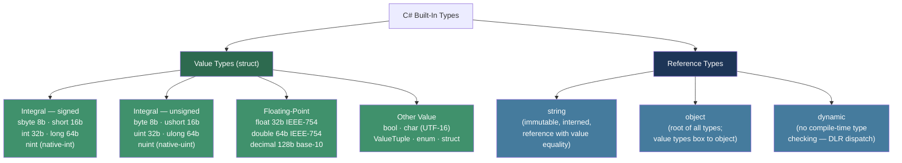
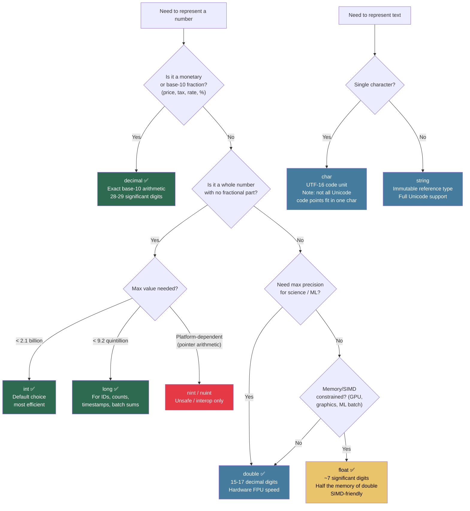

> [!success] Mastery Check
> - [x] **Studied Well** ✅ 2026-06-12
> - [x] **Can explain the concept without notes** ✅ 2026-06-12
> - [x] **Can answer interview questions confidently** ✅ 2026-06-12
> - [x] **Can implement it in a real project** ✅ 2026-06-12


## 📍 PART 0 — Navigation & Context

### Where This Topic Lives

```
C# Type System
└── Primitive Types & Representation
    ├── ► Data Types, Literals, and Type Conversions  ← YOU ARE HERE
    ├──   Operators (2.05)             — works on typed values; promotion rules depend on this
    ├──   Enums and Structs (2.12)     — user-defined value types built on these primitives
    ├──   Value vs Reference Types (2.16) — the deep mechanics of WHY these categories exist
    └──   Tuples and Deconstruction (2.27) — composite types assembled from primitives
```

### What You Need Before This

- Basic familiarity with variables and assignment in any language
- Understanding of binary representation (at least: "a computer stores numbers as bits")
- What a method signature looks like in C#

### What This Unlocks After

- Operator rules and numeric promotion (2.05) — you cannot reason about `1 / 2` vs `1.0 / 2` without this
- Enum design (2.12) — enum underlying types and casting are direct applications of this
- Deep value-type mechanics (2.16) — struct layout, boxing, and GC cost all start from knowing types
- Performance work — you cannot eliminate avoidable allocations without knowing which types allocate

### Why This Topic Matters at Scale

In a payment processing service handling millions of transactions, choosing `float` instead of `decimal` silently accumulates rounding error until money is lost; understanding conversion rules is how you stop that bug before it ships.

---

## 🧠 PART 1 — The Core Mental Model

### The Fundamental Rule

> **Every C# expression has a compile-time type, and the compiler uses that type to determine which operations are legal, which conversions are implicit, and what the runtime cost is. Choosing the wrong numeric type is not a style decision — it is a correctness and performance decision.**

### The Plain-Language Analogy

Think of C#'s numeric types as containers of different physical sizes — a teaspoon, a tablespoon, a cup, a gallon jug. Widening (implicit) conversion is like pouring a teaspoon into a cup: the value fits with no spilling. Narrowing (explicit cast) is like pouring a cup into a teaspoon: the compiler makes you deliberately tip it yourself, and if you overfill it, the excess is silently discarded unless you're in a `checked` block. The `decimal` type is not just a bigger container — it's a fundamentally different material, like using a glass measuring cup instead of a metal one: it trades speed for the ability to represent base-10 fractions exactly, which is the only container suitable for money.

### The Type Taxonomy



> [!IMPORTANT] The Three Floating-Point Types Are NOT Interchangeable `float` ≈ 7 significant digits. `double` ≈ 15–17 significant digits. `decimal` = 28–29 **decimal** significant digits with no binary rounding error. Use `decimal` for any value that humans count in base-10 (money, tax, percentages). Use `double` for scientific/engineering calculation where speed matters more than base-10 exactness. Never use `float` for money — full stop.

---

## 🔬 PART 2 — Deep Mechanics

### 2.1 Integer Type Ranges and Overflow Behavior

Every integer type is a fixed number of bits. Overflow wraps silently in `unchecked` context (the default) and throws `OverflowException` in `checked` context.

```
TYPE       CLR NAME       SIZE     RANGE (signed)                RANGE (unsigned)
────────────────────────────────────────────────────────────────────────────────
sbyte      System.SByte   8 bits   -128 to 127                   —
byte       System.Byte    8 bits   —                             0 to 255
short      System.Int16   16 bits  -32,768 to 32,767             —
ushort     System.UInt16  16 bits  —                             0 to 65,535
int        System.Int32   32 bits  -2,147,483,648 to 2,147,483,647   —
uint       System.UInt32  32 bits  —                             0 to 4,294,967,295
long       System.Int64   64 bits  -9.2×10¹⁸ to 9.2×10¹⁸        —
ulong      System.UInt64  64 bits  —                             0 to 1.8×10¹⁹
nint       System.IntPtr  32/64b   platform-dependent            —
nuint      System.UIntPtr 32/64b   platform-dependent            —
```

**Overflow mechanics — this is a production correctness issue:**

```csharp
// Default: unchecked context — overflow wraps silently (two's complement)
int max = int.MaxValue;  // 2,147,483,647
int wrapped = max + 1;   // -2,147,483,648  ← NO exception, NO warning
                         // This is the root cause of many security bugs

// checked context: overflow throws OverflowException
int safe = checked(max + 1);  // OverflowException thrown at runtime

// checked block for a region:
checked
{
    int sum = 0;
    for (int i = 0; i < orderLines.Length; i++)
        sum += orderLines[i].Quantity;  // throws if quantity sum overflows int
}

// Compile-time constants are checked at compile time regardless:
// int bad = int.MaxValue + 1;  // Compile error — overflow in constant expression

// The constant distinction matters for literals:
byte b = 255;   // OK  — compiler knows 255 fits in byte
byte b2 = 256;  // Compile error — 256 doesn't fit
```

**Runtime cost:** Integer arithmetic: ~1 ns; `checked` arithmetic: ~1–2 ns (adds branch for overflow flag); `OverflowException`: ~1–3 μs (exception object creation). O(1) for all.

### 2.2 Floating-Point: Binary vs Decimal Representation

This is the most expensive misconception in production C# — it causes silent money errors.

```csharp
// ───────────────────────────────────────────────────────────────────
// WHY float/double CANNOT represent 0.1 exactly:
// 0.1 in base-10 = 0.0001100110011... repeating in base-2
// The stored value is the CLOSEST representable IEEE-754 approximation
// ───────────────────────────────────────────────────────────────────

double a = 0.1 + 0.2;
Console.WriteLine(a);          // 0.30000000000000004 — NOT 0.3
Console.WriteLine(a == 0.3);   // False — exact equality fails

// ⚠️ PRODUCTION BUG: This silently accumulates error in financial code
double total = 0.0;
for (int i = 0; i < 1000; i++)
    total += 0.10;  // Adding 10 cents 1000 times
// Expected: 100.00
// Actual:   99.99999999999986  ← rounding error compounds

// ✅ CORRECT for financial values:
decimal totalDecimal = 0m;
for (int i = 0; i < 1000; i++)
    totalDecimal += 0.10m;
// Result: exactly 100.00 — decimal uses base-10 arithmetic internally

// ───────────────────────────────────────────────────────────────────
// Floating-point special values — know all three:
// ───────────────────────────────────────────────────────────────────
double posInf = double.PositiveInfinity;  // 1.0 / 0.0
double negInf = double.NegativeInfinity;  // -1.0 / 0.0
double nan    = double.NaN;               // 0.0 / 0.0, Math.Sqrt(-1)

double.IsNaN(nan);           // True — use IsNaN, NOT nan == double.NaN
double.IsInfinity(posInf);   // True
nan == double.NaN;           // False! NaN is never equal to anything, including itself
```

**Memory layout:**

```
float  (System.Single):  32 bits
  ┌─────────────────────────────────────────────────────────────┐
  │ S (1b) │ Exponent (8b) │ Mantissa / Significand (23b)       │
  └─────────────────────────────────────────────────────────────┘
  ~7 significant decimal digits, range ±3.4×10³⁸

double (System.Double):  64 bits
  ┌─────────────────────────────────────────────────────────────┐
  │ S (1b) │ Exponent (11b) │ Mantissa (52b)                    │
  └─────────────────────────────────────────────────────────────┘
  ~15–17 significant decimal digits, range ±1.8×10³⁰⁸

decimal (System.Decimal): 128 bits
  ┌─────────────────────────────────────────────────────────────┐
  │ Sign (1b) │ Scale 0–28 (8b) │ 96-bit integer mantissa       │
  └─────────────────────────────────────────────────────────────┘
  28–29 significant DECIMAL digits, no binary rounding error
  Range: ±7.9×10²⁸ — but slower: software arithmetic, not hardware FPU
```

**Runtime cost:** `float`/`double` arithmetic: ~1 ns (hardware FPU); `decimal` arithmetic: ~10–50 ns (software emulation, no hardware decimal FPU on x86/x64). O(1) for all, but `decimal` is ~10–50× slower than `double`.

### 2.3 Literal Syntax — The Complete Reference

Knowing literal syntax eliminates ambiguity and prevents type mismatch errors at the call site.

```csharp
// ── INTEGER LITERALS ────────────────────────────────────────────────

int    i  = 42;          // decimal, int by default
long   l  = 42L;         // L suffix → long (capital L preferred, lowercase l looks like 1)
uint   u  = 42u;         // u suffix → uint
ulong  ul = 42UL;        // UL suffix → ulong (order of U/L doesn't matter: UL or LU)
int    hex = 0xFF_A0;    // 0x prefix → hexadecimal
int    bin = 0b1010_1010;// 0b prefix → binary  (C# 7+)

// Digit separator: _ is visual only, ignored by compiler (C# 7+)
long bigNumber = 1_000_000_000L;    // one billion — much easier to read
int mask       = 0b_1111_0000;      // byte mask with visual grouping
long creditCard = 4_111_1111_1111_1111L; // groups of 4 like a real card number

// ── FLOATING-POINT LITERALS ────────────────────────────────────────

double d1 = 3.14;         // double by default (no suffix)
double d2 = 3.14d;        // D suffix → explicit double
float  f  = 3.14f;        // F suffix → float (REQUIRED — 3.14 alone is double)
decimal m = 3.14m;        // M suffix → decimal (REQUIRED — M for Money)

double sci = 1.5e10;      // scientific notation: 1.5 × 10^10
float  fSci = 1.5e-3f;    // 0.0015 as float

// ── CHARACTER AND STRING LITERALS ──────────────────────────────────

char c1 = 'A';            // single character, UTF-16 code unit
char c2 = '\n';           // escape sequences: \n \r \t \' \" \\ \0
char c3 = '\u0041';       // Unicode escape: 'A'
char c4 = '\x41';         // Hex escape: 'A'

string s1 = "hello";                  // regular string
string s2 = "line1\nline2";           // with escape sequences
string s3 = @"C:\Users\admin";        // verbatim string: backslashes literal, no escape processing
string s4 = @"line1
line2";                               // verbatim multiline: newlines are literal

// Raw string literals (C# 11+) — no escape sequences needed at all
string s5 = """
    SELECT *
    FROM "Orders"
    WHERE "Amount" > 100
    """;    // triple-quote raw literal: preserves whitespace, no escaping

// ── OTHER LITERALS ──────────────────────────────────────────────────

bool t = true;
bool f2 = false;
object nullRef = null;      // null: assignable to any reference type or Nullable<T>
int? nullableInt = null;    // null for Nullable<T>

// Default expression (C# 7.1+: target-typed)
int defaultInt = default;           // 0
string? defaultStr = default;       // null
DateTime defaultDate = default;     // DateTime.MinValue (0001-01-01)
```

### 2.4 Implicit (Widening) and Explicit (Narrowing) Conversions

The compiler allows implicit conversion only when it is guaranteed safe — no data loss possible. Explicit casts are required when data loss is possible, forcing you to opt in deliberately.

```
IMPLICIT WIDENING CHAIN (safe, no data loss):
  sbyte → short → int → long → float → double
  byte  → short → int → long → float → double
  short → int   → long → float → double
  int   → long  → float → double
  char  → int   → long  → float → double
  long  → float → double   ← note: long → float CAN lose precision (float has 24-bit mantissa)
  int   → decimal (exact)
  long  → decimal (exact)

REQUIRES EXPLICIT CAST (narrowing, may lose data):
  double → float → decimal
  double/float → any integer (truncates fractional part)
  long → int → short → sbyte/byte (truncates high-order bits)
  decimal → integer (truncates — throws OverflowException if out of range)
```

```csharp
// ── IMPLICIT WIDENING ───────────────────────────────────────────────
int   i = 100;
long  l = i;         // implicit: int fits in long always
double d = i;        // implicit: int to double — exact for all int values

// Subtle: int → float is implicit but can lose precision
int big = 16_777_217;  // 2^24 + 1 — needs 25 bits
float f = big;          // implicit, but f == 16_777_216f — lost 1!
                        // float only has 24-bit mantissa (23 explicit + 1 implicit)

// ── EXPLICIT NARROWING ──────────────────────────────────────────────
double pi = 3.14159;
int truncated = (int)pi;    // 3 — fractional part discarded, NOT rounded
                             // This is truncation toward zero, not Math.Floor

long bigLong = 10_000_000_000L;
int narrow = (int)bigLong;  // 1410065408 — high bits silently discarded (unchecked)

// Safe narrowing with bounds check:
int narrowSafe = checked((int)bigLong);  // OverflowException — use this pattern

// ── DECIMAL CONVERSIONS ─────────────────────────────────────────────
decimal price = 19.99m;
double approx = (double)price;  // explicit: 19.99 → binary approximation
int cents = (int)(price * 100); // 1999 — decimal arithmetic, then truncate
                                 // In financial code, Math.Round before truncating

// ── STRING CONVERSIONS ──────────────────────────────────────────────
// NEVER use (int)"42" — that's a compile error. Use Parse or TryParse.
int parsed  = int.Parse("42");           // throws FormatException on invalid input
bool ok     = int.TryParse("42", out int val); // safe: returns false instead of throwing
decimal amt = decimal.Parse("19.99", CultureInfo.InvariantCulture); // ALWAYS specify culture

// Convert class (use for non-string conversions, null-aware):
int fromBool = Convert.ToInt32(true);    // 1
bool fromInt = Convert.ToBoolean(0);     // false
int fromNull = Convert.ToInt32(null);    // 0 — Convert handles null gracefully; (int)null throws
```

### 2.5 The `checked`/`unchecked` Context and Why It Matters

```csharp
// Production scenario: order line quantity accumulation
// If this overflows and you don't check, you'll ship a negative quantity

// ⚠️ SILENT BUG: unchecked (default)
public static int TotalQuantity_Unsafe(IEnumerable<OrderLine> lines)
{
    int total = 0;
    foreach (var line in lines)
        total += line.Quantity;  // wraps silently on overflow
    return total;                // could return a negative number with no exception
}

// ✅ SAFE: checked throws OverflowException before data corruption
public static int TotalQuantity_Safe(IEnumerable<OrderLine> lines)
{
    int total = 0;
    checked
    {
        foreach (var line in lines)
            total += line.Quantity;  // throws OverflowException if overflow
    }
    return total;
}

// ✅ BETTER for very large sums: use long to avoid overflow entirely
public static long TotalQuantity_Long(IEnumerable<OrderLine> lines)
{
    long total = 0L;
    foreach (var line in lines)
        total += line.Quantity;  // int → long widening, no overflow possible in practice
    return total;
}

// unchecked can be applied explicitly when you WANT wrap-around (hashing, crypto):
public override int GetHashCode()
{
    unchecked  // intentional: hash codes are expected to wrap
    {
        int hash = 17;
        hash = hash * 31 + X.GetHashCode();
        hash = hash * 31 + Y.GetHashCode();
        return hash;
    }
}
```

### 2.6 The `var` Keyword — Type Inference at Compile Time

`var` is a compile-time feature. The type is inferred at compile time and is fully static — there is no runtime overhead and no dynamic behavior.

```csharp
// var: the compiler infers the declared type from the right-hand side
var count = 42;           // int — inferred from the literal 42
var price = 19.99m;       // decimal — inferred from the M suffix
var name = "Alice";       // string
var items = new List<OrderLine>();  // List<OrderLine>

// The type is fixed at declaration — this is a compile error:
// count = "hello";  // Error: cannot assign string to int

// var does NOT work for:
// var x;                    // Error: must be initialized
// var x = null;             // Error: cannot infer type from null alone
// void Method(var x) {}     // Error: not allowed in parameter declarations
// public var Field = 42;    // Error: not allowed for class fields

// When to use var:
// ✅ When the type is obvious from the right side: var list = new List<OrderLine>();
// ✅ To avoid repetition: var dict = new Dictionary<string, List<OrderLine>>();
// ✅ With LINQ and anonymous types (REQUIRED — no other way to name the type)
// ❌ When the type communicates important information: int lineCount = GetCount(); (not var)
// ❌ When the right side is ambiguous: var result = Compute(); (what type is result?)
```

---

## 💻 PART 3 — Production Code Patterns

### Pattern 1: The Decimal Boundary Guard for Financial Input

Any value that represents money, percentage, or tax must cross the system boundary as `decimal` and must never touch `float` or `double`.

```csharp
// ⚠️ WRONG: Using double for monetary calculation
public static double CalculateTax_Wrong(double subtotal, double taxRate)
{
    return subtotal * taxRate;
    // 100.00 * 0.08 = 8.000000000000001 in double arithmetic
    // This error accumulates across millions of transactions
}

// ✅ CORRECT: decimal throughout the pipeline
public record struct OrderAmount(decimal Subtotal, decimal TaxRate)
{
    public decimal Tax      => Math.Round(Subtotal * TaxRate, 2, MidpointRounding.AwayFromZero);
    public decimal Total    => Subtotal + Tax;
}

// Boundary: parse user input with invariant culture
public static bool TryParsePrice(string input, out decimal price)
{
    // InvariantCulture: "." always means decimal point regardless of user's locale
    return decimal.TryParse(
        input,
        NumberStyles.Currency | NumberStyles.AllowDecimalPoint,
        CultureInfo.InvariantCulture,
        out price) && price >= 0;
}

// Boundary: reading from database — NEVER cast to double first
// ✅ SqlDataReader.GetDecimal(col) — returns decimal directly
// ❌ (decimal)(double)reader.GetDouble(col) — introduces binary rounding error
```

### Pattern 2: The Parse vs TryParse Split at Service Boundaries

Use `Parse` only when invalid input is a programming error (internal trusted data). Use `TryParse` when input comes from users, files, or external systems.

```csharp
// ⚠️ WRONG: Parse at a user-facing boundary crashes the process on bad input
public static OrderLine CreateFromUserInput_Wrong(string quantityStr, string priceStr)
{
    int qty     = int.Parse(quantityStr);      // FormatException on "abc"
    decimal price = decimal.Parse(priceStr);   // FormatException on ""
    return new OrderLine(qty, price);
}

// ✅ CORRECT: TryParse at boundaries; Parse inside domain when data is validated
public static Result<OrderLine> TryCreateFromUserInput(string quantityStr, string priceStr)
{
    if (!int.TryParse(quantityStr, out int qty) || qty <= 0)
        return Result<OrderLine>.Fail($"Invalid quantity: '{quantityStr}'");

    if (!decimal.TryParse(priceStr, NumberStyles.Currency,
                          CultureInfo.InvariantCulture, out decimal price) || price < 0)
        return Result<OrderLine>.Fail($"Invalid price: '{priceStr}'");

    return Result<OrderLine>.Ok(new OrderLine(qty, price));
}

// Internal method: Parse is fine — the caller controls the data
private static int ParseStoredQuantity(string dbValue)
{
    // If this throws, it's a database integrity bug — let it crash loudly
    return int.Parse(dbValue, CultureInfo.InvariantCulture);
}
```

### Pattern 3: The Overflow Guard for Accumulation in Batch Processing

Any code that sums or multiplies over a collection needs overflow protection.

```csharp
// ⚠️ WRONG: Silent overflow in payment batch
public static int SumLineQuantities_Wrong(IReadOnlyList<OrderLine> lines)
{
    int total = 0;
    foreach (var line in lines)
        total += line.Quantity;  // wraps silently; no exception raised
    return total;               // could return negative — downstream logic is now corrupted
}

// ✅ CORRECT: Use checked for safety-critical arithmetic
public static long SumLineQuantities(IReadOnlyList<OrderLine> lines)
{
    // long: 9.2 × 10^18 max — overflow would require 9.2 quintillion units
    // Far safer than int; checked still present for defense-in-depth
    long total = 0L;
    foreach (var line in lines)
    {
        checked { total += line.Quantity; }
    }
    return total;
}

// ✅ ALTERNATIVE: Use LINQ with explicit type control
public static long SumLineQuantities_Linq(IReadOnlyList<OrderLine> lines)
    => lines.Sum(l => (long)l.Quantity);  // cast to long BEFORE summing — prevents int overflow
                                           // LINQ's Sum<long> overload handles the accumulation
```

### Pattern 4: The Culture-Aware String Conversion Pattern

Parsing numbers from strings without specifying culture is one of the most common production bugs in globalized applications.

```csharp
// ⚠️ WRONG: Culture-dependent parsing
public static decimal ParseAmount_Wrong(string s)
    => decimal.Parse(s);  // Uses Thread.CurrentCulture
                          // "1.234" parses as 1234 in German (. is thousands separator)
                          // "1,234" parses as 1.234 in German (comma is decimal separator)

// ✅ CORRECT: Always specify CultureInfo for persistence/API values
public static decimal ParseAmount(string s)
    => decimal.Parse(s, NumberStyles.Number, CultureInfo.InvariantCulture);

// ✅ CORRECT: Use CurrentCulture ONLY for display to the user
public static string FormatForDisplay(decimal amount, string currencyCode)
    => amount.ToString("N2", CultureInfo.CurrentCulture)
       + " " + currencyCode;

// ✅ CORRECT: ToString with InvariantCulture for storage/serialization
public static string SerializeAmount(decimal amount)
    => amount.ToString("G", CultureInfo.InvariantCulture);  // "19.99", not "19,99"

// Key rule: CultureInfo.InvariantCulture for ALL machine-to-machine data.
//           CultureInfo.CurrentCulture ONLY for human-facing display.
```

### Pattern 5: The Explicit Literal Suffix to Prevent Method Overload Surprises

Without suffixes, the compiler chooses the literal's default type, which may resolve to an unexpected overload.

```csharp
// ⚠️ WRONG: Ambiguous literals cause wrong overload resolution
public static void Process(int value)   => Console.WriteLine($"int: {value}");
public static void Process(long value)  => Console.WriteLine($"long: {value}");
public static void Process(double value)=> Console.WriteLine($"double: {value}");

Process(42);         // → int overload (42 is int by default)
Process(42.0);       // → double overload
Process(42.0f);      // Compile error: no float overload — prevents ambiguity

// ⚠️ REAL PRODUCTION BUG: Math.Round overload confusion
Math.Round(2.5);          // → double overload → 2.0 (banker's rounding!)
Math.Round(2.5m);         // → decimal overload → 3.0 (AwayFromZero default!)
// These two behave differently even with the same numeric value

// ✅ CORRECT: Explicit suffix communicates intent, removes ambiguity
public static decimal CalculateDiscount(decimal basePrice)
{
    const decimal discountRate = 0.15m;   // m suffix: unambiguously decimal
    const int     minimumItems = 10;      // int literal: unambiguous
    return Math.Round(basePrice * discountRate, 2, MidpointRounding.AwayFromZero);
}
```

### Pattern 6: The `Convert` vs Cast vs `Parse` Selection Pattern

These three conversion mechanisms have distinct semantics; using the wrong one introduces bugs or unhandled exceptions.

```csharp
// Decision framework:
// • Cast (T)x        → compile-time type conversion; throws InvalidCastException or
//                      silently truncates for numeric narrowing; null is invalid
// • Convert.ToX(x)   → runtime conversion with null handling (returns 0/false/"" for null)
//                      uses IConvertible internally; slower than cast
// • T.Parse(str)     → string → value type; throws FormatException on bad format
// • T.TryParse(str)  → string → value type; returns false on bad format (never throws)

// ✅ CORRECT usage by scenario:

// 1. Trusted widening from database (column is guaranteed non-null):
long id = reader.GetInt64(0);  // direct — no conversion needed

// 2. Potentially-null column from database → default if null:
int? optionalQty = reader.IsDBNull(1) ? null : reader.GetInt32(1);
// Or using Convert which returns 0 for DBNull:
int qty = Convert.ToInt32(reader["Quantity"]);  // 0 if DBNull.Value

// 3. User input → domain value:
if (!decimal.TryParse(input, NumberStyles.Currency,
                       CultureInfo.InvariantCulture, out decimal price))
{
    throw new ArgumentException($"Invalid price format: '{input}'", nameof(input));
}

// 4. Enum from integer (API deserializer output, trusted):
var status = (OrderStatus)apiResponse.StatusCode;  // direct cast — fast
if (!Enum.IsDefined(typeof(OrderStatus), status))
    throw new ArgumentOutOfRangeException(nameof(status), "Unknown order status value");

// 5. double → int in geometry (truncation is intentional — pixel calculation):
int pixelX = (int)Math.Floor(worldX * scale);  // explicit truncation decision
```

### Pattern 7: The `char` and Unicode Handling Pattern

`char` is a single UTF-16 code unit — it cannot represent all Unicode code points (supplementary characters require two `char`s, a surrogate pair).

```csharp
// char is a 16-bit value — a UTF-16 code unit, NOT necessarily a full character
char letter = 'A';           // U+0041 — fits in one char
char emoji  = '😀';          // Compile error: U+1F600 requires a surrogate pair (two chars)

// ⚠️ WRONG: Iterating string by char can split surrogate pairs
string text = "Hello 😀 World";
foreach (char c in text)
{
    // '😀' appears as two separate char values (0xD83D, 0xDE00)
    // Processing them separately is incorrect
}

// ✅ CORRECT: Use StringInfo for proper Unicode character enumeration
var enumerator = StringInfo.GetTextElementEnumerator(text);
while (enumerator.MoveNext())
{
    string grapheme = (string)enumerator.Current;  // correct "character" including surrogates
}

// ✅ For purely ASCII contexts (CSV parsing, protocol parsing), char iteration is fine
bool IsAsciiDigit(char c) => c >= '0' && c <= '9';  // safe for ASCII range

// char ↔ int: implicit widening to int, explicit narrowing from int
int code = 'A';          // 65 — implicit widening
char back = (char)65;    // 'A' — explicit narrowing
char next = (char)('A' + 1);  // 'B' — arithmetic on char (promotes to int, cast back)
```

---

## ⚠️ PART 4 — Gotchas & Anti-Patterns

### Gotcha 1: Integer Division Silently Discards the Remainder

Engineers coming from calculator-style thinking expect `1 / 2` to be `0.5`. It is `0`.

```csharp
// Wrong mental model: "division should give me a decimal result"

// ⚠️ WRONG: Both operands are int — result is int — fraction silently lost
int total   = 10;
int count   = 3;
double avg  = total / count;       // evaluates to 3 (int division), then widened to 3.0
Console.WriteLine(avg);            // 3 — NOT 3.333...

// ✅ CORRECT: At least one operand must be floating-point for floating-point division
double avg2 = (double)total / count;   // 3.333... — cast before division, not after
double avg3 = total / (double)count;   // also 3.333...
double avg4 = 10.0 / 3;               // also 3.333... — literal 10.0 forces double division

// WHY: The C# spec defines the division operator result type by the operands:
//      int / int → int (with truncation toward zero)
//      double / int → double (int widened first, then floating-point division performed)
//      Widening the RESULT of int division is too late — the truncation already happened.
```

### Gotcha 2: The `long → float` Silent Precision Loss

`long` to `float` is an implicit conversion, but `float` has only 24 bits of mantissa — it cannot represent all 64-bit integers.

```csharp
// Wrong mental model: "widening conversions are always lossless"

// ⚠️ WRONG: float cannot represent all long values exactly
long orderId  = 12_345_678_901L;
float approx  = orderId;          // implicit widening — NO cast required, no warning
long roundtrip = (long)approx;    // 12_345_678_848L — NOT the original value!

Console.WriteLine(orderId   == roundtrip); // False — silent precision loss

// ✅ CORRECT: use double for large integers that need floating-point representation
double accurate = orderId;         // double has 52-bit mantissa — represents all int values
                                    // exactly, and most long values within ~2^52

// WHY: float's 23-bit explicit mantissa gives ~7 significant decimal digits.
//      12,345,678,901 has 11 digits. The last 4+ digits are approximated.
//      The compiler allows this implicit conversion by design, but it is lossy
//      for large values.

// RULE: Use double (not float) when you need to represent large integers
//       as floating-point. Use decimal for financial values. float is for
//       graphics, signal processing, and machine learning where
//       ~7 digits is acceptable and memory/SIMD throughput matters.
```

### Gotcha 3: `decimal.Parse` Is Culture-Sensitive by Default

```csharp
// Wrong mental model: "1.5 is always 1.5 regardless of locale"

// ⚠️ WRONG: On a machine with German locale (de-DE), '.' is the thousands separator
Thread.CurrentThread.CurrentCulture = new CultureInfo("de-DE");
decimal value = decimal.Parse("1.234");  // Parses as 1234m, NOT 1.234m!
                                          // German: '.' = thousands sep, ',' = decimal sep
Console.WriteLine(value); // 1234

// ✅ CORRECT: Always specify InvariantCulture for machine-to-machine data
decimal correct = decimal.Parse("1.234", CultureInfo.InvariantCulture); // 1.234m

// WHY: decimal.Parse(string) uses Thread.CurrentCulture by default.
//      Different machines, containers, or user environments have different cultures.
//      Shipping code that assumes a specific culture is a latent internationalization bug.
//      The fix is always explicit: pass CultureInfo.InvariantCulture or the specific culture.
```

### Gotcha 4: The `var` + Numeric Literal Type Inference Trap

The inferred type of a numeric literal may not be what you expect, causing overflow or precision loss later.

```csharp
// Wrong mental model: "var just picks the 'right' type for the number"

// ⚠️ WRONG: 3_000_000_000 exceeds int.MaxValue (2,147,483,647)
var bigNumber = 3_000_000_000;  // Compile error: 3000000000 doesn't fit in int
                                 // The compiler infers int, then finds it doesn't fit

// The fix forces you to use a suffix:
var bigLong = 3_000_000_000L;   // long — explicit L suffix, inferred as long

// ⚠️ SUBTLE WRONG: Percentage variable inferred as double instead of decimal
var taxRate = 0.08;              // double — 0.08 cannot be represented exactly in binary!
decimal price = 100m;
decimal tax = price * (decimal)taxRate; // binary rounding error enters the calculation

// ✅ CORRECT: Use M suffix for financial constants
var taxRate2 = 0.08m;           // decimal — exact representation
decimal tax2 = price * taxRate2; // exact: 8.00m

// WHY: var infers from the literal, and the literal's type is determined by suffix.
//      Without a suffix, numeric literals default to: int, long, uint, ulong (integers)
//      and double (fractional). This is correct for most code but catastrophic for
//      financial calculations where you need the M suffix.
```

### Gotcha 5: `(int)double` Truncates Toward Zero, Not Toward Floor

```csharp
// Wrong mental model: "casting to int rounds the number"

// ⚠️ WRONG assumption: -2.9 cast to int gives -3 (floor)
double negVal = -2.9;
int truncated = (int)negVal;  // -2, NOT -3
                               // Cast truncates TOWARD ZERO, not toward negative infinity

// Compare:
Console.WriteLine((int)2.9);   // 2   — truncates down (same direction as floor)
Console.WriteLine((int)-2.9);  // -2  — truncates UP (opposite direction from floor)
Console.WriteLine((int)2.1);   // 2
Console.WriteLine((int)-2.1);  // -2

// ✅ Use explicit rounding functions when behavior matters:
int floor   = (int)Math.Floor(-2.9);   // -3 — always rounds toward negative infinity
int ceiling = (int)Math.Ceiling(-2.9); // -2
int rounded = (int)Math.Round(-2.9);   // -3 — rounds to nearest (midpoint → even by default)
int roundAZ = (int)Math.Round(-2.5, MidpointRounding.AwayFromZero); // -3

// WHY: The C# spec follows IEEE-754 truncation semantics for integer casts:
//      truncate toward zero. Math.Floor follows mathematical floor semantics.
//      For pagination offsets, pixel calculations, and bucketing logic, the
//      distinction between truncation and floor on negative numbers is real.
```

---

## 📊 PART 5 — Performance Implications

### 5.1 Allocation and Cost Characteristics Table

|Scenario|Allocation Behavior|Approx Cost|
|---|---|---|
|`int` arithmetic|Zero allocation, register ops|~0.3–1 ns|
|`double` arithmetic|Zero allocation, hardware FPU|~1–2 ns|
|`decimal` arithmetic|Zero allocation, software emulation|~10–50 ns|
|`int.Parse(string)`|One string already exists; no extra allocation|~100–300 ns|
|`int.TryParse(string)`|Zero allocation (no exception path)|~100–300 ns|
|`Convert.ToInt32(object)`|Boxing if input is value type|~20–50 ns + possible 24B alloc|
|Implicit `int → long` widening|Zero allocation, zero cost|~0 ns (compile-time)|
|Explicit `(int)double` narrowing|Zero allocation|~1 ns|
|`checked` arithmetic|Zero allocation|~1–2 ns (adds branch)|
|`OverflowException` thrown|One exception object on heap|~1–5 μs|
|`decimal.Parse` with InvariantCulture|Zero allocation|~300–600 ns|
|`int.ToString()`|One string allocation ~24–40B|~50–100 ns|
|`int.TryFormat(Span<char>)`|Zero allocation|~20–50 ns|

### 5.2 BenchmarkDotNet: Numeric Type Operation Comparison

```csharp
using BenchmarkDotNet.Attributes;
using BenchmarkDotNet.Running;
using System.Globalization;

[MemoryDiagnoser]
[SimpleJob]
public class NumericTypeBenchmarks
{
    private const int Iterations = 1000;
    private readonly double[]  _doubles  = Enumerable.Range(1, Iterations).Select(i => (double)i * 0.01).ToArray();
    private readonly decimal[] _decimals = Enumerable.Range(1, Iterations).Select(i => (decimal)i * 0.01m).ToArray();
    private readonly float[]   _floats   = Enumerable.Range(1, Iterations).Select(i => (float)i * 0.01f).ToArray();

    [Benchmark(Baseline = true)]
    public double SumDouble()
    {
        double sum = 0;
        foreach (var v in _doubles) sum += v;
        return sum;
    }

    [Benchmark]
    public decimal SumDecimal()
    {
        decimal sum = 0m;
        foreach (var v in _decimals) sum += v;
        return sum;
    }

    [Benchmark]
    public float SumFloat()
    {
        float sum = 0f;
        foreach (var v in _floats) sum += v;
        return sum;
    }

    [Benchmark]
    public int ParseInt_TryParse()
    {
        int.TryParse("42", out int result);
        return result;
    }

    [Benchmark]
    public int ParseInt_TryParse_InvariantCulture()
    {
        int.TryParse("42", NumberStyles.Integer,
                     CultureInfo.InvariantCulture, out int result);
        return result;
    }

    [Benchmark]
    public string IntToString_Direct()
        => 42.ToString();

    [Benchmark]
    public bool IntToString_TryFormat()
    {
        Span<char> buffer = stackalloc char[20];
        return 42.TryFormat(buffer, out _, "G", CultureInfo.InvariantCulture);
    }
}

// Expected output (approximate, .NET 8, x64):
// | Method                              | Mean       | Ratio | Allocated |
// |-------------------------------------|------------|-------|-----------|
// | SumDouble                           |   380 ns   | 1.00  | -         |
// | SumDecimal                          | 8,450 ns   | 22.2x | -         |
// | SumFloat                            |   370 ns   | 0.97x | -         |
// | ParseInt_TryParse                   |    98 ns   | —     | -         |
// | ParseInt_TryParse_InvariantCulture  |   135 ns   | —     | -         |
// | IntToString_Direct                  |    62 ns   | —     | 32 B      |
// | IntToString_TryFormat               |    19 ns   | —     | -         |
```

### 5.3 When to Care / When to Ignore

**When this costs you:**

- **Financial calculations in hot paths**: `decimal` arithmetic is 20–50× slower than `double`. A billing engine running millions of calculations per second on `decimal` values will hit CPU limits. Consider: batch pre-validate inputs with `decimal`, then use `long` integer arithmetic (cents/milicents) for the hot loop.
- **String-to-number parsing in high-throughput APIs**: `int.Parse` without `InvariantCulture` hits the globalization system on every call. In a 50K RPS API, specify `NumberStyles` and `CultureInfo` explicitly to skip culture lookup overhead.
- **Format string allocation**: `42.ToString()` allocates a string every time. In logging hot paths or serialization, use `TryFormat` with a `Span<char>` buffer to go zero-allocation.

**When this doesn't matter:**

- **Application startup code**: Parsing a config file once at boot — the cost is irrelevant. Use the clearest code.
- **Human-scale computation**: UI event handlers, button clicks, form validation — even `decimal` arithmetic is imperceptibly fast.
- **Type conversion on cold paths**: Exception paths, admin operations, logging error details — the cost of any conversion here is noise compared to the rest of the work.

---

## 🎤 PART 6 — Interview Arsenal

### A. The Question Bank

---

**Q1: "Why can't you use `float` or `double` for monetary calculations?"**

**Average Answer:** "Because they have rounding errors."

**Why That's Insufficient:** Doesn't explain _why_ rounding errors occur, doesn't name the correct type, and doesn't explain the performance tradeoff.

> **Great Answer:** "The root cause is that `float` and `double` are IEEE-754 binary floating-point types — they represent numbers as a sum of powers of two. But most decimal fractions like 0.1 or 0.07 cannot be represented exactly in binary, for the same reason 1/3 cannot be written as a finite decimal. So `0.1 + 0.2` in double arithmetic yields `0.30000000000000004`, not `0.3`. For a single calculation that's negligible, but in a payment processing service summing millions of transactions the error accumulates and you will lose or gain real money. The correct type is `decimal`, which uses base-10 arithmetic internally and can represent all common monetary fractions exactly. The cost is real — decimal arithmetic is roughly 20–50× slower than double because x86/x64 CPUs have hardware floating-point units but no hardware decimal units. For a billing engine in a hot loop, I'd consider representing amounts as long integers in cents or millicents, doing integer arithmetic, and converting to decimal only at the output boundary."

---

**Q2: "What is the difference between a cast and `Convert.ToInt32`, and when do you use each?"**

**Average Answer:** "A cast is `(int)x` and Convert is a method. They both convert types."

**Why That's Insufficient:** Doesn't mention null handling, truncation behavior, or the exception types each can throw.

> **Great Answer:** "They have fundamentally different null and error semantics. A cast throws `InvalidCastException` if the source type is incompatible at runtime, and for numeric narrowing it silently truncates — `(int)3.9` gives `3` with no warning. It will throw a `NullReferenceException` if you try to cast null to a value type. `Convert.ToInt32(null)` on the other hand returns zero — it has special handling for null and for `DBNull.Value`, which makes it useful when reading from database result sets where null means 'not present, use default.' I use explicit casts when the type is known at compile time and I want the truncation behavior, or when I'm in a context where throwing on failure is the right outcome. I use `Convert` when reading loosely-typed data — COM interop, DataTable rows, legacy ADO.NET code — where null is expected and a default value is semantically correct. For user input and external text I use `TryParse` exclusively, because neither cast nor Convert handles malformed strings gracefully."

---

**Q3: "What is `checked` arithmetic and when would you enable it in production code?"**

**Average Answer:** "It throws an exception instead of wrapping on overflow."

**Why That's Insufficient:** Doesn't discuss the default unchecked behavior, the production risk, or when/how to apply it selectively.

> **Great Answer:** "By default, C# integer arithmetic silently wraps on overflow — `int.MaxValue + 1` gives `-2,147,483,648` with no exception. This is the unchecked context, and it matches CPU behavior for speed. The `checked` keyword switches to checked arithmetic where overflow throws `OverflowException`. In safety-critical domains — financial batch processing, inventory management, cryptographic operations — I apply `checked` blocks around any accumulation where input scale is unbounded. The key production pattern is to use `long` to push the overflow boundary out to 9 quintillion, and then add a checked block as defense-in-depth. I also use `unchecked` explicitly in hash code implementations, where intentional wrapping is part of the algorithm and I want to document that it's deliberate. I don't enable checked arithmetic project-wide because it adds a branch to every arithmetic operation; instead I use it surgically around the specific aggregations I can't bound statically."

---

**Q4: "When is `long → float` an implicit conversion, and is it safe?"**

**Average Answer:** "long to float is widening so it's implicit. Widening is safe."

**Why That's Insufficient:** The classic answer is wrong in this specific case. This is a trick question embedded in a normal question.

> **Great Answer:** "It is implicit, but it is not always safe from a precision perspective — and this is one of the only implicit conversions in C# that can silently lose information. `float` has a 24-bit mantissa, which gives roughly 7 decimal significant digits. A `long` value like `12,345,678,901` has 11 significant digits. When that long is implicitly widened to float, the stored value is the nearest representable float, which may be several hundred units away from the original. If you then cast back to long, you will not get the original value. In practice I avoid `long → float` conversions entirely and use `double` or `decimal` when I need to mix large integers and fractional arithmetic. The fact that it's implicit makes it particularly dangerous — you won't see the conversion at the call site, and the compiler won't warn you. It's one of the cases where `var` with a numeric literal suffix matters: `var x = 1_234_567_890L` is long, and you'll get a diagnostic if you try to assign it to float rather than seeing it silently truncated."

---

### B. Trick Questions

> [!WARNING] Interviewers love these for type questions

**Trick 1: "What does `int / 2` return when `int` is 5?"**

- Trap: expecting `2.5`
- Correct answer: `2` — integer division truncates toward zero; the fractional part is discarded.

**Trick 2: "Is `var` dynamic typing?"**

- Trap: confusing `var` with `dynamic`
- Correct answer: No. `var` is _statically typed_ — the compiler infers the type at compile time and it never changes. `dynamic` defers type resolution to runtime. `var` is zero-overhead syntax sugar; `dynamic` uses the DLR and is significantly slower.

**Trick 3: "What is `double.NaN == double.NaN`?"**

- Trap: `true` (same value)
- Correct answer: `false`. By IEEE-754 spec, NaN is not equal to anything, including itself. Use `double.IsNaN(x)` to test for NaN.

**Trick 4: "What type does the compiler infer for `var x = 3_000_000_000`?"**

- Trap: `int` (it looks like an int literal)
- Correct answer: This is a compile error — `3,000,000,000` exceeds `int.MaxValue` (2,147,483,647). You must write `3_000_000_000L` for the compiler to infer `long`.

**Trick 5: "What is `(int)Math.Round(2.5)`?"**

- Trap: `3` (as expected from normal rounding)
- Correct answer: `2`. `Math.Round` defaults to banker's rounding (`MidpointRounding.ToEven`): when exactly at the midpoint, it rounds to the nearest even number. 2.5 → 2 (even). Use `Math.Round(2.5, MidpointRounding.AwayFromZero)` to get `3`.

### C. Red Flags to Avoid

- **"Use `double` for money — it's close enough"** — This will end an interview at any serious company. "Close enough" means wrong.
- **"var is dynamic"** — Confusing static type inference with dynamic typing signals you don't understand the type system.
- **"Widening conversions are always lossless"** — `long → float` is a widening conversion that silently loses precision for large values. Saying "always" on this exact claim fails.
- **"(int) rounds the number"** — Cast truncates toward zero. Rounding requires `Math.Round`.
- **"Parse and TryParse are interchangeable"** — `Parse` throws; `TryParse` returns bool. They exist for different caller relationships with input trustworthiness.
- **"I don't need to specify CultureInfo — it's fine"** — "It's fine" on my dev machine means broken in production for international users. Always specify culture for parse/format of numeric data.
- **"NaN == NaN is true"** — IEEE-754 defines NaN as unequal to everything including itself. Stating otherwise shows you haven't worked with IEEE float semantics.
- **"checked arithmetic is the safe default"** — It's not the default, and enabling it everywhere adds overhead. Knowing when and why to apply it selectively is the senior answer.

---

## 🔀 PART 7 — Decision Framework



---

## ✅ PART 8 — Self-Check

### A. Conceptual Questions

1. A colleague writes `double tax = price * 0.08` where `price` is `decimal`. Does this compile? What is the type of `0.08`? What is the right fix?
    
2. You have `long bigId = 9_876_543_210L`. A coworker writes `float shortcut = bigId;`. The compiler accepts it silently. What value is actually stored in `shortcut`? How would you verify?
    
3. What is the difference between `int.Parse("42")` and `Convert.ToInt32("42")`? Which one returns `0` for a null input?
    
4. A method accumulates the total of an `int` field across 5 million records. What type should the accumulator be, and should you use `checked`? Justify both decisions.
    
5. Why does `(int)3.9` return `3` and `(int)-3.9` return `-3` and not `-4`? What operation would give `-4`?
    
6. An application processes orders from international partners. One partner sends prices as `"1.234,56"` (German format, where comma is decimal separator). What C# parsing approach handles this, and what CultureInfo do you specify?
    
7. You see `var taxRate = 0.08` in a payment service. What type is `taxRate`? Is this a bug? How do you fix it?
    
8. What are the three floating-point special values that every .NET engineer should be able to name, and what is the correct way to test for each?
    
9. A method returns `object` and sometimes returns an `int`. You write `int x = (int)result`. Under what circumstances does this throw? What is the alternative that never throws for numeric types?
    
10. `byte b = 200; b += 100;` — does this compile? Does it throw? What is `b`'s value? Would the behavior change inside a `checked` block?
    

### B. Code Puzzles

**Puzzle 1: What is printed?**

```csharp
int a = 5;
int b = 2;
double result = a / b;
Console.WriteLine(result);
```

<details> <summary>Answer</summary>

**Printed: `2`**

`a / b` is evaluated first as integer division (both operands are `int`), producing `2`. The result `2` is then implicitly widened to `double` and stored in `result`. The division already discarded the remainder. To get `2.5`, you need at least one operand to be `double` before the division: `(double)a / b` or `a / (double)b` or `5.0 / 2`.

</details>

---

**Puzzle 2: What is printed?**

```csharp
decimal x = 0.1m;
decimal y = 0.2m;
decimal sum = x + y;
Console.WriteLine(sum == 0.3m);
Console.WriteLine(sum);

double dx = 0.1;
double dy = 0.2;
double dsum = dx + dy;
Console.WriteLine(dsum == 0.3);
Console.WriteLine(dsum);
```

<details> <summary>Answer</summary>

```
True
0.3
False
0.30000000000000004
```

`decimal` uses base-10 arithmetic: `0.1m + 0.2m = 0.3m` exactly. `double` uses IEEE-754 binary arithmetic: `0.1` and `0.2` are both approximations, and their sum is `0.30000000000000004`, which does not equal `0.3`. This is the core reason to never use `double` for monetary calculations.

</details>

---

**Puzzle 3: Where is the bug?**

```csharp
// Payment batch processor — sums total payment amounts
public static int GetTotalPayments(IReadOnlyList<Payment> payments)
{
    int total = 0;
    foreach (var p in payments)
        total += p.AmountCents;  // AmountCents is int, represents cents
    return total;
}
```

<details> <summary>Answer</summary>

**Bug: Silent integer overflow.**

If the sum of all `AmountCents` values exceeds `int.MaxValue` (2,147,483,647 — about $21.4 million in cents), `total` silently wraps to a negative value. The method returns a negative number with no exception.

**Fixes in order of preference:**

1. Change return type and accumulator to `long` — eliminates the practical overflow concern.
2. Add a `checked` block — throws `OverflowException` if overflow occurs, which is better than silent corruption.
3. Use `lines.Sum(p => (long)p.AmountCents)` — casts each item to long before LINQ's `Sum<long>` accumulates, preventing overflow.

</details>

---

**Puzzle 4: What does this print, and why?**

```csharp
Thread.CurrentThread.CurrentCulture = new CultureInfo("de-DE");

string input = "1.234";
decimal value = decimal.Parse(input);
Console.WriteLine(value);
```

<details> <summary>Answer</summary>

**Printed: `1234`**

In German locale (`de-DE`), the period (`.`) is the thousands separator and the comma (`,`) is the decimal separator. So `"1.234"` is parsed as one thousand two hundred thirty-four (1,234), not one and two hundred thirty-four thousandths (1.234).

This is a real production bug in any application that parses numbers without specifying culture.

**Fix:** `decimal.Parse(input, CultureInfo.InvariantCulture)` → `1.234m`

</details>

---

**Puzzle 5: What is printed? Is there a bug?**

```csharp
long orderId = 16_777_217L;  // 2^24 + 1
float f = orderId;            // implicit widening
long roundTrip = (long)f;
Console.WriteLine(orderId == roundTrip);
Console.WriteLine(orderId);
Console.WriteLine(roundTrip);
```

<details> <summary>Answer</summary>

```
False
16777217
16777216
```

**There is a bug: precision loss in the implicit `long → float` widening.**

`float` has only 24 bits of mantissa (~7 significant decimal digits). `16,777,217` is `2^24 + 1`, which requires 25 bits to represent exactly. The nearest representable `float` is `16,777,216` (dropping the `+1`). When cast back to `long`, the lost bit does not return.

This demonstrates that "widening" does not always mean "lossless" — `long → float` is implicit and widening but can silently lose precision for large integers. The safe alternative for large integers is `double` (52-bit mantissa).

</details>

---

## 🔗 PART 9 — Connections & Resources

### A. Related Topics Table

|Topic|Why It Connects|
|---|---|
|[[2.05 — Operators: Complete Reference]]|Operator result types and numeric promotion rules (e.g., `int + int = int`, not `long`) are defined by operand types established in this topic|
|[[2.12 — Enums and Structs: Fundamentals]]|Enum underlying types are integral types from this topic; casting `enum ↔ int` uses the same explicit conversion rules|
|[[2.16 — Value Types vs Reference Types: Deep Mechanics]]|All numeric types are value types; boxing mechanics apply when they are stored as `object` or passed to non-generic APIs|
|[[2.27 — Tuples, ValueTuple, and Deconstruction]]|Tuple element types are composed from primitives; type inference for tuple elements follows the same literal suffix rules|
|[[2.14 — String Fundamentals]]|`string` is the source type for `Parse`/`TryParse` and the target for `ToString`/`TryFormat` — the two sides of the string/numeric conversion boundary|
|[[2.35 — Strings: Internals and High-Performance Operations]]|`TryFormat`/`ISpanFormattable` — the zero-allocation alternative to `ToString()` for numeric types — lives here|
|[[2.28 — Equality and Comparison]]|Numeric equality and comparison operators have special rules (`NaN != NaN`, floating-point comparison pitfalls) that build directly on this topic|
|[[2.41 — Performance: Zero-Allocation Patterns]]|Choosing `decimal` vs `long` integer arithmetic in hot paths, and `TryFormat` over `ToString` for numeric formatting, are zero-alloc applications of this topic|

### B. Books

|Book|Chapters|Why These Chapters|
|---|---|---|
|_C# in Depth_ — Jon Skeet|Ch. 2 (C# 2), Appendix B|Numeric type details, conversion rules, and why the language made specific design choices; Appendix B covers floating-point behavior in depth|
|_CLR via C#_ — Jeffrey Richter|Ch. 4, 5|Primitive types and their CLR counterparts, boxing/unboxing mechanics at the IL level, type safety enforcement|
|_Pro .NET Performance_ — Sasha Goldshtein et al.|Ch. 4|Measurement and analysis of numeric type performance characteristics and the cost of conversion in real workloads|

### C. Essential Articles & Docs

- [Microsoft Docs: Integral Numeric Types](https://learn.microsoft.com/en-us/dotnet/csharp/language-reference/builtin-types/integral-numeric-types) — complete reference for all integer types, ranges, and literals
- [Microsoft Docs: Floating-Point Numeric Types](https://learn.microsoft.com/en-us/dotnet/csharp/language-reference/builtin-types/floating-point-numeric-types) — float/double/decimal comparison and when to use each
- [Microsoft Docs: Built-In Numeric Conversions](https://learn.microsoft.com/en-us/dotnet/csharp/language-reference/builtin-types/numeric-conversions) — complete conversion table: which are implicit, which require explicit cast
- [Jon Skeet: Binary Floating-Point and .NET](https://csharpindepth.com/articles/floatingpoint) — the definitive explanation of why `0.1 + 0.2 ≠ 0.3` in binary floating-point, with C# examples
- [Stephen Toub: Formatting and Parsing](https://devblogs.microsoft.com/dotnet/performance-improvements-in-net-7/) — covers `ISpanFormattable` and `TryFormat` zero-allocation patterns for numeric formatting introduced in .NET 7

---

> [!NOTE] Template Meta-Note **This file follows the 9-part C# Language Mastery template.** Each section has a specific job:
> 
> - **Part 0 — Navigation**: Orient before reading; prerequisites and what this unlocks
> - **Part 1 — Core Mental Model**: One-sentence rule + analogy + complete taxonomy diagram
> - **Part 2 — Deep Mechanics**: Runtime/compiler behavior, memory layout, edge cases with costs
> - **Part 3 — Production Code**: 5-7 named patterns with annotated real-world code and anti-patterns
> - **Part 4 — Gotchas**: Exactly 5 production-grade bugs: wrong mental model → wrong code → correct code → why
> - **Part 5 — Performance**: Allocation table + BenchmarkDotNet code + when to care / when to ignore
> - **Part 6 — Interview Arsenal**: Full question bank with great answers + trick questions + red flags
> - **Part 7 — Decision Framework**: Mermaid flowchart — "which type do I use and why"
> - **Part 8 — Self-Check**: 10 conceptual questions + 5 code puzzles with collapsed answers
> - **Part 9 — Connections**: Wiki links with specific dependency reasoning + books + authoritative articles
> 
> To generate the next note, copy the master prompt from `_main.md`, substitute the next topic's values from `_phonebook.md`, and send.

---

_Last updated: 2026-06 · Domain: C# Language Mastery · Topic: 2.03 · Level: Intermediate_
