> [!success] Mastery Check
> - [x] **Studied Well** ✅ 2026-06-16
> - [x] **Can explain the concept without notes** ✅ 2026-06-16
> - [x] **Can answer interview questions confidently** ✅ 2026-06-16
> - [x] **Can implement it in a real project** ✅ 2026-06-16


## 📍 PART 0 — Navigation & Context

### Where This Topic Lives

```
C# Language Mastery
└── Level 1 — Foundations
    ├── 2.01  The .NET Platform
    ├── 2.02  Program Structure
    ├── 2.03  Data Types & Literals
    ├── ► 2.04  Variables, Constants, and Scope   ← YOU ARE HERE
    ├── 2.05  Operators
    ├── 2.06  Control Flow
    └── 2.07  Methods
```

### What You Need Before This
- **[[2.03 — Data Types, Literals, and Type Conversions]]** — declaring a variable requires a type; promotion and inference rules (var) depend on knowing the type system
- **[[2.16 — Value Types vs Reference Types]]** — assignment behavior (copy vs alias) flows directly from type category; `const` and `readonly` have different semantics for each

### What This Unlocks After
- **[[2.06 — Control Flow]]** — loop variables, block scope, and the for-loop's scoping rules only make sense after this
- **[[2.07 — Methods]]** — parameters, local variables, and `out`/`ref` are variable declarations in disguise
- **[[2.08 — Classes]]** — fields are class-level variable declarations; field initialization order is a scope rule applied at the class level
- **[[2.21 — Delegates and Closures]]** — closures *capture* variables; understanding what capture means requires knowing how scope and lifetime work

### Why This Matters at Scale

Variables, constants, and scope are the mechanism by which the compiler enforces **lifetime safety** — they are the first line of defense against dangling data, accidental mutation, and initialization bugs that would otherwise require runtime crashes to detect. Getting these wrong quietly costs weeks of debugging in production.

---

## 🧠 PART 1 — The Core Mental Model

### The Fundamental Rule

> **A variable is a named storage location with a defined lifetime bounded by its scope. `const` is a compile-time substitution, not a storage location at all. `readonly` is a storage location with a write-once guarantee enforced by the compiler, not the runtime.**

The distinction between those three — variable, const, readonly — is what separates engineers who write correct initialization code from those who don't.

### The Plain-Language Analogy

Think of a **variable** as a labeled whiteboard slot in a room. Anyone in that room (within scope) can read or write the slot. When you leave the room (scope ends), the slot is erased.

A **`const`** is not a whiteboard slot at all — it is a label printed directly onto the instructions. The compiler replaces every use of `MaxRetries` with the literal value `3` before the program ever runs. There is no room. There is no slot. There is no runtime storage.

A **`readonly` field** is a whiteboard slot in a room, but the slot is covered in glass after the constructor finishes. People can read it forever, but no one can change what is written there. The glass is enforced by the compiler at write sites.

The `var` keyword is not a type — it is the compiler saying "I can see what's on the whiteboard, so I'll write the label for you." The slot still has a fixed type; you just didn't need to spell it out.

### The Taxonomy Diagram

```mermaid
graph TD
    A["Named Storage in C#"] --> B["Variables\n(mutable, runtime)"]
    A --> C["Constants\n(compile-time literal)"]
    A --> D["Readonly\n(runtime, write-once)"]

    B --> E["Local Variables\nmethod/block scope\nstack or heap depending on capture"]
    B --> F["Instance Fields\nclass/struct scope\nheap or embedded"]
    B --> G["Static Fields\nprogram lifetime\nstatic segment"]
    B --> H["Parameters\nin / ref / out / params\nmethod scope"]
    B --> I["Discards\n_\nintentionally unnamed"]

    C --> J["const fields\ncompile-time inlined\nno runtime memory"]
    C --> K["const locals\nC# 12+\nblock scope, inlined"]

    D --> L["readonly fields\nset in constructor only\nruntime memory, enforced by compiler"]
    D --> M["static readonly fields\nset in static constructor\nor field initializer"]
    D --> N["readonly struct\nall fields implicitly readonly\nno defensive copy needed"]

    B --> O["var — type-inferred local\nsame as explicit type,\njust inferred by compiler"]

    style A fill:#2c3e50,color:#fff
    style B fill:#2d6a4f,color:#fff
    style C fill:#1d3557,color:#fff
    style D fill:#7b2d8b,color:#fff
    style E fill:#40916c,color:#fff
    style F fill:#40916c,color:#fff
    style G fill:#40916c,color:#fff
    style H fill:#40916c,color:#fff
    style I fill:#40916c,color:#fff
    style J fill:#457b9d,color:#fff
    style K fill:#457b9d,color:#fff
    style L fill:#9b59b6,color:#fff
    style M fill:#9b59b6,color:#fff
    style N fill:#9b59b6,color:#fff
    style O fill:#2d6a4f,color:#fff
```



---

## 🔬 PART 2 — Deep Mechanics

### 2.1 The Definite Assignment Rule — Why It Exists

The C# compiler enforces **definite assignment**: every local variable must be provably assigned before its first use. This is a compile-time guarantee, not a runtime check.

```
ERROR: "Use of unassigned local variable 'x'"
  string? name;
  Console.WriteLine(name); // ← compiler rejects this line
```

**Why this exists at the runtime level:**

Without this rule, a local variable slot on the stack frame would contain whatever bits happened to be there from a previous stack frame. In C, this is "garbage" and a common source of security vulnerabilities. The C# compiler eliminates this class of bug entirely by refusing to emit IL that reads an uninitialized local.

**How the compiler proves assignment — flow analysis:**

```csharp
string result;

if (DateTime.Now.Hour < 12)
    result = "morning";
// ⚠️ Does NOT compile: result might not be assigned if Hour >= 12

// ✅ All paths must assign:
if (DateTime.Now.Hour < 12)
    result = "morning";
else
    result = "afternoon";

Console.WriteLine(result); // compiler proves: EVERY path assigns result before here
```

**The compiler's flow analysis is path-sensitive, not conservative:**

```csharp
bool success = TryGetOrderId(out int orderId);
// 'orderId' is a declared variable via out, but:

if (success)
    Console.WriteLine(orderId); // ✅ fine — compiler knows TryGetOrderId assigns out params

// but:
int x;
bool assigned = Assign(ref x); // hypothetical
Console.WriteLine(x);          // ❌ compile error — compiler cannot prove ref assigns it
```

> [!IMPORTANT] IL-Level Reality
> The IL opcode for a local variable that the compiler has not yet assigned a value to will contain `ldloc` of uninitialized memory. The JIT zeroes the stack frame by default (controlled by `[SkipLocalsInit]` in .NET 5+). Definite assignment prevents you from ever observing this, but knowing it exists explains WHY the compiler is conservative.

---

### 2.2 Scope Rules — What "Scope" Means at the Compiler Level

Scope is the textual region of source code in which a name is resolvable. It is entirely a **compile-time concept** — there is no runtime concept of "current scope."

```
SCOPE NESTING IN C#:

┌──────────────────────────────────────────────────────────┐
│  Compilation Unit / File Scope                           │
│  ┌────────────────────────────────────────────────────┐  │
│  │  Namespace Scope                                   │  │
│  │  ┌──────────────────────────────────────────────┐  │  │
│  │  │  Type (Class/Struct) Scope                   │  │  │
│  │  │  [fields, properties, methods visible here]  │  │  │
│  │  │  ┌────────────────────────────────────────┐  │  │  │
│  │  │  │  Method Scope                          │  │  │  │
│  │  │  │  [parameters, local variables]         │  │  │  │
│  │  │  │  ┌──────────────────────────────────┐  │  │  │  │
│  │  │  │  │  Block Scope { }                 │  │  │  │  │
│  │  │  │  │  [loop vars, if-body vars]       │  │  │  │  │
│  │  │  │  │  ┌────────────────────────────┐  │  │  │  │  │
│  │  │  │  │  │  Nested Block Scope { }    │  │  │  │  │  │
│  │  │  │  │  └────────────────────────────┘  │  │  │  │  │
│  │  │  │  └──────────────────────────────────┘  │  │  │  │
│  │  │  └────────────────────────────────────────┘  │  │  │
│  │  └──────────────────────────────────────────────┘  │  │
│  └────────────────────────────────────────────────────┘  │
└──────────────────────────────────────────────────────────┘
```

**Critical rule: No shadowing inside a method.** Unlike Java or C, C# prohibits declaring a local variable with the same name as an outer local in the SAME method body:

```csharp
int x = 1;
{
    int x = 2; // ❌ compile error: 'x' is already defined in the enclosing scope
}

// ✅ BUT you CAN shadow a field with a local:
class OrderProcessor
{
    private int _retryCount = 3;

    void Process()
    {
        int _retryCount = 5; // ✅ compiles, shadows the field
        // 'this._retryCount' still refers to the field
    }
}
```

**Why no shadowing?** The designers of C# decided that silently creating a new variable with the same name as an outer one is a source of bugs. The C# spec says a simple name in a method must mean the same thing throughout the entire method body. This is stronger than most languages.

---

### 2.3 `const` — Compile-Time Inlining, Not Storage

`const` is not a variable. It is a directive to the compiler to substitute its value everywhere it appears.

**What the compiler actually generates:**

```csharp
// Source code:
const int MaxRetries = 3;
for (int i = 0; i < MaxRetries; i++) { }

// Compiler output (approximate IL pseudocode):
// There is NO ldsfld or ldloc for MaxRetries.
// The compiler literally replaces MaxRetries with 3:
for (int i = 0; i < 3; i++) { }  // 3 is baked into the IL as a literal
```

**The assembly versioning consequence:**

```csharp
// Assembly A (library):
public const int Version = 42;

// Assembly B (consumer):
Console.WriteLine(LibraryA.Version); // compiler embeds 42 directly into Assembly B's IL

// Now you update Assembly A and change Version to 43.
// You deploy Assembly A.
// Assembly B still prints 42 — because 42 was INLINED at compile time.
// Assembly B must be RECOMPILED to see 43.
```

> [!WARNING] The Cross-Assembly Const Trap
> Never expose `const` across assembly boundaries for values that might change. Use `static readonly` instead — it is read at runtime from the defining assembly, so consumers always see the current value without recompilation.

**What CAN be const:**

```csharp
// ✅ Only compile-time resolvable types:
const int    MaxItems    = 100;          // integral
const double Pi          = 3.14159265;  // floating point
const string AppName     = "Payments";  // string (special case)
const bool   IsDebug     = false;       // bool
const MyEnum Status      = MyEnum.Active; // enum (underlying integral)

// ❌ Cannot be const:
// const DateTime Epoch = new DateTime(2000,1,1); // ← runtime construction
// const List<int> Items = new List<int>();        // ← reference type (except string)
// const int[] Arr = { 1, 2, 3 };                 // ← array
```

**Runtime cost: Zero.** No memory. No IL instruction. No load. Const is textual substitution.

---

### 2.4 `readonly` — Runtime Write-Once with Compiler Enforcement

`readonly` is real storage (unlike `const`) but with compiler-enforced write restrictions.

**The three assignment windows for `readonly` fields:**

```
┌─────────────────────────────────────────────────────────────────┐
│  readonly field: when can you assign?                           │
├─────────────────────────────────────────────────────────────────┤
│  Window 1: At the declaration site (field initializer)          │
│    private readonly string _name = "DefaultOrder";              │
├─────────────────────────────────────────────────────────────────┤
│  Window 2: Inside a constructor of the SAME class               │
│    public OrderProcessor(string name) { _name = name; } ✅      │
│    public void SetName(string n)      { _name = n;    } ❌ err  │
│  Window 3: Inside a static constructor (for static readonly)    │
│    static readonly int _cpuCount;                               │
│    static OrderProcessor() { _cpuCount = Environment.ProcessorCount; }
└─────────────────────────────────────────────────────────────────┘
```

**`readonly` vs `const` — the definitive comparison:**

```
┌────────────────────┬────────────────────────────┬──────────────────────────────┐
│ Dimension          │ const                      │ static readonly              │
├────────────────────┼────────────────────────────┼──────────────────────────────┤
│ When resolved      │ Compile time               │ Runtime (program startup)    │
│ Storage location   │ None — inlined into IL     │ Static segment (real memory) │
│ Allowed types      │ Primitives + string only   │ Any type                     │
│ Can call new()     │ No                         │ Yes                          │
│ Cross-assembly     │ Dangerous (requires recomp)│ Safe (read at runtime)       │
│ Can be conditional │ No                         │ Yes (if in static ctor)      │
│ Perf overhead      │ Zero                       │ One memory read (~1 ns)      │
│ Scope              │ Class or local (C# 12)     │ Class only                   │
└────────────────────┴────────────────────────────┴──────────────────────────────┘
```

**IL difference:**

```csharp
// const int Max = 3; — usage generates:
ldc.i4.3        // load constant 3 directly — NO FIELD ACCESS

// static readonly int Max = 3; — usage generates:
ldsfld int32 MyClass::Max   // load static field from memory
```

---

### 2.5 `var` — Type Inference Is Not Dynamic Typing

`var` is resolved entirely at compile time. The variable has a fixed, known type — `var` just asks the compiler to write it for you.

```csharp
var order = new Order();             // type: Order
var items = new List<OrderItem>();   // type: List<OrderItem>
var count = items.Count;             // type: int
var query = items.Where(i => i.Qty > 0); // type: IEnumerable<OrderItem>

// All of these are identical to:
Order              order = new Order();
List<OrderItem>    items = new List<OrderItem>();
int                count = items.Count;
IEnumerable<OrderItem> query = items.Where(i => i.Qty > 0);
```

**When `var` hides dangerous information:**

```csharp
// ⚠️ This looks safe but the type matters critically:
var result = repository.GetOrdersByUser(userId);
// Is result IEnumerable<Order>? List<Order>? IQueryable<Order>?
// If IQueryable<Order>, calling result.Count() hits the database AGAIN.
// If List<Order>, it is already materialized.
// var obscures this distinction.

// ✅ Be explicit when the type carries semantic weight:
IQueryable<Order> query = repository.GetOrdersByUser(userId);
List<Order> orders = query.ToList(); // explicit materialization

// ✅ var is fine when the type is obvious from context:
var stopwatch = Stopwatch.StartNew(); // type is obviously Stopwatch
var sb = new StringBuilder();         // type is obviously StringBuilder
```

**`var` cannot be used for:**
- Uninitialized variables: `var x;` — no initializer, no type to infer
- Null literals: `var x = null;` — null has no type
- Method parameters
- Fields

---

### 2.6 Declaration Expressions and Discards

**Declaration expression (`out var`):**

```csharp
// Pre-C# 7: out parameter requires pre-declaration
int result;
if (int.TryParse(input, out result))
    Process(result);

// C# 7+: declare inline at point of use
if (int.TryParse(input, out int result))
    Process(result);

// scope: 'result' is in scope from the declaration through the enclosing block
// This is NOT an exception to scope rules — it is declaration inside an expression
```

**Discard (`_`):**

```csharp
// Intentionally ignore an out parameter:
if (int.TryParse(input, out _))
    Console.WriteLine("Valid integer");

// Ignore multiple returns from a tuple:
var (orderId, _, status) = ProcessOrder(request); // middle value ignored

// Ignore a task result (pattern: fire and forget — USE WITH CAUTION):
_ = Task.Run(() => LogToAuditTrail(event)); // discards Task, no await

// 'discards' generate no IL storage — they are a compile-time concept
// Multiple discards in the same scope are allowed (unlike named variables)
```

---

## 💻 PART 3 — Production Code Patterns

### 3.1 The Configuration Constant vs. Configurable Threshold

When a value might ever change (deployment config, tuning, environment), `const` is the wrong tool. Many codebases use `const` for business thresholds that then require recompilation to change.

```csharp
// ⚠️ WRONG: Business threshold as const — requires recompile to change
public class PaymentProcessor
{
    private const int MaxDailyTransactions = 500; // someone will change this
    private const decimal MaxTransactionAmount = 10_000m; // regulatory requirement
}

// ✅ CORRECT: const for true invariants — mathematical or protocol constants
public static class PaymentConstants
{
    // These are true constants: protocol-level, never configurable
    public const int AuthorizationCodeLength = 6;    // spec-defined
    public const string IsoDateFormat = "yyyy-MM-dd"; // ISO 8601
    public const string DecimalCurrencyFormat = "0.00"; // wire format

    // Configurable thresholds use static readonly
    // loaded from config at startup
    public static readonly int MaxDailyTransactions
        = int.Parse(Environment.GetEnvironmentVariable("MAX_DAILY_TX") ?? "500");

    public static readonly decimal MaxTransactionAmount
        = decimal.Parse(Environment.GetEnvironmentVariable("MAX_TX_AMOUNT") ?? "10000");
}
```

### 3.2 The Initialization Guard — Defensive readonly

In domain services, injected dependencies, and configuration objects, `readonly` enforces that a required dependency cannot be replaced after construction. This prevents a whole class of bugs where a field gets reassigned mid-request.

```csharp
// ⚠️ WRONG: Mutable fields allow accidental reassignment
public class OrderService
{
    private IOrderRepository _repository;   // nothing stops reassignment
    private IPaymentGateway  _gateway;

    public OrderService(IOrderRepository repo, IPaymentGateway gateway)
    {
        _repository = repo;
        _gateway    = gateway;
    }

    public void ResetRepository(IOrderRepository repo)
    {
        _repository = repo; // ← compiles silently, but this is a design bug
    }
}

// ✅ CORRECT: readonly fields enforce the dependency injection contract
public class OrderService
{
    private readonly IOrderRepository _repository; // cannot be reassigned — ever
    private readonly IPaymentGateway  _gateway;
    private readonly ILogger<OrderService> _logger;

    public OrderService(
        IOrderRepository repo,
        IPaymentGateway gateway,
        ILogger<OrderService> logger)
    {
        // The only window to assign is here — which is exactly correct for DI
        _repository = repo    ?? throw new ArgumentNullException(nameof(repo));
        _gateway    = gateway ?? throw new ArgumentNullException(nameof(gateway));
        _logger     = logger  ?? throw new ArgumentNullException(nameof(logger));
    }

    // No 'Reset' method possible — compiler prevents it
}
```

### 3.3 The Minimum-Scope Variable Pattern

Variables declared at the widest possible scope are harder to reason about and harder to refactor. Production code should declare variables at the narrowest scope that satisfies the need.

```csharp
// ⚠️ WRONG: variables declared at method scope even though they are loop-local
public IEnumerable<InvoiceLineItem> BuildInvoice(Order order)
{
    List<InvoiceLineItem> items = new List<InvoiceLineItem>(); // declared wide
    decimal lineTotal = 0m;                                    // declared wide
    string taxCategory = "";                                   // declared wide

    foreach (var product in order.Products)
    {
        lineTotal    = product.UnitPrice * product.Quantity;
        taxCategory  = DetermineTaxCategory(product);
        items.Add(new InvoiceLineItem(product.Sku, lineTotal, taxCategory));
    }

    return items;
}

// ✅ CORRECT: variables at the narrowest scope they can live in
public IEnumerable<InvoiceLineItem> BuildInvoice(Order order)
{
    var items = new List<InvoiceLineItem>(); // lives at method scope — correctly, since returned

    foreach (var product in order.Products)
    {
        decimal lineTotal   = product.UnitPrice * product.Quantity; // loop scope — reborn each iteration
        string  taxCategory = DetermineTaxCategory(product);        // loop scope — no contamination risk

        items.Add(new InvoiceLineItem(product.Sku, lineTotal, taxCategory));
    }

    return items;
}
// lineTotal and taxCategory are now impossible to accidentally use between iterations
```

### 3.4 The `out var` Declaration for Early-Exit Validation

Using `out var` inline with early-exit patterns makes validation code significantly more readable and eliminates a class of "variable declared but conditionally assigned" errors.

```csharp
// ⚠️ WRONG: Pre-declared out variable — possible use before assignment
public PaymentResult ProcessPayment(string rawAmount, string rawCurrency)
{
    decimal amount;
    if (!decimal.TryParse(rawAmount, out amount)) // amount declared above
        return PaymentResult.InvalidAmount;

    // amount is technically in scope even before the if — confusing
    return ProcessValidatedPayment(amount, rawCurrency);
}

// ✅ CORRECT: out var inline — clear declaration point, clean scope
public PaymentResult ProcessPayment(string rawAmount, string rawCurrency)
{
    if (!decimal.TryParse(rawAmount, out decimal amount))
        return PaymentResult.InvalidAmount;

    if (!Currency.TryParse(rawCurrency, out Currency currency))
        return PaymentResult.InvalidCurrency;

    // 'amount' and 'currency' are provably assigned here — compiler knows this
    return ProcessValidatedPayment(amount, currency);
}
```

### 3.5 Static Readonly for Expensive Computed Constants

Regex patterns, JsonSerializerOptions, and other expensive objects that are logically constant should be `static readonly` — constructed once, shared forever, zero allocation per call.

```csharp
// ⚠️ WRONG: Allocating a new regex on every call
public bool IsValidOrderId(string input)
{
    var pattern = new Regex(@"^ORD-\d{8}$"); // allocates Regex state machine every call
    return pattern.IsMatch(input);
}

// ✅ CORRECT: Static readonly — constructed once at class initialization
public class OrderValidator
{
    // ~expensive to build: compiled state machine, thread-safe once built
    private static readonly Regex OrderIdPattern = new Regex(
        @"^ORD-\d{8}$",
        RegexOptions.Compiled | RegexOptions.CultureInvariant);

    // For .NET 7+, prefer source-generated regex — zero runtime cost
    // [GeneratedRegex(@"^ORD-\d{8}$", RegexOptions.CultureInvariant)]
    // private static partial Regex OrderIdPatternGenerated();

    // Serialization options — expensive to construct, immutable after setup
    private static readonly JsonSerializerOptions JsonOptions = new()
    {
        PropertyNamingPolicy        = JsonNamingPolicy.CamelCase,
        DefaultIgnoreCondition      = JsonIgnoreCondition.WhenWritingNull,
        WriteIndented               = false, // production: compact
    };

    public bool IsValidOrderId(string input) => OrderIdPattern.IsMatch(input);

    public string SerializeOrder(Order order)
        => JsonSerializer.Serialize(order, JsonOptions); // zero allocation for options
}
```

### 3.6 The Capture Hazard — Loop Variable in Lambda

This is one of the most common bugs caused by misunderstanding variable scope and capture lifetime.

```csharp
// ⚠️ WRONG: Classic loop variable capture bug
// Appears in API client code, event handlers, and async fire-and-forget patterns
var handlers = new List<Action>();

for (int i = 0; i < 5; i++)
{
    handlers.Add(() => Console.WriteLine(i));
    // The lambda captures the VARIABLE 'i', not its current VALUE.
    // 'i' is a single variable whose value changes each iteration.
}

handlers.ForEach(h => h()); // prints: 5 5 5 5 5
                             // i == 5 at this point (post-loop)

// ✅ CORRECT: Capture a local copy whose scope is the loop body
var handlers = new List<Action>();

for (int i = 0; i < 5; i++)
{
    int captured = i; // NEW variable created for each iteration — separate storage
    handlers.Add(() => Console.WriteLine(captured));
}

handlers.ForEach(h => h()); // prints: 0 1 2 3 4

// Note: foreach over IEnumerable does NOT have this problem in C# 5+
// Each iteration of foreach gives you a fresh loop variable.
// The bug only manifests with for() when capturing the loop index directly.
```

### 3.7 Named Constants for Magic Numbers in Domain Logic

Every unexplained literal in business logic is a future support ticket.

```csharp
// ⚠️ WRONG: Magic numbers in payment processing logic
public bool IsEligibleForExpressShipping(Order order)
{
    return order.TotalAmount > 150m        // what is 150?
        && order.Items.Count <= 10         // what is 10?
        && order.Customer.LoyaltyTier >= 2; // what is 2?
}

// ✅ CORRECT: Named constants make business rules auditable
public class ShippingPolicy
{
    // These are business rule thresholds — static readonly (may be configured later)
    private static readonly decimal ExpressThreshold      = 150m;
    private static readonly int     MaxExpressItemCount   = 10;
    private static readonly int     MinLoyaltyTierExpress = 2;

    public bool IsEligibleForExpressShipping(Order order)
    {
        return order.TotalAmount  > ExpressThreshold
            && order.Items.Count <= MaxExpressItemCount
            && order.Customer.LoyaltyTier >= MinLoyaltyTierExpress;
    }
    // When the business says "change the threshold to $200", you change ONE named value.
    // The policy is now human-readable and self-documenting.
}
```

---

## ⚠️ PART 4 — Gotchas & Anti-Patterns

### Gotcha 1: const Across Assemblies — The Silent Versioning Bug

Engineers often choose `const` because it looks cleaner than `static readonly`. For internal constants this is fine. For public API constants, it causes a versioning hazard that is invisible until a production incident.

```csharp
// Assembly: PaymentsLib.dll
// ⚠️ WRONG: public const — consumers inline this value at compile time
public static class FeatureFlags
{
    public const int SchemaVersion = 2; // consumers embed '2' into their IL
}

// Assembly: OrderService.dll (consumer, compiled against PaymentsLib v1)
Console.WriteLine(FeatureFlags.SchemaVersion); // IL actually contains: ldc.i4.2

// Now you release PaymentsLib v2 with SchemaVersion = 3.
// OrderService.dll still emits '2' until it is recompiled.
// No exception. No warning. Silent wrong behavior.

// ✅ CORRECT: static readonly — read at runtime from the defining assembly
public static class FeatureFlags
{
    public static readonly int SchemaVersion = 3; // consumers read from memory at runtime
}
// WHY: The IL for the consumer is: ldsfld int32 FeatureFlags::SchemaVersion
//      which reads from the deployed assembly — always the current value.
```

### Gotcha 2: The for-Loop Variable Is One Variable

Engineers from JavaScript or Python backgrounds often assume the for-loop variable is a fresh binding each iteration. It is not — it is one variable that changes value.

```csharp
// ⚠️ WRONG (mental model): treating 'i' as a fresh binding each iteration
var tasks = new List<Task>();

for (int i = 0; i < 3; i++)
{
    tasks.Add(Task.Run(() => ProcessBatch(i))); // WRONG: all tasks see i == 3 when they run
}

await Task.WhenAll(tasks);
// All three tasks process batch 3 — batch 0 and 1 are never processed.

// ✅ CORRECT: capture the value in a local variable per iteration
for (int i = 0; i < 3; i++)
{
    int batchIndex = i; // new variable, new storage, correct capture
    tasks.Add(Task.Run(() => ProcessBatch(batchIndex)));
}

// WHY: 'i' is a single int on the stack, incremented in place.
//      The lambda captures a reference to 'i' (the compiler creates a display class).
//      'batchIndex' is declared inside the loop body — a new variable per iteration.
```

### Gotcha 3: The Mutable `static readonly` Object

`static readonly` prevents reassigning the field (the reference), but does NOT prevent mutating the object the field points to. Engineers assume "readonly = immutable" — which is only true for value types.

```csharp
// ⚠️ WRONG: Using static readonly Dictionary as if it were immutable
public static class ErrorCodeRegistry
{
    // readonly prevents reassigning ErrorCodes to a new Dictionary
    // It does NOT prevent someone calling ErrorCodes.Add() or ErrorCodes.Clear()
    public static readonly Dictionary<int, string> ErrorCodes = new()
    {
        { 4001, "Insufficient funds" },
        { 4002, "Card expired" },
    };
}

// Anywhere in the codebase:
ErrorCodeRegistry.ErrorCodes.Add(9999, "Injected error"); // ✅ compiles, runs, corrupts state
ErrorCodeRegistry.ErrorCodes.Clear();                      // ✅ also compiles — disasters

// ✅ CORRECT: Use ReadOnlyDictionary or FrozenDictionary (.NET 8+)
public static class ErrorCodeRegistry
{
    public static readonly IReadOnlyDictionary<int, string> ErrorCodes =
        new Dictionary<int, string>
        {
            { 4001, "Insufficient funds" },
            { 4002, "Card expired" },
        }.AsReadOnly(); // Add/Remove/Clear throw InvalidOperationException

    // .NET 8: even faster lookup, guaranteed truly frozen
    // public static readonly FrozenDictionary<int, string> ErrorCodes = ... .ToFrozenDictionary();
}

// WHY: 'readonly' on a reference-type field means "the REFERENCE is fixed."
//      The OBJECT it points to has no such restriction.
//      To make the data immutable you need an immutable collection type.
```

### Gotcha 4: Variable Shadowing in Nested Classes / Lambdas

C# allows a local variable in a lambda to shadow a field — unlike outer locals, which cannot be shadowed. This creates subtle bugs where mutation goes to the wrong target.

```csharp
// ⚠️ WRONG: Lambda parameter shadows a field — reads/writes go to the parameter
public class ReportGenerator
{
    private List<ReportRow> _rows = new();

    public void Generate(IEnumerable<Order> orders)
    {
        // The 'order' in the lambda shadows nothing — that is fine.
        // The bug: using a loop variable name that matches a field:
        var _rows = orders                              // ← new LOCAL _rows, shadows FIELD _rows
            .Select(o => new ReportRow(o))
            .ToList();
        // The FIELD _rows is never populated. Silent bug.
    }

    public IReadOnlyList<ReportRow> GetRows() => _rows; // always empty
}

// ✅ CORRECT: Distinct naming conventions prevent this
public class ReportGenerator
{
    private List<ReportRow> _rows = new(); // field: underscore prefix

    public void Generate(IEnumerable<Order> orders)
    {
        var rows = orders                 // local: no underscore — clearly different from field
            .Select(o => new ReportRow(o))
            .ToList();
        _rows = rows; // assignment to FIELD is now explicit and unambiguous
    }
}
// WHY: C# forbids shadowing outer LOCALS, but FIELDS can be shadowed.
//      Convention (_prefix for fields) makes the disambiguation visible.
```

### Gotcha 5: Unintended Capture of `this` in Instance Methods

When a lambda is created inside an instance method, it implicitly captures `this` if it references any instance member. This creates a strong reference from the lambda (potentially long-lived) to the containing object, preventing GC collection.

```csharp
// ⚠️ WRONG: Lambda captures 'this' and keeps the NotificationService alive
public class NotificationService : IDisposable
{
    private readonly Timer _timer;

    public NotificationService(IMessageBus bus)
    {
        // This lambda captures 'this' (to access SendReminders)
        // Timer holds a reference to the callback → Timer holds reference to 'this'
        // Even if all external references to NotificationService are dropped,
        // the Timer keeps it alive until the timer is disposed.
        _timer = new Timer(_ => SendReminders(), null, 0, 60_000);
    }

    private void SendReminders() { /* ... */ }

    public void Dispose() => _timer.Dispose(); // MUST be called or service leaks
}

// ✅ CORRECT: Use WeakReference<T> if you cannot control the lifetime,
// OR ensure Dispose() is always called via using:
using var service = new NotificationService(bus);
// service.Dispose() is guaranteed to run, stopping the timer

// WHY: The lambda's display class contains a pointer to 'this'.
//      This pointer counts as a GC root keeping the object alive.
//      Static lambdas (no capture) do not have this problem.
```

---

## 📊 PART 5 — Performance Implications

### 5.1 Allocation Characteristics Table

| Scenario | Allocation Behavior | Approx Cost |
|---|---|---|
| Local `int` variable | Stack frame slot, zero heap allocation | ~0 ns (register or stack) |
| `const int` usage | No allocation, no memory read — IL literal | ~0 ns |
| `static readonly int` read | One memory read from static segment | ~1 ns (L1 cache hit) |
| `readonly` instance field read | Load from heap object — same as any field | ~1–3 ns (L1/L2 cache) |
| `var` local (value type) | Same as explicit type declaration — zero | ~0 ns |
| `var` local (reference type) | Allocation depends on the initializer, not `var` | same as explicit |
| Loop variable in `for` | One stack slot reused across iterations | ~0 ns |
| Lambda capturing a local | Heap allocation of compiler-generated display class | ~24–64 bytes |
| `out var` declaration | No extra allocation — same as pre-declared `out` | ~0 ns |
| Discard `_` | No allocation — compile-time erasure | ~0 ns |
| `static readonly` Regex | One allocation at class initialization, reused | once, ~few KB |
| New Regex per call | One allocation per call | ~200 ns + GC |
| `const` string in IL | Interned, no per-use allocation | ~0 ns |

### 5.2 BenchmarkDotNet: Const vs Static Readonly vs New-Per-Call

```csharp
[MemoryDiagnoser]
[BenchmarkCategory("Variables")]
public class ConstVsReadonlyBenchmark
{
    private const string ConstPattern       = @"^ORD-\d{8}$";
    private static readonly Regex CompiledRegex
        = new Regex(ConstPattern, RegexOptions.Compiled);

    private const decimal TaxRate = 0.15m;
    private static readonly decimal StaticReadonlyTax = 0.15m;

    [Params("ORD-12345678", "INVALID")]
    public string Input = "ORD-12345678";

    [Benchmark(Baseline = true)]
    public bool NewRegexPerCall()
    {
        // Allocates a new Regex object every single call
        var r = new Regex(ConstPattern);
        return r.IsMatch(Input);
    }

    [Benchmark]
    public bool StaticCompiledRegex()
    {
        // Zero allocation — reuses compiled state machine
        return CompiledRegex.IsMatch(Input);
    }

    [Benchmark]
    public decimal MultiplyWithConst()
    {
        decimal price = 100m;
        return price * TaxRate; // TaxRate inlined as literal
    }

    [Benchmark]
    public decimal MultiplyWithStaticReadonly()
    {
        decimal price = 100m;
        return price * StaticReadonlyTax; // reads StaticReadonlyTax from memory
    }
}

// Expected output (approximate, .NET 8, x64):
// | Method                  | Mean       | Allocated |
// |------------------------ |-----------:|----------:|
// | NewRegexPerCall         | 1,850 ns   |     312 B |
// | StaticCompiledRegex     |    85 ns   |       0 B |
// | MultiplyWithConst       |    12 ns   |       0 B |
// | MultiplyWithStaticReadonly|  12 ns   |       0 B |
//
// Note: const vs static readonly shows ~0 difference for scalar math —
// the memory read is trivially fast and the JIT may inline it anyway.
// The dramatic difference is in object creation (NewRegexPerCall).
```

### 5.3 When to Care / When to Ignore

**When this costs you:**

- Using `new Regex(...)` inside a hot-path method (called thousands of times per second) — each call allocates the regex engine. Make it `static readonly`.
- Lambda capturing a loop variable in a tight loop where the lambda is allocated per iteration — each iteration causes a heap allocation of the display class.
- Overly broad variable scope in a long-running method that holds onto a large object longer than necessary, extending its GC lifetime into Gen1/Gen2.
- `const` vs `static readonly` for cross-assembly public values — not a perf issue, but a correctness issue that can look like a performance issue when behavior is wrong.

**When this doesn't matter:**

- `const` vs `static readonly` for private implementation-detail values — the JIT can inline both; the difference is < 1 ns and invisible.
- Using `var` vs explicit types — identical IL, zero difference.
- Declaring a variable slightly wider than needed in a method that runs 10 times per second — the GC cost is negligible at this frequency.
- Adding or removing a `readonly` modifier on a private field in a non-hot path — correctness matters, performance does not.

---

## 🎤 PART 6 — Interview Arsenal

### A. The Question Bank

---

**Q: "What's the difference between `const` and `readonly` in C#?"**

**Average Answer:** "`const` is a compile-time constant that can't change, and `readonly` can be set in the constructor."

**Why That's Insufficient:** It misses the cross-assembly versioning hazard, the type restrictions, and most importantly — the IL-level difference that makes them behave completely differently in distributed systems.

**Great Answer:**
> "The core difference is when the value is resolved. `const` is resolved at compile time — the compiler literally substitutes the value inline everywhere it appears, so there's no runtime storage at all. `readonly` is real storage, resolved at runtime. The practical consequence that bites engineers most often is the cross-assembly problem: if library A exposes a `public const int Version = 2` and library B consumes it, the value `2` gets baked into B's IL. You can deploy a new version of A with version `3` and B still sees `2` until you recompile it. With `static readonly`, the consumer reads the value at runtime from A's static segment, so it always sees the current value. The other important difference is that `const` is restricted to compile-time-resolvable types — primitives and string — while `static readonly` can hold any type, including `new Regex(...)` or `new Dictionary<K,V>`. I use `const` for true protocol-level invariants like format strings and enum seeds, and `static readonly` for everything else that's logically constant."

---

**Q: "What does 'definite assignment' mean and why does C# enforce it?"**

**Average Answer:** "It means you have to initialize variables before you use them or the compiler gives an error."

**Why That's Insufficient:** It doesn't explain the runtime motivation or the compiler's flow analysis capability.

**Great Answer:**
> "Definite assignment is the compiler's guarantee that every local variable is provably assigned on all code paths before it's first read. The reason this matters is at the IL level: without this rule, a local variable slot would contain whatever bits happened to be in that stack frame memory from a previous call — which in a security context is a real vulnerability. The compiler performs path-sensitive flow analysis, not a simple 'was it ever assigned' check. So it can verify that in a branch like `if(condition) x = 1; else x = 2; Console.WriteLine(x);` both paths assign x before use, and the code compiles. But if the else branch is missing, it rejects it. This catches a meaningful class of initialization bugs at compile time rather than at runtime, which in production means less debugging and more predictable behavior."

---

**Q: "What is variable capture in a lambda, and what bug can it cause?"**

**Average Answer:** "Lambdas can access variables from the enclosing scope."

**Why That's Insufficient:** Doesn't mention the display class allocation, the loop variable capture bug, or the memory leak from capturing `this`.

**Great Answer:**
> "When a lambda references a variable from its enclosing scope, the compiler promotes that variable off the stack into a heap-allocated object called a display class. The lambda holds a reference to this display class, not a copy of the variable's value. This has two major production consequences. First is the loop variable capture bug: in a `for` loop, the loop variable is one variable that gets incremented, so if you capture `i` directly in a lambda, all lambdas see the same `i` — which is the post-loop value when they actually execute. The fix is to declare a local copy inside the loop body per iteration, giving each lambda its own independent storage. Second is the lifetime consequence: if a lambda captures `this`, it holds a strong reference to the containing object, preventing GC collection even if no other references exist. This is particularly bad with event subscriptions and timers where the callback outlives the intended lifetime of the object."

---

**Q: "When would you use `var` and when would you avoid it?"**

**Average Answer:** "`var` is fine when the type is obvious from context."

**Why That's Insufficient:** Doesn't mention the dangerous case where `var` hides a semantically significant type distinction (like `IEnumerable<T>` vs `IQueryable<T>`).

**Great Answer:**
> "My rule is that `var` is appropriate when the inferred type is either obvious from the initializer or irrelevant to the reader. `var sb = new StringBuilder()` is fine — the type is right there. Where I avoid `var` is when the specific type carries semantic weight that the reader needs to understand the code. The most important case in production is `IQueryable<T>` versus `IEnumerable<T>` or `List<T>`. Writing `var results = repo.GetOrders()` looks clean, but if `results` is `IQueryable<T>` and you later call `results.Count()`, that's a database round-trip. If you instead write `IEnumerable<Order> results`, the type declaration communicates to every reader that the data has been evaluated. I also avoid `var` when reviewing other engineers' code if the type isn't obvious — it's a signal that the variable needs a better name or the type should be explicit."

---

### B. Trick Questions

**"Can you assign to a `const` field after it's declared?"**

Trap: Engineers say "no" without explaining *why* — the compiler replaces the name with the value, so there's nothing to assign to at runtime.
Correct answer: No. `const` is not a storage location at all — there is nothing to assign to after compilation. The value is baked into IL as a literal.

---

**"Does `readonly` mean the object is immutable?"**

Trap: Engineers conflate "the reference cannot be changed" with "the object cannot be changed."
Correct answer: No. `readonly` prevents reassigning the *reference* — you cannot point the field at a different object. The object itself can still be mutated through its methods. A `readonly List<T>` still allows `Add()` and `Clear()`. For true immutability, you need an immutable type (`IReadOnlyList<T>`, `ImmutableList<T>`, `FrozenDictionary`).

---

**"What is the scope of a variable declared in an `out var` expression?"**

Trap: Engineers assume it's scoped to the enclosing `if` statement only.
Correct answer: The variable is in scope from the declaration point through the end of the enclosing block. In `if (int.TryParse(s, out int x)) { }`, `x` is accessible after the `if` block — including in the else branch and code following the entire if-statement.

---

**"Can two `_` discards in the same method conflict?"**

Trap: Engineers think of `_` as a variable name that would cause a "duplicate variable" error.
Correct answer: No. Discards are not variables — they are a compile-time construct that generates no IL storage. You can use `_` any number of times in the same scope and there is no conflict.

---

**"If I declare `var x = null;`, what type does the compiler infer?"**

Trap: Assumes `var` always successfully infers a type.
Correct answer: This is a compile error: `"Cannot assign <null> to an implicitly-typed variable"`. `null` has no type, so the compiler cannot determine what to write in place of `var`. You must use an explicit type: `string? x = null;`.

---

### C. Red Flags to Avoid

- **"const and readonly are basically the same"** — they are fundamentally different mechanisms; saying this signals you've never shipped a library.
- **"var is dynamic typing"** — `var` is compile-time type inference; dynamic is runtime dispatch. Confusing them signals a misunderstanding of how C# works.
- **"value types are always on the stack"** — a captured local is promoted to the heap; saying "always" will get challenged immediately.
- **"readonly fields are immutable"** — true for value types, false for reference types; an unqualified claim here is wrong half the time.
- **"I always use const for performance"** — const has no runtime performance benefit over static readonly for scalars; this reveals a misunderstanding of what const does.
- **"definite assignment just means initializing your variables"** — this undersells the compiler's flow analysis; you can use a variable that's assigned on all code paths without explicit initialization at declaration.
- **"I use _ for unused variables"** — close, but `_` is not a variable name, it's a discard; saying it generates no IL storage demonstrates deeper understanding.

---

## 🔀 PART 7 — Decision Framework

```mermaid
flowchart TD
    START[I need a named value] --> Q1{Will the value EVER\nchange at any point?}

    Q1 -->|Never, and it's a\nprimitive or string| Q2{Will this be exposed\nacross assembly boundaries?}
    Q1 -->|Yes or maybe| Q3{Is it a field or\na local variable?}

    Q2 -->|No - internal / private| CONST["✅ const\nFastest, safest for internal use\nInlined by compiler"]
    Q2 -->|Yes - public API| STATICREADONLY["✅ static readonly\nSafe across assemblies\nRead at runtime"]

    Q3 -->|Local variable| Q4{Can the type be\nobviously inferred?}
    Q3 -->|Field| Q5{Does it need\nruntime computation?}

    Q4 -->|Yes - e.g. new List<T>()| VARLOCAL["✅ var local\nClean, compiler ensures type"]
    Q4 -->|No - complex return type\nor IQueryable vs IEnumerable| EXPLICITLOCAL["✅ Explicit type local\nCommunicates semantic meaning"]

    Q5 -->|No - pure value| Q6{Will it be shared\nacross instances?}
    Q5 -->|Yes - Regex, config, etc.| STATICREADONLY

    Q6 -->|Yes| STATICREADONLY
    Q6 -->|No - per instance| READONLYFIELD["✅ readonly instance field\nSet in constructor only\nEnforces DI contract"]

    CONST --> NOTE1["⚠️ Only primitives + string\nInlined — recompile consumers\nif value changes"]
    STATICREADONLY --> NOTE2["✅ Any type allowed\nRead at runtime\nSafe for public APIs"]
    READONLYFIELD --> NOTE3["✅ Any type allowed\nPrevents reassignment\nDoes NOT prevent mutation"]

    style CONST fill:#1d3557,color:#fff
    style STATICREADONLY fill:#2d6a4f,color:#fff
    style READONLYFIELD fill:#7b2d8b,color:#fff
    style VARLOCAL fill:#457b9d,color:#fff
    style EXPLICITLOCAL fill:#457b9d,color:#fff
    style NOTE1 fill:#e63946,color:#fff
    style NOTE2 fill:#40916c,color:#fff
    style NOTE3 fill:#e9c46a,color:#000
```

---

## ✅ PART 8 — Self-Check

### A. Conceptual Questions

1. You declare `const int Timeout = 30;` in a public NuGet package and ship version 1.0. A consumer compiles against 1.0. You ship version 1.1 with `Timeout = 60`. The consumer deploys only the new DLL without recompiling. What value does the consumer see and why?

2. Why can't you declare `const DateTime Epoch = new DateTime(2020, 1, 1);`? What type restriction does `const` have, and why does that restriction exist?

3. A lambda in a method body references a field of the containing class. What object does the compiler capture, and what are the lifetime consequences if the lambda is stored in a long-lived collection?

4. What does "definite assignment" protect against at the IL/runtime level? Name the specific hazard that motivated this language rule.

5. You have `static readonly IList<string> Currencies = new List<string> { "USD", "EUR" }`. Another class calls `Currencies.Add("GBP")`. Does this compile? Does it succeed at runtime? How do you prevent it?

6. In C#, can you declare a local variable with the same name as a local in an enclosing block of the *same method*? Can you declare it with the same name as a field? Explain the rule.

7. A colleague says "I used `var` to make the type flexible — if I change the implementation, the declaration doesn't need updating." Is this accurate? What does `var` actually do at the compiler level?

8. You see `_ = SendEmailAsync(user);` in a code review. What is `_` here, what problem is the developer trying to solve, and what dangerous side effect does this pattern have with async code?

9. Why does `for (int i = 0; i < 3; i++) { lambdas.Add(() => i); }` capture the wrong value, but `foreach (var item in collection) { lambdas.Add(() => item); }` correctly captures independent values in C# 5+?

10. Name three types that can be `const` and three types that cannot. Explain the rule that determines which category a type falls into.

---

### B. Code Puzzles

**Puzzle 1:** What is printed?

```csharp
const int X = 5;
int y = X;
y = 10;
Console.WriteLine(X);
Console.WriteLine(y);
```

<details>
<summary>Answer (expand after trying)</summary>

`5` and `10`. `X` is a compile-time constant — `y = X` copies the value `5` into `y`. Modifying `y` has no effect on `X` (which has no storage to modify anyway). Output: `5` then `10`.

</details>

---

**Puzzle 2:** Does this compile? If so, what does it print?

```csharp
string Process(string input)
{
    string result;
    if (input.Length > 0)
        result = input.ToUpper();
    return result; // ← ?
}

Console.WriteLine(Process("hello"));
```

<details>
<summary>Answer (expand after trying)</summary>

**Compile error:** `"Use of unassigned local variable 'result'"`. The compiler's flow analysis determines that if `input.Length == 0`, `result` is never assigned before `return result`. The compiler rejects this. Fix: add `else result = string.Empty;` or initialize `string result = string.Empty;` at declaration.

</details>

---

**Puzzle 3:** What does this print? Find the bug.

```csharp
var actions = new List<Action>();

for (int i = 0; i < 3; i++)
{
    int j = i;
    actions.Add(() => Console.Write(i + " ")); // uses i, not j
}

actions.ForEach(a => a());
```

<details>
<summary>Answer (expand after trying)</summary>

Prints `3 3 3`. Despite declaring `j = i` inside the loop (which would print `0 1 2` if used), the lambda references `i`, not `j`. `i` is the single for-loop variable whose value is `3` after the loop ends. All three lambdas share the same captured `i`. Fix: change the lambda to `() => Console.Write(j + " ")`.

</details>

---

**Puzzle 4:** Does this code have a bug? What is the value of `order._total` after the method runs?

```csharp
public class Order
{
    public readonly decimal _total;
    private readonly List<decimal> _prices;

    public Order(List<decimal> prices)
    {
        _prices = prices;
        _total = _prices.Sum();
    }
}

var prices = new List<decimal> { 10m, 20m, 30m };
var order = new Order(prices);
prices.Add(40m); // modify the original list

Console.WriteLine(order._total);
```

<details>
<summary>Answer (expand after trying)</summary>

`order._total` is `60m`, not `100m`. `_total` was computed once during construction (`10 + 20 + 30 = 60`) and is readonly — it cannot be recalculated. However, `_prices` holds a reference to the *same* `List<decimal>` passed in. `prices.Add(40m)` mutates the shared list. If anything reads `order._prices.Sum()` later, it returns `100m`. This is a classic bug: `readonly` prevents reassigning `_prices` to a new list, but does NOT prevent the caller from mutating the list through their own reference. Fix: copy the list in the constructor: `_prices = new List<decimal>(prices);`.

</details>

---

**Puzzle 5:** How many heap allocations does the following method cause on a typical call where `count` is 5?

```csharp
public static List<string> BuildOrderIds(int count)
{
    const string Prefix = "ORD-";
    var ids = new List<string>(count);

    for (int i = 0; i < count; i++)
    {
        string id = $"{Prefix}{i:D6}"; // .NET 8
        ids.Add(id);
    }

    return ids;
}
```

<details>
<summary>Answer (expand after trying)</summary>

Approximately **6 heap allocations**: 1 for the `List<string>` backing array (pre-sized to `count`, so no resize), and 1 per string for each `$"{Prefix}{i:D6}"` — that's 5 string allocations. `Prefix` is a `const` string (interned, no allocation). The `List<string>` object itself is 1 allocation, but the backing array is what holds the references. Total: `1 (List object + internal array sized to 5) + 5 (strings) = 6`. In .NET 8, string interpolation with `ISpanFormattable` avoids boxing the `int`, but still produces a new `string` heap object per call.

</details>

---

## 🔗 PART 9 — Connections & Resources

### A. Related Topics Table

| Topic | Why It Connects |
|---|---|
| [[2.03 — Data Types, Literals, and Type Conversions]] | Variable declarations require a type; `const` type restrictions flow directly from type system rules |
| [[2.06 — Control Flow: Conditionals, Loops, and Branching]] | Loop variables (`for` index) and block-scoped variables in `if`/`while` bodies are the primary application of scope rules |
| [[2.07 — Methods: Signatures, Parameters, Overloading, and Local Functions]] | Parameters are variable declarations; `out`/`ref` are pass-by-reference semantics built on variable storage |
| [[2.08 — Classes: Fields, Constructors, Static Members]] | Fields are class-level variable declarations; `readonly` fields and field initializer ordering live here |
| [[2.16 — Value Types vs Reference Types: Deep Mechanics]] | Whether a variable copies or aliases data depends entirely on whether its type is a value type or reference type |
| [[2.21 — Delegates, Func, Action, and Closures]] | Closures are the mechanism by which lambdas capture variables; the display class is the runtime artifact of variable capture |
| [[2.41 — Performance: Zero-Allocation Patterns]] | Lambda capture of variables causes heap allocation of display classes — a common hidden allocation source |
| [[2.52 — Source Generators]] | `[GeneratedRegex]` replaces `static readonly Regex` for zero-runtime-cost patterns — the evolution of the static readonly pattern |

### B. Books

| Book | Chapters | Why These Chapters |
|---|---|---|
| *C# in Depth* — Jon Skeet | Ch. 1, 5, 9 | Ch. 1 covers type system foundations; Ch. 5 covers lambda capture and display classes; Ch. 9 covers async which builds on scope/capture |
| *CLR via C#* — Jeffrey Richter | Ch. 4, 7 | Ch. 4: type fundamentals and initialization; Ch. 7: constants, fields, and statics with IL-level detail |
| *The C# Programming Language* (annotated spec) | §9.2, §9.3, §9.5 | The authoritative source on definite assignment rules and scope; worth reading if you get an interview about edge cases |

### C. Essential Articles & Docs

- [Microsoft Docs: Fields (C# Programming Guide)](https://learn.microsoft.com/en-us/dotnet/csharp/programming-guide/classes-and-structs/fields) — official documentation on field declarations including `readonly` and `static`
- [Microsoft Docs: Constants (C# Programming Guide)](https://learn.microsoft.com/en-us/dotnet/csharp/programming-guide/classes-and-structs/constants) — `const` semantics, type restrictions, and the cross-assembly note
- [Microsoft Docs: Discards (C#)](https://learn.microsoft.com/en-us/dotnet/csharp/fundamentals/functional/discards) — complete reference on `_` discard usage including out, deconstruction, and async fire-and-forget
- [Stephen Toub: Prefer ValueTask to Task when awaiting frequently](https://devblogs.microsoft.com/dotnet/understanding-the-whys-whats-and-whens-of-valuetask/) — demonstrates how variable scope interacts with async state machine captures
- [Microsoft Docs: var (C# Reference)](https://learn.microsoft.com/en-us/dotnet/csharp/language-reference/keywords/var) — precise description of what `var` does and does not do at the compiler level

---

> [!NOTE] Template Meta-Note
> **What each of the 9 parts is for — at a glance:**
> - **Part 0 — Navigation:** Orients you in the topic hierarchy before a single line of content; shows prerequisites and what this unlocks.
> - **Part 1 — Core Mental Model:** One anchor sentence + physical analogy + full taxonomy diagram. This is the frame everything else hangs on.
> - **Part 2 — Deep Mechanics:** What the runtime and compiler are *actually* doing — IL, flow analysis, scope nesting, memory layout. Where shallow knowledge ends.
> - **Part 3 — Production Code:** 5–7 real patterns with anti-patterns, domain context, and comments explaining the *why* — not just the what.
> - **Part 4 — Gotchas:** Five bugs that experienced engineers ship. Wrong→Right→Why format. If you haven't seen each of these in a codebase, you will.
> - **Part 5 — Performance:** Allocation table + benchmark + when this matters vs when to ignore it. Makes cost visible.
> - **Part 6 — Interview Arsenal:** Full question bank with great answers + trick questions + red flags. Written to be spoken aloud.
> - **Part 7 — Decision Framework:** A flowchart you can use mid-interview when asked "how do you decide between const and readonly."
> - **Part 8 — Self-Check:** 10 conceptual questions + 5 code puzzles. Every question requires reasoning, not memorization.
> - **Part 9 — Connections:** Wiki links + books + articles with specific chapters and why they matter.

---

*Last updated: 2026-06 · Domain: C# Language Mastery · Topic: 2.04 — Variables, Constants, and Scope*
