> [!success] Mastery Check
> - [x] **Studied Well** ✅ 2026-06-16
> - [x] **Can explain the concept without notes** ✅ 2026-06-16
> - [x] **Can answer interview questions confidently** ✅ 2026-06-16
> - [x] **Can implement it in a real project** ✅ 2026-06-16


## 📍 PART 0 — Navigation & Context

### Where This Topic Lives

```
C# Language Model
└── Expressions & Type System
    ├── Data Types & Literals (2.03)
    ├── ► Operators: Complete Reference  ← YOU ARE HERE
    ├── Control Flow (2.06)
    ├── Equality and Comparison (2.28)
    └── Operator Overloading (2.31)
```

### What You Need Before This

- **[[2.03 — Data Types, Literals, and Type Conversions]]** — operator result types and numeric promotion rules are impossible to understand without knowing the type hierarchy
- **[[2.04 — Variables, Constants, and Scope]]** — operators act on variables; understanding lvalue vs rvalue distinctions helps
- **[[2.16 — Value Types vs. Reference Types]]** — reference equality (`==` on classes) vs value equality (`==` on primitives/structs) flows from this

### What This Unlocks After

- **[[2.06 — Control Flow]]** — every conditional (`if`, `while`, `for`) is driven by the logical and comparison operators defined here
- **[[2.28 — Equality and Comparison]]** — the `==`, `!=` operators and their contract with `Equals`/`GetHashCode`
- **[[2.31 — Operator Overloading]]** — user-defined types can redefine every operator covered in this note
- **[[2.18 — Nullable Types]]** — the `??`, `??=`, `?.`, `?[]` operators are the daily vocabulary of nullable-safe code

### Why This Topic Matters at Scale

Every line of production C# is built from operators — getting their edge cases wrong (integer overflow, short-circuit failures, reference vs value equality, null propagation) produces bugs that survive code review because the code _looks_ correct.

---

## 🧠 PART 1 — The Core Mental Model

### The Fundamental Rule

> **Operators are type-directed: the types of the operands determine which operation executes, what the result type is, and whether the operation can overflow. The practical consequence is that `x / y` means completely different things depending on whether `x` and `y` are `int` or `double`.**

### The Plain-Language Analogy

Think of operators as **verbs that the compiler matches to types like a dictionary lookup**. When you write `a + b`, the compiler searches for the best `+` operator given the types of `a` and `b`. If both are `int`, it emits an `add` CPU instruction. If both are `string`, it calls `String.Concat`. If they are `decimal`, it calls a method on the `Decimal` struct. Same symbol, completely different machine behavior. This is why `1 / 2` gives `0` (integer division, truncates) while `1.0 / 2` gives `0.5` (floating-point division, promotes). The verb looks the same; the type context changes everything.

### The Operator Taxonomy

```mermaid
graph TD
    A["C# Operators"] --> B["Arithmetic"]
    A --> C["Comparison"]
    A --> D["Logical / Boolean"]
    A --> E["Bitwise / Shift"]
    A --> F["Assignment"]
    A --> G["Null-Handling"]
    A --> H["Type & Member"]
    A --> I["Range & Index"]

    B --> B1["+ - * / %\n(binary)"]
    B --> B2["+ - ++  --\n(unary)"]
    B --> B3["checked / unchecked\n(overflow context)"]

    C --> C1["== !=\n(equality)"]
    C --> C2["< > <= >=\n(relational)"]

    D --> D1["&& || !\n(short-circuit)"]
    D --> D2["& | ^\n(non-short-circuit)"]

    E --> E1["& | ^ ~\n(bitwise AND/OR/XOR/NOT)"]
    E --> E2["<< >> >>>\n(left/right/unsigned-right shift)"]

    F --> F1["= (simple)"]
    F --> F2["+= -= *= /= %=\n&= |= ^= <<= >>= ??="]

    G --> G1["?? (null-coalesce)"]
    G --> G2["??= (null-coalesce assign)"]
    G --> G3["?. ?[] (null-conditional)"]

    H --> H1["is as typeof sizeof\nnameof stackalloc"]
    H --> H2[". [] () ->\n(member access)"]

    I --> I1[".. (range)"]
    I --> I2["^ (index from end)"]

    style A fill:#1d3557,color:#fff
    style B fill:#2d6a4f,color:#fff
    style C fill:#2d6a4f,color:#fff
    style D fill:#2d6a4f,color:#fff
    style E fill:#457b9d,color:#fff
    style F fill:#457b9d,color:#fff
    style G fill:#c77dff,color:#fff
    style H fill:#e9c46a,color:#000
    style I fill:#e9c46a,color:#000
```



---

## 🔬 PART 2 — Deep Mechanics

### 2.1 Arithmetic Operators and Numeric Promotion

The rules for arithmetic result types are not obvious and produce real bugs.

**Integer arithmetic — the truncation and overflow traps:**

```
RULE: When both operands are integral, the result type is the
      "widened" type. Smaller-than-int types (byte, short) are
      PROMOTED to int before the operation.

int    + int    → int    (overflow possible, silent by default)
long   + int    → long   (int is widened to long)
uint   + int    → long   (both widened to long — unsigned + signed)
byte   + byte   → int    (both promoted to int; result is int, NOT byte)
float  + int    → float  (int promoted to float)
double + float  → double (float promoted to double)
decimal+ double → COMPILE ERROR (decimal and double don't mix silently)

Cost: Addition, subtraction, multiplication — O(1), ~1 CPU cycle
      Division: ~5–30 CPU cycles (slower than add/mul on most CPUs)
```

```csharp
// The byte promotion surprise
byte a = 200;
byte b = 100;
// byte c = a + b;    // ⚠️ COMPILE ERROR: cannot implicitly convert int to byte
int  c = a + b;       // ✅ result is int 300 — no truncation

// The integer division trap (CRITICAL)
int tickets = 7;
int groupSize = 2;
double groupsNeeded = tickets / groupSize;  // ⚠️ = 3.0, NOT 3.5
                                             // Division happens on ints, THEN widened to double
double groupsCorrect = (double)tickets / groupSize; // ✅ = 3.5 — cast BEFORE dividing

// The unsigned + signed widening trap
uint u = 5;
int  i = -3;
// u + i is promoted to long — this surprises people expecting an int result
long result = u + i;     // = 2 (correct)
int  wrong  = (int)(u + i); // explicit cast required — and can overflow
```

**The `%` modulo operator — the sign trap:**

```csharp
// In C#, % follows the sign of the DIVIDEND (left operand), not the divisor
Console.WriteLine( 7 %  3);  //  1
Console.WriteLine(-7 %  3);  // -1  ← negative! not 2
Console.WriteLine( 7 % -3);  //  1
Console.WriteLine(-7 % -3);  // -1

// Payment system application: computing business-day offset
// If you need always-positive modulo (mathematical modulo):
int Mod(int a, int b) => ((a % b) + b) % b;
Console.WriteLine(Mod(-7, 3)); // 2 ← correct mathematical modulo
```

**Floating-point: float vs double precision trap:**

```csharp
// float has ~7 significant decimal digits of precision
// double has ~15-16 significant decimal digits
// decimal has 28-29 significant decimal digits (for financial math)

float  f = 0.1f + 0.2f;
double d = 0.1  + 0.2;
decimal m = 0.1m + 0.2m;

Console.WriteLine(f == 0.3f); // false — float precision loss
Console.WriteLine(d == 0.3);  // false — double precision loss
Console.WriteLine(m == 0.3m); // true  — decimal is exact for base-10

// ⚠️ NEVER use float or double for money — use decimal
// ⚠️ NEVER compare floats with == — use Math.Abs difference
bool AreClose(double a, double b, double epsilon = 1e-9)
    => Math.Abs(a - b) < epsilon;
```

**Cost labels:**

- `+`, `-`: ~1 CPU cycle (add instruction)
- `*`: ~3-5 CPU cycles (mul instruction)
- `/`, `%`: ~20-90 CPU cycles (div instruction — significantly slower)
- `decimal` arithmetic: ~10-50× slower than `double` (software-emulated)

---

### 2.2 Overflow Behavior and `checked`/`unchecked`

This is the source of silent data corruption bugs that survive production for months.

```
DEFAULT BEHAVIOR: Integer arithmetic silently wraps (unchecked context)
int.MaxValue + 1  → int.MinValue  (silent wrap — NO exception)

This is a CLR-level design choice for performance.
The CPU's overflow flag is simply ignored in unchecked contexts.
```

```csharp
// Silent overflow — the invisible bug in payment systems
int balance = int.MaxValue; // 2,147,483,647
balance += 1;               // -2,147,483,648 — no exception, no warning
Console.WriteLine(balance); // -2,147,483,648

// checked context: turns overflow into OverflowException
checked
{
    int x = int.MaxValue;
    int y = x + 1;  // throws OverflowException
}

// checked expression:
int safe = checked(int.MaxValue + 1); // throws OverflowException

// unchecked context: explicitly opts out of overflow checking
// Useful when wrapping behavior is intentional (hash codes, CRC, etc.)
unchecked
{
    int hash = (int)0xDEADBEEF; // explicit unchecked: no issue
}

// Project-level: <CheckForOverflowUnderflow>true</CheckForOverflowUnderflow> in .csproj
// makes ALL integer arithmetic checked — good for correctness-critical code

// IL generated for checked addition:
// add.ovf   (throws on overflow)
// vs unchecked:
// add       (ignores overflow)
```

> [!DANGER] The Production Overflow Trap Integer overflow is the #1 operator-related production bug. It silently corrupts data in financial calculations, counter overflows in telemetry, and array index calculations. Use `checked` arithmetic in financial code paths or use `long`/`decimal` to widen the range.

---

### 2.3 Comparison and Equality Operators

The `==` operator does NOT always compare values. Its behavior depends entirely on the type.

```
RULE: For primitive value types, == compares VALUES.
      For reference types, == compares REFERENCES (identity) by default.
      string overrides == to compare content.
      User-defined types can overload ==.
```

```csharp
// Primitive: value comparison
int a = 5, b = 5;
Console.WriteLine(a == b);  // true — same value

// Reference type default: reference comparison (same heap object?)
object o1 = new object();
object o2 = new object();
Console.WriteLine(o1 == o2);  // false — different heap objects

object o3 = o1;
Console.WriteLine(o1 == o3);  // true — same heap object

// string: overrides == to compare content
string s1 = "hello";
string s2 = "hel" + "lo"; // built at runtime
Console.WriteLine(s1 == s2);        // true — content equal
Console.WriteLine(object.ReferenceEquals(s1, s2)); // may be false — different objects

// The ReferenceEquals trap with interning
string lit1 = "hello";
string lit2 = "hello";
Console.WriteLine(object.ReferenceEquals(lit1, lit2)); // true! — interned to same object

// Cost: == on int: O(1), 1 CPU cycle
//       == on string: O(n), proportional to string length
//       == on reference type (default): O(1), pointer comparison
```

**The `is` type check vs `as` cast:**

```csharp
// is: type check, returns bool; C# 7+ also binds variable
object o = "hello";

// Old style:
if (o is string)
{
    string s = (string)o; // two operations: check + cast
}

// Modern: pattern matching in is
if (o is string s)         // one operation: check + bind
{
    Console.WriteLine(s.Length); // s is in scope and typed
}

// as: returns null on failure, no exception
// ⚠️ Only works for reference types and nullable value types
string? s2 = o as string;   // s2 = "hello"
int?    n  = o as int?;     // ⚠️ DOES NOT COMPILE for value types (use is pattern instead)

// Performance:
// is:  isinst IL instruction — O(1), ~1 ns, checks type hierarchy
// as:  isinst + comparison with null — O(1), ~1-2 ns
// (T): isinst + castclass + potential InvalidCastException — O(1), ~1-2 ns
```

---

### 2.4 Logical Operators — Short-Circuit vs Non-Short-Circuit

This distinction has real behavioral consequences, not just performance ones.

```
&&  (AND) — SHORT-CIRCUITS: if left side is false, right side is NOT evaluated
||  (OR)  — SHORT-CIRCUITS: if left side is true,  right side is NOT evaluated
&   (AND) — NON-SHORT-CIRCUIT: BOTH sides always evaluated
|   (OR)  — NON-SHORT-CIRCUIT: BOTH sides always evaluated
```

```csharp
// Short-circuit prevents null reference exceptions
User? user = GetUser();
if (user != null && user.IsActive)  // safe: right side not evaluated if user is null
    Process(user);

// Without short-circuit — dangerous:
if (user != null & user.IsActive)   // ⚠️ & evaluates both — NullReferenceException if user is null

// Short-circuit prevents expensive calls
bool IsValidOrder(Order order)
    => order != null               // cheap check first
    && order.Items.Count > 0       // collection count second
    && ValidateFraudCheck(order);  // expensive external call LAST — only called when needed

// When & and | are intentional:
// When the right side has side effects you NEED to happen regardless
bool flagA = RunCheckA();  // sets some state
bool flagB = RunCheckB();  // also sets state — must run even if A is false
bool bothRan = flagA & flagB;  // & ensures both checks run

// The ^ (XOR) operator — logical exclusive or
bool a = true, b = true;
Console.WriteLine(a ^ b);  // false — XOR: true only when exactly one is true
Console.WriteLine(a ^ false);  // true
```

**The `!` (NOT) operator and double negation:**

```csharp
// ⚠️ Common readability trap — double negation
bool isNotEmpty = !list.IsEmpty;
if (!!isNotEmpty) { }  // reads as nothing but confuses the reader; use isNotEmpty directly

// ✅ Negate at the last moment
if (!string.IsNullOrEmpty(customerName)) { }  // fine — ! is on the call result
```

---

### 2.5 Bitwise and Shift Operators

Used in flag enums, protocol parsing, hash codes, and low-level manipulations.

```
& (bitwise AND):  1100 & 1010 = 1000  — tests or clears individual bits
| (bitwise OR):   1100 | 1010 = 1110  — sets individual bits
^ (bitwise XOR):  1100 ^ 1010 = 0110  — toggles bits; XOR with self = zero
~ (bitwise NOT):  ~1100 = 0011...     — inverts all bits (complement)

<< (left shift):  n << k = n * 2^k   — shift bits left, fill with zeros
>> (right shift): n >> k = n / 2^k   — shift right; fills with SIGN BIT for signed types
>>> (unsigned right shift, C# 11+):   — shift right; always fills with ZERO (like Java >>>)
```

```csharp
// [Flags] enum usage — the canonical bitwise pattern
[Flags]
public enum OrderPermissions
{
    None    = 0,
    View    = 1 << 0,   // 0001
    Edit    = 1 << 1,   // 0010
    Approve = 1 << 2,   // 0100
    Delete  = 1 << 3,   // 1000
    Full    = View | Edit | Approve | Delete  // 1111
}

var perm = OrderPermissions.View | OrderPermissions.Edit;  // 0011

// Testing a flag:
bool canEdit = (perm & OrderPermissions.Edit) != 0;  // ✅ correct bitwise test
bool alsoCanEdit = perm.HasFlag(OrderPermissions.Edit); // ✅ same, but slower (boxing risk pre-.NET 6)

// Setting a flag:
perm |= OrderPermissions.Approve;  // 0111

// Clearing a flag:
perm &= ~OrderPermissions.Edit;   // ~Edit = 1111...1101; AND clears that bit → 0101

// Toggling a flag:
perm ^= OrderPermissions.View;    // toggles View bit

// The shift operators for fast powers of 2:
int n = 1 << 10;  // 1024 — faster than Math.Pow(2, 10)
int n2 = 4096 >> 2; // 1024 — divide by 4

// The unsigned right shift >>> (C# 11)
int negative = -1;           // all 1-bits: 11111111...
int signed   = negative >> 1;   // -1 (sign bit preserved: 11111111...)
int unsigned = negative >>> 1;  // 2147483647 (zero fill: 01111111...)

// Hash code combination — bitwise XOR common pattern:
int hash = field1.GetHashCode();
hash = (hash * 397) ^ field2.GetHashCode(); // better than raw XOR — avoids collision

// Cost: all bitwise/shift operations: O(1), 1 CPU cycle
//       HasFlag: O(1), slightly slower due to method call overhead
```

---

### 2.6 Null-Handling Operators — The Modern Nullable Toolkit

These are among the most production-critical operators in modern C#.

```csharp
// ?? (null-coalescing): return left if not null, else right
string? name = GetUserName();
string display = name ?? "Anonymous";  // one expression, one evaluation

// Equivalent to but shorter than:
string display2 = name != null ? name : "Anonymous";

// ?? with method calls — right side is LAZY (not called if left is non-null)
string display3 = name ?? FetchDefaultName();  // FetchDefaultName() only called if name is null

// ??= (null-coalescing assignment, C# 8+)
// ONLY assigns if the left side IS null
List<string>? _cache = null;
_cache ??= new List<string>();  // creates list only on first access
// Equivalent to: if (_cache == null) _cache = new List<string>();

// ?. (null-conditional member access)
// Returns null if the receiver is null; otherwise evaluates normally
Customer? customer = GetCustomer(id);
string? city = customer?.Address?.City;  // null if customer OR Address is null

// Without null-conditional — verbose and error-prone:
string? cityVerbose = customer == null ? null
                    : customer.Address == null ? null
                    : customer.Address.City;

// ?[] (null-conditional indexer)
string? first = orders?[0].Description;  // null if orders is null

// ?. with method calls
int? count = customer?.GetOrderCount();  // null if customer is null; int? result

// Chaining: all short-circuit on first null
string? postalCode = customer?.Address?.PostalCode?.Trim()?.ToUpperInvariant();

// ?? with ?. — common pattern for providing defaults in chains
string postalDisplay = customer?.Address?.PostalCode ?? "UNKNOWN";

// ⚠️ The method call trap with ?.:
// customer?.SomeMethod() returns void? — not valid
// For void methods, just guard with if:
if (customer != null) customer.ProcessOrder();
// OR use ?.Invoke() on delegates:
Action? callback = GetCallback();
callback?.Invoke();  // safe — only calls if callback is not null
```

> [!IMPORTANT] The `?.` Performance Cost `?.` compiles to a null check + branch. On modern CPUs with branch prediction, this is ~1-2 ns when the non-null path is predictable. In tight loops over millions of elements, prefer explicit null guards at the boundary rather than `?.` inside the loop body.

---

### 2.7 Range and Index Operators (C# 8+)

```csharp
// ^ (index from end): ^1 = last element, ^2 = second-to-last
string[] orders = { "A", "B", "C", "D", "E" };

string last    = orders[^1];  // "E" — equivalent to orders[orders.Length - 1]
string penult  = orders[^2];  // "D"

// .. (range): creates a Range struct
string[] first3   = orders[0..3];   // ["A", "B", "C"] — exclusive upper bound
string[] last2    = orders[^2..];   // ["D", "E"] — from 2nd-to-last to end
string[] middle   = orders[1..^1];  // ["B", "C", "D"] — drop first and last
string[] all      = orders[..];     // full copy

// Range is a struct (System.Range) — zero allocation when used directly on arrays/spans
Range r = 1..3;
string[] slice = orders[r];  // same as orders[1..3]

// Works on: arrays, string, Span<T>, ReadOnlySpan<T>
// Works on ANY type that implements: int Length { get; } + T this[Range r] { get; }
// String slicing with range — ALLOCATES a new string
string s = "hello world";
string world = s[6..];       // "world" — new string allocated

// ✅ For zero-allocation slicing, use Span:
ReadOnlySpan<char> worldSpan = s.AsSpan()[6..]; // no allocation

// Cost: index from end — O(1), 1 subtraction
//       range on array — O(n) for the copy; O(1) for Span (just adjusts pointer+length)
```

---

### 2.8 `typeof`, `sizeof`, `nameof`, `stackalloc`

```csharp
// typeof: returns the System.Type object for a type
// Resolved at COMPILE TIME (no runtime reflection cost for the typeof itself)
Type t = typeof(List<int>);
Console.WriteLine(t.FullName); // "System.Collections.Generic.List`1[System.Int32]"

// Contrast with GetType() — runtime call on an instance
object obj = "hello";
Type rt = obj.GetType(); // runtime call, reads from object header

// sizeof: returns the size in bytes of a value type
// For primitives, resolved at COMPILE TIME (constant)
int sz = sizeof(int);    // 4 — compile-time constant
int dsz = sizeof(double); // 8 — compile-time constant
// For structs, requires unsafe context (unless the struct is blittable and declared in safe context .NET 6+)

// nameof: returns the source-code name of a symbol as a string
// Resolved at COMPILE TIME — zero runtime cost, refactoring-safe
void Process(Order order)
{
    if (order == null)
        throw new ArgumentNullException(nameof(order)); // "order" — not a string literal
    // If you rename 'order', the compiler updates this too
}

// The magic of nameof for INotifyPropertyChanged:
public class OrderViewModel : INotifyPropertyChanged
{
    private string _status = "";
    public string Status
    {
        get => _status;
        set
        {
            _status = value;
            PropertyChanged?.Invoke(this, new PropertyChangedEventArgs(nameof(Status)));
            // ✅ Refactoring-safe — rename Status, this updates automatically
        }
    }
    public event PropertyChangedEventHandler? PropertyChanged;
}

// stackalloc: allocates memory on the stack
// Used with Span<T> for zero-heap-allocation temporary buffers
Span<byte> buffer = stackalloc byte[256]; // 256 bytes on the stack — no GC involved
// ⚠️ Don't stackalloc large buffers — stack size is ~1 MB; use ArrayPool<T> instead
// ⚠️ stackalloc in safe context requires Span<T> (C# 8+); in unsafe context gives pointer
```

---

### 2.9 Operator Precedence (Complete Table)

```
HIGHEST PRECEDENCE (evaluated first)
────────────────────────────────────────────────────────────
 1. Primary:        x.y  x?.y  x?[i]  f(x)  a[i]  x++  x--  typeof  sizeof  nameof  new  stackalloc
 2. Unary:          +x  -x  !x  ~x  ++x  --x  (T)x  await  &x  *x
 3. Multiplicative: *  /  %
 4. Additive:       +  -
 5. Shift:          <<  >>  >>>
 6. Relational:     <  >  <=  >=  is  as
 7. Equality:       ==  !=
 8. Bitwise AND:    &
 9. Bitwise XOR:    ^
10. Bitwise OR:     |
11. Logical AND:    &&
12. Logical OR:     ||
13. Null-coalesce:  ??
14. Conditional:    ?:
15. Assignment:     =  *=  /=  %=  +=  -=  <<=  >>=  >>>=  &=  ^=  |=  ??=  =>
────────────────────────────────────────────────────────────
LOWEST PRECEDENCE (evaluated last)

ASSOCIATIVITY:
  Left-to-right:  most operators
  Right-to-left:  assignment (=, +=, etc.), conditional (?:), null-coalesce (??), unary
```

> [!TIP] Precedence in Interviews The most commonly tested precedence trap: `&` has LOWER precedence than `==`. So `x & 1 == 0` is parsed as `x & (1 == 0)` which is `x & false` — NOT what you want. Write `(x & 1) == 0` explicitly.

---

## 💻 PART 3 — Production Code Patterns

### Pattern 3.1 — The Safe Numeric Pipeline (Financial Systems)

When processing financial data, overflow and precision traps silently destroy correctness.

```csharp
// ⚠️ WRONG: Silent integer overflow in order total calculation
public static int CalculateOrderTotal_Wrong(IEnumerable<OrderLine> lines)
{
    int total = 0;
    foreach (var line in lines)
        total += line.Quantity * line.UnitPriceInCents; // silent overflow possible
    return total;
}

// ✅ CORRECT: Overflow-safe with decimal precision
public static decimal CalculateOrderTotal(IEnumerable<OrderLine> lines)
{
    decimal total = 0m;
    foreach (var line in lines)
    {
        // decimal prevents floating-point precision loss for money
        // checked arithmetic in financial code catches logic errors early
        decimal lineTotal;
        try
        {
            lineTotal = checked((decimal)line.Quantity * line.UnitPriceInCents / 100m);
        }
        catch (OverflowException)
        {
            throw new InvalidOperationException(
                $"Order line quantity {line.Quantity} causes overflow");
        }
        total += lineTotal;
    }
    return total;
}

// Even better: validate at the boundary so inner code is never in doubt
public record OrderLine(int Quantity, long UnitPriceInCents)
{
    public int Quantity { get; } = Quantity > 0
        ? Quantity
        : throw new ArgumentOutOfRangeException(nameof(Quantity));
}
```

### Pattern 3.2 — Null-Safe Navigation Chain (API Parsing)

When deserializing API responses with optional/nullable fields, null propagation chains prevent defensive null-check pyramid.

```csharp
// ⚠️ WRONG: The null-check pyramid — verbose, error-prone, hard to add fields
public string GetShippingCity_Wrong(ApiResponse response)
{
    if (response == null) return "UNKNOWN";
    if (response.Order == null) return "UNKNOWN";
    if (response.Order.Shipping == null) return "UNKNOWN";
    if (response.Order.Shipping.Address == null) return "UNKNOWN";
    return response.Order.Shipping.Address.City ?? "UNKNOWN";
}

// ✅ CORRECT: Null-conditional chain with null-coalescing default
public string GetShippingCity(ApiResponse? response)
    => response?.Order?.Shipping?.Address?.City ?? "UNKNOWN";
// One line. Correct. If any link is null, returns "UNKNOWN".

// ✅ For collection access in API responses:
public IReadOnlyList<string> GetProductTags(ApiResponse? response)
    => response?.Products?[0]?.Tags?.ToList() ?? Array.Empty<string>();
// ?[] for nullable indexer, ?? for empty-list default

// ✅ The ??= pattern for lazy cache initialization in services
public class ProductService
{
    private List<Category>? _categoryCache;

    public IReadOnlyList<Category> GetCategories()
    {
        // Only loads from database on first call; subsequent calls return cached value
        _categoryCache ??= LoadCategoriesFromDatabase();
        return _categoryCache;
    }

    private List<Category> LoadCategoriesFromDatabase() => /* db query */ new List<Category>();
}
```

### Pattern 3.3 — Short-Circuit Guard Chain (Order Validation)

Order the guards cheapest to most expensive. Short-circuit ensures expensive checks only run when cheap checks pass.

```csharp
// ⚠️ WRONG: Expensive check runs even when cheap checks would have rejected
public bool IsOrderEligibleForDiscount_Wrong(Order order, Customer customer)
{
    return CheckFraudScore(order) > 0.8  // expensive: external call
        && customer != null
        && customer.OrderHistory.Count >= 5
        && order.TotalAmount >= 100m;
}

// ✅ CORRECT: Cheap guards first, expensive last via short-circuit &&
public bool IsOrderEligibleForDiscount(Order? order, Customer? customer)
{
    // Fast null checks first — O(1)
    if (order == null || customer == null) return false;

    // Business rule validation — O(1) field reads
    if (order.TotalAmount < 100m) return false;
    if (customer.OrderHistory.Count < 5) return false;

    // Expensive external call ONLY when all cheap checks pass
    double fraudScore = CheckFraudScore(order); // ~50ms external call
    return fraudScore > 0.8;
}

// ✅ LINQ version: cheap predicates first
var eligibleOrders = orders
    .Where(o => o.TotalAmount >= 100m)              // O(1) per item
    .Where(o => o.Customer.OrderHistory.Count >= 5)  // O(1) per item
    .Where(o => CheckFraudScore(o) > 0.8)            // O(1) but ~50ms — runs last
    .ToList();
```

### Pattern 3.4 — Bitwise Flags in Permission Systems

```csharp
[Flags]
public enum ContentPermission
{
    None     = 0,
    Read     = 1 << 0,  // 1
    Write    = 1 << 1,  // 2
    Publish  = 1 << 2,  // 4
    Delete   = 1 << 3,  // 8
    Admin    = Read | Write | Publish | Delete  // 15
}

public class ContentAccessService
{
    // ✅ Check if user has a specific permission
    public bool HasPermission(User user, ContentPermission required)
        => (user.Permissions & required) == required;
    // Why == required (not != 0): handles combined flags correctly
    // e.g., HasPermission(user, Read | Write) requires BOTH bits set

    // ✅ Grant a permission
    public void GrantPermission(User user, ContentPermission toGrant)
        => user.Permissions |= toGrant;  // OR-assigns: sets the bit

    // ✅ Revoke a permission
    public void RevokePermission(User user, ContentPermission toRevoke)
        => user.Permissions &= ~toRevoke;  // AND with complement: clears the bit

    // ✅ Toggle a permission
    public void TogglePermission(User user, ContentPermission toToggle)
        => user.Permissions ^= toToggle;  // XOR: flips the bit

    // ⚠️ Common mistake: using HasFlag on combined values
    // user.Permissions.HasFlag(Read | Write) — correct in .NET 6+
    // In older code, it did a bitwise test so is equivalent; prefer explicit & test for clarity
}
```

### Pattern 3.5 — The Ternary Chain vs Switch Expression (User Service)

```csharp
// ⚠️ WRONG: Nested ternaries — hard to read and modify
public string GetOrderStatusLabel_Wrong(OrderStatus status)
    => status == OrderStatus.Pending   ? "Awaiting Payment"
     : status == OrderStatus.Paid      ? "Payment Received"
     : status == OrderStatus.Shipped   ? "In Transit"
     : status == OrderStatus.Delivered ? "Delivered"
     : "Unknown";

// ✅ CORRECT: Switch expression — exhaustive, readable, and the compiler
// enforces coverage (warning if a case is missing for enums)
public string GetOrderStatusLabel(OrderStatus status)
    => status switch
    {
        OrderStatus.Pending   => "Awaiting Payment",
        OrderStatus.Paid      => "Payment Received",
        OrderStatus.Shipped   => "In Transit",
        OrderStatus.Delivered => "Delivered",
        _                     => throw new ArgumentOutOfRangeException(nameof(status), status, null)
        // ✅ Throw rather than return "Unknown" — forces callers to handle new enum values
    };

// ✅ Ternary is correct for simple two-way choices
string verb = isRetry ? "Retrying" : "Processing";
decimal fee = isPremiumCustomer ? order.Amount * 0.01m : order.Amount * 0.03m;
```

### Pattern 3.6 — Range Slicing in Protocol Parsing

```csharp
// Parsing a fixed-width binary message format (telemetry system)
// Message layout: [2-byte type][4-byte length][n-byte payload][4-byte checksum]

public static ParsedMessage ParseTelemetryFrame(ReadOnlySpan<byte> frame)
{
    if (frame.Length < 10)
        throw new ArgumentException($"Frame too short: {frame.Length} bytes");

    // Range slicing on Span<T> — zero allocation, just pointer arithmetic
    ReadOnlySpan<byte> typeBytes     = frame[..2];       // first 2 bytes
    ReadOnlySpan<byte> lengthBytes   = frame[2..6];      // bytes 2-5
    ReadOnlySpan<byte> checksumBytes = frame[^4..];      // last 4 bytes

    ushort messageType = BitConverter.ToUInt16(typeBytes);
    int    payloadLen  = BitConverter.ToInt32(lengthBytes);

    if (frame.Length < 6 + payloadLen + 4)
        throw new ArgumentException("Frame length mismatch");

    ReadOnlySpan<byte> payload = frame[6..(6 + payloadLen)];  // variable-length middle

    return new ParsedMessage(messageType, payload.ToArray(), /* checksum */ 0);
}
// Total allocations: one byte[] for payload copy (intentional, for return)
// All slicing: O(1), zero allocation
```

### Pattern 3.7 — Compound Assignment in Hot Loops (Metrics Aggregation)

```csharp
// Efficiently aggregating metrics — compound assignment avoids redundant reads
public class OrderMetricsAggregator
{
    private decimal _totalRevenue;
    private long    _orderCount;
    private decimal _maxOrderValue;

    public void Process(IEnumerable<Order> orders)
    {
        foreach (var order in orders)
        {
            _totalRevenue += order.Amount;          // +=: read + add + write in one mental op
            _orderCount++;                           // ++: increment, idiomatic for counters
            if (order.Amount > _maxOrderValue)
                _maxOrderValue = order.Amount;       // simple assignment — no compound available
        }
    }

    // ⚠️ Avoid in multi-threaded scenarios without Interlocked
    // Use Interlocked.Add, Interlocked.Increment, Interlocked.Exchange for thread safety
    // These are covered in [[2.39 — Threading Primitives]]
}
```

---

## ⚠️ PART 4 — Gotchas & Anti-Patterns

### Gotcha 1: Bitwise AND Lower Precedence Than Equality

Engineers write flag tests expecting `&` to bind tighter than `==`. It doesn't.

```csharp
// ⚠️ WRONG: Parsed as (permissions & (PermissionFlags.Edit == 0)) which is always wrong
if (permissions & PermissionFlags.Edit == 0)
    return Unauthorized();

// What the compiler actually does:
//   PermissionFlags.Edit == 0 → evaluates to false (assuming Edit != 0)
//   permissions & false → compile error or wrong behavior
// The compiler DOES warn here, but engineers sometimes ignore warnings.

// ✅ CORRECT: Parentheses force the intended precedence
if ((permissions & PermissionFlags.Edit) == 0)
    return Unauthorized();

// WHY: & (precedence 8) is lower than == (precedence 7) in the table.
// Adding parentheses makes intent unambiguous and prevents the precedence trap.
```

### Gotcha 2: Integer Division Where Floating-Point Is Intended

This produces silent incorrect values in ratio calculations, progress percentages, and scores.

```csharp
// ⚠️ WRONG: Division happens on integers before the result is widened to double
int completed = 3;
int total = 7;
double progress = completed / total;  // = 0.0, NOT 0.4285...
                                      // Integer division truncates: 3/7 = 0

// ✅ CORRECT: Cast one operand to double BEFORE the division
double progressCorrect = (double)completed / total;  // = 0.4285...

// ✅ ALTERNATIVE: Use explicit double literals for constants
double taxRate = 75 / 100;    // ⚠️ = 0.0 — both are int
double taxRate2 = 75.0 / 100; // ✅ = 0.75 — first operand is double

// WHY: The / operator selects the int overload when both operands are int.
//      The result is int 0, which is THEN widened to double 0.0.
//      Casting to double first changes the operand type, selecting the double overload.
```

### Gotcha 3: Null-Conditional on Value-Type Properties Returns Nullable

The return type of `?.` on a value-type property is `T?`, not `T`. Engineers miss this.

```csharp
// ⚠️ WRONG: Attempting to assign int? to int
Customer? customer = GetCustomer();
int age = customer?.Age;  // COMPILE ERROR: cannot implicitly convert int? to int
                          // customer?.Age is int? — null if customer is null

// ✅ CORRECT: Provide a default with ??
int age = customer?.Age ?? 0;          // 0 if customer is null
int age2 = customer?.Age ?? default;   // same thing, using default keyword

// Or keep it as nullable and handle it:
int? age3 = customer?.Age;
if (age3.HasValue) { /* use age3.Value */ }

// WHY: ?. short-circuits to null when the receiver is null.
//      For value types, null is represented as Nullable<T> (T?).
//      The compiler won't implicitly convert int? to int because that could throw.
```

### Gotcha 4: String `+` Operator Performance in Loops

This is a hidden O(n²) allocation bug that survives code review because it looks harmless.

```csharp
// ⚠️ WRONG: String concatenation in a loop — O(n²) allocations
public string BuildOrderSummary_Wrong(IEnumerable<OrderLine> lines)
{
    string result = "";
    foreach (var line in lines)
        result += $"{line.ProductName}: {line.Quantity}\n";
        // Each += allocates a NEW string containing ALL previous content plus new line
        // For 1000 lines: creates ~1000 strings, total ~500,000 characters of waste
    return result;
}

// ✅ CORRECT: StringBuilder accumulates, then produces one final string
public string BuildOrderSummary(IEnumerable<OrderLine> lines)
{
    var sb = new StringBuilder();
    foreach (var line in lines)
        sb.Append(line.ProductName).Append(": ").Append(line.Quantity).AppendLine();
    return sb.ToString();  // one allocation for the final result
}

// ✅ BEST for known collections: string.Join
public string BuildOrderSummaryFast(IReadOnlyList<OrderLine> lines)
    => string.Join('\n', lines.Select(l => $"{l.ProductName}: {l.Quantity}"));

// WHY: string is immutable. The + operator always creates a new string.
//      string.Concat(a, b, c) is optimized for 2-4 operands (one allocation).
//      In loops, that optimization doesn't apply — you get N allocations.
```

### Gotcha 5: The `++` Post-Increment in Expressions

Pre-increment (`++x`) and post-increment (`x++`) behave identically as statements, but differ critically inside expressions.

```csharp
// ⚠️ WRONG: Confusing post-increment in an expression context
int i = 5;
int a = i++;  // a = 5, i = 6
              // Post-increment: returns OLD value, THEN increments
int b = ++i;  // b = 7, i = 7
              // Pre-increment: increments FIRST, THEN returns new value

// The production bug: using post-increment when pre-increment was intended in conditions
int retryCount = 0;
while (retryCount++ < 3)  // Executes body when retryCount is 0, 1, 2 (3 times)
                          // THEN increments — final value is 3 after loop
{
    TryOperation();
}

// vs:
retryCount = 0;
while (++retryCount <= 3)  // Increments FIRST: 1, 2, 3 — also 3 times but semantically different
{
    TryOperation();
}

// ✅ For clarity, always make loop counters explicit — avoid ++ inside conditions
for (int attempt = 0; attempt < 3; attempt++)
    TryOperation();

// WHY: Post-increment evaluates the original value in the expression, then modifies the variable.
//      Pre-increment modifies first, then evaluates. In standalone statements they are equivalent.
//      The difference only matters when the result is used — which is exactly the bug-prone case.
```

---

## 📊 PART 5 — Performance Implications

### 5.1 Allocation Characteristics Table

|Scenario|Allocation Behavior|Approx Cost|
|---|---|---|
|`+`, `-`, `*`, `/` on `int`/`long`|Zero allocation|~1 CPU cycle|
|`/` on `int`|Zero allocation, truncates|~5-30 CPU cycles|
|`+` on `decimal`|Zero allocation (method call on struct)|~10-50× slower than double|
|`+` on `string` (2–4 operands)|One allocation for result string|O(n) in string length|
|`+` on `string` in loop|O(n) allocations, O(n²) bytes total|Catastrophic at scale|
|`??` (null-coalesce)|Zero allocation — branch only|~1-2 ns|
|`?.` (null-conditional)|Zero allocation — branch + dereference|~1-2 ns|
|`is` type check|Zero allocation — `isinst` instruction|~1-3 ns|
|Boxing (`object o = intVal`)|One heap allocation per box (~24 bytes)|~10-15 ns + GC pressure|
|`==` on string|Zero allocation — content comparison|O(n) in string length|
|Range `[1..3]` on array|One array allocation — copies elements|O(n) in slice length|
|Range `[1..3]` on Span|Zero allocation — pointer arithmetic|O(1)|
|`checked` arithmetic|Zero allocation (exception only if overflow)|~0-1 extra cycle vs unchecked|
|`stackalloc`|Zero heap allocation — stack memory|O(1) allocation, O(n) zeroing|

### 5.2 BenchmarkDotNet: Operator Pattern Comparison

```csharp
using BenchmarkDotNet.Attributes;
using BenchmarkDotNet.Running;

[MemoryDiagnoser]
[SimpleJob]
public class OperatorBenchmarks
{
    private const int N = 1_000;
    private readonly Order[] _orders = Enumerable.Range(0, N)
        .Select(i => new Order { Amount = i * 1.5m, Status = (OrderStatus)(i % 4) })
        .ToArray();

    // Slow: string concatenation in loop — O(n²) allocations
    [Benchmark(Baseline = true)]
    public string StringConcatLoop()
    {
        string result = "";
        foreach (var o in _orders)
            result += $"{o.Status}: {o.Amount}\n";
        return result;
    }

    // Fast: StringBuilder
    [Benchmark]
    public string StringBuilderLoop()
    {
        var sb = new StringBuilder(N * 25);
        foreach (var o in _orders)
            sb.Append(o.Status).Append(": ").Append(o.Amount).AppendLine();
        return sb.ToString();
    }

    // Optimal: string.Join with LINQ projection
    [Benchmark]
    public string StringJoin()
        => string.Join('\n', _orders.Select(o => $"{o.Status}: {o.Amount}"));

    // Boxing comparison
    [Benchmark]
    public long SumWithBoxing()
    {
        long sum = 0;
        foreach (var o in _orders)
        {
            object boxed = o.Status; // boxes enum (int) to object
            sum += (int)boxed;
        }
        return sum;
    }

    // No boxing
    [Benchmark]
    public long SumWithoutBoxing()
    {
        long sum = 0;
        foreach (var o in _orders)
            sum += (int)o.Status; // direct cast, no boxing
        return sum;
    }
}

// Expected output (approximate, .NET 8, x64, N=1000):
// | Method              | Mean        | Allocated  |
// |---------------------|-------------|------------|
// | StringConcatLoop    | 2,450.0 μs  | 12.54 MB   |  ← catastrophic
// | StringBuilderLoop   |    48.2 μs  |  26.1 KB   |  ← single result string
// | StringJoin          |    55.0 μs  |  29.4 KB   |  ← similar to StringBuilder
// | SumWithBoxing       |    15.8 μs  |  23.5 KB   |  ← 1000 heap allocs
// | SumWithoutBoxing    |     0.4 μs  |       0 B  |  ← zero alloc

record Order { public decimal Amount; public OrderStatus Status; }
enum OrderStatus { Pending, Paid, Shipped, Delivered }
```

### 5.3 When to Care / When to Ignore

**When operator performance costs you:**

- String `+` inside loops over large collections — creates O(n²) garbage, triggers frequent Gen0 GC
- Boxing in hot paths (logging, LINQ on non-generic collections, `object` parameters)
- `decimal` arithmetic in throughput-critical financial processing — decimal is ~10-50× slower than `double`; batch or cache results
- Integer division (`/`) in tight loops — replace with multiplication by reciprocal or bit-shift where semantically correct

**When operator performance doesn't matter:**

- Boolean short-circuit in validation code — the branch cost is unmeasurable
- `??` and `?.` everywhere in application code — these are near-free
- `typeof`, `nameof`, `sizeof` — all resolved at compile time or near-zero cost
- `checked` arithmetic outside hot loops — the overhead is ~0 on modern CPUs when no overflow occurs
- String `+` for 2–4 fixed literals — the compiler calls `string.Concat`, which is one allocation

---

## 🎤 PART 6 — Interview Arsenal

### A. The Question Bank

---

**Q: "What is the difference between `&&` and `&` in C#?"**

**Average Answer:** "`&&` short-circuits and `&` doesn't."

**Why That's Insufficient:** Correct but says nothing about why it matters or when to choose one over the other.

**Great Answer:**

> "Both perform logical AND, but `&&` is short-circuit: if the left operand is false, the right operand is never evaluated. This isn't just a performance optimization — it changes program behavior. The classic example is null guarding: `if (user != null && user.IsActive)` is safe because the right side only runs when `user` is non-null. Replacing `&&` with `&` there would throw a `NullReferenceException`. The practical consequence is that `&&` is correct for almost all boolean logic because it's both safer and faster. I use `&` only in the rare case where both sides have side effects that must run regardless of the left result — for example, two independent audit log writes that both need to complete. In production, `&&` is the default choice and `&` is the exception."

---

**Q: "Why does `7 / 2` equal `3` in C#?"**

**Average Answer:** "Because both operands are integers, so it does integer division."

**Why That's Insufficient:** Doesn't explain the promotion rules or the production implication — which is where bugs live.

**Great Answer:**

> "When both operands of `/` are integers, the compiler selects the integer overload of the division operator, which truncates toward zero. Seven divided by two is three remainder one — the remainder is simply discarded. The result is then widened to whatever type you assign it to, but the truncation has already happened. This is the source of a common production bug: writing `double ratio = a / b` when `a` and `b` are both `int` gives you `0.0` instead of the expected fraction, because the division executes as integer before the widening to double. The fix is to cast one operand before the division: `(double)a / b`. This is why I always verify the operand types when I see a division in payment logic or percentage calculations."

---

**Q: "What does the `??=` operator do and when is it useful?"**

**Average Answer:** "It assigns if the left side is null."

**Why That's Insufficient:** Doesn't say anything about thread safety, lazy init patterns, or why it's better than the equivalent if-statement.

**Great Answer:**

> "The null-coalescing assignment `??=` evaluates the right side and assigns it to the left side only when the left side is currently null. It's syntactic sugar for `if (x == null) x = value;`, but importantly, it evaluates the right operand lazily — only when needed. This makes it perfect for lazy initialization: `_cache ??= LoadFromDatabase()` ensures the expensive call only happens on first access and is never called again once set. The subtlety is that it's not thread-safe for concurrent access — if multiple threads hit `_cache ??= Load()` simultaneously, Load() may execute more than once. For thread-safe lazy init I use `Lazy<T>` instead. In single-threaded or properly synchronized code, `??=` is clean and readable for caching patterns, default initialization in constructors, and optional parameter defaulting."

---

**Q: "Explain the difference between `is` and `as` in C#."**

**Average Answer:** "`is` checks the type and returns bool, `as` casts and returns null on failure."

**Why That's Insufficient:** Modern C# has changed this significantly with pattern matching, and the performance model matters.

**Great Answer:**

> "Historically, `is` checked the type and `as` performed a safe cast returning null on failure — but they both still emit `isinst` IL under the hood, so they're roughly equal cost. What changed in C# 7 is that `is` now supports pattern matching: `if (obj is string s)` both checks the type AND binds the variable in one instruction, eliminating the double-check-and-cast pattern we used to write. I prefer `is` with a pattern variable for almost everything now — it's safer because you can't accidentally use the variable before the check, and the compiler can enforce exhaustiveness in switch expressions. `as` still has its place for nullable types where you want to branch on null rather than throw, but I treat the naked `(T)x` cast as a code smell unless I've already verified the type — it throws `InvalidCastException` on failure, which is harder to distinguish from a programmer error than a returned null."

---

**Q: "What are the range and index operators and when would you use them?"**

**Average Answer:** "They let you slice arrays with `..` and `^` to index from the end."

**Why That's Insufficient:** Missing the crucial allocation behavior difference between array range and Span range.

**Great Answer:**

> "The `^` operator creates an `Index` counting from the end — `^1` is the last element, which becomes `array[array.Length - 1]` after JIT inlining. The `..` creates a `Range` representing a span of indices. On arrays, `array[1..3]` allocates a new array with elements copied in — it's O(n) in the slice length. On `Span<T>` or `ReadOnlySpan<T>`, the same `[1..3]` syntax creates a new span that is just a pointer and length — zero allocation, O(1). This matters when parsing protocols or processing CSV lines in a hot path: I'll always slice a `ReadOnlySpan<char>` rather than a string, because the string version allocates a new string per token while the span version doesn't. Range and index work on any type that defines `Length` and the appropriate indexer, so they compose well with custom buffer types too."

---

### B. Trick Questions

> [!WARNING] These Sound Simple — They're Not

**"What does `true | false` return?"**

- The trap: people say this short-circuits to `true` because of `||`. But `|` is the non-short-circuit OR — both sides are evaluated, then OR'd. Still returns `true`, but the distinction matters when the right side has side effects.

**"What is the result type of `byte + byte`?"**

- The trap: `int`. Both `byte` operands are promoted to `int` before the addition. You cannot assign the result back to a `byte` without an explicit cast.

**"Is `x ?? y = z` valid syntax?"**

- The trap: `??` has higher precedence than `=`, so this parses as `x ?? (y = z)`. If `x` is not null, `y = z` is never executed. This compiles but has confusing semantics. The intended form is almost always `x = y ?? z`.

**"What does `(int)3.9` return?"**

- The trap: `3`, not `4`. Explicit cast to `int` truncates toward zero — it does NOT round. `Math.Round(3.9)` returns `4.0`.

**"What is `null ?? null`?"**

- The trap: `null`. The `??` operator returns the left operand if non-null; otherwise the right operand. If both are null, the result is null. The compiler infers type from context; if both sides are untyped `null`, this is a compile error.

---

### C. Red Flags to Avoid

```
❌ "== always compares values" — false for reference types where == is reference equality by default
❌ "short-circuit is just an optimization" — it changes program behavior when right side has side effects or throws
❌ "integer overflow throws an exception" — only in checked context; default is silent wraparound
❌ "/ on integers does rounding" — it truncates toward zero; 7/2 = 3, NOT 4
❌ "?. is just syntactic sugar for a null check" — technically true but misses that the return type becomes T? for value-type properties
❌ "decimal is just a floating-point type" — decimal is a base-10 fixed-precision type; float and double are base-2; they have different precision characteristics
❌ Saying & and && are interchangeable — behavioral difference is fundamental, not stylistic
❌ "nameof has a runtime cost" — it is resolved at compile time to a string literal
```

---

## 🔀 PART 7 — Decision Framework

```mermaid
flowchart TD
    A[Choosing an operator] --> B{What are you doing?}

    B -->|Comparing two things| C{Same type?}
    C -->|Primitive/struct| EQ["Use ==\nValue comparison"]
    C -->|Reference type| D{Need content\nor identity equality?}
    D -->|Content| EQ2["Override == or use\n.Equals / IEquatable<T>"]
    D -->|Identity| REF["Use object.ReferenceEquals()"]

    B -->|Null handling| G{Which pattern?}
    G -->|Provide default for null| COAL["Use ??\nx ?? defaultValue"]
    G -->|Assign if null| COALEQ["Use ??=\n_cache ??= Load()"]
    G -->|Access through nullable chain| COND["Use ?.\ncustomer?.Address?.City"]
    G -->|Assign value if non-null| GUARD["if check at boundary,\nnot ?. — keeps types clean"]

    B -->|Arithmetic on money/finance| DECIMAL["Use decimal\nNEVER float or double"]
    B -->|Arithmetic with possible overflow| OVF{How critical?}
    OVF -->|Data integrity critical| CHECKED["Use checked{} context\nor long/decimal"]
    OVF -->|Performance-critical loop| UNCHECKED["Use unchecked (default)\nEnsure range validated at boundary"]

    B -->|Testing a [Flags] enum bit| FLAGS["(flags & bit) == bit\nNOT (flags & bit) != 0\nfor combined flag tests"]

    B -->|Boolean compound condition| SHORT{Side effects\non right operand?}
    SHORT -->|Yes, must always run| BITBOOL["Use & or |"]
    SHORT -->|No or must guard left first| LOGIC["Use && or ||\nfor safety and performance"]

    B -->|Slicing a sequence| SLICE{Type?}
    SLICE -->|Array/string| ARRSLICE["arr[a..b] — allocates\nConsider AsSpan() for hot paths"]
    SLICE -->|Span or Memory| SPANSLICE["span[a..b] — zero alloc\nPrefer in hot paths"]

    style EQ fill:#2d6a4f,color:#fff
    style EQ2 fill:#2d6a4f,color:#fff
    style REF fill:#457b9d,color:#fff
    style COAL fill:#c77dff,color:#fff
    style COALEQ fill:#c77dff,color:#fff
    style COND fill:#c77dff,color:#fff
    style GUARD fill:#e9c46a,color:#000
    style DECIMAL fill:#e63946,color:#fff
    style CHECKED fill:#e63946,color:#fff
    style UNCHECKED fill:#457b9d,color:#fff
    style FLAGS fill:#2d6a4f,color:#fff
    style BITBOOL fill:#e9c46a,color:#000
    style LOGIC fill:#2d6a4f,color:#fff
    style ARRSLICE fill:#457b9d,color:#fff
    style SPANSLICE fill:#2d6a4f,color:#fff
```

---

## ✅ PART 8 — Self-Check

### A. Conceptual Questions

1. You write `double x = 5 / 2;`. What is the value of `x`? Explain the sequence of operations the compiler performs.
    
2. A colleague writes `if (user.IsActive & GetAuditLog(user) != null)`. What is the difference in behavior compared to using `&&`? When would you intentionally choose `&` here?
    
3. Explain what happens step by step when you write `object o = 42;`. What IL instruction is emitted and what does it allocate?
    
4. `permissions & PermissionFlags.Read == PermissionFlags.Read` — does this expression do what the developer intended? If not, why, and what is the fix?
    
5. You have `string? name = null; string display = name ?? LoadDefaultName();`. When is `LoadDefaultName()` called? What is the type and value of `display` if `name` is `"Alice"`?
    
6. Write the equivalent of `customer?.Orders?[0]?.Amount ?? 0m` without using `?.` or `??`. Count the number of null checks you need.
    
7. `int a = 5; int b = a++; int c = ++a;` — what are the values of `a`, `b`, and `c` after all three lines execute?
    
8. Why is `0.1 + 0.2 == 0.3` false in C# for `double`? What type should you use if exact decimal arithmetic is required, and what is its cost?
    
9. Explain what the `>>>` operator does differently from `>>` for a negative `int`. Give a concrete bit-level example.
    
10. What does `nameof(Order.Status)` return? Is there any runtime cost? What advantage does it have over the string literal `"Status"`?
    

---

### B. Code Puzzles

**Puzzle 1:** What is printed?

```csharp
int x = int.MaxValue;
int y = x + 1;
Console.WriteLine(y > x);
Console.WriteLine(y);
```

<details> <summary>Answer (expand after trying)</summary>

`False` and `-2147483648`.

`int.MaxValue + 1` wraps to `int.MinValue` in an unchecked context (the default). `int.MinValue` is NOT greater than `int.MaxValue`, so `y > x` is `false`. This is the silent integer overflow bug — no exception is thrown.

Fix: use `checked { int y = x + 1; }` to throw `OverflowException`, or use `long` to avoid the overflow.

</details>

---

**Puzzle 2:** What is the value of `result`?

```csharp
int a = 10;
int b = 3;
double result = a / b;
Console.WriteLine(result);
```

<details> <summary>Answer (expand after trying)</summary>

`3` (displayed as `3`).

The division `a / b` is evaluated as integer division first (both `int`), producing `3` (truncating toward zero). That integer `3` is then widened to `double` `3.0`. The widening to `double` happens AFTER the truncation.

Fix: `double result = (double)a / b;` — cast before the division to select the `double` overload, giving `3.3333...`.

</details>

---

**Puzzle 3:** Does this code have a bug? What is printed?

```csharp
[Flags]
enum Access { None = 0, Read = 1, Write = 2, Delete = 4 }

var perm = Access.Read | Access.Write;
bool canReadAndWrite = (perm & Access.Read | Access.Write) == (Access.Read | Access.Write);
Console.WriteLine(canReadAndWrite);
```

<details> <summary>Answer (expand after trying)</summary>

Yes, there is a bug. The expression `perm & Access.Read | Access.Write` is parsed as `(perm & Access.Read) | Access.Write` because `&` has higher precedence than `|`. This evaluates to `Access.Read | Access.Write` regardless of `perm`'s Write bit — the `Access.Write` term is OR'd in unconditionally. So `canReadAndWrite` is `true` even if `perm` doesn't contain `Write`.

The correct form:

```csharp
bool canReadAndWrite = (perm & (Access.Read | Access.Write)) == (Access.Read | Access.Write);
```

The parentheses around the mask `(Access.Read | Access.Write)` are critical.

</details>

---

**Puzzle 4:** Is there a boxing allocation? How many heap allocations occur?

```csharp
public enum Priority { Low, Medium, High }

var items = new List<Priority>();
for (int i = 0; i < 1000; i++)
    items.Add((Priority)(i % 3));

int count = 0;
foreach (var item in items)
{
    if (item == Priority.High)
        count++;
}
Console.WriteLine(count);
```

<details> <summary>Answer (expand after trying)</summary>

**No boxing occurs.** `List<Priority>` is generic — the enum `Priority` (underlying type `int`) is stored directly without boxing. The `==` comparison is between two `Priority` values, which compiles to an integer equality check with no boxing. The cast `(Priority)(i % 3)` is a direct integer reinterpretation, not a boxing operation.

**Heap allocations:** One allocation for the `List<Priority>` (and its internal backing array, which may resize up to the final size). The `foreach` on `List<T>` uses a `List<T>.Enumerator` value type on the stack — no heap allocation.

Result: `count = 333` (every third element starting from index 2 is `Priority.High`).

</details>

---

**Puzzle 5:** What does this code print, and where is the bug?

```csharp
string? input = Console.ReadLine();
int length = input?.Length ?? -1;

string result = length switch
{
    0       => "empty",
    < 10    => "short",
    >= 10   => "long",
    -1      => "no input"
};
Console.WriteLine(result);
```

<details> <summary>Answer (expand after trying)</summary>

This code has a **reachability bug** that the compiler will flag as a warning.

The `-1 => "no input"` arm is **unreachable**. The preceding arms `< 10` and `>= 10` together cover ALL integers (every int is either less than 10 or greater-or-equal to 10), including `-1`. The `-1` arm can never be reached because `-1 < 10` is true.

The fix is to reorder — check for `-1` first:

```csharp
string result = length switch
{
    -1      => "no input",
    0       => "empty",
    < 10    => "short",
    _       => "long"   // use _ instead of >= 10 to avoid the coverage gap
};
```

The compiler warning: "The switch expression does not handle all possible values of its input type (it is not exhaustive)" or a warning about the unreachable arm, depending on the compiler version.

</details>

---

## 🔗 PART 9 — Connections & Resources

### A. Related Topics Table

|Topic|Why It Connects|
|---|---|
|[[2.03 — Data Types, Literals, and Type Conversions]]|Operator result types and numeric promotion rules are determined by operand types; widening/narrowing conversions interact with every arithmetic operator|
|[[2.06 — Control Flow: Conditionals, Loops, and Branching]]|Every `if`, `while`, `for`, and `switch` condition is built from the logical and comparison operators defined here|
|[[2.16 — Value Types vs. Reference Types]]|`==` on a class is reference equality; `==` on a struct/primitive is value equality; boxing occurs when value types meet `object` parameters|
|[[2.18 — Nullable Types]]|`??`, `??=`, `?.`, `?[]` are the daily operators for null-safe code; their interaction with `Nullable<T>` and NRT flow analysis lives here|
|[[2.28 — Equality and Comparison: IEquatable, IComparable, and GetHashCode]]|The `==` and `!=` operators must be consistent with `Equals` and `GetHashCode`; this note defines that contract|
|[[2.31 — Operator Overloading and Conversions]]|User-defined types can redefine every operator in this note; the rules for doing so correctly are a direct extension of the operator semantics here|
|[[2.38 — Spans, Memory, and Zero-Copy Patterns]]|The `..` range operator on `Span<T>` is zero-allocation vs the same operator on arrays; the performance difference is only understood with Span knowledge|
|[[2.20 — Pattern Matching]]|The `is` operator is the entry point to pattern matching; relational patterns (`< 10`, `>= 100`) use the relational operator syntax inside switch expressions|

### B. Books

|Book|Chapters|Why These Chapters|
|---|---|---|
|_C# in Depth_ — Jon Skeet (4th ed.)|Ch. 2, 3|Detailed coverage of type system and operator semantics, including the numeric promotion rules and boxing mechanics|
|_CLR via C#_ — Jeffrey Richter (4th ed.)|Ch. 5|How the CLR executes operators at the IL and JIT level; overflow behavior; checked/unchecked contexts|
|_Pro C# 10_ — Andrew Troelsen|Ch. 4|Comprehensive operator reference with practical examples; good for filling gaps in less-common operators|

### C. Essential Articles & Docs

- [Microsoft Docs: C# Operators and Expressions](https://learn.microsoft.com/en-us/dotnet/csharp/language-reference/operators/) — the definitive operator reference with full precedence table
- [Microsoft Docs: Checked and Unchecked](https://learn.microsoft.com/en-us/dotnet/csharp/language-reference/statements/checked-and-unchecked) — overflow behavior, `checked` context, project-level setting
- [Microsoft Docs: Null-Coalescing Operators](https://learn.microsoft.com/en-us/dotnet/csharp/language-reference/operators/null-coalescing-operator) — `??` and `??=` including interaction with nullable reference types
- [Stephen Toub: Performance Best Practices — Avoiding Allocations](https://learn.microsoft.com/en-us/dotnet/core/extensions/high-performance-struct) — how operators interact with allocation patterns in hot paths
- [Microsoft Docs: Index and Range Operators](https://learn.microsoft.com/en-us/dotnet/csharp/language-reference/operators/member-access-operators#index-from-end-operator-) — full specification of `^` and `..` with allocation behavior notes

### D. Template Meta-Note

> [!NOTE] Template Meta-Note **This note follows the 9-part C# Language Mastery template. Each part serves a specific purpose:**
> 
> - **Part 0 — Navigation:** Orient yourself — prerequisites, what this unlocks, and why it matters at scale
> - **Part 1 — Core Mental Model:** The one-sentence anchor rule + analogy + full taxonomy diagram
> - **Part 2 — Deep Mechanics:** What the runtime, compiler, and JIT actually do — not just what the spec says
> - **Part 3 — Production Code:** 5-7 annotated patterns from named enterprise domains; anti-patterns shown before corrections
> - **Part 4 — Gotchas:** 5 bugs that appear in experienced engineers' code — wrong → right → runtime explanation
> - **Part 5 — Performance:** Allocation table + runnable BenchmarkDotNet class + when to care vs. ignore
> - **Part 6 — Interview Arsenal:** Great answers written to be spoken aloud + trick questions + red flags
> - **Part 7 — Decision Framework:** Flowchart for live use during "how do you decide..." interview questions
> - **Part 8 — Self-Check:** 10 first-principles questions + 5 code puzzles with non-obvious answers
> - **Part 9 — Connections:** Wiki links with specific dependency reasons + books with chapter targeting + authoritative articles

---

_Last updated: 2026-06 · Domain: C# Language Mastery · Topic: 2.05 — Operators: Complete Reference_
