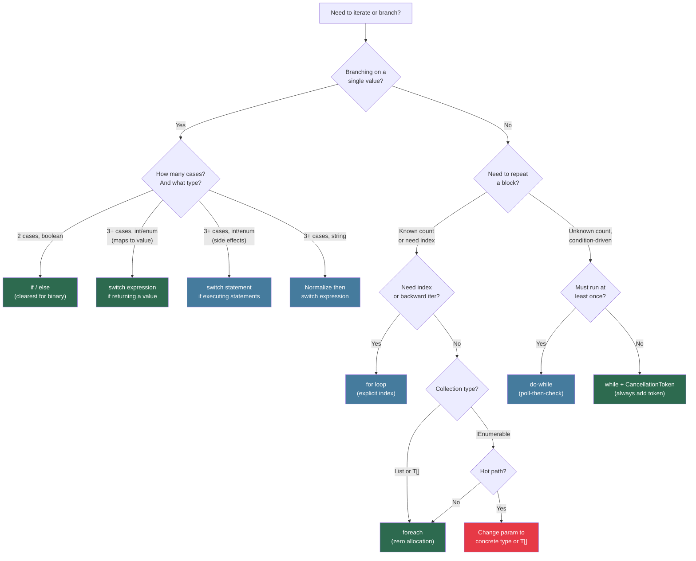

> [!success] Mastery Check
> - [x] **Studied Well** ✅ 2026-06-17
> - [x] **Can explain the concept without notes** ✅ 2026-06-17
> - [x] **Can answer interview questions confidently** ✅ 2026-06-17
> - [x] **Can implement it in a real project** ✅ 2026-06-17


## 📍 PART 0 — Navigation & Context

### Where This Topic Lives

```
C# Language Mastery
└── Level 1 — Foundations
    ├── 2.03  Data Types, Literals, and Type Conversions
    ├── 2.04  Variables, Constants, and Scope
    ├── 2.05  Operators: Complete Reference
    ├── ► 2.06  Control Flow: Conditionals, Loops, and Branching  ← YOU ARE HERE
    ├── 2.07  Methods: Signatures, Parameters, Overloading
    └── 2.08  Classes: Fields, Constructors, Static Members
```

### What You Need Before This

- **[[2.03 — Data Types]]** — `bool`, numeric types, and string are the inputs to every condition
- **[[2.05 — Operators]]** — `&&`, `||`, `!`, `<`, `>`, `==` drive every conditional branch
- **[[2.04 — Variables, Constants, and Scope]]** — loop variables have their own scope; knowing this prevents aliasing confusion

### What This Unlocks After

- **[[2.07 — Methods]]** — `return` is the primary exit mechanism; early-return patterns live here
- **[[2.20 — Pattern Matching]]** — `switch` expressions and type patterns supersede `switch` statements covered here
- **[[2.25 — Iterators and yield return]]** — `yield return` and `yield break` are specialized control flow inside iterators
- **[[2.24 — LINQ: Execution Model]]** — LINQ's deferred execution replaces many explicit loops; understanding loops first makes the tradeoff clear

### Why This Matters at Scale

Every high-throughput service route, every data pipeline stage, and every retry loop in production code is built on these primitives — the difference between a correct loop and an off-by-one or an infinite loop can mean a production outage, not just a test failure.

---

## 🧠 PART 1 — The Core Mental Model

### The Fundamental Rule

> **The C# compiler transforms every control-flow construct into conditional branch instructions (`br`, `brtrue`, `brfalse`) and gotos in IL. The practical consequence is that the compiler's transformation — not the keyword you typed — determines what the CPU actually executes.**

### The Plain-Language Analogy

Think of your C# control flow keywords as **abbreviations on a form**. When you write `foreach`, you're filling in a shorthand. Before the code ever runs, the compiler translates that shorthand into its full legal language — `while (enumerator.MoveNext()) { current = enumerator.Current; ... }` — and that expanded form is what the JIT sees. The keyword you typed no longer exists at runtime.

This matters for three reasons: `foreach` on a `List<T>` calls a struct enumerator with zero heap allocation, while `foreach` on an `IEnumerable<T>` interface boxes it; `switch` on an integer produces a jump table while `switch` on a string produces hashed comparisons; and a `for` loop is not inherently faster than `foreach` — the JIT is the judge of that. What you write is a declaration of intent. What runs is what the compiler compiled.

### The Full Taxonomy

```mermaid
graph TD
    A["C# Control Flow"] --> B["Conditionals"]
    A --> C["Loops"]
    A --> D["Branching / Jump"]

    B --> B1["if / else if / else\n(boolean test, O(1))"]
    B --> B2["switch statement\n(legacy, fall-through rules)"]
    B --> B3["switch expression\n(C# 8+, exhaustive, returns value)"]
    B --> B4["ternary ?:\n(single expression branch)"]
    B --> B5["null-coalescing ??\n(null-conditional short-circuit)"]

    C --> C1["for\n(init; condition; increment)"]
    C --> C2["foreach\n(IEnumerable protocol / GetEnumerator)"]
    C --> C3["while\n(condition checked BEFORE body)"]
    C --> C4["do-while\n(condition checked AFTER body)"]

    D --> D1["break\n(exit nearest loop or switch)"]
    D --> D2["continue\n(skip to next iteration)"]
    D --> D3["return\n(exit method, optionally with value)"]
    D --> D4["throw\n(exit with exception — structured jump)"]
    D --> D5["goto\n(unconditional jump — avoid except in switch)"]
    D --> D6["yield return\n(suspend iterator — not a loop exit)"]
    D --> D7["yield break\n(terminate iterator)"]

    style A fill:#1d3557,color:#fff
    style B fill:#2d6a4f,color:#fff
    style C fill:#457b9d,color:#fff
    style D fill:#e63946,color:#fff
    style B1 fill:#40916c,color:#fff
    style B2 fill:#40916c,color:#fff
    style B3 fill:#40916c,color:#fff
    style B4 fill:#40916c,color:#fff
    style B5 fill:#40916c,color:#fff
    style C1 fill:#5b9bd5,color:#fff
    style C2 fill:#5b9bd5,color:#fff
    style C3 fill:#5b9bd5,color:#fff
    style C4 fill:#5b9bd5,color:#fff
    style D1 fill:#c1121f,color:#fff
    style D2 fill:#c1121f,color:#fff
    style D3 fill:#c1121f,color:#fff
    style D4 fill:#c1121f,color:#fff
    style D5 fill:#c1121f,color:#fff
    style D6 fill:#8b1a1a,color:#fff
    style D7 fill:#8b1a1a,color:#fff
```



---

## 🔬 PART 2 — Deep Mechanics

### 2.1 How `foreach` Actually Works — The Enumerator Protocol

`foreach` is pure syntactic sugar. It expands into a `try/finally` block that calls `GetEnumerator()`, then loops on `MoveNext()` and `Current`. The compiler does NOT call `IEnumerable<T>` if it can resolve a better method by duck-typing.

```
━━━━━━━━━━━━━━━━━━━━━━━━━━━━━━━━━━━━━━━━━━━━━━━━━━━━━━━━━━
C# SOURCE:
━━━━━━━━━━━━━━━━━━━━━━━━━━━━━━━━━━━━━━━━━━━━━━━━━━━━━━━━━━
foreach (var order in orders)
{
    ProcessOrder(order);
}

━━━━━━━━━━━━━━━━━━━━━━━━━━━━━━━━━━━━━━━━━━━━━━━━━━━━━━━━━━
COMPILER EXPANDS TO (approximately):
━━━━━━━━━━━━━━━━━━━━━━━━━━━━━━━━━━━━━━━━━━━━━━━━━━━━━━━━━━
{
    var enumerator = orders.GetEnumerator();   // (1) get enumerator
    try
    {
        while (enumerator.MoveNext())          // (2) advance
        {
            var order = enumerator.Current;    // (3) get current element
            ProcessOrder(order);               // (4) body
        }
    }
    finally
    {
        if (enumerator is IDisposable d)       // (5) guaranteed cleanup
            d.Dispose();
    }
}
```

**The critical branching point — which `GetEnumerator` gets called?**

```
orders type                 GetEnumerator() result            Allocation cost
─────────────────────────────────────────────────────────────────────────────
List<Order>                 List<T>.Enumerator (struct)       ZERO — struct on stack
Order[]  (array)            special compiler treatment        ZERO — index loop in IL
IEnumerable<Order>          interface dispatch                ONE heap allocation
                            (returns object, boxes struct)
IAsyncEnumerable<Order>     requires await foreach           ONE or more allocations
Custom class with           duck-typed — no interface needed  depends on return type
  GetEnumerator() method    (pattern-based foreach, C# 9+)
```

> [!WARNING] The IEnumerable Boxing Cost When `orders` is typed as `IEnumerable<Order>`, the struct enumerator from `List<T>` is boxed to `IEnumerator<T>` — one heap allocation per loop, not per element. In a hot path called 100k/sec, that's 100k GC-eligible objects per second.

**Runtime cost label:** `foreach` on `List<T>` → O(n), zero heap allocation; `foreach` on `IEnumerable<T>` → O(n), one allocation (~40 bytes for boxed enumerator).

---

### 2.2 How `switch` Compiles — From Keyword to Jump Table

The compiler chooses the switch strategy based on the type and density of case values.

```csharp
// Case A: integer switch with dense values (e.g., 0–7)
// Compiler generates a JUMP TABLE (array of branch targets)
// Cost: O(1) — single indirect branch regardless of case count

switch (orderStatus)          // int: 0, 1, 2, 3, 4, 5
{
    case 0: HandlePending();    break;
    case 1: HandleProcessing(); break;
    case 2: HandleShipped();    break;
    case 3: HandleDelivered();  break;
    case 4: HandleCancelled();  break;
    case 5: HandleRefunded();   break;
}

// IL generated (approximately):
// ldc.i4.0 / ldc.i4.5       → range check (0..5)
// br.false fallthrough
// ldloc orderStatus
// switch [Label0, Label1, Label2, Label3, Label4, Label5]  ← jump table
// Label0: call HandlePending ...

// ──────────────────────────────────────────────────────────────────────
// Case B: string switch
// Compiler generates DICTIONARY LOOKUP or binary search (not jump table)
// Cost: O(1) amortized — hash computation + comparison

switch (paymentMethod)
{
    case "CARD":  ProcessCard();  break;
    case "ACH":   ProcessAch();   break;
    case "WIRE":  ProcessWire();  break;
    case "CHECK": ProcessCheck(); break;
}

// IL generated:
// ldloc paymentMethod
// call string.GetHashCode()      ← ordinal hash
// [branch tree based on hash]
// ldstr "CARD" / call string.op_Equality   ← equality verify

// ──────────────────────────────────────────────────────────────────────
// Case C: sparse integer switch (values 0, 100, 1000, 10000)
// Compiler falls back to IF/ELSE chain or binary search tree
// Cost: O(log n)
```

**IL for a simple if/else to show the actual branching instructions:**

```
// C#: if (quantity > 0) { ... } else { ... }
// IL:
ldloc.0        // push quantity
ldc.i4.0       // push 0
ble.s else_lbl // branch if quantity <= 0 → else
[true branch code]
br.s end_lbl
else_lbl:
[false branch code]
end_lbl:
```

**Runtime cost label:** Dense integer `switch` → O(1), ~1–2 ns; string `switch` → O(1) amortized, ~3–5 ns; sparse integer `switch` → O(log n), ~2–4 ns.

---

### 2.3 Loop Variable Capture — The Closure Trap

This is the most production-impacting subtlety in loops. When a lambda captures a loop variable, it captures the _variable_ (a reference to the slot), not the _value_ at that moment.

```
━━━━━━━━━━━━━━━━━━━━━━━━━━━━━━━━━━━━━━━━━━━━━━━━━━━━━━━━
WHAT THE PROGRAMMER THINKS HAPPENS:
━━━━━━━━━━━━━━━━━━━━━━━━━━━━━━━━━━━━━━━━━━━━━━━━━━━━━━━━

Iteration 1: lambda captures i=0  → prints 0
Iteration 2: lambda captures i=1  → prints 1
Iteration 3: lambda captures i=2  → prints 2

━━━━━━━━━━━━━━━━━━━━━━━━━━━━━━━━━━━━━━━━━━━━━━━━━━━━━━━━
WHAT ACTUALLY HAPPENS (compiler generates a single display class):
━━━━━━━━━━━━━━━━━━━━━━━━━━━━━━━━━━━━━━━━━━━━━━━━━━━━━━━━

The compiler generates ONE display class instance.
All lambdas share ONE reference to the SAME int field.
When the loop ends, i == n. All lambdas print n.

     ┌──────────────────┐
     │  DisplayClass_0  │  ← ONE heap object shared by ALL lambdas
     │  int i = 3       │  ← by the time lambdas execute, i is 3
     └──────┬───────────┘
            │ (all 3 lambdas point here)
     [λ₀]──►└── reads i → 3
     [λ₁]──►└── reads i → 3
     [λ₂]──►└── reads i → 3
```

```csharp
// ⚠️ WRONG: capturing the loop variable — all actions print "3"
var actions = new List<Action>();
for (int i = 0; i < 3; i++)
    actions.Add(() => Console.WriteLine(i));  // captures i, not value of i

actions.ForEach(a => a()); // prints: 3, 3, 3

// ✅ CORRECT: capture a COPY of the loop variable
var actions2 = new List<Action>();
for (int i = 0; i < 3; i++)
{
    int captured = i;   // new local per iteration → new display class slot
    actions2.Add(() => Console.WriteLine(captured));
}
actions2.ForEach(a => a()); // prints: 0, 1, 2
```

> [!NOTE] foreach vs for In C# 5+, `foreach` creates a **new** loop variable binding per iteration — each lambda in a `foreach` captures a distinct variable. The `for` loop variable is ONE variable that mutates. This asymmetry is intentional and a common source of bugs when refactoring from `foreach` to `for`.

**Runtime cost label:** Each captured variable with a lambda = one heap allocation for the display class (the object capturing the variable), ~40–80 bytes. In a loop over N items, this is N allocations.

---

### 2.4 `break`, `continue`, `return` — What the IL Actually Does

These are not symmetrical. The compiler treats them differently in terms of what cleanup code runs.

```
STATEMENT          WHAT IT DOES IN IL           CLEANUP (finally) RUNS?
────────────────────────────────────────────────────────────────────────
break              goto end_of_loop             YES — any finally in scope
continue           goto loop_condition          YES — any finally in scope
return             ret instruction              YES — any finally in scope
goto (manual)      br / br.s instruction        YES for try/finally scope
Environment.Exit   OS process termination       NO — finalizers not run
```

```csharp
// This demonstrates that finally ALWAYS runs, even with return
// Domain: order processing pipeline

public bool TryProcessOrder(OrderContext ctx)
{
    ctx.BeginTransaction();
    try
    {
        if (!ctx.IsValid())
            return false;   // return mid-try → finally still runs

        ctx.Execute();
        return true;
    }
    finally
    {
        // This runs on return false, return true, AND any exception
        // Cost: ~0 ns overhead — finally blocks are not "if" checks;
        // the IL puts a leave instruction that always transfers here
        ctx.EndTransaction();
    }
}
```

**The `goto` in `switch` — the one legitimate use:**

```csharp
// goto case is the only valid fall-through mechanism in C# switch
// C# does NOT allow implicit fall-through (unlike C/C++)
switch (orderTier)
{
    case "PLATINUM":
        ApplyPlatinumBenefits();
        goto case "GOLD";    // intentional fall-through — explicit, readable
    case "GOLD":
        ApplyGoldBenefits();
        goto case "SILVER";
    case "SILVER":
        ApplySilverBenefits();
        break;
}
```

> [!TIP] Early Return vs Single Return The "single return point" rule is a C-era cargo cult. In C#, early return improves readability by reducing nesting (the "guard clause" pattern). It has no performance cost — `ret` is `ret`. Deeply nested `if/else` trees are harder to read AND slower to understand. Prefer guards.

**Runtime cost label:** `break`/`continue`/`return` each compile to a single `br` or `ret` IL instruction: ~0 ns overhead (pipelined branch prediction handles backward branches extremely well).

---

### 2.5 `do-while` — The Misunderstood Loop

`do-while` guarantees the body executes at least once. The compiler generates this differently from `while`:

```
WHILE loop IL:                    DO-WHILE loop IL:
───────────────────               ────────────────────
loop_start:                       loop_body:
  [condition check]                 [body]
  brfalse loop_end               loop_check:
  [body]                           [condition check]
  br loop_start                    brtrue loop_body
loop_end:
```

```csharp
// while: may execute 0 times
while (retryQueue.TryDequeue(out var item))
    Retry(item);

// do-while: executes at least once — useful for "attempt then check" semantics
// Domain: payment gateway retry with initial attempt
int attempt = 0;
bool succeeded;
do
{
    succeeded = paymentGateway.TryCharge(transaction);
    attempt++;
}
while (!succeeded && attempt < maxRetries);

// The do-while here is semantically CORRECT:
// we must try at least once before evaluating whether to retry.
// Using while would require duplicating the call or awkward flag initialization.
```

**Runtime cost label:** `do-while` body executes at minimum once at ~O(1) per iteration. The loop condition test and backward branch: ~1–2 ns per iteration (branch predictor handles well after first few iterations).

---

## 💻 PART 3 — Production Code Patterns

### 3.1 The Guard Clause — Eliminating Nested Conditionals

The guard clause pattern uses early return to handle invalid/exceptional cases at the top of a method, leaving the happy path as flat, readable code.

```csharp
// ⚠️ WRONG: "arrow anti-pattern" — deeply nested conditions
public decimal CalculateShippingCost(Order order, Customer customer, Address destination)
{
    if (order != null)
    {
        if (customer != null)
        {
            if (destination != null)
            {
                if (order.Items.Count > 0)
                {
                    if (customer.IsActive)
                    {
                        // happy path — 5 levels deep, barely readable
                        return _shippingService.Calculate(order, destination);
                    }
                    else
                    {
                        throw new InvalidOperationException("Inactive customer");
                    }
                }
                else
                {
                    return 0m;
                }
            }
            else
            {
                throw new ArgumentNullException(nameof(destination));
            }
        }
        else
        {
            throw new ArgumentNullException(nameof(customer));
        }
    }
    else
    {
        throw new ArgumentNullException(nameof(order));
    }
}

// ✅ CORRECT: guard clauses at the boundary — happy path reads linearly
public decimal CalculateShippingCost(Order order, Customer customer, Address destination)
{
    // Guards reject invalid inputs immediately — thrown exceptions are branch exits,
    // not nested if-else arms. The remaining code assumes all preconditions satisfied.
    ArgumentNullException.ThrowIfNull(order);
    ArgumentNullException.ThrowIfNull(customer);
    ArgumentNullException.ThrowIfNull(destination);

    if (!customer.IsActive)
        throw new InvalidOperationException($"Customer {customer.Id} is inactive");

    // Edge case that returns a valid value — not an error
    if (!order.Items.Any())
        return 0m;

    // Happy path: completely flat, reads top to bottom
    return _shippingService.Calculate(order, destination);
}
```

### 3.2 The Polling Loop with Cancellation — Cooperative Cancellation

Every `while(true)` loop in a production service needs a cancellation check. Without it, the loop cannot be stopped gracefully on shutdown.

```csharp
// ⚠️ WRONG: Infinite loop with no cancellation — cannot be shut down gracefully
public async Task RunOrderProcessor()
{
    while (true)   // ← blocks graceful shutdown indefinitely
    {
        var order = await _queue.DequeueAsync();
        await ProcessOrderAsync(order);
    }
}

// ✅ CORRECT: Cooperative cancellation via CancellationToken
public async Task RunOrderProcessorAsync(CancellationToken cancellationToken)
{
    // Pass the token to the queue operation AND check it in the loop condition.
    // This handles two cases:
    //   1. Queue blocks waiting — the token cancels the wait
    //   2. Queue returns immediately — the condition check exits the loop
    while (!cancellationToken.IsCancellationRequested)
    {
        Order order;
        try
        {
            // Token is passed here — dequeue throws OperationCanceledException
            // on cancellation, which propagates up correctly
            order = await _queue.DequeueAsync(cancellationToken);
        }
        catch (OperationCanceledException)
        {
            // Graceful exit: this is the expected shutdown path, not an error
            _logger.LogInformation("Order processor shutdown requested");
            break;
        }

        await ProcessOrderAsync(order, cancellationToken);
    }
}
```

### 3.3 The foreach-with-Index Pattern — Avoiding Index Misuse

When you need both the item and its position, reach for `Select` with index rather than maintaining a parallel counter.

```csharp
// ⚠️ WRONG: manual index counter — prone to off-by-one and scope leakage
int index = 0;
foreach (var lineItem in invoice.LineItems)
{
    _logger.LogInformation("Line {Index}: {Description}", index, lineItem.Description);
    index++;
    // 'index' leaks outside the loop — its value is undefined after the loop ends
    // and someone WILL accidentally use it thinking it holds something meaningful
}

// ✅ CORRECT: LINQ Select with index — clean, no leaked state
foreach (var (item, i) in invoice.LineItems.Select((item, i) => (item, i)))
{
    _logger.LogInformation("Line {Index}: {Description}", i + 1, item.Description);
    // 'i' is scoped entirely to the loop — impossible to misuse after
}

// ✅ ALTERNATIVE: If LINQ feels heavy for a tight loop, use a for loop explicitly
// The 'for' loop makes the index relationship obvious and zero-overhead
for (int i = 0; i < invoice.LineItems.Count; i++)
{
    _logger.LogInformation("Line {Index}: {Description}", i + 1, invoice.LineItems[i].Description);
}
```

### 3.4 The Switch Expression as Data Transformer

`switch` expressions (C# 8+) return a value rather than executing statements. They enforce exhaustiveness at compile time when the input type supports it. Use them for mapping/translation, not for side-effectful branching.

```csharp
// ⚠️ WRONG: switch statement with method-call side effects masquerading as a mapper
// The return type is hidden in each arm, and missing a case gives no compile error
// (unless #nullable is on and you forgot the default)
string FormatOrderStatus(OrderStatus status)
{
    switch (status)
    {
        case OrderStatus.Pending:    return "Awaiting Payment";
        case OrderStatus.Processing: return "In Progress";
        case OrderStatus.Shipped:    return "On Its Way";
        case OrderStatus.Delivered:  return "Delivered";
        case OrderStatus.Cancelled:  return "Cancelled";
        // forgot Refunded — compiles fine, returns null at runtime
    }
    return null!; // caller receives null, NullReferenceException later
}

// ✅ CORRECT: switch expression — value-returning, exhaustiveness enforced at compile time
// When OrderStatus gains a new value, this FAILS TO COMPILE until you handle it
string FormatOrderStatus(OrderStatus status) => status switch
{
    OrderStatus.Pending    => "Awaiting Payment",
    OrderStatus.Processing => "In Progress",
    OrderStatus.Shipped    => "On Its Way",
    OrderStatus.Delivered  => "Delivered",
    OrderStatus.Cancelled  => "Cancelled",
    OrderStatus.Refunded   => "Refund Issued",
    // No default needed when all enum values covered — compiler validates this
    _ => throw new ArgumentOutOfRangeException(nameof(status), status, "Unhandled status")
};
```

### 3.5 The Retry Loop with Exponential Backoff

A canonical production pattern for transient failure handling. The loop structure here is deliberate: `do-while` is wrong (always executes body before checking), `while` is correct because we want to check cancellation before each attempt.

```csharp
// Domain: payment gateway with transient failure handling
public async Task<ChargeResult> ChargeWithRetryAsync(
    ChargeRequest request,
    CancellationToken cancellationToken,
    int maxAttempts = 3)
{
    int attempt = 0;
    TimeSpan delay = TimeSpan.FromMilliseconds(100);

    // while loop: check attempt count AND cancellation BEFORE each attempt
    // If the gateway is down and we've hit max retries, we exit without an extra attempt
    while (attempt < maxAttempts)
    {
        attempt++;
        try
        {
            return await _gateway.ChargeAsync(request, cancellationToken);
        }
        catch (TransientGatewayException ex) when (attempt < maxAttempts)
        {
            // 'when' filter — runs BEFORE the catch body, on the original call stack
            // This is correct for logging: stack trace points to the actual failure site
            _logger.LogWarning(ex,
                "Charge attempt {Attempt}/{Max} failed, retrying in {Delay}ms",
                attempt, maxAttempts, delay.TotalMilliseconds);

            await Task.Delay(delay, cancellationToken);
            delay *= 2;  // exponential backoff: 100ms → 200ms → 400ms
        }
        // Other exceptions (non-transient) propagate immediately — no catch
    }

    // Exhausted retries — let the final exception propagate naturally
    return await _gateway.ChargeAsync(request, cancellationToken);
}
```

### 3.6 Collection Iteration with Early Exit — `break` vs LINQ

Use `break` when you find what you need and further iteration would be wasted work. Understand that LINQ's `First()` does the same thing under the hood.

```csharp
// Domain: order fulfillment — find the first warehouse that can fulfill the order
// ⚠️ WRONG: iterates ALL warehouses even after finding a valid one
Warehouse? fulfillingWarehouse = null;
foreach (var warehouse in _warehouses)
{
    if (warehouse.HasStock(order))
    {
        fulfillingWarehouse = warehouse;
        // no break — continues iterating!
    }
}

// ✅ CORRECT: break exits as soon as match is found
Warehouse? fulfillingWarehouse = null;
foreach (var warehouse in _warehouses)
{
    if (warehouse.HasStock(order))
    {
        fulfillingWarehouse = warehouse;
        break;  // O(found_position) not O(n) — critical if warehouses is large
    }
}

// ✅ ALTERNATIVE: LINQ FirstOrDefault is equivalent — uses break internally
// Choose this when code reads better; they compile to the same IL behavior
Warehouse? fulfillingWarehouse = _warehouses.FirstOrDefault(w => w.HasStock(order));
```

### 3.7 Loop Invariant Computation — Hoisting Property Reads

The JIT can sometimes hoist loop-invariant reads, but it cannot always prove that a property or method call is pure. Help it by reading once outside the loop.

```csharp
// Domain: financial report generation over large transaction dataset
// ⚠️ WRONG: Count is a property on List<T> — O(1), but calling it each iteration
// is a missed optimization AND a source of subtle bugs if the list could be modified
for (int i = 0; i < transactions.Count; i++)    // Count evaluated N times
{
    ProcessTransaction(transactions[i]);
}

// ✅ CORRECT: hoist the invariant count read before the loop
// Also: if 'transactions' could be a IReadOnlyList<T>, hoist the cast too
int count = transactions.Count;  // read once — communicates to both JIT and reader
for (int i = 0; i < count; i++)
{
    ProcessTransaction(transactions[i]);
}

// NOTE: For arrays specifically, the JIT DOES eliminate bounds checks on
// standard for (int i = 0; i < arr.Length; i++) patterns — it knows Length
// cannot change. Hoisting arr.Length is therefore NOT required for arrays,
// but it still signals intent clearly. For List<T>, always hoist.
```

---

## ⚠️ PART 4 — Gotchas & Anti-Patterns

### Gotcha 1: `foreach` on an Interface Variable Allocates

Engineers reach for `IEnumerable<T>` as the "most flexible" parameter type on methods that accept collections. The hidden cost: every `foreach` on an `IEnumerable<T>` variable boxes the struct enumerator, creating a heap allocation. This doesn't appear in the code — it's entirely invisible until you profile.

```csharp
// ⚠️ WRONG: parameter typed as IEnumerable<T> — hidden boxing per call
public decimal SumLineItems(IEnumerable<LineItem> items)
{
    decimal total = 0;
    foreach (var item in items)  // GetEnumerator() returns IEnumerator<T>
        total += item.Amount;    // struct enumerator BOXED to IEnumerator<T> — heap allocation
    return total;
}

// ✅ CORRECT: keep the concrete type when the caller always passes List<T>
// OR use a generic constraint to get duck-typed foreach without boxing
public decimal SumLineItems(List<LineItem> items)
{
    decimal total = 0;
    foreach (var item in items)  // List<T>.Enumerator is a struct — ZERO allocation
        total += item.Amount;
    return total;
}

// WHY: The compiler resolves foreach by calling GetEnumerator() at compile time.
// List<T>.GetEnumerator() returns List<T>.Enumerator (a struct) — no boxing.
// IEnumerable<T>.GetEnumerator() returns IEnumerator<T> (an interface) — boxes the struct.
// The allocation is ~40 bytes per call, negligible once, catastrophic at 100k calls/sec.
```

### Gotcha 2: `switch` on `string` Is Culture-Invariant — Unlike `==`

Experienced engineers know that string `==` uses `Ordinal` comparison and works correctly. What surprises them: `switch` on strings uses ordinal case-insensitivity rules that differ from `string.Equals(x, y, StringComparison.OrdinalIgnoreCase)` in subtle ways with certain Unicode characters.

```csharp
// ⚠️ WRONG: assuming switch on string matches case-insensitively like ToLower() does
// This does NOT match "CARD", "Card", "card" — switch is case-SENSITIVE
switch (paymentMethod)
{
    case "card":  ProcessCard();  break;   // only matches exactly "card"
}

// ✅ CORRECT: normalize before switch for case-insensitive matching
// Do this normalization ONCE at the API boundary, not per switch arm
switch (paymentMethod.ToUpperInvariant())  // InvariantCulture avoids Turkish-I problem
{
    case "CARD":  ProcessCard();  break;
    case "ACH":   ProcessAch();   break;
}

// WHY: C# switch uses string.op_Equality which is Ordinal case-sensitive.
// 'ToUpperInvariant()' instead of 'ToUpper()' avoids the Turkish-I problem
// where 'i'.ToUpper() == "İ" (dotted capital I) in Turkish locale — which would
// cause "identifier" to not match "IDENTIFIER" on Turkish-locale servers.
```

### Gotcha 3: `continue` Inside a `try` Block Skips Iteration Cleanup

When `continue` is used inside a `try` block, it does NOT skip the `finally` — `finally` always runs. But it DOES skip any code after the `continue` inside the `try`. Engineers who add cleanup code after a `continue` expecting it to run on the "normal path" are surprised.

```csharp
// ⚠️ WRONG: code after continue never executes — engineer thinks it does
foreach (var batchJob in _scheduledJobs)
{
    try
    {
        if (!batchJob.IsReady())
        {
            continue;               // jumps to next iteration
            batchJob.LogSkipped();  // ← DEAD CODE — never reached, no warning!
        }
        batchJob.Execute();
        batchJob.LogSuccess();     // runs only when IsReady() is true
    }
    finally
    {
        batchJob.ReleaseResources(); // always runs — both on continue and normal path
    }
}

// ✅ CORRECT: put post-continue logic in the finally, not after the continue
foreach (var batchJob in _scheduledJobs)
{
    try
    {
        if (!batchJob.IsReady())
        {
            batchJob.LogSkipped(); // moved BEFORE the continue
            continue;
        }
        batchJob.Execute();
        batchJob.LogSuccess();
    }
    finally
    {
        batchJob.ReleaseResources(); // still runs on all paths
    }
}

// WHY: 'continue' compiles to a 'br' (unconditional branch) to the loop's
// increment/condition section, bypassing all remaining code in the try body.
// The finally runs because the IL 'leave' instruction for try-exit always
// transfers control through the finally handler first.
```

### Gotcha 4: The `when` Filter Sees the Original Exception — But Runs Outside the Handler

`when` filters are evaluated BEFORE the stack unwinds to the catch block. This is powerful for logging (you get the original call stack) but confusing for side effects — the filter runs even if a different catch block ends up handling the exception.

```csharp
// ⚠️ WRONG: using when filter to set state that the catch block depends on
// The filter MAY run even when a different catch handles the exception
bool isTransient;
try
{
    await _orderService.SubmitAsync(order);
}
catch (Exception ex) when ((isTransient = IsTransient(ex)) == true)  // assigns!
{
    await RetryAsync(isTransient);  // 'isTransient' is always true here by construction
                                   // but this is a side-effectful filter — dangerous
}

// ✅ CORRECT: use when filter for FILTERING only — keep it pure/predicate-only
try
{
    await _orderService.SubmitAsync(order);
}
catch (GatewayException ex) when (IsTransient(ex))
{
    // IsTransient() is called here — no state mutation, clean predicate
    await RetryAsync(ex);
}
catch (GatewayException ex)
{
    // Non-transient gateway exception — let it propagate or handle differently
    throw;
}

// WHY: The 'when' clause in IL is an 'isinst' + filter block executed at
// the POINT OF THROW, before the call stack is unwound. This is why you can
// log the original stack trace from inside a when filter. Side effects in filters
// can run multiple times if exception handling is retried by the CLR.
```

### Gotcha 5: `for` Loop Bounds Not Cached — List Can Grow During Iteration

Iterating a collection while another thread or callback modifies it causes `InvalidOperationException` with `foreach` (the enumerator detects version change), but with a `for` loop on `List<T>`, it silently skips or double-processes elements. Engineers who switch from `foreach` to `for` to "avoid the allocation" inadvertently remove the safety check.

```csharp
// ⚠️ WRONG: for loop on a List that might be mutated during the loop body
// If ProcessOrderAsync triggers a callback that adds to pendingOrders, behavior is undefined
List<Order> pendingOrders = GetPendingOrders();
for (int i = 0; i < pendingOrders.Count; i++)
{
    ProcessOrder(pendingOrders[i]);  // if this adds to pendingOrders, loop runs longer
                                     // if it removes from pendingOrders, items are skipped
}

// ✅ CORRECT: snapshot the collection before iterating if mutation is possible
Order[] snapshot = pendingOrders.ToArray();  // O(n) allocation, but safe
for (int i = 0; i < snapshot.Length; i++)
{
    ProcessOrder(snapshot[i]);  // iterating the snapshot; original can mutate freely
}

// ✅ ALTERNATIVE: if you need foreach's version check, keep foreach
// foreach will throw InvalidOperationException on modification — a clear signal
foreach (var order in pendingOrders)  // version check on every MoveNext()
{
    ProcessOrder(order);
}

// WHY: List<T> maintains an internal _version field incremented on each Add/Remove.
// foreach accesses this through the enumerator and throws on mismatch.
// for loop bypasses the enumerator entirely — no version check, no safety net.
```

---

## 📊 PART 5 — Performance Implications

### 5.1 Allocation Characteristics Table

|Scenario|Allocation Behavior|Approx Cost|
|---|---|---|
|`foreach` on `T[]` (array)|Zero — compiler generates index-based for loop|~1 ns/iter|
|`foreach` on `List<T>`|Zero — `List<T>.Enumerator` is a struct, stack-allocated|~2 ns/iter|
|`foreach` on `IEnumerable<T>` (typed variable)|ONE box per loop (~40 bytes)|~12 ns first iter + alloc|
|`foreach` on `IEnumerable<T>` from LINQ chain|One heap-allocated iterator per operator in chain|~40–80 bytes per operator|
|`for (int i...)` on `List<T>`|Zero — index access compiles to direct array read|~1–2 ns/iter|
|`switch` on dense integer|Zero — jump table in static data|~1–2 ns dispatch|
|`switch` on string|Zero — hash computed on stack|~3–5 ns dispatch|
|Lambda capturing loop variable (`for`)|ONE `DisplayClass` heap object per captured variable|~24–80 bytes|
|Lambda inside `foreach` (C# 5+)|ONE `DisplayClass` per iteration (distinct per-iteration variable)|~24–80 bytes × N|
|`try/finally` block (no exception)|Zero — finally is a code path, not an object|~0–1 ns overhead|
|`when` filter (exception thrown)|Zero for the filter itself; exception object already allocated|~0 ns for filter eval|

### 5.2 BenchmarkDotNet: Loop Strategy Comparison

```csharp
using BenchmarkDotNet.Attributes;
using BenchmarkDotNet.Running;

// Expected output (approximate, .NET 8, x64):
// | Method               | N     | Mean       | Allocated |
// |----------------------|-------|------------|-----------|
// | ForLoop_Array        | 10000 |   2.84 μs  | -         |
// | ForEach_List         | 10000 |   3.21 μs  | -         |
// | ForEach_IEnumerable  | 10000 |   4.95 μs  | 40 B      |
// | ForEach_LinqChain    | 10000 |  12.40 μs  | 168 B     |
// | ForLoop_ListNoHoist  | 10000 |   3.35 μs  | -         |

[MemoryDiagnoser]
[BenchmarkCategory("ControlFlow")]
public class LoopStrategyBenchmark
{
    private List<decimal> _items = null!;
    private decimal[] _array = null!;

    [Params(10_000)]
    public int N;

    [GlobalSetup]
    public void Setup()
    {
        _items = Enumerable.Range(1, N).Select(i => (decimal)i).ToList();
        _array = _items.ToArray();
    }

    [Benchmark(Baseline = true)]
    public decimal ForLoop_Array()
    {
        decimal sum = 0;
        int len = _array.Length; // hoisted — JIT also does this for arrays naturally
        for (int i = 0; i < len; i++)
            sum += _array[i];
        return sum;
    }

    [Benchmark]
    public decimal ForEach_List()
    {
        decimal sum = 0;
        foreach (var x in _items)  // struct enumerator — zero allocation
            sum += x;
        return sum;
    }

    [Benchmark]
    public decimal ForEach_IEnumerable()
    {
        IEnumerable<decimal> items = _items;  // typed as interface — BOXES enumerator
        decimal sum = 0;
        foreach (var x in items)
            sum += x;
        return sum;
    }

    [Benchmark]
    public decimal ForEach_LinqChain()
    {
        decimal sum = 0;
        // Where + Select create two iterator wrapper heap objects
        foreach (var x in _items.Where(x => x > 0).Select(x => x * 1.1m))
            sum += x;
        return sum;
    }

    [Benchmark]
    public decimal ForLoop_ListNoHoist()
    {
        decimal sum = 0;
        for (int i = 0; i < _items.Count; i++)  // Count re-read each iteration
            sum += _items[i];
        return sum;
    }
}
```

### 5.3 When to Care / When to Ignore

**When this costs you:**

- A method processing **>10k elements in a hot path** that accepts `IEnumerable<T>` instead of `List<T>` or `T[]` — the boxing creates sustained Gen0 GC pressure that causes periodic pauses in a real-time API.
- A **background worker loop** (`while (!cancellationToken.IsCancellationRequested)`) that captures a `CancellationToken` in a lambda on every iteration — one allocation per loop tick, potentially millions per hour.
- A **switch** over enums in a serialization hot path using string conversion instead of integer dispatch — 3× slower per dispatch.
- A **for loop** over `List<T>` calling `.Count` at the condition on every iteration when the list is backed by a slow or locking property.

**When this doesn't matter:**

- Any code that runs **<1000 times per second** — the difference between a 2 ns and 12 ns dispatch is immeasurable in wall-clock latency terms.
- **LINQ chains in initialization code** (startup, configuration loading) — the allocations happen once and are immediately reclaimable.
- **Single-threaded batch jobs** that run to completion — GC can collect freely between runs; the allocation cost is a rounding error vs I/O.
- **Test code** — correctness trumps allocation count in tests always.

---

## 🎤 PART 6 — Interview Arsenal

### 6.1 The Question Bank

---

> **Q: "How does `foreach` work under the hood in C#?"**

**Average answer:** "It calls `GetEnumerator()` and then `MoveNext()` and `Current` in a loop."

**Why that's insufficient:** It misses the compiler expansion details, the duck-typing behavior, the try/finally for Dispose, and the critical allocation difference between concrete and interface types.

> **Great answer:** "The compiler expands `foreach` into a `try/finally` block that calls `GetEnumerator()`, loops on `MoveNext()`, reads `Current`, and then calls `Dispose()` in the finally. The important nuance is how `GetEnumerator()` is resolved: the compiler uses duck-typing, not interface dispatch, so if the collection has a public `GetEnumerator()` that returns a struct, no boxing occurs. On `List<T>`, you get `List<T>.Enumerator`, a value type — zero heap allocation. But if the variable is typed as `IEnumerable<T>`, the compiler calls the interface method which returns `IEnumerator<T>`, boxing that struct enumerator onto the heap. This is why accepting `IEnumerable<T>` instead of the concrete type in hot-path methods creates hidden allocations that don't show up until you run a profiler."

---

> **Q: "What's the difference between `switch` statement and `switch` expression?"**

**Average answer:** "Switch expressions return a value and are more concise."

**Why that's insufficient:** It misses exhaustiveness checking, the performance implications, and when each is the correct tool.

> **Great answer:** "The mechanical difference is that switch expressions return a value and are exhaustive — the compiler will warn or error if you haven't covered all possible inputs when it can detect them, like with an enum. Switch statements are statement-based, can fall through via `goto case`, and are appropriate when the arms have side effects rather than returning a value. In terms of performance, both compile to the same IL strategies: a jump table for dense integers, a hash-based comparison tree for strings. I default to switch expressions for any mapping or transformation — converting an enum to a string, routing a command type — because the exhaustiveness check is a compile-time correctness guarantee. I use switch statements when the arms need to execute multiple statements with different control flow. The production danger with switch statements is forgetting a new enum value; with switch expressions, that's a compile error."

---

> **Q: "When would a `for` loop be preferred over `foreach`?"**

**Average answer:** "When you need the index, or when you need to modify the collection."

**Why that's insufficient:** It doesn't address the allocation subtleties, the bounds-check elimination, or the precise gotchas around modifying during iteration.

> **Great answer:** "I use `for` when I genuinely need the index for something beyond just iterating — writing back to a position, comparing adjacent elements, or processing in reverse. For pure forward iteration, `foreach` on `List<T>` is zero-allocation and the JIT handles it as efficiently as a `for` loop after optimization. One important case for `for` is when I need to modify the collection in place: `foreach` holds an enumerator that throws `InvalidOperationException` if the list's version changes, while `for` with an index doesn't have that check — which is both a feature and a danger. The other case is SIMD or vectorization work, where I need explicit index arithmetic that I want the JIT to vectorize. In that scenario, the classic `for (int i = 0; i < array.Length; i++)` pattern is what the JIT recognizes for bounds-check elimination and auto-vectorization."

---

> **Q: "What does `break` do inside a nested loop?"**

**Average answer:** "`break` exits the inner loop."

**Why that's insufficient:** This is a trick — `break` only exits the INNERMOST enclosing loop or switch. The answer reveals whether the candidate knows there's no labeled break in C#, and what the alternatives are.

> **Great answer:** "`break` in C# exits only the immediately enclosing loop or switch — it does not take a label argument the way Java or some other languages do. So in a doubly-nested loop, `break` inside the inner loop exits the inner loop and returns control to the outer loop's next iteration. If you need to exit both loops, you have a few options: use a boolean flag that the outer loop also checks, use `goto` with a label below the outer loop (which is actually one legitimate use of `goto` in C#), refactor the inner loop into a method so `return` exits it, or restructure using LINQ or an early-return guard. In practice I favor extraction into a method — it makes the exit intent explicit and also makes the code testable in isolation."

---

> **Q: "What happens to the `finally` block when `return` is in the middle of a `try`?"**

**Average answer:** "`finally` always runs."

**Why that's insufficient:** Most candidates say this correctly but can't explain WHY — the IL mechanism. The follow-up "does the return value change?" is what separates the candidates.

> **Great answer:** "The `finally` block always runs when `return` is inside a `try`. The IL uses a `leave` instruction rather than a `ret` — `leave` unwinds the protected region and transfers through the finally handler before the method actually returns. There's an interesting edge case: if the `finally` block itself assigns to a local variable that holds the return value, the C# compiler captures the return value before entering finally, so the finally cannot change what gets returned — it's already committed. The only exception to finally-always-runs is `Environment.FailFast()` or an unhandled exception that triggers a process-level crash — those skip finally blocks. This guarantee is what makes the `using` pattern safe: the `Dispose()` call in the compiler-generated finally runs even if the method exits via `return` or `throw`."

---

### 6.2 The Trick Questions

> [!WARNING] These Sound Simple — They Are Not

**"Does `foreach` on an array allocate?"** **The trap:** Candidates say "no, because arrays implement IEnumerable." The correct answer is more specific — the C# compiler special-cases arrays and generates an index-based `for` loop in IL, not an enumerator call. There is zero allocation and zero enumerator creation. It's not even using the IEnumerable protocol.

**"What does `goto` compile to in IL?"** **The trap:** Candidates assume `goto` is special or slow. It compiles to an unconditional `br` (branch) instruction — the same thing as a loop's backward branch. It has no special overhead. The reason to avoid `goto` is readability, not performance.

**"Can you use `break` inside a `switch` inside a `for` loop — which does it exit?"** **The trap:** It exits the `switch`, not the `for` loop. `break` always exits the immediately enclosing `switch` or loop. To exit the outer `for` loop, you would need a separate `break` at the outer loop level, or a `goto` to after the loop.

**"In a `for (int i = 0; i < list.Count; i++)` loop, how many times is `Count` evaluated?"** **The trap:** N+1 times — once per iteration check, including the final check that fails. The compiler does NOT hoist it. For `T[]`, it's different: the JIT recognizes `array.Length` in the loop condition and eliminates bounds checks and Length re-reads.

**"What happens if you throw an exception inside a `finally` block?"** **The trap:** If you are in a `finally` because of an original exception, and you throw a new one in `finally`, the ORIGINAL exception is lost — the new one replaces it. The original exception is gone, making debugging much harder. This is why you should never throw from a `finally` block.

---

### 6.3 Red Flags to Avoid

```
❌ "for loops are faster than foreach" — wrong for List<T> and arrays; both are O(n), JIT treats them equivalently

❌ "I always use IEnumerable<T> for flexibility" — signals unawareness of the boxing allocation cost in hot paths

❌ "switch is O(n) because it checks each case" — only for sparse strings; dense int switch is a jump table, O(1)

❌ "you should avoid break and use flags instead" — flags add state complexity; break is the idiomatic and clearer exit

❌ "goto is never acceptable" — 'goto case' in switch and 'goto label' as a nested-loop break are legitimate uses

❌ "continue is basically a break" — these are completely different; continue skips to the next iteration, break exits the loop

❌ "finally only runs if there's no exception" — the opposite: finally ALWAYS runs (except FailFast); this is its purpose

❌ "while(true) is fine if I have a return inside" — missing cancellation; unkillable loops are a production anti-pattern
```

---

## 🔀 PART 7 — Decision Framework



---

## ✅ PART 8 — Self-Check

### Conceptual Questions

1. You have a method that accepts `IEnumerable<InvoiceLineItem>` and iterates it with `foreach`. A caller passes a `List<InvoiceLineItem>`. Does this allocate? What would need to change to eliminate the allocation?
    
2. A `switch` statement over an `enum` with 6 values compiles to a jump table. The same switch after adding a value with an explicit constant of `10000` (leaving a gap) no longer produces a jump table. Why? What is the performance implication?
    
3. You have a `for` loop that breaks after finding the first matching item. A colleague rewrites it as `list.First(predicate)`. Are these semantically identical? Is there any scenario where they differ?
    
4. A `do-while` loop with `attempt < maxRetries` always runs at least once. Can you construct a scenario where using `while` instead would be more correct? Give a concrete example with a named domain.
    
5. A lambda inside a `foreach` over `customers` captures the loop variable. In C# 4.0 (old behavior) vs C# 5+ (new behavior), what is the difference in what gets captured, and why does C# 5 behave differently?
    
6. What is the difference between `throw` and `throw ex` inside a `catch` block? Which should you use, and why does it matter for debugging production issues?
    
7. You see `while (!token.IsCancellationRequested) { ... }` in a code review. What is the subtle bug this pattern can have in async code? How would you fix it?
    
8. The `when` filter in a `catch` clause evaluates before the stack unwinds. How would you exploit this to log the full original call stack before any unwinding happens, while still re-throwing the exception?
    
9. A teammate argues that replacing `foreach` with `for` is always a performance improvement because "for loops don't use enumerators." Under what conditions is this claim true, false, or irrelevant?
    
10. Explain what happens — step by step — when `return 42;` executes inside a `try` block that has a `finally` clause. What IL instructions are generated, and in what order does the CPU execute them?
    

---

### Code Puzzles

**Puzzle 1:** What is printed? (Loop variable capture)

```csharp
var funcs = new List<Func<int>>();
foreach (var i in new[] { 1, 2, 3 })
    funcs.Add(() => i);

foreach (var f in funcs)
    Console.Write(f() + " ");
```

<details> <summary>Answer (expand after trying)</summary>

**Printed: `1 2 3`**

In C# 5+, `foreach` creates a **new** loop variable binding per iteration. Each lambda captures a distinct copy of `i`. This is different from a `for` loop where the variable is shared. If this were `for (int i = 0; i < 3; i++) funcs.Add(() => i);`, it would print `3 3 3` because all lambdas capture the single `i` variable which ends up as 3 after the loop.

</details>

---

**Puzzle 2:** What is printed? (break inside switch inside for)

```csharp
for (int i = 0; i < 3; i++)
{
    switch (i)
    {
        case 1:
            Console.Write("one ");
            break;   // ← which construct does this break?
        default:
            Console.Write($"{i} ");
            break;
    }
    Console.Write("after ");
}
```

<details> <summary>Answer (expand after trying)</summary>

**Printed: `0 after one after 2 after`**

The `break` exits the `switch`, NOT the `for` loop. After each switch arm executes, `break` returns to the `for` loop body, which then prints "after " before incrementing `i`. The `for` loop runs all three iterations (0, 1, 2). This is the `break`-only-exits-nearest-enclosing-construct rule.

</details>

---

**Puzzle 3:** Is there a bug? If so, what? (finally and return value)

```csharp
public int GetOrderCount()
{
    int count = 0;
    try
    {
        count = _repository.CountOrders();
        return count;
    }
    finally
    {
        count = -1;  // Can the caller ever receive -1?
    }
}
```

<details> <summary>Answer (expand after trying)</summary>

**The caller NEVER receives -1.**

When `return count;` executes inside `try`, the C# compiler captures the return value (`count` at that moment) BEFORE entering the `finally` block. The `finally` modifies the local variable `count`, but the return value has already been committed. The method returns the original value from `_repository.CountOrders()`. The `finally` block cannot change what gets returned by reassigning the original variable — it would need `return -1;` inside the `finally` itself to override the return value (which is valid but terrible practice).

</details>

---

**Puzzle 4:** What does this print? (do-while with immediate false)

```csharp
int attempts = 0;
bool success = true;  // already true before the loop
do
{
    attempts++;
    Console.Write($"Attempt {attempts} ");
}
while (!success && attempts < 5);

Console.Write($"Total: {attempts}");
```

<details> <summary>Answer (expand after trying)</summary>

**Printed: `Attempt 1 Total: 1`**

The `do-while` executes the body ONCE unconditionally, THEN checks the condition. `success = true`, so `!success` is `false`, so the condition `!success && attempts < 5` is immediately `false`. The loop exits after exactly one iteration. This demonstrates that `do-while` always runs at least once regardless of the initial condition — it is semantically different from `while` even when the initial condition is already false.

</details>

---

**Puzzle 5:** Where is the bug? (the most common misunderstanding of this topic — foreach enumerator boxing)

```csharp
// Domain: high-frequency order routing, called 50k/sec
public class OrderRouter
{
    private readonly IEnumerable<IOrderHandler> _handlers;

    public OrderRouter(List<IOrderHandler> handlers)
    {
        _handlers = handlers;  // stored as interface
    }

    public void Route(Order order)
    {
        foreach (var handler in _handlers)  // line A
        {
            if (handler.CanHandle(order))
            {
                handler.Handle(order);
                return;
            }
        }
    }
}
```

<details> <summary>Answer (expand after trying)</summary>

**The bug is on line A: `_handlers` is typed as `IEnumerable<IOrderHandler>`, not `List<IOrderHandler>`.**

`List<T>.Enumerator` is a struct. When `GetEnumerator()` is called on an `IEnumerable<T>` interface reference, it returns `IEnumerator<T>` — boxing the struct enumerator onto the heap. At 50k calls/sec, this creates 50,000 heap allocations per second, each needing GC collection, causing sustained Gen0 pressure and periodic pauses.

**Fix:** Change `private readonly IEnumerable<IOrderHandler> _handlers;` to `private readonly List<IOrderHandler> _handlers;` (or `IReadOnlyList<IOrderHandler>` to prevent modification while still exposing a concrete type that the compiler can duck-type to a non-boxing enumerator).

This is the most common hidden allocation pattern in production C# and exactly what `[MemoryDiagnoser]` in BenchmarkDotNet exposes.

</details>

---

## 🔗 PART 9 — Connections & Resources

### A. Related Topics in This Vault

|Topic|Why It Connects|
|---|---|
|[[2.05 — Operators: Complete Reference]]|All loop conditions and switch case comparisons use operators; `&&` short-circuit evaluation directly affects branch behavior|
|[[2.07 — Methods: Signatures, Parameters, Overloading, and Local Functions]]|`return` is the method-level exit; guard clause patterns depend on understanding method scope and early return|
|[[2.20 — Pattern Matching: Type, Property, Relational, and Switch Expressions]]|Switch expressions (C# 8+) extend switch statements with type patterns, exhaustiveness, and value-returning semantics — direct evolution of `switch`|
|[[2.21 — Delegates, Func, Action, and Closures]]|Loop variable capture creates closure display classes; understanding the allocation and capture semantics requires both topics together|
|[[2.24 — LINQ: Execution Model, Deferred Evaluation, and IQueryable]]|LINQ operators replace explicit loops in many cases; `foreach` on IEnumerable underlies all deferred LINQ execution|
|[[2.25 — Iterators and yield return]]|`yield return` and `yield break` are control-flow statements inside iterator methods; the state machine generated by the compiler is a direct extension of loop mechanics|
|[[2.16 — Value Types vs Reference Types]]|The `foreach` enumerator boxing problem (struct vs interface) is a value-type/reference-type consequence — both topics are needed to fully understand the allocation|
|[[2.36 — Exception Handling: Production Patterns]]|`when` filters, `try/finally` interaction with `break`/`continue`/`return`, and `throw`/`rethrow` are all control-flow interacting with the exception system|

### B. Books

|Book|Chapters|Why These Chapters|
|---|---|---|
|C# in Depth — Jon Skeet (4th ed.)|Ch. 6 (iterators), Ch. 13 (lambdas/closures)|Ch. 6 covers the foreach expansion and yield state machine; Ch. 13 explains the display class and loop variable capture in full detail|
|CLR via C# — Jeffrey Richter (4th ed.)|Ch. 19 (exceptions), Ch. 7 (constants and fields)|Ch. 19 explains the two-pass exception handling model that governs when/finally behavior; essential for understanding finally semantics|
|Pro C# 10 and the .NET Platform — Andrew Troelsen|Ch. 4 (core language constructs)|Comprehensive reference for all loop and conditional syntax including all edge cases in one chapter|

### C. Essential Articles & Docs

- [Microsoft Docs: Iteration Statements (for, foreach, while, do-while)](https://learn.microsoft.com/en-us/dotnet/csharp/language-reference/statements/iteration-statements)
- [Microsoft Docs: Selection Statements (if, switch)](https://learn.microsoft.com/en-us/dotnet/csharp/language-reference/statements/selection-statements)
- [Microsoft Docs: Jump Statements (break, continue, return, goto, throw)](https://learn.microsoft.com/en-us/dotnet/csharp/language-reference/statements/jump-statements)
- [Stephen Toub — Foreach and IAsyncEnumerable](https://devblogs.microsoft.com/dotnet/async-streams/) — the async foreach state machine and cancellation contract
- [Microsoft Docs: switch expression (C# 8)](https://learn.microsoft.com/en-us/dotnet/csharp/language-reference/operators/switch-expression) — exhaustiveness, discard pattern, and when filter

---

> [!NOTE] Template Meta-Note **Every section in this note serves a specific purpose — use them deliberately:**
> 
> - **Part 0** — Orient yourself before reading. Check prerequisites. Know where you're going.
> - **Part 1** — Anchor the topic in one sentence + analogy + taxonomy. Return here when confused.
> - **Part 2** — This is the runtime truth. IL transforms, stack diagrams, allocation costs. Read this when syntax knowledge isn't enough.
> - **Part 3** — Five to seven patterns you can copy-paste into real production code. Every example has a domain name.
> - **Part 4** — Five bugs that happen to experienced engineers. Each one wrong → right → why.
> - **Part 5** — Numbers. Allocations. Benchmarks. When these costs matter and when they don't.
> - **Part 6** — Interview preparation. Great answers written to be spoken aloud. Trick questions. Red flags.
> - **Part 7** — One flowchart. One decision. Use it live in an interview or code review.
> - **Part 8** — Test yourself. Code puzzles with hidden answers. Don't peek early.
> - **Part 9** — Where to go next. Books with chapter numbers. Official docs only.
> 
> To generate the next topic, open `_phonebook.md`, find the next ungenerated topic, and fill in the `_main.md` prompt template with its ID, name, and related topics.

---

_Last updated: 2026-06 · Domain: C# Language Mastery · Topic: 2.06 — Control Flow: Conditionals, Loops, and Branching_
