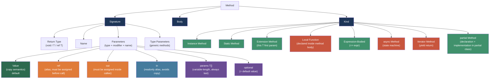
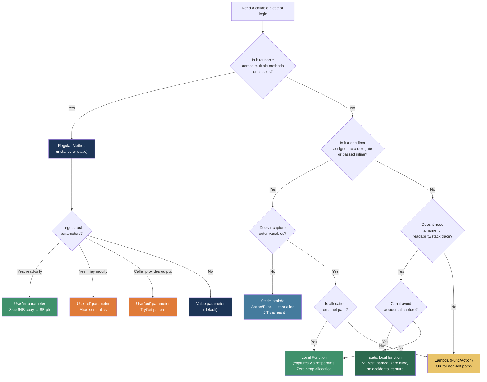

> [!success] Mastery Check
> - [x] **Studied Well** ✅ 2026-06-25
> - [x] **Can explain the concept without notes** ✅ 2026-06-25
> - [x] **Can answer interview questions confidently** ✅ 2026-06-25
> - [x] **Can implement it in a real project** ✅ 2026-06-25


## 📍 PART 0 — Navigation & Context

### Where This Topic Lives

```
C# Language Mastery
└── Core Language Constructs
    ├── Data Types & Variables (2.03–2.04)
    ├── Operators (2.05)
    ├── Control Flow (2.06)
    ├── ► Methods  ← YOU ARE HERE (2.07)
    ├──   Classes (2.08)
    ├──   Properties & Access Modifiers (2.09)
    └──   Delegates, Func, Action, Closures (2.21)
```

### What You Need Before This

- [[2.03 — Data Types, Literals, and Type Conversions]] — parameter types are data types
- [[2.06 — Control Flow]] — `return` is the primary branching mechanism inside a method
- [[2.16 — Value Types vs Reference Types: Deep Mechanics]] — parameter-passing semantics differ completely by type

### What This Unlocks After

- [[2.08 — Classes]] — instance vs static methods, constructor chaining, and method hiding
- [[2.21 — Delegates, Func, Action, and Closures]] — local functions and lambdas share syntax; both capture variables via display classes
- [[2.10 — Inheritance]] — `virtual`/`override`/`new` — method dispatch decisions begin here
- [[2.29 — async/await: The State Machine]] — async methods are compiler-generated state machines hanging off ordinary method signatures

### Why This Matters at Scale

Every line of logic in a .NET system passes through a method boundary. Getting the boundary wrong — wrong parameter modifiers, wrong overload resolution, invisible allocations from captured locals — is the difference between code that scales and code that surprises you in production.

---

## 🧠 PART 1 — The Core Mental Model

### The Fundamental Rule

> **A method signature is a contract between caller and callee. Parameter modifiers (`ref`, `out`, `in`) define who owns the memory and who is responsible for writing it. Overload resolution is a compile-time algorithm, not a runtime choice. Local functions are closures compiled to methods on the enclosing type — not lambdas.**

### The Plain-Language Analogy

Think of a method signature like a **customs declaration form at a border crossing**. The form tells the inspector exactly what you're bringing (parameter types and names), what you're taking back (return type), and any special conditions (modifiers like `ref` or `out`). If you declare `out`, you're promising the inspector that the suitcase you're handing over will be packed before you leave — you must write to it. If you declare `in`, you're promising you won't modify the item at all — the inspector can check it safely. If you use `ref`, both parties know the item came pre-loaded and might come back changed. The form is verified at compile time: no one waits until you cross the border to find out you declared wrong.

Overload resolution is the **border agent choosing which station to direct you to** based purely on your form — they look at the declared contents (argument types) and route you to the matching checkpoint (overload) before you ever step through the door. If two checkpoints accept the same declaration, the agent picks the most specific one. If it's ambiguous, you don't get through at all.

### The Taxonomy Diagram



---

## 🔬 PART 2 — Deep Mechanics

### 2.1 What the Stack Actually Does on a Method Call

```
━━━━━━━━━━━━━━━━━━━━━━━━━━━━━━━━━━━━━━━━━━━━━━━━━━━━━━━━
SCENARIO: ProcessOrder(int orderId, decimal total, ref string status)
━━━━━━━━━━━━━━━━━━━━━━━━━━━━━━━━━━━━━━━━━━━━━━━━━━━━━━━━

BEFORE CALL (caller's stack frame):
┌──────────────────────────────────────┐
│  int orderId        = 4201   (4B)    │
│  decimal total      = 99.99  (16B)   │
│  string status      = ptr──────────► │  (on heap: "Pending")
└──────────────────────────────────────┘

AFTER CALL STARTS (callee's stack frame pushed):
┌──────────────────────────────────────┐ ← caller frame
│  int orderId        = 4201           │
│  decimal total      = 99.99          │
│  string status      = ptr            │
└──────────────────────────────────────┘
┌──────────────────────────────────────┐ ← callee frame
│  [return address]                    │
│  int orderId        = 4201 (COPY)    │ ← value param: independent copy
│  decimal total      = 99.99 (COPY)   │ ← value param: 16 bytes copied
│  ref string status  = &caller.status │ ← ref param: POINTER to caller's slot
└──────────────────────────────────────┘

Changing orderId inside callee: caller unchanged (copy)
Changing status inside callee via ref: caller's string slot is reassigned
━━━━━━━━━━━━━━━━━━━━━━━━━━━━━━━━━━━━━━━━━━━━━━━━━━━━━━━━
Cost labels:
  value param (int):     4-byte push          ~0 cost
  value param (decimal): 16-byte push         ~1–2 ns
  ref/out/in param:      8-byte pointer push  ~0 cost, aliasing semantics
```

### 2.2 Parameter Modifiers: What the Compiler Generates

The four parameter modifiers map to distinct IL concepts:

```csharp
// Source:
void Demo(int val, ref int r, out int o, in int i) { o = 0; }

// What the compiler emits (IL pseudocode):
// .method instance void Demo(
//   int32 val,           // ByValue — copied on entry
//   int32& r,            // ByRef — managed pointer
//   [out] int32& o,      // ByRef with [Out] attribute — callee MUST write
//   [in] int32& i        // ByRef with [In] attribute — callee MUST NOT write
// )

// Runtime cost comparison for a 64-byte struct parameter:
// by value:  64 bytes pushed onto stack every call   ← expensive in hot loops
// ref/in:     8 bytes (pointer) pushed onto stack    ← always cheap
// in vs ref: both pass a pointer; 'in' is a promise not to mutate
//            the JIT uses this to skip defensive copies on readonly struct fields
```

**Definite assignment enforcement (compiler, not runtime):**

```csharp
// out parameter: compiler proves you wrote to it on ALL code paths
void Parse(string input, out int result)
{
    if (int.TryParse(input, out result)) return; // result written here
    result = -1;                                  // written on else path too
    // If you remove either assignment: CS0177 compile error
}

// ref parameter: compiler requires variable to already be assigned BEFORE the call
int x;            // unassigned
M(ref x);         // ⚠️ CS0165: Use of unassigned local variable 'x'
int y = 0;
M(ref y);         // ✅ fine — y has a definite value before the call
```

**Runtime cost labels:**

- Value param copy (int): O(1), ~0 extra ns
- Value param copy (64-byte struct): O(1), ~3–5 ns per call in hot path
- ref/out/in: O(1), pointer-sized push, negligible

### 2.3 Overload Resolution: The Algorithm

```
Overload resolution runs at COMPILE TIME in four phases:

Phase 1 — Candidate collection
  Collect all methods in the type hierarchy with the matching name.
  Include extension methods from imported namespaces (last priority).

Phase 2 — Applicability filter
  Eliminate candidates where arguments cannot be implicitly converted
  to parameter types (widening, interface, base class conversions).

Phase 3 — Best-match selection (specificity)
  Among applicable candidates, prefer the "most specific":
  - Exact type match > derived type > base class
  - Non-params > params array expansion
  - Non-optional > optional default fill
  - Generic instantiation < concrete overload

Phase 4 — Uniqueness check
  If exactly one best candidate: chosen.
  If zero: CS1501 (no overload takes N arguments).
  If two or more: CS0121 (ambiguous call).
```

```csharp
// Overload resolution in practice — order matters
void Ship(int quantity)          { }  // A
void Ship(long quantity)         { }  // B
void Ship(double quantity)       { }  // C
void Ship(object quantity)       { }  // D

Ship(10);      // Picks A (int is exact match — no conversion needed)
Ship(10L);     // Picks B (long is exact)
Ship(10.0);    // Picks C (double is exact)
Ship((byte)5); // Picks A (byte → int is widening; A is more specific than B/C/D)

// Ambiguity trap:
void Transfer(int amount, long destination) { }   // E
void Transfer(long amount, int destination) { }   // F
Transfer(1, 2);   // CS0121: ambiguous! int→int (E first param) vs int→int (F second param)
                  // both require exactly one widening conversion — tie, no winner
```

**The `params` rule:**

```csharp
// params is always the last resort
void Log(string message) { }          // G
void Log(params string[] parts) { }   // H

Log("hello");   // Picks G — exact match wins over params expansion
Log("a", "b");  // Picks H — only applicable candidate (G takes 1 argument)
```

**Runtime cost label:** Overload resolution costs zero at runtime — it is purely a compile-time decision baked into the call-site IL.

### 2.4 Local Functions vs Lambdas: The Compiler Transformation

This is one of the most misunderstood distinctions in modern C#.

```csharp
// ─────────────────────────────────────────────
// Local function WITH NO CAPTURES → static method on enclosing type
// ─────────────────────────────────────────────
void ProcessPayment(decimal amount)
{
    var fee = CalculateFee(amount);  // calls local function

    static decimal CalculateFee(decimal amt)   // static: no access to outer scope
        => amt * 0.029m + 0.30m;
}

// Compiler generates (approximately):
// private static decimal <ProcessPayment>g__CalculateFee|0_0(decimal amt)
//     => amt * 0.029m + 0.30m;
// Zero allocation. Direct static call.

// ─────────────────────────────────────────────
// Local function WITH CAPTURES → still a method, NOT a display class
// ─────────────────────────────────────────────
void ProcessOrder(int orderId)
{
    int threshold = 100;

    bool IsOverThreshold(int qty) => qty > threshold;  // captures threshold

    // Compiler generates:
    // The captured variable is passed as a ref parameter (by reference):
    // private static bool <ProcessOrder>g__IsOverThreshold|0_0(int qty, ref int threshold)
    //     => qty > threshold;
    // No heap allocation for the closure! Captured as ref parameter.
}

// ─────────────────────────────────────────────
// Lambda (Func<T>) WITH CAPTURES → display class on heap
// ─────────────────────────────────────────────
void ProcessOrder2(int orderId)
{
    int threshold = 100;

    Func<int, bool> isOver = qty => qty > threshold;   // lambda captures threshold

    // Compiler generates:
    // class <>c__DisplayClass_0_0 {          // NEW HEAP OBJECT
    //     public int threshold;
    //     public bool <ProcessOrder2>b__0(int qty) => qty > threshold;
    // }
    // new <>c__DisplayClass_0_0 { threshold = 100 }  ← heap allocation!
}
```

```
Memory comparison at the call site:
┌──────────────────────────────────────────────────────────┐
│ static local function (no capture):                      │
│   Stack: nothing extra                                   │
│   Heap:  0 bytes                                         │
│   Call:  direct CALL instruction                         │
├──────────────────────────────────────────────────────────┤
│ local function with captures:                            │
│   Stack: ref parameters for each captured variable       │
│   Heap:  0 bytes                                         │
│   Call:  direct CALL instruction + extra params          │
├──────────────────────────────────────────────────────────┤
│ lambda (Func<T>) with captures:                          │
│   Stack: pointer to display class object                 │
│   Heap:  ~32–48 bytes (display class object)             │
│   Call:  virtual CALLVIRT through delegate               │
└──────────────────────────────────────────────────────────┘
```

**Runtime cost labels:**

- Static local function: ~2–5 ns (same as any static method)
- Capturing local function: ~2–5 ns (no extra allocation vs 0-capture)
- Capturing lambda (Func<T>): ~12–25 ns + ~32–48 bytes heap first call

### 2.5 Expression-Bodied Methods and What They Cost

```csharp
// Expression-bodied: syntactic sugar only — identical IL output
public decimal GetDiscountedTotal(decimal basePrice, decimal rate)
    => basePrice * (1m - rate);

// Equivalent statement-bodied:
public decimal GetDiscountedTotal2(decimal basePrice, decimal rate)
{
    return basePrice * (1m - rate);
}

// The compiler emits IDENTICAL IL for both.
// Expression-bodied is purely a readability choice — zero runtime difference.

// ref return (expression-bodied):
private decimal _price;
public ref decimal PriceRef => ref _price;  // returns a reference to the field
// Caller can then do:  container.PriceRef *= 0.9m;  // in-place modification, zero copy
```

---

## 💻 PART 3 — Production Code Patterns

### 3.1 The Null Guard at the Boundary

Every public method that accepts a reference type should validate inputs at the boundary — once, explicitly, before any logic runs.

```csharp
// ⚠️ WRONG: Silent NullReferenceException deep inside logic
public decimal CalculateOrderTotal(Order order, DiscountPolicy policy)
{
    return order.LineItems.Sum(li => li.Price * li.Quantity)   // NRE here if order is null
           * (1m - policy.Rate);                               // or here if policy is null
}

// ✅ CORRECT: Explicit guard at the boundary — fail fast with clear message
public decimal CalculateOrderTotal(Order order, DiscountPolicy policy)
{
    ArgumentNullException.ThrowIfNull(order);    // C# 10+: one-liner, throws with param name
    ArgumentNullException.ThrowIfNull(policy);

    // From here on, order and policy are guaranteed non-null
    return order.LineItems.Sum(li => li.Price * li.Quantity)
           * (1m - policy.Rate);
}

// WHY: The caller's stack trace points at the call site, not at a random
// NullReferenceException 4 frames deep. Debugging time drops from minutes to seconds.
```

### 3.2 Using `out` for Try-Parse Patterns (The TryGet Shape)

```csharp
// The TryGet pattern: return bool, output result via out.
// This is the standard shape for operations that can legitimately fail.

// ⚠️ WRONG: throw on "expected" failure — throws are expensive (~1–5 μs)
public OrderItem GetItem(string sku)
{
    var item = _catalog.FirstOrDefault(i => i.Sku == sku);
    if (item == null) throw new KeyNotFoundException($"SKU '{sku}' not found");
    return item;
}

// ✅ CORRECT: Return bool + out — no exception cost on miss
public bool TryGetItem(string sku, out OrderItem item)
{
    // out parameters must be assigned on all code paths
    item = _catalog.FirstOrDefault(i => i.Sku == sku);
    return item != null;
}

// Usage — caller controls the failure path cleanly:
if (catalog.TryGetItem("SKU-1234", out var item))
    ProcessItem(item);
else
    LogUnknownSku("SKU-1234");

// WHY: int.TryParse, Dictionary.TryGetValue — the entire BCL uses this shape.
// Exceptions signal exceptional conditions, not expected data misses.
```

### 3.3 `in` Parameters for Large Structs in Hot Paths

```csharp
// Payment processing: PricingEngine called 10,000×/sec in high-traffic periods.
// PricingContext is a 72-byte readonly struct.

public readonly struct PricingContext
{
    public readonly decimal BasePrice;    // 16 bytes
    public readonly decimal TaxRate;      // 16 bytes
    public readonly decimal DiscountRate; // 16 bytes
    public readonly int     RegionCode;   // 4 bytes
    public readonly bool    IsPremium;    // 1 byte + padding
    // Total: ~72 bytes
}

// ⚠️ WRONG: 72 bytes copied per call — in a 10k/sec hot path = ~720 KB/sec of pointless copying
public decimal ComputeFinalPrice(PricingContext ctx)
    => ctx.BasePrice * (1m + ctx.TaxRate) * (1m - ctx.DiscountRate);

// ✅ CORRECT: Pass by readonly reference — 8-byte pointer, no copy
public decimal ComputeFinalPrice(in PricingContext ctx)
    => ctx.BasePrice * (1m + ctx.TaxRate) * (1m - ctx.DiscountRate);

// WHY: 'in' guarantees the callee cannot modify ctx (the JIT enforces this).
// The JIT may additionally skip defensive copies if PricingContext is a 'readonly struct'.
// At 10,000 calls/sec, this eliminates ~720 KB/sec of stack writes.
```

### 3.4 Static Local Functions for Helper Logic Without Allocation

```csharp
// Order validation service: helper is used only inside this method, but we want
// it named (for clarity) and zero-allocation (for the hot path).

public IReadOnlyList<ValidationError> ValidateOrder(Order order)
{
    ArgumentNullException.ThrowIfNull(order);

    var errors = new List<ValidationError>();

    foreach (var line in order.LineItems)
    {
        if (!IsValidLineItem(line, out var error))
            errors.Add(error);
    }

    return errors;

    // Static local function: cannot accidentally capture 'errors' or 'order'.
    // The 'static' keyword is a safety net: the compiler errors if you try to capture.
    // Zero heap allocation — compiled to a static method on the enclosing type.
    static bool IsValidLineItem(LineItem item, out ValidationError error)
    {
        if (item.Quantity <= 0)
        {
            error = new ValidationError(item.Sku, "Quantity must be positive");
            return false;
        }
        if (item.Price < 0m)
        {
            error = new ValidationError(item.Sku, "Price cannot be negative");
            return false;
        }
        error = default;
        return true;
    }
}

// WHY 'static': makes the intent explicit (this helper is self-contained),
// prevents the accidental capture bug, and gives the JIT the best optimization opportunities.
```

### 3.5 Optional Parameters vs Overloads: The API Design Choice

```csharp
// When building a public API (library, SDK endpoint), prefer overloads over optional params.
// When building internal helpers, optional params reduce boilerplate.

// ⚠️ WRONG for public API: optional params are baked into the caller's assembly at compile time.
// If you change a default value, callers must RECOMPILE — not just retarget.
public void ShipOrder(int orderId, bool expressShipping = false, string courier = "Default")
{ }

// ✅ CORRECT for public API: overloads — changing the default behavior means changing one overload
public void ShipOrder(int orderId) => ShipOrder(orderId, expressShipping: false);
public void ShipOrder(int orderId, bool expressShipping)
    => ShipOrder(orderId, expressShipping, courier: "FedEx");
public void ShipOrder(int orderId, bool expressShipping, string courier)
{
    // actual implementation here
}

// WHY: Optional parameter defaults are embedded in the call-site IL by the compiler.
// Binary compatibility breaks if you change a default in a shipped library without recompilation.
// Overloads are late-bound — the implementation can evolve independently.

// ✅ CORRECT for internal helpers (not part of public API surface):
internal void EnqueueNotification(
    string userId,
    string message,
    NotificationChannel channel = NotificationChannel.Email,  // fine for internal use
    bool isUrgent = false)
{ }
```

### 3.6 `ref` Returns for In-Place Mutations on Value Type Fields

```csharp
// Inventory system: updating stock counts without unnecessary copies.

public class InventoryStore
{
    // Internal array of structs — all data contiguous in memory (cache-friendly)
    private StockRecord[] _records = new StockRecord[10_000];

    // ⚠️ WRONG: returns a COPY — caller's modification goes nowhere
    public StockRecord GetRecord(int index) => _records[index];

    // ✅ CORRECT: returns a managed reference to the actual array element
    public ref StockRecord GetRecordRef(int index)
    {
        if ((uint)index >= (uint)_records.Length)
            throw new ArgumentOutOfRangeException(nameof(index));
        return ref _records[index];   // returns a reference, not a copy
    }
}

// Usage — zero-copy in-place update:
ref var record = ref store.GetRecordRef(42);
record.QuantityOnHand -= 5;   // modifies _records[42].QuantityOnHand directly
record.LastUpdated = DateTime.UtcNow;

// WHY: For a hot path modifying millions of inventory records per minute,
// eliminating the copy-and-replace cycle (read 32 bytes, write back 32 bytes)
// measurably reduces memory bandwidth usage and GC pressure.
```

### 3.7 Named Arguments for Clarity in Boolean-Heavy Signatures

```csharp
// User service — method with multiple bool flags is a readability trap.

// ⚠️ WRONG: What does 'true, false, true' mean at the call site?
CreateUser("alice@example.com", true, false, true);

// The signature:
public UserAccount CreateUser(
    string email,
    bool sendWelcomeEmail,
    bool requireEmailVerification,
    bool isPremium)
{ /* ... */ }

// ✅ CORRECT: Named arguments eliminate the "boolean blindness" problem
var account = CreateUser(
    email:                    "alice@example.com",
    sendWelcomeEmail:         true,
    requireEmailVerification: false,
    isPremium:                true
);

// Even better: introduce a strongly-typed options object for 3+ boolean flags
public record UserCreationOptions(
    bool SendWelcomeEmail         = true,
    bool RequireEmailVerification = false,
    bool IsPremium                = false
);

public UserAccount CreateUser(string email, UserCreationOptions options = default)
{ /* ... */ }

// WHY: Code is read 10× more than it is written.
// Named args cost nothing at runtime (order is irrelevant to the compiler,
// named args are rearranged to positional order before emission).
```

---

## ⚠️ PART 4 — Gotchas & Anti-Patterns

### Gotcha 1: Overloading on Return Type Is Impossible — and Why It Matters

Engineers coming from languages like Haskell or Rust expect return-type inference to drive dispatch. C# overload resolution uses only the method name, type parameters, and parameter types — the return type is not part of the resolution.

```csharp
// ⚠️ WRONG — Does not compile: CS0111 "Type already defines a member called 'Parse'"
public static int    Parse(string input) { return int.Parse(input); }
public static double Parse(string input) { return double.Parse(input); }

// The compiler has no way to choose between them at a call site:
//   var x = Parse("42");   // int or double? Ambiguous.

// ✅ CORRECT: distinguish by name or parameter type
public static int    ParseInt(string input)    => int.Parse(input);
public static double ParseDouble(string input) => double.Parse(input);

// OR: Use a generic method when the same logic works for any numeric type
public static T Parse<T>(string input) where T : IParsable<T>
    => T.Parse(input, null);

// WHY: Overload resolution is a purely syntactic algorithm.
// The compiler resolves the call before it knows what you're assigning to.
// This is a deliberate C# design decision for predictability and readability.
```

### Gotcha 2: Captured Loop Variable in a Lambda (The Classic Bug)

```csharp
// Engineers who understand closures still hit this in production code.
// The bug: a lambda captures the VARIABLE, not the VALUE at capture time.

// ⚠️ WRONG: All actions print "3" — the variable i is shared by all closures
var actions = new List<Action>();
for (int i = 0; i < 3; i++)
    actions.Add(() => Console.WriteLine(i));   // captures the variable 'i', not 5's value

actions.ForEach(a => a());  // prints: 3  3  3
// After the loop, i == 3 (the loop's termination value). All closures share one 'i'.

// ✅ CORRECT: Capture a copy inside the loop body
var actions2 = new List<Action>();
for (int i = 0; i < 3; i++)
{
    int captured = i;   // new variable per iteration — each lambda gets its own 'captured'
    actions2.Add(() => Console.WriteLine(captured));
}
actions2.ForEach(a => a());  // prints: 0  1  2

// WHY: The compiler promotes 'i' to a display class field. All three lambdas reference
// the SAME display class instance's 'i' field. When the loop ends, i == 3.
// Creating 'captured' inside the loop body forces a new display class per iteration.
```

### Gotcha 3: `params` Allocates an Array — Even If You Pass One Argument

```csharp
// The params keyword is convenient, but every call site that uses the array form
// allocates a new T[] on the heap.

public static void Log(string message, params object[] args)
    => Console.WriteLine(message, args);

// ⚠️ Each of these allocates a new object[] on the heap:
Log("Processing order {0}", orderId);           // new object[] { orderId } + boxing
Log("User {0} placed order {1}", userId, oid);  // new object[] { userId, oid }

// In a logging hot path called 100k times/second, this is significant GC pressure.

// ✅ CORRECT for hot paths: provide concrete overloads for common arities
public static void Log(string message)                         { }
public static void Log(string message, object arg1)            { }
public static void Log(string message, object arg1, object arg2) { }
public static void Log(string message, params object[] args)   { }
// The first three are chosen for 0/1/2-argument calls — no allocation.
// The BCL's string.Format(string, ...) works exactly this way.

// WHY: The compiler generates a new T[] at every call site that uses the expansion form.
// Providing non-params overloads for the most common arities eliminates the allocation.
// .NET 8 adds params ReadOnlySpan<T> — no heap allocation, stack-allocated for small arrays.
```

### Gotcha 4: Changing a Default Parameter Value is a Binary Breaking Change

```csharp
// In a public library (NuGet package / shared assembly):
// v1.0 ships this:
public void ProcessPayment(decimal amount, string currency = "USD") { }

// Callers compile to:
// call ProcessPayment(amount, "USD")   ← "USD" is baked into the caller's IL

// v1.1 ships this:
public void ProcessPayment(decimal amount, string currency = "GBP") { }

// ⚠️ PROBLEM: Existing callers still pass "USD" — they don't need to recompile.
// The "GBP" change affects ONLY new compilations against v1.1.
// This is a silent, insidious behavioral change that violates caller expectations.

// ✅ CORRECT: Use overloads for public APIs — they ARE binary-compatible changes
// (as long as you ADD overloads, not change existing signatures)
public void ProcessPayment(decimal amount)                  => ProcessPayment(amount, "GBP");
public void ProcessPayment(decimal amount, string currency) { /* implementation */ }

// WHY: Named optional parameter defaults are constant expressions emitted at the call site.
// They are not method body code. Changing them in a library does not affect compiled callers.
```

### Gotcha 5: `ref` Does Not Mean "Pass Object By Reference" for Reference Types

```csharp
// The most persistent misunderstanding about ref with reference types.
// Reference types are ALREADY passed by reference (pointer).
// Adding 'ref' to a reference type parameter does NOT give you a second level of indirection
// to mutation — it gives you the ability to REPLACE the reference itself in the caller.

public static void BuggyReplace(List<int> list)
{
    list = new List<int> { 99, 100 };   // only replaces the local COPY of the pointer
                                         // caller's variable still points to original
}

public static void ActualReplace(ref List<int> list)
{
    list = new List<int> { 99, 100 };   // NOW replaces the caller's reference slot
}

// Without ref:
var nums = new List<int> { 1, 2, 3 };
BuggyReplace(nums);
Console.WriteLine(nums.Count);   // 3 — original unchanged

// With ref:
ActualReplace(ref nums);
Console.WriteLine(nums.Count);   // 2 — caller now has the new list

// WHY: 'list' without ref IS a reference type — the pointer is passed by value.
// Mutations through the pointer (list.Add()) are visible to the caller because
// both variables point to the same heap object. But REASSIGNING 'list' only changes
// the local copy of the pointer. Adding 'ref' makes the parameter an alias to the
// CALLER'S POINTER VARIABLE — reassignment now modifies the caller's slot.
```

---

## 📊 PART 5 — Performance Implications

### 5.1 Allocation Characteristics Table

|Scenario|Allocation Behavior|Approx Cost|
|---|---|---|
|Value param (int, bool, struct ≤8B)|No allocation; pushed onto stack|O(1), ~0–1 ns|
|Value param (large struct, 64B)|64 bytes copied per call|O(1), ~3–5 ns|
|`ref`/`out`/`in` param (any size)|8-byte pointer; no data copy|O(1), ~0 ns|
|Static local function (no capture)|No allocation; direct static call|O(1), ~2 ns|
|Local function with captures|No heap allocation; ref params|O(1), ~2–3 ns|
|Lambda with captures (Func<T>)|One display class heap alloc ~32–48 B|O(1), ~12–25 ns first call|
|Static lambda (no capture, C# 9)|Cached singleton delegate; ~0 B amortized|O(1), ~2 ns after first|
|`params T[]` call site|New T[] allocated per call|O(1), ~16+n*8 bytes heap|
|`params ReadOnlySpan<T>` (.NET 8)|Stack-allocated for small N|O(1), ~0 bytes heap|
|Expression-bodied method|Identical to statement-bodied|No difference|
|Optional param default value|No allocation (constant in caller IL)|O(1), ~0 ns|

### 5.2 BenchmarkDotNet: Method Call Overhead

```csharp
// Expected output (approximate, .NET 8, x64):
// ┌─────────────────────────┬──────────┬──────────┬──────────────┐
// │ Method                  │ Mean     │ Alloc    │ Notes        │
// ├─────────────────────────┼──────────┼──────────┼──────────────┤
// │ ValueParam_Int          │  1.8 ns  │    0 B   │ baseline     │
// │ ValueParam_LargeStruct  │  4.2 ns  │    0 B   │ 64B copy     │
// │ InParam_LargeStruct     │  1.9 ns  │    0 B   │ ptr only     │
// │ StaticLocalFunction     │  2.1 ns  │    0 B   │              │
// │ LocalFuncWithCapture    │  2.4 ns  │    0 B   │              │
// │ LambdaWithCapture       │ 14.3 ns  │   48 B   │ display cls  │
// │ ParamsOneArg            │  8.7 ns  │   24 B   │ array alloc  │
// │ ParamsOneArgOverload    │  1.9 ns  │    0 B   │ direct call  │
// └─────────────────────────┴──────────┴──────────┴──────────────┘

[MemoryDiagnoser]
public class MethodCallBenchmarks
{
    private readonly LargeContext _ctx = new LargeContext();

    [Benchmark(Baseline = true)]
    public int ValueParam_Int() => AddByValue(42, 10);

    [Benchmark]
    public decimal ValueParam_LargeStruct() => ComputeByValue(_ctx);

    [Benchmark]
    public decimal InParam_LargeStruct() => ComputeByIn(in _ctx);

    [Benchmark]
    public int StaticLocalFunction()
    {
        return Compute(5);
        static int Compute(int x) => x * x;
    }

    [Benchmark]
    public int LocalFuncWithCapture()
    {
        int factor = 5;
        return Compute(10);
        int Compute(int x) => x * factor;  // captures factor
    }

    [Benchmark]
    public int LambdaWithCapture()
    {
        int factor = 5;
        Func<int, int> fn = x => x * factor;   // heap allocation
        return fn(10);
    }

    [Benchmark]
    public void ParamsOneArg() => LogWithParams("order {0}", 42);

    [Benchmark]
    public void ParamsOneArgOverload() => LogNoParams("order", 42);

    private int AddByValue(int a, int b) => a + b;
    private decimal ComputeByValue(LargeContext ctx) => ctx.A + ctx.B;
    private decimal ComputeByIn(in LargeContext ctx) => ctx.A + ctx.B;
    private void LogWithParams(string msg, params object[] args) { }
    private void LogNoParams(string msg, object arg1) { }
}

public readonly struct LargeContext
{
    public readonly decimal A, B, C, D;  // 64 bytes total
}
```

### 5.3 When to Care / When to Ignore

**When this costs you:**

- **`params` in a logging hot path**: Every call with the array expansion form allocates. At 100k log statements/sec in a high-traffic API, this produces ~100k small array allocations per second — meaningful Gen0 pressure.
- **Large struct passed by value in a tight loop**: A 64-byte struct copied 10 million times in a game loop or signal-processing pipeline wastes ~640 MB of memory bandwidth.
- **Capturing lambdas in LINQ over hot collections**: Each query that creates a new lambda with captures creates a display class on the heap.
- **Missing `static` on local functions**: Without `static`, the compiler allows accidental captures, potentially creating display classes you didn't intend.

**When this doesn't matter:**

- Method call overhead on the non-hot path (anything called < 10k/sec). A ~2 ns difference is invisible at human scale.
- Optional parameter defaults in internal code — the binary-compat issue only matters for public APIs.
- Named arguments — zero runtime cost, rearranged to positional order before IL emission.
- Expression-bodied vs statement-bodied — identical IL, pick whichever reads better.

---

## 🎤 PART 6 — Interview Arsenal

### 6.1 The Question Bank

---

> **Q: "What's the difference between `ref`, `out`, and `in` parameters in C#?"**

**Average Answer:** "`ref` passes by reference so you can modify it, `out` requires you to assign a value, and `in` is like `ref` but read-only."

**Why That's Insufficient:** It's mostly correct but misses the _compiler enforcement mechanism_, the _runtime cost implication_ (all three are pointers — same cost), and the _JIT interaction_ with `in` on readonly structs.

**Great Answer:**

> "All three — `ref`, `out`, and `in` — are passed as managed pointers at the IL level, so they all have the same runtime cost: you push an 8-byte pointer instead of copying the value. The difference is entirely in the contract they express and how the compiler enforces it. `ref` requires the caller to provide a definitely-assigned variable, and the callee can read and write it — it's a true alias. `out` tells the compiler 'the callee is responsible for writing this before returning,' so the caller doesn't need a pre-assigned variable and the compiler errors if the callee might return without writing to it. `in` is a readonly alias: the compiler prevents the callee from assigning to it, and more importantly, when `in` is combined with a `readonly struct`, the JIT can eliminate defensive copies that would otherwise occur when calling methods on a struct in a readonly context. I use `in` primarily for large structs in hot paths where I want to avoid the copy cost without allowing mutation."

---

> **Q: "How does overload resolution work in C#, and can it resolve on return type?"**

**Average Answer:** "The compiler picks the best matching overload based on the argument types. No, it can't resolve on return type."

**Why That's Insufficient:** It doesn't explain the algorithm well enough to reason about ambiguity, and doesn't touch on the practical failure modes.

**Great Answer:**

> "Overload resolution is a purely compile-time, four-phase algorithm. First, the compiler collects all candidates with the right name — including extension methods. Second, it filters to those where the arguments can be implicitly converted to the parameter types. Third, it picks the 'most specific' candidate: exact type matches beat widening conversions, non-params beats params expansion, concrete types beat generics. Fourth, if exactly one candidate is most specific, it wins; otherwise you get an ambiguity error. Return type is deliberately excluded — the compiler resolves the call before it knows what you're assigning the result to, and including return type would create calls whose meaning depends on assignment context, which would be deeply confusing. I've run into the 'most specific' rule subtly: if you have an `int` overload and a `long` overload and pass a `byte`, you get the `int` overload — widening from `byte` to `int` is the shorter path. If both paths are equally long, you get an ambiguity error at compile time."

---

> **Q: "What is a local function and how does it differ from a lambda?"**

**Average Answer:** "A local function is a function defined inside another function. Lambdas are anonymous functions assigned to delegate types."

**Why That's Insufficient:** Misses the critical compiler transformation difference and the allocation implications.

**Great Answer:**

> "The surface-level difference is syntax — a local function has a method declaration inside a method body, while a lambda is an expression assigned to a `Func` or `Action`. But the important difference is what the compiler does with captures. A local function that captures outer variables is compiled to a static method on the enclosing type, and the captured variables are passed as `ref` parameters — zero heap allocation. A capturing lambda, by contrast, generates a display class: a heap-allocated object that holds the captured variables and exposes them as fields, which the lambda body becomes a method on. This means a local function never allocates just for the capture mechanism, while a lambda with captures allocates every time the enclosing method runs. I always prefer static local functions for named helpers inside a method — they're zero-allocation, compile to named methods (so stack traces are readable), and the `static` modifier prevents accidental captures."

---

> **Q: "When should you use optional parameters versus overloads?"**

**Average Answer:** "Optional parameters are more convenient; overloads give more flexibility."

**Why That's Insufficient:** Misses the binary breaking-change issue, which is a real production concern.

**Great Answer:**

> "For internal code, optional parameters reduce boilerplate and I use them freely. For any code on a public API surface — a NuGet package, a shared library, an SDK — I always prefer overloads, and the reason is binary compatibility. Optional parameter defaults are constant expressions baked into the caller's IL at compile time. If I ship version 1.0 with `bool sendEmail = false` and then change it to `true` in version 1.1, every caller compiled against 1.0 still passes `false` — they don't benefit from my change without recompiling. Overloads don't have this problem: I can add an overload or change the implementation of an existing one without affecting callers' compiled code. The BCL follows this convention consistently — `string.Format`, `StringBuilder.Append`, and others all provide explicit overloads for the most common arities rather than relying on optional parameters."

---

### 6.2 The Trick Questions

> **"Can you overload a method that differs only by `ref` and `out` modifiers?"** **Trap:** Sounds like it should work since `ref` and `out` are different keywords. **Answer:** No — `ref` and `out` are not part of the method signature for overloading purposes. `void M(ref int x)` and `void M(out int x)` produce CS0663. However, `in` can coexist with `ref` as a distinct overload: `void M(int x)` and `void M(in int x)` are valid overloads (value vs readonly reference).

> **"Does a `static` local function allocate less than a non-static one?"** **Trap:** Engineers assume "static = faster" but miss the actual mechanism. **Answer:** Both `static` and non-static local functions without captures produce zero allocation. The `static` keyword prevents the function from _accidentally_ capturing variables. If a non-static local function captures, it uses `ref` parameters — still zero allocation. A capturing _lambda_ (assigned to `Func<T>`) allocates regardless of whether it could theoretically have been a local function.

> **"What happens if you call a method with named arguments in a different order?"** **Trap:** Sounds like it could be a runtime issue. **Answer:** Named arguments are rearranged to positional order by the compiler before IL is emitted. There is zero runtime cost and zero behavioral difference. The compiler validates the names at compile time; incorrect names produce CS1739.

> **"Can a local function be async or use `yield return`?"** **Trap:** Looks like a language limitation that shouldn't exist. **Answer:** Yes to both. `async` local functions generate a nested state machine struct on the enclosing type. `yield return` local functions generate an iterator state machine class. Both are fully supported. This is useful for async validation helpers or lazy sequence builders inside a method.

> **"Is `params` the last parameter because of a language rule or a convention?"** **Answer:** A hard language rule. The compiler rejects `params` in any position except the last parameter (CS0231). There can only be one `params` parameter per method.

---

### 6.3 Red Flags to Avoid

```
❌ "ref passes objects by reference" — reference types are ALREADY passed by pointer value;
   ref on a reference type allows REPLACING the caller's reference slot, not double-indirection

❌ "local functions are just named lambdas" — they compile to static methods, not delegate objects;
   they have different allocation characteristics and different compiler transformations

❌ "optional parameter defaults are evaluated at call time" — they're constant expressions
   embedded in the CALLER's IL at compile time; this is the source of binary breaking changes

❌ "the compiler picks the closest overload" — "closest" is ill-defined; the correct term is
   "most specific applicable candidate"; explain the specificity rules, not just "closest"

❌ "params is just syntax sugar for passing an array" — it IS array sugar, but each call site
   that uses the expansion form allocates a new array; this has real production implications

❌ "in parameters are just const refs" — 'in' also interacts with the JIT's defensive copy
   elimination for readonly structs; calling it "just a const ref" misses the optimization story

❌ "you can overload on return type in C# with generics" — generic methods with different
   type constraints are not the same as overloading on return type; type inference still uses
   argument types, not the return type, to resolve
```

---

## 🔀 PART 7 — Decision Framework



---

## ✅ PART 8 — Self-Check

### Conceptual Questions

1. A method is declared `public decimal Calculate(decimal amount, decimal rate = 0.1m)`. A caller compiles against v1 of your library and passes only `amount`. You later ship v2 where you change the default to `0.15m`. Does the existing compiled caller now use `0.15m`? Explain why or why not.
    
2. You have two overloads: `void Process(int x)` and `void Process(long x)`. A caller passes a `byte`. Which overload is selected, and why?
    
3. A local function captures `int count` from its enclosing method. Explain what the compiler generates — is there a heap allocation? How is `count` accessed?
    
4. You declare `void M(ref List<string> items)`. A caller does `M(ref myList)`. Inside `M`, you call `items.Add("x")`. The caller's list changes. You also do `items = new List<string>()`. Does the caller's `myList` now point to the new list? Why?
    
5. What is the difference between `params string[]` and `params ReadOnlySpan<string>` (.NET 8)? Which allocates? When would you prefer each?
    
6. A method has the signature `bool TryParse(string input, out decimal result)`. What must be true about `result` on every possible code path inside the method body? What compiler error occurs if it's not?
    
7. You want a helper function inside a payment processing method that is guaranteed to never accidentally capture outer variables like `decimal balance` or `string accountId`. Which keyword enforces this? What compile error do you get if you accidentally capture anyway?
    
8. Two overloads exist: `void Send(string message, object arg1)` and `void Send(string message, params object[] args)`. A caller writes `Send("hello", userId)`. Which is picked? What if the caller writes `Send("hello", userId, orderId)`?
    
9. Explain why `void Log(string msg, params object[] args)` causes allocations even when passing a single `int` argument. Name two strategies to eliminate this in a high-throughput logging library.
    
10. A `static` method versus an instance method: is there any difference in how they appear on the call stack? Is there a performance difference for the call itself?
    

---

### Code Puzzles

**Puzzle 1:** What is printed?

```csharp
static void Double(int x) { x *= 2; }
static void DoubleRef(ref int x) { x *= 2; }

int n = 5;
Double(n);
Console.WriteLine(n);      // Line A

DoubleRef(ref n);
Console.WriteLine(n);      // Line B
```

<details> <summary>Answer (expand after trying)</summary>

**Line A:** `5` — `Double` receives a copy of `n`. The copy is doubled; `n` is unchanged. **Line B:** `10` — `DoubleRef` receives a managed pointer to `n`'s memory slot. `n *= 2` directly modifies the caller's variable.

</details>

---

**Puzzle 2:** Does this code compile? If so, what does it print?

```csharp
void Dispatch(object x)  => Console.WriteLine("object");
void Dispatch(string x)  => Console.WriteLine("string");
void Dispatch(IEnumerable<char> x) => Console.WriteLine("IEnumerable<char>");

Dispatch("hello");
Dispatch((object)"hello");
```

<details> <summary>Answer (expand after trying)</summary>

Both lines compile.

`Dispatch("hello")` → prints **"string"**. `string` is the most specific applicable candidate (exact type match over object and interface).

`Dispatch((object)"hello")` → prints **"object"**. The explicit cast changes the _compile-time type_ of the argument to `object`. Overload resolution uses the compile-time type, not the runtime type. The `object` overload is the only applicable one at compile time.

</details>

---

**Puzzle 3:** Is there a bug? What is printed?

```csharp
var operations = new List<Func<int>>();
for (int i = 0; i < 3; i++)
    operations.Add(() => i * i);

foreach (var op in operations)
    Console.Write(op() + " ");
```

<details> <summary>Answer (expand after trying)</summary>

**Output:** `9 9 9`

This is the classic loop variable capture bug. All three lambdas capture the **variable** `i` (not the value at capture time). After the loop, `i == 3`. All three closures share one display class instance whose `i` field is `3`. `3 * 3 = 9` for all three.

**Fix:** Introduce a copy inside the loop:

```csharp
for (int i = 0; i < 3; i++)
{
    int captured = i;
    operations.Add(() => captured * captured);
}
// Now prints: 0 1 4
```

</details>

---

**Puzzle 4:** Which of these local functions allocates? Which does not?

```csharp
void ProcessInvoice(Invoice invoice)
{
    decimal tax = 0.2m;

    // Function A:
    static decimal RoundTo2(decimal x) => Math.Round(x, 2);

    // Function B:
    decimal ApplyTax(decimal amount) => amount * (1m + tax);

    // Function C:
    Func<decimal, decimal> applyDiscount = d => d * 0.9m;  // no capture

    var rounded    = RoundTo2(invoice.Amount);
    var withTax    = ApplyTax(rounded);
    var discounted = applyDiscount(withTax);
}
```

<details> <summary>Answer (expand after trying)</summary>

**Function A (RoundTo2):** Zero allocation. Static local function with no captures → compiled to a static method. Direct call.

**Function B (ApplyTax):** Zero allocation. Non-static local function that captures `tax` → the compiler passes `tax` as a `ref decimal` parameter. No display class. No heap allocation.

**Function C (applyDiscount lambda):** This **might** allocate, but is often optimized. Because the lambda captures nothing, the JIT or compiler may cache the delegate as a static singleton. On .NET 8 with `Func<decimal,decimal> applyDiscount = d => d * 0.9m;` — no capture — the compiler emits it as a cached static delegate (no allocation after first use). If you're unsure, use `static` keyword: `Func<decimal, decimal> applyDiscount = static d => d * 0.9m;` to make it explicit and guaranteed.

</details>

---

**Puzzle 5:** Find the performance bug. How do you fix it?

```csharp
public class NotificationService
{
    private readonly ILogger _logger;

    public void NotifyAll(IEnumerable<string> userIds, string message)
    {
        foreach (var userId in userIds)
        {
            _logger.LogInformation("Notifying user {UserId} with {Message}", userId, message);
        }
    }
}
```

<details> <summary>Answer (expand after trying)</summary>

**The bug:** `LogInformation` accepts `params object[]`. Every call to it allocates a new `object[]` containing `{ userId, message }` on the heap. In a loop over 10,000 users, this creates 10,000 array allocations per call.

Additionally, if `userId` or `message` is a value type, each array element involves boxing.

**Fix 1 — High-performance logging with [LoggerMessage]:**

```csharp
public static partial class Log
{
    [LoggerMessage(Level = LogLevel.Information, Message = "Notifying user {UserId} with {Message}")]
    public static partial void NotifyingUser(ILogger logger, string userId, string message);
}

// Usage:
Log.NotifyingUser(_logger, userId, message);
// Zero-allocation: no params array, no boxing, structured logging preserved.
```

**Fix 2 — Manual check before formatting:**

```csharp
if (_logger.IsEnabled(LogLevel.Information))
    _logger.LogInformation("...", userId, message);
// Avoids array allocation entirely when the log level is disabled.
```

The `[LoggerMessage]` source generator (C# 9+) is the canonical production-grade fix. It generates optimized logging methods that avoid all allocations on the hot path.

</details>

---

## 🔗 PART 9 — Connections & Resources

### Related Topics in This Vault

|Topic|Why It Connects|
|---|---|
|[[2.08 — Classes: Fields, Constructors, Static Members, and Object Initialization]]|Instance vs static method distinction; constructor is a special method; method hiding (new keyword)|
|[[2.16 — Value Types vs Reference Types: Deep Mechanics]]|Parameter semantics differ by type: value params copy data, ref params copy a pointer; the mechanics here explain why|
|[[2.21 — Delegates, Func, Action, and Closures]]|Local functions and lambdas share capture syntax but compile differently; understanding both requires this topic first|
|[[2.09 — Properties, Indexers, and Access Modifiers]]|Properties are syntactic sugar over get/set methods; overload resolution applies to indexers|
|[[2.10 — Inheritance, Polymorphism, Casting, and the Object Hierarchy]]|virtual/override/new are method-level decisions; method hiding (new) vs overriding (override) is a method dispatch choice|
|[[2.29 — async/await: The State Machine]]|async methods are compiler-generated state machines hanging off ordinary method signatures; understanding the signature layer is prerequisite|
|[[2.41 — Performance: Zero-Allocation Patterns]]|params allocation, lambda display classes, and in-parameter optimization are all zero-alloc patterns rooted in method design|
|[[2.38 — Spans, Memory, and Zero-Copy Patterns]]|ref return values and in parameters are the entry point to working with Span<T> and zero-copy data access|

### Books

|Book|Chapters|Why These Chapters|
|---|---|---|
|_C# in Depth_ — Jon Skeet|Ch. 2 (delegates, closures), Ch. 4 (iterators)|Closure compiler transformation and local function internals at the IL level|
|_CLR via C#_ — Jeffrey Richter|Ch. 6 (type members), Ch. 15 (generics)|Method table layout, virtual dispatch, and generic method reification|
|_Pro .NET Memory Management_ — Konrad Kokosa|Ch. 4 (stack and value types)|How stack frames work, parameter passing cost, local function allocation analysis|

### Essential Articles & Docs

- [Microsoft Docs: Methods (C# Programming Guide)](https://learn.microsoft.com/en-us/dotnet/csharp/programming-guide/classes-and-structs/methods)
- [Microsoft Docs: Local Functions (C# Reference)](https://learn.microsoft.com/en-us/dotnet/csharp/programming-guide/classes-and-structs/local-functions)
- [Microsoft Docs: Named and Optional Arguments](https://learn.microsoft.com/en-us/dotnet/csharp/programming-guide/classes-and-structs/named-and-optional-arguments)
- [Stephen Toub: The `params` story in .NET 8 (params ReadOnlySpan)](https://devblogs.microsoft.com/dotnet/whats-new-in-csharp-13/#params-collections)
- [Adam Sitnik: Span<T> Best Practices — `in` parameters and defensive copies](https://adamsitnik.com/Span/)
- [Microsoft Docs: `ref` returns and `ref` locals](https://learn.microsoft.com/en-us/dotnet/csharp/programming-guide/classes-and-structs/ref-returns)

---

> [!NOTE] Template Meta-Note **This file follows the 9-part C# Language Mastery template.** Each section has a distinct purpose:
> 
> - **Part 0:** Navigation — orient yourself before reading a line of content
> - **Part 1:** Core Mental Model — the one-sentence anchor + analogy + full taxonomy
> - **Part 2:** Deep Mechanics — what the runtime and compiler actually do (IL, stack frames, allocations)
> - **Part 3:** Production Code Patterns — annotated, real-domain, opinionated code you can paste
> - **Part 4:** Gotchas — 5 production bugs with wrong → right → runtime explanation
> - **Part 5:** Performance — allocation table + BenchmarkDotNet class + when to care
> - **Part 6:** Interview Arsenal — full questions with great answers, trick questions, red flags
> - **Part 7:** Decision Framework — flowchart for "when do I use X vs Y" in a live interview
> - **Part 8:** Self-Check — 10 conceptual questions + 5 code puzzles with collapsed answers
> - **Part 9:** Connections — wiki links with specific dependency reasons + books + official sources
> 
> To create the next topic note, copy this structure and fill each section. The quality bar: every section should make you better at interviews AND better at production code.

---

_Last updated: 2026-06 · Domain: C# Language Mastery · Topic: 2.07_
