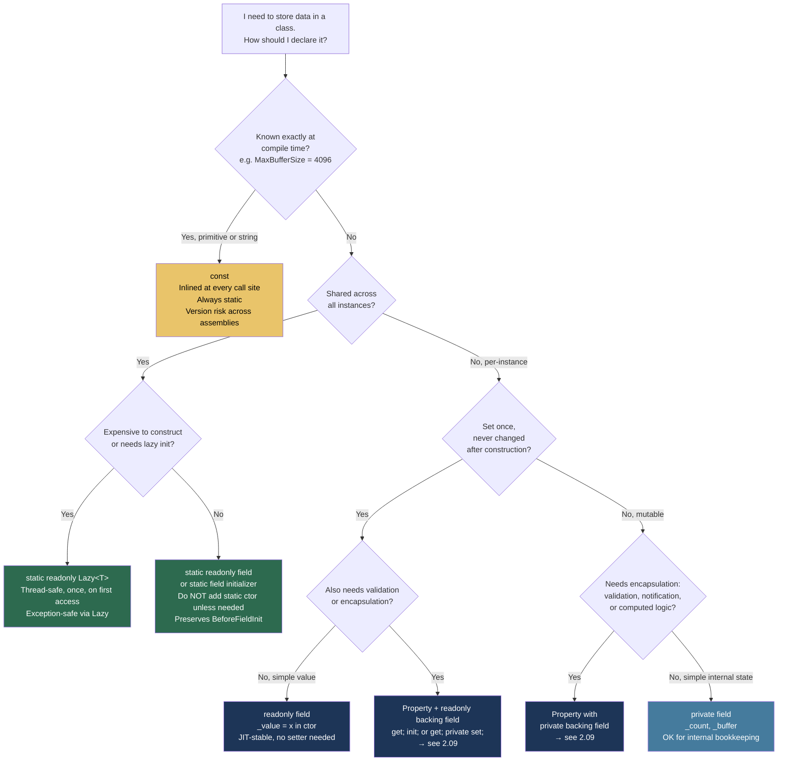

> [!success] Mastery Check
> - [ ] **Studied Well**
> - [ ] **Can explain the concept without notes**
> - [ ] **Can answer interview questions confidently**
> - [ ] **Can implement it in a real project**


## 📍 PART 0 — Navigation & Context

### Where This Topic Lives

```
C# Type System
└── Object-Oriented Foundations
    ├── Data Types, Literals (2.03)
    ├── Variables and Scope (2.04)
    ├── Methods (2.07)
    ├── ► Classes: Fields, Constructors, Static Members  ← YOU ARE HERE (2.08)
    ├──   Properties, Indexers, Access Modifiers (2.09)   ← direct next step
    ├──   Inheritance and Polymorphism (2.10)
    ├──   Interfaces and Abstract Classes (2.11)
    └──   Value Types vs Reference Types (2.16)           ← deep mechanics of 'new'
```

### What You Need Before This

- Method signatures, parameters, and return types ([[2.07 — Methods: Signatures, Parameters, Overloading, and Local Functions]])
- Variable declaration, scope, and the `const` vs `readonly` distinction ([[2.04 — Variables, Constants, and Scope]])
- A working mental model of the heap vs stack ([[2.03 — Data Types, Literals, and Type Conversions]])

### What This Unlocks After

- Properties, init-only setters, and access modifiers ([[2.09 — Properties, Indexers, and Access Modifiers]])
- Virtual dispatch, constructor chaining across inheritance hierarchies ([[2.10 — Inheritance, Polymorphism, Casting, and the Object Hierarchy]])
- The Dispose pattern and object lifecycle ([[2.30 — IDisposable, IAsyncDisposable, and Resource Management]])
- The deep CLR object layout behind every `new` call ([[2.16 — Value Types vs Reference Types: Deep Mechanics]])

### Why This Topic Matters at Scale

Every object in a production .NET system passes through these mechanisms — and the failure modes are almost always silent: state reached through a virtual method before the object is fully initialized, a type permanently poisoned by a static constructor exception, or a `readonly` field that feels safe but still allows callers to mutate the underlying collection. Getting this right is not optional.

---

## 🧠 PART 1 — The Core Mental Model

### The Fundamental Rule

> **When you call `new`, the CLR zeros memory, attaches a method table pointer, then runs your code in a fixed sequence: derived field initializers → base constructors → derived constructors. Every observable behavior of a class under construction flows from this ordering.**

### The Plain-Language Analogy

Think of a class definition as a **blueprinted building spec** archived in the architect's vault (the metadata). Calling `new` dispatches a construction crew to a fresh plot of land on the heap: they pour a concrete slab (memory zeroing), bolt a name plate to the front door (method table pointer), then interior crews work in a strict sequence — subcontractors for each floor finish their wiring before the general contractor walks through (field initializers before constructor bodies, derived before base bodies execute). The static members are the **architect's shared tools in the office**: one set per blueprint, set up the first time the plans are consulted, and available to every building ever constructed from that blueprint.

The two things this analogy captures that others miss: (1) the concrete slab is poured and the name plate is bolted on *before any of your code runs* — the object's type identity exists from the moment memory is allocated, not from when the constructor finishes; and (2) calling a virtual method in the constructor is like the general contractor calling a subcontractor who hasn't arrived yet — they'll show up and work on the unfinished building, but the wiring they were supposed to add for the upper floors hasn't been run.

### The Class Member Taxonomy

```mermaid
graph TD
    A["class Declaration"] --> B["Instance Members\n(per-object)"]
    A --> C["Static Members\n(per-type, shared)"]
    A --> D["Type Modifiers"]

    B --> E["Instance Fields\n_backing data_\nzeroed at allocation"]
    B --> F["Instance Constructors\nthis() chaining allowed\nexecution: field init → body"]
    B --> G["Instance Methods\nProperties / Indexers\n→ see 2.09"]

    F --> H["Object Initializer\n{ Prop = val } syntax\ncompiler temp-variable pattern"]
    F --> I["Primary Constructor\n(C# 12)\nparams captured as fields"]

    C --> J["Static Fields\none per type, heap-allocated\nin loader heap segment"]
    C --> K["Static Constructor\ncctor — once, thread-safe\ntype init ceremony"]
    C --> L["Static Methods\nno 'this' pointer\nno instance required"]
    C --> M["Static Classes\nsealed + abstract\ncannot instantiate"]

    D --> N["sealed\nprevents inheritance\nenables JIT devirtualization"]
    D --> O["abstract\ncannot instantiate\nrequires derived to implement"]
    D --> P["partial\nsplit across files\ncompiler merges at compile time"]

    E --> Q["readonly fields\nset only in declaration\nor constructor body"]
    E --> R["const fields\ncompile-time literal\nalways static, inlined at call site"]

    style B fill:#1d3557,color:#fff
    style C fill:#2d6a4f,color:#fff
    style D fill:#6b2d6a,color:#fff
    style E fill:#457b9d,color:#fff
    style F fill:#457b9d,color:#fff
    style G fill:#457b9d,color:#fff
    style H fill:#74b3ce,color:#000
    style I fill:#74b3ce,color:#000
    style J fill:#40916c,color:#fff
    style K fill:#40916c,color:#fff
    style L fill:#40916c,color:#fff
    style M fill:#40916c,color:#fff
    style N fill:#9b59b6,color:#fff
    style O fill:#9b59b6,color:#fff
    style P fill:#9b59b6,color:#fff
    style Q fill:#457b9d,color:#fff
    style R fill:#457b9d,color:#fff
```



---

## 🔬 PART 2 — Deep Mechanics

### 2.1 What `new` Actually Does — Object Memory Layout

`new ClassName()` is not one operation. It is a four-step CLR ceremony, and understanding the exact order explains every constructor-related bug.

```
━━━━━━━━━━━━━━━━━━━━━━━━━━━━━━━━━━━━━━━━━━━━━━━━━━━━━━━━━━━━
STEP 1: Memory allocation
  allocator bumps a pointer in the managed heap Gen0 segment
  Cost: ~2–5 ns on uncontended path (bump allocator, not malloc)

STEP 2: Memory zeroing
  CLR zeroes ALL bytes of the new object
  This is why int fields default to 0, bool to false, refs to null
  Cost: included in allocation, O(object size)

STEP 3: Method table pointer written
  The object's type identity is established BEFORE your code runs
  A virtual call made NOW would dispatch correctly to the final type
  Cost: one 8-byte write

STEP 4: Constructor chain runs
  (see §2.2 for exact ordering)
━━━━━━━━━━━━━━━━━━━━━━━━━━━━━━━━━━━━━━━━━━━━━━━━━━━━━━━━━━━━

HEAP — Order object layout (64-bit .NET 8, x64)

 class Order
 {
     private readonly int    _id;       // 4 bytes
     private decimal         _total;    // 16 bytes (4 ints: flags/hi/lo/mid)
     private string          _customerId; // 8 bytes (pointer to string object)
 }

 ┌────────────────────────────────────────────────────┐
 │  [−8 bytes] Object Header (Sync Block Index)       │  8 bytes
 │  Used for: Monitor.Enter lock state,               │
 │            GetHashCode() cache, GC bits            │
 ├────────────────────────────────────────────────────┤  ◄── object reference points HERE
 │  [offset  0] Method Table Pointer                  │  8 bytes
 │  → Order's vtable + type metadata in JIT segment   │
 ├────────────────────────────────────────────────────┤
 │  [offset  8] _id : int                             │  4 bytes
 ├────────────────────────────────────────────────────┤
 │  [offset 12] <padding for decimal alignment>       │  4 bytes
 ├────────────────────────────────────────────────────┤
 │  [offset 16] _total : decimal                      │ 16 bytes
 ├────────────────────────────────────────────────────┤
 │  [offset 32] _customerId : string reference        │  8 bytes (pointer)
 └────────────────────────────────────────────────────┘
 Total: 40 bytes on the managed heap (+ 8 byte pre-header = 48 bytes total)
 Minimum object overhead: 16 bytes even for an empty class (pre-header + MT pointer)
```

> [!IMPORTANT]
> The method table pointer is written at Step 3, before any constructor code runs. This is why a virtual method called from a base constructor dispatches to the most-derived override — the type is already fully identified. The *data* just isn't initialized yet.

---

### 2.2 Field Initialization Order — The Exact Compiler-Generated Sequence

The C# compiler does not leave field initializers in place. It moves them into constructors. The rule is: **field initializers are injected into every constructor that does not chain to another constructor in the same class via `this()`.**

```csharp
// What you write:
class InvoiceItem
{
    private List<string> _tags  = new List<string>();   // field initializer A
    private DateTime     _stamp = DateTime.UtcNow;      // field initializer B
    private int          _qty;

    public InvoiceItem()          { _qty = 1; }
    public InvoiceItem(int qty)   { _qty = qty; }
}

// What the compiler generates (approximately):
class InvoiceItem
{
    private List<string> _tags;
    private DateTime     _stamp;
    private int          _qty;

    public InvoiceItem()
    {
        // ① Field initializers injected here (both constructors get their own copy)
        _tags  = new List<string>();
        _stamp = DateTime.UtcNow;
        // ② Constructor body
        _qty = 1;
    }

    public InvoiceItem(int qty)
    {
        // ① Field initializers injected here too
        _tags  = new List<string>();
        _stamp = DateTime.UtcNow;
        // ② Constructor body
        _qty = qty;
    }
}
```

> [!WARNING]
> If a class has ten overloaded constructors and a field initializer that allocates a `List<T>`, that allocation executes ten separate times (once per constructor) — even if the constructor immediately overwrites it. Constructor chaining via `this()` is the fix.

**With inheritance**, the ordering has a specific and surprising property: derived field initializers run **before** the base constructor:

```
Execution order for new DerivedOrder():

1. DerivedOrder field initializers run
           ↓
2. base: BaseOrder field initializers run
           ↓
3. base: object.ctor() runs (empty, but the call is always present in IL)
           ↓
4. BaseOrder constructor body runs
           ↓
5. DerivedOrder constructor body runs
```

Cost label: Each field initializer allocating a new object costs one heap allocation (~2–5 ns + GC pressure). Field initializers that assign a constant or call a cheap static method are essentially free.

---

### 2.3 Constructor Chaining with `this()` — The Pattern and the IL

Constructor chaining channels all initialization through a single "canonical" constructor. When a constructor chains via `this(...)`, the compiler does NOT inject field initializers into it — they run exactly once, in the canonical constructor.

```csharp
// Canonical constructor is the one that chains to base or has no chain
// All others delegate to it via this()

class ShipmentItem
{
    private readonly string _sku;
    private readonly int    _quantity;
    private readonly string _warehouse;
    private readonly bool   _requiresRefrigeration;

    // ① Canonical: every field set, all validation here
    public ShipmentItem(string sku, int quantity, string warehouse, bool refrigerated)
    {
        if (string.IsNullOrWhiteSpace(sku))
            throw new ArgumentException("SKU is required", nameof(sku));
        if (quantity <= 0)
            throw new ArgumentOutOfRangeException(nameof(quantity), "Quantity must be positive");

        _sku                   = sku;
        _quantity              = quantity;
        _warehouse             = warehouse ?? "DEFAULT";
        _requiresRefrigeration = refrigerated;
    }

    // ② Convenience: normal room-temp item, no refrigeration
    public ShipmentItem(string sku, int quantity, string warehouse)
        : this(sku, quantity, warehouse, refrigerated: false)
    {
        // this() runs the canonical constructor first
        // This body runs after; it is intentionally empty
    }

    // ③ Convenience: single unit to default warehouse
    public ShipmentItem(string sku)
        : this(sku, quantity: 1, warehouse: "DEFAULT")
    {
        // Chains to ②, which chains to ①
        // Execution: ① body → ② body (empty) → ③ body (empty)
    }
}

// IL pattern for constructor chaining (approximate):
//
//   ShipmentItem(string sku):
//     ldarg.0
//     ldarg.1
//     ldc.i4.1           // quantity = 1
//     ldstr "DEFAULT"    // warehouse
//     call ShipmentItem::.ctor(string, int, string)   ← direct call, not virtual
//     ret
```

Cost label: Each `this()` chain step is one direct `call` instruction — approximately ~1 ns. There is no overhead compared to writing the code inline; the JIT inlines short constructors.

---

### 2.4 Static Members — The Type Initialization Ceremony and BeforeFieldInit

Static members belong to the type, not to any instance. They are initialized once and shared. The performance trap almost no engineer knows about is **BeforeFieldInit**.

```
━━━━━━━━━━━━━━━━━━━━━━━━━━━━━━━━━━━━━━━━━━━━━━━━━━━━━━━━━━━━
CASE A: Static field initializers ONLY (no explicit static ctor)
━━━━━━━━━━━━━━━━━━━━━━━━━━━━━━━━━━━━━━━━━━━━━━━━━━━━━━━━━━━━

class TaxRateTable
{
    public static readonly decimal StandardRate = 0.20m;
    public static readonly decimal ReducedRate  = 0.05m;
    // No static ctor → compiler emits [BeforeFieldInit] attribute
}

What [BeforeFieldInit] means for the JIT:
  "You may initialize static fields at any convenient time before they are
   first accessed — you do NOT need to check initialization on every access."

JIT code for accessing StandardRate:
  mov rax, [TaxRateTable.StandardRate]   ← one memory read, no branch
  Cost: ~2–4 ns (L1/L2 cache hit)

━━━━━━━━━━━━━━━━━━━━━━━━━━━━━━━━━━━━━━━━━━━━━━━━━━━━━━━━━━━━
CASE B: Explicit static constructor present
━━━━━━━━━━━━━━━━━━━━━━━━━━━━━━━━━━━━━━━━━━━━━━━━━━━━━━━━━━━━

class TaxRateTable
{
    public static readonly decimal StandardRate;

    static TaxRateTable()   // ← This single line removes [BeforeFieldInit]!
    {
        StandardRate = 0.20m;
    }
}

What removing [BeforeFieldInit] means for the JIT:
  "Before every static member access, check whether the type has been
   initialized. Emit a conditional branch and a potential lock acquire."

JIT code for accessing StandardRate (pseudo-asm):
  cmp [TaxRateTable.initialized_flag], 0
  jne already_initialized
  call RuntimeHelpers.RunClassConstructor(TaxRateTable)   ← expensive on first call
already_initialized:
  mov rax, [TaxRateTable.StandardRate]
  Cost: ~5–15 ns (adds branch + potential lock on every call site)
```

> [!DANGER]
> If a static constructor throws, the CLR catches it, wraps it in a `TypeInitializationException`, and marks the type as permanently failed. Every subsequent attempt to access ANY member of that type throws `TypeInitializationException` for the rest of the process lifetime. There is no recovery. A bad database connection string or missing environment variable in a static constructor can silently brick an entire service until the process restarts.

```csharp
// Static constructor execution guarantees:
// • Runs exactly once per AppDomain lifetime
// • Thread-safe: CLR uses an internal initialization lock
// • Runs before any static member is accessed, or before any instance is created
// • If it throws: TypeInitializationException replaces it on every future access
```

Cost label: First access with static ctor: ~100–500 ns (lock + init). Subsequent accesses: ~5–15 ns (branch check). Without static ctor ([BeforeFieldInit]): ~2–4 ns.

---

### 2.5 `readonly` Fields — What the Compiler and JIT Actually Enforce

`readonly` on an instance field means: **this field may only be assigned in its field initializer or in a constructor of this class.** After the constructor returns, the assignment gate closes permanently.

```csharp
class PaymentProcessor
{
    private readonly IPaymentGateway _gateway;
    private readonly decimal         _maxLimit = 50_000m; // field initializer also counts

    public PaymentProcessor(IPaymentGateway gateway, decimal? maxLimit = null)
    {
        _gateway  = gateway;                        // ✅ Assignment in constructor: OK
        _maxLimit = maxLimit ?? _maxLimit;          // ✅ Can overwrite field-init value in ctor
    }

    public async Task ChargeAsync(decimal amount)
    {
        // _gateway = null;  // ❌ CS0191: compile error — cannot assign outside constructor
        // _maxLimit = 0;    // ❌ CS0191: same
        if (amount > _maxLimit)
            throw new InvalidOperationException($"Amount exceeds limit of {_maxLimit}");
        await _gateway.ChargeAsync(amount);
    }
}
```

**What the JIT does with readonly fields (performance angle):**

The JIT treats `readonly` instance fields as *effectively stable after construction*. In tight loops on hot paths, the JIT may hoist a readonly field read out of the loop (register-cache it) rather than re-reading from the heap on each iteration. For `static readonly` fields, the optimization is stronger — the JIT can treat them as constants after first initialization.

> [!TIP]
> `readonly` enforces shallow immutability only. A `readonly List<Order>` prevents you from replacing the list reference, but `list.Add(...)` is completely legal. If you need deep immutability, use `IReadOnlyList<T>` as the declared type, or switch to immutable collection types.

Cost label: readonly field read: ~1–3 ns (L1 cache hit). readonly reference to mutable object: zero overhead for the mutations.

---

### 2.6 Object Initializer — What the Compiler Generates

The `{ Prop = val }` syntax looks atomic, but the compiler generates a specific pattern that has important implications for exception safety.

```csharp
// C# you write:
var item = new LineItem { ProductCode = "SKU-001", Quantity = 3, UnitPrice = 29.99m };

// Compiler generates (approximately):
var __temp = new LineItem();          // ① allocate + run constructor
__temp.ProductCode = "SKU-001";      // ② set each property on the TEMP variable
__temp.Quantity    = 3;
__temp.UnitPrice   = 29.99m;
var item = __temp;                   // ③ assign to 'item' only after ALL setters succeed

// WHY the temp variable pattern matters:
// If the third setter throws an exception, the assignment to 'item' on line ③ never executes.
// The caller sees 'item' as null (or its previous value), not a half-initialized object.
// The partially-constructed temp object becomes unreachable and eligible for GC.
```

> [!NOTE]
> Object initializers can only set properties or fields that are accessible at the call site. They cannot call methods, invoke logic, or validate cross-field invariants. For any business rule that spans multiple fields, a parameterized constructor is the correct tool — object initializers are syntactic convenience for post-construction setup of optional values.

---

## 💻 PART 3 — Production Code Patterns

### 3.1 Guard-at-Construction — The Invariant-Enforcing Constructor

All invariants belong in the constructor. If an object can be constructed in an invalid state, every method must defensively check for that invalid state forever.

```csharp
// ✅ CORRECT: OrderItem for an e-commerce fulfillment service
// Every field is validated at the earliest possible moment: construction.
// An OrderItem that exists is guaranteed valid. No method needs to re-check.

public sealed class OrderItem
{
    public string  Sku      { get; }
    public int     Quantity { get; }
    public decimal UnitPrice{ get; }
    public string  WarehouseId { get; }

    public OrderItem(string sku, int quantity, decimal unitPrice, string warehouseId)
    {
        // Guard clauses first: fail fast, loud, with precise messages
        ArgumentException.ThrowIfNullOrWhiteSpace(sku,         nameof(sku));
        ArgumentException.ThrowIfNullOrWhiteSpace(warehouseId, nameof(warehouseId));

        if (quantity <= 0)
            throw new ArgumentOutOfRangeException(nameof(quantity),
                quantity, "Quantity must be a positive integer.");

        if (unitPrice < 0)
            throw new ArgumentOutOfRangeException(nameof(unitPrice),
                unitPrice, "Unit price cannot be negative.");

        // Only assign after all guards pass — no partially-set state escapes
        Sku         = sku.Trim().ToUpperInvariant(); // normalize at boundary
        Quantity    = quantity;
        UnitPrice   = unitPrice;
        WarehouseId = warehouseId.Trim().ToUpperInvariant();
    }

    // Derived computation: no backing field needed, no mutation possible
    public decimal LineTotal => Quantity * UnitPrice;

    public override string ToString() =>
        $"[{Sku}] qty={Quantity} @ {UnitPrice:C} from {WarehouseId}";
}
```

### 3.2 Constructor Chaining to a Single Canonical Constructor

Multiple constructors with duplicated logic are a maintenance trap. Channel everything through one canonical constructor.

```csharp
// ⚠️ WRONG: Duplicated validation across constructors
// When a business rule changes, you must find and update every constructor.
public class NotificationMessage
{
    public NotificationMessage(string body, string recipient)
    {
        if (string.IsNullOrWhiteSpace(body)) throw new ArgumentException("...");
        if (string.IsNullOrWhiteSpace(recipient)) throw new ArgumentException("...");
        Body = body; Recipient = recipient; Priority = "NORMAL"; RetryCount = 3;
    }
    public NotificationMessage(string body, string recipient, string priority)
    {
        if (string.IsNullOrWhiteSpace(body)) throw new ArgumentException("...");      // ← duplicate
        if (string.IsNullOrWhiteSpace(recipient)) throw new ArgumentException("...");  // ← duplicate
        Body = body; Recipient = recipient; Priority = priority; RetryCount = 3;
    }
    // ... and so it grows
}

// ✅ CORRECT: All validation in the canonical constructor.
// Convenience overloads are thin shells that choose defaults.
public sealed class NotificationMessage
{
    public string Body       { get; }
    public string Recipient  { get; }
    public string Priority   { get; }
    public int    RetryCount { get; }

    // ① CANONICAL — all guards, all assignments, full control
    public NotificationMessage(string body, string recipient, string priority, int retryCount)
    {
        ArgumentException.ThrowIfNullOrWhiteSpace(body,      nameof(body));
        ArgumentException.ThrowIfNullOrWhiteSpace(recipient, nameof(recipient));
        ArgumentException.ThrowIfNullOrWhiteSpace(priority,  nameof(priority));
        if (retryCount < 0)
            throw new ArgumentOutOfRangeException(nameof(retryCount));

        Body       = body.Trim();
        Recipient  = recipient.Trim().ToLowerInvariant();
        Priority   = priority.Trim().ToUpperInvariant();
        RetryCount = retryCount;
    }

    // ② CONVENIENCE — express intent clearly, zero duplicated logic
    public NotificationMessage(string body, string recipient, string priority)
        : this(body, recipient, priority, retryCount: 3) { }

    // ③ CONVENIENCE — use sensible defaults for normal-priority messages
    public NotificationMessage(string body, string recipient)
        : this(body, recipient, priority: "NORMAL") { }
}
```

### 3.3 The Lazy Static Singleton — Thread-Safe Without a Lock

When a shared resource is expensive to construct and only needed on first access, use `Lazy<T>` instead of double-checked locking. `Lazy<T>` with `LazyThreadSafetyMode.ExecutionAndPublication` is the modern, correct default.

```csharp
// ⚠️ WRONG: Hand-rolled double-checked lock — still broken without volatile in many scenarios
public class ReportGenerator
{
    private static ReportGenerator _instance;
    private static readonly object _lock = new object();

    public static ReportGenerator Instance
    {
        get
        {
            if (_instance == null)  // first check (unguarded)
            {
                lock (_lock)
                {
                    if (_instance == null)  // second check (guarded)
                        _instance = new ReportGenerator(); // not guaranteed atomic visibility
                }
            }
            return _instance;
        }
    }
}

// ✅ CORRECT: Lazy<T> handles thread safety, lazy init, and exception caching correctly
public sealed class ReportGenerator
{
    // LazyThreadSafetyMode.ExecutionAndPublication (the default): only one thread runs
    // the factory; all others block until it completes; exception is cached on failure.
    private static readonly Lazy<ReportGenerator> _instance =
        new Lazy<ReportGenerator>(() => new ReportGenerator());

    // Private constructor prevents external instantiation
    private ReportGenerator()
    {
        // Expensive setup: load templates, init formatters, etc.
    }

    public static ReportGenerator Instance => _instance.Value;

    public byte[] GeneratePdf(ReportRequest request) { /* ... */ return Array.Empty<byte>(); }
}
```

### 3.4 Static Factory Method — Hiding Construction Complexity

When a constructor cannot express all legal creation paths, or when the creation logic is too complex for constructor constraints, use a static factory method. Named factories communicate *intent* that a constructor name cannot.

```csharp
public sealed class DatabaseConnection
{
    private readonly string _connectionString;
    private readonly int    _timeoutSeconds;
    private readonly bool   _readOnly;

    // Private: no one constructs this directly
    private DatabaseConnection(string connectionString, int timeoutSeconds, bool readOnly)
    {
        _connectionString = connectionString;
        _timeoutSeconds   = timeoutSeconds;
        _readOnly         = readOnly;
    }

    // Named factories express intent — you can't express this with constructor overloads
    public static DatabaseConnection ForReporting(string connectionString) =>
        new(connectionString, timeoutSeconds: 300, readOnly: true);   // long timeouts, read-only

    public static DatabaseConnection ForTransactions(string connectionString) =>
        new(connectionString, timeoutSeconds: 30, readOnly: false);   // short timeouts, writes

    public static DatabaseConnection ForMigrations(string connectionString) =>
        new(connectionString, timeoutSeconds: 1800, readOnly: false); // very long, needed for DDL

    // Factory can also validate in ways a constructor cannot — e.g., probing connectivity
    public static async Task<DatabaseConnection> CreateAndVerifyAsync(string connectionString,
        CancellationToken cancellationToken = default)
    {
        var conn = ForTransactions(connectionString);
        await conn.PingAsync(cancellationToken); // async validation impossible in a constructor
        return conn;
    }

    private Task PingAsync(CancellationToken ct) => Task.CompletedTask; // stub
}
```

### 3.5 Primary Constructor (C# 12) — DI Services Without Boilerplate

Primary constructors on regular classes (C# 12) reduce constructor boilerplate for dependency injection. The parameters are captured as synthesized fields when any instance member uses them.

```csharp
// ⚠️ BEFORE C# 12: 8 lines of noise just to store two injected services
public class OrderFulfillmentService
{
    private readonly IInventoryRepository _inventory;
    private readonly IShippingService     _shipping;

    public OrderFulfillmentService(IInventoryRepository inventory, IShippingService shipping)
    {
        _inventory = inventory;
        _shipping  = shipping;
    }

    public Task FulfillAsync(Order order) => _shipping.DispatchAsync(order, _inventory);
}

// ✅ C# 12 primary constructor: same semantics, less noise
// The compiler synthesizes private readonly fields for 'inventory' and 'shipping'
// because they are used inside an instance method.
public class OrderFulfillmentService(IInventoryRepository inventory, IShippingService shipping)
{
    // No field declarations or assignment code needed
    // 'inventory' and 'shipping' are available throughout the class body

    public Task FulfillAsync(Order order) => shipping.DispatchAsync(order, inventory);

    // ⚠️ Important: if you also need to validate, you MUST do it via a property or field init
    // because there is no "constructor body" in the primary constructor form.
    // For validation-heavy types, prefer the traditional constructor pattern.
}
```

### 3.6 Sealed Classes for Leaf Domain Types

Sealing a class communicates that it was not designed for inheritance and enables JIT devirtualization of its virtual methods.

```csharp
// ✅ Sealing a value-object domain type: two benefits simultaneously.
// Design: signals "this is not an extension point" to every reader
// Perf: JIT devirtualizes virtual calls (Equals, GetHashCode, ToString) → direct calls

public sealed class CustomerId : IEquatable<CustomerId>
{
    public string Value { get; }

    public CustomerId(string value)
    {
        ArgumentException.ThrowIfNullOrWhiteSpace(value, nameof(value));
        Value = value.Trim().ToUpperInvariant();
    }

    // sealed: compiler and JIT know no derived class exists.
    // Calls to Equals/GetHashCode/ToString on a CustomerId variable are devirtualized.
    public bool Equals(CustomerId? other) => other is not null && Value == other.Value;
    public override bool Equals(object? obj) => obj is CustomerId c && Equals(c);
    public override int GetHashCode() => HashCode.Combine(Value);
    public override string ToString() => Value;

    public static bool operator ==(CustomerId? a, CustomerId? b) =>
        a is null ? b is null : a.Equals(b);
    public static bool operator !=(CustomerId? a, CustomerId? b) => !(a == b);
}
```

### 3.7 `readonly` Field Injection — Prefer Fields Over Properties for Immutable Dependencies

Constructor-injected dependencies should be `readonly` fields, not publicly settable properties. The `readonly` field closes the mutation gate immediately after construction.

```csharp
// ⚠️ WRONG: Settable property allows mutation after construction
// Any code can replace the gateway at any time — unpredictable behavior in concurrent code
public class PaymentService
{
    public IPaymentGateway Gateway { get; set; } // setter is a footgun

    public PaymentService(IPaymentGateway gateway) { Gateway = gateway; }
}

// ✅ CORRECT: readonly field with constructor injection
// Once constructed, the dependency is immutable. Thread-safe to read from any thread.
public sealed class PaymentService
{
    // private readonly: only this class can read it; nothing can change it
    private readonly IPaymentGateway _gateway;
    private readonly ILogger<PaymentService> _logger;

    public PaymentService(IPaymentGateway gateway, ILogger<PaymentService> logger)
    {
        // Null checks: fail at DI registration time, not at first use in production
        _gateway = gateway ?? throw new ArgumentNullException(nameof(gateway));
        _logger  = logger  ?? throw new ArgumentNullException(nameof(logger));
    }

    public async Task<ChargeResult> ChargeAsync(decimal amount, string customerId,
        CancellationToken ct = default)
    {
        _logger.LogInformation("Charging {Amount} for {CustomerId}", amount, customerId);
        return await _gateway.ChargeAsync(amount, customerId, ct);
    }
}
```

---

## ⚠️ PART 4 — Gotchas & Anti-Patterns

### Gotcha 1: Calling a Virtual Method in a Constructor

The most dangerous constructor mistake. Virtual dispatch resolves to the derived type's override *while the derived object's constructor has not yet run*, leaving the override to operate on zero-initialized fields.

```csharp
// ⚠️ WRONG: virtual call in base constructor dispatches to derived override
//           before derived constructor has set _feeRate
public class Payment
{
    protected decimal _amount;

    public Payment()
    {
        Initialize(); // virtual call: dispatches to FeePayment.Initialize()
                      // Problem: FeePayment's ctor hasn't run yet — _feeRate is still 0
    }

    protected virtual void Initialize() => _amount = 100m;
    public decimal Amount => _amount;
}

public class FeePayment : Payment
{
    private decimal _feeRate;  // NOT a field initializer — set in constructor body

    public FeePayment()
    {
        _feeRate = 0.05m;  // runs AFTER base Payment() — too late
    }

    protected override void Initialize() => _amount = 1000m * _feeRate; // _feeRate is 0!
}

var p = new FeePayment();
Console.WriteLine(p.Amount); // 0  — not 50 as the developer intended

// ✅ CORRECT: use a factory method or an explicit Init() that callers invoke after construction
public sealed class FeePayment
{
    private readonly decimal _feeRate;
    public decimal Amount { get; private set; }

    public FeePayment(decimal feeRate)
    {
        _feeRate = feeRate;
        Amount   = 1000m * _feeRate; // safe: no virtual dispatch, all fields set
    }
}
```

**WHY:** Step 3 of `new` sets the method table pointer to `FeePayment` before any constructor code runs. Virtual dispatch reads that pointer and calls `FeePayment.Initialize`. But Step 4 (constructors) runs base first, so `FeePayment`'s constructor body (which sets `_feeRate`) hasn't executed yet.

---

### Gotcha 2: Static Constructor Permanently Poisons the Type

A static constructor that throws does not just fail on first access — it permanently disables the type for the entire process lifetime.

```csharp
// ⚠️ WRONG: startup validation in a static constructor
public class AppConfig
{
    public static readonly string DatabaseUrl;

    static AppConfig()
    {
        DatabaseUrl = Environment.GetEnvironmentVariable("DATABASE_URL")
            ?? throw new InvalidOperationException("DATABASE_URL environment variable is not set.");
    }
}

// In production with DATABASE_URL missing:
try { _ = AppConfig.DatabaseUrl; }
catch (TypeInitializationException ex)
{
    Console.WriteLine(ex.InnerException?.Message); // "DATABASE_URL environment variable is not set."
}

// Every subsequent access in the process throws the same TypeInitializationException.
// Restarting the app is the only recovery. There is no TryGet pattern. No retry. No reset.

// ✅ CORRECT: validate lazily, at first use, with a recoverable exception
public static class AppConfig
{
    public static string RequireDatabase()
    {
        return Environment.GetEnvironmentVariable("DATABASE_URL")
            ?? throw new InvalidOperationException("DATABASE_URL environment variable is not set.");
    }
}
```

**WHY:** The CLR caches the `TypeInitializationException` and re-throws it on every access. The type initialization lock is released in a "failed" state — once failed, always failed.

---

### Gotcha 3: `readonly` Is Not Deep Immutability

`readonly` prevents reassignment of the **reference**. It says nothing about the mutability of the **object** the reference points to.

```csharp
// ⚠️ WRONG mental model: "readonly means I can't change the list"
public class ProductCatalog
{
    public readonly List<string> Categories = new List<string> { "Electronics", "Books" };
}

var catalog = new ProductCatalog();

catalog.Categories.Add("Toys");        // ✅ Compiles and WORKS — mutates the list object
catalog.Categories.Remove("Books");    // ✅ Compiles and WORKS — still the same list reference

// catalog.Categories = new List<string>(); // ❌ CS0191 compile error — cannot reassign ref

Console.WriteLine(catalog.Categories.Count); // 2 (Electronics + Toys)

// ✅ CORRECT: express the immutability contract at the type level, not just the reference level
public class ProductCatalog
{
    // IReadOnlyList<T>: callers cannot Add/Remove/Clear through this interface
    private readonly List<string> _categories = new List<string> { "Electronics", "Books" };
    public IReadOnlyList<string> Categories => _categories;

    // Internal mutations controlled: only this class decides what goes in
    public void AddCategory(string category) => _categories.Add(category);
}
```

**WHY:** `readonly` is a constraint on the *assignment operator*, not on the object's behavior. The list object sitting on the heap has no knowledge of how it was referenced.

---

### Gotcha 4: Adding a Static Constructor "Just in Case" Kills a JIT Optimization

Engineers often add an empty or trivial static constructor for organizational reasons — to group static initialization, to match a coding style, or to add a debugger breakpoint. Every time, it removes the `[BeforeFieldInit]` attribute and degrades static member access performance.

```csharp
// ⚠️ WRONG: empty static constructor added "for clarity" or debugging
public class ExchangeRateCache
{
    public static readonly Dictionary<string, decimal> Rates = new()
    {
        ["USD"] = 1.0m,
        ["EUR"] = 0.91m
    };

    static ExchangeRateCache()
    {
        // Intentionally empty — added to "mark initialization point"
        // EFFECT: removes [BeforeFieldInit], adds init-check branch to every static access
    }
}

// Tight loop with millions of iterations now pays the init-check overhead:
// for (int i = 0; i < 1_000_000; i++) { _ = ExchangeRateCache.Rates["USD"]; }
// Measured overhead on .NET 8 x64: ~3-5 ns/call → ~3-5 ms total overhead in this loop

// ✅ CORRECT: delete the empty static constructor
// If you need a breakpoint, use a static field initializer expression that the debugger can hit
public static class ExchangeRateCache
{
    public static readonly Dictionary<string, decimal> Rates = BuildRates();

    private static Dictionary<string, decimal> BuildRates() => new()
    {
        ["USD"] = 1.0m,
        ["EUR"] = 0.91m
    };
    // No static ctor → [BeforeFieldInit] preserved → JIT optimizes static access
}
```

**WHY:** Without `[BeforeFieldInit]`, the JIT must verify type initialization has occurred at every static member access point. It inserts a conditional branch and a potential lock acquire. The overhead is small per call, but it compounds in tight loops.

---

### Gotcha 5: Object Initializer Bypasses Constructor Guards

If your type exposes public setters and also has a parameterless constructor, callers can bypass every guard you wrote in the parameterized constructor.

```csharp
// ⚠️ WRONG: parameterless constructor + public setters = guards are optional
public class TransferInstruction
{
    public string FromAccount { get; set; }
    public string ToAccount   { get; set; }
    public decimal Amount     { get; set; }

    public TransferInstruction() { }

    public TransferInstruction(string from, string to, decimal amount)
    {
        if (from == to)
            throw new InvalidOperationException("Cannot transfer to the same account.");
        if (amount <= 0)
            throw new ArgumentOutOfRangeException(nameof(amount));
        FromAccount = from;
        ToAccount   = to;
        Amount      = amount;
    }
}

// A caller can bypass ALL of that validation:
var t = new TransferInstruction
{
    FromAccount = "ACC-001",
    ToAccount   = "ACC-001",  // same account — guard NOT triggered
    Amount      = -999m       // negative amount — guard NOT triggered
};

// ✅ CORRECT: use init-only properties (C# 9) + no parameterless constructor
// Object initializer syntax still works but validation occurs in the canonical constructor
public sealed class TransferInstruction
{
    public string  FromAccount { get; }
    public string  ToAccount   { get; }
    public decimal Amount      { get; }

    public TransferInstruction(string fromAccount, string toAccount, decimal amount)
    {
        if (fromAccount == toAccount)
            throw new InvalidOperationException("Cannot transfer to the same account.");
        if (amount <= 0)
            throw new ArgumentOutOfRangeException(nameof(amount));

        FromAccount = fromAccount;
        ToAccount   = toAccount;
        Amount      = amount;
    }
}
// No parameterless constructor → object initializer { } syntax not available → guards always enforced
```

**WHY:** Object initializers use whatever constructor is specified (or the parameterless one if no constructor is named), then call property setters. Calling a parameterless constructor creates a fully zero-initialized object, then the setters mutate it directly — the parameterized constructor's guards never run.

---

## 📊 PART 5 — Performance Implications

### 5.1 Allocation and Access Cost Table

| Scenario | Allocation Behavior | Approx Cost |
|---|---|---|
| `new SomeClass()` with no fields | One heap allocation, 16-byte minimum overhead | ~3–5 ns |
| `new SomeClass()` with 5 int fields | One heap allocation, 36 bytes total | ~3–5 ns |
| Object initializer `new Foo { X=1, Y=2 }` | Identical to `new Foo(); foo.X=1; foo.Y=2;` — one alloc | Same as above |
| Static field access (no static ctor, [BeforeFieldInit]) | Zero allocation, one memory read | ~2–4 ns |
| Static field access (static ctor present) | Zero allocation, but JIT adds init-check branch | ~5–15 ns |
| `readonly` instance field read | Zero allocation, L1 cache read, JIT may hoist | ~1–3 ns |
| Class with finalizer (e.g., `~Foo()`) | Extra entry placed on finalization queue at allocation | +20–30 ns alloc overhead |
| Calling a virtual method on an unsealed class | Zero allocation, indirect call via vtable | ~3–5 ns |
| Calling the same method on a `sealed` class | Zero allocation, direct call (JIT devirtualized) | ~1–2 ns |
| Constructor with 10 guarded parameters | Proportional to guard work, no alloc overhead | guard cost + ~5 ns |
| Field initializer that allocates `new List<T>()` | One extra heap allocation per constructor call | +~5 ns + GC pressure |

### 5.2 BenchmarkDotNet: Sealed vs Unsealed, Static Field Patterns

```csharp
// Expected output (approximate, .NET 8, x64, Release):
// ┌─────────────────────────────────┬──────────┬────────────┬──────────┐
// │ Method                          │ Mean     │ StdDev     │ Alloc    │
// ├─────────────────────────────────┼──────────┼────────────┼──────────┤
// │ NewUnsealedClass                │ 4.12 ns  │ 0.09 ns    │ 32 B     │
// │ NewSealedClass                  │ 3.98 ns  │ 0.07 ns    │ 32 B     │
// │ VirtualCall_Unsealed            │ 4.31 ns  │ 0.11 ns    │ -        │
// │ DirectCall_Sealed               │ 1.87 ns  │ 0.04 ns    │ -        │
// │ StaticField_BeforeFieldInit     │ 2.14 ns  │ 0.05 ns    │ -        │
// │ StaticField_WithStaticCtor      │ 7.83 ns  │ 0.18 ns    │ -        │
// └─────────────────────────────────┴──────────┴────────────┴──────────┘

[MemoryDiagnoser]
[BenchmarkCategory("Classes")]
public class ClassMechanicsBenchmark
{
    private readonly UnsealedProcessor   _unsealed = new();
    private readonly SealedProcessor     _sealed   = new();
    private readonly ISomeInterface      _through  = new SealedProcessor();

    // ── Allocation benchmarks ──────────────────────────────────────────────
    [Benchmark(Baseline = true)]
    public UnsealedProcessor NewUnsealedClass() => new UnsealedProcessor();

    [Benchmark]
    public SealedProcessor NewSealedClass() => new SealedProcessor();

    // ── Virtual dispatch vs devirtualized call ─────────────────────────────
    [Benchmark]
    public int VirtualCall_Unsealed() => _unsealed.Compute(42);  // virtual call

    [Benchmark]
    public int DirectCall_Sealed() => _sealed.Compute(42);       // JIT devirtualizes

    // ── Static field access with vs without static constructor ─────────────
    [Benchmark]
    public decimal StaticField_BeforeFieldInit() => SlimConfig.DefaultTimeout;

    [Benchmark]
    public decimal StaticField_WithStaticCtor() => HeavyConfig.DefaultTimeout;
}

// ── Supporting types ────────────────────────────────────────────────────

public class UnsealedProcessor
{
    public virtual int Compute(int x) => x * 2;
}

public sealed class SealedProcessor
{
    public int Compute(int x) => x * 2; // not virtual — JIT inlines
}

// [BeforeFieldInit] preserved: no static ctor
public static class SlimConfig
{
    public static readonly decimal DefaultTimeout = 30m;
}

// [BeforeFieldInit] removed: static ctor present
public static class HeavyConfig
{
    public static readonly decimal DefaultTimeout;

    static HeavyConfig()
    {
        DefaultTimeout = 30m;
    }
}
```

### 5.3 When to Care / When to Ignore

**When this costs you:**

Static constructor overhead matters in static helper classes accessed millions of times per second — think `JsonSerializer`, `Encoding.UTF8`, `Stopwatch.Frequency`. Even 5 ns per call is 5 ms per million calls. Unsealed class virtual dispatch overhead matters in tight loops over domain objects — a process that calls a pricing method 10 million times per second pays ~30 ms more per second than a sealed equivalent. Constructor guards (null checks, range validation) cost ~1-3 ns each — negligible in most code, but worth noting for factory-heavy code paths.

**When this doesn't matter:**

Any code path that runs less than ~100,000 times per second. Application-layer controllers, message handlers, service classes instantiated by DI containers: the construction overhead (single digit nanoseconds) is irrelevant against I/O latency (microseconds to milliseconds). Static constructor overhead is irrelevant for types accessed less than ~10,000 times per second — it disappears into noise.

---

## 🎤 PART 6 — Interview Arsenal

### 6.A The Question Bank

---

**Q1: "Walk me through exactly what happens when you call `new SomeClass()`."**

**Average answer:** "It creates an instance on the heap and calls the constructor."

**Why that's insufficient:** It skips four distinct steps, misses field initializers, and says nothing about type identity vs. data initialization ordering.

**Great answer:**
> "There are four distinct phases. First, the CLR's bump allocator reserves a contiguous block on Gen0 of the managed heap — this is very fast, roughly 3–5 nanoseconds, because it's just a pointer increment. Second, that memory is zeroed, which is why all fields default to zero or null before any constructor code touches them. Third — and this is the counterintuitive part — the method table pointer is written into the object, establishing its type identity, before any of your code runs. That's why a virtual method called from a base constructor dispatches to the most-derived override: the object knows what it is already, even though its data isn't initialized yet. Fourth, the constructor chain executes: field initializers run first in declaration order, then the constructor body, and in inheritance scenarios derived field initializers run before the base constructor body."

---

**Q2: "What is the difference between `readonly` and `const`?"**

**Average answer:** "`const` is compile-time, `readonly` is runtime."

**Why that's insufficient:** Misses the critical versioning implication of `const` and the shallow-immutability limitation of `readonly`.

**Great answer:**
> "They serve completely different purposes. `const` is inlined by the compiler at every call site — the value is embedded as a literal in the IL of every assembly that references it. This means if you ship a library with `const MaxRetries = 3` and later change it to 5, every dependent assembly that wasn't recompiled still has the old value of 3 compiled in. That's a real deployment hazard in multi-assembly systems. `readonly` is a runtime value read from memory — always current, no inlining. It can be any type, including reference types. The trap with `readonly` is that it only enforces shallow immutability: a `readonly List<T>` prevents reassigning the reference, but you can still call `.Add()` on that list from anywhere. For deep immutability you need `IReadOnlyList<T>` as the declared type or immutable collections."

---

**Q3: "What is a static constructor and what's the performance implication of having one?"**

**Average answer:** "It runs once when the class is first used, thread-safe."

**Why that's insufficient:** Misses BeforeFieldInit and the catastrophic static constructor exception behavior.

**Great answer:**
> "A static constructor runs exactly once per process lifetime, guaranteed thread-safe by the CLR's type initialization lock. The performance angle is subtle: if a class has only static field initializers and no explicit static constructor, the compiler marks it with a `[BeforeFieldInit]` attribute. That flag tells the JIT it can initialize static fields at any convenient time before they're needed, and crucially, it doesn't need to emit an initialization-check branch at every static member access. The moment you add an explicit static constructor, `BeforeFieldInit` is removed, and every static access gets an extra branch and potential lock — roughly three times more expensive. The bigger hazard is exception behavior: if a static constructor throws, the CLR wraps it in `TypeInitializationException` and re-throws it on every subsequent access to the type, forever, for the life of the process. There is no reset, no retry, no recovery without a restart. A missing environment variable in a static constructor can brick an entire microservice."

---

**Q4: "Why is calling a virtual method in a constructor considered dangerous?"**

**Average answer:** "Because the derived class might not be initialized yet."

**Why that's insufficient:** Correct but vague — doesn't explain the mechanism or show that the CLR dispatches to the derived override (not the base implementation).

**Great answer:**
> "The mechanism is the key detail. When you call `new DerivedClass()`, the CLR writes the method table pointer to `DerivedClass`'s vtable before any constructor code runs — that's part of the allocation phase, not the initialization phase. So when the base constructor calls a virtual method, the method table says 'this is a DerivedClass', and dispatch goes to DerivedClass's override. But DerivedClass's constructor hasn't run yet, which means all of its fields are at their zero-initialized defaults. The override executes against a half-born object. The base class constructor has no way of knowing this is happening — it compiles cleanly, no warnings. The real-world consequence is silent data corruption: you expect a derived field that was set in the derived constructor to be available during initialization, but it's always zero. The fix is to avoid virtual methods in constructors entirely, or use a factory method pattern where an explicit `Initialize()` call happens after the full constructor chain completes."

---

**Q5: "What does sealing a class actually do?"**

**Average answer:** "It prevents inheritance."

**Why that's insufficient:** Correct but misses the JIT devirtualization optimization that makes sealed classes perform better in hot paths.

**Great answer:**
> "Sealing prevents inheritance, yes — but the interesting consequence is what it lets the JIT do. A virtual method call normally costs about 3–5 nanoseconds: load the object's method table pointer, look up the method slot in that table, then do an indirect call through that pointer. When the JIT can prove a reference holds a sealed type — either because the declared type is sealed, or because PGO data shows only one concrete type appears in practice — it can emit a direct call instead. That's about 1–2 nanoseconds, and more importantly, it unlocks inlining, because the JIT can't inline through an indirect call. For a tight loop that calls a method millions of times, that 3 nanosecond difference adds up. `string` and `DateTime` are sealed partly for this reason. The design intent is equally important: `sealed` communicates to every reader that this class was not built to be extended, which is valuable information in any large codebase."

---

### 6.B The Trick Questions

> [!WARNING] These sound simple. They have non-obvious answers.

**"Do field initializers run before or after the constructor body?"**

Trap: Most engineers say "before" and think they're done.
Correct answer: Before the constructor *body* of the constructor they are injected into — but with chaining, the chained constructor (and its field initializers) run *before* the calling constructor's body. In inheritance, derived field initializers run before the base constructor body even though they appear "later" in the source file. The execution is: derived fields → base fields → base body → derived body.

---

**"Can a static constructor have parameters?"**

Trap: It seems like it could, similar to how instance constructors take parameters.
Correct answer: No. A static constructor cannot have access modifiers or parameters. There is no mechanism to pass arguments to it — it is invoked by the CLR's type initialization system, not by user code. Any code that needs parameterized initialization of static state must use a static `Initialize(...)` method called explicitly.

---

**"If I have a `readonly List<Order> _orders` field, can I call `_orders.Add(new Order())`?"**

Trap: The word "readonly" implies immutability.
Correct answer: Yes, completely. `readonly` prevents reassigning `_orders` to a different `List<Order>` object. The list object itself is mutable and `Add()` is a method on the list object, not a reassignment of the reference. The compiler does not complain. If you want callers to be unable to add items, expose the field via `IReadOnlyList<Order>`.

---

**"What happens if a static constructor throws on the second call after the first call also threw?"**

Trap: Engineers guess it retries the static constructor.
Correct answer: The CLR does not retry. After the first failure, the type is permanently in a "failed initialization" state. Every subsequent access — first, second, hundredth — throws the same `TypeInitializationException` wrapping the original exception. The static constructor never runs again.

---

### 6.C Red Flags to Avoid

```
❌ "Field initializers run after the constructor" — backwards; they run before the body
❌ "readonly means the value can't change" — only prevents reference reassignment, not object mutation
❌ "Static constructors run at application startup" — they run lazily, on first type access
❌ "Adding a static constructor is harmless boilerplate" — kills [BeforeFieldInit], degrades perf
❌ "Virtual methods in constructors are safe if you're careful" — they are structurally unsafe
❌ "const and readonly are basically the same, just different syntax" — const is inlined at call sites, readonly is not
❌ "You can always retry after a static constructor exception" — the type is permanently dead
❌ "Object initializer syntax calls the constructor and then applies the properties atomically" — almost true but the temp variable is the mechanism; the constructor runs first, then setters, then assignment
```

---

## 🔀 PART 7 — Decision Framework



---

## ✅ PART 8 — Self-Check

### 8.A Conceptual Questions

Answer these in writing. A vague answer means the gap is real.

1. A class has three constructors, none of which chain to each other. There is a field initializer `List<string> _items = new List<string>()`. How many `List<string>` objects are created per instance? Does your answer change if one constructor chains to another via `this()`?

2. A class has a field initializer `DateTime _created = DateTime.UtcNow` and a parameterized constructor that chains to a default constructor via `: this()`. At what point during construction does `_created` get set, and how many times?

3. You inherit from a base class and your derived class has a field `private decimal _rate = 0.05m`. Your derived constructor adds `_rate = 0.10m` as its first line. What is `_rate` when the base constructor calls a virtual method that reads `_rate`? Explain the mechanism.

4. What is the difference in generated IL between a class with only static field initializers and a class with an explicit static constructor? What is the practical consequence for a method that reads a static field in a tight loop called 10 million times per second?

5. Why does this compile without error, and what is `_items.Count` after the code runs?
   ```csharp
   class Cache { public readonly List<string> _items = new(); }
   var c = new Cache();
   c._items.Add("x");
   c._items.Add("y");
   ```

6. You add a static constructor to a utility class that previously had only static field initializers, in order to add a log statement during initialization. You deploy. What has changed at the call sites of every static member access on that class?

7. Why can't a static constructor have parameters? What would you use instead if you need parameterized one-time initialization of static state?

8. A `sealed class` and a non-`sealed class` both have a `virtual` method. A JIT that sees a reference typed as the sealed class can devirtualize. Explain in plain terms what "devirtualize" means at the call-instruction level and why it enables inlining.

9. You see this in a code review: a base class constructor calls `Setup()`, which is `protected virtual`. The derived class overrides `Setup()` to assign a few properties. No one has reported a bug. Is this code safe to ship? Defend your answer.

10. A class has both a primary constructor (C# 12) and a regular overloaded constructor. The overloaded constructor chains to the primary via `this(...)`. Where do field initializers run in this chain?

---

### 8.B Code Puzzles

**Puzzle 1:** What is printed? (Constructor chaining order)

```csharp
class Tracker
{
    public int Count;

    public Tracker() : this(10)
    {
        Count += 5;
        Console.WriteLine($"Default ctor, Count = {Count}");
    }

    public Tracker(int initial)
    {
        Count = initial;
        Console.WriteLine($"Int ctor, Count = {Count}");
    }
}

var t = new Tracker();
Console.WriteLine($"Final: {t.Count}");
```

<details>
<summary>Answer — expand after attempting</summary>

Output:
```
Int ctor, Count = 10
Default ctor, Count = 15
Final: 15
```

Execution order: `Tracker()` chains to `Tracker(10)` via `this(10)`. The chained constructor runs first and prints `Int ctor, Count = 10`. Control returns to `Tracker()`'s body: `Count += 5` → Count becomes 15, then `Default ctor, Count = 15` is printed. `Final: 15` follows.

</details>

---

**Puzzle 2:** What is printed? (Virtual method in constructor — the classic trap)

```csharp
class Payment
{
    protected decimal _amount;

    public Payment() { Initialize(); }

    protected virtual void Initialize() { _amount = 100m; }

    public decimal Amount => _amount;
}

class FeePayment : Payment
{
    private decimal _feeRate;  // assigned in constructor body, NOT a field initializer

    public FeePayment()
    {
        _feeRate = 0.05m;
    }

    protected override void Initialize() { _amount = 1000m * _feeRate; }
}

var p = new FeePayment();
Console.WriteLine(p.Amount);
```

<details>
<summary>Answer — expand after attempting</summary>

Output: `0`

Execution:
1. `new FeePayment()` → field initializers run (none for `_feeRate` since it has no field-level initializer)
2. Base `Payment()` runs → calls `Initialize()` → dispatches to `FeePayment.Initialize()` (method table pointer is already `FeePayment`)
3. `FeePayment.Initialize()`: `_amount = 1000m * _feeRate` → `_feeRate` is still `0` (default, constructor body hasn't run yet) → `_amount = 0`
4. `FeePayment()` body runs: `_feeRate = 0.05m` — too late

`p.Amount` is `0`, not `50`. The bug is completely silent.

</details>

---

**Puzzle 3:** What compiles and what is the output? (`readonly` ≠ immutability)

```csharp
class Wishlist
{
    public readonly List<string> Items = new List<string>();
}

var w = new Wishlist();

// Line A:
w.Items.Add("Laptop");
w.Items.Add("Keyboard");

// Line B (does this compile?):
// w.Items = new List<string>();

Console.WriteLine(w.Items.Count);
```

<details>
<summary>Answer — expand after attempting</summary>

Line A: Compiles and executes successfully. `.Add()` is a method call on the `List<string>` object — it does not reassign the `Items` reference. `readonly` has nothing to say about this.

Line B: Does NOT compile — `CS0191: A readonly field cannot be assigned to`. Reassigning the reference is what `readonly` prevents.

Output: `2`

The lesson: `readonly` enforces that the reference stays pointed at the same `List<string>` object. It does not restrict what you do *through* that reference.

</details>

---

**Puzzle 4:** What is printed on both `try` blocks? (Static constructor poisoning)

```csharp
class ConfigLoader
{
    public static readonly string ApiKey;

    static ConfigLoader()
    {
        var key = Environment.GetEnvironmentVariable("API_KEY");
        ApiKey = key ?? throw new InvalidOperationException("API_KEY env var not set");
    }
}

// Assume API_KEY is NOT set in the environment.

for (int i = 0; i < 2; i++)
{
    try
    {
        Console.WriteLine(ConfigLoader.ApiKey);
    }
    catch (TypeInitializationException ex)
    {
        Console.WriteLine($"Attempt {i+1}: {ex.InnerException?.GetType().Name}");
    }
}
```

<details>
<summary>Answer — expand after attempting</summary>

Output:
```
Attempt 1: InvalidOperationException
Attempt 2: InvalidOperationException
```

The static constructor throws on the first access. The CLR catches the exception, wraps it in `TypeInitializationException`, caches the failure state, and re-throws `TypeInitializationException` on every subsequent access — including the second iteration of the loop. The static constructor does NOT run a second time. The type is permanently broken for the lifetime of the process.

</details>

---

**Puzzle 5:** Does `t` hold a valid object? What is printed? (Object initializer exception safety)

```csharp
class Transaction
{
    public string  Id     { get; set; }
    public decimal Amount { get; set; }

    public Transaction() => Console.WriteLine("Constructor ran");
}

Transaction t = null;

try
{
    t = new Transaction
    {
        Id     = "TXN-001",
        Amount = throw new InvalidOperationException("bad amount") // C# 7+ throw expression
    };
}
catch (InvalidOperationException)
{
    Console.WriteLine("Exception caught");
}

Console.WriteLine(t == null ? "t is null" : $"t.Id = {t.Id}");
```

<details>
<summary>Answer — expand after attempting</summary>

Output:
```
Constructor ran
Exception caught
t is null
```

The compiler expands the object initializer into:
```csharp
var __temp = new Transaction();      // constructor runs → prints "Constructor ran"
__temp.Id     = "TXN-001";          // OK
__temp.Amount = throw ...;          // throws before this line runs
t = __temp;                         // ← NEVER EXECUTED
```

The partially-constructed object exists on the heap (the constructor ran), but `t` is never assigned because the assignment statement (`t = __temp`) comes after all property setters succeed. Since a property setter threw, the assignment never happened. `t` remains `null`. The partial object becomes unreachable and eligible for GC.

</details>

---

## 🔗 PART 9 — Connections & Resources

### 9.A Related Topics in This Vault

| Topic | Why It Connects |
|---|---|
| [[2.09 — Properties, Indexers, and Access Modifiers]] | Properties are the public interface to class data; fields vs properties is the daily design decision |
| [[2.10 — Inheritance, Polymorphism, Casting, and the Object Hierarchy]] | Constructor chaining across hierarchies and the `base()` call are the direct continuation of this topic |
| [[2.11 — Interfaces and Abstract Classes]] | Abstract classes use many of the same constructor mechanics but with enforced contract gaps |
| [[2.16 — Value Types vs Reference Types: Deep Mechanics]] | The full CLR object header layout, method table pointer, and managed heap mechanics explained in depth |
| [[2.21 — Delegates, Func, Action, and Closures]] | Closures over local variables inside constructors generate compiler display classes on the heap |
| [[2.28 — Equality and Comparison: IEquatable, IComparable, and GetHashCode]] | Classes must override `Equals` and `GetHashCode` correctly — they are inherited from `object` |
| [[2.30 — IDisposable, IAsyncDisposable, and Resource Management]] | The full Dispose pattern builds directly on what a class constructor sets up and what the finalizer tears down |
| [[2.37 — Virtual Dispatch, Polymorphism, and the CLR Object Model]] | The method table pointer written during `new` is exactly what virtual dispatch reads — this topic explains the runtime mechanism |
| [[2.49 — Tiered Compilation, JIT Internals, and PGO]] | Sealed class devirtualization and inlining are JIT optimizations; understanding JIT explains when they trigger |

### 9.B Books

| Book | Chapters | Why These Chapters |
|---|---|---|
| *CLR via C#* — Jeffrey Richter | Ch. 4, 5, 6 | The definitive source on type loading, object layout, and method table structure |
| *C# in Depth* — Jon Skeet | Ch. 3 (4th ed.) | Field/constructor initialization order and the subtleties of object construction |
| *Pro .NET Memory Management* — Konrad Kokosa | Ch. 3 | Object allocation mechanics, Gen0 bump allocator, and the true cost of `new` |

### 9.C Essential Articles & Docs

- [Microsoft Docs: Classes and Objects](https://learn.microsoft.com/en-us/dotnet/csharp/fundamentals/types/classes)
- [Microsoft Docs: Instance Constructors](https://learn.microsoft.com/en-us/dotnet/csharp/programming-guide/classes-and-structs/instance-constructors)
- [Microsoft Docs: Static Constructors](https://learn.microsoft.com/en-us/dotnet/csharp/programming-guide/classes-and-structs/static-constructors)
- [Stephen Toub: The `[BeforeFieldInit]` attribute and its effects on JIT code generation](https://devblogs.microsoft.com/dotnet/)
- [Microsoft: Choosing Between Class and Struct (Design Guidelines)](https://learn.microsoft.com/en-us/dotnet/standard/design-guidelines/choosing-between-class-and-struct)
- [Jon Skeet: C# and BeforeFieldInit](https://csharpindepth.com/Articles/BeforeFieldInit)

---

> [!NOTE] Template Meta-Note
> **This note follows the 9-part C# Knowledge Base template.** Each part has a specific purpose:
> - **Part 0:** Orientation — where you are, what you need, what comes next
> - **Part 1:** Anchor — the one-sentence rule, analogy, and full taxonomy diagram
> - **Part 2:** Mechanics — what the runtime actually does; memory diagrams, IL, cost labels
> - **Part 3:** Patterns — 5–7 annotated production-quality code examples with named domains
> - **Part 4:** Gotchas — 5 production bugs with wrong → correct → runtime explanation
> - **Part 5:** Performance — allocation table, BenchmarkDotNet code, and when to care
> - **Part 6:** Interview — questions with great spoken answers, trick questions, red flags
> - **Part 7:** Decision — Mermaid flowchart for live-interview "when do I use what" questions
> - **Part 8:** Self-check — 8–10 reasoning questions and 4–5 code puzzles with hidden answers
> - **Part 9:** Connections — wiki links to related topics, books, authoritative articles

---
*Last updated: 2026-06 · Domain: C# Language Mastery · Topic: 2.08*
