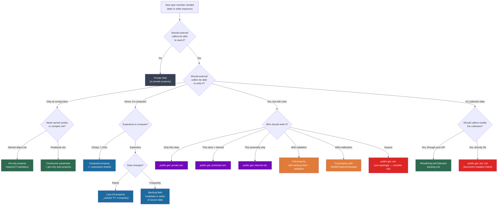

> [!success] Mastery Check
> - [ ] **Studied Well**
> - [ ] **Can explain the concept without notes**
> - [ ] **Can answer interview questions confidently**
> - [ ] **Can implement it in a real project**


## 📍 PART 0 — Navigation & Context

### Where This Topic Lives

```
C# Type System
└── Object Design
    ├── 2.08 — Classes: Fields, Constructors, Static Members
    ├── ► 2.09 — Properties, Indexers, and Access Modifiers  ← YOU ARE HERE
    ├── 2.10 — Inheritance, Polymorphism, Casting
    ├── 2.11 — Interfaces and Abstract Classes
    └── 2.19 — Records (compiler-generates init-only properties)
```

### What You Need Before This

- **[[2.08 — Classes]]** — Properties are class members. Fields, constructors, and static members are the substrate.
- **[[2.16 — Value Types vs Reference Types]]** — Properties can return structs; copy semantics on property getters matter.
- Basic understanding of encapsulation as a design principle.

### What This Unlocks After

- **[[2.10 — Inheritance]]** — `virtual`/`override` applies to properties; `abstract` properties define interface-like contracts on base classes.
- **[[2.11 — Interfaces]]** — Interface properties define property shape without implementation.
- **[[2.19 — Records]]** — Records auto-generate `init`-only properties; understanding the accessor model explains why.
- **[[2.33 — Generics: Variance]]** — Generic interfaces with property contracts (e.g., `IReadOnlyList<T>.Count`).

### Why This Topic Matters at Scale

> Properties are the primary API surface of every C# type. Every wrong access-modifier decision leaks internal state; every missed `init` accessor creates unnecessarily mutable DTOs; every property returning a large struct silently copies data on every call. Getting properties right is getting API design right.

---

## 🧠 PART 1 — The Core Mental Model

### The Fundamental Rule

> **A property is a pair of compiler-generated methods (getter and setter) with field-like call syntax. The caller sees `order.Total`, the CLR executes `get_Total()`. Every property design decision is really a method design decision.**

### The Plain-Language Analogy

Think of a property as a **bank teller window**. You cannot reach behind the counter and grab the cash drawer directly (that's a public field — which you should almost never use). Instead, you interact through the window. The teller (getter) shows you your balance. A different teller (setter) accepts deposits. The bank can decide the deposit window opens only from 9–5 (access modifiers), require identification before withdrawal (`init`-only setters), or refuse to process deposits above a limit (validation logic). The cash drawer itself — the actual data — stays locked behind the counter.

The analogy holds at the edge case level: an `init`-only property is a teller window that's open only during the account opening process and permanently closed afterward. A computed property is a teller who performs calculations on the fly rather than reading from a drawer at all.

### The Property Taxonomy

```mermaid
graph TD
    A["Property Variants"] --> B["Auto-Properties"]
    A --> C["Expression-Bodied"]
    A --> D["Full Properties\n(explicit backing field)"]
    A --> E["Computed / Derived"]
    A --> F["Indexers"]

    B --> B1["get; set;\n(read-write)"]
    B --> B2["get; private set;\n(asymmetric modifier)"]
    B --> B3["get;\n(readonly auto)"]
    B --> B4["get; init;\n(init-only, C# 9+)"]
    B --> B5["required get; init;\n(C# 11+)"]

    D --> D1["Full validation logic\nin setter body"]
    D --> D2["Lazy-init pattern\nin getter body"]
    D --> D3["Change notification\n(INotifyPropertyChanged)"]

    E --> E1["get-only computed\n=> _x + _y"]
    E --> E2["Cached computed\n(backing field + dirty flag)"]

    F --> F1["this[int index]\n(array-like access)"]
    F --> F2["this[string key]\n(dictionary-like access)"]
    F --> F3["Multi-parameter\nthis[int row, int col]"]

    A --> G["Access Modifiers\non Accessors"]
    G --> G1["public get; private set;"]
    G --> G2["public get; protected set;"]
    G --> G3["public get; internal set;"]
    G --> G4["public get; private protected set;"]

    style A fill:#1a1a2e,color:#eee
    style B fill:#16213e,color:#eee
    style C fill:#16213e,color:#eee
    style D fill:#16213e,color:#eee
    style E fill:#16213e,color:#eee
    style F fill:#0f3460,color:#eee
    style G fill:#533483,color:#eee
    style B1 fill:#2d6a4f,color:#fff
    style B2 fill:#2d6a4f,color:#fff
    style B3 fill:#2d6a4f,color:#fff
    style B4 fill:#2d6a4f,color:#fff
    style B5 fill:#2d6a4f,color:#fff
    style D1 fill:#457b9d,color:#fff
    style D2 fill:#457b9d,color:#fff
    style D3 fill:#457b9d,color:#fff
    style E1 fill:#457b9d,color:#fff
    style E2 fill:#457b9d,color:#fff
    style F1 fill:#e63946,color:#fff
    style F2 fill:#e63946,color:#fff
    style F3 fill:#e63946,color:#fff
    style G1 fill:#7209b7,color:#fff
    style G2 fill:#7209b7,color:#fff
    style G3 fill:#7209b7,color:#fff
    style G4 fill:#7209b7,color:#fff
```



> [!NOTE] The Six Access Modifiers
> C# has **six** access modifiers, not two. Many engineers only use `public` and `private`. Understanding the full set is a senior-level competency.
> `public`, `private`, `protected`, `internal`, `protected internal` (union), `private protected` (intersection, C# 7.2+)

---

## 🔬 PART 2 — Deep Mechanics

### 2.1 What the Compiler Actually Generates for a Property

Properties are pure compiler syntax sugar. Every property compiles to one or two methods in IL, plus (for auto-properties) a hidden backing field.

```csharp
// What you write:
public class OrderLine
{
    public decimal UnitPrice { get; set; }
    public int Quantity { get; private set; }
    public decimal LineTotal => UnitPrice * Quantity; // expression-bodied, get-only
}
```

```
// What the compiler generates (approximate IL-equivalent C#):
public class OrderLine
{
    // Auto-property backing field — compiler-generated name: <UnitPrice>k__BackingField
    // This name is intentionally unpronounceable in C# to prevent direct access
    [CompilerGenerated]
    private decimal <UnitPrice>k__BackingField;

    [CompilerGenerated]
    private int <Quantity>k__BackingField;

    // Getter method: get_UnitPrice()
    [CompilerGenerated]
    public decimal get_UnitPrice()
        => <UnitPrice>k__BackingField;

    // Setter method: set_UnitPrice(decimal value)
    [CompilerGenerated]
    public void set_UnitPrice(decimal value)
        => <UnitPrice>k__BackingField = value;

    [CompilerGenerated]
    public int get_Quantity()
        => <Quantity>k__BackingField;

    [CompilerGenerated]
    private void set_Quantity(int value)    // NOTE: private setter → private method
        => <Quantity>k__BackingField = value;

    // Computed property: only a getter method — no backing field
    public decimal get_LineTotal()
        => get_UnitPrice() * get_Quantity();  // calls the other getters
}
```

**IL cost labels:**
- Auto-property getter: ~1 ns — inlined by JIT to direct field access (zero overhead vs public field)
- Auto-property setter: ~1 ns — same
- Computed property: cost of the computation itself, no backing field lookup
- Non-inlined virtual property: ~3-5 ns (vtable dispatch cost, same as any virtual method)

```
MEMORY LAYOUT — OrderLine heap object:
┌──────────────────────────────────────────────┐
│ Object header     (8 bytes: sync block index) │
│ Type pointer      (8 bytes: MethodTable*)     │
├──────────────────────────────────────────────┤
│ <UnitPrice>k__BackingField   (16 bytes: decimal) │
│ <Quantity>k__BackingField    (4 bytes:  int)     │
│ [4 bytes padding for alignment]                  │
└──────────────────────────────────────────────┘
Total: ~40 bytes per OrderLine instance

Note: LineTotal has NO field — it's purely a method.
      Its cost appears at call time, not at allocation time.
```

### 2.2 The `init` Accessor — What It Is and Why It Exists

`init` was introduced in C# 9 specifically to support immutable object construction patterns without the boilerplate of a constructor with many parameters.

```csharp
public class ShippingAddress
{
    // init: can be set in an object initializer, but NOT after construction
    public string Street   { get; init; }
    public string City     { get; init; }
    public string PostCode { get; init; }
}

// Legal: object initializer runs during construction phase
var addr = new ShippingAddress
{
    Street   = "123 Main St",
    City     = "London",
    PostCode = "SW1A 1AA"
};

// Illegal: init accessor is closed after the construction expression completes
addr.City = "Manchester"; // CS8852: Init-only property can only be set in an
                           // object initializer, or on 'this' or 'base' in an
                           // instance constructor or an 'init' accessor.
```

**What the compiler generates for `init`:**

```
// The IL setter for an init property carries the modreq([System.Runtime]System.Runtime.CompilerServices.IsExternalInit)
// modifier on its signature. This is a runtime-enforced marker.
// The compiler checks for this modreq and only allows the setter to be called
// from: object initializers, constructors, other init accessors.
// At the IL level, init IS a setter — the restriction is purely in the C# compiler.
```

**The `required` modifier (C# 11) — one step further:**

```csharp
public class CustomerRecord
{
    // required: the caller MUST set this property (via object init or constructor).
    // Compile error if you create the object without providing it.
    public required string CustomerId { get; init; }
    public required string Email      { get; init; }
    public string? PhoneNumber        { get; init; } // optional
}

// Compile error: CS9035 — Required member 'CustomerId' must be set
var bad = new CustomerRecord(); // missing required members

// Correct:
var good = new CustomerRecord
{
    CustomerId = "CUST-001",
    Email      = "alice@example.com"
};
```

### 2.3 Full Property with Backing Field — Validation and Notification

Auto-properties are inadequate when you need side effects on set/get. Full properties give you a body.

```csharp
public class ProductListing
{
    private decimal _price;
    private string  _sku = string.Empty;

    // Full setter with validation
    public decimal Price
    {
        get => _price;
        set
        {
            // Business rule enforced at the setter: cannot set negative price
            if (value < 0)
                throw new ArgumentOutOfRangeException(nameof(value),
                    $"Price cannot be negative. Got: {value}");
            _price = value;
        }
    }

    // Full setter with change notification (INotifyPropertyChanged pattern)
    public string Sku
    {
        get => _sku;
        set
        {
            if (_sku == value) return;          // Avoid spurious notifications
            _sku = value ?? string.Empty;
            OnPropertyChanged(nameof(Sku));     // Notify subscribers
        }
    }

    // Lazy-init getter: expensive computation only on first access
    private string? _formattedDisplay;
    public string FormattedDisplay
    {
        get
        {
            // ~0 ns on all subsequent calls after the first
            return _formattedDisplay ??= BuildFormattedDisplay();
        }
    }

    private string BuildFormattedDisplay()
        => $"[{Sku}] {Price:C}";  // one-time ~50ns allocation

    protected virtual void OnPropertyChanged(string propertyName) { /* ... */ }
}
```

**Runtime cost:**
- Getter with null-coalescing lazy init: ~1 ns on subsequent calls (null check + field read, both in same cache line)
- Setter with validation: ~5-20 ns depending on exception-path branch prediction

### 2.4 Indexers — Array-Like Access on Custom Types

An indexer lets any type use `[]` syntax. The compiler translates `myObj[key]` to `myObj.get_Item(key)`.

```csharp
// Example: an order line collection that supports lookup by SKU or position
public class OrderLineCollection
{
    private readonly List<OrderLine>              _lines     = new();
    private readonly Dictionary<string, OrderLine> _bySku   = new();

    // Indexer 1: positional access — this[int index]
    // Compiles to: get_Item(int index) and set_Item(int index, OrderLine value)
    public OrderLine this[int index]
    {
        get => _lines[index];
        set
        {
            _lines[index] = value;
            _bySku[value.Sku] = value;   // keep dictionary in sync
        }
    }

    // Indexer 2: key access — this[string sku]
    // Note: one class can have MULTIPLE indexers if signatures differ
    public OrderLine? this[string sku]
    {
        get => _bySku.TryGetValue(sku, out var line) ? line : null;
    }

    public void Add(OrderLine line)
    {
        _lines.Add(line);
        _bySku[line.Sku] = line;
    }

    public int Count => _lines.Count;
}

// Usage:
var collection = new OrderLineCollection();
collection.Add(new OrderLine { Sku = "WIDGET-01", UnitPrice = 9.99m, Quantity = 3 });

var byPos = collection[0];          // calls int indexer
var bySku = collection["WIDGET-01"]; // calls string indexer

// Multi-parameter indexer example (e.g., a 2D grid)
public class InventoryGrid
{
    private readonly int[,] _slots;

    public InventoryGrid(int rows, int cols) => _slots = new int[rows, cols];

    // Multi-parameter indexer
    public int this[int row, int col]
    {
        get => _slots[row, col];
        set => _slots[row, col] = value;
    }
}

// Usage:
var grid = new InventoryGrid(10, 5);
grid[3, 2] = 100; // sets slot at row 3, col 2
```

**IL generated for `collection[0]`:**

```
// C#:  collection[0]
// IL (getter call):
ldloc collection
ldc.i4.0
callvirt instance class OrderLine OrderLineCollection::get_Item(int32)
```

**Cost:** Same as a method call. ~1 ns if inlined, ~3-5 ns if virtual dispatch required.

### 2.5 The Six Access Modifiers — Complete Reference

```
┌────────────────────────┬───────────────────────────────────────────────────────┐
│ Modifier               │ Accessible From                                       │
├────────────────────────┼───────────────────────────────────────────────────────┤
│ public                 │ Everywhere — no restriction                           │
│ private                │ Only within the declaring class/struct                │
│ protected              │ Declaring class + all derived classes                 │
│ internal               │ Any code in the same assembly (.dll/.exe)             │
│ protected internal     │ Same assembly OR derived classes (UNION)              │
│ private protected      │ Same assembly AND derived classes (INTERSECTION)      │
└────────────────────────┴───────────────────────────────────────────────────────┘

Strict ordering (most to least restrictive):
private < private protected < protected ≈ internal < protected internal < public

ASSEMBLY BOUNDARY DIAGRAM:
┌─── Assembly A ─────────────────────┐    ┌─── Assembly B ──────────────────┐
│                                     │    │                                  │
│  class Base                         │    │  class DerivedB : Base           │
│    public member          ◄─────────┼────┼────────────────────────────────► │
│    internal member        ◄───────► │    │  (internal: NO access)           │
│    protected member       ◄─────────┼────┼────────────────────────────────► │
│    protected internal     ◄─────────┼────┼────────────────────────────────► │
│    private protected      ◄──────── │    │  (private prot: NO — diff assm.) │
│    private                ◄──────── │    │  (never accessible outside class) │
│                                     │    │                                  │
│  class DerivedA : Base              │    │                                  │
│    protected member       ◄───────► │    │                                  │
│    private protected      ◄───────► │    │  (same assembly + derived = YES) │
│    protected internal     ◄───────► │    │                                  │
└─────────────────────────────────────┘    └──────────────────────────────────┘
```

### 2.6 Asymmetric Access Modifiers on Properties

A property can expose its getter more broadly than its setter — but not the reverse.

```csharp
public class CustomerAccount
{
    // The external world can READ the balance; only this class can WRITE it
    public decimal Balance { get; private set; }

    // Base class and derived classes can set it, but external callers cannot
    public string Status { get; protected set; } = "Active";

    // Any code in the same assembly can set it (e.g., a repository)
    // but external assemblies are read-only
    public DateTime LastModified { get; internal set; }

    // C# rule: the accessor modifier must be MORE restrictive than the property modifier
    // These are illegal:
    // private decimal Amount { get; public set; }   // public > private: ILLEGAL
    // public decimal Amount  { public get; set; }   // redundant but not illegal — just a warning

    public void Deposit(decimal amount)
    {
        if (amount <= 0) throw new ArgumentOutOfRangeException(nameof(amount));
        Balance += amount;       // sets private backing field via private setter
        LastModified = DateTime.UtcNow;
    }
}
```

### 2.7 Abstract and Virtual Properties

Properties participate fully in inheritance and polymorphism.

```csharp
// Abstract property: forces all derived classes to implement a getter
public abstract class Shipment
{
    // Derived class MUST provide a getter (and optionally a setter)
    public abstract decimal TotalWeight { get; }

    // Virtual property: derived class CAN override, base provides a default
    public virtual string TrackingStatus => "Unknown";
}

public class ParcelShipment : Shipment
{
    private readonly List<Parcel> _parcels = new();

    // Must override abstract property
    public override decimal TotalWeight
        => _parcels.Sum(p => p.WeightKg);  // computed from parcels

    // Override virtual property with a richer implementation
    public override string TrackingStatus
        => _parcels.Count == 0 ? "Empty" : base.TrackingStatus;
}

// Interface property: no implementation, just a contract
public interface IProduct
{
    string Sku        { get; }      // must expose Sku readable
    decimal Price     { get; set; } // must expose Price read-write
    int StockLevel    { get; }
}
```

---

## 💻 PART 3 — Production Code Patterns

### Pattern 1: The Boundary Guard — Validation in the Setter

Never let invalid state into an entity. The setter is the gate. Validate at the boundary, not scattered around business logic.

```csharp
// ⚠️ WRONG: Public field — no validation possible, any code can corrupt state
public class OrderHeader_Wrong
{
    public string CustomerId; // Nothing prevents: order.CustomerId = "";
    public decimal Total;     // Nothing prevents: order.Total = -999;
}

// ✅ CORRECT: Setter-as-boundary — invalid state is structurally impossible
public class OrderHeader
{
    private string   _customerId = string.Empty;
    private decimal  _total;

    public string CustomerId
    {
        get => _customerId;
        init                    // init: set once during construction, then immutable
        {
            if (string.IsNullOrWhiteSpace(value))
                throw new ArgumentException("CustomerId cannot be empty.", nameof(value));
            _customerId = value.Trim().ToUpperInvariant();
        }
    }

    public decimal Total
    {
        get => _total;
        private set              // private set: only this class can update the total
        {
            if (value < 0)
                throw new InvalidOperationException(
                    $"Order total cannot be negative. Computed: {value}");
            _total = value;
        }
    }

    // OrderId is completely immutable — set once, read everywhere
    public string OrderId { get; }

    public OrderHeader(string orderId, string customerId)
    {
        OrderId    = orderId;
        CustomerId = customerId;   // triggers init setter validation
    }

    // Only internal method can mutate Total — through the private setter
    internal void RecalculateTotal(IEnumerable<OrderLine> lines)
        => Total = lines.Sum(l => l.UnitPrice * l.Quantity);
}
```

### Pattern 2: The Lazy Initializer — Deferred Expensive Computation

Don't pay for expensive computations unless the property is actually accessed. Use a backing field with null-coalescing assignment.

```csharp
// Scenario: a product catalog entry that computes a rich display string
// and builds a tag index. Both are expensive. Most callers only read the price.

public class ProductCatalogEntry
{
    private readonly IReadOnlyList<string> _rawTags;
    private string?                         _cachedDisplayName;
    private IReadOnlyDictionary<string, bool>? _tagIndex;

    public string Sku     { get; }
    public string Name    { get; }
    public decimal Price  { get; }

    public ProductCatalogEntry(string sku, string name, decimal price,
        IReadOnlyList<string> tags)
    {
        Sku     = sku;
        Name    = name;
        Price   = price;
        _rawTags = tags;
        // NOTE: we do NOT compute DisplayName or TagIndex here
    }

    // ✅ Lazy property: ~0 ns on all calls after the first
    // First call: ~200 ns (string allocation); subsequent calls: ~1 ns (null check + field load)
    public string DisplayName
    {
        get => _cachedDisplayName ??= $"[{Sku}] {Name} ({Price:C})";
    }

    // ✅ Lazy dictionary index: built on first use, reused thereafter
    public IReadOnlyDictionary<string, bool> TagIndex
    {
        get => _tagIndex ??= _rawTags.ToDictionary(
            t => t.ToLowerInvariant(),
            _ => true,
            StringComparer.OrdinalIgnoreCase);
    }

    // ⚠️ Thread safety note: ??= is NOT atomic.
    // If thread safety is required, use Lazy<T> or a lock.
    // For read-heavy, occasional-write scenarios in non-concurrent contexts,
    // ??= is the correct idiomatic choice.
}
```

### Pattern 3: The Read-Only View — IReadOnly Interfaces to Prevent Leakage

Expose your internal collections through read-only interfaces. Returning `List<T>` directly allows callers to bypass your business logic.

```csharp
// ⚠️ WRONG: Exposing internal List<T> — callers can add/remove without going
//           through your business logic (e.g., stock validation, event firing)
public class Inventory_Wrong
{
    public List<StockItem> Items { get; } = new(); // caller can: Items.Clear()
}

// ✅ CORRECT: Internal state is List<StockItem>; external view is read-only
public class Inventory
{
    // Internal: mutable list for business operations
    private readonly List<StockItem> _items = new();

    // External: read-only wrapper — no allocation, just a view
    // IReadOnlyList<T> exposes: Count, indexer, and enumeration
    // Callers CANNOT call Add(), Remove(), Clear() through this interface
    public IReadOnlyList<StockItem> Items => _items;

    // Business operations are the only entry points for mutation
    public void AddStock(StockItem item)
    {
        ArgumentNullException.ThrowIfNull(item);
        if (_items.Any(i => i.Sku == item.Sku))
            throw new InvalidOperationException($"SKU {item.Sku} already exists.");
        _items.Add(item);
        StockAdded?.Invoke(this, item);  // raise event safely
    }

    public bool RemoveStock(string sku)
    {
        var item = _items.FirstOrDefault(i => i.Sku == sku);
        if (item == null) return false;
        _items.Remove(item);
        return true;
    }

    public event EventHandler<StockItem>? StockAdded;
}
```

### Pattern 4: The DTO with `required init` — Explicit Construction Contracts

Replace constructor parameter lists with required init properties for types that need clear, named construction. Better readability, better IDE completion, same compile-time safety.

```csharp
// ⚠️ WRONG: Long constructor — confusing, prone to argument-order bugs
public class CreatePaymentRequest_Wrong
{
    public CreatePaymentRequest_Wrong(string orderId, decimal amount,
        string currency, string paymentMethodId, string? description,
        bool capture = true, int idempotencyKey = 0)
    { /* ... */ }
}
// Called as: new CreatePaymentRequest_Wrong("ORD-001", 99.99m, "USD",
//   "pm_visa_001", null, true, 12345) — which arg is which?

// ✅ CORRECT: required init properties — self-documenting, named at call site
public sealed class CreatePaymentRequest
{
    // required: must be set; init: set-once, immutable after construction
    public required string OrderId         { get; init; }
    public required decimal Amount         { get; init; }
    public required string Currency        { get; init; }
    public required string PaymentMethodId { get; init; }

    // Optional — has a default
    public string? Description { get; init; }
    public bool    Capture     { get; init; } = true;
    public int     IdempotencyKey { get; init; } = 0;

    // Validation: if we need cross-property validation, do it in a factory method
    // rather than a constructor (the required+init pattern has no constructor body)
    public static CreatePaymentRequest Create(
        string orderId, decimal amount, string currency, string paymentMethodId)
    {
        if (amount <= 0) throw new ArgumentOutOfRangeException(nameof(amount));
        if (!SupportedCurrencies.Contains(currency))
            throw new ArgumentException($"Unsupported currency: {currency}");

        return new CreatePaymentRequest
        {
            OrderId = orderId,
            Amount = amount,
            Currency = currency.ToUpperInvariant(),
            PaymentMethodId = paymentMethodId
        };
    }

    private static readonly HashSet<string> SupportedCurrencies
        = new(StringComparer.OrdinalIgnoreCase) { "USD", "EUR", "GBP", "JPY" };
}

// Usage is self-documenting:
var request = CreatePaymentRequest.Create("ORD-001", 99.99m, "USD", "pm_visa_001");
```

### Pattern 5: The Dictionary-Style Indexer — Type-Safe Keyed Access

Indexers are underused. They're perfect when a type logically supports key-based lookup.

```csharp
// Scenario: a rate table in a pricing service
// Instead of: rateTable.GetRate("USD", "EUR") — returns decimal
// We write:   rateTable["USD", "EUR"]           — same thing, cleaner API

public class ExchangeRateTable
{
    private readonly Dictionary<(string From, string To), decimal> _rates = new();

    // Multi-key indexer for natural pair access
    public decimal this[string fromCurrency, string toCurrency]
    {
        get
        {
            var key = (fromCurrency.ToUpperInvariant(), toCurrency.ToUpperInvariant());
            if (!_rates.TryGetValue(key, out var rate))
                throw new KeyNotFoundException(
                    $"No exchange rate found for {fromCurrency} → {toCurrency}");
            return rate;
        }
        // internal set: only the RateLoader (same assembly) can populate rates
        internal set
        {
            var key = (fromCurrency.ToUpperInvariant(), toCurrency.ToUpperInvariant());
            _rates[key] = value;
        }
    }

    // Convenience: does a rate exist?
    public bool HasRate(string from, string to)
        => _rates.ContainsKey((from.ToUpperInvariant(), to.ToUpperInvariant()));
}

// Usage in the pricing service:
var rateTable = new ExchangeRateTable();
// rateTable["USD", "EUR"] = 0.92m;  // only works from within the assembly (internal set)

decimal usdToEur = rateTable["USD", "EUR"]; // caller just reads
decimal convertedAmount = 1000m * rateTable["GBP", "JPY"];
```

### Pattern 6: The Change-Notifying Property — MVVM and Event-Driven Systems

When properties need to broadcast changes (UI binding, audit trails, domain events):

```csharp
// Scenario: an order status domain object in an event-sourced system
public class OrderStatus : INotifyPropertyChanged
{
    private string   _status     = "Draft";
    private string?  _assignedTo;
    private DateTime _lastChanged = DateTime.UtcNow;

    // Standard INotifyPropertyChanged event
    public event PropertyChangedEventHandler? PropertyChanged;

    public string Status
    {
        get => _status;
        set
        {
            if (_status == value) return;  // skip if no actual change — avoid spurious events

            var previous = _status;
            _status = value;
            _lastChanged = DateTime.UtcNow;

            // Raise AFTER the value is committed — listeners see the new state
            OnPropertyChanged(nameof(Status));
            StatusChanged?.Invoke(this, (Previous: previous, Current: value));
        }
    }

    public string? AssignedTo
    {
        get => _assignedTo;
        set
        {
            if (_assignedTo == value) return;
            _assignedTo = value;
            OnPropertyChanged(nameof(AssignedTo));
        }
    }

    // Derived property: no setter, depends on Status
    // Must notify when Status changes — often forgotten!
    public bool IsActionable => _status is "InProgress" or "PendingReview";

    protected virtual void OnPropertyChanged(string propertyName)
    {
        PropertyChanged?.Invoke(this, new PropertyChangedEventArgs(propertyName));

        // When Status changes, IsActionable may also change — notify both
        if (propertyName == nameof(Status))
            PropertyChanged?.Invoke(this, new PropertyChangedEventArgs(nameof(IsActionable)));
    }

    public event EventHandler<(string Previous, string Current)>? StatusChanged;

    // Read-only: only Status.Status mutation updates this
    public DateTime LastChanged => _lastChanged;
}
```

### Pattern 7: The Expression-Bodied Property Suite — Fluency Without Verbosity

For types where most properties are computed or delegated, expression-bodied properties keep the code dense and readable.

```csharp
public class InvoiceLineItem
{
    // Constructor-set values — immutable after creation
    public string   ProductCode  { get; }
    public string   Description  { get; }
    public decimal  UnitPrice    { get; }
    public int      Quantity     { get; }
    public decimal  DiscountPct  { get; }
    public decimal  TaxRate      { get; }

    public InvoiceLineItem(string productCode, string description,
        decimal unitPrice, int quantity, decimal discountPct = 0m, decimal taxRate = 0.20m)
    {
        ProductCode  = productCode;
        Description  = description;
        UnitPrice    = unitPrice;
        Quantity     = quantity;
        DiscountPct  = discountPct;
        TaxRate      = taxRate;
    }

    // All computed — expression-bodied, zero allocation (no backing field needed)
    public decimal GrossAmount   => UnitPrice * Quantity;                     // ~2 ns
    public decimal DiscountAmount => GrossAmount * (DiscountPct / 100m);      // ~5 ns
    public decimal NetAmount     => GrossAmount - DiscountAmount;             // ~7 ns
    public decimal TaxAmount     => NetAmount   * TaxRate;                    // ~5 ns
    public decimal TotalAmount   => NetAmount   + TaxAmount;                  // ~7 ns

    // Formatted display — allocates on first call if cached, otherwise per-call
    public string DisplayLine    => $"{Quantity}x {Description}: {TotalAmount:C}"; // ~100 ns allocation
}
```

---

## ⚠️ PART 4 — Gotchas & Anti-Patterns

### Gotcha 1: Struct Property Getter Returns a Copy — Mutations Vanish

The most common struct-property bug. A property getter returning a value-type struct returns a **copy**. Calling a mutating method on that copy silently mutates nothing.

```csharp
public struct Dimensions
{
    public double Width;
    public double Height;
    public void Scale(double factor) { Width *= factor; Height *= factor; }
}

public class PackagingSpec
{
    public Dimensions BoxSize { get; set; }
}

// ⚠️ WRONG: This compiles but the mutation is lost
var spec = new PackagingSpec { BoxSize = new Dimensions { Width = 10, Height = 5 } };
spec.BoxSize.Scale(2.0);  // BoxSize getter returns a COPY of the Dimensions struct
                           // Scale() is called on the copy
                           // The copy is discarded
                           // spec.BoxSize is UNCHANGED
Console.WriteLine(spec.BoxSize.Width); // Still 10, not 20

// ✅ CORRECT: Replace the entire struct value
spec.BoxSize = new Dimensions { Width = spec.BoxSize.Width * 2, Height = spec.BoxSize.Height * 2 };
// OR: expose a method on PackagingSpec that does the mutation internally

// WHY: Properties are method calls. get_BoxSize() returns the field's value by copy.
// There is no way to get a reference to the field through a property call (without ref returns).
```

### Gotcha 2: Interface Property Hiding vs. Overriding

Properties can be hidden with `new` just like methods, and the behavior is identity-based — which interface type the variable is declared as determines which property runs.

```csharp
public interface IOrderProcessor  { string ProcessorName { get; } }
public interface IBatchProcessor  { string ProcessorName { get; } }

public class HybridProcessor : IOrderProcessor, IBatchProcessor
{
    // Implicit implementation: satisfies BOTH interfaces with one property
    public string ProcessorName => "Hybrid";

    // If you need different values per interface:
    // Explicit implementation — only accessible through the specific interface type
    string IOrderProcessor.ProcessorName => "OrderHybrid";
    string IBatchProcessor.ProcessorName => "BatchHybrid";
}

var h = new HybridProcessor();
Console.WriteLine(h.ProcessorName);                        // "Hybrid" (implicit)
Console.WriteLine(((IOrderProcessor)h).ProcessorName);    // "OrderHybrid" (explicit)
Console.WriteLine(((IBatchProcessor)h).ProcessorName);    // "BatchHybrid" (explicit)

// WHY: Explicit interface implementations are non-virtual and only visible
// when the variable is typed as that specific interface.
// This is the INTENDED mechanism, but it surprises engineers unfamiliar with it.
```

### Gotcha 3: `init` Is NOT `const` — It Runs At Object Initializer Time, Not Compile Time

`init` setters look immutable, but they execute code at runtime during object construction. They're not compile-time constants. This matters for default expressions.

```csharp
public class AuditRecord
{
    // This looks like it initializes at construction — and it does
    // But the default value "= DateTime.UtcNow" is evaluated at FIELD INIT TIME
    // (before the constructor body runs), NOT at class definition time
    public DateTime CreatedAt { get; init; } = DateTime.UtcNow;
}

// ⚠️ The gotcha: if you create 1000 instances in a loop,
// each gets a DIFFERENT CreatedAt (as expected).
// But if you write:
public static readonly AuditRecord DefaultRecord = new();
// DefaultRecord.CreatedAt is the time the static field initializer ran
// (approximately application startup) — NOT when individual records are created.
// This is usually correct but often surprises engineers who expect "always now".

// ✅ If you need the time captured at a specific moment:
var record = new AuditRecord { CreatedAt = DateTime.UtcNow }; // explicit is safer

// WHY: `= DateTime.UtcNow` after a property declaration is a field initializer.
// It runs ONCE during the specific object's construction.
// It is NOT a lazy property that calls DateTime.UtcNow each time you read it.
```

### Gotcha 4: Auto-Property Backing Field is Inaccessible — Serialization and Reflection Problems

Auto-property backing fields have compiler-mangled names. Serializers, some ORMs, and reflection-based frameworks that look for fields by name will not find them.

```csharp
public class UserProfile
{
    // This generates a backing field named: <Email>k__BackingField
    public string Email { get; private set; } = string.Empty;
}

// ⚠️ WRONG: Reflection trying to find a field named "Email" — it doesn't exist
var field = typeof(UserProfile).GetField("Email",
    BindingFlags.NonPublic | BindingFlags.Instance);
// field is NULL — there is no field named "Email". The field is named "<Email>k__BackingField"

// ✅ CORRECT: Access through the property, not the field
var prop = typeof(UserProfile).GetProperty("Email");
prop?.SetValue(profile, "new@example.com"); // works

// ✅ OR: use the actual backing field name (fragile — avoid in production)
var backingField = typeof(UserProfile).GetField("<Email>k__BackingField",
    BindingFlags.NonPublic | BindingFlags.Instance);

// WHY: The name "<Email>k__BackingField" is compiler-defined and stable within
// a given .NET version, but technically an implementation detail.
// Prefer accessing properties via PropertyInfo.SetValue, or use source generators.
```

### Gotcha 5: `protected internal` vs `private protected` — The Union/Intersection Confusion

These two modifiers are opposite in their restrictiveness and are almost universally confused.

```csharp
public class BaseService
{
    // protected internal = UNION:
    // Accessible if EITHER condition is true:
    //   (1) you're in the same assembly, OR
    //   (2) you're a derived class (even in a different assembly)
    protected internal string ServiceName { get; set; } = "Base";

    // private protected = INTERSECTION:
    // Accessible only if BOTH conditions are true:
    //   (1) you're in the same assembly, AND
    //   (2) you're a derived class
    private protected string InternalState { get; set; } = "Internal";
}

// Assembly A (same as BaseService):
public class InternalHelper  // NOT derived from BaseService
{
    void Demo(BaseService s)
    {
        var name = s.ServiceName;   // ✅ Works (same assembly satisfies protected internal)
        // var state = s.InternalState; // ❌ Fails (not derived, so intersection fails)
    }
}

// Assembly B (different assembly):
public class ExternalDerived : BaseService  // derived from BaseService
{
    void Demo()
    {
        var name = ServiceName;    // ✅ Works (derived satisfies protected internal)
        // var state = InternalState; // ❌ Fails (different assembly fails the AND)
    }
}

// WHY: protected internal is the MORE permissive (union), private protected is the LESS
// permissive (intersection). The names are counterintuitive — "private protected" sounds
// more restrictive than "protected internal" but engineers expect the opposite.
```

---

## 📊 PART 5 — Performance Implications

### 5.1 Allocation Characteristics Table

| Scenario | Allocation Behavior | Approx Cost |
|----------|--------------------|----|
| Auto-property getter (non-virtual) | Zero allocation; JIT inlines to field read | ~1 ns |
| Auto-property getter (virtual/override) | Zero allocation; vtable dispatch | ~3–5 ns |
| Computed property (expression-bodied) | Depends on expression; no backing field overhead | Expression cost |
| Lazy init property (first call) | One allocation for the computed value | ~50–500 ns |
| Lazy init property (subsequent calls) | Zero allocation; null check + field read | ~1 ns |
| Property returning `List<T>` (mutable) | Zero allocation; returns existing reference | ~1 ns |
| Property returning `IReadOnlyList<T>` backed by `List<T>` | Zero allocation; same reference, interface cast | ~1 ns |
| Property returning `new List<T>(items)` (defensive copy) | One heap allocation per call | ~50 ns + O(n) |
| Struct property getter | Zero allocation; copy of struct | Struct size / 8 ns |
| `init` setter | Same as regular setter; no extra overhead | ~1–20 ns |
| Indexer `this[int]` on `List<T>` | Zero allocation (bounds check + array access) | ~1–2 ns |
| Indexer `this[string]` on `Dictionary<K,V>` | Zero allocation (hash + lookup) | ~20–50 ns |
| `required` init at construction | Compile-time check only; zero runtime overhead | 0 ns |
| Property with `INotifyPropertyChanged` | One heap allocation per change (EventArgs) | ~30–50 ns |

### 5.2 BenchmarkDotNet: Property Access Patterns

```csharp
// Run this to understand the actual cost of different property patterns
// Expected output (approximate, .NET 8, x64):
//
// | Method                     | Mean     | Allocated |
// |--------------------------- |---------:|----------:|
// | AutoProperty_Get           | 0.31 ns  |       0 B |
// | VirtualProperty_Get        | 3.12 ns  |       0 B |
// | ComputedProperty_Get       | 1.42 ns  |       0 B |
// | LazyProperty_Get_HotPath   | 0.42 ns  |       0 B |
// | LazyProperty_Get_ColdPath  | 61.00 ns |      24 B |
// | StructProperty_Get_Small   | 0.35 ns  |       0 B |
// | StructProperty_Get_Large   | 8.10 ns  |       0 B |
// | Indexer_Int                | 1.20 ns  |       0 B |
// | Indexer_String             | 42.00 ns |       0 B |

[MemoryDiagnoser]
[BenchmarkCategory("Properties")]
public class PropertyAccessBenchmarks
{
    private readonly ConcreteOrder   _concreteOrder   = new();
    private readonly AbstractOrder   _abstractOrder   = new ConcreteOrderImpl();
    private readonly ProductCatalogEntry _catalogEntry = new("SKU-001", "Widget", 9.99m, new[] { "sale" });
    private readonly SmallProduct    _smallProduct    = new(1, 2);
    private readonly LargeStruct     _largeStruct     = new(1, 2, 3, 4, 5, 6, 7, 8);
    private readonly List<OrderLine> _lines           = Enumerable.Range(0, 100)
        .Select(i => new OrderLine { Sku = $"SKU-{i}", UnitPrice = i, Quantity = 1 })
        .ToList();

    [Benchmark(Baseline = true)]
    public string AutoProperty_Get() => _concreteOrder.Status;

    [Benchmark]
    public string VirtualProperty_Get() => _abstractOrder.Status; // virtual dispatch

    [Benchmark]
    public decimal ComputedProperty_Get() => _concreteOrder.LineTotal;

    [Benchmark]
    public string LazyProperty_Get_HotPath() => _catalogEntry.DisplayName;   // already cached

    [Benchmark]
    public string LazyProperty_Get_ColdPath()
    {
        // Force cold path by creating a new instance each time
        var entry = new ProductCatalogEntry("SKU-X", "Fresh", 1m, Array.Empty<string>());
        return entry.DisplayName;  // cache miss — allocation happens
    }

    [Benchmark]
    public (int, int) StructProperty_Get_Small() => (_smallProduct.X, _smallProduct.Y);

    [Benchmark]
    public LargeStruct StructProperty_Get_Large()
        // Returns 64-byte struct by copy — measure the copy cost
        => _largeStruct;

    [Benchmark]
    public OrderLine Indexer_Int() => _lines[50];

    // Indexer_String would require a custom type — see Pattern 5
}

// Supporting types for benchmark
public class ConcreteOrder
{
    public string Status    { get; } = "Processing";
    public decimal LineTotal => 99.99m;
}

public abstract class AbstractOrder
{
    public abstract string Status { get; }
}
public class ConcreteOrderImpl : AbstractOrder
{
    public override string Status => "Processing";
}

public record struct SmallProduct(int X, int Y);

public struct LargeStruct
{
    public double A, B, C, D, E, F, G, H;   // 64 bytes
    public LargeStruct(double a, double b, double c, double d,
        double e, double f, double g, double h)
        => (A, B, C, D, E, F, G, H) = (a, b, c, d, e, f, g, h);
}
```

### 5.3 When to Care / When to Ignore

**When property patterns cost you in production:**

- **Hot-path data binding in UI frameworks** — `INotifyPropertyChanged` allocates an `EventArgs` per change. In high-frequency data update scenarios (real-time trading dashboards, live telemetry), this adds up. Use `[NotifyPropertyChangedInvocator]` with source generators, or batch updates.
- **Properties returning large structs without `in`** — every getter call copies the struct. A 64-byte struct returned from a property 1 million times/sec = ~64 MB/sec of copy bandwidth. Use `ref`-returning properties or pass structs via `in` parameters.
- **Defensive copies in tight compute loops** — non-`readonly` structs in `readonly` fields trigger a copy per method call. In a physics engine or numerical computation loop, this can dominate.
- **Dictionary indexer on hot query paths** — `this[string key]` hashes the key on every call. If you call it in a tight loop with the same key, extract the value first.

**When property performance is irrelevant:**

- **Any I/O-bound or network-bound code** — if your method makes a database query or HTTP call, property access time is noise (~1 ns vs ~1,000,000 ns for I/O).
- **Business logic methods that run less than 10,000 times per second** — at that frequency, even a 1 μs method adds 10 ms/sec overhead, which is invisible.
- **Init-only and required properties** — zero runtime overhead; compile-time machinery only.

---

## 🎤 PART 6 — Interview Arsenal

### A. The Question Bank

---

**Q: "What is the difference between a property and a field in C#?"**

**Average Answer:** "A property has getter and setter methods, while a field is just a variable."

**Why That's Insufficient:** It doesn't explain WHY properties exist, what the compiler generates, or the design principles behind choosing one over the other.

**Great Answer:**
> "At the IL level, a property is a pair of methods — `get_PropertyName` and `set_PropertyName` — with a bit of metadata marking them as a property. A field is a raw memory slot. The first consequence is that properties give you a behavior boundary: you can add validation, lazy initialization, or change notification in the setter without changing the call site. The second is that properties can be virtual and participate in inheritance — fields cannot. The third is that you can expose a property through an interface. I almost never use public fields in production code — the one exception is for `readonly` fields in performance-critical structs where the JIT overhead needs to be genuinely zero, but even then I benchmark before deciding."

---

**Q: "What is an init-only property and when would you use it?"**

**Average Answer:** "A property with `init` instead of `set` — you can only set it in the object initializer."

**Why That's Insufficient:** Doesn't explain the motivation, the compiler mechanism, or the contrast with `required`.

**Great Answer:**
> "An `init`-only property uses the `init` accessor, which the compiler allows to be called in an object initializer or constructor but not afterward. The mechanism is a `modreq` on the IL setter signature that the C# compiler recognizes and enforces. It solves a real design tension: constructors with many parameters get confusing fast, and a six-argument constructor where three of them are optional is a maintenance hazard. But a fully-mutable set of properties is also wrong for objects that should be immutable after construction — like DTOs, command objects, and value objects. `init` gives you named, readable construction syntax with post-construction immutability. In C# 11, pairing it with `required` means the compiler enforces that callers actually provide the value — you get the best of constructor guarantees with the readability of object initializers."

---

**Q: "Explain the six access modifiers in C#. What's the difference between `protected internal` and `private protected`?"**

**Average Answer:** "Public is everywhere, private is just the class, protected is the class and derived classes, internal is within the assembly."

**Why That's Insufficient:** Misses two of six modifiers entirely, and the distinction between `protected internal` and `private protected` is specifically what interviewers test.

**Great Answer:**
> "C# has six modifiers, not four. `protected internal` means accessible if you're in the same assembly OR in a derived class — it's a union condition. `private protected`, added in C# 7.2, means accessible only if you're in the same assembly AND a derived class — an intersection. They sound like mirror images, but `protected internal` is actually the more permissive one. I remember it by thinking of `protected internal` as 'either door is open' and `private protected` as 'both doors must be open at once.' In practice, `internal` is one of the most underused modifiers — it's perfect for implementation details that need to be shared across classes in the same assembly but must never leak to consumers of the assembly. `private protected` is useful in framework design where you want extensibility within your library but not by external consumers."

---

**Q: "What is an indexer and how does it differ from a regular method?"**

**Average Answer:** "An indexer lets you use bracket notation to access elements of a class, like an array."

**Why That's Insufficient:** Doesn't address the IL-level implementation, that multiple indexers can coexist, or the design scenarios where indexers are the right abstraction.

**Great Answer:**
> "An indexer compiles to a pair of methods named `get_Item` and `set_Item` with the index as a parameter — the bracket syntax is purely syntactic sugar. The practical difference from a method like `GetItem(key)` is that indexers participate in the standard language idiom and implement the same pattern as arrays and dictionaries, so callers get natural, readable code. A class can have multiple indexers as long as the parameter types differ — I've used this to expose both positional `this[int index]` and key-based `this[string id]` access on the same collection type. The main design reason to choose an indexer over a method is when the access semantics are fundamentally 'retrieve element by key' — the same cognitive model as an array. If the semantics are more complex than that, a named method is clearer."

---

**Q: "When should you use a computed property vs storing a pre-computed value?"**

**Average Answer:** "Use computed if the value changes, stored if it's expensive to compute."

**Why That's Insufficient:** Doesn't address caching, thread safety, the cost of re-computation on every access, or the lazy-init pattern.

**Great Answer:**
> "The decision comes down to three questions: how expensive is the computation, how often is the property read, and does the source data change? If the computation is cheap — say, a sum of two fields — always make it computed. There's no allocation, no stale data risk, and the JIT will often inline it to zero overhead. If it's expensive but the underlying data rarely changes, I use lazy initialization with a nullable backing field and the null-coalescing assignment operator: `_cached ??= ComputeExpensiveValue()`. The first call pays the cost; all subsequent calls pay a null check. The gotcha is thread safety — `??=` is not atomic, so if multiple threads could race on the first access I use `Lazy<T>` instead. If the data changes frequently and callers read the property frequently, a pre-computed backing field that's updated in the setter is the right call, with care to invalidate or recompute when dependencies change."

---

### B. The Trick Questions

> [!WARNING] Non-Obvious Answers

**"Can a property return a reference to an internal field?"**
Trap: Most candidates say no. Correct: Yes — with `ref` returns. `public ref int GetRef() => ref _field;` returns a managed pointer. This is used in `Span<T>` internals and high-performance collections. It's unusual but valid.

**"Can an interface have a property with a setter?"**
Trap: Many candidates say interfaces only have read-only properties. Correct: Interfaces CAN define `get; set;` properties. The implementing class must provide both. This is common in mutable entity interfaces.

**"What happens when you set a property inside its own getter?"**
Trap: Candidates assume it's a compile error. Correct: It compiles and runs — it calls the setter, which may call the getter, causing a `StackOverflowException`. This is a real bug.
```csharp
public string Name
{
    get { Name = "default"; return _name; } // calls setter, which calls getter...
    set { _name = value; }
}
```

**"If a `readonly struct` has a property, and that property has a setter, what happens?"**
Trap: Candidates expect a compile error. Correct: `readonly struct` requires all FIELDS to be readonly, but a property setter can exist — the property setter must ultimately assign to a readonly field, which means it can only be called from a constructor or `init`. The compiler enforces this.

**"Can two classes in the same assembly see each other's `private` members?"**
Trap: Some candidates say yes. Correct: No. `private` is always strictly the declaring class. Only `internal` is "same assembly." `private` members of class A are inaccessible from class B even if both are in the same file.

---

### C. Red Flags to Avoid

```
❌ "Properties are just fields with getters and setters" — properties ARE methods; this matters
   for virtual dispatch, interface contracts, and the JIT's inlining decisions.

❌ "internal means private to the class" — internal means visible within the assembly.
   Private means the class only. Confusing these is a junior tell.

❌ "init is the same as readonly" — init is a runtime accessor restriction;
   readonly is a field-level keyword. An init property can still read its value at any time.

❌ Describing protected internal as "more restrictive than internal" — it's the opposite.
   protected internal is a UNION (accessible from MORE places than plain internal).

❌ "You should use public fields for simple data classes to avoid overhead" — the JIT
   inlines non-virtual property getters to direct field reads. There is zero overhead.
   And you lose all future flexibility to add validation, notifications, or change the backing.

❌ "Indexers are just syntactic sugar for Dictionary" — indexers are a general language
   feature. Any type can define them. They compile to get_Item/set_Item methods.

❌ Saying a property "stores" data — computed properties have no backing field.
   The correct framing is that a property "exposes" data, which may be stored or computed.

❌ Forgetting that the accessor modifier must be MORE restrictive than the property modifier —
   claiming you can have `private string X { get; public set; }` will get you corrected.
```

---

## 🔀 PART 7 — Decision Framework



---

## ✅ PART 8 — Self-Check

### A. Conceptual Questions

1. A property and a field both expose data. Given that the JIT inlines non-virtual property getters to direct field reads, why should you prefer a property over a public field?

2. You have a `public List<OrderLine> Lines { get; } = new();`. A caller does `order.Lines.Clear()`. Explain what happens and how you would prevent it while still allowing callers to enumerate the lines.

3. What is the IL-level mechanism that enforces `init`-only access? Why can `init` setters be called from constructors but not from regular methods?

4. Explain the difference between `protected internal` and `private protected`. Give a concrete scenario where each is the right choice.

5. You have a `readonly struct` with a method `public decimal GetTotal() => A + B`. You also have `private readonly MyStruct _data` in a class. The struct is NOT declared `readonly`. What hidden work does the JIT do when you call `_data.GetTotal()`, and how do you eliminate it?

6. A property getter returns a `struct` with 10 fields. You call the getter 50 times in a loop. What are you doing 50 times? What would change if you refactored to `ref`-returning?

7. What is the difference between these two? When would each be appropriate?
   ```csharp
   public string? CachedResult { get; private set; }
   public string CachedResult => _lazyResult ??= Compute();
   ```

8. Can an `abstract` class have a property with only a getter in the base class but both getter and setter in the derived class? What about the reverse?

9. Why can't you write `public decimal Total { public get; private set; }`?

10. You expose `public IReadOnlyCollection<string> Tags => _tags;` where `_tags` is a `HashSet<string>`. A caller casts it to `HashSet<string>` and mutates it. How do you prevent this? (Hint: think about what `IReadOnlyCollection<T>` guarantees and what it doesn't.)

---

### B. Code Puzzles

**Puzzle 1 — What is printed?**
```csharp
public struct Vector2D
{
    public float X, Y;
    public void Normalize()
    {
        float mag = MathF.Sqrt(X * X + Y * Y);
        X /= mag;
        Y /= mag;
    }
}

public class Physics
{
    public Vector2D Velocity { get; set; } = new() { X = 3f, Y = 4f };
}

var p = new Physics();
p.Velocity.Normalize(); // Does this compile? If so, what is p.Velocity.X after?
Console.WriteLine(p.Velocity.X);
```

<details>
<summary>Answer and Explanation</summary>

**Does it compile?** No. The compiler produces: `CS1612: Cannot modify the return value of 'Physics.Velocity' because it is not a variable.`

`p.Velocity` calls `get_Velocity()` which returns a COPY of the `Vector2D` struct. The copy is a temporary value (an rvalue), not an assignable location (an lvalue). Calling `.Normalize()` on an rvalue that would mutate it is illegal — the mutation would be immediately discarded anyway.

**Fix:** Replace the entire struct:
```csharp
var v = p.Velocity;
v.Normalize();
p.Velocity = v;
// p.Velocity.X is now 0.6 (3/5)
```
Or make `Normalize` return a new `Vector2D` instead of mutating in-place.

**Root cause:** This is the mutable struct + property getter trap from Gotcha 1. The compiler correctly refuses, but the intent of the code (normalize in-place) is clear and the error message is confusing to developers unfamiliar with copy semantics.

</details>

---

**Puzzle 2 — What is printed?**
```csharp
public class Config
{
    private static int _callCount = 0;

    public string Environment
    {
        get
        {
            _callCount++;
            return "Production";
        }
    }

    public static int CallCount => _callCount;
}

var cfg = new Config();
string msg = $"Running in {cfg.Environment} mode on {cfg.Environment} server.";
Console.WriteLine(Config.CallCount);
```

<details>
<summary>Answer and Explanation</summary>

**Printed:** `2`

The string interpolation expression `$"... {cfg.Environment} ... {cfg.Environment} ..."` calls the getter **twice** — once per interpolation hole. Each call increments `_callCount`.

**Why this matters:** Properties with side effects (logging, incrementing counters, calling external services) can be called multiple times when their value is embedded in a string interpolation, used in a LINQ query multiple times, or checked in a loop condition. The `Environment` property here looks like it returns a constant, but callers have no way to know that from the call site.

**Production implication:** Properties that call a database, cache store, or external service should NEVER be properties — they should be methods. The naming convention `Get...()` signals to callers that the call has cost. A property getter should be cheap enough to call multiple times without concern.

</details>

---

**Puzzle 3 — Where is the bug?**
```csharp
public class NotificationService
{
    private string _status = "Idle";

    public string Status
    {
        get => _status;
        set
        {
            _status = value;
            StatusChanged?.Invoke(this, EventArgs.Empty);
        }
    }

    public event EventHandler? StatusChanged;

    public async Task ProcessOrderAsync(string orderId)
    {
        Status = "Processing";     // Line A
        await Task.Delay(100);     // Simulates async work
        Status = "Complete";       // Line B
    }
}
```

<details>
<summary>Answer and Explanation</summary>

**The bug:** No explicit bug in the code as written, BUT there is a subtle threading issue in production: Line B (`Status = "Complete"`) runs on whatever thread the `Task.Delay` continuation is scheduled on (often a thread pool thread), NOT necessarily the thread that started `ProcessOrderAsync`. If `StatusChanged` event handlers assume they're called on a specific thread (e.g., a UI thread), they will not be — they'll be called on the continuation thread.

**More specifically:** If there is no `SynchronizationContext` (common in ASP.NET Core), `await Task.Delay(100)` resumes on a `ThreadPool` thread. The `StatusChanged` event fires from that thread pool thread. Any subscriber that updates UI or accesses thread-local state will have a threading bug.

**The deeper issue:** Properties with setter side effects that run async continuations create invisible threading contracts. If you find yourself with property setters that raise events that UI code subscribes to, the setter must either marshal back to the UI thread (via `SynchronizationContext.Current`) or document clearly that subscribers must handle cross-thread invocation.

**Fix for production:**
```csharp
private readonly SynchronizationContext? _syncContext = SynchronizationContext.Current;

set
{
    _status = value;
    if (_syncContext != null)
        _syncContext.Post(_ => StatusChanged?.Invoke(this, EventArgs.Empty), null);
    else
        StatusChanged?.Invoke(this, EventArgs.Empty);
}
```

</details>

---

**Puzzle 4 — Does this allocate?**
```csharp
public interface IPriceable { decimal Price { get; } }

public readonly struct DiscountedProduct : IPriceable
{
    public decimal BasePrice { get; }
    public decimal Discount  { get; }
    public decimal Price => BasePrice * (1 - Discount);

    public DiscountedProduct(decimal basePrice, decimal discount)
        => (BasePrice, Discount) = (basePrice, discount);
}

// Scenario A:
DiscountedProduct p = new DiscountedProduct(100m, 0.15m);
decimal priceA = p.Price;

// Scenario B:
IPriceable priceableRef = p;
decimal priceB = priceableRef.Price;
```

<details>
<summary>Answer and Explanation</summary>

**Scenario A:** NO allocation. `p` is a `readonly struct` local variable on the stack. `p.Price` calls the computed property getter on the local struct — no boxing, no heap allocation. The result `priceA` is a `decimal` on the stack.

**Scenario B:** ONE heap allocation. `IPriceable priceableRef = p` BOXES the `DiscountedProduct` struct — even though it's a `readonly struct`. Boxing always allocates, regardless of `readonly`. The `readonly` keyword prevents defensive copies when calling non-interface methods; it does NOT prevent boxing. `priceableRef` is a pointer to a heap-allocated box containing a copy of `p`. `priceableRef.Price` dispatches through the interface, calling the getter on the boxed copy.

**The implication:** If you're using `DiscountedProduct` in a hot path and accidentally pass it through an `IPriceable` parameter, you'll get an unexpected allocation. The fix is either: (a) use the concrete type `DiscountedProduct` throughout, or (b) accept the boxing cost and document it. This is precisely why high-performance code avoids casting structs to interfaces in hot paths.

</details>

---

**Puzzle 5 — What is the access level bug?**
```csharp
public class InvoiceRepository
{
    public Invoice GetById(int id) { /* ... */ return new Invoice(); }

    protected internal void MarkAsPaid(Invoice invoice) { /* ... */ }

    private protected void SoftDelete(Invoice invoice) { /* ... */ }
}

// Assembly: InvoiceService.Core (same assembly as InvoiceRepository)
public class InvoiceAuditor  // NOT derived from InvoiceRepository
{
    private readonly InvoiceRepository _repo = new();

    public void Audit(int invoiceId)
    {
        var invoice = _repo.GetById(invoiceId);
        _repo.MarkAsPaid(invoice);   // Line X
        _repo.SoftDelete(invoice);   // Line Y
    }
}
```

<details>
<summary>Answer and Explanation</summary>

**Line X (`MarkAsPaid`):** COMPILES. `protected internal` = union condition. `InvoiceAuditor` is in the same assembly as `InvoiceRepository`, which satisfies the `internal` part of the union. Access is granted. The `protected` condition (must be derived) is NOT required — either condition suffices.

**Line Y (`SoftDelete`):** COMPILE ERROR. `private protected` = intersection condition. `InvoiceAuditor` IS in the same assembly (satisfies condition 1), but it is NOT derived from `InvoiceRepository` (fails condition 2). Both conditions must be true simultaneously. This line will produce: `CS0122: 'InvoiceRepository.SoftDelete(Invoice)' is inaccessible due to its protection level.`

**The lesson:** `private protected` is specifically designed to prevent this exact case — same-assembly non-derived classes. It's the correct modifier when you want derived classes to extend behavior but you don't want the broader same-assembly access that `internal` provides. This is an important distinction in framework/library design where the internals of your library should be extensible through inheritance but not through arbitrary in-assembly code.

</details>

---

## 🔗 PART 9 — Connections & Resources

### A. Related Topics Table

| Topic | Why It Connects |
|-------|----------------|
| [[2.08 — Classes: Fields, Constructors, Static Members]] | Direct prerequisite — properties are class members; understanding fields, constructors, and static members is required to understand when a property vs field is appropriate |
| [[2.10 — Inheritance, Polymorphism, Casting]] | `virtual`/`override`/`abstract` properties participate in the same vtable dispatch mechanism as virtual methods — the mechanics are identical |
| [[2.11 — Interfaces and Abstract Classes]] | Interface properties define contracts without implementation; the access modifier rules for explicit interface implementation interact with the property accessor rules |
| [[2.19 — Records: Positional Syntax and Compiler-Generated Members]] | Records auto-generate `init`-only properties for positional parameters; the `required` keyword and init accessors are the building block of the record design |
| [[2.16 — Value Types vs Reference Types: Deep Mechanics]] | Properties returning structs return copies; the defensive copy problem with non-`readonly` structs in `readonly` contexts is directly caused by how properties work |
| [[2.37 — Virtual Dispatch, Polymorphism, and the CLR Object Model]] | Virtual property dispatch uses the same vtable mechanism as virtual methods — property getters and setters ARE methods at the IL level |
| [[2.21 — Delegates, Func, Action, and Closures]] | Computed properties that reference captured variables or use lambda-like expressions interact with the closure/display-class mechanics |
| [[2.52 — Source Generators]] | `[NotifyPropertyChangedInvocator]` and related patterns are commonly source-generated to avoid the boilerplate of manual `INotifyPropertyChanged` implementations |

### B. Books

| Book | Chapters | Why These Chapters |
|------|----------|--------------------|
| *C# in Depth*, Jon Skeet (4th ed.) | Ch. 2, 3, 14 | Ch. 2-3 covers type system and properties at depth; Ch. 14 covers `init` and records as introduced in C# 9 — the most thorough language-level explanation available |
| *CLR via C#*, Jeffrey Richter (4th ed.) | Ch. 10, 11 | Ch. 10 covers properties and events at the IL level — explains exactly what the compiler generates and what the CLR executes. Ch. 11 covers events. Essential for interview depth. |
| *Adaptive Code*, Gary McLean Hall | Ch. 5, 6 | Interface design and access modifier choices in the context of layered architecture; the best treatment of `internal` and `protected internal` in real codebases |
| *Framework Design Guidelines*, Cwalina, Abrams, Barton | Ch. 5 | The canonical Microsoft guide on property design guidelines — naming conventions, when to use properties vs methods, when to throw in getters/setters |

### C. Essential Articles & Docs

- [Microsoft Docs: Properties (C# Programming Guide)](https://learn.microsoft.com/en-us/dotnet/csharp/programming-guide/classes-and-structs/properties)
- [Microsoft Docs: Indexers (C# Programming Guide)](https://learn.microsoft.com/en-us/dotnet/csharp/programming-guide/indexers/)
- [Microsoft Docs: Access Modifiers (C# Reference)](https://learn.microsoft.com/en-us/dotnet/csharp/language-reference/keywords/access-modifiers)
- [Microsoft Blog: Init-only properties — Mads Torgersen](https://devblogs.microsoft.com/dotnet/c-9-0-on-the-record/#init-only-properties)
- [Framework Design Guidelines: Property Design](https://learn.microsoft.com/en-us/dotnet/standard/design-guidelines/property)
- [Stephen Toub: Avoiding boxing with IEquatable — includes property-level boxing scenarios](https://devblogs.microsoft.com/dotnet/avoiding-boxing-in-a-generic-method/)

---

> [!NOTE] Template Meta-Note
> **What each of the 9 parts is for — quick reference:**
> - **Part 0:** Navigation — where this topic sits in the larger curriculum, prerequisites, and what it unlocks
> - **Part 1:** Core Mental Model — one precise anchor sentence, a physical analogy mapped to runtime behavior, a complete taxonomy diagram
> - **Part 2:** Deep Mechanics — what the compiler and CLR actually do; memory layouts, IL-level transformations, cost labels on every operation
> - **Part 3:** Production Code Patterns — 5-7 annotated, domain-specific patterns you can paste into real code; anti-patterns labeled ⚠️ WRONG / ✅ CORRECT
> - **Part 4:** Gotchas — 5 production bugs that experienced engineers actually write, with wrong → right → why format
> - **Part 5:** Performance — allocation table across common scenarios, runnable BenchmarkDotNet class with expected output, explicit when-to-care guidance
> - **Part 6:** Interview Arsenal — full Q&A with average answers, great answers written to be spoken aloud, trick questions with traps, red flags list
> - **Part 7:** Decision Framework — single Mermaid flowchart usable as a cheat sheet in a live interview
> - **Part 8:** Self-Check — 10 conceptual questions requiring first-principles reasoning + 5 code puzzles with collapsed answers
> - **Part 9:** Connections — wiki-linked related topics with specific dependency reasons, curated books with chapter-level precision, authoritative articles only

---
*Last updated: 2026-06 · Domain: C# Language Mastery · Topic: 2.09 — Properties, Indexers, and Access Modifiers*
