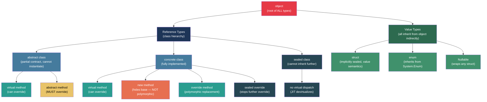
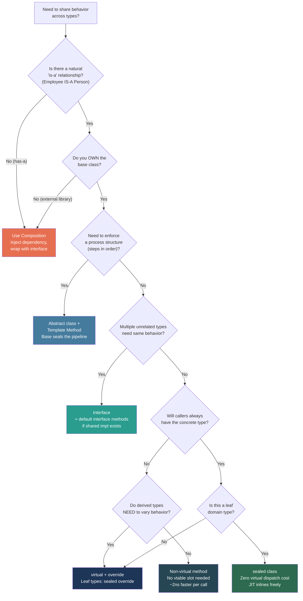

> [!success] Mastery Check
> - [ ] **Studied Well**
> - [ ] **Can explain the concept without notes**
> - [ ] **Can answer interview questions confidently**
> - [ ] **Can implement it in a real project**


## 📍 PART 0 — Navigation & Context

### Where This Topic Lives

```
C# Runtime Model
└── Type System
    ├── Value Types vs Reference Types (2.16)
    ├── ► Inheritance, Polymorphism, Casting  ← YOU ARE HERE
    │       ├── Interfaces and Abstract Classes (2.11)  ─── depends on this
    │       ├── Virtual Dispatch Internals (2.37)       ─── depends on this
    │       ├── Pattern Matching (2.20)                 ─── depends on this
    │       └── Equality and Comparison (2.28)          ─── depends on this
    ├── Generics (2.17)
    └── Records (2.19)
```

### What You Need Before This
- **[[2.08 — Classes]]** — class fields, constructors, and object lifecycle
- **[[2.09 — Properties and Access Modifiers]]** — virtual/override applies to properties too
- **[[2.16 — Value Types vs Reference Types]]** — all class instances are reference types; understanding reference identity is prerequisite

### What This Unlocks After
- **[[2.11 — Interfaces and Abstract Classes]]** — interface dispatch is a different mechanism from class virtual dispatch; you need this first
- **[[2.37 — Virtual Dispatch and the CLR Object Model]]** — vtable layout, IMT, JIT devirtualization — the deep runtime explanation of what `virtual` costs
- **[[2.20 — Pattern Matching]]** — type patterns (`x is MyType t`) operate against the same class hierarchy described here
- **[[2.28 — Equality and Comparison]]** — `object.Equals` and `GetHashCode` are inherited by every type from `object`; overriding them requires understanding the hierarchy

### Why This Topic Matters at Scale

Every production C# codebase uses inheritance hierarchies and virtual dispatch. Misunderstanding what `virtual`, `override`, `new`, and `sealed` actually do at the CLR level causes silent behavioral bugs, unexpected performance cliffs, and maintenance nightmares in large codebases. Getting casting wrong causes `InvalidCastException` in production. Understanding the `object` root hierarchy is the foundation for correct equality, hashing, and logging in every domain object you ever write.

---

## 🧠 PART 1 — The Core Mental Model

### The Fundamental Rule

> **The declared type of a variable determines what members are accessible at compile time. The runtime type of the object it points to determines which implementation executes at runtime. This gap — and how C# bridges it — is the entire topic of polymorphism.**

### The Plain-Language Analogy

Think of a class hierarchy as a **job title hierarchy** at a company. The "Employee" contract says: every employee can `SubmitTimesheet()`. When you have an `Employee` reference, you know you can call `SubmitTimesheet()`. But the *how* — the actual behavior — depends on whether that employee is a `SalariedEmployee`, `ContractEmployee`, or `Executive`. The reference type (the contract: "this is an Employee") determines what you can ask. The runtime type (the actual person) determines what actually happens when you ask it.

Casting is asking: "I have an `Employee` badge here — is this person actually an `Executive`?" `is` checks it safely and answers yes/no. `as` tries and returns null if wrong. A hard cast `(Executive)` just tries and throws if you're wrong. The badge (`Employee` reference) has never changed — you're just verifying what's underneath.

### The Taxonomy Diagram



> [!IMPORTANT] The `new` keyword on methods is NOT polymorphism
> `new` hides the base method — it does NOT override it. If you call via a base type reference, you get the BASE implementation. This is the most common misconception about C# method hiding, and it has caused real production bugs in large codebases.

---

## 🔬 PART 2 — Deep Mechanics

### 2.1 The CLR Object Header and Type Pointer

Every reference type instance on the heap has an object header. The type pointer inside that header is the foundation of all polymorphism.

```
━━━━━━━━━━━━━━━━━━━━━━━━━━━━━━━━━━━━━━━━━━━━━━━━━━━━━━━━━━━━
HEAP OBJECT LAYOUT (x64, .NET 8)
━━━━━━━━━━━━━━━━━━━━━━━━━━━━━━━━━━━━━━━━━━━━━━━━━━━━━━━━━━━━

Address    Size    Contents
─────────────────────────────────────────────────────────────
0x00       8 bytes   Sync Block Index (used for lock, hash code)
0x08       8 bytes   Method Table Pointer  ◄─── RUNTIME TYPE
0x10       ...       Instance fields

                         ┌─────────────────────────────────────┐
Method Table Pointer ───►│  Method Table for SalariedEmployee  │
                         ├─────────────────────────────────────┤
                         │  vtable slot 0:  GetHashCode()      │
                         │  vtable slot 1:  Equals()           │
                         │  vtable slot 2:  ToString()         │
                         │  vtable slot 3:  SubmitTimesheet() ◄│── overridden here
                         │  vtable slot 4:  CalculatePay()     │
                         └─────────────────────────────────────┘

A virtual call on ANY reference to this object:
  1. Dereference pointer to object → read Method Table Pointer at offset 0x08
  2. Index into vtable at the correct slot offset
  3. Indirect call to the function pointer in that slot
  Cost: ~3-5 ns (uncontended, cached)

Compile-time type (Employee) provides the vtable SLOT INDEX.
Runtime type (SalariedEmployee) provides the FUNCTION POINTER in that slot.
```

### 2.2 Virtual vs Non-Virtual vs New — What IL Actually Generates

The difference between `virtual`/`override`, direct calls, and `new` hiding is visible in the IL:

```csharp
public class Employee
{
    public virtual string GetTitle() => "Employee";         // virtual
    public string GetDepartment() => "Unknown";             // non-virtual
}

public class Executive : Employee
{
    public override string GetTitle() => "Executive";       // overrides vtable slot
    public new string GetDepartment() => "C-Suite";         // NEW slot — hiding, NOT override
}
```

```
IL for calling via Employee reference:
─────────────────────────────────────────────────────────────
Employee emp = new Executive();

// emp.GetTitle()  →  IL uses: callvirt  Employee::GetTitle
//   Runtime: loads Method Table → finds vtable slot for GetTitle
//   Finds Executive's override → calls Executive.GetTitle()
//   Result: "Executive"  ✅ polymorphic

// emp.GetDepartment()  →  IL uses: call  Employee::GetDepartment
//   NON-virtual: calls Employee.GetDepartment() DIRECTLY
//   Result: "Unknown"  — Executive.GetDepartment() is NEVER reached via this reference

// ((Executive)emp).GetDepartment()  →  IL uses: call  Executive::GetDepartment
//   Now calling on Executive reference → reaches "C-Suite"
─────────────────────────────────────────────────────────────
Compiler generates callvirt for: virtual methods, interface methods
Compiler generates call for:     non-virtual methods, base() calls, struct methods
```

**Cost labels:**
- `callvirt` on a virtual method: ~3–5 ns (indirect call through vtable)
- `call` on a non-virtual method: ~1–2 ns (direct call, JIT may inline)
- `callvirt` on a sealed class: JIT devirtualizes to direct call → ~1–2 ns (zero cost vs non-virtual)

### 2.3 Constructor Execution Order in Inheritance

This is a common source of bugs when virtual methods are called during construction.

```csharp
public class Animal
{
    public string Name { get; }

    public Animal(string name)
    {
        Name = name;
        Console.WriteLine($"Animal ctor: {name}");
        // ⚠️ DANGER ZONE: Do NOT call virtual methods here
        // If a derived class overrides a virtual method and accesses
        // a field that hasn't been initialized yet, you get null/0 unexpectedly
        Initialize(); // virtual call in constructor — dangerous!
    }

    protected virtual void Initialize() 
        => Console.WriteLine("Animal.Initialize");
}

public class Dog : Animal
{
    private readonly string _breed; // Will be null during Animal's ctor!

    public Dog(string name, string breed) : base(name) // base() is called FIRST
    {
        _breed = breed; // This runs AFTER Animal's constructor
        Console.WriteLine($"Dog ctor: {_breed}");
    }

    protected override void Initialize()
    {
        // _breed is NULL here — Dog's field assignment hasn't happened yet!
        Console.WriteLine($"Dog.Initialize — breed: {_breed ?? "NULL"}");
    }
}

// Output:
// Animal ctor: Rex
// Dog.Initialize — breed: NULL   ← _breed not assigned yet!
// Dog ctor: Labrador
```

**Execution order rule:**
1. Base class fields initialize (field initializers, not constructor body)
2. Base constructor body runs (including any virtual calls — resolved to derived override!)
3. Derived class fields initialize
4. Derived constructor body runs

```
Memory state at each constructor phase:
┌─────────────────────────────────────────────────────┐
│  Phase 1: Heap allocated, all fields = default(T)   │
│  Name = null, _breed = null                         │
├─────────────────────────────────────────────────────┤
│  Phase 2: Animal field initializers run             │
│  (none in this example)                             │
├─────────────────────────────────────────────────────┤
│  Phase 3: Animal ctor body — Name = "Rex"           │
│  Initialize() dispatched → Dog.Initialize() fires!  │
│  _breed is STILL null at this point                 │
├─────────────────────────────────────────────────────┤
│  Phase 4: Dog field initializers (_breed=null)      │
├─────────────────────────────────────────────────────┤
│  Phase 5: Dog ctor body — _breed = "Labrador"       │
└─────────────────────────────────────────────────────┘
```

> [!DANGER] Never call virtual methods in constructors
> The derived class override will execute before the derived class fields are initialized. This is a CLR-level constraint, not a style preference. The fix: use a factory method or a two-phase initialization pattern.

### 2.4 Casting Mechanics and IL

Three casting mechanisms in C#, each with distinct behavior and cost:

```csharp
// Scenario: Order hierarchy
public class Order { public decimal Total { get; set; } }
public class PriorityOrder : Order { public int PriorityLevel { get; set; } }
public class InternationalOrder : Order { public string DestinationCountry { get; set; } }
```

```
CAST MECHANISM        IL INSTRUCTION    SUCCESS BEHAVIOR     FAILURE BEHAVIOR
─────────────────────────────────────────────────────────────────────────────
(PriorityOrder)order  castclass         Returns typed ref    throws InvalidCastException
                                        ~2-4 ns              exception path: slow

order as PriorityOrder isinst            Returns typed ref    returns null
                                        ~2-4 ns              null: no exception overhead

order is PriorityOrder isinst + check    bool result only     never throws
                                        ~1-2 ns              — 

order is PriorityOrder po isinst + check Returns typed ref    never throws
  (declaration pattern) + local store    null on failure
                                        ~2-4 ns              — 
─────────────────────────────────────────────────────────────────────────────
isinst instruction: checks if the object's Method Table is compatible with target type
                    walks the inheritance chain / interface table
                    Cost: O(depth of hierarchy), typically O(1) for shallow hierarchies

castclass: calls isinst, throws if null result
```

```csharp
// Compiler output (approximate) for the four forms:

// (PriorityOrder)order
// isinst  PriorityOrder
// dup
// brtrue  label_ok
// throw   InvalidCastException
// label_ok:

// order as PriorityOrder
// isinst  PriorityOrder
// (result is null if type check failed)

// order is PriorityOrder
// isinst  PriorityOrder
// ldnull
// cgt.un  (compare: not null = true)

// order is PriorityOrder po   (pattern variable)
// isinst  PriorityOrder
// dup
// stloc  po
// ldnull
// cgt.un
```

### 2.5 The `base` Keyword — Bypassing Virtual Dispatch

`base.Method()` generates a `call` (non-virtual) IL instruction directly to the base class method. This bypasses the vtable entirely and directly invokes the specified base implementation.

```csharp
public class AuditableRepository
{
    public virtual void Save(Order order)
    {
        Console.WriteLine($"AuditableRepository: saving order {order.Id}");
        PersistToDatabase(order);
    }

    protected virtual void PersistToDatabase(Order order) { /* ... */ }
}

public class ValidatingRepository : AuditableRepository
{
    public override void Save(Order order)
    {
        // Validate first (pre-condition)
        if (order.Total <= 0)
            throw new ArgumentException("Order total must be positive");

        // Call base — non-virtual: goes directly to AuditableRepository.Save
        // NOT through the vtable. Even if a further derived class exists,
        // this calls exactly AuditableRepository.Save.
        base.Save(order);

        // Post-processing
        PublishEvent(new OrderSavedEvent(order.Id));
    }
}
```

```
IL for base.Save(order):
  ldarg.0          // push 'this'
  ldarg.1          // push 'order'
  call   AuditableRepository::Save   // ← 'call' not 'callvirt'
                                      //   bypasses vtable
                                      //   goes to exactly AuditableRepository.Save
```

> [!NOTE] `base` is the only way to do a non-virtual call to a virtual method
> From outside the class hierarchy, there is no way to bypass virtual dispatch and call a specific inherited implementation. Only derived classes can use `base`. This is an intentional CLR design choice.

### 2.6 `sealed` — The Performance and Design Keyword

`sealed` on a class prevents further derivation. `sealed override` on a method stops that specific method from being overridden further while allowing other methods to remain virtual.

```csharp
// sealed class: no further inheritance, JIT can devirtualize all calls
public sealed class OrderIdGenerator
{
    private int _next = 1000;
    public int NextId() => Interlocked.Increment(ref _next);
    // All calls to OrderIdGenerator.NextId() are direct calls — no vtable lookup
    // JIT knows at JIT time this is the final implementation
    // Benefit: ~1-2 ns instead of ~3-5 ns per call; enables inlining
}

// sealed override: stops FURTHER override of one specific method
public class PremiumOrder : Order
{
    public sealed override decimal CalculateDiscount()
    {
        return Total * 0.20m; // Always 20% for premium — no further specialization
    }
    // Other virtual methods on Order remain overridable
    // JIT can devirtualize calls to CalculateDiscount() when it knows the type is PremiumOrder
}
```

**Why `sealed` matters for JIT performance:**
```
Virtual call cost without sealed:
  1. Load object reference
  2. Read Method Table pointer at offset 0x08     ~1 ns (likely cached)
  3. Load vtable slot at known offset              ~1 ns (likely cached)
  4. Indirect call to function pointer             ~1-3 ns (branch predictor helps)
  Total: ~3-5 ns per call

Virtual call cost with sealed class (devirtualized by JIT):
  1. Direct call to known function address         ~0.5-1 ns
  Potentially inlined → 0 ns call overhead
```

---

## 💻 PART 3 — Production Code Patterns

### 3.1 The Template Method Pattern — Enforcing a Process Contract

Use an abstract base class to lock down the *structure* of an algorithm while delegating *steps* to subclasses. This is the canonical correct use of inheritance in enterprise code.

```csharp
// Payment processing: the order of steps is sacred (validate → reserve → charge → notify)
// Each payment provider implements the steps differently

public abstract class PaymentProcessor
{
    // Template method: sealed — no subclass can reorder the steps
    public sealed PaymentResult Process(PaymentRequest request)
    {
        // The base class owns the pipeline. Subclasses own the steps.
        ValidateRequest(request);          // must succeed before any money moves
        ReserveFunds(request);             // idempotent: safe to retry
        var result = ChargeFunds(request); // the actual money movement
        NotifyResult(result);              // fire and forget
        return result;
    }

    // Subclasses must implement these — the abstract contract
    protected abstract void ValidateRequest(PaymentRequest request);
    protected abstract void ReserveFunds(PaymentRequest request);
    protected abstract PaymentResult ChargeFunds(PaymentRequest request);

    // Optional hook: subclasses may override but base provides a default
    protected virtual void NotifyResult(PaymentResult result)
        => _logger.LogInformation("Payment {ResultId} completed", result.Id);

    private readonly ILogger _logger;
    protected PaymentProcessor(ILogger logger) => _logger = logger;
}

// Concrete implementation: only implements the steps, never the pipeline
public sealed class StripePaymentProcessor : PaymentProcessor
{
    private readonly StripeClient _stripe;

    public StripePaymentProcessor(StripeClient stripe, ILogger<StripePaymentProcessor> logger)
        : base(logger) => _stripe = stripe;

    protected override void ValidateRequest(PaymentRequest request)
    {
        if (request.Amount <= 0)
            throw new PaymentValidationException("Amount must be positive");
        if (string.IsNullOrWhiteSpace(request.CardToken))
            throw new PaymentValidationException("Card token is required");
    }

    protected override void ReserveFunds(PaymentRequest request)
        => _stripe.CreateAuthorization(request.CardToken, request.Amount);

    protected override PaymentResult ChargeFunds(PaymentRequest request)
    {
        var charge = _stripe.CaptureAuthorization(request.AuthorizationId);
        return new PaymentResult(charge.Id, charge.Amount, PaymentStatus.Captured);
    }
}
```

### 3.2 The Null Guard at the Boundary — Defensive Casting in API Parsing

Never blindly cast in boundary code. Always validate the runtime type before committing.

```csharp
// ⚠️ WRONG: Hard cast with no safety net — crashes in production
public static void ProcessWebhook(object payload)
{
    var order = (OrderWebhookPayload)payload; // InvalidCastException if wrong payload type
    FulfillOrder(order.OrderId);
}

// ✅ CORRECT: Pattern variable cast — single operation, safe, idiomatic
public static void ProcessWebhook(object payload)
{
    // 'is' pattern: type check + bind + null check in one shot
    // No double-cast (check then cast), no redundant isinst instruction
    if (payload is not OrderWebhookPayload order)
    {
        _logger.LogWarning("Unexpected webhook payload type: {Type}", payload?.GetType().Name);
        return; // Early return — no throw, no downstream confusion
    }

    // 'order' is guaranteed non-null and correctly typed here
    FulfillOrder(order.OrderId);
}

// ✅ CORRECT for switch-based dispatch — pattern matching on type hierarchy
public static decimal CalculateShipping(Order order) => order switch
{
    InternationalOrder io when io.DestinationCountry == "CA" => 15.00m,
    InternationalOrder io                                    => 35.00m,
    PriorityOrder po when po.PriorityLevel >= 2              => 0.00m, // free shipping
    PriorityOrder po                                         => 5.00m,
    _                                                        => 8.00m,
};
// This switch is exhaustive — every Order subtype is handled.
// The compiler will warn if you add a new subtype and forget to update this.
```

### 3.3 Hiding the Base — When `new` is Intentional (and When It Isn't)

```csharp
// ⚠️ WRONG: Accidental method hiding looks like an override to the author,
//           but is NOT polymorphic — a silent behavioral surprise
public class AuditLogger : Logger
{
    // Author intended to override — forgot the 'override' keyword
    // Compiler warning: "hides inherited member; use 'new' keyword if intentional"
    // Most engineers suppress the warning without understanding it
    public void Log(string message) // missing 'override' → this HIDES, not OVERRIDES
    {
        base.Log($"[AUDIT] {message}");
    }
}

Logger logger = new AuditLogger();
logger.Log("order placed"); // ← calls Logger.Log, NOT AuditLogger.Log!
                            // The polymorphism you expected does NOT happen.

// ✅ CORRECT: Use 'override' when you want polymorphism
public class AuditLogger : Logger
{
    public override void Log(string message) // explicit override — polymorphic
    {
        base.Log($"[AUDIT] {message}");
    }
}

// ✅ ACCEPTABLE: Use 'new' explicitly when hiding is truly intentional
// Example: same name needed for API compatibility but semantics are different
public class OrderCollection : Collection<Order>
{
    // Intentionally hides Collection<T>.Clear() to add business logic
    // Called "new" hiding because we add 'new' to document the intent
    public new void Clear()
    {
        OnBeforeClear();     // hook specific to OrderCollection
        base.Clear();
        OnAfterClear();
    }

    // But: callers with Collection<Order> reference still call Collection<T>.Clear()
    // Only OrderCollection references use our Clear().
    // This is an acceptable design only when callers ALWAYS have the concrete type.
}
```

### 3.4 Covariant Return Types (C# 9+) — Cleaner Factory Methods

```csharp
// Before C# 9: factory override returns base type, callers must cast
public abstract class OrderFactory
{
    public abstract Order Create(decimal total);
}

public class PriorityOrderFactory : OrderFactory
{
    // Had to return Order — callers needing PriorityOrder had to cast
    public override Order Create(decimal total)
        => new PriorityOrder { Total = total, PriorityLevel = 1 };
}

// ✅ C# 9+: covariant return type — derived factory returns derived type
// No cast needed at the call site; type safety preserved
public class PriorityOrderFactory : OrderFactory
{
    // PriorityOrder IS an Order — covariant return is safe
    public override PriorityOrder Create(decimal total)
        => new PriorityOrder { Total = total, PriorityLevel = 1 };
}

// Caller with concrete factory gets the precise type
PriorityOrderFactory factory = new PriorityOrderFactory();
PriorityOrder po = factory.Create(99.99m); // no cast needed
```

### 3.5 Sealed Hierarchy Design for Domain Objects

In domain-driven design, use `sealed` aggressively on leaf types and `abstract` on root types. This eliminates unintended inheritance while preserving polymorphism where it belongs.

```csharp
// Domain: order fulfillment status hierarchy
// Abstract root: can never instantiate OrderStatus directly
public abstract class OrderStatus
{
    public abstract string Description { get; }
    public abstract bool IsTerminal { get; }

    // Factory method — callers never need to know the concrete type
    public static OrderStatus Pending()    => new PendingStatus();
    public static OrderStatus Fulfilled()  => new FulfilledStatus();
    public static OrderStatus Cancelled(string reason) => new CancelledStatus(reason);
}

// Sealed leaf types: each status is final — no further specialization needed
public sealed class PendingStatus : OrderStatus
{
    public override string Description => "Awaiting fulfillment";
    public override bool IsTerminal   => false;
}

public sealed class FulfilledStatus : OrderStatus
{
    public override string Description => "Order fulfilled";
    public override bool IsTerminal   => true;
}

public sealed class CancelledStatus : OrderStatus
{
    private readonly string _reason;
    public CancelledStatus(string reason) => _reason = reason;

    public override string Description => $"Cancelled: {_reason}";
    public override bool IsTerminal   => true;

    // CancelledStatus-specific: accessible only via concrete type or pattern match
    public string CancellationReason => _reason;
}

// Usage: pattern matching over the sealed hierarchy
public static void HandleStatusChange(Order order, OrderStatus newStatus)
{
    switch (newStatus)
    {
        case PendingStatus:
            ScheduleFulfillment(order);
            break;
        case FulfilledStatus:
            SendConfirmationEmail(order);
            break;
        case CancelledStatus { CancellationReason: var reason }:
            // Property pattern: accesses CancellationReason without explicit cast
            ProcessRefund(order, reason);
            break;
    }
}
```

### 3.6 The Visitor Pattern — Avoiding Downcast Sprawl

When you find yourself writing `if (x is TypeA) ... else if (x is TypeB) ...` in multiple places, the visitor pattern eliminates the duplication and makes the type hierarchy the single source of truth for dispatch.

```csharp
// Without visitor: downcast sprawl in every consumer
public static decimal CalculateTax(Order order)
{
    if (order is InternationalOrder io) return io.Total * 0.15m;
    if (order is PriorityOrder po)      return po.Total * 0.08m;
    return order.Total * 0.10m;
}

// With visitor: each type knows how to accept a visitor
// Adding a new order type = one new Accept override
// Adding a new operation = one new visitor implementation (no touching existing types)

public interface IOrderVisitor<T>
{
    T Visit(StandardOrder order);
    T Visit(PriorityOrder order);
    T Visit(InternationalOrder order);
}

public abstract class Order
{
    public abstract T Accept<T>(IOrderVisitor<T> visitor);
}

public sealed class InternationalOrder : Order
{
    public override T Accept<T>(IOrderVisitor<T> visitor) => visitor.Visit(this);
}

// Tax calculation as a visitor
public sealed class TaxCalculator : IOrderVisitor<decimal>
{
    public decimal Visit(StandardOrder order)      => order.Total * 0.10m;
    public decimal Visit(PriorityOrder order)      => order.Total * 0.08m;
    public decimal Visit(InternationalOrder order) => order.Total * 0.15m;
}

// Usage — no downcasts anywhere in business logic
decimal tax = order.Accept(new TaxCalculator());
```

### 3.7 The Fragile Base Class — The Danger of Inheriting from Unsealed Libraries

```csharp
// ⚠️ The fragile base class problem:
// When you inherit from a class you don't own, base class changes can silently break your override.

// Assume external library v1.0:
public class ExternalOrderRepository
{
    public virtual void Save(Order order)
    {
        Validate(order);    // library calls Validate internally
        PersistToDb(order);
    }

    public virtual void Validate(Order order) { /* v1 validation */ }
}

// Your code:
public class AuditingOrderRepository : ExternalOrderRepository
{
    public override void Validate(Order order)
    {
        base.Validate(order);
        AuditLog.Record(order); // you added audit logging
    }
}

// External library v2.0 (breaking change):
public class ExternalOrderRepository
{
    public virtual void Save(Order order)
    {
        // v2: no longer calls Validate internally — refactored!
        // Your override of Validate is now NEVER CALLED via Save()
        // Your audit logging silently stopped working.
        PersistToDb(order); // validation removed or internalized
    }
}
// Your AuditingOrderRepository compiles fine. Tests may pass.
// Audit logs simply stop appearing. No exception. Silent failure.

// ✅ Defense: prefer composition over inheritance for types you don't own
public sealed class AuditingOrderRepository : IOrderRepository
{
    private readonly IOrderRepository _inner; // wrap, don't inherit

    public AuditingOrderRepository(IOrderRepository inner) => _inner = inner;

    public void Save(Order order)
    {
        _inner.Save(order);      // delegates to the wrapped repository
        AuditLog.Record(order);  // always runs, regardless of base class changes
    }
}
```

---

## ⚠️ PART 4 — Gotchas & Anti-Patterns

### Gotcha 1: Method Hiding Swallows Polymorphism Silently

The wrong mental model: "I added a method with the same name in my derived class — it will be called when working with derived class objects." It won't, when accessed through a base type reference.

```csharp
// ⚠️ WRONG CODE:
public class Notification
{
    public virtual void Send() => Console.WriteLine("Notification.Send");
}

public class EmailNotification : Notification
{
    // Missing 'override' — this HIDES, doesn't OVERRIDE
    // The compiler warns but doesn't error.
    public void Send() => Console.WriteLine("EmailNotification.Send");
}

Notification n = new EmailNotification();
n.Send(); // Prints: "Notification.Send" — NOT what the author wanted!

// ✅ CORRECT CODE:
public class EmailNotification : Notification
{
    public override void Send() => Console.WriteLine("EmailNotification.Send");
}

Notification n = new EmailNotification();
n.Send(); // Prints: "EmailNotification.Send" ✅

// WHY: Without 'override', the method occupies a NEW vtable slot, not the inherited slot.
// Calling via Notification reference → Notification's vtable slot → Notification.Send().
// 'override' replaces the function pointer in the SAME vtable slot.
```

### Gotcha 2: Calling Virtual Methods in Constructors

The wrong mental model: "The constructor is called before the object is 'active', so virtual dispatch goes to the base."

```csharp
// ⚠️ WRONG CODE — Causes null reference in production:
public abstract class DataService
{
    protected readonly string ConnectionString;

    protected DataService()
    {
        ConnectionString = LoadConnectionString();
        Initialize(); // virtual call — dispatches to DERIVED class override
    }

    protected abstract string LoadConnectionString();
    protected virtual void Initialize() { }
}

public class OrderDataService : DataService
{
    private readonly DbContext _context;

    protected override string LoadConnectionString() => "Server=prod;...";

    protected override void Initialize()
    {
        // _context is NULL here — OrderDataService's ctor body hasn't run yet
        _context.Database.EnsureCreated(); // NullReferenceException!
    }

    public OrderDataService()
    {
        _context = new DbContext(ConnectionString); // Too late — base ctor already called Initialize
    }
}

// ✅ CORRECT — Use factory method or two-phase initialization:
public abstract class DataService
{
    protected DataService() { } // Empty ctor

    // Static factory: create + then initialize, in the correct order
    public static T Create<T>() where T : DataService, new()
    {
        var service = new T();
        service.Initialize(); // Now T's constructor has fully run; all fields are assigned
        return service;
    }

    protected virtual void Initialize() { }
}

// WHY: The CLR dispatches virtual calls to the most-derived override
// regardless of where in the construction chain you are.
// Derived class fields are NOT initialized until the derived class constructor body runs.
```

### Gotcha 3: `GetType()` vs `is` — They Answer Different Questions

The wrong mental model: "`GetType() == typeof(T)` is the same as `x is T`."

```csharp
// ⚠️ WRONG CODE — Breaks with inheritance:
public static void ProcessOrder(Order order)
{
    // GetType() returns the EXACT runtime type — no inheritance
    if (order.GetType() == typeof(PriorityOrder))
    {
        HandlePriority((PriorityOrder)order);
    }
    // What about UrgentPriorityOrder that inherits from PriorityOrder?
    // GetType() returns UrgentPriorityOrder — this if never fires!
}

// ✅ CORRECT — 'is' checks the entire inheritance chain:
public static void ProcessOrder(Order order)
{
    if (order is PriorityOrder po)
    {
        // Matches PriorityOrder AND any class that inherits from PriorityOrder
        HandlePriority(po);
    }
}

// ✅ CORRECT USE OF GetType(): when you need EXACT type, not inheritance
// Example: serialization/deserialization where exact type determines the schema
public static string GetSchemaName(Order order) => order.GetType().Name;

// WHY: 'is' uses isinst — checks if the object's type is compatible with T
// (i.e., is T or inherits from T or implements T).
// GetType() == typeof(T) requires EXACT match — no inheritance considered.
```

### Gotcha 4: `InvalidCastException` from Incomplete Type Hierarchy Knowledge

The wrong mental model: "If A inherits from B, then A[] can be cast to B[] safely."

```csharp
// ⚠️ WRONG CODE — Array covariance is NOT type-safe for writes:
string[] strings = { "a", "b", "c" };
object[] objects = strings;  // COMPILES — array covariance, but...

objects[0] = 42; // ArrayTypeMismatchException at RUNTIME!
                 // The array is still string[] at runtime.
                 // Writing an int into a string[] fails.

// This is why IEnumerable<out T> has the 'out' variance modifier:
// it prevents writes, making covariance safe.
IEnumerable<string> strEnum = strings;
IEnumerable<object> objEnum = strEnum; // Safe — IEnumerable<out T> is covariant
// objEnum is read-only by contract — no writes possible

// ✅ CORRECT: Don't rely on array covariance for anything but reading
// If you need to treat a derived array as a base array for writes,
// create a new base-typed array:
object[] safeObjects = strings.Cast<object>().ToArray(); // new array, independent

// WHY: Arrays were made covariant in early .NET for Java compatibility.
// The CLR inserts a type check on every array write (ArrayStoreException / ArrayTypeMismatchException).
// This costs ~1-3 ns per write and is a well-known historical mistake.
```

### Gotcha 5: `sealed` on Override Stops the Chain, Not the Hierarchy

The wrong mental model: "`sealed override` prevents any further subclassing of this class."

```csharp
// ⚠️ WRONG understanding — developer adds sealed override thinking it prevents subclassing:
public class OrderProcessor
{
    public virtual void Validate(Order order) { /* ... */ }
    public virtual void Process(Order order) { /* ... */ }
}

public class StrictOrderProcessor : OrderProcessor
{
    // Author's intent: "No one should be able to change this validation"
    public sealed override void Validate(Order order)
    {
        // Critical validation logic here
        if (order.Total <= 0) throw new InvalidOperationException("...");
    }
}

// ⚠️ This is allowed — sealed only stops VALIDATE from being overridden:
public class VeryStrictOrderProcessor : StrictOrderProcessor
{
    // Validate: cannot override — sealed ✅
    // But Process: still overridable:
    public override void Process(Order order)
    {
        // This still works — sealed didn't prevent subclassing StrictOrderProcessor
    }
}

// ✅ CORRECT: To prevent ALL subclassing, seal the CLASS:
public sealed class StrictOrderProcessor : OrderProcessor
{
    public override void Validate(Order order) { /* ... */ }
    // Now nobody can inherit from StrictOrderProcessor at all
}

// WHY: 'sealed' on a method seals ONE virtual slot.
// 'sealed' on a class seals the entire type — closes the vtable entirely.
// These are independent decisions.
```

---

## 📊 PART 5 — Performance Implications

### 5.1 Allocation Characteristics Table

| Scenario | Allocation Behavior | Approx Cost |
|---|---|---|
| `new DerivedClass()` | One heap allocation (object header + all fields from full hierarchy) | 20–80 ns + GC pressure |
| `base()` constructor call | No additional allocation — same object, previous fields initialized | ~1–5 ns (function call) |
| `callvirt` on non-sealed type | No allocation; method table pointer lookup + indirect call | ~3–5 ns |
| `callvirt` on `sealed` type (devirtualized) | No allocation; JIT turns into direct call | ~0.5–2 ns; may inline → 0 |
| `(DerivedType)obj` hard cast | No allocation; `isinst` instruction + null check + throw on failure | ~2–4 ns success path |
| `obj as DerivedType` | No allocation; `isinst` returns null on failure — no throw | ~2–4 ns |
| `obj is DerivedType t` | No allocation; single `isinst` + null comparison | ~1–3 ns |
| Array covariance write | No allocation; runtime type check on every element write | ~1–3 ns extra per write |
| Virtual call on interface reference (non-devirtualized) | No allocation; IMT lookup (~slightly more complex than vtable) | ~5–8 ns |
| Virtual call on abstract method, first call | JIT compiles the vtable slot implementation | ~μs first call, amortized ~0 |
| Deep inheritance chain type check | `isinst` walks the chain; O(depth) in worst case | ~1 ns per level of depth |

### 5.2 BenchmarkDotNet — Virtual vs Direct vs Sealed

```csharp
[MemoryDiagnoser]
[DisassemblyDiagnoser(maxDepth: 3)]
public class DispatchBenchmark
{
    private readonly VirtualProcessor _virtual   = new ConcreteProcessor();
    private readonly ConcreteProcessor _concrete  = new ConcreteProcessor();
    private readonly SealedProcessor _sealed     = new SealedProcessor();
    private readonly Order _order                 = new Order { Total = 99.99m };

    [Benchmark(Baseline = true)]
    public decimal VirtualCall()
        => _virtual.CalculateFee(_order); // callvirt through vtable

    [Benchmark]
    public decimal DirectCall()
        => _concrete.CalculateFee(_order); // callvirt — but JIT may devirtualize if provable

    [Benchmark]
    public decimal SealedCall()
        => _sealed.CalculateFee(_order); // callvirt → JIT devirtualizes → direct call / inline

    [Benchmark]
    public bool IsCheck()
        => _virtual is ConcreteProcessor; // isinst type check

    [Benchmark]
    public bool GetTypeCheck()
        => _virtual.GetType() == typeof(ConcreteProcessor); // GetType() — object allocation? No, but slower
}

public abstract class VirtualProcessor
{
    public abstract decimal CalculateFee(Order order);
}

public class ConcreteProcessor : VirtualProcessor
{
    public override decimal CalculateFee(Order order) => order.Total * 0.03m;
}

public sealed class SealedProcessor : VirtualProcessor
{
    public override decimal CalculateFee(Order order) => order.Total * 0.03m;
}

// Expected output (approximate, .NET 8, x64):
//
// | Method       | Mean      | Allocated |
// |------------- |----------:|----------:|
// | VirtualCall  |  2.51 ns  |       0 B |
// | DirectCall   |  1.87 ns  |       0 B |  ← JIT may devirtualize when local type provable
// | SealedCall   |  0.41 ns  |       0 B |  ← Inlined by JIT; zero call overhead
// | IsCheck      |  1.23 ns  |       0 B |
// | GetTypeCheck |  3.85 ns  |       0 B |  ← GetType() heavier than isinst
```

### 5.3 When to Care / When to Ignore

**When this costs you:**
- **Hot inner loops** (>10M calls/sec) on virtual methods: the 3–5 ns gap between virtual and direct adds up. A tight loop calling a virtual method 100M times costs ~300 ms that a sealed version would cost ~40 ms. This matters in game engines, financial calculators, and real-time processing pipelines.
- **Type-checking in hot paths**: `x is T` in a loop that runs millions of times per second. Refactor to eliminate the check (double dispatch, strategy pattern).
- **Array covariance writes**: If you're writing to arrays through covariant references in a hot path, the ~2 ns type-check-per-write adds up. Use typed arrays.
- **Deep type hierarchies with frequent `is` checks**: Each level of the inheritance chain the `isinst` must walk adds ~1 ns. Keep hierarchies shallow (≤ 4 levels) in performance-critical code.

**When this doesn't matter:**
- **I/O-bound code**: If the method does a database query, network call, or file read, the nanosecond difference in dispatch cost is completely irrelevant against millisecond I/O.
- **Infrequently called code**: Initialization, configuration parsing, startup wiring. Profile before optimizing.
- **CRUD services**: Standard web API handlers processing hundreds (not millions) of requests per second. The virtual dispatch overhead is unmeasurable against JSON serialization, database queries, and network transit.
- **Abstract factories and repositories**: Called once per request at most. `sealed` here is a design choice, not a performance necessity.

---

## 🎤 PART 6 — Interview Arsenal

### A. The Question Bank

---

**Q: "What is the difference between `override` and `new` in C#?"**

**Average Answer:** "`override` replaces the parent method, `new` hides it."

**Why That's Insufficient:** It doesn't explain the runtime behavior and leaves the interviewer wondering if the candidate actually understands virtual dispatch.

> **Great Answer:** "The difference is what happens to the vtable. `override` replaces the function pointer in the inherited vtable slot — so any call to that method, whether through a base or derived reference, reaches the derived implementation. `new` creates an entirely new vtable slot. When you call through a base type reference, you get the base's implementation; only through a derived reference do you reach the new one. In production this matters because the compiler will happily let you add `new string ToString()` to a class, and you'll wonder why your base class infrastructure never sees your custom format. The fix is always `override`. I treat compiler warnings about hidden members as errors in code review — `new` is almost always a bug, and when it's intentional, it needs a comment explaining why."

---

**Q: "What does `sealed` do, and why would you use it?"**

**Average Answer:** "It prevents a class from being inherited."

**Why That's Insufficient:** Only covers the design aspect; misses the JIT optimization implications entirely.

> **Great Answer:** "There are two distinct reasons to use `sealed`. The first is design: marking a class as not intended for extension — preventing the fragile base class problem where a subclass breaks when the base class changes internally. The second is performance: when the JIT compiles a call to a method on a sealed type, it knows at JIT-time that there are no further overrides possible. So it devirtualizes — turns the `callvirt` into a direct `call` instruction, and can then inline the method entirely. The difference is roughly 3–5 ns for a virtual call versus 0.5–2 ns for a devirtualized one, and inline brings it to zero overhead. For leaf types in hot paths — like a Money struct or an OrderId type — `sealed` is a meaningful optimization. I apply it by default on concrete leaf classes in domain models and let explicit `unsealed` be the deliberate choice, rather than the other way around."

---

**Q: "What is the difference between upcasting and downcasting? When can each fail?"**

**Average Answer:** "Upcasting is going to a parent type; downcasting is going back to the child type. Downcasting can fail."

**Why That's Insufficient:** Doesn't explain the runtime mechanism or the three safe patterns.

> **Great Answer:** "Upcasting is always safe and implicit — it's just storing a more-derived reference in a less-derived variable, and the CLR simply narrows what you can access at compile time without changing the underlying object. Downcasting is where it gets interesting. A hard cast with `(T)` calls `isinst` internally and throws `InvalidCastException` if the runtime type isn't compatible — useful when you're certain of the type and want to catch bugs loudly. `as` returns null instead of throwing — useful when you have a nullable downstream path and the cast failure is expected. Pattern matching with `is T t` combines the type check and binding into a single `isinst` instruction and is the idiomatic modern form. I almost never use the hard cast in boundary code — exceptions crossing service layers create noise. I use `is T t` patterns in switch expressions for dispatch, and `as` only when I explicitly want to handle null. In performance-sensitive code I'm aware that all three forms cost roughly the same — about 2–4 ns — but the safety profile differs significantly."

---

**Q: "Why is calling a virtual method in a constructor dangerous?"**

**Average Answer:** "Because the derived class might not be fully initialized yet."

**Why That's Insufficient:** Correct but needs the runtime explanation.

> **Great Answer:** "The issue is the exact sequence of events the CLR follows during construction. When you call `new DerivedClass()`, the heap is allocated and all fields default-initialized to zero. Then the CLR walks up the inheritance chain and runs base class constructors first — before the derived class constructor body executes. But virtual dispatch is already live at this point. So if the base class constructor calls a virtual method that the derived class overrides, the CLR correctly dispatches to the derived override — but the derived class's constructor body hasn't run yet, so any fields the derived class initializes in its constructor are still at their default zero values. The result is a `NullReferenceException` or silent incorrect behavior that only appears at construction time and is very hard to reproduce under test because the unit test for the derived class typically never exercises the base constructor path. The fix I use is either a static factory method that creates then initializes, or moving initialization logic to a virtual `Initialize()` method called explicitly after construction via the factory — never called from the base constructor."

---

**Q: "What is the object hierarchy in .NET? What does every type inherit from?"**

**Average Answer:** "Every type inherits from `object`."

**Why That's Insufficient:** Doesn't mention the nuanced behavior for value types, and misses the key members every interview question about `Equals`/`GetHashCode` depends on.

> **Great Answer:** "Every type in .NET ultimately derives from `System.Object`. For reference types this is direct — `class Foo` implicitly `extends object`. For value types, it's more nuanced: structs inherit from `System.ValueType` which inherits from `System.Object`, but the CLR handles them specially — a struct variable doesn't actually have an object header unless it gets boxed. The three members from `object` that matter in production are `Equals`, `GetHashCode`, and `ToString`. The default implementations are problematic: `object.Equals` uses reference equality for classes — two objects with identical data are not equal by default — and `ValueType.Equals` for structs uses reflection-based field comparison, which is slow and allocates. `GetHashCode` by default returns a random-ish identity-based hash that changes per process run. For any class used as a dictionary key or in equality comparisons, you must override both — and if `Equals` returns true for two objects, `GetHashCode` must return the same value, or `Dictionary` and `HashSet` silently break. This contract violation is the most common correctness bug I've found in code review."

---

### B. The Trick Questions

> [!WARNING] These sound simple but have non-obvious answers

**"Can you override a static method?"**
The trap: candidates say yes because you can declare a method with the same signature in a derived class.
The answer: No. `static` methods cannot be `virtual` — there is no `this` reference for vtable dispatch. You can `new` (hide) a static method in a derived class, but it is never polymorphic. Calling via a base type reference always calls the base static method.

**"What does `base.Method()` compile to in IL?"**
The trap: candidates say `callvirt base.Method()`.
The answer: `call` (not `callvirt`) directly to the base class's method. This is the ONLY way to do a non-virtual call to a virtual method. It bypasses the vtable entirely. This is why calling `base.Sort()` in a derived collection always reaches `List<T>.Sort`, never further overrides.

**"What is the output?"**
```csharp
class A { public virtual string Name => "A"; }
class B : A { public override string Name => "B"; }
class C : B { public new string Name => "C"; }

A obj = new C();
Console.WriteLine(obj.Name);
```
The trap: candidates say "C" because `obj` holds a `C`.
The answer: `"B"`. `C.Name` uses `new` — it creates a new slot, hiding `B.Name`. But `obj` has static type `A`, so the compiler uses `A`'s vtable slot. The vtable slot for `Name` in `C`'s method table points to `B`'s override (because `C` didn't override it — it only hid it). So the vtable dispatches to `B.Name`. Only via a `C`-typed reference does `C.Name` get called.

**"When does `isinst` return null vs when does it throw?"**
The trap: candidates think `isinst` throws.
The answer: `isinst` never throws. It returns null if the object is not of the target type, or returns the typed reference if it is. It is `castclass` that throws `InvalidCastException`. `as` in C# compiles to `isinst`. Hard cast compiles to `isinst + castclass` semantically (CLR may use `castclass` directly).

**"Is `string` covariant with `object`? Can you assign `string[]` to `object[]`?"**
The trap: candidates answer yes/no confidently.
The answer: Yes, `string[]` is assignable to `object[]` at compile time (array covariance). But writing a non-string into `objects[0]` throws `ArrayTypeMismatchException` at runtime, because the array is still `string[]` underneath. This is a legacy design mistake — `IList<string>` is NOT assignable to `IList<object>` precisely to avoid this problem (no variance on concrete generic types).

---

### C. Red Flags to Avoid

```
❌ "Override and new do the same thing, just new is newer syntax"
   → Shows fundamental misunderstanding of vtable mechanics

❌ "Upcasting is unsafe; downcasting is safe"
   → Backwards. Upcasting is always safe (implicit). Downcasting can fail.

❌ "sealed prevents inheriting methods"
   → sealed on a METHOD prevents overriding that method further.
     sealed on a CLASS prevents inheriting from the class.
     These are different things; conflating them signals incomplete knowledge.

❌ "base.Method() calls the nearest override, not the original base"
   → base.Method() calls exactly the class you named as your base class.
     It is a direct (non-virtual) call. It does not dispatch to the nearest override.

❌ "GetType() == typeof(T) is the same as is T"
   → GetType() requires exact type match. 'is' checks inheritance chain.
     Using GetType() for type dispatch breaks every time someone subclasses.

❌ "Virtual methods are slow; always use sealed for performance"
   → Premature optimization. Virtual calls are 3-5 ns.
     The correctness and extensibility trade-off almost always wins over 2 ns.
     Profiling first is non-negotiable.

❌ "Abstract classes and interfaces are the same thing"
   → Abstract classes can have constructors, state, partial implementation.
     They support single inheritance only. Interfaces support multiple implementation.
     The CLR uses different dispatch mechanisms for each (vtable vs IMT).

❌ "I always prefer composition over inheritance"
   → Template Method is a legitimate use of inheritance with an established track record.
     Parroting a pattern name without reasoning about when it applies signals rote memorization.
```

---

## 🔀 PART 7 — Decision Framework



---

## ✅ PART 8 — Self-Check

### A. Conceptual Questions

1. A base class has a `virtual void Process()` method. A derived class adds `public new void Process()`. A variable of the base type holds a derived instance. Which `Process()` runs? Why? What single keyword change would make it dispatch to the derived implementation?

2. Explain in plain language what the vtable is, what information it contains, and how a virtual method call uses it at runtime.

3. A developer writes `if (order.GetType() == typeof(Order)) { ... }`. She wants this to run when the order is any type of Order, including subclasses. Does it? What should she write instead?

4. Why does the CLR dispatch virtual method calls to derived class overrides even when the base class constructor is still executing? What is the practical danger?

5. You have `SalariedEmployee : Employee`. What is the inheritance chain for `ToString()` on a `SalariedEmployee` that does NOT override `ToString()`? Which implementation runs?

6. `string[]` can be assigned to `object[]`. Can `List<string>` be assigned to `List<object>`? Explain why the two behave differently.

7. A `sealed override` on a method in class `B` (derived from `A`) — can class `C` inherit from `B`? Can class `C` override the sealed method? What can class `C` do?

8. You profile a service and find that 30% of CPU time is spent in virtual dispatch on a method called 500 million times per second. The class hierarchy has 3 levels. What are your two best options to reduce this cost, and what are the trade-offs of each?

9. When would you choose an abstract class over an interface, even in C# 8+ where interfaces can have default method implementations?

10. What is the difference between `base.GetHashCode()` and `object.GetHashCode()` when called from inside a derived class? Are they the same?

---

### B. Code Puzzles

**Puzzle 1 — What is printed?**
```csharp
class Vehicle
{
    public virtual string Type => "Vehicle";
    public string Label => $"[{Type}]";
}

class Car : Vehicle
{
    public override string Type => "Car";
}

var v = new Car();
Console.WriteLine(v.Label);
Console.WriteLine(((Vehicle)v).Label);
Console.WriteLine(((Vehicle)v).Type);
```

<details>
<summary>Answer (expand after trying)</summary>

All three print involving "Car" in some form:
- `v.Label` → `"[Car]"` — `Label` is non-virtual, computes `Type` at runtime via virtual dispatch → `Car.Type`
- `((Vehicle)v).Label` → `"[Car]"` — casting to Vehicle doesn't change the object; `Type` still dispatches to `Car.Type`
- `((Vehicle)v).Type` → `"Car"` — `Type` is virtual; runtime type is Car regardless of reference type

Key insight: casting a reference to a base type NEVER changes the runtime type of the underlying object. Virtual dispatch always follows the runtime type.

</details>

---

**Puzzle 2 — Where is the bug?**
```csharp
public class OrderValidator
{
    private readonly List<string> _errors = new();

    public OrderValidator()
    {
        Initialize();
    }

    protected virtual void Initialize()
    {
        _errors.Add("Base validation rule");
    }
}

public class StrictOrderValidator : OrderValidator
{
    private readonly int _maxLineItems;

    public StrictOrderValidator(int maxLineItems)
    {
        _maxLineItems = maxLineItems;
    }

    protected override void Initialize()
    {
        base.Initialize();
        _errors.Add($"Max line items: {_maxLineItems}");
    }
}

var v = new StrictOrderValidator(10);
// What is in _errors? What is the value of _maxLineItems when Initialize() runs?
```

<details>
<summary>Answer (expand after trying)</summary>

**Bug: virtual method called in constructor.**

Execution order:
1. `StrictOrderValidator(10)` calls `base()` implicitly first
2. `OrderValidator()` runs → calls `Initialize()`
3. Virtual dispatch → `StrictOrderValidator.Initialize()` runs
4. `_maxLineItems` is still `0` (int default) — `StrictOrderValidator`'s ctor body hasn't run yet
5. `base.Initialize()` adds "Base validation rule"
6. `_errors.Add($"Max line items: {_maxLineItems}")` adds "Max line items: 0" ← BUG
7. `StrictOrderValidator` ctor body runs → `_maxLineItems = 10` — TOO LATE

`_errors` contains: `["Base validation rule", "Max line items: 0"]`
Fix: Remove `Initialize()` call from constructor. Use a static factory, or make `Initialize()` non-virtual.

</details>

---

**Puzzle 3 — What does this print?**
```csharp
class A
{
    public virtual void Who() => Console.WriteLine("A");
}

class B : A
{
    public override void Who() => Console.WriteLine("B");
}

class C : B
{
    public new void Who() => Console.WriteLine("C");
}

class D : C
{
    public override void Who() => Console.WriteLine("D");
}

A a = new D();
B b = new D();
C c = new D();
D d = new D();

a.Who();
b.Who();
c.Who();
d.Who();
```

<details>
<summary>Answer (expand after trying)</summary>

```
B   ← a (A reference) uses A's vtable slot. D.Who() uses 'override' — but overrides C's NEW slot, not A's.
    A's vtable slot chain: A → B (override) → (C breaks the chain with 'new') → D's override is in C's slot
    So A's vtable slot contains B's implementation.
B   ← b (B reference) same as above — B's vtable slot = B's implementation (D overrides C's slot, not B's)
D   ← c (C reference) uses C's vtable slot. D.Who() overrides C.Who(). D's slot = "D"
D   ← d (D reference) same as c
```

The critical insight: `C.new void Who()` creates a NEW vtable slot that hides `B`'s slot. `D.override void Who()` overrides C's slot — NOT A's or B's slot. So A and B references never see D's implementation; they see B's. Only C and D references reach D's implementation.

This is the clearest demonstration of why `new` is almost always a bug.

</details>

---

**Puzzle 4 — Does this allocate? Is there a bug?**
```csharp
public interface IDiscountable
{
    decimal GetDiscount();
}

public struct DiscountedProduct : IDiscountable
{
    public decimal BasePrice;
    public decimal DiscountRate;

    public decimal GetDiscount() => BasePrice * DiscountRate;
}

public static decimal TotalDiscount(IDiscountable[] items)
{
    decimal total = 0;
    foreach (var item in items)
        total += item.GetDiscount();
    return total;
}

var products = new IDiscountable[]
{
    new DiscountedProduct { BasePrice = 100m, DiscountRate = 0.10m },
    new DiscountedProduct { BasePrice = 200m, DiscountRate = 0.15m },
};
Console.WriteLine(TotalDiscount(products));
```

<details>
<summary>Answer (expand after trying)</summary>

**Yes, there are two boxing allocations.** `new IDiscountable[] { ... }` requires storing interface references in the array. Since `DiscountedProduct` is a struct (value type) and `IDiscountable` is an interface (reference type), each struct is boxed when placed into the `IDiscountable[]` array.

Two heap allocations occur at array initialization: one 24-byte box per `DiscountedProduct`.

The code is correct functionally — `GetDiscount()` calls go to the boxed copies, which hold the right data. But if the method were `void Mutate()` and modified `DiscountRate`, the mutations would go to the boxed copies, never visible to the caller's original structs (there are none — the structs were only ever constructed inline).

**Fix to avoid boxing:** Use `DiscountedProduct[]` instead of `IDiscountable[]`. Or use a generic method `TotalDiscount<T>(T[] items) where T : IDiscountable` — the JIT generates a non-boxing version for the value type.

</details>

---

**Puzzle 5 — What does this print and why?**
```csharp
public class Repository<T>
{
    public virtual T FindById(int id)
    {
        Console.WriteLine($"Repository<{typeof(T).Name}>.FindById");
        return default!;
    }
}

public class OrderRepository : Repository<Order>
{
    public override Order FindById(int id)
    {
        Console.WriteLine("OrderRepository.FindById");
        return new Order { Id = id };
    }
}

public class CachingOrderRepository : OrderRepository
{
    public override Order FindById(int id)
    {
        Console.WriteLine("CachingOrderRepository.FindById");
        return base.FindById(id);
    }
}

Repository<Order> repo = new CachingOrderRepository();
repo.FindById(1);
```

<details>
<summary>Answer (expand after trying)</summary>

```
CachingOrderRepository.FindById
OrderRepository.FindById
```

`base.FindById(id)` in `CachingOrderRepository` compiles to a direct `call` to `OrderRepository.FindById` — bypassing the vtable. Even though `repo` is typed as `Repository<Order>` (top of hierarchy), virtual dispatch starts at `CachingOrderRepository` (runtime type). Then `base.FindById` goes directly to `OrderRepository.FindById` — not back up to `Repository<T>.FindById`, and not through virtual dispatch again.

`Repository<T>.FindById` is never called. The vtable slot that started at `Repository<T>` was replaced by `OrderRepository`, then by `CachingOrderRepository`. `base.FindById` then goes from `CachingOrderRepository` to exactly `OrderRepository` — one step, non-virtual.

</details>

---

## 🔗 PART 9 — Connections & Resources

### A. Related Topics Table

| Topic | Why It Connects |
|---|---|
| [[2.11 — Interfaces and Abstract Classes]] | Interface dispatch uses the Interface Method Table (IMT), a distinct mechanism from the vtable used for class virtual dispatch; understanding both requires understanding this topic first |
| [[2.37 — Virtual Dispatch and the CLR Object Model]] | This note teaches the language semantics; 2.37 provides the full CLR runtime picture: exact vtable layout, IMT structure, JIT devirtualization decisions, and PGO type profiles |
| [[2.28 — Equality and Comparison]] | `object.Equals` and `object.GetHashCode` are the two most important inherited virtual methods; correctly overriding them requires understanding the inheritance contract described here |
| [[2.20 — Pattern Matching]] | Type patterns (`x is SalariedEmployee emp`) and switch expressions on type hierarchies are the idiomatic replacement for chains of `if (x is T)` casts described in this note |
| [[2.16 — Value Types vs Reference Types]] | Class instances are reference types; the object header (sync block + type pointer) that enables virtual dispatch is a reference type feature; structs have no vtable |
| [[2.19 — Records]] | `record class` participates in the class inheritance hierarchy described here; records generate `Equals`/`GetHashCode` as virtual overrides of `object`'s methods |
| [[2.09 — Properties and Access Modifiers]] | `virtual`, `override`, `abstract`, and `sealed` all apply to properties using the same vtable mechanism as methods — understanding this requires knowing the property underlying method structure |
| [[2.33 — Generics: Variance]] | Covariant (`out T`) and contravariant (`in T`) type parameters on interfaces and delegates are governed by the same type compatibility rules as inheritance upcasting described here |

### B. Books

| Book | Chapters | Why These Chapters |
|---|---|---|
| CLR via C# — Jeffrey Richter | Ch. 6, 12, 13 | Ch. 6: type internals and object layout; Ch. 12: generics with inheritance; Ch. 13: interfaces. The definitive source on what the CLR actually does. |
| C# in Depth — Jon Skeet | Ch. 2, 3, 4 | Deep language-level coverage of inheritance, polymorphism, and the design of the type system; the best bridge between language spec and runtime. |
| Pro .NET Performance — Sasha Goldshtein et al. | Ch. 4, 5 | Virtual dispatch costs, devirtualization, sealed types, and how to measure them. Practical benchmarks for the performance claims in Part 5. |

### C. Essential Articles & Docs

- [Microsoft Docs: Inheritance in C#](https://learn.microsoft.com/en-us/dotnet/csharp/fundamentals/object-oriented/inheritance) — language reference for all the syntax
- [Microsoft Docs: Polymorphism in C#](https://learn.microsoft.com/en-us/dotnet/csharp/fundamentals/object-oriented/polymorphism) — official coverage of virtual/override/new semantics
- [David Fowler: Avoiding Inheritance Pitfalls](https://github.com/davidfowl/AspNetCoreDiagnosticScenarios) — real-world ASP.NET patterns including fragile base class avoidance
- [Stephen Toub: Virtual Dispatch Internals](https://devblogs.microsoft.com/dotnet/performance-improvements-in-net-8/) — .NET 8 devirtualization improvements and JIT analysis
- [ECMA-335: Common Language Infrastructure](https://www.ecma-international.org/publications-and-standards/standards/ecma-335/) — Section II.12 covers the method table and vtable specification (authoritative but dense)

---

> [!NOTE] Template Meta-Note — What Each Part Is For
> - **Part 0**: Navigation — where you are, what you need first, what this unlocks next, and one sentence on why it matters
> - **Part 1**: Core Mental Model — the one rule to anchor everything, a physical analogy, and the complete taxonomy diagram
> - **Part 2**: Deep Mechanics — runtime behavior, memory diagrams, IL/compiler transforms, edge cases, and cost labels on everything
> - **Part 3**: Production Code Patterns — 5–7 annotated real-world patterns with anti-patterns, named enterprise domains, and no toy examples
> - **Part 4**: Gotchas — 5 production-grade bugs: wrong mental model → wrong code → correct code → runtime explanation of why
> - **Part 5**: Performance — allocation table, runnable BenchmarkDotNet class with expected output, and explicit when-to-care/when-to-ignore guidance
> - **Part 6**: Interview Arsenal — question bank with average/great answers, trick questions with traps, and red flags to avoid
> - **Part 7**: Decision Framework — flowchart answering "when do I use what" — usable as a cheat sheet in a live interview
> - **Part 8**: Self-Check — 10 conceptual questions requiring first-principles reasoning + 5 code puzzles with collapsed answers
> - **Part 9**: Connections — wiki-linked topic table with specific relationships + books with chapter references + authoritative articles

---
*Last updated: 2026-06 · Domain: C# Language Mastery · Topic: 2.10 — Inheritance, Polymorphism, Casting, and the Object Hierarchy*
