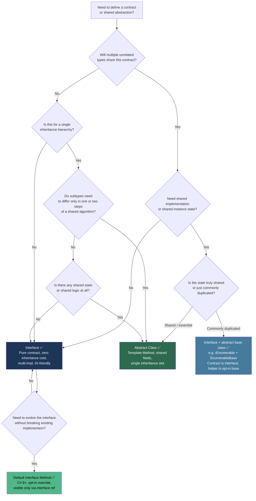

> [!success] Mastery Check
> - [ ] **Studied Well**
> - [ ] **Can explain the concept without notes**
> - [ ] **Can answer interview questions confidently**
> - [ ] **Can implement it in a real project**


## 📍 PART 0 — Navigation & Context

### Where This Topic Lives

```
C# Type System
└── Abstraction & Contracts
    ├── 2.10 — Inheritance, Polymorphism, Casting      ← prerequisite
    ├── ► 2.11 — Interfaces and Abstract Classes       ← YOU ARE HERE
    ├──   2.26 — Extension Methods and Fluent APIs     ← unlocked by this
    ├──   2.33 — Generics: Variance                    ← unlocked by this
    └──   2.37 — Virtual Dispatch and the CLR Object Model  ← unlocked by this
```

### What You Need Before This
- **[[2.10 — Inheritance, Polymorphism, Casting, and the Object Hierarchy]]** — virtual/override and the class hierarchy are prerequisites; interfaces and abstract classes build directly on that foundation
- **[[2.08 — Classes: Fields, Constructors, Static Members]]** — understanding how classes construct and what "instance member" means
- **[[2.09 — Properties, Indexers, and Access Modifiers]]** — interface and abstract members include properties; you need to know what those look like

### What This Unlocks After
- **[[2.26 — Extension Methods and Fluent APIs]]** — the most powerful pattern in all of LINQ: extension methods on interfaces
- **[[2.33 — Generics: Variance, Generic Math, and Advanced Patterns]]** — covariance (`out T`) and contravariance (`in T`) are interface-only language features
- **[[2.37 — Virtual Dispatch, Polymorphism, and the CLR Object Model]]** — interface method dispatch uses a completely different runtime mechanism (IMT) than virtual class dispatch (vtable); understanding the difference is senior-level knowledge

### Why This Matters at Scale

Interfaces are the primary tool for decoupling production systems — every dependency injection container, every testable service boundary, every pluggable strategy in enterprise .NET is built on interface contracts. Getting the interface vs. abstract class decision wrong is the kind of architectural mistake that costs months of refactoring.

---

## 🧠 PART 1 — The Core Mental Model

### The Fundamental Rule

> **An interface defines a contract with no implementation and no state. An abstract class defines a partial implementation with shared state. The practical consequence: a type can implement many interfaces but inherit only one abstract class — interfaces are the primary extensibility mechanism in .NET.**

### The Plain-Language Analogy

Think of an interface as a **job description posting**: it lists exactly what skills the role requires, but says nothing about how to perform them, and the same person can hold multiple certifications (implement multiple interfaces). An abstract class is more like a **trade school curriculum**: it gives you shared tools, some finished coursework, and a few blank assignments you must complete — but you can only enroll in one school at a time (single inheritance).

The critical runtime distinction: when you call a method through an interface reference, the CLR doesn't look in the same place as when it calls a virtual method on a class reference. Interface dispatch uses a separate lookup table (the Interface Method Table, or IMT) that is attached to the type's Method Table. This is like having a second directory of "interface-specific extensions" bolted onto the main staff directory. The lookup is slightly more expensive — ~5–8 ns vs ~3–5 ns for a virtual call — but still O(1).

### The Taxonomy Diagram

```mermaid
graph TD
    A["Abstraction Mechanisms in C#"] --> B["Interface"]
    A --> C["Abstract Class"]

    B --> D["Pure contract\nNo fields, no constructor\nMultiple implementation"]
    B --> E["Default Interface Methods\n(C# 8+, DIM)\nOptional implementation\nCan add without breaking changes"]
    B --> F["Static Abstract Members\n(C# 11+)\nFor generic math / operators"]
    B --> G["Explicit Interface\nImplementation\nHides from concrete type,\nonly visible via interface cast"]

    C --> H["Partial implementation\nCan have fields, constructors\nSingle inheritance only"]
    C --> I["abstract methods/properties\nNo body — subclass must implement"]
    C --> J["virtual methods/properties\nHave a body — subclass may override"]
    C --> K["sealed override\nPrevents further overriding\ndown the chain"]

    B --> L["Marker Interface\nIDisposable-style signal\nNo members, metadata only"]
    C --> M["Template Method Pattern\nBase defines algorithm skeleton\nSubclass fills in steps"]

    style B fill:#1d3557,color:#fff
    style C fill:#2d6a4f,color:#fff
    style D fill:#457b9d,color:#fff
    style E fill:#457b9d,color:#fff
    style F fill:#457b9d,color:#fff
    style G fill:#457b9d,color:#fff
    style H fill:#40916c,color:#fff
    style I fill:#40916c,color:#fff
    style J fill:#40916c,color:#fff
    style K fill:#40916c,color:#fff
    style L fill:#74c69d,color:#000
    style M fill:#74c69d,color:#000
```



> [!IMPORTANT] The Rule That Changes Your Architecture
> Because a class can implement **any number of interfaces** but can inherit from **at most one** abstract class, interfaces are the right default for public API contracts. Reserve abstract classes for when you have **shared implementation** that must be reused — not just shared contract.

---

## 🔬 PART 2 — Deep Mechanics

### 2.1 CLR Object Layout: Interface Dispatch vs Virtual Dispatch

This is the runtime reality that most engineers never examine. Understanding it explains both the performance difference and several gotchas.

```
━━━━━━━━━━━━━━━━━━━━━━━━━━━━━━━━━━━━━━━━━━━━━━━━━━━━━━━━━━━━━
CLASS HIERARCHY
━━━━━━━━━━━━━━━━━━━━━━━━━━━━━━━━━━━━━━━━━━━━━━━━━━━━━━━━━━━━━

interface IPaymentProcessor { Task<PaymentResult> ProcessAsync(PaymentRequest req); }
interface IAuditLogger       { void Log(AuditEvent evt); }
abstract class BaseProcessor { protected abstract string Name { get; } }
class StripeProcessor : BaseProcessor, IPaymentProcessor, IAuditLogger { ... }

━━━━━━━━━━━━━━━━━━━━━━━━━━━━━━━━━━━━━━━━━━━━━━━━━━━━━━━━━━━━━
HEAP LAYOUT FOR A StripeProcessor INSTANCE
━━━━━━━━━━━━━━━━━━━━━━━━━━━━━━━━━━━━━━━━━━━━━━━━━━━━━━━━━━━━━

Object Header (8 bytes: sync block index)
Method Table Pointer (8 bytes) ──────────────────────────────┐
[StripeProcessor fields...]                                   │
                                                              ▼
                                              StripeProcessor Method Table
                                              ┌───────────────────────────────┐
                                              │ [virtual slots from Object]   │
                                              │   slot 0: ToString()          │
                                              │   slot 1: Equals()            │
                                              │   slot 2: GetHashCode()       │
                                              ├───────────────────────────────┤
                                              │ [virtual slots from Base]     │
                                              │   slot 3: Name (get)  ◄────── abstract → StripeProcessor.get_Name
                                              ├───────────────────────────────┤
                                              │ [StripeProcessor own methods] │
                                              │   slot 4: ProcessAsync        │
                                              │   slot 5: Log                 │
                                              ├───────────────────────────────┤
                                              │ Interface Map (IInterfaceMap) │
                                              │  IPaymentProcessor → slot 4   │◄── IMT lookup
                                              │  IAuditLogger      → slot 5   │◄── IMT lookup
                                              └───────────────────────────────┘

VIRTUAL CALL (via class/abstract reference):
  call site → load Method Table pointer → index into vtable slot directly
  Cost: 1 indirect load + 1 indirect call ≈ 3–5 ns (uncontended, warm cache)

INTERFACE CALL (via interface reference):
  call site → load Method Table pointer
            → scan Interface Map for matching interface type token
            → get slot offset
            → index into vtable
  Cost: 1 extra indirection ≈ 5–8 ns (warm cache)
  Note: JIT can devirtualize both if the concrete type is provable (sealed, or via PGO)
```

> [!TIP] Cost Label
> Virtual dispatch: ~3–5 ns. Interface dispatch: ~5–8 ns. Direct call: ~1–2 ns. The difference only matters in tight loops calling millions of times per second — not in typical business logic.

### 2.2 What the Compiler Generates for Interface Implementation

```csharp
// Source:
public interface IOrderRepository
{
    Task<Order?> GetByIdAsync(int orderId);
}

public class SqlOrderRepository : IOrderRepository
{
    public Task<Order?> GetByIdAsync(int orderId)
        => /* ... real query ... */ Task.FromResult<Order?>(null);
}

// ───────────────────────────────────────────────────────
// IL generated for the call:
//   IOrderRepository repo = new SqlOrderRepository();
//   await repo.GetByIdAsync(42);
// ───────────────────────────────────────────────────────

// IL (simplified):
newobj  SqlOrderRepository::.ctor()          // allocate: 1 heap allocation ~32 bytes
stloc.0                                      // store to local 'repo'

// The interface call:
ldloc.0                                      // push the reference
callvirt IOrderRepository::GetByIdAsync(int) // callvirt via interface slot lookup

// Compiler generates the SAME 'callvirt' instruction for BOTH virtual class calls
// and interface calls. The difference is in what the JIT does with the Method Table.
// For an interface callvirt, the JIT emits code that walks the Interface Map.
// For a virtual class callvirt, it indexes the vtable directly.
```

### 2.3 Default Interface Methods (DIM) — The C# 8 Addition and Its Traps

Default interface methods allow adding new members to an interface without breaking existing implementers. They are implemented directly in the interface's IL, stored in the method table of the interface itself, not in the implementing class.

```csharp
public interface INotificationService
{
    // Original contract — all implementers have this
    Task SendAsync(string recipient, string message);

    // DIM added in v2 of the interface — existing implementers get this for free
    // Cost: one virtual call through the interface type, not free
    Task SendBulkAsync(IEnumerable<string> recipients, string message)
    {
        // Default implementation: sequential fan-out
        // Implementers can override for a batched implementation
        var tasks = recipients.Select(r => SendAsync(r, message));
        return Task.WhenAll(tasks);
    }
}

// An existing implementer that predates SendBulkAsync:
public class SmtpNotificationService : INotificationService
{
    public Task SendAsync(string recipient, string message)
        => /* SMTP send */ Task.CompletedTask;

    // Does NOT need to implement SendBulkAsync — it inherits the default
}

// A new implementer that wants to override for efficiency:
public class SendGridNotificationService : INotificationService
{
    public Task SendAsync(string recipient, string message)
        => /* SendGrid single */ Task.CompletedTask;

    // Overrides the default with a real batch API call — O(1) API call vs O(n)
    public Task SendBulkAsync(IEnumerable<string> recipients, string message)
        => /* SendGrid batch */ Task.CompletedTask;
}
```

> [!WARNING] The DIM Visibility Trap (This Bites Production Engineers)
> The default implementation is **only accessible through the interface reference**. It is NOT visible on the concrete type. This surprises experienced developers.
>
> ```csharp
> var smtp = new SmtpNotificationService();
> smtp.SendBulkAsync(...);             // ⚠️ COMPILE ERROR — method not found!
>
> INotificationService svc = smtp;
> svc.SendBulkAsync(...);              // ✅ OK — visible via interface
> ```
>
> This is deliberate: the concrete class didn't choose to expose this method. It's a contract feature, not a class feature.

### 2.4 Explicit Interface Implementation — When and Why

Explicit implementation hides a member from the concrete type's surface. It is only accessible through an interface cast. Cost: same as regular interface dispatch, ~5–8 ns.

```csharp
// Scenario: OrderService must implement two interfaces that share a method name
// with different intended semantics

public interface IReadableOrderService  { Order Get(int id); }
public interface IWritableOrderService  { void  Get(int id); } // hypothetical conflict

// Or more practically: hiding implementation details of a framework contract
public interface IServiceLifetime { void Initialize(); void Teardown(); }

public class OrderProcessingService : IServiceLifetime
{
    // This method is part of the hosting infrastructure contract.
    // We do NOT want application code calling Initialize() on OrderProcessingService directly.
    // Explicit implementation: hidden from the type's surface.
    void IServiceLifetime.Initialize()
    {
        // Wire up background workers, warm caches
    }

    void IServiceLifetime.Teardown()
    {
        // Drain queues, flush buffers
    }

    // Application code sees only business methods:
    public Task<ProcessingResult> ProcessOrderAsync(Order order) => /* ... */ Task.FromResult(new ProcessingResult());
}

// Called by the host:
IServiceLifetime lifetime = new OrderProcessingService();
lifetime.Initialize(); // ✅ Visible here

// Called by application code:
var svc = new OrderProcessingService();
svc.Initialize(); // ⚠️ COMPILE ERROR — hidden. Good.
```

> [!TIP] Cost Label
> Explicit interface implementation adds **zero runtime cost** over regular interface dispatch. The hiding is purely a compiler/metadata decision — the IL slot lookup happens identically at runtime.

### 2.5 Abstract Class — Shared State, Protected Contract, Template Method

```csharp
// Scenario: Payment gateway integrations share 90% of logic but differ in HTTP client setup
// Abstract class is correct because we want SHARED FIELDS and SHARED IMPLEMENTATION

public abstract class PaymentGatewayBase
{
    // Shared state — this is the reason to use abstract class over interface
    protected readonly HttpClient _httpClient;
    protected readonly ILogger    _logger;
    private   readonly string     _apiKey;

    // Base class controls construction
    protected PaymentGatewayBase(HttpClient httpClient, ILogger logger, string apiKey)
    {
        _httpClient = httpClient ?? throw new ArgumentNullException(nameof(httpClient));
        _logger     = logger     ?? throw new ArgumentNullException(nameof(logger));
        _apiKey     = apiKey     ?? throw new ArgumentNullException(nameof(apiKey));
    }

    // Template Method pattern: algorithm skeleton defined here, steps filled by subclass
    // ~3–5 ns for the virtual calls to the abstract methods; worth it for the shared logic
    public async Task<PaymentResult> ChargeAsync(ChargeRequest request)
    {
        // Shared pre-processing (validation, logging) — every subclass benefits
        ArgumentNullException.ThrowIfNull(request);
        _logger.LogInformation("Charging {Amount} via {Gateway}", request.Amount, GatewayName);

        // Abstract step — each gateway has different serialization/auth
        var httpRequest = BuildRequest(request, _apiKey);

        try
        {
            var response = await _httpClient.SendAsync(httpRequest);
            // Abstract step — each gateway parses response differently
            return ParseResponse(response, request);
        }
        catch (HttpRequestException ex)
        {
            _logger.LogError(ex, "Gateway communication failure for {Gateway}", GatewayName);
            return PaymentResult.GatewayError(ex.Message);
        }
    }

    // Abstract members: no implementation, subclass MUST provide
    protected abstract string             GatewayName { get; }
    protected abstract HttpRequestMessage BuildRequest(ChargeRequest request, string apiKey);
    protected abstract PaymentResult      ParseResponse(HttpResponseMessage response, ChargeRequest original);
}

// Concrete gateway — fills in the three abstract slots
public sealed class StripePaymentGateway : PaymentGatewayBase
{
    public StripePaymentGateway(HttpClient httpClient, ILogger<StripePaymentGateway> logger, string apiKey)
        : base(httpClient, logger, apiKey) { }

    protected override string GatewayName => "Stripe";

    protected override HttpRequestMessage BuildRequest(ChargeRequest request, string apiKey)
    {
        var msg = new HttpRequestMessage(HttpMethod.Post, "https://api.stripe.com/v1/charges");
        msg.Headers.Add("Authorization", $"Bearer {apiKey}");
        // ... build Stripe-specific form content
        return msg;
    }

    protected override PaymentResult ParseResponse(HttpResponseMessage response, ChargeRequest original)
    {
        // ... parse Stripe JSON response
        return PaymentResult.Success("stripe_charge_id");
    }
}
```

> [!NOTE] Cost Label
> The `ChargeAsync` template method makes 2 virtual calls (`BuildRequest`, `ParseResponse`) at ~3–5 ns each — negligible against the network I/O that dominates. The benefit: shared validation, logging, and error handling in a single place.

---

## 💻 PART 3 — Production Code Patterns

### 3.1 The Repository Contract with Dual Interface Segregation

Splitting read and write operations into separate interfaces (Interface Segregation Principle) allows read-only consumers to declare that constraint at the type system level.

```csharp
// Domain: order management system

// ⚠️ WRONG: one fat interface forces every consumer to declare write capability
public interface IOrderRepository
{
    Task<Order?> GetByIdAsync(int id);
    IAsyncEnumerable<Order> GetAllAsync();
    Task SaveAsync(Order order);        // write operation
    Task DeleteAsync(int id);           // write operation
}

// A reporting service has no business writing orders, yet it takes the full contract
public class OrderReportingService
{
    private readonly IOrderRepository _repo; // can call SaveAsync? That's wrong.
    public OrderReportingService(IOrderRepository repo) => _repo = repo;
}

// ✅ CORRECT: segregated interfaces
public interface IOrderReader
{
    Task<Order?> GetByIdAsync(int id);
    IAsyncEnumerable<Order> GetAllAsync();
    Task<IReadOnlyList<Order>> GetByCustomerAsync(int customerId);
}

public interface IOrderWriter
{
    Task SaveAsync(Order order);
    Task DeleteAsync(int id);
}

// The SQL implementation: one class, two interfaces
public class SqlOrderRepository : IOrderReader, IOrderWriter
{
    private readonly DbContext _db;
    public SqlOrderRepository(DbContext db) => _db = db;

    public async Task<Order?> GetByIdAsync(int id)
        => await _db.Orders.FindAsync(id);

    public async IAsyncEnumerable<Order> GetAllAsync()
    {
        await foreach (var order in _db.Orders.AsAsyncEnumerable())
            yield return order;
    }

    public async Task<IReadOnlyList<Order>> GetByCustomerAsync(int customerId)
        => await _db.Orders.Where(o => o.CustomerId == customerId).ToListAsync();

    public async Task SaveAsync(Order order)
    {
        _db.Orders.Update(order);
        await _db.SaveChangesAsync();
    }

    public async Task DeleteAsync(int id)
    {
        var order = await _db.Orders.FindAsync(id);
        if (order != null) _db.Orders.Remove(order);
        await _db.SaveChangesAsync();
    }
}

// Reporting service: correctly declares it only needs reads
public class OrderReportingService
{
    private readonly IOrderReader _reader;
    public OrderReportingService(IOrderReader reader) => _reader = reader;
}
```

### 3.2 The Strategy Pattern via Interface Injection

Interfaces are the backbone of the Strategy pattern. Every algorithm swap in a production system should look like this.

```csharp
// Domain: e-commerce shipping cost calculation

public interface IShippingCalculator
{
    decimal CalculateCost(ShipmentDetails shipment);
}

// Multiple strategies — each swappable at runtime via DI configuration
public sealed class FlatRateShippingCalculator : IShippingCalculator
{
    private readonly decimal _rate;
    public FlatRateShippingCalculator(decimal rate) => _rate = rate;

    public decimal CalculateCost(ShipmentDetails shipment) => _rate;
}

public sealed class WeightBasedShippingCalculator : IShippingCalculator
{
    public decimal CalculateCost(ShipmentDetails shipment)
        => shipment.WeightKg * 2.50m + (shipment.IsExpress ? 15.00m : 0.00m);
}

public sealed class CarrierApiShippingCalculator : IShippingCalculator
{
    private readonly ICarrierApiClient _carrier;
    public CarrierApiShippingCalculator(ICarrierApiClient carrier) => _carrier = carrier;

    public decimal CalculateCost(ShipmentDetails shipment)
        => _carrier.GetQuoteAsync(shipment).GetAwaiter().GetResult(); // sync wrapper for simplicity
}

// Consumer: doesn't know (or care) which strategy is injected
public class CheckoutService
{
    private readonly IShippingCalculator _shipping;
    private readonly IOrderWriter        _orders;

    // DI injects the correct strategy based on configuration
    public CheckoutService(IShippingCalculator shipping, IOrderWriter orders)
    {
        _shipping = shipping;
        _orders   = orders;
    }

    public async Task<CheckoutResult> CompleteCheckoutAsync(Cart cart, Address destination)
    {
        var shipment = ShipmentDetails.FromCart(cart, destination);
        var shippingCost = _shipping.CalculateCost(shipment); // interface dispatch, ~5–8 ns

        var order = Order.FromCart(cart, shippingCost);
        await _orders.SaveAsync(order);
        return CheckoutResult.Success(order.Id, shippingCost);
    }
}
```

### 3.3 The Abstract Base with Overridable Hooks (Open/Closed Principle)

The Template Method pattern via abstract class: the base class owns the algorithm, subclasses fill in the variable steps. This is correct when the steps share state stored in the base.

```csharp
// Domain: data pipeline export (CSV, JSON, Parquet)
// All exporters share: filtering logic, progress tracking, error handling

public abstract class DataExporterBase<TRecord>
{
    private readonly IProgressReporter _progress;

    protected DataExporterBase(IProgressReporter progress)
        => _progress = progress;

    // Template method — final algorithm; subclasses cannot override this
    public async Task ExportAsync(IAsyncEnumerable<TRecord> source, Stream destination,
                                   CancellationToken ct = default)
    {
        await WriteHeaderAsync(destination, ct);          // abstract
        int count = 0;

        await foreach (var record in source.WithCancellation(ct))
        {
            if (!ShouldInclude(record)) continue;        // virtual — override to filter
            await WriteRecordAsync(record, destination, ct); // abstract
            count++;
            if (count % 1000 == 0)
                _progress.Report(count);                 // shared state — base class owns this
        }

        await WriteFooterAsync(destination, ct);         // virtual — default is no-op
        _progress.Complete(count);
    }

    // Must be implemented — each format writes headers differently
    protected abstract Task WriteHeaderAsync(Stream destination, CancellationToken ct);
    protected abstract Task WriteRecordAsync(TRecord record, Stream destination, CancellationToken ct);

    // Optional to override — default allows all records
    protected virtual bool ShouldInclude(TRecord record) => true;

    // Optional to override — default writes nothing
    protected virtual Task WriteFooterAsync(Stream destination, CancellationToken ct)
        => Task.CompletedTask;
}

// Concrete exporter — only fills in format-specific slots
public sealed class CsvOrderExporter : DataExporterBase<Order>
{
    private static readonly byte[] HeaderBytes = "id,customer_id,amount,status\n"u8.ToArray();

    public CsvOrderExporter(IProgressReporter progress) : base(progress) { }

    protected override async Task WriteHeaderAsync(Stream destination, CancellationToken ct)
        => await destination.WriteAsync(HeaderBytes, ct);

    protected override async Task WriteRecordAsync(Order order, Stream destination, CancellationToken ct)
    {
        var line = $"{order.Id},{order.CustomerId},{order.Amount},{order.Status}\n";
        await destination.WriteAsync(System.Text.Encoding.UTF8.GetBytes(line), ct);
    }

    // Override the filter: only export completed orders
    protected override bool ShouldInclude(Order order) => order.Status == OrderStatus.Completed;
}
```

### 3.4 Explicit Interface Implementation to Separate Concerns

When a class participates in multiple contracts with overlapping member names, explicit implementation is the clean solution.

```csharp
// Domain: healthcare patient record service
// Must implement both an internal serialization contract and a public API contract
// Both define a Serialize() method with different signatures/semantics

public interface IInternalSerializable { byte[] Serialize(); }
public interface IApiResource          { string Serialize(); } // returns JSON

public class PatientRecord : IInternalSerializable, IApiResource
{
    public int    PatientId   { get; init; }
    public string FullName    { get; init; } = "";
    public string Diagnosis   { get; init; } = "";

    // Explicit: binary serialization for internal messaging
    // Not visible on PatientRecord directly — prevents accidents
    byte[] IInternalSerializable.Serialize()
    {
        // Compact binary format for internal event bus
        using var ms = new System.IO.MemoryStream();
        ms.Write(BitConverter.GetBytes(PatientId));
        // ... binary encode FullName, Diagnosis
        return ms.ToArray();
    }

    // Explicit: JSON for external API responses
    string IApiResource.Serialize()
    {
        // Note: Diagnosis is EXCLUDED from API response — deliberate privacy decision
        return System.Text.Json.JsonSerializer.Serialize(new { PatientId, FullName });
    }
}

// Callers must be intentional about which contract they use:
var record = new PatientRecord { PatientId = 1, FullName = "Jane Smith", Diagnosis = "..." };

// record.Serialize() → compile error: ambiguous and intentionally hidden

IInternalSerializable bus  = record;
byte[] bytes = bus.Serialize();   // binary, includes Diagnosis

IApiResource api = record;
string json = api.Serialize();    // JSON, excludes Diagnosis — correct
```

### 3.5 Marker Interface vs Attribute — Knowing Which Tool to Use

```csharp
// ⚠️ WRONG: Using a marker interface when an attribute is correct
// Marker interfaces add to the type hierarchy with no behavior value
// and force a cast to check the "mark"
public interface IExportableToAuditLog { } // empty — pure signal

public class OrderService : IExportableToAuditLog { } // now permanently in hierarchy

// Checking the mark requires an O(1) cast but clutters instanceof checks
if (service is IExportableToAuditLog)
    auditLogger.Capture(service);

// ✅ CORRECT: Use an attribute when it's metadata, not a contract
[AttributeUsage(AttributeTargets.Class, AllowMultiple = false)]
public sealed class AuditableAttribute : Attribute
{
    public string AuditCategory { get; }
    public AuditableAttribute(string category) => AuditCategory = category;
}

[Auditable("OrderManagement")]
public class OrderService { }

// Reading the attribute at startup (once, cached) — not in the hot path:
var auditables = Assembly.GetExecutingAssembly()
    .GetTypes()
    .Where(t => t.GetCustomAttribute<AuditableAttribute>() != null)
    .ToList();

// ✅ BUT: Use a marker interface when the contract participates in generic constraints
// or LINQ/collection operations:
public interface ISoftDeletable { bool IsDeleted { get; } }

// Generic query helper — requires the interface, not an attribute
public static IQueryable<T> ExcludeDeleted<T>(this IQueryable<T> query)
    where T : ISoftDeletable
    => query.Where(x => !x.IsDeleted);
```

### 3.6 Default Interface Method for Non-Breaking Evolution

```csharp
// Domain: plug-in system for a logistics platform
// v1 of the interface — 100 plug-ins already implement this
public interface IRouteOptimizer
{
    Route Optimize(IReadOnlyList<Waypoint> waypoints);
}

// v2 requirement: add support for async optimization without breaking 100 existing plug-ins
// ✅ Add as a DIM — existing synchronous implementations get a working default
public interface IRouteOptimizer
{
    Route Optimize(IReadOnlyList<Waypoint> waypoints);

    // Default: wraps synchronous implementation in Task.Run
    // Plug-ins that have native async can override for correctness and performance
    ValueTask<Route> OptimizeAsync(IReadOnlyList<Waypoint> waypoints,
                                   CancellationToken ct = default)
        => new ValueTask<Route>(Task.Run(() => Optimize(waypoints), ct));
}

// A new high-performance plug-in overrides the default for true async:
public class HybridAStarOptimizer : IRouteOptimizer
{
    public Route Optimize(IReadOnlyList<Waypoint> waypoints)
        => OptimizeAsync(waypoints).AsTask().GetAwaiter().GetResult();

    // True async — no thread pool overhead
    public ValueTask<Route> OptimizeAsync(IReadOnlyList<Waypoint> waypoints,
                                          CancellationToken ct = default)
        => /* true async algorithm */ new ValueTask<Route>(new Route());
}
```

### 3.7 The Covariant Return Type via Interface Composition

When a subtype needs to return a more specific type from an overridden method, interface composition is cleaner than casting.

```csharp
// Domain: document processing system — base creates documents, derived creates invoices

public interface IDocumentBuilder<out TDocument> where TDocument : Document
{
    TDocument Build();
}

public class Document
{
    public string Title   { get; init; } = "";
    public DateTime CreatedAt { get; init; } = DateTime.UtcNow;
}

public class Invoice : Document
{
    public decimal TotalAmount { get; init; }
    public string  CustomerId  { get; init; } = "";
}

// Generic interface enables covariant return without casting
public class InvoiceBuilder : IDocumentBuilder<Invoice>
{
    private string  _customerId = "";
    private decimal _amount;

    public InvoiceBuilder ForCustomer(string id) { _customerId = id; return this; }
    public InvoiceBuilder WithAmount(decimal a)  { _amount = a;      return this; }

    // Returns Invoice, not Document — no casting needed by callers
    public Invoice Build() => new Invoice
    {
        Title      = $"Invoice for {_customerId}",
        CustomerId = _customerId,
        TotalAmount = _amount
    };
}

// Usage — caller gets Invoice, with full IntelliSense:
Invoice invoice = new InvoiceBuilder()
    .ForCustomer("CUST-001")
    .WithAmount(1250.00m)
    .Build();  // TotalAmount is accessible without casting
```

---

## ⚠️ PART 4 — Gotchas & Anti-Patterns

### Gotcha 1: Default Interface Method Is Invisible on the Concrete Type

Engineers add a DIM expecting it to appear on both the interface reference and the concrete type. It doesn't. This causes subtle runtime failures in code that holds a concrete reference.

```csharp
// ⚠️ WRONG: assumes DIM is visible on concrete class reference
public interface IInventoryService
{
    Task<int> GetStockAsync(int productId);
    // DIM added in v2
    async Task<bool> IsInStockAsync(int productId)
        => await GetStockAsync(productId) > 0;
}

public class SqlInventoryService : IInventoryService
{
    public Task<int> GetStockAsync(int productId) => Task.FromResult(42);
    // Does NOT override IsInStockAsync
}

var svc = new SqlInventoryService();
var result = await svc.IsInStockAsync(1); // ⚠️ COMPILE ERROR: method not found on SqlInventoryService

// ✅ CORRECT: use the interface reference
IInventoryService isvc = new SqlInventoryService();
var result2 = await isvc.IsInStockAsync(1); // ✅ Works — dispatches via interface

// WHY: The DIM lives in the interface's method table, not the implementing class's
// method table. Without a cast to the interface type, the compiler cannot resolve it.
// The concrete type never adopted the method — it only inherited the default slot.
```

### Gotcha 2: Abstract Class with a Public Constructor

Engineers new to the template method pattern sometimes leave the abstract class constructor public. This creates a footgun: no code can call it (you can't `new` an abstract class), but it signals a design intent leak.

```csharp
// ⚠️ WRONG: public constructor on an abstract class
public abstract class ReportGeneratorBase
{
    private readonly IDataSource _source;

    public ReportGeneratorBase(IDataSource source) // public — misleading
        => _source = source;
}

// ✅ CORRECT: protected constructor — correct access, correct signal
public abstract class ReportGeneratorBase
{
    private readonly IDataSource _source;

    protected ReportGeneratorBase(IDataSource source) // only accessible from subclasses
        => _source = source ?? throw new ArgumentNullException(nameof(source));

    // WHY: abstract classes cannot be instantiated directly; public is misleading
    // and will cause confusion. protected communicates "this is for inheritance use only."
    // The compiler won't error on public, but every style guide and .NET design guideline
    // says protected is the correct access level.
}
```

### Gotcha 3: Implementing an Interface Implicitly When Explicit Was Required

When a class implements two interfaces with the same member name, implicit implementation satisfies both simultaneously — which may not be correct behavior.

```csharp
// Domain: audit system — ILoggable wants string summary for logs;
//         IDisplayable wants string for UI. Different intended outputs.

public interface ILoggable   { string GetSummary(); }
public interface IDisplayable { string GetSummary(); }

// ⚠️ WRONG: one implicit implementation satisfies both — same output for both consumers
public class CustomerAccount : ILoggable, IDisplayable
{
    public string GetSummary() => $"Account {AccountId}"; // logs AND displays the same string
    // But the log might need to include sensitive internal state,
    // while the display version must be PII-safe
    public int AccountId { get; init; }
}

// ✅ CORRECT: explicit implementation for different semantics
public class CustomerAccount : ILoggable, IDisplayable
{
    public int AccountId { get; init; }
    public string InternalRef { get; init; } = ""; // sensitive

    string ILoggable.GetSummary()    => $"Account {AccountId} Ref:{InternalRef}"; // full detail for logs
    string IDisplayable.GetSummary() => $"Account #{AccountId}";                  // PII-safe for UI

    // WHY: implicit implementation satisfies both interfaces with one method body —
    // the compiler is happy, but the semantics differ. Explicit forces a deliberate choice.
}
```

### Gotcha 4: Forgetting That Interfaces Can't Have Instance Fields (and Workarounds Break Everything)

Engineers who come from languages like TypeScript sometimes try to add state to interfaces. When they can't, they work around it with static fields — which are shared across all implementers.

```csharp
// ⚠️ WRONG: using static fields in an interface as "shared state"
public interface ICacheableRepository
{
    // Static field: shared across ALL implementers — singleton state in disguise
    private static readonly System.Collections.Concurrent.ConcurrentDictionary<int, object>
        _cache = new(); // ← One cache for every class that implements this interface

    object? GetCached(int id) => _cache.TryGetValue(id, out var v) ? v : null;
    void SetCached(int id, object value) => _cache[id] = value;
}

// OrderRepository and ProductRepository now SHARE the same cache dictionary!
public class OrderRepository : ICacheableRepository { }
public class ProductRepository : ICacheableRepository { }
// They are pulling from the same _cache — wrong type mix

// ✅ CORRECT: state belongs in the abstract class or in injected dependencies
public abstract class CacheableRepositoryBase<T>
{
    // Instance field — each subclass gets its own cache
    private readonly System.Collections.Concurrent.ConcurrentDictionary<int, T> _cache = new();

    protected T? GetCached(int id) => _cache.TryGetValue(id, out var v) ? v : default;
    protected void SetCached(int id, T value) => _cache[id] = value;
}

// WHY: interface static fields in C# 8+ are shared singleton state per interface type,
// NOT per implementing class. This is the opposite of what engineers expect.
```

### Gotcha 5: The `is` Check Against an Interface Creates an Unexpected Branch

Engineers use `is IInterface` to check capability, not knowing that this incurs a type-check cost and can mask a bad design where the caller should simply receive the correctly-typed dependency.

```csharp
// Domain: notification routing

// ⚠️ WRONG: runtime capability checking replaces design clarity
public interface INotifier { Task NotifyAsync(string message); }
public interface IBatchNotifier : INotifier { Task NotifyBatchAsync(IEnumerable<string> messages); }

public class NotificationRouter
{
    private readonly INotifier _notifier;
    public NotificationRouter(INotifier notifier) => _notifier = notifier;

    public async Task DispatchAsync(string[] messages)
    {
        // This 'is' check happens at runtime — ~3 ns, not expensive, but a design smell:
        // the caller is re-discovering type information the DI container already knew
        if (_notifier is IBatchNotifier batcher)
            await batcher.NotifyBatchAsync(messages);
        else
            foreach (var m in messages) await _notifier.NotifyAsync(m);
    }
}

// ✅ CORRECT: declare the right dependency — let the type system carry the contract
public class BatchNotificationRouter
{
    private readonly IBatchNotifier _notifier;
    // Constructor declares it NEEDS batch capability — DI will fail fast if misconfigured
    public BatchNotificationRouter(IBatchNotifier notifier) => _notifier = notifier;

    public Task DispatchAsync(string[] messages) => _notifier.NotifyBatchAsync(messages);
}

// WHY: the 'is' check couples the caller to implementation details and silently degrades
// to slow-path behavior when the wrong service is injected. A constructor type declaration
// makes the misconfiguration a startup error, not a silent performance regression.
```

---

## 📊 PART 5 — Performance Implications

### 5.1 Allocation and Dispatch Characteristics

| Scenario | Allocation Behavior | Approx Cost |
|---|---|---|
| Call through interface reference (warm JIT) | Zero allocation | ~5–8 ns dispatch |
| Call through abstract class virtual method | Zero allocation | ~3–5 ns dispatch |
| Direct call on sealed concrete type | Zero allocation | ~1–2 ns (may be inlined) |
| `obj is IMyInterface` type check | Zero allocation | ~3–5 ns (isinst IL op) |
| `(IMyInterface)obj` cast (checked) | Zero allocation | ~3–5 ns |
| `obj as IMyInterface` null-conditional cast | Zero allocation | ~3–5 ns |
| Boxing a struct to an interface | One heap allocation (~24 bytes) | ~12–20 ns |
| DIM invocation via interface ref | Zero allocation | ~5–8 ns (same as interface dispatch) |
| DIM invocation via concrete ref | **Does not compile** | N/A |
| Reflection to discover interface implementations | Iterates type metadata | ~1–5 µs per type |
| Calling abstract method through base ref | Zero allocation | ~3–5 ns |
| JIT devirtualization of sealed class interface call | Zero allocation | ~1–2 ns (direct call) |

### 5.2 BenchmarkDotNet — Interface vs Virtual vs Direct vs Struct-Boxed

```csharp
using BenchmarkDotNet.Attributes;
using BenchmarkDotNet.Running;

public interface IPricer { decimal GetPrice(int productId); }
public abstract class PricerBase { public abstract decimal GetPrice(int productId); }

public class CatalogPricer : PricerBase, IPricer
{
    public override decimal GetPrice(int productId) => productId * 1.25m;
}

public sealed class SealedCatalogPricer : IPricer
{
    public decimal GetPrice(int productId) => productId * 1.25m;
}

public struct StructPricer : IPricer
{
    public decimal GetPrice(int productId) => productId * 1.25m;
}

[MemoryDiagnoser]
public class DispatchBenchmark
{
    private readonly CatalogPricer       _concrete   = new();
    private readonly IPricer             _interface  = new CatalogPricer();
    private readonly PricerBase          _abstract   = new CatalogPricer();
    private readonly SealedCatalogPricer _sealed     = new();
    private readonly IPricer             _sealedI    = new SealedCatalogPricer();
    private readonly IPricer             _boxedStruct;

    public DispatchBenchmark()
    {
        StructPricer sp = new StructPricer();
        _boxedStruct = sp; // boxing happens here once — the box is reused
    }

    [Benchmark(Baseline = true)]
    public decimal DirectCall() => _concrete.GetPrice(42);

    [Benchmark]
    public decimal InterfaceCall() => _interface.GetPrice(42);

    [Benchmark]
    public decimal AbstractVirtualCall() => _abstract.GetPrice(42);

    [Benchmark]
    public decimal SealedDirectCall() => _sealed.GetPrice(42);

    [Benchmark]
    public decimal SealedInterfaceCall() => _sealedI.GetPrice(42); // JIT may devirtualize

    [Benchmark]
    public decimal BoxedStructInterfaceCall() => _boxedStruct.GetPrice(42);
}

// Expected output (approximate, .NET 8, x64):
// | Method                  | Mean     | Alloc |
// |-------------------------|----------|-------|
// | DirectCall              | 1.8 ns   | 0 B   |
// | InterfaceCall           | 5.2 ns   | 0 B   |
// | AbstractVirtualCall     | 3.9 ns   | 0 B   |
// | SealedDirectCall        | 1.7 ns   | 0 B   |
// | SealedInterfaceCall     | 2.1 ns   | 0 B   | ← JIT devirtualized!
// | BoxedStructInterfaceCall| 5.4 ns   | 0 B   | ← 0 alloc because box was pre-allocated
//
// Key takeaway: sealed type + interface = JIT devirtualizes to direct call.
// The boxing itself was done in the constructor — per-call allocation avoided.
```

### 5.3 When to Care / When to Ignore

#### When this costs you

**Interface dispatch in tight numeric loops**: A game physics engine calling `ICollidable.ComputeNormal()` one million times per frame at ~5–8 ns = 5–8 ms of dispatch overhead. Here, `sealed` + struct or `readonly struct` implementing the interface (with the JIT devirtualizing) matters.

**Boxing structs to interfaces in collection hot paths**: A `List<IValuable>` where `IValuable` is implemented by structs will box every element — each `Add` is a heap allocation. Use `List<ConcreteValuable>` or a generic-constrained method.

**DIM with non-trivial default logic called in a loop**: A DIM that does work (allocates, etc.) and is called on every record in a data processing pipeline: the dispatch indirection prevents inlining of the default body.

#### When this doesn't matter

**Service-layer business logic**: A call to `IOrderService.PlaceOrderAsync()` in a web request costs 5–8 ns vs 3–5 ns. Against I/O latency of 1–100 ms, this is noise. Don't optimize it.

**DI-resolved singleton services**: The DI container resolves once per request (or once total). The interface dispatch overhead on a singleton is invisible.

**Any I/O-bound path**: Network calls, database queries, file reads dominate by 4–6 orders of magnitude. Interface dispatch irrelevance is total.

---

## 🎤 PART 6 — Interview Arsenal

### A. The Question Bank

---

**Q1: "What's the difference between an interface and an abstract class? When would you use each?"**

**Average answer:** "Interfaces define contracts without implementation. Abstract classes can have implementation. You use an interface when a class needs to fulfill multiple contracts, and an abstract class when you want to share code."

**Why that's insufficient:** It describes the features but doesn't explain the *runtime mechanism*, the *design implications*, or *when the choice has consequences*.

> **Great answer:** "The core distinction is this: an interface is a pure contract — no fields, no constructors, no identity in the inheritance chain — and a type can implement any number of them. An abstract class occupies the single inheritance slot, but it can carry fields, constructors, and partial implementation. In practice I reach for interfaces by default because they're the mechanism for decoupling: every injectable service, every test double, every pluggable strategy goes through an interface. I reach for abstract classes specifically when I need shared mutable state across subclasses, or when I want to apply the Template Method pattern — where the base class owns an algorithm and subclasses fill in the variable steps. The performance angle matters sometimes: interface dispatch is about ~5–8 ns vs ~3–5 ns for a virtual class call, but the JIT can devirtualize both when the concrete type is sealed or provable via PGO — so it rarely matters in business logic."

---

**Q2: "What are default interface methods and what problem do they solve?"**

**Average answer:** "They let you add a method with an implementation to an interface in C# 8+. It helps avoid breaking existing implementers."

**Why that's insufficient:** Doesn't explain the visibility trap, the runtime mechanism, or when they're the wrong choice.

> **Great answer:** "Default interface methods let you evolve a public interface without forcing a breaking change on every existing implementer — the implementer just gets the default for free. At the CLR level, the default body lives in the interface's method table slot, not in the implementing class's method table. That's why there's a sharp gotcha: the default is only visible through an interface-typed reference, not through a concrete type reference. If you have `var svc = new MyService()`, the default method won't show up, and the call won't even compile. You have to write `IMyInterface svc = new MyService()`. I use them sparingly — they're genuinely useful for the 'library evolution without breaking changes' use case, but if I'm adding behavior that every consumer should know about, that's a signal the interface needs to split or the method needs to be in an abstract base."

---

**Q3: "What is explicit interface implementation, and when do you use it in production code?"**

**Average answer:** "It's when you prefix the method name with the interface name. You use it when two interfaces have the same member name."

**Why that's insufficient:** Resolving naming conflicts is the mechanical reason, but the production *design* reasons are more important.

> **Great answer:** "Explicit implementation has two practical uses beyond name conflict resolution. The first is access control: if I have a class that participates in an infrastructure contract — say `IServiceLifetime.Initialize()` — I don't want application code calling `Initialize()` directly on the concrete type. Explicit implementation hides that method from the type's surface; it's only accessible through an intentional cast to `IServiceLifetime`. That's a deliberate encapsulation boundary. The second use is when one class must satisfy two interfaces where the same member name has genuinely different semantics — like a healthcare record that has one `Serialize()` for binary messaging and another for a PII-safe API response. Explicit implementation lets each interface get its own correct behavior. The runtime cost is identical to regular interface dispatch — it's purely a compile-time and metadata-level distinction."

---

**Q4: "How does interface dispatch differ from virtual method dispatch at the CLR level?"**

**Average answer:** "Both use virtual dispatch, it's just slightly different for interfaces."

**Why that's insufficient:** Vague — doesn't show understanding of IMT vs vtable.

> **Great answer:** "Every CLR object has a pointer to its Method Table, which contains a vtable — a contiguous array of function pointers for virtual methods in declaration order. A virtual class call loads the type pointer, then indexes into that array at a known compile-time offset: one indirection. Interface dispatch is different because a type can implement many interfaces, and the interface's slot might map to any position in the vtable. So the CLR uses a separate Interface Method Table attached to the Method Table. An interface call loads the type pointer, looks up the IMT entry for that interface type, which gives a slot offset into the vtable, and then makes the indirect call. That's one extra indirection — hence the ~5–8 ns vs ~3–5 ns difference. However, when the JIT can prove the concrete type at compile time — because the variable is of a sealed type, or because PGO has profiled that only one concrete type ever appears — it devirtualizes both to a direct call, eliminating the indirection entirely."

---

### B. The Trick Questions

> [!WARNING] These Sound Simple. They're Not.

**Trick 1: "Can an interface implement another interface?"**
**The trap:** Saying "No, interfaces can only be implemented by classes."
**Correct answer:** Yes. An interface can *extend* another interface with `: IOtherInterface`. The extending interface inherits all members of the base interface. The implementing class must satisfy all of them. `IEnumerable<T>` extends `IEnumerable` — any class implementing `IEnumerable<T>` must also implement `IEnumerable`. The cost: zero extra dispatch overhead — the IMT lookup resolves the concrete slot for all declared members.

**Trick 2: "Can you have a constructor in an interface?"**
**The trap:** "No, interfaces have no constructors." — which has been true until recently.
**Correct answer:** In C# 11 with static abstract interface members, you can declare a `static abstract` factory method, and in C# 13 the story continues to evolve. But you cannot declare an *instance* constructor. The reason: interfaces define contracts for instances, not creation — and multiple inheritance means you can't have a constructor chain the way classes do.

**Trick 3: "If a struct implements an interface and you assign it to an interface variable, what happens?"**
**The trap:** Saying "Nothing special, it just uses the interface."
**Correct answer:** Boxing. The struct is copied to a heap wrapper object, and the interface variable points to that wrapper. Mutations through the interface go to the heap copy, not the original struct. This is one of the most insidious bugs in C# — the struct appears to work, but mutations are silently lost from the original variable.

**Trick 4: "Can an abstract class implement an interface without providing all the implementations?"**
**The trap:** "No, you have to implement everything."
**Correct answer:** Yes. An abstract class can satisfy part of an interface and leave the rest as `abstract` members for concrete subclasses to implement. The abstract class essentially says "I've handled some of this contract; subclasses are responsible for the rest." The compiler is happy as long as the full contract is satisfied somewhere in the concrete type.

**Trick 5: "What's the difference between `abstract` and `virtual` on a method in an abstract class?"**
**The trap:** "Both are virtual dispatch, just abstract means no body."
**Correct answer:** `abstract` means no body AND no implementation — the class cannot be instantiated, and the subclass MUST override. `virtual` means there IS a body — the subclass MAY override but gets a working default if it doesn't. An `abstract` method is implicitly virtual at the IL level, but the key behavioral difference is that `virtual` provides a sensible default while `abstract` explicitly delegates the responsibility. In practice: use `abstract` when there is no meaningful default (how would a base `PaymentGateway` know how to serialize a request?), and `virtual` when the default is correct for most subclasses.

---

### C. Red Flags to Avoid

```
❌ "Interfaces store no state so they're always better than abstract classes"
   — Abstract classes with shared state prevent duplication; interfaces with DIMs CAN have
     static state. Blanket statements get you marked down.

❌ "You should always prefer interfaces for testability"
   — While interfaces ARE the correct testability tool, saying "always" misses that
     abstract classes are perfectly testable and sometimes the cleaner design.

❌ "Default interface methods are the same as virtual methods on a class"
   — DIMs are invisible on concrete type references. The visibility rule is different.
     Saying they're "the same" shows you haven't used them in production.

❌ "Interface dispatch is slow"
   — ~5 ns is not slow. Saying this without context makes you sound like you optimize
     prematurely. Context matters: gaming loop vs. web service.

❌ "You can't have implementation in an interface"
   — C# 8 added DIMs. This was true for C# 1–7. It's wrong now, and it's a common
     interview question designed to catch people who stopped learning.

❌ "Abstract classes are for when you want to force people to inherit"
   — Classes can always be extended unless sealed. Abstract just prevents direct
     instantiation. The design purpose is shared implementation + partial contract.

❌ "Explicit interface implementation is just for resolving name conflicts"
   — It's also a deliberate access-control mechanism. Missing this misses half the use case.

❌ Describing the Interface Segregation Principle as "keep interfaces small"
   — The ISP says clients shouldn't be forced to depend on methods they don't use.
     "Small" is an outcome, not the principle. Interviewers notice the shallow framing.
```

---

## 🔀 PART 7 — Decision Framework



---

## ✅ PART 8 — Self-Check

### A. Conceptual Questions

1. You add a new method with a default implementation to a published interface that 50 external libraries implement. What happens to those libraries at compile time? What happens at runtime if they don't recompile?

2. An abstract class `ReportBase` has a `virtual` method `FormatHeader()` that returns a default header string. A subclass `MonthlyReport` does not override it. The `MonthlyReport` is cast to `ReportBase` and `FormatHeader()` is called. Which implementation runs and why?

3. Why can an abstract class have a constructor if it can never be directly instantiated?

4. A class implements both `IReadable` and `IWritable`, both of which declare `void Reset()`. You implement `Reset()` implicitly once. Which interface's `Reset()` gets called when the code does `((IReadable)obj).Reset()` and `((IWritable)obj).Reset()`? What if you want them to behave differently?

5. You have a generic method `void Process<T>(T item) where T : IProcessable`. Inside it, you call `item.Process()`. Is this an interface dispatch call or a direct call? What does the JIT generate for a value type `T` vs a reference type `T`?

6. A colleague says "I'll add the new validation logic as a default interface method so existing implementers don't have to change." What's the potential problem with this approach if the new validation is **mandatory** for correctness?

7. When `SealedCatalogPricer` implements `IPricer` and you hold a reference of type `IPricer`, the JIT devirtualizes the call. What does "devirtualize" mean at the IL/JIT level, and what must be true for the JIT to do it?

8. An abstract class has a `protected abstract` method. You have a reference typed as the abstract base class. Can you call that protected method from outside the class hierarchy? Why or why not?

9. Why does the CLR use a separate Interface Method Table (IMT) instead of simply adding interface slots to the end of the vtable?

10. You need a collection of objects that must support both sorting and formatting for display. How would you model this with interfaces, and why is that better than using an abstract base class with both concerns?

---

### B. Code Puzzles

**Puzzle 1:** What does this print? Is there a bug?

```csharp
public interface ICounter
{
    int Value { get; }
    void Increment();
    int DoubleValue() => Value * 2; // DIM
}

public struct ClickCounter : ICounter
{
    public int Value { get; private set; }
    public void Increment() => Value++;
}

var c = new ClickCounter();
c.Increment();
c.Increment();
Console.WriteLine(c.Value);
Console.WriteLine(c.DoubleValue()); // Does this compile?
```

<details>
<summary>Answer</summary>

`c.Value` prints `2`. `c.DoubleValue()` **does not compile** — `DoubleValue` is a DIM on `ICounter`, visible only via `ICounter`-typed reference, not on the concrete struct `ClickCounter`. Additionally, `c.Increment()` on a struct variable modifies the struct in place correctly here (no boxing because `c` is typed as the struct, not the interface). To call `DoubleValue`, you need: `ICounter ic = c; Console.WriteLine(ic.DoubleValue());` — but beware: assigning `c` (a struct) to `ICounter` (an interface) causes boxing. `ic.Increment()` would increment the *boxed copy*, leaving `c.Value` unchanged.

</details>

---

**Puzzle 2:** Where is the bug, and what does it print?

```csharp
public interface IShippingRule { bool Applies(Order order); }
public interface IDiscountRule  { bool Applies(Order order); }

public class PremiumCustomerRule : IShippingRule, IDiscountRule
{
    // Implicit implementation — ONE method satisfies BOTH interfaces
    public bool Applies(Order order) => order.CustomerTier == "Premium";
}

var rule = new PremiumCustomerRule();
var order = new Order { CustomerTier = "Premium" };

IShippingRule  sr = rule;
IDiscountRule  dr = rule;

Console.WriteLine(sr.Applies(order)); // ?
Console.WriteLine(dr.Applies(order)); // ?

// Now someone adds this requirement: shipping rule applies to Premium AND Gold;
// discount rule applies only to Premium. What change is needed?
```

<details>
<summary>Answer</summary>

Both print `True` — the single implicit implementation satisfies both interfaces. The bug is architectural, not runtime: because one method body handles both contracts, you cannot give them different behavior. The fix is explicit implementation:

```csharp
bool IShippingRule.Applies(Order o)  => o.CustomerTier == "Premium" || o.CustomerTier == "Gold";
bool IDiscountRule.Applies(Order o)  => o.CustomerTier == "Premium";
```

This is the classic "same member name, different semantics across interfaces" gotcha.

</details>

---

**Puzzle 3:** Does this code compile? If so, what happens at runtime?

```csharp
public interface ITransformable { void Transform(ref int value); }

public abstract class Transformer : ITransformable
{
    // Does NOT implement Transform
    public abstract void ApplyLogic(ref int value);
}

public class Doubler : Transformer
{
    public override void ApplyLogic(ref int value) => value *= 2;
}
```

<details>
<summary>Answer</summary>

This **does not compile**. `Transformer` promises to implement `ITransformable` but provides no implementation for `Transform` and does not declare it `abstract`. The compiler error is: `'Transformer' does not implement interface member 'ITransformable.Transform(ref int)'`. To fix, add `public abstract void Transform(ref int value);` to `Transformer`, forcing `Doubler` to implement it (or implement it directly in `Transformer` by delegating to `ApplyLogic`).

</details>

---

**Puzzle 4:** What gets printed? (This is the most common misunderstanding of this topic.)

```csharp
public interface IInventoryItem { void Reserve(int qty); int Reserved { get; } }

public struct StockItem : IInventoryItem
{
    public int Reserved { get; private set; }
    public void Reserve(int qty) => Reserved += qty;
}

var item = new StockItem();
IInventoryItem iface = item; // boxing: heap copy of item
iface.Reserve(10);

Console.WriteLine(item.Reserved);  // A
Console.WriteLine(((StockItem)iface).Reserved); // B
```

<details>
<summary>Answer</summary>

A prints `0`. B prints `10`.

When `item` (a struct on the stack) is assigned to `IInventoryItem` (an interface reference), boxing occurs: a **copy** of `item` is placed on the heap and `iface` points to that heap copy. `iface.Reserve(10)` mutates the **heap copy's** `Reserved` field. The original stack variable `item` is untouched. Casting `iface` back to `StockItem` via `(StockItem)iface` unboxes the heap copy, revealing its `Reserved = 10`. This is the canonical boxing-mutation gotcha: mutations through interface references go to the boxed copy, not the original.

</details>

---

**Puzzle 5:** How many virtual dispatch calls occur in this code? How many could the JIT eliminate?

```csharp
public interface IValidator<T> { bool Validate(T value); }

public sealed class NonEmptyStringValidator : IValidator<string>
{
    public bool Validate(string value) => !string.IsNullOrEmpty(value);
}

public sealed class PositiveDecimalValidator : IValidator<decimal>
{
    public bool Validate(decimal value) => value > 0;
}

public static bool ValidateOrder(IValidator<string> nameValidator,
                                  IValidator<decimal> amountValidator,
                                  string customerName, decimal amount)
{
    return nameValidator.Validate(customerName)    // call 1
        && amountValidator.Validate(amount);        // call 2
}

// Called as:
ValidateOrder(new NonEmptyStringValidator(), new PositiveDecimalValidator(), "Alice", 100m);
```

<details>
<summary>Answer</summary>

There are **2 interface dispatch calls** (calls 1 and 2, both via `IValidator<T>` references). The JIT **can eliminate both** via devirtualization because:

1. Both concrete types are `sealed` — the JIT knows at the call site that no further override is possible.
2. The JIT can inline `NonEmptyStringValidator.Validate` and `PositiveDecimalValidator.Validate` directly into `ValidateOrder`, eliminating both the interface IMT lookup and the call overhead entirely.

In practice, with PGO enabled (.NET 7+), even unsealed types would be devirtualized if profiling shows only one concrete type is used. The result: the code compiles to a monomorphic direct call, approximately as fast as writing `!string.IsNullOrEmpty(customerName) && amount > 0` directly.

</details>

---

## 🔗 PART 9 — Connections & Resources

### A. Related Topics Table

| Topic | Why It Connects |
|---|---|
| [[2.10 — Inheritance, Polymorphism, Casting, and the Object Hierarchy]] | Direct prerequisite: virtual/override semantics, upcasting, and the object hierarchy are the foundation that interfaces and abstract classes build on |
| [[2.37 — Virtual Dispatch, Polymorphism, and the CLR Object Model]] | Explains IMT vs vtable at the JIT/CLR level — the deep mechanics behind every interface call described in this note |
| [[2.26 — Extension Methods and Fluent APIs]] | Extension methods on interfaces are the architectural move that makes LINQ work; this topic is the prerequisite for understanding why that pattern is so powerful |
| [[2.33 — Generics: Variance, Generic Math, and Advanced Patterns]] | Covariance (`out T`) and contravariance (`in T`) are interface-only features; static abstract members (`INumber<T>`) are an advanced interface pattern |
| [[2.17 — Generics: Constraints, Reification, and the Type System]] | `where T : IInterface` constraints rely on interface contracts; understanding constraints requires knowing what an interface contract means at the CLR level |
| [[2.47 — Dependency Injection Internals]] | Every service registration in .NET DI is keyed on an interface type; the DI container is built on the interface abstraction model described here |
| [[2.22 — Events and the Event Pattern]] | `IObservable<T>` / `IObserver<T>` are interface-based alternatives to events; understanding the event contract requires knowing interfaces |
| [[2.30 — IDisposable, IAsyncDisposable, and Resource Management]] | `IDisposable` and `IAsyncDisposable` are the most important marker/single-method interfaces in the BCL; the `using` pattern is built entirely on them |

### B. Books

| Book | Chapters | Why These Chapters |
|---|---|---|
| *CLR via C#* — Jeffrey Richter | Ch. 6 (Type and Member Basics), Ch. 12 (Generics) | Ch. 6 covers method tables, IMT, and the CLR's dispatch mechanics for both interfaces and virtual methods — the ground truth for Part 2 of this note |
| *C# in Depth* — Jon Skeet | Ch. 3 (Creating Types in C#), Ch. 14 (Patterns) | Ch. 3 covers the language mechanics of interface and abstract class design with the nuance Skeet is known for; includes DIM coverage |
| *Framework Design Guidelines* — Cwalina, Abrams, Bergkvist | Ch. 4 (Type Design Guidelines) | The authoritative guidance on when to use interface vs abstract class vs sealed class — directly applicable to production library and API design |
| *.NET Performance* — Sasha Goldshtein et al. | Ch. 3 (Type Internals and Object Layout) | Covers method table layout, IMT internals, and the JIT devirtualization scenarios that affect interface dispatch performance |

### C. Essential Articles & Docs

- [Microsoft Docs: Interfaces (C# Reference)](https://learn.microsoft.com/en-us/dotnet/csharp/fundamentals/types/interfaces) — canonical language specification for interface syntax and semantics
- [Microsoft Docs: Abstract and Sealed Classes (C# Reference)](https://learn.microsoft.com/en-us/dotnet/csharp/programming-guide/classes-and-structs/abstract-and-sealed-classes-and-class-members) — official reference for abstract/sealed mechanics
- [Microsoft Blog: Default Interface Methods in C# 8.0](https://devblogs.microsoft.com/dotnet/default-implementations-in-interfaces/) — Mads Torgersen's design rationale for DIMs; explains the visibility behavior and the "diamond problem" avoidance
- [Stephen Toub: Interface vs Abstract Class in .NET Library Design](https://devblogs.microsoft.com/dotnet/open-source-packages-in-net/) — practical guidance from a BCL architect on the tradeoffs that shaped the BCL's own design decisions
- [Adam Sitnik: Devirtualization in .NET JIT](https://adamsitnik.com/Value-Types-vs-Reference-Types/) — covers how the JIT devirtualizes sealed-type interface calls with benchmark evidence

---

> [!NOTE] Template Meta-Note
> **Every section of this note serves a specific purpose:**
> - **Part 0**: Navigation — tells you where you are, what you need, what this unlocks
> - **Part 1**: Core mental model — the one-sentence anchor, analogy, and complete taxonomy diagram
> - **Part 2**: Deep mechanics — what the CLR/JIT is actually doing, with memory diagrams and IL
> - **Part 3**: Production code patterns — named, real-domain patterns you can paste into a codebase
> - **Part 4**: Gotchas — 5 production bugs with wrong→right→why format; all experienced-engineer level
> - **Part 5**: Performance — allocation table, runnable BenchmarkDotNet class, when-to-care guidance
> - **Part 6**: Interview arsenal — full questions with great spoken answers, trick questions, and red flags
> - **Part 7**: Decision framework — flowchart cheat sheet for interface vs abstract class decisions
> - **Part 8**: Self-check — 10 reasoning questions + 5 code puzzles with collapsed answers
> - **Part 9**: Connections — wiki links with specific relationship explanations, books, authoritative articles
>
> To generate the next topic, open `_main.md`, copy the prompt, replace the three placeholders with values from `_phonebook.md`, and send.

---
*Last updated: 2026-06 · Domain: C# Language Mastery · Topic: 2.11 — Interfaces and Abstract Classes*
