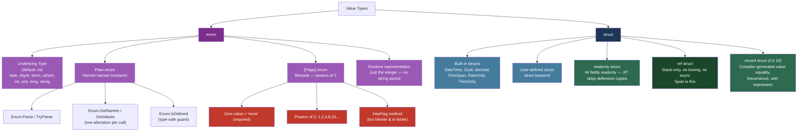
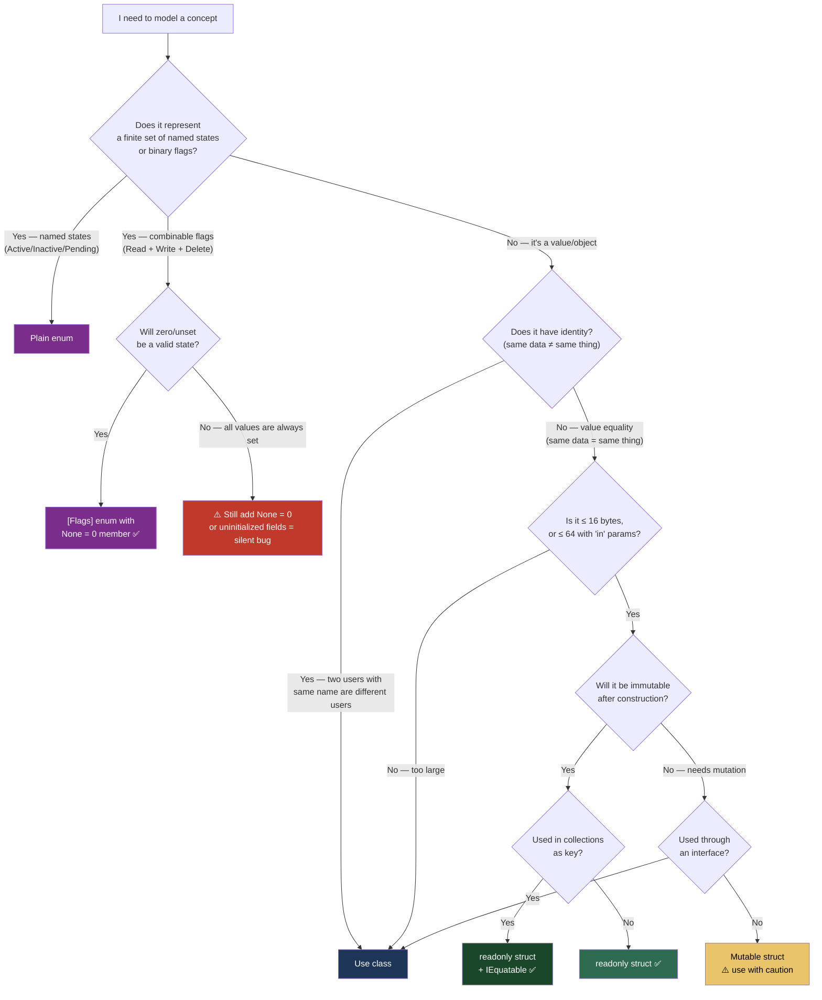

> [!success] Mastery Check
> - [ ] **Studied Well**
> - [ ] **Can explain the concept without notes**
> - [ ] **Can answer interview questions confidently**
> - [ ] **Can implement it in a real project**


## 📍 PART 0 — Navigation & Context

### Where This Topic Lives

```
C# Type System
└── Value Types
    ├── Primitives (int, long, bool, ...)
    ├── ► Enums  ← YOU ARE HERE (Part A)
    │       └── Backed by an integral primitive type
    ├── ► Structs  ← YOU ARE HERE (Part B)
    │       ├── Built-in (DateTime, Guid, decimal)
    │       ├── User-defined
    │       └── record struct (C# 10+)
    └── Nullable<T>
```

### What You Need Before This

- [[2.03 — Data Types, Literals, and Type Conversions]] — enums are wrappers over integral types; you need to know what those types are
- [[2.05 — Operators: Complete Reference]] — bitwise operators (&, |, ^, ~) are the mechanics behind `[Flags]` enums
- [[2.08 — Classes: Fields, Constructors, Static Members]] — structs mirror class syntax; understanding class mechanics first prevents confusion

### What This Unlocks After

- [[2.16 — Value Types vs Reference Types: Deep Mechanics]] — structs ARE value types; this topic is the surface, 2.16 is the depth
- [[2.28 — Equality and Comparison: IEquatable, IComparable, and GetHashCode]] — struct equality is dangerously slow without IEquatable<T>; you need to know this
- [[2.31 — Operator Overloading and Conversions]] — structs are the primary target for operator overloading (Money, Vector, Color)
- [[2.33 — Generics: Variance, Generic Math, and Advanced Patterns]] — struct constraints (where T : struct) and generic math build directly on this

**Why this matters in production at scale:** Enums appear in every domain model, API contract, and database flag column; getting them wrong — particularly `[Flags]` bitmasks — causes silent data corruption. Structs appear in every high-frequency hot path; choosing struct vs class incorrectly causes either aliasing bugs or hidden GC pressure.

---

## 🧠 PART 1 — The Core Mental Model

### The Fundamental Rule

> **An enum is a named integer — the compiler enforces the name at compile time, but the runtime only ever sees the underlying integer. A struct is a value type whose data travels with the variable — copying the variable copies all the data.**
> The practical consequence is: casting any integer to an enum always succeeds at runtime, even if no named member has that value; and copying a large struct in a tight loop silently multiplies your memory bandwidth.

### The Plain-Language Analogy

Think of an enum like a **chequebook with pre-printed memo lines**: the cheques are just numbers (integers), but the memo field forces you to write a recognized description like "Rent" or "Groceries" — the bank (compiler) validates the label. But anyone can cross out the memo and write their own number; at runtime, the dollar amount is all that is stored.

Think of a struct like a **sticky note**: the data is written directly on the note itself. When you hand the note to someone, they get their own copy of everything written on it. If they add a note to their copy, yours is unchanged. A class, by contrast, is like a **filing cabinet with a key** — you hand someone the key (a reference), and both of you are looking at the same drawer.

### The Taxonomy Diagram



---

## 🔬 PART 2 — Deep Mechanics

### 2.1 Enum Memory Layout — It's Just an Integer

The compiler erases enum names at compile time. At runtime, an enum variable is stored as its underlying integer type with zero overhead.

```
━━━━━━━━━━━━━━━━━━━━━━━━━━━━━━━━━━━━━━━━━━━━━━━━━━━━━━━━━━━━━━
ENUM MEMORY LAYOUT (stack-local variable)
━━━━━━━━━━━━━━━━━━━━━━━━━━━━━━━━━━━━━━━━━━━━━━━━━━━━━━━━━━━━━━

public enum OrderStatus : byte   // underlying type: byte (1 byte)
{
    Pending   = 0,
    Confirmed = 1,
    Shipped   = 2,
    Delivered = 3,
    Cancelled = 4
}

Stack frame layout for: OrderStatus status = OrderStatus.Shipped;
┌─────────────────────────┐
│  status                 │  ← 1 byte (byte-sized int)
│  value: 0x02            │  ← The integer 2, no string "Shipped" anywhere
└─────────────────────────┘

Compare with default int enum:
public enum Priority { Low, Medium, High }  // underlying type: int (4 bytes)

Stack frame for: Priority p = Priority.High;
┌─────────────────────────┐
│  p                      │  ← 4 bytes
│  value: 0x00000002      │  ← The integer 2
└─────────────────────────┘

KEY INSIGHT: At runtime there is NO lookup table, NO string, NO metadata.
The name "Shipped" exists only in IL metadata and your source code.
The value 2 is ALL that is stored, transferred, or compared.
```

**Cost:** Reading/writing an enum variable = reading/writing its underlying integer type. O(1), 0 allocations, as fast as `int`.

**The edge case that bites engineers — casting any integer to an enum succeeds:**

```csharp
// This compiles AND runs without exception:
OrderStatus bad = (OrderStatus)99;  // 99 is not a named value
Console.WriteLine(bad);             // Prints: "99" — not an exception!

// Production impact: if you deserialize an API response into an enum
// and the sender sends an undocumented value, you silently get garbage.
// Always validate with Enum.IsDefined at API boundaries:
bool valid = Enum.IsDefined(typeof(OrderStatus), receivedValue); // ~200 ns, one dictionary lookup
// or with generics (.NET 5+):
bool valid2 = Enum.IsDefined<OrderStatus>(receivedValue); // avoids boxing
```

### 2.2 `[Flags]` Enum — Bitmask Mechanics

A `[Flags]` enum stores multiple boolean states in a single integer using bit positions. Each flag is a power of 2 so no two flags share a bit.

```
━━━━━━━━━━━━━━━━━━━━━━━━━━━━━━━━━━━━━━━━━━━━━━━━━━━━━━━━━━━━━━
[FLAGS] BITMASK LAYOUT
━━━━━━━━━━━━━━━━━━━━━━━━━━━━━━━━━━━━━━━━━━━━━━━━━━━━━━━━━━━━━━

[Flags]
public enum UserPermission : int
{
    None    = 0,          // 0000 0000 — MUST define a zero-value "none"
    Read    = 1,          // 0000 0001
    Write   = 2,          // 0000 0010
    Delete  = 4,          // 0000 0100
    Admin   = 8,          // 0000 1000
    // Combined convenience:
    ReadWrite = Read | Write,  // 0000 0011
    All       = Read | Write | Delete | Admin  // 0000 1111
}

Single integer stores ALL permissions:
UserPermission perms = UserPermission.Read | UserPermission.Write;

Bit representation:
┌─────┬─────┬─────┬─────┬─────┬─────┬─────┬─────┐
│  7  │  6  │  5  │  4  │  3  │  2  │  1  │  0  │  ← bit position
│  0  │  0  │  0  │  0  │  0  │  0  │  1  │  1  │  ← stored integer = 3
└─────┴─────┴─────┴─────┴─────┴─────┴─────┴─────┘
                                       Write Read

Adding Delete: perms |= UserPermission.Delete;  → stored = 7 (0000 0111)
Removing Write: perms &= ~UserPermission.Write; → stored = 5 (0000 0101)
Testing Read:  bool hasRead = (perms & UserPermission.Read) != 0; → true
```

**Compiler generates (for `HasFlag`):**

```csharp
// C#: perms.HasFlag(UserPermission.Read)
// The JIT for .NET 5+ inlines this to:
(perms & UserPermission.Read) == UserPermission.Read
// Before .NET 5, HasFlag used reflection internally — never use it in hot loops on old runtimes.
// Cost: O(1), 0 allocations. On .NET 5+: one AND + one CMP instruction.
```

**The zero-value trap** — if you forget `None = 0`, your enum has a silent invalid state:

```csharp
// ⚠️ WRONG: No zero-value member
[Flags]
public enum BadPermission { Read = 1, Write = 2 }

var perms = default(BadPermission); // value = 0
Console.WriteLine(perms);           // Prints: "0" — not a valid name
perms.HasFlag(BadPermission.Read);  // false — makes sense
// But: any uninitialized field is 0 = unnamed = dangerous
```

### 2.3 Struct Memory Layout — Inline Data

Structs store their data inline wherever the variable lives — no heap indirection.

```
━━━━━━━━━━━━━━━━━━━━━━━━━━━━━━━━━━━━━━━━━━━━━━━━━━━━━━━━━━━━━━
STRUCT VS CLASS MEMORY LAYOUT
━━━━━━━━━━━━━━━━━━━━━━━━━━━━━━━━━━━━━━━━━━━━━━━━━━━━━━━━━━━━━━

public struct PricePoint { public decimal Amount; public string Currency; }
public class  PricePointClass { public decimal Amount; public string Currency; }

STACK FRAME for: PricePoint p = new PricePoint { Amount = 9.99m, Currency = "USD" };

Stack:
┌──────────────────────────────────────────┐
│  p (PricePoint struct)                   │
│  ┌─────────────────────────────────────┐ │
│  │ Amount: decimal (16 bytes)          │ │  ← data stored INLINE
│  │ Currency: string ref (8 bytes ptr)  │ │  ← pointer, string itself on heap
│  └─────────────────────────────────────┘ │
│  Total struct size: 24 bytes on stack    │
└──────────────────────────────────────────┘
                     │
                     └──► "USD" on heap (the string object)

STACK FRAME for: PricePointClass pc = new PricePointClass { ... };
Stack:
┌──────────────────────────────────────────┐
│  pc (8-byte pointer)  ───────────────────┼──► Heap:
└──────────────────────────────────────────┘    ┌──────────────────────────┐
                                                │ ObjHeader    (8 bytes)   │
                                                │ TypePtr      (8 bytes)   │
                                                │ Amount: decimal (16 B)   │
                                                │ Currency: string ref(8B) │
                                                └──────────────────────────┘
                                                Total: 40 bytes, on heap

COST COMPARISON:
  struct local: 0 heap allocations, data on stack, free when method returns
  class local:  1 heap allocation (~40 bytes), GC must collect it
```

**The field layout optimization the CLR applies:**

```
The CLR may reorder struct fields to minimize padding (alignment gaps),
unless you apply [StructLayout(LayoutKind.Sequential)] for interop.

public struct Packed
{
    public byte   A;      // 1 byte
    // 3 bytes padding if B is int
    public int    B;      // 4 bytes — needs 4-byte alignment
    public byte   C;      // 1 byte
    // 3 bytes padding
}
// CLR default (Auto): may reorder to A, C, B → 6 bytes instead of 12
// StructLayout.Sequential: A(1) + pad(3) + B(4) + C(1) + pad(3) = 12 bytes
```

### 2.4 Struct Copy Semantics and the Default Value Problem

Every struct has a zeroed default value. You cannot prevent it.

```csharp
// All of these produce a valid (but possibly invalid-for-business) struct:
PricePoint p1 = default;                 // Amount=0, Currency=null
PricePoint p2 = new PricePoint();        // same as default — all zeroed
var arr = new PricePoint[100];           // all 100 elements are default(PricePoint)

// Cost: creating an array of 100 structs is ONE heap allocation.
// The structs are embedded inline in the array memory — no individual allocations.
// Contrast: new PricePointClass[100] = 101 heap allocations (array + 100 objects).

// ━━━━━━━━━━━━━━━━━━━━━━━━━━━━━━━━━━━━━━━━━━━━━━━━━━━━
// COPY SEMANTICS — the defining behavior of structs
// ━━━━━━━━━━━━━━━━━━━━━━━━━━━━━━━━━━━━━━━━━━━━━━━━━━━━

PricePoint original = new PricePoint { Amount = 9.99m, Currency = "USD" };
PricePoint copy     = original;   // ALL fields copied — 24 bytes of data

copy.Amount = 0m;
// original.Amount is STILL 9.99 — the copy is fully independent

// IL the compiler generates for the assignment:
// ldloc.0  (push original onto eval stack)
// stloc.1  (copy entire struct value into copy's location)
// Cost: O(struct size) — copying a 24-byte struct = 24 bytes of memory copy
```

**Compiler generates for `default(T)` struct initialization:**

```
// C#: PricePoint p = default;
// IL:
ldloca.s p     // push address of local variable p
initobj PricePoint  // zero out sizeof(PricePoint) bytes at that address
// Cost: O(struct size), zero allocation, just a memset to 0
```

> [!DANGER] The `default` Struct Is Not Necessarily Valid
> A struct constructor can enforce invariants, but `default(T)` bypasses all constructors. This means any invariants your constructor establishes (non-null currency, positive amount) can be silently broken. Always validate at usage boundaries, not just at construction.

### 2.5 Enum Parsing, Formatting, and the Allocation Traps

```csharp
// ━━━━━━━━━━━━━━━━━━━━━━━━━━━━━━━━━━━━━━━━━
// ENUM RUNTIME OPERATIONS AND THEIR COSTS
// ━━━━━━━━━━━━━━━━━━━━━━━━━━━━━━━━━━━━━━━━

OrderStatus status = OrderStatus.Shipped;

// ToString() — ONE heap allocation per call (~100-200 ns)
string s = status.ToString();   // allocates "Shipped" every time

// Enum.GetName() — also allocates, but from cache (~100 ns)
string name = Enum.GetName<OrderStatus>(status); // returns cached string from metadata

// Enum.GetNames() — allocates a NEW string[] EVERY CALL (~1 μs)
string[] names = Enum.GetNames(typeof(OrderStatus)); // ⚠️ never call in a hot loop

// Enum.GetValues() — allocates a NEW Array EVERY CALL
Array values = Enum.GetValues(typeof(OrderStatus)); // ⚠️ always allocate once and cache

// ✅ Cache these at startup if called frequently:
private static readonly OrderStatus[] _allStatuses =
    Enum.GetValues<OrderStatus>().ToArray(); // .NET 5+, generic, no boxing

// Enum.Parse — throws on invalid input (~500 ns per call)
OrderStatus parsed = Enum.Parse<OrderStatus>("Shipped"); // throws FormatException

// ✅ Enum.TryParse — no exception, still allocates internally (~400 ns)
bool ok = Enum.TryParse<OrderStatus>("Shipped", out OrderStatus result);

// Enum.IsDefined — validates an integer value (~200 ns, no boxing with generic)
bool defined = Enum.IsDefined<OrderStatus>(99); // false — safe boundary guard

// ━━━━━━━━━━━━━━━━━━━━━━━━━━━━━━━━━━━━━━━━━
// SWITCH ON ENUM — zero cost, compiler-optimized
// ━━━━━━━━━━━━━━━━━━━━━━━━━━━━━━━━━━━━━━━━

// The JIT compiles switch(enumValue) to a jump table when values are dense:
// Cost: O(1) for dense enum values (jump table), O(n) for sparse
string GetStatusLabel(OrderStatus s) => s switch
{
    OrderStatus.Pending   => "Awaiting confirmation",
    OrderStatus.Confirmed => "Order confirmed",
    OrderStatus.Shipped   => "In transit",
    OrderStatus.Delivered => "Delivered",
    OrderStatus.Cancelled => "Cancelled",
    _                     => throw new ArgumentOutOfRangeException(nameof(s), s, null)
};
// The throw on _ is intentional — it will catch the "cast 99 to enum" bug at runtime.
```

---

## 💻 PART 3 — Production Code Patterns

### 3.1 The Discriminated State Machine — Enum as Domain State

Use enum to model finite state explicitly, and switch expressions to exhaustively handle all transitions. Never use magic integers in your domain model.

```csharp
// Order management system — state machine with enum
public enum OrderState
{
    Draft,
    Submitted,
    PaymentPending,
    PaymentConfirmed,
    Picking,
    Shipped,
    Delivered,
    CancelledByCustomer,
    CancelledBySystem
}

public class OrderStateMachine
{
    // The exhaustive switch ensures every state is handled.
    // If you add a new enum value, this won't compile until you handle it.
    // That is the point — enums as compile-time exhaustiveness guards.
    public bool CanTransitionTo(OrderState from, OrderState to) => (from, to) switch
    {
        (OrderState.Draft,             OrderState.Submitted)           => true,
        (OrderState.Submitted,         OrderState.PaymentPending)      => true,
        (OrderState.PaymentPending,    OrderState.PaymentConfirmed)    => true,
        (OrderState.PaymentConfirmed,  OrderState.Picking)             => true,
        (OrderState.Picking,           OrderState.Shipped)             => true,
        (OrderState.Shipped,           OrderState.Delivered)           => true,
        // Any state can be cancelled except terminal states:
        (OrderState.Delivered, _)                                      => false,
        (OrderState.CancelledByCustomer, _)                            => false,
        (OrderState.CancelledBySystem,   _)                            => false,
        (_, OrderState.CancelledByCustomer)                            => true,
        (_, OrderState.CancelledBySystem)                              => true,
        _                                                              => false,
    };
}
```

### 3.2 The Permission Bitmask — `[Flags]` for Multi-State Authorization

The `[Flags]` pattern stores an entire permission set in a single integer column — no join table required for simple cases.

```csharp
// User authorization system
[Flags]
public enum ApiPermission : int
{
    None           = 0,       // ALWAYS define zero — uninitialized = None
    ReadOrders     = 1 << 0,  // 1  — bit 0
    WriteOrders    = 1 << 1,  // 2  — bit 1
    ReadProducts   = 1 << 2,  // 4  — bit 2
    WriteProducts  = 1 << 3,  // 8  — bit 3
    ReadUsers      = 1 << 4,  // 16 — bit 4
    ManageUsers    = 1 << 5,  // 32 — bit 5
    // Pre-composed roles — stored in DB as a single integer (e.g. 3, 15, 63)
    OrderManager   = ReadOrders | WriteOrders,                        // 3
    ProductManager = ReadProducts | WriteProducts,                    // 12
    FullAccess     = ReadOrders | WriteOrders | ReadProducts
                   | WriteProducts | ReadUsers | ManageUsers          // 63
}

public static class PermissionExtensions
{
    // ✅ Bitwise check is faster than HasFlag on all runtimes, and intention is clear
    public static bool Has(this ApiPermission granted, ApiPermission required)
        => (granted & required) == required;

    public static ApiPermission Grant(this ApiPermission current, ApiPermission toAdd)
        => current | toAdd;

    public static ApiPermission Revoke(this ApiPermission current, ApiPermission toRemove)
        => current & ~toRemove;
}

// Usage in an API authorization filter:
public class OrdersController
{
    public IActionResult GetOrder(int id, ApiPermission userPerms)
    {
        // Single integer comparison — zero allocations, O(1)
        if (!userPerms.Has(ApiPermission.ReadOrders))
            return Forbid();
        // ...
        return Ok();
    }
}
```

### 3.3 The Value Object Struct — Replacing Primitive Obsession

Use structs to make primitive-obsessed code type-safe. An `OrderId` that wraps an int cannot be accidentally passed where a `CustomerId` is expected.

```csharp
// E-commerce domain — type-safe identifiers to prevent ID confusion bugs
// (Accidentally passing orderId where customerId is expected is a class of production bug)

public readonly struct OrderId : IEquatable<OrderId>
{
    // readonly struct: all fields must be readonly.
    // This enables JIT defensive-copy elimination.
    public int Value { get; }

    public OrderId(int value)
    {
        // Validate at the boundary — invalid OrderId cannot be constructed
        if (value <= 0) throw new ArgumentOutOfRangeException(nameof(value),
            "OrderId must be positive");
        Value = value;
    }

    // Implicit conversion FROM int is intentionally absent — you must be explicit.
    // This is the whole point: an int cannot silently become an OrderId.
    public static explicit operator OrderId(int id) => new OrderId(id);
    public static implicit operator int(OrderId id) => id.Value;

    // IEquatable<T> MUST be implemented on structs used as dictionary keys.
    // Without it: slow ValueType.Equals via reflection + boxing in GetHashCode.
    public bool Equals(OrderId other) => Value == other.Value;
    public override bool Equals(object? obj) => obj is OrderId o && Equals(o);
    public override int GetHashCode() => Value.GetHashCode();
    public static bool operator ==(OrderId a, OrderId b) => a.Equals(b);
    public static bool operator !=(OrderId a, OrderId b) => !a.Equals(b);

    public override string ToString() => $"Order#{Value}";
}

// ✅ These now produce compile errors — protection from the most common ID confusion bug:
// void ProcessOrder(CustomerId cid) { ... }
// ProcessOrder(new OrderId(42));  // CS1503: cannot convert OrderId to CustomerId
```

### 3.4 The Enum Boundary Guard — Validating External Input

Enums that arrive from external systems (APIs, databases, message queues) must be validated before use. Do this at the adapter layer, not scattered through business logic.

```csharp
// Payment processing — validating payment method from API JSON
public enum PaymentMethod { CreditCard, DebitCard, BankTransfer, Crypto, Voucher }

public class PaymentRequest
{
    public int    Amount         { get; init; }
    public string Currency       { get; init; } = "";
    public int    PaymentMethod  { get; init; }  // int from JSON — not trusted
}

public class PaymentAdapter
{
    // ⚠️ WRONG: Blindly casting — silent corruption if sender sends unknown value
    public Payment BadMap(PaymentRequest request)
    {
        var method = (PaymentMethod)request.PaymentMethod; // DANGEROUS: could be 999
        return new Payment(request.Amount, method);
    }

    // ✅ CORRECT: Validate and reject at the boundary with a clear error
    public Payment Map(PaymentRequest request)
    {
        // Enum.IsDefined with generic form: no boxing, no reflection overhead
        if (!Enum.IsDefined<PaymentMethod>(request.PaymentMethod))
            throw new ValidationException(
                $"Unknown payment method code: {request.PaymentMethod}. " +
                $"Valid values: {string.Join(", ", Enum.GetNames<PaymentMethod>())}");

        return new Payment(request.Amount, (PaymentMethod)request.PaymentMethod);
    }
}
```

### 3.5 The Cached Enum Values Pattern — Avoiding Repeated Allocation

`Enum.GetValues()` and `Enum.GetNames()` allocate a new array on every call. Cache them once at startup.

```csharp
// Logistics system — status dropdown population, validation sets
public enum ShipmentStatus
{
    Created, AwaitingPickup, InTransit, AtHub,
    OutForDelivery, Delivered, ReturnInitiated, Returned, Lost
}

// ⚠️ WRONG: Allocates a new array on every request — called in a loop during report generation
public IEnumerable<string> GetBadStatusList()
    => Enum.GetNames(typeof(ShipmentStatus)); // new string[] every call

// ✅ CORRECT: Allocate once, read many times
public static class ShipmentStatusCache
{
    // Static readonly: initialized once, zero allocation on subsequent reads
    public static readonly ShipmentStatus[] AllValues  = Enum.GetValues<ShipmentStatus>();
    public static readonly string[]         AllNames   = Enum.GetNames<ShipmentStatus>();
    // Lookup dictionary for fast reverse-lookup (name → value)
    public static readonly IReadOnlyDictionary<string, ShipmentStatus> ByName =
        AllValues.ToDictionary(v => v.ToString(), v => v, StringComparer.OrdinalIgnoreCase);
}

// Usage — zero allocation at call time:
public ShipmentStatus ParseStatus(string input)
{
    if (ShipmentStatusCache.ByName.TryGetValue(input, out var status))
        return status;
    throw new ArgumentException($"Unknown shipment status: '{input}'");
}
```

### 3.6 The Mutable Struct Trap — Why Struct Mutation in Collections Fails

```csharp
// Inventory management — the most common struct gotcha in production code

public struct StockLevel
{
    public int Quantity;
    public void Restock(int units) => Quantity += units;
}

// ⚠️ WRONG: Mutating a struct returned from a List indexer modifies a COPY
public class WarehouseInventory
{
    private readonly List<StockLevel> _slots = new();

    public void BadRestock(int slotIndex, int units)
    {
        // list[i] returns a COPY of the struct
        // Restock() modifies the copy — the list element is unchanged
        _slots[slotIndex].Restock(units); // compile error in C# — but shows the intent trap
        // (If Quantity were public field: _slots[slotIndex].Quantity += units; would also fail)
    }

    // ✅ CORRECT: Replace the entire element
    public void GoodRestock(int slotIndex, int units)
    {
        var slot = _slots[slotIndex]; // get a copy
        slot.Restock(units);          // mutate the copy
        _slots[slotIndex] = slot;     // write the full struct back
    }

    // ✅ ALTERNATIVELY: Use an array — arrays allow direct ref access
    private StockLevel[] _arraySlots = new StockLevel[100];
    public void ArrayRestock(int slotIndex, int units)
        => _arraySlots[slotIndex].Restock(units); // Works! Array indexer = direct ref
}
```

### 3.7 The `readonly struct` for Hot-Path Performance

Mark structs `readonly` when they are immutable. This eliminates JIT-generated defensive copies in read-only contexts.

```csharp
// Financial calculations — high-frequency pricing loop

// ⚠️ ANTI-PATTERN: Non-readonly struct causes defensive copies
public struct PriceQuote_Mutable
{
    public decimal Bid;
    public decimal Ask;
    public decimal Mid() => (Bid + Ask) / 2m;  // JIT: "might mutate? copy it first"
}

// ✅ CORRECT: readonly struct — JIT can call Mid() without defensive copy
public readonly struct PriceQuote
{
    public decimal Bid  { get; }
    public decimal Ask  { get; }
    public PriceQuote(decimal bid, decimal ask) { Bid = bid; Ask = ask; }
    public decimal Mid  => (Bid + Ask) / 2m;  // JIT: "no mutation possible, skip copy"
    public decimal Spread => Ask - Bid;
}

// In a class with a readonly field:
public class PricingEngine
{
    private readonly PriceQuote _lastQuote;  // readonly field

    public decimal GetMid()
    {
        // With PriceQuote_Mutable: JIT copies _lastQuote before calling Mid()
        // With PriceQuote (readonly struct): JIT calls Mid() directly, no copy
        return _lastQuote.Mid;
    }
}
```

---

## ⚠️ PART 4 — Gotchas & Anti-Patterns

### Gotcha 1: `[Flags]` Without a Zero-Value Member

Engineers define `[Flags]` enums starting at 1 because "zero isn't a valid permission." But `default(Permission)` is always 0, and `0.ToString()` on a `[Flags]` enum with no zero member prints "0" — not a name.

```csharp
// ⚠️ WRONG: No zero-value member
[Flags]
public enum DocumentAccess { Read = 1, Write = 2, Delete = 4 }

var access = default(DocumentAccess);  // value = 0
Console.WriteLine(access);              // Prints "0" — not a member name
Console.WriteLine(access == 0);         // true — but no name for this state
// Worse: DB column stores 0, deserializer gets no match, subtle data loss

// ✅ CORRECT: Always define a zero-value None member
[Flags]
public enum DocumentAccess { None = 0, Read = 1, Write = 2, Delete = 4, All = 7 }

var access = default(DocumentAccess);
Console.WriteLine(access); // Prints "None" — clear and correct
```

```
// WHY: The runtime uses the zero member's name when printing a [Flags] enum value of 0.
// Without a named zero member, ToString() falls back to printing the integer "0".
// Default struct fields and uninitialized array elements are always zero — so this
// affects every uninitialized enum value in your entire codebase.
```

### Gotcha 2: Non-Powers-of-2 in `[Flags]` Enum Causes Silent Overlap

Engineers add combined-convenience values without realizing they must be explicit compositions of existing flags, or they accidentally create values that overlap unpredictably.

```csharp
// ⚠️ WRONG: 3 is NOT a power of 2 — it's Read(1) | Write(2) accidentally
[Flags]
public enum AlertChannel { None = 0, Email = 1, SMS = 2, Push = 3, InApp = 4 }
// Push = 3 means "Email | SMS" — a user with Push permission is also interpreted
// as having Email + SMS in any flag check. HasFlag(Email) = true for Push users!

// ✅ CORRECT: All base flags must be powers of 2; combined flags must be explicit
[Flags]
public enum AlertChannel
{
    None  = 0,
    Email = 1 << 0,  // 1
    SMS   = 1 << 1,  // 2
    Push  = 1 << 2,  // 4
    InApp = 1 << 3,  // 8
    // Composed: email + sms bundle
    EmailAndSMS = Email | SMS  // 3 — but this is NAMED and intentional
}
```

```
// WHY: [Flags] enum has no enforcement that values are powers of 2 — [Flags]
// is just a hint to ToString() to print "Email | SMS" instead of "3".
// The runtime does not validate your choices. If Push = 3 and you test
// (perms & Email) != 0, users with only Push permission will pass the check
// because 3 & 1 = 1 != 0. This is a silent authorization bypass.
```

### Gotcha 3: `Enum.GetValues()` in a Request Handler

Engineers call `Enum.GetValues()` or `Enum.GetNames()` inline when building UI dropdowns or validation sets, not realizing each call allocates a new array.

```csharp
// ⚠️ WRONG: Called on every HTTP request — allocates a new array each time
[HttpGet("order-statuses")]
public IActionResult GetOrderStatuses()
{
    var statuses = Enum.GetValues(typeof(OrderStatus))   // new Array every call
                       .Cast<OrderStatus>()              // new iterator
                       .Select(s => new { Id = (int)s, Name = s.ToString() })
                       .ToList();                        // another allocation
    return Ok(statuses);
}

// ✅ CORRECT: Build once on startup, serve from cache
private static readonly IReadOnlyList<object> _statusOptions =
    Enum.GetValues<OrderStatus>()
        .Select(s => (object)new { Id = (int)s, Name = s.ToString() })
        .ToList();

[HttpGet("order-statuses")]
public IActionResult GetOrderStatuses() => Ok(_statusOptions);
```

```
// WHY: Enum.GetValues() creates a new Array object on EVERY call — the runtime
// does not cache it. In a service handling 10,000 req/s, this adds up to
// thousands of unnecessary Gen0 allocations per second, increasing GC frequency.
// The cached version allocates exactly once at application startup.
```

### Gotcha 4: Struct Equality Without `IEquatable<T>` in a Dictionary

Engineers use a struct as a dictionary key or hash set member without implementing `IEquatable<T>`, and then wonder why lookups are 3-5× slower than expected, or why results intermittently come back wrong.

```csharp
// ⚠️ WRONG: No IEquatable<T> — Dictionary uses ValueType.Equals (reflection) + boxing
public struct CacheKey { public int TenantId; public string ResourceName; }

var cache = new Dictionary<CacheKey, string>();
cache[new CacheKey { TenantId = 1, ResourceName = "orders" }] = "data";
// LOOKUP: TryGetValue calls ValueType.GetHashCode (reflection-based, SLOW)
//         and ValueType.Equals (also reflection-based, also SLOW)

// ✅ CORRECT: Implement IEquatable<T> for correct, fast struct dictionary keys
public readonly struct CacheKey : IEquatable<CacheKey>
{
    public int    TenantId     { get; }
    public string ResourceName { get; }
    public CacheKey(int tenantId, string resourceName)
        { TenantId = tenantId; ResourceName = resourceName; }

    public bool Equals(CacheKey other)
        => TenantId == other.TenantId && ResourceName == other.ResourceName;
    public override bool Equals(object? obj) => obj is CacheKey k && Equals(k);
    public override int GetHashCode() => HashCode.Combine(TenantId, ResourceName);
    public static bool operator ==(CacheKey a, CacheKey b) => a.Equals(b);
    public static bool operator !=(CacheKey a, CacheKey b) => !a.Equals(b);
}
```

```
// WHY: Without IEquatable<T>, the Dictionary<TKey,TValue> falls back to
// object.GetHashCode() and object.Equals() via ValueType's reflection-based
// implementations. These use reflection to enumerate all fields, which is
// ~10× slower than a direct field comparison. The generic Dictionary<CacheKey,V>
// uses EqualityComparer<CacheKey>.Default, which detects IEquatable<T> and
// calls the fast typed path — but only if you implement the interface.
```

### Gotcha 5: Boxing a Struct Through an Interface in a Method Call

Engineers implement an interface on a struct to satisfy a method parameter, then watch mutations disappear and allocation profiles spike, because the interface cast silently boxes the struct.

```csharp
// ⚠️ WRONG: Interface parameter boxes the struct on every call
public interface ICalculatable { decimal Calculate(); }

public struct ShippingCost : ICalculatable
{
    public decimal BaseRate;
    public decimal FuelSurcharge;
    public decimal Calculate() => BaseRate + FuelSurcharge;
}

public static decimal RunCalculation(ICalculatable calc)
    => calc.Calculate(); // struct is BOXED here — heap allocation per call

// Called 100,000 times in a pricing batch:
var cost = new ShippingCost { BaseRate = 5.0m, FuelSurcharge = 1.5m };
for (int i = 0; i < 100_000; i++)
    RunCalculation(cost); // 100,000 box allocations!

// ✅ CORRECT: Use generics to avoid boxing entirely
public static decimal RunCalculation<T>(T calc) where T : ICalculatable
    => calc.Calculate(); // JIT generates direct call — NO boxing for struct T

// ✅ OR: Use a concrete type parameter when boxing is identified in profiling
public static decimal RunCalculation(in ShippingCost calc) => calc.Calculate();
```

```
// WHY: Interface variables are reference types. Assigning a struct to an
// interface variable allocates a new heap box object and copies the struct
// into it. The interface variable then points to the heap copy. For a method
// that takes ICalculatable, every value-type argument boxes on entry.
// The generic solution works because the JIT reifies T as ShippingCost
// at Tier 1, generating a direct struct method call without any heap allocation.
```

---

## 📊 PART 5 — Performance Implications

### 5.1 Allocation Characteristics Table

| Scenario | Allocation Behavior | Approx Cost |
|---|---|---|
| Local `enum` variable | Zero allocation — integer on stack | O(1), ~0 ns |
| `enum` field in a class | Embedded in the class heap object — no extra alloc | Part of parent object |
| `enum.ToString()` | One `string` heap allocation per call | ~100–200 ns |
| `Enum.GetNames()` | New `string[]` on every call | ~500 ns–1 μs |
| `Enum.GetValues()` | New array on every call | ~500 ns–1 μs |
| `Enum.IsDefined<T>()` (.NET 5+ generic) | Zero allocation | ~200 ns |
| Local `struct` variable | Zero heap allocation — data on stack | O(1), ~0 ns |
| `struct` field in a class | Embedded in heap object, no extra alloc | Part of parent object |
| `new struct[N]` | ONE heap allocation for N structs inline | O(N) but 1 alloc |
| `new class[N]` | N+1 allocations (array + each instance) | O(N) allocs |
| Copying a large struct (>16 bytes) | No allocation, but O(size) memory copy | 1–10 ns per copy |
| Casting struct to interface | One heap box per cast (~24 + struct size bytes) | ~20–50 ns + GC |
| `struct` as generic `T` | Zero allocation — JIT reifies per value type | O(1) |
| `Enum.GetNames()` cached static | Zero allocation at read time | ~1 ns |

### 5.2 BenchmarkDotNet: Enum and Struct Performance

```csharp
using BenchmarkDotNet.Attributes;
using BenchmarkDotNet.Running;

// Expected output (approximate, .NET 8, x64):
// | Method                    | Mean       | Allocated |
// |---------------------------|------------|-----------|
// | EnumToString              | 142.3 ns   | 32 B      |
// | EnumToStringCached        |   0.4 ns   | 0 B       |
// | GetValuesEveryCall        | 732.1 ns   | 104 B     |
// | GetValuesCached           |   0.9 ns   | 0 B       |
// | StructCopySmall           |   1.2 ns   | 0 B       |
// | StructCopyLarge           |   8.7 ns   | 0 B       |
// | StructBoxToInterface      |  24.6 ns   | 40 B      |
// | StructGenericNoBox        |   1.3 ns   | 0 B       |
// | DictLookupNoEquatable     | 187.4 ns   | 32 B      |
// | DictLookupWithEquatable   |  22.8 ns   | 0 B       |

[MemoryDiagnoser]
public class EnumStructBenchmarks
{
    private static readonly OrderStatus Status = OrderStatus.Shipped;
    private static readonly string CachedStatusName = OrderStatus.Shipped.ToString();
    private static readonly OrderStatus[] CachedValues = Enum.GetValues<OrderStatus>();
    private readonly Dictionary<SlowKey,  string> _slowDict = BuildSlowDict();
    private readonly Dictionary<FastKey,  string> _fastDict = BuildFastDict();
    private static readonly SlowKey  _sKey = new() { TenantId = 1, Name = "orders" };
    private static readonly FastKey  _fKey = new(1, "orders");

    [Benchmark(Baseline = true)]
    public string EnumToString() => Status.ToString();        // allocates every call

    [Benchmark]
    public string EnumToStringCached() => CachedStatusName;  // no allocation

    [Benchmark]
    public int GetValuesEveryCall() => Enum.GetValues(typeof(OrderStatus)).Length; // allocates

    [Benchmark]
    public int GetValuesCached() => CachedValues.Length;      // no allocation

    [Benchmark]
    public decimal StructCopySmall()
    {
        SmallStruct s = new SmallStruct { A = 1.0m };
        SmallStruct copy = s;                                 // 16-byte copy
        return copy.A;
    }

    [Benchmark]
    public decimal StructCopyLarge()
    {
        LargeStruct s = new LargeStruct { A = 1.0m, B = 2.0m, C = 3.0m, D = 4.0m };
        LargeStruct copy = s;                                 // 64-byte copy
        return copy.D;
    }

    [Benchmark]
    public decimal StructBoxToInterface()
    {
        ICalculatable calc = new ShippingCost { BaseRate = 5m, FuelSurcharge = 1m };
        return calc.Calculate();                              // boxes ShippingCost
    }

    [Benchmark]
    public decimal StructGenericNoBox()
        => RunGeneric(new ShippingCost { BaseRate = 5m, FuelSurcharge = 1m }); // no boxing

    [Benchmark]
    public string? DictLookupNoEquatable()
    {
        _slowDict.TryGetValue(_sKey, out var v);
        return v;
    }

    [Benchmark]
    public string? DictLookupWithEquatable()
    {
        _fastDict.TryGetValue(_fKey, out var v);
        return v;
    }

    private static decimal RunGeneric<T>(T c) where T : ICalculatable => c.Calculate();
    private static Dictionary<SlowKey, string> BuildSlowDict() =>
        new() { [new SlowKey { TenantId = 1, Name = "orders" }] = "data" };
    private static Dictionary<FastKey, string> BuildFastDict() =>
        new() { [new FastKey(1, "orders")] = "data" };
}

public enum OrderStatus : byte { Pending, Confirmed, Shipped, Delivered, Cancelled }
public struct SmallStruct { public decimal A; }
public struct LargeStruct { public decimal A, B, C, D; }
public interface ICalculatable { decimal Calculate(); }
public struct ShippingCost : ICalculatable
{
    public decimal BaseRate, FuelSurcharge;
    public decimal Calculate() => BaseRate + FuelSurcharge;
}
// SlowKey: struct without IEquatable<T>
public struct SlowKey { public int TenantId; public string Name; }
// FastKey: struct with IEquatable<T>
public readonly struct FastKey : IEquatable<FastKey>
{
    public int TenantId { get; }
    public string Name  { get; }
    public FastKey(int t, string n) { TenantId = t; Name = n; }
    public bool Equals(FastKey o) => TenantId == o.TenantId && Name == o.Name;
    public override bool Equals(object? obj) => obj is FastKey k && Equals(k);
    public override int GetHashCode() => HashCode.Combine(TenantId, Name);
}
```

### 5.3 When to Care / When to Ignore

**When this costs you:**

- Calling `Enum.GetNames()` or `Enum.GetValues()` inside a hot request handler — each call allocates. Cache them at startup.
- Calling `enum.ToString()` in a tight loop (logging, serialization) — each call allocates a string. Use a lookup dictionary or span-based formatter.
- Using a struct as an interface parameter in a high-frequency path — every call boxes. Use generic constraints instead.
- Using a struct without `IEquatable<T>` as a `Dictionary` or `HashSet` key in a hot path — reflection-based equality is 5–10× slower.
- Copying a struct larger than 16 bytes on every method call without `in` parameters — 64-byte struct passed 1M times = 64 MB of memcpy.

**When this doesn't matter:**

- Enum comparisons (`status == OrderStatus.Shipped`) — this is a single integer comparison, zero cost.
- Struct construction in non-hot paths (request parsing, configuration loading) — the allocation savings are real but irrelevant at low frequency.
- Small readonly structs (≤ 16 bytes) passed by value — the copy cost is negligible; `in` parameters would add complexity with no measurable benefit.
- `enum.ToString()` in logging that is gate-checked by log level — if the log level is off, the string is never formatted.

---

## 🎤 PART 6 — Interview Arsenal

### 6.1 The Question Bank

---

**Q: "What is the difference between an enum and a struct in C#?"**

**Average answer:** "Enums are named constants backed by an integer. Structs are value types that can have fields and methods."

**Why that's insufficient:** It doesn't describe runtime behavior, memory layout, or when to use each.

> "At runtime, an enum is just an integer — the compiler stores the named constant as its integer value in the IL, and the name only exists in metadata. There is no runtime object, no lookup table. A struct is a value type that stores all its data inline at the declaration site: on the stack if it's a local variable, or embedded inside a class object on the heap if it's a field. The key practical difference is that enums are for modeling a finite set of named states or flags, while structs are for modeling small values with identity defined by data rather than reference — things like coordinates, monetary amounts, or identifiers. I think about them as completely different tools: enums solve domain vocabulary problems, structs solve allocation and identity problems."

---

**Q: "When would you use a `[Flags]` enum?"**

**Average answer:** "When you want to combine multiple enum values together, like permissions."

**Why that's insufficient:** Doesn't explain bitmask mechanics, zero-value requirement, or the pitfalls.

> "I use `[Flags]` when a domain concept is a combination of independent boolean states that are stored together — user permissions, file attributes, feature toggles, alert channels. The underlying mechanism is bitmask: each flag must be a distinct power of 2 so no two flags share a bit position. The most important rule I enforce on every `[Flags]` enum is that there must always be a zero-value member — typically named `None` — because every uninitialized field in C# is zero, and if zero has no name, you get silent invalid states everywhere. The second thing I watch for is that any combined convenience member like `ReadWrite = Read | Write` must be explicitly composed from powers-of-2 members — if you accidentally add a value like 3 as a base flag instead of a composition, it silently overlaps with other flags and can produce authorization bypass bugs. In hot paths I use bitwise `&` directly rather than `HasFlag` for clarity and guaranteed performance, even though .NET 5+ inlines HasFlag to the same operation."

---

**Q: "What is the default value of a struct and why does it matter?"**

**Average answer:** "The default value is a struct with all fields set to zero or null."

**Why that's insufficient:** Doesn't connect to the constructor-bypass implication or how to defend against it.

> "Every struct in C# has a zeroed default — all fields are set to 0 or null regardless of any constructor you define. This matters because you cannot prevent it: `default(T)`, uninitialized fields in a class, and elements of a newly created array all start at this zeroed state, completely bypassing any validation logic in your constructor. If I have a `Money` struct whose constructor guards against null currency, a `default(Money)` still produces a `Money` with a null currency field. The defense is to treat the default state as a valid sentinel — either design your struct so that default is meaningful (like `CancellationToken.None`), or add a validity check in the struct itself and guard at usage boundaries. I've seen production bugs where an array of structs was partially initialized in a loop, and the uninitialized tail had defaults that were silently treated as valid data. The fix was to always check validity explicitly when consuming struct arrays from external sources."

---

**Q: "What is a `readonly struct` and what performance optimization does it enable?"**

**Average answer:** "A readonly struct means all its fields are readonly, so it can't be mutated."

**Why that's insufficient:** Doesn't mention defensive copies — which is the entire performance reason to care.

> "A `readonly struct` is a struct where the compiler enforces that every field is readonly. The performance relevance is eliminating JIT-generated defensive copies. When you call a method on a struct that's in a read-only context — say, a `readonly` field in a class — and the struct is NOT declared `readonly`, the JIT has no guarantee that the method won't mutate the struct through some internal trick. So it silently copies the entire struct before calling the method, just in case. This copy is invisible in the source code and only shows up in profiling or disassembly. When the struct is declared `readonly`, the JIT can verify at Tier 1 that no method can mutate it, so it skips the copy entirely and calls the method in place. For small structs this is trivial, but for a 64-byte `PriceQuote` that gets its `Mid()` called 10 million times in a pricing batch, the difference between 64-byte copies and direct calls is measurable — it shows up in CPU cache utilization. My rule is: if the struct is immutable by design, always mark it `readonly struct`."

---

**Q: "Why must structs used as dictionary keys implement `IEquatable<T>`?"**

**Average answer:** "Because it's faster."

**Why that's insufficient:** Doesn't explain the mechanism or the actual risk of not doing it.

> "Without `IEquatable<T>`, a struct dictionary key falls through to `ValueType.GetHashCode()` and `ValueType.Equals()`, which are reflection-based implementations that inspect all fields at runtime to generate a hash and compare for equality. This is roughly 5 to 10 times slower than a hand-written direct field comparison, and it can allocate due to reflection internals in some runtimes. More importantly, the `ValueType.GetHashCode()` implementation has historically produced poor hash distributions for certain field combinations, which can degrade a `Dictionary` from O(1) to O(n) lookups due to collision chains. By implementing `IEquatable<T>`, the `Dictionary<K,V>` uses `EqualityComparer<T>.Default`, which detects the interface and dispatches to your fast typed `Equals` and `GetHashCode`. I never ship a struct intended for use as a dictionary key without implementing `IEquatable<T>`, and I include this in code review checklists."

---

### 6.2 The Trick Questions

> [!WARNING] These Sound Simple — They're Not

**"Can you cast any integer to an enum in C#?"**
Trap: Engineers say "no, it would throw." Correct answer: Yes, always, at runtime. `(OrderStatus)99` compiles and runs without exception even if 99 is not a defined member. `Enum.IsDefined` is your only runtime guard.

**"What does `[Flags]` actually do at runtime?"**
Trap: Engineers think it enforces values being powers of 2, or enables combining with `|`. Correct answer: `[Flags]` does nothing at runtime. It is only a hint to `enum.ToString()` to format combined values as "Read | Write" instead of "3". Bitwise operations work on any enum regardless. Powers of 2 are the programmer's responsibility — the attribute doesn't enforce them.

**"If you have a `readonly struct` field in a class, and the struct does NOT have `readonly` on its declaration, what happens when you call a method on that field?"**
Trap: "Nothing special." Correct answer: The JIT emits a defensive copy of the struct before every method call on that `readonly` field, because it cannot prove the method won't mutate the struct. The fix is to declare the struct `readonly struct`.

**"A `[Flags]` enum has value 3. Is 3 a combination of Read(1) and Write(2), or is it a standalone flag?"**
Trap: "3 is Read | Write." Correct answer: It depends entirely on whether 3 appears as a named member. If `ReadWrite = Read | Write` is defined, 3 is that combination and `ToString()` prints "ReadWrite". If no member has value 3, `ToString()` prints "Read, Write" (the decomposition). Either way, the integer 3 is stored — the name is metadata only.

**"Can a struct implement an interface? Is there a cost?"**
Trap: "Yes, and there's no cost." Correct answer: Yes, a struct can implement an interface. The cost is that any time the struct is used through an interface variable (not a generic constraint), it is boxed — a heap allocation occurs that copies the struct into a heap wrapper. With a generic constraint `where T : ICalculatable`, no boxing occurs for struct type parameters.

---

### 6.3 Red Flags to Avoid

```
❌ "Enums are stored as strings at runtime" — they are integers; strings only exist in source/metadata
❌ "You can add behavior to an enum like in Java" — C# enums are not objects; use extension methods instead
❌ "[Flags] enforces that values are powers of 2" — it absolutely does not; that's the programmer's job
❌ "default(struct) calls the default constructor" — there is no such thing for structs; default() = all zeros, no constructor called
❌ "structs can't have constructors" — they can; since C# 10 they can even have parameterless constructors
❌ "IEquatable<T> is optional for structs" — it is required for correct, performant behavior in any collection
❌ "readonly just means the variable can't be reassigned" — for readonly struct, it's a contract affecting JIT codegen
❌ Confusing [Flags] with non-Flags enum in your answer — always state which type you're discussing
```

---

## 🔀 PART 7 — Decision Framework



---

## ✅ PART 8 — Self-Check

### A. Conceptual Questions

1. You define a `[Flags]` enum where one member has value `6`. Which bit positions does it occupy? Could this cause a problem? Under what conditions?

2. A colleague adds a new value to a `PaymentMethod` enum that is stored in a database. Existing rows have this value as an integer in a column. When your application reads those rows and casts the integer to `PaymentMethod`, what happens? What should you do before using the value?

3. A `readonly struct` has a `string` field. Is the `string` itself immutable because the struct is `readonly`? What exactly does `readonly` guarantee here?

4. You have an array `ShippingCost[] costs = new ShippingCost[1000]`. How many heap allocations does this line cause? If `ShippingCost` were a class, how many allocations would the equivalent line cause?

5. A struct field is declared as `private readonly PricePoint _price` in a class. The `PricePoint` struct is NOT declared `readonly`. You call `_price.Format()`. Describe precisely what extra work the JIT performs and how to eliminate it.

6. Why can you not have an `await` call inside a method that returns a `ref struct`? Think about what `await` does to the execution stack and what a `ref struct` constraint requires.

7. `Enum.GetValues<T>()` was introduced in .NET 5. Before that, `Enum.GetValues(typeof(T))` existed. What is the boxing difference between the two, and why does it matter in a generic method that takes `where T : Enum`?

8. You have a `[Flags]` enum with a combined-convenience member: `FullAccess = Read | Write | Delete`. A user's permission is stored as `FullAccess` in the database. You call `userPerms.HasFlag(Read)`. What happens? What does the integer value of `FullAccess` look like in binary, and why does the test pass?

9. A struct `PricePoint` has two fields: `decimal Amount` and `string Currency`. You copy this struct into a second variable and change the `Currency` on the second variable. Does the first variable's `Currency` change? Now explain specifically what "copy" means for the `string` field here — is the string object copied or is only the reference copied?

10. When should you prefer `record struct` over a manually implemented `readonly struct` with `IEquatable<T>`? What does the compiler generate for you, and what does it NOT generate?

---

### B. Code Puzzles

**Puzzle 1 — What is printed?**

```csharp
[Flags]
public enum FileMode { None = 0, Read = 1, Write = 2, Execute = 4 }

var mode = FileMode.Read | FileMode.Write;
mode &= ~FileMode.Write;
Console.WriteLine(mode);
Console.WriteLine((int)mode);
Console.WriteLine(mode.HasFlag(FileMode.Write));
```

<details>
<summary>Answer (expand after trying)</summary>

Output:
```
Read
1
False
```

Explanation: `mode` starts as `Read | Write` = 3 (binary: 011). `~FileMode.Write` = ~2 = -3 (binary: ...11111101). `3 & -3` = 1 (binary: 001) = `Read`. `ToString()` on a `[Flags]` enum returns the named member "Read". `(int)mode` = 1. `HasFlag(Write)` checks `(1 & 2) == 2` → `0 == 2` → false.

</details>

---

**Puzzle 2 — Where is the bug?**

```csharp
public struct Coupon
{
    public decimal DiscountPercent;
    public bool    IsActive;
    public void Activate() => IsActive = true;
}

var promotions = new List<Coupon>
{
    new Coupon { DiscountPercent = 10m, IsActive = false },
    new Coupon { DiscountPercent = 20m, IsActive = false }
};

promotions[0].Activate();
Console.WriteLine(promotions[0].IsActive);
```

<details>
<summary>Answer (expand after trying)</summary>

This code doesn't compile — `promotions[0].Activate()` is a compiler error: "Cannot modify the return value of `List<Coupon>.this[int]` because it is not a variable." The List indexer returns a copy (a temporary), and the compiler refuses to let you call a mutating method on a temporary.

If `IsActive` were a public field and you wrote `promotions[0].IsActive = true` directly, it would also be a compile error for the same reason.

The fix: extract to a local, mutate, and write back:
```csharp
var coupon = promotions[0];
coupon.Activate();
promotions[0] = coupon;
Console.WriteLine(promotions[0].IsActive); // true
```
Or use an array (`Coupon[]`) which allows direct `ref` element access.

</details>

---

**Puzzle 3 — What is printed?**

```csharp
public enum ProductCategory { Electronics = 0, Clothing = 1, Books = 2 }

var category = (ProductCategory)99;
Console.WriteLine(category);
Console.WriteLine(Enum.IsDefined<ProductCategory>(category));
Console.WriteLine((int)category == 99);
```

<details>
<summary>Answer (expand after trying)</summary>

Output:
```
99
False
True
```

Explanation: Casting any integer to an enum never throws — even 99 which has no named member. `ToString()` on an undefined enum value prints the integer "99" because no name matches. `IsDefined` returns false because 99 is not a defined member. The integer value is preserved — `(int)category` is still 99.

This is the most dangerous property of C# enums: invalid values can silently exist and be passed around. `Enum.IsDefined` is the only runtime guard.

</details>

---

**Puzzle 4 — Does this allocate on the heap? (mark each line)**

```csharp
// Line A:
OrderStatus s = OrderStatus.Shipped;

// Line B:
string name = s.ToString();

// Line C:
IComparable<int> comp = (int)s;

// Line D:
var statuses = Enum.GetValues<OrderStatus>();

// Line E:
bool defined = Enum.IsDefined<OrderStatus>(s);

// Line F:
OrderStatus[] arr = new OrderStatus[10];
```

<details>
<summary>Answer (expand after trying)</summary>

- **Line A:** No allocation. `s` is an integer on the stack.
- **Line B:** Yes, one `string` allocation. `ToString()` creates a new string each call.
- **Line C:** Yes, one boxing allocation. `(int)s` is an int. Assigning an int to `IComparable<int>` (an interface) boxes it to a heap object.
- **Line D:** Yes, one array allocation. `Enum.GetValues<OrderStatus>()` allocates a new `OrderStatus[]` every call.
- **Line E:** No allocation. The generic `Enum.IsDefined<T>()` avoids boxing in .NET 5+.
- **Line F:** Yes, one heap allocation — a single `OrderStatus[]` of 10 elements (all initialized to `default` = 0 = first member). No per-element allocations because `OrderStatus` is a value type embedded inline in the array.

</details>

---

**Puzzle 5 — The struct boxing mutation bug (most common misunderstanding)**

```csharp
public interface INotifiable { void Notify(string message); }

public struct AlertSender : INotifiable
{
    public int SentCount;
    public void Notify(string message) => SentCount++;
}

public static void SendAll(INotifiable[] notifiers, string message)
{
    foreach (var n in notifiers)
        n.Notify(message);
}

// Setup:
var sender = new AlertSender { SentCount = 0 };
INotifiable[] arr = new INotifiable[] { sender }; // What happens here?
SendAll(arr, "System alert");
Console.WriteLine(sender.SentCount);
Console.WriteLine(((AlertSender)arr[0]).SentCount);
```

<details>
<summary>Answer (expand after trying)</summary>

Output:
```
0
1
```

What happens: When `sender` (a struct) is assigned to `INotifiable[]`, it is **boxed** — a new heap object is created containing a copy of `sender`'s data. The array holds a reference to this heap box. The original `sender` variable on the stack is independent.

`SendAll` calls `Notify` on the boxed copy inside the array. `SentCount` in the box is incremented to 1.

The original `sender` on the stack was never touched — its `SentCount` is still 0.

`((AlertSender)arr[0]).SentCount` unboxes the heap box and reads its `SentCount` = 1.

This is the canonical struct-through-interface boxing mutation bug. The fix: don't use mutable structs with interfaces. Use `class` if you need mutation through an interface, or use generic constraints `where T : INotifiable` to call the struct directly without boxing.

</details>

---

## 🔗 PART 9 — Connections & Resources

### A. Related Topics Table

| Topic | Why It Connects |
|---|---|
| [[2.03 — Data Types, Literals, and Type Conversions]] | Enums are backed by integral types defined here; type conversion rules govern casting integers to enums |
| [[2.05 — Operators: Complete Reference]] | Bitwise operators (`&`, `\|`, `^`, `~`) are the mechanical foundation of `[Flags]` enum bitmask operations |
| [[2.16 — Value Types vs Reference Types: Deep Mechanics]] | Structs are value types; this topic covers the full depth of copy semantics, boxing, and where structs live in memory |
| [[2.28 — Equality and Comparison: IEquatable, IComparable, and GetHashCode]] | `IEquatable<T>` on structs is required for correct dictionary keys and prevents the slow reflection-based path |
| [[2.31 — Operator Overloading and Conversions]] | Structs like `Money`, `OrderId`, and `PricePoint` define `==`, `!=`, implicit/explicit conversion operators |
| [[2.17 — Generics: Constraints, Reification, and the Type System]] | The `where T : struct` constraint and reification-per-value-type are how generics avoid boxing for struct type parameters |
| [[2.38 — Spans, Memory, and Zero-Copy Patterns]] | `Span<T>` is a `ref struct` — the most performance-critical struct in the BCL; understanding struct fundamentals is prerequisite |
| [[2.33 — Generics: Variance, Generic Math, and Advanced Patterns]] | Generic math uses `where T : INumber<T>` which requires structs implementing operator overloads — both struct and enum concepts combine here |

### B. Books

| Book | Chapters | Why These Chapters |
|---|---|---|
| CLR via C# — Jeffrey Richter | Ch. 4, 5 | Value types, boxing, and struct memory layout from the CLR's perspective — the definitive source |
| C# in Depth — Jon Skeet | Ch. 2, 3 | Detailed coverage of value types and enums, including the boxing mechanics and copy semantics |
| Pro .NET Memory Management — Konrad Kokosa | Ch. 3 | Struct layout, inline embedding in arrays, and the real-world allocation profile difference between struct and class arrays |
| Effective C# — Bill Wagner | Items 6, 7 | Specific guidance on when to use struct vs class and the `IEquatable<T>` contract requirement |

### C. Essential Articles & Docs

- [Microsoft Docs: Enumeration types — C# reference](https://learn.microsoft.com/en-us/dotnet/csharp/language-reference/builtin-types/enum)
- [Microsoft Docs: Structure types — C# reference](https://learn.microsoft.com/en-us/dotnet/csharp/language-reference/builtin-types/struct)
- [Microsoft Docs: Design guidelines — Enum design](https://learn.microsoft.com/en-us/dotnet/standard/design-guidelines/enum)
- [Microsoft Docs: Choosing Between Class and Struct](https://learn.microsoft.com/en-us/dotnet/standard/design-guidelines/choosing-between-class-and-struct)
- [Adam Sitnik: Avoiding boxing in a generic method](https://adamsitnik.com/Value-Types-vs-Reference-Types/) — covers the generic constraint approach to avoiding boxing on struct/interface patterns
- [Stephen Toub: Performance improvements in .NET 5 — Enum.IsDefined](https://devblogs.microsoft.com/dotnet/performance-improvements-in-net-5/) — the section on Enum API improvements and the generic, non-boxing overloads

---

> [!NOTE] Template Meta-Note
> **This note follows the 9-part C# Language Mastery template:**
> - **Part 0:** Navigation — where you are in the curriculum, prerequisites, what this unlocks
> - **Part 1:** Core Mental Model — one anchoring sentence + physical analogy + complete taxonomy diagram
> - **Part 2:** Deep Mechanics — memory layout, IL/JIT behavior, edge cases, runtime costs labeled throughout
> - **Part 3:** Production Code — 5-7 named, domain-grounded patterns with anti-pattern → correct pattern
> - **Part 4:** Gotchas — exactly 5 bugs that appear in experienced engineers' code, with wrong → right → why
> - **Part 5:** Performance — allocation characteristics table + runnable BenchmarkDotNet class + when to care
> - **Part 6:** Interview Arsenal — question bank with great answers + trick questions + red flags
> - **Part 7:** Decision Framework — Mermaid flowchart for enum vs struct vs class choices
> - **Part 8:** Self-Check — 10 conceptual questions + 5 code puzzles with collapsed answers
> - **Part 9:** Connections — wiki-linked related topics + books + authoritative articles + this meta-note
>
> To generate the next note, open `_phonebook.md`, pick the next topic, copy the master prompt from `_main.md`, and fill in the three placeholders.

---
*Last updated: 2026-06 · Domain: C# Language Mastery · Topic: 2.12 — Enums and Structs: Fundamentals*
