> [!success] Mastery Check
> - [ ] **Studied Well**
> - [ ] **Can explain the concept without notes**
> - [ ] **Can answer interview questions confidently**
> - [ ] **Can implement it in a real project**


## 📍 PART 0 — Navigation & Context

### Where This Topic Lives

```
C# Language Mastery
└── Core Language Constructs
    ├── Data Types (2.03)
    ├── Classes (2.08)
    ├── ► Arrays and Collection Basics  ← YOU ARE HERE (2.13)
    ├──   LINQ: Every Operator Reference (2.23)
    ├──   Collections: Internals and Selection Guide (2.34)
    └──   Spans, Memory, and Zero-Copy Patterns (2.38)
```

### What You Need Before This
- [[2.03 — Data Types, Literals, and Type Conversions]] — element types are data types; type safety rules apply here
- [[2.06 — Control Flow]] — `for`, `foreach`, and `while` are the traversal mechanisms
- [[2.16 — Value Types vs Reference Types: Deep Mechanics]] — `int[]` is a reference type; its element layout differs from `List<string>`

### What This Unlocks After
- [[2.23 — LINQ: Every Operator Reference]] — all LINQ operators target `IEnumerable<T>`, which every collection here implements
- [[2.34 — Collections: Internals and Selection Guide]] — this note teaches correct usage; 2.34 goes inside the implementations
- [[2.17 — Generics: Constraints, Reification, and the Type System]] — `List<T>`, `Dictionary<K,V>` are generic; the type parameter shapes internal layout
- [[2.38 — Spans, Memory, and Zero-Copy Patterns]] — `Span<T>` wraps arrays; `CollectionsMarshal.AsSpan(list)` gives direct array access

### Why This Matters at Scale
In virtually every production system, the choice between an array, `List<T>`, `Dictionary<K,V>`, or `HashSet<T>` — and knowing whether you're copying or aliasing, whether you're boxing or not, and which operations are O(1) vs O(n) — is the difference between a system that handles 10,000 RPS and one that falls over at 500.

---

## 🧠 PART 1 — The Core Mental Model

### The Fundamental Rule

> **An array is a fixed-size, contiguous block of memory allocated once on the heap. A collection is a class that wraps an array and resizes it for you. The choice between them is a question of whether you know the final size up front and whether you need O(1) random access, O(1) append, O(1) lookup by key, or O(1) membership tests.**

### The Plain-Language Analogy

Think of an array like a **row of numbered lockers in a hallway** — the hallway is built once, each locker has a fixed address (index), and you can reach any locker directly in one step regardless of how many there are. The hallway cannot grow; if you need more lockers, you must demolish it and build a longer one.

A `List<T>` is like a **hotel that automatically builds new wings** when it runs out of rooms. Internally it's still a row of numbered rooms (an array), but when capacity is exceeded, the hotel builds a new wing twice as large and moves everyone into it. The move is expensive — O(n) — but it happens so rarely that your average check-in cost is still O(1) amortized.

A `Dictionary<K,V>` is like a **hotel with an alphabetized registration desk**: you hand your name to the desk (the key), they compute a bucket number from it (the hash), and they go directly to that floor's room list. Finding your room takes O(1) regardless of hotel size — as long as names hash to different buckets.

A `HashSet<T>` is the same hotel but the rooms have no contents — you only care whether a guest has checked in, not what luggage they brought.

### The Collection Taxonomy

```mermaid
graph TD
    A["Sequence / Ordered Data"] --> B["Array T[]"]
    A --> C["List&lt;T&gt;"]
    A --> D["LinkedList&lt;T&gt;\n(rarely correct choice)"]

    E["Key-Value Lookup"] --> F["Dictionary&lt;K,V&gt;"]
    E --> G["SortedDictionary&lt;K,V&gt;\n(red-black tree)"]
    E --> H["SortedList&lt;K,V&gt;\n(array pair)"]

    I["Membership Test / Set"] --> J["HashSet&lt;T&gt;"]
    I --> K["SortedSet&lt;T&gt;\n(red-black tree)"]

    L["Queue / Stack"] --> M["Queue&lt;T&gt;\n(FIFO)"]
    L --> N["Stack&lt;T&gt;\n(LIFO)"]
    L --> O["PriorityQueue&lt;E,P&gt;\n(.NET 6+, min-heap)"]

    P["Legacy (Avoid)"] --> Q["ArrayList\n(object[], boxing)"]
    P --> R["Hashtable\n(object keys, boxing)"]
    P --> S["StringCollection\n(string-typed ArrayList)"]

    style A fill:#1d3557,color:#fff
    style E fill:#1d3557,color:#fff
    style I fill:#1d3557,color:#fff
    style L fill:#1d3557,color:#fff
    style P fill:#6b2737,color:#fff
    style B fill:#2d6a4f,color:#fff
    style C fill:#2d6a4f,color:#fff
    style F fill:#2d6a4f,color:#fff
    style J fill:#2d6a4f,color:#fff
    style M fill:#2d6a4f,color:#fff
    style N fill:#2d6a4f,color:#fff
    style O fill:#2d6a4f,color:#fff
    style Q fill:#c8553d,color:#fff
    style R fill:#c8553d,color:#fff
    style S fill:#c8553d,color:#fff
    style D fill:#e9c46a,color:#000
    style G fill:#457b9d,color:#fff
    style H fill:#457b9d,color:#fff
    style K fill:#457b9d,color:#fff
```



> [!WARNING] Never Use Legacy Collections
> `ArrayList`, `Hashtable`, `Queue` (non-generic), `Stack` (non-generic), and `StringCollection` are pre-.NET 2.0 types that use `object` storage — meaning every value type element is **boxed**. They exist only for backward compatibility. Every one of them has a generic equivalent that should always be preferred.

---

## 🔬 PART 2 — Deep Mechanics

### 2.1 Array Memory Layout — The Contiguous Block

```
━━━━━━━━━━━━━━━━━━━━━━━━━━━━━━━━━━━━━━━━━━━━━━━━━━━━━━━━━━━━━
SCENARIO: int[] arr = new int[5] { 10, 20, 30, 40, 50 };
━━━━━━━━━━━━━━━━━━━━━━━━━━━━━━━━━━━━━━━━━━━━━━━━━━━━━━━━━━━━━

STACK:                         HEAP (managed, GC-tracked):
┌──────────────────┐           ┌──────────────────────────────────────────────┐
│ arr  [8B ptr] ───┼──────────►│ ObjHeader  (8 bytes)                         │
└──────────────────┘           │ TypePtr    (8 bytes) → int[] method table    │
                               │ Length     (4 bytes) = 5                     │
                               ├──────────────────────────────────────────────┤
                               │ [0]  10   (4 bytes) @ base+0                 │
                               │ [1]  20   (4 bytes) @ base+4                 │
                               │ [2]  30   (4 bytes) @ base+8                 │
                               │ [3]  40   (4 bytes) @ base+12                │
                               │ [4]  50   (4 bytes) @ base+16                │
                               └──────────────────────────────────────────────┘
                               Total heap object: 20 bytes header + 20 bytes data = 40 bytes

Element access:  arr[i]  →  *(base + i * sizeof(T))
                          ONE memory read; no indirection; O(1)

━━━━━━━━━━━━━━━━━━━━━━━━━━━━━━━━━━━━━━━━━━━━━━━━━━━━━━━━━━━━━
CONTRAST: string[] names = new string[3] { "Alice", "Bob", "Carol" };
━━━━━━━━━━━━━━━━━━━━━━━━━━━━━━━━━━━━━━━━━━━━━━━━━━━━━━━━━━━━━

HEAP:
┌──────────────────────────────┐     ┌─────────────┐
│ string[] array object:       │     │ "Alice" obj │
│  Header + TypePtr + Length=3 │     └─────────────┘
│  [0] ptr ────────────────────┼────►
│  [1] ptr ────────────────────┼────► "Bob" obj
│  [2] ptr ────────────────────┼────► "Carol" obj
└──────────────────────────────┘
                               ↑
       The array slots hold POINTERS (8B each on 64-bit).
       Each string is a SEPARATE heap object.
       Accessing names[1] requires TWO memory reads:
         read ptr from array[1], then read string data.
       Array of reference types: N+1 allocations total.
       Array of value types: 1 allocation total.
```

**Runtime cost labels:**
- `new int[n]`: 1 heap allocation, O(n) to zero-fill, ~20+4n bytes
- `arr[i]` (bounds-checked): O(1), ~1–2 ns; JIT eliminates check in loops
- Array of value types: 1 allocation, elements inline (cache-friendly)
- Array of reference types: N+1 allocations (array + each object), pointer-chasing (cache-unfriendly)

### 2.2 List\<T\> — The Doubling Array

`List<T>` internally is just an array (`T[] _items`) plus a logical size counter (`int _size`). Understanding this makes every `List<T>` behavior predictable.

```
━━━━━━━━━━━━━━━━━━━━━━━━━━━━━━━━━━━━━━━━━━━━━━━━━━━━━━━━━━━
List<int> orders = new List<int>(4);  // capacity = 4
orders.Add(100); orders.Add(200); orders.Add(300); orders.Add(400);
━━━━━━━━━━━━━━━━━━━━━━━━━━━━━━━━━━━━━━━━━━━━━━━━━━━━━━━━━━━

HEAP — List<int> object:
┌───────────────────────────────────┐
│  ObjHeader + TypePtr              │
│  _items ──────────────────────────┼──► int[4]: [100, 200, 300, 400]
│  _size     = 4                    │
│  _version  = 4  (for enum check)  │
└───────────────────────────────────┘

orders.Add(500);  ← _size == _items.Length → RESIZE:
  1. Allocate new int[8]  (double capacity)
  2. Array.Copy(_items → new array)           O(n) copy!
  3. _items = new array
  4. _items[4] = 500
  5. _size = 5

After resize:
┌───────────────────────────────────┐
│  _items ──────────────────────────┼──► int[8]: [100, 200, 300, 400, 500, 0, 0, 0]
│  _size     = 5                    │    (3 slots wasted — capacity reserved)
└───────────────────────────────────┘

AMORTIZED COST of Add():
  Resize happens at sizes: 0→4→8→16→32→64...
  By the time you hit N items: ~2N total copies ever made.
  Amortized cost per Add() = O(1).
  Worst-case single Add() = O(n) when resize triggers.
```

**Critical `List<T>` behaviors:**

```csharp
// Capacity vs Count:
var list = new List<int>();
Console.WriteLine(list.Count);    // 0 — number of elements you've added
Console.WriteLine(list.Capacity); // 0 — allocated backing array size

list.Add(1);
Console.WriteLine(list.Capacity); // 4 — first Add triggers initial allocation of 4

// Pre-size when you know the count — eliminates ALL resize operations:
var knownSize = new List<ProductLine>(10_000);   // allocates int[10000] immediately, no resizes
// Cost: ONE allocation up front vs up to 14 resize+copy cycles

// TrimExcess: release wasted capacity after a batch-build operation
var batch = new List<OrderId>(50_000);
PopulateFromDatabase(batch);     // filled 43,217 of 50,000 slots
batch.TrimExcess();              // reallocates to exactly 43,217
// Use when the list is built once and then read-only for a long lifetime.
```

**Runtime cost labels:**
- `List<T>.Add()` amortized: O(1), ~2–5 ns
- `List<T>.Add()` worst-case (resize): O(n), ~n*4 ns
- `List<T>[i]` access: O(1), ~2 ns (same as array, plus bounds check)
- `List<T>.Insert(0, x)`: O(n) — shifts all elements right; use `LinkedList` if you insert at head often
- `List<T>.Remove(x)`: O(n) — linear scan then shift
- `List<T>.RemoveAt(i)`: O(n-i) — shifts tail elements left
- `List<T>.Contains(x)`: O(n) — linear scan; use `HashSet<T>` if you need O(1) membership

### 2.3 Dictionary\<K,V\> — Hash Table Internals (Preview)

The full internals are in [[2.34 — Collections: Internals and Selection Guide]], but you need the operational model now.

```
━━━━━━━━━━━━━━━━━━━━━━━━━━━━━━━━━━━━━━━━━━━━━━━━━━━━━━━━━━━
var prices = new Dictionary<string, decimal>();
prices["SKU-001"] = 9.99m;
prices["SKU-002"] = 14.99m;
━━━━━━━━━━━━━━━━━━━━━━━━━━━━━━━━━━━━━━━━━━━━━━━━━━━━━━━━━━━

How lookup works (simplified):
  prices["SKU-001"]
    1. Compute hash("SKU-001")            → e.g. 0x7F3A2B1C
    2. bucketIndex = hash % buckets.Length → e.g. 7
    3. Walk entry chain at bucket 7
    4. Compare keys with Equals() until match
    5. Return value

Visually:
  Buckets: [0][1][2][3][4][5][6][7]→Entry{key="SKU-001",val=9.99}→null
                                  [8]→Entry{key="SKU-002",val=14.99}→null

Key insight: lookup cost = O(1) average IF hash distributes evenly.
If GetHashCode() returns the same value for every key: O(n) lookup (all in one bucket).
This is why correct GetHashCode() implementation is CRITICAL for performance.
```

**Must-know Dictionary patterns:**

```csharp
// ⚠️ WRONG: KeyNotFoundException on miss — throws ~1–5 μs
decimal price = prices["SKU-999"];   // throws if key absent

// ✅ CORRECT: TryGetValue — single lookup, no exception path
if (prices.TryGetValue("SKU-999", out decimal price))
    ApplyPrice(price);
else
    HandleMissingPrice("SKU-999");

// ✅ GetValueOrDefault (.NET 5+): inline null/default on miss
decimal price = prices.GetValueOrDefault("SKU-999", 0m);

// ContainsKey + indexer = TWO lookups (anti-pattern):
// ⚠️ WRONG:
if (prices.ContainsKey("SKU-001"))    // lookup #1
    Use(prices["SKU-001"]);           // lookup #2  ← wasteful

// ✅ CORRECT: TryGetValue = ONE lookup
if (prices.TryGetValue("SKU-001", out var p))
    Use(p);
```

**Runtime cost labels:**
- `Dictionary.TryGetValue`: O(1) average, ~15–30 ns
- `Dictionary.Add`: O(1) average, ~20–40 ns
- `Dictionary.Add` with resize (load factor ~0.72 exceeded): O(n), allocates new bucket+entry arrays
- `new Dictionary<K,V>(capacity)`: eliminates resize operations; ~O(1) amortized afterwards
- `Dictionary` with bad GetHashCode (all same hash): O(n) — degrades to a linked list

### 2.4 Array Covariance — The Hidden Runtime Type Hole

This is a CLR-level feature that causes real production bugs and always appears in senior interviews.

```csharp
// Array covariance: string[] can be assigned to object[] (compile-time allowed)
string[] names  = { "Alice", "Bob" };
object[] things = names;              // ← compile-time OK due to covariance

// Reading works fine — strings ARE objects:
object first = things[0];             // "Alice" — no problem

// Writing is DANGEROUS — the CLR checks at runtime:
things[0] = "Charlie";               // OK — string IS compatible with string[]
things[0] = 42;                      // ⚠️ ArrayTypeMismatchException at RUNTIME
                                     // The CLR knows the underlying array is string[]
                                     // and 42 is not a string

// This compiles — but throws at runtime:
void FillWithInts(object[] arr) {
    arr[0] = 1;  // ArrayTypeMismatchException if arr is actually string[]
}
FillWithInts(names);   // passes because string[] ← object[] is covariant

// ✅ CORRECT: Use IReadOnlyList<T> or IEnumerable<T> for covariant read-only passing
IReadOnlyList<string> readOnlyNames = names;   // safe — no write operations exposed
// OR use generics with covariant interfaces:
IEnumerable<object> seq = names;   // IEnumerable<out T> is covariant — safe because read-only
```

**Why this matters:**
Array covariance is a known CLR design mistake (it was added for Java compatibility). The consequence is that every **write** to an array whose type is known only at runtime requires a CLR type check, adding ~1–3 ns overhead. For value type arrays (`int[]`, `double[]`) this check is elided by the JIT — the performance-critical reason to prefer `int[]` over `object[]` when types are known.

**Runtime cost label:** Every write to a covariant array (e.g., `object[]` that might be `string[]` underneath): +1–3 ns covariance check. Prefer strongly typed arrays to eliminate this.

### 2.5 Multi-Dimensional vs Jagged Arrays

```
━━━━━━━━━━━━━━━━━━━━━━━━━━━━━━━━━━━━━━━━━━━━━━━━━━━━
True 2D array: int[,] grid = new int[3, 4];
━━━━━━━━━━━━━━━━━━━━━━━━━━━━━━━━━━━━━━━━━━━━━━━━━━━━

ONE heap allocation:
[ObjHeader][TypePtr][rank=2][len0=3][len1=4][0,0][0,1]...[2,3]
                                             ← 12 ints, contiguous →

Access: grid[r, c] → base + (r * 4 + c) * sizeof(int)
ONE computation, ONE memory read. Cache-friendly.

━━━━━━━━━━━━━━━━━━━━━━━━━━━━━━━━━━━━━━━━━━━━━━━━━━━━
Jagged array: int[][] rows = new int[3][];
              rows[0] = new int[4];
              rows[1] = new int[4];
              rows[2] = new int[4];
━━━━━━━━━━━━━━━━━━━━━━━━━━━━━━━━━━━━━━━━━━━━━━━━━━━━

FOUR heap allocations:
  int[][] outer:  [ptr0][ptr1][ptr2]
  int[] row0:     [0][0][0][0]         ← separate heap object
  int[] row1:     [0][0][0][0]         ← separate heap object
  int[] row2:     [0][0][0][0]         ← separate heap object

Access: rows[r][c]  → TWO memory reads (outer array, then inner array)
                       pointer-chasing; cache-unfriendly for large matrices

━━━━━━━━━━━━━━━━━━━━━━━━━━━━━━━━━━━━━━━━━━━━━━━━━━━━
CHOOSING:
  int[,]  — fixed rectangular grid, needs cache locality (image processing, math)
  int[][] — variable-length rows, or rows processed independently
  NOTE: int[,] cannot be passed to APIs expecting int[][] and vice versa.
        LINQ works on int[] (rows) within a int[][], not on int[,] directly.
```

---

## 💻 PART 3 — Production Code Patterns

### 3.1 Pre-Size Your Collections at the Boundary

In any ETL pipeline, API response mapping, or database read loop, the count is often known before the collection is built. Failing to pre-size triggers unnecessary allocations and copies.

```csharp
// ⚠️ WRONG: triggers up to log₂(N) resize operations for N items
public List<InvoiceLineDto> MapInvoiceLines(IEnumerable<InvoiceLine> lines)
{
    var result = new List<InvoiceLineDto>();   // starts at capacity 0
    foreach (var line in lines)
        result.Add(Map(line));                // triggers resize at 4, 8, 16, 32...
    return result;
}

// ✅ CORRECT: single allocation when count is known
public List<InvoiceLineDto> MapInvoiceLines(IReadOnlyCollection<InvoiceLine> lines)
{
    var result = new List<InvoiceLineDto>(lines.Count);   // capacity = exact count
    foreach (var line in lines)
        result.Add(Map(line));                            // ZERO resizes
    return result;
}

// ✅ ALSO CORRECT: LINQ ToList() on a collection does pre-size internally
//    but only when the source implements ICollection<T>:
return lines.Select(Map).ToList();   // List<T> constructor checks ICollection<T>.Count

// WHY: For N=10,000 items, pre-sizing saves ~14 resize+copy cycles
// and reduces total allocations from O(log N) arrays to 1 array.
```

### 3.2 TryGetValue — The Correct Dictionary Lookup Pattern

The canonical pattern for all dictionary access where the key might not exist. This is the shape used throughout the BCL.

```csharp
// ⚠️ WRONG: KeyNotFoundException is slow (~5 μs) and pollutes logs in expected-miss scenarios
public decimal GetProductPrice(string sku)
{
    return _priceCache[sku];   // throws on cache miss — not a bug, but very expensive
}

// ⚠️ ALSO WRONG: ContainsKey + indexer = two lookups, not one
public decimal GetProductPrice2(string sku)
{
    if (_priceCache.ContainsKey(sku))       // lookup #1: traverses hash chain
        return _priceCache[sku];            // lookup #2: traverses AGAIN (wasteful)
    return FetchFromDatabase(sku);
}

// ✅ CORRECT: TryGetValue = exactly ONE hash lookup
public decimal GetProductPrice(string sku)
{
    if (_priceCache.TryGetValue(sku, out decimal price))
        return price;                       // cache hit — O(1), ~15 ns
    
    price = FetchFromDatabase(sku);         // cache miss path
    _priceCache[sku] = price;              // populate cache for next time
    return price;
}

// ✅ ALSO CORRECT for simple cases (.NET 5+):
public decimal GetProductPrice3(string sku)
    => _priceCache.GetValueOrDefault(sku, -1m) is var p && p >= 0
       ? p
       : FetchFromDatabase(sku);
```

### 3.3 HashSet\<T\> for Membership — Never List\<T\>.Contains

```csharp
// Payment processing: validate that a currency code is in the allowed set.

// ⚠️ WRONG: List<T>.Contains is O(n) — scans every element
private static readonly List<string> _allowed = new() { "USD", "EUR", "GBP", "JPY" };

public bool IsCurrencyAllowed(string code)
    => _allowed.Contains(code);   // O(n) linear scan every call
                                  // Fine for 4 items; catastrophic for 10,000 items

// ✅ CORRECT: HashSet<T>.Contains is O(1) average
private static readonly HashSet<string> _allowedCurrencies =
    new(StringComparer.OrdinalIgnoreCase)   // case-insensitive: "usd" == "USD"
    {
        "USD", "EUR", "GBP", "JPY", "CHF", "CAD", "AUD", "CNY"
    };

public bool IsCurrencyAllowed(string code)
    => _allowedCurrencies.Contains(code);   // O(1), ~15 ns

// WHY: At 10,000 RPS with 50 allowed codes, List.Contains does 500,000 comparisons/sec.
// HashSet.Contains does 10,000 hash computations/sec — 50× less work.
// For read-only lookup sets known at startup, FrozenSet<T> (.NET 8) is even faster.
```

### 3.4 Queue\<T\> for Work Queues and Stack\<T\> for Reversal

```csharp
// Order processing pipeline: orders arrive and are processed FIFO.
// Queue<T> is implemented as a circular buffer array — O(1) Enqueue and Dequeue.

public class OrderProcessingQueue
{
    private readonly Queue<PendingOrder> _pending = new();

    // Producer side (e.g., from HTTP endpoint or message broker)
    public void Enqueue(PendingOrder order) => _pending.Enqueue(order);  // O(1)

    // Consumer side (background worker)
    public bool TryProcess()
    {
        if (!_pending.TryDequeue(out var order))   // O(1), non-throwing on empty
            return false;
        
        ProcessOrder(order);
        return true;
    }
    
    // Peek without removing (inspect next item without consuming it):
    public PendingOrder? PeekNext()
        => _pending.TryPeek(out var order) ? order : null;   // O(1)
}

// ─────────────────────────────────────────────────────────
// Stack<T>: LIFO — natural for undo/redo, expression parsing, DFS traversal.

public IEnumerable<CategoryNode> GetAncestors(CategoryNode leaf)
{
    // Reverse a path: traverse from leaf to root (which gives root→leaf order),
    // push each ancestor onto a Stack, then pop to get leaf→root reversed.
    var stack = new Stack<CategoryNode>();
    var current = leaf.Parent;
    
    while (current != null)
    {
        stack.Push(current);         // O(1) push
        current = current.Parent;
    }
    
    // Pop returns root first, then down toward leaf:
    while (stack.TryPop(out var ancestor))   // O(1)
        yield return ancestor;
}
```

### 3.5 Array.Copy and Span\<T\> for Bulk Operations

```csharp
// Inventory system: copying a subset of a large product catalog into a result buffer.

// ⚠️ WRONG: element-by-element copy — missed optimization
public ProductId[] SliceCatalog(ProductId[] catalog, int start, int count)
{
    var result = new ProductId[count];
    for (int i = 0; i < count; i++)
        result[i] = catalog[start + i];   // one element at a time — JIT vectorizes this
                                           // but you can do better explicitly
    return result;
}

// ✅ CORRECT: Array.Copy — single JIT-optimized bulk memory operation (~memmove)
public ProductId[] SliceCatalog(ProductId[] catalog, int start, int count)
{
    var result = new ProductId[count];
    Array.Copy(catalog, start, result, 0, count);   // O(n) but highly optimized
    return result;
}

// ✅ ALSO CORRECT: Span<T> for zero-allocation slicing (no new array):
public ReadOnlySpan<ProductId> SliceCatalogSpan(ProductId[] catalog, int start, int count)
    => catalog.AsSpan(start, count);   // ZERO allocation — wraps existing array memory
                                        // Only usable synchronously; cannot be returned from async methods

// WHY: Array.Copy uses optimized platform memcpy. Span<T> avoids the allocation entirely.
// For a hot path processing 1M catalog items per minute, the allocation difference is significant.
```

### 3.6 Dictionary as a Counter / Grouper Pattern

```csharp
// Analytics service: count order frequency by region code.

// ⚠️ WRONG: KeyNotFoundException on first encounter
public Dictionary<string, int> CountByRegion(IEnumerable<Order> orders)
{
    var counts = new Dictionary<string, int>();
    foreach (var order in orders)
        counts[order.RegionCode]++;   // throws KeyNotFoundException on first occurrence of each region!
    return counts;
}

// ✅ CORRECT — Pattern 1: TryGetValue with manual default
public Dictionary<string, int> CountByRegion_V1(IEnumerable<Order> orders)
{
    var counts = new Dictionary<string, int>();
    foreach (var order in orders)
    {
        counts.TryGetValue(order.RegionCode, out int current);   // 0 if missing (int default)
        counts[order.RegionCode] = current + 1;
    }
    return counts;
}

// ✅ CORRECT — Pattern 2: CollectionExtensions.GetValueOrDefault (clean, .NET 5+)
public Dictionary<string, int> CountByRegion_V2(IEnumerable<Order> orders)
{
    var counts = new Dictionary<string, int>();
    foreach (var order in orders)
        counts[order.RegionCode] = counts.GetValueOrDefault(order.RegionCode) + 1;
    return counts;
}

// ✅ CORRECT — Pattern 3: LINQ GroupBy (most readable, fine for non-hot paths)
public Dictionary<string, int> CountByRegion_V3(IEnumerable<Order> orders)
    => orders
        .GroupBy(o => o.RegionCode)
        .ToDictionary(g => g.Key, g => g.Count());

// WHY: The ++ on a missing key throws at runtime — a classic off-by-one-initialization bug.
// Pattern 2 is idiomatic .NET 5+ and produces the cleanest call sites.
```

### 3.7 Choosing the Right Initial Capacity

```csharp
// Shipping service: building lookup tables at startup from database loads.

// ⚠️ WRONG: default constructor → repeated resizes during load
public static Dictionary<string, ShippingRate> LoadRates(IEnumerable<ShippingRate> db)
{
    var map = new Dictionary<string, ShippingRate>();   // default capacity = 0 → resize at 3, 7, 17...
    foreach (var rate in db)
        map[rate.CarrierCode] = rate;
    return map;
}

// ✅ CORRECT: provide initial capacity when count is known or estimable
public static Dictionary<string, ShippingRate> LoadRates(IReadOnlyCollection<ShippingRate> db)
{
    // Dictionary capacity should be >= count / 0.72 (load factor)
    // But just passing count directly is good enough — the dictionary handles the factor internally
    var map = new Dictionary<string, ShippingRate>(db.Count);
    foreach (var rate in db)
        map[rate.CarrierCode] = rate;
    return map;
}

// ✅ ALSO CONSIDER: For read-only lookup tables built once at startup,
// FrozenDictionary<K,V> (.NET 8) is perfect — zero-allocation lookups, 2-3× faster reads:
public static FrozenDictionary<string, ShippingRate> LoadRatesImmutable(IEnumerable<ShippingRate> db)
    => db.ToDictionary(r => r.CarrierCode, r => r).ToFrozenDictionary();
```

---

## ⚠️ PART 4 — Gotchas & Anti-Patterns

### Gotcha 1: Modifying a Collection While Enumerating It

Engineers know you "shouldn't modify during iteration" but misunderstand exactly what causes the exception.

```csharp
// The mechanism: List<T> has an internal _version field that increments on every
// structural modification (Add, Remove, Insert, Clear — NOT index-set).
// The enumerator captures the version at construction and checks it on every MoveNext().

var orders = new List<Order> { /* ... */ };

// ⚠️ WRONG: InvalidOperationException("Collection was modified; enumeration operation may not execute")
foreach (var order in orders)
{
    if (order.Status == OrderStatus.Cancelled)
        orders.Remove(order);   // _version++ → next MoveNext() throws
}

// ✅ CORRECT — Pattern 1: Remove by collecting first, then removing
var toRemove = orders.Where(o => o.Status == OrderStatus.Cancelled).ToList();
foreach (var o in toRemove)
    orders.Remove(o);   // O(n) per Remove — OK for small lists

// ✅ CORRECT — Pattern 2: RemoveAll (single pass, O(n), most efficient)
orders.RemoveAll(o => o.Status == OrderStatus.Cancelled);

// ✅ CORRECT — Pattern 3: for loop in reverse (safe because indices shift backward)
for (int i = orders.Count - 1; i >= 0; i--)
    if (orders[i].Status == OrderStatus.Cancelled)
        orders.RemoveAt(i);

// WHY: Enumerate-then-modify is the most common list bug in production codebases.
// The version check exists specifically to catch this — don't suppress the exception.
```

### Gotcha 2: Array Is a Reference Type — Assignment Does Not Copy

```csharp
// Engineers who understand value vs reference types still write this bug when tired.
// Arrays look like value types (you declare them like primitives) but are NOT.

int[] inventory = { 100, 200, 300 };
int[] backup    = inventory;        // backup holds the SAME reference, NOT a copy

backup[0] = 0;                      // modifies the SHARED array
Console.WriteLine(inventory[0]);    // 0 — not 100! inventory is corrupted.

// ✅ CORRECT: Explicit copy
int[] backup = new int[inventory.Length];
Array.Copy(inventory, backup, inventory.Length);

// OR using Span/LINQ:
int[] backup = inventory.ToArray();        // allocates a new array, copies data (LINQ extension)
int[] backup = [.. inventory];            // C# 12 collection expression — same as ToArray()

// WHY: This is the aliasing problem. Any method that takes an array parameter and
// modifies elements is mutating the caller's data — unless the caller explicitly passed a copy.
```

### Gotcha 3: `foreach` on a List\<T\> Gets a Struct Enumerator — but Not via an Interface

```csharp
// This is a subtle JIT/compiler optimization that has a surprising failure mode.

// foreach on List<T> DIRECTLY:
var list = new List<int> { 1, 2, 3 };
foreach (int x in list) { }
// → compiler calls list.GetEnumerator() → returns List<T>.Enumerator (a STRUCT)
// → zero boxing, the struct is on the stack, fast

// foreach on List<T> via IEnumerable<T>:
IEnumerable<int> seq = list;
foreach (int x in seq) { }
// → compiler calls seq.GetEnumerator() (interface dispatch)
// → returns IEnumerator<int> — the struct is BOXED to satisfy the interface
// → ONE heap allocation per foreach loop entry

// The performance trap:
public void ProcessAll(IEnumerable<int> items)   // ← well-intentioned abstraction
{
    foreach (int x in items) { }    // boxes List<T>.Enumerator if caller passes a List<T>
                                    // ~24 bytes heap allocation per call to this method
}

// ✅ CORRECT for hot paths: accept IReadOnlyList<T> or concrete List<T>
// ✅ OR: use foreach directly on the concrete type at the call site, not via interface

// WHY: This is a hidden allocation that BenchmarkDotNet with [MemoryDiagnoser] reveals.
// It only matters in hot paths called millions of times/second.
```

### Gotcha 4: Dictionary Key Requirements — GetHashCode + Equals Contract

```csharp
// This is the most dangerous Dictionary gotcha: data silently becomes unretrievable.

// Mutable class used as a dictionary key:
public class OrderId
{
    public int Value { get; set; }   // MUTABLE — danger!
    public override int GetHashCode() => Value.GetHashCode();
    public override bool Equals(object? obj) => obj is OrderId o && o.Value == Value;
}

var lookup = new Dictionary<OrderId, Order>();
var key = new OrderId { Value = 42 };
lookup[key] = someOrder;

key.Value = 99;   // Mutate the key AFTER insertion!

// Now:
lookup.TryGetValue(key, out var order);   // returns FALSE — bucket changed!
// The hash for Value=99 is different from Value=42.
// The entry is in the bucket for hash(42) but we're looking in bucket for hash(99).
// Data not lost — but permanently unretrievable without iterating all entries.

// ✅ CORRECT: Dictionary keys must be immutable, or use only types where
// GetHashCode() doesn't depend on mutable fields.
// Prefer: int, string, Guid, readonly structs, or record types as keys.

// string keys are perfect: strings are immutable by design.
// int/Guid keys are perfect: value types, no mutation concern.
// Custom class keys: make them readonly/sealed with immutable state.
```

### Gotcha 5: `List<T>.Sort()` Is Not Stable

```csharp
// Stable sort: equal elements preserve their original relative order.
// List<T>.Sort() uses an introspective sort (introsort = quicksort + heapsort + insertion sort).
// Introsort is NOT guaranteed to be stable.

// Real consequence: sorting orders by status, then expecting secondary sort by arrival time
// to be preserved — it won't be if the primary keys are equal.

var orders = new List<Order>
{
    new Order { Status = "Pending", ArrivalTime = 1, Id = "A" },
    new Order { Status = "Pending", ArrivalTime = 2, Id = "B" },
    new Order { Status = "Pending", ArrivalTime = 3, Id = "C" },
};

// ⚠️ WRONG assumption: sort by status preserves arrival time order among ties
orders.Sort((a, b) => string.Compare(a.Status, b.Status));
// Result: A, B, C OR B, A, C OR any order — not guaranteed

// ✅ CORRECT: Use LINQ OrderBy — LINQ uses a stable sort (merge sort)
var sorted = orders.OrderBy(o => o.Status).ThenBy(o => o.ArrivalTime).ToList();
// Result: A always before B, B always before C — guaranteed stable

// ✅ CORRECT for List<T>.Sort(): include the tiebreaker in the comparer
orders.Sort((a, b) =>
{
    int cmp = string.Compare(a.Status, b.Status);
    return cmp != 0 ? cmp : a.ArrivalTime.CompareTo(b.ArrivalTime);
});

// WHY: Unstable sort bugs are intermittent — the output looks correct most of the time,
// then manifests as a subtle ordering bug in production that's nearly impossible to repro.
```

---

## 📊 PART 5 — Performance Implications

### 5.1 Allocation Characteristics Table

| Scenario | Allocation Behavior | Approx Cost |
|---|---|---|
| `new int[n]` | 1 heap object, n*4 bytes + ~24 header | O(n) zero-fill, 1 alloc |
| `new List<T>()` | 1 List object + 1 backing T[4] on first Add | ~2 allocs at first element |
| `new List<T>(n)` | 1 List object + 1 backing T[n] | ~2 allocs, 0 resizes ever |
| `List<T>.Add` within capacity | 0 allocation (writes to existing array) | O(1), ~2–5 ns |
| `List<T>.Add` at capacity | Allocates new T[2n], copies n elements | O(n), one alloc |
| `new Dictionary<K,V>()` | 1 Dict object + bucket array + entry array | ~3 allocs |
| `Dictionary.TryGetValue` | 0 allocation | O(1) avg, ~15–30 ns |
| `new HashSet<T>()` | Same internal structure as Dictionary | ~3 allocs |
| `HashSet<T>.Contains` | 0 allocation | O(1) avg, ~10–20 ns |
| `List<T>.Contains` (not a set) | 0 allocation (but O(n) work) | O(n), ~2n ns |
| `foreach` on `List<T>` directly | 0 allocation (struct enumerator on stack) | O(1) per iteration |
| `foreach` on `IEnumerable<T>` | 1 allocation (boxes struct enumerator) | O(1) per iteration + ~24B |
| `list.ToArray()` | 1 new array allocation | O(n) copy |
| Array element access `arr[i]` | 0 allocation | O(1), ~1–2 ns |
| `new Queue<T>()` / `Enqueue` | Circular buffer array; 1 alloc, doubles on resize | O(1) amortized |

### 5.2 BenchmarkDotNet: Key Collection Operations

```csharp
// Expected output (approximate, .NET 8, x64):
// ┌────────────────────────────────┬────────────┬──────────┬──────────┐
// │ Method                         │ Mean       │ Alloc    │ Gen 0    │
// ├────────────────────────────────┼────────────┼──────────┼──────────┤
// │ List_Add_NoPresize_10k         │ 32.4 μs    │  131 KB  │ 0.0305   │
// │ List_Add_Presized_10k          │ 12.1 μs    │   40 KB  │ 0.0153   │
// │ ArrayAccess_Sequential         │  1.8 ns    │    0 B   │ -        │
// │ List_Access_Sequential         │  2.1 ns    │    0 B   │ -        │
// │ Dict_TryGetValue               │ 18.3 ns    │    0 B   │ -        │
// │ Dict_ContainsKey_ThenIndex     │ 34.7 ns    │    0 B   │ -        │
// │ List_Contains_50Items          │ 42.1 ns    │    0 B   │ -        │
// │ HashSet_Contains_50Items       │ 17.8 ns    │    0 B   │ -        │
// │ Foreach_List_Direct            │  1.9 ns/it │    0 B   │ -        │
// │ Foreach_List_ViaInterface      │  2.4 ns/it │   32 B   │ 0.0015   │
// └────────────────────────────────┴────────────┴──────────┴──────────┘

[MemoryDiagnoser]
public class CollectionBenchmarks
{
    private const int N = 10_000;
    private readonly List<int> _list    = Enumerable.Range(0, N).ToList();
    private readonly int[]     _array   = Enumerable.Range(0, N).ToArray();
    private readonly Dictionary<int, int> _dict =
        Enumerable.Range(0, N).ToDictionary(i => i, i => i * 2);
    private readonly HashSet<int> _set  = new(Enumerable.Range(0, 50));
    private readonly List<int>    _list50 = Enumerable.Range(0, 50).ToList();

    [Benchmark]
    public List<int> List_Add_NoPresize()
    {
        var list = new List<int>();       // no pre-size
        for (int i = 0; i < N; i++) list.Add(i);
        return list;
    }

    [Benchmark]
    public List<int> List_Add_Presized()
    {
        var list = new List<int>(N);      // pre-sized
        for (int i = 0; i < N; i++) list.Add(i);
        return list;
    }

    [Benchmark]
    public int ArrayAccess_Sequential()
    {
        int sum = 0;
        for (int i = 0; i < N; i++) sum += _array[i];
        return sum;
    }

    [Benchmark]
    public bool Dict_TryGetValue()
        => _dict.TryGetValue(N / 2, out _);

    [Benchmark]
    public bool Dict_ContainsKey_ThenIndex()
        => _dict.ContainsKey(N / 2) && _dict[N / 2] > 0;

    [Benchmark]
    public bool HashSet_Contains() => _set.Contains(25);

    [Benchmark]
    public bool List_Contains() => _list50.Contains(25);

    [Benchmark]
    public int Foreach_List_Direct()
    {
        int sum = 0;
        foreach (int x in _list) sum += x;   // List<T> directly — struct enumerator
        return sum;
    }

    [Benchmark]
    public int Foreach_List_ViaInterface()
    {
        int sum = 0;
        IEnumerable<int> seq = _list;
        foreach (int x in seq) sum += x;      // interface — enumerator boxed
        return sum;
    }
}
```

### 5.3 When to Care / When to Ignore

**When this costs you:**
- **Un-presized `List<T>` in a high-throughput ingestion pipeline**: A service processing 100k orders/sec that builds a new `List<OrderDto>()` per batch without pre-sizing triggers thousands of resize allocations per second, generating continuous Gen0 GC pressure.
- **`List<T>.Contains` as a membership check**: An authorization service checking if a permission string is in an `allowedPermissions: List<string>` that has 200 entries does 200 string comparisons per authorization check. At 50k requests/sec this is 10 million comparisons/sec — measurable latency.
- **`foreach` on `IEnumerable<T>` in inner loops**: A parser method that accepts `IEnumerable<Token>` and iterates with `foreach` boxes the enumerator on every invocation. At 1M parses/sec: 1M extra 24-byte allocations/sec.
- **Mutable dictionary keys**: Silent data loss — not a performance issue but a correctness catastrophe.

**When this doesn't matter:**
- Pre-sizing a `List<T>` built once at startup (e.g., configuration loading). The few resize cycles are invisible.
- `List<T>.Contains` on a list of 3–5 elements. At that size, HashSet overhead (hashing, object creation) exceeds the linear scan cost.
- `foreach` via interface in non-hot code paths (anything called < 10k/sec). The ~24B allocation per call is immaterial.
- Array vs `List<T>` access speed for any collection not in a tight inner loop. The ~0.3ns difference is irrelevant.

---

## 🎤 PART 6 — Interview Arsenal

### 6.1 The Question Bank

---

> **Q: "What's the difference between an array and a `List<T>` in C#?"**

**Average Answer:** "An array is fixed-size and `List<T>` can grow dynamically."

**Why That's Insufficient:** It doesn't touch memory layout, performance characteristics, the backing store, or when to choose each.

**Great Answer:**
> "Both are contiguous memory allocations — `List<T>` is just a wrapper around an array with a count and a resize policy. The array itself has fixed size at allocation, while `List<T>` doubles its internal array when it runs out of capacity. The practical performance difference is almost zero for random access — both are O(1) with a bounds check. Where it matters is the contract: if the size is known at construction, I pre-size the list with the capacity constructor, which eliminates all resize copies. If the size is genuinely unknown and could grow, `List<T>` is the right tool. For hot-path iteration, I prefer arrays or `Span<T>` wrapping the array because I can pass them to `Span`-based APIs without allocation. And there's one important subtlety: both are reference types — assigning one to another variable doesn't copy the data, it copies the pointer. I've seen this cause data corruption bugs where a caller's array was mutated by a method they thought was operating on a copy."

---

> **Q: "When would you use `HashSet<T>` instead of `List<T>`?"**

**Average Answer:** "When you need to check if an item exists, `HashSet` is faster."

**Why That's Insufficient:** Doesn't quantify the difference, doesn't mention the uniqueness constraint, doesn't discuss the cost of `HashSet` vs `List` for tiny collections.

**Great Answer:**
> "The core question is what operations you need. `List<T>.Contains` is O(n) — it scans every element. `HashSet<T>.Contains` is O(1) average — it computes a hash and checks one bucket. For membership tests on more than about 8–10 elements, `HashSet` wins. The other thing `HashSet` gives you is deduplication: it enforces uniqueness, so adding a duplicate is a no-op. For tiny sets — 3 to 5 items — I sometimes keep a `List` because the hash computation + object overhead of `HashSet` can actually exceed the cost of a linear scan. The breakeven is around 8 elements depending on the element type. In production I've seen authorization systems do role-permission lookups against a `List<string>` with 50 roles — switching to `HashSet<string>` with `StringComparer.OrdinalIgnoreCase` cut the lookup time by 35x. The cost of getting this wrong compounds at scale."

---

> **Q: "Why should you not modify a collection while iterating over it with `foreach`?"**

**Average Answer:** "It throws an `InvalidOperationException`."

**Why That's Insufficient:** Doesn't explain the version field mechanism, which shows you understand the internals.

**Great Answer:**
> "The `List<T>` enumerator captures an internal `_version` field at construction — this is an integer that the list increments on every structural modification: Add, Remove, Insert, Clear. On every `MoveNext()` call, the enumerator checks if the current version still matches. If it doesn't, it throws `InvalidOperationException`. This is a deliberate safety check — without it, the enumerator could skip elements or visit elements twice after a resize. The fix depends on the intent: if I'm filtering out items, `RemoveAll` is a single O(n) pass with no enumerator involved. If I need to process and remove conditionally, I collect indices in a first pass and remove in a second pass in reverse order. The version check is specific to `List<T>` and other generic collections — it doesn't apply to arrays, which have no such tracking."

---

> **Q: "What are the requirements for a type to be used as a `Dictionary` key?"**

**Average Answer:** "It needs to implement `GetHashCode` and `Equals`."

**Why That's Insufficient:** Misses the contract between them, and the immutability requirement that makes the contract meaningful.

**Great Answer:**
> "Two requirements, and they form a contract: first, if `Equals(x, y)` returns true, then `GetHashCode(x)` must equal `GetHashCode(y)` — always. Second, the hash must be stable for the object's lifetime while it's in the dictionary. The contract violation I've seen in production is mutable keys: someone uses a class with a mutable `Id` field as a dictionary key, overrides `GetHashCode` to return `Id.GetHashCode()`, inserts the key, then mutates the `Id`. The dictionary stored the entry in the bucket for the old hash. Now TryGetValue computes the new hash, looks in the wrong bucket, finds nothing, and returns false. The data isn't gone — it's stuck in the wrong bucket — but it's effectively lost. The fix is immutable keys: `string`, `int`, `Guid`, `readonly struct`, or `record` types work perfectly because their hash doesn't change after construction."

---

> **Q: "What is array covariance and why is it problematic?"**

**Average Answer:** "It lets you assign a `string[]` to an `object[]`, but writing can throw."

**Why That's Insufficient:** Doesn't explain the runtime check cost or why this is considered a CLR design mistake.

**Great Answer:**
> "Array covariance is a CLR feature where `string[]` is assignment-compatible with `object[]` because `string` inherits from `object`. It was added for Java compatibility. The problem is that it breaks type safety: the variable type says `object[]`, which suggests you can write any object to it, but the underlying array is `string[]`, which can only hold strings. The CLR has to check every single array element write to detect this — if you write a non-string to what's actually a `string[]`, you get `ArrayTypeMismatchException` at runtime. The performance implication is real: every write to a reference-typed array that the JIT can't prove is exact has a covariance check, ~1–3 ns overhead. For value-type arrays like `int[]`, this check is elided entirely — one reason hot numeric code should use `int[]` not `object[]`. The better alternative is `IReadOnlyList<string>` or `IEnumerable<string>` for read-only sharing — those are properly covariant in the type system without the runtime write hazard."

---

### 6.2 The Trick Questions

> **"Is `int[]` a value type or a reference type?"**
> **Trap:** Arrays of value types sound like they should be value types.
> **Answer:** Reference type — always. The array variable holds a pointer to a heap object. The `int` elements are stored as value types *within* the heap array, contiguously. Copying an `int[]` variable copies the pointer; the data is shared.

> **"What does `new List<int>()` allocate? One object or two?"**
> **Trap:** Most people say "one."
> **Answer:** Two — on the very first `Add()`. `new List<int>()` creates the `List<T>` object but its backing array `_items` starts as `Array.Empty<int>()`, a shared static. The first `Add()` allocates the actual `int[4]` backing array. `new List<int>(capacity)` with any positive capacity allocates both immediately.

> **"Can you use `foreach` on an array? What interface does it require?"**
> **Trap:** People say `IEnumerable`.
> **Answer:** Yes, `foreach` works on arrays — but arrays don't technically need to implement `IEnumerable<T>`. The C# compiler generates array-specific code using index-based access when the target is a concrete array type, which is faster than the enumerator pattern. Arrays do implement `IEnumerable<T>` for LINQ, but `foreach` on an array directly uses neither.

> **"What happens if two keys in a `Dictionary` have the same `GetHashCode()` result?"**
> **Trap:** People say "an exception" or "the second overwrites the first."
> **Answer:** Neither — it's a hash collision, which is normal and expected. The entries are chained in the same bucket and distinguished by `Equals()`. Performance degrades from O(1) toward O(n) as the chain grows. An extreme case — every key returning the same hash — degrades the dictionary to an O(n) linked list.

> **"Does `List<T>.Sort()` preserve the order of equal elements?"**
> **Trap:** "It sorts, so order is well-defined."
> **Answer:** No — `List<T>.Sort()` uses introsort, which is not stable. Equal elements may come out in any order relative to each other. LINQ `OrderBy()` uses a stable sort (merge sort) and does preserve relative order of equals. This distinction matters in multi-key sort scenarios.

---

### 6.3 Red Flags to Avoid

```
❌ "Arrays are value types" — int[] is always a reference type; elements may be value types,
   but the array itself is a heap object accessed via pointer

❌ "List<T>.Contains is O(1)" — it's O(n); only HashSet<T>.Contains is O(1)

❌ "You should always use List<T> instead of arrays" — arrays are preferred when size is fixed,
   for interop, for Span<T> wrapping, and for high-performance numeric code

❌ "Dictionary lookup is always O(1)" — O(1) is the average; worst case is O(n)
   with a bad GetHashCode implementation; say "O(1) amortized average"

❌ "foreach never allocates" — foreach via an interface (IEnumerable<T>) boxes the enumerator;
   foreach directly on List<T> or array does not

❌ "Mutable keys in a Dictionary are fine as long as you don't change them" —
   the correctness contract requires immutability by design, not by convention;
   a future engineer will change the key

❌ "You can modify a list in a foreach loop with a try/catch around the exception" —
   catching InvalidOperationException and continuing is not a fix; elements would be skipped

❌ Confusing array covariance (string[] → object[]) with generic covariance
   (IEnumerable<string> → IEnumerable<object>) — they're different mechanisms
   with different safety guarantees
```

---

## 🔀 PART 7 — Decision Framework

```mermaid
flowchart TD
    A["Need to store multiple items"] --> B{Is the size\nknown and fixed\nat creation time?}

    B -->|Yes| C{Need key-based\nlookup by name or ID?}
    B -->|No| D{Primary operation?}

    C -->|No| ARRAY["Array T[]\nFixed size, O(1) access,\ncache-friendly, Span-compatible"]
    C -->|Yes| DICT1["Dictionary&lt;K,V&gt;\npre-sized with count"]

    D -->|Append + iterate| E{Need deduplication\nor membership test?}
    D -->|Key lookup| F{Keys sorted\nor unsorted?}
    D -->|FIFO queue| QUEUE["Queue&lt;T&gt;"]
    D -->|LIFO stack| STACK["Stack&lt;T&gt;"]
    D -->|Priority order| PRIO["PriorityQueue&lt;E,P&gt;\n(.NET 6+)"]

    E -->|No| LIST["List&lt;T&gt;\npre-size if count estimable"]
    E -->|Yes| HASHSET["HashSet&lt;T&gt;\nO(1) Contains, enforces uniqueness"]

    F -->|Unsorted, O(1) lookup| DICT2["Dictionary&lt;K,V&gt;"]
    F -->|Sorted iteration needed| SORTDICT["SortedDictionary&lt;K,V&gt;\nO(log n) but sorted order"]

    ARRAY --> G{Will it be read-only\nafter construction?}
    G -->|Yes, hot path| FROZEN["FrozenDictionary / FrozenSet\n(.NET 8) for lookup tables"]
    G -->|No| ARRAY

    style ARRAY fill:#2d6a4f,color:#fff
    style LIST fill:#2d6a4f,color:#fff
    style DICT1 fill:#1d3557,color:#fff
    style DICT2 fill:#1d3557,color:#fff
    style HASHSET fill:#457b9d,color:#fff
    style QUEUE fill:#40916c,color:#fff
    style STACK fill:#40916c,color:#fff
    style PRIO fill:#40916c,color:#fff
    style SORTDICT fill:#6a4c93,color:#fff
    style FROZEN fill:#c8553d,color:#fff
```

---

## ✅ PART 8 — Self-Check

### Conceptual Questions

1. You have `int[] a = { 1, 2, 3 }; int[] b = a; b[0] = 99;`. What does `a[0]` print? Why? What would you write to make `b` truly independent?

2. A `List<Order>` is created without a capacity argument and filled with 1,000 orders one by one. How many times does the internal backing array get reallocated? Approximately how many total element-copy operations occur across all resizes?

3. A method accepts `IEnumerable<int>` and iterates it with `foreach`. The caller passes a `List<int>`. Does this allocate? If so, what allocates and approximately how many bytes?

4. You have a `Dictionary<Customer, Order>` where `Customer` is a mutable class. After inserting 1,000 entries, a background job updates `Customer.Id` on 50 of them. What symptom will you observe? Is the data lost?

5. Explain why `HashSet<string>.Contains` is O(1) while `List<string>.Contains` is O(n). What must be true about the string's `GetHashCode()` for the O(1) claim to hold?

6. `int[,] matrix` vs `int[][] matrix` — which is more cache-friendly for row-by-row processing? Which allows variable-length rows? Which does LINQ work on directly?

7. You sort a `List<Employee>` by Department, expecting that within each department, employees remain in their original order (by hire date). Is this guaranteed with `List<T>.Sort()`? What alternative guarantees it?

8. `List<T>` has a `_version` field. What exactly does it track? Name three `List<T>` operations that increment it and one that does NOT.

9. What is the difference between `Dictionary<K,V>.ContainsKey(k) + dict[k]` and `Dictionary<K,V>.TryGetValue(k, out v)`? Is there a functional difference or just a performance difference?

10. A colleague proposes using `new List<string>` for a set of 200 disallowed IP addresses that is checked on every incoming HTTP request at 20,000 RPS. Calculate approximately how many string comparisons per second this causes. What data structure would you substitute and why?

---

### Code Puzzles

**Puzzle 1:** What is printed? Is there a bug?
```csharp
var catalog = new List<string> { "Widget", "Gadget", "Doohickey" };
foreach (var item in catalog)
{
    if (item.StartsWith("G"))
        catalog.Remove(item);
}
Console.WriteLine(catalog.Count);
```

<details>
<summary>Answer (expand after trying)</summary>

**This throws `InvalidOperationException`** at runtime: "Collection was modified; enumeration operation may not execute."

`catalog.Remove(item)` increments the internal `_version` field. On the next `MoveNext()` call, the enumerator detects the version mismatch and throws.

**Fix:**
```csharp
catalog.RemoveAll(item => item.StartsWith("G"));
Console.WriteLine(catalog.Count);   // prints 2
```

</details>

---

**Puzzle 2:** What is printed?
```csharp
int[] a = { 10, 20, 30 };
int[] b = a;
b[1] = 99;
Console.WriteLine(a[1]);   // Line A

int[] c = a.ToArray();
c[1] = 0;
Console.WriteLine(a[1]);   // Line B
```

<details>
<summary>Answer (expand after trying)</summary>

**Line A:** `99` — `b = a` copies the reference (pointer), not the data. Both `a` and `b` point to the same heap array. Modifying `b[1]` modifies the shared data.

**Line B:** `99` — `c = a.ToArray()` allocates a **new** array and copies the data. `c[1] = 0` modifies only `c`'s array. `a[1]` remains `99` (the value written by Line A's operation).

</details>

---

**Puzzle 3:** Does this `Dictionary` lookup ever fail? Why?
```csharp
public class Tag
{
    public string Name { get; set; }
    public override int GetHashCode() => Name?.GetHashCode() ?? 0;
    public override bool Equals(object? obj) => obj is Tag t && t.Name == Name;
}

var lookup = new Dictionary<Tag, int>();
var tag = new Tag { Name = "urgent" };
lookup[tag] = 1;

tag.Name = "critical";   // mutation after insertion

Console.WriteLine(lookup.TryGetValue(tag, out int val) ? val.ToString() : "not found");
```

<details>
<summary>Answer (expand after trying)</summary>

**Prints "not found"** — even though `tag` is the exact same object reference that was used as the key.

After insertion, `tag.Name` was `"urgent"` → `GetHashCode()` returned `"urgent".GetHashCode()` → entry was stored in that hash bucket.

After `tag.Name = "critical"`, `GetHashCode()` now returns `"critical".GetHashCode()` (a different value). `TryGetValue` looks in the `"critical"` bucket — finds nothing. The entry is in the `"urgent"` bucket and is permanently unretrievable through normal means.

**Fix:** Make `Tag` immutable — either `readonly struct`, `record`, or remove the mutable `Name` setter.

</details>

---

**Puzzle 4:** How many heap allocations does this method cause on .NET 8?
```csharp
public int SumEven(List<int> numbers)
{
    int total = 0;
    IEnumerable<int> evens = numbers.Where(n => n % 2 == 0);
    foreach (int n in evens)
        total += n;
    return total;
}
```

<details>
<summary>Answer (expand after trying)</summary>

**At least 2 allocations:**

1. **`numbers.Where(n => n % 2 == 0)` lambda:** If `n % 2 == 0` captures no outer variables (it doesn't — only the parameter), the compiler caches this as a static delegate. On .NET 8, zero allocation for the lambda itself (cached singleton).

2. **`numbers.Where(...)` — the `WhereListIterator<int>` object:** LINQ's `Where` returns a new heap-allocated iterator object (`WhereListIterator<int>` or `WhereEnumerableIterator<int>`). This is 1 allocation.

3. **`foreach (int n in evens)` — the `IEnumerable<int>` enumerator:** Since `evens` is typed as `IEnumerable<int>` (not the concrete iterator), `GetEnumerator()` is called via interface dispatch and returns an `IEnumerator<int>` — the enumerator is **boxed**. This is 1 more allocation.

**Total: 2 allocations** (iterator object + boxed enumerator).

**Fix for zero allocation:**
```csharp
public int SumEven(List<int> numbers)
{
    int total = 0;
    foreach (int n in numbers)   // direct List<T> foreach — struct enumerator, no boxing
        if (n % 2 == 0) total += n;
    return total;
}
```

</details>

---

**Puzzle 5:** What does this print? Where's the bug?
```csharp
var scores = new List<int> { 5, 3, 8, 1, 9, 2 };
var top3 = new List<int>(3);

scores.Sort();
for (int i = scores.Count - 1; i >= scores.Count - 3; i--)
    top3.Add(scores[i]);

Console.WriteLine(string.Join(", ", top3));
```

<details>
<summary>Answer (expand after trying)</summary>

**Prints:** `9, 8, 5`

There is no crash — but there is a **subtle design issue**: `new List<int>(3)` sets the *capacity* to 3, **not the count**. The list still starts empty and grows as elements are added. Passing `3` to the constructor is just an optimization hint — it doesn't restrict the list to 3 elements or pre-populate it.

If the intent was to pre-populate with zeros: that's not what this does.
If the intent was to limit to 3 elements: no enforcement here — you could `Add` a 4th item without error.

The output `9, 8, 5` is correct given the code's logic (top 3 from a sorted list, descending). The "gotcha" is that `new List<T>(capacity)` is not the same as `new T[capacity]` — it sets reserved space, not size.

</details>

---

## 🔗 PART 9 — Connections & Resources

### Related Topics in This Vault

| Topic | Why It Connects |
|---|---|
| [[2.16 — Value Types vs Reference Types: Deep Mechanics]] | `int[]` is a reference type; elements of value-type arrays are stored inline in the heap array — this topic explains why and what it means for GC pressure |
| [[2.17 — Generics: Constraints, Reification, and the Type System]] | `List<T>` and `Dictionary<K,V>` are generic; the JIT reifies one native implementation per value-type T, avoiding boxing — the mechanism is in 2.17 |
| [[2.34 — Collections: Internals and Selection Guide]] | This note teaches correct usage patterns; 2.34 goes inside the implementations — bucket arrays, entry arrays, load factors, red-black trees |
| [[2.23 — LINQ: Every Operator Reference]] | Every LINQ operator targets `IEnumerable<T>`, which all collections here implement; LINQ deferred execution interacts with the mutation-during-iteration gotcha |
| [[2.28 — Equality and Comparison: IEquatable, IComparable, and GetHashCode]] | `Dictionary` and `HashSet` correctness entirely depends on the `GetHashCode`/`Equals` contract — this topic is the deep dive on that contract |
| [[2.38 — Spans, Memory, and Zero-Copy Patterns]] | `Span<T>` wraps arrays for zero-copy slicing; `CollectionsMarshal.AsSpan(list)` gives direct access to `List<T>`'s backing array without copying |
| [[2.41 — Performance: Zero-Allocation Patterns]] | Pre-sizing, `ArrayPool<T>`, and `CollectionsMarshal` are all zero-alloc patterns rooted in knowing how these collections allocate |
| [[2.39 — Threading Primitives]] | None of these collections are thread-safe; `ConcurrentDictionary<K,V>` and `ImmutableDictionary<K,V>` are the thread-safe alternatives |

### Books

| Book | Chapters | Why These Chapters |
|---|---|---|
| *C# in Depth* — Jon Skeet | Ch. 6 (collections and LINQ foundations) | Iterator protocol, `IEnumerable<T>`, and how collections interact with language features |
| *CLR via C#* — Jeffrey Richter | Ch. 16 (arrays) | Array covariance, memory layout, and the CLR's handling of array type safety |
| *Pro .NET Memory Management* — Konrad Kokosa | Ch. 4–5 (heap layout, collections) | How List/Dictionary internal arrays interact with GC generations and LOH threshold |

### Essential Articles & Docs

- [Microsoft Docs: Collections and Data Structures](https://learn.microsoft.com/en-us/dotnet/standard/collections/)
- [Microsoft Docs: Arrays (C# Programming Guide)](https://learn.microsoft.com/en-us/dotnet/csharp/programming-guide/arrays/)
- [Microsoft Docs: Generic Collections in .NET](https://learn.microsoft.com/en-us/dotnet/standard/generics/collections)
- [Stephen Toub: `CollectionsMarshal` and zero-copy List access](https://devblogs.microsoft.com/dotnet/performance-improvements-in-net-6/#collections)
- [Adam Sitnik: Dictionary internals and performance](https://adamsitnik.com/Array-Pool/)
- [Microsoft Docs: FrozenDictionary and FrozenSet (.NET 8)](https://learn.microsoft.com/en-us/dotnet/api/system.collections.frozen.frozendictionary-2)

---

> [!NOTE] Template Meta-Note
> **This file follows the 9-part C# Language Mastery template.** Each section has a distinct purpose:
> - **Part 0:** Navigation — orient yourself before reading a line of content
> - **Part 1:** Core Mental Model — the one-sentence anchor + analogy + full taxonomy
> - **Part 2:** Deep Mechanics — what the runtime and compiler actually do (memory layout, resize, covariance)
> - **Part 3:** Production Code Patterns — annotated, real-domain, opinionated code you can paste
> - **Part 4:** Gotchas — 5 production bugs with wrong → right → runtime explanation
> - **Part 5:** Performance — allocation table + BenchmarkDotNet class + when to care
> - **Part 6:** Interview Arsenal — full questions with great answers, trick questions, red flags
> - **Part 7:** Decision Framework — flowchart for "which collection do I use" in a live interview
> - **Part 8:** Self-Check — 10 conceptual questions + 5 code puzzles with collapsed answers
> - **Part 9:** Connections — wiki links with specific dependency reasons + books + official sources
>
> To create the next topic note, copy this structure and fill each section. The quality bar: every section should make you better at interviews AND better at production code.

---
*Last updated: 2026-06 · Domain: C# Language Mastery · Topic: 2.13*
