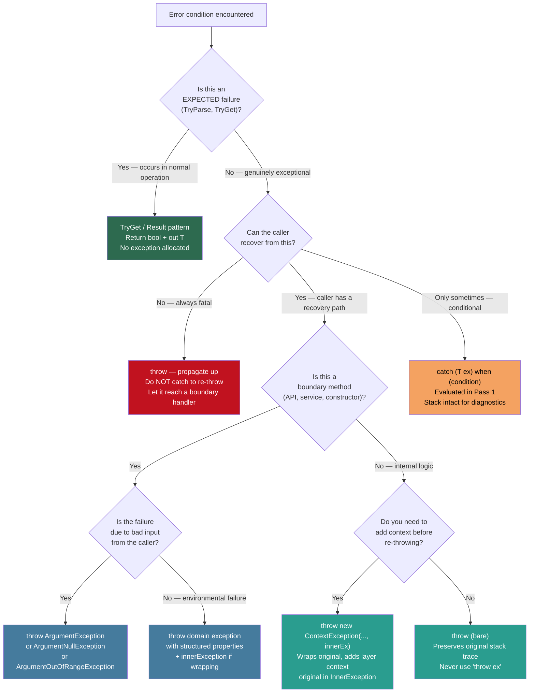

> [!success] Mastery Check
> - [ ] **Studied Well**
> - [ ] **Can explain the concept without notes**
> - [ ] **Can answer interview questions confidently**
> - [ ] **Can implement it in a real project**


## 📍 PART 0 — Navigation & Context

### Where This Topic Lives

```
C# Runtime Model
└── Error Handling
    ├── ► Exception Handling: Fundamentals  ← YOU ARE HERE
    │       └── Exception Handling: Production Patterns (2.36)  ─── depends on this
    ├── IDisposable and Resource Management (2.30)  ─── finally is the bridge
    └── async/await: The State Machine (2.29)       ─── async exception propagation builds on this
```

### What You Need Before This
- **[[2.08 — Classes]]** — custom exceptions are classes; the inheritance hierarchy maps to `Exception`
- **[[2.06 — Control Flow]]** — `try`/`catch`/`finally` is control flow; understanding `return` and scope is prerequisite
- **[[2.10 — Inheritance, Polymorphism, Casting]]** — `catch` blocks use type-based dispatch; most-specific-first ordering depends on the inheritance chain

### What This Unlocks After
- **[[2.36 — Exception Handling: Production Patterns]]** — ExceptionDispatchInfo, two-pass handling, Result\<T\>, retry with backoff — all require this as foundation
- **[[2.30 — IDisposable and Resource Management]]** — the `using` statement compiles to `try/finally`; understanding `finally` semantics is prerequisite
- **[[2.29 — async/await: The State Machine]]** — async exception propagation, `AggregateException`, and `OperationCanceledException` special-casing all build on these fundamentals

### Why This Topic Matters at Scale

Every production failure either throws an exception or silently swallows one. Engineers who don't understand the stack trace preservation rule (`throw` vs `throw ex`), the `finally` guarantee, or the exception hierarchy will write code that hides bugs, produces misleading stack traces, and leaks resources. Interviewers ask about this because it reveals whether you understand the runtime or just the syntax.

---

## 🧠 PART 1 — The Core Mental Model

### The Fundamental Rule

> **When an exception is thrown, the CLR unwinds the call stack looking for a compatible `catch` block. The `finally` block runs unconditionally during this unwinding — it is the only truly guaranteed cleanup mechanism in managed code. Rethrowing with `throw ex` replaces the original stack trace; rethrowing with `throw` preserves it.**

### The Plain-Language Analogy

Think of the call stack as a **stack of open filing cabinets**, each representing a method call. When an exception is thrown, it is like a fire alarm going off. The CLR acts as the fire marshal: it walks back through each cabinet (stack frame), checking the posted emergency procedures (`catch` blocks) to see if that cabinet's staff know how to handle this type of fire. The `finally` blocks are the **mandatory exit checklist** posted on every cabinet door — the staff must run through it whether there's a fire or not, whether they handle the fire or pass it up.

The critical subtlety: `throw ex` is like the staff rewriting the incident report to say *"fire started here"* (their location) instead of the original location. `throw` passes the original report up unchanged. Investigators (developers reading stack traces) are misled by the rewritten report every time.

### The Taxonomy Diagram

```mermaid
graph TD
    A["System.Object"] --> B["System.Exception"]

    B --> C["System.SystemException\n(CLR/runtime errors)"]
    B --> D["System.ApplicationException\n(⚠️ deprecated — do not use as base)"]
    B --> E["Custom Domain Exceptions\n(inherit directly from Exception)"]

    C --> F["NullReferenceException\n(dereference of null ref)"]
    C --> G["InvalidOperationException\n(object in wrong state)"]
    C --> H["ArgumentException\n(bad argument)"]
    C --> I["IOException\n(file/network I/O)"]
    C --> J["OutOfMemoryException\n(⚠️ unrecoverable — don't catch)"]
    C --> K["StackOverflowException\n(⚠️ unrecoverable — CLR terminates)"]
    C --> L["IndexOutOfRangeException\n(array bounds)"]
    C --> M["InvalidCastException\n(bad type cast)"]
    C --> N["OperationCanceledException\n(cancellation — special async status)"]
    C --> O["ArithmeticException"]
    C --> P["NotSupportedException\n(operation not supported)"]
    C --> Q["NotImplementedException\n(stub — remove before prod)"]

    H --> R["ArgumentNullException\n(null argument)"]
    H --> S["ArgumentOutOfRangeException\n(value outside valid range)"]

    O --> T["DivideByZeroException"]
    O --> U["OverflowException\n(checked arithmetic)"]

    I --> V["FileNotFoundException"]
    I --> W["UnauthorizedAccessException"]

    E --> X["OrderNotFoundException : Exception\n(domain-specific)"]
    E --> Y["PaymentDeclinedException : Exception\n(domain-specific)"]

    style B fill:#e63946,color:#fff
    style C fill:#457b9d,color:#fff
    style D fill:#e76f51,color:#fff
    style E fill:#2d6a4f,color:#fff
    style J fill:#c1121f,color:#fff
    style K fill:#c1121f,color:#fff
    style N fill:#f4a261,color:#000
```



> [!WARNING] `ApplicationException` is a dead end
> The original .NET design intended `SystemException` for CLR errors and `ApplicationException` for user code. This distinction was abandoned quickly. Do NOT inherit custom exceptions from `ApplicationException`. Inherit directly from `Exception` or from a specific exception type like `InvalidOperationException` when semantically appropriate.

---

## 🔬 PART 2 — Deep Mechanics

### 2.1 The Two-Pass Exception Handling Model

The CLR handles exceptions in two distinct passes. Most engineers don't know this exists, and it explains why `when` filters see the original call site.

```
━━━━━━━━━━━━━━━━━━━━━━━━━━━━━━━━━━━━━━━━━━━━━━━━━━━━━━━━━━━━━
PASS 1: HANDLER SEARCH (stack NOT yet unwound)
━━━━━━━━━━━━━━━━━━━━━━━━━━━━━━━━━━━━━━━━━━━━━━━━━━━━━━━━━━━━━

Exception thrown in Method C
    ↓
CLR walks up the call stack WITHOUT unwinding:
    Method C — has catch? No → continue up
    Method B — has catch? No → continue up
    Method A — has catch IOException? Yes → check 'when' filter (if any)
               'when' filter evaluated HERE, at this stack depth
               Stack is STILL intact — original call site visible in debugger

Only after a handler is found does Pass 2 begin.

━━━━━━━━━━━━━━━━━━━━━━━━━━━━━━━━━━━━━━━━━━━━━━━━━━━━━━━━━━━━━
PASS 2: STACK UNWINDING (handler found — now clean up)
━━━━━━━━━━━━━━━━━━━━━━━━━━━━━━━━━━━━━━━━━━━━━━━━━━━━━━━━━━━━━

CLR now unwinds from C back to A:
    Method C — has finally? Yes → run it
    Method B — has finally? Yes → run it
    Method A — run the catch block

This is why 'when' filters have access to the full original stack.
This is also why setting a breakpoint in a 'when' filter shows
the ORIGINAL throw site — the stack hasn't been touched yet.
```

### 2.2 Stack Frame Layout During Exception — ASCII Memory Diagram

```
Before exception:                  After exception in ProcessOrder():

STACK                              STACK
┌───────────────────────┐          ┌───────────────────────┐
│ HandleRequest()       │          │ HandleRequest()        │
│  [return addr]        │  Pass 1: │  [return addr]         │
│  request (ptr)        │  CLR     │  request (ptr)         │
├───────────────────────┤  scans   ├───────────────────────┤
│ ValidateAndProcess()  │  these   │ ValidateAndProcess()   │
│  [return addr]        │  frames  │  [return addr]         │
│  order (ptr)          │  top-    │  order (ptr)           │
├───────────────────────┤  down    ├───────────────────────┤
│ ProcessOrder()        │  for     │ ← EXCEPTION THROWN     │
│  [return addr]        │  catch   │  Stack trace captured  │
│  orderId (int)        │          │  at this frame         │
│  connection (ptr)     │  ──────► │                        │
└───────────────────────┘          └───────────────────────┘

                                   Pass 2: unwind begins
                                   ProcessOrder finally: run
                                   ValidateAndProcess finally: run
                                   HandleRequest catch: execute
```

### 2.3 `throw` vs `throw ex` — The Most Critical Rule

This is the single most important piece of knowledge in this topic. Getting it wrong hides bugs in production.

```csharp
// ━━━━━━━━━━━━━━━━━━━━━━━━━━━━━━━━━━━━━━━━━━━━━━━━━━━━━━━━
// SCENARIO: Exception thrown inside ProcessPayment()
// ━━━━━━━━━━━━━━━━━━━━━━━━━━━━━━━━━━━━━━━━━━━━━━━━━━━━━━━━

// ⚠️ WRONG: throw ex — DESTROYS the original stack trace
void HandleCheckout(Cart cart)
{
    try
    {
        ProcessPayment(cart);
    }
    catch (PaymentException ex)
    {
        Log(ex);
        throw ex; // ← Stack trace is NOW reset to this line.
                  //   Original ProcessPayment() call site is GONE.
                  //   Developers see: "exception at HandleCheckout, line 8"
                  //   Not: "exception at ProcessPayment > ChargeCard > StripeClient"
    }
}

// ✅ CORRECT: throw — preserves original stack trace
void HandleCheckout(Cart cart)
{
    try
    {
        ProcessPayment(cart);
    }
    catch (PaymentException ex)
    {
        Log(ex); // log it, then rethrow unchanged
        throw;   // ← Original stack trace preserved.
                 //   Developers see the actual origin: StripeClient.Charge(), line 42
    }
}

// ✅ ALSO CORRECT: re-wrapping while preserving original via InnerException
void HandleCheckout(Cart cart)
{
    try
    {
        ProcessPayment(cart);
    }
    catch (PaymentException ex)
    {
        // Wrapping adds context while preserving original cause
        throw new CheckoutException("Payment failed during checkout", innerException: ex);
        // InnerException = original PaymentException with original stack trace
    }
}
```

```
IL comparison:

// throw ex:
ldloc.0      // push ex
throw        // ← throw instruction: sets stack trace to CURRENT instruction pointer

// throw (bare rethrow):
rethrow      // ← rethrow instruction: preserves original stack trace metadata
             //   Different IL opcode entirely
```

> [!DANGER] `throw ex` is the #1 exception handling mistake in production C# codebases
> A codebase that uses `throw ex` instead of `throw` throughout will produce misleading logs, mislead incident response, and make postmortems nearly impossible. In code review, treat `throw ex` as a bug unless there is a documented reason (which is almost never).

### 2.4 The `finally` Guarantee — What It Covers and What It Doesn't

```csharp
// The guarantee: finally ALWAYS runs when its try block exits,
// whether by normal return, exception, or break/continue.

void ReadOrderFile(string path)
{
    StreamReader reader = null;
    try
    {
        reader = new StreamReader(path);
        var content = reader.ReadToEnd();
        ProcessContent(content);
        return; // ← finally still runs before the method actually returns
    }
    catch (FileNotFoundException ex)
    {
        Log(ex);
        // finally still runs after this catch block
    }
    finally
    {
        // ALWAYS executes, regardless of path taken above
        reader?.Dispose(); // safe dispose — reader may be null if ctor threw
    }
}
```

```
Control flow paths — finally runs in ALL of these:

  try body completes normally     → finally → method returns
  try body throws, catch handles  → catch body → finally → method continues
  try body throws, no catch here  → finally → exception propagates up
  catch body throws               → finally → new exception propagates up
  try body calls return           → finally → method returns

EXCEPTIONS to the guarantee (these bypass finally):
  • Environment.FailFast()       — immediate process termination, no unwinding
  • StackOverflowException       — CLR terminates process, no opportunity to unwind
  • ExecutionEngineException     — CLR corruption, process terminated
  • Thread.Abort() (legacy)      — .NET Framework only; removed in .NET Core
```

### 2.5 Multiple `catch` Blocks — Ordering and the Hierarchy Rule

```csharp
// RULE: catch blocks are evaluated top to bottom.
// The FIRST compatible catch block wins.
// More specific exceptions MUST come before less specific ones.

// ⚠️ WRONG: Less specific catch first — ArgumentNullException never reached
void ProcessOrderId(string orderId)
{
    try { /* ... */ }
    catch (ArgumentException ex)          // catches ArgumentException AND all subtypes
    {
        HandleArgError(ex);
    }
    catch (ArgumentNullException ex)      // DEAD CODE — never reached
    {                                     // ArgumentNullException IS-A ArgumentException
        HandleNull(ex);                   // Compiler warning: "unreachable code"
    }
}

// ✅ CORRECT: Most specific first
void ProcessOrderId(string orderId)
{
    try { /* ... */ }
    catch (ArgumentNullException ex)      // specific subtype first
    {
        HandleNull(ex);
    }
    catch (ArgumentException ex)          // base type catches everything else
    {
        HandleArgError(ex);
    }
    catch (Exception ex)                  // catch-all — last resort only
    {
        LogUnexpected(ex);
        throw; // re-throw: don't swallow unexpected exceptions
    }
}
```

### 2.6 Exception Filters (`when`) — Conditional Catching

```csharp
// 'when' filters are evaluated BEFORE the stack is unwound (Pass 1).
// If the filter returns false, the catch block is skipped as if it wasn't there.
// This means you can inspect the exception without committing to handling it.

// Pattern: retry-eligible vs terminal exceptions
void ExecuteOrderQuery(IDbConnection conn)
{
    try
    {
        RunQuery(conn);
    }
    // Only catch SQL exceptions that are transient (deadlock = error 1205)
    // Terminal SQL errors (foreign key violation = 547) propagate up
    catch (SqlException ex) when (ex.Number == 1205)
    {
        _logger.LogWarning("Deadlock detected, will retry: {Message}", ex.Message);
        RetryAfterDelay();
    }
    // Only catch IO exceptions that are network-related (not disk corruption)
    catch (IOException ex) when (ex.HResult == unchecked((int)0x80070040))
    {
        _logger.LogWarning("Network IO error, retrying...");
    }
}

// Pattern: logging without handling (the most underused pattern)
// Log the full stack trace at the original call site (Pass 1), then let it propagate
void ProcessOrder(Order order)
{
    try
    {
        ExecuteOrder(order);
    }
    catch (Exception ex) when (LogAndReturnFalse(ex))
    {
        // This catch block is NEVER entered (LogAndReturnFalse always returns false)
        // But the when filter runs — which logs the exception — at the original call site
    }
}

// The filter evaluates at the original stack depth — perfect for diagnostics
private bool LogAndReturnFalse(Exception ex)
{
    _logger.LogError(ex, "Exception in order processing");
    return false; // never handle — just observe
}
```

### 2.7 Custom Exception Design — The Constructor Convention

```csharp
// Every well-designed custom exception follows this convention.
// Missing the innerException overload is the most common omission.

public class OrderNotFoundException : Exception
{
    // The three required constructor overloads:

    // 1. Default — rarely used but required for serialization compatibility
    public OrderNotFoundException()
        : base("Order not found") { }

    // 2. Message — most common usage at throw sites
    public OrderNotFoundException(string message)
        : base(message) { }

    // 3. Message + InnerException — REQUIRED for proper exception chaining
    //    Without this, callers cannot wrap this exception while preserving it
    public OrderNotFoundException(string message, Exception innerException)
        : base(message, innerException) { }

    // Domain-specific context property — prefer properties over parsing message strings
    public int? OrderId { get; init; }

    // Convenience factory: structured context, no message formatting at throw site
    public static OrderNotFoundException ForOrderId(int orderId)
        => new OrderNotFoundException($"Order {orderId} was not found")
           { OrderId = orderId };
}

// Usage:
throw OrderNotFoundException.ForOrderId(orderId);

// Consumers can access structured data:
catch (OrderNotFoundException ex) when (ex.OrderId.HasValue)
{
    _metrics.RecordMissingOrder(ex.OrderId.Value);
    throw;
}
```

### 2.8 The `Exception` Properties Every Engineer Must Know

```csharp
// These are the four properties you interrogate in every exception handler:

try
{
    ProcessPayment(request);
}
catch (Exception ex)
{
    // Message: human-readable description.
    // ⚠️ Do NOT parse Message to extract information — use typed properties instead.
    // Message is for humans; properties are for code.
    string msg = ex.Message;

    // StackTrace: string representation of frames at the time of the throw.
    // Can be null if exception was created but never thrown.
    // Destroyed by 'throw ex'; preserved by 'throw'.
    string? stack = ex.StackTrace;

    // InnerException: the wrapped original exception.
    // Can be null. Navigate with while (ex.InnerException != null) ex = ex.InnerException
    // to find the root cause. AggregateException.InnerExceptions (plural) for tasks.
    Exception? inner = ex.InnerException;

    // HResult: HRESULT COM error code. Useful for interop and OS-level error diagnosis.
    // Most .NET exceptions set this; custom exceptions default to E_FAIL (0x80004005).
    int hr = ex.HResult;
}
```

---

## 💻 PART 3 — Production Code Patterns

### 3.1 The Boundary Guard — Validate at Entry, Not Inside

Throw `ArgumentException` variants at method boundaries, before any side effects occur. Never throw them from deep inside processing logic.

```csharp
// ⚠️ WRONG: Validation buried inside logic — by the time it throws,
//           partial state changes may have already occurred
public void CreateOrder(string customerId, List<OrderLine> lines)
{
    var order = new Order();
    order.SetCustomer(customerId);       // side effect
    foreach (var line in lines)
        order.AddLine(line);             // side effects

    if (string.IsNullOrWhiteSpace(customerId)) // too late! already mutated state
        throw new ArgumentNullException(nameof(customerId));
}

// ✅ CORRECT: Guard clause pattern — validate first, act second
public void CreateOrder(string customerId, List<OrderLine> lines)
{
    // ArgumentNullException.ThrowIfNull (C# 10+) — zero boilerplate
    ArgumentNullException.ThrowIfNull(customerId, nameof(customerId));
    ArgumentNullException.ThrowIfNull(lines, nameof(lines));

    // ArgumentException for semantic validation
    if (string.IsNullOrWhiteSpace(customerId))
        throw new ArgumentException("Customer ID cannot be empty or whitespace",
                                    nameof(customerId));
    if (lines.Count == 0)
        throw new ArgumentException("Order must contain at least one line",
                                    nameof(lines));

    // Only reach here with valid inputs — no partial state risk
    var order = new Order();
    order.SetCustomer(customerId);
    foreach (var line in lines)
        order.AddLine(line);
}
```

### 3.2 The `finally` Resource Cleanup — Manual and `using`

```csharp
// The manual pattern (when conditional resource creation is needed):
public async Task<OrderReport> GenerateReport(int orderId)
{
    IDbConnection? connection = null;
    try
    {
        connection = _connectionFactory.Create();
        await connection.OpenAsync();
        var data = await connection.QueryAsync<OrderData>(
            "SELECT * FROM Orders WHERE Id = @id", new { id = orderId });
        return BuildReport(data);
    }
    catch (SqlException ex)
    {
        _logger.LogError(ex, "Database error generating report for order {OrderId}", orderId);
        throw; // preserve original stack trace, let caller decide recovery strategy
    }
    finally
    {
        // Runs whether or not an exception was thrown, whether or not data was returned
        // connection may be null if _connectionFactory.Create() itself threw
        connection?.Dispose();
    }
}

// The 'using' pattern (when resource creation is unconditional):
// Compiles to try/finally automatically — prefer this for clarity
public async Task<OrderReport> GenerateReportClean(int orderId)
{
    await using var connection = _connectionFactory.Create();
    await connection.OpenAsync();
    var data = await connection.QueryAsync<OrderData>(
        "SELECT * FROM Orders WHERE Id = @id", new { id = orderId });
    return BuildReport(data);
    // 'await using' compiles to try { ... } finally { await connection.DisposeAsync(); }
}
```

### 3.3 The Exception Log-Then-Rethrow — Observing Without Handling

```csharp
// ⚠️ WRONG: Catch-and-rethrow adds a try/catch frame for no reason
//           and tempts developers to use 'throw ex' (which they then do)
public Order GetOrder(int orderId)
{
    try
    {
        return _repository.Find(orderId);
    }
    catch (Exception ex)
    {
        _logger.LogError(ex, "Error fetching order {OrderId}", orderId);
        throw ex; // ← destroys stack trace — bug compounded by the unnecessary catch
    }
}

// ✅ CORRECT option A: Use 'when' filter to log without committing to handle
public Order GetOrder(int orderId)
{
    try
    {
        return _repository.Find(orderId);
    }
    catch (Exception ex) when (Observe(ex, orderId))
    {
        // Never entered — Observe always returns false
        throw; // unreachable but keeps the compiler happy
    }
}

private bool Observe(Exception ex, int orderId)
{
    _logger.LogError(ex, "Error fetching order {OrderId}", orderId);
    return false;
}

// ✅ CORRECT option B: Only catch what you can handle
public Order GetOrder(int orderId)
{
    try
    {
        return _repository.Find(orderId);
    }
    catch (OrderNotFoundException)
    {
        // We CAN handle this specific case
        return Order.Empty;
    }
    // All other exceptions propagate with original stack trace intact
}
```

### 3.4 The Domain Exception Hierarchy — Structured Error Propagation

```csharp
// Design principle: exceptions should carry structured data, not just strings.
// Service boundaries catch domain exceptions and translate them to responses.

// Base for all domain exceptions in this service
public abstract class OrderServiceException : Exception
{
    public string ServiceName => "OrderService";
    public DateTimeOffset OccurredAt { get; } = DateTimeOffset.UtcNow;

    protected OrderServiceException(string message) : base(message) { }
    protected OrderServiceException(string message, Exception inner) : base(message, inner) { }
}

// Specific domain exceptions — each carries relevant typed context
public sealed class InsufficientInventoryException : OrderServiceException
{
    public int ProductId   { get; init; }
    public int Requested   { get; init; }
    public int Available   { get; init; }

    public InsufficientInventoryException(int productId, int requested, int available)
        : base($"Insufficient inventory for product {productId}: " +
               $"requested {requested}, available {available}")
    {
        ProductId = productId;
        Requested = requested;
        Available = available;
    }

    public InsufficientInventoryException(int productId, int requested, int available,
                                          Exception inner)
        : base($"Insufficient inventory for product {productId}", inner)
    {
        ProductId = productId;
        Requested = requested;
        Available = available;
    }
}

// At the service boundary: structured exception → structured response
// No message parsing. No string comparisons. Type-safe dispatch.
public IActionResult FulfillOrder([FromBody] FulfillOrderRequest request)
{
    try
    {
        _orderService.Fulfill(request.OrderId);
        return Ok();
    }
    catch (InsufficientInventoryException ex)
    {
        return Conflict(new ProblemDetails
        {
            Title    = "Insufficient inventory",
            Detail   = ex.Message,
            Extensions =
            {
                ["productId"]  = ex.ProductId,
                ["requested"]  = ex.Requested,
                ["available"]  = ex.Available
            }
        });
    }
    catch (OrderNotFoundException ex)
    {
        return NotFound(new ProblemDetails { Title = "Order not found", Detail = ex.Message });
    }
    // Other exceptions bubble up to middleware (unhandled exception handler)
}
```

### 3.5 The `NotImplementedException` vs `NotSupportedException` Contract

```csharp
// NotImplementedException: this WILL be implemented — it's a stub
// Use ONLY during development. Remove before merging to main.
// Treat as a compile warning in code review.

public class OrderExporter
{
    public string ExportToJson(Order order) => JsonSerializer.Serialize(order);
    public string ExportToCsv(Order order)  => throw new NotImplementedException("TODO: CSV export — ticket #4821");
}

// NotSupportedException: this WILL NEVER be implemented for this type
// Intentional permanent gap in the contract.
public class ReadOnlyOrderRepository : IOrderRepository
{
    public Order FindById(int id)     => _store[id];
    public void  Save(Order order)    => throw new NotSupportedException(
        "ReadOnlyOrderRepository does not support write operations");
    public void  Delete(int orderId)  => throw new NotSupportedException(
        "ReadOnlyOrderRepository does not support write operations");
}

// Better design: split the interface to avoid NotSupportedException entirely
public interface IOrderReader  { Order FindById(int id); }
public interface IOrderWriter  { void Save(Order order); void Delete(int orderId); }

public class ReadOnlyOrderRepository : IOrderReader
{
    public Order FindById(int id) => _store[id];
    // No Save or Delete — they're not in this interface at all
    // Interface segregation principle: callers can't even ask for write operations
}
```

### 3.6 The `checked`/`unchecked` Arithmetic Exception

```csharp
// By default, arithmetic overflow is SILENT in C# — it wraps around silently.
// In financial or safety-critical code, this is a correctness bug.

// ⚠️ WRONG: Default unchecked arithmetic — silent wraparound
int balance = int.MaxValue; // 2,147,483,647
balance += 1;               // Wraps to int.MinValue (-2,147,483,648) — no exception!
Console.WriteLine(balance); // -2147483648 — corrupted data, no indication of error

// ✅ CORRECT for financial/safety code: checked arithmetic throws OverflowException
void ApplyBonus(ref int balance, int bonus)
{
    checked
    {
        balance += bonus; // throws OverflowException if result exceeds int.MaxValue
    }
}

// ✅ Project-level: <CheckForOverflowUnderflow>true</CheckForOverflowUnderflow> in .csproj
//   Makes the entire project checked by default.
//   Use <unchecked> blocks explicitly for known-safe wraparound (e.g., hash code computation)

// ✅ For financial totals specifically: use decimal (no overflow at practical values)
// or long with checked arithmetic
decimal runningTotal = 0m;
checked
{
    foreach (var payment in payments)
        runningTotal += payment.Amount; // decimal overflow is extremely unlikely but checked anyway
}
```

### 3.7 Exception Chaining — Preserving Causality Across Layers

```csharp
// Pattern: translate infrastructure exceptions into domain exceptions
// while preserving the original cause in InnerException

public class OrderRepository
{
    public Order FindById(int orderId)
    {
        try
        {
            return _db.Query<Order>(
                "SELECT * FROM Orders WHERE Id = @id", new { id = orderId })
                .SingleOrDefault()
                ?? throw new OrderNotFoundException($"Order {orderId} not found in database");
        }
        catch (SqlException ex)
        {
            // Translate: SqlException (infrastructure concern) →
            // OrderRepositoryException (domain concern)
            // Original SqlException preserved in InnerException for debugging
            throw new OrderRepositoryException(
                $"Database error while retrieving order {orderId}",
                innerException: ex);  // ← causality chain preserved
        }
    }
}

// At the top level, you can navigate the cause chain:
catch (OrderRepositoryException ex)
{
    _logger.LogError(ex, "Repository error");
    // Navigate to root cause for detailed diagnostics:
    var rootCause = ex;
    while (rootCause.InnerException != null)
        rootCause = rootCause.InnerException;
    _logger.LogDebug("Root cause: {Type}: {Message}",
        rootCause.GetType().Name, rootCause.Message);
}
```

---

## ⚠️ PART 4 — Gotchas & Anti-Patterns

### Gotcha 1: `throw ex` Destroying the Stack Trace

The wrong mental model is that `catch (Exception ex) { ... throw ex; }` is safe because it re-throws the same exception object.

```csharp
// ⚠️ WRONG CODE:
// The stack trace in ex now points to this line — the actual throw site is gone
catch (DatabaseException ex)
{
    _logger.LogError("DB error: {Message}", ex.Message);
    throw ex; // Stack trace reset to HERE — production logs show wrong location
}

// ✅ CORRECT CODE:
catch (DatabaseException ex)
{
    _logger.LogError("DB error: {Message}", ex.Message);
    throw; // Bare 'throw' — stack trace preserved, original throw site intact
}

// WHY: 'throw ex' compiles to the 'throw' IL opcode on a local variable,
// which sets the exception's stack trace to the current instruction pointer.
// 'throw' (bare) compiles to 'rethrow' IL opcode, which
// resumes propagation of the current exception WITH its original metadata.
```

### Gotcha 2: Swallowing Exceptions in a Catch-All

The wrong mental model: "If I catch Exception and log it, the error is handled."

```csharp
// ⚠️ WRONG CODE:
// Exception is logged but silently swallowed — caller receives null/default
// and never knows an error occurred
public Order? TryGetOrder(int orderId)
{
    try
    {
        return _repository.FindById(orderId);
    }
    catch (Exception ex)
    {
        _logger.LogError(ex, "Error");
        return null; // caller cannot distinguish "not found" from "system error"
    }
}

// ✅ CORRECT CODE — only catch what you can meaningfully recover from
public Order? TryGetOrder(int orderId)
{
    try
    {
        return _repository.FindById(orderId);
    }
    catch (OrderNotFoundException)
    {
        return null; // legitimate "not found" case — caller handles null appropriately
    }
    // Database errors, network errors, etc. propagate up
    // The caller gets an exception it can distinguish from "not found"
}

// WHY: Swallowing exceptions silently corrupts the error signal the caller needs.
// "Not found" and "database is down" are completely different situations
// that require completely different responses. A null return cannot express this.
```

### Gotcha 3: Catch Order Bug — Unreachable Catch Block

The wrong mental model: "The CLR tries all catch blocks and picks the best match."

```csharp
// ⚠️ WRONG CODE:
// The base Exception catch fires on EVERYTHING — SqlException never reached
try
{
    RunDatabaseQuery();
}
catch (Exception ex)           // ← matches EVERYTHING including SqlException
{
    HandleGenericError(ex);
}
catch (SqlException ex)        // ← DEAD CODE: compiler warning, never executes
{
    HandleDatabaseError(ex);
}

// ✅ CORRECT CODE: most-specific first, least-specific last
try
{
    RunDatabaseQuery();
}
catch (SqlException ex)        // specific first
{
    HandleDatabaseError(ex);
}
catch (IOException ex)         // next most specific
{
    HandleIoError(ex);
}
catch (Exception ex)           // catch-all last — only for unexpected errors
{
    HandleGenericError(ex);
    throw; // ← re-throw unexpected exceptions; don't swallow them
}

// WHY: The CLR evaluates catch clauses TOP TO BOTTOM and takes the FIRST match.
// It does NOT search for the "best" match — first compatible wins.
// A base class catch before a derived class catch makes the derived catch unreachable.
```

### Gotcha 4: `finally` Suppressing Exceptions via Return

The wrong mental model: "A return in a finally block returns the finally block's value."

```csharp
// ⚠️ WRONG CODE:
// The exception from the try block is SILENTLY DISCARDED
public bool ProcessShipment(int orderId)
{
    try
    {
        ShipOrder(orderId); // throws InvalidOperationException
        return true;
    }
    finally
    {
        return false; // ← LEGAL but CATASTROPHIC:
                      // The exception from ShipOrder() is silently eaten!
                      // Caller receives 'false' — no indication an exception occurred
    }
}

// ✅ CORRECT CODE: never use return/throw in finally unless you want this behavior
public bool ProcessShipment(int orderId)
{
    bool succeeded = false;
    try
    {
        ShipOrder(orderId);
        succeeded = true;
    }
    finally
    {
        // Clean up only — no control flow that suppresses exceptions
        CleanupShipmentResources(orderId);
    }
    return succeeded;
}

// WHY: A 'return' in a finally block causes the CLR to discard any in-flight exception.
// The method returns normally from the caller's perspective.
// This behavior is correct-by-spec but almost always a bug.
// Similarly, a 'throw' in a finally block replaces the original exception.
```

### Gotcha 5: Catching `Exception` on Truly Unrecoverable CLR Errors

The wrong mental model: "If I wrap everything in `catch (Exception)`, I can handle any failure."

```csharp
// ⚠️ WRONG CODE:
// Attempting to 'handle' OutOfMemoryException or StackOverflowException
// is undefined behavior — the process is in a corrupt state
while (true)
{
    try
    {
        ProcessNextBatch();
    }
    catch (Exception ex) // catches OutOfMemoryException, ExecutionEngineException...
    {
        _logger.LogError(ex, "Error in batch loop — continuing"); // ← dangerous!
        // The process may be in a partially corrupt state
        // Continuing leads to data corruption, deadlocks, or silent data loss
    }
}

// ✅ CORRECT: Only catch what you can recover from; let CLR exceptions terminate
while (true)
{
    try
    {
        ProcessNextBatch();
    }
    catch (OperationCanceledException)
    {
        break; // legitimate cancellation — exit the loop
    }
    catch (TransientProcessingException ex)
    {
        _logger.LogWarning(ex, "Transient error — will retry next cycle");
        await Task.Delay(TimeSpan.FromSeconds(5));
    }
    // OutOfMemoryException, StackOverflowException: NOT caught.
    // They will terminate the process — which is the correct response.
}

// WHY: OutOfMemoryException means the CLR cannot allocate memory.
// StackOverflowException terminates the process before your catch runs.
// ExecutionEngineException indicates CLR internal corruption.
// Catching these and continuing is worse than crashing — it produces
// silent data corruption and undefined behavior.
```

---

## 📊 PART 5 — Performance Implications

### 5.1 Allocation Characteristics Table

| Scenario | Allocation Behavior | Approx Cost |
|---|---|---|
| Entering a `try` block with no exception | Zero allocation; try/catch is zero-overhead on happy path | ~0 ns |
| Throwing a `new Exception(...)` | Heap allocation for exception object (100–200 bytes); stack trace captured | ~5–50 μs first throw |
| Stack trace capture on throw | `Environment.StackTrace`-equivalent walk; proportional to call depth | ~1–10 μs (deep stacks) |
| Entering a `catch` block | No additional allocation once exception object exists | ~0 ns |
| `throw` (rethrow) | No new allocation; reuses existing exception object | ~1–2 ns |
| `throw ex` (rethrow with reset) | No new allocation but rewrites stack trace metadata | ~100–500 ns |
| `finally` block execution (no exception) | Zero overhead; JIT compiles it as normal code | ~same as inline code |
| `when` filter evaluation | No allocation; evaluated before stack unwind | ~1–5 ns for simple predicate |
| `Exception.StackTrace` string access | Lazy-generated on first access; allocates a string | ~5–50 μs on first access |
| Catching `Exception` and re-throwing | Correct usage: `throw`; zero additional cost | ~0 ns |
| Custom exception with 5 properties | Allocation size: base Exception + property storage | ~300–500 bytes heap |

> [!IMPORTANT] The "exceptions are slow" rule is about thrown exceptions, not `try` blocks
> The performance cost is at the throw site: stack trace capture is expensive. A `try/finally` block with no exception thrown has **zero measurable overhead**. Code that uses `try/catch` for control flow (throwing and catching exceptions as a normal code path) is the anti-pattern to avoid.

### 5.2 BenchmarkDotNet — Try/Catch Overhead Analysis

```csharp
[MemoryDiagnoser]
[BenchmarkCategory("ExceptionHandling")]
public class ExceptionOverheadBenchmark
{
    private readonly OrderRepository _repo = new();

    // Baseline: method call with no exception path
    [Benchmark(Baseline = true)]
    public Order DirectCall() => _repo.GetOrderDirect(1);

    // try/finally with no exception — measures try block overhead
    [Benchmark]
    public Order TryFinallyNoException()
    {
        try
        {
            return _repo.GetOrderDirect(1);
        }
        finally
        {
            // intentionally empty — measuring block overhead only
        }
    }

    // Exception thrown and caught — the expensive path
    [Benchmark]
    public Order? ExceptionThrownAndCaught()
    {
        try
        {
            return _repo.GetOrderThrows(1); // always throws
        }
        catch (OrderNotFoundException)
        {
            return null;
        }
    }

    // TryGet pattern — no exception thrown, result in return value
    [Benchmark]
    public Order? TryGetPattern() => _repo.TryGetOrder(1);
}

// Expected output (approximate, .NET 8, x64):
//
// | Method                  | Mean        | Allocated |
// |------------------------ |------------:|----------:|
// | DirectCall              |    2.1 ns   |       0 B |
// | TryFinallyNoException   |    2.1 ns   |       0 B |  ← zero overhead on happy path
// | ExceptionThrownAndCaught| 5,200 ns    |     312 B |  ← ~2500x slower than happy path
// | TryGetPattern           |    2.3 ns   |       0 B |  ← preferred for expected failures
//
// Conclusion: try/finally costs nothing. Throwing an exception costs ~5 μs.
// Use TryGet/Result<T> patterns for EXPECTED failures; exceptions for UNEXPECTED failures.
```

### 5.3 When to Care / When to Ignore

**When this costs you:**
- **Using exceptions for control flow**: throwing `UserNotFoundException` on every user lookup that misses cache — if the cache miss rate is 30% and you're handling 10,000 requests/second, that's 3,000 exceptions/second × ~5 μs each = ~15 ms of pure exception overhead per second. Over time this causes GC pressure from exception object allocation.
- **Deep call stacks + frequent exceptions**: stack trace capture is O(call depth). A 50-frame deep call stack throwing 1,000 exceptions/second is measurably expensive. Use `ExceptionDispatchInfo.Capture` to capture once and re-use.
- **Accessing `ex.StackTrace` in logging hot paths**: the string is lazily constructed. In a high-volume logging scenario, accessing `StackTrace` on every caught exception allocates large strings. Pre-capture with structured logging frameworks.

**When this doesn't matter:**
- **Truly exceptional failures**: database connection failures, unhandled auth errors, configuration problems — these should be rare. Optimize for correct behavior, not exception performance.
- **Background services**: a job scheduler that catches exceptions to log and retry once per minute. The exception overhead is completely irrelevant.
- **API controllers**: an HTTP 404 returning `OrderNotFoundException` costs 5 μs in exception handling against ~5 ms of total request processing. Negligible.
- **Startup code**: configuration validation, DI registration, migration checks. These run once; exception cost is unmeasurable.

---

## 🎤 PART 6 — Interview Arsenal

### A. The Question Bank

---

**Q: "What is the difference between `throw` and `throw ex` in a catch block?"**

**Average Answer:** "`throw` re-throws the exception and `throw ex` throws a new exception."

**Why That's Insufficient:** `throw ex` does NOT throw a new exception — it re-throws the same object. The candidate misses the actual issue: stack trace preservation.

> **Great Answer:** "Both re-throw the same exception object — no new allocation, no new exception. The difference is what happens to the stack trace. `throw ex` compiles to the `throw` IL opcode on the local variable, which resets the stack trace to the current instruction pointer — so in the logs, the exception appears to have originated at the catch site, not at the actual code that threw it. `throw` (bare) compiles to the `rethrow` IL opcode, which resumes propagation of the current exception with its original metadata fully intact. In production this matters enormously for incident response: `throw ex` produces misleading stack traces that send you to the catch site instead of the actual bug. I treat `throw ex` as a code smell in review and will flag it. The only correct uses of `throw ex` I've seen are in test helpers that intentionally want to report the failure at the test call site — and even then, `ExceptionDispatchInfo` is the better tool."

---

**Q: "What is the `finally` block and when does it NOT run?"**

**Average Answer:** "It always runs, whether there's an exception or not."

**Why That's Insufficient:** Not quite true — there are specific scenarios where `finally` is bypassed. The average answer is incomplete.

> **Great Answer:** "The `finally` block runs in virtually all cases: normal completion, exception thrown and caught, exception thrown and not caught, and even when `return` is inside the `try` block. The CLR unwinds the call stack during exception propagation and runs `finally` blocks at each frame as it unwinds. The cases where `finally` genuinely does not run are: `Environment.FailFast()`, which immediately terminates the process without any unwinding; `StackOverflowException`, which is handled at the process level because the stack itself is corrupted; and `ExecutionEngineException`, which indicates CLR corruption. In .NET Framework there was also `Thread.Abort()` but that's removed in .NET Core. There's also a subtlety: if a `finally` block itself throws, the original exception is replaced by the new one. And if there's a `return` statement inside a `finally` block, any in-flight exception is silently swallowed — which is almost always a bug. The practical takeaway is: never put control flow statements like `return` or `throw` in `finally` unless you very specifically want exception suppression."

---

**Q: "In what order should `catch` blocks be arranged, and why?"**

**Average Answer:** "Most specific first, least specific last."

**Why That's Insufficient:** Correct but doesn't explain the underlying mechanism.

> **Great Answer:** "Most specific first, most general last, because the CLR evaluates catch clauses top to bottom and takes the first compatible match — it doesn't search for the 'best' or 'most specific' match. If you put `catch (Exception)` above `catch (SqlException)`, the `SqlException` catch is dead code and the compiler will warn you. The practical approach I follow: specific domain exceptions first in the order of recovery priority — `catch (OrderNotFoundException)` before `catch (ServiceException)` before `catch (Exception)`. The catch-all `catch (Exception)` goes last and almost always ends with `throw` or a `throw new WrappedException(...)` — never with silent swallowing. One nuance: `catch` order interacts with `when` filters in a useful way. You can have multiple `catch (SqlException)` blocks with different `when` filters — the CLR evaluates them in order and takes the first whose filter returns true."

---

**Q: "What is an exception filter (`when`), and what makes it different from catching and re-throwing?"**

**Average Answer:** "It lets you add a condition to a catch block."

**Why That's Insufficient:** Misses the Pass 1 / Pass 2 mechanics that make `when` fundamentally different from catch-then-rethrow.

> **Great Answer:** "The `when` filter looks syntactically like a conditional catch, but it's mechanically different in an important way. The CLR handles exceptions in two passes: first it scans up the call stack to find a handler, then it unwinds. The `when` filter is evaluated during Pass 1 — before any stack unwinding has happened. This means the original call stack is still fully intact when the filter runs. A catch-and-rethrow happens after Pass 2 — the stack is already unwound. So a `when` filter that logs the exception captures the full original stack depth, exactly where the throw occurred. A catch block that logs and re-throws with `throw` captures the stack at the catch site, not the throw site. The other use case I reach for is conditional handling — `catch (SqlException ex) when (ex.Number == 1205)` for deadlock-only retries — without it, you'd have to catch all SqlExceptions and re-throw the ones you don't want, which is more code and loses the Pass 1 diagnostic window."

---

**Q: "How do you design a good custom exception type?"**

**Average Answer:** "Inherit from Exception, add a constructor that takes a message."

**Why That's Insufficient:** Misses the three-constructor convention, InnerException, and the key anti-pattern of putting structured data in message strings.

> **Great Answer:** "A well-designed custom exception needs three things. First, the three constructor overloads: default (for serialization compatibility), message-only, and message-plus-innerException. The inner exception overload is the most commonly omitted and the most important — it lets downstream code wrap this exception while preserving the causal chain. Second, structured domain properties instead of embedding data in the message string. If I have a `PaymentDeclinedException`, I want `ex.Amount`, `ex.CardToken`, `ex.DeclineCode` as properties — not string parsing on `ex.Message`. Code that catches exceptions should use properties, not parse strings. Third, inherit directly from `Exception` for domain exceptions rather than from `ApplicationException`, which is a deprecated pattern, or from `SystemException`, which signals CLR errors. I also make the class `sealed` unless I explicitly intend derived types — open exception hierarchies tend to grow uncontrolled."

---

### B. The Trick Questions

> [!WARNING] These sound simple but have non-obvious answers

**"Does a `try` block with no `catch` make sense? Is it valid C#?"**
The trap: candidates say "no, you need a catch."
The answer: Yes, `try/finally` without any `catch` is completely valid and common. It's the correct pattern for guaranteed cleanup when you don't want to handle any exception — you just want to ensure cleanup runs. `using` compiles to exactly this pattern.

**"What happens if a `finally` block throws an exception?"**
The trap: candidates think the original exception somehow persists.
The answer: The exception thrown in `finally` replaces the original in-flight exception. The original exception is silently lost. There is no mechanism to propagate both. This is why you should almost never throw inside a `finally` block.

**"Can you `await` inside a `catch` or `finally` block?"**
The trap: candidates who know C# < 6 say no.
The answer: Yes, since C# 6. You can `await` inside `catch` and `finally` blocks. This was not possible in earlier versions and required workarounds. The compiler generates the appropriate state machine structure to handle it.

**"What does `catch {}` (empty catch, no type) catch?"**
The trap: candidates say it catches nothing, or only `Exception`.
The answer: An empty `catch {}` with no type catches ALL exceptions, including non-CLS-compliant exceptions thrown from native code that are not derived from `Exception`. These are very rare in modern .NET but they exist. `catch (Exception)` only catches `Exception`-derived types. In practice, for managed C# code, the difference never matters.

**"Is `NullReferenceException` a good exception to throw explicitly in your own code?"**
The trap: candidates think null checks should throw NullReferenceException.
The answer: No. `NullReferenceException` should only be thrown by the CLR when you dereference a null reference. If you're validating an argument is not null, throw `ArgumentNullException`. If an object is in a wrong state, throw `InvalidOperationException`. `NullReferenceException` thrown explicitly is confusing because it signals a programming error in the CLR's view, not a validation failure.

---

### C. Red Flags to Avoid

```
❌ "throw ex preserves the original exception"
   → throw ex RESETS the stack trace. This is the #1 misconception in exception handling.

❌ "I catch Exception everywhere so nothing crashes"
   → This swallows OutOfMemoryException, data corruption, and other unrecoverable states.
     The correct approach: only catch what you can recover from.

❌ "finally always runs, no exceptions"
   → Environment.FailFast(), StackOverflowException, and ExecutionEngineException
     bypass finally. Saying "always" without qualification signals incomplete knowledge.

❌ "I put all my logging in catch blocks so I see every error"
   → Logging in catch requires catching exceptions you don't handle,
     then re-throwing — which either uses 'throw ex' (destroys stack trace)
     or requires careful 'throw'.
     Better: use 'when' filters for observing without committing to handle.

❌ "Catch (Exception ex) and re-throw is fine as long as I use throw"
   → Catching exception types you don't handle adds noise, can break 'when' filter
     semantics in callers, and clutters the code. Don't catch what you can't handle.

❌ "Custom exceptions should inherit from ApplicationException"
   → ApplicationException is deprecated since .NET 1.1. Inherit from Exception directly.

❌ "I check ex.Message to determine what kind of error occurred"
   → Message is a human-readable string. It can be localized, changed, or truncated.
     Use exception type and typed properties. Never parse message strings in code.

❌ "Exceptions have significant performance cost just from the try block"
   → The try block itself has zero measurable overhead. The cost is at the throw site
     (stack trace capture). Conflating try-block cost with throw cost is wrong.
```

---

## 🔀 PART 7 — Decision Framework



---

## ✅ PART 8 — Self-Check

### A. Conceptual Questions

1. You have a `try/catch` block. Inside the `try`, the code calls `return 42;`. Does the `finally` block run? What does the method return?

2. A method has `catch (Exception ex) { throw ex; }`. A colleague says this is fine because it catches and re-throws the same exception. What is wrong with this code, and what is the consequence in production?

3. Explain the two-pass exception handling model. What is evaluated in Pass 1 that is NOT yet unwound? Why does this matter for `when` filters?

4. You write `catch (IOException) { } catch (FileNotFoundException) { }`. The compiler shows a warning. What is the problem and how do you fix it?

5. In what specific scenarios does `finally` NOT run? Name at least two.

6. What is the difference between `NotImplementedException` and `NotSupportedException`? When should each be used?

7. A custom exception class has only one constructor: `public OrderException(string message) : base(message) { }`. What is missing, and why does it matter?

8. You see the following in a code review: `catch (Exception) { }` with an empty body. What are the possible issues, and under what circumstances might this ever be acceptable?

9. Why is it wrong to check `ex.Message` in code to determine exception type or extract structured data? What should you do instead?

10. A `finally` block contains `return false;`. The `try` block threw an `InvalidOperationException`. What does the method return to the caller? What happened to the exception?

---

### B. Code Puzzles

**Puzzle 1 — What is printed?**
```csharp
static string Method()
{
    try
    {
        return "try";
    }
    finally
    {
        Console.WriteLine("finally");
    }
}

Console.WriteLine(Method());
```

<details>
<summary>Answer (expand after trying)</summary>

Output:
```
finally
try
```

The `return "try"` does not immediately return — it schedules the return value and then runs the `finally` block. The finally block runs (printing "finally"), then the method returns "try" to the caller (printing "try").

Key insight: `return` inside `try` does not bypass `finally`. The return value is captured, finally runs, then the captured value is returned.

</details>

---

**Puzzle 2 — What stack trace does the logged exception show?**
```csharp
void A() => B();
void B() => C();
void C() => throw new InvalidOperationException("problem in C");

void HandleInA()
{
    try { A(); }
    catch (InvalidOperationException ex)
    {
        Console.WriteLine(ex.StackTrace);
        throw ex; // intentional for this puzzle
    }
}

void HandleInACorrect()
{
    try { A(); }
    catch (InvalidOperationException ex)
    {
        Console.WriteLine(ex.StackTrace);
        throw;
    }
}
```

<details>
<summary>Answer (expand after trying)</summary>

`HandleInA` (using `throw ex`): After the `throw ex`, the stack trace in the exception object is RESET to point to the line `throw ex` inside `HandleInA`. The original trace showing `C() → B() → A()` is GONE. Anyone catching this exception or seeing it in logs will only see `HandleInA` as the origin.

`HandleInACorrect` (using `throw`): The stack trace remains pointing to `C()` as the throw site, with the full chain `C → B → A → HandleInACorrect` preserved. Logs correctly identify the real origin.

Note: `Console.WriteLine(ex.StackTrace)` prints the ORIGINAL trace in both cases, because it runs before the `throw` / `throw ex`. The difference only appears to CALLERS of `HandleInA` and `HandleInACorrect`.

</details>

---

**Puzzle 3 — What is returned from ProcessOrder?**
```csharp
static string ProcessOrder(int id)
{
    try
    {
        if (id <= 0) throw new ArgumentException("Invalid ID");
        return "processed";
    }
    catch (ArgumentException)
    {
        return "invalid";
    }
    finally
    {
        return "finally"; // ← unusual code
    }
}

Console.WriteLine(ProcessOrder(5));
Console.WriteLine(ProcessOrder(-1));
```

<details>
<summary>Answer (expand after trying)</summary>

Both calls print: `"finally"`

The `return "finally"` in the `finally` block REPLACES both the try-block return and the catch-block return. Any in-flight return value (or exception) is discarded when a `finally` block executes a `return` statement.

This is almost always a bug. The compiler does NOT warn about this. The fix: never put `return` in a `finally` block.

</details>

---

**Puzzle 4 — Which catch block fires? What does `ex.InnerException` contain?**
```csharp
try
{
    try
    {
        throw new FileNotFoundException("config.json not found");
    }
    catch (IOException ex)
    {
        throw new ApplicationStartupException("Startup failed", innerException: ex);
    }
}
catch (ApplicationStartupException ex)
{
    Console.WriteLine(ex.GetType().Name);
    Console.WriteLine(ex.InnerException?.GetType().Name);
    Console.WriteLine(ex.InnerException?.Message);
}
catch (FileNotFoundException ex)
{
    Console.WriteLine("FileNotFoundException caught");
}
```

<details>
<summary>Answer (expand after trying)</summary>

The `catch (ApplicationStartupException)` block fires. `FileNotFoundException` is never caught by the outer `catch (FileNotFoundException)` because the inner `catch (IOException)` already caught it (FileNotFoundException is-a IOException), wrapped it, and threw a new `ApplicationStartupException`.

Output:
```
ApplicationStartupException
FileNotFoundException
config.json not found
```

`ex.InnerException` is the original `FileNotFoundException`, preserving the causal chain. `ex.InnerException?.Message` is `"config.json not found"` — the original message is accessible via the inner exception chain.

This demonstrates correct exception chaining: translate at layer boundaries, preserve origin in InnerException.

</details>

---

**Puzzle 5 — Find the bug: what happens in production with this code?**
```csharp
public class OrderProcessingService
{
    private int _processedCount = 0;

    public void ProcessBatch(IEnumerable<Order> orders)
    {
        foreach (var order in orders)
        {
            try
            {
                ProcessSingle(order);
                _processedCount++;
            }
            catch (Exception ex)
            {
                _logger.LogError(ex, "Failed to process order {Id}", order.Id);
                // swallowed — processing continues
            }
        }
    }

    private void ProcessSingle(Order order)
    {
        ValidateOrder(order);
        ChargePayment(order);  // ← can throw PaymentDeclinedException
        UpdateInventory(order); // ← can throw InsufficientInventoryException
        MarkFulfilled(order);
    }
}
```

<details>
<summary>Answer (expand after trying)</summary>

**Bug: Silent partial state corruption.**

If `ChargePayment(order)` succeeds (money is taken from customer) but `UpdateInventory(order)` throws `InsufficientInventoryException`, the exception is logged and swallowed. The result:
- Customer is charged ✅
- Inventory is NOT decremented ❌  
- Order is NOT marked fulfilled ❌
- `_processedCount` is NOT incremented ❌

The code continues to the next order as if nothing happened. The customer is charged but receives no fulfillment. The log shows "Failed to process order" but gives no indication that a payment was successfully taken before the failure.

**Root cause:** Swallowing exceptions after partial state changes. The `ProcessSingle` method is not atomic — it has no rollback. The catch-all handler treats all failures equally when they are not.

**Fix options:**
1. Make `ProcessSingle` transactional (database transaction, compensating actions on failure)
2. Only swallow exceptions for idempotent/side-effect-free operations
3. Re-throw after logging for orders that had partial processing (let the caller decide retry vs dead-letter)
4. Use a specific catch for "expected to fail before any side effects" (e.g., `ValidationException`) and let all others propagate

This is the most common and damaging exception handling bug pattern in production services.

</details>

---

## 🔗 PART 9 — Connections & Resources

### A. Related Topics Table

| Topic | Why It Connects |
|---|---|
| [[2.36 — Exception Handling: Production Patterns]] | Direct continuation: ExceptionDispatchInfo, two-pass model in depth, Result\<T\> vs exceptions, retry with backoff — all require this note as foundation |
| [[2.30 — IDisposable and Resource Management]] | `using` compiles to `try/finally`; the `finally` guarantee is the mechanism that makes `IDisposable` reliable for resource cleanup |
| [[2.29 — async/await: The State Machine]] | Async exception propagation wraps exceptions in `AggregateException` from `Task.WhenAll`; `OperationCanceledException` has special status in async flows — both build on the fundamentals here |
| [[2.15 — Exception Handling: Fundamentals]] | This IS topic 2.15; see 2.36 for the production patterns extension |
| [[2.10 — Inheritance, Polymorphism, Casting]] | `catch` blocks use type-based dispatch — the same inheritance hierarchy rules from 2.10 determine which `catch` fires first; `FileNotFoundException is-a IOException` is why ordering matters |
| [[2.08 — Classes]]| Custom exceptions are classes following the standard three-constructor convention; understanding class design is prerequisite |
| [[2.18 — Nullable Types]] | `ArgumentNullException.ThrowIfNull` (C# 10+) is the idiomatic null-guard at boundaries; nullable reference types are the compile-time prevention layer before runtime exceptions |
| [[2.39 — Threading Primitives]] | Multi-threaded exception handling: thread pool exceptions, unobserved task exceptions, `AppDomain.UnhandledException` — these require understanding the fundamentals here first |

### B. Books

| Book | Chapters | Why These Chapters |
|---|---|---|
| CLR via C# — Jeffrey Richter | Ch. 20 | The definitive explanation of the two-pass exception handling model, SEH integration, constrained execution regions, and why the CLR behaves as it does |
| C# in Depth — Jon Skeet | Ch. 5, 15 | Language-level mechanics of try/catch/finally, exception filters (C# 6), async exception handling edge cases — best bridge between spec and runtime |
| Designing Data-Intensive Applications — Martin Kleppmann | Ch. 8 | Not C#-specific but the best treatment of partial failure, atomicity, and why swallowing exceptions in distributed systems causes the worst silent corruption bugs |

### C. Essential Articles & Docs

- [Microsoft Docs: Exception Handling in C#](https://learn.microsoft.com/en-us/dotnet/csharp/fundamentals/exceptions/) — language reference for all syntax
- [Microsoft Docs: Best Practices for Exceptions](https://learn.microsoft.com/en-us/dotnet/standard/exceptions/best-practices-for-exceptions) — official guidance on when to throw, when to catch, exception design
- [Stephen Toub: Async and Exception Handling](https://devblogs.microsoft.com/dotnet/async-in-4-5-enabling-progress-and-cancellation-in-async-apis/) — how exception propagation changes with async/await
- [ECMA-334: C# Language Specification §13](https://www.ecma-international.org/publications-and-standards/standards/ecma-334/) — normative specification for try/catch/finally semantics and `when` filter evaluation order
- [Adam Sitnik: Exceptional Exceptions in .NET](https://adamsitnik.com/Value-Types-vs-Reference-Types/) — performance profiling of exception overhead with BenchmarkDotNet methodology

---

> [!NOTE] Template Meta-Note — What Each Part Is For
> - **Part 0**: Navigation — where you are, what you need first, what this unlocks next, and one sentence on why it matters
> - **Part 1**: Core Mental Model — the one rule to anchor everything, a physical analogy, and the complete taxonomy diagram
> - **Part 2**: Deep Mechanics — runtime behavior, memory diagrams, IL/compiler transforms, edge cases, and cost labels on everything
> - **Part 3**: Production Code Patterns — 5–7 annotated real-world patterns with anti-patterns, named enterprise domains, and no toy examples
> - **Part 4**: Gotchas — 5 production-grade bugs: wrong mental model → wrong code → correct code → runtime explanation of why
> - **Part 5**: Performance — allocation table, runnable BenchmarkDotNet class with expected output, and explicit when-to-care/when-to-ignore guidance
> - **Part 6**: Interview Arsenal — question bank with average/great answers, trick questions with traps, and red flags to avoid
> - **Part 7**: Decision Framework — flowchart answering "when do I use what" — usable as a cheat sheet in a live interview
> - **Part 8**: Self-Check — 10 conceptual questions requiring first-principles reasoning + 5 code puzzles with collapsed answers
> - **Part 9**: Connections — wiki-linked topic table with specific relationships + books with chapter references + authoritative articles

---
*Last updated: 2026-06 · Domain: C# Language Mastery · Topic: 2.15 — Exception Handling: Fundamentals*
