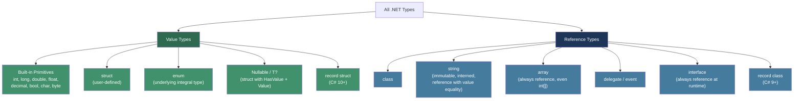
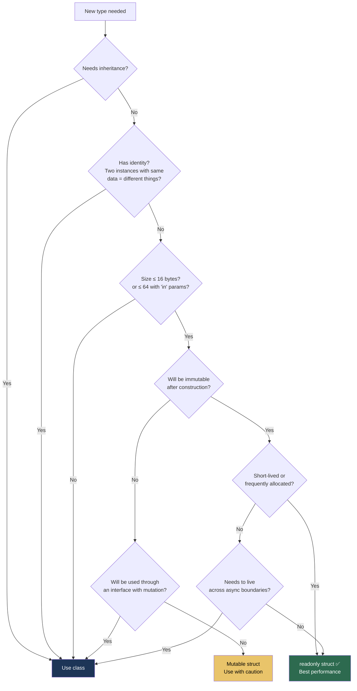

> [!success] Mastery Check
> - [ ] **Studied Well**
> - [ ] **Can explain the concept without notes**
> - [ ] **Can answer interview questions confidently**
> - [ ] **Can implement it in a real project**


## 📍 PART 0 — Navigation & Context

### Where This Topic Lives

```
C# Runtime Model
└── Type System
    ├── ► Value Types vs. Reference Types  ← YOU ARE HERE
    ├──   Generics (2.02)
    ├──   Nullable Reference Types (2.03)
    ├──   Records (2.05)
    ├──   Spans and Memory (2.09)
    └──   Performance / Zero-Alloc (2.15)
```

### What You Need Before This
- Basic understanding of the call stack and heap concepts
- Familiarity with C# primitive types (`int`, `string`, `bool`)

### What This Unlocks After
- Understanding GC pressure and why allocations matter
- Correct struct design for performance-critical code
- Diagnosing aliasing bugs in production
- Span\<T\> and Memory\<T\> (which only make sense after this)
- Interop and unsafe code (which requires understanding memory layout)

---

## 🧠 PART 1 — The Core Mental Model

### The Fundamental Rule (Say This Out Loud Until It Sticks)

> **Value types contain their data directly. Reference types contain a pointer to their data.**
> Copying a value type copies the data. Copying a reference type copies the address.

That one sentence is the root of everything else. Every consequence — boxing, aliasing, GC behavior, struct constraints — flows from this.

### The Plain-Language Model

Think of value types like a **house**: the thing itself is right there where you're standing. You pick it up and move it, you have a copy. If someone else has a copy, changing yours doesn't change theirs.

Think of reference types like a **map to a house**: what gets passed around is directions. If two people have the same map (reference), they're both looking at the same house. One person moves the furniture, the other person's map now leads to a house with moved furniture.

### The .NET Type Taxonomy



> [!WARNING] The Array Trap
> `int[]` is a **reference type**. This surprises many developers. The array variable is a pointer to a heap object that contains the integers. The integers themselves are stored as value types **inside** the heap array, but the array is a reference type.

---

## 🔬 PART 2 — Deep Mechanics

### 2.1 Memory Layout: What Actually Happens

```
━━━━━━━━━━━━━━━━━━━━━━━━━━━━━━━━━━━━━━━━━━━━━━━━━━━━━━━━━━━━━
SCENARIO: Method with local value type and reference type
━━━━━━━━━━━━━━━━━━━━━━━━━━━━━━━━━━━━━━━━━━━━━━━━━━━━━━━━━━━━━

void Example() {
    int x = 42;                    // value type
    Point p = new Point(1, 2);     // value type struct
    List<int> list = new List<int>(); // reference type
}

STACK (grows downward)            HEAP (managed by GC)
┌─────────────────────┐          ┌─────────────────────────────┐
│  [return address]   │          │                             │
├─────────────────────┤          │  List<int> object:          │
│  int x = 42         │  ┌──────►│  ┌─────────────────────┐    │
│  [4 bytes, raw]     │  │       │  │ ObjHeader  (8 bytes)│    │
├─────────────────────┤  │       │  │ TypePtr    (8 bytes)│    │
│  Point p:           │  │       │  │ _items     (IntPtr) │    │
│  X = 1  (4 bytes)   │  │       │  │ _size      (int)    │    │
│  Y = 2  (4 bytes)   │  │       │  │ _version   (int)    │    │
├─────────────────────┤  │       │  └─────────────────────┘    │
│  List<int> list ────┼──┘       │                             │
│  [8 bytes, pointer] │          └─────────────────────────────┘
└─────────────────────┘

Key observations:
• x and p: data lives directly in the stack frame
• list: only a POINTER (8 bytes) lives in the stack
  The actual List object lives on the heap
• When Example() returns, the stack frame is popped.
  x and p are gone instantly (no GC needed).
  The List object on the heap survives until GC collects it.
```

### 2.2 Copy Semantics — The Practical Consequence

```csharp
// ────────────────────────────────────────────────
// VALUE TYPE: Independent copies
// ────────────────────────────────────────────────
int a = 5;
int b = a;   // b receives a copy of the VALUE 5
b = 10;      // modifying b has ZERO effect on a

Console.WriteLine(a); // 5 — unchanged
Console.WriteLine(b); // 10

// ────────────────────────────────────────────────
// REFERENCE TYPE: Shared identity
// ────────────────────────────────────────────────
var list1 = new List<int> { 1, 2, 3 };
var list2 = list1;   // list2 receives a copy of the POINTER
                     // both variables now point to the SAME object

list2.Add(4);        // modifying through list2...

Console.WriteLine(list1.Count); // 4 — list1 also changed!
                                // There is only ONE List object.

// ────────────────────────────────────────────────
// METHOD PARAMETER SEMANTICS
// ────────────────────────────────────────────────
void ModifyValue(int x)      { x = 999; }  // modifies a COPY — caller unchanged
void ModifyRef(List<int> xs) { xs.Add(99); } // modifies the SHARED OBJECT — caller sees it

// But:
void ReplaceRef(List<int> xs) { xs = new List<int>(); } // reassigns LOCAL variable only
                                                         // caller's reference UNCHANGED
```

### 2.3 Where Value Types Actually Live — The Five Cases

This is the #1 misunderstood thing about value types. **"Value types live on the stack" is wrong.** The correct statement is:

> Value types are embedded wherever they are declared. The stack is just one of those places.

```
┌────────────────────────────────────────────────────────────────┐
│ Case 1: Local variable in a method                             │
│   void Foo() { int x = 5; }                                    │
│   → Stack (frame lifetime)                                     │
├────────────────────────────────────────────────────────────────┤
│ Case 2: Field of a class                                       │
│   class Foo { int x; }  // x is part of the class object       │
│   → Heap (embedded inside the class heap object)               │
├────────────────────────────────────────────────────────────────┤
│ Case 3: Field of a struct (that is itself a local)             │
│   struct Point { int X, Y; }                                   │
│   void Foo() { Point p; }  // p.X and p.Y are on the stack     │
│   → Stack (embedded in the struct which is on the stack)       │
├────────────────────────────────────────────────────────────────┤
│ Case 4: Captured by a lambda / anonymous method                │
│   int counter = 0;                                             │
│   Action inc = () => counter++;  // counter captured!          │
│   → Heap (promoted into a compiler-generated display class)    │
├────────────────────────────────────────────────────────────────┤
│ Case 5: Boxed to object or interface                           │
│   object boxed = 42;  // int copied to heap object wrapper     │
│   → Heap (inside a box wrapper object)                         │
└────────────────────────────────────────────────────────────────┘
```

> [!TIP] The Correct Mental Model
> Instead of thinking "value types → stack", think: **"value types are embedded at their declaration site."** A local variable's declaration site is the stack frame. A class field's declaration site is the heap object. An array element's declaration site is the heap array.

### 2.4 Boxing and Unboxing — The Hidden Allocation

Boxing is the process of wrapping a value type in a reference type heap object so it can be treated as `object` or an interface.

```csharp
int x = 42;        // Value on stack: [42]
object o = x;      // Boxing:
                   // 1. Allocates a new object on the heap: ~24 bytes
                   // 2. Copies the value 42 into that heap object
                   // 3. o is now a pointer to the heap object

int y = (int)o;    // Unboxing:
                   // 1. Verifies the heap object contains an int (type check)
                   // 2. Copies the int value out of the heap object back to stack
```

**The memory picture during boxing:**

```
Before boxing:           After boxing:
Stack: [42]              Stack: [pointer ──────────────┐]
                         Heap:                         └──►[ObjHeader][TypePtr][42]
                                                              ↑ ~24 bytes overhead
```

**IL code the compiler generates:**

```
// C#:  object o = x;
// IL:
ldloc.0       // push x onto evaluation stack
box int32     // box instruction: allocates heap wrapper, copies value
stloc.1       // store pointer in o

// C#:  int y = (int)o;
// IL:
ldloc.1       // push o (the pointer)
unbox.any int32 // type check + copy value out
stloc.2       // store in y
```

**Where boxing silently occurs in production code:**

```csharp
// ⚠️ These ALL silently box — each one allocates a heap object:

// 1. Passing a value type to an object parameter
Console.WriteLine(42);           // int → object → heap allocation

// 2. Non-generic collections (legacy code)
ArrayList list = new ArrayList();
list.Add(42);                    // boxes int

// 3. Casting to an interface
IComparable c = 42;              // boxes int — IComparable is an interface (reference)

// 4. String interpolation with value types (pre-.NET 6)
string s = $"Value: {42}";       // can box; .NET 6+ ISpanFormattable avoids this

// 5. LINQ on non-generic collections
// 6. lock(someValueType) — this IS an error, but shows the concept

// ✅ These do NOT box:
List<int> typed = new List<int>();
typed.Add(42);                   // generic: no boxing
int.TryFormat(...)               // Span-based: no boxing
```

---

## 💻 PART 3 — Production Code Patterns

### 3.1 Designing a Correct, Production-Quality Struct

A struct is appropriate when **all** of these are true:
1. Small size (≤ 16 bytes is the rule of thumb; beyond that, copy cost exceeds allocation savings)
2. Logically represents a single value (like a number, point, or coordinate)
3. Has no identity (two instances with the same data ARE equal)
4. Should be immutable after construction

```csharp
// ✅ PRODUCTION-QUALITY struct design
// Every decision here is deliberate — comments explain the why.

[StructLayout(LayoutKind.Sequential)] // Explicit layout for interop/memory control
public readonly struct Money : IEquatable<Money>, IComparable<Money>
{
    // readonly struct: ALL fields must be readonly.
    // Benefit: the JIT can skip "defensive copies" when calling methods
    // on the struct — see Part 5 for what defensive copies cost.
    public decimal Amount   { get; }
    public string  Currency { get; }  // string: immutable ref type — safe as field

    public Money(decimal amount, string currency)
    {
        // Validate at construction: once Money is built, it's guaranteed valid
        if (amount < 0)
            throw new ArgumentOutOfRangeException(nameof(amount), "Amount cannot be negative");
        Amount   = amount;
        Currency = currency?.ToUpperInvariant()
                   ?? throw new ArgumentNullException(nameof(currency));
    }

    // Value equality: two Moneys are equal if same amount + same currency
    // Must implement IEquatable<T> — avoids boxing when comparing in collections
    public bool Equals(Money other)
        => Amount == other.Amount && Currency == other.Currency;

    // Always override both — non-generic code calls object.Equals
    public override bool Equals(object? obj) => obj is Money m && Equals(m);

    // CRITICAL: if Equals returns true, GetHashCode MUST return the same value.
    // HashCode.Combine is the correct, well-distributed implementation.
    public override int GetHashCode() => HashCode.Combine(Amount, Currency);

    // Operators: delegate to Equals for consistency
    public static bool operator ==(Money a, Money b) => a.Equals(b);
    public static bool operator !=(Money a, Money b) => !a.Equals(b);

    // Arithmetic with business rule enforcement
    public static Money operator +(Money a, Money b)
    {
        if (a.Currency != b.Currency)
            throw new InvalidOperationException(
                $"Cannot add {a.Currency} and {b.Currency}");
        return new Money(a.Amount + b.Amount, a.Currency);
    }

    // Comparison: IComparable<T> makes struct sortable, works with SortedSet etc.
    public int CompareTo(Money other)
    {
        if (Currency != other.Currency)
            throw new InvalidOperationException(
                $"Cannot compare {Currency} and {other.Currency}");
        return Amount.CompareTo(other.Amount);
    }

    public override string ToString() => $"{Amount:N2} {Currency}";
}
```

### 3.2 The Aliasing Problem — Reference Type Bug

This is the most common bug caused by misunderstanding reference semantics. It appears in code reviews regularly.

```csharp
// ⚠️ ANTI-PATTERN: Caller's list is silently mutated
public static void SortBadly(List<int> items)
{
    items.Sort(); // You are modifying the CALLER's list!
                  // The parameter is a copy of the POINTER — not a copy of the data.
}

// Called like:
var myList = new List<int> { 3, 1, 2 };
SortBadly(myList);
// myList is now [1, 2, 3] — the caller never asked for this

// ✅ CORRECT: Return a new collection, or document mutation clearly
public static List<int> SortSafely(IEnumerable<int> items)
{
    var copy = new List<int>(items); // explicit new List: new heap object, copy of data
    copy.Sort();
    return copy; // caller's original is UNTOUCHED
}

// ✅ ALTERNATIVE: If mutation is intentional, document it
/// <remarks>Sorts <paramref name="items"/> in-place. The original list is modified.</remarks>
public static void SortInPlace(List<int> items) => items.Sort();
```

### 3.3 The Interface Boxing Mutation Bug

This is subtle and almost always causes a head-scratching debugging session.

```csharp
// The bug: assigning a struct to an interface BOXES IT
// Mutations go to the BOXED COPY, not the original struct

public interface ICounter { void Increment(); }

public struct Counter : ICounter
{
    public int Value;
    public void Increment() => Value++;
}

// ⚠️ The bug:
var counter = new Counter { Value = 0 };

ICounter boxed = counter;  // Boxing: a copy of counter is placed on the heap
                           // 'boxed' points to the heap copy
                           // 'counter' is still on the stack

boxed.Increment();         // Increments the HEAP COPY's Value

Console.WriteLine(counter.Value);  // Still 0! The original was never touched.
Console.WriteLine(((Counter)boxed).Value); // 1 — the heap copy has 1

// ✅ Fix: Don't use mutable structs with interfaces.
// Use a class, or use the concrete struct type for mutation.
```

### 3.4 The `readonly struct` and Defensive Copies

This is a senior-level point that separates deep practitioners.

```csharp
// When does the JIT make a "defensive copy"?
// When you call a method on a struct that is in a read-only context
// (e.g., a readonly field, an 'in' parameter),
// and the struct is NOT declared as 'readonly',
// the JIT has no guarantee the method won't mutate the struct.
// So it copies the struct before calling the method. Silently.

public struct MutablePoint
{
    public int X, Y;
    public int Sum() => X + Y;   // Non-mutating, but compiler doesn't know that
}

public class Container
{
    private readonly MutablePoint _point = new MutablePoint { X = 1, Y = 2 };

    public int GetSum()
    {
        // ⚠️ The JIT copies _point before calling Sum()
        // because _point is readonly and MutablePoint is NOT a readonly struct.
        // The JIT cannot trust that Sum() won't modify _point.
        return _point.Sum(); // Hidden copy here!
    }
}

// ✅ Fix: mark the struct as readonly
public readonly struct ImmutablePoint
{
    public int X { get; }
    public int Y { get; }
    public ImmutablePoint(int x, int y) { X = x; Y = y; }
    public int Sum() => X + Y;  // JIT knows no mutation possible → NO defensive copy
}
```

### 3.5 `ref struct` — Stack-Only Types

`ref struct` is a struct that is GUARANTEED to live on the stack. This is how `Span<T>` is implemented.

```csharp
// ref struct constraints:
// • Cannot be stored as a field in a class or non-ref-struct
// • Cannot be boxed (cannot be assigned to object or interface)
// • Cannot be captured by lambdas
// • Cannot be used in async methods (would need to survive await across threads)
// • Cannot implement interfaces

public ref struct StackOnlyParser
{
    private ReadOnlySpan<char> _remaining;

    public StackOnlyParser(ReadOnlySpan<char> input) => _remaining = input;

    public bool TryReadNext(out ReadOnlySpan<char> token)
    {
        if (_remaining.IsEmpty) { token = default; return false; }
        int idx = _remaining.IndexOf(',');
        if (idx < 0)
        {
            token = _remaining;
            _remaining = ReadOnlySpan<char>.Empty;
        }
        else
        {
            token = _remaining[..idx];
            _remaining = _remaining[(idx + 1)..];
        }
        return true;
    }
}

// Usage: zero heap allocation parsing
void ParseCsv(string line)
{
    var parser = new StackOnlyParser(line.AsSpan());
    while (parser.TryReadNext(out var token))
        Process(token);
}
```

### 3.6 `ref` Returns and `in` Parameters

```csharp
// 'in' parameter: pass by reference, but READ-ONLY.
// For large structs: avoids the copy cost of pass-by-value.
// For readonly structs: JIT may optimize to pass by reference automatically.

public readonly struct LargeStruct
{
    public readonly double A, B, C, D, E, F, G, H; // 64 bytes
}

// Without 'in': 64 bytes copied on every call
public static double SumByCopy(LargeStruct s) => s.A + s.B + s.C + s.D;

// With 'in': pointer passed, no copy
public static double SumByRef(in LargeStruct s) => s.A + s.B + s.C + s.D;

// ref return: return a reference to an embedded value type field
// Allows modification without copying
public class StructContainer
{
    private LargeStruct _data;

    // Returns a reference to _data — caller can modify it in place
    public ref LargeStruct GetDataRef() => ref _data;
}

// Usage:
var container = new StructContainer();
ref LargeStruct data = ref container.GetDataRef();
data.A = 42; // Modifies _data.A DIRECTLY inside the container object
             // Zero copy. Zero allocation.
```

---

## ⚠️ PART 4 — Gotchas & Anti-Patterns

### Gotcha 1: Mutating a Struct in a Collection

```csharp
// ⚠️ WRONG: This doesn't compile, but the intent shows the misunderstanding
var points = new List<Point> { new Point(1, 2) };
// points[0].X = 10; // Compile error: "Cannot modify the return value"
                     // points[0] returns a COPY of the struct

// ✅ You must replace the whole element:
points[0] = new Point(10, points[0].Y);

// Or use an array, which allows indexed ref access:
var arr = new Point[] { new Point(1, 2) };
arr[0].X = 10; // OK with arrays
```

### Gotcha 2: Struct in a foreach Loop

```csharp
// foreach always gives you a COPY of each element for value types
var points = new List<Point> { new Point(1, 2), new Point(3, 4) };

foreach (var p in points)
{
    // p is a COPY — p.X = 10 would not compile for readonly, 
    // and wouldn't affect the list even if it did
}

// ✅ If you need modification, use a for loop with index
for (int i = 0; i < points.Count; i++)
    points[i] = new Point(points[i].X * 2, points[i].Y * 2);
```

### Gotcha 3: Default Value of Structs

```csharp
// ALL structs have a default(T) value: all fields zeroed.
// There is no way to prevent default construction.
// This is why struct validation belongs in your codebase, not the struct constructor.

var m = default(Money); // valid syntax — Amount = 0, Currency = null!
// m.Currency is null — even though our constructor prevents null!

// The defense: guard against default at usage sites, not just construction
bool IsValid(Money m) => m.Currency != null && m.Amount >= 0;
```

### Gotcha 4: Struct Equality by Default

```csharp
// Without IEquatable<T>, struct equality uses reflection to compare all fields.
// This is SLOW and allocates.
// Always implement IEquatable<T> on structs used in collections.

public struct BadPoint { public int X, Y; }

// These use the slow, reflection-based default:
var p1 = new BadPoint { X = 1, Y = 2 };
var p2 = new BadPoint { X = 1, Y = 2 };
bool equal = p1.Equals(p2); // True, but uses ValueType.Equals (reflection)
int hash = p1.GetHashCode(); // Also slow

// ✅ Always override for structs used in Dictionary/HashSet keys:
public struct GoodPoint : IEquatable<GoodPoint>
{
    public int X, Y;
    public bool Equals(GoodPoint other) => X == other.X && Y == other.Y;
    public override bool Equals(object? obj) => obj is GoodPoint p && Equals(p);
    public override int GetHashCode() => HashCode.Combine(X, Y);
}
```

### Gotcha 5: Large Struct as Method Parameter

```csharp
// A struct is copied on every method call (unless using ref/in).
// A 128-byte struct passed to 10,000 calls = 1.28 MB of pointless copying.

// Rule: if your struct is > 16 bytes, consider:
// 1. Using 'in' parameter (pass by readonly reference)
// 2. Redesigning as a smaller struct
// 3. Making it a class instead

[StructLayout(LayoutKind.Sequential)]
public struct Matrix4x4
{
    // 16 floats = 64 bytes
    public float M00, M01, M02, M03;
    public float M10, M11, M12, M13;
    public float M20, M21, M22, M23;
    public float M30, M31, M32, M33;
}

// ⚠️ SLOW: copies 64 bytes on each call
public static float Trace(Matrix4x4 m) => m.M00 + m.M11 + m.M22 + m.M33;

// ✅ FAST: passes a pointer (8 bytes), no copy
public static float Trace(in Matrix4x4 m) => m.M00 + m.M11 + m.M22 + m.M33;
```

---

## 📊 PART 5 — Performance Implications

### 5.1 Allocation Characteristics

```
┌──────────────────────────────────────────────────────────────────┐
│                    ALLOCATION COST COMPARISON                    │
├─────────────────────────────┬────────────────────────────────────┤
│ Scenario                    │ Allocation Behavior                │
├─────────────────────────────┼────────────────────────────────────┤
│ Local struct variable       │ Zero heap allocation               │
│ Local class variable        │ Heap allocation (24+ bytes min)    │
│ Struct in class field       │ Embedded in class object (no extra)│
│ Array of struct             │ One allocation for the whole array │
│ Array of class              │ N+1 allocations (array + each obj) │
│ Boxing int to object        │ One heap allocation (~24 bytes)    │
│ Generic List<int>           │ No boxing                          │
│ Non-generic ArrayList       │ Boxes every int                    │
│ Struct to interface cast    │ One heap allocation (boxing)       │
│ struct with readonly        │ JIT may eliminate defensive copies │
└─────────────────────────────┴────────────────────────────────────┘
```

### 5.2 BenchmarkDotNet: Struct vs Class

```csharp
// Benchmark results (approximate, .NET 8, x64):
// ┌──────────────────┬────────────┬──────────┬───────────┐
// │ Method           │ Mean       │ Alloc    │ Gen 0     │
// ├──────────────────┼────────────┼──────────┼───────────┤
// │ CreateClass      │ 45.2 ns    │ 32 B     │ 0.0024    │
// │ CreateStruct     │ 1.8 ns     │ 0 B      │ -         │
// │ ListOfClass      │ 850 μs     │ 800 KB   │ very high │
// │ ListOfStruct     │ 120 μs     │ 40 KB    │ minimal   │
// │ BoxInt           │ 12.3 ns    │ 24 B     │ 0.0011    │
// │ GenericInt       │ 0.4 ns     │ 0 B      │ -         │
// └──────────────────┴────────────┴──────────┴───────────┘

[MemoryDiagnoser]
[BenchmarkCategory("ValueTypes")]
public class ValueTypeAllocationBenchmark
{
    private const int N = 10_000;

    [Benchmark(Baseline = true)]
    public List<PointClass> CreateClassList()
    {
        var list = new List<PointClass>(N);
        for (int i = 0; i < N; i++)
            list.Add(new PointClass(i, i));   // N heap allocations
        return list;
    }

    [Benchmark]
    public List<PointStruct> CreateStructList()
    {
        var list = new List<PointStruct>(N);
        for (int i = 0; i < N; i++)
            list.Add(new PointStruct(i, i));  // ZERO extra heap allocations
                                               // Data embedded in List's internal array
        return list;
    }

    [Benchmark]
    public int BoxingLoop()
    {
        int sum = 0;
        for (int i = 0; i < N; i++)
        {
            object boxed = i;         // N heap allocations!
            sum += (int)boxed;
        }
        return sum;
    }

    [Benchmark]
    public int GenericLoop()
    {
        int sum = 0;
        var list = new List<int>(N);
        for (int i = 0; i < N; i++)
            list.Add(i);              // zero boxing, zero extra allocations
        foreach (int i in list)
            sum += i;
        return sum;
    }
}

record class PointClass(int X, int Y);
record struct PointStruct(int X, int Y);
```

### 5.3 When to Choose: Decision Factors

```
CHOOSE struct WHEN:
  ✅ Small (≤ 16 bytes, absolute max 64 bytes with 'in' params)
  ✅ Immutable by design (use readonly struct)
  ✅ No identity required (two instances with same data = equal)
  ✅ Short-lived (will not survive into Gen1/Gen2 GC)
  ✅ Frequently allocated (avoiding heap allocation is the goal)
  ✅ High-frequency math/game loops, SIMD-style operations
  ✅ Embedded in arrays or other structs for cache locality

CHOOSE class WHEN:
  ✅ Needs inheritance
  ✅ Has identity separate from its values (two users with same name ≠ same user)
  ✅ Large or variable size
  ✅ Needs to implement interfaces AND be mutated through them
  ✅ Lifetime is long or unpredictable
  ✅ Needs to be shared and mutated across multiple references
  ✅ > 64 bytes (copy overhead exceeds allocation savings)
```

---

## 🎤 PART 6 — Interview Arsenal

### 6.1 The Core Questions and How to Answer Them

---

> **Q: "What's the difference between value types and reference types in C#?"**

**Average answer:** "Value types are stored on the stack and reference types are stored on the heap."

**Why that's wrong:** It's partially true but fundamentally misleading. It will get challenged.

**Great answer (say this):**
> "The fundamental difference is storage semantics, not storage location. Value types store their data directly — wherever the variable is declared, the data is right there. Reference types store a pointer to heap-allocated data. The practical consequence is copy semantics: copying a value type copies the actual data so you get two independent copies; copying a reference type copies the pointer so both variables point to the same underlying object. About the stack vs heap — that's only one piece. A value type field in a class lives on the heap inside that class object. A value type captured by a lambda gets promoted to the heap. The correct mental model is: value types are embedded at their declaration site."

---

> **Q: "What is boxing and why does it matter in production code?"**

**Great answer:**
> "Boxing is the runtime process of wrapping a value type in a heap-allocated object wrapper so it can be treated as `object` or an interface. The cost is real: a heap allocation, typically 24 bytes of overhead, plus an eventual GC collection. It matters in hot paths. Classic sources: non-generic collections like `ArrayList`, passing value types to `object` parameters, casting structs to interfaces, and string interpolation before .NET 6's `ISpanFormattable` support. The fix is always generics — `List<int>` instead of `ArrayList`, `IEquatable<T>` instead of `object.Equals`. I look for boxing in BenchmarkDotNet's allocation column — if a hot-path method allocates unexpectedly, boxing is usually the culprit."

---

> **Q: "When would you use a struct over a class?"**

**Great answer:**
> "I think about four criteria. First: is it small? If it's more than 16-ish bytes, the copy overhead starts exceeding the allocation savings — though you can push this to 64 bytes with `in` parameters. Second: should it be immutable? The best structs are `readonly struct` — it gives the JIT permission to skip defensive copies. Third: does it have value semantics — is equality about data rather than identity? A `Money` amount with currency makes sense as a struct. A `User` does not, because two different user objects with the same name are different users. Fourth: is it short-lived or frequently allocated? Structs that die with the stack frame put zero pressure on the GC. If all four are yes, struct. If any is a firm no, class."

---

> **Q: "What is a readonly struct and what optimization does it enable?"**

**Great answer:**
> "A `readonly struct` is a struct where the compiler enforces that all fields are readonly. The important optimization it enables is eliminating defensive copies. When the JIT calls a method on a struct that's in a readonly context — like a `readonly` field in a class, or an `in` parameter — and the struct is not marked `readonly`, the JIT can't know whether the method will mutate the struct. So it copies the struct before the call, just in case. This happens silently and can cause significant overhead in tight loops. When the struct is declared `readonly`, the JIT has a guarantee: no mutation possible. No defensive copy needed. This matters most for larger structs and structs whose methods get called in hot paths."

---

> **Q: "What is a ref struct and what are its constraints?"**

**Great answer:**
> "A `ref struct` is a struct that is guaranteed to live only on the stack. It can never be boxed, never be assigned to an interface or `object`, never be stored in a class field, and never be used across an `await` boundary. `Span<T>` and `ReadOnlySpan<T>` are the canonical examples. The constraint exists because the GC doesn't need to track it — it cannot escape to the heap, so its lifetime is bounded by the stack frame. This makes it perfect for high-performance parsing and buffer slicing because you can wrap arbitrary memory — stack, heap, or native — without any allocation."

---

### 6.2 The Trick Questions

> [!WARNING] Watch Out For These

**"Can a value type be null?"**
Answer: Not natively, but `Nullable<T>` (or `T?`) is a struct with a `HasValue` flag that simulates nullability. It's a value type itself — no heap allocation. `int?` and `Nullable<int>` are identical.

**"Where does a value type field of a class live?"**
Answer: On the heap, embedded inside the class object. NOT on the stack. This is the most common misconception.

**"Is string a value type or reference type?"**
Answer: Reference type. But it has value semantics — `==` compares content, not identity. Interning means two identical literals may share the same heap object. But structurally, `string` is a class.

**"What happens when you assign a value type to an interface variable?"**
Answer: Boxing. The value type is copied to a new heap object. The interface variable holds a pointer to that heap copy. Mutations through the interface go to the copy, not the original.

**"Can you avoid GC pressure entirely with value types?"**
Answer: For stack-local value types, yes. But if a value type outlives its stack frame (captured by lambda, stored in a class field, put in a collection), it eventually hits the heap anyway.

---

### 6.3 Interview Red Flags to Avoid

```
❌ "Value types are always on the stack" — incorrect and will be challenged
❌ "Boxing is just a type cast" — boxing allocates; it's not free
❌ "You should always use structs for performance" — structs can hurt perf (large copies)
❌ "readonly just means you can't reassign the variable" — for readonly struct it's deeper
❌ Confusing Nullable<T> (value type) with nullable reference types (compiler annotation)
❌ Forgetting to implement IEquatable<T> when overriding Equals on a struct
```

---

## 🔀 PART 7 — Decision Framework



---

## ✅ PART 8 — Self-Check

### Conceptual Questions

Answer these in writing. If you can't, that's the gap to fill.

1. A method takes a `List<int>` parameter and adds an element to it. The caller's list changes. Why? What would need to change to prevent that?

2. A struct has a field `int[] Data`. Is this struct a value type? Where does `Data` live — stack or heap?

3. You have `readonly MyStruct field` in a class. The struct is NOT declared `readonly`. You call `field.SomeMethod()`. What extra work does the JIT do, and how do you eliminate it?

4. Why does `IComparable c = someInt;` allocate on the heap?

5. You have a `Counter` struct with `public int Value; public void Increment() => Value++;`. You cast it to `ICounter` and call `Increment()`. The `Value` is still 0. Explain exactly what happened in terms of memory.

6. What is the default value of `Money` (from Part 3.1)? Is it valid? How should you handle this in production code?

7. A `ref struct` cannot be used in an `async` method. Why not? Think about what `async` does under the hood.

8. You see `Allocated: 24 B` in BenchmarkDotNet for a method that takes an `int` parameter and passes it to a function accepting `object`. Where does the 24 bytes go?

### Code Puzzles

**Puzzle 1:** What is printed?
```csharp
struct Counter { public int Value; public void Inc() => Value++; }
var c = new Counter();
var list = new List<Counter> { c };
list[0].Inc(); // Does this compile? What happens?
Console.WriteLine(c.Value);
Console.WriteLine(list[0].Value);
```

**Puzzle 2:** What is printed?
```csharp
int x = 5;
object o = x;       // boxing
x = 10;
Console.WriteLine((int)o); // What value?
```

**Puzzle 3:** Is there a boxing allocation here?
```csharp
readonly struct Point : IEquatable<Point>
{
    public int X, Y;
    public bool Equals(Point other) => X == other.X && Y == other.Y;
    public override bool Equals(object? obj) => obj is Point p && Equals(p);
    public override int GetHashCode() => HashCode.Combine(X, Y);
}

var set = new HashSet<Point>();
set.Add(new Point { X = 1, Y = 2 });
bool found = set.Contains(new Point { X = 1, Y = 2 });
```

**Puzzle 4:** Find the performance bug:
```csharp
public interface IProcessor { void Process(); }
public struct DataProcessor : IProcessor
{
    public int ProcessedCount;
    public void Process() => ProcessedCount++;
}

public static void RunAll(IProcessor[] processors)
{
    foreach (var p in processors)
        p.Process();
}
```

**Puzzle 5:** Which of these allocates?
```csharp
// A:
int x = 42;
string s = $"Value: {x}"; // .NET 8

// B:
int y = 42;
object o = y;

// C:
var list = new List<int>();
list.Add(42);

// D:
IComparable c = 42;

// E:
Span<int> span = stackalloc int[10];
span[0] = 42;
```

<details>
<summary>Answers (expand after trying)</summary>

**Puzzle 1:** `list[0].Inc()` compiles but `Inc()` modifies a temporary copy (list indexer returns a copy). `c.Value = 0`, `list[0].Value = 0`. Neither changed.

**Puzzle 2:** `5`. Boxing copies the value at the moment of boxing. Changing `x` afterward doesn't affect the boxed copy.

**Puzzle 3:** No boxing. `HashSet<Point>` is generic, uses `IEquatable<Point>` which the struct implements. No boxing path is taken.

**Puzzle 4:** The `IProcessor[]` array contains boxed copies. `p.Process()` calls on those boxed copies. The original `DataProcessor` structs are never modified. Also, the array itself contains boxed values (object references pointing to heap-boxed DataProcessor instances).

**Puzzle 5:** A: No (ISpanFormattable / TryFormat in .NET 8). B: Yes (boxing). C: No (generic). D: Yes (boxing). E: No (stackalloc).

</details>

---

## 🔗 PART 9 — Connections & Resources

### Related Topics in This Vault

| Topic | Why It Connects |
|-------|----------------|
| [[2.02 — Generics and the Type System]] | Generics avoid boxing by being reified at the JIT level |
| [[2.03 — Nullable Reference Types]] | NRT is a compile-time annotation; `Nullable<T>` is a struct — different concepts |
| [[2.05 — Records]] | `record struct` vs `record class` — value equality on value types vs reference types |
| [[2.09 — Spans, Memory, and Zero-Copy Patterns]] | `Span<T>` is a `ref struct`; understanding ref struct requires this topic |
| [[2.15 — Performance — Zero-Allocation Patterns]] | Zero-alloc strategies depend heavily on knowing when structs help vs hurt |
| [[2.16 — IDisposable and Resource Management]] | Finalizers and structs — structs cannot have finalizers; resource ownership patterns |
| [[2.23 — Threading Primitives]] | `volatile` and `Interlocked` operate on value types in memory |
| [[2.28 — GC Interaction and WeakReference]] | Generational GC — why class allocations cost more over time |

### Books

| Book | Chapters | Why |
|------|----------|-----|
| CLR via C# — Jeffrey Richter | Ch. 4, 5, 20 | The definitive source on type internals and GC |
| C# in Depth — Jon Skeet | Ch. 2, 3, 17 | Language semantics explained at depth |
| Pro .NET Memory Management — Konrad Kokosa | Ch. 3, 4 | Allocation cost, GC generations, struct impact |

### Articles & Docs

- [Microsoft Docs: Value Types](https://learn.microsoft.com/en-us/dotnet/csharp/language-reference/builtin-types/value-types)
- [Microsoft Docs: Choosing Between Class and Struct](https://learn.microsoft.com/en-us/dotnet/standard/design-guidelines/choosing-between-class-and-struct)
- [Stephen Toub: Boxing and Performance](https://devblogs.microsoft.com/dotnet/avoiding-boxing-in-a-generic-method/)
- [Adam Sitnik: Value Types Internals](https://adamsitnik.com/Value-Types-vs-Reference-Types/)
- [Performance Best Practices: Struct Design](https://learn.microsoft.com/en-us/dotnet/core/extensions/high-performance-struct)

---

> [!NOTE] Template Meta-Note
> **This file is the template.** Every section here maps to a reusable slot:
> - Part 0: Navigation (same across all topics)
> - Part 1: Core mental model (one paragraph + taxonomy diagram)
> - Part 2: Deep mechanics (memory diagrams + IL/runtime behavior)
> - Part 3: Production code (annotated, opinionated, real patterns)
> - Part 4: Gotchas (wrong → right → why)
> - Part 5: Performance (benchmarks + decision table)
> - Part 6: Interview arsenal (questions + great answers + red flags)
> - Part 7: Decision framework (flowchart)
> - Part 8: Self-check (questions + code puzzles)
> - Part 9: Connections (wiki links + resources)
>
> To create the next topic note, copy this structure and fill each section. The quality bar: every section should make you better at interviews AND better at production code.

---
*Last updated: 2026-06 · Domain: C# Language Mastery · Topic: 2.01*
