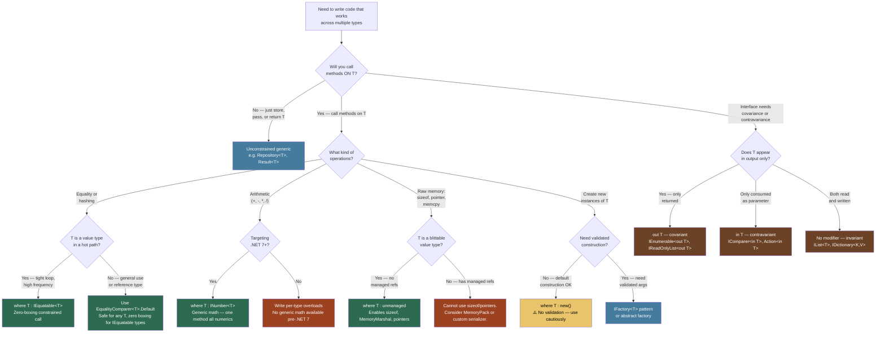

> [!success] Mastery Check
> - [ ] **Studied Well**
> - [ ] **Can explain the concept without notes**
> - [ ] **Can answer interview questions confidently**
> - [ ] **Can implement it in a real project**


# 2.02 — Generics and the Type System

> [!IMPORTANT] Why This Note Exists If your mental model of generics stops at "type-safe collections," you will fail every deep interview question and write code that boxes silently in hot paths. Every production system that achieves zero-allocation hot paths does so because someone understood what the JIT actually does with a generic type parameter. This note teaches you the runtime mechanism, not the syntax.

---

## 📍 PART 0 — Navigation & Context

### Where This Topic Lives

```
C# Runtime Model
└── Type System
    ├──   Value Types vs. Reference Types (2.01)  ← prerequisite
    ├── ► Generics and the Type System             ← YOU ARE HERE
    ├──   Nullable Reference Types (2.03)
    ├──   Records (2.05)
    ├──   LINQ — Execution Model (2.06)
    │     └── built entirely on generic interfaces and methods
    ├──   Spans and Memory (2.09)
    │     └── unmanaged constraint + ref struct generics
    └──   Performance / Zero-Alloc (2.15)
          └── reified generics are the primary boxing-elimination mechanism
```

### What You Need Before This

- **[[2.16.Value Types vs. Reference Types]]** — the JIT reification model behaves fundamentally differently for value types vs reference types; you must understand boxing before generics make full sense
- Interface and virtual dispatch concepts — generic constraints interact directly with how the CLR resolves interface method calls
- Basic familiarity with `List<T>`, `Dictionary<K,V>` — you already use generics; this note explains what the CLR does with them

### What This Unlocks After

- **[[2.06 — LINQ — Execution Model]]** — all LINQ operators (`Where<T>`, `Select<T,R>`) are generic methods; deferred execution only makes sense after this
- **[[2.09 — Spans, Memory, and Zero-Copy Patterns]]** — the `unmanaged` constraint is what enables `Span<T>`-based binary parsing; ref struct generics require this foundation
- **[[2.22 — Collections — Internals and Selection Guide]]** — `Dictionary<K,V>` correctness depends on `IEquatable<T>` constraints; collection internals depend on T's layout
- **[[2.15 — Performance — Zero-Allocation Patterns]]** — per-type static caching and reified generics are the two primary zero-alloc tools

### Why This Matters at Scale

Every hot path in a production system that avoids boxing — a payment processor at 50,000 transactions/second, a game engine updating 10,000 entities per frame, a messaging broker routing 1M events/minute — relies on the JIT reification model that generics enable. The difference between `ArrayList` and `List<int>` is not academic: it is 15 ns vs 2 ns per element and zero vs 24 bytes of GC-collected garbage per operation, compounded across millions of calls.

---

## 🧠 PART 1 — The Core Mental Model

### The Fundamental Rule

> **The CLR creates a separate native code body for each value-type instantiation of a generic, but shares one body across all reference-type instantiations. The practical consequence is that `List<int>` never boxes its elements — the JIT-generated code knows the exact four-byte layout of `int` and works with it directly, while `ArrayList` must box every element because it only knows `object`.**

### The Plain-Language Analogy

Think of a generic type as a **stamping machine with an adjustable die**. The die is the type parameter T. For **reference-type materials** — objects, strings, any class — every shape is physically the same: an eight-byte memory address. The machine can run the exact same program regardless of which shape the pointer points to, so one set of machine instructions handles all of them. For **value-type materials** — int, double, a custom struct — each shape has a different physical size: a four-byte die, an eight-byte die, a twenty-four-byte die. The machine must be re-tooled for each distinct size. Crucially, the machine never needs to wrap a metal piece in a plastic bag to process it — it works with the raw material directly. That plastic wrap is exactly what boxing does, and the generic stamping machine eliminates it by knowing the exact dimensions of its input at code-generation time.

### The Full Taxonomy

```mermaid
graph TD
    A["C# Generics"] --> B["Generic Declarations"]
    A --> C["Type Constraints"]
    A --> D["Variance\n(interfaces and delegates only)"]
    A --> E["JIT Runtime Model"]

    B --> B1["Generic Classes\nList&lt;T&gt;, Dictionary&lt;K,V&gt;"]
    B --> B2["Generic Interfaces\nIEnumerable&lt;T&gt;, IComparer&lt;T&gt;"]
    B --> B3["Generic Methods\nstatic T Max&lt;T&gt;(T a, T b)"]
    B --> B4["Generic Delegates\nFunc&lt;T,R&gt;, Predicate&lt;T&gt;"]
    B --> B5["Generic Structs\nNullable&lt;T&gt;, ReadOnlySpan&lt;T&gt;"]

    C --> C1["Type-Family Constraints\nwhere T : struct\nwhere T : class\nwhere T : notnull"]
    C --> C2["Constructor Constraint\nwhere T : new()"]
    C --> C3["Inheritance Constraints\nwhere T : BaseClass\nwhere T : IInterface"]
    C --> C4["Unmanaged Constraint\nwhere T : unmanaged\n(blittable, no managed refs)\nenables sizeof, pointers"]
    C --> C5["Generic Math (.NET 7+)\nwhere T : INumber&lt;T&gt;\nwhere T : IAdditionOperators&lt;T,T,T&gt;"]

    D --> D1["Covariance  (out T)\nIEnumerable&lt;out T&gt;\nIReadOnlyList&lt;out T&gt;\nFunc&lt;out TResult&gt;\n→ T in output positions only"]
    D --> D2["Contravariance (in T)\nIComparer&lt;in T&gt;\nIEqualityComparer&lt;in T&gt;\nAction&lt;in T&gt;\n→ T in input positions only"]
    D --> D3["Invariance (no modifier)\nIList&lt;T&gt;, IDictionary&lt;K,V&gt;\n→ T in both positions"]

    E --> E1["Value-Type Instantiation\nSeparate JIT code per T\nList&lt;int&gt; ≠ List&lt;long&gt; ≠ List&lt;double&gt;"]
    E --> E2["Reference-Type Instantiation\nShared JIT code\nList&lt;string&gt; ≡ List&lt;Order&gt; (same machine code)"]
    E --> E3["Open Generic Types\ntypeof(List&lt;&gt;)\nUsed in DI registration and reflection"]
    E --> E4["Per-Type Static Fields\nCache&lt;T&gt;.Default is unique per T\nComparer&lt;T&gt;.Default pattern"]

    style B fill:#1d3557,color:#fff
    style C fill:#2d6a4f,color:#fff
    style D fill:#6b4226,color:#fff
    style E fill:#4a1942,color:#fff
    style B1 fill:#457b9d,color:#fff
    style B2 fill:#457b9d,color:#fff
    style B3 fill:#457b9d,color:#fff
    style B4 fill:#457b9d,color:#fff
    style B5 fill:#457b9d,color:#fff
    style C1 fill:#40916c,color:#fff
    style C2 fill:#40916c,color:#fff
    style C3 fill:#40916c,color:#fff
    style C4 fill:#40916c,color:#fff
    style C5 fill:#40916c,color:#fff
    style D1 fill:#8b5a2b,color:#fff
    style D2 fill:#8b5a2b,color:#fff
    style D3 fill:#8b5a2b,color:#fff
    style E1 fill:#7b2d8b,color:#fff
    style E2 fill:#7b2d8b,color:#fff
    style E3 fill:#7b2d8b,color:#fff
    style E4 fill:#7b2d8b,color:#fff
```



---

## 🔬 PART 2 — Deep Mechanics

### 2.1 — JIT Reification: The Two-Path Model

The CLR preserves generic type information in IL — it is never erased. When the JIT first encounters a closed generic instantiation (e.g., the first call to `List<int>.Add`), it makes a permanent code-generation decision:

```
━━━━━━━━━━━━━━━━━━━━━━━━━━━━━━━━━━━━━━━━━━━━━━━━━━━━━━━━━━━━━━━━━━━
REIFICATION DECISION: JIT compiles List<T>.Add for the first time
━━━━━━━━━━━━━━━━━━━━━━━━━━━━━━━━━━━━━━━━━━━━━━━━━━━━━━━━━━━━━━━━━━━

Call: List<int>.Add(42)
  ├── T = int   (value type, 4 bytes)
  ├── JIT generates a UNIQUE native code body for List<int>
  │     Stack layout:   argument occupies 4 bytes
  │     Array stride:   index * 4  (baked as constant)
  │     Copy opcode:    4-byte move (MOV DWORD PTR)
  │     box instruction: ABSENT — zero heap allocations
  └── Cached as: NativeCode[List<int>.Add]        ← UNIQUE

Call: List<double>.Add(3.14)
  ├── T = double  (value type, 8 bytes)
  ├── JIT generates a DIFFERENT unique native code body
  │     Stack layout:   argument occupies 8 bytes
  │     Array stride:   index * 8  (different constant)
  │     Copy opcode:    8-byte move (MOVSD)
  └── Cached as: NativeCode[List<double>.Add]     ← UNIQUE (different from int)

Call: List<string>.Add("hello")
  ├── T = string  (reference type, 8-byte pointer on x64)
  ├── JIT checks: any reference-type body for List<T>.Add?
  │     → NO: generate it now
  │     Stack layout:   argument occupies 8 bytes (pointer)
  │     Array stride:   index * 8  (all refs same size)
  │     Copy opcode:    8-byte pointer move + GC write barrier
  └── Cached as: NativeCode[List<ref>.Add]        ← SHARED

Call: List<Order>.Add(order)
  ├── T = Order  (reference type)
  ├── JIT checks: any reference-type body for List<T>.Add?
  │     → YES: reuse the one generated for string!
  └── Reuses: NativeCode[List<ref>.Add]           ← SAME machine code

━━━━━━━━━━━━━━━━━━━━━━━━━━━━━━━━━━━━━━━━━━━━━━━━━━━━━━━━━━━━━━━━━━━
RESULT after using List<int>, List<double>, List<string>, List<Order>:
  Native code bodies generated:  3
    • One for int    (value-type specialization)
    • One for double (value-type specialization)
    • One shared for string + Order + every other reference type
━━━━━━━━━━━━━━━━━━━━━━━━━━━━━━━━━━━━━━━━━━━━━━━━━━━━━━━━━━━━━━━━━━━
JIT compile cost: ~0.1–2 ms per unique value-type instantiation (one-time).
Per-call cost after JIT: ~0 ns overhead vs non-generic equivalent.
```

> [!NOTE] NativeAOT and Blazor WASM Consequence In ahead-of-time compilation (NativeAOT, Blazor WASM), there is no JIT at runtime. Every generic instantiation you use must be resolved at publish time. Unbounded open-generic reflection (`MakeGenericType` at runtime) fails or requires explicit `[DynamicDependency]` attributes. This is the hidden cost of generic flexibility in AOT scenarios.

### 2.2 — IL-Level: The `constrained.` Prefix That Eliminates Boxing

The way generics avoid boxing when calling interface methods on T is not through the type parameter alone — it is through a specific IL instruction prefix the compiler emits: `constrained.`

```
━━━━━━━━━━━━━━━━━━━━━━━━━━━━━━━━━━━━━━━━━━━━━━━━━━━━━━━━━━━━━━━━━━━
SCENARIO: Calling CompareTo inside a generic method
━━━━━━━━━━━━━━━━━━━━━━━━━━━━━━━━━━━━━━━━━━━━━━━━━━━━━━━━━━━━━━━━━━━

C# source:
    public static T Max<T>(T a, T b) where T : IComparable<T>
        => a.CompareTo(b) >= 0 ? a : b;

IL generated by the compiler:
    .method public static !!T Max<([mscorlib]IComparable`1<!!T>) T>(!!T a, !!T b)
    {
        ldarg.0                       // push a
        ldarg.1                       // push b
        constrained. !!T              // ← THE KEY INSTRUCTION
        callvirt instance int32
            IComparable`1<!!T>::CompareTo(!0)
        ...
    }

What constrained. does at JIT time:
  If !!T is a VALUE TYPE (e.g., int):
    → JIT calls int.CompareTo(int) DIRECTLY — no boxing
    → CPU executes: CMP EAX, ECX  (one instruction)
    → Cost: ~1 ns, zero allocation

  If !!T is a REFERENCE TYPE (e.g., string):
    → JIT dereferences the pointer, uses normal virtual dispatch
    → Cost: ~3–5 ns (vtable lookup), zero extra allocation

━━━━━━━━━━━━━━━━━━━━━━━━━━━━━━━━━━━━━━━━━━━━━━━━━━━━━━━━━━━━━━━━━━━
CONTRAST: Without the IComparable<T> constraint, calling a.Equals(b)
on UNCONSTRAINED T = int:
    IL:
        ldarg.0
        box !!T    ← allocates a heap wrapper for the int (~24 bytes)
        ldarg.1
        box !!T    ← second allocation if the method takes object
        callvirt instance bool [mscorlib]System.Object::Equals(object)

    Cost: ~15 ns, 24–48 bytes heap allocated per call
━━━━━━━━━━━━━━━━━━━━━━━━━━━━━━━━━━━━━━━━━━━━━━━━━━━━━━━━━━━━━━━━━━━
```

> [!WARNING] The Unconstrained Generic Equals Trap `a.Equals(b)` in a generic method with no constraint on T boxes `a` every time T is a value type. This is one of the most common sources of unexpected allocations in production generic utilities. Always use `where T : IEquatable<T>` or `EqualityComparer<T>.Default` when equality is needed.

### 2.3 — Generic Constraints: What the CLR Actually Enforces

Constraints are not just hints — they change which IL instructions the compiler can emit and how the JIT generates code.

```
CONSTRAINT                  WHAT IT ENFORCES + WHAT IT ENABLES
──────────────────────────────────────────────────────────────────────────
where T : struct            T must be a non-nullable value type
                            Enables: default(T) = zero-init (not null)
                            Enables: Nullable<T> operations
                            Disables: T = null, T = Nullable<U>

where T : class             T must be a reference type
                            Enables: null check via == null without cast
                            Enables: as-cast without unbox
                            Disables: T = struct (no accidental boxing)

where T : notnull           T must be non-nullable (value type OR
                              non-nullable reference type)
                            Compile-time annotation only; cooperates with
                            NRT (#nullable enable) flow analysis.
                            No runtime enforcement.

where T : unmanaged         T must be a blittable value type with NO
                              managed-object references anywhere in its
                              field tree (recursively)
                            Enables: sizeof(T) in IL (JIT constant)
                            Enables: T* (pointer to T), stackalloc T[]
                            Enables: MemoryMarshal.Read<T>, Write<T>
                            Enables: Span<T> wrapping of native memory
                            Disables: T = string, T = class, T = struct
                              with any reference-type field

where T : new()             T must have a public parameterless constructor
                            Enables: new T() in the method body
                            ⚠️ Does NOT enforce validated construction;
                              see Gotcha 4

where T : Base              T must be Base or a derived type
                            Enables: access to Base members without cast
                            Cost: virtual dispatch for virtual members

where T : IInterface        T must implement IInterface
                            Enables: constrained. callvirt on interface
                              methods (no boxing for value types)

where T : INumber<T>        T must implement the numeric operator suite
(.NET 7+)                   Enables: T.Zero, T.One, T.MaxValue
                            Enables: +, -, *, /, %, ** on T
                            Enables: one generic algorithm for all numerics
```

**Memory layout impact of `unmanaged`:**

```
BLITTABLE (unmanaged) — TradeEvent struct:
┌────────────────────────────────────────────┐
│ TradeEvent (24 bytes, all value fields)    │
│ ┌──────────┬──────────┬──────────┬───────┐ │
│ │Timestamp │InstrId   │Price     │Qty    │ │
│ │ long     │ int      │ double   │ int   │ │
│ │ 8 bytes  │ 4 bytes  │ 8 bytes  │4 bytes│ │
│ └──────────┴──────────┴──────────┴───────┘ │
│ sizeof(TradeEvent) = 24 at JIT time        │
│ Can be memcpy'd, pointer-cast'd directly   │
└────────────────────────────────────────────┘
Cost of Serialize<TradeEvent>: 1 allocation (24-byte output buffer)
  + 1 MemoryMarshal.Write = 1 CPU memcpy.  No reflection. No boxing.

NON-BLITTABLE — OrderRequest (has managed refs):
┌────────────────────────────────────────────┐
│ struct OrderRequest                        │
│   string CustomerId  ← managed reference  │
│   int    Quantity                          │
│   decimal Amount                           │
│ sizeof(OrderRequest): ILLEGAL with unmanaged│
│ Cannot use MemoryMarshal.Write on this type│
└────────────────────────────────────────────┘
Compiler error: "type argument 'OrderRequest' must be
an unmanaged type" — caught at compile time, not runtime
```

### 2.4 — Variance: The Type-Safety Proof

Variance answers: "when can I substitute `Generic<Derived>` for `Generic<Base>`?" The rules exist because unrestricted substitution allows type corruption. The compiler proves safety by restricting where T can appear.

```
━━━━━━━━━━━━━━━━━━━━━━━━━━━━━━━━━━━━━━━━━━━━━━━━━━━━━━━━━━━━━━━
COVARIANCE PROOF (why IEnumerable<out T> is safe):
━━━━━━━━━━━━━━━━━━━━━━━━━━━━━━━━━━━━━━━━━━━━━━━━━━━━━━━━━━━━━━━
IEnumerable<string> → IEnumerable<object>?

  Operation possible on IEnumerable<T>: ONLY GetEnumerator() + MoveNext() + Current
  Current returns T. If T = string, Current returns string.
  If I assign to IEnumerable<object>, I read object-typed items.
  Every string IS an object → safe. No mutation possible.
  The 'out' keyword enforces T only in return positions → compiler verified.
  Runtime cost: zero (no copy, no wrapper — same object reference)

━━━━━━━━━━━━━━━━━━━━━━━━━━━━━━━━━━━━━━━━━━━━━━━━━━━━━━━━━━━━━━━
WHY IList<T> CANNOT be covariant:
━━━━━━━━━━━━━━━━━━━━━━━━━━━━━━━━━━━━━━━━━━━━━━━━━━━━━━━━━━━━━━━
Hypothetically: IList<string> → IList<object>

  IList<T> has: Add(T item)  ← T appears in INPUT position
  If allowed: caller would call objList.Add(new Cat())
  But objList IS actually a List<string> underneath
  → Type safety violation: Cat written into string storage
  Compile error: IList<T> is invariant, 'in' positions forbid out-variance

━━━━━━━━━━━━━━━━━━━━━━━━━━━━━━━━━━━━━━━━━━━━━━━━━━━━━━━━━━━━━━━
CONTRAVARIANCE PROOF (why IComparer<in T> is safe):
━━━━━━━━━━━━━━━━━━━━━━━━━━━━━━━━━━━━━━━━━━━━━━━━━━━━━━━━━━━━━━━
IComparer<object> → IComparer<string>?

  IComparer<T> has: Compare(T x, T y) → T only in input positions
  A comparer that can compare ANY object can certainly compare strings
  (strings are objects; the comparer accepts the more general type)
  Safe: caller gives it strings, it compares them as objects.
  'in' keyword enforces T only in parameter positions → compiler verified.
```

```csharp
// ─── COVARIANCE IN PRACTICE ──────────────────────────────────────────────────
IEnumerable<string> productNames = new List<string> { "Widget", "Gadget" };
IEnumerable<object> items = productNames; // OK — covariant assignment
                                          // Cost: zero — same heap object, no copy

Func<string>  getProductName = () => "Widget";
Func<object>  getItem        = getProductName;  // OK — return type is covariant

// ─── CONTRAVARIANCE IN PRACTICE ──────────────────────────────────────────────
IComparer<object> universalComparer = Comparer<object>.Default;
IComparer<string> stringComparer    = universalComparer; // OK — contravariant
                                     // A comparer of object can compare strings

Action<object> logAnything = obj => Console.WriteLine(obj);
Action<string> logString   = logAnything; // OK — parameter type is contravariant

// ─── VARIANCE IS REFERENCE-TYPE ONLY ─────────────────────────────────────────
IEnumerable<int>  ints  = new[] { 1, 2, 3 };
// IEnumerable<long> longs = ints; // COMPILE ERROR
// Variance requires pointer-compatible substitution.
// int (4 bytes) and long (8 bytes) are not pointer-compatible.
// There is no shared physical representation to reuse.

// ─── THE ARRAY COVARIANCE TRAP ───────────────────────────────────────────────
// C# arrays are covariant but NOT type-safe — a known design flaw:
string[] orderIds = new string[3];
object[] objects  = orderIds;   // Compiles — C# arrays are covariant
objects[0] = 42;               // ArrayTypeMismatchException at runtime!
// Every array write in the CLR includes an implicit type check (~1-2 ns).
// Generic interface covariance has zero runtime overhead; array covariance does not.
```

### 2.5 — Per-Type Static Fields: The Intentional Per-T Singleton

Every `static` field declared on a generic type gets one slot per closed instantiation. This is not a quirk — it is a deliberate feature used throughout the framework and is one of the most powerful O(1) patterns available.

```
━━━━━━━━━━━━━━━━━━━━━━━━━━━━━━━━━━━━━━━━━━━━━━━━━━━━━━━━━━━━━━━
MEMORY LAYOUT of per-type statics:
━━━━━━━━━━━━━━━━━━━━━━━━━━━━━━━━━━━━━━━━━━━━━━━━━━━━━━━━━━━━━━━

class Cache<T> { public static T? Value; }

CLR allocates ONE static slot PER CLOSED TYPE:

  Cache<int>     → static slots: [Value: int?    slot A]
  Cache<string>  → static slots: [Value: string? slot B]
  Cache<Order>   → static slots: [Value: Order?  slot C]
  Cache<int>     → SAME slot A as above (not re-allocated)

Cache<int>.Value    = 42;        // writes to slot A
Cache<string>.Value = "hello";   // writes to slot B — unrelated to A
Cache<Order>.Value  = order;     // writes to slot C — unrelated to A or B

Reading Cache<int>.Value:
  JIT resolves this to a direct static field address at compile time.
  Cost: single memory read, ~1 ns, zero allocation, no dictionary lookup.
  This is faster than Dictionary<Type, object> by ~10–50x.
━━━━━━━━━━━━━━━━━━━━━━━━━━━━━━━━━━━━━━━━━━━━━━━━━━━━━━━━━━━━━━━
```

```csharp
// How the framework uses this — Comparer<T>.Default is essentially:
internal static class ComparerCache<T>
{
    // Initialized ONCE per T when first accessed (class static initializer).
    // Thread-safe: CLR type initialization lock protects first access.
    // Per-call cost: static field read — ~1 ns, zero allocation.
    public static readonly IComparer<T> Value = CreateComparer();

    private static IComparer<T> CreateComparer()
    {
        // JIT-time specialization: can check T's capabilities
        if (typeof(T).IsValueType)
        {
            // For int, double, etc.: generates devirtualized compare
            if (typeof(IComparable<T>).IsAssignableFrom(typeof(T)))
                return new GenericComparer<T>();
        }
        return new ObjectComparer<T>();
    }
}
// ComparerCache<int>.Value    — specialized for int, created once
// ComparerCache<string>.Value — specialized for string, created once
// ComparerCache<Order>.Value  — uses ObjectComparer, created once per type T
```

---

## 💻 PART 3 — Production Code Patterns

### 3.1 — The Typed Result Envelope (Payment Processing)

`Result<T>` is only possible without boxing because it is a generic struct. The success value is embedded directly in the struct — no heap wrapper.

```csharp
// Every field access in this struct is direct — no indirection, no boxing.
// 'readonly struct': JIT never makes defensive copies when passing by value.
// Generic T: the success value is embedded at its natural size inside the struct.

public readonly struct Result<T>
{
    private readonly T _value;
    private readonly string? _error;
    private readonly bool _isSuccess;

    private Result(T value)
    {
        _value = value;
        _isSuccess = true;
        _error = null;
    }

    private Result(string error)
    {
        _value = default!;  // safe: never read when _isSuccess is false
        _isSuccess = false;
        _error = error;
    }

    public static Result<T> Ok(T value)    => new(value);
    public static Result<T> Fail(string error) => new(error);

    public bool    IsSuccess => _isSuccess;
    public string? Error     => _error;

    // Throws only when misused — callers should check IsSuccess first
    public T Value => _isSuccess
        ? _value
        : throw new InvalidOperationException($"Result is Failure: {_error}");

    // Monadic chain: if success, transform the value; if failure, propagate the error
    // Enables: ValidateRequest().Bind(ChargeCard).Bind(CreateConfirmation)
    public Result<TNext> Bind<TNext>(Func<T, Result<TNext>> selector)
        => _isSuccess ? selector(_value) : Result<TNext>.Fail(_error!);

    public Result<TNext> Map<TNext>(Func<T, TNext> selector)
        => _isSuccess ? Result<TNext>.Ok(selector(_value)) : Result<TNext>.Fail(_error!);

    public void Deconstruct(out bool success, out T value, out string? error)
    {
        success = _isSuccess;
        value   = _value;
        error   = _error;
    }
}

// Usage in payment processing — each step returns a typed result; exceptions reserved
// for truly exceptional conditions, not business validation failures
public class PaymentService
{
    public Result<PaymentConfirmation> ProcessPayment(PaymentRequest request)
    {
        return ValidateRequest(request)          // Result<PaymentRequest>
            .Bind(ChargeCard)                    // Result<ChargeReceipt>
            .Bind(CreateConfirmation);           // Result<PaymentConfirmation>
        // Cost per call: zero heap allocations for the Result<T> wrappers themselves
        // (they are structs; the pipeline operates on stack values)
    }

    private Result<PaymentRequest> ValidateRequest(PaymentRequest req)
        => req.Amount <= 0
            ? Result<PaymentRequest>.Fail("Amount must be positive")
            : Result<PaymentRequest>.Ok(req);

    private Result<ChargeReceipt> ChargeCard(PaymentRequest req)
        => Result<ChargeReceipt>.Ok(new ChargeReceipt(Guid.NewGuid(), req.Amount));

    private Result<PaymentConfirmation> CreateConfirmation(ChargeReceipt receipt)
        => Result<PaymentConfirmation>.Ok(new PaymentConfirmation(receipt.Id));
}
```

### 3.2 — The Generic Repository with Specification (Order Management)

Constraints enable the repository to compile-time enforce that T has an identity, while the specification pattern encapsulates query logic without string SQL.

```csharp
// IEntity ensures T has an Id the repository can use generically.
// T : class ensures EF Core compatibility (reference-type entities only).
// Without 'where T : class', EF Core's Set<T>() would reject value types at runtime.
public interface IEntity { int Id { get; } }

public interface ISpecification<T>
{
    Expression<Func<T, bool>> Criteria { get; }
    // Includes are typed expression trees — EF Core translates these to JOIN clauses
    IReadOnlyList<Expression<Func<T, object>>> Includes { get; }
}

// One implementation handles ALL entity types. No code generation, no reflection per type.
public sealed class EfCoreRepository<T> where T : class, IEntity
{
    private readonly AppDbContext _db;
    public EfCoreRepository(AppDbContext db) => _db = db;

    public async Task<T?> GetByIdAsync(int id, CancellationToken ct = default)
        // Set<T>() uses the JIT's per-T type information to find the correct DbSet
        => await _db.Set<T>().FindAsync(new object[] { id }, ct);

    public async Task<IReadOnlyList<T>> ListAsync(
        ISpecification<T> spec, CancellationToken ct = default)
    {
        IQueryable<T> query = _db.Set<T>().AsQueryable();

        // Apply EF includes as typed expression trees — no string-based Include("Navigation")
        foreach (var include in spec.Includes)
            query = query.Include(include);

        return await query
            .Where(spec.Criteria)   // Expression<Func<T, bool>> → SQL WHERE clause
            .AsNoTracking()
            .ToListAsync(ct);
    }

    public async Task<int> CountAsync(ISpecification<T> spec, CancellationToken ct = default)
        => await _db.Set<T>().Where(spec.Criteria).CountAsync(ct);

    public async Task<T> AddAsync(T entity, CancellationToken ct = default)
    {
        _db.Set<T>().Add(entity);
        await _db.SaveChangesAsync(ct);
        return entity;
    }
}

// Concrete specification — query logic lives here, not in the repository
public sealed class PendingOrdersSpecification : ISpecification<Order>
{
    private readonly TimeSpan _lookbackWindow;
    public PendingOrdersSpecification(TimeSpan lookbackWindow)
        => _lookbackWindow = lookbackWindow;

    public Expression<Func<Order, bool>> Criteria =>
        order => order.Status == OrderStatus.Pending
              && order.CreatedAt >= DateTime.UtcNow - _lookbackWindow;

    public IReadOnlyList<Expression<Func<Order, object>>> Includes =>
        new[] { (Expression<Func<Order, object>>)(o => o.Customer) };
}
```

### 3.3 — Zero-Allocation Binary Serialization (`unmanaged` Constraint)

The `unmanaged` constraint unlocks direct memory operations that are impossible on unconstrained generics. This pattern is used in network protocol implementations and financial data serialization.

```csharp
// ⚠️ WRONG: No unmanaged constraint — cannot access sizeof or MemoryMarshal
public static byte[] SerializeBad<T>(T value)
{
    // What can we do here? Only object-level operations.
    // Must fall back to reflection, BinaryFormatter, or manual switch — all slow.
    throw new NotSupportedException("Cannot serialize arbitrary T without layout knowledge");
}

// ✅ CORRECT: unmanaged constraint — compile-time guarantee of blittable layout
public static class BinarySerializer
{
    // sizeof(T) resolves to a JIT constant — no runtime call
    // MemoryMarshal.Write is a direct memcpy: one instruction, no reflection
    public static byte[] Serialize<T>(T value) where T : unmanaged
    {
        var buffer = new byte[sizeof(T)];           // allocation: sizeof(T) bytes, once
        MemoryMarshal.Write(buffer, ref value);     // memcpy: no boxing, no reflection
        return buffer;
    }

    public static T Deserialize<T>(ReadOnlySpan<byte> data) where T : unmanaged
    {
        if (data.Length < sizeof(T))
            throw new ArgumentException(
                $"Buffer too small: need {sizeof(T)} bytes, got {data.Length}");
        return MemoryMarshal.Read<T>(data);         // memcpy into T: zero allocation
    }

    // Zero-allocation overload: caller provides the buffer; no heap allocation at all
    public static bool TrySerialize<T>(T value, Span<byte> destination) where T : unmanaged
    {
        if (destination.Length < sizeof(T)) return false;
        MemoryMarshal.Write(destination, ref value);
        return true;
    }
}

// Concrete use case: FIX protocol-style trade event for a financial trading system
[StructLayout(LayoutKind.Sequential, Pack = 1)]
public struct TradeEvent  // unmanaged: all fields are primitive value types
{
    public long   TimestampUtcMs;   // 8 bytes — Unix epoch ms
    public int    InstrumentId;     // 4 bytes
    public double Price;            // 8 bytes
    public int    Quantity;         // 4 bytes
    // Total: 24 bytes — sizeof(TradeEvent) = 24 (constant, JIT-inlined)
}

// Usage: 24 bytes written, zero reflection, zero boxing, one allocation (the output buffer)
byte[] packet = BinarySerializer.Serialize(new TradeEvent
{
    TimestampUtcMs = DateTimeOffset.UtcNow.ToUnixTimeMilliseconds(),
    InstrumentId   = 4217,
    Price          = 189.50,
    Quantity       = 1000
});

// Zero-allocation path: write into a pre-rented ArrayPool buffer
byte[] rentedBuffer = ArrayPool<byte>.Shared.Rent(64);
if (BinarySerializer.TrySerialize(tradeEvent, rentedBuffer.AsSpan(0, sizeof(TradeEvent))))
{
    await socket.SendAsync(rentedBuffer.AsMemory(0, sizeof(TradeEvent)), ct);
}
ArrayPool<byte>.Shared.Return(rentedBuffer);
```

### 3.4 — The Per-Type Static Registry (Event Dispatch)

Per-T statics produce O(1) type-keyed lookup with no dictionary, no hashing, and no locking after first initialization. This is how the framework implements `Comparer<T>.Default` — you can use the same pattern in application code.

```csharp
// Handler registration: one handler per event type.
// Lookup cost: static field read — ~1 ns, zero allocation, no lock.
// Compare to Dictionary<Type, Delegate>: ~50 ns, hash computation, equality check.
internal static class EventHandlerRegistry<TEvent> where TEvent : IEvent
{
    // Unique slot per TEvent. Thread-safe: static initialization is CLR-locked.
    // 'volatile' ensures visibility across threads after first write.
    public static volatile Func<TEvent, CancellationToken, Task>? Handler;
}

// Registration (called once at app startup in a non-concurrent context)
public static class EventBus
{
    public static void Register<TEvent>(Func<TEvent, CancellationToken, Task> handler)
        where TEvent : IEvent
    {
        EventHandlerRegistry<TEvent>.Handler = handler;
    }

    // Dispatch: O(1), zero allocation on the hot path
    public static Task PublishAsync<TEvent>(TEvent evt, CancellationToken ct)
        where TEvent : IEvent
    {
        var handler = EventHandlerRegistry<TEvent>.Handler;
        if (handler is null)
            return Task.CompletedTask; // no handler registered — not an error
        return handler(evt, ct);      // direct call — no dictionary, no cast
    }
}

// Startup registration (once per event type):
EventBus.Register<OrderPlacedEvent>(HandleOrderPlacedAsync);
EventBus.Register<PaymentProcessedEvent>(HandlePaymentProcessedAsync);
EventBus.Register<ShipmentDispatchedEvent>(HandleShipmentAsync);

// Hot-path dispatch (millions of calls per day — must be allocation-free):
await EventBus.PublishAsync(new OrderPlacedEvent(orderId), ct);
// Cost: 1 volatile read (~3 ns) + direct delegate invocation
```

### 3.5 — Covariant Producer / Contravariant Consumer (Notification Pipeline)

Variance enables composable pipeline interfaces where the compiler enforces type safety at the boundary with zero runtime overhead.

```csharp
// INotificationSource<out T>: covariant — sources only PRODUCE notifications
// 'out T': T appears only in output positions (IAsyncEnumerable return)
// This allows INotificationSource<OrderNotification> to be treated as
// INotificationSource<INotification> — a more general source
public interface INotificationSource<out TNotification>
    where TNotification : INotification
{
    IAsyncEnumerable<TNotification> ReadAsync(CancellationToken ct);
}

// INotificationSink<in T>: contravariant — sinks only CONSUME notifications
// 'in T': T appears only in input positions (WriteAsync parameter)
// A sink that handles INotification can handle any OrderNotification
public interface INotificationSink<in TNotification>
    where TNotification : INotification
{
    Task WriteAsync(TNotification notification, CancellationToken ct);
}

// Pipeline connects a typed source to a typed sink
public sealed class NotificationPipeline<TNotification>
    where TNotification : INotification
{
    private readonly INotificationSource<TNotification> _source;
    private readonly INotificationSink<TNotification>   _sink;
    private readonly ILogger<NotificationPipeline<TNotification>> _logger;

    public NotificationPipeline(
        INotificationSource<TNotification> source,
        INotificationSink<TNotification> sink,
        ILogger<NotificationPipeline<TNotification>> logger)
    {
        _source = source;
        _sink   = sink;
        _logger = logger;
    }

    public async Task RunAsync(CancellationToken ct)
    {
        await foreach (var notification in _source.ReadAsync(ct))
        {
            try { await _sink.WriteAsync(notification, ct); }
            catch (Exception ex)
            {
                _logger.LogError(ex, "Failed to process {Type}", typeof(TNotification).Name);
            }
        }
    }
}

// Variance at the composition root — no casts, no wrappers:
INotificationSource<OrderNotification>  orderSource = new KafkaOrderSource();
INotificationSink<INotification>        auditSink   = new DatabaseAuditSink();

// Covariance: OrderNotification IS INotification — source can be read generically
INotificationSource<INotification> generalSource = orderSource;  // OK — covariant

// Contravariance: a sink that accepts INotification accepts OrderNotification specifically
INotificationSink<OrderNotification> specificSink = auditSink;   // OK — contravariant
```

### 3.6 — Generic Math: One Statistical Algorithm for All Numeric Types (.NET 7+)

Before .NET 7, numeric algorithms required duplicated overloads. Generic math eliminates duplication while preserving value-type performance.

```csharp
// ⚠️ WRONG (pre-.NET 7): Four identical algorithms, one per numeric type
public static int    Sum(ReadOnlySpan<int>     items) { int    t = 0;   foreach (var v in items) t += v; return t; }
public static long   Sum(ReadOnlySpan<long>    items) { long   t = 0L;  foreach (var v in items) t += v; return t; }
public static double Sum(ReadOnlySpan<double>  items) { double t = 0.0; foreach (var v in items) t += v; return t; }
public static decimal Sum(ReadOnlySpan<decimal> items) { decimal t = 0m; foreach (var v in items) t += v; return t; }

// ✅ CORRECT (.NET 7+): One algorithm, all numeric types, zero performance cost
// T.Zero: resolved per T (0 for int, 0m for decimal, 0.0 for double)
// += operator: resolved per T (CPU integer add, or decimal add, etc.)
// JIT specializes this per T — same machine code as the handwritten version
public static T Sum<T>(ReadOnlySpan<T> items) where T : INumber<T>
{
    T total = T.Zero;
    foreach (T item in items)
        total += item;
    return total;
}

// Full financial statistics class using generic math:
public static class PortfolioStatistics<T> where T : INumber<T>, IMinMaxValue<T>
{
    public static T Mean(ReadOnlySpan<T> values)
    {
        if (values.IsEmpty)
            throw new ArgumentException("Cannot compute mean of empty span");

        T sum = T.Zero;
        foreach (T v in values)
            sum += v;

        // T.CreateChecked: converts int to T with overflow checking
        return sum / T.CreateChecked(values.Length);
    }

    public static (T Min, T Max) Range(ReadOnlySpan<T> values)
    {
        if (values.IsEmpty)
            throw new ArgumentException("Cannot compute range of empty span");

        T min = T.MaxValue;  // IMinMaxValue<T>.MaxValue — per T at JIT time
        T max = T.MinValue;
        foreach (T v in values)
        {
            if (v < min) min = v;
            if (v > max) max = v;
        }
        return (min, max);
    }
}

// One implementation works identically — JIT generates specialized code per T:
decimal[] dailyPnL  = { 1500m, -200m, 3400m, -800m, 2100m };
double[]  returns   = { 0.012, -0.003, 0.021, -0.008, 0.015 };

decimal totalPnL    = PortfolioStatistics<decimal>.Mean(dailyPnL);
double  avgReturn   = PortfolioStatistics<double>.Mean(returns);
// Each call: zero boxing, JIT-specialized arithmetic, ReadOnlySpan = zero allocation
```

### 3.7 — Constrained Generic Dispatch vs. Virtual Dispatch (Inventory Processing)

A constrained generic call allows the JIT to devirtualize interface calls on sealed or value types, removing vtable lookup entirely in the hot path.

```csharp
// The business scenario: applying price rules to an inventory batch
// 1M items processed per inventory reconciliation cycle
public interface IPriceRule
{
    decimal Apply(decimal basePrice);
}

// ⚠️ WRONG: Non-generic interface array — always virtual dispatch per element
public static void ApplyRules(IPriceRule[] rules, Span<decimal> prices)
{
    foreach (IPriceRule rule in rules)
        for (int i = 0; i < prices.Length; i++)
            prices[i] = rule.Apply(prices[i]);
    // Every rule.Apply(): virtual dispatch — JIT must look up method in vtable
    // Cost per call: ~5 ns (includes vtable indirection + icache miss)
}

// ✅ CORRECT: Constrained generic — JIT can devirtualize for sealed/struct T
public static void ApplyRule<TRule>(in TRule rule, Span<decimal> prices)
    where TRule : IPriceRule
{
    // If TRule is a struct: constrained. callvirt → JIT eliminates vtable lookup
    //   → direct function call or inlined code — ~1 ns
    // If TRule is a sealed class: JIT may devirtualize via guard inlining — ~2 ns
    // If TRule is an open class: virtual dispatch — ~5 ns (same as non-generic)
    for (int i = 0; i < prices.Length; i++)
        prices[i] = rule.Apply(prices[i]);
}

// Sealed class — JIT devirtualizes via inlining guard
public sealed class DiscountRule : IPriceRule
{
    private readonly decimal _discountRate;
    public DiscountRule(decimal rate) => _discountRate = rate;
    public decimal Apply(decimal basePrice) => basePrice * (1 - _discountRate);
}

// Struct — JIT devirtualizes completely, may inline the method body
public readonly struct TaxRule : IPriceRule
{
    private readonly decimal _taxRate;
    public TaxRule(decimal rate) => _taxRate = rate;
    public decimal Apply(decimal basePrice) => basePrice * (1 + _taxRate);
}

// Usage in the hot path:
var taxRule      = new TaxRule(0.15m);
var discountRule = new DiscountRule(0.10m);
var prices       = new decimal[1_000_000];

ApplyRule(in taxRule, prices);      // TaxRule is struct → fully devirtualized, inlined
ApplyRule(in discountRule, prices); // Sealed class → devirtualized via guard
// Each element: ~1–2 ns vs ~5 ns for the non-generic version
// Across 1M elements: ~4 ms saved per reconciliation cycle
```

---

## ⚠️ PART 4 — Gotchas & Anti-Patterns

### Gotcha 1: Unconstrained Generic `Equals` Silently Boxes Value Types

Engineers write `a.Equals(b)` in a generic method without a constraint, expecting it to work like the concrete type's equality. For value types, this silently emits a `box` instruction and allocates on every call.

```csharp
// ⚠️ WRONG: Unconstrained T — a.Equals(b) calls object.Equals(object)
// The compiler has no knowledge of T's Equals(T) overload.
// For T = int: 'a' is boxed to object to match the signature.
// Cost in a tight loop of 10,000 comparisons: 10,000 heap allocations.
public static int LinearSearch<T>(T[] haystack, T needle)
{
    for (int i = 0; i < haystack.Length; i++)
        if (haystack[i].Equals(needle))  // ⚠️ boxes needle (or haystack[i]) if T is a value type
            return i;
    return -1;
}

// ✅ CORRECT: Constrain T to IEquatable<T>
// Now the compiler emits: constrained. callvirt IEquatable<T>.Equals(T)
// For value types: direct call to Equals(T), no boxing, zero allocation
public static int LinearSearch<T>(T[] haystack, T needle) where T : IEquatable<T>
{
    for (int i = 0; i < haystack.Length; i++)
        if (haystack[i].Equals(needle))  // zero allocation — constrained call
            return i;
    return -1;
}

// ✅ ALSO CORRECT (when you cannot constrain T): EqualityComparer<T>.Default
// It dynamically checks for IEquatable<T> and avoids boxing if present.
// Cost: slightly higher than constrained call (~3 ns) but zero allocation for value types.
public static int LinearSearch<T>(T[] haystack, T needle)
{
    var comparer = EqualityComparer<T>.Default; // per-T static — ~1 ns access
    for (int i = 0; i < haystack.Length; i++)
        if (comparer.Equals(haystack[i], needle)) // no boxing for value types
            return i;
    return -1;
}

// WHY: The 'constrained.' IL prefix tells the JIT to call the value-type's
// IEquatable<T>.Equals(T) directly. That method takes T by value — no boxing.
// Without the constraint, the compiler can only emit object.Equals(object),
// which requires boxing T to pass it as an object parameter.
```

### Gotcha 2: Per-Type Static Fields Are Not Globally Shared

Engineers who know that `static` fields are shared across all instances expect a static field in a generic type to be globally shared. It isn't. Each closed instantiation gets its own slot.

```csharp
// ⚠️ WRONG: Developer expects _totalCount to track ALL orders processed
public class OrderProcessingStage<T> where T : IOrder
{
    private static int _totalCount = 0;

    public void Process(T order)
    {
        Interlocked.Increment(ref _totalCount);
        // ... process order
    }

    // "This gives me the total orders processed across all order types"
    public static int GetTotalProcessed() => _totalCount;
}

// THE BUG:
OrderProcessingStage<SalesOrder>.GetTotalProcessed();     // Only SalesOrder count
OrderProcessingStage<PurchaseOrder>.GetTotalProcessed();  // Only PurchaseOrder count
// There is NO single global counter.
// Each T has its own _totalCount in its own static slot.

// ✅ CORRECT: Use a non-generic holder for genuinely global state
internal static class OrderProcessingMetrics
{
    // Non-generic type → truly ONE static field, globally shared
    public static int TotalProcessed = 0;
}

public class OrderProcessingStage<T> where T : IOrder
{
    public void Process(T order)
    {
        Interlocked.Increment(ref OrderProcessingMetrics.TotalProcessed);
        // ...
    }

    public static int GetTotalProcessed() => OrderProcessingMetrics.TotalProcessed;
}

// WHY: The CLR's type system treats OrderProcessingStage<SalesOrder> and
// OrderProcessingStage<PurchaseOrder> as completely different types.
// Static fields belong to the type, not the open generic template.
// Each closed type gets independent static memory, just like any two unrelated classes.
```

### Gotcha 3: Variance Does Not Apply to Value-Type Substitutions

Developers who understand `IEnumerable<out T>` covariance try to apply it when T changes from `int` to `long` or `float` to `double`. The compiler rejects it, but the error message ("cannot convert") doesn't explain why, leading to confusion.

```csharp
// The mental model that leads to this bug:
// "long is bigger than int, so IEnumerable<int> should be assignable to IEnumerable<long>"
// This is mixing up widening conversions with covariance — they are unrelated concepts.

IEnumerable<int>   orderQuantities  = new[] { 1, 5, 10, 3 };
// IEnumerable<long> asLong = orderQuantities; // COMPILE ERROR

// ⚠️ WRONG attempt: trying to use covariance for numeric widening
// IEnumerable<long> asLong = (IEnumerable<long>)orderQuantities; // InvalidCastException

// ✅ CORRECT: Explicit element-wise conversion with Select
IEnumerable<long> asLong = orderQuantities.Select(q => (long)q);
// Cost: one iterator allocation; each element converted lazily on enumeration

// ✅ ALSO CORRECT: If you own the source, use the wider type from the start
IEnumerable<long> orderQuantitiesL = new long[] { 1L, 5L, 10L, 3L };

// WHY: Covariance is about reference-type pointer substitution.
// IEnumerable<string> → IEnumerable<object> works because BOTH types are
// 8-byte pointers on 64-bit. The 'out' contract guarantees only reading,
// so no mutation is possible through the general type.
// int (4 bytes) and long (8 bytes) have different physical sizes —
// the CLR cannot transparently transmute one to the other.
// Variance is purely about pointer-compatible reference substitution.
```

### Gotcha 4: The `new()` Constraint Bypasses Your Validated Constructor

The `new()` constraint promises only that a parameterless constructor exists. It calls that constructor — the one that typically does no validation — silently producing objects in an invalid state.

```csharp
// ⚠️ WRONG: Generic factory assumes 'new T()' calls the validated constructor
public static class EntityFactory<T> where T : IEntity, new()
{
    public static T Create(int id, string name)
    {
        T entity = new T();  // Calls the PARAMETERLESS constructor only
                             // The id and name parameters are IGNORED by the constructor
        // How do we pass id and name? We can't via new().
        // Reflection? That's a separate call and defeats type safety.
        return entity;  // entity.Id = 0, entity.Name = null — invalid state!
    }
}

public class Customer : IEntity
{
    public int    Id   { get; private set; }
    public string Name { get; private set; } = "";

    // Required by new() constraint — but produces an invalid Customer
    public Customer() { }

    // The real constructor — new() never calls this
    public Customer(int id, string name)
    {
        if (id <= 0)    throw new ArgumentOutOfRangeException(nameof(id));
        if (string.IsNullOrWhiteSpace(name)) throw new ArgumentException(nameof(name));
        Id   = id;
        Name = name;
    }
}

// BUG in production: EntityFactory<Customer>.Create(1, "Alice")
// returns new Customer() with Id=0 and Name="" — id and name silently ignored.

// ✅ CORRECT: Use an explicit factory interface instead of the new() constraint
public interface IEntityFactory<T> where T : IEntity
{
    T Create(int id, string name);
}

public class CustomerFactory : IEntityFactory<Customer>
{
    public Customer Create(int id, string name)
        => new Customer(id, name); // Calls the validating constructor directly
}

// WHY: The new() constraint compiles to Activator.CreateInstance<T>() in IL,
// which invokes the parameterless constructor. It has no mechanism to pass
// arguments. Validation in parameterized constructors is invisible to new().
// The constraint is useful only when default construction is semantically correct.
```

### Gotcha 5: C# Array Covariance Throws at Runtime; Generic Interface Covariance Does Not

C# arrays are covariant (a design decision predating generics). Code that assigns `string[]` to `object[]` compiles cleanly, but any write through the general type throws `ArrayTypeMismatchException` at runtime. Generic interface covariance is proven safe at compile time — zero runtime cost.

```csharp
// ⚠️ WRONG: Array covariance — compiles, throws at runtime
public static void AddDefaultCustomer(object[] customerArray)
{
    // Looks fine: we're adding a new object to an object array.
    // But if customerArray IS actually a string[] (due to covariance),
    // the CLR's runtime type check rejects the write.
    customerArray[0] = new Customer(1, "Default"); // ArrayTypeMismatchException!
}

string[] names = new string[3] { "Alice", "Bob", "Carol" };
object[] aliased = names;  // Compiles — C# array covariance
AddDefaultCustomer(aliased); // 💥 ArrayTypeMismatchException at runtime

// HIDDEN COST: Every array write in the CLR includes an implicit runtime
// type check (called "stelem" type check). This check costs ~1-2 ns per write
// and exists specifically because of this design flaw.
// In a tight loop writing to a large array: measurable overhead.

// ✅ CORRECT: Use IReadOnlyList<T> (covariant) for read-only scenarios
public static void LogCustomerNames(IReadOnlyList<object> items)
{
    // Can only READ — no Add, no indexer set — type safety proven at compile time
    foreach (object item in items)
        Console.WriteLine(item);
}

IReadOnlyList<string> names2 = new[] { "Alice", "Bob", "Carol" };
LogCustomerNames(names2);  // ✅ Safe — IReadOnlyList<out T> covariance, zero cost

// WHY: Generic interface covariance (IEnumerable<out T>, IReadOnlyList<out T>)
// is verified by the compiler: the 'out' constraint prevents T in write positions.
// At runtime, no check is needed — the compiler proof is sufficient.
// Array covariance was added for Java compatibility; it is technically unsound
// and every array write pays the type-check cost as a result.
```

---

## 📊 PART 5 — Performance Implications

### 5.1 — Allocation Characteristics Table

|Scenario|Allocation Behavior|Approx Cost|
|---|---|---|
|`List<int>.Add(42)`|Zero — int embedded directly in backing array|~2 ns|
|`ArrayList.Add(42)`|One heap object per element (boxing, ~24 bytes)|~15 ns + GC|
|`a.Equals(b)` unconstrained T (T=int)|One boxing allocation per call (~24 bytes)|~12 ns|
|`a.Equals(b)` with `where T : IEquatable<T>` (T=int)|Zero — constrained. direct call|~1 ns|
|`EqualityComparer<int>.Default.Equals(a, b)`|Zero — per-T static field access|~2 ns|
|`IEnumerable<string>` → `IEnumerable<object>` (covariance)|Zero — same heap object, pointer copy|~0 ns|
|`typeof(List<>).MakeGenericType(typeof(int))`|One `Type` object allocation|~1–5 μs|
|`new List<int>(capacity)`|One array allocation (capacity × 4 bytes)|~20 ns|
|First JIT of `List<int>` methods|JIT compilation (one-time per instantiation)|~0.1–2 ms|
|`Comparer<int>.Default` access|Zero — per-T static field, initialized once|~1 ns|
|`Array.Sort<int>(arr)` generic|Zero boxing — JIT-specialized comparison|~O(n log n)|
|`Array.Sort(arr as object[])` non-generic|Boxing per comparison element|~2× slower|

### 5.2 — BenchmarkDotNet: Generic vs Non-Generic

```csharp
// Expected output (approximate, .NET 8 Release, x64):
// ┌──────────────────────────────┬────────────┬───────────┬────────────────┐
// │ Method                       │ Mean       │ Allocated │ Notes          │
// ├──────────────────────────────┼────────────┼───────────┼────────────────┤
// │ ArrayListSearch (N=1000)     │  9,840 ns  │   24 KB   │ N boxings      │
// │ GenericListSearch (N=1000)   │    420 ns  │    0 B    │ zero boxing    │
// │ UnconstrainedEquals (N=1000) │  1,980 ns  │   24 KB   │ boxing on each │
// │ ConstrainedEquals (N=1000)   │    115 ns  │    0 B    │ direct call    │
// │ ComparerDefault (N=1000)     │    130 ns  │    0 B    │ per-T static   │
// └──────────────────────────────┴────────────┴───────────┴────────────────┘

[MemoryDiagnoser]
[BenchmarkCategory("Generics")]
public class GenericsVsBoxingBenchmark
{
    private const int N = 1000;
    private readonly int[] _data;
    private readonly ArrayList _arrayList;
    private readonly List<int> _genericList;

    public GenericsVsBoxingBenchmark()
    {
        _data        = Enumerable.Range(0, N).ToArray();
        _arrayList   = new ArrayList(_data.Cast<object>().ToArray());
        _genericList = new List<int>(_data);
    }

    // SLOW: Contains(object) boxes the search key before comparison
    [Benchmark(Baseline = true)]
    public bool ArrayListSearch()
        => _arrayList.Contains(N - 1); // boxes int N-1 on every call

    // FAST: Contains uses constrained IEquatable<int>.Equals(int) — no boxing
    [Benchmark]
    public bool GenericListSearch()
        => _genericList.Contains(N - 1); // zero allocation

    // SLOW: Unconstrained T — Equals(b) boxes value types
    [Benchmark]
    public bool UnconstrainedEquals()
    {
        bool found = false;
        for (int i = 0; i < _data.Length; i++)
            found |= EqualsUnconstrained(_data[i], N - 1);
        return found;
    }

    // FAST: Constrained T — constrained. callvirt, zero boxing
    [Benchmark]
    public bool ConstrainedEquals()
    {
        bool found = false;
        for (int i = 0; i < _data.Length; i++)
            found |= EqualsConstrained(_data[i], N - 1);
        return found;
    }

    // OPTIMAL: EqualityComparer<T>.Default handles both constrained and unconstrained safely
    [Benchmark]
    public bool ComparerDefault()
    {
        bool found = false;
        var cmp = EqualityComparer<int>.Default; // per-T static: ~1 ns access, cached in local
        for (int i = 0; i < _data.Length; i++)
            found |= cmp.Equals(_data[i], N - 1);
        return found;
    }

    // Helper methods — deliberately not inlined to prevent JIT from hiding the difference
    [MethodImpl(MethodImplOptions.NoInlining)]
    private static bool EqualsUnconstrained<T>(T a, T b)
        => a!.Equals(b); // no constraint — boxes for value types

    [MethodImpl(MethodImplOptions.NoInlining)]
    private static bool EqualsConstrained<T>(T a, T b) where T : IEquatable<T>
        => a.Equals(b); // constrained — zero boxing for value types
}
```

### 5.3 — When to Care / When to Ignore

**When this costs you:**

- **Unconstrained equality in hot-path generic utilities**: A generic sorting, searching, or hashing utility that calls `a.Equals(b)` without `IEquatable<T>` or `EqualityComparer<T>.Default` will box every value type. In an inventory search across 100,000 SKU IDs (int), that is 100,000 heap allocations per search call — enough to trigger Gen0 GC pauses visible in latency percentiles.
- **Non-generic legacy collections in high-throughput code**: Any surviving `ArrayList`, `Hashtable`, or `SortedList` (non-generic) in a hot path boxes every element. At 50,000 payment events/second, boxing per-event produces ~1.2 MB/second of GC-collectable garbage from boxing alone.
- **First-call JIT latency in latency-sensitive services**: A service that handles its first request after startup may trigger JIT compilation of generic instantiations mid-request, adding 50–500 ms to the first-request latency. Use `RuntimeHelpers.RunClassConstructor(typeof(Cache<int>).TypeHandle)` at startup to trigger early JIT.
- **NativeAOT with dynamic `MakeGenericType`**: Any code that creates generic instantiations at runtime via reflection will fail in NativeAOT unless all instantiations are declared via `[DynamicDependency]`. This is a correctness failure, not just performance.

**When this doesn't matter:**

- **Reference-type generics**: If T in your generic type is always a class (entity types in a repository, DTOs in a service), boxing concerns don't apply. Reference-type instantiations share one JIT code body — there is no per-T compilation overhead.
- **One-off startup code**: DI container registration, configuration hydration, first-request repository setup. These happen once; boxing a few hundred times during startup is noise.
- **Generic utility methods called infrequently**: A `ParseCsvLine<T>` helper called 10 times per minute — even if it boxes — produces negligible GC pressure.
- **LINQ on small collections in non-hot paths**: The iterator allocation from `Where`/`Select` on a 5-item error list in an exception handler is irrelevant. Optimize LINQ only on collections processed in tight loops or at scale.

---

## 🎤 PART 6 — Interview Arsenal

### 6.1 — The Question Bank

---

> **Q: "How do generics work at the runtime level in .NET, and how is that different from Java?"**

**Average answer:** "Generics in .NET are type-safe and avoid boxing. Java erases type parameters at runtime."

**Why that's insufficient:** Describes the outcome but not the mechanism. A principal engineer will immediately ask "but why does .NET avoid boxing if Java doesn't?"

**Great answer:**

> "The key difference is reification versus type erasure. Java erases type parameters at compile time — a `List<Integer>` in bytecode is just `List`, and the compiler inserts casts wherever the type was used. .NET takes the opposite approach: generic type information is preserved in IL, and the JIT generates specialized native code at runtime when it first encounters a closed instantiation. The critical insight about what the JIT does is that it has two strategies. For every distinct value-type instantiation — `List<int>`, `List<double>`, `List<long>` — it generates a completely separate machine code body, because each of those types has a different physical size and the array stride, copy instructions, and stack layout must all be different. For reference-type instantiations — `List<string>`, `List<Order>` — it generates exactly one shared code body, because all reference types are pointer-sized at eight bytes on 64-bit. That value-type specialization is precisely why `List<int>` never boxes: the JIT-generated `Add(int)` method works directly with a four-byte stack value and writes it into the array with a four-byte copy instruction. No `box` IL instruction is emitted anywhere."

---

> **Q: "What are generic constraints, and when would you use them in production code?"**

**Average answer:** "Constraints restrict the types you can use for T. `where T : class` means T must be a reference type."

**Why that's insufficient:** Lists constraints without explaining what they unlock mechanistically or why they exist for performance.

**Great answer:**

> "Constraints tell the compiler what T is capable of, which changes what IL it can emit and what the JIT can optimize. The one I reach for most in hot paths is `IEquatable<T>` — without it, calling `a.Equals(b)` on an int inside a generic method causes boxing, because the only Equals signature the compiler knows about is `object.Equals(object)`. With the constraint, the compiler emits a `constrained.` prefix on the callvirt instruction, which tells the JIT to call `IEquatable<int>.Equals(int)` directly — zero allocation. The `unmanaged` constraint is the most powerful one: it requires T to have no managed references, which unlocks `sizeof(T)` as a JIT constant and enables `MemoryMarshal.Write` for direct memory copies. That's the foundation of generic binary serialization for trading systems — one method that serializes any fixed-layout struct to bytes without reflection. In .NET 7, the `INumber<T>` family extends this to arithmetic, letting me write one statistical algorithm that works for `int`, `double`, and `decimal` with the JIT generating specialized arithmetic per type."

---

> **Q: "What is covariance and contravariance, and why are the rules the way they are?"**

**Average answer:** "Covariance means you can use a derived type where a base type is expected. `out T` makes an interface covariant."

**Why that's insufficient:** States the rule without explaining the safety reasoning, doesn't distinguish from array covariance, doesn't address why value types are excluded.

**Great answer:**

> "The rules exist to prevent type safety violations, and understanding why makes them obvious rather than arbitrary. Covariance — `out T` — means T only appears in output positions like return types. `IEnumerable<out T>` is covariant because you can only read from it; you never add to it. If I have an `IEnumerable<Dog>` and assign it to `IEnumerable<Animal>`, I'll only ever see Dogs when I read, and every Dog IS an Animal, so nothing breaks. The compiler enforces this by refusing to let T appear in a parameter position on a covariant interface — it's a compile-time proof of safety with zero runtime cost. `IList<T>` is invariant because it has `Add(T item)` — if it were covariant, I could pass an `IList<Dog>` as `IList<Animal>` and then call `Add(new Cat())`, corrupting the underlying list. The important counterexample is C# arrays: arrays ARE covariant, but unsafely so — assigning `string[]` to `object[]` compiles, but writing a non-string to it throws at runtime. The CLR inserts a type check on every array write to catch this, which costs ~1-2 ns per write. Generic interface covariance has zero runtime overhead because it's compiler-verified."

---

> **Q: "What happens to a static field declared on a generic type?"**

**Average answer:** "There's one static field per generic instantiation."

**Why that's insufficient:** States the fact but doesn't explain the implication, doesn't show why it's a feature rather than a bug, and misses the O(1) caching pattern.

**Great answer:**

> "Each closed generic instantiation gets its own independent set of static fields — `Cache<int>.Value` and `Cache<string>.Value` are in completely separate memory slots, initialized independently, and reading one has zero connection to the other. This surprises engineers who expect `static` to mean globally shared, but it's actually a deliberate and powerful feature. The framework exploits it for `Comparer<T>.Default` and `EqualityComparer<T>.Default` — the CLR initializes those per-T static fields exactly once, using the class static initializer lock for thread safety, and subsequent accesses are a single static field read at about one nanosecond. I use the same pattern for type-keyed event handler registration in high-throughput message buses: instead of a `Dictionary<Type, Delegate>` with its hash computation and equality checks, I store the handler in a per-T static and dispatch to it with a direct field read. The production win is approximately 50x faster than a dictionary on the hot dispatch path."

---

> **Q: "Can you describe the `unmanaged` constraint and give a production use case?"**

**Average answer:** "It means T has no managed references and allows unsafe pointer operations."

**Why that's insufficient:** Doesn't explain what 'no managed references' means structurally, doesn't name the IL instruction it unlocks, and gives no concrete production scenario.

**Great answer:**

> "The `unmanaged` constraint requires T to be a blittable value type — a value type whose entire field tree contains no managed object references, recursively. That means no strings, no class fields, no interfaces — only primitive types, enums, and other unmanaged structs. What this unlocks at the IL level is the `sizeof` instruction with T as an operand, which the JIT resolves to a compile-time constant, and the ability to take a `T*` pointer without an unsafe block in some contexts. In practice, the production use case is binary protocol serialization. In a financial trading system I can write one `Serialize<T>(T value) where T : unmanaged` method that calls `MemoryMarshal.Write` — a single CPU memcpy into a byte span — with the exact struct size baked in as a JIT constant. There's no reflection to discover field layout, no boxing, and the generated code is identical in efficiency to handwritten C code that writes a struct pointer to a buffer. For a telemetry system serializing 24-byte trade events at a million per second, eliminating reflection saves roughly 10 microseconds per batch and removes a significant source of GC allocation."

---

### 6.2 — The Trick Questions

> [!WARNING] These Sound Obvious But Aren't

**Q: "How many native JIT code bodies exist for `List<T>.Add` after your application has used `List<int>`, `List<double>`, `List<string>`, and `List<Order>`?"** Trap: Most engineers say "four — one per type." The correct answer is **three**: one for `int`, one for `double` (both value types, different sizes), and one **shared** body for `string` and `Order` (both reference types, same 8-byte pointer representation). Correct answer: Three. Each distinct value type gets its own specialized body; all reference types share one body.

---

**Q: "Does `IEnumerable<string>` implement `IEnumerable<object>`?"** Trap: Engineers say "yes" because the assignment compiles. The precise answer is **no — it doesn't implement it; covariance makes it assignable.** Calling `typeof(List<string>).GetInterfaces()` will not include `IEnumerable<object>`. At runtime, the CLR applies a covariance check during the assignment, but the interface is not literally declared. Correct answer: No. Covariance makes `IEnumerable<string>` assignable to `IEnumerable<object>` at compile time, but `List<string>` does not declare `IEnumerable<object>` as an implemented interface. The CLR performs a runtime variance check on the cast.

---

**Q: "Can a `struct` implement a covariant interface? What happens when you assign it?"** Trap: Engineers say "yes, and it works fine." It compiles and runs — but the assignment boxes the struct. `IEnumerable<out T>` can be implemented by a struct, but `IEnumerable<object> e = myStruct;` copies the struct to a heap-allocated wrapper. Correct answer: Yes, a struct can implement covariant interfaces. However, assigning the struct to an interface variable boxes it, creating a heap allocation. The covariance assignment then works on the boxed copy.

---

**Q: "`default(T)` in an unconstrained generic — what does it return for `T = Nullable<int>`?"** Trap: Engineers say "zero" (thinking it's an int, so default is 0) or "null" (thinking it's nullable, so null). The correct answer: `default(Nullable<int>)` is `null` — a `Nullable<int>` with `HasValue = false`. This is surprising because `Nullable<int>` is a struct, yet its default is semantically null. Correct answer: A `Nullable<int>` with `HasValue = false`, which renders as `null`. `default(Nullable<T>)` is defined as the struct whose `HasValue` field is `false` — the semantic equivalent of null for nullable value types.

---

**Q: "You have `where T : IInterface`. Does the JIT devirtualize the interface call on T?"** Trap: Engineers say "yes, that's why constraints help performance." The correct answer: **it depends on T**. For a struct T: yes, fully devirtualized via `constrained.`. For a sealed class T: likely devirtualized via guard inlining. For an open (non-sealed) class T: still virtual dispatch. The constraint eliminates boxing for value types, but devirtualization requires additional JIT knowledge about T's actual type. Correct answer: For value-type T: yes, devirtualized. For reference-type T: depends on whether the JIT can prove the concrete type (sealed class or proven monomorphic call site). The constraint guarantees no boxing; it does not guarantee devirtualization for all reference types.

---

### 6.3 — Red Flags to Avoid

```
❌ "Generics are just like C++ templates"
   → .NET generics are resolved at runtime by the JIT; C++ templates are expanded
     at compile time. The runtime code-sharing model is completely different.
     C++ has no concept of shared code bodies for pointer-sized types.

❌ "List<int> is faster because it's on the stack"
   → List<int> is a class and lives on the heap. It's faster because JIT-specialized
     code stores ints directly in the internal array without boxing wrappers.
     Saying "stack" demonstrates a fundamental misunderstanding of the mechanism.

❌ "IList<Dog> can be used as IList<Animal> because Dog inherits Animal"
   → IList<T> is invariant — it has both read and write operations.
     This would allow writing a Cat into a Dog list. Compile error.
     Saying this shows you don't understand why the variance rules exist.

❌ "Covariance works between int and long because long is wider"
   → Numeric widening and generic variance are completely unrelated concepts.
     Variance requires pointer-compatible reference substitution.
     int and long have different physical sizes — variance cannot apply.

❌ "Per-type static fields in generics are a CLR design bug"
   → They are intentional and used throughout the framework (Comparer<T>.Default,
     EqualityComparer<T>.Default, TypeHandle caches). Calling it a bug
     shows you haven't studied how the framework exploits the feature.

❌ "The unmanaged constraint just means you can use the 'unsafe' keyword"
   → unmanaged means blittable value type with no managed references.
     sizeof(T) and MemoryMarshal.Write work WITHOUT an unsafe block.
     The constraint is about the type's structure, not about unsafe context.

❌ "Adding IEquatable<T> constraint is premature optimization"
   → In any generic method that calls Equals on T in a loop,
     the constraint eliminates heap allocations per iteration.
     This is correctness and performance combined, not premature optimization.
```

---

## 🔀 PART 7 — Decision Framework



---

## ✅ PART 8 — Self-Check

### Conceptual Questions

1. After your application has used `List<int>`, `List<long>`, `List<string>`, `List<Customer>`, and `List<Order>`, how many native JIT machine-code bodies exist for `List<T>.Add`? Explain the exact rule.
    
2. You write `public bool Contains<T>(T[] arr, T target) => arr.Any(x => x.Equals(target));`. In a tight loop over an `int[]`, this causes unexpected GC pressure. Identify the exact source of the allocations and write two correct alternatives.
    
3. Why is `IList<T>` invariant but `IEnumerable<T>` is covariant? What property of `IList<T>` makes covariance type-unsafe?
    
4. `string[] s = new string[3]; object[] o = s; o[0] = 42;` — what happens, and what does the CLR insert on every array write to detect this? What is the cost, and which modern API avoids it?
    
5. You have `class MetricsStore<T> { public static long TotalCount = 0; }`. A colleague claims `MetricsStore<T>.TotalCount` tracks all operations globally. Are they correct? Describe exactly how many `TotalCount` fields exist and where each lives.
    
6. You want to write a generic `Average<T>` method that works for `int`, `float`, `double`, and `decimal`. What interface constraint do you need, what .NET version is required, and what does `T.Zero` resolve to for each type?
    
7. A method `static bool Match<T>(T a, T b) where T : IEquatable<T>` generates different machine code for `T = int` and `T = Order`. Describe what is different between the two generated code bodies and why.
    
8. The `constrained.` IL prefix prevents boxing when calling interface methods on value types inside a generic method. What exactly does it do at the JIT level, and what would happen without it?
    
9. You write `where T : new()` to allow factory creation of T. Your `Product` entity has a parameterless constructor that leaves `CategoryId` as zero. In production, products appear with `CategoryId = 0`. What went wrong and what is the correct approach?
    
10. Variance does not apply when going from `IEnumerable<int>` to `IEnumerable<long>`, even though `IEnumerable<out T>` is covariant. Explain why at the physical representation level, not just by citing the rule.
    

---

### Code Puzzles

**Puzzle 1:** What is printed? (The most common generics misunderstanding.)

```csharp
class Registry<T>
{
    public static int Count = 0;
}

Registry<int>.Count    = 10;
Registry<string>.Count = 20;
Registry<object>.Count = 30;

Console.WriteLine(Registry<int>.Count);
Console.WriteLine(Registry<string>.Count);
Console.WriteLine(Registry<object>.Count);
Console.WriteLine(Registry<int>.Count + Registry<string>.Count + Registry<object>.Count);
```

<details> <summary>Answer (expand after trying)</summary>

**Output:** 10 / 20 / 30 / 60

Each closed generic type — `Registry<int>`, `Registry<string>`, `Registry<object>` — has its **own independent `Count` field**. They are three distinct types in the CLR's type system. Writing to one has zero effect on the others.

**The common misconception:** developers expect `static` to mean "one globally." In a generic type, `static` means "one per closed instantiation." This is the #1 per-type static gotcha: accidental N-singleton patterns when the intent was a global counter, cache, or registry.

**Production impact:** A metrics counter `static long _calls` in a generic class would silently produce per-T counts instead of an aggregate. The fix: put global state in a non-generic holder class.

</details>

---

**Puzzle 2:** Does this allocate? What is printed?

```csharp
static bool EqualsA<T>(T a, T b)
    => a!.Equals(b);  // no constraint

static bool EqualsB<T>(T a, T b) where T : IEquatable<T>
    => a.Equals(b);   // constrained

int x = 42, y = 42;

bool r1 = EqualsA(x, y);  // Does this box?
bool r2 = EqualsB(x, y);  // Does this box?

Console.WriteLine(r1);
Console.WriteLine(r2);
Console.WriteLine(r1 == r2);
```

<details> <summary>Answer (expand after trying)</summary>

**Output:** True / True / True

Both methods return the same value. The difference is allocations:

- `EqualsA(x, y)`: **boxes `x`** to call `object.Equals(object)`. One heap allocation of ~24 bytes per call. The compiler has no constraint telling it `int` has `Equals(int)`.
- `EqualsB(x, y)`: **zero allocation**. The compiler emits `constrained. callvirt IEquatable<int>::Equals(int)`. The JIT resolves this to a direct call to `int.Equals(int)`, which compares two integers directly on the CPU.

**The production impact:** `EqualsA` in a loop comparing 100,000 inventory IDs (int) produces 100,000 heap allocations per loop iteration — invisible in unit tests, visible in a memory diagnoser.

</details>

---

**Puzzle 3:** Does this compile? If so, does it throw at runtime?

```csharp
IEnumerable<string> customerIds = new List<string> { "C001", "C002" };
IEnumerable<object> objects     = customerIds;  // Line A

IReadOnlyList<string> names     = new List<string> { "Alice", "Bob" };
IReadOnlyList<object> objNames  = names;        // Line B

IList<string> mutableNames      = new List<string> { "Alice", "Bob" };
IList<object> mutableObjs       = mutableNames; // Line C

foreach (object o in objects)
    Console.WriteLine(o);
```

<details> <summary>Answer (expand after trying)</summary>

- **Line A:** Compiles and works. `IEnumerable<out T>` is covariant. `customerIds` and `objects` point to the same `List<string>` object. Zero runtime overhead.
- **Line B:** Compiles and works. `IReadOnlyList<out T>` is covariant (read-only access only). Same mechanism as Line A.
- **Line C:** **Does NOT compile.** `IList<T>` is invariant — it declares `void Add(T item)`, which puts T in an input position. Covariance would allow `mutableObjs.Add(new object())` to corrupt the underlying `List<string>`. The compiler refuses.

**The foreach prints:** C001 / C002 (the string values, printed via `object.ToString()`).

**Key point:** The covariance of `IEnumerable` and `IReadOnlyList` is proven safe at compile time and costs zero at runtime. The invariance of `IList` prevents a genuine type safety violation.

</details>

---

**Puzzle 4:** Where is the bug? What is printed?

```csharp
public interface IPriceable { void ApplyDiscount(decimal rate); }

public struct ProductPrice : IPriceable
{
    public decimal Price;
    public void ApplyDiscount(decimal rate) => Price *= (1 - rate);
}

public static void DiscountAll<T>(T[] items, decimal rate) where T : IPriceable
{
    foreach (T item in items)
        item.ApplyDiscount(rate);  // Bug?
}

var prices = new ProductPrice[]
{
    new ProductPrice { Price = 100m },
    new ProductPrice { Price = 200m }
};

DiscountAll(prices, 0.10m);

Console.WriteLine(prices[0].Price);
Console.WriteLine(prices[1].Price);
```

<details> <summary>Answer (expand after trying)</summary>

**Output:** 100 / 200 (the discounts were NOT applied!)

**The bug:** The `foreach` loop over an array produces a copy of each value-type element. The variable `item` in `foreach (T item in items)` is a local copy of the `ProductPrice` struct from the array. `ApplyDiscount` mutates that local copy — the array elements are untouched.

**This is the specific bug caused by the most common generics misunderstanding:** engineers expect that `where T : IPriceable` means the JIT calls `ApplyDiscount` on the actual array element. The constraint prevents boxing, but it doesn't prevent the foreach from copying the struct.

**Fix:**

```csharp
public static void DiscountAll<T>(T[] items, decimal rate) where T : IPriceable
{
    // Use index-based loop to mutate in place
    for (int i = 0; i < items.Length; i++)
        items[i].ApplyDiscount(rate);  // modifies array element directly
}
// Or with ref foreach (.NET 9+):
// foreach (ref T item in items.AsSpan()) item.ApplyDiscount(rate);
```

</details>

---

**Puzzle 5:** How many heap allocations are triggered by A, B, C, D? (Assume .NET 8, Release build, hot JIT path.)

```csharp
// A: Generic method with IComparable<T> constraint, T = int
static T Clamp<T>(T value, T min, T max) where T : IComparable<T>
    => value.CompareTo(min) < 0 ? min : value.CompareTo(max) > 0 ? max : value;

int clamped = Clamp(15, 0, 10);

// B: Non-generic equivalent using object + IComparable
static object ClampObj(object value, object min, object max)
{
    var cv = (IComparable)value;
    return cv.CompareTo(min) < 0 ? min : cv.CompareTo(max) > 0 ? max : value;
}
object clampedObj = ClampObj(15, 0, 10);

// C: Direct Math.Clamp on int
int direct = Math.Clamp(15, 0, 10);

// D: Covariant assignment
IEnumerable<string> orderRefs = new List<string> { "ORD-001", "ORD-002" };
IEnumerable<object> general   = orderRefs;
```

<details> <summary>Answer (expand after trying)</summary>

- **A: Zero allocations.** `Clamp<int>` is JIT-specialized for `int`. The `constrained.` prefix on `CompareTo` calls `int.IComparable<int>.CompareTo(int)` directly. No boxing. `clamped` is an int on the stack.
- **B: 3+ heap allocations.** `ClampObj(15, 0, 10)` — each `int` argument is boxed when passed as `object`. Three boxing allocations (~24 bytes each = ~72 bytes) just for the parameter passing. The comparisons also box when cast to `IComparable`.
- **C: Zero allocations.** `Math.Clamp(int, int, int)` is a specialized overload — no generics, no boxing. Compiles to a conditional move instruction on modern JIT.
- **D: Zero allocations.** The covariant assignment `IEnumerable<object> general = orderRefs` copies an 8-byte pointer. The `List<string>` object is not copied or wrapped. `general` IS `orderRefs` — the same heap object, accessed through a wider interface type. Zero runtime overhead.

</details>

---

## 🔗 PART 9 — Connections & Resources

### Related Topics in This Vault

|Topic|Why It Connects|
|---|---|
|[[2.16.Value Types vs. Reference Types]]|JIT reification produces different code for value types vs reference types — boxing is exactly what generics eliminate, making this a required prerequisite|
|[[2.03 — Nullable Reference Types]]|`where T : notnull` constraint cooperates with NRT flow analysis; `Nullable<T>` is itself a generic struct whose default is `null`|
|[[2.06 — LINQ — Execution Model]]|Every LINQ operator is a generic method (`Where<TSource>`, `Select<TSource,TResult>`); deferred execution works through generic `IEnumerable<T>`|
|[[2.09 — Spans, Memory, and Zero-Copy Patterns]]|`where T : unmanaged` unlocks `Span<T>`-based generic algorithms; `ReadOnlySpan<T>` is itself a generic ref struct|
|[[2.15 — Performance — Zero-Allocation Patterns]]|Reified generics (no boxing) and per-type static caches (`Comparer<T>.Default`) are the two primary zero-alloc mechanisms|
|[[2.22 — Collections — Internals and Selection Guide]]|All .NET collections are generic; `Dictionary<K,V>` correctness requires `IEquatable<K>` + `GetHashCode` — the constraint connection is direct|
|[[2.26 — Equality and Comparison]]|`IEquatable<T>` and `IComparable<T>` constraints are how generics avoid boxing in equality and sort operations|
|[[2.29 — Dependency Injection Internals]]|Open generic registration `AddScoped(typeof(IRepo<>), typeof(EfRepo<>))` uses `typeof(List<>)` open-generic type patterns; understanding open generics is prerequisite|

### Books

|Book|Chapters|Why These Chapters|
|---|---|---|
|CLR via C# — Jeffrey Richter|Ch. 12 (Generics)|The authoritative source on JIT reification, code sharing, per-type statics, and the open/closed generic distinction|
|C# in Depth — Jon Skeet|Ch. 3 (Core C# Revisited), Ch. 13 (Variance)|Generic type constraints explained at depth; variance chapter is the clearest treatment of covariance/contravariance rules|
|Pro .NET Performance — Sasha Goldshtein et al.|Ch. 4 (Type Internals)|Benchmarked boxing costs, JIT method compilation overhead, and memory layout for generic types|
|Functional Programming in C# — Enrico Buonanno|Ch. 7–8 (Generic Functional Abstractions)|`Result<T>`, `Option<T>`, and generic monad patterns implemented without boxing in a domain-driven context|

### Essential Articles & Docs

- [Microsoft Docs: Generics in .NET](https://learn.microsoft.com/en-us/dotnet/standard/generics/) — authoritative overview of reification, constraints, and runtime model
- [Microsoft Docs: Constraints on Type Parameters](https://learn.microsoft.com/en-us/dotnet/csharp/programming-guide/generics/constraints-on-type-parameters) — complete constraint reference with CLR behavior notes
- [Microsoft Docs: Covariance and Contravariance in Generics](https://learn.microsoft.com/en-us/dotnet/standard/generics/covariance-and-contravariance) — official safety proofs and interface/delegate variance rules
- [Stephen Toub: Generic Math in .NET 7](https://devblogs.microsoft.com/dotnet/dotnet-7-generic-math/) — `INumber<T>` design decisions, interface hierarchy, and performance implications explained by the architect
- [Adam Sitnik: Writing High-Performance .NET Code](https://adamsitnik.com/Array-Pool/) — how `ArrayPool<T>` exploits unmanaged-constrained generics for rental patterns; benchmark-driven
- [David Fowler: Performance Patterns in ASP.NET Core](https://github.com/davidfowl/AspNetCoreDiagnosticScenarios) — per-type static caching and generic dispatch patterns extracted from real framework code

---

> [!NOTE] Template Meta-Note **This file is the template.** Every section here maps to a reusable slot:
> 
> - Part 0: Navigation — tree diagram, prerequisites, what this unlocks, one-sentence production reason
> - Part 1: Core Mental Model — one fundamental rule + physical analogy that maps to runtime behavior + complete taxonomy diagram
> - Part 2: Deep Mechanics — JIT/IL behavior, memory layout ASCII diagrams, edge cases, explicit cost labels per operation
> - Part 3: Production Code — 5-7 annotated patterns with real domain names, ⚠️ WRONG → ✅ CORRECT pairs
> - Part 4: Gotchas — exactly 5, each a production bug with wrong→right→runtime explanation
> - Part 5: Performance — allocation table (8+ rows) + runnable BenchmarkDotNet class + when to care/ignore subsections
> - Part 6: Interview Arsenal — 3-5 Q&A with average/great answers + trick questions + red flags list
> - Part 7: Decision Framework — Mermaid flowchart with 6+ decision nodes, color-coded terminal choices
> - Part 8: Self-Check — 8-10 conceptual questions + 4-5 code puzzles with collapsed answers
> - Part 9: Connections — wiki links with specific relationship sentences + books with chapter numbers + authoritative articles only
> 
> Quality bar: every section should make you better at interviews AND better at production code simultaneously.

---

_Last updated: 2026-06 · Domain: C# Language Mastery · Topic: 2.02_
