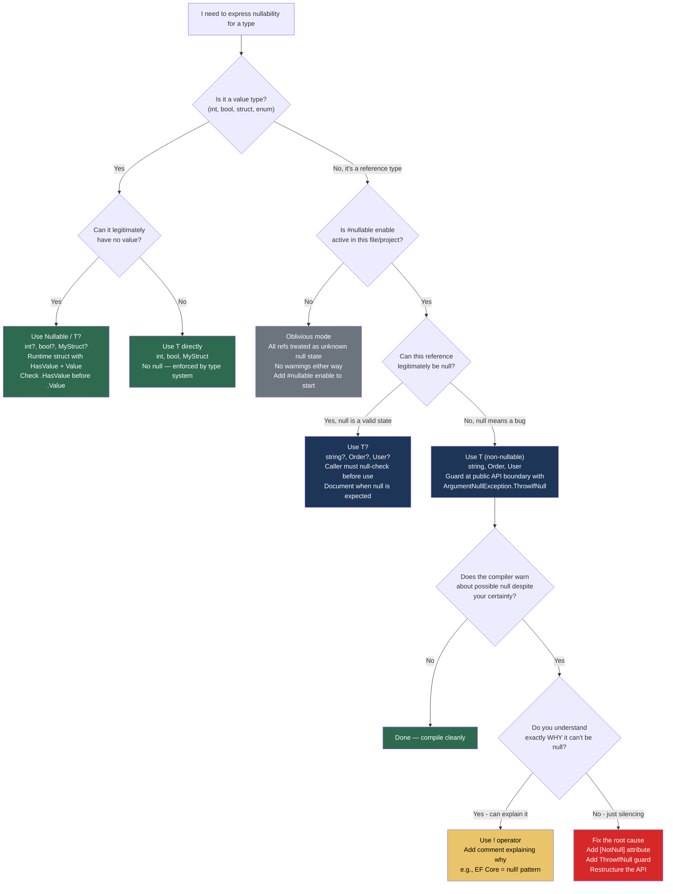

> [!success] Mastery Check
> - [ ] **Studied Well**
> - [ ] **Can explain the concept without notes**
> - [ ] **Can answer interview questions confidently**
> - [ ] **Can implement it in a real project**


## 📍 PART 0 — Navigation & Context

### Where This Topic Lives

```
C# Type System
└── Nullability
    ├── Nullable<T> / T?  (value types — struct wrapper, runtime reality)
    ├── ► Nullable Reference Types (NRT)  ← YOU ARE HERE
    │       (reference types — compile-time annotation, zero runtime cost)
    ├── Null-conditional operators (?., ?[])
    ├── Null-coalescing operators (??, ??=)
    └── Null Guard Patterns → [[2.27 — Exception Handling Patterns]]
```

### What You Need Before This

- **[[2.01 — Value Types vs. Reference Types]]** — You must know that `Nullable<T>` is a struct and NRT is something completely different before any of this makes sense
- **Basic C# reference types** — understanding that all `class` variables can be `null` at runtime is the problem NRT solves
- **Flow analysis intuition** — the compiler tracks what you've checked; you need a mental model of "what does the compiler know at this point"

### What This Unlocks After

- **[[2.26 — Equality and Comparison]]** — null equality semantics and how NRT annotations affect `==` behavior
- **[[2.27 — Exception Handling Patterns]]** — `ArgumentNullException.ThrowIfNull` and guard patterns become motivated
- **[[2.02 — Generics and the Type System]]** — generic constraints and `T?` have complex interactions you can only understand after this
- **API design with nullable contracts** — designing public library APIs with correct nullability annotations

### Why This Matters at Scale

`NullReferenceException` is statistically the most common exception in production .NET applications; NRT is the compiler-enforced contract that makes the null state of every reference visible at every call site — turning a runtime crash into a compile-time warning before the code ships.

---

## 🧠 PART 1 — The Core Mental Model

### The Fundamental Rule

> **NRT is a compile-time annotation system, not a runtime feature. Enabling it does not prevent null at runtime — it makes the compiler warn you when your code's null assumptions are inconsistent, so you can fix them before production.**

That sentence is your anchor. Everything else follows from it: no IL change, no performance cost, no new exception type. Just the compiler enforcing a contract you declare.

### The Plain-Language Analogy

Think of NRT like a **type-checked form** for a government office. Before NRT, every field on the form was implicitly "might be blank" — the clerk just had to remember which fields were required. With NRT enabled, every field is now marked either "REQUIRED" or "OPTIONAL". The form itself (the paper — your compiled IL) doesn't change at all. But the review process (compilation) now rejects forms where a required field is left blank or where a field is used without first checking if it was filled in. The `!` (null-forgiving operator) is the equivalent of writing "I guarantee this is filled" in the margin — the reviewer accepts it, but you own the consequences if you're wrong and it runs at the customs desk (runtime).

This analogy holds for the edge case: migrating legacy code (a stack of old forms with no markings) means adding the markings one form at a time, using `#nullable enable/disable` regions to carve out the audited sections, rather than having to restamp the entire archive at once.

### The Full NRT Taxonomy

```mermaid
graph TD
    A["C# Nullability"] --> B["Nullable Value Types\nNullable<T> / T?\nstruct wrapper, runtime reality\nHasValue + Value fields"]
    A --> C["Nullable Reference Types\nCompile-time annotation only\nZero runtime cost\nrequires #nullable enable"]

    C --> D["Annotation States"]
    C --> E["Flow Analysis"]
    C --> F["Nullable Attributes\nSystem.Diagnostics.CodeAnalysis"]
    C --> G["Null Guard Patterns"]

    D --> D1["T — non-nullable ref\nCompiler warns if null assigned"]
    D --> D2["T? — nullable ref\nCompiler warns if used without check"]

    E --> E1["Null check: if (x != null)"]
    E --> E2["Pattern match: if (x is not null)"]
    E --> E3["Null-coalescing: x ?? throw"]
    E --> E4["Null-forgiving: x!\nSuppresses warning — YOU own it"]

    F --> F1["[NotNull] — output guaranteed non-null"]
    F --> F2["[MaybeNull] — output might be null despite T"]
    F --> F3["[NotNullWhen(bool)] — non-null when return is value"]
    F --> F4["[MaybeNullWhen(bool)] — might be null when return is value"]
    F --> F5["[NotNullIfNotNull(param)] — non-null if input is non-null"]
    F --> F6["[MemberNotNull(member)] — member non-null after call"]
    F --> F7["[MemberNotNullWhen(bool,member)]"]
    F --> F8["[AllowNull] — input may be null despite T"]
    F --> F9["[DisallowNull] — input must not be null despite T?"]
    F --> F10["[DoesNotReturn] — method always throws"]
    F --> F11["[DoesNotReturnIf(bool)] — throws if condition"]

    G --> G1["ArgumentNullException.ThrowIfNull (.NET 6+)"]
    G --> G2["ArgumentException.ThrowIfNullOrEmpty (.NET 7+)"]
    G --> G3["Guard clause at public API boundary"]

    style B fill:#2d6a4f,color:#fff
    style C fill:#1d3557,color:#fff
    style D fill:#457b9d,color:#fff
    style E fill:#457b9d,color:#fff
    style F fill:#e9c46a,color:#000
    style G fill:#457b9d,color:#fff
```



> [!IMPORTANT] The Critical Distinction
> `int?` (Nullable\<int\>) and `string?` (nullable reference type) look identical in syntax but are mechanically opposite. `int?` creates a new struct wrapper at runtime — it allocates, it has `HasValue`, it boxes differently. `string?` adds zero bytes to the compiled output — it is purely a compiler annotation. You must never conflate them.

---

## 🔬 PART 2 — Deep Mechanics

### 2.1 What the Compiler Actually Generates — IL Evidence

NRT's "zero runtime cost" claim is verifiable. Let's look at what actually changes in compiled output.

```
━━━━━━━━━━━━━━━━━━━━━━━━━━━━━━━━━━━━━━━━━━━━━━━━━━━━━━━━━━━━
SCENARIO: Non-nullable vs nullable string field in a class
━━━━━━━━━━━━━━━━━━━━━━━━━━━━━━━━━━━━━━━━━━━━━━━━━━━━━━━━━━━━

#nullable enable
public class OrderRecord
{
    public string  CustomerId { get; }   // non-nullable
    public string? Notes      { get; }   // nullable
}

COMPILED IL (both fields):
  .field private string '<CustomerId>k__BackingField'
  .field private string '<Notes>k__BackingField'

The IL is IDENTICAL for both fields.
The ONLY difference is a metadata attribute:

  [NullableContext(1)]   // applied to the class: non-nullable is the default
  [Nullable(2)]          // applied to Notes field: overrides to nullable

Runtime sees:    string   string   — two identical reference type fields.
Compiler sees:   string   string?  — and warns accordingly.

RUNTIME MEMORY LAYOUT (identical regardless of NRT annotation):

Stack (method with OrderRecord local):
  ┌──────────────────┐
  │  OrderRecord ref │──────────────────►  Heap:
  │  [8 bytes ptr]   │                    ┌──────────────────────────────┐
  └──────────────────┘                    │ ObjHeader        (8 bytes)   │
                                          │ TypePtr          (8 bytes)   │
                                          │ CustomerId ptr ──────────────┼──► "C-001" string
                                          │ Notes ptr        (8 bytes)   │    (or null — runtime allows it)
                                          └──────────────────────────────┘

Both pointers are 8 bytes. Both can hold null at runtime.
NRT just makes the compiler WARN you if Notes is used without a null check.
```

**Runtime cost: zero.** The metadata attributes (`[Nullable]`, `[NullableContext]`) are read only by the compiler of consuming code, not at runtime. ~0 ns overhead. ~0 bytes overhead in hot paths.

### 2.2 Flow Analysis — How the Compiler Tracks Null State

The compiler maintains a per-variable null state that changes as it reads your code. Understanding this is essential to knowing when you need the `!` operator vs. when you're fighting the compiler unnecessarily.

```csharp
#nullable enable

public class UserService
{
    private readonly Dictionary<string, User> _cache;

    public string GetDisplayName(string? userId)
    {
        // State at entry: userId = MaybeNull

        if (userId == null)
            return "Guest";

        // State after null check branch: userId = NotNull
        // The compiler tracks that we returned above if null

        var user = _cache.TryGetValue(userId, out var found) ? found : null;
        // State: user = MaybeNull (TryGetValue out param is annotated User? in the BCL)

        if (user is not null)
        {
            // State inside this block: user = NotNull
            return user.DisplayName; // Safe — compiler knows user != null here
        }

        // State here: user = MaybeNull (we didn't enter the block above)
        return userId.ToUpperInvariant(); // Safe — userId still NotNull (no reassignment)
    }
}
```

**The exact rules the flow analysis applies:**

```
OPERATIONS THAT SET STATE TO NotNull:
  if (x != null) { ... }         → x is NotNull inside the block
  if (x is not null) { ... }     → x is NotNull inside the block
  if (x is SomeType t) { ... }   → t is NotNull inside the block
  x ?? throw new ...             → x is NotNull after this expression
  x!                             → x is NotNull at this usage (forgiving only)
  ArgumentNullException.ThrowIfNull(x) → x is NotNull after this call (via [NotNull])

OPERATIONS THAT SET STATE to MaybeNull:
  x = null                       → x is MaybeNull
  method returns T?              → result is MaybeNull
  out T? parameter filled by BCL → variable is MaybeNull

OPERATIONS THAT RESET TO UNKNOWN:
  Calling a method that takes x as ref → state reset to MaybeNull
  x = SomeMethodReturningNullable() → state is MaybeNull
```

**Cost of flow analysis: compile-time only, ~0 ns runtime.** The compiler does a single pass tracking state through branches and loops.

### 2.3 Nullable Attributes — The Contract Vocabulary

These attributes live in `System.Diagnostics.CodeAnalysis` and let you encode nullability contracts the compiler cannot infer automatically. They are the difference between NRT that *works* and NRT that generates 200 spurious warnings.

```csharp
#nullable enable
using System.Diagnostics.CodeAnalysis;

public static class NullableAttributeExamples
{
    // ── [NotNullWhen] ────────────────────────────────────────────────────────
    // Pattern: TryGet / TryParse pattern — return value tells you about out param
    // Without this: compiler doesn't know 'value' is non-null when return is true
    public static bool TryGetOrder(
        string orderId,
        [NotNullWhen(true)] out Order? order)   // "order is non-null when we return true"
    {
        order = _store.TryGetValue(orderId, out var o) ? o : null;
        return order != null;
    }

    // Usage — compiler understands the contract:
    public static void UseOrder(string id)
    {
        if (TryGetOrder(id, out var order))
            ProcessOrder(order);  // ✅ No warning — compiler knows order != null here
    }

    // ── [NotNull] ────────────────────────────────────────────────────────────
    // Pattern: Guard methods that throw on null — after call, param IS non-null
    public static void ValidatePayment([NotNull] Payment? payment)
    {
        if (payment == null)
            throw new ArgumentNullException(nameof(payment));
        // Caller knows: after this call, payment is non-null
    }

    // ── [MaybeNull] ──────────────────────────────────────────────────────────
    // Pattern: Generic methods where T is non-nullable but result might be null
    // (e.g., "get or default" where default is null for reference types)
    [return: MaybeNull]
    public static T GetOrDefault<T>(IReadOnlyDictionary<string, T> dict, string key)
        where T : class
        => dict.TryGetValue(key, out var v) ? v : null!; // null! here is intentional

    // ── [MemberNotNull] ──────────────────────────────────────────────────────
    // Pattern: Initialization methods called from constructor
    // (common in test setup, lazy-init patterns)
    [MemberNotNull(nameof(_connectionString), nameof(_timeout))]
    private void Initialize(DatabaseConfig config)
    {
        _connectionString = config.ConnectionString; // guaranteed non-null by config
        _timeout = config.Timeout;
    }

    private string _connectionString;  // non-nullable — compiler warns without [MemberNotNull]
    private TimeSpan _timeout;

    // ── [DoesNotReturn] ──────────────────────────────────────────────────────
    // Pattern: Throw helpers — compiler understands code after this is unreachable
    [DoesNotReturn]
    public static void ThrowInvalidOrder(string orderId)
        => throw new InvalidOperationException($"Order {orderId} is in invalid state");

    // ── [DoesNotReturnIf] ────────────────────────────────────────────────────
    // Pattern: Assert-style guards — throws when condition is true/false
    public static void Assert(
        [DoesNotReturnIf(false)] bool condition,
        string message)
    {
        if (!condition) throw new InvalidOperationException(message);
    }

    private static readonly Dictionary<string, Order> _store = new();
    private static void ProcessOrder(Order o) { }
}
```

**Cost of attributes: compile-time metadata only, zero runtime overhead.** The attributes are read by Roslyn during compilation. No reflection at runtime.

### 2.4 The `#nullable` Pragma and Migration Strategy

In real codebases (not greenfield), you cannot flip one switch and make everything compile cleanly. The pragma system lets you migrate incrementally.

```csharp
// ── File-level control ───────────────────────────────────────────────────────
#nullable enable          // Turn on warnings AND annotations for this file
#nullable disable         // Turn off everything (legacy code, temporary)
#nullable enable warnings // Warn about unsafe usage, but don't enforce annotations
#nullable enable annotations // Annotate (T vs T?) but suppress warnings

// ── In a .csproj for project-wide enable ─────────────────────────────────────
// <Nullable>enable</Nullable>  ← the correct production setting for new projects

// ── Migration pattern for a large legacy codebase ───────────────────────────
// Phase 1: Enable annotations only — no warnings yet, start annotating
// <Nullable>annotations</Nullable>

// Phase 2: Per-file enable as you audit each file
#nullable enable
public class OrderProcessor  // this file is now fully checked
{
    // ...
}
#nullable disable  // files not yet audited

// Phase 3: Flip the project default to 'enable' once all files are done
```

> [!WARNING] The `warnings` vs `annotations` vs `enable` Distinction
> This trips up engineers migrating a large service. `annotations` mode makes you write `string?` but never warns you when you use a nullable unsafely — it's purely additive. `warnings` mode warns you but doesn't let you annotate (everything is treated as oblivious). `enable` does both. For migration, start with `annotations` to annotate the codebase first, then flip to `enable` to see the warnings.

### 2.5 The `Nullable<T>` vs NRT Distinction — Deep Dive

This is the point that causes the most confusion in interviews and in code review.

```
━━━━━━━━━━━━━━━━━━━━━━━━━━━━━━━━━━━━━━━━━━━━━━━━━━━━━━━━━━━━━━━━
NULLABLE VALUE TYPE (int?, Nullable<int>)
━━━━━━━━━━━━━━━━━━━━━━━━━━━━━━━━━━━━━━━━━━━━━━━━━━━━━━━━━━━━━━━━

int? x = 42;

Stack layout:
  ┌────────────────────────────┐
  │ x:                         │
  │   HasValue: true  (1 byte) │  ← runtime field, actually exists
  │   Value:    42    (4 bytes)│  ← runtime field, actually exists
  │   [3 bytes padding]        │
  └────────────────────────────┘

Total: 8 bytes on stack (for int?).
A struct. Runtime reality. HasValue is an actual field.

BOXING behavior: int? with a value boxes to int (not Nullable<int>).
                 int? with no value boxes to null (not a Nullable box).

COST: Additional 1-byte HasValue field. Stack size slightly larger.
      Accessing .Value when HasValue is false throws InvalidOperationException.

━━━━━━━━━━━━━━━━━━━━━━━━━━━━━━━━━━━━━━━━━━━━━━━━━━━━━━━━━━━━━━━━
NULLABLE REFERENCE TYPE (string?, Order?)
━━━━━━━━━━━━━━━━━━━━━━━━━━━━━━━━━━━━━━━━━━━━━━━━━━━━━━━━━━━━━━━━

string? s = "hello";

Stack layout:
  ┌──────────────────┐
  │ s:               │
  │   ptr: 0x1A4F... │  ← 8 bytes, a pointer, IDENTICAL to non-nullable string
  └──────────────────┘

There is no HasValue. There is no wrapper. s CAN be null at runtime.
The ? annotation is a compiler annotation ONLY.

COST: Zero bytes overhead. Zero nanoseconds overhead.
      The only "cost" is compile-time analysis work.
```

> [!DANGER] The Deadly Interview Trap
> If an interviewer asks "what does `string?` compile to?" and you say "a Nullable\<string\>" — you fail. `Nullable<T>` requires `T : struct`. String is a reference type. `Nullable<string>` does not compile. `string?` in NRT context compiles to plain `string` with a `[Nullable(2)]` metadata attribute. These are categorically different mechanisms.

---

## 💻 PART 3 — Production Code Patterns

### 3.1 The Null Guard at the Public API Boundary

Every public method that accepts reference types is a trust boundary. The pattern: validate immediately, promote to non-nullable, never check again inside the method.

```csharp
#nullable enable

public class PaymentProcessor
{
    private readonly IPaymentGateway _gateway;
    private readonly ILogger<PaymentProcessor> _logger;

    // ⚠️ WRONG: Scattered null checks throughout the method body
    public async Task<PaymentResult> ProcessWrong(PaymentRequest? request, string? merchantId)
    {
        if (request?.Amount > 0 && merchantId != null)  // buried in business logic
        {
            var result = await _gateway.ChargeAsync(merchantId, request.Amount);
            if (result != null)  // redundant check — gateway always returns non-null
                _logger.LogInformation("Charged {Amount}", request?.Amount);  // ? is redundant here
            return result!;
        }
        return PaymentResult.Failed("Invalid input");
    }

    // ✅ CORRECT: Guard at the boundary, then work in non-nullable territory
    public async Task<PaymentResult> Process(PaymentRequest request, string merchantId)
    {
        // ArgumentNullException.ThrowIfNull uses [NotNull] annotation — compiler knows
        // these are non-null after these calls. One line each. No allocation if non-null.
        // .NET 6+: ~5ns when no throw (just a null check + branch).
        ArgumentNullException.ThrowIfNull(request);
        ArgumentNullException.ThrowIfNull(merchantId);
        // For strings specifically, prefer this to also catch empty strings:
        ArgumentException.ThrowIfNullOrWhiteSpace(merchantId); // .NET 7+

        // From here: compiler knows request and merchantId are NotNull.
        // No ? operators needed. No ! suppression. Clean code.
        var result = await _gateway.ChargeAsync(merchantId, request.Amount);
        _logger.LogInformation("Charged {Amount} for merchant {MerchantId}",
            request.Amount, merchantId);
        return result;
    }
}
```

### 3.2 The TryGet Contract — Encoding Result Nullability

The `TryGet` pattern is one of the most common in .NET APIs. Without `[NotNullWhen]`, every caller has to suppress warnings or add redundant checks.

```csharp
#nullable enable
using System.Diagnostics.CodeAnalysis;

public class OrderRepository
{
    private readonly Dictionary<Guid, Order> _orders = new();

    // ⚠️ WRONG: Missing [NotNullWhen] — callers get warnings on every usage
    public bool TryGetOrderWrong(Guid id, out Order? order)
    {
        return _orders.TryGetValue(id, out order);
    }

    // ✅ CORRECT: Attribute encodes the contract — compiler understands the result
    public bool TryGetOrder(Guid id, [NotNullWhen(true)] out Order? order)
    {
        return _orders.TryGetValue(id, out order);
    }
}

// At the call site — the difference is enormous:
public class OrderService
{
    private readonly OrderRepository _repo;

    public decimal GetOrderTotal(Guid id)
    {
        if (_repo.TryGetOrderWrong(id, out var order))
        {
            // ⚠️ Without [NotNullWhen]: compiler still thinks order might be null here
            return order!.Total; // Need ! suppressor — bad
        }

        if (_repo.TryGetOrder(id, out var order2))
        {
            // ✅ With [NotNullWhen]: compiler knows order2 is non-null inside this block
            return order2.Total;  // Clean — no warning, no suppressor
        }

        return 0m;
    }
}
```

### 3.3 Nullable Members in Domain Models — The `required` Keyword

NRT changes how domain models should be designed. The `required` keyword (C# 11) combined with `init`-only properties gives you compile-time enforcement of mandatory fields without constructor ceremony.

```csharp
#nullable enable

// ⚠️ WRONG: Non-nullable properties with default constructor — guaranteed null state
public class CustomerProfile
{
    public string Name     { get; set; }    // non-nullable, but default(string) = null!
    public string Email    { get; set; }    // compiler warns: uninitialized non-nullable
    public string? Phone   { get; set; }   // optional — correct
}

// This compiles (with warning), but creates invalid state:
var bad = new CustomerProfile();  // Name and Email are null — NullReferenceException waiting

// ✅ CORRECT: Use required properties for mandatory fields
public class CustomerProfile
{
    public required string Name  { get; init; }   // Must be set in object initializer
    public required string Email { get; init; }   // Must be set in object initializer
    public string?         Phone { get; init; }   // Optional — explicitly nullable

    // Computed property — non-nullable because it's always derivable
    public string DisplayName => $"{Name} <{Email}>";
}

// Compiler enforces that required properties are set:
// var bad = new CustomerProfile(); // CS9035: Required member 'Name' must be set
var profile = new CustomerProfile
{
    Name  = "Alice Chen",
    Email = "alice@example.com"
    // Phone omitted — fine, it's nullable
};
```

### 3.4 The `!` Operator — When It's Justified vs. When It's Technical Debt

The null-forgiving operator (`!`) tells the compiler "trust me, this is not null." Used correctly, it's a contract assertion. Used carelessly, it's where `NullReferenceException`s hide.

```csharp
#nullable enable

public class UserTokenValidator
{
    // ✅ JUSTIFIED USE 1: Post-initialization guarantee the compiler can't see
    // (e.g., after EF Core hydration, values are guaranteed non-null by DB schema)
    public class UserEntity
    {
        public string Email { get; set; } = null!;
        // Explanation: EF Core requires parameterless constructor.
        // The DB column is NOT NULL — Email will always be hydrated.
        // = null! initializes to null to avoid compiler warning,
        // but asserts "this will be non-null by the time code reads it."
        // This is THE canonical EF Core NRT pattern.
    }

    // ✅ JUSTIFIED USE 2: After a pattern the compiler can't follow through a method call
    public bool Validate(string? token, out string? userId)
    {
        userId = null;
        if (string.IsNullOrEmpty(token)) return false;
        userId = ExtractUserId(token); // token is NotNull here — compiler agrees
        return userId != null;
    }

    // ⚠️ WRONG USE: Suppressing a warning you don't understand
    public string GetUserName(string? id)
    {
        var user = _userCache[id!]; // "id is probably not null here" — THIS WILL CRASH
        return user.Name;           // NullReferenceException waiting to happen
    }

    // ✅ CORRECT: Address the root cause
    public string GetUserName(string id) // non-nullable parameter — fix the contract
    {
        if (!_userCache.TryGetValue(id, out var user))
            throw new KeyNotFoundException($"User {id} not found");
        return user.Name;
    }

    private readonly Dictionary<string, User> _userCache = new();
    private static string ExtractUserId(string token) => token.Split('.')[0];
}
```

### 3.5 Nullable in Generic Methods — The `T?` Complexity

Generic methods with `T?` behave differently depending on whether `T` is constrained to a value type or reference type. This is one of the most confusing corners of NRT.

```csharp
#nullable enable

public static class CacheExtensions
{
    // ⚠️ PROBLEM: T? means different things depending on T's constraints
    // When T is int:    T? means Nullable<int>  (runtime struct)
    // When T is string: T? means string?        (compile-time annotation)
    // This causes problems — you cannot return T? from a generic method
    // that handles both cases uniformly without constraints.

    // ✅ PATTERN 1: Constrain to class — T? is pure annotation
    public static T? GetFromCache<T>(ICache cache, string key) where T : class
    {
        return cache.Get(key) as T; // Returns null if not found or wrong type
        // T? here = nullable reference annotation only
    }

    // ✅ PATTERN 2: Constrain to struct — T? is Nullable<T>
    public static T? GetValueFromCache<T>(ICache cache, string key) where T : struct
    {
        var raw = cache.Get(key);
        if (raw is T value) return value;
        return null; // Returns Nullable<T> with HasValue = false
    }

    // ✅ PATTERN 3: Unconstrained T with [MaybeNull] return attribute
    // Use when you genuinely need to handle both and callers should check for null
    [return: MaybeNull]
    public static T GetOrDefault<T>(IReadOnlyDictionary<string, T> dict, string key)
        => dict.TryGetValue(key, out var v) ? v : default!;
        // default! suppresses warning — we are intentionally returning default(T)
        // For reference types: default = null. For value types: default = 0/false/etc.
}

public interface ICache
{
    object? Get(string key);
}
```

### 3.6 Nullable Reference Types in Interfaces and Inheritance

NRT annotations are part of the interface contract. Getting them wrong creates subtle mismatches across implementations.

```csharp
#nullable enable

public interface IOrderFetcher
{
    // Non-nullable return: implementations MUST return a valid Order or throw
    Order GetById(Guid id);

    // Nullable return: implementations MAY return null (e.g., not found)
    Order? FindById(Guid id);

    // Non-nullable param: callers MUST NOT pass null
    void Save(Order order);
}

// ✅ CORRECT implementation — annotations must be compatible
public class SqlOrderRepository : IOrderFetcher
{
    public Order GetById(Guid id)
    {
        var order = _context.Orders.Find(id);
        // We must return non-null or throw — the interface contract demands it
        return order ?? throw new OrderNotFoundException(id);
    }

    public Order? FindById(Guid id)
    {
        return _context.Orders.Find(id); // returning null is OK — interface says so
    }

    public void Save(Order order) // non-nullable — matches interface
    {
        _context.Orders.Add(order);
        _context.SaveChanges();
    }

    private readonly OrderDbContext _context = null!; // EF Core pattern
}

// ⚠️ WARNING: Overriding with weaker nullability is a warning (not error)
public class BadOrderRepository : IOrderFetcher
{
    public Order GetById(Guid id) => null!; // CS8603: Possible null reference return
    public Order? FindById(Guid id) => null;
    public void Save(Order? order) { }      // CS8767: Nullability mismatch with interface
}
```

### 3.7 The Oblivious Reference Type — Consuming Pre-NRT Code

When you call code compiled without `#nullable enable` (legacy libraries, older BCL), all its reference types are "oblivious" — the compiler treats them with a special state that generates no warnings. Understanding this prevents false confidence.

```csharp
#nullable enable

// Legacy method compiled WITHOUT #nullable enable — all types are "oblivious"
// The compiler will not warn you about null returns from this
public class LegacyOrderService
{
    public Order GetOrder(string id) { /* might return null */ return null!; }
}

public class ModernOrderController
{
    private readonly LegacyOrderService _legacy;

    public string GetOrderStatus(string id)
    {
        var order = _legacy.GetOrder(id);
        // order's type is Order (oblivious) — NOT Order?
        // The compiler gives you NO WARNING here even though GetOrder can return null
        // You must defensively null-check calls into oblivious code

        // ✅ Defensive pattern for oblivious code:
        if (order is null)
            return "NotFound";

        return order.Status;
    }
}
```

> [!WARNING] Oblivious ≠ Safe
> The absence of a compiler warning about an oblivious reference type does NOT mean it can't be null. It means the compiler has no information. Treat all returns from pre-NRT assemblies as potentially null until you've verified the source.

---

## ⚠️ PART 4 — Gotchas & Anti-Patterns

### Gotcha 1: The `!` Operator Hides Bugs Without Eliminating Them

Engineers migrating codebases often use `!` to silence warnings quickly, treating it as an escape hatch rather than a promise. The resulting code compiles cleanly but is riddled with deferred `NullReferenceException`s.

```csharp
// ⚠️ WRONG: Using ! to silence migration warnings without understanding the state
public class InvoiceGenerator
{
    private Customer? _customer;

    public void SetCustomer(Customer? c) => _customer = c;

    public Invoice Generate()
    {
        // ! here says "I promise _customer is not null"
        // but SetCustomer(null) is a valid call — this WILL throw in production
        return new Invoice(_customer!.BillingAddress, DateTime.UtcNow);
    }
}

// ✅ CORRECT: Address the null state — either guard or change the design
public class InvoiceGenerator
{
    private Customer _customer; // non-nullable — enforce at construction

    public InvoiceGenerator(Customer customer)
    {
        ArgumentNullException.ThrowIfNull(customer);
        _customer = customer;
    }

    public Invoice Generate() => new Invoice(_customer.BillingAddress, DateTime.UtcNow);
}

// WHY: The ! operator suppresses the compiler warning but does not add a runtime null check.
// At runtime, _customer! is evaluated exactly as _customer — no assertion, no check.
// The NullReferenceException still occurs. The only thing you've changed is your warning count.
```

### Gotcha 2: Flow Analysis Doesn't Persist Across Method Calls

Engineers assume that because they checked null on line 5, the compiler "remembers" it inside a helper method called on line 10. It does not. Each method boundary resets the analysis for out-of-scope variables.

```csharp
#nullable enable

// ⚠️ WRONG: Assuming the validation method's check carries through
public class ShipmentService
{
    public void Ship(Shipment? shipment)
    {
        ValidateShipment(shipment); // we checked null inside here... right?
        Console.WriteLine(shipment.TrackingId); // CS8602: Dereference of possibly null reference
        // Compiler does NOT know ValidateShipment ensures non-null (unless annotated)
    }

    private void ValidateShipment(Shipment? s)
    {
        if (s == null) throw new ArgumentNullException(nameof(s));
    }
}

// ✅ CORRECT: Use [NotNull] attribute or ArgumentNullException.ThrowIfNull
public class ShipmentService
{
    public void Ship(Shipment? shipment)
    {
        ArgumentNullException.ThrowIfNull(shipment); // [NotNull] attribute in BCL
        // Compiler now knows shipment is NotNull after this line
        Console.WriteLine(shipment.TrackingId); // ✅ No warning
    }

    // Or annotate your own guard:
    private void ValidateShipment([System.Diagnostics.CodeAnalysis.NotNull] Shipment? s)
    {
        if (s == null) throw new ArgumentNullException(nameof(s));
    }
}

// WHY: The compiler performs interprocedural flow analysis only for annotated contracts
// (via nullable attributes). Without [NotNull], the compiler treats the helper as a
// black box — it cannot verify what the method does to the null state of its parameters.
```

### Gotcha 3: The EF Core `= null!` Initialization Is Not a Bug

Engineers new to NRT see `= null!` in EF Core entity classes and assume it's a code smell or mistake. Trying to "fix" it breaks the ORM.

```csharp
#nullable enable

// ⚠️ WRONG: "Fixing" EF Core entities by adding a constructor or throwing
public class ProductEntity
{
    public int Id { get; set; }

    // "I'll fix the null! by requiring it in constructor"
    public ProductEntity(string name) { Name = name; }
    public string Name { get; set; }
    // EF Core requires a parameterless constructor for materialization.
    // EF Core will call new ProductEntity() — your constructor is never used.
    // Name is still null after EF hydration unless you have a 2nd parameterless ctor.
}

// ✅ CORRECT: Keep parameterless constructor, use = null! for EF-managed properties
public class ProductEntity
{
    public int Id { get; set; }
    public string Name { get; set; } = null!;
    // = null!: "This starts as null, but EF Core guarantees it's non-null
    // before user code ever reads it. I accept responsibility for this assertion."
    public string? Description { get; set; }  // genuinely nullable DB column
    public decimal Price { get; set; }         // value type — no issue
}

// WHY: EF Core materializes entities by setting properties after calling the
// parameterless constructor. The = null! pattern is the standard contract:
// "the runtime (EF) owns this field's initialization, not the C# constructor."
// Removing it either causes CS8618 warnings or breaks EF's ability to create instances.
```

### Gotcha 4: Nullable Annotations Are Not Enforced at Runtime — Ever

Engineers write `string?` as a parameter type expecting the CLR to somehow enforce it. It never does. Any non-nullable parameter can receive null if the caller's code disables warnings or comes from pre-NRT assemblies.

```csharp
#nullable enable

// ⚠️ WRONG MENTAL MODEL: Thinking string? annotation prevents null at runtime
public class ReportService
{
    public void GenerateReport(string customerId)
    {
        // customerId is annotated as non-nullable.
        // You believe it can never be null here.
        // You are wrong if the caller suppresses warnings or is from legacy code.

        var report = BuildReport(customerId); // NullReferenceException if null gets through
    }
}

// ✅ CORRECT: Public API boundaries still need runtime guards
public class ReportService
{
    public void GenerateReport(string customerId)
    {
        // Belt-and-suspenders: annotation for compile-time callers,
        // runtime guard for everything else (reflection, legacy, P/Invoke, deserialization)
        ArgumentNullException.ThrowIfNull(customerId);

        var report = BuildReport(customerId);
    }

    private string BuildReport(string id) => $"Report for {id}";
}

// WHY: NRT is a static analysis tool. The IL for `string` and `string?` parameters
// is identical — both accept null at runtime. Any code that bypasses the compiler
// (reflection, dynamic, legacy assemblies, AOT-serialized data) can pass null
// to a non-nullable parameter without any runtime enforcement.
// Public APIs should always guard at the boundary regardless of NRT annotations.
```

### Gotcha 5: Default Values of Generic Type Parameters and Null

The `default` keyword and generic type parameters interact with NRT in ways that produce subtle bugs — particularly in collection initializers and factory methods.

```csharp
#nullable enable

// ⚠️ WRONG: Returning default(T) when T is unconstrained returns null for reference types
public class ResultCache<T>
{
    private T? _cached; // fine — nullable regardless of T
    private bool _hasValue;

    public T GetOrCompute(Func<T> compute)
    {
        if (_hasValue) return _cached!; // ! required: T might be non-nullable ref type
        _cached = compute();
        _hasValue = true;
        return _cached;
    }

    // ⚠️ WRONG: This returns null for reference-type T — violates non-nullable return
    public T GetOrDefault_Wrong()
    {
        return _hasValue ? _cached! : default(T)!; // default(T) for string = null
        // We've just returned null from a method declared to return T (non-nullable)
        // The ! suppresses the warning but the null is still there
    }
}

// ✅ CORRECT: Design the API to express the reality
public class ResultCache<T>
{
    private T? _cached;
    private bool _hasValue;

    // Option A: Return T? — express that there might not be a value
    public T? GetCached() => _hasValue ? _cached : default;

    // Option B: Constrain T to non-nullable and handle the absence explicitly
    public bool TryGetCached([NotNullWhen(true)] out T? value)
    {
        value = _hasValue ? _cached : default;
        return _hasValue;
    }
}

// WHY: default(T) for unconstrained T returns null when T is a reference type.
// There is no way to return a "zero" value for a non-nullable reference type —
// null IS the default. The compiler's warning is correct: you need to either
// accept T? as the return type or restructure to avoid the default entirely.
```

---

## 📊 PART 5 — Performance Implications

### 5.1 Allocation Characteristics

| Scenario | Allocation Behavior | Approx Cost |
|---|---|---|
| `#nullable enable` at file scope | Zero runtime effect — compile-time only | 0 ns, 0 bytes |
| `string?` field on a class | Identical to `string` field — same pointer size | 0 overhead |
| `[NotNull]` attribute on parameter | Metadata only — read at compile time | 0 ns runtime |
| `ArgumentNullException.ThrowIfNull(x)` when non-null | Single null check + branch not taken | ~1-2 ns |
| `ArgumentNullException.ThrowIfNull(x)` when null | Throws: allocates exception + stack trace | ~2-5 μs |
| `ArgumentException.ThrowIfNullOrEmpty(s)` | null check + IsNullOrEmpty check | ~2-3 ns |
| `x ?? throw new ArgumentNullException(...)` | Null check; allocates only if null | ~1-2 ns non-null path |
| `x!` null-forgiving operator | Zero — stripped at compile time, no IL emitted | 0 ns |
| Nullable attribute metadata in assembly | Read only by compiler, never by runtime | 0 ns runtime |
| Flow analysis tracking in compiler | Compile-time only — affects build time, not run time | ~0 ms per file |

> [!NOTE] NRT Has No Runtime Cost
> Every row in this table that involves the annotation system itself costs zero at runtime. The performance cost is entirely on the *guard code you write* as a result of NRT — `ThrowIfNull` calls, null checks, etc. Those are fast (~1-2 ns) and correct. The alternative (a `NullReferenceException`) costs ~2-5 μs plus the production incident.

### 5.2 BenchmarkDotNet: Guard Strategies

```csharp
// This benchmark shows the realistic cost of different null-guard approaches.
// The point: none of these are expensive. Use the correct one, not the "fast" one.

[MemoryDiagnoser]
[BenchmarkCategory("NullGuards")]
public class NullGuardBenchmark
{
    private readonly string _validId     = "order-12345";
    private readonly string? _nullableId = "order-12345";
    private readonly string? _actualNull = null;

    // Baseline: no guard — danger path, but shows raw call cost
    [Benchmark(Baseline = true)]
    public int NoGuard()
    {
        return ProcessOrder(_validId);
    }

    // Pattern 1: Manual null check (C# 5 style)
    [Benchmark]
    public int ManualNullCheck()
    {
        if (_nullableId == null) throw new ArgumentNullException(nameof(_nullableId));
        return ProcessOrder(_nullableId);
    }

    // Pattern 2: ArgumentNullException.ThrowIfNull (.NET 6+)
    [Benchmark]
    public int ThrowIfNull()
    {
        ArgumentNullException.ThrowIfNull(_nullableId);
        return ProcessOrder(_nullableId!);
    }

    // Pattern 3: Null-coalescing throw
    [Benchmark]
    public int NullCoalescingThrow()
    {
        var id = _nullableId ?? throw new ArgumentNullException(nameof(_nullableId));
        return ProcessOrder(id);
    }

    private static int ProcessOrder(string id) => id.Length;
}

// Expected output (approximate, .NET 8, x64):
// | Method               | Mean     | Error    | Allocated |
// |----------------------|----------|----------|-----------|
// | NoGuard              | 1.23 ns  | 0.02 ns  | -         |
// | ManualNullCheck      | 1.89 ns  | 0.03 ns  | -         |
// | ThrowIfNull          | 1.91 ns  | 0.03 ns  | -         |
// | NullCoalescingThrow  | 1.88 ns  | 0.03 ns  | -         |
//
// Conclusion: All guard patterns cost ~0.7 ns extra on the happy path.
// At 1M requests/sec, that's 0.7ms total overhead — completely negligible.
// Choose ThrowIfNull for clarity, not performance.
```

### 5.3 When to Care / When to Ignore

**When this costs you (real production consequences):**

- **Not caring at all costs you.** The performance of NRT is irrelevant. The performance of the `NullReferenceException` it prevents — 2-5 μs to throw, plus stack trace allocation, plus the production incident, plus the on-call page — is what you're paying for when you ignore NRT.
- **Excessive `!` in hot paths** — not a performance issue, but a correctness time-bomb. A suppressed warning in a method called 10M times/day will eventually hit a null path.
- **Missing `[NotNullWhen]` attributes on TryGet methods** — forces every caller to add redundant null checks, making code verbose and adding unnecessary branch overhead.

**When this genuinely doesn't matter:**

- **Internal private methods in a fully-NRT-enabled codebase** — the compiler flow analysis means you rarely need to add guards inside a single class where the state is controlled.
- **Test projects** — test code often intentionally passes null to test error paths. `#nullable disable` in test projects or per-file is pragmatic.
- **Spike / prototype code** — spending time on NRT annotations in throwaway code is premature.
- **Pure data transfer objects (DTOs) with known-non-null schema** — the `= null!` EF Core pattern handles these correctly at essentially zero cost.

---

## 🎤 PART 6 — Interview Arsenal

### 6.1 The Question Bank

---

**Q: "What are Nullable Reference Types in C# and why were they introduced?"**

**Average Answer:** "They're a feature that lets you mark reference types as nullable or non-nullable using `?` syntax, to help prevent null reference exceptions."

**Why That's Insufficient:** It's technically correct but describes the syntax, not the mechanism or the problem it solves at scale.

> **Great Answer:** "NRT is a compile-time annotation and flow analysis system that was introduced to address the fact that null reference exceptions are historically the single most common exception in production .NET applications. The core insight is that every reference type variable in pre-NRT C# was implicitly 'might be null,' which meant you couldn't tell from a method signature whether it could return null without reading the implementation. What NRT does is make the null contract explicit: a parameter typed `string` is a promise that null won't be passed, and a return type of `string?` is a promise that the caller must check. Critically, this has zero runtime cost — it's purely a compiler analysis that emits warnings when your null assumptions are inconsistent. The IL for `string` and `string?` is identical. The benefit is that you catch a whole class of bugs at compile time rather than in production at 2 AM."

---

**Q: "What is the difference between `int?` and `string?` in C#?"**

**Average Answer:** "Both represent nullable types — `int?` makes int nullable since it's a value type, and `string?` says a string can be null."

**Why That's Insufficient:** It misses the mechanistic difference entirely and conflates two completely different features.

> **Great Answer:** "They look the same in syntax but are implemented completely differently. `int?` is syntactic sugar for `Nullable<int>`, which is a struct containing a `HasValue` boolean field and a `Value` int field — it has real runtime existence, it takes up more memory than a plain int, and accessing `.Value` on a HasValue-false instance throws an exception at runtime. `string?` in the Nullable Reference Types context is a compile-time annotation only — it compiles to plain `string` with a `[Nullable(2)]` metadata attribute that the compiler reads but the CLR never looks at. There is zero bytes of overhead and zero nanoseconds of overhead for `string?` versus `string`. This distinction matters practically: you can call `Nullable<T>` generic APIs on `int?` because `Nullable<T>` has a type constraint of `where T : struct`. You cannot create `Nullable<string>` — it won't compile. String is already a reference type and is already capable of being null."

---

**Q: "How does the compiler's null flow analysis work?"**

**Average Answer:** "The compiler tracks whether you've done a null check before using a nullable variable, and warns you if you haven't."

**Why That's Insufficient:** It doesn't explain what resets the state, what doesn't persist across method boundaries, or how attributes extend the analysis.

> **Great Answer:** "The compiler maintains a per-variable null state — either 'NotNull' or 'MaybeNull' — and updates it as it reads through branches, assignments, and method calls. A null check like `if (x != null)` sets x to NotNull inside the true branch. A pattern match like `if (x is Order order)` sets order to NotNull. Assignment from a nullable source sets the state to MaybeNull. The key limitation is that this analysis does not cross method boundaries by default — if you call a `ValidateOrder` helper that throws on null, the compiler doesn't know that, so it still thinks the variable might be null after the call. This is where nullable attributes come in: `[NotNull]` on a parameter tells the compiler 'this method guarantees non-null on return,' and `[NotNullWhen(true)]` on an out parameter of a bool-returning method tells it 'this is non-null when we returned true.' The BCL uses these extensively — `string.IsNullOrEmpty` has `[NotNullWhen(false)]` on its parameter, which is how the compiler knows that after `if (!string.IsNullOrEmpty(x))`, x is non-null."

---

**Q: "When should you use the null-forgiving operator `!` and when should you avoid it?"**

**Average Answer:** "You use it when you know a value isn't null but the compiler doesn't, like with EF Core entities."

**Why That's Insufficient:** It gives one use case without explaining the risk model or the principle that guides when it's justified.

> **Great Answer:** "The null-forgiving operator is a promise to the compiler — 'I know this is non-null, even though you can't prove it.' Used correctly, it's fine. Used as a warning-silencer, it creates a codebase full of deferred NullReferenceExceptions. I use it in exactly three situations. First, the EF Core `= null!` initialization pattern, where the ORM owns initialization and the compiler can't see it. Second, after a pattern the compiler can't follow through an attribute-annotated external method — if I've called `ArgumentNullException.ThrowIfNull` and the annotation isn't in scope, for instance. Third, in unit tests where I'm deliberately constructing a half-initialized object to test an error path. What I never do is use `!` to silence a warning I don't understand, or to speed up a migration without thinking about why the warning was there. The rule I follow: if you can't write a one-line comment explaining exactly why this can't be null at this point, you don't have the right to suppress the warning. Every `!` in production code is a bet — make sure you're betting on something you know."

---

### 6.2 The Trick Questions

> [!WARNING] These Sound Trivial — They're Not

**"Does enabling NRT in a project break existing code?"**
The trap: engineers say "yes, you get compilation errors." The correct answer: NRT in `enable` mode produces *warnings*, not errors, by default. Existing code compiles unless you've configured `<TreatWarningsAsErrors>true</TreatWarningsAsErrors>` or specific warning-as-error for the NRT warning codes (CS8600-CS8670 range). The practical answer is: it might break CI if you have warnings-as-errors enabled, but it won't produce compilation errors in most default configurations.

**"What is an 'oblivious' nullable reference type?"**
The trap: most engineers say "null means oblivious." Wrong. An oblivious reference type is a reference type in code compiled *without* `#nullable enable` — the compiler treats it as having unknown nullability, not nullable or non-nullable. It generates no warnings either way. This matters when consuming legacy libraries: you get no null warnings from them even when they can return null.

**"Can a non-nullable reference type field ever be null at runtime?"**
The trap: engineers confidently say "no." The correct answer is yes — in several ways. Default struct with a reference type field (default(MyStruct).Name). EF Core entities before hydration (`= null!`). Deserialized JSON with a missing field. Reflection-based initialization. Any call from pre-NRT code that ignores warnings. NRT is a compile-time tool, not a runtime enforcement mechanism.

**"What does `#nullable enable warnings` do that `#nullable enable` doesn't?"**
The trap: engineers say they're equivalent. The difference: `enable warnings` turns on the diagnostic reporting but does NOT allow you to write `string?` annotations — all types are treated as non-nullable. `#nullable enable` (or `#nullable enable annotations`) allows you to write `T?` for reference types. For migration, you often want `annotations` first (no warnings, let you annotate) then flip to `enable` (now warn about annotation mismatches).

---

### 6.3 Red Flags to Avoid

```
❌ "Nullable reference types prevent NullReferenceException at runtime"
   — NRT is compile-time only. NRE still occurs if null gets through.

❌ "string? allocates differently than string"
   — Zero runtime difference. Same IL. Same pointer. Same memory.

❌ "I just add ! to fix the warning and move on"
   — Shows you're treating symptoms not causes. Guaranteed to lose points.

❌ Confusing Nullable<T> (value type, runtime struct) with NRT (annotation, compile-time)
   — This is the cardinal sin. If you say "string? is Nullable<string>" you fail.

❌ "NRT is just the ? syntax"
   — Misses the entire flow analysis engine and nullable attributes system.

❌ "We disabled NRT because it generates too many warnings"
   — Shows you're willing to trade correctness for compile-time convenience.
      The correct answer is incremental migration with #nullable enable per file.

❌ "The [NotNull] attribute throws an exception if null is passed"
   — Attributes are metadata. They don't execute. [NotNull] only affects compiler analysis.

❌ "Non-nullable parameters enforce non-null at runtime"
   — They don't. The IL accepts null. Only explicit guards (ThrowIfNull) enforce runtime.
```

---

## 🔀 PART 7 — Decision Framework



---

## ✅ PART 8 — Self-Check

### Conceptual Questions

Answer these from reasoning, not memory. If your answer feels like a definition, go deeper.

1. You enable NRT project-wide and get 400 compiler warnings. Your team lead says "just add `!` to everything to make it build." What do you say, and what's the correct approach?

2. A colleague says "I've been using `string?` for years — that's the same as `Nullable<string>`." How do you correct this, and what's the runtime evidence you'd cite?

3. You have a public REST API controller. NRT is enabled. A `[FromBody]` parameter is annotated as `OrderRequest` (non-nullable). A malformed JSON body causes the binder to set it to null. Does the non-nullable annotation protect you? What does?

4. The BCL's `Dictionary<K,V>.TryGetValue` signature includes `[MaybeNullWhen(false)] out TValue value`. Why is this `MaybeNullWhen(false)` rather than `NotNullWhen(true)`? What's the edge case that forces this choice?

5. You're migrating a 200-file legacy codebase to NRT. You don't want to do all 200 files at once. What is the minimal set of `.csproj` and per-file changes that lets you migrate incrementally, file by file, with no warnings in un-migrated files?

6. You have a class with a non-nullable `string Name` field that is populated by a `[MemberNotNull]`-attributed initializer method. Without the attribute, what warning would the compiler emit, and why? With the attribute, what does the compiler now know?

7. An `interface IRepository` method signature returns `Order` (non-nullable). An implementing class returns `null` in one code path. What does the compiler emit? What does the CLR do at runtime when the caller does not null-check the result?

8. The `[DoesNotReturn]` attribute is placed on a method. What does the compiler do differently after a call to that method? Give a concrete example where this matters for flow analysis.

9. Explain why `T?` in a generic method with no constraints is illegal as a return type if `T` is non-nullable, but becomes legal once you add `where T : class`. What changes?

10. You call a method from a pre-NRT assembly that can return null. NRT is enabled in your project. Does the compiler warn you about the return value? Why or why not?

---

### Code Puzzles

**Puzzle 1:** What does this print? Is there a warning? Is there a bug?

```csharp
#nullable enable

string? name = GetName();
string upper = name.ToUpperInvariant(); // Does this compile? Any warning?
Console.WriteLine(upper);

static string? GetName() => new Random().Next(2) == 0 ? "alice" : null;
```

<details>
<summary>Answer</summary>

**Compile:** Yes, with warning CS8602 — "Dereference of a possibly null reference." The compiler sees that `name` is typed `string?` and `GetName()` returns `string?`, so `name` is in MaybeNull state. Calling `.ToUpperInvariant()` without a null check is a warning.

**Runtime:** If `GetName()` returns null (50% of the time), this throws `NullReferenceException` on `name.ToUpperInvariant()`. The warning is telling you about a real bug.

**Fix:** `string upper = name?.ToUpperInvariant() ?? "unknown";` or null-check first.

</details>

---

**Puzzle 2:** Does this compile? What does it print?

```csharp
#nullable enable

int x = 42;
int? y = x;
object? boxed = y;

Console.WriteLine(boxed?.GetType().Name);
Console.WriteLine(y.GetType().Name);
```

<details>
<summary>Answer</summary>

**Compiles:** Yes — all valid.

**Output:**
```
Int32
Int32
```

**Why:** When `int?` (Nullable\<int\>) with `HasValue = true` is boxed to `object`, it boxes as a plain `int` — the `Nullable<T>` wrapper is stripped. `boxed.GetType()` returns `typeof(int)`, not `typeof(Nullable<int>)`. Similarly `y.GetType()` on a non-null `int?` also returns `typeof(int)`. There is no such runtime type as `Nullable<int>` in a boxed state — the box always holds the underlying T.

The `?.` on `boxed` is necessary because if `y` were `null`, `boxed` would be `null` and `boxed.GetType()` would throw.

</details>

---

**Puzzle 3:** Where is the bug? (This is the "most common misunderstanding" puzzle.)

```csharp
#nullable enable

public class ProductService
{
    private readonly IProductRepository _repo;

    public ProductService(IProductRepository repo)
    {
        _repo = repo;
    }

    public string GetProductName(int id)
    {
        var product = _repo.FindById(id); // returns Product?
        return product!.Name;             // No warning — is this safe?
    }
}

public interface IProductRepository
{
    Product? FindById(int id);
}

public class Product
{
    public string Name { get; set; } = null!;
}
```

<details>
<summary>Answer</summary>

**The bug:** `product!.Name` uses the null-forgiving operator to suppress the CS8602 warning. But `FindById` returns `Product?` — it can legitimately return null when a product with that id doesn't exist. The `!` suppresses the compiler's correct warning about a real null dereference possibility.

**What happens at runtime:** When `_repo.FindById(id)` returns null (product not found), `product!.Name` throws `NullReferenceException`. The `!` changed nothing at runtime — it only silenced the compile-time warning.

**The fix:** 
```csharp
var product = _repo.FindById(id);
if (product is null)
    throw new ProductNotFoundException(id);
return product.Name; // Now compiler knows product is NotNull
```

**The lesson:** This is exactly the "most common misunderstanding" — using `!` to suppress a warning that is correctly identifying a real null path. The compiler was right. The developer was wrong.

</details>

---

**Puzzle 4:** What warning, if any, does the compiler emit? What's the fix?

```csharp
#nullable enable

public class NotificationService
{
    private string _template;      // non-nullable field
    private string? _senderEmail;  // nullable field

    public NotificationService(string? template, string? senderEmail)
    {
        if (template != null)
            _template = template;
        // else: _template is never assigned when template is null

        _senderEmail = senderEmail;
    }
}
```

<details>
<summary>Answer</summary>

**Warning:** CS8618 — "Non-nullable field '_template' must contain a non-null value when exiting constructor. Consider declaring as nullable."

**Why:** The compiler's flow analysis sees that `_template` (declared non-nullable) is only assigned inside the `if (template != null)` branch. In the else case (template is null), `_template` is never assigned and remains `null` — violating the non-nullable declaration.

**Fixes (pick the one matching your intent):**
```csharp
// Option 1: Make the constructor parameter required and non-nullable
public NotificationService(string template, string? senderEmail)
{
    ArgumentNullException.ThrowIfNull(template);
    _template = template;
    _senderEmail = senderEmail;
}

// Option 2: Provide a fallback default
public NotificationService(string? template, string? senderEmail)
{
    _template = template ?? "Default template: {message}";
    _senderEmail = senderEmail;
}

// Option 3: Make _template nullable to match the reality
private string? _template;
```

</details>

---

**Puzzle 5:** Does this method satisfy the compiler? If not, why?

```csharp
#nullable enable
using System.Diagnostics.CodeAnalysis;

public static bool TryParseOrderId(
    string? input,
    [NotNullWhen(true)] out string? orderId)
{
    orderId = null;
    if (string.IsNullOrWhiteSpace(input)) return false;
    if (!input.StartsWith("ORD-")) return false;
    orderId = input.ToUpperInvariant();
    return true;
}

// Usage:
public void ProcessInput(string? raw)
{
    if (TryParseOrderId(raw, out var id))
    {
        Console.WriteLine(id.Length); // Warning here?
    }
}
```

<details>
<summary>Answer</summary>

**Answer:** No warning in `ProcessInput`. The code is correct.

**Why:** `[NotNullWhen(true)]` on the `out string? orderId` parameter tells the compiler: "when this method returns `true`, `orderId` is guaranteed non-null." Inside the `if (TryParseOrderId(...))` block, the compiler knows the method returned `true`, so it applies the `[NotNullWhen(true)]` contract and sets `id`'s state to NotNull. `id.Length` is therefore safe — no warning.

**The implementation also satisfies the contract:** Every code path that returns `true` has assigned a non-null value to `orderId` (`orderId = input.ToUpperInvariant()`). Every code path that returns `false` leaves `orderId = null`. The annotation matches the implementation.

</details>

---

## 🔗 PART 9 — Connections & Resources

### A. Related Topics Table

| Topic | Why It Connects |
|---|---|
| [[2.01 — Value Types vs. Reference Types]] | `Nullable<T>` (T? for value types) is a struct with runtime existence — mechanistically opposite to NRT's compile-time annotation model; understanding both requires knowing this distinction |
| [[2.02 — Generics and the Type System]] | Generic constraints (`where T : class` vs `where T : struct`) determine whether `T?` means nullable reference annotation or `Nullable<T>` struct — essential for correct generic API design |
| [[2.26 — Equality and Comparison]] | Null equality semantics (`null == null` is true, `null == nonNull` is false) interact with NRT flow analysis — `if (x == null)` sets flow state the same as `if (x is null)` |
| [[2.27 — Exception Handling Patterns]] | `ArgumentNullException.ThrowIfNull` is the idiomatic NRT-aware guard at public boundaries; the pattern of "guard at boundary, clean code inside" is an exception handling design |
| [[2.04 — Pattern Matching]] | Null pattern (`x is null`, `x is not null`) is the preferred null check idiom in modern C# — preferred over `== null` because it cannot be overloaded; flow analysis treats it identically |
| [[2.05 — Records]] | Records auto-generate equality and constructors — the `required` keyword (C# 11) works with records to enforce non-nullable properties without manually written constructor guards |
| [[2.13 — Source Generators]] | `[GeneratedRegex]`, `[JsonSerializable]` and other source generators emit NRT-annotated code; understanding annotations is needed to correctly consume generated APIs |

### B. Books

| Book | Chapters | Why These Chapters |
|---|---|---|
| C# in Depth, 4th Ed. — Jon Skeet | Ch. 14 | Dedicated chapter on nullable reference types covering flow analysis, attributes, and migration strategy with characteristic depth |
| Pro C# 10 — Andrew Troelsen & Philip Japikse | Ch. 6 | Comprehensive treatment of the nullable type system covering both `Nullable<T>` and NRT with the migration patterns |
| CLR via C# — Jeffrey Richter | Ch. 19 | `Nullable<T>` internals: boxing behavior, HasValue mechanics, the special CLR rules for nullable value types |

### C. Essential Articles & Docs

- [Microsoft Docs: Nullable Reference Types](https://learn.microsoft.com/en-us/dotnet/csharp/nullable-references) — the canonical reference for the full feature including all pragma options
- [Microsoft Docs: Nullable Attributes](https://learn.microsoft.com/en-us/dotnet/csharp/language-reference/attributes/nullable-analysis) — complete reference for all `System.Diagnostics.CodeAnalysis` nullable attributes with examples
- [Microsoft Blog: Introducing Nullable Reference Types in C#](https://devblogs.microsoft.com/dotnet/embracing-nullable-reference-types/) — Mads Torgersen's original design rationale explaining *why* the feature was built as compile-time only
- [Microsoft Docs: NRT Migration Strategy](https://learn.microsoft.com/en-us/dotnet/csharp/nullable-migration-strategies) — the official incremental migration guide for existing codebases
- [Stephen Toub: Nullable Reference Types in the BCL](https://devblogs.microsoft.com/dotnet/nullable-reference-types-in-csharp/) — how the BCL was annotated and the decisions made for tricky generic APIs

---

> [!NOTE] Template Meta-Note
> **This note follows the 9-part C# Language Mastery template. Every section has a specific purpose:**
> - **Part 0**: Navigation — orient yourself before reading a line of content
> - **Part 1**: Core mental model — the one sentence + analogy + full taxonomy you anchor everything else to
> - **Part 2**: Deep mechanics — what the compiler and runtime actually do, not what the docs say
> - **Part 3**: Production code patterns — 5-7 annotated real-world patterns you can paste into a codebase
> - **Part 4**: Gotchas — 5 bugs that appear in experienced engineers' code, with wrong→right→why
> - **Part 5**: Performance — allocation table + benchmark + honest assessment of when it matters
> - **Part 6**: Interview arsenal — full Q&A with great answers written to be spoken aloud, trick questions, red flags
> - **Part 7**: Decision framework — a flowchart cheat sheet for live interviews
> - **Part 8**: Self-check — 10 questions + 5 code puzzles that require real understanding
> - **Part 9**: Connections — wiki links, books, articles for going deeper

---
*Last updated: 2026-06 · Domain: C# Language Mastery · Topic: 2.03*
