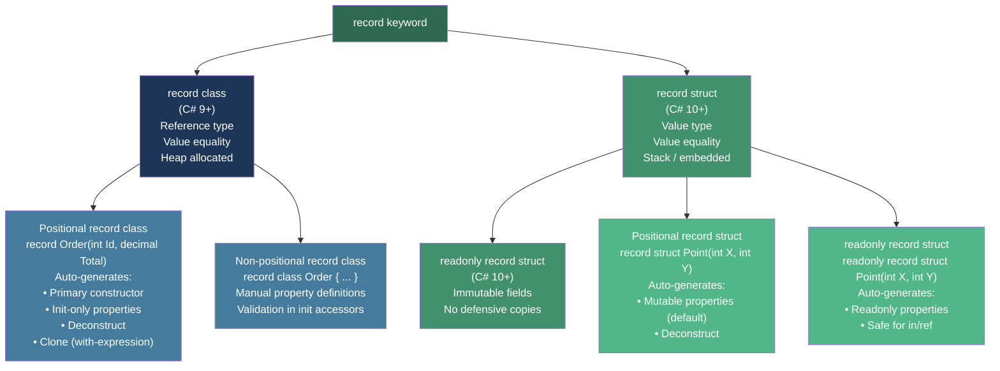
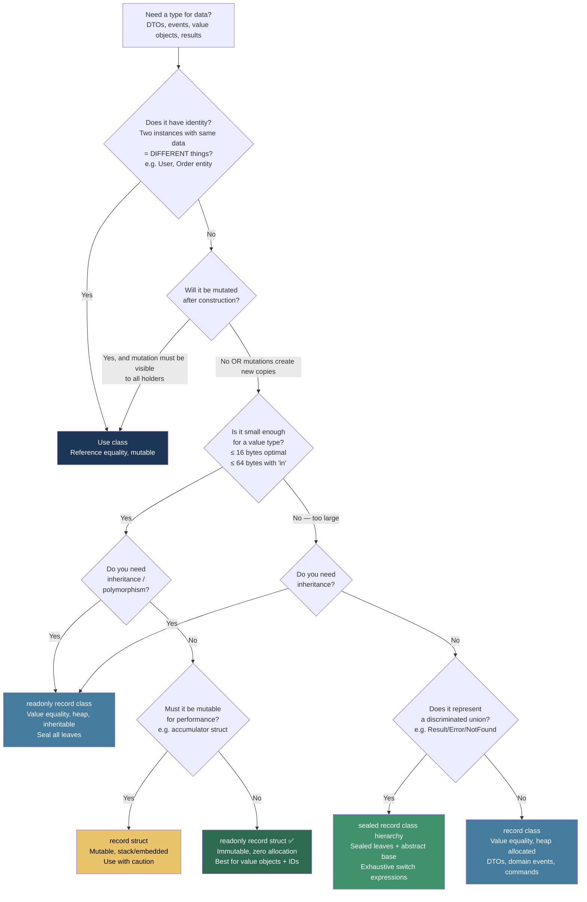

> [!success] Mastery Check
> - [ ] **Studied Well**
> - [ ] **Can explain the concept without notes**
> - [ ] **Can answer interview questions confidently**
> - [ ] **Can implement it in a real project**


## 📍 PART 0 — Navigation & Context

### Where This Topic Lives

```
C# Type System
└── Type Declarations
    ├── class (reference, identity equality)
    ├── struct (value, user-defined equality)
    ├── interface
    ├── enum
    └── ► record  ← YOU ARE HERE
        ├── record class  (reference type, value equality)
        └── record struct (value type, value equality)
            └── readonly record struct
```

### What You Need Before This

- [[2.01 — Value Types vs. Reference Types]] — you must understand what "reference type" and "value type" mean before records make sense; `record class` vs `record struct` is that distinction
- [[2.26 — Equality and Comparison]] — records auto-generate `Equals` / `GetHashCode`; knowing the contract prevents subtle bugs
- [[2.04 — Pattern Matching]] — records enable positional deconstruction patterns and work best alongside exhaustive `switch` expressions

### What This Unlocks After

- [[2.04 — Pattern Matching]] — sealed record hierarchies are the closest C# gets to discriminated unions; exhaustive pattern matching over them is idiomatic modern C#
- [[2.26 — Equality and Comparison]] — understanding *what* the compiler generates for record equality lets you reason about when to override it
- [[2.19 — Operator Overloading and Conversions]] — record equality operators are auto-generated; you need to know the rules before customising them

### Why This Topic Matters at Scale

Records eliminate an entire class of accidental mutation bugs in domain models, event objects, and API contracts — but only if you understand what the compiler actually generates, because the wrong kind of record in the wrong place produces silent correctness failures and unexpected allocations.

---

## 🧠 PART 1 — The Core Mental Model

### The Fundamental Rule

> **A record is a compiler-generated data class: it writes Equals, GetHashCode, ToString, a copy constructor, and Deconstruct for you based on its properties. The `with` expression creates a shallow copy with selected fields changed. Everything else about records is a consequence of these two facts.**

### The Plain-Language Analogy

Think of a record as a **printed shipping label** rather than a parcel. Two shipping labels with identical text are *equal* — you don't care which physical label you're holding; they represent the same information. If you need a label with a different postcode, you *print a new label* (the `with` expression) rather than defacing the original.

A class is a parcel: two parcels are different objects even if their contents are identical, and you *open the same parcel* to change its contents. A record is a label: data defines identity, and "change" means "print a new one." This maps directly to the runtime: `record class` *copies* the object on mutation instead of mutating in place, and equality compares field values rather than heap addresses.

The analogy holds at the edge case: two label variables can still point to the **same label object** (reference semantics of `record class`). The `with` expression always produces a *new object*. Records do not enforce immutability by force — they make immutable patterns easy and make mutation patterns require deliberate extra work.

### The Taxonomy Diagram



> [!NOTE] The Positional Syntax Shortcut
> `record Order(int Id, decimal Total)` is syntactic sugar. The compiler expands this into a full class with a primary constructor, two `init`-only auto-properties, a `Deconstruct` method, and all the equality infrastructure. The long form and the short form compile to identical IL.

---

## 🔬 PART 2 — Deep Mechanics

### 2.1 What the Compiler Generates for a Positional Record Class

Start with the simplest case and follow the full expansion:

```csharp
// What you write:
public record OrderLine(int ProductId, int Quantity, decimal UnitPrice);

// What the compiler generates (approximately — decompiled and annotated):
public class OrderLine : IEquatable<OrderLine>
{
    // ① Init-only auto-properties (not settable after construction)
    public int     ProductId { get; init; }
    public int     Quantity  { get; init; }
    public decimal UnitPrice { get; init; }

    // ② Primary constructor
    public OrderLine(int ProductId, int Quantity, decimal UnitPrice)
    {
        this.ProductId = ProductId;
        this.Quantity  = Quantity;
        this.UnitPrice = UnitPrice;
    }

    // ③ Deconstruct — enables positional pattern matching and tuple-like destructuring
    public void Deconstruct(out int ProductId, out int Quantity, out decimal UnitPrice)
    {
        ProductId = this.ProductId;
        Quantity  = this.Quantity;
        UnitPrice = this.UnitPrice;
    }

    // ④ Value equality — the core of what makes a record a record
    public virtual bool Equals(OrderLine? other)
        => other is not null
        && EqualityContract == other.EqualityContract   // type guard for inheritance
        && EqualityComparer<int>.Default.Equals(ProductId, other.ProductId)
        && EqualityComparer<int>.Default.Equals(Quantity,  other.Quantity)
        && EqualityComparer<decimal>.Default.Equals(UnitPrice, other.UnitPrice);

    public override bool Equals(object? obj) => Equals(obj as OrderLine);

    public static bool operator ==(OrderLine? left, OrderLine? right)
        => EqualityComparer<OrderLine>.Default.Equals(left, right);
    public static bool operator !=(OrderLine? left, OrderLine? right)
        => !(left == right);

    // ⑤ GetHashCode — uses all positional properties
    public override int GetHashCode()
        => HashCode.Combine(
            EqualityComparer<Type>.Default.GetHashCode(EqualityContract),
            EqualityComparer<int>.Default.GetHashCode(ProductId),
            EqualityComparer<int>.Default.GetHashCode(Quantity),
            EqualityComparer<decimal>.Default.GetHashCode(UnitPrice));

    // ⑥ ToString — formatted output using property names and values
    public override string ToString()
        => $"OrderLine {{ ProductId = {ProductId}, Quantity = {Quantity}, UnitPrice = {UnitPrice} }}";

    // ⑦ Clone method — used by 'with' expressions; protected copy constructor
    protected OrderLine(OrderLine original)
    {
        ProductId = original.ProductId;
        Quantity  = original.Quantity;
        UnitPrice = original.UnitPrice;
    }

    // ⑧ EqualityContract — virtual property for inheritance-aware equality
    protected virtual Type EqualityContract => typeof(OrderLine);
}
```

**Runtime cost labels:**
- Construction: one heap allocation, O(1) — same as `new class`
- `Equals`: O(N) where N = number of properties — all properties compared
- `GetHashCode`: O(N) — all properties hashed via `HashCode.Combine`
- `with` expression: one heap allocation + copy constructor — O(N)
- `ToString`: one string allocation per call — O(N)

### 2.2 The `with` Expression — Shallow Copy Mechanics

```csharp
var original = new OrderLine(ProductId: 101, Quantity: 3, UnitPrice: 9.99m);

// 'with' expression:
var modified = original with { Quantity = 5 };

// What the compiler generates:
// 1. Calls the protected copy constructor: new OrderLine(original)
//    → all fields copied from original
// 2. Sets the named properties via their init accessors:
//    modified.Quantity = 5;   ← only this one changes
// 3. Returns the new object

// original is UNTOUCHED. modified is a brand-new heap object.
// Cost: one heap allocation + O(N) field copies
```

**The critical word is SHALLOW.** If a property is a reference type, both the original and the copy share the same inner reference:

```
BEFORE:
original ──► OrderLine { ProductId=101, Quantity=3, Tags──► List<string>["sale"] }

AFTER  'with { Quantity = 5 }':
original ──► OrderLine { ProductId=101, Quantity=3, Tags──┐ }
                                                           ├──► SAME List<string> object
modified ──► OrderLine { ProductId=101, Quantity=5, Tags──┘ }

// Mutating modified.Tags also mutates original.Tags.
// This is the most common record bug in production.
```

### 2.3 Record Inheritance and the EqualityContract

Records support inheritance, but the `EqualityContract` property ensures that instances of different derived types are never equal, even if all their shared properties match.

```csharp
public record ShippingAddress(string Street, string City);
public record BillingAddress(string Street, string City) : ShippingAddress(Street, City);

var shipping = new ShippingAddress("1 Main St", "London");
var billing  = new BillingAddress("1 Main St", "London");

Console.WriteLine(shipping == billing); // FALSE
// Even though all field values are identical, EqualityContract differs:
// shipping.EqualityContract = typeof(ShippingAddress)
// billing.EqualityContract  = typeof(BillingAddress)
// Equals() returns false immediately on the type check.
```

**Memory layout for derived record class:**

```
ShippingAddress object on heap:
┌─────────────────────────────────────┐
│ ObjHeader  (8 bytes)                │
│ TypePtr    → ShippingAddress (8B)   │
│ Street     → string ref    (8B)     │
│ City       → string ref    (8B)     │
└─────────────────────────────────────┘
Total: ~32 bytes + string allocations

BillingAddress object on heap:
┌─────────────────────────────────────┐
│ ObjHeader  (8 bytes)                │
│ TypePtr    → BillingAddress (8B)    │  ← different TypePtr
│ Street     → string ref    (8B)     │
│ City       → string ref    (8B)     │
└─────────────────────────────────────┘
Same field layout, different type identity.
EqualityContract reads from TypePtr → they will never be equal.
```

### 2.4 record struct vs record class — Memory and Semantics

```csharp
// record class — reference type
public record class OrderId(int Value);

// record struct — value type (C# 10+)
public record struct OrderId(int Value);

// readonly record struct — value type, immutable (preferred for most cases)
public readonly record struct OrderId(int Value);
```

**Memory layout comparison:**

```
record class OrderId(int Value):
  Stack: [pointer → heap]
  Heap:  [ObjHeader(8B)][TypePtr(8B)][Value(4B)][padding(4B)] = 24 bytes total
  Allocation: one heap allocation per instance

readonly record struct OrderId(int Value):
  Stack (local): [Value(4B)] = 4 bytes total
  Embedded in class: stored inline, no extra allocation
  Allocation: ZERO heap allocation
```

| Feature | `record class` | `record struct` | `readonly record struct` |
|---|---|---|---|
| Memory | Heap | Stack/embedded | Stack/embedded |
| Allocation | Yes | No | No |
| Default `==` | Value equality | Value equality | Value equality |
| Mutable with `with` | Yes | Yes | Yes (creates copy) |
| Can inherit | Yes | No | No |
| Null literal | Yes (`null`) | No | No |
| `in` param efficient | No | Yes | Yes (no defensive copy) |
| Correct for DDD Value Object | With care | Rarely | ✅ Yes |

### 2.5 Non-Positional Records and Validation in `init` Accessors

Positional records do not support constructor validation — the primary constructor has no body. Use non-positional syntax when you need validation:

```csharp
// ⚠️ WRONG: Positional records cannot validate in the constructor body
public record CustomerName(string First, string Last);
// new CustomerName(null, "") happily creates a record with null First

// ✅ CORRECT: Non-positional record with init accessor validation
public record CustomerName
{
    private readonly string _first;
    private readonly string _last;

    public string First
    {
        get => _first;
        init => _first = string.IsNullOrWhiteSpace(value)
            ? throw new ArgumentException("First name cannot be blank", nameof(First))
            : value.Trim();
    }

    public string Last
    {
        get => _last;
        init => _last = string.IsNullOrWhiteSpace(value)
            ? throw new ArgumentException("Last name cannot be blank", nameof(Last))
            : value.Trim();
    }

    public CustomerName(string first, string last) { First = first; Last = last; }
}

// ✅ ALTERNATIVE (C# 10+): Positional record with compact constructor validation
public record CustomerName(string First, string Last)
{
    // Compact constructor: property assignments happen automatically AFTER this body runs.
    // Access the constructor parameters (lowercase) for validation.
    // The properties (uppercase) are assigned by generated code after.
    public CustomerName : this(
        string.IsNullOrWhiteSpace(First)
            ? throw new ArgumentException("First name cannot be blank", nameof(First))
            : First.Trim(),
        string.IsNullOrWhiteSpace(Last)
            ? throw new ArgumentException("Last name cannot be blank", nameof(Last))
            : Last.Trim())
    { }
}
```

> [!TIP] Compact Constructor Syntax
> C# 10 added the *compact constructor* for positional records: a constructor body that runs before the generated property assignments. Use it for validation. Assignments to the parameters inside the compact constructor body redirect what value gets assigned to the properties.

---

## 💻 PART 3 — Production Code Patterns

### 3.1 The Immutable Domain Event

Records are ideal for domain events that must never be mutated after dispatch. This pattern appears in CQRS and event-sourced systems.

```csharp
// Payment processing domain — immutable event representing a completed payment
// The record ensures that once published to the event bus, the event is frozen.
// If a handler needs a "modified" version (e.g., adding a correlation ID), 'with' creates a new event.

public abstract record DomainEvent
{
    public Guid   EventId   { get; } = Guid.NewGuid();
    public DateTimeOffset OccurredAt { get; } = DateTimeOffset.UtcNow;
}

public record PaymentAuthorised(
    Guid    OrderId,
    decimal Amount,
    string  Currency,
    string  AuthorisationCode) : DomainEvent;

public record PaymentDeclined(
    Guid   OrderId,
    string DeclineReason,
    string GatewayCode) : DomainEvent;

// Usage in payment service:
DomainEvent evt = new PaymentAuthorised(
    OrderId:           orderId,
    Amount:            order.Total,
    Currency:          "GBP",
    AuthorisationCode: response.Code);

// Pattern matching over sealed hierarchy — exhaustive, compiler-enforced
string message = evt switch
{
    PaymentAuthorised a => $"Order {a.OrderId} authorised for {a.Amount:C} {a.Currency}",
    PaymentDeclined   d => $"Order {d.OrderId} declined: {d.DeclineReason}",
    _                   => throw new UnreachableException()
};

// Adding a correlation ID without mutating the original:
// This is the canonical use of 'with'
if (evt is PaymentAuthorised auth)
{
    var enriched = auth with { AuthorisationCode = auth.AuthorisationCode + "-enriched" };
    // auth is untouched; enriched is a new object
}
```

### 3.2 The Value Object Pattern with `readonly record struct`

DDD value objects — currency amounts, coordinates, identifiers — belong as `readonly record struct`, not `record class`. Zero allocation, correct equality, immutable.

```csharp
// ⚠️ WRONG: record class for a value object allocates on every creation
// In an order system processing 10,000 lines/sec, this is significant GC pressure
public record class Money(decimal Amount, string Currency);  // heap allocation every time

// ✅ CORRECT: readonly record struct — embedded, zero allocation, correct equality
public readonly record struct Money(decimal Amount, string Currency)
{
    // Compact constructor for validation
    public Money : this(
        Amount < 0
            ? throw new ArgumentOutOfRangeException(nameof(Amount), "Cannot be negative")
            : Amount,
        string.IsNullOrEmpty(Currency)
            ? throw new ArgumentNullException(nameof(Currency))
            : Currency.ToUpperInvariant())
    { }

    // Business logic on the value object itself
    public Money Add(Money other)
    {
        if (Currency != other.Currency)
            throw new InvalidOperationException(
                $"Cannot add {Currency} and {other.Currency}");
        return this with { Amount = Amount + other.Amount };
    }

    public Money Scale(decimal factor)
        => this with { Amount = Math.Round(Amount * factor, 2, MidpointRounding.AwayFromZero) };

    public override string ToString() => $"{Amount:N2} {Currency}";
}

// Usage in order management:
var lineTotal  = new Money(49.99m, "USD");
var taxAmount  = lineTotal.Scale(0.20m);
var orderTotal = lineTotal.Add(taxAmount);
// Zero heap allocations for any of the above operations.
```

### 3.3 The Sealed Discriminated Union Hierarchy

Sealed hierarchies of records are the idiomatic C# substitute for discriminated unions. The compiler enforces exhaustive matching when the hierarchy is sealed.

```csharp
// API parsing domain — modelling the result of parsing an external API response
// Sealed ensures the switch expression can be exhaustive without a discard arm

public abstract record ApiResult<T>;

public sealed record ApiSuccess<T>(T Data, int StatusCode) : ApiResult<T>;
public sealed record ApiError<T>(string Message, int StatusCode, string? TraceId = null) : ApiResult<T>;
public sealed record ApiValidationFailure<T>(
    IReadOnlyList<string> Errors,
    int StatusCode = 422) : ApiResult<T>;

// Processing in an API client:
ApiResult<UserProfile> result = await _client.GetUserAsync(userId, ct);

// ✅ Exhaustive switch — compiler warns if you add a new subtype and forget to handle it
UserProfile profile = result switch
{
    ApiSuccess<UserProfile>       { Data: var data }     => data,
    ApiValidationFailure<UserProfile> { Errors: var errs } =>
        throw new ValidationException(string.Join(", ", errs)),
    ApiError<UserProfile>         { Message: var msg, StatusCode: 404 } =>
        throw new NotFoundException($"User {userId} not found"),
    ApiError<UserProfile>         { Message: var msg }   =>
        throw new ApiException(msg),
    _ => throw new UnreachableException()
};
```

### 3.4 Enrichment via `with` in a Pipeline

```csharp
// File processing domain — a record flowing through an enrichment pipeline.
// Each stage returns a new record with additional data; earlier stages are untouched.
// This makes the pipeline stages pure functions — easy to test, easy to reason about.

public record FileIngestionRecord(
    string   FilePath,
    long     FileSizeBytes,
    string?  ContentType     = null,
    string?  ContentHash     = null,
    bool     IsQuarantined   = false,
    string?  QuarantineReason = null);

public static async Task<FileIngestionRecord> DetectContentTypeAsync(
    FileIngestionRecord record, CancellationToken ct)
{
    string contentType = await _detector.DetectAsync(record.FilePath, ct);
    return record with { ContentType = contentType }; // new record, old is unchanged
}

public static async Task<FileIngestionRecord> ComputeHashAsync(
    FileIngestionRecord record, CancellationToken ct)
{
    string hash = await _hasher.ComputeAsync(record.FilePath, ct);
    return record with { ContentHash = hash };
}

public static FileIngestionRecord Quarantine(
    FileIngestionRecord record, string reason)
    => record with { IsQuarantined = true, QuarantineReason = reason };

// Pipeline:
var initial   = new FileIngestionRecord(path, size);
var withType  = await DetectContentTypeAsync(initial,  ct);
var withHash  = await ComputeHashAsync(withType, ct);
var final     = IsSuspicious(withHash)
                    ? Quarantine(withHash, "Hash matched threat database")
                    : withHash;
```

### 3.5 The Anti-Pattern: Mutable State in a record class

```csharp
// ⚠️ WRONG: Using a record class as a mutable container defeats the point entirely.
// The record generates value equality, but mutation breaks the equality contract
// once the object is in a HashSet or as a Dictionary key.

public record class OrderBasket
{
    // ⚠️ Regular setter — mutable state!
    public List<OrderLine> Lines { get; set; } = new();
    public decimal Total => Lines.Sum(l => l.Quantity * l.UnitPrice);
}

var basket = new OrderBasket();
var set    = new HashSet<OrderBasket> { basket };
basket.Lines.Add(new OrderLine(1, 2, 9.99m)); // Mutating after insertion!
// basket's GetHashCode() has now changed — it's "lost" in the HashSet.
// set.Contains(basket) may return FALSE even though basket IS in the set.

// ✅ CORRECT: If you need a mutable accumulator, use a class with identity equality,
// not a record. Or make the record truly immutable and use 'with' to build new versions.
public class OrderBasket
{
    private readonly List<OrderLine> _lines = new();
    public IReadOnlyList<OrderLine> Lines => _lines;
    public decimal Total => _lines.Sum(l => l.Quantity * l.UnitPrice);
    public void AddLine(OrderLine line) => _lines.Add(line);
}
```

### 3.6 Primary Constructors on Non-Record Classes (C# 12) vs Records

```csharp
// C# 12 added primary constructors to regular classes.
// This is NOT the same as a record — do not confuse them.

// Regular class with primary constructor (C# 12):
public class OrderService(IOrderRepository repo, ILogger<OrderService> logger)
{
    // Parameters are in scope throughout the class body,
    // but NO properties are generated, NO equality is generated.
    // 'repo' and 'logger' are just constructor parameters captured as fields internally.
    public async Task ProcessAsync(Guid orderId) => await repo.GetAsync(orderId);
}

// Record class (C# 9+):
public record OrderSnapshot(Guid OrderId, decimal Total, DateTimeOffset SnapshotAt);
// Properties ARE generated, equality IS generated, Deconstruct IS generated.

// Decision rule:
// Dependency injection / services → class with primary constructor (C# 12)
// Immutable data / DTOs / domain events / value objects → record
```

### 3.7 Defensive Copying of Reference-Type Properties

```csharp
// When a record has a reference-type property (like a list or array),
// 'with' copies the reference, not the data.
// For truly defensive immutability, copy in the constructor.

// ⚠️ WRONG: Tags is shared between original and all 'with' copies
public record CatalogueItem(int Id, string Name, List<string> Tags);

var item  = new CatalogueItem(1, "Widget", new List<string> { "sale" });
var copy  = item with { Name = "Super Widget" };
copy.Tags.Add("clearance"); // Also modifies item.Tags!

// ✅ CORRECT: Copy reference-type properties to ensure independence
public record CatalogueItem(int Id, string Name, IReadOnlyList<string> Tags)
{
    // Compact constructor: store a copy of the list, exposing IReadOnlyList prevents mutation
    public CatalogueItem : this(Id, Name, Tags.ToList().AsReadOnly()) { }
}
// Now copy.Tags and item.Tags are separate lists.
// IReadOnlyList<string> means callers cannot mutate through the interface.
```

---

## ⚠️ PART 4 — Gotchas & Anti-Patterns

### Gotcha 1: record struct Properties Are Mutable by Default

Engineers coming from `record class` expect record struct properties to be init-only. They are not.

```csharp
// Wrong mental model: "records are always immutable"
public record struct Coordinate(double Lat, double Lng);

var coord = new Coordinate(51.5, -0.12);
coord.Lat = 0.0; // ✅ Compiles! record struct properties have public get AND set by default.
                 // This is unlike record class which generates init-only properties.

// ⚠️ WRONG — assuming record struct is immutable:
void UpdateCoord(Coordinate c)
{
    c.Lat = 90.0; // You are modifying a copy — the caller's Coordinate is unchanged.
                  // This silently does nothing observable externally.
}

// ✅ CORRECT — use readonly record struct when you want the immutable guarantee:
public readonly record struct Coordinate(double Lat, double Lng);
// Now coord.Lat = 0.0 is a compile error.
// readonly record struct properties are get-only (generated as readonly fields).
```

**Why:** The spec intentionally made `record struct` properties mutable to align with `struct` conventions and allow performance-oriented mutable value types.

### Gotcha 2: Using a Mutable Record as a Dictionary Key

```csharp
// Engineers trust that records have "correct" equality and use them as dictionary keys.
// The invariant breaks the moment the record is mutable and gets mutated.

public record class ProductFilter(string Category, decimal MaxPrice);

var cache = new Dictionary<ProductFilter, IReadOnlyList<Product>>();
var filter = new ProductFilter("Electronics", 500m);
cache[filter] = await _repo.SearchAsync(filter);

// ⚠️ WRONG: If ProductFilter had a mutable property and it changed here,
// the key's hashcode would change, and the value would become unreachable.
// This is a latent bug waiting for someone to add a setter.

// ✅ CORRECT: use sealed readonly record struct for dictionary keys,
// or use record class only when all properties are init-only (guaranteed immutable).
public readonly record struct ProductFilter(string Category, decimal MaxPrice);
// Now the key cannot change after insertion. Dictionary invariant preserved.
```

**Why:** `Dictionary<K,V>` stores keys in buckets based on `GetHashCode()` at insertion time. If the hash changes, `TryGetValue` will look in the wrong bucket and silently return false even though the key is physically present.

### Gotcha 3: Shallow `with` and Shared Reference-Type Children

```csharp
// Engineers assume 'with' creates an independent copy. It does — but only one level deep.

public record class CustomerOrder(Guid Id, List<OrderLine> Lines);

var order  = new CustomerOrder(Guid.NewGuid(), new List<OrderLine> { new(101, 2, 9.99m) });
var draft  = order with { Id = Guid.NewGuid() }; // new CustomerOrder, new Id

draft.Lines.Add(new OrderLine(202, 1, 49.99m)); // ⚠️ Also modifies order.Lines!
                                                 // draft.Lines IS order.Lines — same object.

Console.WriteLine(order.Lines.Count); // 2 — surprise!

// ✅ CORRECT: deep copy reference-type properties in the compact constructor,
// or switch to IReadOnlyList<T> to prevent mutation through the property.
public record class CustomerOrder(Guid Id, IReadOnlyList<OrderLine> Lines)
{
    public CustomerOrder : this(Id, Lines.ToArray()) { } // copy on construction
}
```

**Why:** `with` calls the protected copy constructor which does field-by-field assignment. For reference-type fields, that assignment copies the reference (pointer), not the object the pointer refers to.

### Gotcha 4: record Inheritance Breaks Equality Symmetry

```csharp
// Engineers expect that if two records have the same data, they're equal —
// forgetting that the type itself is part of equality via EqualityContract.

public record Vehicle(string Make, string Model);
public record Car(string Make, string Model, int Doors) : Vehicle(Make, Model);

var vehicle = new Vehicle("Toyota", "Corolla");
var car     = new Car("Toyota", "Corolla", 4);

Console.WriteLine(vehicle == car);  // FALSE
Console.WriteLine(car == vehicle);  // FALSE
// EqualityContract check fails: typeof(Vehicle) != typeof(Car)

// More surprising: two Cars with same data ARE equal:
var car2 = new Car("Toyota", "Corolla", 4);
Console.WriteLine(car == car2); // TRUE

// ⚠️ WRONG assumption: "same make and model means equal"
// This will cause bugs in collections and caching when mixing base and derived records.

// ✅ CORRECT design: avoid record inheritance for domain models.
// Use sealed records for discriminated unions only. For hierarchies where you
// want structural equality across the hierarchy, use explicit IEquatable<T>.
```

**Why:** The `EqualityContract` virtual property returns `GetType()`. `Equals()` compares it first. This is intentional — it prevents a derived type from being unexpectedly equal to its base — but it surprises engineers who treat records as "just data."

### Gotcha 5: `ToString()` Allocates on Every Call in Logging Hot Paths

```csharp
// record ToString() is convenient — and engineers use it everywhere including logging.
// In production, under load, it becomes a measurable allocation source.

public record class ApiRequest(string Method, string Path, Guid TraceId);

// ⚠️ WRONG: This allocates a new formatted string on every log call.
// At 5,000 req/sec this is 5,000 string allocations per second just for logging.
void HandleRequest(ApiRequest req)
{
    _logger.LogInformation("Handling {Request}", req); // calls req.ToString() implicitly
    // ...
}

// ✅ CORRECT: Log structured fields, not the object.
// The logging framework stores the values without allocating a combined string
// unless the log level is enabled.
void HandleRequest(ApiRequest req)
{
    _logger.LogInformation(
        "Handling {Method} {Path} trace={TraceId}",
        req.Method, req.Path, req.TraceId);
}

// ✅ ALTERNATIVE: Implement ISpanFormattable on the record (C# 10+)
// to enable zero-allocation formatting in hot paths.
// Or use [LoggerMessage] source generation for structured, zero-alloc logging.
```

**Why:** `record` `ToString()` is a full string allocation every call. It uses string interpolation internally. In a hot path — request handling, tight loops, background workers — this compounds into GC pressure. Structured logging avoids the allocation entirely when the log level is off.

---

## 📊 PART 5 — Performance Implications

### 5.1 Allocation Characteristics Table

| Scenario | Allocation Behavior | Approx Cost |
|---|---|---|
| `new record class(...)` construction | One heap allocation | ~30–50 ns, 24+ bytes |
| `new readonly record struct(...)` construction | Zero heap allocation | ~1–5 ns (stack write) |
| `record with { ... }` on `record class` | One heap allocation (copy constructor) | ~40–60 ns, 24+ bytes |
| `record with { ... }` on `readonly record struct` | Zero heap allocation (copy on stack) | ~2–10 ns |
| `record.Equals(other)` — N properties | Zero allocation | O(N) comparisons |
| `record.GetHashCode()` — N properties | Zero allocation | O(N) — HashCode.Combine |
| `record.ToString()` — N properties | One string allocation | O(N), ~50–200 ns |
| `record class` as `Dictionary<K,V>` key | Zero extra allocation per lookup | O(1) amortized |
| `record struct` in `List<T>` | Zero extra allocation per element | Embedded in backing array |
| `record class` array — 10,000 elements | 10,001 allocations (array + each record) | ~500 KB |
| `readonly record struct` array — 10,000 elements | 1 allocation (the array itself) | ~80 KB typical |
| `record` in `HashSet<T>` with mutable property | Hash corruption; silent lookup failure | Undefined (data corruption) |

### 5.2 BenchmarkDotNet — record class vs record struct vs readonly record struct

```csharp
using BenchmarkDotNet.Attributes;
using BenchmarkDotNet.Running;

[MemoryDiagnoser]
[SimpleJob]
public class RecordAllocationBenchmark
{
    private const int N = 10_000;

    // Three representations of the same data
    public record class          OrderIdClass(int Value);
    public record struct         OrderIdStruct(int Value);
    public readonly record struct OrderIdReadonly(int Value);

    [Benchmark(Baseline = true)]
    public int CreateRecordClass()
    {
        int sum = 0;
        for (int i = 0; i < N; i++)
        {
            var id = new OrderIdClass(i);   // heap allocation per iteration
            sum += id.Value;
        }
        return sum;
    }

    [Benchmark]
    public int CreateRecordStruct()
    {
        int sum = 0;
        for (int i = 0; i < N; i++)
        {
            var id = new OrderIdStruct(i);  // zero heap allocation
            sum += id.Value;
        }
        return sum;
    }

    [Benchmark]
    public int CreateReadonlyRecordStruct()
    {
        int sum = 0;
        for (int i = 0; i < N; i++)
        {
            var id = new OrderIdReadonly(i); // zero heap allocation, no defensive copies
            sum += id.Value;
        }
        return sum;
    }

    [Benchmark]
    public int WithExpressionClass()
    {
        var id  = new OrderIdClass(1);
        int sum = 0;
        for (int i = 0; i < N; i++)
        {
            id  = id with { Value = i };  // N heap allocations via copy constructor
            sum += id.Value;
        }
        return sum;
    }

    [Benchmark]
    public int WithExpressionReadonlyStruct()
    {
        var id  = new OrderIdReadonly(1);
        int sum = 0;
        for (int i = 0; i < N; i++)
        {
            id  = id with { Value = i };  // zero heap allocations — stack copy
            sum += id.Value;
        }
        return sum;
    }
}

// Expected output (approximate, .NET 8, x64, Release):
// | Method                        | Mean      | Allocated |
// |-------------------------------|-----------|-----------|
// | CreateRecordClass             | 45.2 μs   | 240.0 KB  |  ← 10,000 × 24 bytes
// | CreateRecordStruct            |  3.1 μs   | 0 B       |
// | CreateReadonlyRecordStruct    |  2.8 μs   | 0 B       |
// | WithExpressionClass           | 52.1 μs   | 240.0 KB  |  ← 10,000 copy constructor calls
// | WithExpressionReadonlyStruct  |  3.4 μs   | 0 B       |
```

### 5.3 When to Care / When to Ignore

**When this costs you:**

- **High-throughput APIs processing DTO chains:** Using `record class` for request/response objects that are created, mapped, and discarded thousands of times per second. Each allocation shortens Gen0 lifetime and increases GC frequency. Use `readonly record struct` for IDs and value objects in the hot path.
- **`with` expressions in tight loops:** A domain model that uses `with` to build up state across many iterations — each call to `with` on a `record class` allocates. In an event-sourcing loop replaying 100,000 events, this adds ~24 MB of Gen0 pressure.
- **`ToString()` in logging under load:** Implicit string formatting in log statements at 5,000+ req/sec; switch to structured logging properties instead.
- **`record class` as a dictionary key that could become mutable:** Silent correctness failure; the bug appears intermittently and is very hard to diagnose.

**When this doesn't matter:**

- **Developer tooling, admin endpoints, background jobs** processing at human timescales: the difference between `record class` and `record struct` is invisible below ~100 allocations/sec.
- **Deserialization of JSON API responses:** The JSON deserializer already allocates heavily; an extra record allocation is negligible compared to string parsing.
- **Domain event objects persisted immediately:** Events that are written to a message bus or database immediately after creation — the I/O dwarfs the allocation cost.
- **Configuration objects created once at startup:** A `record class` built once at application startup contributes zero ongoing GC pressure.

---

## 🎤 PART 6 — Interview Arsenal

### A. The Question Bank

---

> **Q: "What is a record in C# and why would you use one instead of a class?"**

**Average Answer:** "Records have value-based equality instead of reference equality, so two records with the same data are equal."

**Why That's Insufficient:** It's true but only covers the surface. It doesn't explain what the compiler generates, the `with` expression, the performance implications, or when records are the wrong choice.

**Great Answer:**
> "A record is a type where the compiler generates value equality, a copy constructor, `Deconstruct`, and a `ToString` for you — all based on the type's properties. The practical win is that you don't write boilerplate for data-centric types, and the result is structurally correct: two order records with the same order ID and total are equal and hash equally. The `with` expression is the other key feature: it creates a shallow copy with selected properties changed, which is the correct pattern for immutable domain objects. I choose records over classes when the type represents a *value* — a payment event, an address, a filter — rather than an *entity* with identity. When I need mutation, I reach for a class. When I need zero allocation, I use `readonly record struct`. The important thing to know is that `record class` still allocates on the heap and `with` still allocates — you only save the boilerplate, not the allocation."

---

> **Q: "What does the `with` expression actually do at runtime?"**

**Average Answer:** "It creates a copy of the record with some properties changed."

**Why That's Insufficient:** Doesn't mention the shallow copy semantics, the copy constructor, or what happens to reference-type properties.

**Great Answer:**
> "The `with` expression calls the compiler-generated protected copy constructor, which assigns every field from the original, and then sets the named properties via their `init` accessors. The result is a new object on the heap — the original is completely untouched. The critical word is *shallow*: for value-type properties, you get independent copies. For reference-type properties — say, a `List<string>` of tags — the original and the copy share the same list object. Mutating that list through the copy also mutates the original. I've seen this bite production code more than once. The fix is either to use `IReadOnlyList<T>` to prevent mutation through the interface, or to copy the collection in the compact constructor. Every `with` on a `record class` allocates — if I'm doing this in a hot path, I switch to `readonly record struct`, where `with` is a stack copy and costs nothing."

---

> **Q: "What is the difference between record class and record struct?"**

**Average Answer:** "One is a reference type and one is a value type."

**Why That's Insufficient:** Misses the mutability difference (struct properties are mutable by default), the allocation difference, the lack of inheritance on structs, and when each is appropriate.

**Great Answer:**
> "The allocation profile is the most important difference in production. A `record class` allocates on the heap — same as any class — and a `record struct` is embedded wherever it's declared, with zero heap allocation. But there's a mutability trap: `record class` generates init-only properties, but `record struct` generates mutable properties by default. If you want the struct to be immutable — which you usually do — you need `readonly record struct`. Inheritance is another distinction: only `record class` supports it, which is relevant for discriminated union patterns. My practical rule is: DDD value objects like `Money`, `Coordinate`, and `CustomerId` should be `readonly record struct` — they're small, immutable, and frequently created. Domain events and command objects that flow through a system as reference-type objects should be `record class`. If I need a mutable accumulator, I use a plain class, not a record at all."

---

> **Q: "How does record equality work when records inherit from each other?"**

**Average Answer:** "Derived records include their extra properties in equality."

**Why That's Insufficient:** Doesn't mention the EqualityContract and the type-guarding behaviour that makes a base record never equal to a derived record even with identical values.

**Great Answer:**
> "The compiler generates a virtual property called `EqualityContract` that returns `GetType()` for the declaring type. The generated `Equals()` method compares `EqualityContract` first — before any property comparison. This means a `ShippingAddress` and a `BillingAddress` that inherit from the same base record with identical street and city values will never be equal, because their `EqualityContract` values differ. This is intentional and correct: it prevents Liskov-violating surprises where a base type instance and a derived type instance unexpectedly compare as equal. The practical implication is: if you use record inheritance to model domain hierarchies and you want cross-type equality, you need to override `Equals` manually. But more often, the right design is to avoid inheritance and use sealed records in a discriminated union pattern instead."

---

> **Q: "When would you NOT use a record?"**

**Average Answer:** "When you need mutation."

**Why That's Insufficient:** Mutation is one reason. Missing: identity-based entities, types used as dictionary keys that could be mutated, performance-critical paths where even `record class` overhead matters, and types where the generated `ToString` or equality is actively wrong.

**Great Answer:**
> "Four situations. First: domain entities like `User` or `Order` that have identity — two different `User` objects representing the same database row should not be equal even if all their fields match. Records compare by value, which is wrong for entities. Second: mutable accumulators or state machines — if the type's purpose is to be mutated in place, a record with `with` generates confusing code and unnecessary allocations. Third: dictionary keys that cannot be fully sealed against mutation. If a property on a `record class` key changes after insertion, the hash changes silently and lookup breaks. And fourth: types where the generated equality is structurally wrong — for example, if two instances should be equal only on a subset of their properties, you'd need to override everything anyway, at which point the record's value-add disappears."

---

### B. Trick Questions

> [!WARNING] These Sound Simple. They Are Not.

**"Is a record immutable?"**

**The trap:** Yes sounds right. Records are commonly described as immutable.

**Correct answer:** No, not by default. `record class` generates `init`-only properties, which means they cannot be set after the object initialiser block — but the properties themselves are not `readonly` fields. More importantly, `record struct` generates *mutable* properties. Only `readonly record struct` enforces immutability at the field level. And even `record class` can have reference-type properties whose referenced objects are fully mutable.

---

**"Can you add a `set` accessor to a positional record property?"**

**The trap:** People assume positional records lock you into init-only.

**Correct answer:** Yes, you can override the generated property definition in the body. `public record MyRecord(int X) { public int X { get; set; } }` replaces the generated init-only property with a mutable one. This defeats the immutability intent but is valid C#. A more common use is adding a custom `init` accessor with validation while keeping the positional syntax.

---

**"If two record class instances have the same property values, does `object.ReferenceEquals` return true?"**

**The trap:** Records have value equality so people conflate "equal" with "same object."

**Correct answer:** No. `ReferenceEquals` always compares object identity (heap address). Two record class instances created with `new` are always different heap objects, so `ReferenceEquals` returns false even if `==` returns true. Records do not use object pooling or interning.

---

**"Does `with` on a `record class` call any constructor you wrote?"**

**The trap:** Engineers assume `with` goes through their constructor, including any validation they put there.

**Correct answer:** No. `with` calls the compiler-generated *protected copy constructor*, which does raw field assignment — it does not call your public constructor or any validation logic in it. If you need `with`-aware validation, you must override the copy constructor manually or use `init` accessors with validation. This is a real source of invariant violations in production.

---

**"Can a `readonly record struct` contain a mutable reference-type field?"**

**The trap:** "readonly struct" sounds like deep immutability.

**Correct answer:** Yes. `readonly` on a struct means the struct's fields cannot be reassigned — but if a field is a reference type (like `List<string>`), the reference is frozen, not the object it points to. `readonly record struct Report(List<string> Lines)` means `Lines` will always point to the same list, but `Lines.Add("new line")` is perfectly legal and modifies the list in place. True deep immutability requires `IReadOnlyList<string>` and defensive copying in the constructor.

---

### C. Red Flags to Avoid

```
❌ "Records are always immutable"
   → record struct is mutable by default; record class init-only ≠ deeply immutable.

❌ "with makes a deep copy"
   → 'with' is always shallow. Reference-type properties share the same object.

❌ "I'll use records for everything instead of classes"
   → Domain entities need reference equality. Mutable state needs classes.
      Using records everywhere creates correctness bugs in Dictionary/HashSet.

❌ "record class and record struct are basically the same thing with different allocation"
   → Property mutability semantics differ, inheritance availability differs,
      'with' cost differs (heap vs stack copy), null-ability differs.

❌ "Records handle all equality boilerplate so I don't need to think about GetHashCode"
   → You still need to understand the contract: if you customise Equals, you MUST
      customise GetHashCode. Records don't protect you from violating the contract.

❌ "I can use records as Entity Framework entity types instead of classes"
   → EF Core requires a default constructor for materialisation and tracks changes by
      reference identity. Records generate problems with change tracking and navigation
      properties. This is a known anti-pattern with EF Core.

❌ "The 'with' expression is free — it just changes a field"
   → 'with' on a record class allocates a new heap object. In a hot path this matters.

❌ "Records work fine as mutable Dictionary keys"
   → Mutating a record class after it's been inserted as a key corrupts the Dictionary.
      The entry becomes permanently unreachable — no exception, silent data loss.
```

---

## 🔀 PART 7 — Decision Framework



---

## ✅ PART 8 — Self-Check

### A. Conceptual Questions

1. The compiler generates a protected copy constructor for every `record class`. What is its purpose, and which language feature calls it?

2. `record struct` properties are mutable by default. `record class` properties are init-only. Why did the language team make this asymmetric choice, and what does it mean for your usage?

3. Two instances of a `record class` — `a` and `b` — have identical property values. `a == b` returns `true`. Explain three things that are still different between `a` and `b` at the object level.

4. You have a `record class Report(List<string> Lines)`. You write `var copy = original with { }` (no property changes). Is `copy == original`? Is `object.ReferenceEquals(copy, original)`? Is `object.ReferenceEquals(copy.Lines, original.Lines)`? Explain each answer.

5. An engineer on your team puts a `record class` as a key in a `ConcurrentDictionary<TKey, TValue>`. The record has a `List<string> Tags` property. Why is this a latent bug, even if the code currently works?

6. `EqualityContract` is virtual. Explain how this design decision prevents a subtle correctness issue when you have `record Vehicle(string Make)` and `record Car(string Make, int Doors) : Vehicle(Make)`.

7. You want a `record` for a currency amount that validates `Amount >= 0`. How do you add that validation in a positional record? Name two approaches.

8. When is it correct to override `Equals` or `GetHashCode` on a record, and what must you always do when you override one?

9. A colleague says "I'll use `record class` for all my domain objects — it handles equality automatically." What specific scenarios would make this advice incorrect?

10. `readonly record struct Coordinate(double Lat, double Lng)` — what does `default(Coordinate)` return, and is it a valid coordinate? How should your code handle this?

---

### B. Code Puzzles

**Puzzle 1:** What is printed?

```csharp
public record class Tag(string Name);

var t1 = new Tag("sale");
var t2 = new Tag("sale");
var t3 = t1;

Console.WriteLine(t1 == t2);
Console.WriteLine(object.ReferenceEquals(t1, t2));
Console.WriteLine(object.ReferenceEquals(t1, t3));
```

<details>
<summary>Answer (expand after trying)</summary>

```
True   — record class uses value equality: same Name → equal
False  — t1 and t2 are different heap objects
True   — t3 = t1 copies the reference; both point to the same heap object
```

This puzzle tests the core record guarantee: value equality does not mean object identity. `==` returns true, but `ReferenceEquals` exposes that these are two distinct allocations. `t3 = t1` is reference assignment — one object, two variables.

</details>

---

**Puzzle 2:** Does this compile? What does it print?

```csharp
public record struct Point(int X, int Y);

var p = new Point(1, 2);
p.X = 10;
Console.WriteLine(p);
```

<details>
<summary>Answer (expand after trying)</summary>

```
Yes, it compiles.
Point { X = 10, Y = 2 }
```

`record struct` (without `readonly`) generates *mutable* properties — `X` has a public getter and setter, unlike `record class` which would generate an init-only property. This is the most common misconception about records. The fix for immutability is `readonly record struct Point(int X, int Y)`, after which `p.X = 10` is a compile error.

</details>

---

**Puzzle 3:** Where is the bug?

```csharp
public record class OrderLine(int ProductId, int Quantity, decimal UnitPrice);
public record class Order(Guid Id, List<OrderLine> Lines);

var order1 = new Order(Guid.NewGuid(), new List<OrderLine>
{
    new OrderLine(1, 2, 9.99m)
});

var order2 = order1 with { Id = Guid.NewGuid() };

order2.Lines.Add(new OrderLine(2, 1, 49.99m));

Console.WriteLine(order1.Lines.Count); // What prints?
```

<details>
<summary>Answer (expand after trying)</summary>

```
2
```

The bug is shallow `with`. `order2.Lines` and `order1.Lines` point to the **same** `List<OrderLine>` object. The `with` expression calls the copy constructor which copies the `List<OrderLine>` *reference*, not the list's contents. `order2.Lines.Add(...)` modifies the shared list, so `order1.Lines.Count` is also 2.

The fix is either:
- Use `IReadOnlyList<OrderLine>` to prevent mutation through the property (the list is still shared but callers can't add to it via the interface)
- Copy the list in a compact constructor: `public Order : this(Id, Lines.ToList()) { }`

</details>

---

**Puzzle 4:** What does this print, and why?

```csharp
public record Vehicle(string Make, string Model);
public record Car(string Make, string Model, int Doors) : Vehicle(Make, Model);

var v = new Vehicle("Ford", "Focus");
var c = new Car("Ford", "Focus", 4);
var c2 = new Car("Ford", "Focus", 4);

Console.WriteLine(v == c);
Console.WriteLine(c == v);
Console.WriteLine(c == c2);
Console.WriteLine(v.Equals(c));
```

<details>
<summary>Answer (expand after trying)</summary>

```
False   — EqualityContract: typeof(Vehicle) != typeof(Car)
False   — symmetric: same EqualityContract check
True    — both Car, same Make/Model/Doors
False   — Vehicle.Equals(Car): EqualityContract check fails (same as ==)
```

`EqualityContract` is a virtual property returning `GetType()`. The generated `Equals` compares it first. This is intentional: `Vehicle` and `Car` are different types and should not be equal even with identical shared properties. Note that equality is *symmetric* — `v == c` and `c == v` both return false. The generated `==` delegates to `Equals` which does the `EqualityContract` guard.

</details>

---

**Puzzle 5:** Does `with` call the public constructor? Find the invariant violation.

```csharp
public record class Temperature(double Celsius)
{
    // Validation in public constructor
    public Temperature(double celsius) : this()
    {
        if (celsius < -273.15)
            throw new ArgumentOutOfRangeException(nameof(celsius), "Below absolute zero");
        Celsius = celsius;
    }
}

var valid   = new Temperature(100.0);
var invalid = valid with { Celsius = -500.0 }; // Does this throw?
Console.WriteLine(invalid.Celsius);
```

<details>
<summary>Answer (expand after trying)</summary>

```
-500   — no exception thrown
```

`with` calls the compiler-generated *protected copy constructor* — not your public constructor. The protected copy constructor does raw field assignment: `this.Celsius = original.Celsius`, then the init accessor sets the value. Your validation logic in the public constructor is completely bypassed.

This is the most dangerous record gotcha in production domain code. The fix:
- Add validation to the `init` accessor: `public double Celsius { get; init { if (value < -273.15) throw ...; field = value; } }`
- Or use the compact constructor form to intercept the value before assignment.

`init` accessors *are* called by `with`, which makes them the correct place for invariant enforcement on records.

</details>

---

## 🔗 PART 9 — Connections & Resources

### A. Related Topics Table

| Topic | Why It Connects |
|---|---|
| [[2.01 — Value Types vs. Reference Types]] | `record class` is a heap-allocated reference type; `readonly record struct` is a stack-embedded value type — the performance difference between them is entirely explained by this topic |
| [[2.04 — Pattern Matching]] | Sealed `record` hierarchies enable exhaustive positional and property patterns in `switch` expressions; `Deconstruct` is what makes positional patterns work |
| [[2.26 — Equality and Comparison]] | Records auto-generate `Equals` and `GetHashCode`; understanding the equality contract (GetHashCode must agree with Equals) is essential before using records as collection keys |
| [[2.19 — Operator Overloading and Conversions]] | Records auto-generate `==` and `!=`; customising them or adding arithmetic operators (e.g., on a `Money` record struct) requires knowing the operator resolution rules |
| [[2.05 — Records]] | *(this file)* |
| [[2.15 — Performance — Zero-Allocation Patterns]] | `readonly record struct` is a primary tool for zero-allocation value objects in hot paths; understanding when to choose it over `record class` requires knowing the allocation costs |
| [[2.28 — GC Interaction and WeakReference]] | `record class` generates heap objects that participate in GC; `with` expressions in hot paths produce Gen0 garbage — the rate of `with` usage determines GC pressure |
| [[2.02 — Generics and the Type System]] | Generic records (`record Result<T>(T Value)`) are fully supported; type constraints and variance apply normally |

### B. Books

| Book | Chapters | Why These Chapters |
|---|---|---|
| *C# in Depth* — Jon Skeet (4th ed.) | Ch. 3, 15 | Covers compiler-generated code for records and the equality model in depth |
| *CLR via C#* — Jeffrey Richter (4th ed.) | Ch. 4, 5 | Value type vs reference type memory model that underpins the record class/struct split |
| *Functional Programming in C#* — Enrico Buonanno | Ch. 2, 3 | Records as immutable data in functional-style C# pipelines; `with` as functional state transition |

### C. Essential Articles & Docs

- [Microsoft Docs — Records (C# reference)](https://learn.microsoft.com/en-us/dotnet/csharp/language-reference/builtin-types/record)
- [Microsoft Docs — What's new in C# 10: Record structs](https://learn.microsoft.com/en-us/dotnet/csharp/whats-new/csharp-10#record-structs)
- [Mads Torgersen (C# Language PM) — Records design rationale](https://devblogs.microsoft.com/dotnet/c-9-0-on-the-record/)
- [Stephen Toub — Performance improvements in .NET 6 (records section)](https://devblogs.microsoft.com/dotnet/performance-improvements-in-net-6/)
- [Andrew Lock — Using records as strongly typed IDs](https://andrewlock.net/using-strongly-typed-entity-ids-to-avoid-primitive-obsession-part-1/)

### D. Template Meta-Note

> [!NOTE] Template Meta-Note
> **This file follows the 9-part C# Knowledge Base template.** Each part serves a specific purpose:
> - **Part 0:** Navigation — orients you before a single line of content; shows prerequisites and what this unlocks
> - **Part 1:** Core Mental Model — the one-sentence rule, an analogy that maps to runtime behaviour, and a complete taxonomy
> - **Part 2:** Deep Mechanics — what the compiler actually generates, memory layouts, IL transforms, edge cases with cost labels
> - **Part 3:** Production Code Patterns — 5-7 annotated real-world patterns with named anti-patterns, `⚠️ WRONG` and `✅ CORRECT` labels
> - **Part 4:** Gotchas — exactly 5 production bugs with wrong code, correct code, and a runtime explanation of why
> - **Part 5:** Performance — allocation table, BenchmarkDotNet class, and explicit when-to-care / when-to-ignore guidance
> - **Part 6:** Interview Arsenal — full questions with average vs great answers, trick questions, and explicit red flags
> - **Part 7:** Decision Framework — a flowchart usable as a live interview cheat sheet
> - **Part 8:** Self-Check — conceptual questions requiring first-principles reasoning + code puzzles with collapsed answers
> - **Part 9:** Connections — wiki links with specific relationship explanations, books with chapter numbers, authoritative articles only
>
> To generate the next topic, open `_phonebook.md`, pick the next ungenerated topic, copy the master prompt from `_main.md`, and replace the three placeholders.

---

*Last updated: 2026-06 · Domain: C# Language Mastery · Topic: 2.05*
