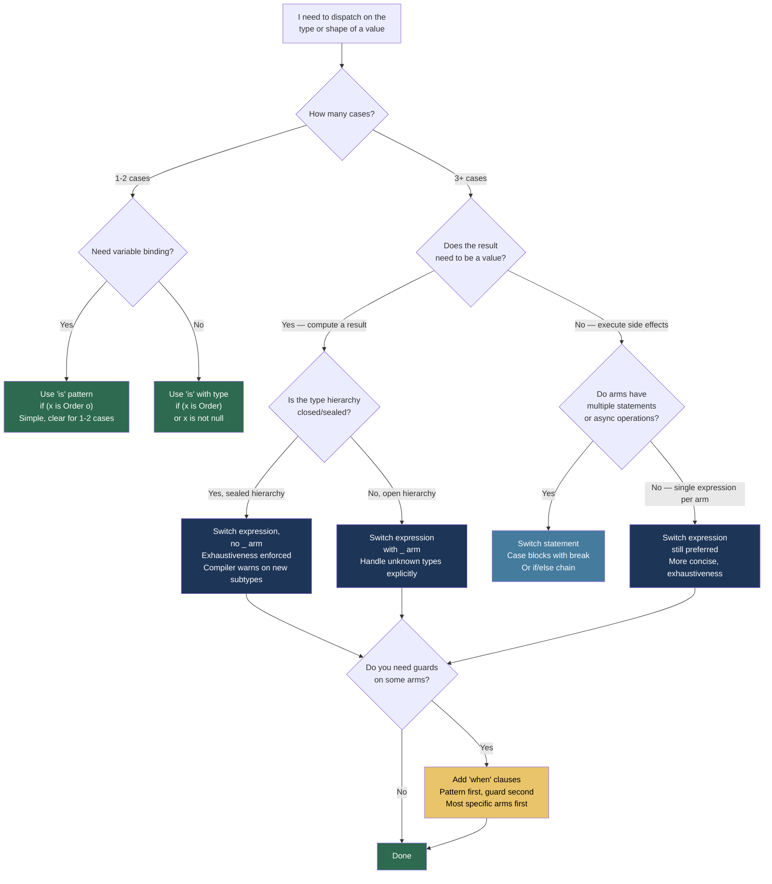

> [!success] Mastery Check
> - [ ] **Studied Well**
> - [ ] **Can explain the concept without notes**
> - [ ] **Can answer interview questions confidently**
> - [ ] **Can implement it in a real project**


## 📍 PART 0 — Navigation & Context

### Where This Topic Lives

```
C# Language Features
└── Control Flow & Type Discrimination
    ├── Classic if/else + is/as (pre-C# 7)
    ├── ► Pattern Matching  ← YOU ARE HERE
    │       Declaration patterns   (C# 7)
    │       Type patterns          (C# 7)
    │       Property patterns      (C# 8)
    │       Tuple patterns         (C# 8)
    │       Relational patterns    (C# 9)
    │       Logical patterns       (C# 9)
    │       List patterns          (C# 11)
    │       Switch expressions     (C# 8)
    ├── Records (2.05)  ← amplified by pattern matching
    └── Nullable Reference Types (2.03) ← null pattern integration
```

### What You Need Before This

- **[[2.01 — Value Types vs. Reference Types]]** — type patterns generate `isinst` IL; understanding value vs reference types explains why unboxing is involved for value type patterns
- **[[2.03 — Nullable Reference Types]]** — the `null` pattern and `not null` pattern interact directly with NRT flow analysis; null checks via patterns are the preferred modern idiom
- **Basic C# switch statement** — pattern matching replaces and extends the classic switch; knowing the old semantics makes the improvements concrete

### What This Unlocks After

- **[[2.05 — Records]]** — records + sealed hierarchies + switch expressions = discriminated unions in C#; records provide the data, pattern matching provides the dispatch
- **[[2.10 — Expression Trees]]** — switch expressions can appear inside expression trees in some query contexts; understanding the lowering model matters here
- **Domain modeling with sealed hierarchies** — the technique of `sealed abstract` base + `record` subtypes + exhaustive switch is only usable once you know pattern matching deeply

### Why This Matters at Scale

Pattern matching lets you express complex dispatch over type hierarchies and data shapes in code the compiler can verify for exhaustiveness — eliminating entire categories of "forgot to handle this case" bugs that only appear in production when a new subtype is added.

---

## 🧠 PART 1 — The Core Mental Model

### The Fundamental Rule

> **A pattern is a test against a value's shape — its type, structure, or content — combined with optional variable binding. The compiler lowers every pattern to conditional branches and type checks, and can statically verify that a switch covers all possible cases.**

That sentence is the anchor. Patterns are not magic — they compile to `isinst`, null checks, property accesses, and comparisons. The compiler just writes that boilerplate for you and checks completeness.

### The Plain-Language Analogy

Think of pattern matching like a **customs inspection system at an airport**. Each customs lane is a pattern: "passengers with EU passports go here," "passengers with items to declare go there," "passengers with both go to this lane." The traveller (the value) moves through the lanes. The inspector (the compiler-generated check) matches the traveller against the lane's criteria — type of passport, presence of items. Once matched, the traveller is processed in that lane and their details are directly available (variable binding). A key feature: customs management (the compiler) can warn you if no lane handles Australian passports — that's exhaustiveness checking. The `when` guard on a pattern is the "unless the passenger has diplomatic immunity" secondary check applied after the lane match. And critically: the inspection criteria (patterns) are declarative rules, not imperative instructions — you describe what to match, not how to test for it step by step.

This analogy holds for the edge case of ordering: just as a customs lane for "all EU passengers" placed before a lane for "EU passengers with diplomatic status" would shadow the second lane, patterns in a switch are evaluated top-to-bottom and an earlier, broader pattern shadows a later, narrower one.

### The Full Pattern Matching Taxonomy

```mermaid
graph TD
    A["Pattern Matching in C#"] --> B["Patterns"]
    A --> C["Pattern Contexts"]

    B --> B1["Constant Pattern\nx is 42, x is null, x is 'A'"]
    B --> B2["Type Pattern\nx is Order o\ngenerates isinst + bind"]
    B --> B3["Declaration Pattern\nx is Order { } o\ntype check + bind"]
    B --> B4["Property Pattern\nx is { Status: OrderStatus.Paid }\nrecursive matching on members"]
    B --> B5["Positional / Deconstruct Pattern\nx is Point(var px, var py)\ncalls Deconstruct()"]
    B --> B6["Tuple Pattern\n(x, y) is (> 0, > 0)\nmatch tuple without Deconstruct"]
    B --> B7["Relational Pattern\nx is > 100\nx is >= 0 and <= 255"]
    B --> B8["Logical Pattern\nx is null or \"\"\nx is not null\nx is > 0 and < 100"]
    B --> B9["List Pattern (C# 11)\nx is [_, > 0, ..]\nmatch array/span by structure"]
    B --> B10["Var Pattern\nx is var v\nalways matches, binds to v"]
    B --> B11["Discard Pattern\nx is _\nalways matches, no binding"]

    C --> C1["is Expression\nif (x is Order o)"]
    C --> C2["switch Statement\nswitch(x) { case Order o: }"]
    C --> C3["switch Expression (C# 8)\nx switch { Order o => ..., _ => ... }"]
    C --> C4["when Guard\ncase Order o when o.Total > 1000:"]

    style B fill:#1d3557,color:#fff
    style C fill:#2d6a4f,color:#fff
    style B1 fill:#457b9d,color:#fff
    style B2 fill:#457b9d,color:#fff
    style B3 fill:#457b9d,color:#fff
    style B4 fill:#457b9d,color:#fff
    style B5 fill:#457b9d,color:#fff
    style B6 fill:#457b9d,color:#fff
    style B7 fill:#457b9d,color:#fff
    style B8 fill:#457b9d,color:#fff
    style B9 fill:#457b9d,color:#fff
    style B10 fill:#e9c46a,color:#000
    style B11 fill:#e9c46a,color:#000
```

> [!NOTE] Pattern Evolution by C# Version
> C# 7: `is` type patterns, declaration patterns, `switch` statement patterns with `when`
> C# 8: Switch expressions, property patterns, tuple patterns, positional patterns
> C# 9: Relational patterns, logical patterns (`and`, `or`, `not`), target-typed `new` in patterns
> C# 10: Extended property patterns (`x is { Address.City: "London" }`)
> C# 11: List patterns (`x is [first, .., last]`)

---

## 🔬 PART 2 — Deep Mechanics

### 2.1 What the Compiler Generates for Type Patterns — IL Evidence

The claim "patterns are syntactic sugar" is verifiable. Every type pattern compiles to `isinst` + conditional branch. The compiler writes this boilerplate so you don't have to — and more importantly, so it can reason about completeness.

```
━━━━━━━━━━━━━━━━━━━━━━━━━━━━━━━━━━━━━━━━━━━━━━━━━━━━━━━━━━━━━━
SCENARIO: Type pattern in an is expression
━━━━━━━━━━━━━━━━━━━━━━━━━━━━━━━━━━━━━━━━━━━━━━━━━━━━━━━━━━━━━━

// C# source:
if (payment is CreditCardPayment cc)
{
    Process(cc.CardNumber);
}

// Compiler generates (approximately):
var temp = payment as CreditCardPayment;  // isinst IL instruction
if (temp != null)                          // brfalse IL instruction
{
    CreditCardPayment cc = temp;           // binding — zero-cost reference assignment
    Process(cc.CardNumber);
}

// IL (actual):
  ldloc.0           // load 'payment'
  isinst CreditCardPayment  // test + cast; null if not matching type
  stloc.1           // store in temp
  ldloc.1           // load temp
  brfalse.s IL_0020 // branch if null (pattern not matched)
  ldloc.1           // load cc (same ref as temp)
  callvirt Process

━━━━━━━━━━━━━━━━━━━━━━━━━━━━━━━━━━━━━━━━━━━━━━━━━━━━━━━━━━━━━━
SCENARIO: Value type pattern — the unboxing difference
━━━━━━━━━━━━━━━━━━━━━━━━━━━━━━━━━━━━━━━━━━━━━━━━━━━━━━━━━━━━━━

object obj = 42;
if (obj is int n)          // value type match
{
    Console.WriteLine(n);  // n is an int, not boxed
}

// Compiler generates:
  ldloc.0           // load obj
  isinst int32      // test if boxed int
  brfalse.s ...     // branch if not
  ldloc.0           // load obj again
  unbox.any int32   // UNBOX: copies int value out of box to stack
  stloc.1           // store in n (stack local — no allocation)
  // n is now an unboxed int on the stack — no heap object

COST for reference type pattern: isinst = ~1 ns, reference assign = ~0 ns
COST for value type pattern: isinst + unbox.any = ~2-3 ns, no allocation
```

### 2.2 Switch Expression — Lowering and Exhaustiveness

The switch expression (C# 8) is the highest-value pattern matching feature for production code. Understanding how the compiler checks exhaustiveness is key.

```csharp
// Switch expression syntax:
decimal fee = payment switch
{
    CreditCardPayment cc                    => cc.Amount * 0.029m + 0.30m,
    BankTransferPayment bt when bt.IsACH    => 0.25m,
    BankTransferPayment bt                  => 0.75m,
    CryptoPayment { Currency: "BTC" }       => 0m,
    CryptoPayment cp                        => cp.Amount * 0.01m,
    null                                    => throw new ArgumentNullException(nameof(payment)),
    _                                       => throw new NotSupportedException(
                                                  $"Unknown payment type: {payment.GetType()}")
};
```

```
COMPILER EXHAUSTIVENESS ANALYSIS:

For a switch expression over a non-nullable sealed type hierarchy,
the compiler tracks which subtypes are covered:

  abstract class Payment { }         ← sealed hierarchy base
  sealed class CreditCardPayment  : Payment
  sealed class BankTransferPayment: Payment
  sealed class CryptoPayment      : Payment

  If Payment is sealed AND all subtypes are sealed:
    → Compiler KNOWS all possibilities. Can warn on missing arm.
    → The _ discard arm is not needed (but not forbidden).

  If Payment is NOT sealed (open hierarchy):
    → Any assembly can add new subtypes.
    → _ discard arm is REQUIRED or compiler emits CS8509 (non-exhaustive).
    → Without _, a MatchFailureException is thrown at runtime for unknown types.

COMPILER OUTPUT for exhaustive switch without _ arm:
  CS8509: The switch expression does not handle all possible values
          of its input type (it is not exhaustive).

RUNTIME BEHAVIOR when no arm matches (switch expression):
  → throws SwitchExpressionException (not MatchFailureException — it's the same type)
  → Message: "Unmatched value was [value]"
  → Stack trace points to the switch expression
```

**The compiler-generated decision tree for a switch expression:**

```
// Compiler generates approximately (for the payment example):
Payment __temp = payment;
if (__temp == null) { /* null arm */ }
else if (__temp is CreditCardPayment __cc) { return __cc.Amount * 0.029m + 0.30m; }
else if (__temp is BankTransferPayment __bt)
{
    if (__bt.IsACH) { return 0.25m; }       // when guard checked AFTER type match
    else            { return 0.75m; }
}
else if (__temp is CryptoPayment __cp)
{
    if (__cp.Currency == "BTC") { return 0m; }
    else                        { return __cp.Amount * 0.01m; }
}
else { throw new SwitchExpressionException(__temp); }

// Note: the compiler may generate a more optimized decision tree (jump tables,
// type handle comparisons) — the above is the logical equivalent.
```

**Cost:** Each arm is a type test (`isinst`) — O(1), ~1-2 ns per test. The switch is evaluated top-to-bottom; put the most frequent arm first for best performance in hot paths.

### 2.3 Property Patterns — Recursive Matching and the Compiled Form

Property patterns match on the shape of an object, not just its type. They eliminate large blocks of `if (x.A == y && x.B == z)` chains.

```csharp
// Property pattern syntax and what it compiles to:

// C# source:
bool IsHighValueDomesticOrder(Order order) =>
    order is
    {
        Status:     OrderStatus.Confirmed,
        TotalAmount: > 10_000m,
        Customer:   { Country: "US", Tier: CustomerTier.Premium }
    };

// Compiler generates (approximately):
bool IsHighValueDomesticOrder(Order order)
{
    if (order.Status != OrderStatus.Confirmed) return false;
    if (order.TotalAmount <= 10_000m) return false;

    var customer = order.Customer;       // property access: O(1)
    if (customer == null) return false;  // null check inserted automatically
    if (customer.Country != "US") return false;
    if (customer.Tier != CustomerTier.Premium) return false;

    return true;
}

// IMPORTANT: Nested property access uses intermediate variables.
// The compiler does NOT call order.Customer twice — it binds once.
// This is relevant for properties with side effects (unusual but possible).
```

**Extended property patterns (C# 10) — dotted paths:**

```csharp
// Before C# 10: nested braces required
order is { Customer: { Address: { City: "Seattle" } } }

// C# 10+: dotted path — same IL, cleaner syntax
order is { Customer.Address.City: "Seattle" }

// COST: Each property access in the pattern is O(1) if the property
// is a simple getter (field-backed). Computed properties run their logic.
// Pattern matching does NOT short-circuit between levels differently than
// manual code — it checks left to right, type first.
```

### 2.4 List Patterns (C# 11) — Matching Collections by Structure

List patterns match arrays, spans, and any type implementing `Length`/`Count` + indexer. They're particularly powerful for parsing fixed-format data.

```csharp
#nullable enable

// Syntax overview — all list pattern features:
int[] numbers = { 1, 2, 3, 4, 5 };

bool result = numbers switch
{
    []                    => false,  // empty
    [var single]          => true,   // exactly one element, bind it
    [var first, ..]       => true,   // one or more, bind first
    [_, _, ..]            => true,   // two or more (don't bind)
    [var head, ..var tail]=> true,   // bind first + rest as array
    [.., var last]        => true,   // bind last element
    [1, 2, 3]             => true,   // exact match on values
    _                     => false
};

// PRODUCTION USE: Parsing fixed-format CSV/protocol data
static string ParseOrderEvent(string[] fields) => fields switch
{
    ["ORDER_CREATED", var orderId, var customerId, var amount]
        => $"New order {orderId} from {customerId} for {amount}",

    ["ORDER_CANCELLED", var orderId, var reason]
        => $"Order {orderId} cancelled: {reason}",

    ["ORDER_SHIPPED", var orderId, var trackingId, ..]
        => $"Order {orderId} shipped, tracking: {trackingId}",

    [var unknown, ..]
        => throw new FormatException($"Unknown event type: {unknown}"),

    []
        => throw new FormatException("Empty event record")
};

// Compiler generates:
// 1. Check Length/Count for fixed-length patterns
// 2. Use indexer access for positional elements
// 3. Slice expression for ..var tail
// COST: O(n) in the worst case where n is the number of elements checked.
//       The slice for ..var creates a new array — O(k) where k is the slice length.
```

> [!WARNING] List Pattern Slice Allocation
> `[var head, ..var tail]` creates a **new array** for `tail`. If you're in a hot path parsing thousands of records, use `ReadOnlySpan<T>` slicing instead or avoid capturing the slice. The pattern test itself (checking structure) is cheap; the binding of `..var` is where allocation occurs.

### 2.5 Logical Patterns and Short-Circuit Evaluation

`and`, `or`, `not` in patterns are evaluated left-to-right with short-circuit semantics — same as `&&`, `||`, `!` in boolean expressions. But there's a subtle scoping rule for variable bindings.

```csharp
// 'and' — both sub-patterns must match; bindings from BOTH are available
if (shape is Circle c and { Radius: > 0 })
{
    // c is bound AND Radius > 0 confirmed
    Draw(c);
}

// 'or' — EITHER sub-pattern matches; bindings only available if BOTH branches bind same name
if (notification is EmailNotification { IsRead: false }
                 or SmsNotification   { IsRead: false })
{
    // No binding available — variable bindings across 'or' require same name + type
    MarkAsProcessed(notification); // use the original variable
}

// ⚠️ The binding-in-or constraint:
if (notification is EmailNotification e or SmsNotification e)
{
    // ONLY valid if EmailNotification and SmsNotification share a base type
    // for 'e', AND 'e' is bound in both branches. This compiles only if
    // the types share a common assignment-compatible type for 'e'.
    // In practice this is rare and confusing — avoid.
}

// 'not' — logical negation; interacts cleanly with NRT flow analysis
if (order is not null)
{
    // NRT flow analysis: order is NotNull after this check
    // 'is not null' is preferred over '!= null' because it cannot be operator-overloaded
    ProcessOrder(order);
}

// Relational pattern with 'and':
static string ClassifyLatency(int ms) => ms switch
{
    < 0               => throw new ArgumentOutOfRangeException(nameof(ms)),
    0                 => "Instant",
    > 0 and < 10      => "Excellent",
    >= 10 and < 100   => "Good",
    >= 100 and < 1000 => "Acceptable",
    >= 1000           => "Degraded"
};
// COST: Each relational pattern is one integer comparison — ~0.3 ns.
// The switch arms are evaluated top to bottom; compiler may optimize
// contiguous integer ranges to a range check or jump table.
```

---

## 💻 PART 3 — Production Code Patterns

### 3.1 The Sealed Hierarchy Discriminated Union

The most powerful pattern matching use case in enterprise C#. A sealed abstract base + sealed record subtypes + exhaustive switch expression creates a type-safe, compiler-verified sum type — everything a discriminated union gives you in F# or Rust, without a new language feature.

```csharp
#nullable enable

// Domain: Order fulfillment pipeline result
// Each step can succeed, fail, or be deferred — encoded as types, not as magic strings

public abstract record FulfillmentResult
{
    // sealed prevents external subtypes — enables exhaustiveness checking
    private FulfillmentResult() { }  // private constructor blocks inheritance from outside

    public sealed record Success(Guid ShipmentId, DateTimeOffset EstimatedDelivery)
        : FulfillmentResult;

    public sealed record InsufficientInventory(string Sku, int Requested, int Available)
        : FulfillmentResult;

    public sealed record AddressValidationFailed(string Reason, string SuggestedAddress)
        : FulfillmentResult;

    public sealed record CarrierUnavailable(string CarrierCode, string[] AlternativeCarriers)
        : FulfillmentResult;
}

// Usage: exhaustive switch — compiler enforces all cases are handled
public class FulfillmentController
{
    public IActionResult HandleFulfillment(FulfillmentResult result) =>
        result switch
        {
            FulfillmentResult.Success s =>
                Ok(new { ShipmentId = s.ShipmentId, Eta = s.EstimatedDelivery }),

            FulfillmentResult.InsufficientInventory inv =>
                Conflict(new
                {
                    Message = $"Only {inv.Available} units of {inv.Sku} in stock",
                    RequestedQuantity = inv.Requested
                }),

            FulfillmentResult.AddressValidationFailed addr =>
                UnprocessableEntity(new
                {
                    Error = addr.Reason,
                    Suggestion = addr.SuggestedAddress
                }),

            FulfillmentResult.CarrierUnavailable carrier =>
                ServiceUnavailable(new
                {
                    Message = $"Carrier {carrier.CarrierCode} is unavailable",
                    Alternatives = carrier.AlternativeCarriers
                })

            // No _ arm — if a new subtype is added to FulfillmentResult,
            // this switch gets CS8509: compiler tells you everywhere to update.
            // This is the entire point of the sealed hierarchy pattern.
        };
}
```

### 3.2 The Property Pattern Guard for Business Rules

Property patterns replace complex `if`-chains in business rule evaluation. The key: each pattern arm is self-documenting.

```csharp
#nullable enable

// Domain: Pricing engine — apply discounts based on order shape
public static class PricingEngine
{
    // ⚠️ WRONG: Imperative if-chain — hard to read, easy to miss a case
    public static decimal CalculateDiscountWrong(Order order, Customer customer)
    {
        if (customer.Tier == CustomerTier.Premium && order.TotalAmount > 500m)
            return 0.15m;
        if (customer.Tier == CustomerTier.Premium)
            return 0.10m;
        if (order.TotalAmount > 1000m && order.ItemCount > 10)
            return 0.08m;
        if (order.TotalAmount > 500m)
            return 0.05m;
        if (customer.IsFirstOrder)
            return 0.03m;
        return 0m;
    }

    // ✅ CORRECT: Property patterns — each arm is a named rule, declarative and auditable
    public static decimal CalculateDiscount(Order order, Customer customer) =>
        (order, customer) switch
        {
            // Tuple patterns combine multiple values — evaluated as a unit
            ({ TotalAmount: > 500m },  { Tier: CustomerTier.Premium })  => 0.15m,
            (_,                        { Tier: CustomerTier.Premium })  => 0.10m,

            // Relational + property: complex conditions without nesting
            ({ TotalAmount: > 1000m, ItemCount: > 10 }, _)              => 0.08m,
            ({ TotalAmount: > 500m  }, _)                               => 0.05m,

            // Specific customer state — first order discount
            (_, { IsFirstOrder: true })                                 => 0.03m,

            // Default: no discount
            _                                                           => 0m
        };
}

// IMPORTANT ORDER NOTE: Arms are evaluated top to bottom.
// ({ TotalAmount: > 500m }, { Tier: Premium }) must appear BEFORE
// (_, { Tier: Premium }) — otherwise the high-value premium case is never reached.
// The compiler warns (CS8510) when a later arm can never be reached.
```

### 3.3 The Type Dispatch Without Casting

The pre-pattern-matching idiom of `if (x is T) { ((T)x).Method() }` does two type checks. Declaration patterns do one. This pattern shows the correct modern form for type-based dispatch.

```csharp
#nullable enable

// Domain: Notification routing — different notification types need different senders
public class NotificationRouter
{
    private readonly IEmailSender   _emailSender;
    private readonly ISmsSender     _smsSender;
    private readonly IPushSender    _pushSender;

    // ⚠️ WRONG: Double type check — is + cast
    public Task RouteWrong(Notification notification)
    {
        if (notification is EmailNotification)
            return _emailSender.SendAsync((EmailNotification)notification); // second check!

        if (notification is SmsNotification)
            return _smsSender.SendAsync((SmsNotification)notification);     // second check!

        return Task.CompletedTask;
    }

    // ✅ CORRECT: Declaration pattern — single type check, bound variable
    public Task Route(Notification notification) =>
        notification switch
        {
            EmailNotification   { Priority: Priority.High } email
                => _emailSender.SendUrgentAsync(email.Address, email.Subject, email.Body),

            EmailNotification email
                => _emailSender.SendAsync(email.Address, email.Subject, email.Body),

            SmsNotification sms
                => _smsSender.SendAsync(sms.PhoneNumber, sms.Message),

            PushNotification push
                => _pushSender.SendAsync(push.DeviceToken, push.Title, push.Body),

            null
                => throw new ArgumentNullException(nameof(notification)),

            // Open hierarchy — new notification types from plugins would hit this:
            _ => throw new NotSupportedException(
                     $"No router registered for {notification.GetType().Name}")
        };
}
```

### 3.4 The List Pattern for Protocol Parsing

List patterns shine for parsing fixed-structure data — network protocols, CSV rows, command-line argument patterns — where the position of elements is significant.

```csharp
#nullable enable

// Domain: Event sourcing — parse domain event records from a message bus
// Format: [EventType, AggregateId, Version, ...payload fields]

public record DomainEvent(string EventType, Guid AggregateId, long Version);
public record OrderCreatedEvent(Guid OrderId, long Version, string CustomerId, decimal Amount)
    : DomainEvent("ORDER_CREATED", OrderId, Version);
public record OrderShippedEvent(Guid OrderId, long Version, string TrackingId)
    : DomainEvent("ORDER_SHIPPED", OrderId, Version);

public static class EventDeserializer
{
    public static DomainEvent Parse(string[] fields) => fields switch
    {
        // List pattern: exact element count + value matches + variable binding
        ["ORDER_CREATED", var rawId, var rawVer, var customerId, var rawAmount]
            when Guid.TryParse(rawId, out var orderId)
              && long.TryParse(rawVer, out var version)
              && decimal.TryParse(rawAmount, out var amount)
            => new OrderCreatedEvent(orderId, version, customerId, amount),

        ["ORDER_SHIPPED", var rawId, var rawVer, var trackingId]
            when Guid.TryParse(rawId, out var orderId)
              && long.TryParse(rawVer, out var version)
            => new OrderShippedEvent(orderId, version, trackingId),

        // Partial match — known event type, wrong field count
        [var knownType, ..]
            when knownType is "ORDER_CREATED" or "ORDER_SHIPPED"
            => throw new FormatException(
                   $"Malformed {knownType} record: wrong field count ({fields.Length})"),

        // Empty
        []
            => throw new FormatException("Empty event record"),

        // Unknown event type
        [var unknownType, ..]
            => throw new NotSupportedException($"Unknown event type: {unknownType}")
    };
}
```

### 3.5 The `when` Guard for Cross-Pattern Logic

`when` guards let you attach arbitrary boolean conditions to a pattern arm — the pattern still does the type check and binding, but the guard adds domain-logic constraints.

```csharp
#nullable enable

// Domain: Fraud detection — classify transaction risk based on multiple signals
public static class FraudScorer
{
    public static RiskLevel Classify(Transaction tx, UserProfile user) =>
        tx switch
        {
            // Guard accesses the bound variable AND external state
            { Amount: > 10_000m } t when user.IsNewAccount
                => RiskLevel.Critical,

            { Amount: > 10_000m, MerchantCountry: var country }
                when !user.TrustedCountries.Contains(country)
                => RiskLevel.High,

            { Amount: > 10_000m }
                => RiskLevel.Medium,

            // Pattern + guard using an external method call
            { MerchantId: var id } when IsBlacklistedMerchant(id)
                => RiskLevel.Critical,

            // Tuple of transaction + velocity (multiple signals)
            { Amount: > 1_000m } when GetHourlyVelocity(user.Id) > 5
                => RiskLevel.High,

            _
                => RiskLevel.Low
        };

    private static bool IsBlacklistedMerchant(string id) =>
        _blacklist.Contains(id);

    private static int GetHourlyVelocity(Guid userId) =>
        _velocityCache.GetOrDefault(userId, 0);

    private static readonly HashSet<string> _blacklist   = new();
    private static readonly Dictionary<Guid, int> _velocityCache = new();
}

// KEY POINT: 'when' guards are evaluated AFTER the pattern matches.
// The pattern does the type/shape check first. The guard runs only
// if the pattern matched. This matters for performance in hot paths:
// put cheap pattern checks before expensive guard evaluations.
```

### 3.6 Exhaustive Dispatch with `is` in Conditions

Not every dispatch needs a switch expression. The `is` pattern in `if`/`else if` chains is valid when you have 2-3 cases and want early-exit semantics. But know when to upgrade to switch.

```csharp
#nullable enable

// Domain: Payment reconciliation — process different event types from a stream
public class ReconciliationProcessor
{
    // ✅ Fine for 2-3 cases with very different control flow
    public async Task ProcessEvent(PaymentEvent evt)
    {
        if (evt is PaymentCaptured { Amount: > 0 } captured)
        {
            await RecordCapture(captured.PaymentId, captured.Amount);
            await NotifyAccounting(captured);
            return; // early exit after async work
        }

        if (evt is PaymentRefunded refunded)
        {
            await ProcessRefund(refunded.PaymentId, refunded.Amount, refunded.Reason);
            return;
        }

        if (evt is PaymentDisputed disputed)
        {
            await EscalateDispute(disputed.DisputeId, disputed.Amount);
            await NotifyRiskTeam(disputed);
            return;
        }

        // ⚠️ SIGNAL: When you have 4+ cases, upgrade to switch expression
        // The above could be:
        // await (evt switch { PaymentCaptured c => ..., PaymentRefunded r => ... })
        // But when each arm has multiple await statements, switch expression
        // becomes awkward — if/else is cleaner.
    }

    private Task RecordCapture(Guid id, decimal amount)       => Task.CompletedTask;
    private Task NotifyAccounting(PaymentCaptured evt)        => Task.CompletedTask;
    private Task ProcessRefund(Guid id, decimal amt, string r)=> Task.CompletedTask;
    private Task EscalateDispute(Guid id, decimal amt)        => Task.CompletedTask;
    private Task NotifyRiskTeam(PaymentDisputed evt)          => Task.CompletedTask;
}
```

### 3.7 The Var Pattern as a Diagnostic Escape Hatch

The `var` pattern always matches and binds the value to a new variable. It's primarily useful for capturing an intermediate result during a complex pattern chain, or as a "catch-all with name" that avoids the raw discard `_`.

```csharp
#nullable enable

// Domain: API response parsing — log unknown response shapes without crashing
public static class ApiResponseParser
{
    public static OrderSummary? ParseOrderResponse(ApiResponse response) =>
        response switch
        {
            { StatusCode: 200, Body: { } body }
                when TryParseOrder(body, out var order)
                => order,

            { StatusCode: 404 }
                => null,

            { StatusCode: >= 500 } serverError
                => throw new ApiException($"Server error: {serverError.StatusCode}"),

            // var pattern: always matches, gives us a name for logging
            // Use instead of _ when you need to reference the value
            var unknown
                => LogAndReturnNull(unknown)
        };

    private static OrderSummary? LogAndReturnNull(ApiResponse r)
    {
        Console.Error.WriteLine(
            $"Unexpected response shape: status={r.StatusCode}, body={r.Body}");
        return null;
    }

    private static bool TryParseOrder(string body, out OrderSummary? order)
    {
        order = null; // real impl would deserialize JSON
        return body.StartsWith("{");
    }
}

public record ApiResponse(int StatusCode, string? Body);
public record OrderSummary(Guid OrderId, decimal Total);
public class ApiException(string message) : Exception(message);
```

---

## ⚠️ PART 4 — Gotchas & Anti-Patterns

### Gotcha 1: Shadowed Arms — The Silent Logic Error

Engineers add a new, more-specific pattern arm at the bottom of an existing switch, not realising a broader arm higher up already captures it. The compiler warns with CS8510 for unreachable arms — but only when it can statically prove it. Property pattern shadowing is often not caught.

```csharp
// ⚠️ WRONG: The high-value international order arm can never be reached
decimal Classify(Order order) => order switch
{
    { TotalAmount: > 100m  }                                 => 0.05m,  // catches ALL > 100
    { TotalAmount: > 100m, Customer.Country: not "US" }      => 0.10m,  // NEVER REACHED
    // The first arm matches everything the second arm would match.
    // Compiler may warn CS8510 here, but not always for property patterns.
    _ => 0m
};

// ✅ CORRECT: Most specific arms first
decimal Classify(Order order) => order switch
{
    { TotalAmount: > 100m, Customer.Country: not "US" }      => 0.10m,  // more specific first
    { TotalAmount: > 100m  }                                 => 0.05m,  // less specific second
    _ => 0m
};

// WHY: Pattern arms are evaluated top to bottom. A broader pattern that subsumes
// a narrower one will always match first. The correct rule is:
// most specific conditions at the top, most general at the bottom.
// You cannot rely on the compiler to always catch this — test your dispatch logic.
```

### Gotcha 2: `when` Guard Side Effects and Evaluation

Engineers assume `when` guards are evaluated once per arm. In optimization scenarios, the compiler or JIT may evaluate a guard multiple times. More practically: a guard that has a side effect (logging, incrementing a counter) may fire even when a different arm ultimately matches — because the compiler evaluates guards as part of pattern selection.

```csharp
// ⚠️ WRONG: Guard with a side effect — fires even when arm doesn't win
int callCount = 0;
string Classify(object obj) => obj switch
{
    string s when LogAndCheck(s, ref callCount)  => "matched string",
    int n                                        => "matched int",
    _                                            => "other"
};

bool LogAndCheck(string s, ref int count) { count++; return s.Length > 3; }

// If obj = "hi" (length 2): LogAndCheck IS called (count becomes 1),
// but it returns false, so the arm is skipped.
// callCount is 1 even though "matched string" was never returned.
// If you're using guards for metrics, this double-counts.

// ✅ CORRECT: Side effects belong outside the guard
string Classify(object obj) => obj switch
{
    string s when s.Length > 3 => "matched long string",
    string                     => "matched short string",
    int                        => "matched int",
    _                          => "other"
};
// Count successful matches AFTER the switch, not inside guards.

// WHY: The C# specification guarantees pattern evaluation order
// (top to bottom, left to right), but guards are part of pattern matching —
// they are tried and discarded. The arm "running" is distinct from the guard "firing."
// Never put meaningful side effects in when guards.
```

### Gotcha 3: Struct Patterns Don't Generate `isinst` + `unbox_any` Twice — But Boxing Can Happen

When you pattern-match an `object` against a struct type, the unbox happens once. But engineers sometimes write patterns that cause inadvertent boxing of struct values during the match itself.

```csharp
// ⚠️ WRONG: Boxing occurs when passing a struct to a method accepting object for pattern use
public static string DescribeWrong<T>(T value)
{
    return value switch
    {
        // When T is a value type, 'value' must be boxed to be tested against
        // interface/object patterns — the compiler inserts boxing here.
        IFormattable f => f.ToString("G", null), // boxing T to IFormattable
        _              => value!.ToString() ?? ""
    };
}

// ✅ CORRECT: Constrain T or use typeof checks to avoid boxing in generic patterns
public static string Describe<T>(T value)
{
    // For known value types, avoid the switch-over-object boxing pattern
    if (value is int n)         return n.ToString("D");
    if (value is decimal d)     return d.ToString("C");
    if (value is IFormattable f) return f.ToString("G", null);
    return value?.ToString() ?? "";
}

// Or for value types specifically, the JIT handles type patterns without boxing
// when T is constrained to struct — the JIT generates direct type comparisons.

// WHY: Pattern matching on an unconstrained generic T causes the value to be boxed
// before `isinst` can test it. The boxing is the cost, not the pattern test.
// Use explicit `if (value is int n)` chains for known value type discrimination
// to keep the dispatch box-free.
```

### Gotcha 4: Null Handling in Exhaustive Switches — `null` Falls Through to `_`

Engineers write an exhaustive switch with `_` and assume null is handled. It isn't — `null` is a distinct case that does NOT match type patterns, and falls to `_`. If `_` throws `SwitchExpressionException`, null throws with a confusing message. Explicit null handling is always required.

```csharp
// ⚠️ WRONG: Null is not matched by a type pattern
Payment? payment = null;

decimal fee = payment switch
{
    CreditCardPayment cc => cc.Amount * 0.029m,
    BankTransfer bt      => 0.25m,
    // No null arm and no _ arm:
    // → throws SwitchExpressionException for null input
    // → message is "Unmatched value was null" — confusing in production
};

// ✅ CORRECT: Always handle null explicitly before type arms
decimal fee = payment switch
{
    null                 => throw new ArgumentNullException(nameof(payment)),
    CreditCardPayment cc => cc.Amount * 0.029m,
    BankTransfer bt      => 0.25m,
    _                    => throw new NotSupportedException(payment.GetType().Name)
};

// WHY: The C# specification states that null does not match any type pattern
// (because isinst returns null for a null input, and null != type).
// Null only matches: the constant pattern 'null', 'var p' (which binds null to p),
// and the discard '_'. It does NOT match 'Payment p' or any typed pattern.
// In a switch expression without null or _ arm, null input throws SwitchExpressionException.
```

### Gotcha 5: Positional Patterns Require a Matching `Deconstruct` Overload

Engineers try to use positional patterns on types without `Deconstruct`, or use them with the wrong arity, and get confusing compile errors. Records auto-generate `Deconstruct` for positional parameters; plain classes do not.

```csharp
// ⚠️ WRONG: Using positional pattern on a non-deconstructable type
public class OrderLine
{
    public string Sku    { get; init; } = "";
    public int    Qty    { get; init; }
    public decimal Price { get; init; }
}

// This does NOT compile — no Deconstruct method on OrderLine
if (line is (var sku, var qty, var price)) // CS8129: No suitable Deconstruct instance or
{ }                                         // extension method was found

// ✅ CORRECT OPTION 1: Add Deconstruct to the class
public class OrderLine
{
    public string  Sku   { get; init; } = "";
    public int     Qty   { get; init; }
    public decimal Price { get; init; }

    public void Deconstruct(out string sku, out int qty, out decimal price)
        => (sku, qty, price) = (Sku, Qty, Price);
}
// Now: if (line is (var sku, var qty, var price)) works

// ✅ CORRECT OPTION 2: Use a record (auto-generates Deconstruct for positional params)
public record OrderLine(string Sku, int Qty, decimal Price);
// if (line is (var sku, var qty, var price)) works automatically

// ✅ CORRECT OPTION 3: Use property pattern instead of positional
if (line is { Sku: var sku, Qty: var qty, Price: var price })
{ }
// Always works — no Deconstruct needed

// WHY: Positional patterns call Deconstruct() — a compiler-generated or user-defined
// method with out parameters. The arity of the pattern (number of variables) must
// exactly match a Deconstruct overload's parameter count. Records generate this
// automatically for their primary constructor parameters. Plain classes do not.
```

---

## 📊 PART 5 — Performance Implications

### 5.1 Allocation Characteristics

| Scenario | Allocation Behavior | Approx Cost |
|---|---|---|
| Type pattern on reference type: `x is Order o` | Zero allocation — `isinst` + ref assign | ~1 ns |
| Type pattern on value type from `object`: `obj is int n` | Zero allocation — `isinst` + `unbox.any` copies value | ~2-3 ns |
| Property pattern on a class: `x is { Status: Confirmed }` | Zero — property access + comparison | ~1-2 ns per property |
| Switch expression, 4 arms, type patterns | Zero — sequential `isinst` checks | ~2-8 ns total |
| `[var head, ..var tail]` list pattern with capture | Allocates new array for `tail` | ~50-200 ns (array alloc) |
| `[first, second]` list pattern, no slice capture | Zero — two index accesses + Length check | ~2 ns |
| `when` guard with method call | Cost of the method call | varies |
| Positional pattern: `x is (var a, var b)` | Zero — calls `Deconstruct` (stack locals) | ~1-3 ns |
| Tuple pattern: `(x, y) switch { (> 0, > 0) => ... }` | Zero — tuple is struct; no alloc | ~2 ns |
| Switch expression over `string` with constant patterns | String equality comparison per arm | ~5-20 ns depending on string length + arm count |

### 5.2 BenchmarkDotNet: Pattern vs Traditional Dispatch

```csharp
[MemoryDiagnoser]
[BenchmarkCategory("PatternMatching")]
public class PatternMatchingDispatchBenchmark
{
    private readonly Payment[] _payments;

    public PatternMatchingDispatchBenchmark()
    {
        _payments = Enumerable.Range(0, 1000).Select(i => i % 3 switch
        {
            0 => (Payment)new CreditCardPayment(100m + i),
            1 => new BankTransferPayment(200m + i),
            _ => new CryptoPayment(50m + i, "ETH")
        }).ToArray();
    }

    // Baseline: traditional is + cast (the old way)
    [Benchmark(Baseline = true)]
    public decimal TraditionalDispatch()
    {
        decimal total = 0;
        foreach (var p in _payments)
        {
            if (p is CreditCardPayment cc)       total += cc.Amount * 0.029m;
            else if (p is BankTransferPayment bt) total += 0.25m;
            else if (p is CryptoPayment cp)       total += cp.Amount * 0.01m;
        }
        return total;
    }

    // Pattern matching: switch expression
    [Benchmark]
    public decimal SwitchExpressionDispatch()
    {
        decimal total = 0;
        foreach (var p in _payments)
        {
            total += p switch
            {
                CreditCardPayment cc  => cc.Amount * 0.029m,
                BankTransferPayment   => 0.25m,
                CryptoPayment cp      => cp.Amount * 0.01m,
                _                     => 0m
            };
        }
        return total;
    }

    // Pattern matching: property patterns
    [Benchmark]
    public decimal PropertyPatternDispatch()
    {
        decimal total = 0;
        foreach (var p in _payments)
        {
            total += p switch
            {
                CreditCardPayment  { Amount: > 150m } cc => cc.Amount * 0.025m, // volume discount
                CreditCardPayment  cc                    => cc.Amount * 0.029m,
                BankTransferPayment                      => 0.25m,
                CryptoPayment      { Currency: "BTC" }   => 0m,
                CryptoPayment      cp                    => cp.Amount * 0.01m,
                _                                        => 0m
            };
        }
        return total;
    }
}

// Expected output (approximate, .NET 8, x64):
// | Method                     | Mean      | Error    | Allocated |
// |----------------------------|-----------|----------|-----------|
// | TraditionalDispatch        | 2.41 μs   | 0.04 μs  | -         |
// | SwitchExpressionDispatch   | 2.38 μs   | 0.03 μs  | -         |
// | PropertyPatternDispatch    | 2.52 μs   | 0.04 μs  | -         |
//
// Conclusion: Pattern matching is NOT slower than manual is/cast chains.
// The JIT generates equivalent or identical code. Use patterns for clarity.

public abstract class Payment { }
public class CreditCardPayment(decimal Amount) : Payment  { public decimal Amount { get; } = Amount; }
public class BankTransferPayment(decimal Amount) : Payment { public decimal Amount { get; } = Amount; }
public class CryptoPayment(decimal Amount, string Currency) : Payment
{
    public decimal Amount   { get; } = Amount;
    public string  Currency { get; } = Currency;
}
```

### 5.3 When to Care / When to Ignore

**When this costs you:**

- **List pattern slice `..var tail`** in a hot path — the `tail` slice allocates a new array. If you're parsing thousands of messages per second, use `ReadOnlySpan<T>` manual slicing instead or avoid capturing the remainder.
- **`when` guards that call expensive methods** — the guard runs even when the arm is eventually not selected if a later arm wins. An O(n) guard on every arm of a hot switch is O(n × arms).
- **Property patterns on computed properties with side effects** — each property access in a pattern runs that getter. A property that does IO or computation will execute for every pattern evaluation.
- **Type patterns over deep inheritance hierarchies** — each `isinst` is O(1) but the constant factor grows slightly with interface implementation counts. In practice this is never the bottleneck, but it's worth knowing.

**When this genuinely doesn't matter:**

- **Any switch with fewer than ~10 arms dispatching on reference types** — the total cost is under 20 ns even in the worst case.
- **Business logic methods** — a `Classify` or `GetFee` method that runs once per request at 1000 req/sec costs at most a few microseconds total across all calls.
- **Exhaustiveness checking overhead** — zero. Exhaustiveness is a compile-time property. It costs nothing at runtime.
- **The switch expression vs switch statement question** — they generate identical IL. Choose based on readability.

---

## 🎤 PART 6 — Interview Arsenal

### 6.1 The Question Bank

---

**Q: "What is pattern matching in C# and why is it useful?"**

**Average Answer:** "Pattern matching lets you test the type or properties of an object in a switch statement or if expression, and it makes the code cleaner."

**Why That's Insufficient:** Correct but shallow — describes the syntax without explaining the compiler model, the IL generated, or the exhaustiveness guarantee that makes it production-relevant.

> **Great Answer:** "Pattern matching is a set of language features that let you test a value against its type, structure, or content in a single expression, while simultaneously binding matched sub-values to variables. Under the hood, type patterns compile to `isinst` IL instructions — the same instruction as a manual `is` check — so there's no runtime overhead over what you'd write by hand. What you gain is two things that manual dispatch can't give you: binding without a second cast, and exhaustiveness checking. When you write a switch expression over a sealed type hierarchy, the compiler statically verifies that every possible subtype is handled. Add a new subtype and every unhandled switch in the codebase gets a compile-time warning. That's a category of bug — 'forgot to handle the new payment method' — that pattern matching eliminates entirely."

---

**Q: "What is the difference between a switch statement and a switch expression?"**

**Average Answer:** "A switch expression is the newer syntax using `=>` arrows, and it returns a value. A switch statement uses `case:` labels and executes code blocks."

**Why That's Insufficient:** True, but it misses the important differences around exhaustiveness, value-returning semantics, and the production implications of the expression form.

> **Great Answer:** "The mechanical difference is that a switch expression is an expression — it produces a value and every arm must yield a value or throw. A switch statement is a statement — it executes side-effecting code and arms can fall through or do nothing. But the more interesting difference is the exhaustiveness contract. A switch expression *must* be exhaustive at compile time or you get CS8509, whereas a switch statement silently does nothing for unmatched inputs. In production that matters: a non-exhaustive switch statement over a payment type hierarchy silently skips processing a new payment type; a switch expression fails at compile time when the new type is added. I default to switch expressions for dispatch logic and reserve switch statements for cases where the arms have complex multi-statement side effects, like async operations, where the expression form becomes unreadable."

---

**Q: "Explain how the compiler checks exhaustiveness for a switch expression."**

**Average Answer:** "If you don't have a default case or cover all possible values, the compiler gives a warning."

**Why That's Insufficient:** Misses the sealed-hierarchy optimization and the precise conditions under which the compiler can guarantee exhaustiveness.

> **Great Answer:** "The compiler's exhaustiveness analysis is type-driven. For a switch over an enum, it tracks which enum values are covered and warns if any are missing. For reference types, it's more nuanced: if the type is a sealed class or abstract class with only sealed subtypes — what I'd call a closed hierarchy — the compiler knows the complete set of possible runtime types and can verify every subtype is covered. If you cover all four subtypes of a sealed hierarchy without a `_` arm, the compiler accepts that as exhaustive and you get CS8509 the moment someone adds a fifth subtype. For open hierarchies — unsealed classes — the compiler can't know all possible subtypes, so `_` or a catch-all is required or you get the same warning. This is why the sealed abstract base + sealed record subtypes pattern is so powerful: it converts a runtime 'forgot a case' bug into a compile-time warning."

---

**Q: "What happens when no pattern matches in a switch expression?"**

**Average Answer:** "It throws an exception."

**Why That's Insufficient:** Every engineer knows it throws; the question is which exception, when it can happen despite good code, and how to write code that makes it impossible.

> **Great Answer:** "A switch expression with no matching arm throws `SwitchExpressionException` — a specific exception type introduced with C# 8 that carries the unmatched value in its message. Two important nuances: first, `null` does not match any type pattern, so if your input can be null and you don't have an explicit `null` arm, null input throws `SwitchExpressionException` with 'Unmatched value was null' — which is more confusing than a `NullReferenceException`. Second, in a sealed hierarchy switch without `_`, adding a new subtype compiles fine but throws at runtime the first time an instance of the new type hits the switch. This is exactly the case the exhaustiveness warning prevents — and why I never suppress CS8509 without understanding why the switch is intentionally incomplete."

---

**Q: "How do `and`, `or`, and `not` work in patterns, and what are their scoping rules for variable bindings?"**

**Average Answer:** "They let you combine patterns — `and` requires both to match, `or` either one."

**Why That's Insufficient:** Misses the binding scoping rule for `or` patterns and the evaluation order implications.

> **Great Answer:** "Logical patterns — `and`, `or`, `not` — behave like boolean short-circuit operators but applied to pattern evaluation. `and` evaluates left to right and both sub-patterns must match; bindings from both sides are available after. `or` evaluates left to right with short-circuit, and either side can match. The binding scoping rule for `or` is the important constraint: if you bind a variable in one branch of `or`, you can only use that binding after the `or` if the same name is bound with the same type in *both* branches. In practice this means you almost never bind variables in `or` patterns — you use `or` for value discrimination and reference the original variable. `not` is straightforward — it inverts the pattern and no bindings are available since a non-match produces no variable. The most practical use of `not` is `is not null`, which the compiler correctly uses to update the NRT flow state to NotNull, and which — unlike `!= null` — cannot be confused by operator overloading."

---

### 6.2 The Trick Questions

> [!WARNING] These Sound Simple — The Traps Are Non-Obvious

**"Does a type pattern work on null?"**
Trap: Engineers say "yes, `null is string s` sets s to null." The correct answer is no — `null` does not match any type pattern. `null is string s` is `false` and `s` is not bound. This is why `null` must be handled explicitly in switch expressions. The only patterns that match null are: the constant pattern `null`, the var pattern `var x` (which binds null to x), and the discard `_`.

**"What does `x is var v` always do?"**
Trap: Engineers say "it matches when x is not null." Wrong — `var` pattern always matches, including when x is null. `x is var v` is equivalent to `var v = x` — it binds whatever is in x, including null. It's useful as a switch expression arm to give the catch-all a name, but it is not a null check.

**"Can you use a pattern in a `while` loop condition?"**
Trap: Engineers say "no, patterns are only for `if` and `switch`." Correct answer: yes. `while (stream.Read() is int value && value != -1)` is valid C# 9+. The `is` pattern can appear anywhere a boolean expression is valid.

**"What is the difference between `Payment p` and `Payment { } p` as a pattern?"**
Trap: Engineers say they're the same. They are identical in behavior for reference types in current C# — both check the type and bind. However, `Payment { }` is a property pattern with zero property constraints, which was historically used in C# 8 when pure type patterns didn't bind. In modern C# they're functionally equivalent for reference types; for value types there can be subtle differences around null handling. The cleaner form is `Payment p`.

**"If a switch expression arm has a `when` guard and the guard returns `false`, does the next arm get evaluated?"**
Trap: Engineers say "no, it throws." The correct answer is yes — when a guard returns false, the pattern matching engine continues to the next arm just as if the pattern itself hadn't matched. The arm is rejected, not the entire switch. This is why a failed guard does not throw `SwitchExpressionException` — it just advances to the next arm.

---

### 6.3 Red Flags to Avoid

```
❌ "Pattern matching is just a cleaner if/else"
   — Misses exhaustiveness, binding, and the compiler's structural analysis entirely.

❌ "You need a Deconstruct method on every type to use patterns"
   — Property patterns and type patterns need no Deconstruct. Only positional patterns do.

❌ "The _ discard arm is always required"
   — Only for non-exhaustive types. On a sealed hierarchy where all subtypes are covered,
     _ is optional and its presence can hide newly-added-subtype bugs.

❌ "switch expressions are slower than switch statements"
   — The JIT generates equivalent code. This has been benchmarked repeatedly. Not a concern.

❌ "null matches the _ discard in a switch expression"
   — True, but this is a design trap. Explicit null handling before _ is always clearer
     and prevents SwitchExpressionException with "Unmatched value was null".

❌ Saying "pattern matching is a C# 8 feature"
   — Type patterns and declaration patterns were C# 7. Property/tuple/switch expression
     were C# 8. Relational/logical were C# 9. List patterns were C# 11.
     Getting the version history wrong signals shallow knowledge.

❌ "when guards are evaluated in a separate phase"
   — Guards are part of arm evaluation, top-to-bottom. They're not pre-filtered or cached.
     A guard runs every time its pattern arm is reached during matching.
```

---

## 🔀 PART 7 — Decision Framework



---

## ✅ PART 8 — Self-Check

### Conceptual Questions

Answer these from reasoning, not memory. If you reach for the docs, the concept isn't internalized yet.

1. A `switch` expression over an abstract class `Payment` with three known sealed subclasses has no `_` arm. A new sealed subclass `WalletPayment` is added to `Payment` next sprint. What happens at compile time? What happens at runtime before recompiling?

2. You write `if (amount is > 0 and < 1000)`. What IL does this compile to? How many branches are generated?

3. The pattern `x is { Address: { City: "London" } }` uses nested property patterns. The `Address` property has a computed getter that logs every access. How many times is `Address` accessed during this pattern evaluation? What about `City`?

4. Explain the difference between `var p` and `_` as the last arm of a switch expression. When would you use each?

5. You have a method `bool IsValid(Order? order)`. Inside it you write `if (order is { Status: OrderStatus.Confirmed })`. Does this protect against null? Explain what happens if `order` is null.

6. A switch expression arm has `when` guard that calls `_repo.Exists(id)` (a database call). This switch has 5 arms and 3 of them have this guard. What is the worst-case number of database calls for a single evaluation of this switch?

7. Can you write a list pattern that matches an array of exactly 3 elements where the first is 0 and the last is 100? Write it.

8. The `not` pattern in `x is not null` is preferred over `x != null` for a specific technical reason unrelated to readability. What is it?

9. You write a positional pattern `if (point is (0, 0))`. The `Point` class has two `Deconstruct` overloads: one with two `out` parameters (X, Y) and one with three (X, Y, Z). Which overload is called?

10. Describe what the compiler does — in terms of IL instructions — for the expression `obj switch { string s => s.Length, int n => n, _ => -1 }` when `obj` is an `object` holding the value `42`.

---

### Code Puzzles

**Puzzle 1:** What is printed?

```csharp
object? value = null;

string result = value switch
{
    string s => $"string: {s}",
    int n    => $"int: {n}",
    null     => "was null",
    _        => "other"
};

Console.WriteLine(result);
```

<details>
<summary>Answer</summary>

**Output:** `was null`

**Why:** `null` does not match any type pattern (`string s`, `int n`). It falls through to the explicit `null` constant pattern arm, which is the third arm. If the `null` arm were absent, `null` would match `_` (discard pattern). The evaluation order is strictly top to bottom — type patterns do not match null, so the first two arms are skipped.

</details>

---

**Puzzle 2:** Where is the bug? What does this print in a scenario that would expose it?

```csharp
#nullable enable

public static decimal GetDiscount(Order order) => order switch
{
    { Customer: { Tier: CustomerTier.Premium }, TotalAmount: > 500m }  => 0.15m,
    { TotalAmount: > 500m }                                            => 0.05m,
    { Customer: { Tier: CustomerTier.Premium } }                       => 0.10m,  // BUG
    _                                                                  => 0m
};

public record Customer(CustomerTier Tier);
public record Order(Customer Customer, decimal TotalAmount);
public enum CustomerTier { Standard, Premium }
```

<details>
<summary>Answer</summary>

**The bug:** The third arm `{ Customer: { Tier: CustomerTier.Premium } }` (10% discount for premium with no amount threshold) can **never be reached**. The first arm already handles Premium + high-value orders. The second arm handles all `TotalAmount > 500m` orders regardless of tier — including Premium customers with `TotalAmount > 500m`. Any Premium customer with `TotalAmount <= 500m` should hit the third arm for 10% — but a Premium customer with `TotalAmount > 500m` hits the second arm (5%) not the first (15%), because the second arm is checked first and it matches.

**The actual bug in the first arm:** Wait — look again. The first arm pattern is `{ Customer.Tier: Premium, TotalAmount: > 500m }`. The second arm is `{ TotalAmount: > 500m }` — this matches ALL orders with TotalAmount > 500m, INCLUDING premium customers. So a Premium customer with TotalAmount > 500m matches arm 2 (5%) instead of arm 1 (15%) only if arm 1 doesn't match first.

**Actually arm 1 does match first for Premium + > 500m.** So the real unreachable arm is arm 3 `{ Tier: Premium }` for Premium + ≤ 500m — that arm IS reachable. The compiler (CS8510) may or may not warn depending on property pattern analysis.

**The correct ordering for intended logic:**
```csharp
{ Customer.Tier: CustomerTier.Premium, TotalAmount: > 500m } => 0.15m,
{ Customer.Tier: CustomerTier.Premium }                      => 0.10m,
{ TotalAmount: > 500m }                                      => 0.05m,
_                                                            => 0m
```
Most specific first: Premium+high → Premium+any → anyone+high → everyone else.

</details>

---

**Puzzle 3:** Does this compile? What is the output?

```csharp
var numbers = new[] { 1, 2, 3, 4, 5 };

string description = numbers switch
{
    []                          => "empty",
    [var x]                     => $"one: {x}",
    [var x, var y]              => $"two: {x}, {y}",
    [1, 2, 3, 4, 5]             => "exactly 1-2-3-4-5",
    [var first, .., var last]   => $"many: {first}..{last}"
};

Console.WriteLine(description);
```

<details>
<summary>Answer</summary>

**Compiles:** Yes.

**Output:** `exactly 1-2-3-4-5`

**Why:** Arms are evaluated top to bottom. The array has 5 elements, so `[]` (0 elements), `[var x]` (1 element), and `[var x, var y]` (2 elements) don't match. The fourth arm `[1, 2, 3, 4, 5]` checks exact values — the array is exactly `{1, 2, 3, 4, 5}`, so it matches before reaching the `[first, .., last]` arm.

If the array were `{ 1, 2, 3, 4, 6 }`, the fourth arm would not match (6 ≠ 5) and the output would be `many: 1..6`.

</details>

---

**Puzzle 4:** What does this print? (The "most common misunderstanding" puzzle.)

```csharp
public abstract class ShippingMethod { }
public class StandardShipping : ShippingMethod { public decimal Cost => 5.99m;  }
public class ExpressShipping  : ShippingMethod { public decimal Cost => 14.99m; }
public class FreeShipping     : ShippingMethod { }

ShippingMethod method = new ExpressShipping();

decimal cost = method switch
{
    StandardShipping { Cost: var c } => c,
    FreeShipping                     => 0m,
    _                                => 9.99m   // ← what does this arm do?
};

Console.WriteLine(cost);
```

<details>
<summary>Answer</summary>

**Output:** `9.99`

**Why:** `method` is an `ExpressShipping` instance. It does not match `StandardShipping` (wrong type) or `FreeShipping` (wrong type), so it falls through to `_`. The `_` discard arm matches everything including `ExpressShipping` — yielding 9.99.

**The trap (the common misunderstanding):** Engineers expect the switch to throw because "all known subtypes aren't handled" — but `ShippingMethod` is not a sealed hierarchy. `ExpressShipping` is not listed as an arm at all. It falls through to `_` silently. The output is 9.99, not an exception, not a compile error. If the developer intended `ExpressShipping` to have a cost of 14.99, this is a logic bug that produces no runtime error — it just returns the wrong value. **Pattern matching only guarantees exhaustiveness for sealed hierarchies without `_`. Open hierarchies with `_` can silently mishandle new types.**

</details>

---

**Puzzle 5:** Does this method compile, and if so, what does it return for input `("US", 150m)`?

```csharp
#nullable enable

static string ClassifyOrder(string country, decimal amount) =>
    (country, amount) switch
    {
        ("US",  > 100m)            => "US Premium",
        ("US",  _   )              => "US Standard",
        (not "US", > 200m)         => "International Premium",
        (not "US", _   )           => "International Standard",
    };  // No _ arm
```

<details>
<summary>Answer</summary>

**Compiles:** Yes, with warning CS8509 if strict exhaustiveness analysis detects non-exhaustiveness. In practice, the compiler may or may not flag this — string patterns with `not` are hard to verify exhaustively. In .NET 8 this compiles with a warning about potential non-exhaustiveness.

**Return value for `("US", 150m)`:** `"US Premium"` — the tuple `("US", 150m)` matches the first arm: country is `"US"` (constant pattern) and amount `150m` is `> 100m` (relational pattern). Both sub-patterns match simultaneously.

**The missing case:** What if `country` is `null`? The constant pattern `"US"` would not match null. The `not "US"` pattern would also not match null (because `not` inverts the constant pattern, and `null` does not equal `"US"`, so logically null IS `not "US"` — actually this is correct, null IS not equal to "US", so `not "US"` DOES match null). So null country would hit `(not "US", _)` → "International Standard". This is arguably correct behavior but worth knowing: `not "US"` matches any non-"US" string including null.

</details>

---

## 🔗 PART 9 — Connections & Resources

### A. Related Topics Table

| Topic | Why It Connects |
|---|---|
| [[2.05 — Records]] | Records auto-generate `Deconstruct` for positional patterns and are the standard type for sealed hierarchy arms; the combination of records + sealed abstract base + switch expression is C#'s discriminated union pattern |
| [[2.01 — Value Types vs. Reference Types]] | Type patterns over value types generate `isinst` + `unbox.any` — one extra instruction vs reference types; understanding this explains why matching boxed structs has a small overhead |
| [[2.03 — Nullable Reference Types]] | The `is not null` pattern and `is null` pattern are the canonical NRT-aware null checks that update compiler flow state; they are preferred over `!= null` because they cannot be confused by operator overloading |
| [[2.10 — Expression Trees]] | Switch expressions in certain LINQ/IQueryable contexts need to be convertible to expression trees; not all pattern forms are expressible — list patterns and relational patterns are not supported in expression tree lambdas |
| [[2.04 — Pattern Matching]] | Self-referential: list patterns, relational patterns, and logical patterns all build on the core type/property pattern foundation described in Parts 2.1–2.2 of this note |
| [[2.26 — Equality and Comparison]] | Constant patterns in switch arms use structural equality — the same `==` semantics the type implements; understanding GetHashCode/Equals is needed to predict when constant patterns match |

### B. Books

| Book | Chapters | Why These Chapters |
|---|---|---|
| C# in Depth, 4th Ed. — Jon Skeet | Ch. 12 | Comprehensive treatment of pattern matching evolution from C# 7 through 9, with compiler lowering details and the reasoning behind design choices |
| Pro C# 10 — Andrew Troelsen & Philip Japikse | Ch. 9 | Covers all pattern types including C# 10 extended property patterns with production-context examples |
| Functional Programming in C# — Enrico Buonanno | Ch. 3, 8 | Uses pattern matching as the foundation for discriminated unions and functional dispatch — shows the architectural patterns enabled by exhaustive switch expressions |

### C. Essential Articles & Docs

- [Microsoft Docs: Pattern Matching Overview](https://learn.microsoft.com/en-us/dotnet/csharp/fundamentals/functional/pattern-matching) — canonical reference covering all pattern types with syntax and semantics
- [Microsoft Docs: Patterns Reference](https://learn.microsoft.com/en-us/dotnet/csharp/language-reference/operators/patterns) — the full language reference for every pattern form including C# 11 list patterns
- [Mads Torgersen: Pattern Matching in C# 8](https://devblogs.microsoft.com/dotnet/do-more-with-patterns-in-c-8-0/) — the C# language designer's blog post explaining the design rationale for switch expressions and property patterns
- [Microsoft Blog: C# 9 Pattern Matching](https://devblogs.microsoft.com/dotnet/welcome-to-c-9-0/#pattern-matching-enhancements) — covers relational and logical patterns with the team's examples
- [Kathleen Dollard: List Patterns in C# 11](https://devblogs.microsoft.com/dotnet/csharp-11-preview-updates/#list-patterns) — the feature spec blog post for list patterns including the slice semantics

---

> [!NOTE] Template Meta-Note
> **This note follows the 9-part C# Language Mastery template. Every section has a specific purpose:**
> - **Part 0**: Navigation — orient yourself before reading a line of content
> - **Part 1**: Core mental model — the one sentence + analogy + full taxonomy you anchor everything else to
> - **Part 2**: Deep mechanics — what the compiler and runtime actually do, not what the docs say
> - **Part 3**: Production code patterns — 5-7 annotated real-world patterns you can paste into a codebase
> - **Part 4**: Gotchas — 5 bugs that appear in experienced engineers' code, with wrong→right→why
> - **Part 5**: Performance — allocation table + benchmark + honest assessment of when it matters
> - **Part 6**: Interview arsenal — full Q&A with great answers written to be spoken aloud, trick questions, red flags
> - **Part 7**: Decision framework — a flowchart cheat sheet for live interviews
> - **Part 8**: Self-check — 10 questions + 5 code puzzles that require real understanding
> - **Part 9**: Connections — wiki links, books, articles for going deeper

---
*Last updated: 2026-06 · Domain: C# Language Mastery · Topic: 2.04*
