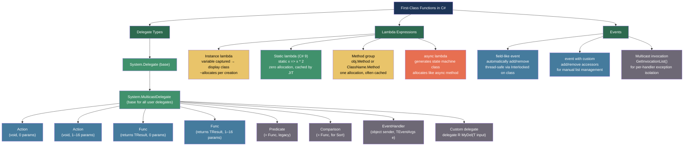
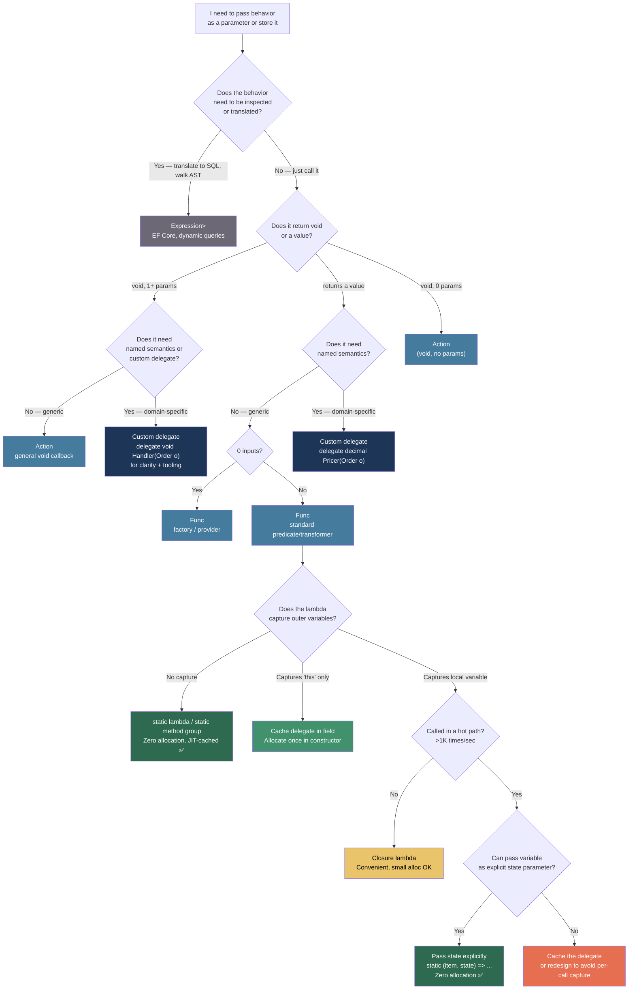

> [!success] Mastery Check
> - [ ] **Studied Well**
> - [ ] **Can explain the concept without notes**
> - [ ] **Can answer interview questions confidently**
> - [ ] **Can implement it in a real project**


## 📍 PART 0 — Navigation & Context

### Where This Topic Lives

```
C# Type System
└── First-Class Functions
    ├── Threading Primitives (2.23)       ← loosely related
    ├── ► Delegates, Func, Action,        ← YOU ARE HERE
    │     and Closures (2.08)
    ├──   LINQ — Execution Model (2.06)   ← depends on this
    ├──   async/await (2.07)              ← async lambdas extend this
    ├──   Expression Trees (2.10)         ← Expression<Func<T,R>> extends this
    └──   Zero-Allocation Patterns (2.15) ← static lambdas, cached delegates
```

### What You Need Before This
- [[2.01 — Value Types vs. Reference Types]] — delegates are reference types; the closure display class is a heap object
- Basic understanding of methods and method signatures in C#
- Familiarity with generics syntax (the `<T>` in `Func<T, bool>`)

### What This Unlocks After
- [[2.06 — LINQ — Execution Model and Every Operator]] — every LINQ operator accepts `Func<T, bool>` or similar delegates
- [[2.07 — async/await — The State Machine]] — `async` lambdas generate a full state machine class; closures and async interact in subtle ways
- [[2.10 — Expression Trees]] — `Expression<Func<T, R>>` is the same lambda syntax, but compiled to a data structure instead of executable code
- [[2.15 — Performance — Zero-Allocation Patterns]] — cached delegates and `static` lambdas are the primary tools for eliminating lambda allocation in hot paths

### Why This Matters to a Production Engineer at Scale

Every LINQ query, every callback, every strategy pattern, every event, and every async continuation in .NET is a delegate under the hood — understanding their allocation behavior, their identity rules, and how closures capture variables determines whether your hot paths allocate dozens of objects per request or zero.

---

## 🧠 PART 1 — The Core Mental Model

### The Fundamental Rule

> **A delegate is a type-safe object that holds a method pointer and an optional target object (`this`). A lambda that references a variable from an outer scope causes the compiler to generate a display class — a heap-allocated object — that holds that variable instead of the stack.**
> The practical consequence is that a lambda which looks like a one-liner may allocate a heap object every time it is created if it closes over anything.

### The Plain-Language Analogy

Think of a delegate as a **business card with a direct-dial extension**. The card holds two things: the number of the office building (the target object — `_target`) and the specific extension to dial (the method pointer — `_methodPtr`). When you "call the delegate," you dial the extension at that specific office. Passing the card around is free — it's just a reference. Creating a new card (instantiating a new delegate) costs a small heap allocation.

A **closure** is like leaving a **post-it note on the desk** of that office before you call. The post-it holds the variable value the lambda needs from the outer scope. The desk (display class) is a real object on the heap. If you create the delegate five times in a loop, you leave five post-its on five different desks — five heap allocations.

A **static lambda** has no desk at all. It dials the extension directly, with no office building involved, and no post-it note needed. Zero allocation.

### The Taxonomy Diagram



---

## 🔬 PART 2 — Deep Mechanics

### 2.1 Delegate Internals — What Lives in Memory

Every delegate instance is a reference type with exactly two fields:

```
━━━━━━━━━━━━━━━━━━━━━━━━━━━━━━━━━━━━━━━━━━━━━━━━━━━━━━━━━━━━━
DELEGATE MEMORY LAYOUT (single-target, non-multicast)
━━━━━━━━━━━━━━━━━━━━━━━━━━━━━━━━━━━━━━━━━━━━━━━━━━━━━━━━━━━━━

Func<int, int> square = x => x * x;  // static lambda — no display class

Stack                    Heap
┌────────────────┐       ┌─────────────────────────────────────┐
│ square         │──────►│ Delegate object                     │
│ (8B pointer)   │       │ ┌─────────────────────────────────┐ │
└────────────────┘       │ │ ObjHeader        (8 bytes)       │ │
                         │ │ TypePtr          (8 bytes)       │ │
                         │ │ _target          (IntPtr/null)   │ │  ← null for static methods
                         │ │ _methodPtr       (IntPtr)        │ │  ← pointer to the method
                         │ └─────────────────────────────────┘ │
                         │ ≈ 32 bytes total                     │
                         └─────────────────────────────────────┘

─────────────────────────────────────────────────────────────────

Func<int, int> adder = x => x + offset;  // instance lambda — closes over 'offset'

Stack                    Heap (object 1 — the display class)
┌────────────────┐       ┌──────────────────────────────────────┐
│ adder          │──┐    │ <>c__DisplayClass1 (compiler-generated)
│ (8B pointer)   │  │    │ ┌──────────────────────────────────┐ │
└────────────────┘  │    │ │ ObjHeader        (8 bytes)        │ │
                    │    │ │ TypePtr          (8 bytes)        │ │
                    │    │ │ offset (int)     (4 bytes)        │ │  ← captured variable lives here
                    │    │ └──────────────────────────────────┘ │
                    │    └──────────────────────────────────────┘
                    │                  ↑
                    │    Heap (object 2 — the delegate itself)
                    └──►┌──────────────────────────────────────┐
                        │ Delegate object                      │
                        │ _target  ──────────────────────────►(DisplayClass1 reference)
                        │ _methodPtr ───────────────────────►(compiled lambda method)
                        └──────────────────────────────────────┘

Total allocations when creating this lambda: 2 objects ≈ 64 bytes
```

**Cost:**
- Static lambda (no capture): ~32 bytes, one allocation, **cached by the JIT** after first creation
- Instance lambda (captures `this` only): ~32 bytes, one allocation — JIT may cache per object
- Closure lambda (captures local variable): ~64 bytes, **two allocations**, **new objects every creation** unless manually cached

---

### 2.2 Closure Compiler Transformation

The compiler's display class generation is the most important thing to understand about closures.

```csharp
// Original code — what you write:
public List<Func<int>> CreateAdders(int[] offsets)
{
    var result = new List<Func<int>>();
    int multiplier = 10;  // local variable

    foreach (int offset in offsets)
    {
        // Lambda captures both 'multiplier' AND 'offset'
        result.Add(() => offset * multiplier);
    }

    return result;
}

// ────────────────────────────────────────────────────────────────
// Compiler generates (approximately):
// ────────────────────────────────────────────────────────────────

// One display class is generated to hold ALL captured variables
// from the same scope:
[CompilerGenerated]
private sealed class <>c__DisplayClass0_0
{
    public int multiplier;   // 'multiplier' hoisted from outer scope
    public int offset;       // 'offset' hoisted from loop scope
                             // NOTE: same class! This is the loop capture bug.
}

public List<Func<int>> CreateAdders(int[] offsets)
{
    var result = new List<Func<int>>();

    // One display class instance shared across ALL loop iterations:
    var displayClass = new <>c__DisplayClass0_0();
    displayClass.multiplier = 10;

    foreach (int offset in offsets)
    {
        displayClass.offset = offset;  // ← Same object, field MUTATED each iteration

        // The delegate captures the DISPLAY CLASS OBJECT, not the value
        result.Add(new Func<int>(displayClass.<CreateAdders>b__0));
    }

    return result;
}

// ⚠️ BUG: All lambdas in the list share the SAME displayClass object.
// When you call result[0](), displayClass.offset is the LAST value of offset,
// not the value at iteration 0. This is the loop variable capture bug.
```

**The fix:**

```csharp
public List<Func<int>> CreateAdders_Fixed(int[] offsets)
{
    var result = new List<Func<int>>();
    int multiplier = 10;

    foreach (int offset in offsets)
    {
        // Introduce a NEW local variable inside the loop body
        // The compiler creates a SEPARATE display class per iteration
        int capturedOffset = offset;  // ← new variable = new display class = independent capture
        result.Add(() => capturedOffset * multiplier);
    }

    return result;
}

// Compiler now generates a NEW display class instance per iteration:
// Iteration 0: displayClass0.capturedOffset = offsets[0]
// Iteration 1: displayClass1.capturedOffset = offsets[1]
// Each lambda holds a DIFFERENT object → independent values ✅
```

---

### 2.3 When Delegates Allocate vs. When They Don't

This is the most production-relevant distinction. The JIT caches certain delegates.

```
┌─────────────────────────────────────────────────────────────────────┐
│              DELEGATE ALLOCATION RULES                              │
├─────────────────────────────────────────────────────────────────────┤
│ Lambda / method group                │ Allocates?  │  When cached?  │
├──────────────────────────────────────┼─────────────┼────────────────┤
│ static lambda: static x => x * 2    │ First time  │ Forever (JIT   │
│                                      │ only        │ caches static) │
├──────────────────────────────────────┼─────────────┼────────────────┤
│ static method group: Math.Abs        │ First time  │ Forever        │
│                                      │ only        │                │
├──────────────────────────────────────┼─────────────┼────────────────┤
│ Instance method group: this.Process  │ Every time  │ Only if you    │
│ (captures 'this')                    │             │ cache it       │
├──────────────────────────────────────┼─────────────┼────────────────┤
│ Lambda capturing 'this' only         │ Every time  │ Only if you    │
│ x => this.Value + x                  │             │ cache it       │
├──────────────────────────────────────┼─────────────┼────────────────┤
│ Lambda capturing local variable      │ Every time  │ Never (new     │
│ x => x + localVar                    │             │ display class) │
├──────────────────────────────────────┼─────────────┼────────────────┤
│ Lambda capturing loop variable       │ Every iter  │ Never          │
│ foreach: () => item.Name             │             │                │
├──────────────────────────────────────┼─────────────┼────────────────┤
│ async lambda: async () => await F()  │ Every time  │ Never (state   │
│                                      │             │ machine class) │
└──────────────────────────────────────┴─────────────┴────────────────┘
```

**IL evidence — what the JIT generates for a static lambda cache:**

```
// C#:
list.Where(static x => x > 0)

// IL (compiler generates):
// A static field to hold the cached delegate:
.field private static class [System.Runtime]System.Func`2<int32, bool>
      '<>9__0_0'

// In the method:
ldsfld   class Func<int32, bool> '<>9__0_0'
brtrue.s IL_already_cached                    // if already created, skip
ldftn    bool '<>c'::'<MethodName>b__0_0'(int32) // static method ptr
newobj   instance void Func<int32, bool>::.ctor(object, native int)
stsfld   class Func<int32, bool> '<>9__0_0'  // cache it in static field
IL_already_cached:
call     IEnumerable<int32> Where(IEnumerable<int32>, Func<int32, bool>)
```

**Runtime cost labels:**
- Static lambda (cached): ~1 ns (field read), 0 allocations after first call
- Instance lambda (no closure): ~8 ns, ~32 bytes per creation
- Closure lambda: ~15 ns, ~64 bytes per creation (display class + delegate)

---

### 2.4 Multicast Delegates — The Event Model

A delegate can hold a chain of methods (multicast). `+=` and `-=` create new delegate objects — they do not mutate the existing one.

```
━━━━━━━━━━━━━━━━━━━━━━━━━━━━━━━━━━━━━━━━━━━━━━━━━━━━━━━━━━━━━━━━━
MULTICAST DELEGATE INTERNALS
━━━━━━━━━━━━━━━━━━━━━━━━━━━━━━━━━━━━━━━━━━━━━━━━━━━━━━━━━━━━━━━━━

Action handler = null;
handler += MethodA;    // Creates new delegate, replaces handler
handler += MethodB;    // Creates another new delegate containing [MethodA, MethodB]
handler += MethodC;    // Creates another → [MethodA, MethodB, MethodC]

Memory layout (3-target multicast):
┌─────────────────────────────────────────┐
│ MulticastDelegate                       │
│  _invocationList: object[] ────────────►│[delegate→A, delegate→B, delegate→C]
│  _invocationCount: 3                    │
│  _target: null (for multicast)          │
│  _methodPtr: (dispatch shim)            │
└─────────────────────────────────────────┘

Invoking handler():
  → Walks _invocationList array
  → Calls each delegate in order
  → If MethodB throws: MethodC is NOT called (default behavior)
  → handler's return value = last delegate's return value (others discarded)

handler -= MethodB:
  → Creates a NEW delegate object with [MethodA, MethodC]
  → The original [MethodA, MethodB, MethodC] delegate is unreferenced → GC eligible
  → This is why events are thread-safe for read (snapshot the reference), but
    += and -= must be interlocked on class instances
```

**Cost:** Invocation walks an array — O(n) where n is the number of subscribers. For single-target delegates, the invocation list is null and the JIT inlines the direct call.

---

### 2.5 Method Group Conversions and Their Allocation Behavior

```csharp
// Method group: a method name used where a delegate type is expected
// The compiler generates a delegate wrapping the method.

public class OrderProcessor
{
    public bool IsValid(Order o) => o.Total > 0;  // instance method

    public void ProcessBatch(IEnumerable<Order> orders)
    {
        // ⚠️ Method group conversion: allocates a NEW Func<Order, bool> every time
        // this line runs, because it captures 'this'
        var valid = orders.Where(IsValid);

        // ✅ Cache the delegate — allocate once, reuse
        var valid2 = orders.Where(_isValidDelegate);

        // ✅ Static method group: cached by JIT — zero allocation per call
        var valid3 = orders.Where(static o => o.Total > 0); // or use a static method
    }

    // Cache instance method group delegates as fields:
    private Func<Order, bool>? _isValidDelegate;

    public OrderProcessor()
    {
        // One allocation at construction time; reused forever
        _isValidDelegate = IsValid;
    }
}
```

---

### 2.6 The `static` Lambda Keyword (C# 9)

The `static` modifier on a lambda is a **compiler enforcement tool**: it proves at compile time that no outer variables are captured, guaranteeing zero allocation and JIT caching.

```csharp
// Without 'static': compiler permits accidental capture
int threshold = 100;
var expensiveOrders = orders.Where(o => o.Total > threshold); // ← closure! allocates display class

// With 'static': any accidental capture is a compile-time error
// static int threshold = 100; // would have to be static or a const
const int Threshold = 100;
var expensiveOrders = orders.Where(static o => o.Total > Threshold); // ← zero alloc, JIT-cached

// ✅ Use 'static' as a correctness tool in performance-sensitive code:
// If the code compiles with 'static', you have a compiler guarantee of zero allocation.
// If you accidentally add a capture later, you get a compile error — not a silent regression.
```

---

## 💻 PART 3 — Production Code Patterns

### 3.1 The Cached Delegate — High-Frequency Filter in Inventory Service

Lambdas passed to LINQ in hot paths should be cached to avoid per-call allocation.

```csharp
// ⚠️ WRONG: allocates a new Func<Product, bool> and display class on EVERY call
public class InventoryService
{
    private readonly int _lowStockThreshold;

    public IEnumerable<Product> GetLowStockProducts(IEnumerable<Product> catalog)
    {
        // _lowStockThreshold captured → display class allocated every call
        return catalog.Where(p => p.StockLevel < _lowStockThreshold);
    }
}

// ✅ CORRECT: cache the delegate at construction time — one allocation, reused forever
public class InventoryService
{
    private readonly int _lowStockThreshold;
    private readonly Func<Product, bool> _isLowStock;  // cached delegate

    public InventoryService(int lowStockThreshold)
    {
        _lowStockThreshold = lowStockThreshold;
        // One allocation here — a delegate capturing 'this'
        // (which in turn gives access to _lowStockThreshold)
        _isLowStock = IsLowStock;
    }

    // Private method: named, testable, and forms a clean method group
    private bool IsLowStock(Product p) => p.StockLevel < _lowStockThreshold;

    public IEnumerable<Product> GetLowStockProducts(IEnumerable<Product> catalog)
        => catalog.Where(_isLowStock); // zero allocation per call
}
```

---

### 3.2 The Strategy Pattern Without Interface Overhead — Pricing Engine

Use `Func<T, R>` delegates to inject behavior without defining a full interface.

```csharp
// Domain: discount calculation strategies injected at runtime
// No interface needed for simple single-operation strategies

public class PricingEngine
{
    // Strategy stored as a delegate — swappable at runtime
    private readonly Func<decimal, decimal, decimal> _discountStrategy;

    // Constructor injection of the strategy
    public PricingEngine(Func<decimal, decimal, decimal> discountStrategy)
    {
        // Validate that strategy is not null — fail at construction, not at usage
        _discountStrategy = discountStrategy
            ?? throw new ArgumentNullException(nameof(discountStrategy));
    }

    public decimal CalculatePrice(decimal basePrice, decimal customerTier)
    {
        // Invoke the strategy — delegate call is a virtual dispatch equivalent (~5 ns)
        var discountedPrice = _discountStrategy(basePrice, customerTier);
        return Math.Max(0, discountedPrice);  // Business invariant: never negative
    }

    // Pre-built strategies as static methods — zero allocation when used as method groups
    public static decimal FlatDiscount(decimal price, decimal tier)
        => price - (tier * 5m);

    public static decimal PercentageDiscount(decimal price, decimal tier)
        => price * (1 - (tier * 0.05m));

    public static decimal NoDiscount(decimal price, decimal _)
        => price;
}

// Usage — method groups: allocated once at call site, cheap
var engine = new PricingEngine(PricingEngine.PercentageDiscount);
var finalPrice = engine.CalculatePrice(100m, 3m);
```

---

### 3.3 The Loop Variable Capture Bug — Order Event Registration

The classic capture bug, in a production-realistic domain: registering button callbacks in a loop.

```csharp
// ⚠️ WRONG: classic loop capture bug — all handlers fire with the LAST order
public void RegisterOrderHandlers(List<Order> orders, IOrderPanel panel)
{
    foreach (var order in orders)
    {
        // 'order' is the loop variable — shared across all iterations
        // All lambdas close over the SAME display class field
        panel.RegisterClickHandler(order.Id, () =>
        {
            // By the time any handler fires, the loop is done
            // 'order' is the last element of the list
            ProcessOrder(order); // ⚠️ Always processes the last order!
        });
    }
}

// ✅ CORRECT: capture by introducing a new variable inside the loop body
public void RegisterOrderHandlers_Fixed(List<Order> orders, IOrderPanel panel)
{
    foreach (var order in orders)
    {
        var capturedOrder = order;  // New variable = new display class = independent capture
        panel.RegisterClickHandler(capturedOrder.Id, () =>
        {
            ProcessOrder(capturedOrder); // ✅ Each handler has its own copy
        });
    }
}

// ✅ ALTERNATIVE: use a local function — cleaner and avoids the capture entirely
public void RegisterOrderHandlers_LocalFunc(List<Order> orders, IOrderPanel panel)
{
    foreach (var order in orders)
    {
        // 'order' in foreach with a local function: C# 8+ foreach variables
        // are per-iteration; no loop capture bug with local functions
        panel.RegisterClickHandler(order.Id, CreateHandler(order));
    }

    static Action CreateHandler(Order o) => () => ProcessOrder(o);
                                         // static: no accidental outer capture
}
```

---

### 3.4 Event Pattern with `GetInvocationList` — Notification Service

When multiple subscribers should not interfere with each other's error handling.

```csharp
// Domain: order fulfillment event — multiple downstream services subscribe
// One subscriber failing must not prevent others from receiving the event

public class OrderFulfillmentService
{
    // Field-like event: compiler generates add/remove with Interlocked.CompareExchange
    // Thread-safe for += and -= without explicit locking
    public event EventHandler<OrderFulfilledEventArgs>? OrderFulfilled;

    private readonly ILogger<OrderFulfillmentService> _logger;

    // ⚠️ NAIVE: first subscriber to throw kills all subsequent subscribers
    private void RaiseOrderFulfilled_Naive(Order order)
    {
        OrderFulfilled?.Invoke(this, new OrderFulfilledEventArgs(order));
        // If subscriber 2 of 5 throws, subscribers 3, 4, 5 never receive the event
    }

    // ✅ CORRECT: isolate each subscriber via GetInvocationList()
    private void RaiseOrderFulfilled(Order order)
    {
        var handler = OrderFulfilled;  // Snapshot for thread safety (immutable copy)
        if (handler == null) return;

        var args = new OrderFulfilledEventArgs(order);
        var exceptions = new List<Exception>();

        // Walk each subscriber independently
        foreach (var subscriber in handler.GetInvocationList())
        {
            try
            {
                subscriber.DynamicInvoke(this, args);
            }
            catch (Exception ex)
            {
                // Log and collect — do NOT stop iteration
                _logger.LogError(ex,
                    "Subscriber {Target} failed handling OrderFulfilled for {OrderId}",
                    subscriber.Target?.GetType().Name ?? "static",
                    order.Id);
                exceptions.Add(ex);
            }
        }

        // Aggregate and throw after all subscribers have been notified
        if (exceptions.Count > 0)
            throw new AggregateException(
                $"One or more subscribers failed handling OrderFulfilled for order {order.Id}",
                exceptions);
    }
}
```

---

### 3.5 The Static Lambda for Zero-Allocation LINQ — Product Catalog Search

Demonstrates `static` lambdas, method groups, and why it matters in high-throughput query paths.

```csharp
public class ProductCatalogService
{
    // Threshold is a constant — can be used inside a static lambda
    private const int MinimumRating = 3;

    // ⚠️ WRONG: closure over 'this._minStock' — new display class per call
    public IEnumerable<Product> FindActiveProducts_Bad(IEnumerable<Product> catalog)
    {
        return catalog
            .Where(p => p.IsActive && p.StockLevel > _minStockLevel) // captures _minStockLevel
            .OrderBy(p => p.Name);                                    // method group
    }
    private readonly int _minStockLevel = 5;

    // ✅ CORRECT: static lambdas for predicates against constants
    // Method groups for projection/ordering
    public IEnumerable<Product> FindActiveProducts(IEnumerable<Product> catalog)
    {
        return catalog
            .Where(static p => p.IsActive && p.StockLevel > 0) // static: JIT-cached, zero alloc
            .Where(static p => p.AverageRating >= MinimumRating) // const: accessible in static lambda
            .OrderBy(static p => p.Name);                        // static: JIT-cached
    }

    // ✅ PATTERN: when you need runtime thresholds, pass them as state to avoid closure
    // Use overloads that accept state to avoid captures:
    public IEnumerable<Product> FindProductsAboveThreshold(
        IEnumerable<Product> catalog,
        int stockThreshold)
    {
        // ⚠️ Would create closure: catalog.Where(p => p.StockLevel > stockThreshold)

        // ✅ Alternative: pass the state; avoid the closure
        // (LINQ doesn't natively support this, but a custom helper does)
        return FilterWithState(catalog, stockThreshold, static (p, threshold) => p.StockLevel > threshold);
    }

    // Helper that avoids closure by accepting state parameter
    private static IEnumerable<T> FilterWithState<T, TState>(
        IEnumerable<T> source,
        TState state,
        Func<T, TState, bool> predicate)
    {
        foreach (var item in source)
            if (predicate(item, state))
                yield return item;
    }
}
```

---

### 3.6 Multicast Delegate for Plugin Pipeline — Document Processing

```csharp
// Domain: document processing pipeline where steps can be added/removed at runtime
// Each step is a transformation: Document → Document

public class DocumentProcessingPipeline
{
    // Custom delegate for clarity — same as Func<Document, Document> but named
    public delegate Document ProcessingStep(Document doc);

    private ProcessingStep? _pipeline;

    // Subscribe — adds to the chain
    public void AddStep(ProcessingStep step)
    {
        // += creates a new multicast delegate — thread-safe pattern:
        // read, combine, compare-exchange in a loop (Delegate.Combine pattern)
        ProcessingStep? current, updated;
        do
        {
            current = _pipeline;
            updated = (ProcessingStep?)Delegate.Combine(current, step);
        } while (Interlocked.CompareExchange(ref _pipeline, updated, current) != current);
    }

    // Remove a step
    public void RemoveStep(ProcessingStep step)
    {
        ProcessingStep? current, updated;
        do
        {
            current = _pipeline;
            updated = (ProcessingStep?)Delegate.Remove(current, step);
        } while (Interlocked.CompareExchange(ref _pipeline, updated, current) != current);
    }

    // Execute pipeline — returns Document transformed by each step in order
    public Document Process(Document doc)
    {
        // Snapshot the pipeline reference — immutable at this point
        var pipeline = _pipeline;
        if (pipeline == null) return doc;

        // For Func<T,T>, multicast returns the LAST step's result
        // but discards intermediate results. We want chaining:
        var result = doc;
        foreach (var step in pipeline.GetInvocationList().Cast<ProcessingStep>())
            result = step(result);  // Each step transforms the previous output

        return result;
    }
}

// Usage:
var pipeline = new DocumentProcessingPipeline();
pipeline.AddStep(static doc => doc with { Content = doc.Content.Trim() });
pipeline.AddStep(static doc => doc with { Content = doc.Content.ToUpperInvariant() });

var processed = pipeline.Process(new Document("  hello world  "));
// processed.Content == "HELLO WORLD"
```

---

### 3.7 Func Composition — Validation Chain in User Registration

```csharp
// Domain: user registration — compose multiple validators into one predicate
// Without reflection, without base classes, without OOP overhead

public static class PredicateExtensions
{
    // Compose two predicates with AND logic
    public static Func<T, bool> And<T>(this Func<T, bool> first, Func<T, bool> second)
        => x => first(x) && second(x); // short-circuits: second not called if first fails

    // Compose two predicates with OR logic
    public static Func<T, bool> Or<T>(this Func<T, bool> first, Func<T, bool> second)
        => x => first(x) || second(x);

    // Negate a predicate
    public static Func<T, bool> Not<T>(this Func<T, bool> predicate)
        => x => !predicate(x);
}

public class UserRegistrationService
{
    // Validators as named static methods → method groups → zero allocation when composed once
    private static bool HasValidEmail(RegistrationRequest r)
        => r.Email.Contains('@') && r.Email.Length <= 254;

    private static bool HasStrongPassword(RegistrationRequest r)
        => r.Password.Length >= 8 && r.Password.Any(char.IsDigit);

    private static bool IsNotBannedDomain(RegistrationRequest r)
        => !_bannedDomains.Contains(r.Email.Split('@')[1]);

    private static readonly HashSet<string> _bannedDomains = new() { "spam.com", "temp-mail.org" };

    // Build the composite validator ONCE — store as a field
    // Each composition creates one closure delegate, but done at startup: amortized to zero
    private readonly Func<RegistrationRequest, bool> _isValid =
        ((Func<RegistrationRequest, bool>)HasValidEmail)
        .And(HasStrongPassword)
        .And(IsNotBannedDomain);

    public Result<UserId> Register(RegistrationRequest request)
    {
        if (!_isValid(request))
            return Result.Fail<UserId>("Registration request failed validation");

        // ... proceed with registration
        return Result.Ok(UserId.NewId());
    }
}
```

---

## ⚠️ PART 4 — Gotchas & Anti-Patterns

### Gotcha 1: The Loop Variable Capture (foreach with Reference Types)

Engineers know about the loop capture bug with value types but miss it with reference types — the reference itself is shared, not just a copy.

```csharp
// ⚠️ WRONG: all lambdas share the same 'task' reference (the LOOP variable)
// When the loop ends, 'task' points to the last task — all lambdas process it
var tasks = GetPendingTasks();
var handlers = new List<Action>();

foreach (var task in tasks)
{
    handlers.Add(() => Console.WriteLine(task.Name));
    // 'task' is NOT captured by value — the variable binding is captured
    // All lambdas close over the same display class field
}

handlers[0](); // Prints the LAST task's name, not the first

// ✅ CORRECT: introduce a new variable per iteration
foreach (var task in tasks)
{
    var captured = task;  // New variable = new display class = independent capture
    handlers.Add(() => Console.WriteLine(captured.Name));
}

// WHY: The compiler generates ONE display class with a field 'task'.
// The loop body MUTATES that field each iteration.
// All lambdas hold a reference to the same display class object.
// At invocation time, 'task' == tasks.Last().
```

### Gotcha 2: Delegate Equality Uses Reference Identity, Not Structural Equality

Removing a lambda from an event with `-=` silently fails if a new delegate object was created at the remove site.

```csharp
// ⚠️ WRONG: the lambda passed to -= is a NEW object — removal silently fails
public class OrderNotifier
{
    private event Action<Order>? _handlers;

    public void Subscribe()
    {
        _handlers += o => Console.WriteLine(o.Id); // Creates delegate object A
    }

    public void Unsubscribe()
    {
        _handlers -= o => Console.WriteLine(o.Id); // Creates delegate object B (DIFFERENT!)
        // Removal fails because A != B by reference — same code, different object
        // _handlers still has object A → memory leak and continued invocation
    }
}

// ✅ CORRECT: store the delegate and remove the stored reference
public class OrderNotifier
{
    private event Action<Order>? _handlers;
    private readonly Action<Order> _handler; // Keep the exact reference

    public OrderNotifier()
    {
        _handler = o => Console.WriteLine(o.Id); // Created ONCE
    }

    public void Subscribe()   => _handlers += _handler; // Store reference added
    public void Unsubscribe() => _handlers -= _handler; // Remove SAME reference ✅
}

// WHY: Delegate equality uses reference comparison (_target + _methodPtr pairs must match).
// Two lambda expressions that look identical compile to the same method but different
// object instances unless cached. -= with a new lambda always silently no-ops.
```

### Gotcha 3: Captured Variable Is Shared — Not Copied at Capture Time

Closures capture the variable, not the value. If the variable changes after the lambda is created, the lambda sees the new value.

```csharp
// ⚠️ WRONG: assumes capture is a snapshot — it is NOT
int discount = 10;
Func<decimal, decimal> applyDiscount = price => price * (1 - discount / 100m);

Console.WriteLine(applyDiscount(100m)); // 90.00 — correct so far

discount = 50; // Mutate the captured variable

Console.WriteLine(applyDiscount(100m)); // 50.00 — SURPRISE! Lambda sees the new value
                                        // because 'discount' was hoisted to a display class
                                        // The lambda holds a reference to the display class

// ✅ CORRECT: if you want a snapshot, create a local copy explicitly
int discount = 10;
int discountSnapshot = discount; // New variable = new display class field = snapshot
Func<decimal, decimal> applyDiscount = price => price * (1 - discountSnapshot / 100m);

discount = 50; // Changing 'discount' has no effect on discountSnapshot
Console.WriteLine(applyDiscount(100m)); // 90.00 — snapshot preserved ✅

// WHY: 'discount' is hoisted into a display class field.
// The lambda holds a reference to the display class.
// When discount = 50, the display class field is updated.
// The lambda reads the current field value at invocation time.
```

### Gotcha 4: async void in a Lambda Silently Swallows Exceptions

Assigning an async lambda where `Action` (not `Func<Task>`) is expected creates `async void` semantics.

```csharp
// ⚠️ WRONG: the lambda matches Action (void return) → async void semantics
// Exceptions from DoWorkAsync() crash the process
button.Click += async (s, e) =>
{
    await DoWorkAsync();  // If DoWorkAsync throws, exception escapes to SyncContext
                          // Crashes the process — not caught by button.Click infrastructure
};

// ✅ CORRECT: wrap in try/catch to handle the exception
button.Click += async (s, e) =>
{
    try
    {
        await DoWorkAsync();
    }
    catch (Exception ex)
    {
        _logger.LogError(ex, "Error in button click handler");
        ShowErrorToUser(ex.Message);
    }
};

// ✅ ALTERNATIVE: pass Func<Task> where possible instead of Action
// This forces the caller to await the lambda
public void RegisterAsyncHandler(Func<Task> handler) { ... }
// vs.
public void RegisterAsyncHandler(Action handler) { ... } // ← accepts async void accidentally

// WHY: The compiler matches the lambda to the delegate type based on return type.
// `async () => { await F(); }` matches Action (void) or Func<Task>.
// If matched to Action, it's async void — exceptions are unobservable.
// If matched to Func<Task>, it's async Task — exceptions are in the Task.
```

### Gotcha 5: Closure Over a Disposable — Use After Free

A lambda that captures an `IDisposable` can be invoked after the resource is disposed.

```csharp
// ⚠️ WRONG: HttpClient disposed before the lambda fires
public Func<Task<string>> CreateFetcher(string url)
{
    using var client = new HttpClient(); // Disposed when this method returns!
    return async () => await client.GetStringAsync(url); // Lambda captures disposed object
}

// Called later:
var fetcher = CreateFetcher("https://api.example.com/orders");
var result = await fetcher(); // ObjectDisposedException: HttpClient disposed

// ✅ CORRECT: ensure the captured resource outlives ALL lambdas that use it
public Func<Task<string>> CreateFetcher(string url)
{
    // Let the caller control lifetime, OR use a factory that the lambda owns
    var client = new HttpClient(); // NOT in a using block — lambda owns its lifetime
    return async () =>
    {
        try
        {
            return await client.GetStringAsync(url);
        }
        finally
        {
            // If this is a one-shot fetcher, dispose here; otherwise manage externally
        }
    };
}

// ✅ BETTER in production: inject IHttpClientFactory — factory is long-lived,
// clients are short-lived and managed by the factory
public class OrderFetcherFactory
{
    private readonly IHttpClientFactory _httpClientFactory;

    // Lambda captures the factory (long-lived singleton), not the client
    public Func<Task<string>> CreateFetcher(string url)
        => async () =>
        {
            using var client = _httpClientFactory.CreateClient("orders");
            return await client.GetStringAsync(url);
        };
}

// WHY: Closures capture by reference. A lambda closing over a disposed IDisposable
// holds a live reference to a dead object. The GC won't collect it
// (the lambda is keeping it alive), but using it throws ObjectDisposedException.
```

---

## 📊 PART 5 — Performance Implications

### 5.1 Allocation Characteristics Table

| Scenario | Allocation Behavior | Approx Cost |
|---|---|---|
| `static x => x * 2` — first call | One delegate object (~32B), then JIT caches in static field | ~32 B once, 0 after |
| `static x => x * 2` — subsequent calls | Read from static field | 0 B, ~1 ns |
| `x => x + localVar` — each call | New display class (~24B) + new delegate (~32B) | ~56 B per call |
| `x => this.Value + x` — each call | New delegate (~32B), display class is `this` | ~32 B per call |
| Method group `obj.Method` — each call | New delegate capturing `obj` reference | ~32 B per call |
| Method group `ClassName.Method` — first call | One delegate, JIT-cached | ~32 B once |
| `handler += method` multicast | New MulticastDelegate with invocation array | ~56 B + array |
| `handler -= method` multicast | New delegate (old one GC eligible) | ~56 B per removal |
| Delegate invocation (single target) | Direct call (JIT may inline) | ~3–5 ns |
| Delegate invocation (multicast, N subscribers) | Array walk + N virtual calls | ~5 ns × N |
| `async () => await F()` lambda | State machine class (~128B) + delegate | ~160 B per creation |
| Compiled lambda cached in static field | Amortized zero per call | 0 B per call |

### 5.2 BenchmarkDotNet Benchmark

```csharp
using BenchmarkDotNet.Attributes;
using System.Runtime.CompilerServices;

[MemoryDiagnoser]
[SimpleJob]
public class DelegateAllocationBenchmark
{
    private static readonly int[] _data = Enumerable.Range(0, 1000).ToArray();
    private readonly int _threshold = 500;

    // Cached delegates for comparison
    private readonly Func<int, bool> _instanceCached;
    private static readonly Func<int, bool> _staticCached = static x => x > 500;

    public DelegateAllocationBenchmark()
    {
        _instanceCached = IsAboveThreshold;
    }

    // ── Slow: closure allocated every call ──
    [Benchmark(Baseline = true)]
    public int ClosureLambda()
    {
        // _threshold captured → new display class + new delegate per call
        return _data.Count(x => x > _threshold);
    }

    // ── Faster: static lambda — JIT-cached, zero allocation ──
    [Benchmark]
    public int StaticLambda()
    {
        return _data.Count(static x => x > 500); // constant in static lambda
    }

    // ── Faster: cached instance method group ──
    [Benchmark]
    public int CachedInstanceMethodGroup()
    {
        return _data.Count(_instanceCached); // delegate created once in ctor
    }

    // ── Fastest: cached static delegate ──
    [Benchmark]
    public int CachedStaticDelegate()
    {
        return _data.Count(_staticCached); // delegate in static field, zero alloc
    }

    // ── For comparison: for loop, no delegate ──
    [Benchmark]
    public int ForLoop()
    {
        int count = 0;
        foreach (var x in _data)
            if (x > _threshold) count++;
        return count;
    }

    private bool IsAboveThreshold(int x) => x > _threshold;
}

// Expected output (approximate, .NET 8, x64):
// | Method                   | Mean      | Allocated |
// |--------------------------|-----------|-----------|
// | ClosureLambda            | 4.82 μs   | 56 B      |  ← display class + delegate per call
// | StaticLambda             | 1.83 μs   | -         |  ← 0 B after first call
// | CachedInstanceMethodGroup| 1.85 μs   | -         |  ← 0 B per call (allocated in ctor)
// | CachedStaticDelegate     | 1.81 μs   | -         |  ← 0 B
// | ForLoop                  | 0.91 μs   | -         |  ← no delegate overhead at all
//
// Key insight: static lambda and cached delegate are ~2.5x faster than closure lambda
// and match each other. The for loop is ~2x faster still (eliminates delegate overhead).
```

### 5.3 When to Care / When to Ignore

**When this costs you:**
- **LINQ queries in hot paths** (message processing, API handlers at >5K RPS): each closure creates ~56 bytes of allocation per call. At 10K RPS with 3 LINQ operators per request = 1.68 MB/s allocation from delegates alone
- **Event-heavy UI code**: subscribing with a new lambda in a render loop creates a new delegate every frame — events leak and memory climbs
- **Retry/middleware pipelines**: middleware that creates a new closure per request (e.g., capturing `ILogger` per-request) creates continuous Gen0 pressure
- **Tight processing loops**: passing a closure into a method called a million times in a batch

**When this doesn't matter:**
- Application startup and configuration code: runs once
- Methods called less than 1,000 times per second on any single path
- Complex multi-step operations where I/O dominates (the delegate cost is negligible vs. the network round trip)
- Code where clarity and composability matter more than allocation: prefer readable closures over obscure delegate caching

---

## 🎤 PART 6 — Interview Arsenal

### 6.1 The Question Bank

---

> **Q: "What is a closure in C# and how does the compiler implement it?"**

**Average answer:** "A closure is a lambda that captures variables from the surrounding scope."

**Why that's insufficient:** Describes the surface behavior but says nothing about how it's implemented, what the memory implications are, or what bugs it enables.

**Great answer:**
> "A closure is a lambda that references variables from an enclosing scope. The compiler implements it by generating a 'display class' — a heap-allocated object whose fields correspond to each captured variable. The lambda is compiled into a method on that class, so when the delegate is invoked, it reads and writes through the display class fields rather than any stack variable. The original local variable in the enclosing method is replaced with a field access. The practical consequence is twofold: first, the variable now lives on the heap for as long as the delegate is alive, even after the method that declared it returns. Second, if you create multiple lambdas in the same scope that all capture the same variable, they all share the same display class instance — mutating the variable in one lambda is visible to the others. That's the root cause of the loop variable capture bug and the 'captured variable changes after lambda creation' surprise."

---

> **Q: "What's the loop variable capture bug and how do you fix it?"**

**Average answer:** "In a for loop, all lambdas capture the same loop variable, so they all see the last value."

**Why that's insufficient:** Doesn't explain why, doesn't distinguish `for` from `foreach`, doesn't name the fix precisely.

**Great answer:**
> "The bug is a consequence of how closures are compiled. When a lambda inside a loop captures the loop variable, the compiler generates a single display class with one field for that variable. Every iteration of the loop assigns to that same field rather than creating a new independent copy. So all the lambdas close over the same field, and when you invoke them after the loop, they all read the current value of that field — which is the last assigned value. The fix is to introduce a new local variable inside the loop body and capture that instead. A new local per iteration means the compiler creates a new display class instance per iteration, so each lambda has an independent captured value. Worth noting: in modern C#, `foreach` over most collections doesn't have this problem by default if you capture the iteration variable directly — the C# spec changed the semantics for `foreach` but NOT for `for` loops."

---

> **Q: "When does creating a lambda in C# allocate on the heap?"**

**Great answer:**
> "It depends on what the lambda captures. If a lambda captures nothing — no outer variables, no 'this' — the compiler marks it static and the JIT caches the delegate in a static field after the first creation. Zero allocation on every subsequent call. If a lambda captures only 'this', the compiler generates a new delegate wrapping the method directly on 'this' — one allocation per creation, roughly 32 bytes, not cached. If a lambda captures a local variable, the compiler generates a display class object to hold that variable plus a delegate that targets it — two allocations, roughly 56 bytes, every single time. The `static` keyword on a lambda in C# 9 is a compile-time enforcement of the first case: if you write `static x => x + 1` and accidentally refer to an outer variable, the compiler refuses to compile it. I use it as a correctness tool in performance-sensitive paths — if the code compiles, I have a guarantee of zero allocation."

---

> **Q: "Explain multicast delegates and what happens when one subscriber throws."**

**Great answer:**
> "A multicast delegate holds an invocation list — an array of delegate objects — and when invoked, calls each one in registration order. The important production behavior is that if subscriber N throws an exception, subscribers N+1 onward never get called. For event-style patterns where each subscriber is independent — like sending an order confirmation email, updating an audit log, and triggering a webhook — this default behavior means one misbehaving subscriber silently blocks the others. The fix is to call `GetInvocationList()` to get the individual delegate objects, then iterate them manually in a `try/catch` per subscriber, collecting exceptions into a list and throwing an `AggregateException` after all subscribers have had a chance to run. The other subtlety: `+=` and `-=` don't mutate the existing delegate — they create new delegate objects. This means reading a delegate field and invoking it is safe under concurrent reads even without locks, but you need `Interlocked.CompareExchange` for thread-safe add/remove."

---

> **Q: "What's the difference between a delegate and an expression tree?"**

**Great answer:**
> "They're both created from lambda syntax, but the compiler treats them differently based on the target type. If you assign a lambda to `Func<T, R>`, the compiler compiles it to executable IL — a real method you can call. If you assign the same lambda to `Expression<Func<T, R>>`, the compiler builds a tree of objects describing the lambda's structure — `BinaryExpression`, `MemberExpression`, `ParameterExpression` and so on — rather than generating IL. The tree can be walked, transformed, and translated to other languages. Entity Framework Core uses this: when you write `Where(u => u.Age > 18)`, EF receives an `Expression<Func<User, bool>>`, walks the tree, and translates it to SQL. You can't do that with a compiled delegate — you can call it, but you can't inspect what it does. The constraint is that expressions can't contain statements, `await`, or `yield` — only expression-bodied constructs."

---

### 6.2 Trick Questions

> [!WARNING] These Sound Simple but Have Non-Obvious Answers

**"Does `list.Where(x => x > 0)` allocate every time it's called?"**
**The trap:** "Lambdas always allocate." **The answer:** It depends. `x => x > 0` with no capture is a candidate for static lambda optimization. In C# 9+, if you write `static x => x > 0`, the JIT caches the delegate. Without `static`, the compiler may or may not cache it depending on whether it detects no capture. Use `static` to guarantee caching.

**"Can two different lambdas with identical code be the same delegate?"**
**The trap:** "Same code = same delegate." **The answer:** No — two `() => 42` lambda expressions in different methods compile to different methods, producing different delegate objects. The only way to get the same delegate instance is to cache it in a variable or static field.

**"What is the return value of a multicast delegate invocation?"**
**The trap:** "It returns all values." **The answer:** It returns the return value of the **last** subscriber in the invocation list. All other return values are discarded. This is why `Action` (void) is preferred over `Func<T>` for events — the discard behavior is subtle and leads to bugs.

**"If a lambda captures a `ref` local, does the display class have a `ref` field?"**
**The trap:** "Closures capture anything." **The answer:** You cannot capture `ref` locals or `ref` parameters in a lambda. The compiler rejects it. `ref` variables are fundamentally stack-bound; putting them in a heap object would break memory safety. This is also why you can't capture `Span<T>` in a lambda.

**"Is `event Action MyEvent` thread-safe?"**
**The trap:** "Yes, events are thread-safe." **The answer:** The `+=` and `-=` operations on a `class` field-like event are thread-safe (the compiler generates `Interlocked.CompareExchange`). However, invocation (`MyEvent?.Invoke()`) is not automatically atomic — there's a TOCTOU between the null check and the invoke. The pattern `var copy = MyEvent; copy?.Invoke();` is correct because `copy` holds a snapshot.

---

### 6.3 Red Flags to Avoid

```
❌ "Lambdas don't allocate" or "Lambdas always allocate"
   → Both are wrong. It depends entirely on what the lambda captures.
     Static lambdas / no-capture lambdas are JIT-cached. Closures allocate.

❌ "Closures capture the value of the variable at lambda creation time"
   → Wrong. Closures capture the VARIABLE (display class field), not the value.
     The lambda sees changes made to the variable after creation.

❌ "You can remove an event handler with a new lambda that has the same code"
   → Wrong. Delegate equality is reference identity. Two lambdas with identical
     code are different objects. -= silently fails.

❌ Confusing Action<T> with Func<T> parameter signatures
   → Action<T> takes T and returns void; Func<T> takes nothing and returns T;
     Func<T, bool> takes T and returns bool. Get these wrong in an interview
     and it signals careless study.

❌ "async lambdas are the same as regular lambdas"
   → async lambdas generate a full state machine class — more like async methods
     than closures. They always allocate more than regular lambdas.

❌ "Using GetInvocationList() is an optimization"
   → It's a correctness tool for exception isolation, not a performance optimization.
     It's slightly slower than direct invocation.

❌ Not knowing that foreach variable capture semantics changed in C# 5
   → Before C# 5, foreach had the loop capture bug too. After C# 5,
     foreach's iteration variable is per-iteration scoped. for loops still have it.
```

---

## 🔀 PART 7 — Decision Framework



---

## ✅ PART 8 — Self-Check

### Conceptual Questions

1. The compiler generates a "display class" for closures. What are the fields of this display class? What are the methods? Where does it live in memory?

2. You have a method: `void Register(Action<Order> handler)`. A caller writes `Register(o => Process(o))`. How many heap allocations occur at the `Register` call site, and what are they?

3. Explain why `handler -= o => Process(o)` silently fails to remove the subscriber. What would you need to change to make removal work?

4. A `Func<int, int>` delegate is invoked 10 million times in a tight loop. The underlying method is a small arithmetic operation. What is the JIT likely to do with this invocation, and what does that tell you about delegate overhead?

5. A colleague writes `static x => x + offset` and gets a compile error. What is the error and what does it tell you about the `static` modifier on lambdas?

6. You use `GetInvocationList()` in an event dispatcher. Your event has 0 subscribers. What does `GetInvocationList()` return, and how do you handle that case?

7. Why can't you capture a `Span<T>` in a lambda? What fundamental constraint causes this?

8. A lambda is declared inside an `async` method and captures a local variable. After the `async` method `await`s and resumes on a different thread, the lambda is invoked. What thread does the lambda run on? Is there a race condition if another thread also invokes the lambda?

9. What is the difference between `Predicate<T>` and `Func<T, bool>`? Are they compatible? Can you pass one where the other is expected?

10. A multicast delegate has 4 subscribers. Subscriber 2 throws an `InvalidOperationException`. What is the state of the delegate after the exception? Were subscribers 3 and 4 called?

---

### Code Puzzles

**Puzzle 1 — What is printed?**
```csharp
var actions = new List<Action>();
for (int i = 0; i < 3; i++)
{
    actions.Add(() => Console.WriteLine(i));
}
foreach (var a in actions)
    a();
```

<details>
<summary>Answer (expand after trying)</summary>

**Printed:** `3`, `3`, `3`

The `for` loop variable `i` is captured by reference into a display class. All three lambdas share the same display class field. After the loop completes, `i == 3`. When the lambdas are invoked, they all read the current value of `i`, which is 3.

**Fix:** `int copy = i; actions.Add(() => Console.WriteLine(copy));` — each iteration creates a new display class with an independent `copy` field.

**Note:** This also applies to `foreach` in C# 4 and earlier. In C# 5+, `foreach` over most collections uses a per-iteration variable — but `for` loops always have this behavior.

</details>

---

**Puzzle 2 — How many heap allocations does this code make per call to `Filter`?**
```csharp
public class OrderService
{
    private readonly decimal _minTotal;

    public OrderService(decimal minTotal) => _minTotal = minTotal;

    public IEnumerable<Order> Filter(IEnumerable<Order> orders)
        => orders.Where(o => o.Total >= _minTotal);
}
```

<details>
<summary>Answer (expand after trying)</summary>

**2 heap allocations per call to `Filter`:**

1. **The display class** (`<>c__DisplayClass0_0`) — created to hold `_minTotal` captured from `this`. Wait — actually it captures `this` (the `OrderService` instance), not `_minTotal` directly. The lambda `o => o.Total >= _minTotal` is transformed to a method on the display class that accesses `<>4__this._minTotal`. The display class holds the reference to `this`.

   Actually: in this specific case, since the lambda captures only `this` (an instance field reference), the compiler may optimize this to a method on `OrderService` itself with `this` as `_target`, avoiding the display class. This generates one delegate per call capturing `this` directly.

   **The answer is 1 allocation (the delegate itself, ~32B)**, not 2, because capturing `this` is treated as an instance method binding rather than a closure over a field. The delegate's `_target` = `this` (the `OrderService`), `_methodPtr` = the compiled lambda method on `OrderService`.

**If you want zero allocations:** Cache the delegate in the constructor as a field: `private readonly Func<Order, bool> _filter; _filter = o => o.Total >= _minTotal;` — one allocation at construction, zero per call to `Filter`.

</details>

---

**Puzzle 3 — Does this remove the subscriber correctly?**
```csharp
public class ShippingService
{
    public event EventHandler<ShipmentEventArgs>? ShipmentReady;

    public void Subscribe(INotificationService notifier)
    {
        ShipmentReady += (s, e) => notifier.Notify(e.Shipment);
    }

    public void Unsubscribe(INotificationService notifier)
    {
        ShipmentReady -= (s, e) => notifier.Notify(e.Shipment);
    }
}
```

<details>
<summary>Answer (expand after trying)</summary>

**No, the subscriber is NOT removed.**

Each time `Subscribe` is called, a new lambda object is created and registered. The lambda's `_target` and `_methodPtr` point to the specific display class instance created at subscribe time. When `Unsubscribe` is called, a SECOND lambda is created — also closing over `notifier`, but it's a different object entirely. Delegate `-=` uses reference equality: since the new lambda is a different object, it does not match the original, and the removal silently fails. The event continues to fire the original subscriber.

**Fix:** Store the delegate:
```csharp
private readonly Dictionary<INotificationService, EventHandler<ShipmentEventArgs>> _handlers = new();

public void Subscribe(INotificationService notifier)
{
    EventHandler<ShipmentEventArgs> handler = (s, e) => notifier.Notify(e.Shipment);
    _handlers[notifier] = handler;
    ShipmentReady += handler;
}

public void Unsubscribe(INotificationService notifier)
{
    if (_handlers.TryGetValue(notifier, out var handler))
    {
        ShipmentReady -= handler;  // Removes the exact reference ✅
        _handlers.Remove(notifier);
    }
}
```

</details>

---

**Puzzle 4 — What does this print?**
```csharp
int value = 1;
Func<int> getDouble = () => value * 2;

Console.WriteLine(getDouble()); // Line A

value = 10;
Console.WriteLine(getDouble()); // Line B

Func<int> snapshot = getDouble;
value = 100;
Console.WriteLine(snapshot()); // Line C
```

<details>
<summary>Answer (expand after trying)</summary>

**Printed:** `2`, `20`, `200`

Line A: `value == 1`, lambda returns `1 * 2 = 2`.
Line B: `value == 10` (captured variable was mutated), lambda returns `10 * 2 = 20`.
Line C: `snapshot` is a copy of the delegate OBJECT reference — it still points to the same display class, which still closes over the same `value` field. `value == 100`, lambda returns `100 * 2 = 200`.

Copying the delegate (`Func<int> snapshot = getDouble`) does NOT snapshot the captured variable. Both `getDouble` and `snapshot` point to the same delegate object, which points to the same display class, which holds a reference to `value`. Mutations to `value` are seen by both.

**Key insight:** Assigning a delegate to another variable copies the pointer to the delegate object. The display class (and its captured fields) are shared.

</details>

---

**Puzzle 5 — Where is the bug and what is the runtime consequence?**
```csharp
public class PaymentProcessor
{
    private event Func<PaymentRequest, bool>? _validators;

    public void AddValidator(Func<PaymentRequest, bool> validator)
        => _validators += validator;

    public bool ValidatePayment(PaymentRequest request)
    {
        return _validators?.Invoke(request) ?? true;
    }
}

// Usage:
var processor = new PaymentProcessor();
processor.AddValidator(r => r.Amount > 0);
processor.AddValidator(r => r.CardNumber.Length == 16);
processor.AddValidator(r => r.CVV.Length == 3);

var isValid = processor.ValidatePayment(new PaymentRequest(
    Amount: 100m, CardNumber: "1234567890123456", CVV: "123"));
```

<details>
<summary>Answer (expand after trying)</summary>

**The bug:** Using `Func<T, bool>` (a non-void returning delegate) as a multicast event is incorrect because multicast invocation returns only the **last** subscriber's return value. The return values of `r.Amount > 0` and `r.CardNumber.Length == 16` are silently discarded. Only `r.CVV.Length == 3` determines the result.

For the given input, the result happens to be `true` (CVV is 3 characters). But a payment with `Amount: 0` would also return `true` because the Amount validator's `false` result is discarded.

**Fix:** Use `Action<PaymentRequest>` with exception-based rejection, or use an explicit list of validators and check all:

```csharp
private readonly List<Func<PaymentRequest, bool>> _validators = new();

public bool ValidatePayment(PaymentRequest request)
    => _validators.All(v => v(request)); // All must return true
```

**Runtime consequence:** The `Amount > 0` check is completely ineffective. Payments with zero or negative amounts pass validation. This is a silent correctness bug — no exception, no compile warning, wrong behavior.

</details>

---

## 🔗 PART 9 — Connections & Resources

### Related Topics in This Vault

| Topic | Why It Connects |
|---|---|
| [[2.01 — Value Types vs. Reference Types]] | Delegates are reference types; the display class is a heap object; understanding value type semantics explains why `Span<T>` cannot be captured |
| [[2.06 — LINQ — Execution Model and Every Operator]] | Every LINQ operator takes a `Func<T, bool>` or `Func<T, R>` delegate; deferred execution stores the delegate and invokes it on enumeration — allocation implications are direct |
| [[2.07 — async/await — The State Machine]] | `async` lambdas generate a state machine class on top of the closure display class; async delegates combine both allocation models |
| [[2.10 — Expression Trees]] | `Expression<Func<T, R>>` uses the same lambda syntax but the compiler produces an AST object tree instead of IL; understanding delegates is prerequisite to understanding why the distinction matters |
| [[2.15 — Performance — Zero-Allocation Patterns]] | `static` lambdas, cached method groups, and state-passing patterns are the primary tools for eliminating delegate-related allocation in hot paths |
| [[2.17 — Iterators and yield return]] | Iterator state machines have structural similarity to closure display classes; both are compiler-generated heap objects holding local state |
| [[2.23 — Threading Primitives]] | Thread-safe event add/remove uses `Interlocked.CompareExchange`; invoking a multicast event requires snapshotting the delegate reference for thread safety |

### Books

| Book | Chapters | Why These Chapters |
|---|---|---|
| C# in Depth — Jon Skeet | Ch. 5, 9 (4th ed.) | Closures explained from first principles with IL; lambda to delegate to expression tree progression |
| CLR via C# — Jeffrey Richter | Ch. 17 | Delegate internals: memory layout, multicast invocation, `GetInvocationList`, `BeginInvoke` |
| Pro .NET Performance — Sasha Goldshtein et al. | Ch. 4 | Lambda allocation measurement, closure overhead in hot paths, caching strategies |

### Essential Articles & Docs

- [Microsoft Docs: Delegates](https://learn.microsoft.com/en-us/dotnet/csharp/programming-guide/delegates/)
- [Microsoft Docs: Lambda Expressions](https://learn.microsoft.com/en-us/dotnet/csharp/language-reference/operators/lambda-expressions)
- [Stephen Toub: "Delegates and Lambdas"](https://devblogs.microsoft.com/dotnet/delegates-and-lambdas/) — allocation behavior, caching, and JIT treatment
- [Jon Skeet: "Closures in C#"](https://csharpindepth.com/articles/Closures) — definitive explanation of display class generation with IL examples
- [Performance Best Practices: Avoid allocations](https://learn.microsoft.com/en-us/dotnet/core/extensions/high-performance-delegate) — Microsoft guidance on static lambdas and cached delegates

---

> [!NOTE] Template Meta-Note
> **Every section in this note serves a specific purpose:**
> - **Part 0:** Navigation — know where you are before reading a single word of content
> - **Part 1:** Core mental model — one sentence, one analogy, one taxonomy; the anchor everything else hangs from
> - **Part 2:** Deep mechanics — what the runtime actually does (compiler output, memory diagrams, lifecycle)
> - **Part 3:** Production code — real patterns with names, domains, annotated decisions; anti-patterns always shown first
> - **Part 4:** Gotchas — five bugs that appear in real senior-engineer codebases; wrong→right→why format
> - **Part 5:** Performance — allocation table, runnable benchmark, explicit guidance on when to care
> - **Part 6:** Interview arsenal — full question bank with great answers written to be spoken, trick questions, red flags
> - **Part 7:** Decision framework — one flowchart that answers "when do I use what" in a live interview
> - **Part 8:** Self-check — ten conceptual questions requiring first-principles reasoning, five code puzzles with non-obvious answers
> - **Part 9:** Connections — wiki links with specific relationship explanations, books with specific chapters, authoritative sources only
>
> To create the next note: open `_phonebook.md`, pick the next topic, copy `_main.md` prompt, fill the three placeholders, and generate.

---
*Last updated: 2026-06 · Domain: C# Language Mastery · Topic: 2.08*
