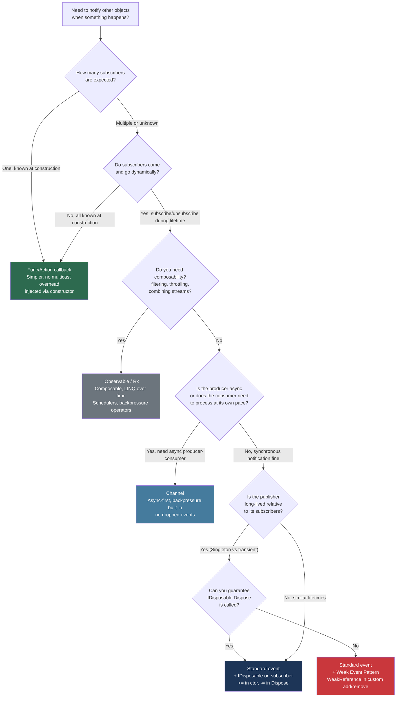

> [!success] Mastery Check
> - [ ] **Studied Well**
> - [ ] **Can explain the concept without notes**
> - [ ] **Can answer interview questions confidently**
> - [ ] **Can implement it in a real project**


## 📍 PART 0 — Navigation & Context

### Where This Topic Lives

```
C# Language — Callbacks & Notifications
└── Delegates (2.21)                        ← direct prerequisite
    ├── ► Events and the Event Pattern       ← YOU ARE HERE
    ├──   Threading Primitives (2.39)        ← thread-safe invocation details
    ├──   IDisposable & Resource Mgmt (2.30) ← unsubscription = memory leak prevention
    └──   GC Interaction & WeakReference (2.40) ← weak event pattern
```

### What You Need Before This
- **[[2.21 — Delegates, Func, Action, and Closures]]** — an event IS a restricted delegate field; you must understand multicast delegates, `_target` + `_methodPtr` internals, and how the invocation list works before this makes full sense
- **[[2.08 — Classes: Fields, Constructors, Static Members]]** — events are class members; understanding field access control and class lifetime is assumed
- **[[2.16 — Value Types vs Reference Types]]** — delegate instances are reference types; the subscriber holding a handler creates a strong reference back to itself

### What This Unlocks After
- **[[2.30 — IDisposable, IAsyncDisposable, and Resource Management]]** — the canonical managed memory leak is an undisposed event subscription; proper `Dispose()` patterns unsubscribe
- **[[2.40 — GC Interaction, Finalizers, and WeakReference]]** — the weak event pattern uses `WeakReference<T>` to break the publisher→subscriber strong reference chain
- **[[2.39 — Threading Primitives]]** — the thread-safe event invocation pattern requires understanding `volatile`, memory barriers, and the null-check race condition

### Why This Matters at Scale

Every UI framework, every message bus, every domain event system, and every `INotifyPropertyChanged` implementation in production .NET is built on the event pattern. Getting event subscription lifetime wrong is the **#1 source of managed memory leaks** in .NET applications — and it's almost always invisible until a memory profiler runs.

---

## 🧠 PART 1 — The Core Mental Model

### The Fundamental Rule

> **The `event` keyword wraps a delegate field and restricts outside callers to only `+=` and `-=` — they cannot read the list, replace it, or invoke it. The practical consequence: the publisher owns invocation; subscribers can only register and deregister interest. And because a delegate holds a strong reference to its target object, every unremoved subscription keeps the subscriber alive in memory until the publisher dies.**

### The Plain-Language Analogy

Think of an event like a **building's fire alarm pull station**. Anyone in the building can register their phone number with the front desk to be called when the alarm fires (`+=`). They can also remove their number (`-=`). But no random person in the building can look up the full subscriber list, call it themselves, or reset it — only the front desk (the publisher) can trigger the notifications.

The memory-leak angle maps directly: as long as your phone number is on that list, the front desk has your contact info — keeping you "reachable." Even if you've moved out of the building, as long as you never called to unsubscribe, the front desk still holds a reference to you. The GC sees that reference and can never collect you. The building (publisher) has to shut down entirely before your number is released. This is precisely what happens with an event subscriber that never calls `-=`.

### The Taxonomy Diagram

```mermaid
graph TD
    A["Event Mechanism in C#"] --> B["The event keyword"]
    A --> C["Underlying delegate field"]

    B --> D["Restricts outside access to\n+= (subscribe)\n-= (unsubscribe)"]
    B --> E["custom add/remove accessors\nFor locking, weak refs, etc."]

    C --> F["Multicast delegate\n(invocation list of method pointers)"]
    C --> G["Each subscriber = one entry\nin the invocation list"]

    A --> H["EventHandler<TEventArgs>\nconvention"]
    H --> I["object sender\nEventArgs e"]
    H --> J["Custom EventArgs\nCarries event data"]

    A --> K["Invocation Patterns"]
    K --> L["Volatile copy pattern\nThread-safe null check\nvar h = Event; h?.Invoke(...)"]
    K --> M["Direct Invoke\n(single-threaded only)"]

    A --> N["Memory Management"]
    N --> O["Strong reference:\npublisher → subscriber\nLeak if not unsubscribed"]
    N --> P["Weak Event Pattern\nWeakReference<T> in custom\nadd/remove accessors"]

    A --> Q["Alternatives"]
    Q --> R["Func/Action callbacks\nSimpler, no multicast"]
    Q --> S["IObservable<T> / Rx\nComposable, backpressure,\nscheduling built-in"]
    Q --> T["Channels (2.45)\nAsync-first, structured\nproducer-consumer"]

    style B fill:#1d3557,color:#fff
    style C fill:#2d6a4f,color:#fff
    style H fill:#457b9d,color:#fff
    style K fill:#457b9d,color:#fff
    style N fill:#c9373c,color:#fff
    style Q fill:#6c757d,color:#fff
```



> [!IMPORTANT] The One Thing Everyone Gets Wrong
> A `public event SomeDelegate MyEvent;` is **not** the same as a `public SomeDelegate MyEvent;`. The `event` keyword restricts the field. Outside the class, you cannot do `obj.MyEvent = null` or `obj.MyEvent(...)`. Inside the class, both are valid. This distinction is the entire point of the keyword.

---

## 🔬 PART 2 — Deep Mechanics

### 2.1 What the Compiler Generates for `event`

The `event` keyword is syntactic sugar over a private delegate field plus two methods: `add` and `remove`. Understanding this is the prerequisite for understanding custom accessors and thread safety.

```csharp
// ── What you write: ──────────────────────────────────────────────────────
public class OrderService
{
    public event EventHandler<OrderPlacedEventArgs> OrderPlaced;
}

// ── What the compiler generates (approximately): ─────────────────────────
public class OrderService
{
    // Private backing field — inaccessible from outside
    private EventHandler<OrderPlacedEventArgs> _orderPlaced;

    // add accessor — called by += outside the class
    public void add_OrderPlaced(EventHandler<OrderPlacedEventArgs> value)
    {
        // Compiler uses Interlocked.CompareExchange for thread-safe add
        EventHandler<OrderPlacedEventArgs> current = _orderPlaced;
        EventHandler<OrderPlacedEventArgs> previous;
        do
        {
            previous = current;
            var combined = (EventHandler<OrderPlacedEventArgs>)
                Delegate.Combine(previous, value);
            current = Interlocked.CompareExchange(ref _orderPlaced, combined, previous);
        }
        while (current != previous);
        // Cost: ~25–50 ns (Interlocked CAS loop, usually succeeds first try)
    }

    // remove accessor — called by -= outside the class
    public void remove_OrderPlaced(EventHandler<OrderPlacedEventArgs> value)
    {
        EventHandler<OrderPlacedEventArgs> current = _orderPlaced;
        EventHandler<OrderPlacedEventArgs> previous;
        do
        {
            previous = current;
            var removed = (EventHandler<OrderPlacedEventArgs>)
                Delegate.Remove(previous, value);
            current = Interlocked.CompareExchange(ref _orderPlaced, removed, previous);
        }
        while (current != previous);
        // Cost: ~25–50 ns (same CAS loop)
    }
}
```

> [!NOTE] Cost Label
> The compiler-generated `add`/`remove` use `Interlocked.CompareExchange` — they are **lock-free and thread-safe** for the subscription operation itself. This does NOT make event invocation thread-safe. Those are separate concerns.

### 2.2 Memory Layout: The Publisher→Subscriber Reference Chain

This diagram is the key to understanding every event-related memory leak.

```
━━━━━━━━━━━━━━━━━━━━━━━━━━━━━━━━━━━━━━━━━━━━━━━━━━━━━━━━━━━━━━━━━━
SCENARIO: OrderService publishes; two UI components subscribe
━━━━━━━━━━━━━━━━━━━━━━━━━━━━━━━━━━━━━━━━━━━━━━━━━━━━━━━━━━━━━━━━━━

HEAP

  OrderService object                      OrderPlacedDashboard object
  ┌───────────────────────────┐           ┌────────────────────────────┐
  │ ObjHeader + TypePtr       │           │ ObjHeader + TypePtr        │
  │                           │           │ (dashboard fields...)      │
  │ _orderPlaced ─────────────┼──────────►│◄─────────────────────────┐ │
  │  (delegate field)         │           └────────────────────────────┘│
  └───────────────────────────┘                                         │
              │                           OrderAuditLog object          │
              │                           ┌────────────────────────────┐│
              │                           │ ObjHeader + TypePtr        ││
              └──────────────────────────►│◄───────────────────────────┘│
                                          └────────────────────────────┘

  _orderPlaced (delegate) invocation list:
  ┌─────────────────────────────────────────────────────────────────┐
  │ Entry 0: _target = OrderPlacedDashboard ref │ _methodPtr = OnOrderPlaced │
  │ Entry 1: _target = OrderAuditLog ref         │ _methodPtr = LogOrderPlaced│
  └─────────────────────────────────────────────────────────────────┘

  GC ROOT ANALYSIS:
  • OrderService is reachable (e.g., registered in DI container as Singleton)
  • _orderPlaced delegate has strong references to BOTH subscribers
  • Even if the UI navigates away from the dashboard, the GC cannot
    collect OrderPlacedDashboard because OrderService._orderPlaced holds a ref
  • This IS a memory leak — OrderPlacedDashboard stays alive forever

  AFTER CORRECT UNSUBSCRIPTION (dashboard calls -=):
  ┌─────────────────────────────────────────────────────────────────┐
  │ Entry 0: (removed)                                              │
  │ Entry 1: _target = OrderAuditLog ref  │ _methodPtr = LogOrderPlaced│
  └─────────────────────────────────────────────────────────────────┘
  → OrderPlacedDashboard is now unreachable → eligible for GC collection
```

### 2.3 The Thread-Safe Invocation Pattern — and Why It's Necessary

The classic race condition: between checking `if (OrderPlaced != null)` and calling `OrderPlaced(...)`, another thread could unsubscribe the last handler, making the field null. The result: a `NullReferenceException` in production that only appears under load.

```csharp
// ⚠️ WRONG: classic race condition
protected virtual void OnOrderPlaced(OrderPlacedEventArgs e)
{
    if (OrderPlaced != null)        // Thread A: sees non-null
    {                               // Thread B: unsubscribes last handler HERE
        OrderPlaced(this, e);       // Thread A: NullReferenceException!
    }
}

// ✅ CORRECT: volatile copy pattern
// The local variable captures the current delegate reference atomically.
// Even if another thread unsubscribes after the copy, 'handler' still
// holds the old non-null delegate and invocation completes safely.
protected virtual void OnOrderPlaced(OrderPlacedEventArgs e)
{
    var handler = OrderPlaced; // Atomic read of a reference — thread-safe on x64/x86
    handler?.Invoke(this, e);  // If handler is null, ?.Invoke is a no-op
                                // If handler is non-null, it captures the snapshot
}

// Why does copying to a local work?
// On x86/x64, reading a reference-sized field is atomic.
// The local 'handler' is a snapshot — it cannot become null after the copy.
// Delegate instances are immutable: Delegate.Combine and Delegate.Remove
// ALWAYS create new instances; they never modify existing ones.
// So the copy is safe: it's pointing to an immutable delegate object.
// Cost: ~1 ns (single atomic reference read) + invocation cost
```

> [!WARNING] The `volatile` Subtlety
> The backing field generated by the compiler is declared `volatile` in older C# versions (pre-4.0). In modern C#, the compiler uses `Interlocked.CompareExchange` in `add`/`remove`, which provides the necessary memory barriers. The volatile copy pattern still applies for invocation — copying to a local before null-checking and invoking.

### 2.4 Custom `add`/`remove` Accessors — Full Control Over Subscription

Custom accessors let you replace the default CAS loop with your own logic: locking, conditional registration, weak references, or event fan-out.

```csharp
// Scenario: high-frequency trading alert system
// Many subscribers; need to minimize lock contention; want to cap subscriber count

public class MarketAlertService
{
    // Manual backing field instead of compiler-generated
    private EventHandler<PriceAlertEventArgs>? _priceAlert;
    private readonly object _lock = new();
    private int _subscriberCount = 0;
    private const int MaxSubscribers = 100;

    public event EventHandler<PriceAlertEventArgs> PriceAlert
    {
        add
        {
            if (value is null) return;
            lock (_lock)
            {
                if (_subscriberCount >= MaxSubscribers)
                    throw new InvalidOperationException(
                        $"Cannot exceed {MaxSubscribers} alert subscribers");
                _priceAlert += value;
                _subscriberCount++;
            }
            // Cost: ~25 ns (lock acquisition, usually uncontended) + Delegate.Combine
        }
        remove
        {
            if (value is null) return;
            lock (_lock)
            {
                var before = _priceAlert;
                _priceAlert -= value;
                // Only decrement if the delegate was actually removed
                if (_priceAlert != before)
                    _subscriberCount--;
            }
        }
    }

    public int SubscriberCount => _subscriberCount;

    protected virtual void OnPriceAlert(PriceAlertEventArgs e)
    {
        // Acquire snapshot outside the lock — never hold the lock during invocation
        // Holding lock during invocation risks deadlock if a subscriber tries to unsubscribe
        EventHandler<PriceAlertEventArgs>? handler;
        lock (_lock) { handler = _priceAlert; }
        handler?.Invoke(this, e);
    }
}
```

> [!DANGER] Never Hold a Lock During Event Invocation
> If you hold a lock while invoking subscribers, and a subscriber tries to call `+=` or `-=` (which also acquire that lock), you have a deadlock. Always copy the delegate inside the lock, then invoke outside it.

### 2.5 The Weak Event Pattern — Breaking the Memory Leak

When the publisher lives longer than the subscriber (a common scenario: Singleton service + short-lived UI component), use a weak event pattern. The delegate's strong reference is replaced by a `WeakReference<T>`.

```csharp
// Scenario: long-lived inventory service (Singleton) publishing to short-lived
// product detail page view models (created/destroyed on navigation)

public class InventoryService
{
    // Instead of a standard event, we manage a list of weak references
    private readonly List<WeakReference<Action<StockChangedEventArgs>>> _handlers = new();
    private readonly object _lock = new();

    // Custom event-like pattern using weak references
    public void Subscribe(Action<StockChangedEventArgs> handler)
    {
        lock (_lock)
            _handlers.Add(new WeakReference<Action<StockChangedEventArgs>>(handler));
        // Cost: one heap allocation (WeakReference<T> object, ~32 bytes)
    }

    public void Unsubscribe(Action<StockChangedEventArgs> handler)
    {
        lock (_lock)
            _handlers.RemoveAll(wr =>
                !wr.TryGetTarget(out var target) || target == handler);
    }

    protected virtual void OnStockChanged(StockChangedEventArgs e)
    {
        List<WeakReference<Action<StockChangedEventArgs>>> snapshot;
        lock (_lock) { snapshot = new List<WeakReference<Action<StockChangedEventArgs>>>(_handlers); }

        // Invoke alive subscribers; clean up dead ones
        var dead = new List<WeakReference<Action<StockChangedEventArgs>>>();
        foreach (var wr in snapshot)
        {
            if (wr.TryGetTarget(out var handler))
                handler(e);   // subscriber still alive — invoke it
            else
                dead.Add(wr); // subscriber was GC'd — clean up
        }

        if (dead.Count > 0)
        {
            lock (_lock)
                foreach (var d in dead) _handlers.Remove(d);
        }
        // Cost: O(n) over subscriber count; dead entries cleaned automatically
    }
}
```

> [!TIP] When Weak Events Are Worth the Complexity
> Use them when: (a) the publisher is a Singleton or long-lived service, (b) subscribers are short-lived UI components or view models, and (c) you cannot guarantee `Unsubscribe` will be called (e.g., navigation-based destruction in mobile/desktop apps). For server-side web code (ASP.NET Core), every request creates a new scope — weak events are rarely needed.

---

## 💻 PART 3 — Production Code Patterns

### 3.1 The Standard Event Declaration (The `EventHandler<TEventArgs>` Convention)

Every published event in a production codebase should follow this convention. Deviations require justification.

```csharp
// Domain: order management system

// ✅ Custom EventArgs: carries meaningful data, immutable after construction
public sealed class OrderStatusChangedEventArgs : EventArgs
{
    // EventArgs subclasses should be sealed and immutable
    // Sealed: prevents inheritance hierarchy explosion
    // Immutable: event args represent a moment-in-time snapshot; mutation after the fact is a bug
    public int       OrderId   { get; }
    public OrderStatus OldStatus { get; }
    public OrderStatus NewStatus { get; }
    public DateTime   OccurredAt { get; }

    public OrderStatusChangedEventArgs(int orderId, OrderStatus old, OrderStatus @new)
    {
        OrderId    = orderId;
        OldStatus  = old;
        NewStatus  = @new;
        OccurredAt = DateTime.UtcNow;
    }
}

public class OrderFulfillmentService
{
    // ✅ Convention: EventHandler<TEventArgs>, virtual protected raiser, nullable event
    // 'virtual protected' raiser: allows subclasses to suppress, redirect, or augment events
    // nullable: standard field-event is null when no subscribers — always check before raising
    public event EventHandler<OrderStatusChangedEventArgs>? OrderStatusChanged;

    protected virtual void OnOrderStatusChanged(OrderStatusChangedEventArgs e)
    {
        // Thread-safe volatile copy — see Part 2.3
        var handler = OrderStatusChanged;
        handler?.Invoke(this, e);
    }

    public async Task ShipOrderAsync(int orderId, CancellationToken ct = default)
    {
        // ... shipping logic ...
        var args = new OrderStatusChangedEventArgs(orderId, OrderStatus.Processing, OrderStatus.Shipped);
        OnOrderStatusChanged(args); // raise through the virtual method, not directly
    }
}
```

### 3.2 Guaranteed Cleanup via IDisposable Subscription

The most important production pattern: tie event subscription lifetime to an object's lifetime via `IDisposable`.

```csharp
// Domain: real-time inventory dashboard

// ⚠️ WRONG: subscribes but never unsubscribes
public class InventoryDashboard
{
    private readonly IInventoryService _inventory;

    public InventoryDashboard(IInventoryService inventory)
    {
        _inventory = inventory;
        _inventory.StockChanged += OnStockChanged; // ← this reference NEVER released
    }

    private void OnStockChanged(object? sender, StockChangedEventArgs e)
        => RefreshDisplay(e.ProductId);

    private void RefreshDisplay(int productId) { /* ... */ }
    // When InventoryDashboard is "discarded", the GC cannot collect it
    // because IInventoryService still holds a reference via StockChanged
}

// ✅ CORRECT: subscription paired with disposal
public class InventoryDashboard : IDisposable
{
    private readonly IInventoryService _inventory;
    private bool _disposed;

    public InventoryDashboard(IInventoryService inventory)
    {
        _inventory = inventory;
        // Subscribe in constructor — symmetric cleanup in Dispose
        _inventory.StockChanged += OnStockChanged;
    }

    private void OnStockChanged(object? sender, StockChangedEventArgs e)
    {
        if (_disposed) return; // Guard: could still be called on the thread pool
                               // after Dispose if invocation was in-flight
        RefreshDisplay(e.ProductId);
    }

    private void RefreshDisplay(int productId) { /* ... */ }

    public void Dispose()
    {
        if (_disposed) return; // idempotent
        _disposed = true;
        _inventory.StockChanged -= OnStockChanged; // ← breaks the reference chain
        // After this line, GC can collect InventoryDashboard on next collection
    }
}
```

### 3.3 The Ordered Unsubscription Pattern for Multiple Events

When a subscriber binds to many events, unsubscription in Dispose must be symmetric and exhaustive.

```csharp
// Domain: logistics tracking console — subscribes to multiple services

public class ShipmentTrackingConsole : IDisposable
{
    private readonly IShipmentService  _shipments;
    private readonly IWarehouseService _warehouse;
    private readonly ICarrierService   _carrier;
    private bool _disposed;

    public ShipmentTrackingConsole(
        IShipmentService  shipments,
        IWarehouseService warehouse,
        ICarrierService   carrier)
    {
        _shipments = shipments;
        _warehouse = warehouse;
        _carrier   = carrier;

        // Subscribe to all events at construction — mirror exactly in Dispose
        _shipments.ShipmentCreated  += OnShipmentCreated;
        _shipments.ShipmentDelivered += OnShipmentDelivered;
        _warehouse.StockAllocated    += OnStockAllocated;
        _carrier.DelayReported       += OnDelayReported;
    }

    private void OnShipmentCreated(object? s, ShipmentCreatedEventArgs e)   => Log(e);
    private void OnShipmentDelivered(object? s, ShipmentDeliveredEventArgs e) => Log(e);
    private void OnStockAllocated(object? s, StockAllocatedEventArgs e)      => Log(e);
    private void OnDelayReported(object? s, DelayReportedEventArgs e)        => AlertOps(e);

    private void Log(EventArgs e)      { /* ... */ }
    private void AlertOps(EventArgs e) { /* ... */ }

    public void Dispose()
    {
        if (_disposed) return;
        _disposed = true;

        // Unsubscribe in REVERSE order — good practice mirrors construction, prevents
        // callbacks being received while partially torn down
        _carrier.DelayReported       -= OnDelayReported;
        _warehouse.StockAllocated    -= OnStockAllocated;
        _shipments.ShipmentDelivered -= OnShipmentDelivered;
        _shipments.ShipmentCreated   -= OnShipmentCreated;
    }
}
```

### 3.4 The Exception-Safe Event Raiser

In a multicast invocation, an exception from one subscriber terminates the invocation list — remaining subscribers never receive the event. In production, you usually want all subscribers notified, with exceptions aggregated.

```csharp
// Domain: payment processing notification — multiple downstream systems must be notified

public class PaymentEventBus
{
    public event EventHandler<PaymentCompletedEventArgs>? PaymentCompleted;

    // ⚠️ WRONG: standard invocation — first exception kills the rest
    protected virtual void OnPaymentCompletedNaive(PaymentCompletedEventArgs e)
    {
        PaymentCompleted?.Invoke(this, e);
        // If subscriber 1 throws, subscribers 2..N are NEVER called
        // For payment notifications, that could mean an audit log or fraud check is skipped
    }

    // ✅ CORRECT: walk invocation list manually, collect all exceptions
    protected virtual void OnPaymentCompleted(PaymentCompletedEventArgs e)
    {
        var handler = PaymentCompleted;
        if (handler is null) return;

        var exceptions = new List<Exception>();

        // GetInvocationList() returns each delegate as a separate entry
        // Cost: O(n) over subscriber count; allocates one object[] for the list
        foreach (var subscriber in handler.GetInvocationList())
        {
            try
            {
                subscriber.DynamicInvoke(this, e);
                // Alternative without DynamicInvoke (avoids reflection cost):
                // ((EventHandler<PaymentCompletedEventArgs>)subscriber)(this, e);
            }
            catch (Exception ex)
            {
                exceptions.Add(ex);
            }
        }

        if (exceptions.Count == 1)
            System.Runtime.ExceptionServices.ExceptionDispatchInfo
                .Capture(exceptions[0])
                .Throw(); // rethrow with original stack trace preserved

        if (exceptions.Count > 1)
            throw new AggregateException(
                $"Multiple subscribers threw during PaymentCompleted event", exceptions);
    }
}
```

### 3.5 Event vs Func/Action Callback — Choosing the Right Tool

```csharp
// Domain: user authentication service

// ⚠️ WRONG: using an event when a single callback is all you need
// Events imply multicast, external subscription management, lifetime concerns.
// A login hook called by exactly one consumer doesn't need all that machinery.
public class AuthService_Overengineered
{
    // This is overkill for a single callback
    public event EventHandler<LoginSucceededEventArgs>? LoginSucceeded;

    public void Login(string username, string password)
    {
        // ... auth logic ...
        LoginSucceeded?.Invoke(this, new LoginSucceededEventArgs(username));
    }
}

// ✅ CORRECT: simple Func/Action callback when one subscriber, same lifetime
public class AuthService
{
    private readonly Action<string>? _onLoginSucceeded;

    // Injected at construction — same lifetime, no subscription management needed
    public AuthService(Action<string>? onLoginSucceeded = null)
        => _onLoginSucceeded = onLoginSucceeded;

    public void Login(string username, string password)
    {
        // ... auth logic ...
        _onLoginSucceeded?.Invoke(username);
    }
}

// ✅ CORRECT: use an event when:
// • Multiple independent subscribers are expected
// • Subscribers come and go during the publisher's lifetime
// • The publisher should not know anything about its subscribers
public class OrderService_Correct
{
    // Multiple systems (audit, inventory, email) all subscribe independently
    public event EventHandler<OrderPlacedEventArgs>? OrderPlaced;

    public void PlaceOrder(Order order)
    {
        // ... persist order ...
        OrderPlaced?.Invoke(this, new OrderPlacedEventArgs(order));
        // Audit, inventory, and email all notified — publisher knows none of them
    }
}
```

### 3.6 Static Events — The Global Memory Leak

Static events are a frequently-missed source of leaks. Because the publisher is the type itself (never collected), all subscribers are permanently rooted.

```csharp
// Domain: application-level configuration change notifications

// ⚠️ WRONG: static event with instance subscriber — subscriber is NEVER GC'd
public static class AppConfiguration
{
    // Static event: the invocation list is on the Type object — a GC root
    // It never goes away for the life of the process
    public static event EventHandler<ConfigChangedEventArgs>? ConfigChanged;

    public static void TriggerReload()
        => ConfigChanged?.Invoke(null, new ConfigChangedEventArgs());
}

public class OrderPricingEngine // short-lived, created per-request in some architectures
{
    public OrderPricingEngine()
    {
        AppConfiguration.ConfigChanged += OnConfigChanged; // ← PERMANENT reference
        // Even when this OrderPricingEngine is "done", AppConfiguration.ConfigChanged
        // holds a reference to it via the delegate. It CANNOT be collected.
    }

    private void OnConfigChanged(object? s, ConfigChangedEventArgs e) => ReloadRules();
    private void ReloadRules() { /* ... */ }

    // If Dispose is not implemented AND called, this is a permanent leak
}

// ✅ CORRECT: implement IDisposable whenever subscribing to static events
public class OrderPricingEngine : IDisposable
{
    public OrderPricingEngine()
        => AppConfiguration.ConfigChanged += OnConfigChanged;

    private void OnConfigChanged(object? s, ConfigChangedEventArgs e) => ReloadRules();
    private void ReloadRules() { /* ... */ }

    public void Dispose()
        => AppConfiguration.ConfigChanged -= OnConfigChanged;
}

// ✅ ALTERNATIVE: use WeakReference-based subscription for static events
// when you truly cannot control the subscriber's lifetime
```

### 3.7 The `protected virtual` Raiser Method Pattern

The virtual raiser method is the correct way to enable subclass participation in event raising without exposing the delegate field.

```csharp
// Domain: document workflow system with extensible event pipeline

public class DocumentWorkflow
{
    public event EventHandler<DocumentApprovedEventArgs>? DocumentApproved;

    // 'protected virtual' is the standard .NET convention for event raisers.
    // virtual: subclasses can intercept, suppress, or enrich before/after firing
    // protected: only the class and its subclasses can raise — external code cannot
    protected virtual void OnDocumentApproved(DocumentApprovedEventArgs e)
    {
        var handler = DocumentApproved;
        handler?.Invoke(this, e);
    }

    public async Task ApproveAsync(int documentId, string approverId)
    {
        // ... persistence logic ...
        // Always raise through the virtual method, never invoke the delegate directly
        // This is the extensibility hook — a subclass can add behavior here
        OnDocumentApproved(new DocumentApprovedEventArgs(documentId, approverId));
    }
}

// Subclass augments the event — correct usage of the virtual raiser
public sealed class AuditedDocumentWorkflow : DocumentWorkflow
{
    private readonly IAuditLogger _audit;
    public AuditedDocumentWorkflow(IAuditLogger audit) => _audit = audit;

    protected override void OnDocumentApproved(DocumentApprovedEventArgs e)
    {
        // Pre-raise: write audit entry BEFORE notifying subscribers
        _audit.Record($"Document {e.DocumentId} approved by {e.ApproverId}");

        // Call base to fire the event to all subscribers
        base.OnDocumentApproved(e);

        // Post-raise: any follow-up after all subscribers have run
    }
}
```

---

## ⚠️ PART 4 — Gotchas & Anti-Patterns

### Gotcha 1: Unsubscribing with a Different Lambda Instance

This is the most common event bug in production: subscribing with an anonymous lambda and attempting to unsubscribe with a new lambda — which is a different delegate instance and does nothing.

```csharp
// ⚠️ WRONG: each lambda expression creates a NEW delegate instance
// The -= creates a brand-new delegate that does NOT match the one added by +=
public class ReportScheduler : IDisposable
{
    private readonly INotificationService _notifications;

    public ReportScheduler(INotificationService notifications)
    {
        _notifications = notifications;
        // Lambda subscribed here — compiler creates a new delegate object
        _notifications.AlertRaised += (s, e) => ProcessAlert(e);
    }

    public void Dispose()
    {
        // ⚠️ BUG: this creates ANOTHER new lambda delegate instance
        // Delegate.Remove compares by reference equality — this is a different object
        // The -= silently does nothing. The subscription is NEVER removed.
        _notifications.AlertRaised -= (s, e) => ProcessAlert(e);
    }

    private void ProcessAlert(AlertEventArgs e) { /* ... */ }
}

// ✅ CORRECT: store the delegate instance and reuse it
public class ReportScheduler : IDisposable
{
    private readonly INotificationService _notifications;
    // Store the SAME delegate instance for both subscribe and unsubscribe
    private readonly EventHandler<AlertEventArgs> _alertHandler;

    public ReportScheduler(INotificationService notifications)
    {
        _notifications = notifications;
        _alertHandler = (s, e) => ProcessAlert(e); // captured in field
        _notifications.AlertRaised += _alertHandler;
    }

    public void Dispose()
        => _notifications.AlertRaised -= _alertHandler; // same instance — works correctly

    private void ProcessAlert(AlertEventArgs e) { /* ... */ }
}

// WHY: Delegate.Remove uses reference equality for each entry in the invocation list.
// Two lambda expressions that look identical are two distinct delegate objects.
// The unsubscription silently fails, the subscriber stays alive, and you have a leak.
```

### Gotcha 2: Raising an Event From a Constructor

An event raised during construction can reach subscribers before the object is fully initialized, creating time-of-check/time-of-use race conditions on the object's own fields.

```csharp
// ⚠️ WRONG: event raised before construction completes
public class CustomerAccountService
{
    public event EventHandler<AccountCreatedEventArgs>? AccountCreated;
    private readonly IAccountValidator _validator;

    public CustomerAccountService(IAccountValidator validator, string initialAccount)
    {
        _validator = validator;
        // Event raised HERE — but a subscriber might call back into this object
        // and find _validator is null or other fields not yet initialized
        OnAccountCreated(new AccountCreatedEventArgs(initialAccount)); // ⚠️ dangerous
        // Imagine a subscriber calls: service.ValidateAccount(x)
        // which uses _validator — but _validator was just assigned on the line ABOVE
        // and in a multi-threaded scenario, may not be visible yet
    }

    protected virtual void OnAccountCreated(AccountCreatedEventArgs e)
        => AccountCreated?.Invoke(this, e);

    public bool ValidateAccount(string account) => _validator.Validate(account);
}

// ✅ CORRECT: raise events after construction completes, via a factory or Initialize()
public class CustomerAccountService
{
    public event EventHandler<AccountCreatedEventArgs>? AccountCreated;
    private readonly IAccountValidator _validator;

    private CustomerAccountService(IAccountValidator validator)
        => _validator = validator;

    // Factory method: construction + initialization + event raising all complete safely
    public static CustomerAccountService Create(IAccountValidator validator, string initialAccount)
    {
        var svc = new CustomerAccountService(validator); // fully constructed
        svc.OnAccountCreated(new AccountCreatedEventArgs(initialAccount)); // safe to raise now
        return svc;
    }

    protected virtual void OnAccountCreated(AccountCreatedEventArgs e)
        => AccountCreated?.Invoke(this, e);

    // WHY: by the time Create() raises the event, the object is fully constructed.
    // Any reentrant callback finds a consistent, fully-initialized object state.
}
```

### Gotcha 3: Holding a Lock During Event Invocation

This causes a deadlock when a subscriber tries to `+=` or `-=` (which also acquires the lock in custom add/remove accessors).

```csharp
// ⚠️ WRONG: lock held during invocation
public class PriceAlertService
{
    private EventHandler<PriceAlertEventArgs>? _priceAlert;
    private readonly object _lock = new();

    public event EventHandler<PriceAlertEventArgs> PriceAlert
    {
        add    { lock (_lock) { _priceAlert += value; } }
        remove { lock (_lock) { _priceAlert -= value; } }
    }

    public void NotifyPriceChange(decimal newPrice)
    {
        lock (_lock)                              // ⚠️ lock acquired
        {
            _priceAlert?.Invoke(this,             // ⚠️ subscriber called WHILE lock held
                new PriceAlertEventArgs(newPrice));
            // If subscriber calls PriceAlert -= handler,
            // the remove accessor tries to acquire _lock → DEADLOCK
        }
    }
}

// ✅ CORRECT: copy delegate under lock, invoke outside lock
public void NotifyPriceChange(decimal newPrice)
{
    EventHandler<PriceAlertEventArgs>? handler;
    lock (_lock) { handler = _priceAlert; }   // copy inside lock — fast, minimal hold time
    handler?.Invoke(this, new PriceAlertEventArgs(newPrice)); // invoke outside lock
    // WHY: delegate instances are immutable. The snapshot is safe to invoke outside the lock.
    // Subscribers can now safely call += or -= without deadlocking.
}
```

### Gotcha 4: `EventArgs.Empty` vs `new EventArgs()` — The Allocation Trap

Passing `new EventArgs()` when there's no meaningful data creates a heap allocation on every event raise. `EventArgs.Empty` is a pre-allocated singleton.

```csharp
// ⚠️ WRONG: allocates a new EventArgs object on every invocation
// In a service that fires events at 10,000/sec, this is 10,000 heap allocations/sec
public class HeartbeatService
{
    public event EventHandler? HeartbeatElapsed;

    private void Tick()
    {
        HeartbeatElapsed?.Invoke(this, new EventArgs()); // ⚠️ heap allocation every tick
    }
}

// ✅ CORRECT: use the singleton
public class HeartbeatService
{
    public event EventHandler? HeartbeatElapsed;

    private void Tick()
    {
        HeartbeatElapsed?.Invoke(this, EventArgs.Empty); // ✅ zero allocation
        // EventArgs.Empty is a static readonly field — one object for the entire process lifetime
    }
}

// WHY: EventArgs.Empty is defined as:
//   public static readonly EventArgs Empty = new EventArgs();
// It's allocated once, reused everywhere. For no-data events, there is zero reason
// to allocate a new EventArgs on each raise.
```

### Gotcha 5: The `async void` Event Handler — Swallowed Exceptions

Subscribing to an event with an `async void` handler means exceptions thrown inside that handler are unobservable — they go to the thread pool's unhandled exception handler and, in many configurations, silently terminate the process.

```csharp
// ⚠️ WRONG: async void handler — exceptions are unobservable
public class OrderNotificationConsumer
{
    private readonly IOrderService _orderService;
    private readonly IEmailService _email;

    public OrderNotificationConsumer(IOrderService orderService, IEmailService email)
    {
        _orderService = orderService;
        _email = email;
        _orderService.OrderPlaced += OnOrderPlaced; // async void subscription
    }

    // ⚠️ BUG: if SendOrderConfirmationAsync throws, the exception is NOT catchable
    // by the publisher's call site. It propagates to the SynchronizationContext
    // (or thread pool), likely crashing the process silently.
    private async void OnOrderPlaced(object? sender, OrderPlacedEventArgs e)
    {
        await _email.SendOrderConfirmationAsync(e.OrderId); // throws SMTP exception
        // Caller (the event raiser) never sees this exception
    }
}

// ✅ CORRECT: wrap in try/catch and handle or log; never let async void throw
public class OrderNotificationConsumer : IDisposable
{
    private readonly IOrderService _orderService;
    private readonly IEmailService _email;
    private readonly ILogger<OrderNotificationConsumer> _logger;

    public OrderNotificationConsumer(
        IOrderService orderService, IEmailService email,
        ILogger<OrderNotificationConsumer> logger)
    {
        _orderService = orderService;
        _email  = email;
        _logger = logger;
        _orderService.OrderPlaced += OnOrderPlaced;
    }

    private async void OnOrderPlaced(object? sender, OrderPlacedEventArgs e)
    {
        try
        {
            await _email.SendOrderConfirmationAsync(e.OrderId);
        }
        catch (Exception ex)
        {
            // ✅ Exception caught, logged, and swallowed deliberately
            // The event raiser is NOT the right place to handle email failures
            _logger.LogError(ex, "Failed to send order confirmation for order {OrderId}", e.OrderId);
        }
    }

    public void Dispose() => _orderService.OrderPlaced -= OnOrderPlaced;

    // WHY: async void is fire-and-forget — the event raiser doesn't await it,
    // and any uncaught exception escapes to the SynchronizationContext.
    // In ASP.NET Core, this typically crashes the request or the worker process.
    // Always catch at the top of every async void handler.
}
```

---

## 📊 PART 5 — Performance Implications

### 5.1 Allocation and Dispatch Characteristics

| Scenario | Allocation Behavior | Approx Cost |
|---|---|---|
| `event +=` (compiler-generated add) | `Delegate.Combine` creates new delegate object (~40–80 bytes) | ~25–50 ns (Interlocked CAS) |
| `event -=` (compiler-generated remove) | `Delegate.Remove` creates new delegate object | ~25–50 ns (Interlocked CAS) |
| `event?.Invoke(this, e)` with 1 subscriber | Zero allocation (no list walk) | ~5–8 ns (interface-like dispatch) |
| `event?.Invoke(this, e)` with N subscribers | Zero allocation during invoke | ~5–8 ns × N (sequential) |
| `GetInvocationList()` | Allocates `Delegate[]` array | ~15 ns + N×8 bytes |
| `new EventArgs()` per raise | One heap allocation ~24 bytes | ~12–20 ns |
| `EventArgs.Empty` per raise | Zero allocation (singleton) | ~1 ns (field read) |
| Boxing a struct into `EventArgs`-derived args | One heap allocation | ~12–20 ns |
| `WeakReference<T>` add | One heap allocation ~32 bytes per subscriber | ~20–30 ns |
| `WeakReference<T>.TryGetTarget()` during invoke | Zero allocation | ~3–5 ns |
| Invocation when no subscribers (`null` check) | Zero allocation | ~1 ns (null check) |
| `async void` handler invocation | Allocates state machine object | ~50–100 ns + async overhead |

### 5.2 BenchmarkDotNet — Event Invocation Patterns

```csharp
using BenchmarkDotNet.Attributes;
using System.Runtime.CompilerServices;

public class StockTickEventArgs : EventArgs
{
    public decimal Price { get; init; }
}

public class EventInvocationBenchmark
{
    private event EventHandler<StockTickEventArgs>? StockTick;
    private readonly StockTickEventArgs _args = new() { Price = 123.45m };
    private int _subscriberCount = 0;

    [Params(0, 1, 5, 10)]
    public int SubscriberCount { get; set; }

    [GlobalSetup]
    public void Setup()
    {
        for (int i = 0; i < SubscriberCount; i++)
            StockTick += (s, e) => { /* consume e.Price */ _ = e.Price; };
    }

    [Benchmark(Baseline = true)]
    public void InvokeWithNullCheck()
    {
        StockTick?.Invoke(this, _args); // volatile copy pattern
    }

    [Benchmark]
    public void InvokeWithLocalCopy()
    {
        var h = StockTick;
        h?.Invoke(this, _args);
    }

    [Benchmark]
    public void InvokeGetInvocationList()
    {
        var h = StockTick;
        if (h is null) return;
        foreach (var d in h.GetInvocationList())
            ((EventHandler<StockTickEventArgs>)d)(this, _args);
    }

    [Benchmark]
    public void InvokeWithNewEventArgs()
    {
        StockTick?.Invoke(this, new StockTickEventArgs { Price = 123.45m }); // allocates
    }
}

// Expected output (approximate, .NET 8, x64):
// | Method                    | Subscribers | Mean      | Alloc |
// |---------------------------|-------------|-----------|-------|
// | InvokeWithNullCheck       | 0           | 0.9 ns    | 0 B   |
// | InvokeWithNullCheck       | 1           | 5.1 ns    | 0 B   |
// | InvokeWithNullCheck       | 5           | 22.4 ns   | 0 B   |
// | InvokeWithNullCheck       | 10          | 44.1 ns   | 0 B   |
// | InvokeWithLocalCopy       | 1           | 5.3 ns    | 0 B   |  ← negligible difference
// | InvokeGetInvocationList   | 1           | 18.2 ns   | 32 B  |  ← allocates Delegate[]
// | InvokeGetInvocationList   | 5           | 45.6 ns   | 72 B  |
// | InvokeWithNewEventArgs    | 1           | 22.4 ns   | 24 B  |  ← new EventArgs alloc
//
// Key takeaway: standard invocation is ~5 ns/subscriber, zero allocation.
// GetInvocationList() allocates and is 3x slower — use only when you need
// per-subscriber exception isolation.
```

### 5.3 When to Care / When to Ignore

#### When this costs you

**High-frequency financial tick events**: A market data feed raising `PriceUpdated` at 100,000 Hz with 5 subscribers = 500,000 delegate dispatch calls/second. At ~5 ns each, that's 2.5 ms/second of dispatch — potentially measurable. Use `Span<T>`-based subscriber lists, struct event args, or a specialized ring buffer.

**`new EventArgs()` in a hot loop**: A sensor data pipeline raising events at 50,000/sec with `new SensorEventArgs(reading)` allocates 50,000 objects/sec — 1.2 MB/sec of Gen0 garbage, triggering frequent GC collections with latency spikes.

**Static events in web applications**: Each HTTP request creating a subscriber to a static event that is never unsubscribed = unbounded memory growth. In ASP.NET Core this typically surfaces as a slow memory leak visible only in production under load.

**`GetInvocationList()` in a notification hot path**: The allocation of `Delegate[]` plus the cast per entry adds up if called at high frequency. Prefer wrapping in a custom subscriber list if per-subscriber exception isolation is needed in a hot path.

#### When this doesn't matter

**Domain event publication in typical business logic**: An `OrderPlaced` event raised once per order-placement HTTP request with 3 subscribers — the entire dispatch chain is nanoseconds against milliseconds of I/O. Optimize the SQL query, not the event.

**UI event patterns (WinForms, WPF, MAUI)**: Button clicks, property change notifications — these are user-pace events. Performance is entirely irrelevant.

**`EventArgs` allocation on low-frequency administrative events**: Config reloaded, service started, batch completed — these fire rarely. Pre-allocating `EventArgs.Empty` is correct style, not meaningful optimization.

---

## 🎤 PART 6 — Interview Arsenal

### A. The Question Bank

---

**Q1: "What does the `event` keyword actually do? What would happen if you removed it from an event declaration?"**

**Average answer:** "The `event` keyword means only the declaring class can raise the event. Outside code can only subscribe and unsubscribe."

**Why that's insufficient:** Correct but surface-level — doesn't explain what the compiler generates or what specific operations are prevented.

> **Great answer:** "The `event` keyword restricts a delegate field to three operations from outside the class: subscribe with `+=`, unsubscribe with `-=`, and nothing else. Without it, you have a plain public delegate field, and outside code can do three dangerous things: read the invocation list, invoke it directly, and assign it wholesale with `=` — which would silently discard every existing subscription. The `event` keyword prevents all three. Under the hood, the compiler generates a private backing delegate field and two compiler-supplied `add` and `remove` accessors. For field-like events, these accessors use `Interlocked.CompareExchange` internally, making subscription and unsubscription lock-free and thread-safe. That's the subscription safety — the invocation itself is a separate concern entirely."

---

**Q2: "Describe the event-related memory leak. How do you prevent it?"**

**Average answer:** "If you subscribe to an event and never unsubscribe, the subscriber stays alive because the publisher holds a reference to it."

**Why that's insufficient:** Correct but mechanistic — doesn't explain the reference direction, the GC implications, or the static-event variant.

> **Great answer:** "The memory leak happens because a delegate in the invocation list holds a strong reference to its target object — the `_target` field inside the delegate. So when object A subscribes to an event on object B, B's delegate field holds a strong reference to A. As long as B is alive and reachable, A cannot be garbage collected — even if nothing else holds a reference to A. The leak is most severe when B is long-lived or static: a Singleton service or a static class that publishes events will keep every subscriber permanently rooted. The standard fix is `IDisposable`: every class that subscribes to an event in its constructor should unsubscribe in `Dispose`. The trickiest variant is static events — forgetting to unsubscribe from a static event keeps the subscriber alive for the entire process lifetime. For cases where `Dispose` can't be guaranteed, the weak event pattern stores `WeakReference<T>` wrappers in a custom `add` accessor, so the publisher's reference doesn't prevent GC."

---

**Q3: "What is the thread-safe event invocation pattern and why is the naive null check dangerous?"**

**Average answer:** "You copy the event handler to a local variable before checking for null and invoking."

**Why that's insufficient:** States the solution without explaining the race condition or why the copy works.

> **Great answer:** "The race condition is this: between reading the field to check if it's null and then invoking it, another thread could unsubscribe the last handler, setting the field to null. That gives you a `NullReferenceException` on the invoke — a crash that only appears under concurrent load, making it nearly impossible to reproduce in tests. The fix is to copy the delegate reference to a local variable first. Because reading a reference-sized field is atomic on x86/x64, the local captures a consistent snapshot. Even if another thread unsubscribes immediately after, the local still points to the immutable delegate object that existed at the moment of the copy. And because delegate instances are immutable — `Delegate.Combine` and `Delegate.Remove` always create new objects, never modify existing ones — that snapshot is safe to invoke. The modern idiomatic form is `handler?.Invoke(this, e)` where `handler` is the local copy. The `?.` handles the case where the snapshot was null to begin with, giving you the null check and invocation as one atomic expression."

---

**Q4: "When would you use `IObservable<T>` or a `Channel<T>` instead of a plain event?"**

**Average answer:** "When you need async or more advanced features."

**Why that's insufficient:** Vague — doesn't articulate the concrete tradeoffs.

> **Great answer:** "Plain events are synchronous, multicast, and have no built-in support for backpressure, filtering, composition, or async handling. They're the right choice when subscribers are all in-process, the cardinality is small and known, and the event data model is simple. I move to `IObservable<T>` via Reactive Extensions when I need composability — filtering, debouncing, throttling, combining multiple event streams, or transforming events through a pipeline. Rx is essentially LINQ over time, and it's the right tool when your event processing looks like a data processing pipeline. I move to `Channel<T>` when the producer and consumers need to run at different rates and I need backpressure — so a slow consumer can signal the producer to slow down without dropping events. Channels are async-first, so they fit naturally into the async/await model. The summary: plain events for simple in-process multicast; Rx when you need composition; Channels when you need async producer-consumer with backpressure."

---

### B. The Trick Questions

> [!WARNING] These Sound Simple. They're Not.

**Trick 1: "Can you invoke an event from a derived class?"**
**The trap:** Saying "Yes, it's just a virtual method."
**Correct answer:** Not directly. The event's backing field is private to the declaring class. A derived class cannot write `base.MyEvent?.Invoke(...)` — that's a compile error. The correct mechanism is the `protected virtual OnXxx()` raiser method — the derived class calls `base.OnMyEvent(args)` or overrides `OnMyEvent` to intercept. This is exactly why the virtual raiser method pattern exists.

**Trick 2: "What happens if two threads subscribe to the same event simultaneously?"**
**The trap:** Saying "It's a race condition."
**Correct answer:** The compiler-generated `add` accessor uses `Interlocked.CompareExchange` in a CAS loop. This is lock-free and thread-safe for subscription. Both subscriptions will succeed atomically. The race condition concern is in *invocation*, not subscription.

**Trick 3: "Does `event -= handler` throw if the handler was never subscribed?"**
**The trap:** "Yes, it throws an exception."
**Correct answer:** No. `Delegate.Remove` returns the original delegate unchanged if the handler is not found. The `-=` silently does nothing. This is why the "unsubscribe with a new lambda" bug (Gotcha 1) is silent — it neither throws nor has any observable effect.

**Trick 4: "Is the following thread-safe? `if (MyEvent != null) MyEvent(this, e);`"**
**The trap:** "Yes, because the compiler generates a `volatile` field."
**Correct answer:** No — not for invocation. The volatile field ensures visibility of writes, but between the null check and the invocation, another thread can still set the field to null via unsubscription. The volatile copy pattern (`var h = MyEvent; h?.Invoke(this, e)`) is required.

**Trick 5: "Can an event have zero subscribers and still be raised safely?"**
**The trap:** "No, you have to check for null first."
**Correct answer:** With the null-conditional operator `?.Invoke()`, yes — `MyEvent?.Invoke(this, e)` is a single atomic operation that both checks for null and invokes. If the field is null (zero subscribers), `?.Invoke` is a no-op with no exception. This is idiomatic modern C#.

---

### C. Red Flags to Avoid

```
❌ "Events and delegates are the same thing"
   — Events restrict delegate fields. They're built on delegates but are NOT the same
     access-control construct. Conflating them shows a shallow understanding.

❌ "You should always use events instead of callbacks"
   — Events are for multicast, dynamic subscription. For single-subscriber, same-lifetime
     callbacks, a Func<T> or Action<T> is simpler, cheaper, and clearer.

❌ "The event keyword makes event invocation thread-safe"
   — The keyword makes subscription/unsubscription thread-safe (via CAS). Invocation
     thread safety requires the volatile copy pattern. These are distinct concerns.

❌ Forgetting to mention the memory leak risk unprompted when discussing events
   — Any experienced engineer raising the topic of events should immediately mention
     the publisher→subscriber strong reference and the IDisposable pattern. Not doing
     so signals you haven't debugged a leak in production.

❌ "You can raise an event from a subclass by calling the event directly"
   — The backing field is private; you cannot. The protected virtual raiser method
     is the mechanism. Getting this wrong on a whiteboard is an immediate red flag.

❌ "async void event handlers are fine because events are fire-and-forget anyway"
   — This is dangerous reasoning. Exceptions in async void are unobservable and
     commonly crash processes. Always wrap async void handlers in try/catch.

❌ Describing `EventArgs.Empty` as an optimization rather than the standard
   — `EventArgs.Empty` is not a micro-optimization you apply when profiling.
     It IS the correct code for no-data events. Always. New EventArgs() is wrong.
```

---

## 🔀 PART 7 — Decision Framework



---

## ✅ PART 8 — Self-Check

### A. Conceptual Questions

1. You have `public event EventHandler<OrderArgs>? OrderPlaced;` in class `OrderService`. A colleague in another class writes `service.OrderPlaced(this, args)` in their code. What happens and why?

2. An `OrderService` instance (Singleton) has `OrderPlaced` event. A `DashboardViewModel` (new instance per navigation) subscribes in its constructor but never unsubscribes. After the user navigates away from the dashboard 100 times, what is the memory state? Would the GC ever collect the 100 old `DashboardViewModel` instances?

3. What does `Delegate.Combine` return if the left-hand operand is `null`? What does `Delegate.Remove` return if the handler to remove is not in the invocation list?

4. A colleague writes a custom `add` accessor that stores handlers in a `List<EventHandler<T>>`. Inside the `remove` accessor, she writes `_handlers.Remove(value)`. Why will this sometimes silently fail to unsubscribe?

5. Explain why raising an event during an object's constructor is dangerous. What design pattern resolves this?

6. You call `GetInvocationList()` on a delegate with 5 subscribers and iterate them, calling each individually. What is the purpose of this vs. just calling `handler.Invoke()`? What does it allocate?

7. Why is `async void OnXxx(...)` dangerous for event handlers but `async void Main(...)` is (technically) acceptable?

8. The compiler uses `Interlocked.CompareExchange` in the generated `add`/`remove` accessors. Does this mean all event operations are atomic end-to-end? Explain the remaining race condition.

9. A `WeakReference<T>` in an event subscription list returns `false` from `TryGetTarget()` during invocation. What does that mean, and what should you do with that entry?

10. You have a `static event EventHandler ConfigChanged` in a configuration class. An instance of `FeatureFlagService` subscribes. The service is later "replaced" by re-registering it in the DI container. What happens to the old instance?

---

### B. Code Puzzles

**Puzzle 1:** What is printed? Is there a memory leak?

```csharp
public class DataPipeline
{
    public event EventHandler<DataEventArgs>? DataReceived;

    public void Push(int value)
        => DataReceived?.Invoke(this, new DataEventArgs(value));
}

public class DataEventArgs : EventArgs { public int Value { get; init; } }

var pipeline = new DataPipeline();
int count = 0;
pipeline.DataReceived += (s, e) => count++;
pipeline.DataReceived += (s, e) => count++;
pipeline.Push(1);
pipeline.Push(2);
Console.WriteLine(count);
```

<details>
<summary>Answer</summary>

Prints `4`. Two subscribers are registered, each incrementing `count`. Two pushes × 2 subscribers = 4 increments.

Memory leak: yes, technically. The two lambda delegates capture `count` (which the compiler promotes to a display class on the heap). The `pipeline` object holds strong references to those display class objects via the delegate invocation list. If `pipeline` lives longer than expected, those display class instances (and anything they reference) cannot be collected. In this short example it doesn't matter, but in production code with long-lived publishers, this pattern would require stored delegate references and `Dispose`-time unsubscription.

</details>

---

**Puzzle 2:** Does the unsubscription succeed? What is printed?

```csharp
public class AuditService
{
    public event EventHandler? ActionPerformed;
    public void DoAction() => ActionPerformed?.Invoke(this, EventArgs.Empty);
}

var audit = new AuditService();
int fireCount = 0;

EventHandler handler1 = (s, e) => fireCount++;
EventHandler handler2 = (s, e) => fireCount++;

audit.ActionPerformed += handler1;
audit.ActionPerformed += handler1; // subscribed TWICE with SAME instance
audit.ActionPerformed += handler2;

audit.ActionPerformed -= handler1; // unsubscribe once

audit.DoAction();
Console.WriteLine(fireCount);
```

<details>
<summary>Answer</summary>

Prints `2`. `Delegate.Remove` removes only the **last** occurrence of the matching delegate from the invocation list. The invocation list before removal is `[handler1, handler1, handler2]`. After one `-= handler1`, it becomes `[handler1, handler2]`. `DoAction()` invokes both, so `fireCount` is 2.

The subtle lesson: subscribing the same handler instance twice registers it twice, and one unsubscription removes only one occurrence. To fully remove it, you would need to call `-= handler1` twice. This is a real bug in production code where subscribe/unsubscribe paths are asymmetric (e.g., a method is called on reconnection without first unsubscribing from the previous connection).

</details>

---

**Puzzle 3:** Where is the bug? What happens at runtime?

```csharp
public class InventoryMonitor : IDisposable
{
    private readonly IWarehouseService _warehouse;

    public InventoryMonitor(IWarehouseService warehouse)
    {
        _warehouse = warehouse;
        _warehouse.StockDepleted += (s, e) => HandleDepletion(e.ProductId);
    }

    private void HandleDepletion(int productId)
    {
        Console.WriteLine($"Stock depleted: {productId}");
    }

    public void Dispose()
    {
        _warehouse.StockDepleted -= (s, e) => HandleDepletion(e.ProductId);
    }
}
```

<details>
<summary>Answer</summary>

The bug is in `Dispose`. The lambda expression `(s, e) => HandleDepletion(e.ProductId)` creates a **new** delegate instance each time it is evaluated. `Delegate.Remove` compares by reference: the new lambda instance in `Dispose` does not match the lambda instance created in the constructor (they're different objects). The unsubscription silently does nothing.

Fix: store the delegate in a field.

```csharp
private readonly EventHandler<StockDepletedEventArgs> _depletionHandler;

public InventoryMonitor(IWarehouseService warehouse)
{
    _warehouse = warehouse;
    _depletionHandler = (s, e) => HandleDepletion(e.ProductId);
    _warehouse.StockDepleted += _depletionHandler;
}

public void Dispose()
    => _warehouse.StockDepleted -= _depletionHandler; // same instance — works
```

</details>

---

**Puzzle 4:** What does this print, and is there a thread-safety problem?

```csharp
public class SensorHub
{
    public event EventHandler<SensorReadingEventArgs>? ReadingReceived;

    public void PublishReading(double value)
    {
        if (ReadingReceived != null)
            ReadingReceived(this, new SensorReadingEventArgs(value));
    }
}

public class SensorReadingEventArgs : EventArgs { public double Value { get; init; } }

var hub = new SensorHub();
int total = 0;
hub.ReadingReceived += (s, e) => total++;
hub.PublishReading(1.0);
hub.PublishReading(2.0);
Console.WriteLine(total); // What prints?
// Is PublishReading thread-safe?
```

<details>
<summary>Answer</summary>

Prints `2` in single-threaded use.

**Thread safety**: `PublishReading` has the classic null-check race condition. Between `if (ReadingReceived != null)` and `ReadingReceived(this, ...)`, another thread could call `-=` to remove the last subscriber, setting the field to null — causing a `NullReferenceException` on the next line. The correct fix:

```csharp
public void PublishReading(double value)
{
    var handler = ReadingReceived; // atomic snapshot
    handler?.Invoke(this, new SensorReadingEventArgs(value));
}
```

Also: `new SensorReadingEventArgs(value)` allocates on every call. In a high-frequency sensor system, this is a meaningful allocation source — consider pooling or struct-based event args.

</details>

---

**Puzzle 5:** What happens when `ProcessData` is called? Is the exception handled?

```csharp
public class DataProcessor
{
    public event EventHandler<DataEventArgs>? DataProcessed;

    public void ProcessData(int value)
    {
        DataProcessed?.Invoke(this, new DataEventArgs { Value = value });
        Console.WriteLine("Processing complete");
    }
}

public class DataEventArgs : EventArgs { public int Value { get; init; } }

var processor = new DataProcessor();
processor.DataProcessed += (s, e) => Console.WriteLine($"Handler 1: {e.Value}");
processor.DataProcessed += (s, e) => throw new InvalidOperationException("Handler 2 failed!");
processor.DataProcessed += (s, e) => Console.WriteLine($"Handler 3: {e.Value}");

processor.ProcessData(42);
Console.WriteLine("After ProcessData");
```

<details>
<summary>Answer</summary>

Output:
```
Handler 1: 42
```
Then the `InvalidOperationException` propagates up from `ProcessData`, crashing the call. **Handler 3 is never called.** "Processing complete" is never printed. "After ProcessData" is never printed (unless wrapped in try/catch).

This demonstrates the multicast exception problem from Pattern 3.4. When any subscriber in the invocation list throws, the exception propagates immediately and all remaining subscribers are skipped. For notification systems where every subscriber must run (audit log, fraud check, etc.), you must walk `GetInvocationList()` manually with per-entry try/catch, collecting and aggregating exceptions.

</details>

---

## 🔗 PART 9 — Connections & Resources

### A. Related Topics Table

| Topic | Why It Connects |
|---|---|
| [[2.21 — Delegates, Func, Action, and Closures]] | Direct prerequisite: events are delegate fields with restricted access; multicast delegate internals (`_target`, `_methodPtr`, `Delegate.Combine`) underpin everything in this note |
| [[2.30 — IDisposable, IAsyncDisposable, and Resource Management]] | The canonical managed memory leak is an undisposed event subscription; the `IDisposable` pattern for unsubscription is mandatory reading alongside this topic |
| [[2.40 — GC Interaction, Finalizers, and WeakReference]] | The weak event pattern uses `WeakReference<T>`; understanding when the GC collects objects (and what "reachable" means) is the prerequisite for understanding WHY the leak happens |
| [[2.39 — Threading Primitives]] | The volatile copy pattern for thread-safe invocation relates to `volatile` semantics and memory visibility; `Interlocked.CompareExchange` in the generated `add`/`remove` accessors is a threading primitive |
| [[2.16 — Value Types vs Reference Types]] | Every delegate in the invocation list holds a strong reference (`_target` field) to its target object — understanding reference semantics explains why the subscriber cannot be GC'd |
| [[2.29 — async/await: The State Machine]] | `async void` event handlers generate a state machine; exceptions escape to the SynchronizationContext — this interaction is a common production crash source |
| [[2.45 — Channels and Concurrent Pipelines]] | Channels are the modern async-first alternative to events for producer-consumer scenarios; knowing events deeply makes the tradeoff clear |
| [[2.22 — Events and the Event Pattern]] | Self-referential — this note; connected to all reactive and notification patterns |

### B. Books

| Book | Chapters | Why These Chapters |
|---|---|---|
| *C# in Depth* — Jon Skeet | Ch. 3 (Delegates and Events), Ch. 7 (Closures) | Ch. 3 is the most thorough coverage of the event keyword's mechanics and the add/remove accessor model in any mainstream C# book |
| *CLR via C#* — Jeffrey Richter | Ch. 17 (Delegates) | Richter covers the delegate memory layout (`_target`, `_methodPtr`) and the multicast invocation list internals that make the memory-leak reasoning precise |
| *Pro .NET Memory Management* — Konrad Kokosa | Ch. 4 (GC Roots and Object Graph) | Explains exactly why a delegate target object cannot be collected — the GC root analysis through the delegate invocation list is modeled here |
| *Concurrency in C#* — Stephen Cleary | Ch. 2 (Async Basics), Ch. 11 (Synchronization) | Cleary covers `async void` event handler hazards and the correct patterns for async notification in detail |

### C. Essential Articles & Docs

- [Microsoft Docs: Events (C# Programming Guide)](https://learn.microsoft.com/en-us/dotnet/csharp/programming-guide/events/) — canonical language reference for event syntax, `EventHandler<TEventArgs>` convention, and custom accessor syntax
- [Microsoft Docs: How to Publish Events That Conform to .NET Guidelines](https://learn.microsoft.com/en-us/dotnet/csharp/programming-guide/events/how-to-publish-events-that-conform-to-net-framework-guidelines) — official guidelines for the `protected virtual OnXxx` pattern
- [Stephen Cleary: Async and Await](https://blog.stephencleary.com/2012/02/async-and-await.html) — covers `async void` event handler exceptions propagating to SynchronizationContext and why it crashes processes
- [Stephen Toub: Understanding the Whys, Whats, and Whens of ValueTask](https://devblogs.microsoft.com/dotnet/understanding-the-whys-whats-and-whens-of-valuetask/) — relevant for understanding the async void/Task distinction in event handler context
- [Microsoft Docs: Weak Event Patterns](https://learn.microsoft.com/en-us/dotnet/desktop/wpf/advanced/weak-event-patterns) — WPF-oriented but the underlying pattern applies broadly; covers the `WeakEventManager` approach

---

> [!NOTE] Template Meta-Note
> **Every section of this note serves a specific purpose:**
> - **Part 0**: Navigation — where you are in the curriculum, what you need, what this unlocks
> - **Part 1**: Core mental model — one-sentence rule, physical analogy, complete taxonomy diagram
> - **Part 2**: Deep mechanics — compiler-generated add/remove, memory layout, thread safety, weak events
> - **Part 3**: Production code patterns — 7 named real-domain patterns, anti-pattern vs correct side-by-side
> - **Part 4**: Gotchas — 5 production-engineer-level bugs with wrong→right→why format
> - **Part 5**: Performance — allocation table, runnable BenchmarkDotNet class, when-to-care guidance
> - **Part 6**: Interview arsenal — 4 full questions with spoken-aloud great answers, 5 trick questions, 7 red flags
> - **Part 7**: Decision framework — flowchart covering event vs callback vs Rx vs Channel decisions
> - **Part 8**: Self-check — 10 conceptual questions + 5 code puzzles with collapsed answers
> - **Part 9**: Connections — wiki links with relationship explanations, books, authoritative articles
>
> To generate the next topic, open `_main.md`, copy the prompt, replace the three placeholders with values from `_phonebook.md`, and send.

---
*Last updated: 2026-06 · Domain: C# Language Mastery · Topic: 2.22 — Events and the Event Pattern*
