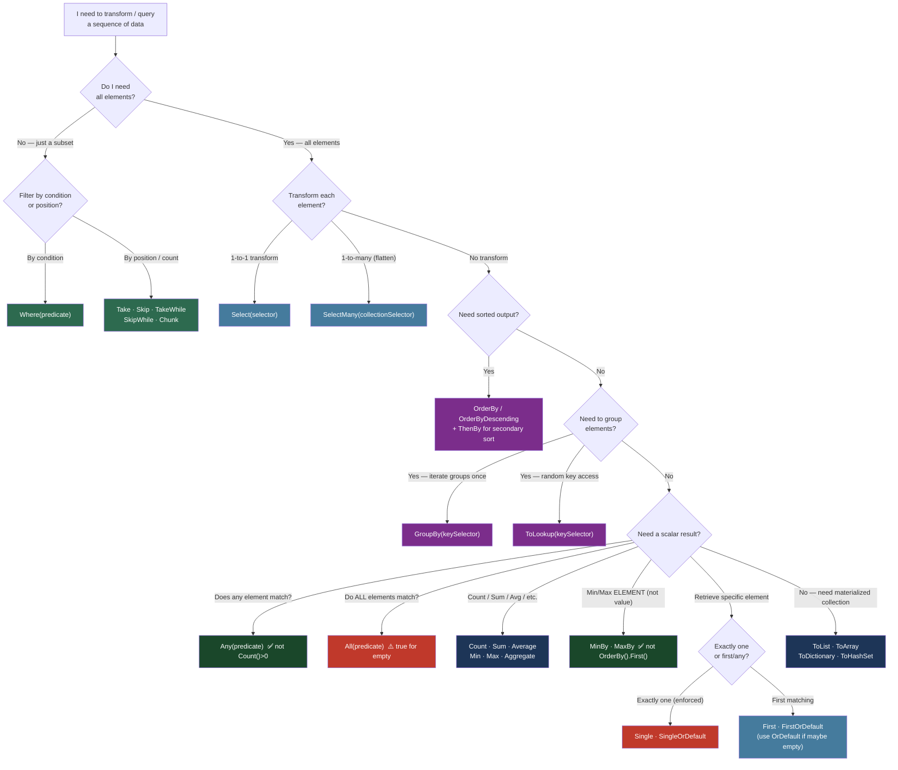

> [!success] Mastery Check
> - [ ] **Studied Well**
> - [ ] **Can explain the concept without notes**
> - [ ] **Can answer interview questions confidently**
> - [ ] **Can implement it in a real project**


## 📍 PART 0 — Navigation & Context

### Where This Topic Lives

```
C# Data Transformation
└── LINQ (Language Integrated Query)
    ├── ► Every Operator Reference  ← YOU ARE HERE
    │       ├── Filtering       (Where, OfType, Cast)
    │       ├── Projection      (Select, SelectMany)
    │       ├── Ordering        (OrderBy, ThenBy, Reverse)
    │       ├── Grouping        (GroupBy, ToLookup)
    │       ├── Joining         (Join, GroupJoin, Zip)
    │       ├── Set             (Distinct, Union, Intersect, Except + ByKey variants)
    │       ├── Aggregation     (Count, Sum, Min, Max, Average, MinBy, MaxBy, Aggregate)
    │       ├── Quantifiers     (Any, All, Contains)
    │       ├── Element         (First, Last, Single, ElementAt + OrDefault variants)
    │       ├── Partitioning    (Take, Skip, TakeWhile, SkipWhile, Chunk)
    │       └── Materializing   (ToList, ToArray, ToDictionary, ToHashSet, ToLookup)
    └── Execution Model (2.24) — WHY operators behave as they do
```

### What You Need Before This

- [[2.13 — Arrays and Collection Basics]] — arrays and `List<T>` implement `IEnumerable<T>`, which is what every LINQ operator works on
- [[2.21 — Delegates, Func, Action, and Closures]] — every LINQ operator accepts a `Func<T,...>` as predicate or selector; you need to know what those are
- [[2.17 — Generics: Constraints, Reification, and the Type System]] — LINQ operators are generic extension methods; type inference powers the fluent API

### What This Unlocks After

- [[2.24 — LINQ: Execution Model, Deferred Evaluation, and IQueryable]] — this note is the *what*; 2.24 is the *why* and *when it breaks*
- [[2.25 — Iterators and yield return]] — LINQ operators are implemented as iterator state machines; understanding operators makes this click
- [[2.43 — Expression Trees]] — `IQueryable<T>` translates LINQ operators to SQL via expression trees; you need to know the operators first

**Why this matters in production at scale:** LINQ is the primary data transformation API in every C# codebase — it appears in APIs, domain services, report generation, event processing, and test assertions. Choosing the wrong operator (`Count()` vs `Any()`, `First()` vs `Single()`, `Select` + `Where` vs `Where` + `Select`) has measurable performance consequences. This note is your complete reference.

---

## 🧠 PART 1 — The Core Mental Model

### The Fundamental Rule

> **Every LINQ operator is an extension method on `IEnumerable<T>` that returns either a new `IEnumerable<T>` (deferred — nothing executes yet) or a concrete value (immediate — iterates the source now). Chaining deferred operators builds a pipeline description; a materializing operator or a `foreach` pulls data through it.**
> The practical consequence is: a LINQ chain with no terminal operator does zero work and has no side effects — it is just an object graph describing *what* to do.

### The Plain-Language Analogy

Think of LINQ like a **factory assembly line**: each deferred operator is a workstation that knows what to do when a product arrives, but the conveyor belt is stopped. No products move until a materializing operator (like `ToList()`) starts the belt. The moment the belt moves, a product moves from the source through every workstation in sequence — not all products through station 1 first, then all through station 2. One product, all stations, then the next product.

This means `Where(...).Select(...)` doesn't first filter everything into a new collection and then project that new collection. It filters and projects each element in a single pass, one element at a time. That is the performance model you must hold in your head.

### The Taxonomy Diagram

```mermaid
graph TD
    ROOT["LINQ Operators\n(all are extension methods on IEnumerable&lt;T&gt;)"]

    ROOT --> DEF["Deferred Operators\n(return IEnumerable&lt;T&gt;\nno work done until iterated)"]
    ROOT --> IMM["Immediate Operators\n(iterate source NOW\nreturn concrete value)"]

    DEF --> FILT["Filtering\nWhere · OfType · Cast"]
    DEF --> PROJ["Projection\nSelect · SelectMany"]
    DEF --> ORD["Ordering\nOrderBy · OrderByDescending\nThenBy · ThenByDescending\nReverse"]
    DEF --> PART["Partitioning\nTake · TakeLast · TakeWhile\nSkip · SkipLast · SkipWhile\nChunk"]
    DEF --> JOIN["Joining\nJoin · GroupJoin · Zip"]
    DEF --> GRP["Grouping (partial)\nGroupBy (deferred build,\nimmediate per-group)"]

    IMM --> AGG["Aggregation\nCount · LongCount · Sum\nMin · Max · Average\nMinBy · MaxBy · Aggregate"]
    IMM --> QUANT["Quantifiers\nAny · All · Contains"]
    IMM --> ELEM["Element\nFirst · FirstOrDefault\nLast · LastOrDefault\nSingle · SingleOrDefault\nElementAt · ElementAtOrDefault\nDefaultIfEmpty"]
    IMM --> SET["Set Operations\nDistinct · DistinctBy\nUnion · UnionBy\nIntersect · IntersectBy\nExcept · ExceptBy"]
    IMM --> MAT["Materializing\nToList · ToArray\nToDictionary · ToHashSet\nToLookup · AsEnumerable"]

    style ROOT fill:#1d3557,color:#fff
    style DEF fill:#2d6a4f,color:#fff
    style IMM fill:#7b2d8b,color:#fff
    style FILT fill:#40916c,color:#fff
    style PROJ fill:#40916c,color:#fff
    style ORD fill:#40916c,color:#fff
    style PART fill:#40916c,color:#fff
    style JOIN fill:#40916c,color:#fff
    style GRP fill:#40916c,color:#fff
    style AGG fill:#9b59b6,color:#fff
    style QUANT fill:#9b59b6,color:#fff
    style ELEM fill:#9b59b6,color:#fff
    style SET fill:#9b59b6,color:#fff
    style MAT fill:#9b59b6,color:#fff
```



> [!IMPORTANT] The Single Most Important Fact About LINQ
> **Deferred operators do not execute when called. They execute when iterated.** This is the source of 80% of LINQ bugs in production. The details live in [[2.24 — LINQ: Execution Model]]; but every operator in this note is labeled **DEFERRED** or **IMMEDIATE** so you always know which side of the line you are on.

---

## 🔬 PART 2 — Deep Mechanics

### 2.1 The Operator Execution Model — One Pass vs Buffering

Before the operator reference, you must understand two execution sub-models within deferred operators:

```
━━━━━━━━━━━━━━━━━━━━━━━━━━━━━━━━━━━━━━━━━━━━━━━━━━━━━━━━━━━━━━
STREAMING DEFERRED vs BUFFERING DEFERRED
━━━━━━━━━━━━━━━━━━━━━━━━━━━━━━━━━━━━━━━━━━━━━━━━━━━━━━━━━━━━━━

STREAMING (one element at a time — O(1) extra memory):
  Where, Select, SelectMany, Take, Skip, TakeWhile, SkipWhile,
  Cast, OfType, Zip, DefaultIfEmpty

  Source:  [1][2][3][4][5]
  Where(x > 2).Select(x => x * 10):
  Pulls 1 → fails Where → next
  Pulls 2 → fails Where → next
  Pulls 3 → passes Where → Select → yields 30
  Pulls 4 → passes Where → Select → yields 40
  Pulls 5 → passes Where → Select → yields 50

BUFFERING DEFERRED (reads ALL source into memory first — O(n) extra memory):
  OrderBy, OrderByDescending, ThenBy, Reverse, GroupBy, Distinct,
  Union, Intersect, Except, Join, GroupJoin

  Why: Cannot yield the smallest element until ALL elements are seen.
  Source:  [3][1][4][1][5]
  OrderBy(x => x): must buffer [3,1,4,1,5] → sort → then yield [1,1,3,4,5]
  ↑ This means OrderBy on an infinite sequence hangs forever.

IMMEDIATE (executes inline, returns a scalar or collection, not IEnumerable):
  ToList, ToArray, ToDictionary, Count, Sum, First, Any, etc.
```

**Cost model:** Streaming operators are O(1) extra memory per element. Buffering operators are O(n) extra memory — they read the entire source before yielding the first result.

### 2.2 What `IEnumerable<T>` Actually Is — The Protocol

```csharp
// Every LINQ operator receives and returns this interface:
public interface IEnumerable<out T>
{
    IEnumerator<T> GetEnumerator();
}

public interface IEnumerator<out T> : IDisposable
{
    T       Current    { get; }   // current element
    bool    MoveNext();           // advance; returns false when done
    void    Reset();              // rarely used
}

// What "foreach" compiles to (IL equivalent):
// var e = source.GetEnumerator();
// try {
//     while (e.MoveNext()) {
//         var item = e.Current;
//         // loop body
//     }
// } finally { e.Dispose(); }

// A LINQ deferred operator returns an object that implements IEnumerable<T>
// but stores the predicate/selector for later — calling GetEnumerator()
// creates the state machine that will pull from the source.
// NOTHING runs until MoveNext() is called the first time.
```

**Cost:** Getting an enumerator for a LINQ chain: O(1), zero allocation for the chain setup (note: the state machine objects themselves allocate once when `GetEnumerator()` is called — typically 40-80 bytes per operator in the chain).

### 2.3 Operator Signatures — What the Compiler Sees

```csharp
// Representative signatures — knowing these makes type inference intuitive:

// Where: takes predicate, returns same T
IEnumerable<T> Where<T>(this IEnumerable<T> source, Func<T, bool> predicate)
IEnumerable<T> Where<T>(this IEnumerable<T> source, Func<T, int, bool> predicate) // index overload

// Select: transforms T to TResult
IEnumerable<TResult> Select<T, TResult>(this IEnumerable<T> source, Func<T, TResult> selector)
IEnumerable<TResult> Select<T, TResult>(this IEnumerable<T> source, Func<T, int, TResult> selector)

// SelectMany: flattens T → IEnumerable<TResult>
IEnumerable<TResult> SelectMany<T, TResult>(this IEnumerable<T> source,
    Func<T, IEnumerable<TResult>> selector)

// GroupBy: key extractor, returns IGrouping<TKey, T>
IEnumerable<IGrouping<TKey, T>> GroupBy<T, TKey>(this IEnumerable<T> source,
    Func<T, TKey> keySelector)

// OrderBy: returns IOrderedEnumerable (special — allows ThenBy chaining)
IOrderedEnumerable<T> OrderBy<T, TKey>(this IEnumerable<T> source, Func<T, TKey> keySelector)
// NOTE: ThenBy is ONLY available on IOrderedEnumerable — you cannot call it on a plain IEnumerable

// Aggregate: fold with accumulator
TAccumulate Aggregate<T, TAccumulate>(this IEnumerable<T> source,
    TAccumulate seed,
    Func<TAccumulate, T, TAccumulate> func)
```

### 2.4 The Index Overloads — Underused But Powerful

Many operators have an overload that provides the zero-based element index:

```csharp
// Where with index: filter by position
var evenPositionOrders = orders.Where((order, index) => index % 2 == 0);

// Select with index: transform and inject position
var numberedLines = logEntries.Select((entry, index) => $"{index + 1}: {entry.Message}");

// This is far cheaper than:
// logEntries.Select(e => e.Message)
//           .Select((msg, i) => $"{i+1}: {msg}") — two iterator chains vs one
```

---

## 💻 PART 3 — Production Code Patterns

### 3.1 The Complete Operator Reference by Category

This is the full reference. Every operator: signature summary, DEFERRED/IMMEDIATE label, what it does, and one production example from a named domain.

---

#### FILTERING

**`Where` — DEFERRED / STREAMING**
Keeps elements matching a predicate.

```csharp
// Order management — active orders for a customer
IEnumerable<Order> activeOrders = orders
    .Where(o => o.CustomerId == customerId && o.Status == OrderStatus.Active);
// Cost: O(n) to iterate, O(1) extra memory. Allocates one iterator object.
```

**`OfType<TResult>` — DEFERRED / STREAMING**
Filters to elements that are of type `TResult`, skipping others silently (unlike `Cast`).

```csharp
// Event log — extract only payment events from a mixed event stream
IEnumerable<PaymentEvent> paymentEvents = eventStream
    .OfType<PaymentEvent>(); // non-PaymentEvent objects are silently skipped
// Use OfType when the source is mixed types. Use Cast when ALL elements should be T.
```

**`Cast<TResult>` — DEFERRED / STREAMING**
Casts every element to `TResult`. Throws `InvalidCastException` if any element cannot be cast.

```csharp
// Legacy API returns ArrayList — cast to typed
var legacyResults = (ArrayList)someOldApi.GetResults();
IEnumerable<OrderDto> typed = legacyResults.Cast<OrderDto>();
// ⚠️ Throws if any element is not an OrderDto. Use OfType if mixed.
```

---

#### PROJECTION

**`Select` — DEFERRED / STREAMING**
Transforms each element to a new form. This is `map` in functional programming.

```csharp
// Product catalog — project entity to DTO for API response
IEnumerable<ProductDto> dtos = products
    .Select(p => new ProductDto(p.Id, p.Name, p.Price, p.Category.Name));
// Cost: O(n), O(1) extra memory. One new object per element.

// With index: numbered invoice line items
IEnumerable<InvoiceLineDto> lines = invoiceItems
    .Select((item, idx) => new InvoiceLineDto(idx + 1, item.Description, item.Amount));
```

**`SelectMany` — DEFERRED / STREAMING**
Flattens one level of nesting. Each element produces a sub-sequence; all sub-sequences are concatenated. This is `flatMap` / `bind` in functional programming.

```csharp
// Order management — all line items across all orders (flatten order → line items)
IEnumerable<LineItem> allItems = orders
    .SelectMany(o => o.LineItems);

// With result selector — correlate parent and child
IEnumerable<(Order Order, LineItem Item)> pairs = orders
    .SelectMany(o => o.LineItems, (order, item) => (order, item));

// File processing — all words across all documents
IEnumerable<string> allWords = documents
    .SelectMany(doc => doc.Content.Split(' ', StringSplitOptions.RemoveEmptyEntries));
// Cost: O(total elements across all sub-sequences), O(1) extra memory.
```

---

#### ORDERING

> [!WARNING] Ordering Operators Are BUFFERING DEFERRED
> They must read the entire source before yielding the first element. Never call them on infinite sequences. On `IQueryable`, they translate to SQL `ORDER BY` and push the sort to the database.

**`OrderBy` — DEFERRED / BUFFERING**
Sorts ascending by key. Returns `IOrderedEnumerable<T>` — required for `ThenBy`.

```csharp
// Product catalog — by price ascending
IOrderedEnumerable<Product> byPrice = products.OrderBy(p => p.Price);
// Cost: O(n log n) sort, O(n) extra memory to buffer.
```

**`OrderByDescending` — DEFERRED / BUFFERING**

```csharp
// Reporting — most recent orders first
IOrderedEnumerable<Order> recentFirst = orders.OrderByDescending(o => o.CreatedAt);
```

**`ThenBy` / `ThenByDescending` — DEFERRED / BUFFERING**
Secondary sort. ONLY callable on `IOrderedEnumerable<T>`, not on plain `IEnumerable<T>`.

```csharp
// Customer list — alphabetically by last name, then first name
IEnumerable<Customer> sorted = customers
    .OrderBy(c => c.LastName)
    .ThenBy(c => c.FirstName);
// ⚠️ Calling .OrderBy().OrderBy() does NOT do multi-level sort —
//    it sorts twice, discarding the first sort. Always use ThenBy for secondary sorts.
```

**`Reverse` — DEFERRED / BUFFERING**
Reverses the sequence. Buffers entire source.

```csharp
// Audit log — show oldest-first log when source is newest-first
IEnumerable<AuditEntry> chronological = auditLog.Reverse();
```

---

#### PARTITIONING

**`Take(n)` — DEFERRED / STREAMING**
Returns first n elements. Stops iterating source after n elements — efficient.

```csharp
// API — return first page of results
IEnumerable<Product> firstPage = products
    .OrderBy(p => p.Name)
    .Take(pageSize); // stops pulling from source after pageSize elements
```

**`TakeLast(n)` — DEFERRED / BUFFERING**
Returns last n elements. Must buffer entire source to know which are "last."

```csharp
// Audit log — last 10 events
IEnumerable<AuditEntry> lastTen = auditLog.TakeLast(10);
// ⚠️ Buffers the entire log — expensive for large sources. Consider reversed OrderBy instead.
```

**`TakeWhile(predicate)` — DEFERRED / STREAMING**
Takes elements while predicate is true, stops at first false (does NOT skip — stops completely).

```csharp
// Stock feed — process readings while price is within acceptable range
IEnumerable<StockReading> validReadings = stockFeed
    .TakeWhile(r => r.Price < alertThreshold);
// Stops at the first out-of-range reading, does not resume.
```

**`Skip(n)` — DEFERRED / STREAMING**
Skips first n elements, yields the rest.

```csharp
// Pagination — skip to page N
IEnumerable<Product> page = products
    .OrderBy(p => p.Name)
    .Skip((pageNumber - 1) * pageSize)
    .Take(pageSize);
```

**`SkipLast(n)` — DEFERRED / BUFFERING**
Skips last n elements. Buffers.

```csharp
// Remove the most recent N provisional entries from an ordered log
IEnumerable<AuditEntry> confirmed = auditLog.SkipLast(3);
```

**`SkipWhile(predicate)` — DEFERRED / STREAMING**
Skips while predicate is true, then yields all remaining (including first false match).

```csharp
// File processing — skip header rows until data rows begin
IEnumerable<string> dataRows = csvLines
    .SkipWhile(line => line.StartsWith("#") || string.IsNullOrWhiteSpace(line));
```

**`Chunk(size)` — DEFERRED / BUFFERING-PER-CHUNK (.NET 6+)**
Splits the sequence into arrays of at most `size` elements. Useful for batching.

```csharp
// Payment processing — send invoices in batches of 100
foreach (Invoice[] batch in invoices.Chunk(100))
    await emailService.SendBatchAsync(batch);
// Each chunk is an array — allocates one array per chunk.
// Last chunk may be smaller than size.
```

---

#### GROUPING

**`GroupBy` — DEFERRED (deferred-build, but groups are buffered)**
Groups elements by key. The returned `IEnumerable<IGrouping<TKey, T>>` is deferred, but each `IGrouping` buffers its elements.

```csharp
// Order management — group orders by customer for summary report
IEnumerable<IGrouping<int, Order>> byCustomer = orders
    .GroupBy(o => o.CustomerId);

// Typical usage — project each group to a summary
IEnumerable<CustomerOrderSummary> summaries = orders
    .GroupBy(o => o.CustomerId)
    .Select(g => new CustomerOrderSummary(
        CustomerId:  g.Key,
        OrderCount:  g.Count(),
        TotalValue:  g.Sum(o => o.TotalAmount)));

// ⚠️ The Key fact: GroupBy reads the ENTIRE source and builds an internal
// lookup structure before yielding ANY group. It is O(n) memory.
// On IQueryable, this translates to a SQL GROUP BY.
```

**`ToLookup` — IMMEDIATE**
Like `GroupBy` but materializes immediately to a `Lookup<TKey, T>` — an immutable multi-dictionary.

```csharp
// Product catalog — build a fast multi-value lookup by category, used repeatedly
ILookup<string, Product> byCategory = products.ToLookup(p => p.Category);

// O(1) lookup per category — use when you need to query multiple times
var electronics = byCategory["Electronics"]; // IEnumerable<Product> — empty if key missing
// ✅ Unlike Dictionary, ToLookup never throws on missing key — returns empty sequence.
```

---

#### JOINING

**`Join` — DEFERRED / BUFFERING (inner side)**
Inner join: matches elements from two sequences on equal keys. Buffers the inner sequence into a lookup.

```csharp
// Order + product catalog join — enrich order line items with product names
IEnumerable<EnrichedLineItem> enriched = orderLines
    .Join(
        products,                          // inner sequence
        line    => line.ProductId,         // outer key selector
        product => product.Id,             // inner key selector
        (line, product) => new EnrichedLineItem(
            line.Quantity,
            line.UnitPrice,
            product.Name,
            product.Category));
// Cost: O(n + m) — inner sequence buffered into hash lookup O(m),
//       outer iterated O(n), each match emitted.
```

**`GroupJoin` — DEFERRED / BUFFERING (inner side)**
Left outer join: each outer element paired with all matching inner elements (possibly empty collection — never excluded).

```csharp
// Customer + orders — all customers, even those with no orders
IEnumerable<CustomerWithOrders> result = customers
    .GroupJoin(
        orders,
        customer => customer.Id,
        order    => order.CustomerId,
        (customer, customerOrders) => new CustomerWithOrders(
            customer,
            customerOrders.ToList())); // customerOrders is IEnumerable<Order>, possibly empty
// ⚠️ The inner parameter is IEnumerable<Order> — an empty sequence for customers
//    with no orders (not null). This is the left outer join behavior.
```

**`Zip` — DEFERRED / STREAMING (.NET 6+ has 3-way Zip)**
Combines two (or three) sequences element-by-element. Stops at the shorter sequence.

```csharp
// Logistics — pair shipment IDs with tracking numbers from separate ordered sources
IEnumerable<(int ShipmentId, string TrackingNumber)> paired = shipmentIds
    .Zip(trackingNumbers, (id, tracking) => (id, tracking));

// Three-way Zip (.NET 6+)
IEnumerable<(int, string, DateTime)> triple = ids
    .Zip(names, timestamps);
// Cost: O(min(len1, len2)), O(1) extra memory. Streaming.
```

---

#### SET OPERATIONS

> [!NOTE] All Set Operations Are IMMEDIATE
> They must read and hash one or both sequences to deduplicate or compute the set operation.

**`Distinct` — DEFERRED (streaming with internal hash set)**
Removes duplicate elements using default equality.

```csharp
// Product search — deduplicate tag list across multiple product categories
IEnumerable<string> uniqueTags = allProductTags.Distinct();
// Uses default EqualityComparer<T> — make sure your type has correct Equals/GetHashCode.
```

**`DistinctBy(keySelector)` — DEFERRED / BUFFERING (.NET 6+)**
Removes duplicates by projected key. Keeps first occurrence.

```csharp
// User service — deduplicate users by email, keeping first record
IEnumerable<User> deduped = users.DistinctBy(u => u.Email.ToLowerInvariant());
// Cheaper than GroupBy(...).Select(g => g.First()) for this pattern.
```

**`Union` / `UnionBy` — DEFERRED / BUFFERING**
Set union: all elements from both sequences, no duplicates.

```csharp
// Permission system — combine permissions from role and direct assignment
IEnumerable<Permission> allPerms = rolePermissions.Union(directPermissions);
// UnionBy: same but uses a key selector for deduplication
IEnumerable<Product> catalog = localProducts.UnionBy(importedProducts, p => p.Sku);
```

**`Intersect` / `IntersectBy` — DEFERRED / BUFFERING**
Set intersection: only elements present in BOTH sequences.

```csharp
// Feature flags — features enabled for BOTH the user's role AND the tenant's plan
IEnumerable<Feature> available = roleFeatures.Intersect(planFeatures);
```

**`Except` / `ExceptBy` — DEFERRED / BUFFERING**
Set difference: elements from first sequence that are NOT in the second.

```csharp
// Order processing — find orders not yet invoiced
IEnumerable<Order> uninvoiced = allOrders
    .ExceptBy(invoicedOrders.Select(i => i.OrderId), o => o.Id);
// ExceptBy avoids materializing full Order objects for the exclusion set.
```

---

#### AGGREGATION

> [!NOTE] All Aggregation Operators Are IMMEDIATE
> They iterate the entire source and return a scalar.

**`Count()` / `LongCount()` — IMMEDIATE**

```csharp
// ⚠️ NEVER use Count() > 0 to check if sequence has elements — use Any() instead.
// Count() iterates EVERYTHING. Any() stops at the first element.
int total = orders.Count();
int totalLong = orders.LongCount(); // for sequences > int.MaxValue

// With predicate (saves a Where call):
int activeCount = orders.Count(o => o.Status == OrderStatus.Active);
// Cost: O(n). Throws on null source.
// Exception: Count() on List<T> or ICollection<T> is O(1) — calls .Count property.
```

**`Sum` — IMMEDIATE**

```csharp
decimal revenue = orders.Sum(o => o.TotalAmount);
// Overloads for int, long, double, float, decimal (+ nullable variants).
// Returns 0 on empty sequence. Cost: O(n).
```

**`Min` / `Max` — IMMEDIATE**

```csharp
decimal lowestPrice  = products.Min(p => p.Price);  // returns the minimum VALUE
decimal highestPrice = products.Max(p => p.Price);  // throws on empty sequence!
// ⚠️ Min()/Max() throw InvalidOperationException on empty source.
// Use MinBy/MaxBy to get the ELEMENT, not just the value.
```

**`MinBy` / `MaxBy` — IMMEDIATE (.NET 6+)**
Returns the element with the minimum/maximum key — not the key value itself.

```csharp
// ✅ Get the actual cheapest product (not just the price)
Product cheapest  = products.MinBy(p => p.Price)!; // null if empty
Product mostExpensive = products.MaxBy(p => p.Price)!;
// Returns null on empty sequence (no exception). Cost: O(n), O(1) memory.
// MUCH better than: products.OrderBy(p => p.Price).First()
//   which is O(n log n) and O(n) memory vs O(n) and O(1).
```

**`Average` — IMMEDIATE**

```csharp
double avgRating = reviews.Average(r => r.Score);
// Overloads for int/long/double/float/decimal. Throws on empty sequence.
// Returns double for int/long, decimal for decimal, float for float.
```

**`Aggregate` — IMMEDIATE**
General fold operation. The most flexible aggregation operator.

```csharp
// Build a summary string from order history (running concatenation)
string summary = orders.Aggregate(
    seed:  new StringBuilder(),
    func:  (sb, order) => sb.AppendLine($"Order {order.Id}: {order.TotalAmount:C}"),
    resultSelector: sb => sb.ToString());

// Without seed: uses first element as initial accumulator
decimal product = new[] { 2m, 3m, 4m }.Aggregate((acc, x) => acc * x); // 24
// ⚠️ Without-seed form throws on empty sequence. Seed form returns seed on empty sequence.
```

---

#### QUANTIFIERS

**`Any()` / `Any(predicate)` — IMMEDIATE (short-circuits)**

```csharp
// ✅ The correct way to check if a sequence has elements
bool hasOrders = orders.Any();             // stops at first element — O(1) for non-empty
bool hasOverdue = orders.Any(o => o.IsOverdue); // stops at first match
// NEVER use orders.Count() > 0 — that iterates everything.
```

**`All(predicate)` — IMMEDIATE (short-circuits)**
Returns true if ALL elements match (true for empty sequence — vacuous truth).

```csharp
// Validate all line items have positive quantity before processing
bool allValid = orderLines.All(line => line.Quantity > 0);
// ⚠️ Returns TRUE for empty sequence — empty means "no violations."
// This is mathematically correct but surprises engineers.
```

**`Contains(value)` — IMMEDIATE (short-circuits)**

```csharp
bool hasSpecificProduct = productIds.Contains(targetId);
// Uses EqualityComparer<T>.Default. Cost: O(n) for IEnumerable.
// Exception: HashSet<T>.Contains() is O(1) — LINQ Contains on HashSet<T>
// calls the collection's own Contains (O(1)) when it implements ICollection<T>.
```

---

#### ELEMENT OPERATORS

> [!DANGER] `First`, `Last`, `Single`, `ElementAt` throw `InvalidOperationException` on empty sequence. Always use the `OrDefault` variants unless you are certain the sequence is non-empty and you want the exception.

**`First` / `FirstOrDefault` — IMMEDIATE (short-circuits)**

```csharp
// ✅ Correct pattern: use OrDefault and check for null
Order? latest = orders.OrderByDescending(o => o.CreatedAt).FirstOrDefault();
if (latest is null) return NotFound();

// ⚠️ WRONG: First() on potentially empty sequence — throws in production
Order mustExist = orders.First(o => o.Id == targetId); // throws if not found
```

**`Last` / `LastOrDefault` — IMMEDIATE**
Iterates entire source to find the last element. O(n).

```csharp
// Audit log — most recent entry for a resource (use OrderByDescending + First for efficiency)
// ⚠️ Last() on an unsorted sequence iterates EVERYTHING to find the last element.
// Better: auditLog.Where(e => e.ResourceId == id).OrderByDescending(e => e.Timestamp).FirstOrDefault()
AuditEntry? lastEntry = auditLog.LastOrDefault(e => e.ResourceId == resourceId);
```

**`Single` / `SingleOrDefault` — IMMEDIATE**
Returns the one matching element. Throws if zero OR more than one match.

```csharp
// ✅ Use Single when exactly-one is a business rule you want enforced
User user = users.Single(u => u.Email == email);
// Throws InvalidOperationException if 0 or 2+ users have this email.
// This is INTENTIONAL — it makes data integrity violations visible immediately.

// SingleOrDefault for optional but unique:
User? user = users.SingleOrDefault(u => u.Id == id);
// Returns null if not found, throws if multiple found.
```

**`ElementAt` / `ElementAtOrDefault` — IMMEDIATE**

```csharp
Product third = products.ElementAt(2);   // 0-indexed; throws if < 3 elements
Product? third = products.ElementAtOrDefault(2); // null if < 3 elements
// Cost: O(n) for IEnumerable. O(1) for IList<T> (falls through to indexer).
```

**`DefaultIfEmpty` — DEFERRED / STREAMING**
Returns the sequence, or a single default element if the source is empty.

```csharp
// Ensure a JOIN-like operation always has at least one row
IEnumerable<OrderItem> itemsOrPlaceholder = orderItems
    .Where(i => i.OrderId == orderId)
    .DefaultIfEmpty(OrderItem.Empty); // returns [Empty] if no items found
```

---

#### MATERIALIZING / CONVERSION

**`ToList()` — IMMEDIATE**
Iterates source into a new `List<T>`. The most common materializing operator.

```csharp
List<Order> snapshot = orders.Where(o => o.IsActive).ToList();
// ✅ Materialize when you need: random access, multiple iteration, modification.
// ✅ Materialize at service boundaries so callers don't hold open DB connections.
// Cost: O(n), one heap allocation for the List + its internal array.
```

**`ToArray()` — IMMEDIATE**
Iterates source into a `T[]`. Slightly more efficient than `ToList()` for read-only use.

```csharp
string[] statusNames = Enum.GetValues<OrderStatus>()
    .Select(s => s.ToString())
    .ToArray();
// Use ToArray over ToList when: read-only, passed to APIs expecting arrays,
// or you want to avoid the extra overhead of List's Count/Capacity bookkeeping.
```

**`ToDictionary` — IMMEDIATE**
Materialize to `Dictionary<TKey, TValue>`. Throws on duplicate keys.

```csharp
// Product service — build id-to-product lookup for O(1) access
Dictionary<int, Product> byId = products.ToDictionary(p => p.Id);
// Overload with value selector:
Dictionary<int, string> idToName = products.ToDictionary(p => p.Id, p => p.Name);
// ⚠️ Throws ArgumentException on duplicate key — ensure keys are unique.
// Use GroupBy + ToDictionary or ToLookup for non-unique keys.
```

**`ToHashSet()` — IMMEDIATE**
Materialize to `HashSet<T>`. Deduplicates automatically.

```csharp
// Build a fast O(1) membership test set from query results
HashSet<int> processedOrderIds = completedOrders.Select(o => o.Id).ToHashSet();

// Then use for O(1) Contains checks in a loop:
var pending = allOrders.Where(o => !processedOrderIds.Contains(o.Id));
// ✅ Far better than: allOrders.Where(o => !completedOrders.Any(c => c.Id == o.Id))
//    which is O(n*m) vs O(n+m).
```

**`AsEnumerable()` — IMMEDIATE (identity, but changes compile-time type)**
Forces evaluation as `IEnumerable<T>` rather than `IQueryable<T>`. Critical for EF Core.

```csharp
// EF Core — switch from SQL evaluation to in-memory evaluation mid-query
var results = dbContext.Orders
    .Where(o => o.Status == OrderStatus.Active)     // ← runs in SQL
    .AsEnumerable()                                  // ← everything after runs in .NET
    .Where(o => complexInMemoryLogic(o));            // ← cannot be translated to SQL
// ⚠️ AsEnumerable() causes all matching rows to be loaded into memory first.
// Only use when the remaining operations genuinely cannot run in SQL.
```

---

#### METHOD SYNTAX ↔ QUERY SYNTAX EQUIVALENCE

```csharp
// Query syntax is compiled to method syntax — they are identical at IL level.

// METHOD SYNTAX:
var result = orders
    .Where(o => o.CustomerId == id)
    .OrderBy(o => o.CreatedAt)
    .Select(o => new { o.Id, o.TotalAmount });

// QUERY SYNTAX (equivalent):
var result =
    from o in orders
    where o.CustomerId == id
    orderby o.CreatedAt
    select new { o.Id, o.TotalAmount };

// JOIN in query syntax (more readable for complex joins):
var result =
    from o in orders
    join c in customers on o.CustomerId equals c.Id
    where o.Status == OrderStatus.Active
    select new { o.Id, c.Name, o.TotalAmount };

// OPERATORS WITH NO QUERY SYNTAX EQUIVALENT:
// Count(), Sum(), Any(), All(), First(), ToList(), ToArray(),
// ToDictionary(), GroupJoin (partial), Zip, Aggregate, Chunk,
// MinBy(), MaxBy(), DistinctBy(), UnionBy(), IntersectBy(), ExceptBy()
// → Must use method syntax for these.
```

---

## ⚠️ PART 4 — Gotchas & Anti-Patterns

### Gotcha 1: `Count() > 0` Instead of `Any()`

Engineers from non-LINQ backgrounds reach for `Count()` to test emptiness, not realizing `Count()` iterates the entire sequence, while `Any()` stops at the first element.

```csharp
// ⚠️ WRONG: Iterates all 50,000 pending orders to count them, then checks > 0
if (pendingOrders.Count() > 0)
    await ProcessNextBatch(pendingOrders);

// ✅ CORRECT: Stops at the first pending order — O(1) for non-empty sequences
if (pendingOrders.Any())
    await ProcessNextBatch(pendingOrders);

// WHY: Count() calls MoveNext() until it returns false — it counts every element.
// Any() calls MoveNext() once and returns. On a deferred query over a large
// dataset or a DB query, this is the difference between a full table scan and
// a TOP(1) query on IQueryable.
```

### Gotcha 2: `OrderBy().First()` Instead of `MinBy()`

Engineers want "the order with the lowest total" and reach for the natural-feeling `OrderBy(...).First()`. This sorts the entire sequence — O(n log n) and O(n) memory — when `MinBy()` does the same in O(n) and O(1) memory.

```csharp
// ⚠️ WRONG: Sorts all 100,000 products to find the cheapest — O(n log n), O(n) memory
Product cheapest = products.OrderBy(p => p.Price).First();

// ✅ CORRECT: Single pass, O(n), O(1) extra memory (.NET 6+)
Product cheapest = products.MinBy(p => p.Price)!;

// Same trap with Last():
// ⚠️ WRONG: O(n log n):
Product mostExpensive = products.OrderByDescending(p => p.Price).First();
// ✅ CORRECT: O(n):
Product mostExpensive = products.MaxBy(p => p.Price)!;

// WHY: MinBy/MaxBy do a single linear scan, tracking the current minimum element.
// OrderBy must buffer the entire sequence and perform a comparison sort before
// any element can be yielded.
```

### Gotcha 3: Calling `Where` After `OrderBy`

`Where` should always come before `OrderBy` — filtering reduces the set before the expensive sort. Reversed order sorts everything before discarding most of it.

```csharp
// ⚠️ WRONG: Sorts ALL orders (100,000), THEN filters to active (1,000)
var result = orders
    .OrderBy(o => o.CreatedAt)  // buffers and sorts 100,000 orders
    .Where(o => o.IsActive)     // then discards 99,000 of them
    .ToList();

// ✅ CORRECT: Filters to 1,000 active orders FIRST, then sorts only those
var result = orders
    .Where(o => o.IsActive)     // streaming — O(1) memory, discards early
    .OrderBy(o => o.CreatedAt)  // buffers and sorts only 1,000 orders
    .ToList();

// WHY: OrderBy is a buffering operator — it reads ALL source elements before yielding.
// Placing Where before OrderBy means OrderBy only buffers the filtered subset.
// On IQueryable (EF Core), the SQL optimizer often handles this — but in-memory
// LINQ on IEnumerable has no optimizer; operator order IS execution order.
```

### Gotcha 4: `ToDictionary` on Non-Unique Keys

Engineers use `ToDictionary` on data that might have duplicate keys, and the `ArgumentException` only appears at runtime under specific data conditions — not in tests.

```csharp
// ⚠️ WRONG: Throws ArgumentException if any two products share a category+name combo
// (Silently works until production data has duplicates)
Dictionary<string, Product> byName = products
    .ToDictionary(p => $"{p.Category}:{p.Name}"); // THROWS on duplicate key

// ✅ CORRECT option A: Use ToLookup when duplicates are possible
ILookup<string, Product> byName = products
    .ToLookup(p => $"{p.Category}:{p.Name}"); // never throws, key maps to multiple values

// ✅ CORRECT option B: GroupBy and take the first/last explicitly
Dictionary<string, Product> byName = products
    .GroupBy(p => $"{p.Category}:{p.Name}")
    .ToDictionary(g => g.Key, g => g.First()); // explicit deduplication rule

// WHY: ToDictionary calls dictionary.Add() internally, which throws on duplicate keys.
// ToLookup builds a multi-dictionary and never throws regardless of key duplicates.
```

### Gotcha 5: `SelectMany` vs `Select` + `SelectMany` — The Result Selector Trap

Engineers who know `SelectMany` use the single-parameter overload for flattening, but miss the two-parameter overload that correlates parent and child, leading to a secondary `Select` join that rebuilds context already available.

```csharp
// ⚠️ WRONG: Loses the parent order context, then has to re-join it
IEnumerable<(int orderId, decimal itemAmount)> pairs = orders
    .SelectMany(o => o.LineItems)               // loses the Order
    .Select(item => (item.OrderId, item.Amount)); // re-attaches via item's FK field

// ✅ CORRECT: Use the result selector overload — parent is available in the projection
IEnumerable<(int orderId, decimal itemAmount)> pairs = orders
    .SelectMany(
        o    => o.LineItems,                               // collection selector
        (o, item) => (o.Id, item.Amount));                 // result selector: has BOTH

// WHY: The two-parameter SelectMany overload receives both the outer element (o)
// and each inner element (item) in the result selector. This avoids the need to
// store a back-reference in the child object and avoids a second LINQ pass.
// The result is the same, but the two-parameter form is cleaner, avoids relying
// on the child having a FK property, and can project from the parent without
// materializing intermediate objects.
```

---

## 📊 PART 5 — Performance Implications

### 5.1 Allocation Characteristics Table

| Scenario | Allocation Behavior | Approx Cost |
|---|---|---|
| Building a deferred chain (`Where().Select()`) | One iterator object per operator (~40-80 bytes each) | O(1) setup, O(n) on iteration |
| `ToList()` on n elements | One `List<T>` + one internal `T[]` | O(n), ~48 + n * sizeof(T) bytes |
| `ToArray()` on n elements | One `T[]` | O(n), ~24 + n * sizeof(T) bytes — slightly cheaper than `ToList` |
| `ToDictionary()` on n elements | One `Dictionary<K,V>` with internal arrays | O(n), significant |
| `OrderBy()` on n elements | Buffers entire source into `T[]`, sorts in place | O(n log n) time, O(n) memory |
| `GroupBy()` on n elements | Internal `Lookup<K,V>` buffers everything | O(n) time, O(n) memory |
| `Count()` on `ICollection<T>` | Zero allocation — calls `.Count` property | O(1) |
| `Count()` on plain `IEnumerable<T>` | Iterates entire source | O(n), allocates iterator |
| `Any()` on non-empty sequence | Stops at first element | O(1) amortized |
| `MinBy()` / `MaxBy()` | Single pass, no sort buffer | O(n), O(1) extra memory |
| `Chunk(n)` on m elements | m/n array allocations (one per chunk) | O(m) time, O(chunk size) at a time |
| `SelectMany` flattening n×m elements | One iterator, O(1) extra memory | O(n*m) iteration |
| `HashSet<T>.Contains` via LINQ `Contains` | Zero extra allocation — calls `HashSet.Contains` | O(1) |
| Closure in LINQ predicate (captures variable) | One display class heap allocation at lambda creation | ~40 bytes once |

### 5.2 BenchmarkDotNet: Operator Selection Impact

```csharp
using BenchmarkDotNet.Attributes;

// Expected output (approximate, .NET 8, x64, 10,000 order records):
// | Method                | Mean         | Allocated  |
// |-----------------------|--------------|------------|
// | CountGreaterThanZero  | 18,421.3 ns  | 0 B        |
// | AnyCheck              |      2.1 ns  | 0 B        |
// | OrderByThenFirst      | 312,445.2 ns | 160,048 B  |
// | MinByDirect           |  18,102.1 ns | 0 B        |
// | WhereAfterOrderBy     | 284,311.8 ns | 152,022 B  |
// | WhereBeforeOrderBy    |  44,219.6 ns |  16,048 B  |
// | ToListMaterialize     |  19,874.3 ns |  80,024 B  |
// | ToHashSetLookup       |  21,442.1 ns |  98,032 B  |
// | LinqContainsOnList    |  48,231.2 ns | 0 B        |
// | HashSetContains       |      3.8 ns  | 0 B        |

[MemoryDiagnoser]
public class LinqOperatorBenchmarks
{
    private List<Order> _orders = null!;
    private HashSet<int> _processedIds = null!;

    [GlobalSetup]
    public void Setup()
    {
        _orders = Enumerable.Range(1, 10_000)
            .Select(i => new Order(i, i % 5 == 0, (decimal)(i * 9.99), DateTime.UtcNow.AddDays(-i)))
            .ToList();
        _processedIds = Enumerable.Range(1, 5_000).ToHashSet();
    }

    [Benchmark(Baseline = true)]
    public bool CountGreaterThanZero() => _orders.Count(o => o.IsActive) > 0;

    [Benchmark]
    public bool AnyCheck() => _orders.Any(o => o.IsActive);

    [Benchmark]
    public Order OrderByThenFirst() => _orders.OrderBy(o => o.TotalAmount).First();

    [Benchmark]
    public Order? MinByDirect() => _orders.MinBy(o => o.TotalAmount);

    [Benchmark]
    public List<Order> WhereAfterOrderBy() =>
        _orders.OrderBy(o => o.CreatedAt).Where(o => o.IsActive).ToList();

    [Benchmark]
    public List<Order> WhereBeforeOrderBy() =>
        _orders.Where(o => o.IsActive).OrderBy(o => o.CreatedAt).ToList();

    [Benchmark]
    public List<Order> ToListMaterialize() =>
        _orders.Where(o => o.IsActive).ToList();

    [Benchmark]
    public HashSet<int> ToHashSetLookup() =>
        _orders.Select(o => o.Id).ToHashSet();

    [Benchmark]
    public int LinqContainsOnList()
    {
        var idList = _processedIds.ToList(); // simulate a List, not HashSet
        return _orders.Count(o => idList.Contains(o.Id)); // O(n*m)
    }

    [Benchmark]
    public int HashSetContains() =>
        _orders.Count(o => _processedIds.Contains(o.Id)); // O(n) total
}

public record Order(int Id, bool IsActive, decimal TotalAmount, DateTime CreatedAt);
```

### 5.3 When to Care / When to Ignore

**When this costs you:**

- `Count() > 0` in a hot API path that checks frequently — replace with `Any()` for a 1000× speedup on large sequences.
- `OrderBy().First()` / `OrderBy().Last()` when `MinBy()` / `MaxBy()` exists — an O(n log n) sort replaced by O(n) linear scan.
- `Where` placed after `OrderBy` on large in-memory collections — sorting before filtering buffers the entire unsorted source.
- Using a `List<T>` for `Contains()` membership tests in a loop (O(n*m)) — convert to `HashSet<T>` and test is O(n).
- `ToDictionary` on data with potential duplicates — throws at runtime with misleading exception messages.
- `SelectMany` + secondary `Select` to re-join parent when the two-parameter `SelectMany` overload would have avoided it.
- `TakeLast(n)` on a large sequence when `OrderByDescending().Take(n)` would also work but more efficiently communicate intent.

**When this doesn't matter:**

- Any LINQ chain on a collection with < 100 elements — the absolute times are microseconds regardless of operator choice.
- `ToList()` vs `ToArray()` — the difference is negligible; pick based on what the caller needs (`List<T>` for mutation, `T[]` for read-only array APIs).
- `Where` vs `OfType<T>` when the source is already homogeneously typed — functionally equivalent for most cases.
- Operator ordering when the chain is translated to SQL via EF Core's `IQueryable` — the SQL optimizer rewrites the execution plan regardless of C# operator order.

---

## 🎤 PART 6 — Interview Arsenal

### 6.1 The Question Bank

---

**Q: "What's the difference between `First()` and `Single()`?"**

**Average answer:** "First returns the first element, Single returns the only element and throws if there are multiple."

**Why that's insufficient:** Doesn't mention when to choose which, or the production implications.

> "Both return the first matching element, but they encode completely different business expectations. `First()` says 'give me the first one, I don't care if there are more.' `Single()` says 'there must be exactly one — if there are zero or more than one, something is wrong and I want an exception.' I reach for `Single()` when the uniqueness of the result is a business rule I want enforced at runtime — for example, looking up a user by unique email. If duplicate emails somehow exist in the database, I want an exception, not a silently wrong result. The flip side is that `Single()` has to scan past the first match to confirm there's no second match, so it's slightly more expensive than `First()` on large sequences. The `OrDefault` variants of both return null instead of throwing on empty input, and I use those when absence is a legitimate state — but I still choose between them based on whether duplicates would be an error."

---

**Q: "When would you use `ToLookup` instead of `GroupBy`?"**

**Average answer:** "ToLookup is like GroupBy but materializes immediately."

**Why that's insufficient:** Doesn't explain the access model, non-throwing behavior, or performance tradeoffs.

> "The key difference is the access pattern you'll use the data for. `GroupBy` gives you a deferred `IEnumerable<IGrouping<TKey,T>>` — you iterate through the groups once in order. `ToLookup` gives you an `ILookup<TKey,T>` — a materialized multi-dictionary that supports random key-access in O(1). I use `ToLookup` when I need to query by key multiple times: for example, if I'm processing 10,000 orders and for each order I need to look up all related payments, I build a `ToLookup(p => p.OrderId)` once at O(n), then each lookup is O(1) — total O(n). Doing `GroupBy` in a loop would be O(n*m). The other important difference is that `ToLookup` never throws on missing keys — if you access a key that doesn't exist, you get an empty sequence. `Dictionary[key]` would throw. This makes `ToLookup` safer for lookups against data whose keys you don't fully control."

---

**Q: "What is `SelectMany` and when would you use it over `Select`?"**

**Average answer:** "SelectMany flattens nested collections."

**Why that's insufficient:** Doesn't explain the one-to-many relationship or the result selector overload.

> "The conceptual difference is that `Select` is a one-to-one transform — each input element produces exactly one output element. `SelectMany` is a one-to-many transform — each input element produces a variable number of output elements, and those are all flattened into a single sequence. The classic use case is navigating a parent-child relationship: `orders.SelectMany(o => o.LineItems)` gives you all line items from all orders in a single flat sequence rather than a sequence of sequences. The version of `SelectMany` I use most in production is the two-parameter overload: `SelectMany(o => o.LineItems, (o, item) => (o.Id, item.Amount))`. This is the idiomatic way to do a flat left-join-style projection — you get both the parent and child in scope for the projection without needing to navigate back through a foreign key. I find it cleaner than doing `SelectMany` followed by a `Select` that tries to reconstruct the parent context."

---

**Q: "Why is `Any()` preferred over `Count() > 0`?"**

**Average answer:** "Any() is faster because it stops early."

**Why that's insufficient:** Doesn't explain the mechanism or quantify the difference.

> "The mechanism is short-circuit evaluation. `Any()` calls `MoveNext()` on the enumerator exactly once and returns immediately if the first element satisfies the predicate — or returns false if the enumerator is exhausted. `Count()` calls `MoveNext()` on every single element to count them all, then the result is compared to zero. On a sequence of 50,000 items where the first one matches, `Any()` does one comparison and `Count()` does 50,000. On `IQueryable` — EF Core — the difference is even more dramatic: `Any()` generates `SELECT TOP(1) 1 FROM Orders WHERE ...` while `Count() > 0` generates `SELECT COUNT(*) FROM Orders WHERE ...`. The TOP(1) query lets the database exit as soon as it finds a matching row index entry, while COUNT(*) scans the entire qualifying set. I caught this exact performance issue in a production system where a health-check endpoint was calling `Count() > 0` on a large events table — it was generating a 400ms COUNT query 60 times per minute. Replacing it with `Any()` dropped it to 2ms."

---

**Q: "What is the difference between `Distinct()` and `DistinctBy()`?"**

**Average answer:** "DistinctBy takes a key selector, Distinct uses the whole element."

**Why that's insufficient:** Doesn't explain which element is retained on duplicates, or when each matters.

> "The practical difference is what you're deduplicating on and what you get back. `Distinct()` deduplicates by the full element identity — using `Equals` and `GetHashCode` on the element itself — so you get back unique element values. It requires your type to have meaningful equality semantics, which for custom objects means implementing `IEquatable<T>` or providing a custom `IEqualityComparer<T>`. `DistinctBy(keySelector)` deduplicates by a projected key while keeping the original elements — when multiple elements share a key, it keeps the first occurrence. The practical scenario where I reach for `DistinctBy` is when I have a list of complex objects and I want to deduplicate by one property: for example, `users.DistinctBy(u => u.Email)` returns full `User` objects with unique emails, keeping the first user per email. Before .NET 6 added `DistinctBy`, the idiomatic workaround was `GroupBy(u => u.Email).Select(g => g.First())` which is logically equivalent but more verbose and slightly less efficient."

---

### 6.2 The Trick Questions

> [!WARNING] These Catch Even Experienced Engineers

**"Does `All()` return true or false when called on an empty sequence?"**
Trap: "False — nothing matches." Correct answer: **True.** `All()` returns true vacuously for empty sequences — "all elements satisfy the predicate" is vacuously true when there are no elements. This surprises engineers who use `All()` as a guard and expect it to fail on empty inputs. Always pair with `Any()` if empty should be false: `list.Any() && list.All(predicate)`.

**"If I call `Where()` on a `List<int>` and don't use the result, does any filtering happen?"**
Trap: "Yes, it filters the list." Correct answer: **No.** `Where()` is deferred — it returns an iterator object that knows what to do, but does nothing until iterated. The filter predicate is never called unless you enumerate the result with `foreach`, `ToList()`, `Count()`, etc.

**"What does `OrderBy(x => x).ThenBy(x => x)` do compared to `OrderBy(x => x).OrderBy(x => x)`?"**
Trap: "Same thing." Correct answer: `ThenBy` is a stable secondary sort applied within groups of equal primary keys — it doesn't re-sort. `OrderBy().OrderBy()` applies two completely independent sorts, where the second sort discards the ordering established by the first. They produce the same result only when the secondary key is the same as the primary (trivially redundant). In practice, `OrderBy().OrderBy()` almost always has the wrong behavior when the developer intended a multi-level sort.

**"Can you call `ThenBy` on any `IEnumerable<T>`?"**
Trap: "Yes, if you import System.Linq." Correct answer: **No.** `ThenBy` is only defined on `IOrderedEnumerable<T>`, which is the return type of `OrderBy` and `OrderByDescending`. If you store the result of `OrderBy()` in an `IEnumerable<T>` variable, you lose access to `ThenBy` at compile time — you'd need to cast or chain directly.

**"What happens if you call `First()` on a LINQ query that is backed by EF Core and the table is empty?"**
Trap: "Returns null." Correct answer: **Throws `InvalidOperationException`** — "Sequence contains no elements." `First()` throws on empty regardless of whether the source is in-memory or a database. For "maybe empty" scenarios, use `FirstOrDefault()` which returns `null` (or the default value type) on empty.

---

### 6.3 Red Flags to Avoid

```
❌ "LINQ executes when the query is written" — deferred operators do nothing until iterated;
   saying this tells the interviewer you don't understand the execution model

❌ "Use Count() to check if a sequence is empty" — Any() is the correct idiom; Count() > 0
   is a classic performance red flag in code reviews

❌ "OrderBy().OrderBy() is the same as OrderBy().ThenBy()" — it is not; secondary OrderBy
   discards the first sort; this shows a fundamental misunderstanding of stable sort

❌ "All() returns false for an empty sequence" — it returns true; vacuous truth is
   the mathematically correct behavior and this error reveals unfamiliarity with the operator

❌ "SelectMany just flattens lists" — true but incomplete; the result selector overload
   is the production-grade idiom and not knowing it signals shallow LINQ experience

❌ Confusing IEnumerable<T> and IQueryable<T> — on IQueryable, LINQ operators translate to SQL;
   saying "LINQ runs in memory" without qualifying this distinction is wrong for EF Core scenarios

❌ "Use First() when you're not sure if there's a result" — First() throws on empty;
   FirstOrDefault() is for "might be empty"; First() is for "must exist or it's an error"

❌ "ToLookup is the same as GroupBy" — ToLookup is immediate and keyed-access; GroupBy is
   deferred and sequential; they serve different access patterns
```

---

## 🔀 PART 7 — Decision Framework



---

## ✅ PART 8 — Self-Check

### A. Conceptual Questions

1. You have a `List<int>` and call `.Where(x => x > 0)`. No code iterates the result. How many times is the predicate `x > 0` evaluated? Why?

2. What is the difference between `GroupBy` and `ToLookup` in terms of when they execute and how you access the results? Give a concrete scenario where you'd choose `ToLookup` over `GroupBy`.

3. `All(predicate)` returns `true` on an empty sequence. A colleague argues this is a bug. How would you explain that it is correct behavior, and how do you write a guard that returns `false` for empty AND any-predicate-failing?

4. You are joining `orders` to `customers` using `Join()`. One order has a `CustomerId` that doesn't exist in the `customers` collection. What happens to that order in the result?

5. `ThenBy` does not exist on `IEnumerable<T>`. Why? What is the compile-time contract that `ThenBy` requires, and how does the type system enforce it?

6. You have a chain: `source.Where(x => Expensive(x)).Select(x => Transform(x)).First()`. Does `Expensive()` run on every element? Does `Transform()` run on every element? Explain in terms of how `First()` pulls from the chain.

7. A method returns `IEnumerable<Order>` and you need to call it twice — once to count active orders, once to sum their totals. Why might calling it twice be problematic, and what is the correct fix?

8. `Except` uses equality comparison to find elements in the first sequence not in the second. If your `Order` class doesn't override `Equals` and `GetHashCode`, what does `Except` use, and is it correct?

9. You have `orders.Select(o => o.Items).SelectMany(items => items)`. Rewrite this using the single-call `SelectMany` overload, and explain why it's equivalent.

10. `Chunk(100)` on a sequence of 250 elements: how many arrays are allocated? What are their sizes? What happens if the source yields an exception mid-sequence?

---

### B. Code Puzzles

**Puzzle 1 — What is printed?**

```csharp
var numbers = new List<int> { 5, 3, 8, 1, 9, 2, 7 };

var query = numbers
    .Where(n => { Console.Write($"W{n} "); return n > 4; })
    .Select(n => { Console.Write($"S{n} "); return n * 10; });

Console.WriteLine("Before foreach");
foreach (var item in query)
    Console.Write($"[{item}] ");
Console.WriteLine("\nDone");
```

<details>
<summary>Answer (expand after trying)</summary>

Output:
```
Before foreach
W5 S5 [50] W3 W8 S8 [80] W1 W9 S9 [90] W2 W7 S7 [70] 
Done
```

Key insight: Nothing prints before "Before foreach" — the query is deferred. During iteration, elements flow one at a time: `Where` tests 5 (passes), then `Select` transforms 5 (yields 50). Then `Where` tests 3 (fails, skipped). Then tests 8 (passes), `Select` transforms 8 (yields 80). Etc. This is the streaming pipeline model: one element through all operators, then the next element — NOT all through `Where` first.

</details>

---

**Puzzle 2 — What is printed?**

```csharp
var orders = new[] { 1, 2, 3, 4, 5 };

bool result = orders.All(o => o > 0);
Console.WriteLine(result);

bool result2 = Enumerable.Empty<int>().All(o => o > 0);
Console.WriteLine(result2);

bool result3 = Enumerable.Empty<int>().Any(o => o > 0);
Console.WriteLine(result3);
```

<details>
<summary>Answer (expand after trying)</summary>

Output:
```
True
True
False
```

`All()` on `[1,2,3,4,5]` with `o > 0` → all pass → `true`.
`All()` on empty sequence → vacuous truth → `true`. No elements to violate the predicate.
`Any()` on empty sequence → no elements to satisfy the predicate → `false`.

This is the critical difference: `All(empty)` = `true`, `Any(empty)` = `false`. The combination `list.Any() && list.All(predicate)` gives you the "non-empty AND all match" semantic that engineers often accidentally expect from `All()` alone.

</details>

---

**Puzzle 3 — Where is the bug?**

```csharp
// Inventory system: find products where price is below average
public IEnumerable<Product> FindBelowAverage(IEnumerable<Product> products)
{
    var average = products.Average(p => p.Price);
    return products.Where(p => p.Price < average);
}

// Called as:
var dbProducts = dbContext.Products.Where(p => p.IsActive);
var cheap = FindBelowAverage(dbProducts).ToList();
```

<details>
<summary>Answer (expand after trying)</summary>

There are two problems:

**Problem 1 — Double enumeration:** `products.Average(...)` enumerates the source once. Then `products.Where(...)` enumerates it again. If `products` is an EF Core `IQueryable`, this generates **two database queries**. If `products` comes from a one-pass source (file stream, network), the second enumeration may return empty or throw.

**Problem 2 (on IQueryable specifically) — Deferred with captured variable:** The `average` local variable is captured correctly here, so this isn't a closure bug. But the double-enumeration is the main issue.

Fix: Materialize the source once before computing the average:

```csharp
public List<Product> FindBelowAverage(IEnumerable<Product> products)
{
    var list    = products.ToList();          // single enumeration
    var average = list.Average(p => p.Price); // operates on the in-memory list
    return list.Where(p => p.Price < average).ToList();
}
```

</details>

---

**Puzzle 4 — What does this print? (the classic `Count()` vs `Any()` trap)**

```csharp
var source = Enumerable.Range(1, 1_000_000);

var query = source.Where(x =>
{
    if (x == 1) Console.WriteLine("Checking element 1");
    return x % 2 == 0;
});

Console.WriteLine(query.Any() ? "Has even numbers" : "No even numbers");
Console.WriteLine("---");
Console.WriteLine(query.Count() > 0 ? "Has even numbers" : "No even numbers");
```

<details>
<summary>Answer (expand after trying)</summary>

Output:
```
Checking element 1
Has even numbers
---
Checking element 1
Has even numbers
```

But the critical difference is invisible in the output: the first `Any()` call evaluates the predicate exactly **2 times** (elements 1 and 2 — stops at first even number). The `Count() > 0` call evaluates the predicate **1,000,000 times** (counts all even numbers) before the result is compared to 0.

"Checking element 1" prints twice because the query is enumerated fresh each time (deferred — each `Any()` or `Count()` call starts a new enumeration from the source). The predicate side-effect at x==1 makes this visible.

</details>

---

**Puzzle 5 — The most common LINQ misunderstanding: does this throw?**

```csharp
// E-commerce reporting system
public class ReportService
{
    private readonly IEnumerable<Order> _orders;

    public ReportService(IEnumerable<Order> orders) => _orders = orders;

    public decimal GetAverageOrderValue()
    {
        return _orders.Average(o => o.TotalAmount); // Line A
    }

    public Order GetHighestValueOrder()
    {
        return _orders.OrderByDescending(o => o.TotalAmount).First(); // Line B
    }
}

// Called with:
var service = new ReportService(Enumerable.Empty<Order>());
Console.WriteLine(service.GetAverageOrderValue());   // What happens?
Console.WriteLine(service.GetHighestValueOrder().Id); // What happens?
```

<details>
<summary>Answer (expand after trying)</summary>

**Line A — `Average()` on empty sequence:** Throws `InvalidOperationException`: "Sequence contains no elements." `Average()` (like `Sum`, `Min`, `Max`) throws on empty.

**Line B — `OrderByDescending().First()` on empty sequence:** Also throws `InvalidOperationException`: "Sequence contains no elements." `First()` always throws on empty.

Both operations fail on an empty source. The correct production code:

```csharp
public decimal? GetAverageOrderValue()
    => _orders.Any() ? _orders.Average(o => o.TotalAmount) : null;
    // or: _orders.Select(o => o.TotalAmount).DefaultIfEmpty(0m).Average()

public Order? GetHighestValueOrder()
    => _orders.MaxBy(o => o.TotalAmount); // MaxBy returns null on empty — no throw
    // Better than OrderByDescending().FirstOrDefault() which is O(n log n) vs O(n)
```

The bug in the puzzle is using operators that throw on empty sequences without guarding for empty. `MinBy`/`MaxBy` return null on empty rather than throwing — a significant API improvement over `Min()`/`Max()`.

</details>

---

## 🔗 PART 9 — Connections & Resources

### A. Related Topics Table

| Topic | Why It Connects |
|---|---|
| [[2.24 — LINQ: Execution Model, Deferred Evaluation, and IQueryable]] | This note is the operator reference; 2.24 explains deferred vs immediate execution, multiple enumeration, and IQueryable SQL translation — the mechanisms behind every operator here |
| [[2.21 — Delegates, Func, Action, and Closures]] | Every LINQ operator accepts a `Func<T,...>` — closures in predicates are the source of the captured-variable bug in deferred queries |
| [[2.17 — Generics: Constraints, Reification, and the Type System]] | All LINQ operators are generic extension methods; type inference on `Select<T,TResult>` and constraint-based dispatch drive daily usage |
| [[2.13 — Arrays and Collection Basics]] | Arrays and `List<T>` implement `IEnumerable<T>` and `ICollection<T>` — the interfaces that LINQ's optimized paths (O(1) `Count`, `Contains`) check against |
| [[2.25 — Iterators and yield return]] | LINQ deferred operators are implemented as iterator state machines; understanding `yield return` demystifies how `Where` and `Select` chain without intermediate collections |
| [[2.28 — Equality and Comparison: IEquatable, IComparable, and GetHashCode]] | `Distinct`, `Union`, `Intersect`, `Except`, `Contains`, `GroupBy` all use `EqualityComparer<T>.Default` — correct `GetHashCode` is required for correct results |
| [[2.43 — Expression Trees]] | `IQueryable<T>` captures LINQ chains as expression trees and translates them to SQL; this is why `Where` on `DbSet<T>` generates a SQL `WHERE` clause |
| [[2.34 — Collections: Internals and Selection Guide]] | `ToHashSet()` → O(1) `Contains`; `ToDictionary()` → O(1) lookup; choosing the right materialized collection changes algorithmic complexity |

### B. Books

| Book | Chapters | Why These Chapters |
|---|---|---|
| C# in Depth — Jon Skeet | Ch. 11, 12 | Complete coverage of LINQ operators, execution model, and the extension method/iterator implementation |
| CLR via C# — Jeffrey Richter | Ch. 9 | Delegates and lambda internals — the runtime machinery every LINQ predicate depends on |
| Pro .NET Memory Management — Konrad Kokosa | Ch. 5 | Iterator allocation patterns and how LINQ chains contribute to Gen0 pressure |
| Patterns of Enterprise Application Architecture — Martin Fowler | Ch. 12 | Repository pattern and how LINQ/IQueryable fits in the data access layer |

### C. Essential Articles & Docs

- [Microsoft Docs: Standard query operators overview (C#)](https://learn.microsoft.com/en-us/dotnet/csharp/linq/standard-query-operators/) — authoritative operator reference with deferred/immediate classification
- [Microsoft Docs: Classification of standard query operators by manner of execution](https://learn.microsoft.com/en-us/dotnet/csharp/linq/standard-query-operators/classification-of-standard-query-operators-by-manner-of-execution) — the official deferred/immediate/streaming/buffering classification table
- [Stephen Toub: LINQ and Functional Composition](https://devblogs.microsoft.com/dotnet/linq-and-functional-composition/) — how the iterator chain model composes without intermediate allocations
- [Performance improvements in .NET 6 — LINQ](https://devblogs.microsoft.com/dotnet/performance-improvements-in-net-6/#linq) — covers MinBy/MaxBy, DistinctBy, UnionBy, IntersectBy, ExceptBy additions and their O(n) vs O(n log n) significance
- [Adam Sitnik: Performance improvements in .NET 8 — LINQ optimizations](https://devblogs.microsoft.com/dotnet/performance-improvements-in-net-8/#linq) — OrderBy/Select/Where fast paths and Count() optimization on ICollection<T>

---

> [!NOTE] Template Meta-Note
> **This note follows the 9-part C# Language Mastery template:**
> - **Part 0:** Navigation — where you are in the curriculum, prerequisites, what this unlocks
> - **Part 1:** Core Mental Model — one anchoring sentence + physical analogy + complete taxonomy diagram
> - **Part 2:** Deep Mechanics — execution model (streaming vs buffering), IEnumerable protocol, operator signatures, index overloads
> - **Part 3:** Production Code — complete operator reference organized by category, with domain examples and cost labels
> - **Part 4:** Gotchas — exactly 5 production bugs: Count vs Any, OrderBy+First vs MinBy, Where after OrderBy, ToDictionary duplicates, SelectMany result-selector
> - **Part 5:** Performance — allocation table + BenchmarkDotNet comparing operator choices + when to care
> - **Part 6:** Interview Arsenal — 5 questions with great answers + 5 trick questions + 8 red flags
> - **Part 7:** Decision Framework — Mermaid flowchart from "I need to transform data" to specific operators
> - **Part 8:** Self-Check — 10 conceptual questions + 5 code puzzles with collapsed answers (including deferred execution side-effect puzzle)
> - **Part 9:** Connections — wiki-linked related topics + books + authoritative Microsoft and Toub/Sitnik articles
>
> Next topic to generate: **2.24 — LINQ: Execution Model, Deferred Evaluation, and IQueryable** (the mechanical explanation of everything this note assumes).

---
*Last updated: 2026-06 · Domain: C# Language Mastery · Topic: 2.23 — LINQ: Every Operator Reference*
