> [!success] Mastery Check
> - [ ] **Studied Well**
> - [ ] **Can explain the concept without notes**
> - [ ] **Can answer interview questions confidently**
> - [ ] **Can implement it in a real project**


## 📍 PART 0 — Navigation & Context

### Where This Topic Lives

```
C# Language Mastery
└── Data Processing & Querying
    ├── ► LINQ — Execution Model and Every Operator  ← YOU ARE HERE
    │       ├── IEnumerable<T>  (pull-based, in-process)
    │       ├── IQueryable<T>   (expression-tree, translated to SQL/other)
    │       └── IAsyncEnumerable<T>  (async pull-based, C# 8+)
    ├── Iterators and yield return (2.17)  — how LINQ operators are built
    ├── Expression Trees (2.10)            — how IQueryable translates to SQL
    └── Collections: Internals (2.22)      — materialisation targets
```

### What You Need Before This

- [[2.08 — Delegates, Func, Action, and Closures]] — every LINQ operator accepts a `Func<T, TResult>` delegate; closures inside LINQ predicates capture variables and can cause subtle bugs
- [[2.17 — Iterators and yield return]] — LINQ operators are implemented as iterator state machines; understanding `yield return` and `MoveNext()` is the foundation for understanding deferred execution
- [[2.01 — Value Types vs. Reference Types]] — LINQ pipelines operate on sequences of either; boxing can occur in non-generic paths and materialisation copies data

### What This Unlocks After

- [[2.10 — Expression Trees]] — `IQueryable<T>` is LINQ over expression trees; every `Where(u => u.Age > 18)` is translated to SQL via a visitor over the expression tree, not executed in memory
- [[2.07 — async/await — The State Machine]] — `IAsyncEnumerable<T>` is `IEnumerable<T>` combined with `await`; understanding LINQ is prerequisite to understanding `await foreach`
- [[2.15 — Performance — Zero-Allocation Patterns]] — avoiding LINQ in hot paths requires knowing exactly where it allocates and why; you cannot optimise what you don't understand

### Why This Topic Matters at Scale

LINQ is the most-used feature in production C# codebases and the most-misused: multiple enumeration silently hits a database twice, `Count()` on a materialised sequence beats `Any()` to a dead end, and `OrderBy().First()` is O(n log n) when `MinBy()` is O(n) — every one of these is a real production performance regression hiding behind expressive syntax.

---

## 🧠 PART 1 — The Core Mental Model

### The Fundamental Rule

> **A LINQ query over `IEnumerable<T>` is a description of computation, not computation itself. It executes only when iterated, and it re-executes from scratch on every iteration. The practical consequence is that storing a LINQ query in a variable does not cache its result — it stores the recipe.**

### The Plain-Language Analogy

Think of a LINQ pipeline as a **conveyor belt in a factory**, not a bucket of results. When you write `source.Where(x => x.IsActive).Select(x => x.Name)`, you are assembling the belt and connecting its stations. No product moves until someone presses the start button — which is any call that demands values: `foreach`, `ToList()`, `First()`, `Count()`.

When the belt starts, one item is pulled from the source, passed through the `Where` filter, and if it passes, passed through the `Select` transformer. The next consumer call pulls the next item. Items never pile up in an intermediate buffer between stations — they flow one at a time. This is why the pipeline uses O(1) memory for intermediate state, regardless of source size.

Pressing the start button twice runs the entire belt from the beginning both times. The belt has no memory of what it already produced. This is why enumerating an `IEnumerable<T>` variable twice executes the query twice — and if that variable is backed by a database call, you just made two round trips.

The `IQueryable<T>` variant is a **different kind of conveyor belt**: instead of running the stations in-process, it translates the entire belt description into a single instruction (SQL) that is shipped to an external factory (the database) which does all the work and ships the finished goods back.

### The Taxonomy Diagram

```mermaid
graph TD
    LINQ["LINQ\nLanguage Integrated Query"]

    LINQ --> IEN["IEnumerable&lt;T&gt;\nIn-process, pull-based\nSystem.Linq namespace\nDeferred execution"]
    LINQ --> IQ["IQueryable&lt;T&gt;\nExpression-tree based\nTranslated to external query\n(SQL, OData, etc.)"]
    LINQ --> IAN["IAsyncEnumerable&lt;T&gt;\nAsync pull-based\nawait foreach\n(C# 8+, .NET Core 3+)"]

    IEN --> FILTER["Filtering\nWhere · OfType · Distinct\nDistinctBy · Except · Intersect"]
    IEN --> PROJECT["Projection\nSelect · SelectMany\nZip · Cast"]
    IEN --> ORDER["Ordering\nOrderBy · OrderByDescending\nThenBy · ThenByDescending\nReverse"]
    IEN --> AGGR["Aggregation (terminal)\nCount · LongCount · Sum\nMin · Max · Average\nAggregate · MinBy · MaxBy"]
    IEN --> ELEM["Element (terminal)\nFirst · FirstOrDefault\nSingle · SingleOrDefault\nLast · LastOrDefault\nElementAt · ElementAtOrDefault"]
    IEN --> PART["Partitioning\nTake · TakeWhile · TakeLast\nSkip · SkipWhile · SkipLast\nChunk (NET6+)"]
    IEN --> GROUP["Grouping & Joining\nGroupBy · Join · GroupJoin\nLeftJoin (NET9+)\nToLookup"]
    IEN --> SET["Set Operations\nUnion · UnionBy\nIntersect · IntersectBy\nExcept · ExceptBy"]
    IEN --> QUANT["Quantifiers (terminal)\nAny · All · Contains\nSequenceEqual"]
    IEN --> MAT["Materialisation (terminal)\nToList · ToArray\nToDictionary · ToHashSet\nToLookup · AsEnumerable"]
    IEN --> GEN["Generators (static)\nRange · Repeat · Empty\nConcat · Append · Prepend\nDefaultIfEmpty"]

    IQ --> ET["Expression Trees\nIQueryProvider translates\nto SQL via ExpressionVisitor"]
    IQ --> EVAL["Deferred (same operators)\nExecution deferred until\nforeach / ToList / etc."]

    IAN --> AFOREACH["await foreach\nIAsyncEnumerator&lt;T&gt;\nMoveNextAsync() + Current"]
    IAN --> ACANCELABLE["[EnumeratorCancellation]\nCancellationToken propagation\nConfigureAwait on iteration"]

    style LINQ fill:#2d6a4f,color:#fff
    style IEN fill:#1d3557,color:#fff
    style IQ fill:#457b9d,color:#fff
    style IAN fill:#40916c,color:#fff
    style FILTER fill:#023e8a,color:#fff
    style PROJECT fill:#023e8a,color:#fff
    style ORDER fill:#023e8a,color:#fff
    style AGGR fill:#6d023e,color:#fff
    style ELEM fill:#6d023e,color:#fff
    style PART fill:#023e8a,color:#fff
    style GROUP fill:#023e8a,color:#fff
    style SET fill:#023e8a,color:#fff
    style QUANT fill:#6d023e,color:#fff
    style MAT fill:#6d023e,color:#fff
    style GEN fill:#023e8a,color:#fff
    style ET fill:#344e8a,color:#fff
    style EVAL fill:#344e8a,color:#fff
    style AFOREACH fill:#1b5e20,color:#fff
    style ACANCELABLE fill:#1b5e20,color:#fff
```



> [!IMPORTANT] Terminal vs Deferred
> Blue nodes (filters, projections, ordering, partitioning) are **deferred** — they return a new `IEnumerable<T>` and allocate nothing until iterated. Purple nodes (aggregations, element operators, materialisation, quantifiers) are **terminal** — they drive the pipeline to completion and return a concrete value or collection immediately.

---

## 🔬 PART 2 — Deep Mechanics

### 2.1 Deferred Execution — The Iterator Chain

Every deferred LINQ operator is implemented as an iterator class generated by the compiler's `yield return` machinery. When you chain `Where` and `Select`, you get a chain of nested enumerators — each one wrapping the previous.

```
SOURCE.Where(predicate).Select(selector).Take(n)

Runtime object graph after query construction (zero work done):

TakeIterator<string>
  └── _source: WhereSelectIterator<Order, string>
                  └── _source: List<Order>.Enumerator  (the actual data)
                  └── _predicate: Func<Order, bool>     (compiled lambda)
                  └── _selector:  Func<Order, string>   (compiled lambda)
  └── _count: n

Cost of construction: O(1), ~3 heap allocations (one per operator node), zero data touched.
```

**What happens during `foreach` (one item at a time):**

```
foreach (string name in query)
{
    // Runtime call sequence per item:
    // 1. TakeIterator.MoveNext()
    //      → checks remaining count
    //      → calls _source.MoveNext()
    //           → WhereSelectIterator.MoveNext()
    //                → calls List.Enumerator.MoveNext()   // advance source
    //                → reads List.Enumerator.Current       // get item
    //                → evaluates _predicate(item)          // filter
    //                → if false: loop back to list.MoveNext()
    //                → if true: evaluates _selector(item)  // project
    //                → sets Current = projected value
    //           → returns true
    //      → decrements count
    //      → sets Current = _source.Current
    //      → returns true
    // 2. Consumer reads TakeIterator.Current → gets the string
}
```

**IL-level view of a simple `Where`:**

```csharp
// What you write:
var active = orders.Where(o => o.IsActive);

// What the compiler generates (simplified):
// 1. The lambda becomes a display class or static delegate:
static bool <GeneratedPredicate>(Order o) => o.IsActive;

// 2. Where returns a WhereListIterator<Order> (optimised path for List<T>):
//    - Enumerable.Where detects List<T> source → uses WhereListIterator (no extra alloc for enumerator)
//    - For other IEnumerable<T>: uses WhereEnumerableIterator which wraps source.GetEnumerator()

// Actual IL for MoveNext() in the generated iterator:
// IL_0000: ldarg.0
// IL_0001: ldfld _source     // push source enumerator
// IL_0006: callvirt MoveNext // advance source
// IL_000b: brfalse.s return_false
// IL_000d: ldarg.0
// IL_000e: ldfld _source
// IL_0013: callvirt get_Current
// IL_0018: stloc item
// IL_0019: ldarg.0
// IL_001a: ldfld _predicate
// IL_001f: ldloc item
// IL_0020: callvirt Invoke   // call predicate
// IL_0025: brfalse.s loop_back
// IL_0027: ldarg.0
// IL_0028: ldloc item
// IL_0029: stfld _current
// IL_002e: ldc.i4.1
// IL_002f: ret               // return true, consumer reads Current
```

**Runtime cost labels per operator node:**
- Construction: ~1 heap allocation (~48–64 bytes for iterator object), O(1)
- Per-item `MoveNext()`: O(1) — one delegate invocation per operator in chain
- Memory during iteration: O(1) — only one item in flight at a time (no buffering)

### 2.2 `IEnumerable<T>` vs `IQueryable<T>` — The Critical Distinction

```
┌────────────────────────────────────────────────────────────────────────┐
│                    WHERE THE LAMBDA RUNS                               │
├─────────────────────────────────────────────────────────────────────────┤
│  IEnumerable<T>.Where(Func<T, bool> predicate)                        │
│    → The Func is a compiled delegate                                   │
│    → It runs IN THE .NET PROCESS                                       │
│    → ALL data must come from the source into memory first              │
│    → Adding .Where() after .ToList() → filters in memory              │
│                                                                        │
│  IQueryable<T>.Where(Expression<Func<T, bool>> predicate)             │
│    → The Expression is a DATA STRUCTURE (AST), not compiled code       │
│    → EF Core reads the AST and TRANSLATES it to SQL WHERE clause       │
│    → Only matching rows travel across the network                      │
│    → The lambda never executes as C# code in your process             │
└────────────────────────────────────────────────────────────────────────┘
```

**The most expensive LINQ mistake in production:**

```csharp
// ⚠️ WRONG: Pulls ALL orders into memory, THEN filters
// If there are 5 million orders, 5 million rows cross the network
var recentOrders = _dbContext.Orders          // IQueryable<Order>
    .AsEnumerable()                           // ← converts to IEnumerable HERE
    .Where(o => o.CreatedAt > cutoff)         // executed IN MEMORY on all 5M rows
    .ToList();

// ✅ CORRECT: Filter at the database — only matching rows cross the network
var recentOrders = _dbContext.Orders          // IQueryable<Order>
    .Where(o => o.CreatedAt > cutoff)         // translated to SQL WHERE clause
    .ToList();                                // materialises only matching rows

// The method signatures look identical. The behaviour is completely different.
// Always check whether your source is IQueryable or IEnumerable at each point.
```

**When `AsEnumerable()` is legitimately needed:**

```csharp
// When you need a C# function that EF Core cannot translate to SQL:
var orders = _dbContext.Orders
    .Where(o => o.Status == OrderStatus.Pending)    // SQL: WHERE Status = 'Pending'
    .AsEnumerable()                                  // switch to in-memory from here
    .Where(o => _pricingEngine.IsEligible(o))       // C# business logic, untranslatable
    .ToList();
// ✅ Only pending orders come across the network; eligibility logic runs in memory.
```

### 2.3 The Multiple Enumeration Problem

This is the #1 LINQ production bug. It is silent, causes incorrect behaviour, and is impossible to detect without either a profiler or careful code review.

```
┌─────────────────────────────────────────────────────────────────────┐
│ IEnumerable<T> has no concept of "being done".                     │
│ Every call to GetEnumerator() starts a fresh iteration.            │
│ For a deferred query, this re-executes the entire pipeline.        │
│ For a database query, this issues a second SQL statement.          │
└─────────────────────────────────────────────────────────────────────┘
```

```csharp
// ⚠️ WRONG — production bug in an order processing service:
IEnumerable<Order> pendingOrders = _repository.GetPendingOrders();
// _repository.GetPendingOrders() returns a LINQ query, not a list.

int count = pendingOrders.Count();           // ← FIRST database query executed here
foreach (var order in pendingOrders)         // ← SECOND database query executed here
    ProcessOrder(order);

// Two database round trips. The count from the first query may not match
// the items in the second query if orders changed between the two calls.
// In high-concurrency systems this causes consistency bugs, not just perf issues.

// ✅ CORRECT: materialise once
List<Order> pendingOrders = _repository.GetPendingOrders().ToList(); // ONE query
int count = pendingOrders.Count;             // O(1) property — no query
foreach (var order in pendingOrders)         // iterates in-memory list
    ProcessOrder(order);
```

**How to detect multiple enumeration:**
- Roslyn analyser: `ReSharper` and `SonarAnalyzer` both flag `PossibleMultipleEnumeration`
- Method signature: if a parameter or return type is `IEnumerable<T>` (not `IReadOnlyList<T>` or `List<T>`), it may be a query — materialise it before using it twice
- Database profiling: two identical SQL statements in sequence is the runtime symptom

### 2.4 Operator Implementation Details — What Actually Runs

**`Where` — O(n), one delegate call per element**

```csharp
// Simplified actual implementation from dotnet/runtime:
public static IEnumerable<TSource> Where<TSource>(
    this IEnumerable<TSource> source, Func<TSource, bool> predicate)
{
    // Optimised overload selection at runtime (checked via is pattern):
    if (source is TSource[] array)
        return new WhereArrayIterator<TSource>(array, predicate);
    if (source is List<TSource> list)
        return new WhereListIterator<TSource>(list, predicate);
    return new WhereEnumerableIterator<TSource>(source, predicate);
    // Each specialised iterator avoids one level of virtual dispatch.
}

// WhereListIterator.MoveNext() — specialised, no boxing, no interface dispatch on List
protected override bool MoveNext()
{
    List<TSource> list = _source;
    while (_index < list.Count)
    {
        TSource item = list[_index++];      // direct array access via List indexer
        if (_predicate(item))               // one delegate invocation
        {
            _current = item;
            return true;
        }
    }
    return false;
}
```

**`Select` — O(n), one delegate call per element, no buffering**

```csharp
// The SelectIterator pattern (simplified):
protected override bool MoveNext()
{
    if (_source.MoveNext())
    {
        _current = _selector(_source.Current);  // one delegate invocation
        return true;
    }
    return false;
}
// Cost: zero allocation per item, O(1) per item.
```

**`GroupBy` — O(n) build, then O(groups) iteration. BUFFERS EVERYTHING.**

```csharp
// GroupBy CANNOT be deferred — it must read the entire source to know all groups.
// Internally it builds a Lookup<TKey, TElement>:
var grouped = orders.GroupBy(o => o.CustomerId);
// At this point: nothing has run.

foreach (var group in grouped)
// HERE: GroupBy enumerates the ENTIRE source and builds a Lookup<int, Order> in memory.
// Cost: O(n) time, O(n) memory for the Lookup structure.
// All subsequent group accesses are O(1) — the Lookup is built once.
```

**`OrderBy` — O(n log n), buffers entire source**

```csharp
// OrderBy also buffers — it cannot produce the first element until it has seen all elements.
var sorted = orders.OrderBy(o => o.CreatedAt);
// At this point: nothing has run.

// On first MoveNext():
// 1. Reads ALL elements from source into a buffer array — O(n) time, O(n) space
// 2. Sorts the buffer using Array.Sort with the comparer — O(n log n)
// 3. Returns elements from the sorted buffer one at a time on subsequent MoveNext() calls

// ⚠️ The performance trap:
var first = orders.OrderBy(o => o.Amount).First();
// This sorts ALL orders to find the minimum — O(n log n).
// Use MinBy() instead:
var cheapest = orders.MinBy(o => o.Amount);  // O(n) — single pass, no sort
```

**`Join` — O(n+m) with hash join, NOT nested loop**

```csharp
// LINQ Join uses a hash join algorithm:
// 1. Build a Lookup<TKey, TInner> from the inner sequence — O(m)
// 2. Iterate outer sequence; for each item, probe the Lookup — O(1) per probe
// Total: O(n+m) time, O(m) space for the Lookup

var orderLines = orders.Join(
    inner:       products,
    outerKeySelector: o => o.ProductId,
    innerKeySelector: p => p.Id,
    resultSelector: (o, p) => new { o.OrderId, p.Name, o.Quantity });

// The inner sequence (products) is fully buffered into a Lookup on first MoveNext().
// Subsequent calls iterate orders and probe the Lookup.
// IMPORTANT: if products is an IQueryable (e.g. EF Core), it gets materialised first.
```

**`Aggregate` — O(n), the foundation of all reduction operators**

```csharp
// Every Sum, Count, Min, Max, Average is a specialised Aggregate internally.
// Understanding Aggregate unlocks all of them.

// General form: Aggregate(seed, accumulator, resultSelector)
decimal total = orders.Aggregate(
    seed:           0m,
    func:           (acc, order) => acc + order.Total,
    resultSelector: acc => acc);  // identity here, but can transform

// Running product with projection:
string report = orders
    .Where(o => o.Status == OrderStatus.Shipped)
    .Aggregate(
        seed: new StringBuilder(),
        func: (sb, o) => sb.AppendLine($"  {o.Id}: {o.Total:C}"),
        resultSelector: sb => sb.ToString());
// Cost: O(n) — single pass, no intermediate collections.
```

### 2.5 Complete Operator Reference by Category

#### Filtering

```csharp
// Where — deferred, O(n), one predicate call per element
orders.Where(o => o.Total > 100m);

// OfType<T> — deferred, O(n), type-checks each element (uses isinst IL)
// Use when source is IEnumerable (non-generic) containing mixed types
objects.OfType<Order>();

// Distinct — deferred, O(n), uses a HashSet<T> internally (buffers keys seen)
// First MoveNext allocates the HashSet; it grows as new elements are seen
names.Distinct();                               // uses default equality
names.Distinct(StringComparer.OrdinalIgnoreCase);

// DistinctBy (NET6+) — deferred, O(n), HashSet of keys only (not full elements)
orders.DistinctBy(o => o.CustomerId);           // keeps first order per customer

// Except — deferred, O(n+m) — builds HashSet from second, filters first
orders.Except(cancelledOrders);

// ExceptBy (NET6+)
orders.ExceptBy(cancelledIds.Select(id => id), o => o.Id);

// Intersect — deferred, O(n+m)
confirmedOrders.Intersect(shippedOrders);

// IntersectBy (NET6+)
confirmedOrders.IntersectBy(shippedIds, o => o.Id);
```

#### Projection

```csharp
// Select — deferred, O(n), one selector call per element, no buffering
orders.Select(o => new OrderSummary(o.Id, o.Total));

// SelectMany — deferred, O(n×m avg) — flattens nested sequences
// LINQ's flatMap — essential for one-to-many relationships
orders.SelectMany(o => o.Lines);  // IEnumerable<OrderLine> — all lines from all orders

// SelectMany with result selector:
orders.SelectMany(
    o => o.Lines,
    (order, line) => new { order.Id, line.ProductId, line.Quantity });

// Zip — deferred, stops at shortest sequence, O(min(n,m))
var paired = dates.Zip(amounts, (d, a) => new Payment(d, a));
// NET6+ three-sequence overload:
var tripled = xs.Zip(ys, zs);   // returns IEnumerable<(T1, T2, T3)>

// Cast<T> — deferred, O(n), throws InvalidCastException on bad cast
// Use when you KNOW all elements are T; prefer OfType<T> for safety
legacyList.Cast<Order>();
```

#### Ordering

```csharp
// OrderBy — deferred (builds buffer on first MoveNext), O(n log n)
orders.OrderBy(o => o.CreatedAt);
orders.OrderBy(o => o.CustomerName, StringComparer.OrdinalIgnoreCase);

// OrderByDescending — same cost as OrderBy
orders.OrderByDescending(o => o.Total);

// ThenBy / ThenByDescending — secondary sort keys (chained on IOrderedEnumerable)
orders.OrderBy(o => o.CustomerId).ThenByDescending(o => o.Total);

// Order / OrderDescending (NET7+) — requires T : IComparable<T>
prices.Order();

// Reverse — deferred, O(n) — buffers entire source, then yields in reverse
// Not the same as OrderByDescending — Reverse preserves current order, flipped
orders.Reverse();

// ⚠️ The MinBy / MaxBy pattern — always prefer over OrderBy().First()
var cheapest = orders.MinBy(o => o.UnitPrice);         // O(n), single pass
var priciest = orders.MaxBy(o => o.UnitPrice);         // O(n), single pass
// vs:
var cheapestWrong = orders.OrderBy(o => o.UnitPrice).First(); // O(n log n) — WRONG
```

#### Partitioning

```csharp
// Take — deferred, O(k), stops pipeline after k elements
orders.Take(10);

// TakeLast (NET2.0+) — deferred, O(n) — must read all to know the last k
orders.TakeLast(5);

// TakeWhile — deferred, O(n worst case), stops at first false
// ORDERED input assumption — used for sorted data
sortedOrders.TakeWhile(o => o.CreatedAt > cutoff);

// Skip — deferred, O(k) consumed items discarded
orders.Skip(100);

// SkipLast (NET2.0+) — deferred, O(n) — buffers k items as a queue
orders.SkipLast(3);

// SkipWhile — deferred, O(n worst case)
sortedOrders.SkipWhile(o => o.CreatedAt < windowStart);

// Chunk (NET6+) — deferred, O(n) — yields arrays of size n
// Each chunk is a new T[] allocation (size n, except possibly last)
// Perfect for batch processing without manual index tracking
orders.Chunk(100)  // IEnumerable<Order[]> — batches of 100
      .Select(async batch => await ProcessBatchAsync(batch));
```

#### Grouping & Joining

```csharp
// GroupBy — deferred declaration, EAGER execution on first MoveNext
// Buffers entire source into a Lookup<TKey, TElement>; O(n) time + O(n) space
var byStatus = orders.GroupBy(o => o.Status);
// Each IGrouping<TKey, TElement> is a group — iterate over it for items
foreach (var group in byStatus)
    Console.WriteLine($"{group.Key}: {group.Count()} orders");

// GroupBy with element selector + result selector:
var summary = orders.GroupBy(
    keySelector:     o => o.CustomerId,
    elementSelector: o => o.Total,
    resultSelector:  (customerId, totals) => new
    {
        CustomerId = customerId,
        TotalSpend = totals.Sum()
    });

// ToLookup — IMMEDIATE execution, builds Lookup<TKey, TElement> now
// Use when you need to query by key multiple times
var lookup = orders.ToLookup(o => o.CustomerId);
// lookup[customerId] → IEnumerable<Order> — O(1) lookup after O(n) build
// Unlike GroupBy, safe to access multiple times; it's a materialised data structure.

// Join — deferred, hash join (O(n+m)), builds Lookup from inner on first MoveNext
var enriched = orders.Join(
    customers,
    o => o.CustomerId,
    c => c.Id,
    (o, c) => new { o.Id, c.Name, o.Total });

// GroupJoin — deferred, left outer join pattern
// Preserves ALL left elements; right elements grouped under each left element
var withLines = orders.GroupJoin(
    orderLines,
    o => o.Id,
    l => l.OrderId,
    (o, lines) => new { Order = o, Lines = lines.ToList() });

// LeftJoin (NET9+) — deferred, explicit left outer join
var result = orders.LeftJoin(
    customers,
    o => o.CustomerId,
    c => c.Id,
    (o, c) => new { o.Id, CustomerName = c?.Name ?? "Unknown" });
// Prior to NET9: simulate with GroupJoin + SelectMany + DefaultIfEmpty
var result2 = orders
    .GroupJoin(customers, o => o.CustomerId, c => c.Id, (o, cs) => (o, cs))
    .SelectMany(x => x.cs.DefaultIfEmpty(), (x, c) => new { x.o.Id, c?.Name });

// Union / UnionBy — deferred, O(n+m), uses HashSet
orders2024.Union(orders2025);
orders2024.UnionBy(orders2025, o => o.Id);  // key-based dedup
```

#### Quantifiers (Terminal — return bool or scalar immediately)

```csharp
// Any — terminal, O(n worst case), STOPS at first match → O(1) best case
// ⚠️ MOST IMPORTANT: ALWAYS use Any() instead of Count() > 0
bool hasHighValue = orders.Any(o => o.Total > 1000m);

// ⚠️ WRONG — evaluates entire sequence:
bool hasHighValueWrong = orders.Count(o => o.Total > 1000m) > 0;
// For IQueryable: generates COUNT(*) SQL vs EXISTS SQL — EXISTS is faster

// Any() without predicate — checks if sequence is non-empty
bool hasOrders = orders.Any();  // equivalent to Count() > 0 but O(1)

// All — terminal, O(n worst case), STOPS at first false
bool allShipped = orders.All(o => o.Status == OrderStatus.Shipped);

// Contains — terminal, O(n) for IEnumerable; O(1) for ICollection<T> (overridden)
bool exists = orders.Contains(specificOrder);
bool idExists = orderIds.Contains(targetId);  // if orderIds is HashSet<int> → O(1)

// SequenceEqual — terminal, O(n), compares element by element
bool same = list1.SequenceEqual(list2);
bool sameCI = names1.SequenceEqual(names2, StringComparer.OrdinalIgnoreCase);
```

#### Element Operators (Terminal — return single element or throw/default)

```csharp
// First / FirstOrDefault
var first = orders.First();                            // throws if empty
var firstOrNull = orders.FirstOrDefault();             // null if empty (reference types)
var firstOrNew = orders.FirstOrDefault(new Order());   // NET6+: custom default
var firstActive = orders.First(o => o.IsActive);      // throws if none match
var firstOrDefault = orders.FirstOrDefault(o => o.IsActive); // null if none match

// Single / SingleOrDefault — throws if MORE THAN ONE element matches
// Use Single when business logic guarantees exactly one result
var uniqueOrder = orders.Single(o => o.Id == targetId);       // throws if 0 or 2+
var maybeOrder  = orders.SingleOrDefault(o => o.Id == targetId); // null if 0, throws if 2+

// Last / LastOrDefault — O(n) for IEnumerable (must traverse all)
// O(1) for IList<T> (overridden in framework)
var lastOrder = orders.Last();
var lastOrDefault = orders.LastOrDefault();

// ElementAt / ElementAtOrDefault — O(n) for IEnumerable, O(1) for IList<T>
var thirdOrder = orders.ElementAt(2);
var maybeThird = orders.ElementAtOrDefault(2);  // default(T) if out of range

// ⚠️ Single vs First: a common interview question
// Use First  when you expect MANY and want the first — query correctness doesn't depend on uniqueness
// Use Single when the QUERY ITSELF asserts uniqueness — it's a data-integrity assertion
// Using First when Single is correct hides data integrity bugs silently
```

#### Aggregation (Terminal — consume entire sequence)

```csharp
// Count / LongCount
int count = orders.Count();                         // O(n) for IEnumerable, O(1) for ICollection
int activeCount = orders.Count(o => o.IsActive);   // O(n) always — predicate version
long big = hugeOrders.LongCount();                 // returns long

// Sum, Average — O(n), single pass
decimal total    = orders.Sum(o => o.Total);
double  avgTotal = orders.Average(o => (double)o.Total);
// Overloads: int, long, float, double, decimal, and nullable variants

// Min, Max — O(n), single pass; throws on empty (use MinOrDefault with DefaultIfEmpty)
decimal minOrder = orders.Min(o => o.Total);
decimal maxOrder = orders.Max(o => o.Total);

// MinBy, MaxBy (NET6+) — O(n), returns the ELEMENT not just the key value
Order cheapest  = orders.MinBy(o => o.Total);    // the Order with lowest Total
Order priciest  = orders.MaxBy(o => o.Total);    // the Order with highest Total
// vs Min(o => o.Total) which returns the decimal value, not the Order object

// Aggregate (the general fold)
// Without seed: uses first element as seed, throws on empty
int product = numbers.Aggregate((acc, n) => acc * n);

// With seed: safe on empty sequences
decimal grandTotal = orders.Aggregate(0m, (acc, o) => acc + o.Total);

// With seed and result selector:
string csv = orders.Aggregate(
    new StringBuilder(),
    (sb, o) => sb.Append(o.Id).Append(','),
    sb => sb.ToString().TrimEnd(','));
```

#### Materialisation (Terminal — produce concrete collections)

```csharp
// ToList — O(n), one List<T> allocation with backing array; safe to enumerate multiple times
List<Order> list = query.ToList();

// ToArray — O(n), similar to ToList but fixed size; slightly more memory-efficient
// if you know the count won't change (no growth overhead)
Order[] array = query.ToArray();

// ToDictionary — O(n); throws ArgumentException on duplicate keys
Dictionary<Guid, Order> byId = orders.ToDictionary(o => o.Id);
Dictionary<Guid, decimal> totalsById = orders.ToDictionary(o => o.Id, o => o.Total);
// ⚠️ Throws if any two orders have the same Id — wrap in try/catch or use ToLookup

// ToHashSet — O(n)
HashSet<Guid> orderIds = orders.Select(o => o.Id).ToHashSet();

// ToLookup — O(n), IMMEDIATE execution, allows duplicate keys, never throws on dups
// ILookup<TKey, TElement> is like a Dictionary<TKey, IEnumerable<TElement>>
// Key difference from GroupBy: ToLookup materialises now; GroupBy is deferred
ILookup<OrderStatus, Order> byStatus = orders.ToLookup(o => o.Status);
IEnumerable<Order> pending = byStatus[OrderStatus.Pending]; // O(1) after O(n) build

// AsEnumerable — switches IQueryable to IEnumerable (zero allocation, no data moved)
// Remainder of chain executes in-process (not translated to SQL)
_dbContext.Orders.Where(o => o.Status == "Active")  // SQL
    .AsEnumerable()
    .Where(o => _engine.IsEligible(o));              // in-memory

// AsQueryable — wraps IEnumerable<T> in a queryable shim (rarely needed)
```

#### Generators (Static Factories — produce sequences)

```csharp
// Enumerable.Range — deferred, O(1) construction, O(n) iteration
IEnumerable<int> oneToHundred = Enumerable.Range(1, 100);

// Enumerable.Repeat — deferred, O(1) construction
IEnumerable<string> tenHellos = Enumerable.Repeat("Hello", 10);

// Enumerable.Empty<T>() — returns a cached singleton empty sequence, O(1)
IEnumerable<Order> none = Enumerable.Empty<Order>();  // no allocation!

// Concat — deferred, O(n+m) iteration, O(1) construction
var combined = orders2024.Concat(orders2025);

// Append / Prepend — deferred, O(1) construction
var withHeader = allOrders.Prepend(headerOrder);
var withFooter = allOrders.Append(footerOrder);

// DefaultIfEmpty — deferred, yields default(T) if source is empty
// Essential for left outer join simulation before NET9
var withDefault = possiblyEmpty.DefaultIfEmpty();
var withValue   = possiblyEmpty.DefaultIfEmpty(fallbackOrder);

// Chunk (NET6+) — batches of T[] 
// Each chunk is a new array allocation — plan for O(n/k) array allocations
var batches = orders.Chunk(batchSize);  // IEnumerable<Order[]>
```

### 2.6 `IAsyncEnumerable<T>` — Async LINQ

```csharp
// IAsyncEnumerable<T> is the async counterpart to IEnumerable<T>.
// await foreach pulls items one at a time, yielding control between each.
// This is essential for streaming large datasets from a database or API
// without loading everything into memory.

// Producer: yield return + await inside an async iterator method
public async IAsyncEnumerable<Order> GetOrdersStreamAsync(
    DateTimeOffset since,
    [EnumeratorCancellation] CancellationToken ct = default)
{
    await foreach (var batch in _dbContext.Orders
        .Where(o => o.CreatedAt > since)
        .AsAsyncEnumerable()          // EF Core: stream results instead of buffer
        .WithCancellation(ct))
    {
        yield return batch;           // yield each item as it arrives from DB
    }
}

// Consumer:
await foreach (var order in GetOrdersStreamAsync(cutoff, cancellationToken))
{
    await ProcessOrderAsync(order);   // back-pressure: next item not requested
                                      // until this await completes
}

// System.Linq.Async (NuGet) adds LINQ operators to IAsyncEnumerable<T>:
// These require Microsoft.Bcl.AsyncInterfaces or .NET 6+
var totals = await GetOrdersStreamAsync(since)
    .Where(o => o.IsActive)
    .Select(o => o.Total)
    .SumAsync();

// ⚠️ Standard LINQ operators (Where, Select, etc.) do NOT work on IAsyncEnumerable<T>.
// You need System.Linq.Async or await foreach with manual filtering.
```

---

## 💻 PART 3 — Production Code Patterns

### 3.1 The Repository Returns IQueryable — And You Filter Before Materialising

```csharp
// Order management system — the correct pattern for composable database queries
// The key insight: never materialise until you know the full query shape.

public interface IOrderRepository
{
    // ✅ Returns IQueryable — callers can compose additional filters
    IQueryable<Order> Query();
    // ⚠️ NOT: IEnumerable<Order> GetAll() — that pulls everything into memory
}

public class OrderSearchService
{
    private readonly IOrderRepository _repo;

    public async Task<PagedResult<OrderSummary>> SearchAsync(
        OrderSearchRequest request,
        CancellationToken ct)
    {
        IQueryable<Order> query = _repo.Query();

        // Compose filters based on request — each Where() adds a SQL clause
        // Nothing hits the database until materialisation below
        if (request.CustomerId.HasValue)
            query = query.Where(o => o.CustomerId == request.CustomerId.Value);

        if (request.Status.HasValue)
            query = query.Where(o => o.Status == request.Status.Value);

        if (request.CreatedAfter.HasValue)
            query = query.Where(o => o.CreatedAt >= request.CreatedAfter.Value);

        if (!string.IsNullOrEmpty(request.SearchTerm))
            query = query.Where(o => o.Reference.Contains(request.SearchTerm));

        // Apply ordering before pagination
        query = request.SortDescending
            ? query.OrderByDescending(o => o.CreatedAt)
            : query.OrderBy(o => o.CreatedAt);

        // Count BEFORE pagination — same filters, different terminal operator
        // EF Core issues two SQL statements: COUNT(*) then SELECT with OFFSET/FETCH
        int totalCount = await query.CountAsync(ct);

        // Paginate and project — project to DTO BEFORE ToListAsync to reduce data transfer
        List<OrderSummary> items = await query
            .Skip(request.PageIndex * request.PageSize)
            .Take(request.PageSize)
            .Select(o => new OrderSummary           // SQL: SELECT only needed columns
            {
                Id         = o.Id,
                Reference  = o.Reference,
                Total      = o.Total,
                Status     = o.Status,
                CreatedAt  = o.CreatedAt,
                CustomerName = o.Customer.Name      // SQL: JOIN to Customer table
            })
            .ToListAsync(ct);                       // ← ONE database round trip here

        return new PagedResult<OrderSummary>(items, totalCount, request.PageSize);
    }
}
```

### 3.2 The ToLookup Cache — O(1) Repeated Lookups

```csharp
// Pricing engine — product catalogue loaded once, then queried many times per request.
// GroupBy would re-enumerate; ToLookup materialises immediately and enables O(1) access.

public class PriceCalculator
{
    private readonly ILookup<string, DiscountRule> _rulesByCategory;
    private readonly ILookup<Guid, TierPrice> _tiersByProductId;

    public PriceCalculator(IReadOnlyList<DiscountRule> rules, IReadOnlyList<TierPrice> tiers)
    {
        // ✅ Build lookups once at construction — O(n) build, O(1) per query
        _rulesByCategory = rules.ToLookup(r => r.Category);
        _tiersByProductId = tiers.ToLookup(t => t.ProductId);
    }

    public decimal CalculatePrice(Guid productId, string category, int quantity)
    {
        // O(1) lookups — no LINQ iteration per call
        IEnumerable<DiscountRule> applicableRules = _rulesByCategory[category];
        IEnumerable<TierPrice> tiers              = _tiersByProductId[productId];

        // Non-empty check: ILookup always returns an empty sequence (not null) for missing keys
        decimal basePrice = tiers
            .Where(t => t.MinQuantity <= quantity)
            .OrderByDescending(t => t.MinQuantity)
            .FirstOrDefault()?.Price ?? GetListPrice(productId);

        return applicableRules.Aggregate(
            basePrice,
            (price, rule) => rule.Apply(price));
    }
}
```

### 3.3 The Streaming Batch Processor — Chunk + Async

```csharp
// File processing system — process a CSV with millions of rows in batches
// without loading the entire file into memory.
// Chunk creates batches; async processing with bounded concurrency.

public async Task ProcessCsvAsync(string filePath, CancellationToken ct)
{
    // ✅ ReadLines is IEnumerable<string> backed by StreamReader — one line at a time
    // Chunk(500) creates Order[] batches of 500 — only 500 objects in memory at once
    // The pipeline: ReadLines → ParseLine → Chunk → ProcessBatch
    var batches = File.ReadLines(filePath)
        .Skip(1)                                    // skip header
        .Select(ParseLine)                          // parse CSV → ParsedOrder
        .Where(p => p is not null)                  // filter bad rows
        .Chunk(500);                                // IEnumerable<ParsedOrder[]>

    // Process batches; SemaphoreSlim limits concurrency to avoid overwhelming DB
    using var semaphore = new SemaphoreSlim(4);     // max 4 concurrent batches
    var tasks = new List<Task>();

    foreach (var batch in batches)
    {
        await semaphore.WaitAsync(ct);
        tasks.Add(Task.Run(async () =>
        {
            try   { await _repository.BulkInsertAsync(batch, ct); }
            finally { semaphore.Release(); }
        }, ct));
    }

    await Task.WhenAll(tasks);
}

private ParsedOrder? ParseLine(string line)
{
    var parts = line.Split(',');
    return parts.Length >= 4 && decimal.TryParse(parts[3], out var total)
        ? new ParsedOrder(parts[0], parts[1], parts[2], total)
        : null;
}
```

### 3.4 The Specification Pattern with IQueryable

```csharp
// E-commerce search — composable query specifications that translate to SQL.
// Each specification encapsulates one filter clause; they compose without hitting the DB.

public abstract class Specification<T>
{
    public abstract Expression<Func<T, bool>> Criteria { get; }

    public Specification<T> And(Specification<T> other)
        => new AndSpecification<T>(this, other);

    public Specification<T> Or(Specification<T> other)
        => new OrSpecification<T>(this, other);
}

public sealed class ActiveOrdersSpec : Specification<Order>
{
    public override Expression<Func<Order, bool>> Criteria
        => o => o.Status != OrderStatus.Cancelled && o.Status != OrderStatus.Refunded;
}

public sealed class HighValueOrdersSpec : Specification<Order>
{
    private readonly decimal _threshold;
    public HighValueOrdersSpec(decimal threshold) => _threshold = threshold;
    public override Expression<Func<Order, bool>> Criteria => o => o.Total >= _threshold;
}

public sealed class RecentOrdersSpec : Specification<Order>
{
    private readonly DateTimeOffset _since;
    public RecentOrdersSpec(DateTimeOffset since) => _since = since;
    public override Expression<Func<Order, bool>> Criteria => o => o.CreatedAt >= _since;
}

// Application layer — compose specs, pass to repository
var spec = new ActiveOrdersSpec()
    .And(new HighValueOrdersSpec(1000m))
    .And(new RecentOrdersSpec(DateTimeOffset.UtcNow.AddDays(-30)));

// Repository:
public async Task<List<Order>> FindAsync(Specification<Order> spec, CancellationToken ct)
    => await _context.Orders
        .Where(spec.Criteria)    // ← Expression<Func<Order, bool>> translates to SQL WHERE
        .ToListAsync(ct);
```

### 3.5 Avoiding the N+1 Query — SelectMany vs Lazy Navigation

```csharp
// ⚠️ WRONG — N+1 query pattern: 1 query for orders, N queries for each order's lines
var orders = await _context.Orders
    .Where(o => o.CustomerId == customerId)
    .ToListAsync(ct);

foreach (var order in orders)
{
    // ⚠️ Each access to order.Lines triggers a SEPARATE SQL query (lazy loading)
    var lines = order.Lines;  // SELECT * FROM OrderLines WHERE OrderId = @id
    ProcessLines(lines);
}

// ✅ CORRECT — Include/SelectMany in a single query
var ordersWithLines = await _context.Orders
    .Where(o => o.CustomerId == customerId)
    .Include(o => o.Lines)              // SQL: LEFT JOIN OrderLines
    .ToListAsync(ct);

// ✅ ALTERNATIVE — project to a flat DTO without loading full entities
var summary = await _context.Orders
    .Where(o => o.CustomerId == customerId)
    .SelectMany(o => o.Lines, (o, l) => new OrderLineDto
    {
        OrderId   = o.Id,
        ProductId = l.ProductId,
        Quantity  = l.Quantity,
        UnitPrice = l.UnitPrice
    })
    .ToListAsync(ct);
// ✅ Single SQL with JOIN, projects only needed columns, no entity overhead.
```

### 3.6 The `Any()` vs `Count()` Rule — Always

```csharp
// ⚠️ WRONG — forces enumeration of entire sequence (or COUNT(*) in SQL)
if (pendingOrders.Count() > 0)  // iterates all, or COUNT(*) SQL
    SendAlert();

if (pendingOrders.Count(o => o.IsHighPriority) > 0)  // counts all matches
    EscalateNow();

// ✅ CORRECT — stops at first match, O(1) best case
if (pendingOrders.Any())                          // stops at first element
    SendAlert();

if (pendingOrders.Any(o => o.IsHighPriority))    // stops at first match
    EscalateNow();

// For IQueryable (EF Core):
// Count() → SELECT COUNT(*) FROM Orders WHERE ...
// Any()   → SELECT CASE WHEN EXISTS (SELECT 1 FROM Orders WHERE ...) THEN 1 ELSE 0 END
// EXISTS is consistently faster in SQL Server and PostgreSQL for non-empty checks.

// ⚠️ The ONLY time Count() is correct is when you actually need the number:
int orderCount = pendingOrders.Count();  // ✅ you need the count, not just existence
```

### 3.7 The Deferred Execution Capture Bug

```csharp
// ⚠️ This is a closure capture bug specific to LINQ in loops.
// The variable captured by the lambda is evaluated AT ITERATION TIME, not at query build time.

var queries = new List<IEnumerable<Order>>();
var statusValues = new[] { OrderStatus.Pending, OrderStatus.Processing, OrderStatus.Shipped };

// ⚠️ WRONG (conceptual — this version is correct in NET5+ due to foreach scoping fix,
// but the for-loop version below is still broken):
for (int i = 0; i < statusValues.Length; i++)
{
    // ⚠️ captures 'i' by reference — when queries[x] is iterated,
    // i will be statusValues.Length (loop ended)
    queries.Add(orders.Where(o => o.Status == statusValues[i]));
}
// When you iterate queries[0], 'i' is 3 → statusValues[3] → IndexOutOfRangeException!

// ✅ CORRECT: capture the value, not the variable
for (int i = 0; i < statusValues.Length; i++)
{
    var capturedStatus = statusValues[i];   // local copy per iteration
    queries.Add(orders.Where(o => o.Status == capturedStatus));
}

// ✅ ALSO CORRECT: foreach captures its loop variable correctly (C# 5+ fix)
foreach (var status in statusValues)
    queries.Add(orders.Where(o => o.Status == status));  // 'status' is fresh per iteration
```

---

## ⚠️ PART 4 — Gotchas & Anti-Patterns

### Gotcha 1: `Count()` Instead of `Any()` on a Non-Materialised Sequence

Engineers reaching for `Count() > 0` habitually, not realising it forces full enumeration or a database `COUNT(*)` when `Any()` would exit after one element.

```csharp
// ⚠️ WRONG CODE:
// For IEnumerable: iterates the ENTIRE sequence and counts every item.
// For IQueryable (EF Core): executes SELECT COUNT(*) FROM Orders — scans whole table.
bool hasOrders = _context.Orders.Where(o => o.Status == status).Count() > 0;

// ✅ CORRECT CODE:
// For IEnumerable: stops at the first element found.
// For IQueryable (EF Core): executes SELECT CASE WHEN EXISTS (...) — stops at first row.
bool hasOrders = _context.Orders.Where(o => o.Status == status).Any();

// WHY: Count() must produce an exact integer; it must visit every element.
// Any() is logically equivalent to "does at least one exist?" — it can short-circuit.
// On a table with 10 million rows, Any() may read 1 row; Count() reads 10 million.
```

### Gotcha 2: Multiple Enumeration of a Database-Backed IEnumerable

Engineers treat an `IEnumerable<T>` returned from a repository as a bag of data rather than a query description. Iterating it twice re-executes the query.

```csharp
// ⚠️ WRONG CODE:
// GetActiveOrders() internally does: return _dbContext.Orders.Where(o => o.IsActive);
// which returns IQueryable<Order> cast to IEnumerable<Order> — still deferred.
IEnumerable<Order> activeOrders = _orderService.GetActiveOrders();

// ⚠️ First enumeration: SELECT * FROM Orders WHERE IsActive = 1
var highValue = activeOrders.Where(o => o.Total > 1000).ToList();

// ⚠️ Second enumeration: SELECT * FROM Orders WHERE IsActive = 1 — again!
var count = activeOrders.Count();

// ✅ CORRECT CODE:
List<Order> activeOrders = _orderService.GetActiveOrders().ToList(); // ONE query
var highValue = activeOrders.Where(o => o.Total > 1000).ToList();   // in-memory
var count = activeOrders.Count;                                       // O(1) property

// WHY: IEnumerable<T> is a protocol, not a bag. Every GetEnumerator() call is a fresh
// start. ToList() materialises into a concrete collection that holds the data.
```

### Gotcha 3: `OrderBy().First()` When `MinBy()` Exists

Engineers write `OrderBy(selector).First()` to find the minimum-keyed element. This sorts the entire sequence (O(n log n)) when a single linear scan (O(n)) would suffice.

```csharp
// ⚠️ WRONG CODE:
// Sorts all 500,000 orders to find the one with the lowest total.
// O(n log n) time, O(n) space for the sort buffer.
var cheapestOrder = orders.OrderBy(o => o.Total).First();
var mostRecent    = orders.OrderByDescending(o => o.CreatedAt).First();

// ✅ CORRECT CODE (NET6+):
// Single linear scan. O(n) time, O(1) space. No sort buffer.
var cheapestOrder = orders.MinBy(o => o.Total);
var mostRecent    = orders.MaxBy(o => o.CreatedAt);

// WHY: OrderBy must establish a complete ordering of all elements — it cannot produce
// the first element without having seen and sorted every element. MinBy maintains
// one "current champion" variable and updates it in a single forward pass.
// For 500,000 elements: OrderBy(x).First() ≈ 19× more comparisons than MinBy(x).
```

### Gotcha 4: LINQ over `IQueryable` with a Local Function That Can't Be Translated

When using EF Core, all `Where`/`Select` lambdas must be translatable to SQL. Calling any local method, property, or C# construct that EF Core doesn't understand throws `InvalidOperationException` at runtime — not at compile time.

```csharp
// ⚠️ WRONG CODE:
// _pricingService.IsEligible() is a C# method — EF Core cannot translate it to SQL.
// This throws at runtime: "could not be translated"
var eligibleOrders = await _context.Orders
    .Where(o => _pricingService.IsEligible(o))   // ← runtime InvalidOperationException
    .ToListAsync(ct);

// ✅ CORRECT CODE:
// Do the database-translatable filtering in SQL, then switch to in-memory for C# logic.
var candidates = await _context.Orders
    .Where(o => o.Status == OrderStatus.Active && o.Total > 0)   // SQL
    .ToListAsync(ct);                                              // materialise

var eligibleOrders = candidates
    .Where(o => _pricingService.IsEligible(o))   // in-memory C# — fine here
    .ToList();

// WHY: IQueryable operates on Expression<Func<T, bool>> — a data structure (AST).
// EF Core's expression visitor recognises known patterns (member access, constants,
// arithmetic, known functions) and translates them to SQL. An arbitrary method call
// in the expression tree has no known SQL equivalent — EF Core throws rather than
// silently pull everything into memory (which it would have done in EF6).
```

### Gotcha 5: `Select` Inside `Where` (Closing Over a Mutable Variable)

Engineers write predicates that reference mutable state captured at query-build time, not realising the variable will be read at iteration time — which may be much later.

```csharp
// ⚠️ WRONG CODE:
// In an ASP.NET Core controller, the request object is captured in the lambda.
// If the controller action completes (and the request object is recycled/changed)
// before the deferred query is iterated, the predicate reads stale or wrong data.
DateTimeOffset cutoff = GetCutoffFromRequest();   // reads from request
IEnumerable<Order> query = orders.Where(o => o.CreatedAt > cutoff);
// ... later, in a different async context, cutoff has been reassigned ...
cutoff = DateTimeOffset.MinValue;  // oops — accidentally reassigned
var results = query.ToList();      // iterates NOW — uses MinValue, not the original cutoff!

// ✅ CORRECT CODE:
DateTimeOffset cutoff = GetCutoffFromRequest();
// Capture the VALUE at query-build time by materialising immediately,
// or ensure the captured variable is not reassigned.
List<Order> results = orders.Where(o => o.CreatedAt > cutoff).ToList(); // materialise now

// WHY: Deferred LINQ lambdas capture variables by reference (via the closure display class).
// The variable's value is read when the closure executes — during iteration, not during
// query construction. If the captured variable changes between construction and iteration,
// the query silently uses the new value.
```

---

## 📊 PART 5 — Performance Implications

### 5.1 Allocation Characteristics Table

| Scenario | Allocation Behaviour | Approx Cost |
|---|---|---|
| `source.Where(pred)` (List source) | 1 iterator object (~48 bytes) | ~15 ns construction |
| `source.Where(pred).Select(sel)` chain | 2 iterator objects (~96 bytes total) | ~25 ns construction |
| Per-element cost through a 3-operator chain | 0 bytes per item | ~10–30 ns per item (delegate invocations) |
| `GroupBy(keySelector)` on 10,000 items | 1 Lookup + 10,000 key evaluations | ~500 µs, O(n) space |
| `OrderBy(selector)` on 10,000 items | Buffer array 10,000 elements + sort | ~800 µs, O(n) space |
| `ToList()` on 10,000 items | 1 List + backing array | ~60 µs, 40–80 KB |
| `ToArray()` on 10,000 items | 1 array (exact size after count) | ~55 µs, 40–80 KB |
| `ToDictionary(k)` on 10,000 items | 1 Dictionary + buckets + entries | ~200 µs, ~200 KB |
| `ToLookup(k)` on 10,000 items | 1 Lookup (similar to Dictionary) | ~200 µs, ~200 KB |
| `Any()` — finds first match | 0 bytes; O(1) best case | ~5 ns if first element matches |
| `Count()` on IList<T> | 0 bytes; O(1) (reads .Count property) | ~1 ns |
| `Count()` on deferred query | 0 bytes; O(n) | Same as full iteration |
| `MinBy(selector)` on 10,000 items | 0 bytes; O(n) single pass | ~100 µs |
| `OrderBy().First()` on 10,000 items | Buffer array; O(n log n) | ~600 µs |
| Lambda allocation (static lambda) | 0 bytes — JIT caches static lambdas | ~0 ns after first call |
| Lambda allocation (closure) | 1 display class per closure creation | ~20–50 ns + GC |
| `Enumerable.Range(1, n)` | 1 iterator object | ~5 ns construction |

### 5.2 BenchmarkDotNet — Key LINQ Performance Comparisons

```csharp
using BenchmarkDotNet.Attributes;
using BenchmarkDotNet.Running;

[MemoryDiagnoser]
[SimpleJob]
public class LinqPerformanceBenchmarks
{
    private List<Order> _orders = null!;
    private const int N = 10_000;

    [GlobalSetup]
    public void Setup()
    {
        var rng = new Random(42);
        _orders = Enumerable.Range(1, N)
            .Select(i => new Order
            {
                Id         = Guid.NewGuid(),
                Total      = (decimal)(rng.NextDouble() * 1000),
                Status     = (OrderStatus)(i % 4),
                CustomerId = i % 200,
                CreatedAt  = DateTimeOffset.UtcNow.AddDays(-rng.Next(365))
            })
            .ToList();
    }

    // ─── Any vs Count ────────────────────────────────────────────────────────

    [Benchmark(Baseline = true)]
    public bool CountGreaterThanZero()
        => _orders.Count(o => o.Status == OrderStatus.Pending) > 0;

    [Benchmark]
    public bool AnyWithPredicate()
        => _orders.Any(o => o.Status == OrderStatus.Pending);

    // ─── MinBy vs OrderBy First ───────────────────────────────────────────────

    [Benchmark]
    public Order? OrderByFirst()
        => _orders.OrderBy(o => o.Total).First();

    [Benchmark]
    public Order? MinBy()
        => _orders.MinBy(o => o.Total);

    // ─── ToLookup vs repeated GroupBy ─────────────────────────────────────────

    [Benchmark]
    public int RepeatedGroupBy()
    {
        int total = 0;
        for (int i = 0; i < 100; i++)
            total += _orders
                .GroupBy(o => o.CustomerId)
                .Where(g => g.Key == i % 200)
                .Sum(g => g.Count());
        return total;
    }

    [Benchmark]
    public int ToLookupOnceQueryMany()
    {
        var lookup = _orders.ToLookup(o => o.CustomerId); // build once O(n)
        int total = 0;
        for (int i = 0; i < 100; i++)
            total += lookup[i % 200].Count();              // O(1) per query
        return total;
    }

    // ─── Materialise vs double-enumerate ──────────────────────────────────────

    [Benchmark]
    public (int count, decimal sum) DoubleEnumerate()
    {
        var q = _orders.Where(o => o.Total > 500m);
        return (q.Count(), q.Sum(o => o.Total));   // iterates twice
    }

    [Benchmark]
    public (int count, decimal sum) MaterialiseOnce()
    {
        var list = _orders.Where(o => o.Total > 500m).ToList();
        return (list.Count, list.Sum(o => o.Total));  // Count is O(1), iterates once
    }
}

// Expected output (approximate, .NET 8, x64, Release):
// | Method                  | Mean        | Allocated |
// |-------------------------|-------------|-----------|
// | CountGreaterThanZero    | 38.2 µs     | 0 B       |
// | AnyWithPredicate        |  0.8 µs     | 0 B       |  ← 47× faster on first-match
// | OrderByFirst            | 621.3 µs    | 80.0 KB   |
// | MinBy                   |  98.4 µs    | 0 B       |  ← 6× faster, zero alloc
// | RepeatedGroupBy         | 512.1 ms    | 48.0 MB   |  ← rebuilds Lookup 100 times
// | ToLookupOnceQueryMany   |  1.2 ms     | 400.0 KB  |  ← 426× faster, built once
// | DoubleEnumerate         | 112.4 µs    | 0 B       |  ← iterates the list twice
// | MaterialiseOnce         |  72.8 µs    | 40.0 KB   |  ← one alloc, then O(1) Count
```

### 5.3 When to Care / When to Ignore

**When LINQ performance costs you:**

- **High-throughput request handlers (>1,000 req/sec):** Every LINQ chain creates iterator objects. In a hot request path processing thousands of orders per second, the cumulative Gen0 pressure from iterator allocations and closure display classes becomes measurable. Replace inner-loop LINQ with `for` loops + `List<T>.AsSpan()`.
- **`GroupBy` / `OrderBy` on large in-memory collections:** Both buffer the entire source. A `GroupBy` on 100,000 elements builds a `Lookup` that keeps all 100,000 elements in memory simultaneously — then gets collected. Prefer pre-grouping at the data layer (SQL `GROUP BY`).
- **Multiple enumeration of `IQueryable` in a loop:** The classic N+1 — iterating a collection and issuing a new database query per item. Use `Include`, `Join`, or batch queries with `Where(x => ids.Contains(x.Id))`.
- **`OrderBy().First()` in any hot path:** Measurably slower than `MinBy()`/`MaxBy()` (see benchmarks above). This appears in production code review constantly.
- **LINQ inside `ToString()`/logging at high rate:** `ToString()` on a LINQ result inadvertently calling `.Count()` causes full enumeration on every log line.

**When LINQ performance doesn't matter:**

- **Admin endpoints, backoffice queries, report generation:** Running once per user click; human-scale latency means LINQ overhead is invisible against I/O cost.
- **Startup/configuration code:** One-time setup; allocation cost irrelevant.
- **LINQ over collections of fewer than ~1,000 elements in non-hot paths:** Iterator overhead at this scale is sub-microsecond; optimising it is premature.
- **Replacing readable LINQ with imperative code "for performance" without a benchmark:** This produces unmaintainable code while often achieving negligible improvement. Measure first.

---

## 🎤 PART 6 — Interview Arsenal

### A. The Question Bank

---

> **Q: "What is deferred execution in LINQ and why does it matter?"**

**Average Answer:** "LINQ queries don't run until you iterate them, like with `foreach` or `ToList()`."

**Why That's Insufficient:** Correct but shallow. It doesn't explain the mechanism (iterator state machines), the practical consequences (multiple enumeration, closure capture timing), or when it causes real production problems.

**Great Answer:**
> "Deferred execution means a LINQ query is a description of computation, not the computation itself. When you write `source.Where(predicate).Select(selector)`, the runtime builds a chain of iterator objects — each one wrapping the previous — but no element is touched until something asks for values: a `foreach`, `ToList()`, `Count()`, or similar terminal operator. The mechanism is the compiler-generated iterator state machine: each `MoveNext()` call on the outermost iterator recursively calls `MoveNext()` on the inner ones, pulling one item at a time through the pipeline. The practical consequence I care most about in production is that storing a LINQ query in a variable and enumerating it twice executes it twice — if that query is backed by a database, that's two SQL round trips. I've seen this in code reviews more times than I can count: a service returns `IEnumerable<T>` from a repository, the caller calls `Count()` and then `foreach`, and suddenly there are two queries. The fix is to materialise with `ToList()` before multi-use. The other consequence is closure capture: the lambda in the query reads variable values at iteration time, not at query-build time — which matters if the captured variable changes between those two moments."

---

> **Q: "What is the difference between IEnumerable<T> and IQueryable<T> in LINQ?"**

**Average Answer:** "`IQueryable` is for databases and `IEnumerable` is for in-memory collections."

**Why That's Insufficient:** Doesn't explain the expression tree mechanism, doesn't explain the translation process, and doesn't explain the practical consequence of confusing the two.

**Great Answer:**
> "The core difference is where the computation happens and what the lambda becomes. `IEnumerable<T>.Where()` takes a `Func<T, bool>` — a compiled delegate that executes in your .NET process, against data that's already in memory. `IQueryable<T>.Where()` takes an `Expression<Func<T, bool>>` — a data structure, an abstract syntax tree, that the query provider reads and translates into SQL or another query language. The lambda never actually executes as C# code in your process; EF Core walks the expression tree and emits a SQL WHERE clause. The critical production mistake is calling `AsEnumerable()` too early, which switches the provider from IQueryable to IEnumerable at that point — everything after it runs in memory against all the rows that came before it. I've seen `AsEnumerable()` placed before a `Where()` on a table with five million rows, pulling the entire table into memory before filtering. The correct pattern is: compose all filters on the IQueryable, then call `ToListAsync()` once, and if you need C# logic that can't translate to SQL, call `AsEnumerable()` after the SQL filters."

---

> **Q: "When would you use ToLookup vs GroupBy?"**

**Average Answer:** "`ToLookup` is like `GroupBy` but creates a dictionary-like structure."

**Why That's Insufficient:** Doesn't explain the deferred-vs-immediate distinction, doesn't explain the O(1) vs O(n) access difference, and doesn't name a real use case.

**Great Answer:**
> "The execution model is the key difference. `GroupBy` is deferred — it returns an `IEnumerable<IGrouping<TKey, T>>` and doesn't read the source until you start iterating. When you do start iterating, it buffers the entire source into a Lookup internally. `ToLookup` is immediate — it executes right now, builds the Lookup, and returns an `ILookup<TKey, T>` you can query repeatedly. So if you're going to access the grouping once and move on, the difference is cosmetic — both build the same internal structure. But if you're going to query the grouping many times — for example, in a pricing engine that gets called once per order line, looking up discount rules by product category — `ToLookup` built at startup gives you O(1) lookups for each call. `GroupBy` repeated in that loop would rebuild the internal buffer on every call — O(n) every time. In production I use `GroupBy` when I want to process groups in a streaming pipeline, and `ToLookup` when I'm building a lookup table I'll query many times. There's also an important null-safety difference: accessing a missing key on a `Dictionary` throws; accessing a missing key on an `ILookup` returns an empty sequence."

---

> **Q: "What is the multiple enumeration problem and how do you prevent it?"**

**Average Answer:** "Iterating an IEnumerable twice can be inefficient because it runs the query twice."

**Why That's Insufficient:** "Inefficient" is underselling it — it can cause data consistency bugs, not just performance issues. Doesn't explain detection or prevention strategies.

**Great Answer:**
> "Multiple enumeration means calling `GetEnumerator()` on a deferred sequence more than once — each call starts a fresh execution of the entire query. For in-memory LINQ the cost is just redundant computation; for a database-backed `IQueryable`, it's two separate SQL round trips. The consistency bug is more insidious: if the data changes between the two enumerations, your `Count()` and your `foreach` are operating on different snapshots. I've seen this cause payment processing bugs where the count of items to process didn't match the items actually processed. The prevention is straightforward: materialise the query exactly once with `ToList()` or `ToArray()` before using the result more than once. Detection is harder — tools like ReSharper flag `PossibleMultipleEnumeration`, but the real discipline is in API design: methods that return `IEnumerable<T>` are advertising that they might re-execute; methods that return `IReadOnlyList<T>` or `IReadOnlyCollection<T>` signal that the data is already materialised. In service boundaries I return concrete collections, not queries."

---

> **Q: "Explain how a LINQ pipeline is executed under the hood — what actually happens at the machine level?"**

**Average Answer:** "Each operator is an extension method that creates a new enumerable."

**Why That's Insufficient:** Doesn't explain the iterator state machine, the `MoveNext()` chain, the lack of intermediate buffers, or the delegate invocation cost.

**Great Answer:**
> "When you chain `Where` and `Select`, the compiler's `Where` extension method returns an iterator object — internally a `WhereListIterator<T>` or `WhereEnumerableIterator<T>` depending on the source type — that holds a reference to the source, the predicate delegate, and a current-element field. `Select` wraps that in a `SelectIterator` that holds a reference to the Where iterator and the selector delegate. Nothing runs. When you start a `foreach`, the `foreach` compiler transform calls `GetEnumerator()` on the outermost iterator, then enters a loop calling `MoveNext()` and reading `Current`. Each `MoveNext()` on the outermost iterator calls `MoveNext()` on its inner source, which calls deeper, until we reach the original data source. One item bubbles up through the chain — the predicate is called, the selector is called — and the item emerges at the top. Critically, there is no intermediate buffer between operators: the pipeline uses O(1) memory regardless of sequence length. The cost per item is one virtual `MoveNext()` call and one delegate `Invoke()` per operator node in the chain — typically 5–30 ns per item in a short chain. `GroupBy` and `OrderBy` break this model because they cannot yield the first element without seeing all elements — they buffer internally and are the only operators with O(n) space complexity."

---

### B. Trick Questions

> [!WARNING] These Sound Simple — They Have Non-Obvious Answers

**"Does `Where().Select()` allocate memory proportional to the number of elements?"**

**The trap:** "Yes, it processes all the elements."

**Correct answer:** No. The pipeline uses O(1) memory regardless of sequence length. Only one item is in flight between operators at any time. Memory proportional to n is only allocated by buffering operators: `GroupBy`, `OrderBy`, `ToList`, `ToArray`, `Reverse`, `TakeLast`, `SkipLast`, `Join` (inner sequence). Filtering and projection operators (`Where`, `Select`, `SelectMany`, `Take`, `Skip`) are O(1) space.

---

**"What does `orders.Where(o => o.IsActive).ToList().Where(o => o.Total > 100)` return — what type is it and has the second Where hit the database?"**

**The trap:** "It's an IQueryable that will hit the database for the second filter."

**Correct answer:** `ToList()` materialises the first query into a `List<Order>` in memory. The second `Where()` is called on `IEnumerable<List<Order>>`, not `IQueryable<Order>`. The result is `IEnumerable<Order>` (specifically a `WhereListIterator<Order>`), not `IQueryable`. The second filter runs in process, in memory. The database is only touched once — by `ToList()`.

---

**"Is `Enumerable.Empty<T>()` the same as `new List<T>()`?"**

**The trap:** "Yes, both represent empty sequences."

**Correct answer:** No — critically different. `Enumerable.Empty<T>()` returns a **cached singleton** — the same object is returned every time, zero allocation. `new List<T>()` allocates a new `List<T>` object with a backing array on every call. For default return values, error paths, and `DefaultIfEmpty`, always prefer `Enumerable.Empty<T>()`.

---

**"Can you use LINQ's `Where()` on an `IAsyncEnumerable<T>`?"**

**The trap:** "Yes, same as `IEnumerable<T>`."

**Correct answer:** No. Standard `System.Linq.Enumerable.Where()` extension methods target `IEnumerable<T>`, not `IAsyncEnumerable<T>`. You need either the `System.Linq.Async` NuGet package (which provides `Where`, `Select`, `FirstAsync`, etc. for `IAsyncEnumerable<T>`), or you use `await foreach` with manual filtering. Attempting to call `Where()` on an `IAsyncEnumerable<T>` either fails to compile or silently materialises the sequence first depending on what using directives are in scope.

---

**"What does `First()` throw on an empty sequence? What does `FirstOrDefault()` return for `int`?"**

**The trap:** For `FirstOrDefault()`, "it returns null."

**Correct answer:** `First()` throws `InvalidOperationException: "Sequence contains no elements"` — not `ArgumentNullException` and not `IndexOutOfRangeException`. `FirstOrDefault()` on an `IEnumerable<int>` returns `0` — the default value of `int`, which is a value type. It only returns `null` for reference types. In .NET 6+, `FirstOrDefault(defaultValue)` lets you specify a custom default, which solves the problem of `0` being an ambiguous sentinel for numeric sequences.

---

### C. Red Flags to Avoid

```
❌ "LINQ queries are executed when you write them"
   → Deferred execution is fundamental. Every interviewer will probe this.

❌ "IEnumerable and IQueryable work the same way"
   → IQueryable translates lambdas to SQL; IEnumerable executes them in-process.
      Mixing them up is the most expensive LINQ production bug.

❌ "Count() and Any() are interchangeable for existence checks"
   → Any() short-circuits; Count() scans everything. Always use Any() for existence.

❌ "OrderBy().First() is the right way to find the minimum value element"
   → MinBy()/MaxBy() exist and are O(n) vs O(n log n). Always use them.

❌ "ToList() is wasteful allocation — I'll keep it as IEnumerable for performance"
   → Keeping it as IEnumerable when you iterate multiple times is far more expensive.
      Materialise once, use many times.

❌ "GroupBy and ToLookup are the same thing"
   → GroupBy is deferred and rebuilds its internal structure each time you iterate.
      ToLookup is immediate and allows O(1) repeated access.

❌ "LINQ is always slower than a for loop so I should avoid it"
   → Unmeasured claim. LINQ overhead is typically 5–30 ns per element per operator.
      For non-hot paths this is irrelevant. Optimise with benchmarks, not assumptions.

❌ Confusing lambda capture timing — "the predicate reads the value at query build time"
   → Closures capture variables by reference. The value is read at iteration time.
      This causes silent bugs when the captured variable changes.
```

---

## 🔀 PART 7 — Decision Framework

```mermaid
flowchart TD
    A["Need to process a sequence of data"] --> B{"Where does\nthe data live?"}

    B -->|In-memory collection\nList, Array, etc.| C{"How large?\nHow often\nis this called?"}
    B -->|Database / EF Core| D{"Need custom C# logic\nthat can't translate to SQL?"}
    B -->|External stream /\nfiles / API / large dataset| ASYNCEN["IAsyncEnumerable&lt;T&gt;\nawait foreach\nStream don't buffer"]

    D -->|No — pure SQL-translatable| IQ["Keep as IQueryable&lt;T&gt;\nCompose all Where/Select/OrderBy\nMaterialise once at the end\nToListAsync / FirstOrDefaultAsync"]
    D -->|Yes — C# business logic needed| IQMIX["Filter what you can in SQL\n.Where(sqlTranslatableFilter)\n.AsEnumerable()\n.Where(csharpLogic)"]

    C -->|Small (<1000 items)\nnon-hot path| LINQOK["LINQ is fine\nPrioritise readability\nAny/MinBy/MaxBy patterns"]
    C -->|Large OR hot path\n(>1000 req/sec)| E{"Will you query\nthe grouped/filtered\nresult multiple times?"}

    E -->|Yes, multiple queries| LOOKUP["ToLookup once\nO(1) per query\nBuild at startup or per-request-once"]
    E -->|No, single pass| F{"Need to find min/max\nor sort-then-take?"}

    F -->|Min/Max element| MINMAX["MinBy / MaxBy\nO(n), zero allocation\nNEVER OrderBy().First()"]
    F -->|Existence check| ANYCHK["Any() with predicate\nNEVER Count() > 0"]
    F -->|Batch processing| CHUNK["Chunk(batchSize)\nProcess T[] batches\nBound memory usage"]
    F -->|Single streaming pass| STREAMLN["Where + Select pipeline\nO(1) memory\nforeach or ToList once"]

    style IQ fill:#2d6a4f,color:#fff
    style IQMIX fill:#457b9d,color:#fff
    style ASYNCEN fill:#40916c,color:#fff
    style LOOKUP fill:#2d6a4f,color:#fff
    style MINMAX fill:#2d6a4f,color:#fff
    style ANYCHK fill:#2d6a4f,color:#fff
    style CHUNK fill:#40916c,color:#fff
    style STREAMLN fill:#1d3557,color:#fff
    style LINQOK fill:#1d3557,color:#fff
```

---

## ✅ PART 8 — Self-Check

### A. Conceptual Questions

1. You have `IEnumerable<Order> query = orders.Where(o => o.IsActive)`. You call `query.Count()` and then `foreach (var o in query)`. How many times does the `Where` predicate run? Why?

2. An EF Core repository method returns `IQueryable<Order>`. A developer adds `.AsEnumerable()` at the start of a chain "for safety." Explain exactly what happens when the chain has a `.Where()` after the `.AsEnumerable()`.

3. Explain the memory usage of a 10-step LINQ pipeline (`Where → Select → Where → Select → Where → Select → Where → Select → Take → First`) compared to a 2-step pipeline (`Where → First`). Is the 10-step pipeline proportionally more expensive in memory?

4. A colleague says "`GroupBy` and `ToLookup` both build a `Lookup<TKey, TElement>` internally — they're identical in performance." Where is this claim correct and where is it wrong?

5. You need to find the three most recent orders for each customer. Write the LINQ query. What is its time complexity and space complexity? Which operators buffer and which stream?

6. What is the runtime type of `Enumerable.Range(1, 1_000_000).Where(x => x % 2 == 0)`? How much memory does this object occupy? When does the first integer get computed?

7. `orders.First(o => o.Id == id)` vs `orders.SingleOrDefault(o => o.Id == id)` — when should you use each, and what does each communicate to the next developer reading your code?

8. Explain the execution model of `orders.Join(customers, o => o.CustomerId, c => c.Id, (o, c) => ...)`. Which collection is buffered? When? What is the time complexity?

9. A LINQ query is stored in an `IEnumerable<Order>` field. The field is read from two concurrent threads simultaneously. What are the thread safety implications?

10. You have `orders.OrderBy(o => o.CreatedAt).Where(o => o.Total > 100).Take(10)`. In what order are these operators applied at runtime? Does `OrderBy` complete before `Where` starts?

### B. Code Puzzles

**Puzzle 1:** What is printed, and why?

```csharp
int multiplier = 2;
var query = Enumerable.Range(1, 5).Select(x => x * multiplier);

multiplier = 10;

foreach (var item in query)
    Console.Write(item + " ");
```

<details>
<summary>Answer (expand after trying)</summary>

**Printed:** `10 20 30 40 50`

The `Select` lambda captures `multiplier` **by reference** via a closure. The lambda is not executed at query construction time — it executes at iteration time (in the `foreach`). By then, `multiplier` has been reassigned to `10`. Each element is multiplied by the current value of `multiplier` (10), not its value at query build time (2).

This is the deferred execution + closure capture interaction. To get `2 4 6 8 10`, capture the value before the query: `int captured = multiplier; var query = ...Select(x => x * captured);` — or materialise immediately: `.Select(x => x * multiplier).ToList()` before the reassignment.

</details>

---

**Puzzle 2:** How many database queries does this code issue?

```csharp
IQueryable<Order> query = _context.Orders
    .Where(o => o.CustomerId == customerId);

bool hasAny  = query.Any();
int  count   = query.Count();
var  first   = query.OrderBy(o => o.CreatedAt).First();
var  list    = query.ToList();
```

<details>
<summary>Answer (expand after trying)</summary>

**Four database queries.**

Each terminal operator (`Any()`, `Count()`, `First()`, `ToList()`) materialises the `IQueryable` independently. The query variable holds an expression tree, not results. Each operator call sends a separate SQL statement:

1. `Any()` → `SELECT CASE WHEN EXISTS (SELECT 1 FROM Orders WHERE CustomerId = @p) THEN 1 ELSE 0 END`
2. `Count()` → `SELECT COUNT(*) FROM Orders WHERE CustomerId = @p`
3. `First()` → `SELECT TOP 1 * FROM Orders WHERE CustomerId = @p ORDER BY CreatedAt`
4. `ToList()` → `SELECT * FROM Orders WHERE CustomerId = @p`

Fix: materialise once with `ToList()`, then use in-memory LINQ for subsequent operations. Or use a single SQL query that returns all needed aggregates.

</details>

---

**Puzzle 3:** What is the bug? What does it output?

```csharp
var orders = new List<Order>
{
    new Order { Id = 1, Total = 500m, Status = OrderStatus.Pending },
    new Order { Id = 2, Total = 1500m, Status = OrderStatus.Pending },
    new Order { Id = 3, Total = 200m, Status = OrderStatus.Shipped  },
};

var queries = new List<IEnumerable<Order>>();

for (int i = 0; i < 3; i++)
{
    var status = (OrderStatus)i;
    queries.Add(orders.Where(o => o.Status == status));
}

// Later:
foreach (var q in queries)
    Console.WriteLine(q.Count());
```

<details>
<summary>Answer (expand after trying)</summary>

**Output:** `1  2  0` (one match for status 0 (Pending... wait — re-check)

Actually: `OrderStatus` values: 0 = Pending, 1 = Processing, 2 = Shipped (assuming standard enum).

- `queries[0]`: `status = OrderStatus.Pending (0)` → 2 matches → `2`
- `queries[1]`: `status = OrderStatus.Processing (1)` → 0 matches → `0`
- `queries[2]`: `status = OrderStatus.Shipped (2)` → 1 match → `1`

**Output: `2 0 1`**

**There is no bug here** — because `status` is declared *inside* the loop body (`var status = (OrderStatus)i`), it is a separate variable per iteration. The closure correctly captures the per-iteration value.

This is the **correct** pattern (see Gotcha 7 in the production patterns section). The dangerous version would be capturing `i` directly: `orders.Where(o => (int)o.Status == i)` — then when iterated after the loop, `i` is 3 and all queries would return 0.

The puzzle tests whether you know **when** the closure variable capture is safe (per-iteration `var`) vs unsafe (outer loop variable `i`).

</details>

---

**Puzzle 4:** Does this code allocate? What does it print?

```csharp
var result = Enumerable.Range(1, 1_000_000)
    .Where(x => x % 2 == 0)
    .Select(x => x * x)
    .Take(3)
    .ToArray();

Console.WriteLine(string.Join(", ", result));
```

<details>
<summary>Answer (expand after trying)</summary>

**Prints:** `4, 16, 36`

**Allocations:** Approximately 3–4 iterator objects (Range iterator, Where iterator, Select iterator, Take iterator) — each ~40–60 bytes. Plus one `int[3]` array for the result (12 bytes + array header). Total: well under 500 bytes despite source being 1,000,000 elements.

**Why:** `Take(3)` short-circuits the pipeline. The `ToArray()` terminal operator drives `MoveNext()` three times. Each `MoveNext()` pulls from `Take`, which pulls from `Select`, which pulls from `Where`, which pulls from `Range`. After producing three items, `Take` returns false and the pipeline stops. Elements 7 through 1,000,000 are **never computed**. The even squares of 1, 2, 3 (the first three even numbers: 2, 4, 6) are `4, 16, 36`.

This demonstrates O(1) memory for deferred pipelines with early termination.

</details>

---

**Puzzle 5:** Find the performance bug. What is its time complexity?

```csharp
public class ReportGenerator
{
    private readonly List<SalesRecord> _records;

    public ReportGenerator(List<SalesRecord> records)
        => _records = records;   // 500,000 records

    public Dictionary<string, decimal> GenerateRegionTotals()
    {
        var regions = _records.Select(r => r.Region).Distinct().ToList();
        var result  = new Dictionary<string, decimal>();

        foreach (var region in regions)
        {
            result[region] = _records
                .Where(r => r.Region == region)
                .Sum(r => r.Amount);
        }

        return result;
    }
}
```

<details>
<summary>Answer (expand after trying)</summary>

**Bug:** The method is O(n × k) where n = 500,000 records and k = number of distinct regions. For 50 regions, that's 25,000,000 element visits. The `_records.Where(r => r.Region == region).Sum()` inside the loop re-scans all 500,000 records for every region.

**Fix:** Use a single-pass `GroupBy` or aggregate with a `Dictionary` directly:

```csharp
// ✅ O(n) — single pass, one GroupBy builds the Lookup
return _records
    .GroupBy(r => r.Region)
    .ToDictionary(g => g.Key, g => g.Sum(r => r.Amount));

// ✅ ALTERNATIVE: O(n) — manual accumulation, zero LINQ overhead
var result = new Dictionary<string, decimal>();
foreach (var record in _records)
{
    ref decimal total = ref CollectionsMarshal.GetValueRefOrAddDefault(
        result, record.Region, out _);
    total += record.Amount;
}
return result;
```

The LINQ `GroupBy` approach is 50× faster for 50 regions; the manual approach is additionally zero-allocation per element.

</details>

---

## 🔗 PART 9 — Connections & Resources

### A. Related Topics Table

| Topic | Why It Connects |
|---|---|
| [[2.17 — Iterators and yield return]] | Every deferred LINQ operator is a compiler-generated iterator; understanding `yield return` and the `MoveNext()` state machine is the foundation of understanding why LINQ pipelines use O(1) memory |
| [[2.08 — Delegates, Func, Action, and Closures]] | Every LINQ operator accepts a `Func<T, TResult>` delegate; closure capture timing is the root cause of the most common LINQ bug (captured variable read at iteration time, not query-build time) |
| [[2.10 — Expression Trees]] | `IQueryable<T>` operators accept `Expression<Func<T, bool>>` — a data structure, not a compiled delegate; EF Core walks the expression tree to emit SQL; the Specification pattern uses composable expression trees |
| [[2.22 — Collections — Internals and Selection Guide]] | `ToList`, `ToArray`, `ToDictionary`, `ToHashSet`, `ToLookup` materialise into these concrete types; knowing their internal layout determines which materialisation target to choose |
| [[2.07 — async/await — The State Machine]] | `IAsyncEnumerable<T>` is the async counterpart to `IEnumerable<T>`; `await foreach` is how LINQ's deferred-pull model extends across async boundaries; streaming database results requires this |
| [[2.15 — Performance — Zero-Allocation Patterns]] | LINQ creates iterator objects and closure display classes; in hot paths these are replaced by `for` loops, `CollectionsMarshal.AsSpan()`, and manual accumulation; knowing LINQ cost is prerequisite to knowing when to replace it |
| [[2.02 — Generics and the Type System]] | All LINQ operators are generic extension methods; generic type inference means `orders.Where(o => ...)` doesn't require explicit type parameters; `IEnumerable<T>` covariance (it's `out T`) enables assignment compatibility |
| [[2.26 — Equality and Comparison]] | `Distinct`, `Intersect`, `Except`, `Union`, `Contains`, `SequenceEqual` all depend on `GetHashCode` and `Equals`; using these operators on custom types without implementing `IEquatable<T>` produces incorrect results |

### B. Books

| Book | Chapters | Why These Chapters |
|---|---|---|
| *C# in Depth* — Jon Skeet (4th ed.) | Ch. 11, 12, 13 | The definitive treatment of LINQ internals: iterator blocks, expression trees, and the full execution model |
| *CLR via C#* — Jeffrey Richter (4th ed.) | Ch. 16 (delegates), Ch. 22 (CLR hosting) | Delegate invocation cost and the iterator pattern at the CLR level |
| *Pro .NET Performance* — Sasha Goldshtein et al. | Ch. 4, 5 | LINQ allocation profiling, iterator overhead, and when to replace LINQ with manual code |
| *Functional Programming in C#* — Enrico Buonanno | Ch. 8, 9 | Composing LINQ pipelines functionally; monadic structure of `IEnumerable<T>`; Option type patterns with LINQ |

### C. Essential Articles & Docs

- [Microsoft Docs — LINQ (Language Integrated Query)](https://learn.microsoft.com/en-us/dotnet/csharp/programming-guide/concepts/linq/)
- [Microsoft Docs — Standard Query Operators Overview](https://learn.microsoft.com/en-us/dotnet/csharp/programming-guide/concepts/linq/standard-query-operators-overview)
- [Stephen Toub — LINQ and Iterators Deep Dive](https://devblogs.microsoft.com/dotnet/iterating-with-linq/)
- [dotnet/runtime source — System.Linq implementation](https://github.com/dotnet/runtime/tree/main/src/libraries/System.Linq/src/System/Linq) — read `Where.cs`, `Select.cs`, `OrderBy.cs`, `GroupBy.cs` directly
- [Adam Sitnik — Efficient LINQ](https://adamsitnik.com/Value-Types-vs-Reference-Types/) — performance profiling of LINQ operators
- [EF Core Docs — Client vs Server Evaluation](https://learn.microsoft.com/en-us/ef/core/querying/client-eval) — the authoritative reference on IQueryable translation limits

### D. Template Meta-Note

> [!NOTE] Template Meta-Note
> **This file follows the 9-part C# Knowledge Base template.** Each part serves a specific purpose:
> - **Part 0:** Navigation — orients you in the C# domain hierarchy; shows prerequisites and what this unlocks
> - **Part 1:** Core Mental Model — the one-sentence rule, a physical analogy mapping to runtime behaviour, and the complete operator taxonomy
> - **Part 2:** Deep Mechanics — iterator chain object graph, IEnumerable vs IQueryable divergence, operator-by-operator implementation details with cost labels
> - **Part 3:** Production Code Patterns — 7 annotated real-world patterns with named enterprise domains; anti-patterns labelled `⚠️ WRONG` and `✅ CORRECT`
> - **Part 4:** Gotchas — exactly 5 production bugs with wrong code, correct code, and the runtime reason each fix works
> - **Part 5:** Performance — allocation table covering all major operators, BenchmarkDotNet class with expected output, explicit when-to-care / when-to-ignore
> - **Part 6:** Interview Arsenal — 5 full questions with average vs great answers; 5 trick questions with correct answers; 8 explicit red flags
> - **Part 7:** Decision Framework — flowchart covering IEnumerable vs IQueryable vs IAsyncEnumerable, and which operator to pick in each scenario
> - **Part 8:** Self-Check — 10 conceptual questions + 5 code puzzles with collapsed answers; every puzzle requires active knowledge of the runtime
> - **Part 9:** Connections — wiki links with specific dependency explanations; books with chapter numbers; authoritative sources only
>
> To generate the next topic, open `_phonebook.md`, pick the next ungenerated topic, copy the master prompt from `_main.md`, and replace the three placeholders.

---

*Last updated: 2026-06 · Domain: C# Language Mastery · Topic: 2.06*
