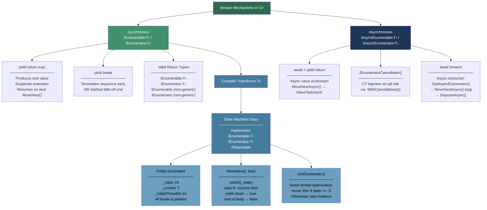
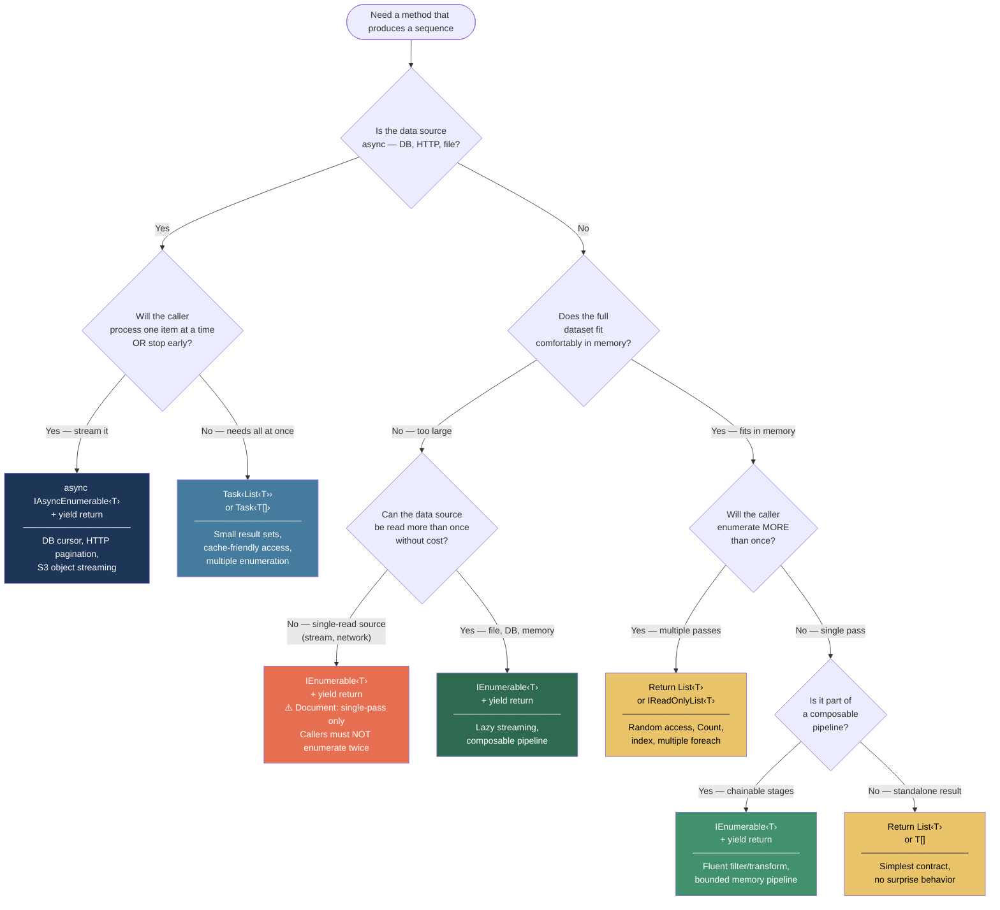

> [!success] Mastery Check
> - [ ] **Studied Well**
> - [ ] **Can explain the concept without notes**
> - [ ] **Can answer interview questions confidently**
> - [ ] **Can implement it in a real project**

## 📍 PART 0 — Navigation & Context

### Where This Topic Lives

```
C# Execution Model
├── async/await — The State Machine (2.07)    ← sibling state-machine concept
├── LINQ — Execution Model (2.06)             ← built entirely on top of iterators
├── ► Iterators and yield return (2.17)       ← YOU ARE HERE
├── Delegates, Func, Action, Closures (2.08)  ← same "display class" capture pattern
└── IDisposable and Resource Management (2.16) ← iterator disposal and finally safety
```

### What You Need Before This

- `IEnumerable<T>` and `IEnumerator<T>` — the interfaces every iterator implements
- Basic call-stack mental model — why locals don't survive a normal `return`
- `using` and `IDisposable` — how iterator resources are cleaned up
- How `foreach` works at the compiler level — it calls `GetEnumerator()` + `MoveNext()` + `Dispose()`

### What This Unlocks After

- **LINQ deferred execution** — every LINQ operator (Where, Select, OrderBy) is an iterator under the hood
- **`IAsyncEnumerable<T>` and async streaming** — iterators + async/await combined into one state machine
- **Composable data pipeline design** — chaining lazy sequences without materializing intermediate results
- **Why "passing `IEnumerable<T>` around" can be dangerous** — double enumeration, replay impossibility

### Why This Matters in Production

Iterator methods are how C# implements **lazy, push-pull data streaming** — the right tool for log file processing, database cursor streaming, HTTP API pagination, and any pipeline where materializing the full dataset would blow the memory budget or re-run expensive operations.

---

## 🧠 PART 1 — The Core Mental Model

### The Fundamental Rule

> **Calling an iterator method does nothing. Pulling from it with `MoveNext()` runs it one step at a time. Each `yield return` suspends execution; each subsequent `MoveNext()` resumes from the suspension point. The method body is a compiler-generated state machine class, not a normal function call.**

### The Plain-Language Analogy

An iterator is like a paused film reel. Calling the iterator method is like loading the reel into a projector — the film is ready, but nothing plays yet. Each call to `MoveNext()` advances the reel exactly one frame (one `yield return`), shows you that frame (via `Current`), then pauses again waiting for the next press. The projector doesn't rewind between frames; it knows exactly where it stopped. When `yield break` runs, or the method body falls off the end, the projector sends a "no more frames" signal and the foreach loop exits.

This analogy maps faithfully to the runtime: the "projector's position" is the `_state` integer field in the compiler-generated class. The "frame" being shown is the `_current` field. The projector object — the state machine heap allocation — holds all local variables that must survive between frames as fields.

### The Taxonomy Diagram



---

## 🔬 PART 2 — Deep Mechanics

### 2.1 The Compiler Transformation — What Actually Runs

Take a concrete iterator and trace what the compiler produces.

```csharp
// Source: order status history iterator
public IEnumerable<OrderStatus> GetStatusHistory(int orderId)
{
    Console.WriteLine($"Loading order {orderId}");   // before first yield
    yield return OrderStatus.Received;
    Console.WriteLine("Processing");
    yield return OrderStatus.Processing;
    Console.WriteLine("Shipped");
    yield return OrderStatus.Shipped;
    Console.WriteLine("Sequence complete");           // after last yield
}
```

The compiler generates approximately this class (names are mangled in reality):

```csharp
// Compiler generates (approximately):
[CompilerGenerated]
private sealed class <GetStatusHistory>d__0
    : IEnumerable<OrderStatus>, IEnumerator<OrderStatus>, IDisposable
{
    // ── Core state machine fields ──────────────────────────────────────
    private int         _state;          // -2=fresh, -1=running/done, 0/1/2=suspended
    private OrderStatus _current;        // value exposed through .Current
    private int         _initialThreadId;// for GetEnumerator() same-thread optimization

    // ── Parameters become fields ───────────────────────────────────────
    public int orderId;
    // Local variables that cross yield points would also appear here.
    // Loop counters, intermediate results — anything that must survive suspension.

    // ── IEnumerator<T>.Current ─────────────────────────────────────────
    OrderStatus IEnumerator<OrderStatus>.Current => _current;
    object      IEnumerator.Current               => _current;

    // ── The heart: MoveNext() runs the method body ─────────────────────
    bool IEnumerator.MoveNext()
    {
        switch (_state)
        {
            case 0:   // First ever MoveNext() call
                _state = -1;
                Console.WriteLine($"Loading order {orderId}");   // runs NOW, not at call time
                _current = OrderStatus.Received;
                _state = 1;     // "Resume at case 1 on the next MoveNext()"
                return true;    // "I have a value for you"

            case 1:   // Resumed after first yield
                _state = -1;
                Console.WriteLine("Processing");
                _current = OrderStatus.Processing;
                _state = 2;
                return true;

            case 2:   // Resumed after second yield
                _state = -1;
                Console.WriteLine("Shipped");
                _current = OrderStatus.Shipped;
                _state = 3;
                return true;

            case 3:   // Resumed after third yield — method body falls off the end
                _state = -1;
                Console.WriteLine("Sequence complete");
                return false;   // "Sequence is finished"
        }
        return false;
    }

    // ── IEnumerable<T>.GetEnumerator() ────────────────────────────────
    IEnumerator<OrderStatus> IEnumerable<OrderStatus>.GetEnumerator()
    {
        // Same-thread optimization: if this object was just created (state == -2)
        // and we're on the same thread that created it, reuse this object as
        // the enumerator. Saves one heap allocation.
        if (_state == -2 && _initialThreadId == Environment.CurrentManagedThreadId)
        {
            _state = 0;
            return this;
        }
        // Second call, or different thread: allocate a fresh independent iterator.
        return new <GetStatusHistory>d__0(-2) { orderId = this.orderId };
    }

    void IDisposable.Dispose() { /* handles outstanding finally blocks — see 2.3 */ }
    void IEnumerator.Reset()   => throw new NotSupportedException();
}

// The original method body becomes a one-liner:
public IEnumerable<OrderStatus> GetStatusHistory(int orderId)
{
    return new <GetStatusHistory>d__0(-2) { orderId = orderId };
    // ↑ Allocates the state machine. NOT A SINGLE LINE of the body runs here.
}
```

> [!IMPORTANT] The Single Most Important Insight **Calling `GetStatusHistory(42)` executes exactly one statement:** `new <GetStatusHistory>d__0`. Every `Console.WriteLine`, every `yield return`, every line of logic — all of it runs inside `MoveNext()`, not at call time. This is the root cause of Gotcha 1 (deferred argument validation).

### 2.2 State Transitions — The Full Lifecycle

```
STATE MACHINE LIFECYCLE
━━━━━━━━━━━━━━━━━━━━━━━━━━━━━━━━━━━━━━━━━━━━━━━━━━━━━━━━

  Method called
        │
        ▼  One allocation: state machine object on heap
  ┌──────────┐
  │  -2      │  "Fresh" — GetEnumerator() not yet called
  └────┬─────┘
       │ GetEnumerator() [same-thread: sets _state = 0, returns this]
       ▼
  ┌──────────┐
  │   0      │  "Ready — MoveNext() not yet called"
  └────┬─────┘
       │ First MoveNext() call
       ▼ code runs up to first yield return
  ┌──────────┐
  │   1      │  _current = first value; MoveNext() returns true
  └────┬─────┘
       │ Second MoveNext() call
       ▼ code runs from after yield 1 to yield 2
  ┌──────────┐
  │   2      │  _current = second value; MoveNext() returns true
  └────┬─────┘
       │  ... repeats per yield ...
       │ MoveNext() after last yield
       ▼ post-yield code runs; MoveNext() returns false
  ┌──────────┐
  │  -1      │  "Done" — MoveNext() will never return true again
  └────┬─────┘
       │
       ▼ foreach exits → Dispose() called automatically

EARLY EXIT (break, exception, return from inside foreach):
  foreach generates a try/finally that calls enumerator.Dispose()
  Dispose() jumps to the active finally state and runs cleanup
  Any 'using' statement inside the iterator is correctly closed.
```

### 2.3 `finally` Blocks and Disposal Safety

Every iterator implements `IDisposable`. `foreach` always calls `Dispose()` — on completion **and** on early exit. This is the safety net for resource-holding iterators.

```
HOW finally INTERACTS WITH yield
━━━━━━━━━━━━━━━━━━━━━━━━━━━━━━━━━━━━━━━━━━━━━━━━━━━━━━

Source:
  try {
    var reader = Open();      ← enters try; resource acquired
    yield return reader.A;    ← state 1: suspended here
    yield return reader.B;    ← state 2: suspended here
  } finally {
    reader.Close();            ← MUST run on any exit
  }

Generated Dispose() logic:
  switch (_state)
  {
    case 1:   // exited while at state 1 (yield A)
    case 2:   // exited while at state 2 (yield B)
      try { /* nothing extra */ }
      finally { reader.Close(); }  // ← the finally from the original iterator
      break;
  }

Result: reader.Close() runs regardless of HOW the foreach exits:
  ✅ Consumer reads all values and the foreach loop completes
  ✅ Consumer calls break after one value
  ✅ Consumer throws an exception inside the foreach
  ✅ Consumer calls return inside the foreach body
  ❌ Consumer calls GetEnumerator() manually and forgets to dispose
```

```csharp
// Safe pattern: streaming a large log file
public IEnumerable<AuditLogEntry> StreamAuditLog(string filePath)
{
    // 'using' generates a try/finally internally.
    // The iterator's state machine handles running that finally on any exit.
    using var reader = new StreamReader(filePath);
    string? raw;
    while ((raw = reader.ReadLine()) != null)
    {
        if (AuditLogEntry.TryParse(raw, out var entry))
            yield return entry;
        // StreamReader stays open across each suspension —
        // but is always closed when the iterator is disposed.
    }
}

// ✅ foreach: Dispose() always called — file closed
foreach (var entry in StreamAuditLog("audit.log"))
    if (entry.Severity == Severity.Critical) break; // still closes the file

// ⚠️ DANGER: manual enumeration without dispose
var e = StreamAuditLog("audit.log").GetEnumerator();
e.MoveNext();  // file is now open
// ... exception or forgotten call ...
// File handle leaks until GC finalizer runs.

// ✅ CORRECT manual enumeration: explicit using
using var safe = StreamAuditLog("audit.log").GetEnumerator();
while (safe.MoveNext()) Process(safe.Current);
// Dispose() called on any exit — file always closed
```

Cost: Each `yield return` inside a `try` block adds extra states in `Dispose()`. Runtime overhead is negligible except when Dispose is called on iterators inside tight loops.

### 2.4 Multiple Enumeration — Two Independent Iterators

```csharp
IEnumerable<int> seq = GetNumbers(5);
// seq holds ONE state machine object, _state = -2

// First foreach:
foreach (var n in seq)   // GetEnumerator(): state -2 + same thread → sets state=0, returns THIS
    Console.Write(n);    // 0 1 2 3 4

// Second foreach:
foreach (var n in seq)   // GetEnumerator(): state is now -1 (done), NOT -2
                         // → allocates a NEW state machine object from scratch
    Console.Write(n);    // 0 1 2 3 4  — completely independent traversal
```

> [!WARNING] Not All IEnumerable Sources Are Replayable Two independent state machine objects only works if the **data source** can be re-read.
> 
> - A file-based iterator opens the file fresh on each enumeration. ✅ (but reads twice)
> - A database query executes SQL on each enumeration. ✅ (but queries twice)
> - A network stream or `HttpResponseMessage.Content` can only be consumed once. ❌
> 
> See Gotcha 2 for the production consequence. The rule: if you enumerate `IEnumerable<T>` more than once, confirm the source is replayable — or materialize with `.ToList()` first.

### 2.5 `IAsyncEnumerable<T>` — Two State Machines Combined

An `async IAsyncEnumerable<T>` method compiles into a **struct** (not a class — for stack-allocation efficiency in the common case) that merges both the async state machine and the iterator state machine.

```csharp
// Source: streaming payment events from a repository
public async IAsyncEnumerable<PaymentEvent> StreamPaymentEvents(
    [EnumeratorCancellation] CancellationToken ct = default)
{
    await foreach (var batch in _repo.GetBatchesAsync(ct))   // await: async suspension
    {
        foreach (var ev in batch)
        {
            await _enricher.EnrichAsync(ev, ct);  // await: async suspension
            yield return ev;                       // yield: iterator suspension
        }
    }
}
```

The generated type (simplified):

```csharp
// Compiler generates a struct (not class) to avoid allocation on the sync-completion path:
[AsyncStateMachine(typeof(<StreamPaymentEvents>d__0))]
private struct <StreamPaymentEvents>d__0
    : IAsyncEnumerable<PaymentEvent>, IAsyncEnumerator<PaymentEvent>, IAsyncStateMachine
{
    // Async machinery:
    private AsyncIteratorMethodBuilder            _builder;
    private ManualResetValueTaskSourceCore<bool>  _promiseOfValueOrEnd;

    // Iterator machinery:
    private int          _state;
    private PaymentEvent _current;

    // Parameters:
    public CancellationToken cancellationToken;  // from [EnumeratorCancellation]

    // Returns ValueTask<bool> — NOT Task<bool>.
    // On the sync-completion fast path (data already buffered), this completes
    // immediately with zero allocation. Only actual async suspension allocates.
    public ValueTask<bool> MoveNextAsync();

    public PaymentEvent Current => _current;

    public ValueTask DisposeAsync();
}
```

Consumer: `await foreach` compiles to this:

```csharp
// await foreach (var ev in StreamPaymentEvents(ct)) ...
// expands to:

var asyncEnum = StreamPaymentEvents(ct).GetAsyncEnumerator(ct);
try
{
    while (await asyncEnum.MoveNextAsync())
        await HandleEventAsync(asyncEnum.Current, ct);
}
finally
{
    await asyncEnum.DisposeAsync();
}
```

> [!TIP] `ValueTask<bool>` is Not Cosmetic When the async enumerator has the next item already buffered (e.g., iterating a local list inside an async method), `MoveNextAsync()` returns a `ValueTask<bool>` that is already completed — zero allocation, zero context switch. Only real I/O or a genuine `await` incurs a `Task` allocation. This matters in tight async loops over mixed sync/async sources.

---

## 💻 PART 3 — Production Code Patterns

### 3.1 The Argument Guard Wrapper (Eager Validation, Lazy Execution)

Because iterator bodies are deferred, exceptions before the first `yield return` don't throw until `MoveNext()`. In a payment processing pipeline, a null argument must fail at call time — not when the consumer starts iterating five lines later.

```csharp
// ⚠️ WRONG: Validation is silently deferred
public IEnumerable<Transaction> GetTransactions(string accountId)
{
    // This throw is INSIDE the state machine body — deferred to first MoveNext()
    ArgumentNullException.ThrowIfNull(accountId, nameof(accountId));

    foreach (var batch in _store.GetBatches(accountId))
        foreach (var tx in batch)
            yield return tx;
}

// Caller discovers the bug far from the call site:
var txns = GetTransactions(null);  // NO exception — assignment succeeds
DoOtherWork();                     // runs fine
foreach (var t in txns)            // THROWS HERE — confusing stack trace
    ProcessPayment(t);

// ✅ CORRECT: Non-iterator public wrapper validates eagerly
public IEnumerable<Transaction> GetTransactions(string accountId)
{
    // This IS a normal method (no yield) — runs immediately at call time
    ArgumentNullException.ThrowIfNull(accountId, nameof(accountId));
    return GetTransactionsCore(accountId);
}

// Private iterator handles the deferred logic
private IEnumerable<Transaction> GetTransactionsCore(string accountId)
{
    foreach (var batch in _store.GetBatches(accountId))
        foreach (var tx in batch)
            yield return tx;
}
// WHY: The public method has no yield statement, so it is NOT an iterator.
// Its body runs eagerly. Only GetTransactionsCore() is deferred.
```

### 3.2 The Streaming File Processor

The canonical use case: process a multi-gigabyte log file line by line without loading it into memory. Memory stays at O(line buffer size), not O(file size).

```csharp
// Scenario: security operations center processing multi-GB access logs

public static IEnumerable<SecurityEvent> StreamSecurityEvents(
    string logPath,
    SecurityLevel minimumLevel = SecurityLevel.Warning)
{
    // Argument guard wrapper pattern (from 3.1) applied here:
    ArgumentNullException.ThrowIfNull(logPath);
    return StreamSecurityEventsCore(logPath, minimumLevel);
}

private static IEnumerable<SecurityEvent> StreamSecurityEventsCore(
    string logPath, SecurityLevel minimumLevel)
{
    // using in an iterator: StreamReader.Dispose() runs on any exit (break, exception, end)
    using var reader = new StreamReader(logPath, bufferSize: 65_536);

    int lineNumber = 0;
    string? raw;
    while ((raw = reader.ReadLine()) != null)
    {
        lineNumber++;

        // Skip unparseable lines — don't abort the whole stream for one bad line
        if (!SecurityEvent.TryParse(raw, out var ev))
            continue;

        if (ev.Level < minimumLevel)
            continue;  // filtered; move to next line without yielding

        ev.LineNumber = lineNumber;  // enrich before yielding
        yield return ev;
        // StreamReader is SUSPENDED here: no CPU, no memory, file handle open but idle.
        // Resumes when the consumer calls MoveNext() again.
    }
}

// Consumer: stop at the first critical event — file NOT fully read
var critical = StreamSecurityEvents("audit.log", SecurityLevel.Critical)
    .FirstOrDefault();
// FirstOrDefault() calls MoveNext() until it finds a match or exhausts the sequence.
// When it finds the first match, it disposes the iterator — StreamReader is closed.
// Memory used: ~65 KB (reader buffer) + one SecurityEvent object.
```

### 3.3 The Lazy API Paginator

Consuming a paginated HTTP API without loading all pages upfront. Memory stays at O(page size) regardless of total result count.

```csharp
// Scenario: order management system consuming a paginated order history API

public async IAsyncEnumerable<Order> StreamAllOrders(
    string customerId,
    [EnumeratorCancellation] CancellationToken ct = default)
{
    string? cursor = null;
    int pagesFetched = 0;

    do
    {
        var response = await _client.GetOrdersAsync(
            customerId, cursor, pageSize: 100, ct);

        // Yield each order in the current page before fetching the next.
        // Memory at any moment: one page (100 orders), not all pages.
        foreach (var order in response.Items)
            yield return order;

        cursor = response.NextCursor;
        pagesFetched++;

        // Safety valve: never loop forever against a misbehaving API
        if (pagesFetched > 10_000)
            throw new InvalidOperationException(
                $"Exceeded max pagination limit for customer {customerId}");

    } while (cursor != null);
}

// Consumer: process one order at a time; DisposeAsync() on break cleans up
await foreach (var order in StreamAllOrders(customerId, ct)
                                .WithCancellation(ct)
                                .ConfigureAwait(false))  // no SynchronizationContext capture
{
    await _orderProcessor.ProcessAsync(order, ct);

    if (_shutdownRequested)
        break;  // DisposeAsync() is called — no resource leak
}
```

### 3.4 The Composable Filtering Pipeline

Chain lazy iterators to build a processing pipeline where each stage filters or transforms without materializing intermediate results. Each stage wraps the previous one's enumerator — allocation is O(stages), not O(elements).

```csharp
// Scenario: real-time fraud detection on a transaction stream

// Stage 1: filter by country (LINQ Where is itself an iterator)
public static IEnumerable<Transaction> FilterDomestic(
    this IEnumerable<Transaction> source) =>
    source.Where(t => t.CountryCode == "US");

// Stage 2: filter by amount — explicit yield for more complex logic
public static IEnumerable<Transaction> FilterHighValue(
    this IEnumerable<Transaction> source, decimal threshold)
{
    foreach (var tx in source)
        if (tx.Amount >= threshold)
            yield return tx;
        // Transactions below threshold are silently dropped from the stream.
}

// Stage 3: enrich and score — yields only flagged transactions
public static IEnumerable<FlaggedTransaction> EnrichWithRiskScore(
    this IEnumerable<Transaction> source, IRiskScorer scorer)
{
    foreach (var tx in source)
    {
        var score = scorer.Score(tx);
        if (score > 0.7m)
            yield return new FlaggedTransaction(tx, score);
        // Transactions below the risk threshold don't enter the output stream.
    }
}

// Usage: pipeline executes lazily — no intermediate List<T> allocations
var flaggedStream = _transactionFeed
    .FilterDomestic()
    .FilterHighValue(10_000m)
    .EnrichWithRiskScore(_scorer)
    .Take(50);   // stop after 50 flagged transactions found

foreach (var flagged in flaggedStream)
    await _alertService.RaiseAsync(flagged);

// Memory at any moment: ~3 enumerator objects (~240 bytes) + 1 Transaction + 1 FlaggedTransaction.
// NOT a list of all transactions. NOT a list of all flagged transactions.
```

> [!TIP] Each Stage Wraps the Previous One's Enumerator `FilterHighValue` holds a reference to the `FilterDomestic` enumerator. `EnrichWithRiskScore` holds a reference to the `FilterHighValue` enumerator. When the outermost `MoveNext()` is called, it cascades inward: enrich → high-value → domestic → source. Allocation: ~40-80 bytes per stage, regardless of dataset size.

### 3.5 The Iterative Tree Traversal (DFS Without Stack Overflow)

Recursive DFS uses O(depth) call stack frames. A 50,000-node category tree hits `StackOverflowException` at ~10,000 depth. An iterator with an explicit stack is the correct production solution.

```csharp
// Scenario: product catalog with deeply nested category hierarchies

public record CategoryNode(int Id, string Name, List<CategoryNode> Children);

// ⚠️ WRONG: Recursive DFS — StackOverflowException on deep trees
public static IEnumerable<CategoryNode> TraverseRecursive(CategoryNode root)
{
    yield return root;
    foreach (var child in root.Children)
        foreach (var node in TraverseRecursive(child))  // N call stack frames deep
            yield return node;
}

// ✅ CORRECT: Iterative DFS with explicit Stack<T>
// O(max_branching_factor × max_depth) memory, never blows the call stack
public static IEnumerable<CategoryNode> TraverseDfs(CategoryNode root)
{
    ArgumentNullException.ThrowIfNull(root);
    return TraverseDfsCore(root);
}

private static IEnumerable<CategoryNode> TraverseDfsCore(CategoryNode root)
{
    var stack = new Stack<CategoryNode>();
    stack.Push(root);

    while (stack.Count > 0)
    {
        var node = stack.Pop();
        yield return node;  // yield BEFORE pushing children

        // Push in REVERSE order so leftmost child is processed first (LIFO)
        for (int i = node.Children.Count - 1; i >= 0; i--)
            stack.Push(node.Children[i]);
    }
}

// BFS variant — same pattern, different data structure
private static IEnumerable<CategoryNode> TraverseBfsCore(CategoryNode root)
{
    var queue = new Queue<CategoryNode>();
    queue.Enqueue(root);

    while (queue.Count > 0)
    {
        var node = queue.Dequeue();
        yield return node;
        foreach (var child in node.Children)
            queue.Enqueue(child);
    }
}
```

### 3.6 The Async Database Stream

`IAsyncEnumerable<T>` + EF Core's `AsAsyncEnumerable()` streams large query results without loading the full result set into memory — the correct pattern for batch exports.

```csharp
// Scenario: batch export service exporting 500K order records to CSV

// ⚠️ WRONG: Loads all 500K records into memory
public async Task<List<Order>> GetAllOrdersForExportWrong(DateTime from)
    => await _db.Orders
        .Where(o => o.CreatedAt >= from)
        .ToListAsync();  // OutOfMemoryException at scale

// ✅ CORRECT: DB cursor streams row-by-row
public async IAsyncEnumerable<OrderExportRow> StreamOrdersForExport(
    DateTime from,
    [EnumeratorCancellation] CancellationToken ct = default)
{
    // AsAsyncEnumerable(): uses the underlying data reader — one row at a time
    await foreach (var order in _db.Orders
        .Where(o => o.CreatedAt >= from)
        .OrderBy(o => o.Id)          // stable sort for consistent export
        .AsAsyncEnumerable()
        .WithCancellation(ct))
    {
        // Transform to the export DTO before yielding
        yield return new OrderExportRow(
            order.Id, order.CustomerId, order.Total, order.Status);
        // The raw Order object can be GC'd after this yield — only the DTO lives on
    }
}

// Consumer: write to CSV incrementally; memory = one row at a time
await using var writer = new StreamWriter("export.csv");
await writer.WriteLineAsync(OrderExportRow.CsvHeader);

await foreach (var row in _service.StreamOrdersForExport(from, ct))
    await writer.WriteLineAsync(row.ToCsvLine());

// Peak memory: ~2 KB (one order row + one CSV line buffer). Not 500K × row size.
```

### 3.7 The Batching Buffer

Group a stream of items into fixed-size batches before processing — common for bulk database inserts and APIs that accept up to N items per request.

```csharp
// Scenario: inventory system sending product updates in bulk (max 500 per API call)

public static IEnumerable<T[]> Batch<T>(this IEnumerable<T> source, int batchSize)
{
    ArgumentOutOfRangeException.ThrowIfNegativeOrZero(batchSize);
    return BatchCore(source, batchSize);
}

private static IEnumerable<T[]> BatchCore<T>(IEnumerable<T> source, int batchSize)
{
    // Rent from ArrayPool to avoid one allocation per batch
    var buffer = ArrayPool<T>.Shared.Rent(batchSize);
    int count = 0;

    try
    {
        foreach (var item in source)
        {
            buffer[count++] = item;

            if (count == batchSize)
            {
                // Copy to correctly-sized array before yielding:
                // the rented buffer must be returned, so we can't hand it out.
                yield return buffer[..batchSize].ToArray();
                count = 0;
                // Note: count reset BEFORE next iteration — buffer is reused
            }
        }

        if (count > 0)
            yield return buffer[..count].ToArray();  // final partial batch
    }
    finally
    {
        // Returns the rented buffer whether the consumer reads all batches or breaks early.
        // This finally block runs because 'using' compiles to try/finally.
        // Clearing is false: caller should not rely on cleared data;
        // buffer contains item references but will be re-rented and overwritten.
        ArrayPool<T>.Shared.Return(buffer, clearArray: false);
    }
}

// Usage:
await foreach (var batch in _productService.StreamAllProducts(ct).Batch(500))
    await _bulkApi.UpdateProductsAsync(batch, ct);
```

---

## ⚠️ PART 4 — Gotchas & Anti-Patterns

### Gotcha 1: The Deferred Exception Trap

Engineers expect exception throwing before the first yield to happen at call time. Every exception inside an iterator body — including argument validation at the top of the method — is deferred until the first `MoveNext()`.

```csharp
// ⚠️ WRONG: Validation appears to run at call time but doesn't
public IEnumerable<OrderLine> GetOrderLines(Order order)
{
    // This throw is INSIDE MoveNext() — not at GetOrderLines() call time
    ArgumentNullException.ThrowIfNull(order, nameof(order));

    foreach (var line in order.Lines)
        yield return line;
}

// In a service method:
var lines = GetOrderLines(null);  // ← No exception. Assignment succeeds.
_logger.LogInformation("Processing order lines");  // ← Runs fine
foreach (var l in lines)          // ← THROWS HERE with a confusing stack trace
    ApplyDiscount(l);
// The 5+ lines between the call and the foreach make the bug hard to trace.

// ✅ CORRECT: Two-method pattern for eager validation
public IEnumerable<OrderLine> GetOrderLines(Order order)
{
    ArgumentNullException.ThrowIfNull(order, nameof(order));
    return GetOrderLinesCore(order);  // delegates to the iterator
}

private IEnumerable<OrderLine> GetOrderLinesCore(Order order)
{
    foreach (var line in order.Lines)
        yield return line;
}

// WHY: The public method has no yield statement — it is NOT an iterator.
// Its body executes eagerly and immediately. The ArgumentNullException
// is thrown at the call site with the correct stack frame.
```

### Gotcha 2: The Double Enumeration Trap

`IEnumerable<T>` promises it can give you an enumerator — it does NOT promise the data is replayable. Engineers habitually aggregate and then iterate the same `IEnumerable<T>`, getting two full reads silently.

```csharp
// ⚠️ WRONG: Reports service reads the file twice
public ReportSummary BuildSummary(string dataPath)
{
    IEnumerable<ReportRow> rows = StreamReportRows(dataPath);

    int count    = rows.Count();          // First full pass — reads entire file
    decimal total = rows.Sum(r => r.Amount); // Second full pass — reads entire file again
    // A 2 GB file = 4 GB of I/O. A DB query = 2 SQL executions.
    // A network stream will THROW on the second pass.

    return new ReportSummary(count, total);
}

// ✅ CORRECT option 1: Materialize once, query in memory
public ReportSummary BuildSummary(string dataPath)
{
    var rows = StreamReportRows(dataPath).ToList();  // one read, in-memory
    return new ReportSummary(rows.Count, rows.Sum(r => r.Amount));
}

// ✅ CORRECT option 2: Single-pass aggregation (when memory is constrained)
public ReportSummary BuildSummary(string dataPath)
{
    int count = 0;
    decimal total = 0m;
    foreach (var row in StreamReportRows(dataPath))
    {
        count++;
        total += row.Amount;
    }
    return new ReportSummary(count, total);
}

// WHY: Each call to GetEnumerator() creates a new state machine that starts
// from scratch. No caching, no awareness of prior reads. The IEnumerable<T>
// contract does not include "remember what you've already produced."
```

### Gotcha 3: Manual Enumeration Without Dispose Causes Resource Leaks

`foreach` always calls `Dispose()`. Manual enumeration does not, unless you add it explicitly. Any iterator that holds an open file, database reader, or network connection will leak that resource.

```csharp
// ⚠️ WRONG: Resource leak on early return
public AuditEvent? FindFirstCritical(IEnumerable<AuditEvent> events)
{
    var enumerator = events.GetEnumerator();  // may open a file/DB connection
    while (enumerator.MoveNext())
    {
        if (enumerator.Current.IsCritical)
        {
            return enumerator.Current;  // ← exits without calling Dispose()
                                        // file handle / DB reader leaks
        }
    }
    // enumerator.Dispose() IS called if the loop runs to completion (MoveNext()
    // returns false internally). But any early exit skips it entirely.
    return null;
}

// ✅ CORRECT: using guarantees Dispose() on any exit path
public AuditEvent? FindFirstCritical(IEnumerable<AuditEvent> events)
{
    using var enumerator = events.GetEnumerator();
    while (enumerator.MoveNext())
    {
        if (enumerator.Current.IsCritical)
            return enumerator.Current;  // Dispose() called via using
    }
    return null;
}

// WHY: The iterator's Dispose() method runs outstanding finally blocks —
// including those generated by 'using' statements inside the iterator.
// Without it, StreamReaders and DbDataReaders stay open until the GC finalizer
// eventually runs. In a high-throughput service, this exhausts file descriptors
// or database connection pool within minutes of deployment.
```

### Gotcha 4: Captured Resources Have Iterator Lifetime, Not Logical Lifetime

Locals in an iterator become fields in the generated class. The class lives until it's GC'd or disposed. A captured `DbContext`, connection, or large byte buffer lives for the entire iteration — not until the code "passes" the line where you'd expect it to go out of scope.

```csharp
// ⚠️ WRONG: DbContext captured and kept alive for the full iteration lifetime
public IEnumerable<CustomerSummary> StreamSummariesWrong(int[] customerIds)
{
    var context = new AppDbContext();  // becomes a field in the state machine

    foreach (var id in customerIds)
    {
        var customer = context.Customers.Find(id);
        yield return customer is null
            ? CustomerSummary.Empty(id)
            : CustomerSummary.From(customer);
    }

    // This only runs if ALL items are enumerated. Break/exception skips it.
    context.Dispose();  // too late, may never run
}

// ✅ CORRECT: use 'using' — Dispose() runs on any exit path
private IEnumerable<CustomerSummary> StreamSummariesCore(int[] customerIds)
{
    // 'using' compiles to try/finally. The iterator handles that finally block
    // in its Dispose() method — running on break, exception, or natural end.
    using var context = new AppDbContext();

    foreach (var id in customerIds)
    {
        var customer = context.Customers.Find(id);
        yield return customer is null
            ? CustomerSummary.Empty(id)
            : CustomerSummary.From(customer);
    }
}

// WHY: Without 'using', the DbContext is held open for the full lifetime of the
// enumerator object — which is as long as the consumer holds a reference to it.
// In a scoped service in ASP.NET Core, this can mean the DbContext outlives
// its intended scope and gets used from a background thread after the request ends.
```

### Gotcha 5: `yield return` Is Forbidden Inside `catch` Blocks

This is a compiler restriction that surfaces when writing resilient pipelines. `yield return` is legal inside a `try` block. It is **not** legal inside `catch` or `finally` blocks.

```csharp
// ⚠️ WRONG: Compile error CS1626 — "Cannot yield a value in the body of a catch clause"
public IEnumerable<PaymentResult> ProcessPaymentsWrong(
    IEnumerable<PaymentRequest> requests)
{
    foreach (var req in requests)
    {
        try
        {
            yield return _gateway.Process(req);
        }
        catch (PaymentGatewayException ex)
        {
            yield return PaymentResult.Failed(req.Id, ex.Code);  // ← COMPILE ERROR
        }
    }
}

// ✅ CORRECT: Extract the try/catch; yield outside the catch block
public IEnumerable<PaymentResult> ProcessPayments(
    IEnumerable<PaymentRequest> requests)
{
    foreach (var req in requests)
    {
        PaymentResult result;
        try
        {
            result = _gateway.Process(req);
        }
        catch (PaymentGatewayException ex)
        {
            result = PaymentResult.Failed(req.Id, ex.Code);
        }
        yield return result;  // ← OUTSIDE the catch block — valid
    }
}

// WHY: The CLR does not support yielding from a catch handler because
// yielding suspends the stack frame at an arbitrary point. A suspended catch
// handler would require the CLR to keep the exception object alive and preserve
// the exception-handling context indefinitely — the exception model does not
// support this. You CAN yield inside a try block. You CANNOT yield inside
// catch or finally blocks.
```

---

## 📊 PART 5 — Performance Implications

### 5.1 Allocation Characteristics Table

|Scenario|Allocation Behavior|Approx Cost|
|---|---|---|
|Calling an iterator method|One state machine object on the heap|~40-80 B, one alloc|
|`foreach` over the result (same thread, first call)|`GetEnumerator()` reuses `this`|**0 bytes additional**|
|`GetEnumerator()` called a second time|New state machine heap object|~40-80 B|
|Chaining 3 iterator stages (3 extension methods)|One object per stage|~120-240 B total|
|`yield return` inside `try/finally`|No extra heap alloc; extra switch cases in `Dispose()`|~0 B overhead|
|Materializing with `.ToList()`|Array allocation + all elements (ref types)|O(n) alloc|
|`IAsyncEnumerable<T>` method call|One struct state machine (may be stack-allocated)|~80-200 B|
|`MoveNextAsync()` on sync-completion path|`ValueTask<bool>` completes inline|**0 bytes**|
|`MoveNextAsync()` on actual async suspension|`Task<bool>` allocated for the suspension|~56 B|
|`ArrayPool<T>.Rent()` in batching iterator|Returns pooled array — no new GC object|~0 new GC bytes|
|`foreach` over `List<int>` inside an iterator|`List<int>.Enumerator` is a **struct** — stack-only|**0 bytes**|

### 5.2 BenchmarkDotNet: Streaming vs. Materialized

```csharp
[MemoryDiagnoser]
[BenchmarkCategory("Iterators")]
public class IteratorAllocationBenchmark
{
    private const int N = 10_000;
    private List<int> _source = null!;

    [GlobalSetup]
    public void Setup() => _source = Enumerable.Range(0, N).ToList();

    // Baseline: materialize to List<T> then sum — full allocation upfront
    [Benchmark(Baseline = true)]
    public int MaterializeAndSum()
    {
        var filtered = new List<int>(_source.Count / 2);
        foreach (var x in _source)
            if (x % 2 == 0) filtered.Add(x);   // new List + N/2 int elements
        int sum = 0;
        foreach (var x in filtered) sum += x;
        return sum;
    }

    // Streaming iterator: one state machine object, no intermediate list
    [Benchmark]
    public int StreamAndSum()
    {
        int sum = 0;
        foreach (var x in FilterEven(_source)) sum += x;
        return sum;
    }

    // LINQ Where + Sum: ~comparable to streaming; two chained iterator objects
    [Benchmark]
    public int LinqSum() => _source.Where(x => x % 2 == 0).Sum();

    // Span + direct loop: zero allocation, fastest possible
    [Benchmark]
    public int SpanSum()
    {
        var span = CollectionsMarshal.AsSpan(_source);
        int sum = 0;
        foreach (var x in span)
            if (x % 2 == 0) sum += x;
        return sum;
    }

    private static IEnumerable<int> FilterEven(List<int> source)
    {
        foreach (var x in source)
            if (x % 2 == 0) yield return x;
    }
}

// Expected output (approximate, .NET 8, x64):
// | Method             | Mean      | Ratio | Allocated |
// |--------------------|-----------|-------|-----------|
// | MaterializeAndSum  | 28.1 μs   |  1.00 | 43,096 B  |  ← List + elements
// | StreamAndSum       |  9.4 μs   |  0.33 |     72 B  |  ← one state machine
// | LinqSum            | 10.8 μs   |  0.38 |    104 B  |  ← Where + Sum iterators
// | SpanSum            |  5.6 μs   |  0.20 |      0 B  |  ← zero allocation
```

### 5.3 When to Care / When to Ignore

**When iterators cost you:**

- **Tight loops creating millions of short-lived iterators/second**: in a high-frequency trading system or telemetry hot path, 40-80 bytes per iterator × millions/sec is real Gen0 GC pressure. Replace with direct `List<T>` or `Span<T>` loops.
- **One-element pipelines through many chained stages**: requesting `FirstOrDefault()` from a 5-stage lazy pipeline materializes 5 state machine objects to pull one value. A direct method call would allocate zero.
- **Caller always calls `.ToList()` anyway**: the lazy benefit is wasted; you pay the state machine allocation AND the list allocation. Return `List<T>` or `T[]` directly.
- **`IAsyncEnumerable<T>` wrapping fully in-memory data**: if the data is already in a `List<T>`, `IAsyncEnumerable<T>` adds async overhead with no benefit. Return `IEnumerable<T>` instead.

**When iterators don't matter:**

- **I/O-bound streaming** (file reads, DB cursors, HTTP APIs): network/disk latency dwarfs iterator allocation by 4-5 orders of magnitude. Optimize the I/O, not the iterator.
- **Batch sizes above ~100 elements**: the per-iterator overhead (~80 bytes) amortizes across 100+ elements to under 1 byte per element.
- **Code paths below ~1% of request throughput**: this is premature optimization territory — a maintenance cost with zero measurable benefit.
- **Composable pipelines in business logic services**: the readability and correctness benefits outweigh the allocation cost in virtually all service-tier code.

---

## 🎤 PART 6 — Interview Arsenal

### A. The Question Bank

---

**Q1: "What does calling an iterator method actually do?"**

**Average answer:** "It starts executing the code and returns an IEnumerable."

**Why that's insufficient:** Implies code runs on call. Misses the entire deferred execution model that distinguishes iterators from normal methods.

**Great answer:**

> "Calling an iterator method does almost nothing — it allocates a compiler-generated state machine object on the heap, stores the parameters as fields in that object, and returns it. Not one line of the method body runs at that point. The body runs when you pull values by calling `MoveNext()`. This matters in production because it means argument validation in the method body doesn't throw at call time — it throws when the consumer first iterates, which can be five to twenty lines later with a misleading stack trace. The standard fix is a two-method pattern: a non-iterator public method validates eagerly, then returns the result of a private iterator method that handles the deferred logic."

---

**Q2: "Explain how `yield return` works under the hood."**

**Average answer:** "The compiler transforms the method into a state machine with a MoveNext method."

**Why that's insufficient:** Doesn't say what the state machine contains, how the `_state` integer drives resumption, or what happens to local variables across yield points.

**Great answer:**

> "The compiler generates a class that implements both `IEnumerable<T>` and `IEnumerator<T>`. The method body is rewritten into a `switch` statement on an integer `_state` field, with each `yield return` becoming a numbered case. When `MoveNext()` is called, it switches to the right case, runs code up to the next yield, stores that value in a `_current` field, sets the state to the next case number, and returns `true`. Local variables that must survive across yield points — loop counters, intermediate results, captured parameters — all become fields in this class. That's why they end up heap-allocated instead of on the stack. The method itself becomes a one-liner that simply instantiates this state machine object. That one-liner is all that runs when you call the method."

---

**Q3: "What's the difference between IEnumerable<T> and IEnumerator<T>?"**

**Average answer:** "IEnumerable is a sequence; IEnumerator steps through it."

**Why that's insufficient:** Doesn't address the factory vs. cursor lifetime distinction, or why the compiler implements both on the same generated class.

**Great answer:**

> "IEnumerable<T> is the factory — it can create new independent enumerators via `GetEnumerator()`. IEnumerator<T> is one stateful cursor into the data, with a `Current` value and a `MoveNext()` method. The separation matters because you can get two independent enumerators from one `IEnumerable<T>` and step through them concurrently without interference. That's also why the compiler-generated iterator class implements both interfaces simultaneously — when `GetEnumerator()` is first called from the same thread that created the state machine, it reuses the object itself as the enumerator, saving one heap allocation. If `GetEnumerator()` is called a second time, a fresh independent instance is created. The practical consequence is that two `foreach` loops over the same `IEnumerable<T>` variable produce completely independent traversals."

---

**Q4: "What happens to a `finally` block inside an iterator when a consumer breaks out of the foreach?"**

**Average answer:** "The finally block still runs because C# guarantees that."

**Why that's insufficient:** Doesn't name the mechanism — that `foreach` generates a `try/finally` calling `Dispose()`, and that `Dispose()` on the iterator is what triggers the finally block inside the iterator itself.

**Great answer:**

> "The `foreach` statement is compiled into a `try/finally` that calls `Dispose()` on the enumerator on any exit — normal completion, `break`, `return`, or an unhandled exception in the loop body. The iterator's `Dispose()` method is generated by the compiler and contains state-specific cleanup: if the iterator is currently suspended at yield point N, `Dispose()` switches on the current state and runs the corresponding finally block. This is exactly how `using` inside an iterator method is safe — the `StreamReader` or `DbConnection` gets closed even if the consumer only reads two items before breaking. The one failure mode is using `GetEnumerator()` manually without wrapping it in a `using` block, and then returning early. That's how file handle leaks happen in production when developers reach for manual enumeration."

---

**Q5: "When do you choose yield return over returning a List<T>?"**

**Average answer:** "When you want lazy evaluation or the dataset is large."

**Why that's insufficient:** Doesn't name concrete production scenarios or call out the cases where yielding is the wrong choice.

**Great answer:**

> "I reach for `yield return` in three specific situations. First, when the dataset is too large to hold in memory — streaming a multi-gigabyte log file or paginating a REST API keeps memory at O(page size) instead of O(total records). Second, when the consumer is likely to stop early — `FirstOrDefault()` or `Take(N)` on a lazy sequence avoids doing any work beyond what's needed; the same code against a `List<T>` would have built the full list first. Third, when I'm building a composable pipeline of filter and transform stages — chaining iterators gives clean separation with bounded memory. I'd choose `List<T>` instead when the caller will enumerate multiple times, when I need random access or `Count`, when the data source is already in memory, or when the iterator is always followed by a `.ToList()` call anyway — in that last case the lazy benefit is wasted and I'm just adding indirection."

---

### B. Trick Questions

> [!WARNING] These sound simple — the traps are easy to miss under interview pressure.

**"Does the code before the first `yield return` run when you call the method?"** Trap: Engineers confidently say yes. Correct answer: No. That code is inside `MoveNext()` and runs on the first `MoveNext()` call — which is the first iteration of the foreach. Argument validation, side effects, logging: all deferred. This is the core iterator mental model test.

**"Can you `yield return` inside a `catch` block?"** Trap: People assume yes because `yield return` inside a `try` block is valid. Correct answer: No — compile error CS1626. `yield return` is legal inside `try`. It is explicitly forbidden inside `catch` and `finally`. The workaround is capturing the result to a variable before the catch boundary, then yielding outside.

**"If you call `.Count()` on an `IEnumerable<string>` backed by a file iterator, does it read the file?"** Trap: Developers assume `Count()` is smart enough to use a cached count or a Length property. Correct answer: Yes — it fully reads the file by calling `MoveNext()` until it returns `false`, incrementing a counter each time. This is the double-enumeration trap: calling `.Count()` followed by a second iteration reads the file twice.

**"Two developers call `foreach` over the same `IEnumerable<T>` variable. Do they get independent sequences?"** Trap: People confuse sharing a variable with sharing state. Correct answer: Yes — independent, but the mechanism depends on whether the first foreach has completed. If the first is done (state = -1), `GetEnumerator()` allocates a fresh state machine. If the first is somehow still in progress (unusual), `GetEnumerator()` also allocates a fresh one. Either way: independent. The same-thread reuse optimization only applies to the very first `GetEnumerator()` call on a fresh (-2 state) object.

---

### C. Red Flags to Avoid

```
❌ "Iterators execute when you call the method"
   → Fundamentally wrong. Every senior interviewer will probe this. Nothing in the
     method body runs at call time.

❌ "yield return is like return, but you can call it multiple times"
   → Superficially true but misses state machines, deferred execution, and lifetimes.
     Signals surface-level understanding only.

❌ "IEnumerable<T> is always safe to enumerate multiple times"
   → False for file-based, DB-based, or network-based iterators. This is a real production
     data corruption bug disguised as a language question.

❌ "yield return allocates one object per yielded item"
   → Wrong. One state machine object per iterator, not per element. Confusing this
     leads to incorrect performance assessments.

❌ "You should always use iterators instead of returning List<T>"
   → False. Multiple-enumeration needs, Count/index access, and "caller always materializes"
     patterns all favor List<T>. Dogmatic iterator use creates subtle bugs.

❌ Confusing IAsyncEnumerable<T> with IObservable<T>
   → Pull vs. push is the critical difference. IAsyncEnumerable is pull (consumer controls
     pace via MoveNextAsync). IObservable is push (producer controls pace via OnNext).
     Conflating them signals unfamiliarity with Rx vs. async streams.

❌ "finally blocks don't run if you break out of foreach"
   → Wrong. foreach always calls Dispose(). Dispose() runs outstanding finally blocks.
     This only fails with manual GetEnumerator() without a using statement.

❌ "You can yield return inside a catch block"
   → Compile error CS1626. Saying this in an interview signals you've never written a
     resilient streaming pipeline with error handling.
```

---

## 🔀 PART 7 — Decision Framework



---

## ✅ PART 8 — Self-Check

### A. Conceptual Questions

1. You call `var items = GetExpensiveItems()` where the method opens a database connection before its first `yield return`. When does the database connection actually open?
    
2. A colleague's code calls `.Count()` then iterates the same `IEnumerable<string>` returned by a file-reading iterator. What happens, and what is the minimum-change fix?
    
3. Explain why a loop variable — `int i = 0` in a `for` loop inside an iterator — ends up allocated on the heap instead of the stack.
    
4. An iterator opens a `StreamReader` with a `using` statement and yields lines. A consumer calls `break` after three lines. Does `StreamReader.Dispose()` get called? Explain the exact mechanism through which it runs.
    
5. What is state `-2` in the generated state machine? Why must it be different from state `0`?
    
6. Why does the same-thread `GetEnumerator()` reuse optimization exist? What would break if every `GetEnumerator()` call always allocated a fresh state machine?
    
7. You want to write an iterator method that throws `ArgumentException` immediately at call time, not on first iteration. What are the exact steps, and why does the pattern work?
    
8. Why can `ref struct` types like `Span<T>` not appear as locals that cross a `yield return` point?
    
9. An `IAsyncEnumerable<T>` method returns `ValueTask<bool>` from `MoveNextAsync()` rather than `Task<bool>`. When does this save an allocation, and when does it not?
    
10. You have a 4-stage lazy pipeline (filter → transform → enrich → batch). The consumer calls `.FirstOrDefault()`. How many times does the enrichment stage's code run?
    

### B. Code Puzzles

---

**Puzzle 1:** What is printed, and in what order?

```csharp
IEnumerable<int> GetValues()
{
    Console.WriteLine("A");
    yield return 1;
    Console.WriteLine("B");
    yield return 2;
    Console.WriteLine("C");
}

Console.WriteLine("Before call");
var seq = GetValues();
Console.WriteLine("After assignment");
foreach (var x in seq)
{
    Console.WriteLine($"Got {x}");
    if (x == 1) break;
}
Console.WriteLine("After foreach");
```

<details> <summary>Answer (expand after trying)</summary>

Output:

```
Before call
After assignment
A
Got 1
After foreach
```

`var seq = GetValues()` allocates the state machine but runs zero code. The first `MoveNext()` runs up to `yield return 1`, printing "A" then yielding 1. The consumer prints "Got 1" then `break`s. `foreach` calls `Dispose()` on the enumerator — there are no active `try/finally` blocks in this iterator, so `Dispose()` is a no-op. "B" and "C" are never printed because `MoveNext()` is never called again after the break.

</details>

---

**Puzzle 2:** Does this compile? If not, why? If yes, what is the contract with callers?

```csharp
public IEnumerable<string> FetchUserIds(string[] groupIds)
{
    if (groupIds == null)
        throw new ArgumentNullException(nameof(groupIds));

    foreach (var id in groupIds)
    {
        var users = _repo.GetUsersInGroup(id);
        yield return string.Join(",", users.Select(u => u.Id));
    }
}

// Usage:
var seq = FetchUserIds(null);    // Line A
foreach (var s in seq) Use(s);  // Line B
```

<details> <summary>Answer (expand after trying)</summary>

**Compiles.** But the exception throws at **Line B**, not Line A.

`FetchUserIds(null)` (Line A) allocates the state machine. No exception — assignment succeeds. Line B triggers the first `MoveNext()`, which runs `if (groupIds == null) throw` — the `ArgumentNullException` surfaces here with a stack trace pointing at Line B, not at the call site.

This is Gotcha 1. The fix is the two-method wrapper pattern from Part 3.1.

</details>

---

**Puzzle 3:** How many allocations does this cause? Count them.

```csharp
var source = new List<int> { 1, 2, 3, 4, 5, 6, 7, 8, 9, 10 };

int sum = 0;
foreach (var n in FilterOdd(source))
    sum += n;

static IEnumerable<int> FilterOdd(List<int> src)
{
    foreach (var x in src)
        if (x % 2 != 0)
            yield return x;
}
```

<details> <summary>Answer (expand after trying)</summary>

**One allocation**: the state machine object created when `FilterOdd(source)` is called.

No additional allocations:

- `GetEnumerator()` on the result: same-thread reuse — `this` is returned, state set to 0. Zero new allocations.
- `List<int>.GetEnumerator()`: `List<T>.Enumerator` is a **struct** — it lives on the stack inside the state machine object, not as a separate heap object.
- Each `yield return` sets `_current` (a field in the already-allocated state machine) and returns `true`. Zero allocation per iteration.
- `int` is a value type — no boxing anywhere.

Total: **1 heap allocation** (~72 bytes), regardless of list size.

</details>

---

**Puzzle 4:** Find all the bugs. This code is from a production CSV upload handler.

```csharp
public async Task<ImportResult> ImportCustomersAsync(
    Stream csvStream, CancellationToken ct)
{
    var rows = ParseCsvRows(csvStream, ct);

    int total = await rows.CountAsync(ct);
    _logger.LogInformation("Importing {Total} customers", total);

    int imported = 0;
    await foreach (var row in rows.WithCancellation(ct))
    {
        await _repo.InsertAsync(row.ToCustomer(), ct);
        imported++;
    }

    return new ImportResult(total, imported);
}

private async IAsyncEnumerable<CsvRow> ParseCsvRows(
    Stream stream,
    [EnumeratorCancellation] CancellationToken ct = default)
{
    using var reader = new StreamReader(stream);
    string? line;
    while ((line = await reader.ReadLineAsync(ct)) != null)
        yield return CsvRow.Parse(line);
}
```

<details> <summary>Answer (expand after trying)</summary>

**Bug: double enumeration of a non-replayable stream.**

`rows` is an `IAsyncEnumerable<CsvRow>` backed by a `StreamReader` over an `HttpRequest.Body` or similar one-pass stream.

1. `await rows.CountAsync(ct)` fully reads the stream to count rows — stream position is at EOF.
2. `await foreach (var row in rows...)` calls `GetAsyncEnumerator()` again, creating a new `StreamReader` over the same stream — which is already at EOF. Zero rows are inserted.

`total` is correct (say 500), `imported` is 0. The `ImportResult` lies: `ImportResult(500, 0)`.

**Fix**: single-pass approach — count while inserting:

```csharp
int total = 0, imported = 0;
await foreach (var row in ParseCsvRows(csvStream, ct))
{
    total++;
    await _repo.InsertAsync(row.ToCustomer(), ct);
    imported++;
}
_logger.LogInformation("Imported {Imported}/{Total}", imported, total);
```

Or: materialize to a list if the file is small enough to hold in memory.

</details>

---

**Puzzle 5:** What is printed? This is the most common misunderstanding of iterator execution order.

```csharp
static IEnumerable<string> GetWarnings(string message)
{
    if (message == null)
        throw new ArgumentNullException(nameof(message));

    yield return $"Warning: {message.ToUpper()}";
    yield return $"Info: {message.Length} chars";
}

try
{
    var warnings = GetWarnings(null);  // Line A
    Console.WriteLine("Assigned");     // Line B
    foreach (var w in warnings)        // Line C
        Console.WriteLine(w);
}
catch (ArgumentNullException)
{
    Console.WriteLine("Caught");
}
```

<details> <summary>Answer (expand after trying)</summary>

Output:

```
Assigned
Caught
```

**Line A** allocates the state machine. No exception — `message == null` is inside the iterator body, which runs in `MoveNext()`, not at call time.

**Line B** runs: "Assigned" is printed.

**Line C** begins iteration: `MoveNext()` is called. The body runs: `if (message == null) throw new ArgumentNullException(...)` executes NOW. The exception is thrown inside `MoveNext()`, propagates out of the `foreach` loop, and is caught by the outer `catch`. "Caught" is printed.

This is Gotcha 1. The stack trace points to the line inside the `foreach`, not to Line A where the bug logically originated.

</details>

---

## 🔗 PART 9 — Connections & Resources

### A. Related Topics Table

|Topic|Why It Connects|
|---|---|
|[[2.06 — LINQ — Execution Model]]|Every LINQ operator — `Where`, `Select`, `OrderBy`, `SelectMany` — is implemented as an iterator; understanding `yield return` is prerequisite to understanding LINQ's deferred execution, pipeline semantics, and multiple-enumeration hazards|
|[[2.07 — async/await — The State Machine]]|`IAsyncEnumerable<T>` combines both state machines; the async state machine drives the `MoveNextAsync()` loop while the iterator state machine manages yielding; understanding both is required to debug async streaming behaviour|
|[[2.08 — Delegates, Func, Action, and Closures]]|Iterator methods and closures use the same compiler pattern: local variables that escape their natural scope become fields in a compiler-generated heap class; lifetime and allocation behaviour is identical|
|[[2.16 — IDisposable and Resource Management]]|Iterator state machines implement `IDisposable`; the generated `Dispose()` method runs outstanding `finally` blocks; misunderstanding this is the direct cause of file handle and database connection leaks in production|
|[[2.09 — Spans, Memory, and Zero-Copy Patterns]]|`Span<T>` is a `ref struct` and cannot cross `yield return` suspension points; for high-performance streaming parsers that must avoid allocation, you choose `Span<T>`-based direct loops over iterator-based pipelines|
|[[2.15 — Performance — Zero-Allocation Patterns]]|The per-iterator state machine allocation (~40-80 bytes) is the baseline cost; zero-alloc work means knowing when to replace iterator pipelines with direct `Span<T>` loops or `ArrayPool<T>` patterns|

### B. Books

|Book|Chapters|Why These Chapters|
|---|---|---|
|C# in Depth — Jon Skeet|Ch. 6 (Iterators), Ch. 14 (async), Ch. 15 (IAsyncEnumerable)|The most precise explanation of iterator state machine transformation in book form; covers the IAsyncEnumerable combination machine with full IL-level detail|
|CLR via C# — Jeffrey Richter|Ch. 18 (Custom Attributes), Ch. 27 (Async Ops)|Context on compiler-generated attributes that mark state machine types, and the thread-pool / scheduler mechanics that run async iterators|
|Pro .NET Performance — Sasha Goldshtein|Ch. 3 (Measurement), Ch. 4 (GC)|Allocation profiling of iterator chains; concrete guidance on when to replace iterators with manual loops for hot-path code|

### C. Essential Articles & Docs

- [Microsoft Docs: Iterators (C# Programming Guide)](https://learn.microsoft.com/en-us/dotnet/csharp/iterators)
- [Microsoft Docs: IAsyncEnumerable<T> API reference](https://learn.microsoft.com/en-us/dotnet/api/system.collections.generic.iasyncenumerable-1)
- [Stephen Toub: Iterating with IAsyncEnumerable<T>](https://devblogs.microsoft.com/dotnet/iterating-with-iasyncenumerable-t/)
- [Stephen Toub: Understanding the Whys, Whats, and Whens of ValueTask](https://devblogs.microsoft.com/dotnet/understanding-the-whys-whats-and-whens-of-valuetask/)
- [C# Language Specification: Iterator Blocks §13.15](https://learn.microsoft.com/en-us/dotnet/csharp/language-reference/language-specification/statements)
- [Sergey Tepliakov: Iterators, iterator methods, and async methods in C#](https://devblogs.microsoft.com/premier-developer/dissecting-the-async-methods-in-c/)

---

> [!NOTE] Template Meta-Note **This file follows the 9-part C# Language Mastery template. Each part has a specific purpose:**
> 
> - **Part 0**: Navigation — where this topic sits in the domain, prerequisites, what it unlocks
> - **Part 1**: Core mental model — the one-sentence rule, physical analogy, full taxonomy diagram
> - **Part 2**: Deep mechanics — compiler transformations, memory layout, state machine lifecycle
> - **Part 3**: Production code — 5-7 annotated patterns from named enterprise domains
> - **Part 4**: Gotchas — 5 production bugs in experienced engineers' code (wrong → right → why)
> - **Part 5**: Performance — allocation table, BenchmarkDotNet, when to care vs. ignore
> - **Part 6**: Interview arsenal — spoken-aloud great answers, trick questions, red flags to avoid
> - **Part 7**: Decision framework — flowchart for yield return vs List vs IAsyncEnumerable
> - **Part 8**: Self-check — 10 conceptual questions + 5 code puzzles with hidden answers
> - **Part 9**: Connections — wiki links with specific reasons, books, authoritative articles
> 
> To generate the next topic, use the master prompt in `[[_main]]` with values from `[[_phonebook]]`.

---

_Last updated: 2026-06 · Domain: C# Language Mastery · Topic: 2.17_
