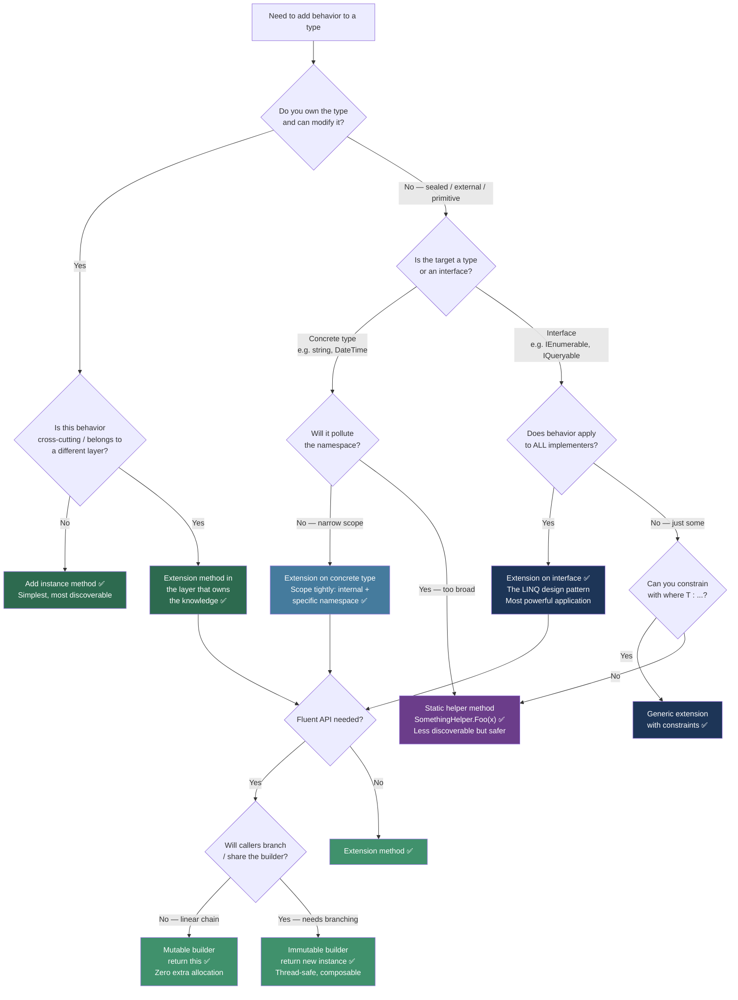

> [!success] Mastery Check
> - [ ] **Studied Well**
> - [ ] **Can explain the concept without notes**
> - [ ] **Can answer interview questions confidently**
> - [ ] **Can implement it in a real project**


## 📍 PART 0 — Navigation & Context

### Where This Topic Lives

```
C# Language Features
└── API Design Patterns
    ├──   Delegates, Func, Action, and Closures (2.21)
    ├──   Iterators and yield return (2.25)
    ├── ► Extension Methods and Fluent APIs  ← YOU ARE HERE
    ├──   Generics: Constraints and Reification (2.17)
    └──   Interfaces and Abstract Classes (2.11)

C# Standard Library Architecture
└── LINQ is the canonical proof this pattern works at scale
    ├──   LINQ: Every Operator Reference (2.23)
    └──   LINQ: Execution Model (2.24)
```

### What You Need Before This

- **[[2.11 — Interfaces and Abstract Classes]]** — extension methods on interfaces are the most powerful application of this pattern; you need to know what an interface contract is
- **[[2.17 — Generics: Constraints, Reification, and the Type System]]** — generic extension methods and type inference are the norm; constrained generics unlock the pattern's full power
- **[[2.21 — Delegates, Func, Action, and Closures]]** — extension methods that accept `Func<T,R>` parameters are how LINQ and most fluent APIs work; closures captured in those delegates matter

### What This Unlocks After

- **[[2.23 — LINQ: Every Operator Reference]]** — LINQ is entirely implemented as extension methods on `IEnumerable<T>`; understanding this topic makes the whole library click
- **[[2.24 — LINQ: Execution Model]]** — the deferred execution chain is a chain of extension method calls returning iterators
- **[[2.33 — Generics: Variance, Generic Math, and Advanced Patterns]]** — extension methods on covariant/contravariant generic interfaces require both topics

> **Why this matters at scale:** Every domain-specific language you build in C# — query builders, validation pipelines, test assertion libraries, configuration APIs — is built on extension methods. Understanding how the compiler resolves them, when they silently do nothing, and when they cause namespace pollution is the difference between a library that teams love and one that produces subtle, hard-to-diagnose bugs.

---

## 🧠 PART 1 — The Core Mental Model

### The Fundamental Rule

> **An extension method is syntactic sugar for a static method call. The compiler rewrites `x.Foo()` into `StaticClass.Foo(x)` at compile time. No vtable lookup, no runtime dispatch, no interface — just a static call with a nicer calling convention.** The practical consequence: you can add methods to any type you don't own, including sealed classes, interfaces, and primitives, without touching their source code or creating a subclass.

### The Plain-Language Analogy

Think of extension methods as **plug-in tools on a Swiss Army knife you didn't make.** The knife (the type) comes from the factory with built-in blades (instance methods). You can't modify the factory design. But you can snap on a custom attachment at your workbench (define an extension method in your namespace) and anyone at your workbench can use `knife.MyCustomTool()` as if it came from the factory.

The critical detail that the analogy must preserve: **your attachment doesn't change the knife.** It's not inheritance. The factory's knife has no knowledge of your tool. If someone else snaps on a tool with the same name in a different shop (different namespace), the compiler must decide which one to use based on which namespace is imported — not by any runtime mechanism. Two identically-named extensions from two namespaces are just two static methods that happen to share a name; the caller's `using` directives determine which wins.

### The Taxonomy Diagram

```mermaid
graph TD
    A["Extension Methods\nstatic method on 'this' parameter"] --> B["By 'this' parameter type"]
    A --> C["By scope / resolution"]
    A --> D["By purpose / pattern"]

    B --> E["Concrete type\nextension on string, List<T>, etc."]
    B --> F["Interface extension\nextension on IEnumerable<T>, IQueryable<T>"]
    B --> G["Generic type extension\nextension on T with constraints"]
    B --> H["Nullable extension\nextension on T? or string?"]

    C --> I["Same namespace\nhighest priority after instance methods"]
    C --> J["Imported namespace\nresolved in declaration order"]
    C --> K["Global namespace\nlowest priority"]

    D --> L["Fluent API / Builder\nreturns 'this' or modified copy"]
    D --> M["LINQ-style pipeline\nreturns IEnumerable<T> or IQueryable<T>"]
    D --> N["Null-safe helper\nguards null before delegating"]
    D --> O["Conversion / projection\ntransforms type to another"]
    D --> P["Validation / assertion\nthrows on invariant violation"]

    style B fill:#1d3557,color:#fff
    style C fill:#2d6a4f,color:#fff
    style D fill:#6b3d8a,color:#fff
    style E fill:#457b9d,color:#fff
    style F fill:#457b9d,color:#fff
    style G fill:#457b9d,color:#fff
    style H fill:#457b9d,color:#fff
    style I fill:#40916c,color:#fff
    style J fill:#40916c,color:#fff
    style K fill:#40916c,color:#fff
    style L fill:#8b5e9e,color:#fff
    style M fill:#8b5e9e,color:#fff
    style N fill:#8b5e9e,color:#fff
    style O fill:#8b5e9e,color:#fff
    style P fill:#8b5e9e,color:#fff
```



---

## 🔬 PART 2 — Deep Mechanics

### 2.1 Compiler Transformation: What Actually Happens

Extension methods are resolved and rewritten entirely at compile time. The runtime never sees the extension method syntax — it sees a plain static method call.

```csharp
// What the developer writes:
string result = "  hello world  ".Trim().ToTitleCase();

// What the compiler emits (approximately):
string result = StringExtensions.ToTitleCase(
                    string.Trim("  hello world  "));

// IL produced (simplified):
// ldstr "  hello world  "
// call  instance string string::Trim()
// call  static  string StringExtensions::ToTitleCase(string)
// stloc result
```

**Resolution order the compiler uses (this is the order that determines which extension method wins):**

```
Step 1: Can this be resolved as an INSTANCE METHOD?
         → Yes → use instance method, ignore all extensions
         → No  → continue

Step 2: Is there an extension method with this name in the CURRENT CLASS's namespace?
         → Yes → use it (closest wins)
         → No  → continue

Step 3: Is there an extension method in any IMPORTED namespace (using directives)?
         → Yes → use it; if multiple match, prefer most-derived 'this' type
                 if still ambiguous → compile error (ambiguous call)
         → No  → compile error (no method found)
```

> [!IMPORTANT] Instance Methods Always Win If a type ever adds an instance method with the same name and compatible signature as an existing extension method, the instance method silently takes over. Your extension method continues to compile and exist but is **never called**. This is a well-known source of silent behavioral change when upgrading libraries.

**Cost:** Every extension method call is a static method call. **~0.5–2 ns**, identical to a direct static call. No vtable lookup, no interface dispatch. Zero overhead vs instance methods for the same logic.

---

### 2.2 Generic Extension Methods and Type Inference

Generic extension methods are where the pattern's power peaks.

```csharp
// Definition: generic extension method with constraint
public static class QueryExtensions
{
    // T is inferred from the 'this' argument — caller never writes the type parameter
    public static IEnumerable<T> WhereNotNull<T>(
        this IEnumerable<T?> source) where T : class
    {
        // null coalescing filter — no boxing, no Cast<>, no OfType<> workaround needed
        foreach (var item in source)
            if (item is not null)
                yield return item;
    }

    // Constrained to types that are both equatable AND orderable
    public static IEnumerable<T> Deduplicate<T>(
        this IEnumerable<T> source) where T : IEquatable<T>
    {
        var seen = new HashSet<T>();
        foreach (var item in source)
            if (seen.Add(item))
                yield return item;
    }
}

// Usage: T is inferred as string — no angle brackets needed
IEnumerable<string?> rawNames = GetOrderOwnerNames(); // may contain nulls
IEnumerable<string> cleanNames = rawNames.WhereNotNull(); // T inferred = string
```

**The inference chain the compiler runs:**

```
1. Caller writes:  rawNames.WhereNotNull()
2. 'rawNames' is IEnumerable<string?>
3. Extension declares: this IEnumerable<T?> source  where T : class
4. Compiler unifies: IEnumerable<T?> ≡ IEnumerable<string?>
5. Therefore: T = string (satisfies 'where T : class')
6. Method resolves: WhereNotNull<string>(rawNames)
```

**Cost:** Type inference is compile-time only. Zero runtime cost. The JIT generates one native method per distinct `T` value type, shared code for all reference types. Same as direct generic calls.

---

### 2.3 Extensions on Interfaces — The LINQ Design Pattern

The single most powerful application: add behavior to every type that satisfies a contract, without touching any of those types.

```
LINQ's architecture — entirely extension methods on IEnumerable<T>:

                    ┌───────────────────────────────┐
                    │        IEnumerable<T>          │
                    │  (one method: GetEnumerator)   │
                    └───────────┬───────────────────┘
                                │ implemented by:
        ┌───────────────────────┼───────────────────────┐
        │                       │                       │
   List<T>               int[]                   HashSet<T>
   Dictionary<K,V>       string                  IQueryable<T>
   Stack<T>              custom classes          ...thousands more
        │                       │                       │
        └───────────────────────┼───────────────────────┘
                                │ all gain:
                    ┌───────────▼───────────────────┐
                    │   Enumerable static class      │
                    │   Where(), Select(), GroupBy() │
                    │   OrderBy(), Sum(), Count()    │
                    │   ...47 extension methods      │
                    └───────────────────────────────┘

Key insight: Microsoft wrote 47 methods ONCE and gifted them to
EVERY type that implements IEnumerable<T> — past, present, and future.
Your custom collection from 2019 immediately works with LINQ from 2008.
This is the design pattern: write to the interface, chain for free.
```

```csharp
// Demonstrate: one extension unlocks behavior for all implementers
public static class PaginationExtensions
{
    // Written once against IQueryable<T> — works for EF Core, Dapper wrappers,
    // custom query objects, everything that produces IQueryable<T>
    public static IQueryable<T> Page<T>(
        this IQueryable<T> source,
        int pageNumber,      // 1-based
        int pageSize)
    {
        if (pageNumber < 1) throw new ArgumentOutOfRangeException(nameof(pageNumber));
        if (pageSize < 1)   throw new ArgumentOutOfRangeException(nameof(pageSize));

        return source
            .Skip((pageNumber - 1) * pageSize)
            .Take(pageSize);
    }
}

// Usage — works with any IQueryable<T> producer
IQueryable<Order> q = _dbContext.Orders
    .Where(o => o.CustomerId == customerId)
    .OrderByDescending(o => o.PlacedAt);

var page = await q.Page(pageNumber: 2, pageSize: 25)
                  .ToListAsync();
```

**Cost:** Interface extension method call = static call (~1 ns). No interface dispatch overhead. The `this IQueryable<T>` parameter is passed as a regular reference — no boxing, no vtable.

---

### 2.4 Fluent API Builder Pattern — Return Semantics

A fluent API is an extension method chain where each method returns a context object, enabling chained calls that read like a sentence.

```
TWO fluent API variants and their different memory implications:

─────────────────────────────────────────────────────────────────────
VARIANT A: Mutable builder — return 'this' (same object, mutated)
─────────────────────────────────────────────────────────────────────

  builder.SetTimeout(30)         // returns: the same EmailBuilder object
         .WithRetry(3)           // returns: still the same object
         .Build();               // returns: new Email (the product)

  Stack:                 Heap:
  ┌─────────────────┐   ┌──────────────────────┐
  │  builder ref ───┼──►│  EmailBuilder        │
  └─────────────────┘   │  Timeout:  30        │← all mutations go here
                        │  Retries:  3         │
                        └──────────────────────┘
  ONE allocation. Mutations are in-place. Fast.

─────────────────────────────────────────────────────────────────────
VARIANT B: Immutable builder — return NEW object each step
─────────────────────────────────────────────────────────────────────

  querySpec.WithFilter(x => x.Active)  // returns: NEW QuerySpec
           .WithSort("CreatedAt")      // returns: another NEW QuerySpec
           .WithLimit(100);            // returns: yet another NEW QuerySpec

  Stack:                 Heap:
  ┌─────────────────┐   ┌───────┐  ┌───────┐  ┌───────┐
  │  spec ref ──────┼──►│  v1   │  │  v2   │  │  v3   │
  └─────────────────┘   │Filter │  │+Sort  │  │+Limit │
                        └───────┘  └───────┘  └───────┘
                           ↑ collected soon    ↑ this is the final
  3 allocations. Thread-safe by construction (each version immutable).
  Appropriate when the spec may be branched and reused.
```

> [!TIP] Which Variant to Use Mutable builder (`return this`): pipeline configuration objects, request builders, email builders — anything created, configured, and used in one call chain. **One allocation, max performance.** Immutable builder (return new): query specification objects that may be branched, shared, or used as a base for multiple derived queries. **Multiple allocations, but thread-safe and composable.**

**Cost of mutable fluent chain:** Each extension call is a static call (~1 ns) + pointer return (8 bytes copied). A 10-step chain costs ~10 ns + zero additional allocations. Negligible.

---

### 2.5 Namespace Resolution — The Collision Problem

This is the runtime behavior that catches engineers off guard when combining multiple libraries.

```
Scenario: Two libraries both extend string with a method named "Sanitize"

Library A (Acme.Security):
  public static string Sanitize(this string input) { /* removes XSS */ }

Library B (Acme.Database):
  public static string Sanitize(this string input) { /* removes SQL injection */ }

Code file:
  using Acme.Security;
  using Acme.Database;

  string clean = userInput.Sanitize(); // ← COMPILE ERROR: ambiguous call
```

```
Resolution rules when collision happens:

  1. COMPILE ERROR if both are equally specific and both namespaces are imported
     → Fix: use explicit static call: Acme.Security.StringExtensions.Sanitize(userInput)

  2. The MOST DERIVED 'this' type wins if one extension targets a subtype
     Extension A: this IEnumerable<T>
     Extension B: this List<T>         ← List<T> is more derived
     → Extension B wins for List<T> arguments (no error)

  3. INSTANCE METHOD always silently wins over any extension
     → If the type later adds an instance method matching the extension,
       the extension becomes unreachable with zero compiler warning
```

**Cost of collision resolution:** Pure compile-time concern. Zero runtime overhead.

---

## 💻 PART 3 — Production Code Patterns

### 3.1 The Null-Safe Boundary Extension

The most defensively useful pattern: wrap a `null`-returning API in an extension that normalizes the null before it propagates into the domain.

```csharp
// Context: order management service consuming a third-party shipping API
// that may return null collections instead of empty ones

// ⚠️ WRONG: null propagates into business logic
public IEnumerable<ShipmentEvent> GetEvents(string trackingNumber)
{
    // third-party SDK may return null for unknown tracking numbers
    return _shippingApi.GetHistory(trackingNumber).Events; // NullReferenceException waiting
}

// ✅ CORRECT: normalize at the seam with a null-safe extension
public static class EnumerableExtensions
{
    /// <summary>Returns the source sequence if non-null, or an empty sequence.</summary>
    /// <remarks>Use at API seams where null-for-empty is a known external contract violation.</remarks>
    public static IEnumerable<T> OrEmpty<T>(this IEnumerable<T>? source)
        => source ?? Enumerable.Empty<T>();

    /// <summary>Returns the collection if non-null/empty, or the fallback.</summary>
    public static IEnumerable<T> OrDefault<T>(
        this IEnumerable<T>? source,
        IEnumerable<T> fallback)
        => source is { } s && s.Any() ? s : fallback;
}

// Usage: normalized at the seam — inner code never sees null
public IEnumerable<ShipmentEvent> GetEvents(string trackingNumber)
{
    return _shippingApi.GetHistory(trackingNumber)?.Events.OrEmpty()
           ?? Enumerable.Empty<ShipmentEvent>();
}
```

### 3.2 The Pipeline Builder — Validation Chain

A validation chain that reads declaratively, written against an interface so any domain entity type participates.

```csharp
// Context: payment processing — validating a PaymentRequest before authorizing

public interface IValidationResult
{
    bool IsValid { get; }
    IReadOnlyList<string> Errors { get; }
}

public record ValidationResult(bool IsValid, IReadOnlyList<string> Errors)
    : IValidationResult
{
    public static ValidationResult Ok() => new(true, Array.Empty<string>());
    public static ValidationResult Fail(params string[] errors) => new(false, errors);
}

public static class ValidationExtensions
{
    // Core: chain two validators — AND semantics
    // 'this' is the prior result; only runs nextValidator if still passing
    public static ValidationResult AndAlso<T>(
        this ValidationResult prior,
        T value,
        Func<T, ValidationResult> nextValidator)
    {
        if (!prior.IsValid) return prior; // short-circuit — don't accumulate irrelevant errors
        return nextValidator(value);
    }

    // Accumulate ALL errors even when prior failed — OR semantics for audit trails
    public static ValidationResult AndAlsoAll<T>(
        this ValidationResult prior,
        T value,
        Func<T, ValidationResult> nextValidator)
    {
        var next = nextValidator(value);
        if (prior.IsValid && next.IsValid) return ValidationResult.Ok();

        var allErrors = prior.Errors.Concat(next.Errors).ToArray();
        return ValidationResult.Fail(allErrors);
    }
}

// Domain validators — pure functions, composable
public static class PaymentValidators
{
    public static ValidationResult ValidateAmount(PaymentRequest r)
        => r.Amount > 0
            ? ValidationResult.Ok()
            : ValidationResult.Fail("Amount must be positive");

    public static ValidationResult ValidateCurrency(PaymentRequest r)
        => SupportedCurrencies.Contains(r.Currency)
            ? ValidationResult.Ok()
            : ValidationResult.Fail($"Currency '{r.Currency}' is not supported");

    public static ValidationResult ValidateCard(PaymentRequest r)
        => Luhn.IsValid(r.CardNumber)
            ? ValidationResult.Ok()
            : ValidationResult.Fail("Card number failed Luhn check");

    private static readonly HashSet<string> SupportedCurrencies =
        new(StringComparer.OrdinalIgnoreCase) { "USD", "EUR", "GBP", "EGP" };
}

// Usage: reads like a business rule sentence
public async Task<AuthorizationResult> AuthorizeAsync(PaymentRequest request)
{
    var validation = ValidationResult.Ok()
        .AndAlso(request, PaymentValidators.ValidateAmount)
        .AndAlso(request, PaymentValidators.ValidateCurrency)
        .AndAlso(request, PaymentValidators.ValidateCard);

    if (!validation.IsValid)
        return AuthorizationResult.Declined(validation.Errors);

    return await _gateway.AuthorizeAsync(request);
}
```

### 3.3 The Fluent Configuration Builder — Mutable Return

A request builder for an HTTP client integration — mutable, fluent, one allocation per request.

```csharp
// Context: inventory management service calling a warehouse API
// Each call constructs a typed request object via a fluent API

public sealed class InventoryQueryBuilder
{
    private readonly InventoryQueryOptions _options = new();

    // Internal constructor — callers use the static entry point
    private InventoryQueryBuilder() { }

    public static InventoryQueryBuilder ForWarehouse(string warehouseId)
    {
        // The only allocation in the chain (aside from the options object)
        var b = new InventoryQueryBuilder();
        b._options.WarehouseId = warehouseId;
        return b;
    }

    // Each method mutates _options and returns 'this' — ONE object, no copies
    public InventoryQueryBuilder WithSkus(IEnumerable<string> skus)
    {
        _options.Skus.AddRange(skus);
        return this; // same object reference — no allocation
    }

    public InventoryQueryBuilder LowStockOnly(int threshold = 10)
    {
        _options.LowStockThreshold = threshold;
        return this;
    }

    public InventoryQueryBuilder AsOf(DateTimeOffset snapshotDate)
    {
        _options.SnapshotDate = snapshotDate;
        return this;
    }

    public InventoryQueryOptions Build() => _options;
}

// Usage: chain reads like a domain sentence
var query = InventoryQueryBuilder
    .ForWarehouse("WH-CAIRO-01")
    .WithSkus(orderLineSkus)
    .LowStockOnly(threshold: 5)
    .AsOf(DateTimeOffset.UtcNow)
    .Build();

var stockLevels = await _warehouseClient.QueryInventoryAsync(query);
```

### 3.4 The Domain Enrichment Pattern — Extensions on Your Own Types

Adding business-logic-heavy operations as extensions rather than bloating a domain class, with a clear architectural reason.

```csharp
// Context: order management — Order is a domain aggregate (Value Object semantics)
// We don't want to put tax calculation, shipping estimation, etc. inside Order itself
// because Order should only know about its own state — not tax tables, shipping zones.
// Extension methods in a separate module let Order stay clean.

public sealed class Order
{
    public OrderId Id { get; }
    public CustomerId CustomerId { get; }
    public IReadOnlyList<OrderLine> Lines { get; }
    public Address ShippingAddress { get; }
    public DateTimeOffset PlacedAt { get; }
    public OrderStatus Status { get; }

    // Constructor, factory methods, core business rules only
    // NO tax calculation, NO shipping estimation, NO formatting
}

// ── In the Application layer (knows about tax rules, shipping zones) ──
namespace OrderManagement.Application.Pricing
{
    public static class OrderPricingExtensions
    {
        // Extension separates pricing policy from domain model
        public static Money CalculateSubtotal(this Order order)
            => order.Lines.Aggregate(
                Money.Zero("USD"),
                (acc, line) => acc + line.UnitPrice * line.Quantity);

        public static Money CalculateTax(this Order order, ITaxSchedule taxSchedule)
            => taxSchedule.ComputeTax(order.ShippingAddress.State, order.CalculateSubtotal());

        public static bool IsEligibleForFreeShipping(this Order order)
            => order.CalculateSubtotal().Amount >= 50m
               && order.ShippingAddress.Country == "US";
    }
}

// ── In the Infrastructure layer (knows about formatting, serialization) ──
namespace OrderManagement.Infrastructure.Reporting
{
    public static class OrderReportingExtensions
    {
        public static string ToInvoiceReference(this Order order)
            => $"INV-{order.PlacedAt:yyyyMMdd}-{order.Id.Value[..8].ToUpper()}";
    }
}
```

> [!NOTE] The Architectural Value Extensions let you put business logic that depends on external knowledge (tax tables, shipping zones) in the layer that owns that knowledge, while keeping the domain object clean. This is the **Open/Closed Principle** in practice: `Order` is closed for modification but open for extension.

### 3.5 The Conditional Chain Extension

Building a conditional pipeline without breaking the chain with `if` statements.

```csharp
// Context: user service — building a search query that optionally applies filters
// Without extensions, every optional filter breaks the fluent chain with an if statement

// ⚠️ WRONG: chain-breaking conditionals
IQueryable<User> query = _dbContext.Users;
if (request.IsActive.HasValue)
    query = query.Where(u => u.IsActive == request.IsActive.Value);
if (request.Role is not null)
    query = query.Where(u => u.Role == request.Role);
if (request.CreatedAfter.HasValue)
    query = query.Where(u => u.CreatedAt >= request.CreatedAfter.Value);
// ... 15 more of these

// ✅ CORRECT: conditional chain extension keeps the pipeline readable
public static class QueryableExtensions
{
    /// <summary>
    /// Applies the predicate only when <paramref name="condition"/> is true.
    /// When false, returns the source unchanged — enabling conditional fluent chains.
    /// </summary>
    public static IQueryable<T> WhereIf<T>(
        this IQueryable<T> source,
        bool condition,
        Expression<Func<T, bool>> predicate)
        => condition ? source.Where(predicate) : source;

    // Overload for IEnumerable<T> (in-memory collections)
    public static IEnumerable<T> WhereIf<T>(
        this IEnumerable<T> source,
        bool condition,
        Func<T, bool> predicate)
        => condition ? source.Where(predicate) : source;
}

// Usage: the entire query is one readable pipeline
var users = await _dbContext.Users
    .WhereIf(request.IsActive.HasValue,   u => u.IsActive == request.IsActive!.Value)
    .WhereIf(request.Role is not null,    u => u.Role == request.Role)
    .WhereIf(request.CreatedAfter.HasValue, u => u.CreatedAt >= request.CreatedAfter!.Value)
    .WhereIf(!string.IsNullOrEmpty(request.EmailDomain),
             u => u.Email.EndsWith("@" + request.EmailDomain))
    .OrderByDescending(u => u.CreatedAt)
    .Page(request.PageNumber, request.PageSize)
    .ToListAsync(cancellationToken);
```

### 3.6 Static Extension Caching — The Performance Bridge

When an extension method needs expensive one-time setup (compiled delegates, regex), cache it properly.

```csharp
// Context: audit logging service — formatting entity change records
// The formatter uses reflection-compiled delegates for speed; compiled once per type T

public static class AuditExtensions
{
    // ConcurrentDictionary<Type, Delegate> — thread-safe, one compiled getter per property per type
    // This is a common pattern: the extension method itself is cheap;
    // the expensive setup is paid once and cached per type.
    private static readonly ConcurrentDictionary<Type, Func<object, string>> _formatters
        = new();

    public static string ToAuditString<T>(this T entity) where T : class
    {
        var formatter = _formatters.GetOrAdd(
            typeof(T),
            static type =>
            {
                // Compile a delegate once: walks all public properties via expression tree
                // and builds "PropName=Value, PropName=Value" string
                // ~50 μs to compile; ~200 ns per subsequent call (vs ~5 μs via reflection)
                var param = Expression.Parameter(typeof(object), "obj");
                var cast  = Expression.Convert(param, type);
                // ... (abbreviated: see Expression Trees topic 2.43 for full pattern)
                return BuildFormatter(type);
            });

        return formatter(entity);
    }

    private static Func<object, string> BuildFormatter(Type type)
    {
        var props = type.GetProperties(BindingFlags.Public | BindingFlags.Instance);
        // Build expression tree: obj => $"Prop1={((T)obj).Prop1}, Prop2={((T)obj).Prop2}"
        // (Full implementation uses Expression.Call + string.Join for production use)
        return obj => string.Join(", ", props.Select(p => $"{p.Name}={p.GetValue(obj)}"));
    }
}
```

### 3.7 The Defensive Namespace Scope — Avoiding Pollution

Controlling who can see your extension methods by intentional namespace scoping.

```csharp
// ⚠️ WRONG: extension in root namespace pollutes every file in the project
namespace MyApp
{
    public static class StringExtensions
    {
        // This 'using MyApp' is often already implicit → everyone sees these
        // even if they'd never want them on string
        public static string ToCamelCase(this string s) { /* ... */ }
    }
}

// ✅ CORRECT: scope the extension to the layer that needs it
// Only files that explicitly 'using MyApp.Infrastructure.Serialization' see this
namespace MyApp.Infrastructure.Serialization
{
    internal static class JsonNamingExtensions
    {
        // 'internal': restricted to this assembly
        // nested namespace: restricted to files that specifically opt in
        public static string ToCamelCase(this string s)
        {
            if (string.IsNullOrEmpty(s)) return s;
            return char.ToLowerInvariant(s[0]) + s[1..];
        }

        public static string ToSnakeCase(this string s)
        {
            // ... regex-based transformation
            return Regex.Replace(s, "(?<=[a-z])([A-Z])", "_$1").ToLowerInvariant();
        }
    }
}

// Files that don't add 'using MyApp.Infrastructure.Serialization' never see these.
// The clean string API is not contaminated for 95% of the codebase.
```

---

## ⚠️ PART 4 — Gotchas & Anti-Patterns

### Gotcha 1: The Silent Instance Method Override

The most dangerous failure mode: an instance method silently replaces your extension with no warning.

Engineers fall into this trap when a library they depend on adds a new method that happens to match their extension. The extension still compiles — it just never runs.

```csharp
// ⚠️ WRONG MENTAL MODEL: "My extension will always be called"

// Your extension, added in 2022 because the type lacked this:
public static class CollectionExtensions
{
    public static void AddRange<T>(this ICollection<T> col, IEnumerable<T> items)
    {
        foreach (var item in items) col.Add(item);
    }
}

// .NET 8 adds List<T>.AddRange(IEnumerable<T>) as an INSTANCE METHOD.
// After upgrading, your extension is NEVER CALLED for List<T> arguments.
// The instance method wins, silently.
// If your extension had additional logic (null checks, events, metrics),
// that logic is now silently skipped.

// ✅ CORRECT: check for new instance methods when upgrading the framework.
// If an instance method now covers your use case: DELETE the extension.
// If your extension had additional behavior: wrap the instance method call.
public static class CollectionExtensions
{
    public static void AddRangeGuarded<T>(this ICollection<T> col, IEnumerable<T>? items)
    {
        // Distinct enough name → won't be shadowed by future instance methods
        if (items is null) return;
        foreach (var item in items) col.Add(item);
    }
}

// WHY: The compiler's resolution rule is deterministic: instance methods always win.
// There is no warning because from the compiler's perspective, it found a BETTER match.
```

### Gotcha 2: `this` Parameter Can Be Null — No Automatic Guard

Instance methods get a NullReferenceException when called on null. Extension methods do not — `this` is just a parameter and C# does not null-check it before the call.

```csharp
// ⚠️ WRONG: extension called on null crashes inside — confusing stack trace
public static class StringExtensions
{
    public static bool IsValidEmail(this string email)
    {
        // If caller writes: string s = null; s.IsValidEmail()
        // 'email' is null here. The call doesn't throw before entering the method.
        return email.Contains('@') && email.Contains('.'); // NRE here — confusing
    }
}

// ✅ CORRECT: guard 'this' explicitly in the extension
public static class StringExtensions
{
    public static bool IsValidEmail(this string? email)
    {
        if (email is null) return false; // null → invalid, not an exception
        return email.Contains('@') && email.Contains('.') && email.Length > 3;
    }

    // For extensions where null is truly invalid, throw with a helpful message
    public static string NormalizeOrderReference(this string orderRef)
    {
        ArgumentNullException.ThrowIfNull(orderRef, nameof(orderRef));
        return orderRef.Trim().ToUpperInvariant();
    }
}

// WHY: The extension method calling convention is purely a compile-time rewrite.
// string.IsValidEmail(null) compiles to StringExtensions.IsValidEmail(null).
// The null check that an instance method call generates (as isinst or check) is absent.
// The CLR doesn't insert it for static calls.
```

### Gotcha 3: Fluent Builder Aliasing — Shared State Mutation Bug

When a mutable builder is "branched" by assigning it to two variables, mutations through one affect both.

```csharp
// ⚠️ WRONG: aliasing a mutable builder produces correlated requests
var baseQuery = UserQueryBuilder.ForTenant("acme-corp");
var activeQuery  = baseQuery.WithStatus(UserStatus.Active);   // returns 'this' — same object!
var premiumQuery = baseQuery.WithPlan(PricingPlan.Premium);   // also 'this' — same object!

// Both variables point to THE SAME builder object.
// premiumQuery also has WithStatus(Active) applied — silent bug.

// ✅ CORRECT OPTION A: accept mutation and don't branch mutable builders
var activeQuery  = UserQueryBuilder.ForTenant("acme-corp").WithStatus(UserStatus.Active).Build();
var premiumQuery = UserQueryBuilder.ForTenant("acme-corp").WithPlan(PricingPlan.Premium).Build();

// ✅ CORRECT OPTION B: make the builder immutable (return new instance each step)
// Each step returns a NEW builder — branching is safe
public UserQueryBuilder WithStatus(UserStatus status)
{
    return new UserQueryBuilder(this) { Status = status }; // copy constructor
}

// WHY: 'return this' is explicit mutation of a shared object reference.
// If you assign the builder to two variables, they alias the same object.
// The solution is either: never alias mutable builders, or make the builder immutable.
```

### Gotcha 4: Extension Methods Are Not Polymorphic

Extensions bind to the **compile-time type** of the variable, not the runtime type. This surprises engineers who expect them to behave like virtual methods.

```csharp
// ⚠️ WRONG MENTAL MODEL: "extensions dispatch on runtime type"

public static class LogExtensions
{
    public static string Describe(this Animal animal) => "An animal";
    public static string Describe(this Dog dog) => "A dog";
}

Animal a = new Dog(); // compile-time type: Animal; runtime type: Dog

Console.WriteLine(a.Describe()); // Prints: "An animal"
                                  // NOT "A dog" — because 'a' is typed as Animal at compile time
                                  // The compiler picks the extension at compile time, not runtime

// ✅ CORRECT: if you need runtime dispatch, use virtual/override on instance methods
public abstract class Animal
{
    public virtual string Describe() => "An animal";
}
public class Dog : Animal
{
    public override string Describe() => "A dog"; // truly polymorphic
}

Animal a = new Dog();
Console.WriteLine(a.Describe()); // "A dog" — virtual dispatch at runtime

// WHY: Extensions are static calls resolved at compile time. The runtime type
// is irrelevant — the compiler picks the overload based on the declared type of the variable.
// This is not a limitation you can work around within extension methods.
```

### Gotcha 5: The Deferred Execution Extension That Iterates Twice

An extension method written against `IEnumerable<T>` may trigger multiple enumerations of a lazy source — silently causing doubled database queries, doubled file reads, or infinite-sequence exhaustion.

```csharp
// ⚠️ WRONG: triggers TWO enumerations of the (possibly expensive) source
public static class ReportExtensions
{
    public static SummaryReport Summarize<T>(this IEnumerable<T> source, Func<T, decimal> valueSelector)
    {
        var count = source.Count();   // First enumeration — full database query
        var total = source.Sum(valueSelector); // Second enumeration — ANOTHER full database query!
        var avg   = total / count;

        return new SummaryReport(count, total, avg);
    }
}

// ✅ CORRECT: materialize once, then operate on the in-memory list
public static SummaryReport Summarize<T>(this IEnumerable<T> source, Func<T, decimal> valueSelector)
{
    // ToList() pays ONE allocation + ONE enumeration. Everything after is in-memory.
    var materialized = source.ToList();

    var count = materialized.Count;               // O(1), property read
    var total = materialized.Sum(valueSelector);  // ONE pass over the list
    var avg   = count > 0 ? total / count : 0m;

    return new SummaryReport(count, total, avg);
}

// ALTERNATIVE: if the source is already a list or array, avoid the copy
public static SummaryReport Summarize<T>(this IEnumerable<T> source, Func<T, decimal> valueSelector)
{
    // Avoids allocating a new list if source is already ICollection<T>
    // (arrays, List<T>, etc. — skips ToList() copy)
    var materialized = source is ICollection<T> col ? (IReadOnlyCollection<T>)col.ToList()
                                                     : (IReadOnlyCollection<T>)source.ToList();
    // ... same logic
}

// WHY: IEnumerable<T> is a PULL sequence. Every foreach or LINQ operator
// calls GetEnumerator() and starts from the beginning. A lazy source (LINQ-to-SQL,
// yield return generator, file stream reader) re-executes its work each time.
```

---

## 📊 PART 5 — Performance Implications

### 5.1 Allocation Characteristics Table

|Scenario|Allocation Behavior|Approx Cost|
|---|---|---|
|Simple extension method call|Zero allocation — static call|~0.5–2 ns|
|Fluent chain, `return this` builder (10 steps)|Zero extra allocation beyond the builder itself|~10–20 ns total|
|Fluent chain, immutable builder (10 steps)|10 new builder objects on the heap|~250–500 ns + GC pressure|
|Generic extension, value type `T`|Zero boxing — JIT reifies per value type|~1 ns|
|Extension accepting `Func<T,R>` with no capture|Zero allocation (static lambda — compiler caches the delegate)|~0.5 ns per call|
|Extension accepting `Func<T,R>` with closure capture|One delegate allocation + one display class per call site where capture differs|~30–50 ns|
|Extension on `IEnumerable<T>` that materializes|One `List<T>` allocation — N elements|O(n) time, O(n) space|
|Extension calling `.Count()` on `IEnumerable<T>`|Full enumeration if source is not `ICollection<T>`|O(n) time, zero alloc|
|WhereIf that returns source unchanged|Zero allocation — same reference returned|~1 ns|
|Extension with `params T[]` parameter|One array allocation per call site even with 0 elements|~20 ns + 16 bytes|

### 5.2 BenchmarkDotNet: Fluent Chain Variants

```csharp
// Expected output (approximate, .NET 8, x64):
// ┌────────────────────────────────┬──────────┬─────────┬────────────┐
// │ Method                         │ Mean     │ Alloc   │ Gen0       │
// ├────────────────────────────────┼──────────┼─────────┼────────────┤
// │ MutableBuilderChain (10 steps) │  18.4 ns │  96 B   │ 0.0006     │
// │ ImmutableBuilderChain(10 steps)│ 420.0 ns │ 960 B   │ 0.0610     │
// │ DirectConfig (no builder)      │   2.1 ns │   0 B   │ -          │
// │ WhereIfChain (5 conditions)    │  8.2 ns  │   0 B   │ -          │
// │ WhereIfChain_AllFalse          │  1.9 ns  │   0 B   │ -          │
// └────────────────────────────────┴──────────┴─────────┴────────────┘

[MemoryDiagnoser]
public class FluentApiAllocationBenchmark
{
    private static readonly List<int> _source = Enumerable.Range(1, 1000).ToList();
    private static readonly bool[] _conditions = { true, false, true, false, true };

    [Benchmark(Baseline = true)]
    public OrderQueryOptions MutableBuilderChain()
    {
        // Builder mutates _options in place; each method returns 'this'
        // ONE allocation: the builder (and its inner Options object)
        return OrderQueryBuilder
            .ForCustomer("cust-001")
            .WithStatus(OrderStatus.Pending)
            .PlacedAfter(DateTimeOffset.UtcNow.AddDays(-30))
            .WithCurrency("USD")
            .WithLimit(100)
            .OrderedBy("PlacedAt", descending: true)
            .IncludeLines()
            .IncludeShipments()
            .WithTag("high-value")
            .ExcludeCancelled()
            .Build();
    }

    [Benchmark]
    public OrderQueryOptions ImmutableBuilderChain()
    {
        // Each step creates a NEW OrderQueryBuilder — 10 allocations for 10 steps
        // Use only when branching/sharing the intermediate spec is required
        return OrderQuerySpec.Empty
            .WithCustomer("cust-001")
            .WithStatus(OrderStatus.Pending)
            .PlacedAfter(DateTimeOffset.UtcNow.AddDays(-30))
            .WithCurrency("USD")
            .WithLimit(100)
            .OrderedBy("PlacedAt", descending: true)
            .IncludeLines()
            .IncludeShipments()
            .WithTag("high-value")
            .ExcludeCancelled()
            .Build();
    }

    [Benchmark]
    public IEnumerable<int> WhereIfChain_SomeActive()
    {
        // WhereIf wraps Where() when condition is true; returns source unchanged when false
        // Zero allocation when condition is false (no iterator wrapper created)
        return _source
            .WhereIf(_conditions[0], x => x > 100)
            .WhereIf(_conditions[1], x => x % 2 == 0) // false — no iterator created
            .WhereIf(_conditions[2], x => x < 800)
            .WhereIf(_conditions[3], x => x % 3 == 0) // false — no iterator created
            .WhereIf(_conditions[4], x => x > 200);
    }
}
```

### 5.3 When to Care / When to Ignore

**When this costs you:**

- **Immutable builder in a hot allocation path**: If a request builder creates a new object at each step and you're building 10,000 requests per second (order ingestion, event processing), the allocation cascade hits Gen0 GC hard. Switch to mutable builder or pre-allocated request objects.
- **Extension that calls `.Count()` on `IQueryable<T>`**: Adds a `SELECT COUNT(*)` database round-trip that isn't needed if `.Any()` would have been sufficient.
- **Extension with unintentional double enumeration**: A pipeline stage that calls `.Count()` then `.Sum()` on an `IQueryable<T>` issues two database queries. In a busy e-commerce reporting API, this doubles database load silently.
- **Extension accepting `params T[]`**: In a high-frequency logging path, every call to `logger.LogFields("orderId", "amount", "currency")` allocates a `string[]` for the params array. Switch to explicit overloads for the common arities.

**When this doesn't matter:**

- **Mutable fluent builder for user-initiated operations**: A user fills out a search form and submits — once. The builder chain costs ~20 ns and one allocation. This is not measurable in user-perceived latency.
- **WhereIf chains on in-memory `List<T>`**: For collections under 10,000 elements that aren't on a critical hot path, the overhead of the conditional lambda is nanoseconds.
- **Extension method resolution overhead**: Zero. This is a compile-time concern. The runtime never searches for extension methods — the IL already contains the static call.

---

## 🎤 PART 6 — Interview Arsenal

### 6.1 The Question Bank

---

> **Q: "What is an extension method in C#? How does it work under the hood?"**

**Average Answer:** "Extension methods let you add methods to types you don't own. You define them in a static class with a static method where the first parameter uses `this`."

**Why That's Insufficient:** It describes the syntax but says nothing about the compiler transformation, resolution rules, or why it's not runtime magic.

**Great Answer:**

> "An extension method is compile-time syntactic sugar — nothing more, nothing less. When I write `myString.ToTitleCase()`, the compiler rewrites that call to `StringExtensions.ToTitleCase(myString)` before it emits any IL. There's no runtime dispatch, no vtable lookup, no interface — it's a plain static call with a nicer calling convention. The practical consequence of this is that extension methods bind to the compile-time type of the variable, not the runtime type. If I have an `Animal` variable that holds a `Dog` at runtime, and I have extensions for both `Animal` and `Dog`, the compiler picks the `Animal` extension because that's what it sees statically. They're also not polymorphic for the same reason. Where the pattern really earns its keep is on interfaces: because the `this` parameter can be an interface type, one extension method applies to every type that implements that interface — which is exactly how LINQ works. All 47 LINQ operators are extension methods on `IEnumerable<T>`, written once, available everywhere forever."

---

> **Q: "What is a fluent API and how would you design one?"**

**Average Answer:** "A fluent API is when you chain method calls using `return this` so you can write code that reads like English."

**Why That's Insufficient:** It mentions only the mutable variant, misses the immutable variant entirely, ignores performance implications, and says nothing about when each is appropriate.

**Great Answer:**

> "Fluent APIs come in two fundamentally different forms, and choosing the wrong one causes subtle bugs. The mutable variant returns `this` from each method — one object is mutated in place through the entire chain. This is zero extra allocation after the initial builder creation, and it's the right choice for a builder that's created, configured, and used in one call chain with no branching. The immutable variant returns a new object at each step — a copy with the new value applied. This costs one allocation per chain step, but it makes the builder safe to branch: two callers can start from a shared base spec and apply different filters without corrupting each other's query. That pattern is common in query specification objects. The mistake I see in production code is using a mutable builder and then assigning it to two variables — both variables now alias the same object, so the second chain of mutations affects both. For the design: the builder wraps a configuration options object, each method modifies one property and returns `self` or `new`, and there's a terminal `Build()` method that validates the accumulated state and produces the final immutable product."

---

> **Q: "What are the resolution rules for extension methods when there's a conflict?"**

**Average Answer:** "The compiler picks the one in the namespace you've imported."

**Why That's Insufficient:** This is too vague. It doesn't address the instance method priority, the most-derived-type rule, or the compile error case.

**Great Answer:**

> "The compiler follows a strict priority order. Instance methods always win — if the type has an instance method that matches, no extension is ever considered, full stop. This is actually a silent danger: when a library you depend on adds an instance method that matches your extension, your extension compiles but is silently bypassed. After instance methods, the compiler looks at extensions in the current file's namespace first, then extensions in imported namespaces via `using` directives. If two imported namespaces both contribute an equally-specific extension with the same name, you get a compile error for ambiguous call, which you resolve by calling the static method explicitly. There's also a tie-breaking rule for `this` parameter type specificity: an extension targeting `List<T>` wins over one targeting `IEnumerable<T>` when the argument is a `List<T>`, because `List<T>` is more derived. All of this is compile-time. There's zero runtime cost to resolution."

---

> **Q: "What are the dangers of overusing extension methods?"**

**Average Answer:** "They can make code harder to read and harder to find where a method is defined."

**Why That's Insufficient:** Correct but shallow. Misses the namespace pollution problem, the discoverability problem in IDEs when methods are in multiple assemblies, and the architectural misuse case.

**Great Answer:**

> "Three real dangers I've seen in production code. First, namespace pollution: an extension in a root or widely-imported namespace suddenly appears on every instance of a type everywhere in the codebase, whether the engineer writing that code wanted it or not. The fix is tight namespace scoping combined with `internal` access modifiers — the extension lives only in the layer that needs it. Second, overriding behavior silently: if I write an extension `IsEmpty()` on `List<T>` and the framework adds an instance method with the same name in a later version, my extension is silently bypassed with no compiler warning. My null safety logic, my metrics recording — all gone. Third, violating layering: putting infrastructure concerns as extensions on domain types crosses architectural boundaries and makes the domain model depend on infrastructure namespaces. The right use is enriching a type with behavior that requires knowledge the type itself shouldn't own — and scoping that extension to the layer that owns that knowledge."

---

### 6.2 The Trick Questions

> [!WARNING] These Sound Simple — They're Not

**"Can an extension method override an instance method?"** Trap: "override" implies polymorphism. Extension methods cannot override — they're static. If an instance method exists with the same signature, the instance method **always wins** and the extension is unreachable. There is no override — only silent shadow.

**"Can you call an extension method on a null reference?"** Trap: People assume `null.Foo()` throws before entering the method, as with instance methods. It does not. `this` is just a parameter — the call proceeds and enters the method body with `this == null`. The extension author is responsible for null-guarding.

**"Are extension methods slower than regular instance methods?"** Trap: People guess "yes, they must do extra dispatch." Wrong — an extension method compiles to a static call, which is at most as fast as a direct static call. No virtual dispatch, no interface lookup. For simple logic, the JIT can inline the call entirely.

**"Does adding an extension method on IEnumerable<T> make it available on IQueryable<T>?"** Trap: People assume IQueryable<T> inherits IEnumerable<T> so yes. Correct that IQueryable<T> : IEnumerable<T>, but the extension is called on the `IEnumerable<T>` interface level — meaning it operates on the in-memory enumeration, **not the query provider**. To work at the query translation layer, you need a separate extension on `IQueryable<T>` that takes `Expression<Func<T,...>>` parameters, not `Func<T,...>`.

**"Can you define an extension method on a static class?"** No. Static classes cannot be instantiated, so there is no `this` argument. The compiler rejects `this StaticClass x` as a parameter type.

---

### 6.3 Red Flags to Avoid

```
❌ "Extension methods are resolved at runtime" — they are resolved 100% at compile time;
   this answer signals a fundamental misunderstanding of the feature

❌ "Extension methods are polymorphic like virtual methods" — they bind to compile-time type;
   stating the opposite exposes a critical misconception that would concern an interviewer

❌ "I can use extension methods to add state to a type" — extensions cannot add fields,
   events, or any instance state; they can only add methods (scored down immediately)

❌ "Extension methods on IQueryable<T> and IEnumerable<T> are equivalent" — IQueryable<T>
   extensions use Expression trees and go to the database; IEnumerable<T> extensions
   enumerate in memory; the distinction is the entire point of EF Core's design

❌ "return this is the only way to do fluent APIs" — misses the immutable builder variant
   and reveals you haven't thought through the aliasing/branching use case

❌ "You should use extension methods for everything to keep classes small" — extension
   methods on your own types should add cross-cutting behavior from external layers;
   using them as a substitute for organizing instance methods is an anti-pattern

❌ "null.Extension() throws a NullReferenceException before entering the method" —
   this is wrong; the call enters the method with this == null; the extension author
   must guard explicitly
```

---

## 🔀 PART 7 — Decision Framework



---

## ✅ PART 8 — Self-Check

### Conceptual Questions

Answer these in writing. If you cannot give a confident answer, that section of this note is the gap to fill.

1. A colleague argues that extension methods provide "real extensibility" because "you can add methods to anything." In what specific sense are extension methods NOT extensibility — and what capability do they genuinely lack compared to inheritance or the decorator pattern?
    
2. You write an extension method `Validate(this Order order)` in the namespace `OrderManagement.Application`. A colleague writes an extension method `Validate(this Order order)` in `OrderManagement.Infrastructure`. A third file imports both namespaces and calls `order.Validate()`. What happens? What are the two possible outcomes, and what determines which one occurs?
    
3. An extension method `public static bool IsExpired(this SubscriptionPlan plan)` is currently used throughout a codebase. The `SubscriptionPlan` class adds an instance method `public bool IsExpired()` in the next version. What happens to all the call sites? Is there a compiler warning? Does behavior change?
    
4. You have an `IQueryable<Invoice>` and an extension method `WhereIf(this IEnumerable<Invoice> source, bool condition, Func<Invoice, bool> predicate)`. A colleague calls `invoices.WhereIf(request.IsPaid.HasValue, i => i.IsPaid == request.IsPaid)`. What SQL is generated? Is there a bug? How do you fix it?
    
5. Why can an extension method be called on a `null` reference without throwing before entering the method body? What IL does the compiler generate for an extension method call that differs from an instance method call?
    
6. Describe the two fluent builder variants (mutable vs immutable) and give one specific real-world scenario where the wrong choice causes a bug that is easy to miss in code review.
    
7. You see an extension method defined in a `public static class` inside a `namespace MyApp` with no further qualification. What risk does this namespace placement create, and how do you mitigate it?
    
8. An extension on `IEnumerable<T>` calls `.Count()` then iterates the source. A caller passes an `IQueryable<T>` backed by EF Core. How many database queries does this execute? What is the correct fix without changing the caller?
    
9. Two packages you depend on both define `public static string Sanitize(this string input)` in different namespaces. Both `using` directives are in your file. What does the compiler do? How do you resolve it?
    
10. What is the difference between an extension method that accepts `Func<T, bool>` and one that accepts `Expression<Func<T, bool>>`? In what scenario does using the wrong one cause incorrect behavior at runtime?
    

---

### Code Puzzles

**Puzzle 1:** What is printed?

```csharp
public class Animal { }
public class Dog : Animal { }

public static class Extensions
{
    public static string Describe(this Animal a) => "Animal";
    public static string Describe(this Dog d) => "Dog";
}

Animal x = new Dog();
Dog y = new Dog();

Console.WriteLine(x.Describe());
Console.WriteLine(y.Describe());
```

<details> <summary>Answer (expand after trying)</summary>

**Output:**

```
Animal
Dog
```

**Explanation:** Extension methods bind to the **compile-time type** of the variable, not the runtime type. `x` is declared as `Animal`, so `Extensions.Describe(this Animal a)` is selected at compile time — even though `x` actually holds a `Dog` at runtime. `y` is declared as `Dog`, so `Extensions.Describe(this Dog d)` is selected. This is the core non-polymorphic behavior of extension methods: they are static calls resolved by the compiler on the declared type.

</details>

---

**Puzzle 2:** Does this code compile? If so, what does it print?

```csharp
public static class NullExtensions
{
    public static bool IsNullOrEmpty(this string? s)
        => string.IsNullOrEmpty(s);
}

string? name = null;
Console.WriteLine(name.IsNullOrEmpty());

string? other = "";
Console.WriteLine(other.IsNullOrEmpty());
```

<details> <summary>Answer (expand after trying)</summary>

**Compiles and prints:**

```
True
True
```

**Explanation:** Extension methods can be called on `null` references — the `this` parameter is just a parameter, and the call does NOT throw before entering the method. The compiler rewrites `name.IsNullOrEmpty()` to `NullExtensions.IsNullOrEmpty(name)`, passing `null` as the argument. No null check happens before entry. The method body then calls `string.IsNullOrEmpty(s)` which handles null gracefully and returns `true`. This is why extension method authors must guard `this` explicitly — the compiler provides no automatic null-check at the call site.

</details>

---

**Puzzle 3:** Is there a bug? What does this print?

```csharp
public sealed class RequestBuilder
{
    public string? Endpoint { get; private set; }
    public int? TimeoutSeconds { get; private set; }

    public RequestBuilder WithEndpoint(string endpoint)
    {
        Endpoint = endpoint;
        return this;
    }

    public RequestBuilder WithTimeout(int seconds)
    {
        TimeoutSeconds = seconds;
        return this;
    }
}

var base1 = new RequestBuilder().WithEndpoint("/api/orders");
var withTimeout = base1.WithTimeout(30);
var withoutTimeout = base1; // "branching"

Console.WriteLine(withTimeout.TimeoutSeconds);
Console.WriteLine(withoutTimeout.TimeoutSeconds);
```

<details> <summary>Answer (expand after trying)</summary>

**Output:**

```
30
30
```

**Bug:** Yes — this is the mutable builder aliasing bug. `WithTimeout(30)` mutates `base1` in place and returns `this` (the same object reference). Both `withTimeout` and `withoutTimeout` point to the **same object**. Setting `TimeoutSeconds = 30` through `base1` affects both variables. The developer intended `withoutTimeout` to have no timeout, but it also has `TimeoutSeconds = 30`.

**Fix:** Either never branch a mutable builder (create two separate builder chains from `new RequestBuilder()`), or make the builder immutable (each method returns a copy: `return new RequestBuilder { Endpoint = Endpoint, TimeoutSeconds = seconds }`).

</details>

---

**Puzzle 4:** How many database queries does this execute? Where is the bug?

```csharp
public static class InvoiceExtensions
{
    public static (int Count, decimal Total) Summarize(this IEnumerable<Invoice> invoices)
    {
        int count  = invoices.Count();
        decimal total = invoices.Sum(i => i.Amount);
        return (count, total);
    }
}

// Caller:
var summary = await _dbContext.Invoices
    .Where(i => i.CustomerId == customerId)
    .Summarize(); // ← using the extension
```

<details> <summary>Answer (expand after trying)</summary>

**Two database queries.** The extension is defined on `IEnumerable<Invoice>`, but EF Core's `DbSet<Invoice>` implements `IQueryable<Invoice>` which extends `IEnumerable<Invoice>`. When the extension is called, the `IQueryable<Invoice>` is passed as `IEnumerable<Invoice>`. `invoices.Count()` triggers the first query (`SELECT COUNT(*) FROM Invoices WHERE CustomerId = ...`). `invoices.Sum(...)` triggers the **second** query (`SELECT SUM(Amount) FROM Invoices WHERE CustomerId = ...`).

**Fix option 1:** Materialize first with `.ToListAsync()` before calling the extension. The caller pays one query; the extension works on in-memory data.

**Fix option 2:** Overload on `IQueryable<Invoice>` and project to a single query:

```csharp
public static async Task<(int Count, decimal Total)> SummarizeAsync(
    this IQueryable<Invoice> invoices)
{
    return await invoices
        .GroupBy(_ => 1)
        .Select(g => new { Count = g.Count(), Total = g.Sum(i => i.Amount) })
        .Select(x => ValueTuple.Create(x.Count, x.Total))
        .FirstOrDefaultAsync(); // ONE query
}
```

</details>

---

**Puzzle 5:** After the library upgrade, what changed and why?

```csharp
// Your code (written in 2023):
public static class CollectionExtensions
{
    public static void AddRange<T>(this ICollection<T> collection, IEnumerable<T> items)
    {
        ArgumentNullException.ThrowIfNull(items);
        foreach (var item in items)
            collection.Add(item);
    }
}

// After upgrading to .NET 9 (hypothetical):
// System.Collections.Generic.List<T> gains:
//   public void AddRange(IEnumerable<T> collection)  ← new instance method

var orders = new List<Order>();
orders.AddRange(pendingOrders); // ← which method is called now?
```

<details> <summary>Answer (expand after trying)</summary>

**After the upgrade, `List<T>.AddRange(IEnumerable<T>)` (the instance method) is called instead of your extension.** There is **no compiler warning** — the compiler simply found a better (instance method) match. Your extension still compiles successfully, it just becomes unreachable for `List<T>` arguments.

**The impact:** Your `ArgumentNullException.ThrowIfNull(items)` null guard is now bypassed for `List<T>` callers. If `pendingOrders` is null, the behavior after the upgrade depends on what `List<T>.AddRange` does with null (it throws `ArgumentNullException` on its own in this case — but your guard is still silently removed). Any custom behavior you had in the extension (metrics, logging, null normalization) is silently dropped.

**The lesson:** After any framework upgrade, search for extension methods whose names now match newly-added instance methods. Either delete the extension if it's now redundant, or rename it to preserve the custom behavior.

</details>

---

## 🔗 PART 9 — Connections & Resources

### Related Topics in This Vault

|Topic|Why It Connects|
|---|---|
|[[2.23 — LINQ: Every Operator Reference]]|LINQ is the canonical proof of the extension-method-on-interface pattern at scale — 47 operators, one contract|
|[[2.24 — LINQ: Execution Model, Deferred Evaluation, and IQueryable]]|The IEnumerable<T> vs IQueryable<T> distinction directly determines whether your extension operates in-memory or translates to SQL|
|[[2.21 — Delegates, Func, Action, and Closures]]|Extension methods accepting `Func<T,R>` create closures at call sites; understanding allocation implications requires this topic|
|[[2.17 — Generics: Constraints, Reification, and the Type System]]|Constrained generic extension methods (`where T : IEquatable<T>`) are the most powerful form of the pattern|
|[[2.11 — Interfaces and Abstract Classes]]|Extension methods on interfaces are the design pattern that makes LINQ possible; this topic explains what an interface contract is|
|[[2.43 — Expression Trees]]|`Expression<Func<T,bool>>` vs `Func<T,bool>` in extension parameters is the IQueryable vs IEnumerable boundary|
|[[2.25 — Iterators and yield return]]|Extension methods returning `IEnumerable<T>` via `yield return` compose into deferred pipelines; the mechanics are iterator state machines|
|[[2.33 — Generics: Variance, Generic Math, and Advanced Patterns]]|Covariant interface extensions (`this IEnumerable<out T>`) and contravariant extensions interact with variance rules|

### Books

|Book|Chapters|Why These Chapters|
|---|---|---|
|C# in Depth — Jon Skeet|Ch. 8, 10|Ch. 8 covers extension methods and their resolution semantics; Ch. 10 covers LINQ as the canonical application of the pattern|
|Framework Design Guidelines — Cwalina, Abrams, Bergstrom|Ch. 4, 5|Covers when to prefer extension methods vs instance methods and the discoverability / namespace scope guidance|
|Designing Evolvable Web APIs with ASP.NET — Glenn Block et al.|Ch. 3, 5|Extension-method-based fluent API design for builder patterns in real HTTP client libraries|

### Articles & Docs

- [Microsoft Docs: Extension Methods (C# Programming Guide)](https://learn.microsoft.com/en-us/dotnet/csharp/programming-guide/classes-and-structs/extension-methods) — authoritative reference for syntax, resolution rules, and constraints
- [Microsoft Docs: Enumerable Class — Source Reference](https://source.dot.net/#System.Linq/System/Linq/Enumerable.cs) — the entire LINQ implementation as extension methods; essential reading once you understand the pattern
- [Stephen Toub: Inside LINQ (devblogs.microsoft.com)](https://devblogs.microsoft.com/dotnet/query-yourself-to-linq-goodness/) — explains how LINQ's operator chain works at the iterator and allocation level
- [David Fowler: API Design Patterns for .NET Libraries](https://github.com/davidfowl/AspNetCoreDiagnosticScenarios) — real-world fluent API pitfalls including the mutable vs immutable builder decision
- [Microsoft Docs: Calling Extension Methods (Compiler Spec)](https://learn.microsoft.com/en-us/dotnet/csharp/language-reference/language-specification/expressions#12811-extension-method-invocations) — the precise resolution algorithm as defined in the language specification

---

> [!NOTE] Template Meta-Note **This file follows the 9-part C# Language Mastery template.** Each part has a specific purpose:
> 
> - **Part 0:** Navigation — orient yourself before reading; prerequisites and what this unlocks
> - **Part 1:** Core Mental Model — the one-sentence rule + analogy + full taxonomy diagram
> - **Part 2:** Deep Mechanics — what the compiler/runtime actually does; IL transforms; costs
> - **Part 3:** Production Code — 5-7 annotated real-world patterns with named business domains
> - **Part 4:** Gotchas — exactly 5 production-grade bugs with wrong → correct → runtime explanation
> - **Part 5:** Performance — allocation table + complete BenchmarkDotNet code + when to care
> - **Part 6:** Interview Arsenal — full questions with great spoken answers + tricks + red flags
> - **Part 7:** Decision Framework — Mermaid flowchart for live interview "how do you decide" questions
> - **Part 8:** Self-Check — 10 reasoning questions + 5 code puzzles with collapsed answers
> - **Part 9:** Connections — wiki links with specific dependency reasons + books + authoritative articles
> 
> To create the next topic note, replace all content and fill each section to the same quality bar. Every section must make you better at both writing production C# and answering interview questions about this topic.

---

_Last updated: 2026-06 · Domain: C# Language Mastery · Topic: 2.26 · Next recommended: [[2.27 — Tuples, ValueTuple, and Deconstruction]]_
