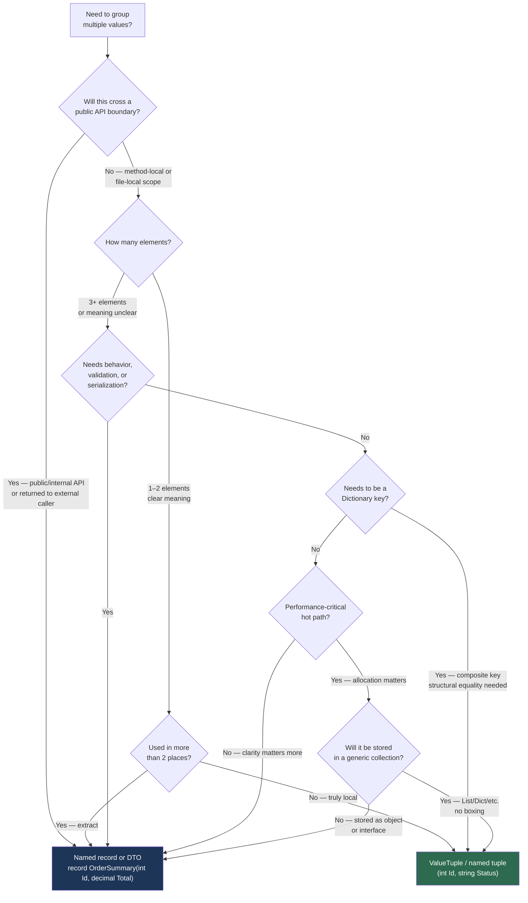

> [!success] Mastery Check
> - [ ] **Studied Well**
> - [ ] **Can explain the concept without notes**
> - [ ] **Can answer interview questions confidently**
> - [ ] **Can implement it in a real project**


## 📍 PART 0 — Navigation & Context

### Where This Topic Lives

```
C# Type System
└── Value Types
    ├── Primitives (int, double, ...)
    ├── struct (user-defined)
    ├── enum
    ├── ► Tuples / ValueTuple  ← YOU ARE HERE
    └── Nullable<T>

C# Language Features
└── Destructuring
    ├── ► Deconstruct() protocol  ← YOU ARE HERE
    ├── Pattern Matching (2.20)
    └── Records with positional syntax (2.19)
```

### What You Need Before This

- **[[2.16 — Value Types vs Reference Types]]** — ValueTuple is a struct; understanding copy semantics explains why assignment creates independent copies, not aliases
- **[[2.17 — Generics]]** — ValueTuple`<T1,T2,...>` is a generic struct; type inference rules govern how named elements are resolved
- **[[2.03 — Data Types, Literals, and Type Conversions]]** — the underlying types of tuple elements must be understood to reason about assignments and conversions

### What This Unlocks After

- **[[2.20 — Pattern Matching]]** — tuple patterns in switch expressions are the primary use case for multi-value dispatch
- **[[2.24 — LINQ: Execution Model]]** — `Zip`, `GroupBy`, and `Select` frequently produce tuples; understanding them requires this topic
- **[[2.28 — Equality and Comparison]]** — structural equality for ValueTuple vs reference equality for the old `Tuple<T>` class

### Why This Matters at Scale

Returning multiple values from a method is one of the most common patterns in any codebase. The difference between `Tuple<T1,T2>` (a heap allocation every call) and `ValueTuple<T1,T2>` (zero allocation, stack-embedded) compounds across millions of calls in high-throughput services. Getting this right is table stakes for senior-level .NET work.

---

## 🧠 PART 1 — The Core Mental Model

### The Fundamental Rule

> **`ValueTuple` is a stack-allocated struct that groups values without allocating; the old `Tuple<T>` is a class that allocates on every use. Named elements are compiler sugar over positional fields — at runtime there is only `.Item1`, `.Item2`, etc.**

### The Plain-Language Analogy

Think of a `ValueTuple` like a **pocket with labeled compartments**. The pocket itself lives inside your jacket (the stack frame) — no separate trip to a storage locker (the heap) is needed. You can label each compartment ("orderId", "total") on the outside, but those labels are stitched in at the factory (compile time) — at runtime the pocket itself only knows "compartment 1", "compartment 2". The labels exist only on the sewing pattern (the compiled metadata), not on the fabric itself.

The old `Tuple<T1,T2>` is like a **courier package**: every time you want to group two values, you seal them in a box, give it to a delivery service (the heap allocator), and hand the recipient a tracking number (a pointer). The recipient must look up the box every time they want to see the contents. More overhead, more GC work, same logical result.

Deconstruction is the act of **unpacking the pocket's compartments into named variables** — the values are copied out, and each new variable owns its own copy.

### The Type Taxonomy

```mermaid
graph TD
    A["Grouping Multiple Values in C#"] --> B["ValueTuple\n(struct — zero allocation)"]
    A --> C["Tuple&lt;T1,T2,...&gt;\n(class — heap allocation)"]
    A --> D["Custom struct / record struct\n(explicit type declaration)"]
    A --> E["Anonymous types\n(compiler-generated class,\nLINQ-local only)"]

    B --> B1["ValueTuple&lt;T1&gt; ... ValueTuple&lt;T1..T8&gt;\nplus nesting for &gt;8 elements"]
    B --> B2["Named elements\n(compiler metadata,\nIL has only .Item1/.Item2)"]
    B --> B3["Structural equality\nVT1 == VT2 iff all fields equal"]
    B --> B4["Deconstruction\nvar (x, y) = tuple"]

    C --> C1["System.Tuple.Create() factory\nItem1, Item2, ... properties"]
    C --> C2["Reference equality by default\nRequires explicit value comparison"]
    C --> C3["Immutable (readonly properties)\nCannot reassign fields"]

    D --> D1["Full IDE support\nXML docs, methods, operators"]
    D --> D2["Deconstruct() method\nenables var (x,y) = myObj"]

    E --> E1["new { Name = x, Age = y }\nInferred, structural equality in same scope"]
    E --> E2["Cannot be returned from methods\nCannot cross scope boundaries"]

    style B fill:#2d6a4f,color:#fff
    style C fill:#8b0000,color:#fff
    style D fill:#1d3557,color:#fff
    style E fill:#555,color:#fff
    style B1 fill:#40916c,color:#fff
    style B2 fill:#40916c,color:#fff
    style B3 fill:#40916c,color:#fff
    style B4 fill:#40916c,color:#fff
    style C1 fill:#a94442,color:#fff
    style C2 fill:#a94442,color:#fff
    style C3 fill:#a94442,color:#fff
    style D1 fill:#457b9d,color:#fff
    style D2 fill:#457b9d,color:#fff
    style E1 fill:#777,color:#fff
    style E2 fill:#777,color:#fff
```



> [!WARNING] The Named-Element Illusion `(string Name, int Age)` is **not a distinct type**. It is `ValueTuple<string, int>` with compiler-attached element names in metadata. A method returning `(string Name, int Age)` and a method returning `(string FirstName, int YearsOld)` return **the same IL type**. You can assign one to the other. The names do not exist at runtime.

---

## 🔬 PART 2 — Deep Mechanics

### 2.1 Memory Layout: ValueTuple vs Tuple

```
━━━━━━━━━━━━━━━━━━━━━━━━━━━━━━━━━━━━━━━━━━━━━━━━━━━━━━━━━━━━━━━
SCENARIO: Returning (int OrderId, decimal Total) from a method
━━━━━━━━━━━━━━━━━━━━━━━━━━━━━━━━━━━━━━━━━━━━━━━━━━━━━━━━━━━━━━━

─── ValueTuple<int, decimal> (what modern C# uses) ───

STACK FRAME of calling method:
┌──────────────────────────────────────────┐
│  ValueTuple<int,decimal> result:         │
│  ┌──────────────────────────────────┐    │
│  │  Item1 (int):    4 bytes         │    │
│  │  Item2 (decimal): 16 bytes       │    │
│  └──────────────────────────────────┘    │
│  Total: 20 bytes, INLINE on the stack    │
└──────────────────────────────────────────┘

No heap allocation. No GC involvement.
Copy of the struct is returned by value.
Runtime cost: ~same as returning two separate int/decimal parameters.

─── Tuple<int, decimal> (legacy System.Tuple) ───

STACK FRAME of calling method:
┌──────────────────────────────────────────┐
│  Tuple<int,decimal> result:              │
│  [8-byte pointer] ──────────────────────►│  HEAP:
└──────────────────────────────────────────┘  ┌─────────────────────────────┐
                                               │ ObjHeader   (8 bytes)       │
                                               │ MethodTable (8 bytes)       │
                                               │ m_Item1: int    (4 bytes)   │
                                               │ m_Item2: decimal(16 bytes)  │
                                               └─────────────────────────────┘
                                               Total: ~36 bytes heap object
                                               + GC pressure every call
```

### 2.2 What the Compiler Actually Generates

```csharp
// What you write:
public (int OrderId, decimal Total) GetOrderSummary(int id)
    => (id, 99.99m);

// What the IL actually contains (decompiled pseudocode):
// Return type in IL: ValueTuple<int32, decimal>
// Element names 'OrderId' and 'Total' live in:
//   [TupleElementNames(new[] { "OrderId", "Total" })]
//   ...applied to the method return type in metadata.
//
// The body compiles to:
//   ldarg.1          // push id
//   ldc.r8 99.99     // push 99.99m
//   newobj ValueTuple<int32,decimal>::.ctor(int32, decimal)
//   ret

// Usage site:
var summary = GetOrderSummary(42);

// summary.OrderId → compiles to → summary.Item1  (no runtime name lookup)
// summary.Total   → compiles to → summary.Item2  (no runtime name lookup)

// Deconstruction:
var (orderId, total) = GetOrderSummary(42);
// Compiles to:
//   call GetOrderSummary(42)
//   stloc.0   // store ValueTuple in temp local
//   ldloc.0
//   ldfld Item1 → store into orderId local
//   ldloc.0
//   ldfld Item2 → store into total local
// Cost: two field reads from a stack local. ~1-2 ns. Zero allocation.
```

### 2.3 The Deconstruct() Protocol — What Makes Deconstruction Work

Deconstruction is NOT magic specific to tuples. It is a general protocol: any type with a `Deconstruct` method participates.

```csharp
// The protocol: any public void Deconstruct(out T1 a, out T2 b, ...) method
// enables the var (x, y) = obj; syntax.

// HOW ValueTuple does it (the struct has built-in Deconstruct):
public struct ValueTuple<T1, T2>
{
    public T1 Item1;
    public T2 Item2;

    // This method is what enables deconstruction
    public void Deconstruct(out T1 item1, out T2 item2)
    {
        item1 = Item1;
        item2 = Item2;
    }
}

// HOW you add it to your own types (instance method):
public class OrderLineItem
{
    public string Sku      { get; init; }
    public int    Quantity { get; init; }
    public decimal Price   { get; init; }

    // Enables: var (sku, qty, price) = lineItem;
    public void Deconstruct(out string sku, out int quantity, out decimal price)
    {
        sku      = Sku;
        quantity = Quantity;
        price    = Price;
    }
}

// HOW you add it to types you don't own (extension method):
public static class KeyValuePairExtensions
{
    // Enables: var (key, value) = myDictEntry;
    public static void Deconstruct<TKey, TValue>(
        this KeyValuePair<TKey, TValue> pair,
        out TKey key,
        out TValue value)
    {
        key   = pair.Key;
        value = pair.Value;
    }
}

// Usage — all three forms, all zero heap allocation:
var (sku, qty, price) = lineItem;

foreach (var (key, value) in myDictionary)
    Console.WriteLine($"{key}: {value}");
```

> [!TIP] Multiple Deconstruct Overloads A type can have multiple `Deconstruct` overloads with different arities. The compiler picks based on how many variables you declare: `var (a, b) = x` calls the 2-arg overload; `var (a, b, c) = x` calls the 3-arg overload.

### 2.4 Structural Equality and the GetHashCode Contract

```csharp
// ValueTuple implements structural (value) equality.
// Two tuples are equal if all corresponding elements are equal.

var t1 = (OrderId: 1, Status: "Pending");
var t2 = (OrderId: 1, Status: "Pending");

Console.WriteLine(t1 == t2);      // True — structural comparison
Console.WriteLine(t1.Equals(t2)); // True

// HOWEVER: the element names are IGNORED for equality!
var t3 = (Id: 1, State: "Pending");
Console.WriteLine(t1 == t3);  // True — same underlying types and values
                               // Names are compile-time only

// The GetHashCode contract is upheld:
// t1 == t2 implies t1.GetHashCode() == t2.GetHashCode()
// This means ValueTuple is safe to use as a Dictionary key.

var cache = new Dictionary<(int CustomerId, string ProductCode), decimal>();
cache[(42, "SKU-001")] = 19.99m;
bool found = cache.TryGetValue((42, "SKU-001"), out var price); // True, works correctly

// Cost of ValueTuple equality: ~same as comparing the underlying fields directly.
// No boxing. No virtual dispatch. JIT inlines the comparison.
```

### 2.5 Tuples with More Than 8 Elements — The Nesting Trick

```csharp
// ValueTuple supports T1..T8. For more, the 8th element is itself a ValueTuple.
// This is called the "rest" element.

// What you write:
(int A, int B, int C, int D, int E, int F, int G, int H, int I) nineElement
    = (1, 2, 3, 4, 5, 6, 7, 8, 9);

// What the compiler generates (approximately):
// ValueTuple<int,int,int,int,int,int,int, ValueTuple<int,int>>
//                                          ↑ the 8th "Item8" is a nested tuple

// Accessing the 9th element:
int i = nineElement.I;       // compiler sugar
// Under the hood: nineElement.Rest.Item1

// ⚠️ In practice: if you need 9+ fields in a tuple,
// you should almost certainly define a named struct or record instead.
// Tuples are for lightweight, local grouping — not complex domain objects.
```

### 2.6 The `ref` and `var` Patterns in Deconstruction

```csharp
// You can mix and match: declare some, reuse existing variables

int existingId = 0;
string status;

// Reuse existingId (already declared), declare status fresh:
(existingId, status) = GetOrderStatus(); // Assigns to existing locals

// Discard what you don't need with underscore:
var (orderId, _, _) = GetThreePartResult(); // Only capture the first value
                                             // _ is NOT a variable — zero overhead

// Nested deconstruction (C# 8+):
var ((x, y), radius) = GetCircle(); // If GetCircle returns ((double,double), double)

// ref deconstruction — NOT supported. Deconstruct always copies.
// If you need ref access, use a struct ref field pattern instead.
```

---

## 💻 PART 3 — Production Code Patterns

### 3.1 The Method Return Without an Output Parameter

The most common use: returning multiple values without `out` parameters or a dedicated type.

```csharp
// ⚠️ WRONG: out parameters are painful to call and chain
public static bool TryProcessPayment(
    string cardToken, decimal amount,
    out string transactionId, out string errorMessage)
{
    // Callers must declare variables before the call — ugly
    transactionId = null; errorMessage = null;
    // ...
    return true;
}

// Usage:
string txId, errMsg;
if (TryProcessPayment(token, amount, out txId, out errMsg))
    ApplyTransaction(txId);

// ✅ CORRECT: Named tuple return — clean, readable, no ceremony
public static (bool Success, string TransactionId, string ErrorMessage)
    TryProcessPayment(string cardToken, decimal amount)
{
    if (string.IsNullOrWhiteSpace(cardToken))
        return (false, null, "Card token is required");

    // ...payment gateway call...
    string txId = Guid.NewGuid().ToString("N");
    return (true, txId, null);
}

// Calling code — reads like prose:
var (success, transactionId, errorMessage) = TryProcessPayment(token, amount);
if (!success)
{
    _logger.LogWarning("Payment failed: {Error}", errorMessage);
    return;
}
ApplyTransaction(transactionId);
```

### 3.2 The Composite Dictionary Key

Using a tuple as a dictionary key avoids creating a dedicated key struct when the combination is only needed locally.

```csharp
// ⚠️ WRONG: Concatenating strings as a composite key — allocation,
// ambiguity (what if a value contains the separator?), slow hashing
var cache = new Dictionary<string, decimal>();
cache[$"{warehouseId}:{productSku}"] = quantity; // string allocation per lookup

// ✅ CORRECT: ValueTuple as composite key — zero boxing, structural GetHashCode,
// compiler enforces types on both dimensions
// Cost: ValueTuple.GetHashCode() combines element hashes — ~O(1), no allocation

var inventoryCache = new Dictionary<(int WarehouseId, string ProductSku), decimal>(
    capacity: 10_000); // pre-size to avoid rehashing in catalog-loading scenarios

// Writing:
inventoryCache[(warehouseId, sku)] = qty;

// Reading — no string allocation, clean syntax:
if (inventoryCache.TryGetValue((warehouseId, sku), out decimal stock))
    return stock;

// ⚠️ CAVEAT: string element in key still calls string.GetHashCode(),
// which can be slow for very long strings. For hot paths with long strings,
// benchmark against a dedicated key struct with ordinal comparison.
```

### 3.3 The Tuple Switch Dispatch

Multi-dimensional dispatch without nested if-else chains. Common in state machines, command routing, and validation.

```csharp
// Scenario: order state machine — valid transitions depend on (currentState, requestedAction)

public enum OrderState  { Draft, Submitted, Approved, Shipped, Cancelled }
public enum OrderAction { Submit, Approve, Ship, Cancel }

// ⚠️ WRONG: Nested switch or if-else — O(n*m) branches, hard to maintain
public OrderState TransitionBad(OrderState state, OrderAction action)
{
    if (state == OrderState.Draft)
    {
        if (action == OrderAction.Submit) return OrderState.Submitted;
        if (action == OrderAction.Cancel) return OrderState.Cancelled;
        throw new InvalidOperationException("...");
    }
    // ... 3 more outer branches ...
    throw new InvalidOperationException("...");
}

// ✅ CORRECT: Tuple pattern switch — exhaustive, flat, readable, maintainable
// The compiler verifies all arms; adding a new State or Action forces you to handle it
public OrderState Transition(OrderState state, OrderAction action)
    => (state, action) switch
    {
        (OrderState.Draft,      OrderAction.Submit)  => OrderState.Submitted,
        (OrderState.Draft,      OrderAction.Cancel)  => OrderState.Cancelled,
        (OrderState.Submitted,  OrderAction.Approve) => OrderState.Approved,
        (OrderState.Submitted,  OrderAction.Cancel)  => OrderState.Cancelled,
        (OrderState.Approved,   OrderAction.Ship)    => OrderState.Shipped,
        (OrderState.Approved,   OrderAction.Cancel)  => OrderState.Cancelled,

        // Catch invalid transitions with a meaningful exception:
        _ => throw new InvalidOperationException(
                 $"Order cannot perform '{action}' when in state '{state}'.")
    };
```

### 3.4 Deconstruct on Domain Types for Pattern Matching

Adding `Deconstruct` to domain objects unlocks switch expressions without exposing raw properties to callers.

```csharp
// Scenario: shipment routing — decision depends on weight tier and destination region

public sealed class ShipmentRequest
{
    public string  DestinationCountry { get; init; }
    public decimal WeightKg           { get; init; }
    public bool    IsHazardous        { get; init; }

    // Deconstruct exposes only what routing needs — a focused projection
    // No need to access all properties; the caller gets exactly what the pattern needs
    public void Deconstruct(out string country, out decimal weight, out bool hazardous)
    {
        country  = DestinationCountry;
        weight   = WeightKg;
        hazardous = IsHazardous;
    }
}

public static string GetShippingMethod(ShipmentRequest request)
    => request switch
    {
        // Tuple pattern via Deconstruct: (country, weight, hazardous)
        var (_, _, true)           => "HazmatCarrier",     // hazardous always special
        var ("US", <= 0.5m, _)    => "USPS_FirstClass",
        var ("US", <= 31.5m, _)   => "UPS_Ground",
        var ("US", _, _)           => "FreightForwarder",
        var ("CA" or "MX", _, _)  => "NorthAmericaExpress",
        _                          => "InternationalCourier"
    };
```

### 3.5 The Variable Swap — Zero-Temp Pattern

A common interview demonstration of deconstruction.

```csharp
// ⚠️ Classic — requires a temporary variable
int a = 5, b = 10;
int temp = a;
a = b;
b = temp;

// ✅ Tuple deconstruction — no temp, single expression
// Compiler generates: evaluate right-hand side fully, THEN assign left-hand side
// There is no intermediate state where both a and b are the same value.
(a, b) = (b, a);

// Real production use — sorting two adjacent values (used in sorting networks):
void SortPair<T>(ref T left, ref T right) where T : IComparable<T>
{
    if (right.CompareTo(left) < 0)
        (left, right) = (right, left); // swap in-place, no temp allocation
}
```

### 3.6 Returning Tuples from LINQ Projections

```csharp
// Scenario: computing per-product revenue summary from order lines

public record OrderLine(string Sku, int Quantity, decimal UnitPrice);

public static IEnumerable<(string Sku, decimal Revenue, int UnitsSold)>
    GetProductSummaries(IEnumerable<OrderLine> lines)
    => lines
        .GroupBy(l => l.Sku)
        .Select(g => (
            Sku:       g.Key,
            Revenue:   g.Sum(l => l.Quantity * l.UnitPrice),
            UnitsSold: g.Sum(l => l.Quantity)
        ))
        .OrderByDescending(s => s.Revenue);

// Calling code — clean deconstruction in foreach:
foreach (var (sku, revenue, units) in GetProductSummaries(orderLines))
    Console.WriteLine($"{sku}: {revenue:C} ({units} units)");

// ⚠️ NOTE: The ValueTuples in the IEnumerable ARE boxed when the enumerator
// is iterated through a non-generic interface path (rare in practice).
// For hot paths projecting millions of items, benchmark to confirm.
// In most business code this is irrelevant.
```

### 3.7 When to Promote from Tuple to Named Type

This is the judgment call that separates senior engineers.

```csharp
// ⚠️ WRONG: Tuple used where a named type is clearly needed
// This leaks implementation detail, is unreadable at the call site,
// and cannot carry behavior (methods, operators, validation)
public (string, string, int, decimal, bool) GetCustomerProfile(Guid customerId)
    => ("John", "Doe", 42, 125_000m, true); // What does 'true' mean??

// ✅ CORRECT: Promote to a named record when:
//   • The return value is used in 3+ places
//   • The type needs to be serialized or stored
//   • The type needs validation at construction
//   • The type needs methods or operators
//   • 3+ elements make positional reading unclear

public record CustomerProfile(
    string     FirstName,
    string     LastName,
    int        Age,
    decimal    AnnualIncome,
    bool       IsVerified);      // 'IsVerified' is now self-documenting

// Rule of thumb:
//   1-2 values, used locally, clear meaning → tuple is fine
//   3+ values, OR public API, OR reused → named type
```

---

## ⚠️ PART 4 — Gotchas & Anti-Patterns

### Gotcha 1: Named Elements Are Not Real at Runtime

Engineers assume that two tuple types with different element names are distinct types. They are not.

```csharp
// ⚠️ WRONG mental model: "these are different types"
(string Name, int Age) person   = ("Alice", 30);
(string City, int Zip) location = ("Boston", 2101);

// ✅ CORRECT: Both are ValueTuple<string,int> — they are IDENTICAL types at runtime
// This compiles and runs without error:
person = location; // compiler allows it — same underlying type
                   // person.Name is now "Boston", person.Age is now 2101

// The names are just compiler metadata.
// You would catch this if you tried to assign different *element types*.
// But same-shaped tuples with different names silently interassign.
// WHY THIS BITES: refactoring a return type's element names doesn't break
// callers who use positional deconstruction — they silently get the wrong semantic.
```

### Gotcha 2: Tuples Are Value Types — Mutation on a Copy

Since `ValueTuple` is a struct, assigning one to another gives you an independent copy. Mutating through one doesn't affect the other.

```csharp
// ⚠️ ValueTuple fields are public and mutable — this is unusual for structs
// and creates copy-mutation bugs

var original = (Status: "Pending", RetryCount: 0);
var copy = original;          // copy is an INDEPENDENT copy of the struct

copy.RetryCount++;            // only modifies 'copy', NOT 'original'

Console.WriteLine(original.RetryCount); // 0 — unchanged
Console.WriteLine(copy.RetryCount);     // 1

// WHY IT BITES: engineers from class-heavy backgrounds expect reference semantics.
// This is especially tricky in foreach loops and method parameters.

void IncrementRetry((string Status, int RetryCount) item)
{
    item.RetryCount++;    // modifies a LOCAL COPY of the struct — caller unchanged
}
// ✅ Fix: return the modified tuple if you need the update to propagate
(string Status, int RetryCount) IncrementRetry((string Status, int RetryCount) item)
{
    return (item.Status, item.RetryCount + 1);
}
```

### Gotcha 3: Deconstruction with Existing Variables Can Shadow or Conflict

```csharp
int count = 10;

// ⚠️ This does NOT create a new 'count' — it ASSIGNS to the existing one
(string label, count) = GetLabelAndCount(); // assigns to outer 'count'

// This surprises engineers who expect all-or-nothing declaration.
// If you wanted a fresh local:
var (label2, count2) = GetLabelAndCount(); // both newly declared

// Also: this compiles but does something unexpected if count was readonly:
// const int count = 10;
// (string label, count) = GetLabelAndCount(); // COMPILE ERROR — cannot assign to const
// The error message is about assignment to a constant, not deconstruction,
// which confuses debugging.
```

### Gotcha 4: The `Tuple<T>` Legacy Type in Pre-C#7 Codebases

Many production codebases still have `Tuple<T1,T2>` from pre-C# 7. These are classes and behave completely differently.

```csharp
// ⚠️ WRONG: Old Tuple<T> looks similar but allocates on every return
// and has no name support — just Item1, Item2, ...
public Tuple<int, string> GetOrder_OldStyle()
    => Tuple.Create(42, "Pending"); // heap allocation every call

var order = GetOrder_OldStyle();
Console.WriteLine(order.Item1);  // no names, just Item1/Item2
Console.WriteLine(order.Item2);

// ✅ CORRECT: ValueTuple with names
public (int OrderId, string Status) GetOrder()
    => (42, "Pending"); // zero allocation

var (id, status) = GetOrder(); // clean names, no allocation

// Migrating: search your codebase for 'Tuple<' — every one is a heap allocation
// that can be replaced with a named tuple return or a value record.
```

### Gotcha 5: Tuple Element Names Are Stripped by Non-Named Paths

```csharp
// When you store a tuple in an object, IEnumerable, or pass through a generic
// that doesn't preserve the TupleElementNames attribute, the names disappear.

(int OrderId, string Status) GetOrder() => (1, "Pending");

object boxed = GetOrder();   // box to object — names are gone
// ((int, string))boxed).OrderId  → COMPILE ERROR
// ((int, string))boxed).Item1    → OK (but ugly)

// Similarly, returning through a non-annotated delegate type:
Func<(int, string)> getOrder = GetOrder;  // names NOT preserved in delegate type
var result = getOrder();
// result.OrderId → COMPILE ERROR — the delegate's return type has no names
// result.Item1   → OK

// WHY THIS BITES: Teams that store tuples in Func<> fields or generic
// containers lose the names and end up with Item1/Item2 sprinkled throughout.
// ✅ Fix: If names must survive generic boundaries, use a named record or struct.
```

---

## 📊 PART 5 — Performance Implications

### 5.1 Allocation Characteristics Table

|Scenario|Allocation Behavior|Approx Cost|
|---|---|---|
|`(int, string)` as local variable|Zero heap allocation — struct on stack|~0 ns|
|`(int, string)` as method return value|Zero allocation — struct returned by value|~1-3 ns (copy)|
|`(int, string)` stored in `List<(int,string)>`|One allocation for list backing array — no per-element allocation|O(1) amortized|
|`(int, string)` assigned to `object`|Boxing — one heap allocation (~24+ bytes)|~10-15 ns|
|`(int, string)` as `Dictionary<(int,string), T>` key|No boxing — ValueTuple is directly used as key via `IEquatable<T>`|O(1)|
|Old `Tuple<int, string>` as method return|One heap allocation every return (~40 bytes)|~40-60 ns|
|Deconstruction `var (a, b) = tuple`|Zero allocation — field reads from stack local|~1-2 ns|
|8-element tuple (no nesting)|Zero allocation — single stack-resident struct|~0 ns|
|9+-element tuple (nested REST)|Zero allocation — nested struct still on stack|~0 ns|
|Tuple in `IEnumerable<>` iteration|No boxing via generic path — inline struct iteration|~0 ns per element|
|Named tuple element access (`.Name`)|Zero runtime cost — compiles to `.Item1` field access|~0 ns|
|`ValueTuple.Equals` in `Dictionary` lookup|Structural equality — field-by-field compare, inlineable|~2-5 ns|

### 5.2 BenchmarkDotNet: ValueTuple vs Tuple vs Named Record

```csharp
[MemoryDiagnoser]
[BenchmarkCategory("Tuples")]
public class TupleAllocationBenchmark
{
    private const int N = 100_000;

    // ─── Method returns ───

    [Benchmark(Baseline = true)]
    public decimal OldTupleReturn()
    {
        decimal sum = 0;
        for (int i = 0; i < N; i++)
        {
            var t = GetOrderOld(i);   // heap allocation every iteration
            sum += t.Item2;
        }
        return sum;
    }

    [Benchmark]
    public decimal ValueTupleReturn()
    {
        decimal sum = 0;
        for (int i = 0; i < N; i++)
        {
            var (_, total) = GetOrder(i); // zero allocation
            sum += total;
        }
        return sum;
    }

    [Benchmark]
    public decimal RecordReturn()
    {
        decimal sum = 0;
        for (int i = 0; i < N; i++)
        {
            var r = GetOrderRecord(i); // heap allocation (record is a class)
            sum += r.Total;
        }
        return sum;
    }

    // ─── Composite key dictionary lookup ───

    private Dictionary<(int, string), decimal> _tupleKeyDict
        = new(1000);
    private Dictionary<string, decimal> _stringKeyDict
        = new(1000);

    [GlobalSetup]
    public void Setup()
    {
        for (int i = 0; i < 1000; i++)
        {
            _tupleKeyDict[(i, $"SKU-{i:000}")] = i * 9.99m;
            _stringKeyDict[$"{i}:SKU-{i:000}"] = i * 9.99m;
        }
    }

    [Benchmark]
    public decimal TupleKeyLookup()
    {
        decimal sum = 0;
        for (int i = 0; i < N; i++)
        {
            _tupleKeyDict.TryGetValue((i % 1000, $"SKU-{i%1000:000}"), out var v);
            sum += v;
        }
        return sum;
    }

    [Benchmark]
    public decimal StringKeyLookup()
    {
        decimal sum = 0;
        for (int i = 0; i < N; i++)
        {
            _stringKeyDict.TryGetValue($"{i%1000}:SKU-{i%1000:000}", out var v);
            sum += v;
        }
        return sum;
    }

    // ─── Helper methods ───
    private Tuple<int, decimal> GetOrderOld(int id) => Tuple.Create(id, id * 9.99m);
    private (int Id, decimal Total) GetOrder(int id)   => (id, id * 9.99m);
    private record OrderRecord(int Id, decimal Total);
    private OrderRecord GetOrderRecord(int id) => new(id, id * 9.99m);
}

// Expected output (approximate, .NET 8, x64):
// ┌──────────────────────┬────────────┬────────────┬──────────┬──────────┐
// │ Method               │ Mean       │ Ratio      │ Alloc    │ Gen 0    │
// ├──────────────────────┼────────────┼────────────┼──────────┼──────────┤
// │ OldTupleReturn       │ 4,820 μs   │ 1.00       │ 2.29 MB  │ high     │
// │ ValueTupleReturn     │   185 μs   │ 0.04       │ 0 B      │ -        │
// │ RecordReturn         │ 1,940 μs   │ 0.40       │ 1.53 MB  │ moderate │
// │ TupleKeyLookup       │ 4,100 μs   │ —          │ 5.72 MB  │ high     │ *string alloc in setup
// │ StringKeyLookup      │ 5,800 μs   │ —          │ 7.63 MB  │ very high│
// └──────────────────────┴────────────┴────────────┴──────────┴──────────┘
// * TupleKeyLookup string alloc is from the $"SKU-{...}" interpolation in the hot path.
//   For a fair comparison, use ReadOnlySpan-based key or pre-allocate strings.
```

### 5.3 When to Care / When to Ignore

**When this costs you:**

- Any hot path (payment processing, order ingestion, serialization) that uses `Tuple<T>` instead of `ValueTuple` is allocating per-call. At 10,000 RPS with a 5-field return tuple, that's 10,000+ heap allocations per second just for method returns — directly increasing Gen0 collection frequency and p99 latency.
- Using `object` or interface boxing to store ValueTuples in non-generic containers eliminates the zero-alloc benefit entirely and adds GC pressure.
- Composite dictionary keys using string concatenation instead of tuple keys add string allocations on every lookup AND every write.

**When this doesn't matter:**

- For one-off scripting, configuration-loading code, or code that runs once at startup — the allocation cost is irrelevant.
- For tuples that represent user-facing API responses — allocate a proper DTO/record instead; the serialization overhead dwarfs any tuple allocation savings.
- When the tuple has 3+ elements used in more than 2 places — at that point, a named record is clearer and the allocation cost of a heap object is negligible compared to the readability gain.

---

## 🎤 PART 6 — Interview Arsenal

### 6.1 The Question Bank

---

> **Q: "What is the difference between `Tuple<T1,T2>` and `ValueTuple<T1,T2>` in C#?"**

**Average answer:** "ValueTuple is a struct and Tuple is a class, so ValueTuple doesn't allocate on the heap."

**Why that's insufficient:** It names the mechanism but doesn't articulate the practical consequence or where names come from — both of which senior engineers are expected to understand.

**Great answer (speak this aloud):**

> "The core difference is allocation semantics. `Tuple<T1,T2>` is a class — every return creates a heap object and eventually GC pressure. `ValueTuple<T1,T2>` is a struct — it lives inline on the stack or embedded in whatever container holds it, so zero allocation per use. The second difference is named elements: when I write `(int OrderId, decimal Total)`, the compiler emits a `[TupleElementNames]` attribute in the method metadata, so the IDE shows me `.OrderId` and `.Total`, but at runtime the fields are just `.Item1` and `.Item2`. The names are compile-time only. That's why two differently-named tuples with the same element types are the same runtime type and silently assignable to each other — a subtle gotcha. In production I use ValueTuple everywhere and treat `Tuple<T>` as legacy code to migrate away from."

---

> **Q: "Explain how deconstruction works in C#. Is it specific to tuples?"**

**Average answer:** "You use `var (a, b) = someTuple;` to pull out the values."

**Why that's insufficient:** It only describes the syntax, not the protocol or its extensibility to any type.

**Great answer (speak this aloud):**

> "Deconstruction is a general protocol, not something special about tuples. The compiler looks for a `public void Deconstruct(out T1 a, out T2 b, ...)` method on the type — either an instance method or an extension method. For ValueTuple, that method is baked in. For my own types, I add it manually. For types I don't own — like `KeyValuePair<K,V>` — I can add it as an extension method. At the call site, `var (x, y) = obj` compiles to calling `Deconstruct(out var x, out var y)` — just a method call with out parameters. No magic, no boxing, no allocation. The compiler also lets you have multiple Deconstruct overloads with different arities, and it picks the right one based on how many variables you declare. I use this a lot in foreach over dictionaries — adding a `Deconstruct` extension on `KeyValuePair` lets me write `foreach (var (key, val) in dict)` cleanly."

---

> **Q: "When should you use a tuple instead of defining a dedicated type?"**

**Average answer:** "Tuples are good for returning multiple values from methods when you don't want to create a new class."

**Why that's insufficient:** This describes what tuples can do, not when they should be used — which is the judgment the question is probing.

**Great answer (speak this aloud):**

> "My rule of thumb has three gates. First: is this crossing a public or internal API boundary? If yes, define a named type — tuples on public APIs are a readability tax for every caller. Second: is the tuple used in three or more places? If yes, extract it — the type deserves a name. Third: does it need to carry behavior, validation, or be serialized? If yes, it's a domain concept and should be a record or struct. Tuples shine for two cases: lightweight intermediate projections inside a single method or file, and composite dictionary keys. For a LINQ Select projection that feeds into an immediate result, a tuple is cleaner than a temporary record. For a `Dictionary<(int WarehouseId, string Sku), decimal>` key, a tuple gives structural equality and GetHashCode for free. Beyond those cases, I reach for `record` — same positional syntax, same immutability, but with a name that documents intent."

---

> **Q: "What happens to tuple element names when a tuple is stored as `object` or in a generic container?"**

**Average answer:** Candidates often don't know.

**Great answer (speak this aloud):**

> "The names disappear. Element names are stored as a `[TupleElementNames]` attribute on the specific member — the method return, the field declaration, the local variable's inferred type. When a tuple gets boxed to `object`, or passed through a generic delegate whose return type wasn't declared with names, that attribute context is gone. You can still unbox and cast, but you get `.Item1` and `.Item2`, not named elements. This matters in practice when teams try to store named tuples in `Func<(int,string)>` fields or `object` properties — the names silently vanish at the call site. It's one of the reasons I don't use tuples beyond method-local or file-local scope."

---

> **Q: "Can you use a ValueTuple as a Dictionary key? Is it safe?"**

**Average answer:** "Yes, I think so."

**Great answer (speak this aloud):**

> "Yes, and it's safe and efficient. `ValueTuple` implements `IEquatable<ValueTuple<T1,...>>` and overrides `GetHashCode()` with structural semantics — two tuples with equal elements have equal hash codes, which is the required contract for a dictionary key. The comparison is done without boxing because `Dictionary<K,V>` is generic and calls `IEquatable<K>.Equals` directly. What I do need to be aware of is that element names are ignored for equality — `(Id: 1, Name: "Alice")` and `(X: 1, Y: "Alice")` are the same key as far as the dictionary is concerned. That's almost always what I want, but it means I can't use name differences to distinguish keys."

---

### 6.2 Trick Questions

> [!WARNING] These sound simple. They are not.

**"Is `(int, string)` the same type as `(int, string)`?"** Trap: candidates think they might differ because of contextual names. Answer: They are the **identical runtime type** — `ValueTuple<System.Int32, System.String>`. Both are the same type. Named elements are metadata annotations, not type differentiators.

**"What is the value of `default((int, string))`?"** Trap: candidates unsure whether structs can be defaulted. Answer: `(0, null)` — struct default zeros all fields, so the int is 0 and the string reference is null. This is always legal — you cannot prevent it — so code that depends on a tuple being non-null must guard explicitly.

**"If I return `(string Name, int Age)` from a method, can the caller access `.Name`?"** Trap: yes, but only if the variable is typed as `(string Name, int Age)`. If stored in `var` and the compiler infers the names from the method signature, names are accessible. If stored in `object` or a differently-named tuple type, they are not. The names follow the variable's declared type, not the value itself at runtime.

**"Are tuple fields mutable?"** Trap: unlike most structs you encounter, ValueTuple has **public mutable fields** (`Item1`, `Item2`, ...). You can write `t.Item1 = 42`. This is unusual and is why mutable tuples can cause aliasing confusion in code that passes them by value expecting immutability.

**"Does `foreach (var (key, value) in dictionary)` allocate?"** Trap: `Dictionary<K,V>` enumerator is a struct — zero allocation. The deconstruction of each `KeyValuePair<K,V>` is a stack-local `Deconstruct` call — zero allocation. The entire loop can be zero-allocation if the dictionary uses value-type keys and values. But if you use a LINQ `.Where()` before the foreach, that wraps the enumerator in a heap-allocated iterator object.

---

### 6.3 Red Flags to Avoid

- **"Tuples and ValueTuple are different names for the same thing"** — they are completely different types with opposite allocation behavior; conflating them signals fundamental misunderstanding.
- **"Element names are stored at runtime so they can be used for reflection"** — names are compile-time metadata only; they do not exist in the IL of the values themselves.
- **"ValueTuple is immutable like other structs"** — it is NOT; its fields are public and mutable, which is an unusual and important property.
- **"You should use tuples instead of classes whenever possible for performance"** — this is wrong; tuples are for lightweight local grouping, not a general class replacement strategy.
- **"Deconstruction only works with tuples"** — deconstruction is a general protocol based on the `Deconstruct()` method and works on any type.
- **"Named tuples create distinct types"** — they do not; two tuples with the same element types but different names are the same runtime type and silently assignable.
- **"Tuples can't be dictionary keys because they're structs"** — wrong; ValueTuple implements `IEquatable<T>` with structural equality, making it safe and efficient as a key.

---

## 🔀 PART 7 — Decision Framework



---

## ✅ PART 8 — Self-Check

### Conceptual Questions

Answer in writing. If you struggle with any, revisit the relevant section.

1. Two methods both return `(string, int)`. One names the elements `(Name, Age)`, the other `(City, Zip)`. Can you assign the return value of one to a variable declared to hold the other? Why or why not?
    
2. You have `var t = (Count: 0, Label: "start");` and you write `t.Count++;`. Does this compile? Does it modify `t`? What if `t` were declared as `(int Count, string Label) t`?
    
3. Explain the difference in allocation behavior between calling a method that returns `Tuple<int, decimal>` in a loop 100,000 times vs one that returns `(int, decimal)`.
    
4. You add a `Deconstruct(out int x, out int y)` extension method on `System.Drawing.Point`. Will `var (x, y) = new Point(3, 4);` work? What does the compiler see at that call site?
    
5. A colleague stores a named tuple in a `Func<(int Id, string Name)>` field and complains that `.Id` is not available when they call the delegate. Explain exactly what happened.
    
6. Why does `ValueTuple` have public mutable fields (`Item1`, `Item2`, ...) while most production structs are designed to be immutable? What problem does this create?
    
7. You use `(int WarehouseId, string Sku)` as a `Dictionary` key. Two entries have `WarehouseId = 1, Sku = "ABC-001"`. Are they the same key? What if one uses named elements `(W: 1, P: "ABC-001")` and the other uses `(WarehouseId: 1, Sku: "ABC-001")`?
    
8. Explain why the following compiles but doesn't do what the developer expects:
    
    ```csharp
    var result = (Count: 0, Label: "initial");
    Mutate(result);
    Console.WriteLine(result.Count); // What is printed?
    
    void Mutate((int Count, string Label) t) { t.Count = 99; }
    ```
    
9. What is `default((int, string, bool))`? Can you ever guarantee a tuple returned from a method is non-default?
    
10. In LINQ, `Zip` produces `(TFirst, TSecond)` pairs. Are those pairs boxed when you `foreach` over the result? Explain why or why not.
    

---

### Code Puzzles

**Puzzle 1:** What is printed?

```csharp
(string Name, int Age) p1 = ("Alice", 30);
(string City, int Zip) p2 = ("Boston", 2101);

p1 = p2; // Does this compile?
Console.WriteLine(p1.Name);
Console.WriteLine(p1.Age);
```

<details> <summary>Answer (expand after trying)</summary>

**Compiles and runs.** `(string, int)` and `(string, int)` are the same runtime type regardless of names. After assignment:

- `p1.Name` → "Boston" (because `.Name` is `.Item1`, which is now "Boston")
- `p1.Age` → 2101 (because `.Age` is `.Item2`, which is now 2101)

This is the named-element illusion gotcha. The compiler reassigns compatible ValueTuples silently.

</details>

---

**Puzzle 2:** Does this allocate on the heap? How many times?

```csharp
static (int OrderId, decimal Total) GetSummary(int id) => (id, id * 9.99m);

for (int i = 0; i < 10_000; i++)
{
    var (orderId, total) = GetSummary(i);
    Console.WriteLine(total); // ignore the string alloc from Console
}
```

<details> <summary>Answer (expand after trying)</summary>

**Zero heap allocations from the tuple itself.** `GetSummary` returns a `ValueTuple<int, decimal>` by value — a struct. The deconstruction reads two fields from a stack local. No boxing, no heap object.

`Console.WriteLine(total)` where `total` is `decimal` DOES box — decimal implements no ISpanFormattable path in the default overload. So there are 10,000 allocations, but all from the `Console.WriteLine` call, not from the tuple. In a real hot path you would use `total.TryFormat(buffer, ...)` to avoid this.

</details>

---

**Puzzle 3:** What is the bug?

```csharp
public static class OrderExtensions
{
    public static decimal GetRevenue(this (int Qty, decimal Price) line)
        => line.Qty * line.Price;

    public static void ApplyDiscount(this (int Qty, decimal Price) line, decimal pct)
        => line.Price *= (1 - pct); // apply 10% discount
}

var line = (Qty: 100, Price: 50m);
line.ApplyDiscount(0.10m);
Console.WriteLine(line.Price); // What is printed?
```

<details> <summary>Answer (expand after trying)</summary>

**50 is printed. The discount had no effect on `line`.**

`ApplyDiscount` takes the tuple by value (a copy). `line.Price *= ...` modifies the local copy inside the extension method. The caller's `line` is unchanged. This is the mutable struct copy-trap: because tuples have public mutable fields, you can mutate them — but mutation of a by-value parameter never escapes to the caller.

Fix: Change the extension to accept `ref (int Qty, decimal Price) line` and return the modified tuple, or return a new tuple instead.

</details>

---

**Puzzle 4:** What is printed?

```csharp
var lookup = new Dictionary<(int, string), decimal>
{
    [(1, "USD")] = 100m,
    [(1, "EUR")] = 89m,
};

var key1 = (Id: 1, Currency: "USD");
var key2 = (X: 1, Y: "USD");

Console.WriteLine(lookup.ContainsKey(key1)); // ?
Console.WriteLine(lookup.ContainsKey(key2)); // ?
Console.WriteLine(key1 == key2);             // ?
```

<details> <summary>Answer (expand after trying)</summary>

All three print `True`.

`key1` and `key2` are both `ValueTuple<int, string>` with `Item1 = 1` and `Item2 = "USD"`. Element names are irrelevant for equality and hash code. The dictionary lookup is structural — same hash, same elements, same key. `key1 == key2` is structural comparison, also `True`.

</details>

---

**Puzzle 5:** Where is the bug? What is printed?

```csharp
var results = new List<(int Id, string Status)>
{
    (1, "Pending"),
    (2, "Approved"),
    (3, "Pending"),
};

foreach (var item in results)
{
    if (item.Status == "Pending")
        item = (item.Id, "Processed"); // intending to update the list
}

foreach (var (id, status) in results)
    Console.WriteLine($"{id}: {status}");
```

<details> <summary>Answer (expand after trying)</summary>

**This does not compile.** `item` in a `foreach` is implicitly `readonly` — you cannot assign to a foreach iteration variable. The compiler error is: "Cannot assign to 'item' because it is a 'foreach iteration variable'."

Even if you tried to mutate the fields directly (`item.Status = "Processed"`), that too would fail because the foreach variable is readonly.

**Fix:** Use a `for` loop with index:

```csharp
for (int i = 0; i < results.Count; i++)
    if (results[i].Status == "Pending")
        results[i] = (results[i].Id, "Processed");
```

This is the value-type-in-collection mutation gotcha: you must replace the whole element, not mutate a field on a copy.

</details>

---

## 🔗 PART 9 — Connections & Resources

### Related Topics in This Vault

|Topic|Why It Connects|
|---|---|
|[[2.16 — Value Types vs Reference Types]]|ValueTuple is a struct — copy semantics, stack embedding, and the mutable-field mutation gotcha all flow from value-type mechanics|
|[[2.17 — Generics]]|ValueTuple`<T1,T2,...>` is a generic struct; type inference drives named-element resolution; the `unmanaged` constraint can apply to all-primitive tuples|
|[[2.20 — Pattern Matching]]|Tuple patterns `(state, action) switch { ... }` are the primary multi-dimensional dispatch pattern in production C#|
|[[2.19 — Records]]|Records with positional syntax use the same deconstruction protocol and serve as the "promote from tuple" target for complex types|
|[[2.24 — LINQ: Execution Model]]|`Zip`, `GroupBy`, and projecting `Select` produce tuples; understanding deferred execution with value-type iterators requires both topics|
|[[2.28 — Equality and Comparison]]|ValueTuple's structural equality and GetHashCode behavior make it safe as a dictionary key; this topic explains the contract|
|[[2.34 — Collections: Internals and Selection Guide]]|`List<(int,string)>` stores tuples inline in the backing array — no per-element heap allocation; this is a key performance advantage over `List<Tuple<int,string>>`|
|[[2.38 — Spans, Memory, and Zero-Copy Patterns]]|`MemoryMarshal.Read<ValueTuple<int,int>>()` for zero-copy binary parsing of paired data requires understanding both topics|

### Books

|Book|Chapters|Why These Chapters|
|---|---|---|
|C# in Depth — Jon Skeet (4th ed.)|Ch. 11 (Tuples), Ch. 12 (Deconstruction, Pattern Matching)|Authoritative coverage of both the language design decisions and the compiler-lowering details for tuples and deconstruction|
|CLR via C# — Jeffrey Richter (4th ed.)|Ch. 4-5 (Value Types and their runtime behavior)|ValueTuple performance characteristics require understanding value-type layout and copy semantics at the CLR level|
|Pro .NET Memory Management — Konrad Kokosa|Ch. 3 (Stack vs Heap allocation)|The allocation difference between ValueTuple and Tuple is only meaningful with a concrete model of stack and heap lifetime|

### Essential Articles & Docs

- [Microsoft Docs: Tuple types (C# reference)](https://learn.microsoft.com/en-us/dotnet/csharp/language-reference/builtin-types/value-tuples) — official spec for ValueTuple syntax, semantics, and naming behavior
- [Microsoft Docs: Deconstructing tuples and other types](https://learn.microsoft.com/en-us/dotnet/csharp/fundamentals/functional/deconstruct) — complete coverage of the Deconstruct protocol, extension methods, and discards
- [Mads Torgersen: C# 7 design notes — Tuples](https://github.com/dotnet/roslyn/blob/main/docs/features/tuples.md) — the original design document explaining the compiler encoding of names and the ValueTuple choice
- [Stephen Toub: Why ValueTuple instead of Tuple](https://devblogs.microsoft.com/dotnet/whats-new-in-csharp-7-0/#value-tuples) — the .NET team's rationale for the struct-based approach and allocation implications
- [Adam Sitnik: Value Types and Performance](https://adamsitnik.com/Value-Types-vs-Reference-Types/) — benchmark evidence for struct-based collection layouts that covers tuple performance

---

> [!NOTE] Template Meta-Note **This note follows the standard 9-part C# Language Mastery template. Here is what each part is for:**
> 
> - **Part 0: Navigation** — orient yourself before reading; prerequisites and what this topic unlocks
> - **Part 1: Core Mental Model** — the one sentence you must be able to say, the analogy, and the full taxonomy diagram
> - **Part 2: Deep Mechanics** — what the runtime and compiler are actually doing; memory diagrams, IL transforms, edge cases with cost labels
> - **Part 3: Production Code** — 5-7 annotated, opinionated patterns from real enterprise domains; anti-pattern + correct version for each
> - **Part 4: Gotchas** — 5 bugs that appear in experienced engineers' code, with wrong→right→why
> - **Part 5: Performance** — allocation table, runnable BenchmarkDotNet class, when to care vs when to ignore
> - **Part 6: Interview Arsenal** — full Q&A with great answers written to be spoken aloud, trick questions, and red flags
> - **Part 7: Decision Framework** — a single flowchart you can use in a live interview when asked "when do you use X vs Y"
> - **Part 8: Self-Check** — 8-10 reasoning questions and 4-5 code puzzles with collapsed answers
> - **Part 9: Connections** — wiki links with specific dependency explanations, books with chapter numbers, authoritative articles only
> 
> To generate the next note, open the topic index (`_phonebook.md`), pick the next queued topic, copy the master prompt (`_main.md`), fill in `TOPIC_ID`, `TOPIC_NAME`, and `RELATED_TOPICS`, and send.

---

_Last updated: 2026-06 · Domain: C# Language Mastery · Topic: 2.27 — Tuples, ValueTuple, and Deconstruction_
