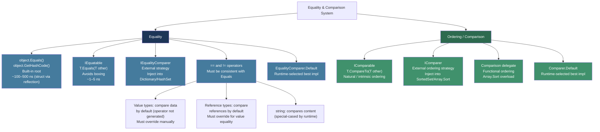
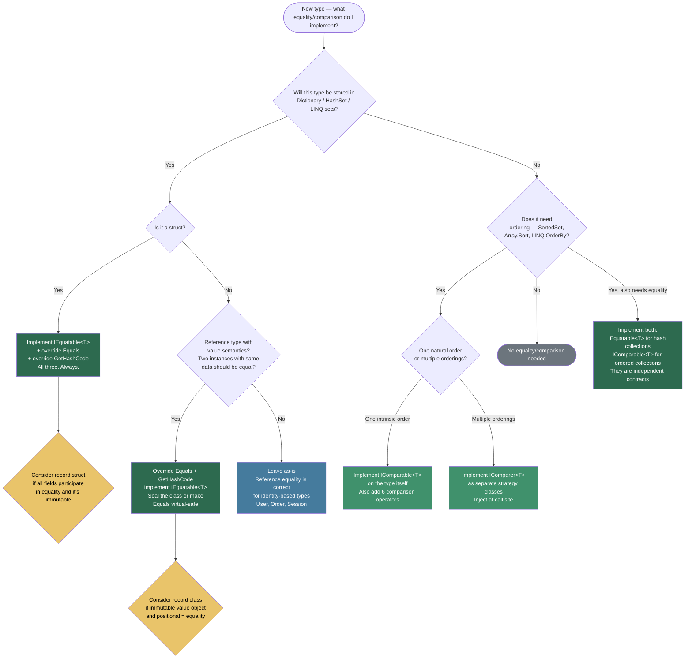

> [!success] Mastery Check
> - [ ] **Studied Well**
> - [ ] **Can explain the concept without notes**
> - [ ] **Can answer interview questions confidently**
> - [ ] **Can implement it in a real project**


## 📍 PART 0 — Navigation & Context

### Where This Topic Lives

```
C# Type System
└── Type Contracts
    ├── Equality & Identity
    │   ├── ► Equality and Comparison  ← YOU ARE HERE
    │   ├──   Records (2.19)           (auto-generates equality)
    │   └──   Operators (2.05)         (== / != overloading)
    ├── Memory Model
    │   └──   Value Types vs Reference Types (2.16)
    └── Collections
        └──   Collections: Internals and Selection Guide (2.34)
```

### What You Need Before This

- [[2.16 — Value Types vs Reference Types: Deep Mechanics]] — struct vs class equality behavior is rooted here
- [[2.05 — Operators: Complete Reference]] — `==` and `!=` are operators; overloading them requires this foundation
- [[2.12 — Enums and Structs: Fundamentals]] — structs have default equality behavior that is both slow and wrong

### What This Unlocks After

- [[2.34 — Collections: Internals and Selection Guide]] — `Dictionary<K,V>` and `HashSet<T>` correctness entirely depends on the `GetHashCode` contract
- [[2.19 — Records]] — records auto-generate the entire equality stack; understanding what they generate requires this topic
- [[2.33 — Generics: Variance, Generic Math, and Advanced Patterns]] — `IComparisonOperators<T,T,bool>` builds on `IComparable<T>`

### Why This Topic Matters in Production

Breaking the `GetHashCode` contract turns your `Dictionary` into a silent data black hole: items get inserted but can never be retrieved, no exception is thrown, and the bug only surfaces under load when a key that was stored returns `false` from `TryGetValue`.

---

## 🧠 PART 1 — The Core Mental Model

### The Fundamental Rule

> **Equality in .NET is a contract, not a single method. The ironclad rule: if `Equals(x, y)` is `true`, then `GetHashCode(x) == GetHashCode(y)` must also be `true`. Violating this silently corrupts any hash-based collection that stores your type.**

### The Plain-Language Analogy

Think of `GetHashCode` as a **postal routing code** and `Equals` as a **full address check**. When a delivery (lookup) arrives at a `Dictionary`, the postal code routes it to the correct neighborhood (bucket). Only once in the right neighborhood does the carrier check the full address (`Equals`) to find the exact house.

Now imagine you repaint your house (mutate a field) but keep the same postal code. The routing still works — you're in the right bucket. But if you change your postal code without moving, the carrier delivers to the wrong neighborhood entirely and never even knocks on your door. That is a `GetHashCode` violation: items stored in the old bucket are unreachable after mutation, even though they exist in the dictionary.

The implication: **types used as dictionary keys must be immutable**, or at minimum, the fields that participate in `GetHashCode` must not change while the key is in a collection.

### The Equality & Comparison Taxonomy



> [!NOTE] The Four Interfaces — When to Implement Each
> 
> - **`IEquatable<T>`** — implement on any type you'll store in a `HashSet<T>` or use as a `Dictionary<K,V>` key
> - **`IEqualityComparer<T>`** — implement when you need _alternate_ equality (case-insensitive, by one field only, etc.)
> - **`IComparable<T>`** — implement when the type has a natural, intrinsic ordering (dates, amounts, priorities)
> - **`IComparer<T>`** — implement when you need _alternate_ ordering (sort users by last name vs first name)

---

## 🔬 PART 2 — Deep Mechanics

### 2.1 The GetHashCode Contract and What Breaking It Costs

The `GetHashCode`/`Equals` relationship is the most dangerous contract in the C# type system because violations cause **silent data loss**, not exceptions.

```
HOW Dictionary<K,V> USES GetHashCode:

  dict.TryGetValue(key, out value)
  │
  ├─ Step 1: Compute bucket index
  │          bucket = Math.Abs(key.GetHashCode()) % _buckets.Length
  │          Cost: O(1) — one hash call
  │
  ├─ Step 2: Walk the bucket chain
  │          foreach entry in _buckets[bucket]:
  │              if entry.HashCode == hashCode && key.Equals(entry.Key)
  │                  return entry.Value   ← FOUND
  │          Cost: O(1) average, O(n) worst case (all keys in same bucket)
  │
  └─ Step 3: If bucket is empty or no Equals match → return false / default

WHAT HAPPENS WHEN GetHashCode IS INCONSISTENT WITH Equals:

  Before mutation:
    key.GetHashCode() = 1234 → stored in bucket 42
    dict["myKey"] = "someValue"     ← stored at bucket 42

  Mutation:
    key.SomeField = newValue        ← mutates the field used by GetHashCode

  After mutation:
    key.GetHashCode() = 9999 → would look in bucket 71
    dict.TryGetValue(key, ...)      ← looks in bucket 71, finds NOTHING
                                       "someValue" still exists in bucket 42
                                       but is now unreachable
                                       No exception. Silent data black hole.
```

**The five properties of a correct `Equals` implementation:**

```
1. Reflexive:    x.Equals(x)                    → always true
2. Symmetric:    x.Equals(y) == y.Equals(x)     → always
3. Transitive:   if x.Equals(y) && y.Equals(z)  → x.Equals(z)
4. Null-safe:    x.Equals(null)                 → always false (never throw)
5. Consistent:   x.Equals(y) same result        → as long as neither changes
```

### 2.2 Struct Default Equality — The Reflection Tax

When you do not override `Equals` and `GetHashCode` on a struct, you get `ValueType.Equals` — the base implementation inherited from `System.ValueType`. This uses **reflection** to enumerate all fields and compare them one by one.

```
COST BREAKDOWN — struct with 4 fields, 10,000 lookups in HashSet<T>:

Without IEquatable<T> implementation (ValueType.Equals path):
  • Each Equals call: ~300–500 ns (reflection overhead)
  • Each GetHashCode call: ~200–400 ns (reflection over all fields)
  • 10,000 lookups: ~5–9 ms total just for equality/hashing

With IEquatable<T> implementation (direct field comparison):
  • Each Equals call: ~1–3 ns
  • Each GetHashCode call: ~2–5 ns (HashCode.Combine)
  • 10,000 lookups: ~30–80 μs total

Performance ratio: ~100× slower without IEquatable<T>

ADDITIONALLY: ValueType.Equals boxes both operands when called via
the non-generic object.Equals path — two extra heap allocations per comparison.
```

The IL the compiler uses for `ValueType.Equals`:

```
// ValueType.Equals source (simplified):
// Compiler generates reflection-based field comparison approximately as:
public override bool Equals(object obj) {
    if (obj == null) return false;
    Type thisType  = this.GetType();    // ← one virtual call
    Type otherType = obj.GetType();     // ← one virtual call
    if (thisType != otherType) return false;

    // Enumerate all fields via FieldInfo[]
    FieldInfo[] fields = thisType.GetFields(
        BindingFlags.Instance | BindingFlags.Public | BindingFlags.NonPublic);
    foreach (var field in fields)       // ← reflection per field
    {
        object thisVal  = field.GetValue(this);   // ← boxing
        object otherVal = field.GetValue(obj);    // ← boxing
        if (!object.Equals(thisVal, otherVal)) return false;
    }
    return true;
}
// Total cost: multiple reflective calls + boxing per field. ~100–500 ns.
```

### 2.3 Reference Type Default Equality — Identity Semantics

For classes, the default `object.Equals` compares **object identity** — are these the same instance in memory? This is correct for types with identity (a `User` is a specific person), but wrong for types with value semantics (two `OrderLine` objects with the same SKU and quantity should be equal).

```
MEMORY PICTURE — Reference equality:

Stack:              Heap:
  a ──────────────► [OrderLine object @ 0x1000: SKU="ABC", Qty=5]
  b ──────────────► [OrderLine object @ 0x2000: SKU="ABC", Qty=5]
  c = a ──────────► [OrderLine object @ 0x1000: SKU="ABC", Qty=5]

object.ReferenceEquals(a, b) → FALSE  (different addresses)
object.ReferenceEquals(a, c) → TRUE   (same address)
a.Equals(b)                  → FALSE  (default: reference comparison)

// After overriding Equals for value semantics:
a.Equals(b)                  → TRUE   (same SKU and Qty)
```

**The rule for reference types:** Override `Equals` and `GetHashCode` when **two instances with the same data should be considered equal** — i.e., the type has value semantics despite being a reference type. Examples: `OrderLine`, `Money` (if a class), `ProductCode`, DTO records.

### 2.4 HashCode.Combine vs Manual XOR — Quality of Distribution

Hash quality directly impacts dictionary performance. A poor hash function clusters keys into the same bucket, turning O(1) lookup into O(n) linear scan.

```csharp
// WHY manual XOR is bad:
// x ^ y ^ z is commutative: Hash(1, 2, 3) == Hash(3, 2, 1) == Hash(2, 1, 3)
// This causes massive collisions for any type used in unordered contexts.

// Example: OrderKey with CustomerId + ProductId
// All of these would hash identically with XOR:
//   new OrderKey(1, 2, 3) ^ new OrderKey(3, 2, 1) → same bucket
//   new OrderKey(5, 5, 5) → all fields same value → XOR = 5 → predictable

// ✅ HashCode.Combine uses System.Numerics mixing — non-commutative, avalanche effect
int hash = HashCode.Combine(field1, field2, field3);
// Internally uses multiply-rotate-XOR mixing:
// h = h * 0x9e3779b9 + h>>4 ^ fieldHash
// Each field fully mixes into all bits of the result.

// For > 8 fields, use the builder pattern:
var hc = new HashCode();
hc.Add(field1);
hc.Add(field2);
// ... up to any number of fields
hc.Add(fieldN);
int hash = hc.ToHashCode();
```

**Distribution comparison (conceptual):**

```
XOR hash of (int, int):        HashCode.Combine of (int, int):
  Pairs that collide:            Near-zero collisions for
  (1,1), (2,2), (3,3) → all 0   distinct pairs in typical data
  (1,2) == (2,1)                 (1,2) ≠ (2,1) — order matters
  Clustering: severe             Clustering: minimal
  Bucket utilization: poor       Bucket utilization: ~uniform
```

### 2.5 IComparable<T> vs IComparer<T> — Intrinsic vs External

```
IComparable<T>:                    IComparer<T>:
  • Part of the TYPE itself          • Separate object / external
  • "I know my natural order"        • "I define an order for this type"
  • Used by Array.Sort(T[])          • Used by Array.Sort(T[], IComparer<T>)
  •   SortedSet<T> (no comparer)     •   SortedSet<T>(comparer)
  •   List<T>.Sort()                 •   new Dictionary<K,V>(comparer)
  • ONE natural order per type       • MANY alternate orders possible

CompareTo return convention (critical — always get this right):
  Negative → this is LESS THAN other     (this < other)
  Zero     → this is EQUAL TO other      (this == other)
  Positive → this is GREATER THAN other  (this > other)

Memory aid: think of it as subtraction: this - other
  5.CompareTo(10) = negative  (5 - 10 < 0)   → 5 comes before 10
  10.CompareTo(5) = positive  (10 - 5 > 0)   → 10 comes after 5
```

> [!DANGER] The Subtraction Shortcut Bug Many developers implement `CompareTo` as `return this.Value - other.Value;` for integers. This overflows for large values (`int.MaxValue - int.MinValue` wraps negative). Always use `int.CompareTo(int)` or `Math.Sign(this.Value - other.Value)` for safety — or better, delegate to the field's own `CompareTo`.

---

## 💻 PART 3 — Production Code Patterns

### Pattern 1: The Complete Equality Stack for a Domain Value Object

The most important pattern: implementing all five components of equality correctly on a type that will live in collections.

```csharp
// Scenario: e-commerce order management — ProductCode as dictionary key

// ⚠️ WRONG: Missing IEquatable<T> — causes boxing and reflection in HashSet<ProductCode>
public class BadProductCode
{
    public string Prefix { get; }
    public int    Number { get; }
    // No Equals/GetHashCode override — uses reference equality
    // Two new BadProductCode("SKU", 42) instances will NEVER be equal
}

// ✅ CORRECT: Full equality contract
public sealed class ProductCode : IEquatable<ProductCode>
{
    // Sealed: important for Equals — derived types could break the symmetric contract
    public string Prefix { get; }
    public int    Number { get; }

    public ProductCode(string prefix, int number)
    {
        Prefix = prefix?.ToUpperInvariant()
                 ?? throw new ArgumentNullException(nameof(prefix));
        Number = number > 0
                 ? number
                 : throw new ArgumentOutOfRangeException(nameof(number));
    }

    // IEquatable<T>: the generic path — NO boxing, ~1 ns
    // This is what HashSet<ProductCode> / Dictionary<ProductCode, T> calls
    public bool Equals(ProductCode? other)
    {
        if (other is null) return false;
        if (ReferenceEquals(this, other)) return true; // fast path: same object
        return Prefix == other.Prefix && Number == other.Number;
    }

    // object.Equals: the non-generic path — for legacy code and LINQ
    // Delegates to the typed version: consistent, no duplication
    public override bool Equals(object? obj) => Equals(obj as ProductCode);

    // GetHashCode MUST be consistent with Equals.
    // Include EXACTLY the same fields as Equals — not more, not fewer.
    // HashCode.Combine: non-commutative, well-distributed, no overflow risk.
    public override int GetHashCode() => HashCode.Combine(Prefix, Number);

    // == and != operators: syntactic sugar, must match Equals
    // Null-safe: ProductCode? x = null; x == someCode must not throw
    public static bool operator ==(ProductCode? a, ProductCode? b)
        => a is null ? b is null : a.Equals(b);

    public static bool operator !=(ProductCode? a, ProductCode? b) => !(a == b);

    public override string ToString() => $"{Prefix}-{Number:D6}";
}

// Usage — all of these work correctly:
var code1 = new ProductCode("SKU", 42);
var code2 = new ProductCode("SKU", 42);
var code3 = new ProductCode("WIDGET", 42);

Console.WriteLine(code1 == code2);    // True  — value equality
Console.WriteLine(code1 == code3);    // False — different prefix

var prices = new Dictionary<ProductCode, decimal>
{
    [code1] = 9.99m
};
Console.WriteLine(prices[code2]);     // 9.99 — code2 finds code1's entry
```

### Pattern 2: The Struct Equality Contract — readonly struct with IEquatable<T>

```csharp
// Scenario: financial systems — GeoCoordinate used as cache key for pricing zones

// ⚠️ WRONG: Mutable struct used as dictionary key — GetHashCode changes after mutation
public struct BadCoordinate
{
    public double Lat, Lon;
    // No IEquatable<T> → reflection-based equality (~300 ns per comparison)
    // No GetHashCode override → XOR-based default (poor distribution)
    // Mutable → can change after being added to a dictionary (silent data loss)
}

// ✅ CORRECT: readonly struct with proper equality contract
public readonly struct GeoCoordinate : IEquatable<GeoCoordinate>, IComparable<GeoCoordinate>
{
    public double Latitude  { get; }
    public double Longitude { get; }

    public GeoCoordinate(double lat, double lon)
    {
        // Validate: coordinates out of range are programming errors, not user errors
        if (lat < -90  || lat > 90)  throw new ArgumentOutOfRangeException(nameof(lat));
        if (lon < -180 || lon > 180) throw new ArgumentOutOfRangeException(nameof(lon));
        Latitude  = lat;
        Longitude = lon;
    }

    public bool Equals(GeoCoordinate other)
        // Double equality: use a small epsilon for floating-point coordinates
        // OR use exact equality if these are derived from integer inputs
        => Math.Abs(Latitude  - other.Latitude)  < 1e-10
        && Math.Abs(Longitude - other.Longitude) < 1e-10;

    public override bool Equals(object? obj) => obj is GeoCoordinate c && Equals(c);

    // For floating-point fields: round to meaningful precision before hashing
    // This ensures coordinates that are "equal" within epsilon also hash equally
    public override int GetHashCode()
        => HashCode.Combine(Math.Round(Latitude, 8), Math.Round(Longitude, 8));

    // IComparable<T>: natural order = north-to-south, west-to-east
    public int CompareTo(GeoCoordinate other)
    {
        int latCmp = Latitude.CompareTo(other.Latitude);
        if (latCmp != 0) return latCmp;
        return Longitude.CompareTo(other.Longitude);
    }

    public static bool operator ==(GeoCoordinate a, GeoCoordinate b) => a.Equals(b);
    public static bool operator !=(GeoCoordinate a, GeoCoordinate b) => !a.Equals(b);
    public static bool operator  <(GeoCoordinate a, GeoCoordinate b) => a.CompareTo(b) < 0;
    public static bool operator  >(GeoCoordinate a, GeoCoordinate b) => a.CompareTo(b) > 0;
    public static bool operator <=(GeoCoordinate a, GeoCoordinate b) => a.CompareTo(b) <= 0;
    public static bool operator >=(GeoCoordinate a, GeoCoordinate b) => a.CompareTo(b) >= 0;
}
```

### Pattern 3: IEqualityComparer<T> — External Equality Strategy

Use when you need alternate equality semantics without modifying the type, or when you need to inject equality behavior into a collection.

```csharp
// Scenario: user management — look up users case-insensitively by username

public class UserAccount
{
    public string Username { get; init; } = "";
    public string Email    { get; init; } = "";
    public int    UserId   { get; init; }
    // Default equality: reference equality (correct for entity identity)
}

// External strategy: case-insensitive username equality
// Created once, reused across all lookups
public sealed class UsernameComparer : IEqualityComparer<UserAccount>
{
    public static readonly UsernameComparer Instance = new(); // singleton

    public bool Equals(UserAccount? x, UserAccount? y)
    {
        if (ReferenceEquals(x, y)) return true;
        if (x is null || y is null) return false;
        // Case-insensitive, culture-invariant: correct for usernames
        return string.Equals(x.Username, y.Username, StringComparison.OrdinalIgnoreCase);
    }

    public int GetHashCode(UserAccount obj)
    {
        if (obj is null) throw new ArgumentNullException(nameof(obj));
        // MUST hash with same normalization used in Equals
        // OrdinalIgnoreCase → ToUpperInvariant → hash
        return StringComparer.OrdinalIgnoreCase.GetHashCode(obj.Username);
    }
}

// Usage: inject the comparer at construction time
var userLookup = new Dictionary<UserAccount, string[]>(UsernameComparer.Instance);
var alice = new UserAccount { Username = "Alice", UserId = 1 };
userLookup[alice] = new[] { "read", "write" };

var lookup = new UserAccount { Username = "ALICE" }; // different case
userLookup.TryGetValue(lookup, out var permissions);  // Finds Alice's permissions ✅

// Also useful for LINQ Distinct:
var users = new[] { alice, new UserAccount { Username = "alice" } };
var distinct = users.Distinct(UsernameComparer.Instance); // Returns 1 user
```

### Pattern 4: IComparable<T> for Domain-Ordered Types

```csharp
// Scenario: logistics — package priority queue with custom ordering

public enum ShippingTier { Standard = 0, Express = 1, Overnight = 2, SameDayGuaranteed = 3 }

public sealed class ShipmentPriority : IComparable<ShipmentPriority>, IEquatable<ShipmentPriority>
{
    public ShippingTier Tier        { get; }
    public DateTime     OrderedAt   { get; }
    public bool         IsFragile   { get; }

    public ShipmentPriority(ShippingTier tier, DateTime orderedAt, bool isFragile)
    {
        Tier      = tier;
        OrderedAt = orderedAt;
        IsFragile = isFragile;
    }

    // Natural order: higher tier first, then by time (older first), fragile last
    public int CompareTo(ShipmentPriority? other)
    {
        if (other is null) return 1; // null sorts lower — convention from IComparable spec

        // Primary key: tier (descending — higher tier = higher priority)
        int tierCmp = other.Tier.CompareTo(Tier); // reversed: higher tier first
        if (tierCmp != 0) return tierCmp;

        // Secondary key: ordered time (ascending — older orders first)
        int timeCmp = OrderedAt.CompareTo(other.OrderedAt);
        if (timeCmp != 0) return timeCmp;

        // Tertiary key: fragile last (fragile items need special handling)
        return IsFragile.CompareTo(other.IsFragile); // false(0) < true(1) → non-fragile first
    }

    public bool Equals(ShipmentPriority? other)
    {
        if (other is null) return false;
        return Tier == other.Tier && OrderedAt == other.OrderedAt && IsFragile == other.IsFragile;
    }

    public override bool Equals(object? obj) => Equals(obj as ShipmentPriority);
    public override int  GetHashCode() => HashCode.Combine(Tier, OrderedAt, IsFragile);

    public static bool operator ==(ShipmentPriority? a, ShipmentPriority? b)
        => a is null ? b is null : a.Equals(b);
    public static bool operator !=(ShipmentPriority? a, ShipmentPriority? b) => !(a == b);
    public static bool operator  <(ShipmentPriority a, ShipmentPriority b) => a.CompareTo(b) < 0;
    public static bool operator  >(ShipmentPriority a, ShipmentPriority b) => a.CompareTo(b) > 0;
    public static bool operator <=(ShipmentPriority a, ShipmentPriority b) => a.CompareTo(b) <= 0;
    public static bool operator >=(ShipmentPriority a, ShipmentPriority b) => a.CompareTo(b) >= 0;
}

// Works with SortedSet, PriorityQueue, Array.Sort — no additional comparer needed
var queue = new SortedSet<ShipmentPriority>();
queue.Add(new ShipmentPriority(ShippingTier.Standard, DateTime.Now, false));
queue.Add(new ShipmentPriority(ShippingTier.Overnight, DateTime.Now, true));
// SortedSet uses IComparable<T> — Overnight tier appears first
```

### Pattern 5: EqualityComparer<T>.Default — The Right Generic Default

```csharp
// Scenario: building a generic cache layer in a payment processing service

// ⚠️ WRONG: Using object.Equals in generic code — boxes value types every call
public static bool ContainsValue<T>(T[] arr, T target)
{
    foreach (var item in arr)
        if (item!.Equals(target)) return true; // boxes T if T is a value type
    return false;
}

// ✅ CORRECT: EqualityComparer<T>.Default selects the optimal comparer at JIT time:
//   • If T implements IEquatable<T> → uses the typed Equals (no boxing)
//   • If T is a reference type     → uses reference equality by default
//   • If T is a nullable value type → handles null correctly
//   The selection happens once per T at JIT time, then cached.
public static bool ContainsValueFast<T>(T[] arr, T target)
{
    var comparer = EqualityComparer<T>.Default; // JIT-cached per T — zero overhead after first call
    foreach (var item in arr)
        if (comparer.Equals(item, target)) return true;
    return false;
}

// This is exactly how List<T>.Contains, HashSet<T>, and Dictionary<K,V> work internally.
// Any generic utility method comparing T values should use this pattern.

// For ordering in generic methods, the equivalent is Comparer<T>.Default:
public static T Min<T>(T[] arr) where T : IComparable<T>
{
    if (arr.Length == 0) throw new InvalidOperationException("Sequence is empty");
    var comparer = Comparer<T>.Default;
    T min = arr[0];
    for (int i = 1; i < arr.Length; i++)
        if (comparer.Compare(arr[i], min) < 0)
            min = arr[i];
    return min;
}
```

### Pattern 6: Record Equality — What the Compiler Actually Generates

```csharp
// Scenario: API parsing — understanding what record equality costs vs manual implementation

public record class OrderLine(string Sku, int Quantity, decimal UnitPrice);

// The compiler generates approximately this (decompiled):
public class OrderLine_Decompiled : IEquatable<OrderLine_Decompiled>
{
    public string  Sku       { get; init; }
    public int     Quantity  { get; init; }
    public decimal UnitPrice { get; init; }

    // Typed Equals — called by HashSet<OrderLine>, LINQ SequenceEqual, etc.
    public virtual bool Equals(OrderLine_Decompiled? other)
    {
        if (other is null) return false;
        if (ReferenceEquals(this, other)) return true;
        // EqualityComparer<T>.Default — correct, no boxing for value-type fields
        return EqualityComparer<string>.Default.Equals(Sku, other.Sku)
            && EqualityComparer<int>.Default.Equals(Quantity, other.Quantity)
            && EqualityComparer<decimal>.Default.Equals(UnitPrice, other.UnitPrice);
    }

    public override bool Equals(object? obj) => Equals(obj as OrderLine_Decompiled);

    // HashCode.Combine over all positional properties — correct and well-distributed
    public override int GetHashCode()
        => HashCode.Combine(
               EqualityComparer<string>.Default.GetHashCode(Sku),
               EqualityComparer<int>.Default.GetHashCode(Quantity),
               EqualityComparer<decimal>.Default.GetHashCode(UnitPrice));

    public static bool operator ==(OrderLine_Decompiled? a, OrderLine_Decompiled? b)
        => EqualityComparer<OrderLine_Decompiled>.Default.Equals(a, b);
    public static bool operator !=(OrderLine_Decompiled? a, OrderLine_Decompiled? b) => !(a == b);
}

// Implication: records give you the full correct equality stack for free.
// When to use records vs manual: use records for immutable value objects where
// ALL properties participate in equality. Implement manually when:
//   • Only some fields define equality (e.g., User equality by ID, not by name)
//   • You need custom equality logic (epsilon float comparison)
//   • You need to exclude certain fields from GetHashCode for mutation safety
```

### Pattern 7: The Stable Hash — Opting Out of Per-Process Randomization

```csharp
// Scenario: file processing — content-based deduplication across process restarts

// ⚠️ WRONG: Using GetHashCode for persistent storage or cross-process communication
// string.GetHashCode() in .NET is RANDOMIZED per process start (ASLR + security seed)
// The same string returns different hash codes in different process instances.
// Storing these to disk and reading them back will yield wrong results.

var hash = "some-content".GetHashCode(); // Different every time the process starts!
File.WriteAllText("hash.txt", hash.ToString()); // WRONG: can't rely on this across runs

// ✅ CORRECT: Use a deterministic hashing algorithm for persistent/cross-process use
// FNV-1a is fast, simple, and has no runtime randomization
public static class StableHash
{
    // FNV-1a 32-bit: deterministic, non-cryptographic, suitable for dedup keys
    public static uint ComputeFnv1a(string input)
    {
        const uint FnvPrime  = 16777619u;
        const uint FnvOffset = 2166136261u;

        uint hash = FnvOffset;
        foreach (char c in input)
        {
            hash ^= c;
            hash *= FnvPrime;
        }
        return hash;
    }

    // For byte arrays — file content deduplication
    public static uint ComputeFnv1a(ReadOnlySpan<byte> data)
    {
        const uint FnvPrime  = 16777619u;
        const uint FnvOffset = 2166136261u;

        uint hash = FnvOffset;
        foreach (byte b in data)
        {
            hash ^= b;
            hash *= FnvPrime;
        }
        return hash;
    }
}

// For cryptographic needs (file integrity verification), use SHA-256 via System.Security.Cryptography.
// StableHash above is for deduplication, not security.
```

---

## ⚠️ PART 4 — Gotchas & Anti-Patterns

### Gotcha 1: Mutable Key in a Dictionary

Engineers who know the theory still write this bug when they start storing objects in dictionaries after modifying them.

```csharp
// WHY engineers fall into this: they add an object to a dictionary, then update a
// property on the same object reference. Perfectly valid for the object's own state —
// but silently corrupts the dictionary's ability to find it.

public class Order
{
    public int    OrderId { get; set; }   // used in GetHashCode
    public string Status  { get; set; } = "Pending";

    public override int  GetHashCode() => OrderId.GetHashCode(); // ← OrderId used here
    public override bool Equals(object? obj) => obj is Order o && OrderId == o.OrderId;
}

// ⚠️ WRONG: Mutating the key field after insertion
var dict = new Dictionary<Order, string>();
var order = new Order { OrderId = 42 };
dict[order] = "processing";

order.OrderId = 99;  // ← mutates the field used in GetHashCode!

dict.TryGetValue(order, out var val); // Returns FALSE — order is now in bucket for hash(99)
                                      // The entry still exists under hash(42), unreachable
                                      // No exception. No warning. Data black hole.

// ✅ CORRECT: Keys must be immutable (or you must remove/re-add on mutation)
public class OrderKey
{
    public int OrderId { get; }  // readonly: cannot be mutated after construction
    public OrderKey(int id) => OrderId = id;
    public override int  GetHashCode() => OrderId.GetHashCode();
    public override bool Equals(object? obj) => obj is OrderKey k && OrderId == k.OrderId;
}

// WHY: Dictionary finds entries by bucket index = GetHashCode() % capacity.
// Mutating the key changes GetHashCode's return value → looks in wrong bucket → not found.
```

### Gotcha 2: Equals and GetHashCode Include Different Fields

This is a logic error that violates the contract silently — and produces incorrect lookup behavior in collections.

```csharp
// ⚠️ WRONG: GetHashCode uses fewer fields than Equals
// Two objects that Equals says are DIFFERENT can produce the SAME hash
// → They land in the same bucket → Equals is called → returns false
// This is technically correct behavior but produces poor hash distribution.
// The REAL bug: GetHashCode uses MORE fields than Equals:

public class InventoryItem
{
    public string Sku      { get; set; } = "";
    public string Warehouse { get; set; } = "";
    public int    Quantity  { get; set; }

    // ⚠️ WRONG: Quantity participates in GetHashCode but NOT in Equals
    // Two items with same Sku+Warehouse but different Quantity → Equals=true, hash!=hash
    // This violates the contract: Equals(x,y) → HashCode(x)==HashCode(y) is BROKEN
    public override bool Equals(object? obj)
        => obj is InventoryItem i && Sku == i.Sku && Warehouse == i.Warehouse;
    public override int GetHashCode()
        => HashCode.Combine(Sku, Warehouse, Quantity); // ← Quantity not in Equals!

    // Result: same-Sku+Warehouse items inserted into HashSet may BOTH be stored
    // (they hash differently, each gets its own bucket, Equals is never called)
    // Or: TryGetValue misses because the lookup uses the new hash, entry used the old one.
}

// ✅ CORRECT: Equals and GetHashCode use EXACTLY the same fields
public override bool Equals(object? obj)
    => obj is InventoryItem i && Sku == i.Sku && Warehouse == i.Warehouse;
public override int GetHashCode()
    => HashCode.Combine(Sku, Warehouse); // ← exactly the fields used by Equals

// WHY: The contract is a one-way implication: Equals → same hash.
// It is NOT: same hash → Equals. Collisions (same hash, not equal) are allowed.
// But if Equals=true and hashes differ, the lookup infrastructure breaks.
```

### Gotcha 3: Forgetting to Override GetHashCode When Overriding Equals

The compiler warns about this, but teams with warnings-as-errors disabled ship this bug regularly.

```csharp
// ⚠️ WRONG: Overrides Equals but not GetHashCode
// C# compiler issues CS0659: warning, not error — easy to miss
public class CustomerSegment
{
    public string Region { get; init; } = "";
    public string Tier   { get; init; } = "";

    // Equals overridden → value equality semantics
    public override bool Equals(object? obj)
        => obj is CustomerSegment c && Region == c.Region && Tier == c.Tier;

    // GetHashCode NOT overridden → inherited from object → returns object identity hash
    // Two equal CustomerSegment instances (same Region+Tier) produce DIFFERENT hash codes
    // → Cannot be found in Dictionary/HashSet after lookup with a different instance
}

var cache = new Dictionary<CustomerSegment, decimal[]>();
var seg = new CustomerSegment { Region = "EU", Tier = "Gold" };
cache[seg] = new[] { 0.1m, 0.2m };

var lookup = new CustomerSegment { Region = "EU", Tier = "Gold" };
bool found = cache.TryGetValue(lookup, out _); // FALSE — different object identity hash!

// ✅ CORRECT: Always override both
public override int GetHashCode() => HashCode.Combine(Region, Tier);

// WHY: The runtime contract is: if Equals(x,y), then GetHashCode(x)==GetHashCode(y).
// object.GetHashCode() returns a value derived from object identity (address or index).
// Two different instances with the same logical value get different identity hashes.
// → They land in different buckets → TryGetValue never even calls Equals → false.
```

### Gotcha 4: CompareTo Returning int.MinValue on Subtraction Overflow

Experienced engineers who know to use `CompareTo` for numeric fields still get tripped up by the overflow edge case with subtraction shorthand.

```csharp
// ⚠️ WRONG: Subtraction shortcut — overflows for extreme values
public struct TransactionAmount : IComparable<TransactionAmount>
{
    public int CentAmount { get; }
    public TransactionAmount(int cents) => CentAmount = cents;

    // This looks correct but overflows for large positive vs large negative:
    // int.MaxValue - int.MinValue = -2 (overflow wraps!) → wrong ordering
    public int CompareTo(TransactionAmount other)
        => CentAmount - other.CentAmount;  // ⚠️ arithmetic overflow for edge values
}

// Proof:
var max = new TransactionAmount(int.MaxValue);
var min = new TransactionAmount(int.MinValue);
int result = max.CompareTo(min); // Should be positive (max > min)
                                  // Actual: int.MaxValue - int.MinValue = -1 (overflow!)
                                  // → SortedSet puts max BEFORE min → wrong order

// ✅ CORRECT: Delegate to the field's own CompareTo — safe, correct, idiomatic
public int CompareTo(TransactionAmount other)
    => CentAmount.CompareTo(other.CentAmount);

// OR for compound keys:
public int CompareTo(TransactionAmount other)
{
    int cmp = CentAmount.CompareTo(other.CentAmount);
    return cmp; // return at each level, not subtraction
}

// WHY: int.CompareTo(int) is implemented inside the runtime with proper overflow handling.
// Subtraction looks mathematical but C# integer arithmetic silently wraps on overflow.
```

### Gotcha 5: Using GetHashCode for Persistent or Cross-Process Purposes

Even experienced .NET developers who know about runtime randomization forget that `string.GetHashCode()` is randomized by default.

```csharp
// ⚠️ WRONG: Caching GetHashCode() results to a persistent store
// .NET 5+ randomizes string.GetHashCode() per process by default
// (DOTNET_USE_DLLPATH_ENTROPY or similar config — enabled by default)
// The same string returns DIFFERENT values in different process runs.

public class FileDeduplicator
{
    private readonly Dictionary<int, string> _hashToPath = new();

    public void Index(string filePath)
    {
        // Reads file content, stores hash → path mapping to SQLite
        string content = File.ReadAllText(filePath);
        int hash = content.GetHashCode(); // ← different every process start!
        _hashToPath[hash] = filePath;
        SaveToDatabase(hash, filePath); // ← stores a process-local transient value
    }

    // Next process start: content.GetHashCode() returns a DIFFERENT value
    // Lookup fails even for identical content.
}

// ✅ CORRECT: Use a deterministic algorithm for any cross-process or persistent use
// For non-cryptographic dedup: FNV-1a, xxHash (System.IO.Hashing.XxHash32 in .NET 7+)
// For data integrity: SHA-256 (System.Security.Cryptography)

using System.IO.Hashing; // .NET 7+

public class CorrectFileDeduplicator
{
    public uint ComputeContentHash(string content)
    {
        var bytes = System.Text.Encoding.UTF8.GetBytes(content);
        return XxHash32.HashToUInt32(bytes); // deterministic, stable across processes
    }
}

// WHY: .NET randomizes GetHashCode() as a security mitigation against HashDoS attacks
// (crafting inputs that all hash to the same bucket → O(n) dictionary degradation).
// This is correct behavior. Just don't use GetHashCode() for anything that outlives a process.
```

---

## 📊 PART 5 — Performance Implications

### 5.1 Allocation and Cost Characteristics

|Scenario|Allocation Behavior|Approx Cost|
|---|---|---|
|`ValueType.Equals` (no `IEquatable<T>`)|2 boxes per comparison|~300–500 ns/call|
|`IEquatable<T>.Equals` (struct)|Zero allocation|~1–5 ns/call|
|`object.ReferenceEquals`|Zero allocation|~0.5 ns/call|
|`object.Equals` on class (overridden)|Zero allocation|~2–10 ns/call|
|`string.Equals` (ordinal)|Zero allocation|~2 ns + O(length)|
|`string.Equals` (culture-aware)|May allocate on ICU path|~50–500 ns/call|
|`HashCode.Combine` (4 fields)|Zero allocation|~2–5 ns/call|
|`GetHashCode` via `ValueType` reflection|~2 boxes per field|~200–400 ns/call|
|`Dictionary<K,V>` lookup (correct hash)|Zero allocation|~20–50 ns/lookup|
|`Dictionary<K,V>` lookup (poor hash, many collisions)|Zero allocation|O(n) bucket scan|
|Boxing `int` for `IComparable` (non-generic)|1 heap alloc ~24 bytes|~15 ns/call|
|`IComparable<T>` on struct (generic path)|Zero allocation|~2–8 ns/call|
|`EqualityComparer<T>.Default` selection|Zero (JIT-cached)|~0 overhead after first|

### 5.2 BenchmarkDotNet: The Cost of Missing IEquatable<T>

```csharp
using BenchmarkDotNet.Attributes;
using BenchmarkDotNet.Running;

[MemoryDiagnoser]
[RankColumn]
public class EqualityBenchmarks
{
    private const int N = 100_000;

    // Struct WITHOUT IEquatable<T> — reflection path
    public struct PlainCoord  { public int X, Y; }

    // Struct WITH IEquatable<T> — direct path
    public readonly struct TypedCoord : IEquatable<TypedCoord>
    {
        public int X { get; }
        public int Y { get; }
        public TypedCoord(int x, int y) { X = x; Y = y; }
        public bool Equals(TypedCoord other) => X == other.X && Y == other.Y;
        public override bool Equals(object? obj) => obj is TypedCoord c && Equals(c);
        public override int  GetHashCode() => HashCode.Combine(X, Y);
    }

    private HashSet<PlainCoord>  _plainSet  = null!;
    private HashSet<TypedCoord>  _typedSet  = null!;
    private PlainCoord[]         _plainKeys = null!;
    private TypedCoord[]         _typedKeys = null!;

    [GlobalSetup]
    public void Setup()
    {
        _plainKeys = Enumerable.Range(0, N).Select(i => new PlainCoord  { X = i, Y = i }).ToArray();
        _typedKeys = Enumerable.Range(0, N).Select(i => new TypedCoord(i, i)).ToArray();
        _plainSet  = new HashSet<PlainCoord>(_plainKeys);
        _typedSet  = new HashSet<TypedCoord>(_typedKeys);
    }

    [Benchmark(Baseline = true)]
    public int LookupPlainStruct()
    {
        int found = 0;
        for (int i = 0; i < N; i++)
            if (_plainSet.Contains(_plainKeys[i])) found++;
        return found;
    }

    [Benchmark]
    public int LookupTypedStruct()
    {
        int found = 0;
        for (int i = 0; i < N; i++)
            if (_typedSet.Contains(_typedKeys[i])) found++;
        return found;
    }

    [Benchmark]
    public int LookupTypedStructWithNew()
    {
        // Simulate real lookup: new instance per query (most common case)
        int found = 0;
        for (int i = 0; i < N; i++)
            if (_typedSet.Contains(new TypedCoord(i, i))) found++;
        return found;
    }
}

// Expected output (approximate, .NET 8, x64):
// | Method                  | Mean       | Allocated |
// |------------------------ |----------- |---------- |
// | LookupPlainStruct       | 48.72 ms   | 3.26 MB   | ← reflection + boxing
// | LookupTypedStruct       |  0.51 ms   | 0 B       | ← 95× faster, zero alloc
// | LookupTypedStructWithNew|  0.63 ms   | 0 B       | ← still zero alloc, new is stack
```

### 5.3 When to Care / When to Ignore

**When this costs you:**

- Any struct used as a `Dictionary<K,V>` key or in a `HashSet<T>` — missing `IEquatable<T>` causes reflection + boxing on every lookup. In payment processing or order management systems with high-throughput lookups, this is a measurable latency source.
- LINQ `.Distinct()`, `.GroupBy()`, `.Except()`, `.Intersect()` on value types — all internally create `HashSet<T>` and call equality. Missing `IEquatable<T>` means every element boxes.
- `SortedSet<T>` or `Array.Sort` on a type without `IComparable<T>` — falls back to `Comparer<T>.Default` which uses reflection and boxing for value types.
- Any dictionary key that is a mutable reference type — silent data loss if a field that participates in `GetHashCode` changes while the key is in the dictionary.

**When this doesn't matter:**

- Types that are never stored in hash-based collections and never compared for equality in hot loops — no `IEquatable<T>` needed, the default is fine.
- Large, complex domain aggregates (a full `CustomerProfile` object) — these typically use reference equality by design; implementing value equality would be wrong, not just slow.
- One-off comparisons in non-hot code paths (startup configuration, user input validation) — the overhead is irrelevant at sub-millisecond frequency.
- Types that are compared only via their ID field through an `IEqualityComparer<T>` injected externally — the type's own `GetHashCode` is never called.

---

## 🎤 PART 6 — Interview Arsenal

### A. The Question Bank

---

**Q: "Explain the relationship between `Equals` and `GetHashCode`. Why does breaking it matter?"**

**Average Answer:** "If you override `Equals`, you should also override `GetHashCode`, and they should be consistent."

**Why That's Insufficient:** It states the rule but not the mechanism — and doesn't explain what "breaking it" actually causes in production.

> **Great Answer:** "The contract is a strict one-way implication: if `Equals(x, y)` returns `true`, then `GetHashCode(x)` must equal `GetHashCode(y)`. It is not the reverse — two objects with the same hash don't have to be equal, that's just a collision. The reason it matters in production is that `Dictionary<K,V>` and `HashSet<T>` use `GetHashCode` to compute which bucket to look in, and only call `Equals` once they're in the right bucket. If you break the contract — say, your hash includes a field that `Equals` ignores — the dictionary looks in the wrong bucket and returns false even though the entry exists. No exception is thrown. You get a silent data black hole. I've seen this in production as intermittent 'key not found' errors that disappear on restart, because the bug only manifests after a mutation changes the hash of an already-stored key."

---

**Q: "What is `IEquatable<T>` and why is it not enough to just override `object.Equals`?"**

**Average Answer:** "IEquatable<T> is the generic version of Equals that avoids boxing."

**Why That's Insufficient:** Correct but doesn't explain how generics use it or when the non-generic path is still called.

> **Great Answer:** "When you override `object.Equals(object)` alone, any generic infrastructure — `HashSet<T>`, `EqualityComparer<T>.Default`, LINQ's `Contains` — has to box your struct to pass it to the `object` parameter. That's a heap allocation per comparison. `IEquatable<T>` adds a `bool Equals(T other)` method with the concrete type, and `EqualityComparer<T>.Default` detects at JIT time whether `T` implements `IEquatable<T>` and takes the non-boxing path if it does. The key nuance is you still need both: `object.Equals` for non-generic legacy code and reflection-based comparisons, and `IEquatable<T>` for generic collections. Implementing only `IEquatable<T>` without `object.Equals` leaves a gap where non-generic code uses the wrong comparison."

---

**Q: "How does `Dictionary<K,V>` use `GetHashCode` internally? Walk me through a lookup."**

**Average Answer:** "It hashes the key to find the right slot."

**Why That's Insufficient:** Doesn't explain the bucket chain, collision handling, or what happens at load factor threshold.

> **Great Answer:** "When you call `TryGetValue(key, ...)`, the dictionary calls `key.GetHashCode()`, takes the absolute value, and mods it against the current bucket array length to get a bucket index. Each bucket is the head of a chain of entries — a compact struct holding the full hash code, the key, the value, and the next-in-chain index. The dictionary compares the stored hash code first as a fast filter: if the stored hash differs from the lookup hash, it skips without calling `Equals`. If hashes match, it calls `key.Equals(storedKey)` to confirm. It walks the chain until it finds a match or runs out. The load factor threshold is about 0.72 — when the table is 72% full, it doubles and rehashes everything, which is O(n). The practical implication is that a good hash function minimizes collisions and keeps bucket chains length-one, preserving O(1) amortized lookup."

---

**Q: "When would you implement `IComparable<T>` versus `IComparer<T>`? Give a real example."**

**Average Answer:** "IComparable is on the type itself, IComparer is external."

**Why That's Insufficient:** Misses the design principle and doesn't explain why you'd want both or neither.

> **Great Answer:** "I implement `IComparable<T>` directly on a type when there is exactly one obvious, intrinsic natural ordering — like a `ShipmentPriority` where tier defines the natural order for a processing queue. Once it's there, `Array.Sort`, `SortedSet<T>`, and `List<T>.Sort()` all work without any additional plumbing. I implement `IComparer<T>` as a separate class when I need multiple orderings of the same type — for example, `UserAccount` might need to be sorted by last name for a display grid but by registration date for a retention report. I inject the right comparer at the call site: `users.Sort(new RegistrationDateComparer())`. The rule I follow: if there's one obvious natural order, `IComparable<T>`. If there are multiple valid orderings, or if the type doesn't own the ordering concern, `IComparer<T>`."

---

**Q: "Why does `string.GetHashCode()` return different values across process runs? When does this cause a real bug?"**

**Average Answer:** "It's randomized for security."

**Why That's Insufficient:** Doesn't explain the attack it prevents or what the actual failure mode looks like in production.

> **Great Answer:** "Starting with .NET 5, `string.GetHashCode()` uses a per-process random seed — different every time the process starts. This is a defense against HashDoS attacks, where an adversary crafts request payloads that all hash to the same bucket, turning a dictionary lookup into O(n) and potentially killing a server. The production bug this causes: any code that stores `GetHashCode()` results in a database, cache, or file and reads them back across process restarts. Classic examples are file content deduplicators or content-addressed caches that use the hash as a persistent key. They work fine in a single run, then silently break on restart. The fix is to use a deterministic hashing algorithm — `System.IO.Hashing.XxHash32` for non-cryptographic uses, or SHA-256 for integrity verification. The rule: `GetHashCode()` is only for the lifetime of the current process."

---

### B. The Trick Questions

> [!WARNING] These sound easy. They are not.

**"Can two objects with different hash codes be equal?"** Trap: most people immediately say no. Correct answer: No — if `Equals(x, y)` is true, their hash codes MUST match (by contract). However, two objects with the SAME hash code don't have to be equal (that's just a collision). The implication is one direction only: equal → same hash. Not: same hash → equal.

---

**"You override `GetHashCode()` on a class to return the constant `42`. Is the contract broken?"**

Trap: people think returning a constant is wrong. Correct answer: No — the contract is not broken. Every pair of objects has the same hash (42 == 42), so Equals is always called, which is slow O(n) lookups but technically correct. All equal objects hash identically (42 == 42 ✓). The _performance contract_ is violated — every dictionary degrades to a linked list — but the _correctness contract_ is intact. This is a valid implementation that is completely useless in practice.

---

**"I implement `IEquatable<int>` on my class. Is that useful?"**

Trap: sounds like a typo or bad code. Correct answer: It's syntactically valid but meaningless. `EqualityComparer<T>.Default` for your class type will look for `IEquatable<YourClass>`, not `IEquatable<int>`. The `IEquatable<int>` interface would never be used by the equality infrastructure for your type. It would only be callable if someone explicitly held a reference to your object as `IEquatable<int>`.

---

**"Two `record class` instances have the same property values. Is `object.ReferenceEquals` true?"**

Correct answer: No. `record class` instances are separate heap objects — `ReferenceEquals` compares memory addresses. The generated `Equals` uses value equality (compares all properties), but the two variables point to distinct objects. `==` calls the generated `Equals`, not `ReferenceEquals`. Only if you do `var b = a;` (copy the reference) would `ReferenceEquals(a, b)` be true.

---

**"I have a `readonly struct`. Does `readonly` affect how equality works?"**

Correct answer: Not directly. `readonly` on a struct prevents field mutation after construction, but does not automatically generate or change `Equals`/`GetHashCode`. You still need to implement `IEquatable<T>` and `GetHashCode` manually (or use `record struct` which does it for you). What `readonly` _does_ affect is defensive copies: the JIT won't copy the struct before calling methods, which improves performance when the struct is in a readonly context.

---

### C. Red Flags to Avoid

- ❌ "Just override `Equals`, the compiler will handle `GetHashCode`" — the compiler emits a warning but does NOT generate `GetHashCode`. Forgetting it silently breaks dictionary lookups.
- ❌ "I use `int` hash code subtraction: `return x.Value - y.Value`" — this overflows for large values and produces wrong ordering. Always delegate to the field's own `CompareTo`.
- ❌ "I use XOR for `GetHashCode`: `return field1 ^ field2`" — XOR is commutative, produces collisions for symmetric inputs, and gives poor distribution. Use `HashCode.Combine`.
- ❌ "Constant `GetHashCode` is fine for correctness" — technically true but demonstrates no understanding of performance implications. Say "technically correct but degrades every hash collection to O(n)."
- ❌ "You should implement `IEquatable<T>` instead of `object.Equals`" — you need both. `IEquatable<T>` alone leaves a gap for non-generic callers.
- ❌ "I store `GetHashCode()` results in Redis for cross-service caching" — the interviewer will immediately flag this as a cross-process stability bug due to runtime hash randomization.
- ❌ Saying "`record` types handle all of this automatically" without knowing what they actually generate — records generate `IEquatable<T>`, `GetHashCode`, `==`, and `!=`, but only over positional/declared properties. The interviewer will ask what happens with a non-positional property.
- ❌ "Reference types use reference equality, that's fine" — only correct for _identity-based_ types. Many reference types (DTOs, value objects modeled as classes, records) need value equality.

---

## 🔀 PART 7 — Decision Framework



---

## ✅ PART 8 — Self-Check

### A. Conceptual Questions

1. The contract says "if `Equals(x, y)` is true, then `GetHashCode(x) == GetHashCode(y)`". Is the reverse also true — if `GetHashCode(x) == GetHashCode(y)`, must `Equals(x, y)` be true? Explain what the reverse case is called.
    
2. You have a `Dictionary<ProductCode, decimal>` with 10,000 entries. All your `ProductCode` instances have the same `GetHashCode()` return value of `17`. Describe exactly what happens during a lookup — what code path executes, and what is the time complexity?
    
3. A colleague argues: "I don't need `IEquatable<T>` on my struct because I only use `==` to compare them, and I've overloaded `==`." What is the flaw in this reasoning? Give the specific scenario where it breaks.
    
4. You implement `CompareTo` as `return this.Score - other.Score`. Under what specific input conditions does this produce incorrect results, and what is the correct implementation?
    
5. A `record class` and a regular `class` that manually implements the same `Equals`/`GetHashCode` — are there any behavioral differences in equality? Think about inheritance.
    
6. You add a `User` object to a `HashSet<User>` where `User` uses reference equality (default). You then modify `user.Name`. Can you still find the user in the `HashSet`? Why?
    
7. `EqualityComparer<T>.Default` and `Comparer<T>.Default` — when does each pick a "better" implementation than the default at JIT time? What interface triggers each?
    
8. Why is sealing a class important when it overrides `Equals`? What goes wrong with an unsealed class that has value equality?
    
9. You need to look up `CustomerRecord` objects case-insensitively by their `Email` field, but `CustomerRecord` already implements `Equals` by `CustomerId`. How do you solve this without modifying `CustomerRecord`?
    
10. You persist `GetHashCode()` values for a set of strings to a database on Monday. On Tuesday a new deployment restarts the service. The same strings now produce different hash values. What is the root cause, and what should you use instead?
    

### B. Code Puzzles

**Puzzle 1: What happens?**

```csharp
public struct Point { public int X, Y; }

var set = new HashSet<Point>();
var p = new Point { X = 1, Y = 2 };
set.Add(p);

p.X = 99; // mutation after Add

Console.WriteLine(set.Contains(p));           // (A) ?
Console.WriteLine(set.Contains(new Point { X = 1, Y = 2 })); // (B) ?
Console.WriteLine(set.Count);                // (C) ?
```

<details> <summary>Answer — Puzzle 1</summary>

**(A) `true` — (B) `false` — (C) `1`**

**Explanation:** `Point` is a struct, so `set.Add(p)` adds a **copy** of `p` at the time of insertion. The stored copy has `X=1, Y=2`. The variable `p` is separate — mutating `p.X = 99` does NOT affect the copy inside the HashSet.

`set.Contains(p)` hashes the current value `{X=99, Y=2}`. Due to `ValueType.GetHashCode` (reflection-based), this produces the hash of `{99,2}`. The set stored the hash of `{1,2}`. These hashes are different. The lookup goes to the wrong bucket and finds nothing → **`false`**... wait — actually re-examining: `HashSet<Point>` uses the _stored_ entry's hash for bucket index, and looks up by calling `GetHashCode` on the lookup key. Since `p` is now `{99,2}`, its hash differs from the stored `{1,2}` hash. So `Contains(p)` = **`false`**.

`Contains(new Point { X=1, Y=2 })` computes the hash of `{1,2}`, which matches the stored entry's bucket. `Equals` is called and confirms equality → **`true`**.

The set has `Count = 1` — the original entry was never removed.

**The lesson:** Even though `Point` is a struct and the stored copy is independent, the confusion arises because `p` has changed. The entry that was stored (`{1,2}`) is still there and findable by its original value — but not by the mutated variable.

</details>

---

**Puzzle 2: What does this print?**

```csharp
public class OrderId : IEquatable<OrderId>
{
    public int Id { get; }
    public OrderId(int id) => Id = id;

    public bool Equals(OrderId? other) => other is not null && Id == other.Id;
    public override bool Equals(object? obj) => Equals(obj as OrderId);
    public override int GetHashCode() => Id.GetHashCode();
    // Note: == operator NOT overloaded
}

var a = new OrderId(42);
var b = new OrderId(42);
var c = a;

Console.WriteLine(a == b);                   // (A)
Console.WriteLine(a.Equals(b));              // (B)
Console.WriteLine(object.ReferenceEquals(a, c)); // (C)
Console.WriteLine(a == c);                   // (D)
```

<details> <summary>Answer — Puzzle 2</summary>

**(A) `false` — (B) `true` — (C) `true` — (D) `true`**

**Explanation:**

`==` is NOT overloaded on `OrderId`. For reference types, the default `==` is `ReferenceEquals` — it compares memory addresses. `a` and `b` are two different objects on the heap, so `a == b` → **`false`**.

`a.Equals(b)` calls the overridden `Equals`, which compares `Id` values. Both are 42 → **`true`**.

`object.ReferenceEquals(a, c)` — `c = a` copies the reference, so both point to the same object → **`true`**.

`a == c` — same reference, so reference equality → **`true`**.

**The lesson:** Overriding `Equals` does NOT automatically change `==`. You must also overload `operator ==`. This is the most common inconsistency in production code. Records do this correctly by generating both.

</details>

---

**Puzzle 3: Is there a bug? If so, where?**

```csharp
public struct DateRange : IEquatable<DateRange>, IComparable<DateRange>
{
    public DateTime Start { get; }
    public DateTime End   { get; }
    public DateRange(DateTime start, DateTime end) { Start = start; End = end; }

    public bool Equals(DateRange other)
        => Start == other.Start && End == other.End;

    public override bool Equals(object? obj)
        => obj is DateRange r && Equals(r);

    public override int GetHashCode()
        => HashCode.Combine(Start, End);

    public int CompareTo(DateRange other)
        => Start.CompareTo(other.Start);

    public static bool operator ==(DateRange a, DateRange b) => a.Equals(b);
    public static bool operator !=(DateRange a, DateRange b) => !a.Equals(b);
}

// Is there a logical inconsistency?
var jan = new DateRange(new DateTime(2026, 1, 1), new DateTime(2026, 1, 31));
var jan2 = new DateRange(new DateTime(2026, 1, 1), new DateTime(2026, 1, 15)); // shorter Jan

Console.WriteLine(jan == jan2);          // (A)
Console.WriteLine(jan.CompareTo(jan2));  // (B)
```

<details> <summary>Answer — Puzzle 3</summary>

**(A) `false` — (B) `0` — and there IS a logical inconsistency bug.**

`Equals` compares both `Start` AND `End`. `jan` and `jan2` have different `End` values, so `Equals` returns `false`.

`CompareTo` only compares `Start`. Both have the same `Start` (`2026-01-01`), so `CompareTo` returns `0`, meaning "equal" from the ordering perspective.

**The bug:** `CompareTo` returning `0` implies the two are equal from a sorting perspective, but `Equals` says they are different. This violates the expected contract that `x.CompareTo(y) == 0` should imply `x.Equals(y)`. In a `SortedSet<DateRange>`, both entries would appear to collide (same sort position) but not be removed as duplicates (Equals is false), leading to undefined behavior depending on the SortedSet's insertion logic.

**The fix:** Either include `End` in `CompareTo` as a secondary sort key, or document clearly that ordering and equality cover different semantics (valid but surprising).

</details>

---

**Puzzle 4: What allocates?**

```csharp
public readonly struct InvoiceAmount : IEquatable<InvoiceAmount>
{
    public decimal Value    { get; }
    public string  Currency { get; }
    public InvoiceAmount(decimal v, string c) { Value = v; Currency = c; }
    public bool Equals(InvoiceAmount other) => Value == other.Value && Currency == other.Currency;
    public override bool Equals(object? obj) => obj is InvoiceAmount a && Equals(a);
    public override int GetHashCode() => HashCode.Combine(Value, Currency);
}

var amounts = new HashSet<InvoiceAmount>();
var a = new InvoiceAmount(100m, "USD");
amounts.Add(a);                                    // Line 1

IEquatable<InvoiceAmount> eq = a;                  // Line 2
bool result = eq.Equals(new InvoiceAmount(100m, "USD")); // Line 3

IComparable comp = 42;                             // Line 4

var list = new List<InvoiceAmount>();
list.Add(new InvoiceAmount(200m, "EUR"));           // Line 5
```

<details> <summary>Answer — Puzzle 4</summary>

- **Line 1:** Zero allocation. `InvoiceAmount` is a struct; `HashSet<InvoiceAmount>` is generic — no boxing. The struct is copied into the set's internal storage.
- **Line 2:** **Zero allocation**. `IEquatable<InvoiceAmount>` is an interface, and normally assigning a struct to an interface would box it. However, `InvoiceAmount` is a `readonly struct` — but this does NOT prevent boxing on interface assignment. **This DOES box.** The struct is copied to a heap wrapper. (The `readonly` modifier affects defensive copies, not interface boxing.)
- **Line 3:** Calls `eq.Equals(...)` through the interface reference — the struct was already boxed in Line 2. The argument is passed by value (another stack copy). Zero additional allocation for the argument copy.
- **Line 4:** **One allocation** (~24 bytes). `IComparable` is an interface (reference type). Assigning `int 42` to it boxes the integer.
- **Line 5:** Zero allocation. `List<InvoiceAmount>` is generic; `InvoiceAmount` is a struct. Adding copies the struct into the list's internal array. No boxing, no extra heap object.

**Summary of allocating lines: Line 2 (interface boxing of struct) and Line 4 (interface boxing of int).**

</details>

---

**Puzzle 5: Find the bug that causes production data loss**

```csharp
public class CacheKey
{
    public string Region    { get; set; } = "";
    public string ProductId { get; set; } = "";

    public override bool Equals(object? obj)
        => obj is CacheKey k && Region == k.Region && ProductId == k.ProductId;

    public override int GetHashCode()
        => HashCode.Combine(Region); // ← Note: only Region, not ProductId
}

// In production caching layer:
var cache = new Dictionary<CacheKey, byte[]>();
var key1 = new CacheKey { Region = "EU", ProductId = "ABC" };
var key2 = new CacheKey { Region = "EU", ProductId = "XYZ" };

cache[key1] = new byte[] { 1, 2, 3 };
cache[key2] = new byte[] { 4, 5, 6 };

// Later, retrieving:
var lookup = new CacheKey { Region = "EU", ProductId = "ABC" };
cache.TryGetValue(lookup, out var data);
// What does data contain, and is there a correctness problem?
```

<details> <summary>Answer — Puzzle 5</summary>

**`data` will correctly contain `{1, 2, 3}` in this specific case, but the implementation has a correctness bug that causes O(n) lookup performance and will silently retrieve wrong data in certain edge cases.**

**The bug:** `GetHashCode` only includes `Region`, while `Equals` includes both `Region` and `ProductId`. All cache keys with the same region hash to the same bucket, regardless of `ProductId`.

`cache[key1]` and `cache[key2]` both hash to the same bucket (both are "EU"). They land in the same bucket chain. `Equals` correctly distinguishes them (different `ProductId`), so they coexist in the dictionary as separate entries.

For the lookup of `{EU, ABC}`: the lookup hashes to the "EU" bucket, finds both `key1` and `key2` in the chain, calls `Equals` on each — `Equals({EU, ABC}, {EU, XYZ})` = false, `Equals({EU, ABC}, {EU, ABC})` = true → returns `{1, 2, 3}` correctly.

**The real problem:** If there are 10,000 products all with Region="EU", every single lookup walks a 10,000-entry chain. O(n) degradation. The dictionary has effectively become a linked list for the EU region.

Additionally: the rule "Equals → same hash" is technically satisfied here (if Equals is true, both fields match, and since Region matches, hashes match). But the _spirit_ of the contract — good distribution — is violated. This is the GetHashCode fields ⊂ Equals fields anti-pattern, as opposed to the truly broken GetHashCode fields ⊄ Equals fields.

**The fix:** Include all fields from `Equals` in `GetHashCode`: `return HashCode.Combine(Region, ProductId);`

</details>

---

## 🔗 PART 9 — Connections & Resources

### A. Related Topics Table

|Topic|Why It Connects|
|---|---|
|[[2.05 — Operators: Complete Reference]]|`==` and `!=` are operators that must be kept consistent with `Equals`; overloading one without the other creates a split semantic|
|[[2.16 — Value Types vs Reference Types: Deep Mechanics]]|Struct equality defaults to slow reflection via `ValueType.Equals`; class equality defaults to reference identity — the starting point for all equality decisions|
|[[2.19 — Records]]|Records auto-generate the full equality stack (`IEquatable<T>`, `GetHashCode`, `==`, `!=`) over all positional properties; understanding what they generate requires knowing this topic first|
|[[2.34 — Collections: Internals and Selection Guide]]|`Dictionary<K,V>` bucket internals, load factor, and hash collision behavior are the direct runtime consequence of `GetHashCode` quality|
|[[2.17 — Generics: Constraints, Reification, and the Type System]]|`EqualityComparer<T>.Default` and `Comparer<T>.Default` use JIT reification to select the optimal equality path per type argument|
|[[2.33 — Generics: Variance, Generic Math, and Advanced Patterns]]|`IComparisonOperators<T,T,bool>` in generic math builds on the comparison operators defined via `IComparable<T>`|
|[[2.35 — Strings: Internals and High-Performance Operations]]|`StringComparison` enum and `StringComparer` are the `IEqualityComparer<string>` implementations for case-insensitive and culture-aware string equality|
|[[2.28 — GC Interaction, Finalizers, and WeakReference]]|`WeakReference<T>` equality uses reference identity; understanding when equality is by reference vs value affects weak cache design|

### B. Books

|Book|Chapters|Why These Chapters|
|---|---|---|
|CLR via C# — Jeffrey Richter|Ch. 5 (Primitive Types, Reference Types, Value Types)|Definitive coverage of `ValueType.Equals` reflection behavior and the cost of the default implementation|
|C# in Depth — Jon Skeet|Ch. 3 (C# 2: Generics), Ch. 10 (Equality)|Equality contract explained with full IL-level analysis; `IEquatable<T>` interaction with generic infrastructure|
|Framework Design Guidelines — Cwalina, Abrams, Barton|Ch. 8 (Usage Guidelines — Implementing Equals)|The authoritative design guidelines for overriding equality in public APIs, including the sealed-class recommendation|

### C. Essential Articles & Docs

- [Microsoft Docs: Implement value equality in a class — C# Programming Guide](https://learn.microsoft.com/en-us/dotnet/csharp/programming-guide/statements-expressions-operators/how-to-define-value-equality-for-a-type)
- [Microsoft Docs: Object.GetHashCode Method — Remarks section](https://learn.microsoft.com/en-us/dotnet/api/system.object.gethashcode#remarks) — the official contract statement including the warning about mutable keys
- [Stephen Toub: HashCode Struct — .NET Blog](https://devblogs.microsoft.com/dotnet/dotnet-core-3-0-releases-today/#system-hashcode) — design rationale for `HashCode.Combine` and why `HashCode` was added
- [Adam Sitnik: Value Types vs Reference Types](https://adamsitnik.com/Value-Types-vs-Reference-Types/) — benchmark data on the cost of missing `IEquatable<T>` in production scenarios
- [Microsoft Docs: Equality Comparisons — C# Programming Guide](https://learn.microsoft.com/en-us/dotnet/csharp/programming-guide/statements-expressions-operators/equality-comparisons) — covers reference equality, value equality, and the `IEquatable<T>` dispatch chain

---

> [!NOTE] Template Meta-Note — What Each Part Is For
> 
> - **Part 0 — Navigation**: Orient yourself before reading. Prerequisites and what this unlocks.
> - **Part 1 — Core Mental Model**: The one-sentence anchor rule + analogy + full taxonomy diagram.
> - **Part 2 — Deep Mechanics**: What the runtime is actually doing — memory, IL, compiler behavior, costs.
> - **Part 3 — Production Code**: 5–7 annotated, domain-specific patterns ready to paste into real codebases.
> - **Part 4 — Gotchas**: 5 production bugs (wrong → right → runtime explanation). Not beginner mistakes.
> - **Part 5 — Performance**: Allocation table + runnable BenchmarkDotNet class + when to care/ignore.
> - **Part 6 — Interview Arsenal**: Full question bank with Great Answers + trick questions + red flags.
> - **Part 7 — Decision Framework**: Mermaid flowchart usable as a live interview cheat sheet.
> - **Part 8 — Self-Check**: 10 conceptual questions + 5 code puzzles with collapsed answers.
> - **Part 9 — Connections**: Wiki links with specific dependency explanations + books + authoritative articles.

---

_Last updated: 2026-06 · Domain: C# Language Mastery · Topic: 2.28 — Equality and Comparison_
