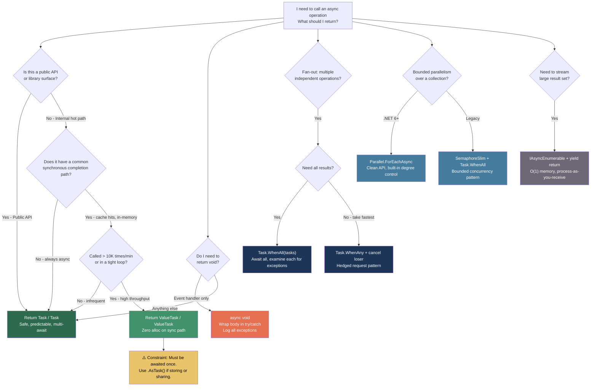

> [!success] Mastery Check
> - [ ] **Studied Well**
> - [ ] **Can explain the concept without notes**
> - [ ] **Can answer interview questions confidently**
> - [ ] **Can implement it in a real project**


## 📍 PART 0 — Navigation & Context

### Where This Topic Lives

```
C# Runtime Model
└── Concurrency & Async
    ├── Threading Primitives (2.23)          ← prerequisite
    ├── ► async/await — The State Machine    ← YOU ARE HERE
    ├──   Delegates & Closures (2.08)        ← closely related
    ├──   Iterators and yield return (2.17)  ← structural sibling
    ├──   Channels (2.11)                   ← depends on this
    └──   TPL and PLINQ (2.24)              ← depends on this
```

### What You Need Before This
- [[2.01 — Value Types vs. Reference Types]] — `ValueTask<T>` is a struct; understanding the allocation difference matters
- [[2.23 — Threading Primitives]] — `SynchronizationContext`, thread pool, `SemaphoreSlim`
- [[2.08 — Delegates, Func, Action, and Closures]] — async lambdas produce state machine classes

### What This Unlocks After
- [[2.11 — Channels and Concurrent Pipelines]] — backpressure via `await` is the core mechanism
- [[2.17 — Iterators and yield return]] — `IAsyncEnumerable<T>` combines both patterns
- [[2.24 — TPL and PLINQ]] — `Task.WhenAll`, `Parallel.ForEachAsync` build on this
- Understanding `ConfigureAwait`, deadlock patterns, and `SynchronizationContext` properly

### Why This Matters to a Production Engineer at Scale

Every I/O-bound service at scale lives or dies by async/await — misuse it and you get thread-pool starvation, deadlocks on `Result`/`Wait()`, allocation pressure from `Task<T>` on synchronous fast paths, and lost exceptions from `async void`.

---

## 🧠 PART 1 — The Core Mental Model

### The Fundamental Rule

> **`async/await` is a compiler transformation, not a runtime feature. The compiler rewrites every `async` method into a struct-based state machine that suspends and resumes execution at each `await` point without blocking a thread.**
> The practical consequence is that an `async` method holding an open database connection while `await`ing network I/O consumes zero threads during that wait — but the generated state machine struct still lives on the heap if it ever yields.

### The Plain-Language Analogy

Think of an `async` method as a **numbered ticket system at a deli counter**. You place your order (start the async operation), take a ticket (the returned `Task<T>`), and walk away — the counter is now free to serve someone else. When your order is ready, a speaker calls your ticket number and you resume from exactly where you left off, with all your items (local variables) intact. The key insight: the deli counter (thread pool) never waits idle. It calls another ticket the moment you walk away. The ticket itself (the `Task<T>`) holds the number that links you to your result.

The critical difference from an analogy using "pausing": nothing pauses. The counter keeps serving. The *caller's continuation* is what gets queued for later.

### The Taxonomy Diagram

```mermaid
graph TD
    A["async/await Ecosystem"] --> B["Compiler Transformation"]
    A --> C["Awaitable Types"]
    A --> D["Builders"]
    A --> E["Execution Context"]

    B --> B1["State Machine struct\n(IAsyncStateMachine)"]
    B1 --> B2["_state field\n(int, -1=running,-2=done)"]
    B1 --> B3["MoveNext() method\n(main dispatch switch)"]
    B1 --> B4["SetStateMachine()\n(boxing pin)"]

    C --> C1["Task<T>\nreference type, always allocates"]
    C --> C2["ValueTask<T>\nstruct, zero-alloc on sync path"]
    C --> C3["IAsyncEnumerable<T>\nasync sequence with yield"]
    C --> C4["Custom Awaitables\nGetAwaiter() duck typing"]
    C --> C5["Task / ValueTask\nnon-generic void-equivalent"]

    D --> D1["AsyncTaskMethodBuilder<T>\nfor Task<T> methods"]
    D --> D2["AsyncValueTaskMethodBuilder<T>\nfor ValueTask<T> methods"]
    D --> D3["AsyncVoidMethodBuilder\nfor async void — dangerous"]

    E --> E1["SynchronizationContext\n(UI, ASP.NET Classic)"]
    E --> E2["TaskScheduler\n(default = ThreadPool)"]
    E --> E3["ConfigureAwait(false)\nstrips context capture"]
    E --> E4["ExecutionContext\n(AsyncLocal<T>, security)"]

    style A fill:#1d3557,color:#fff
    style B fill:#2d6a4f,color:#fff
    style C fill:#2d6a4f,color:#fff
    style D fill:#2d6a4f,color:#fff
    style E fill:#2d6a4f,color:#fff
    style B1 fill:#40916c,color:#fff
    style B2 fill:#40916c,color:#fff
    style B3 fill:#40916c,color:#fff
    style B4 fill:#40916c,color:#fff
    style C1 fill:#457b9d,color:#fff
    style C2 fill:#457b9d,color:#fff
    style C3 fill:#457b9d,color:#fff
    style C4 fill:#457b9d,color:#fff
    style C5 fill:#457b9d,color:#fff
    style D1 fill:#e9c46a,color:#000
    style D2 fill:#e9c46a,color:#000
    style D3 fill:#e76f51,color:#fff
    style E1 fill:#6d6875,color:#fff
    style E2 fill:#6d6875,color:#fff
    style E3 fill:#6d6875,color:#fff
    style E4 fill:#6d6875,color:#fff
```



---

## 🔬 PART 2 — Deep Mechanics

### 2.1 What the Compiler Actually Generates

Given this method:

```csharp
public async Task<string> FetchOrderAsync(int orderId, CancellationToken ct)
{
    var order = await _db.GetOrderAsync(orderId, ct);       // await point 0
    var enriched = await _enricher.EnrichAsync(order, ct);  // await point 1
    return enriched.ToString();
}
```

The compiler generates approximately this (simplified, actual IL is denser):

```csharp
// Compiler generates (approximately) — .NET 8, release mode:

// The state machine is a STRUCT (not a class) in Release builds.
// In Debug builds it becomes a class for easier stepping.
[CompilerGenerated]
private struct <FetchOrderAsync>d__0 : IAsyncStateMachine
{
    // ── Compiler-injected infrastructure ──
    public int _state;                           // -1=running, 0=after await0, 1=after await1, -2=done
    public AsyncTaskMethodBuilder<string> _builder; // Manages Task<T> completion

    // ── Captured parameters (hoisted out of the method) ──
    public int orderId;
    public CancellationToken ct;
    public OrderService <>4__this;  // 'this' of the original class

    // ── Local variables that survive across awaits (hoisted) ──
    private Order <order>5__1;
    private EnrichedOrder <enriched>5__2;

    // ── Per-await-point awaiter fields (one per await) ──
    private TaskAwaiter<Order>          <>u__1;
    private TaskAwaiter<EnrichedOrder>  <>u__2;

    void IAsyncStateMachine.MoveNext()
    {
        int num = _state;
        string result;

        try
        {
            TaskAwaiter<Order> awaiter1;
            TaskAwaiter<EnrichedOrder> awaiter2;

            if (num != 0)    // Not resuming from await point 0
            {
                if (num != 1) // Not resuming from await point 1 either → first entry
                {
                    // ── First entry: _state == -1 ──
                    awaiter1 = <>4__this._db.GetOrderAsync(orderId, ct).GetAwaiter();

                    if (!awaiter1.IsCompleted)  // Did the task already finish?
                    {
                        _state = 0;             // "I'm suspended at await point 0"
                        <>u__1 = awaiter1;       // Save awaiter for when we resume
                        // Schedule this MoveNext to be called when awaiter1 completes
                        _builder.AwaitUnsafeOnCompleted(ref awaiter1, ref this);
                        return;                  // ← RETURN TO CALLER. Thread is free.
                    }
                    goto IL_resumeFromAwait0;   // Task was already done — fall through
                }
                // ── Resuming from await point 1 ──
                awaiter2 = <>u__2;
                <>u__2 = default;
                _state = -1;                    // "I'm running, not suspended"
                goto IL_resumeFromAwait1;
            }

            // ── Resuming from await point 0 ──
            awaiter1 = <>u__1;
            <>u__1 = default;
            _state = -1;

            IL_resumeFromAwait0:
            <order>5__1 = awaiter1.GetResult();   // Get the Order result

            awaiter2 = <>4__this._enricher.EnrichAsync(<order>5__1, ct).GetAwaiter();
            if (!awaiter2.IsCompleted)
            {
                _state = 1;
                <>u__2 = awaiter2;
                _builder.AwaitUnsafeOnCompleted(ref awaiter2, ref this);
                return;                           // ← RETURN AGAIN. Thread is free.
            }

            IL_resumeFromAwait1:
            <enriched>5__2 = awaiter2.GetResult();
            result = <enriched>5__2.ToString();
        }
        catch (Exception ex)
        {
            _state = -2;
            <>4__this = null;
            _builder.SetException(ex);            // Propagates exception to Task<T>
            return;
        }

        _state = -2;
        _builder.SetResult(result);               // Completes the Task<T>
    }

    void IAsyncStateMachine.SetStateMachine(IAsyncStateMachine stateMachine)
        => _builder.SetStateMachine(stateMachine); // Used when boxing the struct
}

// The original method becomes:
public Task<string> FetchOrderAsync(int orderId, CancellationToken ct)
{
    var stateMachine = new <FetchOrderAsync>d__0();
    stateMachine._builder = AsyncTaskMethodBuilder<string>.Create();
    stateMachine.orderId = orderId;
    stateMachine.ct = ct;
    stateMachine.<>4__this = this;
    stateMachine._state = -1;
    stateMachine._builder.Start(ref stateMachine); // Calls MoveNext() once immediately
    return stateMachine._builder.Task;             // Returns the Task<T>
}
```

**Cost:** First call to `FetchOrderAsync` — one heap allocation (the `Task<T>` wrapper, ~40 bytes). If the method suspends (awaiter not completed), the state machine struct is **boxed** to keep it alive across the suspension — one additional heap allocation. If it completes synchronously (all awaiters already done), zero state machine allocation.

---

### 2.2 The Suspension and Resumption Lifecycle

```
━━━━━━━━━━━━━━━━━━━━━━━━━━━━━━━━━━━━━━━━━━━━━━━━━━━━━━━━━━━━━━━━━
TIMELINE: FetchOrderAsync execution when GetOrderAsync is pending
━━━━━━━━━━━━━━━━━━━━━━━━━━━━━━━━━━━━━━━━━━━━━━━━━━━━━━━━━━━━━━━━━

Thread-Pool-Thread-1                  I/O Completion Port / Thread-Pool-Thread-2
─────────────────────                 ──────────────────────────────────────────
[1] FetchOrderAsync() called
[2] State machine created on stack
[3] _builder.Start() → MoveNext()
[4] GetOrderAsync() called
[5] awaiter.IsCompleted → false
[6] _state = 0
[7] AwaitUnsafeOnCompleted():
      • State machine boxed to heap ◄── (allocation happens here, only if suspending)
      • Continuation registered with
        the Task<Order>'s callback list
[8] MoveNext() returns
[9] FetchOrderAsync() returns Task<T>
    to CALLER ← Thread-1 is now FREE

                                      [10] Network I/O completes
                                      [11] Task<Order> completes
                                      [12] Continuation callback fires
                                      [13] Thread-Pool picks up callback
                                      [14] MoveNext() called (state == 0)
                                      [15] _state = -1 (running)
                                      [16] GetResult() → Order retrieved
                                      [17] EnrichAsync() called
                                      [18] awaiter.IsCompleted → false
                                      [19] _state = 1 → AwaitUnsafeOnCompleted
                                      [20] MoveNext() returns (thread free again)

... (await #2 I/O completes) ...

                                      [21] MoveNext() called (state == 1)
                                      [22] GetResult() → EnrichedOrder
                                      [23] _state = -2 (done)
                                      [24] _builder.SetResult(resultString)
                                      [25] Task<T> transitions to Completed
                                      [26] Callers awaiting this Task resume

THREAD USAGE:
  • Zero threads consumed during I/O wait (steps 9–13, 19–20 gaps)
  • Thread-1 served other work while waiting
  • Thread-2 (or any pool thread) resumes the continuation
```

**Key insight:** This is why async I/O scales. A server with 16 threads can handle 10,000 concurrent in-flight requests. No thread is ever blocked waiting.

---

### 2.3 Task\<T\> vs ValueTask\<T\> — The Allocation Model

```
┌─────────────────────────────────────────────────────────────────┐
│                    TASK<T> vs VALUETASK<T>                      │
├──────────────────────────┬──────────────────────────────────────┤
│ Task<T>                  │ ValueTask<T>                         │
├──────────────────────────┼──────────────────────────────────────┤
│ Reference type           │ Struct (value type)                  │
│ Always allocates ~40B    │ Zero alloc on synchronous path       │
│ One allocation per call  │ Allocates if/when it must suspend    │
│ Safe to await multiple   │ UNSAFE to await more than once       │
│ times                    │ (value is consumed on await)         │
│ Can be cached, stored    │ Must be awaited immediately or       │
│ in fields                │ converted to Task via .AsTask()      │
│ await any number of      │ Do not call .Result on it            │
│ times safely             │ Do not store in a variable and await │
│                          │ later without care                   │
├──────────────────────────┼──────────────────────────────────────┤
│ USE WHEN:                │ USE WHEN:                            │
│ • Public API             │ • Frequently called internal method  │
│ • Hot path unlikely      │ • Common synchronous path exists     │
│ • Being awaited multiple │ • Interface returning value-typed    │
│   times                  │   awaitable (IValueTaskSource<T>)   │
│ • Returned from          │ • Measured allocation pressure       │
│   Task.WhenAll etc.      │                                      │
└──────────────────────────┴──────────────────────────────────────┘
```

```
MEMORY PICTURE — Task<T> vs ValueTask<T>

Task<T> always:
  Stack: [task reference ──────────────────────────────────────────┐]
  Heap:  [Task<T> object: header | state | result | continuations] ◄┘
         ≈ 40 bytes minimum

ValueTask<T> — synchronous completion:
  Stack: [ValueTask<T> struct: _obj=null | _result=42 | _token=0]
         = 16 bytes on stack, ZERO heap allocation

ValueTask<T> — asynchronous (suspends):
  Stack: [ValueTask<T> struct: _obj=──────────────────────────────┐]
  Heap:  [Task<T> or IValueTaskSource<T> implementation]          ◄┘
         ≈ same as Task<T> in the worst case
```

> [!IMPORTANT] The ValueTask Contract
> `ValueTask<T>` must be awaited exactly once, and no later than necessary. Storing it in a field, awaiting it twice, or calling `.Result` after it has already been awaited are all undefined behavior. For anything stored, shared, or awaited from multiple call sites: convert to `Task<T>` via `.AsTask()`.

---

### 2.4 ConfigureAwait and the SynchronizationContext Trap

```csharp
// The SynchronizationContext captures WHERE code was running before suspension.
// After suspension, the continuation is scheduled back to that context.
//
// In WinForms/WPF: this means "resume on the UI thread"
// In old ASP.NET (non-Core): this means "resume with same HTTP context"
// In ASP.NET Core: there is NO SynchronizationContext (thread-pool by default)
// In console/thread-pool: there is NO SynchronizationContext

// THE DEADLOCK PATTERN (WinForms, old ASP.NET):

// ⚠️ DEADLOCK:
// UI thread calls Result, which blocks it.
// The continuation needs the UI thread to complete.
// → Deadlock.
string result = FetchOrderAsync(1, ct).Result; // NEVER DO THIS in UI or ASP.NET Classic

// ✅ async all the way down — no blocking
string result = await FetchOrderAsync(1, ct);

// ─────────────────────────────────────────────────────────
// ConfigureAwait(false): "Don't capture context. I don't
// need to resume on the original synchronization context."

// ⚠️ Library code WITHOUT ConfigureAwait(false):
public async Task<Order> GetOrderAsync(int id, CancellationToken ct)
{
    var data = await _dbContext.Orders.FindAsync(id, ct);  // captures context
    return Map(data);  // resumes on captured context — unnecessary for library code
}

// ✅ Library / infrastructure code WITH ConfigureAwait(false):
public async Task<Order> GetOrderAsync(int id, CancellationToken ct)
{
    var data = await _dbContext.Orders.FindAsync(id, ct).ConfigureAwait(false);
    return Map(data);  // resumes on thread pool — correct for library code
}

// Rule: Library code → always ConfigureAwait(false)
// Application-layer code (controllers, viewmodels) → optional, ASP.NET Core has no context anyway
```

**Runtime cost of context capture:** `SynchronizationContext.Current` read (~3 ns) + scheduler post overhead if context exists. In ASP.NET Core: zero overhead (context is null).

---

### 2.5 CancellationToken — Propagation and Correct Usage

```csharp
// CancellationToken is a lightweight struct (~16 bytes).
// It holds a reference to CancellationTokenSource's shared state.
// Checking IsCancellationRequested: ~1 ns (volatile read).
// Registering a callback: ~100 ns + allocation.

// ⚠️ WRONG — not checking cancellation in CPU-bound work:
public async Task<Report> GenerateReportAsync(ReportRequest req, CancellationToken ct)
{
    var data = await _db.FetchDataAsync(req.Id, ct);
    // Ignoring ct here — if cancelled during processing, continues for seconds
    var result = ProcessData(data);                    // could run for 5 seconds
    return result;
}

// ✅ CORRECT — cooperative cancellation throughout:
public async Task<Report> GenerateReportAsync(ReportRequest req, CancellationToken ct)
{
    var data = await _db.FetchDataAsync(req.Id, ct);

    ct.ThrowIfCancellationRequested();  // Check before expensive CPU work

    var result = ProcessData(data, ct); // Pass into CPU-bound method too
    return result;
}

private Report ProcessData(OrderData data, CancellationToken ct)
{
    var result = new Report();
    foreach (var item in data.Items)
    {
        ct.ThrowIfCancellationRequested();  // Check every iteration in long loops
        result.AddItem(ProcessItem(item));
    }
    return result;
}

// CancellationTokenSource patterns:
// 1. Request timeout
using var cts = new CancellationTokenSource(TimeSpan.FromSeconds(30));
var result = await FetchAsync(cts.Token);

// 2. Linked: cancelled by EITHER signal
using var linkedCts = CancellationTokenSource.CreateLinkedTokenSource(
    requestCt,     // HTTP request cancellation
    appCt          // App shutdown token
);
var result = await ProcessAsync(linkedCts.Token);
```

---

### 2.6 async void — The Unobservable Exception

```
━━━━━━━━━━━━━━━━━━━━━━━━━━━━━━━━━━━━━━━━━━━━━━━━━━━━━━━━━━━━
async void EXCEPTION FLOW vs async Task EXCEPTION FLOW
━━━━━━━━━━━━━━━━━━━━━━━━━━━━━━━━━━━━━━━━━━━━━━━━━━━━━━━━━━━━

async Task method:
  ┌─────────────────────────────────────────────────────┐
  │ Exception thrown in MoveNext()                      │
  │   → _builder.SetException(ex)                       │
  │   → Task<T> enters Faulted state                    │
  │   → Caller awaiting the Task sees the exception     │
  │   → Exception is observable and handleable          │
  └─────────────────────────────────────────────────────┘

async void method:
  ┌─────────────────────────────────────────────────────┐
  │ Exception thrown in MoveNext()                      │
  │   → AsyncVoidMethodBuilder.SetException(ex)         │
  │   → Exception is re-thrown on the                   │
  │     SynchronizationContext (if any)                 │
  │   → If no context: thrown on ThreadPool thread      │
  │   → Crashes the process via                         │
  │     TaskScheduler.UnobservedTaskException           │
  │     (or AppDomain.UnhandledException)               │
  │   → Caller receives NO exception — already returned │
  └─────────────────────────────────────────────────────┘

THE ONLY VALID USE OF async void: Top-level event handlers
  button.Click += async (sender, e) => { await HandleClickAsync(); };
  // Even here, wrap in try/catch to handle exceptions properly.
```

---

## 💻 PART 3 — Production Code Patterns

### 3.1 The Async-All-The-Way Rule — Payment Processing Pipeline

Never mix blocking `.Result`/`.Wait()` with async code anywhere in the call chain.

```csharp
// ⚠️ WRONG: blocking in an async context — deadlock risk on any SynchronizationContext
public class PaymentController : ControllerBase
{
    [HttpPost]
    public ActionResult<PaymentResult> ProcessPayment(PaymentRequest req)
    {
        // .Result blocks the calling thread
        // If any async operation in the chain needs the same thread → deadlock
        var result = _paymentService.ProcessAsync(req).Result;
        return Ok(result);
    }
}

// ✅ CORRECT: async all the way to the entry point
public class PaymentController : ControllerBase
{
    [HttpPost]
    public async Task<ActionResult<PaymentResult>> ProcessPayment(
        PaymentRequest req,
        CancellationToken ct) // ASP.NET Core injects the request cancellation token
    {
        var result = await _paymentService.ProcessAsync(req, ct);
        return Ok(result);
    }
}
```

---

### 3.2 Bounded Parallelism — Order Enrichment Batch Processing

Launching unlimited concurrent tasks exhausts connections, memory, and downstream services.

```csharp
// ⚠️ WRONG: Launches ALL tasks at once — no backpressure
public async Task EnrichAllOrdersAsync(IEnumerable<int> orderIds, CancellationToken ct)
{
    var tasks = orderIds.Select(id => _enricher.EnrichAsync(id, ct));
    await Task.WhenAll(tasks);  // 10,000 concurrent HTTP calls → connection pool exhaustion
}

// ✅ CORRECT: bounded parallelism with SemaphoreSlim
public async Task EnrichAllOrdersAsync(
    IEnumerable<int> orderIds,
    int maxConcurrency,          // e.g., 20 — match to downstream service limits
    CancellationToken ct)
{
    // SemaphoreSlim: thread-pool friendly, supports async Wait
    using var semaphore = new SemaphoreSlim(maxConcurrency, maxConcurrency);

    // Create the tasks but each one must acquire the semaphore first
    var tasks = orderIds.Select(async id =>
    {
        // WaitAsync: non-blocking wait for a slot
        await semaphore.WaitAsync(ct);
        try
        {
            await _enricher.EnrichAsync(id, ct);
        }
        finally
        {
            semaphore.Release(); // Always release, even on exception
        }
    });

    // Now wait for all — at most maxConcurrency will run simultaneously
    await Task.WhenAll(tasks);
}

// ALTERNATIVE in .NET 6+: Parallel.ForEachAsync — cleaner API
public async Task EnrichAllOrdersAsync_Modern(
    IEnumerable<int> orderIds,
    CancellationToken ct)
{
    var options = new ParallelOptions
    {
        MaxDegreeOfParallelism = 20,
        CancellationToken = ct
    };

    await Parallel.ForEachAsync(orderIds, options, async (id, loopCt) =>
    {
        await _enricher.EnrichAsync(id, loopCt);
    });
}
```

---

### 3.3 Task.WhenAll with Exception Aggregation — Notification Fan-Out

`Task.WhenAll` throws the FIRST exception by default. The rest are silently swallowed.

```csharp
// ⚠️ WRONG: Only the first exception surfaces — others are lost
public async Task SendOrderNotificationsAsync(Order order, CancellationToken ct)
{
    var tasks = new[]
    {
        _emailService.SendAsync(order, ct),
        _smsService.SendAsync(order, ct),
        _pushService.SendAsync(order, ct),
    };

    await Task.WhenAll(tasks);
    // If email succeeds, SMS fails, push fails:
    // Only SMS exception surfaced. Push failure is silently lost.
}

// ✅ CORRECT: capture all tasks, examine all results
public async Task<NotificationResult> SendOrderNotificationsAsync(
    Order order,
    CancellationToken ct)
{
    var emailTask = _emailService.SendAsync(order, ct);
    var smsTask   = _smsService.SendAsync(order, ct);
    var pushTask  = _pushService.SendAsync(order, ct);

    // Wait for all, regardless of failures
    await Task.WhenAll(emailTask, smsTask, pushTask);
    // Task.WhenAll will throw here if any faulted, but all tasks have run to completion

    // Examine each individually to collect all failures
    var failures = new List<string>();

    // Re-await completed tasks to observe their state — re-await of a completed task
    // is essentially free (IsCompleted path, no state machine overhead)
    if (emailTask.IsFaulted)
        failures.Add($"Email: {emailTask.Exception!.InnerException!.Message}");
    if (smsTask.IsFaulted)
        failures.Add($"SMS: {smsTask.Exception!.InnerException!.Message}");
    if (pushTask.IsFaulted)
        failures.Add($"Push: {pushTask.Exception!.InnerException!.Message}");

    return new NotificationResult(
        AllSucceeded: failures.Count == 0,
        Failures: failures
    );
}
```

---

### 3.4 Hedged Requests — Low-Latency External API Calls

For latency-sensitive operations, send two requests and take the first to respond.

```csharp
// Hedged request: start primary, if not done in 100ms, start secondary.
// Take whichever completes first. Cancel the loser.
// Useful for P99 latency reduction against flaky or load-balanced endpoints.

public async Task<InventoryStatus> GetInventoryWithHedgeAsync(
    string skuId,
    CancellationToken ct)
{
    using var primaryCts  = CancellationTokenSource.CreateLinkedTokenSource(ct);
    using var secondaryCts = CancellationTokenSource.CreateLinkedTokenSource(ct);

    // Start primary request immediately
    var primaryTask = _inventoryClient.GetStatusAsync(skuId, primaryCts.Token);

    // Start secondary request after 100ms hedge delay
    var secondaryTask = Task.Delay(100, ct).ContinueWith(
        _ => _inventoryClient.GetStatusAsync(skuId, secondaryCts.Token),
        ct,
        TaskContinuationOptions.OnlyOnRanToCompletion,
        TaskScheduler.Default
    ).Unwrap();

    // Race them: take whichever completes first
    var winner = await Task.WhenAny(primaryTask, secondaryTask);

    // Cancel the loser to avoid wasting resources
    if (winner == primaryTask)
        secondaryCts.Cancel();
    else
        primaryCts.Cancel();

    // Await the winner to propagate exceptions
    return await winner;
}
```

---

### 3.5 ValueTask for Hot-Path Infrastructure — Repository Pattern

`ValueTask<T>` eliminates allocations on the synchronous fast path (cache hits, simple lookups).

```csharp
// ⚠️ WRONG: Task<T> always allocates — even when result is immediately available
public interface IProductRepository
{
    Task<Product?> GetByIdAsync(Guid id, CancellationToken ct);
}

public class CachedProductRepository : IProductRepository
{
    private readonly IMemoryCache _cache;
    private readonly IProductRepository _inner;

    // Returns Task<T> even when cache HIT — allocates Task wrapper every call
    public async Task<Product?> GetByIdAsync(Guid id, CancellationToken ct)
    {
        if (_cache.TryGetValue(id, out Product? cached))
            return cached;  // Still wraps in Task — one heap allocation wasted
        return await _inner.GetByIdAsync(id, ct);
    }
}

// ✅ CORRECT: ValueTask<T> — zero allocation on cache hit
public interface IProductRepository
{
    ValueTask<Product?> GetByIdAsync(Guid id, CancellationToken ct);
}

public class CachedProductRepository : IProductRepository
{
    private readonly IMemoryCache _cache;
    private readonly IProductRepository _inner;

    public ValueTask<Product?> GetByIdAsync(Guid id, CancellationToken ct)
    {
        // Cache hit: return synchronously — ValueTask<T> on stack, zero heap allocation
        if (_cache.TryGetValue(id, out Product? cached))
            return new ValueTask<Product?>(cached);

        // Cache miss: delegate to inner (which returns ValueTask<T> too)
        return GetFromInnerAsync(id, ct);
    }

    // Separate async method: only called on miss path
    // Prevents state machine generation in the hot path above
    private async ValueTask<Product?> GetFromInnerAsync(Guid id, CancellationToken ct)
    {
        var product = await _inner.GetByIdAsync(id, ct);
        if (product != null)
            _cache.Set(id, product, TimeSpan.FromMinutes(5));
        return product;
    }
}
```

---

### 3.6 IAsyncEnumerable\<T\> — Streaming Large Result Sets

Process data without materializing the entire result set in memory.

```csharp
// ⚠️ WRONG: Materializes ALL records — OOM risk on large tables, high latency to first item
public async Task<List<InvoiceDto>> GetAllInvoicesAsync(
    DateOnly fromDate,
    CancellationToken ct)
{
    // Returns after ALL rows fetched — 500,000 rows → 500ms before any processing
    return await _dbContext.Invoices
        .Where(i => i.Date >= fromDate)
        .Select(i => new InvoiceDto(i.Id, i.Total, i.Date))
        .ToListAsync(ct);
}

// ✅ CORRECT: stream results with IAsyncEnumerable<T>
public async IAsyncEnumerable<InvoiceDto> StreamInvoicesAsync(
    DateOnly fromDate,
    [EnumeratorCancellation] CancellationToken ct) // attribute required for WithCancellation()
{
    await foreach (var invoice in _dbContext.Invoices
        .Where(i => i.Date >= fromDate)
        .AsAsyncEnumerable()
        .WithCancellation(ct))
    {
        yield return new InvoiceDto(invoice.Id, invoice.Total, invoice.Date);
    }
}

// Consumer: process each record as it arrives
public async Task ProcessMonthlyReportAsync(DateOnly from, CancellationToken ct)
{
    var total = 0m;
    var count = 0;

    await foreach (var invoice in _invoiceRepo.StreamInvoicesAsync(from, ct))
    {
        total += invoice.Total;
        count++;

        // Can process immediately — memory usage is O(1), not O(n)
    }

    await _reportStore.SaveAsync(new MonthlyReport(from, count, total), ct);
}
```

---

### 3.7 The async void Event Handler — The One Legitimate Use

```csharp
// async void is ONLY appropriate for top-level event handlers.
// Wrap everything in try/catch — exceptions from async void are fatal if unhandled.

public class OrderProcessingWorker : BackgroundService
{
    private readonly IOrderQueue _queue;
    private readonly ILogger<OrderProcessingWorker> _logger;

    // ✅ Event handler: async void is permitted here
    // This is the top of the async call chain.
    private async void OnOrderReceived(object? sender, OrderEventArgs e)
    {
        try
        {
            // Exceptions handled here — won't escape to crash the process
            await ProcessOrderAsync(e.Order, CancellationToken.None);
        }
        catch (Exception ex)
        {
            _logger.LogError(ex, "Unhandled error processing order {OrderId}", e.Order.Id);
            // Handle gracefully — alert, dead-letter, etc.
        }
    }

    // ✅ Everything else: return Task
    private async Task ProcessOrderAsync(Order order, CancellationToken ct)
    {
        await _inventoryService.ReserveAsync(order, ct);
        await _paymentService.ChargeAsync(order, ct);
        await _fulfillmentService.ScheduleAsync(order, ct);
    }

    protected override async Task ExecuteAsync(CancellationToken stoppingToken)
    {
        _queue.OrderReceived += OnOrderReceived; // Attach event handler
        await Task.Delay(Timeout.Infinite, stoppingToken);
        _queue.OrderReceived -= OnOrderReceived; // Detach on shutdown
    }
}
```

---

## ⚠️ PART 4 — Gotchas & Anti-Patterns

### Gotcha 1: The Synchronous Wrapper Deadlock

Engineers coming from sync codebases often wrap async methods with `.Result` or `.Wait()`. This deadlocks in any environment with a single-threaded `SynchronizationContext` (WinForms, WPF, ASP.NET Classic).

```csharp
// ⚠️ WRONG: The deadlock pattern
// Thread A (UI thread): calls GetOrderAsync().Result
// → blocks Thread A waiting for Task to complete
// → Task's continuation needs to post back to Thread A (captured SyncContext)
// → Thread A is blocked → continuation never runs → DEADLOCK

public Order GetOrder(int id)
{
    // This DEADLOCKS in WinForms/WPF and ASP.NET Classic:
    return _orderService.GetOrderAsync(id, CancellationToken.None).Result;
}

// ✅ CORRECT: Go async all the way
public async Task<Order> GetOrderAsync(int id, CancellationToken ct)
{
    return await _orderService.GetOrderAsync(id, ct);
}

// WHY: ConfigureAwait(false) in the async method WOULD prevent the deadlock,
// but the fix belongs at the call site, not inside the async method.
// The library doesn't know whether callers will block on it.
// Async callers should use async all the way down.
```

### Gotcha 2: Forgetting await Creates a Fire-and-Forget

Omitting `await` doesn't cause a compiler error — it silently creates a fire-and-forget that swallows exceptions.

```csharp
// ⚠️ WRONG: Exceptions from SendEmailAsync are silently lost
// The method returns immediately after starting the task — email may not send
public async Task ProcessOrderAsync(Order order, CancellationToken ct)
{
    await _db.SaveOrderAsync(order, ct);
    _emailService.SendConfirmationAsync(order, ct); // ⚠️ MISSING await!
    // Method returns. Exception from SendConfirmationAsync is unobserved.
    // The Task<T> returned by SendConfirmationAsync is garbage collected,
    // triggering TaskScheduler.UnobservedTaskException.
}

// ✅ CORRECT: await every async operation
public async Task ProcessOrderAsync(Order order, CancellationToken ct)
{
    await _db.SaveOrderAsync(order, ct);
    await _emailService.SendConfirmationAsync(order, ct); // ✅
}

// WHY: Without await, exceptions are swallowed into an unobserved Task.
// Enable `#pragma warning enable CS4014` to catch all unawaited calls at compile time.
// In .csproj: <TreatWarningsAsErrors>true</TreatWarningsAsErrors>
// CS4014 is the "unawaited task" warning.
```

### Gotcha 3: Capturing CancellationToken in a Closure Across await

The token itself is a struct, but the closure captures it correctly. The gotcha is using a disposed `CancellationTokenSource`.

```csharp
// ⚠️ WRONG: CancellationTokenSource disposed while token in use
public async Task ProcessBatchAsync(IEnumerable<int> ids)
{
    using var cts = new CancellationTokenSource(TimeSpan.FromSeconds(30));
    var token = cts.Token;

    // ⚠️ These tasks run AFTER cts is disposed!
    var tasks = ids.Select(id => ProcessOneAsync(id, token));
    await Task.WhenAll(tasks);
    // The using block disposes cts when Task.WhenAll completes —
    // but if tasks are still running, they have a token referencing a disposed CTS

    // Actually OK in this exact pattern because we await Task.WhenAll before disposal.
    // The real bug is below:
}

// ⚠️ REAL BUG: Handing token to a background task that outlives the CTS
public Task StartLongProcessingAsync(IEnumerable<int> ids)
{
    using var cts = new CancellationTokenSource(TimeSpan.FromSeconds(30));
    // This creates background task — not awaited
    _ = Task.Run(() => ProcessAllAsync(ids, cts.Token));
    // cts disposed here! Background task's token references dead CTS
    return Task.CompletedTask;
}

// ✅ CORRECT: Ensure CTS lifetime exceeds all tasks using its token
public async Task StartLongProcessingAsync(IEnumerable<int> ids, CancellationToken outerCt)
{
    using var cts = CancellationTokenSource.CreateLinkedTokenSource(outerCt);
    cts.CancelAfter(TimeSpan.FromSeconds(30));

    await ProcessAllAsync(ids, cts.Token); // await ensures CTS stays alive
}

// WHY: Disposing CancellationTokenSource while a token is mid-use causes
// ObjectDisposedException on any ThrowIfCancellationRequested() call.
// The token holds a reference to internal state that gets freed on Dispose.
```

### Gotcha 4: await inside lock() — Compiler Error Teaches the Wrong Lesson

The compiler forbids `await` inside a `lock` block. Engineers work around it by moving the `await` outside the lock — but then they've broken the atomicity they wanted.

```csharp
// This does not compile (correctly rejected by compiler):
// lock (_sync)
// {
//     var result = await _db.GetAsync(id, ct); // CS1996: cannot await in lock body
//     _cache[id] = result;
// }

// ⚠️ WRONG "fix": await outside the lock — lost atomicity
private async Task<UserProfile> GetOrLoadProfileAsync(Guid userId, CancellationToken ct)
{
    if (_cache.TryGetValue(userId, out var cached))
        return cached;

    // ⚠️ Two threads can both reach this point simultaneously
    // Both will call _db.GetAsync and both will set _cache — duplicate DB call
    var profile = await _db.GetUserProfileAsync(userId, ct);
    lock (_sync) { _cache[userId] = profile; }
    return profile;
}

// ✅ CORRECT: SemaphoreSlim for async-compatible mutual exclusion
private readonly SemaphoreSlim _loadLock = new SemaphoreSlim(1, 1);
private readonly Dictionary<Guid, UserProfile> _cache = new();

private async Task<UserProfile> GetOrLoadProfileAsync(Guid userId, CancellationToken ct)
{
    if (_cache.TryGetValue(userId, out var cached))
        return cached;

    await _loadLock.WaitAsync(ct); // async-safe exclusive acquisition
    try
    {
        // Double-check after acquiring lock — another thread may have loaded it
        if (_cache.TryGetValue(userId, out cached))
            return cached;

        var profile = await _db.GetUserProfileAsync(userId, ct);
        _cache[userId] = profile;
        return profile;
    }
    finally
    {
        _loadLock.Release(); // Always release
    }
}

// WHY: lock() blocks a thread — incompatible with async's cooperative model.
// SemaphoreSlim.WaitAsync() suspends the state machine without blocking a thread.
```

### Gotcha 5: async Task in a Constructor — Initialization Order Bug

Constructors cannot be `async`. Engineers work around this with fire-and-forget or `Task.Run` — leading to objects used before they're initialized.

```csharp
// ⚠️ WRONG: Object used before async init completes
public class OrderSummaryViewModel
{
    public List<Order> Orders { get; private set; } = new();

    public OrderSummaryViewModel(IOrderService service)
    {
        // ⚠️ Fire-and-forget — Orders might be empty when UI renders
        _ = LoadOrdersAsync(service);
    }

    private async Task LoadOrdersAsync(IOrderService service)
    {
        Orders = await service.GetRecentOrdersAsync(CancellationToken.None);
        // By the time this completes, UI may have already rendered with empty Orders
    }
}

// ✅ CORRECT: Async factory method pattern
public class OrderSummaryViewModel
{
    public List<Order> Orders { get; private set; } = new();

    private OrderSummaryViewModel() { } // Private constructor prevents direct construction

    // Factory method: caller must await this — initialization is guaranteed complete
    public static async Task<OrderSummaryViewModel> CreateAsync(
        IOrderService service,
        CancellationToken ct)
    {
        var vm = new OrderSummaryViewModel();
        vm.Orders = await service.GetRecentOrdersAsync(ct);
        return vm; // Fully initialized
    }
}

// Caller:
var vm = await OrderSummaryViewModel.CreateAsync(_orderService, ct);
// At this point, vm.Orders is populated. No race condition.

// WHY: The async factory pattern guarantees that any awaiter of CreateAsync
// receives a fully constructed object. The constructor-with-fire-and-forget
// returns an object whose state is indeterminate until the background task completes.
```

---

## 📊 PART 5 — Performance Implications

### 5.1 Allocation Characteristics Table

| Scenario | Allocation Behavior | Approx Cost |
|---|---|---|
| `async Task` method — completes synchronously | `Task<T>` wrapper only (if not cached by builder) | ~40 bytes |
| `async Task` method — suspends (one await) | `Task<T>` + boxed state machine struct | ~80–200 bytes |
| `async ValueTask` — synchronous fast path (cache hit) | Zero (struct on stack returned directly) | 0 bytes |
| `async ValueTask` — suspends | Falls back to `Task<T>` allocation | ~80–200 bytes |
| `Task.WhenAll(tasks)` | One new `Task<T>[]` + one `WhenAllPromise` object | ~100 bytes + tasks array |
| `await Task.Delay(ms)` | `DelayPromise` internal object | ~80 bytes |
| `CancellationTokenSource.CreateLinkedTokenSource` | One `LinkedCancellationTokenSource` object | ~120 bytes |
| `SemaphoreSlim.WaitAsync()` — contended | Queues a `TaskNode` on internal list | ~48 bytes |
| `SemaphoreSlim.WaitAsync()` — uncontended | Zero allocation (synchronous path) | 0 bytes |
| `async void` method | State machine + `AsyncVoidMethodBuilder` (no Task returned) | ~120 bytes |
| `ConfigureAwait(false)` | No allocation difference — just changes awaiter context behavior | 0 bytes |
| `IAsyncEnumerable<T>` iteration start | State machine allocation (same as async method) | ~100 bytes |

### 5.2 BenchmarkDotNet Benchmark

```csharp
using BenchmarkDotNet.Attributes;
using BenchmarkDotNet.Running;

[MemoryDiagnoser]
[SimpleJob]
public class AsyncAwaitAllocationBenchmark
{
    private static readonly Task<int> _completedTask = Task.FromResult(42);
    private static readonly int _cachedResult = 42;

    // ── Scenario 1: Task<T> — always allocates ──
    [Benchmark(Baseline = true)]
    public async Task<int> TaskReturningMethod_Sync()
    {
        // Completes synchronously but still allocates Task<T> wrapper
        return await _completedTask;
    }

    // ── Scenario 2: ValueTask<T> — zero alloc on sync path ──
    [Benchmark]
    public async ValueTask<int> ValueTaskReturningMethod_Sync()
    {
        // Synchronous path: ValueTask<T> is a stack struct — zero allocation
        if (_cachedResult != 0)
            return _cachedResult;  // Returns new ValueTask<int>(_cachedResult) — no heap

        return await SomeRealAsyncWork();
    }

    // ── Scenario 3: Task<T> with genuine suspension ──
    [Benchmark]
    public async Task<int> TaskReturningMethod_Async()
    {
        // Suspends: state machine must be boxed, Task<T> allocated
        await Task.Yield();
        return 42;
    }

    // ── Scenario 4: ValueTask<T> with genuine suspension ──
    [Benchmark]
    public async ValueTask<int> ValueTaskReturningMethod_Async()
    {
        // Suspends: ValueTask falls back to Task internally — same cost as Task<T>
        await Task.Yield();
        return 42;
    }

    // ── Scenario 5: WhenAll fan-out ──
    [Benchmark]
    public async Task<int[]> WhenAllFanOut()
    {
        var t1 = Task.FromResult(1);
        var t2 = Task.FromResult(2);
        var t3 = Task.FromResult(3);
        return await Task.WhenAll(t1, t2, t3);
    }

    private static Task<int> SomeRealAsyncWork() => Task.FromResult(99);
}

// Expected output (approximate, .NET 8, x64):
// | Method                            | Mean       | Allocated |
// |-----------------------------------|------------|-----------|
// | TaskReturningMethod_Sync          | 18.3 ns    | 40 B      |
// | ValueTaskReturningMethod_Sync     |  4.1 ns    | -         |  ← 0 bytes!
// | TaskReturningMethod_Async         | 480.0 ns   | 232 B     |
// | ValueTaskReturningMethod_Async    | 498.0 ns   | 232 B     |  ← same as Task when suspending
// | WhenAllFanOut                     | 156.0 ns   | 160 B     |
```

### 5.3 When to Care / When to Ignore

**When this costs you:**
- **High-throughput APIs** (>10,000 RPS): each async method invocation that suspends allocates ~80–200 bytes. At 10K RPS with 5 await points per request = 10 MB/s of allocation → GC pressure
- **Cache-hot read paths**: if a method is called millions of times per minute and 95% complete synchronously, `Task<T>` wastes millions of allocations per minute. Use `ValueTask<T>`.
- **Message processing loops**: tight loops calling `async` methods in event consumers or Kafka consumers generate sustained allocation pressure that keeps Gen0 GC firing constantly
- **Microservice sidecars / health checks**: called every second, async overhead compounds across hundreds of instances

**When this doesn't matter:**
- Methods that perform real I/O (database, network): the I/O latency (milliseconds) dwarfs the async overhead (nanoseconds) by 5–6 orders of magnitude. Optimize the query, not the await
- Background workers and scheduled jobs: allocation per job invocation is irrelevant
- Application startup code: runs once
- Method calling depth < 100 times per second on any single code path

---

## 🎤 PART 6 — Interview Arsenal

### 6.1 The Question Bank

---

> **Q: "Explain how async/await works under the hood."**

**Average answer:** "The compiler generates a state machine that pauses execution at each await point and resumes it when the awaited task completes."

**Why that's insufficient:** Correct but hand-wavy. Doesn't explain what 'pauses' means mechanically, whether a thread is blocked, what happens to local variables, or how the resumption is scheduled.

**Great answer:**
> "When you mark a method `async`, the compiler rewrites it into a struct implementing `IAsyncStateMachine`, with a `MoveNext()` method that contains the original logic inside a dispatch switch keyed on a `_state` integer. Every local variable that survives an await boundary gets hoisted into a field on that struct. When you hit an `await`, `MoveNext()` checks whether the awaiter is already completed. If it is, execution falls through immediately — zero suspension. If it's not, the state machine sets its `_state` field to mark where it suspended, registers a continuation callback with the awaiter, and returns — the calling thread is now free to do other work. When the I/O completes, the thread pool calls `MoveNext()` again, the switch dispatches to the right state, `GetResult()` retrieves the value, and execution continues as if nothing happened. The key thing is that between the suspension and resumption, no thread is blocking — that's how a 16-thread server handles 10,000 concurrent requests."

---

> **Q: "What's the difference between Task\<T\> and ValueTask\<T\>?"**

**Average answer:** "ValueTask is a struct that avoids allocations."

**Why that's insufficient:** Doesn't explain when to use which, what the constraints of ValueTask are, or why you can't await it multiple times.

**Great answer:**
> "The core difference is allocation behavior on the synchronous completion path. `Task<T>` is a reference type — every call allocates a heap wrapper regardless of whether the method actually suspends. `ValueTask<T>` is a struct that holds either a direct result or a reference to an underlying Task. When a method completes synchronously, returning `ValueTask<T>` means the caller gets a value on the stack with zero heap allocation. The important constraint is that `ValueTask<T>` is a one-shot value — it should be awaited once, immediately. You can't store it in a field, await it from two places, or call `.Result` on it after the fact. If you need to share or cache it, convert via `.AsTask()` first. In production, I use `ValueTask<T>` for internal hot-path interfaces with a known synchronous fast path — think a repository whose in-memory cache hits 90% of the time. For public APIs, I default to `Task<T>` because the misuse surface area is smaller."

---

> **Q: "What does ConfigureAwait(false) do and when should you use it?"**

**Average answer:** "It tells the await not to capture the synchronization context, so the continuation runs on a thread pool thread."

**Why that's insufficient:** Doesn't explain what a synchronization context is, when its absence matters, or the practical deadlock scenario it prevents.

**Great answer:**
> "When a method hits an `await`, by default it captures `SynchronizationContext.Current` — the logical execution context of the current thread. When the continuation resumes, it posts back to that captured context. In a WinForms UI, that means 'resume on the UI thread.' In old ASP.NET, that means 'resume with the HTTP request context.' If another thread is blocking on that context waiting for the async method to complete — classic `Task.Result` call — you have a deadlock: the blocking thread owns the context, the continuation needs the context to finish, the continuation never runs. `ConfigureAwait(false)` strips the context capture entirely — the continuation resumes on whatever thread pool thread is available. The rule is: library and infrastructure code should always use `ConfigureAwait(false)` because libraries don't know whether callers are in a context-sensitive environment. Application-layer code in ASP.NET Core doesn't need it because Core intentionally has no `SynchronizationContext`. The failure mode of forgetting it in a library is a deadlock that only manifests in specific host environments — very hard to diagnose."

---

> **Q: "What are the dangers of async void and when is it acceptable?"**

**Great answer:**
> "The fundamental problem with `async void` is that exceptions escape into the `SynchronizationContext` rather than being captured in a `Task` where the caller can observe them. With `async Task`, if an exception occurs, the exception is stored in the `Task`, and whoever awaits it sees the exception. With `async void`, the exception is thrown on whatever context was current when the method ran — which in a thread pool context means the process crashes. The other problem is fire-and-forget: callers have no mechanism to know when the method completes or whether it succeeded. The one legitimate use is top-level event handlers — `button.Click += async (s, e) => { ... }` — because the event delegate signature requires `void`. Even there, I wrap the body in `try/catch` and log rather than letting exceptions propagate unobserved. Everything else should be `async Task` and awaited."

---

### 6.2 Trick Questions

> [!WARNING] Interviewers Use These to Probe Depth

**"Does await always yield control back to the caller?"**
**The trap:** "Always" implies it always suspends. **The answer:** No. If the awaited task is already completed when `await` is reached, execution continues synchronously — no suspension, no return to the caller, no thread switch. This is called the "synchronous fast path" and is what `ValueTask<T>` is designed to exploit.

**"Is await in a for loop sequential or parallel?"**
**The trap:** Looks like parallelism. **The answer:** Sequential. Each iteration awaits before proceeding to the next. To get parallelism, you must either create all tasks first and `await Task.WhenAll(tasks)`, or use `Parallel.ForEachAsync`. The loop pattern serializes I/O, which is usually wrong for batch processing.

**"Can two threads run inside the same async method simultaneously?"**
**The trap:** "Async methods are concurrent." **The answer:** No. An async method only executes on one thread at any given moment. However, it may resume on a *different* thread after each await. Non-thread-safe state mutations after await points ARE a real problem — not because of concurrent access, but because you may be on a different thread and your assumptions about thread affinity are wrong.

**"What happens to exceptions thrown before the first await in an async method?"**
**The trap:** "All async exceptions go to the Task." **The answer:** They do — because the compiler wraps the entire `MoveNext()` body in a try/catch. Even code before the first `await` executes inside `MoveNext()`. However, argument validation at the top of async methods is often better done in a non-async wrapper so callers get synchronous exceptions for precondition violations (not exceptions hidden in a Task).

**"Does `await Task.Run(() => someWork())` run someWork on the thread pool?"**
**The answer:** Yes — but you need to know WHY this is sometimes wrong: `Task.Run` should only wrap CPU-bound work, never I/O-bound work. Wrapping an async I/O operation in `Task.Run` wastes a thread-pool thread during the I/O wait instead of the async machinery handling it for free.

---

### 6.3 Red Flags to Avoid

```
❌ "async makes things run in parallel" 
   → async is about non-blocking I/O, not parallelism. Parallelism is Task.WhenAll + multiple tasks.

❌ "await pauses the program"
   → await pauses the current method. The thread pool and other code continue uninterrupted.

❌ "ValueTask is always faster than Task"
   → Only on the synchronous completion path. On suspension, they're equivalent in cost.
     Incorrect use of ValueTask (multiple awaits) causes undefined behavior.

❌ "ConfigureAwait(false) improves performance"
   → It prevents context-switching overhead in deadlock-prone environments, but in ASP.NET Core
     there is no context to switch to — it's a no-op there.

❌ "async void is fine for fire-and-forget"
   → Exceptions crash the process. Use Task with discard (`_ = Task...`) or a proper
     background service pattern.

❌ "I use .Result to get the value synchronously when I don't need async"
   → This blocks a thread pool thread and deadlocks in context-aware environments.
     The fix is always to go async at the call site too.

❌ Not knowing what a SynchronizationContext is
   → The interviewer will probe this. Know: UI thread context, and that ASP.NET Core
     deliberately removes it.
```

---

## 🔀 PART 7 — Decision Framework



---

## ✅ PART 8 — Self-Check

### Conceptual Questions

Answer these without looking at the note. If you hesitate, reread the relevant section.

1. The state machine is a `struct` in Release builds but a `class` in Debug builds. Why? What production implication does this have for benchmarking async methods?

2. Explain why `await task` in a `for` loop serializes operations even though each individual `await` looks like it "lets other things run."

3. You have a method that 90% of the time returns a cached value immediately. What concrete changes do you make to eliminate allocation on the hot path? Name both the return type change AND the code structure change needed.

4. A colleague says "I added `ConfigureAwait(false)` everywhere in our ASP.NET Core service and it got 5% faster." Evaluate this claim. Is it likely true? Why or why not?

5. An exception is thrown inside an `async void` event handler. The exception is not caught inside the handler. What happens to the process? What should you do instead?

6. Why does `await` inside a `lock()` block not compile? What does it tell you about the relationship between async/await and synchronization primitives?

7. `Task.WhenAll(tasks)` throws. How many of the tasks actually ran? How do you get the exceptions from all failing tasks, not just the first?

8. You see in a production profile that a high-throughput endpoint allocates 50MB/s. The endpoint has three `await` points and is called 15,000 times/second. Do the math: is this consistent with async state machine overhead? What would you do first to investigate?

9. A background service subscribes to an event with an `async void` handler. The handler calls an async method and awaits it. The outer service's `StopAsync(CancellationToken ct)` is called during shutdown. The async handler is mid-execution. What happens? How would you implement graceful shutdown properly?

10. Explain the difference between `ExecutionContext` and `SynchronizationContext`. Which one carries `AsyncLocal<T>` values? Which one is captured by `ConfigureAwait(false)`?

---

### Code Puzzles

**Puzzle 1 — What is printed?**
```csharp
static async Task Main()
{
    var result = await GetValueAsync();
    Console.WriteLine(result);
}

static async Task<int> GetValueAsync()
{
    Console.WriteLine("A");
    await Task.CompletedTask;  // Already completed
    Console.WriteLine("B");
    return 42;
}
```

<details>
<summary>Answer (expand after trying)</summary>

**Printed:** `A`, `B`, `42`

`Task.CompletedTask` is already completed when the `await` is reached. The awaiter's `IsCompleted` returns `true`, so `MoveNext()` does NOT return to the caller — it falls through synchronously to the next line. No thread switch occurs. The entire method runs synchronously on the calling thread despite being `async`. This is the synchronous fast path — it's why `await Task.CompletedTask` has near-zero cost.

</details>

---

**Puzzle 2 — How many allocations does this make per call?**
```csharp
public async ValueTask<int> GetCountAsync(string key, CancellationToken ct)
{
    if (_localCache.TryGetValue(key, out int count))
        return count;

    count = await _remoteCache.GetIntAsync(key, ct);
    _localCache[key] = count;
    return count;
}
```
Assume `_localCache` hits 80% of the time. What allocates on the hit path? What allocates on the miss path?

<details>
<summary>Answer (expand after trying)</summary>

**Hit path (80%):** Zero heap allocations. `return count` returns `new ValueTask<int>(count)` — a struct created on the stack. No Task, no state machine boxing. This is the entire point of `ValueTask<T>`.

**Miss path (20%):** The method hits `await _remoteCache.GetIntAsync(key, ct)` which returns a pending awaitable. The state machine struct must be boxed to survive the suspension. This creates approximately 80–200 bytes of heap allocation (boxed state machine + underlying Task from the remote cache call). On the miss path, `ValueTask<T>` provides no allocation advantage over `Task<T>`.

The critical structural point: `GetCountAsync` is split into two paths. The hot path (hit) has no state machine involvement at the language level — the return before the first await is a direct value return. The cold path (miss) goes through the normal async state machine machinery.

</details>

---

**Puzzle 3 — What is the bug?**
```csharp
public class UserSessionService
{
    private readonly Dictionary<Guid, Session> _sessions = new();
    private readonly SemaphoreSlim _lock = new SemaphoreSlim(1, 1);

    public async Task<Session> GetOrCreateSessionAsync(Guid userId, CancellationToken ct)
    {
        await _lock.WaitAsync(ct);

        if (_sessions.TryGetValue(userId, out var session))
        {
            _lock.Release();
            return session;
        }

        var newSession = await CreateSessionInDatabaseAsync(userId, ct);
        _sessions[userId] = newSession;
        _lock.Release();
        return newSession;
    }
}
```

<details>
<summary>Answer (expand after trying)</summary>

**The bug:** If `CreateSessionInDatabaseAsync` throws an exception, `_lock.Release()` is never called. The `SemaphoreSlim` is permanently acquired — all future callers of `GetOrCreateSessionAsync` will block forever waiting for a lock that is never released. This is a classic "lock leak on exception" bug.

**Fix:** Use `try/finally` to guarantee release:

```csharp
await _lock.WaitAsync(ct);
try
{
    if (_sessions.TryGetValue(userId, out var session))
        return session;

    var newSession = await CreateSessionInDatabaseAsync(userId, ct);
    _sessions[userId] = newSession;
    return newSession;
}
finally
{
    _lock.Release(); // Guaranteed to run even if CreateSessionInDatabaseAsync throws
}
```

This is the same rule as `lock()` — always release in `finally`. `SemaphoreSlim` has no automatic release on scope exit, unlike the `lock` statement.

</details>

---

**Puzzle 4 — What is printed and why?**
```csharp
static async Task Main()
{
    var cts = new CancellationTokenSource();

    var task = DoWorkAsync(cts.Token);
    cts.Cancel();

    try
    {
        await task;
        Console.WriteLine("Completed");
    }
    catch (OperationCanceledException)
    {
        Console.WriteLine("Cancelled");
    }
}

static async Task DoWorkAsync(CancellationToken ct)
{
    await Task.Delay(Timeout.Infinite, ct);
}
```

<details>
<summary>Answer (expand after trying)</summary>

**Printed:** `Cancelled`

`Task.Delay(Timeout.Infinite, ct)` registers a callback on the `CancellationToken` that cancels the delay. When `cts.Cancel()` is called, `Task.Delay` transitions to a cancelled state, which causes `DoWorkAsync`'s state machine to resume and call `GetResult()` on the cancelled awaiter — `GetResult()` throws `OperationCanceledException`. The state machine catches it, calls `_builder.SetException()`, and the `task` transitions to the `Cancelled` state.

The important nuance: `OperationCanceledException` and `TaskCanceledException` (which extends it) are caught separately from regular exceptions. When awaiting a cancelled `Task`, the compiler generates `GetResult()` which throws `OperationCanceledException`. The `task.IsCanceled` property would be `true` rather than `task.IsFaulted`. This distinction matters for `Task.WhenAll` — a cancelled task counts differently than a faulted task.

</details>

---

**Puzzle 5 — Does this deadlock?**
```csharp
// Assume this is running in a WinForms application on the UI thread.

private void button_Click(object sender, EventArgs e)
{
    var result = GetDataAsync().Result; // ← blocks UI thread
    label.Text = result;
}

private async Task<string> GetDataAsync()
{
    await Task.Delay(100).ConfigureAwait(false); // ← ConfigureAwait(false)
    return "Done";
}
```

<details>
<summary>Answer (expand after trying)</summary>

**This does NOT deadlock.** 

Here's why: `ConfigureAwait(false)` on the only `await` inside `GetDataAsync` strips the `SynchronizationContext` capture. The continuation after `Task.Delay(100)` resumes on a thread pool thread — it does NOT try to post back to the UI thread. Therefore, `_builder.SetResult("Done")` is called from the thread pool thread, the `Task<string>` completes, and the `.Result` call on the UI thread unblocks.

**Compare with the deadlock scenario:**
```csharp
private async Task<string> GetDataAsync()
{
    await Task.Delay(100); // WITHOUT ConfigureAwait(false)
    return "Done";         // Tries to resume on UI thread — deadlock!
}
```
Without `ConfigureAwait(false)`, the continuation needs the UI thread to resume. The UI thread is blocked on `.Result`. Classic deadlock.

This is exactly why `ConfigureAwait(false)` "fixes" blocking callers — but fixing the async library is the wrong solution. The correct fix is `await GetDataAsync()` at the call site.

</details>

---

## 🔗 PART 9 — Connections & Resources

### Related Topics in This Vault

| Topic | Why It Connects |
|---|---|
| [[2.01 — Value Types vs. Reference Types]] | `ValueTask<T>` is a struct; understanding struct vs class allocation is prerequisite to understanding why it eliminates overhead |
| [[2.08 — Delegates, Func, Action, and Closures]] | `async` lambdas generate a separate state machine class (not struct), and closures inside async methods are captured into that class |
| [[2.17 — Iterators and yield return]] | Both compile to state machines with `MoveNext()`; `IAsyncEnumerable<T>` combines both patterns — the structural understanding transfers directly |
| [[2.23 — Threading Primitives]] | `SynchronizationContext`, `SemaphoreSlim.WaitAsync()`, `CancellationTokenSource`, and why `lock()` is incompatible with async |
| [[2.11 — Channels and Concurrent Pipelines]] | `Channel<T>` reads and writes use `ValueTask<T>` internally; backpressure is implemented via `await`-able write operations |
| [[2.24 — TPL and PLINQ]] | `Task.WhenAll`, `Task.WhenAny`, `Parallel.ForEachAsync` are the fan-out and bounded-parallelism tools that build on async/await |
| [[2.28 — GC Interaction and WeakReference]] | State machine boxing and `Task<T>` allocation create Gen0 GC pressure; understanding promotion explains why async hot paths need `ValueTask<T>` |
| [[2.15 — Performance — Zero-Allocation Patterns]] | Eliminating `Task<T>` allocations on hot paths is one of the primary zero-alloc techniques in high-throughput services |

### Books

| Book | Chapters | Why These Chapters |
|---|---|---|
| Concurrency in C# Cookbook — Stephen Cleary | Ch. 1, 2, 3, 4 | Practical async patterns, cancellation, reporting progress, and async streams — directly applicable |
| CLR via C# — Jeffrey Richter | Ch. 27, 28 | Deep dive into `Task`, thread pool, and I/O completion ports — the infrastructure async runs on |
| C# in Depth — Jon Skeet | Ch. 5 (4th ed.) | Async/await implementation details explained with precision and compiler output analysis |
| Pro .NET Memory Management — Konrad Kokosa | Ch. 6 | Task and async allocation patterns, GC cost of state machine boxing at scale |

### Essential Articles & Docs

- [Stephen Toub: "How Async/Await Really Works in C#"](https://devblogs.microsoft.com/dotnet/how-async-await-really-works-in-csharp/) — the canonical deep-dive from the .NET runtime team. Required reading.
- [Stephen Toub: "Understanding the Whys, Whats, and Whens of ValueTask"](https://devblogs.microsoft.com/dotnet/understanding-the-whys-whats-and-whens-of-valuetask/) — authoritative ValueTask guidance
- [Microsoft Docs: Asynchronous programming patterns](https://learn.microsoft.com/en-us/dotnet/csharp/asynchronous-programming/)
- [Microsoft Docs: ConfigureAwait FAQ](https://devblogs.microsoft.com/dotnet/configureawait-faq/) — Stephen Toub's exhaustive guide to ConfigureAwait
- [David Fowler: Async Guidance](https://github.com/davidfowl/AspNetCoreDiagnosticScenarios/blob/master/AsyncGuidance.md) — production patterns and anti-patterns from ASP.NET Core architect

---

> [!NOTE] Template Meta-Note
> **Every section in this note serves a specific purpose:**
> - **Part 0:** Navigation — know where you are before reading a single word of content
> - **Part 1:** Core mental model — one sentence, one analogy, one taxonomy; the anchor everything else hangs from
> - **Part 2:** Deep mechanics — what the runtime actually does (compiler output, memory diagrams, lifecycle)
> - **Part 3:** Production code — real patterns with names, domains, annotated decisions; anti-patterns always shown first
> - **Part 4:** Gotchas — five bugs that appear in real senior-engineer codebases; wrong→right→why format
> - **Part 5:** Performance — allocation table, runnable benchmark, explicit guidance on when to care
> - **Part 6:** Interview arsenal — full question bank with great answers written to be spoken, trick questions, red flags
> - **Part 7:** Decision framework — one flowchart that answers "when do I use what" in a live interview
> - **Part 8:** Self-check — ten conceptual questions requiring first-principles reasoning, five code puzzles with non-obvious answers
> - **Part 9:** Connections — wiki links with specific relationship explanations, books with specific chapters, authoritative sources only
>
> To create the next note: open `_phonebook.md`, pick the next topic, copy `_main.md` prompt, fill the three placeholders, and generate.

---
*Last updated: 2026-06 · Domain: C# Language Mastery · Topic: 2.07*
