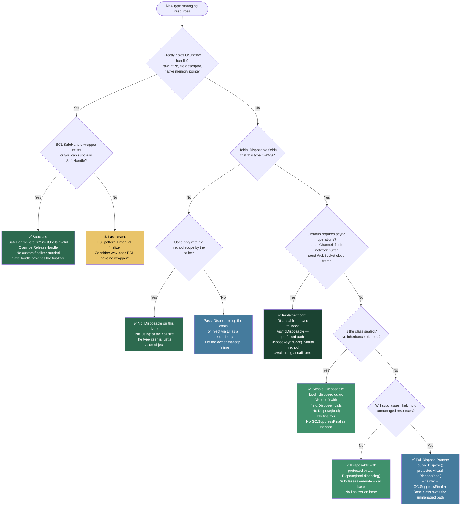

> [!success] Mastery Check
> - [ ] **Studied Well**
> - [ ] **Can explain the concept without notes**
> - [ ] **Can answer interview questions confidently**
> - [ ] **Can implement it in a real project**


## 📍 PART 0 — Navigation & Context

### Where This Topic Lives

```
C# Runtime Model
└── Resource & Lifetime Management
    ├── GC and the Managed Heap (2.40)
    ├── Value Types vs. Reference Types (2.16)
    ├── ► IDisposable, IAsyncDisposable, and Resource Management  ← YOU ARE HERE
    ├──   async/await: The State Machine (2.29)  ← await using depends on this
    ├──   Unsafe Code and Interop (2.51)         ← SafeHandle lives there
    └──   Dependency Injection Internals (2.47)  ← scopes are IDisposable
```

### What You Need Before This

- How the GC manages the heap and generations — [[2.40 — GC Interaction, Finalizers, and WeakReference]]
- Why reference types live on the heap and what that means for object lifetime — [[2.16 — Value Types vs Reference Types]]
- The basics of `async`/`await` and what `await` does to control flow — [[2.29 — async/await: The State Machine]]
- The general concept of try/finally as a cleanup mechanism — [[2.15 — Exception Handling: Fundamentals]]

### What This Unlocks After

- Correctly wrapping OS handles with SafeHandle and P/Invoke — [[2.51 — Unsafe Code and Interop]]
- Understanding the two-collection finalization cost in depth — [[2.40 — GC Interaction, Finalizers, and WeakReference]]
- Scoped lifetime management in DI containers (IServiceScope is IDisposable) — [[2.47 — Dependency Injection Internals]]
- IMemoryOwner<T> buffer patterns for zero-allocation code — [[2.38 — Spans, Memory, and Zero-Copy Patterns]]

**Why this matters at scale:** Every production system eventually hits resource leak failure — connection pool exhaustion, a file lock that blocks a deployment, a socket that hangs a load balancer health check. `IDisposable` is the contract that prevents all of these. Understanding it deeply is the difference between a system that degrades gracefully under load and one that fails at 3 AM.

---

## 🧠 PART 1 — The Core Mental Model

### The Fundamental Rule

> **The GC reclaims memory automatically. It cannot reclaim OS handles, database connections, sockets, or file descriptors. `IDisposable` is your contract for deterministic cleanup of everything the GC doesn't manage — and `using` enforces that contract unconditionally, even when exceptions happen.**

The practical consequence: every type that holds a connection, a stream, a native handle, a rented buffer, or any resource with a bounded system-wide pool must implement `IDisposable`. Callers must `using` it. When this discipline breaks down, resources leak — quietly, at runtime, under load, in production.

### The Plain-Language Analogy

Renting a hotel room is the resource. The GC is a hotel maid who eventually cleans up rooms — but on her own schedule, maybe hours after you've left, and only after checking every room in the building. `IDisposable.Dispose()` is the act of checking out: you hand in the key card the moment you're done, the room is immediately available for the next guest.

The `using` statement is the hotel's automatic checkout system: it checks you out whether you leave voluntarily (normal flow) or get escorted out (an exception). Without it, you have to remember to hand in the key manually — and the moment you forget, that room is locked, other guests are queued in the lobby, and the hotel has a connection-pool-exhaustion problem.

The finalizer (`~MyClass()`) is the maid's emergency fallback: if a guest vanishes without checking out, she'll eventually clean the room — but she might do it hours later, there's only one maid, and she can only do one room at a time. Her schedule is not your schedule.

### The Dispose and Cleanup Taxonomy

```mermaid
graph TD
    A["Resource Cleanup Mechanisms"] --> B["Deterministic Sync\nIDisposable"]
    A --> C["Deterministic Async\nIAsyncDisposable"]
    A --> D["Non-Deterministic\nGC Finalizer"]

    B --> B1["using statement\n(C# 1+, exception-safe try/finally)"]
    B --> B2["using declaration\n(C# 8+, scope-based)"]
    B --> B3["Manual .Dispose() call\n(discouraged — no exception safety)"]

    C --> C1["await using statement\n(calls DisposeAsync, awaits it)"]
    C --> C2["await using declaration\n(C# 8+, scope-based async)"]

    D --> D1["~Destructor finalizer\n(finalizer thread, non-deterministic)"]
    D --> D2["SafeHandle / CriticalFinalizerObject\n(guaranteed to run, race-condition safe)"]
    D --> D3["GC.SuppressFinalize\n(cancel finalization after Dispose)"]

    E["Ownership Patterns"] --> E1["Type owns resource\n(dispose in Dispose)"]
    E --> E2["Borrowed resource\nleaveOpen flag convention"]
    E --> E3["IMemoryOwner<T>\nreturn to pool on Dispose"]

    style B fill:#2d6a4f,color:#fff
    style C fill:#1b4332,color:#fff
    style D fill:#9b2226,color:#fff
    style E fill:#1d3557,color:#fff
    style B1 fill:#40916c,color:#fff
    style B2 fill:#40916c,color:#fff
    style B3 fill:#e9c46a,color:#000
    style C1 fill:#52b788,color:#000
    style C2 fill:#52b788,color:#000
    style D1 fill:#c9184a,color:#fff
    style D2 fill:#ae2012,color:#fff
    style D3 fill:#e9c46a,color:#000
    style E1 fill:#457b9d,color:#fff
    style E2 fill:#457b9d,color:#fff
    style E3 fill:#457b9d,color:#fff
```



> [!IMPORTANT] The Two Cleanup Paths There are exactly two paths that clean up a resource: **Dispose()** (called by your code, deterministic) and the **finalizer** (called by the GC, non-deterministic). The full Dispose pattern exists to serve both paths correctly. `GC.SuppressFinalize(this)` in `Dispose()` is the bridge between them — it tells the GC "I already cleaned up, skip the finalizer." Failing to call it means every correctly-disposed object still goes through finalization — a silent performance tax.

---

## 🔬 PART 2 — Deep Mechanics

### 2.1 The `using` Statement: Compiler Lowering and Exception Safety

The `using` statement is syntactic sugar. The compiler transforms it into a try/finally — the critical property being that `finally` runs unconditionally, even when an exception is propagating through the call stack.

```
━━━━━━━━━━━━━━━━━━━━━━━━━━━━━━━━━━━━━━━━━━━━━━━━━━━━━━━━━━━━━
COMPILER LOWERING: using statement (C# 1+)
━━━━━━━━━━━━━━━━━━━━━━━━━━━━━━━━━━━━━━━━━━━━━━━━━━━━━━━━━━━━━

// What you write (payment service — reading transaction records):
using (var reader = new SqlDataReader(cmd))
{
    while (reader.Read())
        ProcessPaymentRow(reader);
}

// What the compiler generates:
SqlDataReader reader = new SqlDataReader(cmd);
try
{
    while (reader.Read())
        ProcessPaymentRow(reader);
}
finally
{
    // For REFERENCE TYPES (common case):
    if (reader != null)
        ((IDisposable)reader).Dispose();  // ← runs even if Read() throws
}

// IL generated for the Dispose call (reference type):
//   ldloc.0         // load reader
//   brfalse.s EXIT  // if null, skip
//   ldloc.0
//   callvirt  instance void [System.Runtime]System.IDisposable::Dispose()
// EXIT:
//   endfinally

// For VALUE TYPES implementing IDisposable:
// The compiler uses the 'constrained.' IL prefix — NO boxing:
//   constrained. MyValueTypeStruct
//   callvirt  instance void [System.Runtime]System.IDisposable::Dispose()
// → Calls Dispose() directly on the struct. Zero heap allocation.
//
// Cost: O(1), essentially zero overhead — it IS just a try/finally.

━━━━━━━━━━━━━━━━━━━━━━━━━━━━━━━━━━━━━━━━━━━━━━━━━━━━━━━━━━━━━
C# 8 USING DECLARATION: scope extends to end of enclosing block
━━━━━━━━━━━━━━━━━━━━━━━━━━━━━━━━━━━━━━━━━━━━━━━━━━━━━━━━━━━━━

// What you write:
void ProcessPayments(string srcPath, string dstPath)
{
    using var reader = new StreamReader(srcPath);   // C# 8+
    using var writer = new StreamWriter(dstPath);   // C# 8+
    string? line;
    while ((line = reader.ReadLine()) != null)
        writer.WriteLine(Transform(line));
}   // ← BOTH disposed here, in REVERSE declaration order

// What the compiler generates (nested try/finally):
void ProcessPayments(string srcPath, string dstPath)
{
    StreamReader reader = new StreamReader(srcPath);
    try
    {
        StreamWriter writer = new StreamWriter(dstPath);
        try
        {
            string? line;
            while ((line = reader.ReadLine()) != null)
                writer.WriteLine(Transform(line));
        }
        finally { writer?.Dispose(); }   // writer disposed first (inner)
    }
    finally { reader?.Dispose(); }       // reader disposed second (outer)
}
```

> [!TIP] LIFO Disposal Order with Multiple using Declarations When you write multiple `using var` declarations in the same scope, they are disposed in **reverse declaration order** — last declared, first disposed. This mirrors natural stack discipline and ensures an inner resource (often dependent on the outer one) is cleaned up before the resource it depends on.

### 2.2 The Full Dispose Pattern: Managed vs Unmanaged Resource Paths

The "full Dispose pattern" exists because there are two cleanup contexts with different safety rules: explicit disposal (your code) and the GC finalizer. Each path has a different answer to the question "can I safely touch managed objects right now?"

```csharp
// Use the FULL PATTERN when your class:
//   (a) directly holds an unmanaged resource (IntPtr, file descriptor), OR
//   (b) is not sealed and subclasses might add unmanaged resources.

public class DatabaseSession : IDisposable
{
    // ── Fields ──────────────────────────────────────────────────────
    private SqlConnection? _connection;    // managed IDisposable
    private IntPtr         _nativeHandle;  // unmanaged — raw OS handle
    private bool           _disposed;

    // ── Constructor ──────────────────────────────────────────────────
    public DatabaseSession(string connectionString)
    {
        _connection   = new SqlConnection(connectionString);
        _nativeHandle = NativeLib.AcquireHandle(); // hypothetical P/Invoke
    }

    // ── Public API — guard every public method ────────────────────────
    public void ExecuteQuery(string sql)
    {
        // ObjectDisposedException.ThrowIf: .NET 7+, zero-allocation on happy path
        ObjectDisposedException.ThrowIf(_disposed, this);
        _connection!.Open();
        // ...
    }

    // ── IDisposable: Public Entry Point ───────────────────────────────
    public void Dispose()
    {
        Dispose(disposing: true);

        // CRITICAL: removes this object from the finalization queue.
        // Without this, the GC will still run the finalizer even though
        // we already cleaned up — one wasted GC cycle per disposed object.
        GC.SuppressFinalize(this);
    }

    // ── Finalizer: GC Safety Net ──────────────────────────────────────
    // ADD A FINALIZER only when this class DIRECTLY holds unmanaged resources.
    // If you only hold managed IDisposable fields → OMIT the finalizer.
    // Those fields' own finalizers (if any) handle the GC path.
    ~DatabaseSession()
    {
        Dispose(disposing: false);
    }

    // ── Core Cleanup Logic ────────────────────────────────────────────
    protected virtual void Dispose(bool disposing)
    {
        if (_disposed) return;

        if (disposing)
        {
            // ── MANAGED cleanup: ONLY when called by your code ──
            // From the finalizer path (disposing == false), managed objects
            // may already be partially collected by the GC. Touching them
            // is unsafe — their state is undefined.
            _connection?.Dispose();
            _connection = null;
        }

        // ── UNMANAGED cleanup: runs in BOTH paths ──
        // Unmanaged handles must be released regardless of whether
        // Dispose() or the finalizer is responsible. This is the entire
        // reason the finalizer exists.
        if (_nativeHandle != IntPtr.Zero)
        {
            NativeLib.ReleaseHandle(_nativeHandle);
            _nativeHandle = IntPtr.Zero;
        }

        _disposed = true;
    }
}
```

**The `bool disposing` parameter — the entire pattern hinges on this:**

```
disposing = true  → Dispose() called by your code (the expected path)
                    Managed objects are ALIVE and safe to access
                    Clean up BOTH managed AND unmanaged resources

disposing = false → Called from the GC finalizer thread
                    Managed objects MAY be collected — do NOT touch them
                    Clean up ONLY unmanaged resources (handles, memory, etc.)
```

### 2.3 Finalizer Mechanics: The Freachable Queue and Two-Collection Cost

This is what actually happens inside the CLR when an object with a finalizer becomes unreachable. Understanding this makes `GC.SuppressFinalize` stop feeling like boilerplate.

```
━━━━━━━━━━━━━━━━━━━━━━━━━━━━━━━━━━━━━━━━━━━━━━━━━━━━━━━━━━━━━
PATH A: Object WITH finalizer — Dispose() NOT called
━━━━━━━━━━━━━━━━━━━━━━━━━━━━━━━━━━━━━━━━━━━━━━━━━━━━━━━━━━━━━

① Creation: new DatabaseSession(cs)
   CLR detects the finalizer and registers the object in the
   Finalization Queue (a list of objects that need finalization)

   HEAP [Gen0]: [ DatabaseSession ]
   Finalization Queue: [ → DatabaseSession ]

② Object becomes unreachable (leaves all scopes, no more references)
   GC Collection 1:
     • GC sees DatabaseSession is unreachable
     • BUT it has a Finalization Queue entry — CANNOT free it yet
     • Moves the pointer to the F-Reachable Queue (finalization-reachable)
     • Object is PROMOTED to Gen1 (it survived a GC collection!)

   HEAP [Gen1]: [ DatabaseSession ]  ← STILL ALIVE — costs memory
   F-Reachable Queue: [ → DatabaseSession ]

③ Finalizer Thread (a single background OS thread, runs concurrently):
     • Pops DatabaseSession from F-Reachable Queue
     • Calls ~DatabaseSession() → Dispose(disposing: false)
     • Only unmanaged resources cleaned. Managed NOT touched.
     • Timing: NON-DETERMINISTIC. Could be ms, could be seconds.
       File is LOCKED the entire time. Pool slot CONSUMED the entire time.

④ GC Collection 2:
     • DatabaseSession has no F-Reachable entry — collected and freed

TOTAL COST: 2 GC collections, 1 finalizer thread invocation,
            resource leaked until finalizer runs,
            object pollutes Gen1 (more expensive future collections)

━━━━━━━━━━━━━━━━━━━━━━━━━━━━━━━━━━━━━━━━━━━━━━━━━━━━━━━━━━━━━
PATH B: Object WITH finalizer — Dispose() called correctly
━━━━━━━━━━━━━━━━━━━━━━━━━━━━━━━━━━━━━━━━━━━━━━━━━━━━━━━━━━━━━

① Creation: same — object registered in Finalization Queue

② Dispose() called (by using statement):
     • Dispose(disposing: true) runs — ALL resources cleaned immediately
     • GC.SuppressFinalize(this) clears the Finalization Queue entry
       (~5 ns — sets a bit in the object's sync block)

③ Object becomes unreachable:
   GC Collection 1:
     • No Finalization Queue entry — collected IMMEDIATELY from Gen0
     • Memory freed in ONE cheap Gen0 collection

TOTAL COST: 1 Gen0 GC collection (cheapest possible path)
            Resource freed at the exact moment Dispose() was called

━━━━━━━━━━━━━━━━━━━━━━━━━━━━━━━━━━━━━━━━━━━━━━━━━━━━━━━━━━━━━
COST TABLE:
┌─────────────────────────────────┬────────────────┬─────────────────────┐
│ Scenario                        │ GC Cost        │ Resource Held Until  │
├─────────────────────────────────┼────────────────┼─────────────────────┤
│ Finalizer, Dispose() not called │ 2 collections  │ Finalizer thread runs│
│ Dispose() + SuppressFinalize    │ 1 Gen0 collect │ Exactly Dispose()    │
│ No finalizer, Dispose() called  │ 1 Gen0 collect │ Exactly Dispose()    │
│ No finalizer, Dispose() skipped │ 1 Gen0 collect │ NEVER released       │
└─────────────────────────────────┴────────────────┴─────────────────────┘
```

> [!DANGER] The Finalizer Thread Is a Single Bottleneck The finalizer thread is one thread, globally, for the entire process. If your system creates objects with finalizers faster than the finalizer thread can process them — common in high-throughput services — the F-Reachable Queue grows without bound. Objects pile up in Gen1 and Gen2. Memory bloat, elevated GC pause times, and eventually out-of-memory conditions follow, even though each individual piece of code looks "correct." The fix is always: call `Dispose()`.

### 2.4 IAsyncDisposable: When Cleanup Needs to Await

`IAsyncDisposable` exists for resources whose cleanup is inherently asynchronous — draining a network buffer, sending a WebSocket close handshake, flushing an async stream, signaling a Channel writer to complete and then draining remaining items.

```csharp
// IAsyncDisposable interface:
public interface IAsyncDisposable
{
    ValueTask DisposeAsync();
}

// ── What await using generates ─────────────────────────────────────────
// What you write:
await using var bus = new OrderEventBus(connectionString);
await bus.PublishAsync(orderPlacedEvent, ct);

// What the compiler generates:
var bus = new OrderEventBus(connectionString);
try
{
    await bus.PublishAsync(orderPlacedEvent, ct);
}
finally
{
    if (bus != null)
        await bus.DisposeAsync().ConfigureAwait(false);
    // ConfigureAwait(false): cleanup should not require any specific
    // SynchronizationContext — the finally runs wherever the thread is.
}

// ── Implementing BOTH IDisposable AND IAsyncDisposable ─────────────────
// The Microsoft-recommended dual-interface pattern:
// async callers use await using (preferred), sync callers use using (fallback).

public sealed class OrderEventBus : IDisposable, IAsyncDisposable
{
    private readonly Channel<OrderEvent>    _buffer;
    private readonly ChannelWriter<OrderEvent> _writer;
    private readonly Task                   _publishingTask;
    private bool                            _disposed;

    public OrderEventBus(string connectionString)
    {
        _buffer         = Channel.CreateBounded<OrderEvent>(capacity: 10_000);
        _writer         = _buffer.Writer;
        _publishingTask = Task.Run(() => PublishLoopAsync());
    }

    // ── Preferred path: async caller ──────────────────────────────────
    public async ValueTask DisposeAsync()
    {
        // Step 1: async cleanup of async resources
        await DisposeAsyncCore().ConfigureAwait(false);

        // Step 2: sync cleanup of sync-only resources.
        // Pass false: managed async resources already cleaned above.
        // This only runs unmanaged cleanup (none here — but follows the pattern).
        Dispose(disposing: false);

        GC.SuppressFinalize(this);
    }

    // ── Fallback path: sync caller ────────────────────────────────────
    public void Dispose()
    {
        Dispose(disposing: true);
        GC.SuppressFinalize(this);
    }

    // ── Core async cleanup ────────────────────────────────────────────
    protected virtual async ValueTask DisposeAsyncCore()
    {
        if (_disposed) return;

        // Signal: no more events will be written
        _writer.TryComplete();

        // Wait for publishing loop to drain all buffered events
        await _publishingTask.ConfigureAwait(false);

        _disposed = true;
    }

    // ── Core sync cleanup ─────────────────────────────────────────────
    protected virtual void Dispose(bool disposing)
    {
        if (_disposed) return;
        if (disposing)
        {
            // Best-effort sync close: events in buffer may be lost
            _writer.TryComplete();
        }
        _disposed = true;
    }

    private async Task PublishLoopAsync() { /* consume _buffer, send to broker */ }
}
```

> [!WARNING] `using` vs `await using` on Dual-Interface Types If a type implements both `IDisposable` and `IAsyncDisposable`:
> 
> - `using var x = ...` → calls `Dispose()` (the sync path)
> - `await using var x = ...` → calls `DisposeAsync()` (the async path)
> 
> These are **distinct dispatch targets**. Using `using` on a type that requires an async network flush means the flush silently never happens. In async code, always use `await using`.

### 2.5 SafeHandle: The Correct Wrapper for OS Handles

`SafeHandle` solves a race condition that raw `IntPtr` + finalizer cannot: what happens if the GC fires the finalizer while a P/Invoke call is still in flight using the handle?

```
CriticalFinalizerObject (abstract, CLR special)
  ↳ Finalizer guaranteed to run even during:
      • Stack overflows
      • Out-of-memory during JIT compilation
      • Rude AppDomain unloads
  ↳ SafeHandle (abstract)
      ↳ SafeHandleZeroOrMinusOneIsInvalid (abstract)
          • IsInvalid: returns true when handle == 0 or -1
          • Your subclass overrides ReleaseHandle()
          ↳ SafeFileHandle        (.NET runtime)
          ↳ SafeWaitHandle        (.NET runtime)
          ↳ NativeFileHandle      (your custom type — see below)
      ↳ SafeHandleMinusOneIsInvalid (abstract)
          ↳ SafePipeHandle        (.NET runtime)

Race condition that SafeHandle eliminates:
  Thread A (finalizer): calls CloseHandle(handle N)   ← handle N is now invalid
  Thread B (P/Invoke):  call is in-flight using N     ← OS recycles N to new resource
  Thread B:             operates on the WRONG resource ← security vulnerability

SafeHandle prevention:
  P/Invoke marshaler calls DangerousAddRef() before the P/Invoke call
  P/Invoke marshaler calls DangerousRelease() after it returns
  ReleaseHandle() only fires when ref count reaches zero
  Handle recycling attack: impossible
```

```csharp
// Correct SafeHandle subclass for a native file handle
public sealed class NativeFileHandle : SafeHandleZeroOrMinusOneIsInvalid
{
    // Constructor private: instances created only by NativeMethods.OpenFile()
    // The CLR's P/Invoke marshaler can also construct these directly.
    private NativeFileHandle() : base(ownsHandle: true) { }

    // ReleaseHandle: called by finalizer OR by Dispose().
    // Contract: MUST NOT throw. Must return true on success, false on failure.
    // The CLR may retry on false in some hosting environments.
    protected override bool ReleaseHandle()
    {
        return NativeMethods.CloseHandle(handle);
        // 'handle' is the protected IntPtr field from SafeHandle.
        // After this returns, 'handle' is set to the "invalid" sentinel value.
    }
}

public static class NativeMethods
{
    [DllImport("kernel32.dll", SetLastError = true, CharSet = CharSet.Unicode)]
    public static extern NativeFileHandle CreateFile(
        string lpFileName,
        uint   dwDesiredAccess,
        uint   dwShareMode,
        IntPtr lpSecurityAttributes,
        uint   dwCreationDisposition,
        uint   dwFlagsAndAttributes,
        IntPtr hTemplateFile);

    // CloseHandle takes IntPtr — SafeHandle's base class extracts the raw value
    [DllImport("kernel32.dll", SetLastError = true)]
    [return: MarshalAs(UnmanagedType.Bool)]
    internal static extern bool CloseHandle(IntPtr hObject);
}

// Usage: just use it like any IDisposable — SafeHandle handles everything
using var fileHandle = NativeMethods.CreateFile(
    "payment_log.bin",
    0x80000000,  // GENERIC_READ
    1,           // FILE_SHARE_READ
    IntPtr.Zero,
    3,           // OPEN_EXISTING
    0,
    IntPtr.Zero);

if (fileHandle.IsInvalid)
    throw new Win32Exception(Marshal.GetLastWin32Error());

// fileHandle.Dispose() calls ReleaseHandle() → CloseHandle() at end of using
```

> [!TIP] Use SafeHandle, Never Raw IntPtr If you're wrapping a native handle, never use `IntPtr` directly. Microsoft switched the entire .NET runtime away from raw `IntPtr` to `SafeHandle` precisely because the raw approach had correctness and security vulnerabilities. The overhead is one small heap object wrapper — it is never worth avoiding `SafeHandle` to save that.

---

## 💻 PART 3 — Production Code Patterns

### 3.1 The Full Pattern for Non-Sealed Classes with Unmanaged Resources

```csharp
// Scenario: an order processing service holding both a managed SqlConnection
// and a native performance counter handle from the OS.

public class OrderProcessingService : IDisposable
{
    private SqlConnection? _db;             // managed — has its own cleanup
    private IntPtr         _perfHandle;     // unmanaged — requires our finalizer
    private bool           _disposed;

    public OrderProcessingService(string connectionString)
    {
        _db         = new SqlConnection(connectionString);
        _perfHandle = NativePerfCounters.Open("Orders/sec");
    }

    // Guard every public method — use-after-Dispose must be detectable
    public void ProcessOrder(Order order)
    {
        ObjectDisposedException.ThrowIf(_disposed, this);
        // ...implementation
    }

    // Public entry point: your callers only ever call this
    public void Dispose()
    {
        Dispose(disposing: true);
        GC.SuppressFinalize(this); // ← prevents the two-collection tax on every disposed instance
    }

    // Finalizer: only justified because we hold _perfHandle (unmanaged)
    // If _perfHandle didn't exist, omit this entirely
    ~OrderProcessingService() => Dispose(disposing: false);

    // Extension point: subclasses override this to add their own cleanup
    protected virtual void Dispose(bool disposing)
    {
        if (_disposed) return;

        if (disposing)
        {
            // Managed cleanup: safe here — called from Dispose(), objects are alive
            _db?.Dispose();
            _db = null;
        }

        // Unmanaged cleanup: runs in BOTH paths — this is the whole point of the finalizer
        if (_perfHandle != IntPtr.Zero)
        {
            NativePerfCounters.Close(_perfHandle);
            _perfHandle = IntPtr.Zero;
        }

        _disposed = true;
    }
}

// Subclass adds a managed resource — follows the same pattern
public sealed class BulkOrderService : OrderProcessingService
{
    private readonly Channel<Order> _inbound;

    public BulkOrderService(string cs) : base(cs)
    {
        _inbound = Channel.CreateUnbounded<Order>();
    }

    protected override void Dispose(bool disposing)
    {
        if (disposing)
            _inbound.Writer.TryComplete(); // signal no more orders
        base.Dispose(disposing);           // ALWAYS call base — base resources cleaned here
    }
}
```

### 3.2 The Simple Pattern for Sealed Classes with Only Managed Resources

When a class is `sealed` and holds only managed `IDisposable` fields — the common case — skip the full pattern. No finalizer, no `Dispose(bool)`, no `GC.SuppressFinalize`.

```csharp
// Scenario: a payment gateway client wrapping HttpClient and SqlConnection.
// Sealed + no unmanaged resources = the minimal correct implementation.

public sealed class PaymentGatewayClient : IDisposable
{
    private readonly HttpClient    _http;
    private readonly SqlConnection _auditDb;
    private bool                   _disposed;

    public PaymentGatewayClient(string gatewayBaseUrl, string auditConnectionString)
    {
        _http    = new HttpClient { BaseAddress = new Uri(gatewayBaseUrl) };
        _auditDb = new SqlConnection(auditConnectionString);
    }

    public async Task<ChargeResult> ChargeAsync(ChargeRequest request, CancellationToken ct = default)
    {
        ObjectDisposedException.ThrowIf(_disposed, this);
        // ...implementation
        return new ChargeResult();
    }

    public void Dispose()
    {
        if (_disposed) return;

        // Dispose in REVERSE creation order (if b depends on a, dispose b first)
        _auditDb.Dispose(); // no dependency on _http
        _http.Dispose();

        _disposed = true;
        // No GC.SuppressFinalize — there is no finalizer to suppress
        // No Dispose(bool) — sealed class, no inheritance, no unmanaged resources
        // No finalizer — HttpClient and SqlConnection have their own
    }
}
```

### 3.3 The Owned vs Borrowed Resource Pattern

When your constructor accepts an `IDisposable`, you must decide: do you own it (and must dispose it), or is it borrowed from the caller? The BCL uses the `leaveOpen` flag convention throughout (`StreamWriter`, `BinaryWriter`, `ZipArchive`).

```csharp
// Scenario: CsvOrderWriter wraps a Stream. Caller decides ownership.

public sealed class CsvOrderWriter : IDisposable
{
    private readonly StreamWriter _writer;
    private readonly bool         _leaveOpen; // false = we own; true = caller owns
    private bool                  _disposed;

    // ⚠️ WRONG — assumes ownership silently, always disposes:
    // public CsvOrderWriter(Stream s) { _writer = new StreamWriter(s); }

    // ✅ CORRECT — follows BCL convention with explicit ownership signal
    public CsvOrderWriter(Stream stream, bool leaveOpen = false)
    {
        // Pass leaveOpen: true to StreamWriter — it won't close the Stream.
        // We manage Stream lifetime ourselves via _leaveOpen.
        _writer    = new StreamWriter(stream, leaveOpen: true);
        _leaveOpen = leaveOpen;
    }

    public void WriteOrder(Order order)
    {
        ObjectDisposedException.ThrowIf(_disposed, this);
        _writer.WriteLine($"{order.Id},{order.Amount},{order.Currency},{order.Timestamp:O}");
    }

    public void Dispose()
    {
        if (_disposed) return;

        // Always flush before closing — otherwise buffered data is lost
        try { _writer.Flush(); } catch { /* swallow — never throw from Dispose() */ }

        if (!_leaveOpen)
        {
            // We own the underlying Stream — disposing the writer closes it
            _writer.Dispose();
        }
        else
        {
            // Caller owns the Stream — only dispose the writer's internal state
            // (The underlying stream stays open for the caller to continue using)
        }

        _disposed = true;
    }
}

// Caller owns the stream — keeps it open after writer is done:
using var stream = new FileStream("orders.csv", FileMode.Create);
using var writer = new CsvOrderWriter(stream, leaveOpen: true);
writer.WriteOrder(order);
// stream still open here — caller can write more to it

// Writer owns the stream — closes everything:
using var writer2 = new CsvOrderWriter(new FileStream("orders.csv", FileMode.Create));
writer2.WriteOrder(order);
// FileStream closed when writer2.Dispose() is called
```

### 3.4 The IAsyncDisposable Channel Drain Pattern

```csharp
// Scenario: a domain event bus that buffers events and publishes to a message broker.
// DisposeAsync drains the buffer before closing — critical for at-least-once delivery.

public sealed class DomainEventBus : IAsyncDisposable
{
    private readonly Channel<DomainEvent>      _buffer;
    private readonly ChannelWriter<DomainEvent> _writer;
    private readonly IMessageBroker             _broker;
    private readonly Task                       _publishLoop;

    public DomainEventBus(IMessageBroker broker, int capacity = 50_000)
    {
        _broker  = broker;
        _buffer  = Channel.CreateBounded<DomainEvent>(
            new BoundedChannelOptions(capacity) { FullMode = BoundedChannelFullMode.Wait });
        _writer      = _buffer.Writer;
        _publishLoop = Task.Run(RunPublishLoopAsync);
    }

    public async ValueTask PublishAsync(DomainEvent @event, CancellationToken ct = default)
        => await _writer.WriteAsync(@event, ct).ConfigureAwait(false);

    private async Task RunPublishLoopAsync()
    {
        await foreach (var evt in _buffer.Reader.ReadAllAsync().ConfigureAwait(false))
            await _broker.PublishAsync(evt).ConfigureAwait(false);
    }

    public async ValueTask DisposeAsync()
    {
        // Step 1: signal no more events — writer is done
        _writer.TryComplete();

        // Step 2: WAIT for all buffered events to be published before returning.
        // This is the async cleanup that justifies IAsyncDisposable.
        // A synchronous Dispose() cannot do this without blocking a thread.
        await _publishLoop.ConfigureAwait(false);

        // All buffered events delivered. Safe to shut down the broker connection.
    }
}

// Usage — await using guarantees drain before the bus object is released:
await using var bus = new DomainEventBus(broker);
foreach (var evt in eventsToPublish)
    await bus.PublishAsync(evt, ct);
// DisposeAsync: signals completion, awaits the drain, then returns
// Every event is guaranteed to have been published before this scope exits
```

### 3.5 The IMemoryOwner<T> Buffer Rental Pattern

`IMemoryOwner<T>` implements `IDisposable` for a reason: disposing it returns the rented buffer to the pool.

```csharp
// Scenario: parsing incoming payment batch files with zero buffer allocation.
// IMemoryOwner<T> wraps an ArrayPool<T> rental — Dispose returns the array.

public async Task<IReadOnlyList<Payment>> ParsePaymentBatchAsync(
    Stream batchStream, CancellationToken ct = default)
{
    // Rent from the shared pool — no heap allocation for the buffer
    using IMemoryOwner<byte> bufferOwner =
        MemoryPool<byte>.Shared.Rent(minBufferSize: 64 * 1024);

    Memory<byte> buffer   = bufferOwner.Memory;
    int          bytesRead = await batchStream
        .ReadAsync(buffer, ct)
        .ConfigureAwait(false);

    ReadOnlyMemory<byte> data     = buffer[..bytesRead];
    var                  payments = new List<Payment>();
    ParseInto(data.Span, payments);

    return payments;
    // bufferOwner.Dispose() at end of 'using': array returned to MemoryPool
    // Net allocation: zero for the buffer, only the List<Payment> and its contents
}

// When you need ArrayPool directly (more control over clear-on-return):
public static void TransformOrderBatch(ReadOnlySpan<byte> input)
{
    byte[] workBuffer = ArrayPool<byte>.Shared.Rent(input.Length * 2);
    try
    {
        TransformData(input, workBuffer);
        WriteOutput(workBuffer.AsSpan(0, input.Length * 2));
    }
    finally
    {
        // MUST be in finally — exceptions must not leak the array back to the pool unreturned
        ArrayPool<byte>.Shared.Return(workBuffer, clearArray: true);
        // clearArray: true — wipes contents before returning.
        // Use true for sensitive financial data to prevent data leakage between callers.
    }
}
```

### 3.6 The Thread-Safe Dispose Guard

`Dispose()` must be idempotent (callable multiple times, no-op after first). In multi-threaded scenarios, a `bool` field is not sufficient — two threads could both pass the `if (_disposed) return;` check simultaneously. Use `Interlocked.Exchange`.

```csharp
// ⚠️ WRONG: race condition — two threads can both see _disposed == false simultaneously
public void Dispose()
{
    if (_disposed) return;  // NOT thread-safe
    _connection.Dispose();
    _disposed = true;
}

// ✅ CORRECT for single-threaded use: the simple bool guard (sufficient in most cases)
public void Dispose()
{
    if (_disposed) return;
    _connection.Dispose();
    _disposed = true;
    GC.SuppressFinalize(this);
}

// ✅ CORRECT for genuinely multi-threaded disposal scenarios:
private int _disposedFlag; // 0 = not disposed, 1 = disposed

public void Dispose()
{
    // Interlocked.Exchange returns the PREVIOUS value and sets to 1 atomically.
    // If the previous value was already 1, someone else disposed — exit.
    // If the previous value was 0, WE are the designated disposer — proceed.
    if (Interlocked.Exchange(ref _disposedFlag, 1) == 1)
        return;

    _connection.Dispose();
    GC.SuppressFinalize(this);
}

// ✅ Guard all public methods — ObjectDisposedException is the correct failure
public void ExecuteQuery(string sql)
{
    // Old way (pre-.NET 7):
    // if (_disposedFlag == 1)
    //     throw new ObjectDisposedException(nameof(DatabaseSession));

    // New way (.NET 7+): zero allocation on the happy path, clear intent
    ObjectDisposedException.ThrowIf(_disposedFlag == 1, this);

    // ...
}
```

---

## ⚠️ PART 4 — Gotchas & Anti-Patterns

### Gotcha 1: Throwing Exceptions from Dispose()

Engineers who add flush logic to `Dispose()` often forget that if `Dispose()` throws while another exception is already propagating from the `using` body, the original exception is **permanently lost** — replaced by the Dispose exception. Debugging becomes impossible because the error you see is never the error that caused the problem.

```csharp
// ⚠️ WRONG: Dispose can mask the original exception
public void Dispose()
{
    _writer.Flush();   // If this throws AND we're already handling an exception,
                       // the ORIGINAL exception disappears. You see Flush's exception.
    _writer.Dispose();
}

// ✅ CORRECT: Swallow (and log) exceptions in Dispose()
public void Dispose()
{
    try
    {
        _writer.Flush(); // Best-effort — if disk is full, we still continue
    }
    catch (Exception ex)
    {
        // Log at debug/warning level — this is a best-effort operation
        _logger?.LogWarning(ex, "Flush failed during disposal of {Type}", GetType().Name);
    }

    try { _writer.Dispose(); }
    catch { /* StreamWriter.Dispose is normally safe — swallow as defensive measure */ }
}

// WHY: C# spec §8.9.5 — an exception from a finally block replaces any in-flight
// exception. The runtime has no "aggregate multiple exceptions from one using block"
// feature. Dispose() MUST NOT throw.
```

### Gotcha 2: Missing GC.SuppressFinalize — The Silent Performance Tax

Adding a finalizer without `GC.SuppressFinalize` in `Dispose()` means every correctly-disposed object still enters the finalization pipeline. In a payment processing service creating 5,000 transaction objects per minute, this silently doubles the GC work without any error or warning.

```csharp
// ⚠️ WRONG: Finalizer present, SuppressFinalize absent
public class InvoiceBuilder : IDisposable
{
    private IntPtr _pdfHandle;

    ~InvoiceBuilder() => CloseHandle(_pdfHandle);

    public void Dispose()
    {
        CloseHandle(_pdfHandle);
        _pdfHandle = IntPtr.Zero;
        // ❌ Missing GC.SuppressFinalize(this)
        // Every disposed InvoiceBuilder STILL enters the finalization queue.
        // 5,000 objects/min × promoted to Gen1 = enormous GC pressure.
        // Symptoms: elevated Gen1/Gen2 collections, spiky GC pauses.
    }
}

// ✅ CORRECT:
public void Dispose()
{
    Dispose(disposing: true);
    GC.SuppressFinalize(this); // ← sets a bit in the object header, ~5 ns
}

// WHY: GC.SuppressFinalize removes the object from the finalization tracking list.
// The object becomes eligible for Gen0 collection immediately — one cycle, not two.
// The overhead of the call is negligible relative to the GC savings.
```

### Gotcha 3: Not Calling base.Dispose(bool) in a Derived Class

In an inheritance hierarchy, forgetting `base.Dispose(disposing)` silently leaks all base-class resources. There is no compile error, no runtime warning. The resources just never get cleaned up.

```csharp
// ⚠️ WRONG: Base class resources are NEVER cleaned up
public class AdvancedOrderService : OrderProcessingService
{
    private readonly IMessageBus _bus;

    public AdvancedOrderService(string cs, IMessageBus bus) : base(cs) => _bus = bus;

    protected override void Dispose(bool disposing)
    {
        if (disposing)
            _bus.Dispose();
        // ❌ base.Dispose(disposing) NEVER CALLED
        // _db and _perfHandle in the base class are NEVER cleaned up.
        // SqlConnection pool exhausts. Native handle leaks.
    }
}

// ✅ CORRECT: call base as the last statement in every override
protected override void Dispose(bool disposing)
{
    if (disposing)
        _bus.Dispose(); // Our stuff first (reverse dependency order)
    base.Dispose(disposing); // ALWAYS last — cleans up base class resources
}

// WHY: The pattern's `virtual protected Dispose(bool)` exists precisely as an extension
// hook for derived classes. Forgetting `base.Dispose` defeats the entire design.
// Roslyn analyzers (CA2215) will flag this, but only if enabled.
```

### Gotcha 4: `using` Instead of `await using` on a Dual-Interface Type

When a type implements both `IDisposable` and `IAsyncDisposable`, both compile fine in a `using` block. But they do different things. Using the wrong one silently skips the async cleanup — no error, no warning. In production this means network buffers never flush, WebSocket close frames are never sent, and events in a Channel are lost.

```csharp
// ⚠️ WRONG: Uses sync Dispose on a type that requires async cleanup
// WebSocketSession implements both interfaces.
// IDisposable.Dispose() abruptly closes the socket — no graceful handshake.
// IAsyncDisposable.DisposeAsync() sends the WebSocket close frame and waits.

using var session = new WebSocketSession(socket); // ← sync Dispose called
await session.ProcessAsync(ct);
// Result: socket closed with TCP RST instead of WebSocket close handshake.
// Client logs: "The WebSocket connection was terminated before the handshake completed."

// ✅ CORRECT: in any async method, always prefer await using
await using var session = new WebSocketSession(socket); // ← DisposeAsync called
await session.ProcessAsync(ct);
// Result: graceful WebSocket close frame sent, ACK waited for. Correct protocol.

// WHY: The compiler resolves:
//   'using'       → IDisposable.Dispose()
//   'await using' → IAsyncDisposable.DisposeAsync()
// There is no compiler warning when you use 'using' on a dual-interface type.
// The silent wrong choice is always 'using' in async code.
```

### Gotcha 5: Class Holds IDisposable Fields But Doesn't Implement IDisposable

A class that holds `IDisposable` fields but doesn't itself implement `IDisposable` silently leaks those resources. The code looks completely correct. There is no compilation error. The leak only appears under load in production.

```csharp
// ⚠️ WRONG: holds managed resources, never disposes them
public class OrderRepository
{
    private readonly SqlConnection _connection; // IDisposable — never disposed!
    private readonly SqlCommand    _selectCmd;  // IDisposable — never disposed!

    public OrderRepository(string cs)
    {
        _connection = new SqlConnection(cs);
        _selectCmd  = new SqlCommand("SELECT * FROM Orders", _connection);
    }
    // No Dispose() → SqlConnection stays open until GC finalizer runs.
    // Under load: connection pool (default: 100) exhausted within minutes.
    // Symptom: SqlException "Timeout expired. The timeout period elapsed prior
    //           to obtaining a connection from the pool."
}

// ✅ CORRECT: propagate IDisposable upward through the ownership chain
public sealed class OrderRepository : IDisposable
{
    private readonly SqlConnection _connection;
    private readonly SqlCommand    _selectCmd;
    private bool                   _disposed;

    public OrderRepository(string cs)
    {
        _connection = new SqlConnection(cs);
        _selectCmd  = new SqlCommand("SELECT * FROM Orders", _connection);
    }

    public void Dispose()
    {
        if (_disposed) return;
        _selectCmd.Dispose();   // dispose in reverse creation order
        _connection.Dispose();  // _selectCmd depends on _connection
        _disposed = true;
    }
}

// WHY: The rule is simple: if you create or own an IDisposable, your type MUST
// implement IDisposable and dispose it. Ownership of resources propagates up the
// call chain until it reaches a using statement or a DI scope boundary.
```

---

## 📊 PART 5 — Performance Implications

### 5.1 Allocation Characteristics Table

|Scenario|Allocation Behavior|Approx Cost|
|---|---|--:|
|`using` statement / declaration|Zero overhead — compiles to try/finally|~0 ns|
|`await using` (sync completion path)|Zero alloc — `ValueTask` completes inline, no Task object|~0 ns|
|`await using` (truly async path, awaits)|One Task allocation|~48 bytes|
|Creating object WITH finalizer|Registered in finalization queue (internal CLR tracking)|~10 ns extra at ctor|
|GC collecting finalized object (no Dispose)|Survives one extra collection; promoted to next generation|2× GC cycles|
|`GC.SuppressFinalize(this)`|Clears finalization queue entry (bit flip in sync block)|~5 ns|
|`IMemoryOwner<T>` from `MemoryPool<T>`|One wrapper object; buffer comes from pool (no buffer alloc)|~24 bytes wrapper|
|`ArrayPool<T>.Shared.Rent()`|Zero allocation — returns existing pooled array|~10 ns lookup|
|Object WITHOUT finalizer — correct Dispose|Normal Gen0 collection after Dispose + scope end|baseline|
|`ObjectDisposedException.ThrowIf` (no exception)|Zero allocation on happy path|~1 ns|
|Double-dispose with bool guard|No allocation — immediate return on second call|~1 ns|

### 5.2 BenchmarkDotNet: Finalization vs Explicit Disposal

```csharp
// Expected output (approximate, .NET 8 x64, Release, GC forced between iterations):
// ┌──────────────────────────────────────┬───────────┬─────────┬──────────┐
// │ Method                               │ Mean      │ Alloc   │ Gen 0    │
// ├──────────────────────────────────────┼───────────┼─────────┼──────────┤
// │ FinalizerOnly_LeakAndCollect (base)  │ 11.8 ms   │ 120 KB  │ very high│
// │ ExplicitDispose_SuppressFinalize     │  1.9 ms   │  40 KB  │ low      │
// │ UsingStatement_ExceptionSafe         │  1.9 ms   │  40 KB  │ low      │
// └──────────────────────────────────────┴───────────┴─────────┴──────────┘
// Finalization path is ~6× slower due to two-collection overhead + finalizer thread.

[MemoryDiagnoser]
[BenchmarkCategory("ResourceManagement")]
public class DisposalStrategyBenchmark
{
    private const int N = 1_000;

    // Worst case: let the GC run finalizers for every object
    [Benchmark(Baseline = true)]
    public void FinalizerOnly_LeakAndCollect()
    {
        for (int i = 0; i < N; i++)
        {
            var r = new FinalizableConnection("Server=perf-test");
            r.UseResource();
            // No Dispose() — GC must process the finalization queue
        }
        // Force the complete two-collection lifecycle to measure it:
        GC.Collect();
        GC.WaitForPendingFinalizers(); // block until finalizer thread drains
        GC.Collect();                  // second pass to actually free the memory
    }

    // Correct: explicit disposal removes from finalization queue
    [Benchmark]
    public void ExplicitDispose_SuppressFinalize()
    {
        for (int i = 0; i < N; i++)
        {
            var r = new FinalizableConnection("Server=perf-test");
            r.UseResource();
            r.Dispose(); // GC.SuppressFinalize inside → one Gen0 collection only
        }
    }

    // Idiomatic: using statement, exception-safe, same perf as explicit
    [Benchmark]
    public void UsingStatement_ExceptionSafe()
    {
        for (int i = 0; i < N; i++)
        {
            using var r = new FinalizableConnection("Server=perf-test");
            r.UseResource();
        }
    }
}

// Stub for benchmarks:
public class FinalizableConnection : IDisposable
{
    private bool _disposed;
    public FinalizableConnection(string cs) { }
    public void UseResource() => Thread.SpinWait(5); // simulate lightweight work

    ~FinalizableConnection() => Dispose(false); // registers in finalization queue

    public void Dispose()
    {
        Dispose(true);
        GC.SuppressFinalize(this);
    }

    protected virtual void Dispose(bool disposing)
    {
        if (_disposed) return;
        _disposed = true;
    }
}
```

### 5.3 When to Care / When to Ignore

**When this costs you:**

- **Connection pool exhaustion:** A web API that creates `SqlConnection` without `using` will drain the default connection pool (100 connections) quickly under any non-trivial load. Symptom: `SqlException: Timeout expired obtaining a connection from the pool.` The pool doesn't refill until the GC finalizes the unreferenced connections — which could take seconds.
- **File lock contention:** Reading a config file without `using var reader = new StreamReader(...)` holds an OS exclusive read lock until the finalizer runs. Any deploy script trying to overwrite the config fails with `IOException: The process cannot access the file because it is being used by another process.`
- **WebSocket protocol violations:** Using `using` instead of `await using` on a `WebSocketSession` sends a TCP RST instead of the WebSocket close handshake. Clients log disconnect errors. Load balancers mark the connection as failed.
- **GC promotion pressure:** Systems creating objects with finalizers at >10,000/minute without disposing them will see objects accumulate in Gen1 and Gen2. Memory profilers show a "bathtub" pattern: objects should be Gen0 short-lived but instead pile up in Gen1. Increased GC pause durations follow.

**When this doesn't matter:**

- Types with no `IDisposable` fields and no unmanaged resources. Adding an empty `Dispose()` is cargo-cult coding — it creates a false impression of cleanup without doing anything.
- Short-lived request-scoped services in ASP.NET Core registered as `Scoped` in the DI container. The DI scope disposes them correctly at the end of each request; you don't need to track them manually.
- One-shot CLI tools where the process exits immediately after the work is done. The OS reclaims all handles on process exit anyway.

---

## 🎤 PART 6 — Interview Arsenal

### 6.1 The Question Bank

---

> **Q: "What is the Dispose pattern and why does it exist?"**

**Average answer:** "`IDisposable` has a `Dispose()` method for cleaning up resources like file handles and database connections. You wrap it in a `using` to make sure it gets called."

**Why that's insufficient:** Correct but shallow. It doesn't explain why the pattern has two paths, what a finalizer does, or when finalization is needed. It also misses `GC.SuppressFinalize` entirely.

**Great answer:**

> "The Dispose pattern exists because the GC manages memory but nothing else — OS handles, database connections, sockets, and file descriptors are invisible to it. If you open a file and the GC never collects the object, the file is locked indefinitely. `IDisposable` gives you a deterministic cleanup path: call `Dispose()`, resource released immediately. The pattern has two paths because there are two cleanup contexts. When `Dispose()` is called by your code, managed objects are alive and safe to access — clean up everything. When the GC finalizer runs instead, you're on a different thread in an undefined state — other managed objects may already be finalized — so you can only safely clean up raw unmanaged handles. That's the purpose of the `bool disposing` parameter in `Dispose(bool)`. The finalizer is a safety net for cases where no one called `Dispose()`. And `GC.SuppressFinalize(this)` in `Dispose()` tells the GC not to bother with the finalizer, because everything is already clean — cutting the object's collection cost from two GC cycles down to one."

---

> **Q: "What's the difference between a finalizer and `Dispose()`?"**

**Average answer:** "A finalizer is called automatically by the GC; `Dispose()` is called by your code."

**Why that's insufficient:** Misses the timing problem, the two-collection cost, the finalizer thread, and when you actually need a finalizer.

**Great answer:**

> "They're both cleanup mechanisms but the timing and cost are fundamentally different. `Dispose()` is called by your code, at the exact moment you decide you're done — deterministic, immediate, and cheap. A finalizer runs on the CLR's single dedicated finalizer thread, non-deterministically — it might fire milliseconds later or seconds later, and there's no ordering guarantee relative to other finalizers. The production consequence is that between the moment an object becomes unreachable and the moment its finalizer runs, the resource is leaked — file locked, connection pool slot consumed, socket open. There's also a CLR-level cost: an object with a finalizer that isn't disposed requires two GC collections to free — the first collection moves it to the f-reachable queue and promotes it to Gen1, the finalizer thread processes it, and only then does a second collection free the memory. That Gen1 promotion is significant in high-throughput systems. The rule I follow: add a finalizer only when you directly hold an unmanaged resource like a raw `IntPtr`. For managed `IDisposable` fields, those types' own finalizers handle the GC path. And whenever you have both, `GC.SuppressFinalize(this)` in `Dispose()` is mandatory — it prevents the two-collection cost on every correctly-disposed object."

---

> **Q: "When would you implement `IAsyncDisposable` instead of or in addition to `IDisposable`?"**

**Average answer:** "When you need to do async work during cleanup."

**Why that's insufficient:** Doesn't give concrete examples, doesn't address the dual-interface question, and doesn't explain what specific operations require `await` in cleanup.

**Great answer:**

> "I reach for `IAsyncDisposable` when cleanup is inherently asynchronous — draining a `Channel<T>` before closing to ensure all buffered messages are delivered, sending a WebSocket close frame and waiting for the client's acknowledgment, flushing a buffered async stream to a network socket, or gracefully stopping a background task. These operations require awaiting; doing them synchronously would either block a thread-pool thread or silently skip the cleanup. In practice I implement both interfaces: `DisposeAsync()` for callers who can await — the preferred path — and `Dispose()` as a best-effort synchronous fallback for callers in non-async code. The critical runtime detail: `using` calls `Dispose()` and `await using` calls `DisposeAsync()` — they're different dispatch targets. If you write `using` on a type that needs `await using`, the async flush silently never happens. The compiler doesn't warn. In async code, I always default to `await using`."

---

> **Q: "What is `SafeHandle` and why should it be preferred over wrapping a raw `IntPtr`?"**

**Average answer:** "`SafeHandle` is the right way to wrap OS handles in .NET."

**Why that's insufficient:** Doesn't explain the race condition that `SafeHandle` solves or the correctness guarantees it provides.

**Great answer:**

> "Raw `IntPtr` + finalizer has a race condition that `SafeHandle` solves at the CLR level. Imagine: Thread A's finalizer fires and closes handle N. Simultaneously, Thread B is in a P/Invoke call using handle N. The OS recycles handle number N to a completely different resource. Thread B is now operating on the wrong resource — a security vulnerability and a correctness bug. `SafeHandle` eliminates this with atomic reference counting. The P/Invoke marshaler calls `DangerousAddRef` before any P/Invoke call and `DangerousRelease` after, so the handle can't close while a native call holds it. `ReleaseHandle()` only runs when the count reaches zero. There's another guarantee: `SafeHandle` inherits from `CriticalFinalizerObject`, which means its finalizer runs even during catastrophic conditions — stack overflows, out-of-memory during JIT, rude AppDomain unloads. A regular finalizer has no such guarantee. The cost of `SafeHandle` over raw `IntPtr` is one small wrapper object. It is never worth avoiding."

---

> **Q: "What does `GC.SuppressFinalize(this)` actually do, mechanically?"**

**Average answer:** "It prevents the finalizer from running."

**Why that's insufficient:** Doesn't explain the internal mechanism, why it matters for performance, or the exact cost.

**Great answer:**

> "Mechanically, `GC.SuppressFinalize` clears a bit in the object's sync block index — a field in the object header that the GC checks during mark-and-sweep. When the GC finds an unreachable object, it reads that bit: if set, the object goes directly into the collection wave; if clear, it goes to the f-reachable queue for finalization. The cost of the call is roughly 5 nanoseconds — a single interlocked operation. The benefit is avoiding the entire two-collection lifecycle: no f-reachable queue entry, no finalizer thread invocation, no Gen1 promotion. An object disposed correctly and with `SuppressFinalize` is collected in its first Gen0 sweep, which is the cheapest possible path. Without it, even a perfectly-disposed object still goes through finalization — wasting a full GC cycle per object. In a system processing thousands of transactions per minute, this adds up to measurable Gen1 collection pressure and increased GC pause times."

---

### 6.2 The Trick Questions

> [!WARNING] These Sound Simple But Have Non-Obvious Answers

**"Can a struct implement `IDisposable`?"** Trap: "Structs are value types, so they can't implement interfaces." Correct: Yes — structs can implement `IDisposable`. The `using` statement handles struct types without boxing. The compiler emits a `constrained.` IL prefix that calls `Dispose()` directly on the struct value without a heap allocation. The `constrained.` prefix is the key: for value types that directly implement the method, it avoids the cast to `IDisposable` and the boxing that would imply.

**"If you call `Dispose()` twice, what should happen?"** Trap: "An `ObjectDisposedException` is thrown." Correct: Nothing — `Dispose()` must be **idempotent**. The IDisposable contract (and Microsoft documentation) explicitly requires that calling `Dispose()` more than once is safe and has no effect after the first call. Throwing on the second call is a design bug. The pattern uses `if (_disposed) return;` to enforce this.

**"Does calling `Dispose()` free the object's memory?"** Trap: "Yes — that's what Dispose is for." Correct: No. `Dispose()` releases non-memory resources (handles, connections, sockets). Memory is managed by the GC and is freed when the GC runs its next collection on the generation the object lives in. Calling `Dispose()` has zero direct effect on memory reclamation — it only releases the non-memory resources the object holds.

**"If you implement both `IDisposable` and `IAsyncDisposable`, which does `using` call?"** Trap: "It prefers the async one." Correct: `using` always calls `IDisposable.Dispose()`. `await using` always calls `IAsyncDisposable.DisposeAsync()`. They are separate compile-time dispatch targets. Using `using` on a dual-interface type silently skips `DisposeAsync()` — no warning.

**"Can you use `await` inside `Dispose()`?"** Trap: "Yes — you can await any async method." Correct: No. `Dispose()` is a synchronous method with a `void` return type — you cannot `await` inside it. If you need async cleanup, you must implement `IAsyncDisposable.DisposeAsync()` and return `ValueTask`. Calling `.GetAwaiter().GetResult()` on an async operation inside `Dispose()` can deadlock when there is a `SynchronizationContext` (e.g., in ASP.NET on .NET Framework, or WPF).

---

### 6.3 Red Flags to Avoid

```
❌ "The GC calls Dispose() when it collects the object"
   → Wrong: the GC calls FINALIZERS. Dispose() is called by your code.
     These are different mechanisms with different timing guarantees.

❌ "You should implement IDisposable on every class, just in case"
   → Wrong: implement it only when you hold IDisposable fields or unmanaged resources.
     Unnecessary IDisposable creates false expectations and adds noise.

❌ "Finalizers in C# are like destructors in C++"
   → Wrong: C++ destructors are deterministic and run immediately at scope exit.
     C# finalizers are GC-scheduled, non-deterministic, run on a separate thread,
     and may run significantly later (or never, in a short-lived process).

❌ "I can use await inside Dispose() to do async cleanup"
   → Wrong: Dispose() is synchronous. Implement IAsyncDisposable.DisposeAsync()
     for async cleanup. .GetAwaiter().GetResult() in Dispose() can deadlock.

❌ "GC.SuppressFinalize is only needed if you have a finalizer"
   → Correct, but the failure mode is: writing a finalizer and forgetting SuppressFinalize.
     That's the actual bug — every correctly-disposed object still enters finalization.
     Always pair: if finalizer exists, SuppressFinalize must be called in Dispose().

❌ "The using statement catches exceptions from the body"
   → Wrong: 'using' compiles to try/FINALLY, not try/catch. Finally does not handle
     exceptions — it ensures code runs unconditionally. Exceptions still propagate.
     Dispose() being called doesn't mean the exception is swallowed.

❌ "If I implement IDisposable on a base class, derived classes don't need to do anything"
   → Wrong: derived classes that add their own IDisposable fields MUST override
     Dispose(bool) and call base.Dispose(disposing). Failing to do this leaks
     the derived class's resources silently.
```

---

## 🔀 PART 7 — Decision Framework



---

## ✅ PART 8 — Self-Check

### Conceptual Questions

1. A `using` block "handles exceptions from the body." True or false? If false, explain what `using` actually does and why that's sufficient for resource safety.
    
2. You have a class with three `IDisposable` fields but the class does not implement `IDisposable`. Will the GC eventually clean up the fields? What is the actual production impact before the GC gets around to it?
    
3. An object has a finalizer and its `Dispose()` method correctly calls `GC.SuppressFinalize(this)`. Trace the exact CLR lifecycle of this object from construction to memory reclamation, for two scenarios: (a) `Dispose()` is called, (b) `Dispose()` is never called.
    
4. Why is it acceptable to swallow exceptions inside `Dispose()`, even though we generally want exceptions to propagate? Under what specific conditions does throwing from `Dispose()` cause a catastrophic failure?
    
5. In `Dispose(bool disposing)`, why must you not access other managed objects when `disposing == false`? Give a concrete runtime scenario where doing so would be incorrect.
    
6. A type implements both `IDisposable` and `IAsyncDisposable`. The caller writes `using var x = new MyType();`. Which interface method is called? What happens if `DisposeAsync()` flushes a network buffer that `Dispose()` does not?
    
7. `SafeHandle` inherits from `CriticalFinalizerObject`. What guarantee does `CriticalFinalizerObject` provide that a regular `object` with a finalizer does not? Name two conditions under which regular finalizers may not run but `CriticalFinalizerObject` finalizers are guaranteed to run.
    
8. You need to implement `IDisposable` on a class that is not sealed. You decide NOT to add a finalizer because you only hold managed resources. Is this correct? What pattern do you use to allow subclasses to add their own cleanup later?
    
9. A benchmark shows that objects created and disposed 10,000 times per second using `using` show elevated Gen1 allocation rates. The objects have finalizers and the code always calls `Dispose()`. What is the bug and what is the fix?
    
10. `ObjectDisposedException.ThrowIf(_disposed, this)` vs `if (_disposed) throw new ObjectDisposedException(nameof(MyType))`. What are the behavioral differences between these two expressions in terms of allocations and code flow?
    

### Code Puzzles

**Puzzle 1: Disposal Order**

```csharp
class Resource : IDisposable
{
    private readonly string _name;
    public Resource(string n)
    {
        _name = n;
        Console.WriteLine($"Created:  {_name}");
    }
    public void Dispose() => Console.WriteLine($"Disposed: {_name}");
}

void Run()
{
    using var a = new Resource("A");
    using var b = new Resource("B");
    using var c = new Resource("C");
    Console.WriteLine("Working...");
}

Run();
```

What is printed, in exactly what order?

<details> <summary>Answer</summary>

```
Created:  A
Created:  B
Created:  C
Working...
Disposed: C
Disposed: B
Disposed: A
```

Using declarations in the same scope are disposed in **reverse declaration order** (LIFO). The compiler nests them as three try/finally blocks:

```
try { // A
    try { // B
        try { // C
            Console.WriteLine("Working...");
        }
        finally { c.Dispose(); } // C first
    }
    finally { b.Dispose(); }   // B second
}
finally { a.Dispose(); }       // A last
```

</details>

---

**Puzzle 2: The Missing GC.SuppressFinalize Bug**

```csharp
public class ReportCache : IDisposable
{
    private byte[]? _data = new byte[1024 * 1024]; // 1 MB
    private bool    _disposed;

    ~ReportCache() => Dispose(false);

    public void Dispose()
    {
        Dispose(true);
        // ← Something critical is missing
    }

    protected virtual void Dispose(bool disposing)
    {
        if (_disposed) return;
        if (disposing) _data = null;
        _disposed = true;
    }
}

// Called in a reporting system at ~300 reports/second:
for (int i = 0; i < 600; i++)
{
    using var cache = new ReportCache();
    GenerateReport(cache);
}
```

What is the bug and what is the measurable production consequence?

<details> <summary>Answer</summary>

`GC.SuppressFinalize(this)` is missing from `Dispose()`. Every `ReportCache` object, even those correctly disposed via `using`, remains registered in the finalization queue. After disposal, each object still goes through:

1. Gen0 sweep: moved to f-reachable queue (NOT freed yet), promoted to Gen1
2. Finalizer thread: calls `Dispose(false)` — `_disposed` is true, so it's a no-op. Wasted.
3. Gen1 sweep: object finally freed.

**Production consequence at 300 reports/second:** 300 objects/second with 1 MB each accumulate in Gen1 waiting for finalization. The finalizer thread processes them, but the GC must perform Gen1 collections far more often than necessary. Over 10 seconds, 3,000 objects consuming ~3 GB of promotion pressure. GC pause times spike. Memory usage appears far higher than the active working set.

**Fix:** Add `GC.SuppressFinalize(this);` as the last line of the public `Dispose()` method.

</details>

---

**Puzzle 3: `using` vs `await using` Dispatch**

```csharp
class EventLogger : IDisposable, IAsyncDisposable
{
    public void Dispose()
        => Console.WriteLine("Sync: closed (no flush)");

    public async ValueTask DisposeAsync()
    {
        await Task.Delay(1); // simulate network flush
        Console.WriteLine("Async: flushed and closed");
    }
}

// Scenario A (sync context):
static void ScenarioA()
{
    using var log = new EventLogger();
    Console.WriteLine("Work done");
}

// Scenario B (async context):
static async Task ScenarioB()
{
    await using var log = new EventLogger();
    Console.WriteLine("Work done");
}
```

What does each scenario print?

<details> <summary>Answer</summary>

**Scenario A output:**

```
Work done
Sync: closed (no flush)
```

`using` calls `IDisposable.Dispose()`. The async flush never happens. Any buffered log events are silently lost.

**Scenario B output:**

```
Work done
Async: flushed and closed
```

`await using` calls `IAsyncDisposable.DisposeAsync()` and awaits the returned `ValueTask`. The `Task.Delay(1)` completes, then the print happens.

**Production implication:** If `EventLogger` is used with `using` in an async controller, the last batch of log events before shutdown is silently dropped. Audit systems, compliance logs, and billing events are all candidates for this failure pattern.

</details>

---

**Puzzle 4: Find the Exception Masking Bug**

```csharp
public class OrderExporter : IDisposable
{
    private readonly StreamWriter _writer = new StreamWriter("orders.csv");

    public void Export(IEnumerable<Order> orders)
    {
        foreach (var order in orders)
            _writer.WriteLine(order.Serialize());
    }

    public void Dispose()
    {
        _writer.Flush();  // ← potential throw site
        _writer.Dispose();
    }
}

// Called with a null argument:
void ExportDailyOrders()
{
    using var exporter = new OrderExporter();
    exporter.Export(null); // ← throws NullReferenceException
}
```

What exception does the caller of `ExportDailyOrders()` see? Is it always the expected one?

<details> <summary>Answer</summary>

**If `_writer.Flush()` succeeds (disk is fine):** The caller sees `NullReferenceException` — the expected exception. `Flush()` runs without error, `Dispose()` completes, then the original exception propagates. Correct.

**If `_writer.Flush()` throws (e.g., disk full, I/O error):** The caller sees `IOException: There is not enough space on the disk` (or similar). The `NullReferenceException` — the real bug — is **permanently lost**. The `finally` block exception replaces the in-flight exception per C# spec §8.9.5. You will spend time investigating disk space when the actual bug is a null argument.

**Fix:** Wrap the flush in a try/catch inside `Dispose()`:

```csharp
public void Dispose()
{
    try { _writer.Flush(); } catch { /* log and swallow — never throw from Dispose */ }
    _writer.Dispose();
}
```

</details>

---

**Puzzle 5: Does `using` Box a Value Type?**

```csharp
struct PaymentContext : IDisposable
{
    public decimal Amount;
    public string  Currency;

    public void Dispose()
        => Console.WriteLine($"Cleaned up context: {Amount} {Currency}");
}

using var ctx = new PaymentContext { Amount = 250.00m, Currency = "GBP" };
// Does the 'using' statement cause a heap allocation (boxing)?
```

<details> <summary>Answer</summary>

**No boxing.** When `var ctx` is typed as `PaymentContext` (a concrete struct type, not an interface), the compiler emits a `constrained.` IL prefix before the virtual call:

```
// IL generated for ctx.Dispose() in the finally block:
constrained.  PaymentContext
callvirt  instance void [System.Runtime]System.IDisposable::Dispose()
```

The `constrained.` prefix is an instruction to the JIT: "if the type directly implements this method, call it directly on the value — no boxing required." Since `PaymentContext` implements `Dispose()` directly, the JIT emits a direct call on the struct. Zero heap allocation.

**Contrast:** `IDisposable d = new PaymentContext { ... };` — the assignment to an interface type boxes immediately. After that point, `d.Dispose()` calls into the boxed copy on the heap.

**Practical rule:** `using` on a concrete struct type with a direct `Dispose()` = zero allocation. `using` on a variable typed as `IDisposable` holding a struct = already boxed at assignment.

</details>

---

## 🔗 PART 9 — Connections & Resources

### Related Topics in This Vault

|Topic|Why It Connects|
|---|---|
|[[2.16 — Value Types vs Reference Types]]|Structs cannot have finalizers; unmanaged resources require class wrappers; the `constrained.` IL prefix enables boxing-free `using` on structs|
|[[2.29 — async/await: The State Machine]]|`await using` compiles to a try/finally with `await DisposeAsync()` — the async state machine carries the continuation across the finally boundary|
|[[2.40 — GC Interaction, Finalizers, and WeakReference]]|The finalization queue, f-reachable queue, two-collection cost, and `GC.SuppressFinalize` are GC internals that motivate every decision in the Dispose pattern|
|[[2.51 — Unsafe Code and Interop]]|`SafeHandle` and `CriticalFinalizerObject` are the correct wrappers for P/Invoke handles; `GC.AddMemoryPressure` informs the GC about unmanaged allocations|
|[[2.38 — Spans, Memory, and Zero-Copy Patterns]]|`IMemoryOwner<T>` implements `IDisposable` to return rented buffers to `MemoryPool<T>` on Dispose — the canonical Dispose-based pooling pattern|
|[[2.45 — Channels and Concurrent Pipelines]]|Draining a `Channel<T>` before close is the canonical use case for `IAsyncDisposable` — the pattern used throughout Part 3|
|[[2.47 — Dependency Injection Internals]]|DI scopes (`IServiceScope`) are `IDisposable`; Scoped services are disposed when the scope disposes — the DI container is the `using` statement for request lifetimes|
|[[2.39 — Threading Primitives]]|`SemaphoreSlim`, `CancellationTokenSource`, and `System.Threading.Lock` (C# 13) all implement `IDisposable` — the same pattern applied to synchronization primitives|

### Books

|Book|Chapters|Why These Chapters|
|---|---|---|
|CLR via C# — Jeffrey Richter|Ch. 21 (GC), Ch. 22 (Finalization)|The authoritative source on the finalization queue, f-reachable queue, `SafeHandle`, and the full runtime lifecycle of disposable objects|
|C# in Depth — Jon Skeet|Ch. 3 (using statement), Ch. 15 (async patterns)|Detailed analysis of using-statement lowering and how IAsyncDisposable integrates with the async state machine|
|Pro .NET Memory Management — Konrad Kokosa|Ch. 5 (finalization), Ch. 6 (large object heap)|Benchmarked analysis of finalization cost, the finalizer thread bottleneck, and the production impact of skipping Dispose|

### Essential Articles & Docs

- [Microsoft Docs: Implementing Dispose](https://learn.microsoft.com/en-us/dotnet/standard/garbage-collection/implementing-dispose)
- [Microsoft Docs: Implementing DisposeAsync](https://learn.microsoft.com/en-us/dotnet/standard/garbage-collection/implementing-disposeasync)
- [Microsoft Docs: SafeHandle](https://learn.microsoft.com/en-us/dotnet/api/system.runtime.interopservices.safehandle)
- [Stephen Toub: The Dispose Pattern Deep Dive](https://devblogs.microsoft.com/dotnet/the-dispose-finalize-and-suppress-finalize/)
- [Adam Sitnik: ArrayPool<T> and Memory Pooling](https://adamsitnik.com/Array-Pool/)
- [Microsoft Docs: IMemoryOwner<T>](https://learn.microsoft.com/en-us/dotnet/api/system.buffers.imemoryowner-1)

---

> [!NOTE] Template Meta-Note **What each part is for — reference at a glance:**
> 
> - **Part 0:** Navigation — where this topic sits, what you need before, what it unlocks after, one-sentence production relevance
> - **Part 1:** Core mental model — one anchoring rule, one concrete analogy, one full taxonomy diagram
> - **Part 2:** Deep mechanics — compiler lowering, CLR internal queues, IL-level behavior, SafeHandle race conditions
> - **Part 3:** Production code patterns — annotated, real-domain, paste-ready examples with explicit why-comments
> - **Part 4:** Gotchas — five production bugs with wrong → right → runtime explanation format
> - **Part 5:** Performance — allocation table, BenchmarkDotNet with expected output, when to optimize vs ignore
> - **Part 6:** Interview arsenal — great answers (first person, speakable, runtime-aware), trick questions, red flags
> - **Part 7:** Decision framework — a flowchart answering "which Dispose pattern do I use?" for live interviews
> - **Part 8:** Self-check — 10 conceptual questions + 5 code puzzles with collapsible answers
> - **Part 9:** Connections — wiki links with specific dependency explanations, curated books with chapter specifics, authoritative articles
> 
> To generate the next topic, copy this structure and fill each section. Quality bar: every section must make you better at interviews AND better at production code.

---

_Last updated: 2026-06 · Domain: C# Language Mastery · Topic: 2.30_
