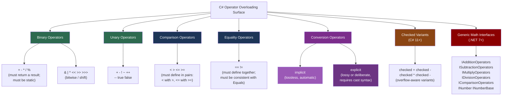

> [!success] Mastery Check
> - [ ] **Studied Well**
> - [ ] **Can explain the concept without notes**
> - [ ] **Can answer interview questions confidently**
> - [ ] **Can implement it in a real project**


## 📍 PART 0 — Navigation & Context

### Where This Topic Lives

```
C# Type System
└── User-Defined Types
    ├── Structs (2.12)
    ├── Equality and Comparison (2.28)
    ├── ► Operator Overloading and Conversions   ← YOU ARE HERE
    └── Generics: Variance and Generic Math (2.33)
```

### What You Need Before This

- **[[2.16 — Value Types vs Reference Types]]** — operator overloading is most natural and most correct on value types (structs). You must understand struct copy semantics first.
- **[[2.28 — Equality and Comparison]]** — `==` and `!=` overloads must be consistent with `Equals` and `GetHashCode`. You cannot understand operator overloading without knowing that contract.
- **[[2.12 — Enums and Structs: Fundamentals]]** — most correctly-designed operator overloads live on structs; struct field layout and default(T) behavior matter here.

### What This Unlocks After

- **[[2.33 — Generics: Variance, Generic Math, and Advanced Patterns]]** — `INumber<T>`, `IAdditionOperators<T,T,T>`, and the rest of generic math are built directly on operator overloading. You cannot understand generic math without first understanding what an overloaded operator is.
- **[[2.19 — Records]]** — records auto-generate `==` and `!=` operators. Understanding what they generate requires understanding what you would have written manually.

### Why This Matters to a Production Engineer at Scale

Operator overloading done correctly makes domain types — `Money`, `Quantity`, `OrderAmount`, `UserId` — feel native to the language and eliminates entire categories of currency-mixing or unit-conversion bugs; done incorrectly, it silently discards precision, hides implicit allocations, or produces semantically wrong results that the compiler cannot catch.

---

## 🧠 PART 1 — The Core Mental Model

### The Fundamental Rule

> **Operator overloading lets user-defined types participate in the language's expression syntax. Implicit conversion operators should only exist for transformations that are always correct and always lossless; explicit conversion operators should exist for transformations that may lose information or require deliberate intent. When in doubt, don't overload.**

### The Plain-Language Analogy

Think of a domain type — like a `Money` struct — as a citizen that wants to speak the language everyone else speaks. Native citizens (built-in types like `int` and `double`) can say things like `a + b`, `a == b`, and `a > b`. Operator overloading is giving `Money` a translator so it can participate in the same conversations, using the same grammar, with the same safety guarantees you'd enforce manually. The translator (the operator method) runs every time that syntax is used. An implicit conversion is like a door that opens automatically when you approach — fine if you always want to go through. An explicit cast is a door with a key — you must consciously choose to open it, because something might be lost or different on the other side.

### Taxonomy



---

## 🔬 PART 2 — Deep Mechanics

### 2.1 What the Compiler Actually Does With an Operator Call

Operator overloading is syntactic sugar. The compiler rewrites every operator expression into a static method call at compile time. There is no runtime dispatch, no virtual table lookup, no overhead beyond calling a static method.

```csharp
// Source code:
Money total = price + tax;

// Compiler rewrites this to approximately:
Money total = Money.op_Addition(price, tax);
```

**The IL the compiler generates** for `a + b` where both are `Money`:

```
// IL for:  Money total = price + tax;
ldloc.0      // push 'price' onto evaluation stack (struct copy)
ldloc.1      // push 'tax' onto evaluation stack (struct copy)
call Money Money::op_Addition(Money, Money)
stloc.2      // store result in 'total'
```

**Cost:** Two struct copies onto the stack (size of `Money` each), then one static method call — the same cost as calling `Money.Add(price, tax)` manually. No virtual dispatch. No heap allocation (for a struct operator that returns a struct).

**The operator name encoding:**

|C# Operator|IL Method Name|
|---|---|
|`+`|`op_Addition`|
|`-`|`op_Subtraction`|
|`*`|`op_Multiply`|
|`/`|`op_Division`|
|`%`|`op_Modulus`|
|`==`|`op_Equality`|
|`!=`|`op_Inequality`|
|`<`|`op_LessThan`|
|`>`|`op_GreaterThan`|
|`implicit`|`op_Implicit`|
|`explicit`|`op_Explicit`|

This encoding means other .NET languages (F#, VB) can call your operators by their IL names even if they don't have operator overloading syntax. It also means reflection can discover operators: `typeof(Money).GetMethod("op_Addition")`.

---

### 2.2 Conversion Operators — The Runtime Mechanism

Conversion operators are also compiled to static method calls, but the call site is determined differently from binary operators.

```csharp
// Type:
public readonly struct Euro
{
    public decimal Value { get; }
    public Euro(decimal v) { Value = v; }

    // Implicit: Euro → decimal is always safe (no precision loss)
    public static implicit operator decimal(Euro e) => e.Value;

    // Explicit: decimal → Euro requires deliberate intent
    // (caller must know what currency they're working with)
    public static explicit operator Euro(decimal d) => new Euro(d);
}

// Usage:
Euro price = new Euro(9.99m);

decimal d = price;           // implicit — no cast needed
                             // Compiler inserts: op_Implicit(price)

Euro fromDecimal = (Euro)15.00m; // explicit — cast syntax required
                                  // Compiler inserts: op_Explicit(15.00m)

// decimal d2 = (decimal)price;  // also works: explicit can always be called explicitly
```

**IL for the implicit conversion:**

```
ldloc.0      // push 'price' (Euro struct) onto stack
call decimal Euro::op_Implicit(Euro)
stloc.1      // store result in 'd'
```

**The critical rule about implicit vs explicit:**

```
IMPLICIT is appropriate ONLY when:
  ✅ The conversion is always valid (no possible failure)
  ✅ No information is lost (or the loss is by design and negligible)
  ✅ The conversion is semantically obvious to ANY reader
  ✅ Both the source and destination types are under your control

EXPLICIT is required when:
  ✅ The conversion may fail or throw
  ✅ Precision or data may be lost
  ✅ The conversion requires domain knowledge (currency, units)
  ✅ A reader encountering the code without context would be surprised
```

---

### 2.3 The Pairing Requirements — Asymmetric Declarations Are Compile Errors

C# enforces symmetry for certain operators. You cannot define one without the other.

```csharp
// These must be defined in pairs:

// == requires !=  (and vice versa)
public static bool operator ==(Money a, Money b) { ... }
public static bool operator !=(Money a, Money b) { ... } // mandatory

// < requires >
public static bool operator <(Money a, Money b) { ... }
public static bool operator >(Money a, Money b) { ... } // mandatory

// <= requires >=
public static bool operator <=(Money a, Money b) { ... }
public static bool operator >=(Money a, Money b) { ... } // mandatory

// true requires false (used with & and | short-circuit for non-bool types)
public static bool operator true(Money a) { ... }
public static bool operator false(Money a) { ... }
```

**The compiler error if you forget:**

```
CS0216: The operator 'Money.operator ==(Money, Money)' requires a matching 
        operator '!=' to also be defined
```

---

### 2.4 Checked Operator Variants (C# 11+)

C# 11 added `checked` operator variants. These allow types to define separate behavior for checked (overflow-detecting) arithmetic contexts.

```csharp
public readonly struct Quantity
{
    public int Units { get; }
    public Quantity(int units) { Units = units; }

    // Normal addition: wraps on overflow (unchecked context)
    public static Quantity operator +(Quantity a, Quantity b)
        => new Quantity(a.Units + b.Units);

    // Checked addition: throws on overflow (checked context)
    public static Quantity operator checked +(Quantity a, Quantity b)
        => new Quantity(checked(a.Units + b.Units));
}

// Usage:
var a = new Quantity(int.MaxValue);
var b = new Quantity(1);

var c = a + b;                  // uses unchecked operator: wraps silently
var d = checked(a + b);         // uses checked operator: throws OverflowException
```

**Cost:** Identical to unchecked operators — static method call, no extra overhead unless the checked arithmetic itself throws.

---

### 2.5 Generic Math Interfaces (.NET 7+)

Generic math is built on top of `static abstract interface members` (C# 11) and operator overloading. It allows writing numeric algorithms once, generically.

```csharp
// The interfaces that matter most:
// IAdditionOperators<TSelf, TOther, TResult>
//   defines: static abstract TResult operator +(TSelf left, TOther right)
//
// INumber<T> inherits all arithmetic interfaces + IComparable<T> + IEquatable<T>
// implementing INumber<T> on your type makes it work with ALL generic math algorithms

// A type that participates in generic math:
public readonly struct Celsius
    : IAdditionOperators<Celsius, Celsius, Celsius>,
      ISubtractionOperators<Celsius, Celsius, Celsius>,
      IComparisonOperators<Celsius, Celsius, bool>
{
    public double Degrees { get; }
    public Celsius(double d) { Degrees = d; }

    public static Celsius operator +(Celsius a, Celsius b)
        => new Celsius(a.Degrees + b.Degrees);

    public static Celsius operator -(Celsius a, Celsius b)
        => new Celsius(a.Degrees - b.Degrees);

    public static bool operator <(Celsius a, Celsius b)  => a.Degrees < b.Degrees;
    public static bool operator >(Celsius a, Celsius b)  => a.Degrees > b.Degrees;
    public static bool operator <=(Celsius a, Celsius b) => a.Degrees <= b.Degrees;
    public static bool operator >=(Celsius a, Celsius b) => a.Degrees >= b.Degrees;
    public static bool operator ==(Celsius a, Celsius b) => a.Degrees == b.Degrees;
    public static bool operator !=(Celsius a, Celsius b) => a.Degrees != b.Degrees;
    public override bool Equals(object? obj) => obj is Celsius c && Degrees == c.Degrees;
    public override int GetHashCode() => Degrees.GetHashCode();
}

// Now a generic algorithm works on Celsius automatically:
public static T Sum<T>(IEnumerable<T> items, T seed)
    where T : IAdditionOperators<T, T, T>
{
    T total = seed;
    foreach (var item in items)
        total += item;    // calls Celsius.op_Addition at JIT time — zero boxing
    return total;
}
```

**Cost:** The JIT generates specialized native code per `T` at first use. Calling `Sum<Celsius>(...)` produces code identical to a hand-written `Celsius` loop — no boxing, no virtual dispatch, no overhead vs manual code. This is reification at work.

---

## 💻 PART 3 — Production Code Patterns

### Pattern 1: The Strongly-Typed Domain Identifier

The most common and most valuable use of operator overloading in production: wrapping a primitive ID in a type that prevents accidental mix-ups, while retaining convenient syntax for comparisons and dictionary use.

**The problem this solves:** `GetUser(int userId, int orderId)` — nothing stops the caller from passing the arguments in the wrong order. `GetUser(UserId userId, OrderId orderId)` does.

```csharp
// Domain: e-commerce user service
// Wrapping int in a strongly-typed ID struct

public readonly struct UserId
    : IEquatable<UserId>,
      IComparable<UserId>
{
    // The underlying value — private to prevent accidental direct use
    private readonly int _value;

    // Private constructor forces use of the factory
    private UserId(int value)
    {
        if (value <= 0)
            throw new ArgumentOutOfRangeException(nameof(value),
                "UserId must be a positive integer");
        _value = value;
    }

    // ✅ EXPLICIT from int → UserId: deliberately requires intent
    // A caller must consciously write (UserId)42, making the cast visible in review
    public static explicit operator UserId(int value) => new UserId(value);

    // ✅ IMPLICIT from UserId → int: always safe — underlying value is just an int
    // Allows passing UserId where an int is needed (DB parameters, logging)
    public static implicit operator int(UserId id) => id._value;

    // Equality — must be consistent with GetHashCode
    public bool Equals(UserId other) => _value == other._value;
    public override bool Equals(object? obj) => obj is UserId id && Equals(id);
    public override int GetHashCode() => _value.GetHashCode();
    public static bool operator ==(UserId a, UserId b) => a._value == b._value;
    public static bool operator !=(UserId a, UserId b) => a._value != b._value;

    // Comparison — enables SortedSet<UserId> and OrderBy(u => u.Id)
    public int CompareTo(UserId other) => _value.CompareTo(other._value);
    public static bool operator <(UserId a, UserId b)  => a._value <  b._value;
    public static bool operator >(UserId a, UserId b)  => a._value >  b._value;
    public static bool operator <=(UserId a, UserId b) => a._value <= b._value;
    public static bool operator >=(UserId a, UserId b) => a._value >= b._value;

    public override string ToString() => $"UserId({_value})";
}

// A separate OrderId — compiler now prevents mixing them up
public readonly struct OrderId
{
    private readonly int _value;
    private OrderId(int value) { _value = value; }
    public static explicit operator OrderId(int value) => new OrderId(value);
    public static implicit operator int(OrderId id) => id._value;
    // ... equality, comparison, etc.
}

// ✅ Now the compiler enforces correct usage:
void ProcessOrder(UserId userId, OrderId orderId) { /* ... */ }

var userId  = (UserId)1001;
var orderId = (OrderId)5055;

ProcessOrder(userId, orderId);   // ✅ Compiles
ProcessOrder(orderId, userId);   // ❌ CS1503: Cannot convert OrderId to UserId
```

---

### Pattern 2: The Value Object with Arithmetic (Money)

Monetary values are the canonical use case for arithmetic operators: the domain rule (currencies must match) maps directly to what the operator does.

```csharp
// Domain: payment processing
// Every business rule is enforced at the type level

public readonly struct Money
    : IEquatable<Money>,
      IComparable<Money>,
      IAdditionOperators<Money, Money, Money>,
      ISubtractionOperators<Money, Money, Money>
{
    public decimal Amount   { get; }
    public string  Currency { get; }  // ISO 4217 code, e.g. "USD", "EUR"

    public Money(decimal amount, string currency)
    {
        if (amount < 0)
            throw new ArgumentOutOfRangeException(nameof(amount));
        Amount   = amount;
        Currency = currency?.ToUpperInvariant()
                   ?? throw new ArgumentNullException(nameof(currency));
    }

    // ⚠️ WRONG (anti-pattern): implicit operator from decimal
    // public static implicit operator Money(decimal d) => new Money(d, "USD");
    // Why wrong: silently assumes USD. Works in US-only code,
    //            causes a currency-mixing production bug the moment EUR is added.

    // ✅ CORRECT: No implicit conversion from decimal.
    // Callers must explicitly construct: new Money(15.99m, "USD")

    // Arithmetic — enforces currency matching
    public static Money operator +(Money a, Money b)
    {
        RequireSameCurrency(a, b, "+");
        return new Money(a.Amount + b.Amount, a.Currency);
    }

    public static Money operator -(Money a, Money b)
    {
        RequireSameCurrency(a, b, "-");
        return new Money(a.Amount - b.Amount, a.Currency);
    }

    // Multiplication by a scalar (quantity × unit price)
    public static Money operator *(Money price, int quantity)
        => new Money(price.Amount * quantity, price.Currency);

    // Commutative form: 3 * price
    public static Money operator *(int quantity, Money price)
        => price * quantity;

    // Division — e.g. splitting a bill
    public static Money operator /(Money total, int parts)
    {
        if (parts <= 0) throw new ArgumentOutOfRangeException(nameof(parts));
        // Use decimal division with banker's rounding to avoid penny errors
        return new Money(Math.Round(total.Amount / parts, 2, MidpointRounding.ToEven),
                         total.Currency);
    }

    // Comparison — meaningful only for same currency
    public int CompareTo(Money other)
    {
        RequireSameCurrency(this, other, "CompareTo");
        return Amount.CompareTo(other.Amount);
    }

    public static bool operator <(Money a, Money b)  { RequireSameCurrency(a, b, "<");  return a.Amount <  b.Amount; }
    public static bool operator >(Money a, Money b)  { RequireSameCurrency(a, b, ">");  return a.Amount >  b.Amount; }
    public static bool operator <=(Money a, Money b) { RequireSameCurrency(a, b, "<="); return a.Amount <= b.Amount; }
    public static bool operator >=(Money a, Money b) { RequireSameCurrency(a, b, ">="); return a.Amount >= b.Amount; }

    // Equality includes currency
    public bool Equals(Money other) => Amount == other.Amount && Currency == other.Currency;
    public override bool Equals(object? obj) => obj is Money m && Equals(m);
    public override int GetHashCode() => HashCode.Combine(Amount, Currency);
    public static bool operator ==(Money a, Money b) => a.Equals(b);
    public static bool operator !=(Money a, Money b) => !a.Equals(b);

    private static void RequireSameCurrency(Money a, Money b, string op)
    {
        if (a.Currency != b.Currency)
            throw new InvalidOperationException(
                $"Cannot apply '{op}' to {a.Currency} and {b.Currency}");
    }

    public override string ToString() => $"{Amount:N2} {Currency}";
}

// Usage in order management:
var unitPrice   = new Money(9.99m,  "USD");
var shippingFee = new Money(4.99m,  "USD");
var quantity    = 3;

Money lineTotal   = unitPrice * quantity;   // 29.97 USD
Money orderTotal  = lineTotal + shippingFee; // 34.96 USD
bool  freeShip    = orderTotal >= new Money(35.00m, "USD"); // false
```

---

### Pattern 3: The Safe Implicit Widening Conversion

The only correct use of implicit conversion is a lossless widening that a caller would always expect to work, without surprises.

```csharp
// Domain: order management
// Wrapping an int LineItemCount in a struct that understands zero-vs-empty

public readonly struct LineItemCount
{
    public int Value { get; }
    public bool IsEmpty => Value == 0;

    public LineItemCount(int value)
    {
        if (value < 0) throw new ArgumentOutOfRangeException(nameof(value));
        Value = value;
    }

    // ✅ IMPLICIT: LineItemCount → int is always correct.
    // Any int-accepting API (logging, DB parameters) should receive this seamlessly.
    public static implicit operator int(LineItemCount c) => c.Value;

    // ✅ EXPLICIT: int → LineItemCount may fail (negative values throw).
    // Forces the caller to express deliberate intent.
    public static explicit operator LineItemCount(int v) => new LineItemCount(v);

    // ✅ IMPLICIT: LineItemCount → long. Always safe widening.
    public static implicit operator long(LineItemCount c) => c.Value;

    // ⚠️ NO implicit operator from LineItemCount → double.
    // Why: double has precision issues for large integers; implicit conversion
    //      would silently allow LineItemCount to flow into floating-point arithmetic,
    //      which is never the right thing for a count type.

    public static LineItemCount operator +(LineItemCount a, LineItemCount b)
        => new LineItemCount(a.Value + b.Value);

    public override string ToString() => Value.ToString();
}

// Callers use it naturally:
void LogOrderStats(int lineItemCount) { /* ... */ }

var count = new LineItemCount(5);
LogOrderStats(count);          // ✅ implicit operator: passes 5 cleanly
int raw = count;               // ✅ int raw = 5
int doubled = count + count;   // ✅ operator+, then implicit to int
```

---

### Pattern 4: The Result Type with Implicit Success Conversion

A `Result<T>` type where creating a success from a value should feel natural. This is the correct and limited use of implicit conversion from the wrapped type.

```csharp
// Domain: API parsing / data validation
// Result<T> represents either success-with-value or failure-with-error

public readonly struct Result<T>
{
    public bool   IsSuccess { get; }
    public T?     Value     { get; }
    public string Error     { get; }

    private Result(T value)        { IsSuccess = true;  Value = value; Error = string.Empty; }
    private Result(string error)   { IsSuccess = false; Value = default; Error = error; }

    public static Result<T> Success(T value)     => new Result<T>(value);
    public static Result<T> Failure(string error) => new Result<T>(error);

    // ✅ IMPLICIT from T → Result<T>:
    // "return price;" reads naturally in a method returning Result<Money>
    // No information is lost: a value IS always a successful result.
    public static implicit operator Result<T>(T value) => Success(value);

    // ✅ EXPLICIT from Result<T> → T:
    // Forces the caller to explicitly acknowledge they're extracting the value.
    // Should only be used after checking IsSuccess.
    public static explicit operator T(Result<T> r)
    {
        if (!r.IsSuccess)
            throw new InvalidOperationException($"Cannot get value of failed Result: {r.Error}");
        return r.Value!;
    }

    public override string ToString()
        => IsSuccess ? $"Success({Value})" : $"Failure({Error})";
}

// Usage in API parsing service:
Result<Money> ParseOrderTotal(string raw)
{
    if (!decimal.TryParse(raw, out decimal amount))
        return Result<Money>.Failure($"Invalid amount: '{raw}'");

    if (amount < 0)
        return Result<Money>.Failure("Amount cannot be negative");

    // ✅ Implicit conversion: Money → Result<Money>
    // Reads like: "return this money value (which is a success)"
    return new Money(amount, "USD");
}

// Caller:
var result = ParseOrderTotal("29.99");
if (result.IsSuccess)
{
    Money total = (Money)result;  // explicit: caller knows it's safe here
    Console.WriteLine($"Parsed: {total}");
}
```

---

### Pattern 5: The Unit-Type with Dimensional Safety

Operator overloading can enforce dimensional analysis — the rule that you can add meters to meters but not meters to seconds.

```csharp
// Domain: logistics / shipping
// Distinguishing Kilograms from Grams to prevent unit-conversion bugs

public readonly struct Kilograms
{
    public double Value { get; }
    public Kilograms(double v) { Value = v >= 0 ? v : throw new ArgumentOutOfRangeException(nameof(v)); }

    public static Kilograms operator +(Kilograms a, Kilograms b) => new Kilograms(a.Value + b.Value);
    public static Kilograms operator -(Kilograms a, Kilograms b) => new Kilograms(a.Value - b.Value);
    public static Kilograms operator *(Kilograms a, double scalar) => new Kilograms(a.Value * scalar);
    public static bool operator <(Kilograms a, Kilograms b)  => a.Value <  b.Value;
    public static bool operator >(Kilograms a, Kilograms b)  => a.Value >  b.Value;
    public static bool operator <=(Kilograms a, Kilograms b) => a.Value <= b.Value;
    public static bool operator >=(Kilograms a, Kilograms b) => a.Value >= b.Value;
    public static bool operator ==(Kilograms a, Kilograms b) => a.Value == b.Value;
    public static bool operator !=(Kilograms a, Kilograms b) => a.Value != b.Value;
    public override bool Equals(object? obj) => obj is Kilograms k && Value == k.Value;
    public override int GetHashCode() => Value.GetHashCode();
    public override string ToString() => $"{Value:N3} kg";
}

public readonly struct Grams
{
    public double Value { get; }
    public Grams(double v) { Value = v >= 0 ? v : throw new ArgumentOutOfRangeException(nameof(v)); }

    // ✅ EXPLICIT conversion between units — deliberate conversion, not automatic
    public static explicit operator Kilograms(Grams g) => new Kilograms(g.Value / 1000.0);
    public static explicit operator Grams(Kilograms k) => new Grams(k.Value * 1000.0);

    // ⚠️ NO implicit conversion between Kilograms and Grams.
    // An implicit conversion would silently allow code like:
    //   Kilograms total = packageA_kg + packageB_grams;  // silent 1000x error!

    public static Grams operator +(Grams a, Grams b) => new Grams(a.Value + b.Value);
    public static bool operator ==(Grams a, Grams b) => a.Value == b.Value;
    public static bool operator !=(Grams a, Grams b) => a.Value != b.Value;
    public override bool Equals(object? obj) => obj is Grams g && Value == g.Value;
    public override int GetHashCode() => Value.GetHashCode();
    public override string ToString() => $"{Value:N1} g";
}

// Usage: shipping weight calculation
Kilograms packageA = new Kilograms(1.5);
Kilograms packageB = new Kilograms(0.8);
Grams     envelope = new Grams(250);

Kilograms totalKg   = packageA + packageB;         // ✅ Kilograms + Kilograms = Kilograms
Kilograms converted = (Kilograms)envelope;          // ✅ Explicit conversion: 0.25 kg

// Kilograms wrong = packageA + envelope;           // ❌ CS0019: no + operator for these types
```

---

### Pattern 6: When NOT to Overload — The Clarity Rule

This pattern demonstrates when NOT to add operators, to prevent the most common operator overloading mistake.

```csharp
// ⚠️ WRONG: Overloading operators on a type where the semantics are not obvious

// This is a real pattern seen in production code that causes confusion:
public class OrderPipeline
{
    private readonly List<Func<Order, Order>> _steps = new();

    // ⚠️ WRONG: What does '+' mean for a pipeline?
    // This is clever but opaque. A code reviewer must stop and think.
    public static OrderPipeline operator +(OrderPipeline pipeline, Func<Order, Order> step)
    {
        pipeline._steps.Add(step);
        return pipeline;
    }
}

// Usage:
var pipeline = new OrderPipeline();
pipeline = pipeline + ValidateInventory + ApplyDiscounts + CalculateTax;
// Reads like math, but isn't math. Confusing.

// ✅ CORRECT: Use a named method when the semantics aren't mathematically obvious
public class OrderPipeline
{
    private readonly List<Func<Order, Order>> _steps = new();

    public OrderPipeline AddStep(Func<Order, Order> step)
    {
        _steps.Add(step);
        return this;    // fluent
    }
}

// Usage:
var pipeline = new OrderPipeline()
    .AddStep(ValidateInventory)
    .AddStep(ApplyDiscounts)
    .AddStep(CalculateTax);
// Explicit, readable, obvious.
```

**The rule:** only overload an operator when ANY competent C# developer encountering the type for the first time would immediately understand what the operator does from context. If you have to document what `+` means for your type, you probably shouldn't have overloaded it.

---

## ⚠️ PART 4 — Gotchas & Anti-Patterns

### Gotcha 1: Implicit Conversion Creating a Silent Currency Bug

Engineers sometimes add `implicit operator Money(decimal d)` to make construction feel "easy." This creates one of the hardest bugs to find in financial systems.

```csharp
// The wrong mental model: "implicit makes the API ergonomic"
// Why engineers fall into this: it reduces boilerplate at construction sites

// ⚠️ WRONG CODE — this compiles and appears correct:
public readonly struct Money
{
    public decimal Amount   { get; }
    public string  Currency { get; }

    // Appears ergonomic but is dangerously opinionated:
    public static implicit operator Money(decimal d) => new Money(d, "USD");
}

// Caller code that now silently converts — looks fine, is wrong:
Money payment = 29.99m;      // silently becomes 29.99 USD — works in US-only code
Money priceEur = 25.00m;     // silently becomes 25.00 USD — WRONG! Developer intended EUR
Money total = payment + priceEur; // now adds USD + USD (wrongly) — no error anywhere

// ✅ CORRECT CODE — explicit only, force the caller to declare intent:
public static explicit operator Money(decimal d)
    => throw new NotSupportedException(
        "Cannot convert decimal to Money without a currency. Use new Money(amount, currency).");

// Now the wrong code is a compile error:
// Money priceEur = 25.00m;  // CS0266: Cannot implicitly convert decimal to Money

// WHY: implicit conversion removes a required piece of information (the currency)
// silently. The compiler cannot detect the semantic error — only the runtime bug
// eventually reveals it when currency mixing causes wrong totals.
```

---

### Gotcha 2: Mutable Struct Operator Returns the Wrong Instance

An operator on a struct ALWAYS returns a new struct value. Modifying fields of the result in-place does not affect the operands. Engineers who forget this produce subtle bugs.

```csharp
// The wrong mental model: "operator+ adds to one of the existing structs"
// Engineers fall into this when coming from languages with reference semantics

// ⚠️ WRONG — the following code modifies a temporary and discards it:
var total = new Money(10.00m, "USD");
var tax   = new Money(1.50m,  "USD");

// This looks like it updates 'total' but it does NOT:
// total + tax returns a NEW Money struct, which is immediately discarded
(total + tax); // result is not assigned — compiler will warn CS4014-style in some contexts,
               // but not for operator expressions

// More insidious version:
void ApplyTax(Money order, Money taxAmount)
{
    order = order + taxAmount;  // ⚠️ WRONG: modifies LOCAL COPY of 'order'
                                // The caller's 'order' is unchanged (pass-by-value)
}

// ✅ CORRECT: operator+ returns a new value that must be captured
void ApplyTax(ref Money order, Money taxAmount)
{
    order = order + taxAmount;  // modifies the caller's struct via ref
}

// Or better: return the result (functional approach)
Money WithTax(Money order, Money taxAmount) => order + taxAmount;

// WHY: struct operator methods return new values. No struct operator
// ever modifies its operands. This is identical to string.Replace:
// "hello".Replace("h", "j") does not modify "hello"; it returns a new string.
```

---

### Gotcha 3: Forgetting That `==` Must Be Consistent With `Equals`

Engineers override `==` without overriding `Equals`, or override `Equals` without updating `==`. The contract violation causes Dictionary and HashSet to silently malfunction.

```csharp
// The wrong mental model: "I only need to override == for syntactic convenience"
// Why engineers fall into this: they think == and Equals are redundant

// ⚠️ WRONG — inconsistent equality:
public readonly struct ShipmentId
{
    public string TrackingCode { get; }
    public ShipmentId(string code) { TrackingCode = code?.ToUpper() ?? throw new ArgumentNullException(nameof(code)); }

    // Forgot to override Equals and GetHashCode!
    public static bool operator ==(ShipmentId a, ShipmentId b)
        => a.TrackingCode == b.TrackingCode;

    public static bool operator !=(ShipmentId a, ShipmentId b)
        => a.TrackingCode != b.TrackingCode;
}

var id1 = new ShipmentId("ABC123");
var id2 = new ShipmentId("ABC123");

bool eq1 = id1 == id2;                   // true  (uses op_Equality)
bool eq2 = id1.Equals((object)id2);      // false (uses ValueType.Equals — reflection on fields)
bool eq3 = id1.Equals(id2);              // false (same)

// And in a dictionary:
var dict = new Dictionary<ShipmentId, string>();
dict[id1] = "Package A";
string? found = dict.TryGetValue(id2, out var v) ? v : null; // null! id2 not found!

// ✅ CORRECT — all three must agree:
public override bool Equals(object? obj) => obj is ShipmentId s && TrackingCode == s.TrackingCode;
public bool Equals(ShipmentId other) => TrackingCode == other.TrackingCode;
public override int GetHashCode() => TrackingCode.GetHashCode(StringComparison.Ordinal);
// (and == already defined above — now they agree)

// WHY: Dictionary lookup computes GetHashCode first (to find bucket),
// then calls Equals to confirm the match. If GetHashCode differs for "equal" objects,
// they end up in different buckets and TryGetValue never finds them.
```

---

### Gotcha 4: Implicit Conversion Chain Causing Unexpected Overload Resolution

When multiple implicit conversions exist, the compiler picks one — and it may not be the one you expect.

```csharp
// The wrong mental model: "the compiler will do what I obviously mean"
// Engineers fall into this when designing hierarchies of unit types

public readonly struct Meters
{
    public double Value { get; }
    public Meters(double v) { Value = v; }
    public static implicit operator double(Meters m) => m.Value;
}

public readonly struct Centimeters
{
    public double Value { get; }
    public Centimeters(double v) { Value = v; }
    public static implicit operator double(Centimeters c) => c.Value / 100.0;
    // ⚠️ Also adding implicit to Meters — this creates a chain:
    public static implicit operator Meters(Centimeters c) => new Meters(c.Value / 100.0);
}

// ⚠️ Ambiguous code:
Meters m = new Meters(1.0);
Centimeters cm = new Centimeters(150.0);

// Which overload wins? There's an implicit Centimeters→Meters AND Meters→double:
double result = m + cm; // Compiler must pick: (double m + double cm)?
                        // Or convert cm→Meters first, then use a Meters operator?
                        // Answer: CS0034 ambiguous binary operator, or surprising pick

// ✅ CORRECT: Avoid chained implicit conversions. Define explicit cross-unit conversions
// and provide named factory methods for clarity:
Meters mFromCm = (Meters)cm;      // explicit, obvious
double total = m.Value + mFromCm.Value; // operate at the primitive level

// WHY: C# resolves operator overloads based on how many implicit conversions are needed.
// When multiple paths exist with the same conversion count, the result is a compile error.
// When one path is shorter, it silently wins — which may not be the semantically correct choice.
```

---

### Gotcha 5: Overloading `true` / `false` — Almost Never What You Want

Engineers occasionally overload `true` and `false` to allow non-boolean types in `if` statements. This causes serious readability and correctness problems.

```csharp
// The wrong mental model: "overloading true/false lets my type feel more native in conditionals"
// Why engineers try this: they want to write 'if (result)' instead of 'if (result.IsSuccess)'

// ⚠️ WRONG — overloading true for a result type:
public readonly struct Result<T>
{
    public bool IsSuccess { get; }
    public T? Value { get; }

    // This compiles and allows: if (result) { ... }
    public static bool operator true(Result<T> r)  => r.IsSuccess;
    public static bool operator false(Result<T> r) => !r.IsSuccess;
}

// Usage looks compact but is misleading:
var result = GetOrder(orderId);
if (result)   // ⚠️ What does 'true' mean here? A reader must know the type's convention.
{
    // ...
}

// ✅ CORRECT: Explicit property access
if (result.IsSuccess)  // immediately clear to any reader
{
    // ...
}

// ✅ ALSO CORRECT for optional types: use nullable instead
Order? order = GetOrder(orderId);  // null means not found
if (order is not null)
{
    // ...
}

// WHY: the 'if' statement with a non-bool feels "magic" to readers who don't own
// your type. IsSuccess is self-documenting. 'true/false' operator overloads are
// an advanced feature designed for DSLs and three-valued logic types — not general APIs.
```

---

## 📊 PART 5 — Performance Implications

### 5.1 Allocation Characteristics

|Scenario|Allocation Behavior|Approx Cost|
|---|---|---|
|`struct + struct` returning `struct`|Zero heap allocation|~1–3 ns (struct copy + method call)|
|`class + class` returning new `class`|One heap allocation for the result|~30–60 ns + GC pressure|
|`implicit operator struct→int`|Zero — struct field read|~0.3 ns|
|`explicit operator int→struct` (validation)|Zero — new struct on stack|~1–2 ns|
|`implicit operator struct→interface`|One heap allocation (boxing)|~12–20 ns|
|`struct operator==` calling `Equals`|Zero — inline comparison|~0.5–1 ns|
|`struct operator==` without `IEquatable<T>` override|Reflection-based comparison|~200–500 ns|
|Checked operator with no overflow|Same as unchecked|~1–3 ns|
|Checked operator that overflows|Exception construction + throw|~1–5 μs|
|Generic math via `IAdditionOperators<T,T,T>`|Zero extra vs. direct call (JIT reified)|Same as direct call|
|Conversion chain through 2 implicit operators|Two static method calls|~2–5 ns|

---

### 5.2 BenchmarkDotNet — Struct Operators vs Class Operators vs Manual

```csharp
using BenchmarkDotNet.Attributes;
using BenchmarkDotNet.Running;

[MemoryDiagnoser]
[DisassemblyDiagnoser(maxDepth: 2)]
public class OperatorOverloadBenchmark
{
    private readonly Money[] _payments;
    private readonly MoneyClass[] _classPayments;

    public OperatorOverloadBenchmark()
    {
        _payments      = Enumerable.Range(1, 1000).Select(i => new Money(i * 0.99m, "USD")).ToArray();
        _classPayments = Enumerable.Range(1, 1000).Select(i => new MoneyClass(i * 0.99m, "USD")).ToArray();
    }

    // Baseline: manual summation with no operator
    [Benchmark(Baseline = true)]
    public decimal ManualSumDecimal()
    {
        decimal total = 0m;
        foreach (var p in _payments)
            total += p.Amount;  // bypass Money operator, just add decimals
        return total;
    }

    // Struct Money with operator+ (our pattern above)
    [Benchmark]
    public Money StructOperatorSum()
    {
        var total = new Money(0m, "USD");
        foreach (var p in _payments)
            total += p;          // calls Money.op_Addition
        return total;
    }

    // Class-based MoneyClass with operator+
    [Benchmark]
    public MoneyClass ClassOperatorSum()
    {
        var total = new MoneyClass(0m, "USD");
        foreach (var p in _classPayments)
            total += p;          // calls MoneyClass.op_Addition — one new object per iteration
        return total;
    }

    // Reflection-based (no operator, calling Equals without IEquatable)
    [Benchmark]
    public bool StructEqualsNoInterface()
    {
        var a = new MoneyNoEquatable(1.00m, "USD");
        var b = new MoneyNoEquatable(1.00m, "USD");
        return a.Equals((object)b); // ValueType.Equals — reflection
    }

    [Benchmark]
    public bool StructEqualsWithInterface()
    {
        var a = new Money(1.00m, "USD");
        var b = new Money(1.00m, "USD");
        return a.Equals(b); // IEquatable<Money>.Equals — direct, fast
    }
}

// Expected output (approximate, .NET 8, x64, Release mode):
// | Method                    | Mean       | Allocated |
// |---------------------------|------------|-----------|
// | ManualSumDecimal          |   2.1 μs   | 0 B       |
// | StructOperatorSum         |   2.4 μs   | 0 B       |  <- near-zero overhead vs manual
// | ClassOperatorSum          | 168.3 μs   | 32 KB     |  <- 1000 allocations
// | StructEqualsNoInterface   | 312.0 ns   | 0 B       |  <- reflection path, slow
// | StructEqualsWithInterface |   0.4 ns   | 0 B       |  <- direct comparison, fast

// Conclusion:
// Struct operators add negligible overhead vs. manual arithmetic.
// Class operators allocate on every result — avoid in hot paths.
// Always implement IEquatable<T> for structs used in comparisons.
```

---

### 5.3 When to Care / When to Ignore

**When operator overloading performance costs you:**

- Using class-based domain types (not structs) with operator overloading in tight loops — each `+` allocates a new object. A payment processing inner loop calling `total += payment` 100,000 times creates 100,000 heap objects and significant GC pressure.
- Struct operators that perform `string` comparisons (e.g., currency matching) in hot paths — `string` comparison is not free; cache or intern the currency code.
- Implicit conversions that trigger boxing — if your `implicit operator T(MyStruct s)` converts to an interface, every implicit conversion allocates. The boxing happens invisibly.
- Reflection-based `Equals` (forgetting `IEquatable<T>`) in a type used as a `Dictionary` key — every lookup uses the slow path.

**When performance doesn't matter:**

- Domain types used in orchestration code (request handling, service-layer logic) — one allocation per request is negligible; clarity and correctness are worth more than nanoseconds.
- Operators used in test assertion code — test performance is irrelevant.
- Operators on rarely-called types (order-level computations, not microsecond-level loops).
- Conversion operators used only at system boundaries (parsing, serialization) — called once per request, not in inner loops.

---

## 🎤 PART 6 — Interview Arsenal

### A. The Question Bank

---

**Q1: "What's the difference between an implicit and an explicit conversion operator in C#, and when would you choose each?"**

**Average Answer:** "Implicit doesn't need a cast and explicit requires one."

**Why That's Insufficient:** It describes the syntax but not the semantic contract — the answer says nothing about _when_ to choose each, which is what the interviewer actually wants to know.

**Great Answer:**

> "The syntactic difference is that implicit conversions happen without a cast, while explicit require `(TargetType)`. The semantic difference is the contract they communicate. An implicit conversion says 'this transformation is always safe, always lossless, and obvious.' An explicit conversion says 'this transformation may lose precision, may fail, or requires the caller to consciously decide to do it.' In practice, I use implicit only when I can prove that no information is lost — like converting a `UserId` struct to `int`, since `int` is the underlying storage and nothing can go wrong. I use explicit when the conversion requires domain knowledge — like converting `decimal` to `Money`, which requires knowing the currency. If I can't specify those conditions clearly, I don't create a conversion operator at all and force callers to use a named factory method instead."

---

**Q2: "Why must `==` and `!=` be defined together in C#, and what contract must `==` respect?"**

**Average Answer:** "The compiler requires it."

**Why That's Insufficient:** True but shallow. It misses the deeper question of _why_ the compiler requires it and what happens when the contract is violated.

**Great Answer:**

> "The pairing requirement exists because asymmetric equality operators produce logically incoherent code — if `a == b` returns true and `a != b` also returns true, the type is broken. But the more important contract is the relationship between `==`, `Equals`, and `GetHashCode`. If `a == b` returns true, then `a.Equals(b)` must also return true, and `a.GetHashCode()` must equal `b.GetHashCode()`. Violating this causes `Dictionary<T, V>` and `HashSet<T>` to silently malfunction. I've seen this in production: a developer overrides `==` for syntactic convenience but forgets `Equals` and `GetHashCode`. The type looks correct in simple equality checks but fails silently as a dictionary key — TryGetValue returns false for values that are clearly 'equal' by the operator. The fix is always to implement all three consistently, usually via `IEquatable<T>` to get the non-boxing path."

---

**Q3: "When would you use `implicit` vs `explicit` operator for a strongly-typed ID wrapper like `UserId`?"**

**Average Answer:** "I'd make `int → UserId` explicit and `UserId → int` implicit."

**Why That's Insufficient:** Correct in direction but doesn't explain the reasoning — an interviewer will probe the 'why'.

**Great Answer:**

> "Right, and the reasoning matters more than the direction. I make `UserId → int` implicit because extracting the underlying value is always correct — it can't fail, no information is lost, and it's semantically obvious. This lets the type flow naturally into int-accepting APIs like Dapper parameters or logging. I make `int → UserId` explicit because not every int is a valid UserId — it must be positive, it must actually refer to an entity in the system. Requiring `(UserId)someInt` forces the caller to consciously say 'I know this int is a valid UserId.' It also makes code reviewers' jobs easier: an `(UserId)` cast is a visible signal in code review that someone is crossing from raw data into domain space. I'd never make `int → UserId` implicit even if the validation were trivial, because implicit conversions make it possible for bugs to compile without any indication that a significant type boundary is being crossed."

---

**Q4: "What are checked operators in C# 11, and when would you implement them?"**

**Average Answer:** "They're used in a `checked` block."

**Why That's Insufficient:** Correct but backward — the question is about implementing them, not consuming them.

**Great Answer:**

> "C# 11 allows defining a `checked` variant alongside the regular operator, with the syntax `operator checked +`. When user code runs in a checked context — either via the `checked` keyword or a project-level checked arithmetic setting — the runtime selects the checked operator variant automatically. I'd implement them for financial types where overflow is a correctness bug, not a performance tradeoff. For example, a `Quantity` struct summing inventory counts should throw on overflow in checked mode rather than silently wrapping to a negative number. In practice, I add checked variants to any type where an overflow would produce data corruption, and keep the unchecked variant for performance-critical paths where the caller has already validated the range. The division of responsibility is clean: the checked variant throws, the unchecked variant wraps — just like the built-in numeric types."

---

### B. The Trick Questions

**Trick Q1: "Can you define an operator on a class that takes two different types?"**

_The trap:_ Candidates assume both operands must be the same type.

_Correct answer:_ Yes. At least one operand must be the declaring type (C# requirement), but the other can be anything. `Money * int` (multiply a money amount by a quantity) is a standard production pattern. The result type can also be different from either operand.

---

**Trick Q2: "If `a == b` returns true, does `object.ReferenceEquals(a, b)` also return true?"**

_The trap:_ Conflating value equality with reference equality.

_Correct answer:_ Only if `a` and `b` are the same object reference AND `==` was not overloaded to mean something else. For structs, `ReferenceEquals` always returns false (they box separately). For classes with overloaded `==`, `ReferenceEquals` may return false even when `==` returns true (value equality types like `string`). They are entirely independent.

---

**Trick Q3: "I have `implicit operator double(Meters m)` on my `Meters` struct. Does this mean I can pass a `Meters` to `Math.Sqrt(double)`?"**

_The trap:_ Assuming implicit operators flow through method overload resolution automatically.

_Correct answer:_ Yes — this is exactly what implicit operators are for. The compiler will insert the `op_Implicit` call at the call site, converting `Meters` to `double` before calling `Math.Sqrt`. This is a valid use of implicit operators because the conversion is lossless (double can represent all double values from Meters).

---

**Trick Q4: "What's wrong with `public static implicit operator Money(decimal d) => new Money(d, "USD");`?"**

_The trap:_ It compiles and works for single-currency applications.

_Correct answer:_ It hard-codes a business decision (the currency is USD) into a type system transformation that looks neutral. Any `decimal` now silently becomes USD, making it impossible to construct a EUR `Money` from a `decimal` without going through a named constructor. More dangerously, it allows code like `Money total = someCalculatedDecimal;` where the currency assumption is invisible. This causes a production incident the moment the system needs to handle multiple currencies.

---

**Trick Q5: "Can you overload the `[]` indexer operator?"**

_The trap:_ Candidates confuse indexers with operator overloading.

_Correct answer:_ Not via operator overloading syntax. Indexers (`this[int i] { get; set; }`) are a separate C# feature, not an operator overload. They are syntactic sugar for `get_Item` and `set_Item` methods. You can define them, and they use `[]` syntax at the call site, but they are declared with `this[...]` not `operator[]`.

---

### C. Red Flags to Avoid

- **"Implicit operator is more ergonomic so I prefer it"** — Ergonomic is not the criterion. Lossless, always-correct, and obvious are the criteria. Preferring implicit for ergonomics signals you'll create currency-mixing bugs.
- **"I override `==` for my class but I don't need to override `Equals`"** — This will immediately fail a follow-up about `Dictionary`. It shows misunderstanding of the equality contract.
- **"Operator overloading is bad practice / avoid it"** — Pendulum overcorrection. Operators on domain value types (`Money`, `Quantity`, `UserId`) are excellent practice. The problem is inappropriate use, not the feature.
- **"Performance doesn't matter for operators"** — Interviewers at performance-conscious companies (systems, fintech) will push on this. Class operators allocate; struct operators don't. The difference is significant in hot paths.
- **"I can overload `&&` and `||` directly"** — You cannot overload `&&` and `||` directly in C#. You overload `true`, `false`, `&`, and `|`, and the compiler synthesizes the short-circuit behavior. Saying you can overload `&&` directly reveals an incomplete understanding.
- **"Checked operators are the same as unchecked, the difference is just exception behavior"** — Technically true but misses the design point. The _reason_ to have both is to let callers opt into overflow safety without changing the API surface.
- **"You can put implicit operators on any type"** — Implicit operators must be defined in either the source type or the target type. You cannot add a conversion between two third-party types without creating a wrapper.

---

## 🔀 PART 7 — Decision Framework

```mermaid
flowchart TD
    A["Should I add an operator or conversion to my type?"] --> B{"Is the type a struct\nor value object?"}

    B -->|"No (class)"| CAREFUL["Proceed with extra caution.\nClass operators return new heap objects.\nUsually prefer named methods."]
    B -->|"Yes (struct)"| C{"What kind?"}

    C --> D["Arithmetic: + - * / %"]
    C --> E["Equality: == !="]
    C --> F["Comparison: < > <= >="]
    C --> G["Conversion: implicit/explicit"]

    D --> D1{"Do the operands have\na natural arithmetic\nrelationship?"}
    D1 -->|"Yes (Money + Money, Kg + Kg)"| ARITH["✅ Implement with business\nrule validation inside.\nUse checked variants for\noverflow-sensitive types."]
    D1 -->|"No (Order + Customer??)"| NOARITH["❌ Don't implement.\nUse named methods instead."]

    E --> E1{"Must override Equals\nand GetHashCode too.\nAre all three consistent?"}
    E1 -->|"Yes"| EQUALITY["✅ Implement.\nAlso implement IEquatable<T>\nfor performance."]
    E1 -->|"No / unsure"| NOEQUALITY["❌ Don't implement ==.\nFixing Equals/GetHashCode\nbreaking Dictionary is painful."]

    F --> F1{"Is there a natural\ntotal ordering?"}
    F1 -->|"Yes"| COMPARE["✅ Implement all four\n(< > <= >=).\nAlso implement IComparable<T>."]
    F1 -->|"No / partial"| NOCOMPARE["❌ Don't implement.\nOr implement IComparer<T>\nas a separate strategy."]

    G --> G1{"implicit or explicit?"}
    G1 --> H{"Is conversion lossless,\nalways valid, and\nobvious to any reader?"}
    H -->|"Yes to all three"| IMPLICIT["✅ implicit operator"]
    H -->|"Any 'no'"| I{"May conversion fail\nor lose information?"}
    I -->|"Yes"| EXPLICIT["✅ explicit operator\n(requires cast syntax)"]
    I -->|"No but unclear semantics"| NAMED["✅ Named factory method:\nMoney.FromDecimal(d, \"USD\")"]

    style ARITH fill:#2d6a4f,color:#fff
    style EQUALITY fill:#2d6a4f,color:#fff
    style COMPARE fill:#2d6a4f,color:#fff
    style IMPLICIT fill:#2d6a4f,color:#fff
    style EXPLICIT fill:#1d3557,color:#fff
    style NAMED fill:#1d3557,color:#fff
    style NOARITH fill:#8b0000,color:#fff
    style NOEQUALITY fill:#8b0000,color:#fff
    style NOCOMPARE fill:#8b0000,color:#fff
    style CAREFUL fill:#e9c46a,color:#000
```

---

## ✅ PART 8 — Self-Check

### A. Conceptual Questions

1. An engineer defines `implicit operator decimal(Money m) => m.Amount`. A second engineer defines `implicit operator Euro(Money m) => new Euro(m.Amount)`. What happens when the compiler encounters `decimal d = someMoney + otherMoney`? Will it compile?
    
2. You have a `readonly struct Temperature` with `operator <` and `operator >` defined. Why must you also define `operator <=` and `operator >=`? What does the compiler say if you don't?
    
3. A production codebase defines `static bool operator ==(Order a, Order b) => a.Id == b.Id` but never overrides `object.Equals` or `GetHashCode`. What specific production bug can this cause, and in which data structure does it first manifest?
    
4. Explain what the IL instruction `op_Implicit` does differently from a normal `callvirt` or `call` instruction. Why is there no virtual dispatch for operator calls?
    
5. You are designing a `Latitude` struct (range: -90 to +90) and a `Longitude` struct (range: -180 to +180). Should you define `implicit operator double(Latitude l)`? What about `implicit operator Latitude(double d)`? Justify each decision.
    
6. What does `static abstract` on an operator in an interface (like `IAdditionOperators<T,T,T>`) mean, and how does this differ from an ordinary abstract method?
    
7. A colleague argues that `checked` operator variants are unnecessary because callers can always wrap the result in a `checked` block. Are they right? What does the `checked` _operator_ variant give you that `checked` _blocks_ don't?
    
8. Why can't you define an `operator+` between two types that are both from third-party libraries (not owned by you)? What would you do instead?
    
9. You define `implicit operator int(UserId id) => id._value`. Later, a teammate calls `Math.Abs((UserId)userId)`. Does this compile? What does it produce?
    
10. A `struct Point3D` has X, Y, Z doubles (24 bytes). You define `operator +(Point3D a, Point3D b)`. In a hot loop calling this 1M times, how many bytes are copied? Compare this to a `class Point3D` with the same operator.
    

---

### B. Code Puzzles

**Puzzle 1:** What does this print? Where, if anywhere, is a heap allocation made?

```csharp
public readonly struct Score : IEquatable<Score>
{
    public int Value { get; }
    public Score(int v) { Value = v; }
    public static implicit operator int(Score s)    => s.Value;
    public static explicit operator Score(int v)    => new Score(v);
    public static Score operator +(Score a, Score b) => new Score(a.Value + b.Value);
    public bool Equals(Score other) => Value == other.Value;
    public override bool Equals(object? obj) => obj is Score s && Equals(s);
    public override int GetHashCode() => Value;
    public static bool operator ==(Score a, Score b) => a.Value == b.Value;
    public static bool operator !=(Score a, Score b) => a.Value != b.Value;
}

var a = new Score(10);
var b = new Score(20);
Score c = a + b;
int   d = c;
Console.WriteLine(d);

IComparable boxed = c;  // what happens here?
Console.WriteLine(boxed.GetType().Name);
```

<details> <summary>Answer — expand after trying</summary>

**Output:**

```
30
Score
```

**Explanation:**

- `a + b` → calls `Score.op_Addition` → returns `new Score(30)`. Zero heap allocation (struct returned by value on the stack).
- `int d = c` → calls `Score.op_Implicit` → returns `c.Value` (30). Zero allocation.
- `Console.WriteLine(d)` → prints `30`.
- `IComparable boxed = c` → **boxes the Score struct**. One heap allocation (~24 bytes). `Score` inherits `IComparable` only if `IComparable` is implemented — here it is NOT implemented, so this line is actually a compile error: CS0266. If `Score` did implement `IComparable`, this would box.
- The puzzle's lesson: assigning any struct to an interface causes boxing, even with all the correct operator machinery. Zero-alloc comparisons require using the concrete type or `IEquatable<T>`.

</details>

---

**Puzzle 2:** Does this compile? If so, what does it print?

```csharp
public readonly struct Meters
{
    public double Value { get; }
    public Meters(double v) { Value = v; }
    public static implicit operator double(Meters m) => m.Value;
    public static implicit operator Meters(double d) => new Meters(d);
    public static bool operator ==(Meters a, Meters b) => a.Value == b.Value;
    public static bool operator !=(Meters a, Meters b) => a.Value != b.Value;
    public override bool Equals(object? obj) => obj is Meters m && Value == m.Value;
    public override int GetHashCode() => Value.GetHashCode();
}

Meters a = 5.0;
Meters b = 3.0;
double c = a + b;
Console.WriteLine(c);
```

<details> <summary>Answer — expand after trying</summary>

**Output:**

```
8
```

**Explanation:** `a + b` — neither `Meters.operator+(Meters, Meters)` is defined, so the compiler looks for other paths. Both `a` and `b` can be implicitly converted to `double` (via `op_Implicit`). `double + double` is defined natively. So the compiler generates: `(double)a + (double)b = 5.0 + 3.0 = 8.0`. The result is `double`, assigned to `double c`. This compiles and prints `8`.

**The lesson:** When an arithmetic operator is not defined, the compiler will try implicit conversions to find one that works. Here, both `implicit operator double` conversions are applied, and the result is a `double`, not a `Meters`. This can be surprising if you expected `a + b` to produce a `Meters`. Define `operator+(Meters, Meters)` explicitly if you want the result to be a `Meters`.

</details>

---

**Puzzle 3:** What is printed, and why?

```csharp
public struct Counter
{
    public int Value;
    public static Counter operator +(Counter a, Counter b) => new Counter { Value = a.Value + b.Value };
    public static bool operator ==(Counter a, Counter b) => a.Value == b.Value;
    public static bool operator !=(Counter a, Counter b) => a.Value != b.Value;
    public override bool Equals(object? obj) => obj is Counter c && Value == c.Value;
    public override int GetHashCode() => Value;
}

Counter x = new Counter { Value = 5 };
Counter y = x;
y.Value = 10;

Console.WriteLine(x.Value);
Console.WriteLine(x == y);
```

<details> <summary>Answer — expand after trying</summary>

**Output:**

```
5
False
```

**Explanation:**

- `Counter y = x` → struct assignment copies the entire struct. `y` is an independent copy.
- `y.Value = 10` → modifies `y`'s copy. `x` is unchanged.
- `x.Value` is still `5`.
- `x == y` → calls `Counter.op_Equality(x, y)` → `x.Value == y.Value` → `5 == 10` → `false`.

**The lesson:** Struct copy semantics mean assignment creates independent copies. Operator overloading does not change this fundamental behavior. This is a core concept from [[2.16 — Value Types vs Reference Types]].

</details>

---

**Puzzle 4:** Where is the bug? What does this actually do at runtime?

```csharp
public readonly struct Money
{
    public decimal Amount   { get; }
    public string  Currency { get; }

    public Money(decimal amount, string currency) { Amount = amount; Currency = currency; }

    public static Money operator +(Money a, Money b)
    {
        if (a.Currency != b.Currency)
            throw new InvalidOperationException("Currency mismatch");
        return new Money(a.Amount + b.Amount, a.Currency);
    }

    public static bool operator ==(Money a, Money b) => a.Amount == b.Amount && a.Currency == b.Currency;
    public static bool operator !=(Money a, Money b) => !(a == b);
    public override bool Equals(object? obj) => obj is Money m && this == m;
    public override int GetHashCode() => HashCode.Combine(Amount, Currency);
}

var prices = new List<Money>
{
    new Money(10.00m, "USD"),
    new Money(20.00m, "USD"),
    new Money(15.00m, "EUR"),
};

// Engineer wants the total of all USD prices:
var total = prices
    .Where(p => p.Currency == "USD")
    .Aggregate(new Money(0, "USD"), (acc, p) => acc + p);

Console.WriteLine(total);
```

<details> <summary>Answer — expand after trying</summary>

**This compiles and runs correctly.** Output: `30.00 USD`.

The `Where` filters to USD only, then `Aggregate` starts from `Money(0, "USD")` and adds each USD price. No currency mismatch exception fires because the filter ensures only USD items are aggregated.

**However, the bug is subtle and latent:** the seed `new Money(0, "USD")` bypasses the constructor's validation — but `0` is valid here. The real latent bug is if someone changes the filter or removes it, the currency mismatch exception will be thrown inside `Aggregate`, producing an `InvalidOperationException` with a cryptic LINQ stack trace rather than a clear error message. The better design encapsulates the "sum by currency" logic in a named method with explicit handling.

**The code puzzle lesson:** The `operator+` correctly enforces the currency rule — the design is right. The bug is in the calling code's fragility, not in the operator.

</details>

---

**Puzzle 5:** Does this allocate? How many times?

```csharp
public readonly struct OrderId : IEquatable<OrderId>
{
    private readonly int _value;
    public OrderId(int v) { _value = v; }
    public static explicit operator OrderId(int v) => new OrderId(v);
    public static implicit operator int(OrderId id) => id._value;
    public bool Equals(OrderId other) => _value == other._value;
    public override bool Equals(object? obj) => obj is OrderId id && Equals(id);
    public override int GetHashCode() => _value;
    public static bool operator ==(OrderId a, OrderId b) => a._value == b._value;
    public static bool operator !=(OrderId a, OrderId b) => a._value != b._value;
}

var ids = new HashSet<OrderId>();
var id1 = (OrderId)100;
var id2 = (OrderId)200;
ids.Add(id1);
ids.Add(id2);
bool found = ids.Contains((OrderId)100);
Console.WriteLine(found);
```

<details> <summary>Answer — expand after trying</summary>

**Output:** `True`

**Allocations:**

- `new HashSet<OrderId>()` → **1 allocation** (the HashSet object and its internal arrays)
- `(OrderId)100`, `(OrderId)200`, `(OrderId)100` → **zero allocations each** (explicit operator returns a struct; struct is on stack)
- `ids.Add(id1)` → **no extra allocation** (OrderId is embedded in HashSet's internal entry array; no boxing because HashSet is generic)
- `ids.Contains((OrderId)100)` → **zero allocation** (generic Contains uses `IEquatable<OrderId>.Equals` — no boxing)

**Total:** 1 heap allocation (the HashSet itself). Every OrderId operation is zero-alloc because the generic HashSet uses `IEquatable<T>` directly.

**The lesson:** Properly designed strongly-typed ID structs with `IEquatable<T>` participate in generic collections with zero boxing overhead. This is the primary performance benefit over using raw `int` IDs wrapped in objects.

</details>

---

## 🔗 PART 9 — Connections & Resources

### A. Related Topics Table

|Topic|Why It Connects|
|---|---|
|[[2.16 — Value Types vs Reference Types]]|Operator overloading is almost always most appropriate on structs; copy semantics determine what `operator+` actually does to its operands|
|[[2.28 — Equality and Comparison]]|`==` and `!=` overloads are meaningless without a consistent `Equals` and `GetHashCode`; the contract violation causes Dictionary bugs|
|[[2.19 — Records]]|Records auto-generate `==` and `!=` using value equality; understanding what the compiler generates requires understanding what you would write manually|
|[[2.33 — Generics: Variance, Generic Math, and Advanced Patterns]]|`INumber<T>`, `IAdditionOperators<T,T,T>`, and all generic math interfaces are the generalized form of the operator overloads defined here|
|[[2.12 — Enums and Structs: Fundamentals]]|Structs are the natural home for operator overloading; struct layout, default(T), and readonly struct all interact with operator design|
|[[2.17 — Generics: Constraints, Reification, and the Type System]]|`where T : IAdditionOperators<T,T,T>` constrains generic algorithms to types with overloaded operators; reification means zero overhead|
|[[2.31 → self]]|This note — read it before [[2.33 — Generics: Variance, Generic Math, and Advanced Patterns]]|

---

### B. Books

|Book|Chapters|Why These Chapters|
|---|---|---|
|C# in Depth — Jon Skeet|Ch. 2 (types), Ch. 4 (operators)|Skeet's treatment of operator semantics and when NOT to use them is the most precise available|
|CLR via C# — Jeffrey Richter|Ch. 5 (primitive types and conversions), Ch. 8 (methods)|The IL-level explanation of how operator calls are compiled and how implicit conversion chains are resolved|
|Framework Design Guidelines — Cwalina, Abrams|Ch. 5 (member design, operator overloading)|The authoritative guidance on when operator overloading is appropriate and the naming conventions for IL method names|

---

### C. Essential Articles & Docs

- [Microsoft Docs: Operator Overloading](https://learn.microsoft.com/en-us/dotnet/csharp/language-reference/operators/operator-overloading) — canonical reference with all overloadable operators listed
- [Microsoft Docs: User-Defined Conversion Operators](https://learn.microsoft.com/en-us/dotnet/csharp/language-reference/operators/user-defined-conversion-operators) — the implicit/explicit conversion contract and examples
- [Microsoft Docs: Checked and Unchecked (C# 11)](https://learn.microsoft.com/en-us/dotnet/csharp/language-reference/operators/arithmetic-operators#user-defined-checked-operators) — checked operator variants added in C# 11
- [Microsoft Docs: Generic Math](https://learn.microsoft.com/en-us/dotnet/standard/generics/math) — how `INumber<T>` and `IAdditionOperators<T,T,T>` are built on operator overloading
- [Framework Design Guidelines: Operator Overloading](https://learn.microsoft.com/en-us/dotnet/standard/design-guidelines/operator-overloads) — the official guidance on when overloading is appropriate, with clear "Do / Do Not" rules

---

> [!NOTE] Template Meta-Note **Part 0 — Navigation:** Orients you in the C# domain hierarchy before you read a word of content. **Part 1 — Core Mental Model:** One anchor sentence + analogy + taxonomy diagram. The foundation everything else builds on. **Part 2 — Deep Mechanics:** What the runtime and compiler actually do — IL, memory diagrams, cost labels. The "why it works" layer. **Part 3 — Production Code Patterns:** 5-7 annotated, named patterns from real domains. Copy-pasteable without modification. **Part 4 — Gotchas:** 5 bugs experienced engineers actually write. Wrong code → right code → runtime explanation. **Part 5 — Performance:** Allocation table + runnable BenchmarkDotNet class + explicit "when to care / when to ignore" guidance. **Part 6 — Interview Arsenal:** Full questions with average vs. great answers + trick questions + red flags. Written to be spoken aloud. **Part 7 — Decision Framework:** A flowchart you can use mid-interview to answer "how do you decide...". **Part 8 — Self-Check:** 10 reasoning questions + 5 code puzzles that require genuine understanding, not memorization. **Part 9 — Connections:** Wiki links with specific relationship explanations + books with chapter-level guidance + authoritative sources only.

---

_Last updated: 2026-06 · Domain: C# Language Mastery · Topic: 2.31 — Operator Overloading and Conversions_
