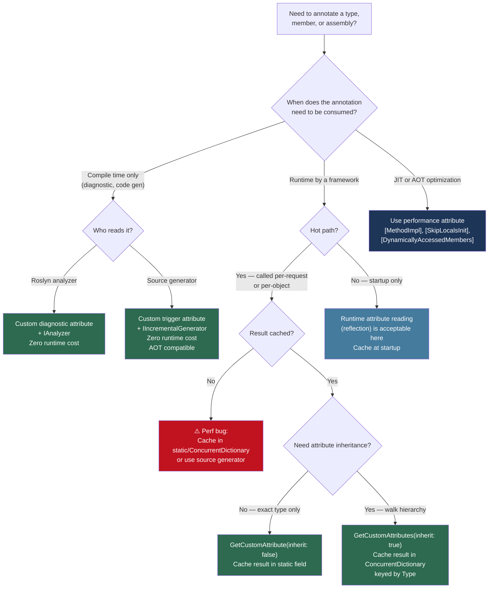

> [!success] Mastery Check
> - [ ] **Studied Well**
> - [ ] **Can explain the concept without notes**
> - [ ] **Can answer interview questions confidently**
> - [ ] **Can implement it in a real project**


## 📍 PART 0 — Navigation & Context

### Where This Topic Lives

```
C# Runtime Model
└── Metadata & Compilation Pipeline
    ├── Compilation Output (IL + PE metadata)
    │   ├── ► Attributes and Metadata      ← YOU ARE HERE
    │   ├──   Reflection (2.42)            — runtime attribute reading
    │   ├──   Source Generators (2.52)     — compile-time attribute reading
    │   └──   Native AOT (2.53)            — attribute-guided trimming
    └── Type System
        ├──   Value Types vs Reference Types (2.16)
        └──   Generics (2.17)
```

### What You Need Before This

- [[2.08 — Classes: Fields, Constructors, Static Members]] — attributes decorate classes and their members
- [[2.10 — Inheritance, Polymorphism, Casting]] — attribute inheritance through class hierarchies
- [[2.17 — Generics: Constraints, Reification]] — generic attributes (C# 11+) are a direct extension of generics

### What This Unlocks After

- [[2.42 — Reflection]] — the runtime mechanism for reading attribute metadata from IL
- [[2.52 — Source Generators]] — compile-time attribute inspection to generate code with zero runtime cost
- [[2.53 — Native AOT, Trimming, and Publish-Time Constraints]] — `[DynamicallyAccessedMembers]` and `[RequiresDynamicCode]` guide the AOT trimmer

### Why This Matters in Production

Attributes are the primary extension point between your code and every cross-cutting concern in the .NET ecosystem — serialization, validation, DI, logging, authorization, benchmarking, and native interop all use attributes as their configuration language. Getting them wrong means silent runtime failures; getting them right means zero-overhead metadata that informs tools from the compiler to the trimmer.

---

## 🧠 PART 1 — The Core Mental Model

### The Fundamental Rule

> **Attributes are metadata annotations stored in the PE (Portable Executable) binary alongside your IL. They cost nothing at runtime until someone calls `GetCustomAttribute()` — at which point the CLR instantiates the attribute class from the stored metadata, allocating on the heap.** The practical consequence: an attribute declaration in your source file is free at runtime; reading it via reflection is expensive (~1–5 μs per call).

### The Plain-Language Analogy

Think of attributes like sticky notes placed on physical folders in a filing cabinet. You can walk past every folder in the cabinet and never look at the sticky notes — the notes don't slow you down, don't take up meaningful space, and don't activate anything on their own. But when an auditor (a framework, a source generator, the JIT) specifically picks up a folder and reads the sticky note, they can act on it. The sticky notes are placed when the filing cabinet is built (compile time) and read when an auditor needs them (runtime or compile time). Crucially, two different auditors can read the same sticky note and do completely different things with the same information — an ORM reads `[Column("user_name")]` to map a property to a SQL column, while a code generator reads it to emit a `SqlParameter` builder.

### The Attribute Taxonomy

```mermaid
graph TD
    A["System.Attribute\n(base class for all attributes)"] --> B["Built-in / BCL Attributes"]
    A --> C["Custom Attributes\n(user-defined)"]

    B --> D["Compiler-Controlling\n[Conditional]\n[Obsolete]\n[MethodImpl]\n[SkipLocalsInit]"]
    B --> E["Caller Info\n[CallerMemberName]\n[CallerFilePath]\n[CallerLineNumber]\n[CallerArgumentExpression]"]
    B --> F["Interop / Layout\n[DllImport] / [LibraryImport]\n[StructLayout]\n[MarshalAs]\n[FieldOffset]"]
    B --> G["Serialization\n[JsonPropertyName]\n[JsonIgnore]\n[JsonSerializable]\n[XmlElement]"]
    B --> H["DI / Frameworks\n[Authorize]\n[HttpGet]\n[ApiController]\n[Required]"]
    B --> I["AOT / Trimming\n[DynamicallyAccessedMembers]\n[RequiresDynamicCode]\n[RequiresUnreferencedCode]"]
    B --> J["Performance\n[MethodImpl AggressiveInlining]\n[MethodImpl AggressiveOptimization]\n[MemoryDiagnoser]\n[Benchmark]"]

    C --> K["Validation Attributes\nderive from ValidationAttribute"]
    C --> L["Marker Attributes\nno properties, pure presence"]
    C --> M["Data Annotation Attributes\nproperty-carrying metadata"]
    C --> N["Generic Attributes\n(C# 11+, where T : class)"]

    style A fill:#1d3557,color:#fff
    style B fill:#2d6a4f,color:#fff
    style C fill:#6b3d6b,color:#fff
    style D fill:#40916c,color:#fff
    style E fill:#40916c,color:#fff
    style F fill:#40916c,color:#fff
    style G fill:#40916c,color:#fff
    style H fill:#40916c,color:#fff
    style I fill:#40916c,color:#fff
    style J fill:#40916c,color:#fff
    style K fill:#9b5fb5,color:#fff
    style L fill:#9b5fb5,color:#fff
    style M fill:#9b5fb5,color:#fff
    style N fill:#9b5fb5,color:#fff
```



> [!NOTE] Attribute vs. Annotation Terminology In C#, "attribute" and "annotation" mean the same thing. Java developers use "annotation"; the .NET ecosystem uses "attribute." `[Authorize]` is an attribute. They are both compile-time-stored metadata.

---

## 🔬 PART 2 — Deep Mechanics

### 2.1 How Attributes Are Stored in the PE Binary

An attribute is not magic. When the C# compiler sees `[Obsolete("Use v2")]`, it encodes the following into the IL metadata tables of the output `.dll`:

```
━━━━━━━━━━━━━━━━━━━━━━━━━━━━━━━━━━━━━━━━━━━━━━━━━━━━━━━━━━━━━━━━━
PE METADATA TABLE: CustomAttribute
━━━━━━━━━━━━━━━━━━━━━━━━━━━━━━━━━━━━━━━━━━━━━━━━━━━━━━━━━━━━━━━━━

Row in CustomAttribute table:
  Parent  → token pointing to the decorated member
            (type, method, property, assembly, etc.)
  Type    → MemberRef or MethodDef of the attribute constructor
  Value   → blob of bytes encoding the constructor arguments
            and named property/field values

The VALUE BLOB format (ECMA-335 §II.23.3):
  ┌──────────┬──────────────────┬──────────────────────┐
  │ Prolog   │ Fixed args       │ Named args           │
  │ 0x0001   │ positional ctor  │ property/field       │
  │ (2 bytes)│ args in order    │ name + value pairs   │
  └──────────┴──────────────────┴──────────────────────┘

Example: [Obsolete("Use v2", error: true)]
  Fixed args:  UTF-8 length-prefixed "Use v2" + bool 0x01
  Named args:  (none — both are positional params)

Example: [Display(Name = "First Name", Order = 1)]
  Fixed args:  (none — no positional params in ctor)
  Named args:  ("Name", "First Name"), ("Order", 1)

RUNTIME COST AT DECLARATION SITE: exactly ZERO
  The bytes exist in the PE file on disk. The CLR does not
  read them, parse them, or instantiate anything until
  GetCustomAttribute() / GetCustomAttributes() is called.
━━━━━━━━━━━━━━━━━━━━━━━━━━━━━━━━━━━━━━━━━━━━━━━━━━━━━━━━━━━━━━━━━
```

When you call `GetCustomAttribute<ObsoleteAttribute>(member)`, the CLR:

1. Finds the metadata row for this member's custom attributes
2. Locates the matching constructor signature
3. **Allocates a new `ObsoleteAttribute` instance on the heap**
4. Deserializes the blob back into constructor arguments and property assignments
5. Returns the live object

Cost: **~1–5 μs per call**, one heap allocation per attribute instance returned.

> [!IMPORTANT] The Single Most Important Rule About Attributes Cache the result of `GetCustomAttribute()` in a static field, a `ConcurrentDictionary`, or a compiled delegate. Calling it in a hot path is a ~1–5 μs latency hit plus a heap allocation per call.

### 2.2 Compiler Attribute Effects — Zero Runtime Cost

Some attributes are consumed entirely by the compiler and generate no runtime metadata at all. The C# compiler reads them during compilation and changes what IL it emits, then discards them.

```csharp
// [Conditional] — compiler removes call sites when symbol is not defined
// The method itself IS compiled and exists in the binary.
// The CALLS to it are removed at compile time.

#define AUDIT_ENABLED

[Conditional("AUDIT_ENABLED")]
static void LogAudit(string message)
{
    // This entire method body compiles normally.
    Console.WriteLine($"AUDIT: {message}");
}

void ProcessOrder(Order order)
{
    LogAudit($"Processing {order.Id}"); // Call INCLUDED (AUDIT_ENABLED defined)
}
// Without #define AUDIT_ENABLED:
// The call is removed from IL entirely — as if it was never written.
// Zero runtime cost. Zero allocation. The method body still exists.
```

```csharp
// [SkipLocalsInit] — prevents the JIT from zero-initializing stack variables
// Normally the CLR guarantees stack locals are zero-initialized before use.
// [SkipLocalsInit] tells the JIT: the programmer guarantees initialization.
// Result: eliminates memset() calls on stack frames — ~1-3 ns per call.
// DANGER: reading an uninitialized variable is undefined behavior.

[SkipLocalsInit]
static unsafe void ParseBinaryFrame(ReadOnlySpan<byte> data, out FrameHeader header)
{
    Unsafe.SkipInit(out header); // Required — explicitly marks it as "not yet initialized"
    header.Length = BinaryPrimitives.ReadUInt32BigEndian(data);
    header.Type   = data[4];
    // Every field is written before it's read — [SkipLocalsInit] is safe here
}
```

### 2.3 [AttributeUsage] — The Attribute That Governs Attributes

Every custom attribute must declare how it can be used. This happens via `[AttributeUsage]` on the attribute class itself.

```csharp
// The signature:
[AttributeUsage(
    AttributeTargets validOn,          // what can be decorated
    AllowMultiple = false,             // can appear more than once on same target?
    Inherited = true)]                 // do subclasses inherit this attribute?
public class MyAttribute : Attribute { }

// REAL EXAMPLE: a custom tenant isolation attribute for multi-tenant API
[AttributeUsage(
    AttributeTargets.Class | AttributeTargets.Method,  // controllers + actions
    AllowMultiple = false,                              // one tenant scope at a time
    Inherited = true)]                                  // controllers inherit to actions
public sealed class RequiresTenantAttribute : Attribute
{
    public TenantIsolationLevel Level { get; }

    public RequiresTenantAttribute(TenantIsolationLevel level = TenantIsolationLevel.Strict)
        => Level = level;
}

// Valid usages after this declaration:
[RequiresTenant(TenantIsolationLevel.Strict)]
public class PaymentController : ControllerBase { ... }

// Invalid — would cause a compiler error:
[RequiresTenant]
[RequiresTenant(TenantIsolationLevel.Relaxed)] // AllowMultiple=false prevents this
public void GetPayments() { }
```

**AttributeTargets flags (most commonly needed):**

```
AttributeTargets.Assembly     → [assembly: InternalsVisibleTo("...")]
AttributeTargets.Class        → [Serializable] on class
AttributeTargets.Struct       → [StructLayout] on struct
AttributeTargets.Interface    → [Obsolete] on interface
AttributeTargets.Enum         → [Flags] on enum
AttributeTargets.Constructor  → attribute on ctor specifically
AttributeTargets.Method       → [MethodImpl] on method
AttributeTargets.Property     → [JsonPropertyName] on property
AttributeTargets.Field        → [FieldOffset] on field
AttributeTargets.Parameter    → [CallerMemberName] on parameter
AttributeTargets.ReturnValue  → [return: MarshalAs] on return value
AttributeTargets.All          → any of the above (usually for diagnostics)
```

### 2.4 Caller Info Attributes — Compile-Time Argument Injection

These four attributes are consumed entirely by the compiler. They cause the compiler to fill in the parameter value at the call site, replacing the default value with real caller context. Cost: **zero at runtime** — the string is a compile-time constant baked into the IL.

```csharp
public class AuditLogger
{
    // The compiler fills in these parameters AT THE CALL SITE.
    // The string is a compile-time constant — no runtime string allocation.
    // The method signature must have a default value for the parameter.

    public static void Log(
        string message,
        [CallerMemberName]  string caller   = "",  // → "ProcessOrder"
        [CallerFilePath]    string file     = "",  // → "C:\src\OrderService.cs"
        [CallerLineNumber]  int    line     = 0,   // → 47
        [CallerArgumentExpression(nameof(message))]  // C# 10+
                            string expr    = "")   // → "order.ToString()"
    {
        Console.WriteLine($"[{caller}:{line}] {message} (expr: {expr})");
    }
}

// Call site:
void ProcessOrder(Order order)
{
    AuditLogger.Log(order.ToString()); // caller: "ProcessOrder", line: <actual line>
}

// What the compiler generates at the call site (approximately):
// AuditLogger.Log(order.ToString(), "ProcessOrder", @"C:\src\OrderService.cs", 47, "order.ToString()");
```

```csharp
// REAL-WORLD PATTERN: NotifyPropertyChanged with zero boilerplate
public abstract class ObservableEntity : INotifyPropertyChanged
{
    public event PropertyChangedEventHandler? PropertyChanged;

    protected void SetField<T>(ref T field, T value,
        [CallerMemberName] string propertyName = "")
    {
        if (EqualityComparer<T>.Default.Equals(field, value)) return;
        field = value;
        PropertyChanged?.Invoke(this, new PropertyChangedEventArgs(propertyName));
    }
}

public class CustomerViewModel : ObservableEntity
{
    private string _name = "";
    public string Name
    {
        get => _name;
        set => SetField(ref _name, value); // CallerMemberName fills "Name" automatically
    }
}
```

### 2.5 Performance Attributes — JIT Directives

```csharp
using System.Runtime.CompilerServices;

// [MethodImpl(MethodImplOptions.AggressiveInlining)]
// Strongly hints to the JIT: inline this method at all call sites.
// The JIT can still refuse if the method is too large.
// Use when: the method is small, on a hot path, and the call overhead matters.
// Cost if inlined: saves ~5-10 ns call overhead. Increases code size slightly.

[MethodImpl(MethodImplOptions.AggressiveInlining)]
public static bool IsValidOrderId(int id) => id > 0 && id < 10_000_000;

// [MethodImpl(MethodImplOptions.NoInlining)]
// Prevents inlining. Use when:
// • Method throws an exception (exception paths should not be inlined)
// • Method is on a rare slow path (keep hot-path code compact)
// • Profiler attribution needs to see the method as a distinct frame

[MethodImpl(MethodImplOptions.NoInlining)]
private static void ThrowPaymentValidationFailed(string reason)
    => throw new PaymentValidationException(reason);

// [MethodImpl(MethodImplOptions.AggressiveOptimization)]
// (.NET Core 3.0+) Forces Tier 2 (fully optimized) JIT from the first call.
// Normally Tier 0 runs first, then recompiles to Tier 2 after warmup.
// Use for: latency-critical startup paths where you cannot afford the warmup cost.

[MethodImpl(MethodImplOptions.AggressiveOptimization)]
public static decimal CalculateOrderTotal(ReadOnlySpan<LineItem> items)
{
    decimal total = 0;
    foreach (ref readonly var item in items)
        total += item.UnitPrice * item.Quantity;
    return total;
}
```

### 2.6 Generic Attributes (C# 11+)

Before C# 11, passing type information to an attribute required a `Type` parameter (which bypasses generics and loses type safety). Generic attributes close this gap.

```csharp
// ⚠️ Pre-C# 11: type-unsafe attribute
public class ValidatorAttribute : Attribute
{
    public Type ValidatorType { get; }
    public ValidatorAttribute(Type validatorType) => ValidatorType = validatorType;
}

[Validator(typeof(OrderValidator))]   // not type-checked at compile time
public class Order { }

// ✅ C# 11+: generic attribute with constraint
[AttributeUsage(AttributeTargets.Class)]
public class ValidatorAttribute<TValidator> : Attribute
    where TValidator : IValidator  // compile-time type safety!
{
    // No runtime Type parameter needed — T is in the metadata
}

[Validator<OrderValidator>]           // compiler verifies OrderValidator : IValidator
public class Order { }

// Reading it at runtime via reflection:
var attr = typeof(Order)
    .GetCustomAttribute(typeof(ValidatorAttribute<>)); // open generic in reflection

// Or with a helper that checks the generic type argument:
static Type? GetValidatorType(Type modelType)
{
    foreach (var attr in modelType.GetCustomAttributes(inherit: false))
    {
        var attrType = attr.GetType();
        if (attrType.IsGenericType &&
            attrType.GetGenericTypeDefinition() == typeof(ValidatorAttribute<>))
            return attrType.GetGenericArguments()[0];
    }
    return null;
}
```

> [!WARNING] Generic Attributes and Native AOT Generic attributes work at runtime via reflection, but Native AOT requires the trimmer to know all instantiations at compile time. Pair them with source generators (2.52) if you need AOT compatibility.

---

## 💻 PART 3 — Production Code Patterns

### 3.1 The Immutable Attribute with Validation

Attributes should be simple, immutable value-carriers. Any logic they contain runs at the time a framework reads them — keep it minimal.

```csharp
// DOMAIN: Invoice line items — annotation-driven serialization contract
// The [JsonPropertyName] pattern: control wire format independently from code names.

[AttributeUsage(AttributeTargets.Property, AllowMultiple = false, Inherited = false)]
public sealed class WireNameAttribute : Attribute
{
    // ✅ CORRECT: Positional ctor argument validated eagerly at construction time.
    // Attribute is sealed — no subclassing surprises.
    // Named parameters are optional with defaults.
    public string Name { get; }
    public bool Required { get; }

    public WireNameAttribute(string name, bool required = true)
    {
        if (string.IsNullOrWhiteSpace(name))
            throw new ArgumentException("Wire name cannot be blank", nameof(name));
        Name = name;
        Required = required;
    }
}

public class InvoiceLineItem
{
    [WireName("unit_price")]
    public decimal UnitPrice { get; init; }

    [WireName("qty", required: false)]
    public int Quantity { get; init; }

    [WireName("sku")]
    public string Sku { get; init; } = "";
}
```

### 3.2 The Cached Attribute Reader

Reading attributes in a hot path without caching is the most common attribute-related performance bug.

```csharp
// DOMAIN: Order validation framework — attribute-driven field requirements
// Pattern: read once at startup, cache forever.

// ⚠️ WRONG: reflection on every validation call
public static bool ValidateOrder_Slow(Order order)
{
    foreach (var prop in typeof(Order).GetProperties())  // GetProperties: ~500 ns
    {
        var attr = prop.GetCustomAttribute<RequiredAttribute>(); // ~1–5 μs per property!
        if (attr != null && prop.GetValue(order) == null)
            return false;
    }
    return true;
}

// ✅ CORRECT: build a pre-compiled validation delegate, cache it
public static class OrderValidator
{
    // Built once at startup, reused for every validation call
    private static readonly Func<Order, bool>[] _requiredChecks
        = BuildRequiredChecks();

    private static Func<Order, bool>[] BuildRequiredChecks()
    {
        // This runs ONCE at startup — reflection cost is paid once, not per-call
        return typeof(Order)
            .GetProperties()
            .Where(p => p.GetCustomAttribute<RequiredAttribute>() != null)
            .Select<PropertyInfo, Func<Order, bool>>(p =>
            {
                // Compile a property accessor delegate — ~5 ns per call after compile
                var param = Expression.Parameter(typeof(Order), "o");
                var getter = Expression.Property(param, p);
                var notNull = Expression.NotEqual(getter, Expression.Constant(null, getter.Type));
                return Expression.Lambda<Func<Order, bool>>(notNull, param).Compile();
            })
            .ToArray();
    }

    public static bool IsValid(Order order)
    {
        // ~5–10 ns per check — no reflection, no allocation
        foreach (var check in _requiredChecks)
            if (!check(order)) return false;
        return true;
    }
}
```

### 3.3 Assembly-Level Attributes — The Startup Contract

Assembly-level attributes use the `[assembly:]` target syntax and control cross-cutting concerns at the binary level. They live in any `.cs` file (conventionally `AssemblyInfo.cs` or the project's namespace file).

```csharp
// These affect the entire compiled assembly:

// Allows OrderService.Tests to access internal types of OrderService
[assembly: InternalsVisibleTo("OrderService.Tests")]
[assembly: InternalsVisibleTo("OrderService.IntegrationTests")]

// Controls how internals are exposed to COM
[assembly: ComVisible(false)]

// Marks the assembly as requiring a specific .NET version
[assembly: TargetFramework(".NETCoreApp,Version=v8.0",
    FrameworkDisplayName = ".NET 8.0")]

// For Native AOT / trimming: declares what reflection this assembly uses
[assembly: MetadataUpdateHandler(typeof(HotReloadHandler))]

// Annotates the entire assembly as having null-safety annotations
[module: System.Runtime.CompilerServices.NullableContext(1)]
[module: System.Runtime.CompilerServices.Nullable(0)]
// ↑ these are compiler-inserted when <Nullable>enable</Nullable> is in .csproj

// Source-generator-driven: mark the assembly's serialization contracts
[assembly: JsonSerializable(typeof(Order))]
[assembly: JsonSerializable(typeof(InvoiceLineItem))]
// Generates a JsonSerializerContext subclass at compile time (no runtime reflection)
```

### 3.4 The [Obsolete] Pattern — Controlled API Deprecation

```csharp
// DOMAIN: Payment gateway API versioning
// Pattern: deprecate gracefully, guide migration, optionally block compilation.

public class PaymentGateway
{
    // Stage 1: Warn — compilation succeeds with warning CS0618
    [Obsolete("Use ProcessPaymentV2(PaymentRequest) instead. Will be removed in v4.0.")]
    public PaymentResult ProcessPayment(string cardNumber, decimal amount)
    {
        // Bridge to new implementation — keeps old callers working
        return ProcessPaymentV2(new PaymentRequest { CardNumber = cardNumber, Amount = amount });
    }

    // Stage 2: Error — compilation fails with error CS0619 (for truly dangerous APIs)
    [Obsolete("This method transmits card data in plain text. Use ProcessPaymentV2. " +
              "See migration guide: https://internal/wiki/payment-v2", error: true)]
    public void ProcessPaymentLegacy(string cardNumberPlainText) { }

    // The new API — no [Obsolete]
    public PaymentResult ProcessPaymentV2(PaymentRequest request) { /* ... */ return default; }
}

// ✅ To suppress a specific obsolete warning at a known, intentional call site:
#pragma warning disable CS0618
var result = gateway.ProcessPayment("4111...", 99.99m); // Known legacy caller, tracked
#pragma warning restore CS0618
```

### 3.5 The [Required] + Data Annotations Pattern for Boundary Validation

```csharp
// DOMAIN: User registration — API boundary validation using System.ComponentModel.DataAnnotations
// These attributes are read by ASP.NET Core's model binder during request deserialization.
// Zero cost until ModelState.IsValid is checked.

public class CreateUserRequest
{
    [Required(ErrorMessage = "Email address is required")]
    [EmailAddress(ErrorMessage = "Must be a valid email address")]
    [MaxLength(254, ErrorMessage = "Email must not exceed 254 characters")]
    public string Email { get; init; } = "";

    [Required]
    [MinLength(8, ErrorMessage = "Password must be at least 8 characters")]
    [RegularExpression(@"^(?=.*[A-Z])(?=.*\d).+$",
        ErrorMessage = "Password must contain at least one uppercase letter and one digit")]
    public string Password { get; init; } = "";

    [Range(13, 120, ErrorMessage = "Age must be between 13 and 120")]
    public int? Age { get; init; }
}

// In an ASP.NET Core controller:
[ApiController]
[Route("api/users")]
public class UsersController : ControllerBase
{
    [HttpPost]
    public IActionResult Create([FromBody] CreateUserRequest request)
    {
        // [ApiController] automatically calls ModelState.IsValid
        // and returns 400 if validation fails — no manual check needed
        return Ok();
    }
}
```

### 3.6 Custom Validation Attribute — Domain-Level Rules

```csharp
// DOMAIN: Order amount validation — business rule as a reusable attribute
// Pattern: derive from ValidationAttribute, implement IsValid.

[AttributeUsage(AttributeTargets.Property, AllowMultiple = false)]
public sealed class ValidOrderAmountAttribute : ValidationAttribute
{
    private readonly decimal _min;
    private readonly decimal _max;

    public ValidOrderAmountAttribute(double min = 0.01, double max = 999_999.99)
    {
        _min = (decimal)min;
        _max = (decimal)max;
    }

    protected override ValidationResult? IsValid(object? value, ValidationContext context)
    {
        if (value is null)
            return new ValidationResult("Order amount is required.");

        if (value is not decimal amount)
            return new ValidationResult("Order amount must be a decimal value.");

        if (amount < _min || amount > _max)
            return new ValidationResult(
                $"Order amount must be between {_min:C} and {_max:C}.",
                new[] { context.MemberName! });

        return ValidationResult.Success;
    }
}

public class CreateOrderRequest
{
    [ValidOrderAmount(min: 0.01, max: 50_000.00)]
    public decimal Amount { get; init; }
}
```

### 3.7 The Marker Attribute Pattern — Feature Flags in Metadata

```csharp
// DOMAIN: Internal framework — route pre-authorization marking
// Marker attributes carry no data; their presence IS the information.
// Source generators and analyzers can find these with zero runtime cost.

[AttributeUsage(AttributeTargets.Method, Inherited = false)]
public sealed class BypassRateLimitAttribute : Attribute { }

[AttributeUsage(AttributeTargets.Class | AttributeTargets.Method, Inherited = true)]
public sealed class InternalEndpointAttribute : Attribute { }

// Usage:
[InternalEndpoint]
public class HealthController : ControllerBase
{
    [HttpGet("/health")]
    [BypassRateLimit]  // presence → zero-runtime-cost signal to middleware
    public IActionResult Get() => Ok(new { status = "healthy" });
}

// Middleware reading marker attribute — cached via IActionDescriptor:
public class RateLimitMiddleware
{
    // At request time, metadata is pre-extracted by ASP.NET Core pipeline
    // into IActionDescriptor — no per-request reflection needed.
    public async Task InvokeAsync(HttpContext context, RequestDelegate next)
    {
        var endpoint = context.GetEndpoint();
        var bypass = endpoint?.Metadata.GetMetadata<BypassRateLimitAttribute>();

        if (bypass != null) { await next(context); return; }

        // ... apply rate limiting
        await next(context);
    }
}
```

---

## ⚠️ PART 4 — Gotchas & Anti-Patterns

### Gotcha 1: Attribute Inheritance — `Inherited = true` Is the Default

The default value of `Inherited` on `[AttributeUsage]` is `true`. This means attribute presence queries on a subclass will find attributes from its base class — which is often not what you want for action-level attributes in web frameworks.

```csharp
// ⚠️ WRONG mental model: "this attribute is on this exact method, not its overrides"

[AttributeUsage(AttributeTargets.Method)]  // Inherited defaults to TRUE
public sealed class AuditAttribute : Attribute { }

public class BaseController
{
    [Audit]
    public virtual IActionResult Get() => Ok();
}

public class OrderController : BaseController
{
    // DOES NOT DECLARE [Audit] — but GetCustomAttribute<AuditAttribute>()
    // on the OVERRIDING method will still FIND the attribute from the base class.
    // This surprises engineers who expect attribute queries to be exact-match.
    public override IActionResult Get() => Ok(FetchOrders());

    private object FetchOrders() => new();
}

// ✅ CORRECT: Be explicit about Inherited when it matters
[AttributeUsage(AttributeTargets.Method, Inherited = false)]
public sealed class AuditAttribute : Attribute { }
// Now subclass methods WITHOUT [Audit] will NOT inherit it — intent is clear.
```

### Gotcha 2: `AllowMultiple = false` Does Not Prevent the Attribute from Appearing via Inheritance

`AllowMultiple = false` only prevents declaring the same attribute _multiple times on the same target_. It does not prevent a subclass from inheriting one AND declaring its own — resulting in two effective instances from the framework's perspective.

```csharp
// ⚠️ The bug: AllowMultiple=false still allows base + derived to each have one instance
[AttributeUsage(AttributeTargets.Class, AllowMultiple = false, Inherited = true)]
public sealed class TimeoutAttribute : Attribute
{
    public int Seconds { get; }
    public TimeoutAttribute(int seconds) => Seconds = seconds;
}

[Timeout(30)]
public class BaseApiClient { }

[Timeout(5)]                           // Compile: OK (AllowMultiple only blocks 2 on same target)
public class PaymentApiClient : BaseApiClient { }

// Framework reading this: GetCustomAttributes(typeof(TimeoutAttribute), inherit: true)
// Returns TWO TimeoutAttribute instances: [Timeout(5)] from PaymentApiClient
//                                    and [Timeout(30)] from BaseApiClient
// Which one wins? Depends entirely on the framework.

// ✅ CORRECT: use GetCustomAttribute (singular) with inherit: false to get only the declared one
var attr = typeof(PaymentApiClient)
    .GetCustomAttribute<TimeoutAttribute>(inherit: false);  // returns [Timeout(5)] only, or null
```

### Gotcha 3: Named Constructor Arguments vs. Named Property Arguments — a Silent Failure Mode

Attributes have two syntaxes that look similar but work differently. Constructor arguments are positional and required; property-setting arguments are optional and order-independent. Mixing them up produces either a compile error or silent defaults.

```csharp
// EXAMPLE: a hypothetical cache attribute
[AttributeUsage(AttributeTargets.Method)]
public sealed class CacheAttribute : Attribute
{
    public int DurationSeconds { get; set; } = 60;  // named property arg
    public string? Key { get; set; }                  // named property arg

    // Positional ctor param
    public CacheAttribute(bool enabled = true) => Enabled = enabled;
    public bool Enabled { get; }
}

// ⚠️ WRONG: confusing property-setting args with constructor args
// This compiles BUT Key is the property, not a constructor parameter.
// New engineer reads this and thinks Key is "products" positionally.
[Cache("products")]  // Actually: enabled = true (default), "products" does NOT go to Key

// This causes a compile error:
// [Cache(Key = "products", true)]  // positional after named: CS0839

// ✅ CORRECT: be explicit
[Cache(enabled: true, Key = "products", DurationSeconds = 300)]
public IEnumerable<Product> GetProducts() => Enumerable.Empty<Product>();
```

### Gotcha 4: Reading Attributes Through an Interface Reference Finds Nothing

`GetCustomAttribute()` reads metadata from the concrete runtime type, not through an interface. Calling it on a `PropertyInfo` obtained via interface reflection returns empty results even if the concrete class has the attribute.

```csharp
public interface IUserRepository
{
    IEnumerable<User> GetAll();
}

public class SqlUserRepository : IUserRepository
{
    [Obsolete("Use GetAllAsync")]
    public IEnumerable<User> GetAll() => Enumerable.Empty<User>();
}

// ⚠️ WRONG: getting method from interface, then looking for attributes
var method = typeof(IUserRepository).GetMethod(nameof(IUserRepository.GetAll))!;
var attr = method.GetCustomAttribute<ObsoleteAttribute>();
// attr is NULL — the interface method has no attribute. The IMPLEMENTATION does.

// ✅ CORRECT: get the method from the CONCRETE type
var concreteMethod = typeof(SqlUserRepository).GetMethod(nameof(SqlUserRepository.GetAll))!;
var attr2 = concreteMethod.GetCustomAttribute<ObsoleteAttribute>();
// attr2 is NOT null
```

### Gotcha 5: Attribute Instances Are Reconstructed on Every `GetCustomAttribute()` Call

Unlike the intuitive mental model of "the attribute is on the class," the attribute is actually stored as a byte blob in metadata. Every call to `GetCustomAttribute()` creates a **new** attribute instance by deserializing that blob. This means reference equality checks between attribute instances always fail.

```csharp
// ⚠️ WRONG: caching an attribute instance and using reference equality
var attr1 = typeof(Order).GetCustomAttribute<RequiredAttribute>();
var attr2 = typeof(Order).GetCustomAttribute<RequiredAttribute>();

Console.WriteLine(ReferenceEquals(attr1, attr2)); // FALSE — different instances!
// attr1 and attr2 are both valid, equal in value, but different heap objects.

// This causes bugs in naive deduplication:
var attrs = new HashSet<RequiredAttribute>(ReferenceEqualityComparer.Instance);
attrs.Add(typeof(Order).GetCustomAttribute<RequiredAttribute>()!);
attrs.Add(typeof(Order).GetCustomAttribute<RequiredAttribute>()!);
Console.WriteLine(attrs.Count); // 2 — not 1 as expected!

// ✅ CORRECT: cache the result in a static or lazy field;
// compare by VALUE if equality is needed.
private static readonly RequiredAttribute? _orderAttr
    = typeof(Order).GetCustomAttribute<RequiredAttribute>();

// Or if you need the attribute multiple times:
private static readonly ConcurrentDictionary<Type, ObsoleteAttribute?> _obsoleteCache = new();
static ObsoleteAttribute? GetObsolete(Type t)
    => _obsoleteCache.GetOrAdd(t, static t => t.GetCustomAttribute<ObsoleteAttribute>());
```

---

## 📊 PART 5 — Performance Implications

### 5.1 Allocation Characteristics Table

|Scenario|Allocation Behavior|Approx Cost|
|---|---|---|
|Attribute declared on a class/method|Zero — stored as metadata bytes in PE|0 ns, 0 alloc|
|`GetCustomAttribute<T>(member)` (cache miss)|1 new T instance per call + CLR metadata parsing|~1–5 μs, 1 alloc|
|`GetCustomAttributes(member, inherit: true)`|Array + N attribute instances|~N × 2 μs|
|`[CallerMemberName]` parameter filled|Zero — compile-time constant string in IL|0 ns, 0 alloc|
|`[Conditional("DEBUG")]` call removed|Zero — call site deleted at compile time|0 ns, 0 alloc|
|`[MethodImpl(AggressiveInlining)]` inlined|Zero extra cost; saves ~5–10 ns call overhead|-5 ns to -10 ns|
|`[SkipLocalsInit]` on a method|Saves stack zero-init (~1–3 ns per call)|-1 to -3 ns|
|Attribute cached in `static readonly` field|1 allocation at startup, zero per subsequent call|0 ns amortized|
|Source generator reading attribute at compile time|Zero runtime cost — happens at build|0 ns, 0 alloc|
|`[DynamicDependency]` preserving a type for AOT|Zero runtime cost — trimmer directive|0 ns, 0 alloc|

### 5.2 BenchmarkDotNet: Attribute Reading Strategies

```csharp
// Expected output (approximate, .NET 8, x64):
//
// | Method                    | Mean       | Allocated |
// |---------------------------|------------|-----------|
// | ReadAttributeUncached     | 3,412.0 ns |    192 B  |
// | ReadAttributeCached       |     4.1 ns |      0 B  |
// | ReadAttributeCompiledExpr |     7.8 ns |      0 B  |
// | CallerMemberNameBaseline  |     0.3 ns |      0 B  |

[MemoryDiagnoser]
[BenchmarkCategory("Attributes")]
public class AttributeReadingBenchmark
{
    private static readonly PropertyInfo _prop
        = typeof(InvoiceLineItem).GetProperty(nameof(InvoiceLineItem.UnitPrice))!;

    // Pre-cached result for comparison
    private static readonly WireNameAttribute? _cached
        = _prop.GetCustomAttribute<WireNameAttribute>();

    // Compiled property reader (for GetValue comparison)
    private static readonly Func<InvoiceLineItem, decimal> _compiledGetter
        = (Func<InvoiceLineItem, decimal>)
            Delegate.CreateDelegate(typeof(Func<InvoiceLineItem, decimal>), _prop.GetGetMethod()!);

    private readonly InvoiceLineItem _item = new() { UnitPrice = 99.99m, Quantity = 1, Sku = "SKU-001" };

    [Benchmark(Baseline = true)]
    public WireNameAttribute? ReadAttributeUncached()
        // ⚠️ This allocates a new WireNameAttribute each call
        => _prop.GetCustomAttribute<WireNameAttribute>();

    [Benchmark]
    public WireNameAttribute? ReadAttributeCached()
        // ✅ Read the pre-cached static field — zero allocation, ~4 ns
        => _cached;

    [Benchmark]
    public decimal ReadPropertyCompiledExpr()
        // ✅ Compiled delegate — faster than reflection.GetValue, no boxing
        => _compiledGetter(_item);

    [Benchmark]
    public string CallerMemberNameBaseline([CallerMemberName] string caller = "")
        // ✅ Compile-time constant — measures essentially nothing
        => caller;
}
```

### 5.3 When to Care / When to Ignore

**When this costs you:**

- Reading attributes inside a request handler without caching — every request pays 1–5 μs per attribute call
- Validation frameworks that call `GetCustomAttributes()` per-property on every object in a tight loop — can add 100+ μs to hot paths
- Plugin systems that scan assemblies for attributes at every operation rather than once at startup
- Any path where `GetCustomAttributes(inherit: true)` walks the full type hierarchy on every call

**When this doesn't matter:**

- Startup / bootstrap code where attributes are read once and results cached
- Source generators that eliminate runtime attribute reading entirely — zero runtime cost
- `[CallerMemberName]` / `[Conditional]` — consumed by compiler, no runtime overhead
- `[MethodImpl]` / `[SkipLocalsInit]` — consumed by JIT, no attribute reading at runtime
- Developer tooling (analyzers, generators) — build time is not production runtime

---

## 🎤 PART 6 — Interview Arsenal

### 6.1 The Question Bank

---

> **Q: "What is an attribute in C#, and how does it work at the runtime level?"**

**Average answer:** "An attribute is a way to attach metadata to classes, methods, or properties. You declare them with square brackets and frameworks can read them via reflection."

**Why that's insufficient:** It describes _what_ you do, not _what happens_. It skips the storage model, the instantiation cost, and the difference between compile-time and runtime consumption.

> **Great answer:** "An attribute is metadata stored as a byte blob in the PE metadata tables of the compiled assembly — alongside the IL. At the declaration site, an attribute has exactly zero runtime cost: no heap allocation, no execution. The CLR only materializes the attribute when someone calls `GetCustomAttribute()`, at which point it deserializes the stored blob and allocates a new attribute class instance on the heap, typically costing around one to five microseconds per call. This is why caching attribute lookup results in a `static` field or a `ConcurrentDictionary` is essential for any hot path. Some attributes — `[Conditional]`, `[CallerMemberName]`, `[MethodImpl]` — are consumed entirely at compile or JIT time and never reach the runtime metadata system at all."

---

> **Q: "What does `[AttributeUsage]` do, and why do you need it?"**

**Average answer:** "It controls where you can apply an attribute, like whether it goes on a class or a method."

**Why that's insufficient:** It mentions only `AttributeTargets` and omits `AllowMultiple` and `Inherited`, which are the source of the most common production bugs.

> **Great answer:** "It governs three things. First, `AttributeTargets` — a flags enum that restricts which language elements the attribute may decorate, giving a compile-time error if misused. Second, `AllowMultiple` — whether the same attribute can appear multiple times on the same target; the default is `false`, which prevents stacking. Third, `Inherited` — whether subclasses inherit the attribute from a base class; the default is `true`, which surprises people because they expect an attribute on a base class method to not appear when they query the overriding method. I almost always set `Inherited = false` on method-level attributes for web controller actions because inheriting action-level metadata across controller hierarchies produces subtle routing and authorization bugs."

---

> **Q: "What are caller info attributes, and why are they preferred over reflection-based approaches for logging?"**

**Average answer:** "They let you get the name of the calling method without passing a string argument manually."

**Why that's insufficient:** It doesn't explain _how_ they work or why they are strictly superior to `Environment.StackTrace` or `StackFrame` for the same purpose.

> **Great answer:** "Caller info attributes — `[CallerMemberName]`, `[CallerFilePath]`, `[CallerLineNumber]`, and `[CallerArgumentExpression]` in C# 10 — are consumed entirely by the C# compiler. When the compiler sees a method call where the parameter has one of these attributes and no argument is supplied, it fills in the value at the call site as a compile-time constant and embeds it in the IL. At runtime it's just a string literal or integer literal in the method call — zero allocation, zero reflection, zero stack walk. This is in stark contrast to `new StackFrame()` which must walk the call stack at runtime, which costs roughly one to three microseconds and allocates. For logging that happens on every request, that difference is material."

---

> **Q: "How would you make an attribute useful at compile time without runtime cost?"**

**Average answer:** "You could use source generators or Roslyn analyzers to read them at build time."

**Why that's insufficient:** Correct, but needs grounding in concrete examples and the connection to Native AOT.

> **Great answer:** "There are two paths. The first is Roslyn analyzers: you write a diagnostic analyzer that inspects the syntax tree or semantic model during compilation, finds your attribute, and produces warnings or errors — zero runtime presence. The second is source generators: you write an `IIncrementalGenerator` that reads your attributes using the `SyntaxProvider` pipeline, inspects them, and emits new C# files with the implementation. The generated code has no reflection — it uses concrete types directly. This is exactly what `[JsonSerializable]`, `[GeneratedRegex]`, and `[LoggerMessage]` do: the attribute is the _trigger_, and the source generator is the _engine_. The runtime code path has no `GetCustomAttribute()` call at all. This is also the path to Native AOT compatibility, where runtime reflection on attributes is unavailable."

---

> **Q: "What is the difference between `[Obsolete("message")]` and `[Obsolete("message", error: true)]`?"**

**Average answer:** "One gives a warning and the other is an error."

**Why that's insufficient:** Doesn't address when to use each, the `#pragma warning` suppression path, or the versioning strategy they enable.

> **Great answer:** "The first — `error: false`, the default — emits CS0618, a warning, which lets existing callers compile and keeps CI green while signaling migration is needed. The second — `error: true` — emits CS0619, an error, which blocks compilation. The pattern I follow for API versioning has three stages: first, add the attribute with a warning and a migration message pointing to the new API; second, after a major version boundary, upgrade to `error: true` to block new code from using it; third, actually remove the method. The warning-then-error cycle gives teams time to migrate without a hard cutoff. You can suppress specific occurrences with `#pragma warning disable CS0618` at the known legacy call sites, which also makes the technical debt visible in code review."

---

### 6.2 Trick Questions

> [!WARNING] Know These Before You Go In

**"Does applying an attribute to a method affect its execution performance?"** The trap: saying "yes, it adds overhead." The correct answer: No, unless a framework reads the attribute on every execution. The attribute is just bytes in metadata. If no one reads it, it is invisible at runtime. The overhead comes from `GetCustomAttribute()` calls, not from the decoration itself.

**"Can an attribute have a property of type `List<string>`?"** The trap: saying "yes, any type." The correct answer: No. Attribute property types are restricted to a specific set: primitive types (`bool`, `byte`, `char`, `short`, `int`, `long`, `float`, `double`), `string`, `System.Type`, `enum` types, single-dimensional arrays of any of the above, and `object`. `List<string>` is not allowed — it is not one of the ECMA-specified blob-serializable types.

**"What happens if two source generators both read the same attribute on the same class?"** The trap: saying it's a conflict or error. The correct answer: Nothing bad — generators are independent transformations. Both generators read the same attribute and emit their own separate code files. It is the responsibility of the author to make sure the generated code does not clash in names. Roslyn handles multiple generators composably.

**"Is `[MethodImpl(AggressiveInlining)]` a guarantee that the JIT will inline the method?"** The trap: saying "yes, it forces inlining." The correct answer: It is a strong hint, not a contract. The JIT can still decline to inline for reasons including: the method is too large, inlining would cause code size explosion, the method contains certain IL instructions (like `localloc`) that resist inlining, or tiered compilation hasn't yet reached the code.

**"Where should you place assembly-level attributes in a multi-file project?"** The trap: saying "in AssemblyInfo.cs." The correct answer: Anywhere in the project — any `.cs` file will work, because `[assembly:]` attributes apply to the compiled output, not the file. The convention of `AssemblyInfo.cs` is a legacy artifact from older tooling. In SDK-style projects, many of these are generated by the build system from MSBuild properties and live in a generated file under `obj/`.

---

### 6.3 Red Flags to Avoid

```
❌ "Attributes slow down method execution" — wrong; the PE bytes are not read unless
   GetCustomAttribute() is called. The decorator itself is free.

❌ "Attributes are the same as annotations" — correct in .NET; wrong if you say this
   to mean something different. Clarify if context suggests Java comparison.

❌ "You can use any type as an attribute property" — wrong; only ECMA-specified
   serializable types: primitives, string, Type, enum, 1D arrays of these.

❌ "GetCustomAttribute() returns a cached instance" — critically wrong; it
   creates a NEW instance on every call. Not caching is a production perf bug.

❌ Confusing [Conditional("DEBUG")] with #if DEBUG — Conditional removes call
   sites but keeps the method; #if DEBUG removes the method body entirely.

❌ "Inherited = true means the attribute IS on the subclass" — it means
   GetCustomAttributes(inherit: true) will find it when querying the subclass.
   The attribute is stored on the base class's metadata row, not copied.

❌ "AllowMultiple = false prevents all duplicates" — it only prevents two
   declarations on the same exact target. Inheritance can still produce
   multiple effective instances.
```

---

## 🔀 PART 7 — Decision Framework



---

## ✅ PART 8 — Self-Check

### Conceptual Questions

1. An attribute is declared on a class. A method in a completely unrelated part of the codebase never reads that attribute. Does the attribute affect execution performance? Explain what is and is not in memory at runtime.
    
2. What is the ECMA restriction on attribute property types? Why can't you use `List<string>` as an attribute property?
    
3. You declare `[AttributeUsage(AttributeTargets.Method, Inherited = true)]` on your custom attribute. You place it on a virtual method in `BaseController`. An engineer overrides that method in `OrderController` without re-declaring the attribute. What does `GetCustomAttribute<YourAttribute>(inherit: true)` return on the overriding method?
    
4. What is the difference in IL behavior between `[Conditional("DEBUG")]` and `#if DEBUG` wrapping a method body?
    
5. A team member marks a public API method `[Obsolete("Use v2")]` and pushes it. Six months later they upgrade to `error: true`. What happens to the CI of teams that never migrated? What would you do to handle this transition more gracefully?
    
6. You have a logging helper that takes `[CallerMemberName] string caller = ""`. A junior engineer argues "this must be slow because it uses reflection." How do you correct this with a reference to exactly what the compiler does?
    
7. Why does `GetCustomAttribute()` on an interface's `PropertyInfo` return `null` even when the implementing class has the attribute?
    
8. You need to read an attribute on 10,000 objects per second in a payment processing hot path. What is the correct caching strategy, and what data structure would you use?
    
9. A generic attribute `[Validator<T>]` (C# 11) is declared on a class. How does a source generator discover which `T` was used — and why can't you use a `static readonly` field initialized with the attribute's `T` directly?
    
10. You want to prevent the trimmer from removing a method that is only accessed via reflection. Which attribute should you apply, and on which declaration site?
    

### Code Puzzles

**Puzzle 1:** What does `output` contain after this runs?

```csharp
[AttributeUsage(AttributeTargets.Class, Inherited = true)]
public sealed class TagAttribute : Attribute
{
    public string Name { get; }
    public TagAttribute(string name) => Name = name;
}

[Tag("base")]
public class BaseEntity { }

[Tag("derived")]
public class OrderEntity : BaseEntity { }

var attrs = typeof(OrderEntity)
    .GetCustomAttributes(typeof(TagAttribute), inherit: true)
    .Cast<TagAttribute>()
    .Select(a => a.Name)
    .ToList();

string output = string.Join(", ", attrs);
```

<details> <summary>Answer (expand after trying)</summary>

`output` is `"derived, base"`.

`GetCustomAttributes(inherit: true)` walks the inheritance chain. `OrderEntity` declares `[Tag("derived")]` and inherits `[Tag("base")]` from `BaseEntity`. Both are returned, with the most-derived type's attribute first. If `Inherited = false` were set, only `"derived"` would be returned. If you used `GetCustomAttribute<TagAttribute>(inherit: true)` (singular), it would return only the first one found: `"derived"`.

</details>

---

**Puzzle 2:** Does this method ever actually run? What does the caller see?

```csharp
// Compiled without #define PERF_TRACE
[Conditional("PERF_TRACE")]
static void TracePerformance(string label)
{
    Console.WriteLine($"TRACE: {label} at {DateTime.UtcNow:O}");
}

static void ProcessInvoice(Invoice invoice)
{
    TracePerformance("start");      // Line A
    var total = invoice.Calculate();
    TracePerformance("calculated"); // Line B
    Console.WriteLine(total);
}
```

<details> <summary>Answer (expand after trying)</summary>

Lines A and B — the **call sites** — are completely removed from the IL at compile time because `PERF_TRACE` is not defined. The `TracePerformance` method body IS compiled and exists in the assembly, but no call sites in the calling assembly emit a `call` or `callvirt` IL instruction. At runtime, `TracePerformance` is never invoked. The method existing in the binary is a negligible cost — it is just bytes in the PE file that are never executed. If `PERF_TRACE` were defined, the calls would be emitted normally.

</details>

---

**Puzzle 3:** Find the bug — why does validation always fail?

```csharp
[AttributeUsage(AttributeTargets.Property)]
public sealed class NonEmptyAttribute : Attribute { }

public class ShipmentRequest
{
    [NonEmpty]
    public string DestinationAddress { get; init; } = "";
}

public static bool Validate(ShipmentRequest req)
{
    foreach (var prop in typeof(ShipmentRequest).GetProperties())
    {
        // Check if property has [NonEmpty]
        var attr = typeof(ShipmentRequest).GetCustomAttribute<NonEmptyAttribute>();
        if (attr != null && string.IsNullOrEmpty(prop.GetValue(req) as string))
            return false;
    }
    return true;
}
```

<details> <summary>Answer (expand after trying)</summary>

The bug is on this line:

```csharp
var attr = typeof(ShipmentRequest).GetCustomAttribute<NonEmptyAttribute>();
```

The code is calling `GetCustomAttribute<NonEmptyAttribute>()` on the **type** `ShipmentRequest`, not on the **property** `prop`. `[NonEmpty]` is declared on the property, not the class. The fix:

```csharp
var attr = prop.GetCustomAttribute<NonEmptyAttribute>();
```

As written, `attr` is always `null` (the class has no `[NonEmpty]`), so validation always passes — not always fails. The puzzle statement said "always fails" but actually it always passes incorrectly. The real-world consequence: required fields are silently not validated.

</details>

---

**Puzzle 4:** What is the output, and why?

```csharp
[AttributeUsage(AttributeTargets.Class, AllowMultiple = false)]
public sealed class PriorityAttribute : Attribute
{
    public int Value { get; }
    public PriorityAttribute(int value) => Value = value;
}

[Priority(1)]
public class TaskRunner { }

var a1 = typeof(TaskRunner).GetCustomAttribute<PriorityAttribute>();
var a2 = typeof(TaskRunner).GetCustomAttribute<PriorityAttribute>();

Console.WriteLine(a1!.Value);
Console.WriteLine(a2!.Value);
Console.WriteLine(ReferenceEquals(a1, a2));
```

<details> <summary>Answer (expand after trying)</summary>

Output:

```
1
1
False
```

Both `a1` and `a2` have `Value = 1` because they are both deserialized from the same metadata blob. But `ReferenceEquals(a1, a2)` is `False` because `GetCustomAttribute()` creates a **new instance** on every call. There is no CLR-level caching of attribute instances. This is the core of Gotcha 5. In production, caching the reference in a `static readonly` field ensures you pay the instantiation cost once.

</details>

---

**Puzzle 5:** Which of these four uses of `[MethodImpl]` compiles, and what does each do or fail with?

```csharp
using System.Runtime.CompilerServices;

// A
[MethodImpl(MethodImplOptions.AggressiveInlining | MethodImplOptions.NoInlining)]
static int A(int x) => x * 2;

// B
[MethodImpl(MethodImplOptions.AggressiveOptimization)]
async Task B() { await Task.Delay(1); }

// C
[MethodImpl(MethodImplOptions.Synchronized)]
static void C() { Console.WriteLine("synchronized"); }

// D
[MethodImpl(MethodImplOptions.AggressiveInlining)]
static IEnumerable<int> D() { yield return 1; }
```

<details> <summary>Answer (expand after trying)</summary>

**A:** Compiles but the flags contradict each other (`AggressiveInlining | NoInlining`). The JIT sees conflicting hints and typically ignores both or treats `NoInlining` as the tiebreaker (implementation-defined behavior). You should never combine these.

**B:** Compiles. `AggressiveOptimization` on an `async` method applies to the generated state machine's `MoveNext()` method, requesting Tier 2 JIT from the first call. Valid and useful for latency-sensitive async paths.

**C:** Compiles. `Synchronized` is a legacy option equivalent to wrapping the entire method body in `lock(this)` (for instance methods) or `lock(typeof(C))` (for static methods). It is deprecated for new code — use explicit `lock` statements instead for clarity and control.

**D:** Compiles. `AggressiveInlining` on an iterator method (one that uses `yield return`) is a hint the JIT ignores, because iterator methods are transformed into state machine classes by the compiler — the "method" that exists in IL is a factory that returns a new enumerator object, not the body. The inlining hint has no meaningful effect.

</details>

---

## 🔗 PART 9 — Connections & Resources

### Related Topics in This Vault

|Topic|Why It Connects|
|---|---|
|[[2.42 — Reflection]]|Reflection is the runtime mechanism for reading attribute metadata; `GetCustomAttribute()` is a reflection API|
|[[2.52 — Source Generators]]|Source generators read attributes at compile time via the Roslyn semantic model — zero runtime cost|
|[[2.29 — async/await: The State Machine]]|`[AsyncStateMachine]` and `[AsyncIteratorStateMachine]` are placed by the compiler on generated state machine structs|
|[[2.38 — Spans, Memory, and Zero-Copy Patterns]]|`[CallerArgumentExpression]` (C# 10) captures the _text_ of a Span-typed argument for diagnostic messages without allocation|
|[[2.53 — Native AOT, Trimming, and Publish-Time Constraints]]|`[DynamicallyAccessedMembers]`, `[RequiresDynamicCode]`, and `[RequiresUnreferencedCode]` are attributes that guide the IL trimmer|
|[[2.17 — Generics: Constraints, Reification]]|Generic attributes (C# 11) extend generic type constraints into attribute declarations|
|[[2.51 — Unsafe Code and Interop]]|`[DllImport]` / `[LibraryImport]` and `[StructLayout]` are attributes that control P/Invoke marshaling and struct memory layout|
|[[2.32 — Attributes and Metadata]]|Self-referential: `[AttributeUsage]` is an attribute that governs all other attributes|

### Books

|Book|Chapters|Why These Chapters|
|---|---|---|
|CLR via C# — Jeffrey Richter|Ch. 18|Definitive coverage of custom attributes: storage, retrieval, performance, and the PE metadata model|
|C# in Depth — Jon Skeet|Ch. 13|Attributes in the context of the language evolution and caller info features|
|Pro .NET Memory Management — Konrad Kokosa|Ch. 4|Why attribute reflection allocates, and how to measure and eliminate that allocation|
|Metaprogramming in .NET — Kevin Hazzard & Jason Bock|Ch. 3, 4|Deep dive on reflection-based attribute reading and the transition to source generation|

### Essential Articles & Docs

- [Microsoft Docs: Attributes (C# Programming Guide)](https://learn.microsoft.com/en-us/dotnet/csharp/advanced-topics/reflection-and-attributes/)
- [Microsoft Docs: Reserved Attributes — Caller Information](https://learn.microsoft.com/en-us/dotnet/csharp/language-reference/attributes/caller-information)
- [Microsoft Docs: AttributeUsage (System)](https://learn.microsoft.com/en-us/dotnet/api/system.attributeusageattribute)
- [Stephen Toub: Performance improvements in .NET 9 (source-generated attributes)](https://devblogs.microsoft.com/dotnet/performance-improvements-in-net-9/)
- [Microsoft Docs: Annotations for Native AOT — DynamicallyAccessedMembers](https://learn.microsoft.com/en-us/dotnet/core/deploying/trimming/prepare-libraries-for-trimming)
- [ECMA-335 §II.22.10 — CustomAttribute table specification](https://www.ecma-international.org/publications-and-standards/standards/ecma-335/) — the authoritative specification for how attributes are stored in PE metadata

---

> [!NOTE] Template Meta-Note **This file follows the 9-part C# Language Mastery note template.** Each part serves a distinct purpose:
> 
> - **Part 0:** Navigation — where this topic sits in the curriculum, prerequisites, what it unlocks
> - **Part 1:** Core mental model — the one-sentence rule, the analogy, the full taxonomy diagram
> - **Part 2:** Deep mechanics — PE storage, compiler transforms, IL-level behavior, runtime cost labels
> - **Part 3:** Production code patterns — 5–7 annotated real-world patterns with anti-patterns and corrections
> - **Part 4:** Gotchas — 5 production bugs with wrong → right → why format
> - **Part 5:** Performance — allocation table, BenchmarkDotNet scaffold, when to care vs ignore
> - **Part 6:** Interview arsenal — full Q&A with great answers, trick questions, red flags
> - **Part 7:** Decision framework — Mermaid flowchart for making the practical call
> - **Part 8:** Self-check — 8–10 conceptual questions + 4–5 code puzzles with hidden answers
> - **Part 9:** Connections — wiki links to adjacent topics, books with chapter references, official docs
> 
> To generate the next topic, copy the master prompt from `_main.md`, fill in the next topic's ID and name from `_phonebook.md`, and paste the related topics list from the phonebook entry.

---

_Last updated: 2026-06 · Domain: C# Language Mastery · Topic: 2.32_
