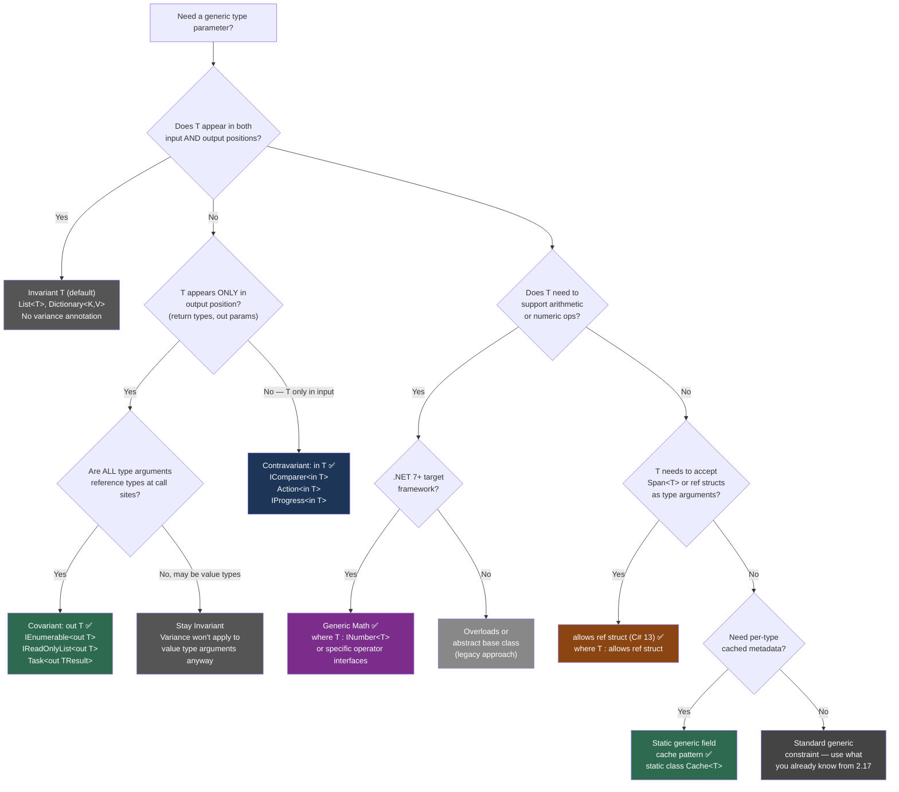

> [!success] Mastery Check
> - [ ] **Studied Well**
> - [ ] **Can explain the concept without notes**
> - [ ] **Can answer interview questions confidently**
> - [ ] **Can implement it in a real project**


## 📍 PART 0 — Navigation & Context

### Where This Topic Lives

```
C# Type System
└── Generics
    ├── 2.17 — Generics: Constraints, Reification (PREREQUISITE)
    │         └── JIT reification, constraints, open/closed types
    ├── ► 2.33 — Variance, Generic Math, Advanced Patterns  ← YOU ARE HERE
    │         ├── Covariance / Contravariance (out T, in T)
    │         ├── Static Abstract Interface Members
    │         ├── Generic Math (INumber<T>, IAdditionOperators<T,T,T>)
    │         ├── allows ref struct constraint (C# 13)
    │         └── Advanced static generic field cache pattern
    └── 2.38 — Spans, Memory, Zero-Copy (unlocked by this)
              └── allows ref struct enables Span<T> in generic algorithms
```

### What You Need Before This

- **[[2.17 — Generics: Constraints, Reification, and the Type System]]** — JIT reification, all constraints, open vs closed types. Without this, variance will feel abstract.
- **[[2.11 — Interfaces and Abstract Classes]]** — variance is an interface and delegate feature; abstract understanding of interface contracts is essential.
- **[[2.16 — Value Types vs Reference Types: Deep Mechanics]]** — covariance rules around value types make no sense without deep type knowledge.
- **[[2.34 — Collections: Internals and Selection Guide]]** — `IEnumerable<out T>` covariance directly affects how collections are assigned and used.

### What This Unlocks After

- **[[2.38 — Spans, Memory, and Zero-Copy Patterns]]** — `allows ref struct` (C# 13) is what makes `Span<T>` usable inside generic algorithms.
- **[[2.34 — Collections: Internals and Selection Guide]]** — understanding why `List<string>` is NOT assignable to `List<object>` is a variance consequence.
- **[[2.46 — Task Parallel Library and PLINQ]]** — PLINQ and TPL use contravariant `IComparer<in T>` internally.
- **[[2.48 — Benchmarking with BenchmarkDotNet]]** — generic math enables benchmark-able zero-overhead numeric abstractions.

### Why This Topic Matters at Scale

When you're writing library code consumed by tens of services, or building a pipeline that must work across numeric types without code duplication, variance and generic math are what separate a two-line elegant solution from a class-hierarchy explosion. The engineers who understand this write APIs that are a joy to use; the engineers who don't write five nearly-identical overloads and a wall of casting.

---

## 🧠 PART 1 — The Core Mental Model

### The Fundamental Rule

> **Variance defines which substitutions are type-safe when a generic parameter appears only in output (covariance: `out T`) or only in input (contravariance: `in T`). It only works on interfaces and delegates — never on concrete types — because concrete types have mutable storage that would break the substitution guarantee.**

### The Plain-Language Analogy

Think of a covariant interface (`IEnumerable<out T>`) as a **vending machine**: it only ever _gives you_ a `T`, never _accepts_ one back. If a machine gives out Apples, you can absolutely treat it as a machine that gives out Fruit — every Apple is a Fruit, and since the machine never takes input, there's no way to violate the contract. That's covariance: a producer of a narrower type is safely usable as a producer of a wider type.

Contravariance (`IComparer<in T>`) is the reverse: think of a **quality inspector** who only ever _receives_ items to evaluate. If your inspector can evaluate any Fruit, they can certainly evaluate Apples — they're strictly more capable. A consumer of a broader type is safely usable as a consumer of a narrower type. The restriction is the same: the inspector must never _produce_ a `T`, only consume one — otherwise you'd hand them an Apple slot and they'd try to produce a Banana.

The asymmetry is the key: production and consumption are the two directions of data flow, and type safety flows in opposite directions along each.

### The Variance and Advanced Generics Taxonomy

```mermaid
graph TD
    A["Generic Type Parameters"] --> B["Invariant (default)\nList&lt;T&gt;, Dictionary&lt;K,V&gt;\nall concrete generics"]
    A --> C["Covariant — out T\n'produces T only'"]
    A --> D["Contravariant — in T\n'consumes T only'"]
    A --> E["Generic Math\n.NET 7+ INumber&lt;T&gt; family"]
    A --> F["Advanced Constraints\nC# 11–13 extensions"]

    C --> C1["IEnumerable&lt;out T&gt;\nIReadOnlyList&lt;out T&gt;\nIReadOnlyCollection&lt;out T&gt;\nTask&lt;TResult&gt;\nIAsyncEnumerable&lt;out T&gt;\nFunc&lt;...out TResult&gt;"]
    C --> C2["Safe assignment:\nIEnumerable&lt;Dog&gt; → IEnumerable&lt;Animal&gt;\nWorks because: read-only producer"]

    D --> D1["IComparer&lt;in T&gt;\nIEqualityComparer&lt;in T&gt;\nAction&lt;in T&gt;\nIProgress&lt;in T&gt;"]
    D --> D2["Safe assignment:\nIComparer&lt;Animal&gt; → IComparer&lt;Dog&gt;\nWorks because: write-only consumer"]

    E --> E1["INumber&lt;T&gt;\nIAdditionOperators&lt;T,T,T&gt;\nISubtractionOperators&lt;T,T,T&gt;\nIMultiplyOperators&lt;T,T,T&gt;\nIDivisionOperators&lt;T,T,T&gt;\nIComparisonOperators&lt;T,T,bool&gt;\nIMinMaxValue&lt;T&gt;"]
    E --> E2["Static abstract interface\nmembers (C# 11)\nT.Parse(), T.Zero, T.One\noperator+, operator*, operator<"]

    F --> F1["allows ref struct (C# 13)\nEnables Span&lt;T&gt; inside\ngeneric algorithms"]
    F --> F2["Combined constraints:\nwhere T : struct, INumber&lt;T&gt;, new()"]
    F --> F3["Static generic field\nper-T cache pattern"]

    style B fill:#555,color:#fff
    style C fill:#2d6a4f,color:#fff
    style D fill:#1d3557,color:#fff
    style E fill:#7b2d8b,color:#fff
    style F fill:#8b4513,color:#fff
    style C1 fill:#40916c,color:#fff
    style C2 fill:#40916c,color:#fff
    style D1 fill:#457b9d,color:#fff
    style D2 fill:#457b9d,color:#fff
    style E1 fill:#9b59b6,color:#fff
    style E2 fill:#9b59b6,color:#fff
    style F1 fill:#a0522d,color:#fff
    style F2 fill:#a0522d,color:#fff
    style F3 fill:#a0522d,color:#fff
```



> [!IMPORTANT] Why Variance Is Interface/Delegate-Only `List<Dog>` cannot be covariant with `List<Animal>` because `List<T>` has `void Add(T item)` — a consuming position. If the assignment were allowed, you could write: `List<Animal> animals = new List<Dog>(); animals.Add(new Cat());` — silently corrupting a `List<Dog>` with a `Cat`. The CLR enforces this. The only way to get variance is to have a type where `T` appears _only_ in output OR _only_ in input position.

---

## 🔬 PART 2 — Deep Mechanics

### 2.1 Covariance in Detail: `out T`

Covariance allows a `IFoo<Derived>` to be used where `IFoo<Base>` is expected, when `T` is marked `out`.

```
━━━━━━━━━━━━━━━━━━━━━━━━━━━━━━━━━━━━━━━━━━━━━━━━━━━━━━━━━━━━━━
COVARIANCE: The assignment chain at runtime
━━━━━━━━━━━━━━━━━━━━━━━━━━━━━━━━━━━━━━━━━━━━━━━━━━━━━━━━━━━━━━

Class hierarchy:
   object
     └── Animal
           └── Dog

IEnumerable<Dog> dogs = GetAllDogs();    // IEnumerable<Dog> instance on heap
IEnumerable<Animal> animals = dogs;      // LEGAL — out T variance
                                         // No new object created!
                                         // 'animals' points to the SAME IEnumerable<Dog>
                                         // The CLR lets this through because:
                                         // IEnumerable<T> only has T GetEnumerator()...
                                         // → T only appears in output position

TYPE CHECK AT COMPILE TIME (not runtime):
  The compiler verifies via the 'out' marker that T never appears as:
    - method parameter type
    - in a contravariant position
    - as an input to anything

RUNTIME:
  No boxing. No wrapping. The reference is copied directly.
  IEnumerable<Animal> and IEnumerable<Dog> are the same JIT code
  for reference types (shared code instance — see 2.17).

COST: Zero. A pointer copy. O(1). No allocation.
━━━━━━━━━━━━━━━━━━━━━━━━━━━━━━━━━━━━━━━━━━━━━━━━━━━━━━━━━━━━━━
```

**What `out T` looks like in the IL:**

```csharp
// The compiler-enforced rule for out T:
// T may only appear in:
//   ✅ Return types of methods
//   ✅ Type arguments of other covariant positions
//   ❌ Method parameters — COMPILE ERROR
//   ❌ Input of any generic that is itself invariant or contravariant

// Compiler rejects this:
interface IProducer<out T>
{
    T Produce();           // ✅ T in output — OK
    void Consume(T item);  // ❌ COMPILE ERROR: "Invalid variance: T must be
                           //    covariantly valid. T is contravariant."
}
```

**The practical value in production code:**

```csharp
// Payment processing system: multiple payment source types
public interface IPaymentSource { string Id { get; } decimal Balance { get; } }
public class BankAccount   : IPaymentSource { ... }
public class CreditCard    : IPaymentSource { ... }
public class DigitalWallet : IPaymentSource { ... }

// Covariance lets you write ONE method that accepts any provider:
// Cost: O(1) assignment. Zero allocation.
IEnumerable<BankAccount>    bankAccounts  = GetBankAccounts();
IEnumerable<CreditCard>     cards         = GetCreditCards();
IEnumerable<IPaymentSource> allSources    = bankAccounts; // LEGAL — covariance
                                                           // No conversion needed
decimal totalBalance = allSources.Sum(s => s.Balance);   // Works directly
```

**The edge case that bites engineers — value types break covariance:**

```csharp
// ⚠️ This does NOT compile — value types are invariant regardless of out T:
IEnumerable<int>    ints    = new[] { 1, 2, 3 };
IEnumerable<object> objects = ints;   // COMPILE ERROR

// Why? Boxing. int and object are fundamentally different representations.
// The CLR cannot reinterpret an int[] as an object[] without allocating box wrappers.
// The rule: variance only works when T is a reference type.

// ✅ Fix — materialize with boxing explicitly:
IEnumerable<object> objects = ints.Cast<object>();  // Explicit, allocates boxed ints
```

**Runtime cost label:** Covariant assignment: `O(1)`, pointer copy, zero allocation. Covariant enumeration: same as non-covariant — no extra overhead per element.

---

### 2.2 Contravariance in Detail: `in T`

Contravariance is less intuitive but equally powerful. A `IFoo<Base>` can be used where `IFoo<Derived>` is expected, when `T` is marked `in`.

```
━━━━━━━━━━━━━━━━━━━━━━━━━━━━━━━━━━━━━━━━━━━━━━━━━━━━━━━━━━━━━━
CONTRAVARIANCE: The consumer direction
━━━━━━━━━━━━━━━━━━━━━━━━━━━━━━━━━━━━━━━━━━━━━━━━━━━━━━━━━━━━━━

Class hierarchy:
   object
     └── Animal
           └── Dog

IComparer<Animal> animalComparer = GetAnimalComparer();
IComparer<Dog>    dogComparer    = animalComparer;  // LEGAL — in T variance

// WHY is this safe?
// dogComparer.Compare(Dog a, Dog b) — at runtime calls animalComparer.Compare(a, b)
// Every Dog IS-A Animal. The animal comparer can handle dogs.
// The caller can only pass Dogs in. The comparer receives them as Animals. Safe.

// WHAT WOULD BREAK IT:
// If IComparer<T> had: T Produce() — then dogComparer.Produce() would need to
// return a Dog, but animalComparer.Produce() might return a Cat. Unsafe.
// → Hence contravariance requires T ONLY in input position.

COST: Zero. Pointer copy. O(1). No allocation.
━━━━━━━━━━━━━━━━━━━━━━━━━━━━━━━━━━━━━━━━━━━━━━━━━━━━━━━━━━━━━━
```

**The delegate variance story:**

```csharp
// Delegates support both in a single type — different type parameters can vary differently:
// Func<in T, out TResult> — T is contravariant (input), TResult is covariant (output)

Func<Animal, string> animalDescriber = a => $"Animal: {a.Name}";
Func<Dog, string>    dogDescriber    = animalDescriber; // LEGAL

// Method group variance (the most natural use):
static void ProcessAnimal(Animal a) { ... }
Action<Dog> processDog = ProcessAnimal;  // LEGAL — method group contravariance
                                          // A method that handles any Animal
                                          // can safely handle Dogs specifically
```

**Runtime cost label:** Delegate variance: `O(1)`, reference copy. Method group variance: one delegate allocation at assignment, then zero per invocation.

---

### 2.3 Why `List<T>` Cannot Be Variant — The Invariance Proof

```csharp
// This is the proof interviewers want. Walk through it.

// SUPPOSE (hypothetically) List<T> were covariant — List<Dog> assignable to List<Animal>:
var dogs = new List<Dog> { new Dog("Rex") };
List<Animal> animals = dogs;          // hypothetical — actually illegal
animals.Add(new Cat("Whiskers"));     // Cat is an Animal — allowed by List<Animal>
                                       // But dogs now contains a Cat!
Dog firstDog = dogs[0];               // This would actually be a Cat at runtime
firstDog.Bark();                      // Cat doesn't have Bark() — runtime crash

// The CLR prevents this at the type system level.
// List<T> has Add(T item) — an input position.
// The compiler sees T in both input and output, classifies T as invariant.
// No variance declaration is possible.

// The key insight: MUTATION kills variance.
// Read-only collections (IReadOnlyList<out T>) are covariant precisely because
// they never allow modification. They only expose getters.
```

```
Covariant BCL types (read-only producers):
  IEnumerable<out T>          — foreach only
  IReadOnlyCollection<out T>  — Count + enumerate
  IReadOnlyList<out T>        — indexed read + enumerate
  IReadOnlyDictionary<TKey, out TValue>
  Task<out TResult>           — .Result only
  IAsyncEnumerable<out T>

Invariant BCL types (mutable, or both producer and consumer):
  List<T>
  Dictionary<TKey, TValue>
  IList<T>
  ICollection<T>
  Span<T> / Memory<T>

Contravariant BCL types (pure consumers):
  IComparer<in T>
  IEqualityComparer<in T>
  Action<in T>
  IProgress<in T>
```

**Runtime cost label:** Variance is purely a compile-time feature. All variance checks happen at compile time. Zero runtime overhead for the variance machinery itself.

---

### 2.4 Static Abstract Interface Members and the Foundation of Generic Math

This is the C# 11 feature that makes generic math possible. The insight: operators are static, and historically static methods couldn't be part of interface contracts. C# 11 broke that restriction.

```csharp
// Before C# 11: you COULD NOT write a generic Sum method for numeric types.
// You needed one overload per numeric type, or ugly reflection/dynamic tricks.

// ❌ OLD: One overload per type (ugly, unmaintainable, incomplete)
public static int     Sum(IEnumerable<int>     values) => values.Aggregate((a, b) => a + b);
public static double  Sum(IEnumerable<double>  values) => values.Aggregate((a, b) => a + b);
public static decimal Sum(IEnumerable<decimal> values) => values.Aggregate((a, b) => a + b);
// ... and so on for every numeric type

// ✅ C# 11+: ONE method works for ALL numeric types
public static T Sum<T>(IEnumerable<T> values)
    where T : INumber<T>                // constraint: T must be a number
{
    T result = T.Zero;                  // static abstract member: T.Zero
    foreach (T value in values)
        result += value;                // operator+: static abstract operator
    return result;
}

// Works for ALL of these — zero code duplication:
int     intSum     = Sum(new[] { 1, 2, 3, 4, 5 });         // → 15
double  doubleSum  = Sum(new[] { 1.1, 2.2, 3.3 });          // → 6.6
decimal decimalSum = Sum(new[] { 100m, 200m, 300m });        // → 600
float   floatSum   = Sum(new[] { 1.0f, 2.0f, 3.0f });       // → 6.0

// The compiler generates SEPARATE JIT code for each T (reification for value types).
// int Sum: uses native int + instruction (~1 ns)
// double Sum: uses native double + instruction (~1 ns)
// decimal Sum: uses Decimal.op_Addition method (~50 ns, but still correct)
// ZERO boxing. ZERO allocation. ZERO performance penalty.
```

**How static abstract members work at the IL level:**

```
The interface declaration:
  interface IAdditionOperators<TSelf, TOther, TResult>
  {
      // .callvirt won't work for static — uses 'constrained' + 'call' instead
      static abstract TResult operator +(TSelf left, TOther right);
  }

The JIT generates per-T code:
  For T = int:
    IL: constrained int32 :: call int32 IAdditionOperators<int,int,int>.op_Addition(int,int)
    JIT: optimizes to: add [native int add instruction]

  For T = decimal:
    IL: constrained System.Decimal :: call decimal IAdditionOperators<...>.op_Addition(...)
    JIT: calls System.Decimal.op_Addition (method call, not primitive instruction)

The constrained opcode tells the JIT: "dispatch this interface call as if it were on the
concrete type, not through a virtual dispatch table." For value types, this is devirtualized
to a direct call. For reference types, it goes through the interface method table.
```

**The key interfaces in the generic math hierarchy (partial — the full tree is large):**

```
INumberBase<T>          — Parse, TryParse, T.Zero, T.One, T.Radix
  └── INumber<T>        — min/max, sign, clamp, etc.
        ├── ISignedNumber<T>    — negative values, sign operations
        ├── IUnsignedNumber<T>  — non-negative values only
        ├── IFloatingPoint<T>   — Pi, E, floor, ceiling, round, trig
        │     └── IFloatingPointIeee754<T>  — NaN, Infinity, IEEE semantics
        └── IBinaryInteger<T>   — bitwise, shift, leading zeros

IAdditionOperators<TSelf,TOther,TResult>
ISubtractionOperators<TSelf,TOther,TResult>
IMultiplyOperators<TSelf,TOther,TResult>
IDivisionOperators<TSelf,TOther,TResult>
IModulusOperators<TSelf,TOther,TResult>
IComparisonOperators<TSelf,TOther,TResult>
IIncrementOperators<TSelf>
IDecrementOperators<TSelf>
IUnaryNegationOperators<TSelf,TResult>
```

**Runtime cost label:** Calling a static abstract method on a value type: same as calling the method directly — JIT devirtualizes to a direct call. `O(1)`. For primitive types, this is ~1-5 ns (same as native arithmetic). For complex types like `decimal`, it's the cost of the underlying method.

---

### 2.5 The `allows ref struct` Constraint (C# 13)

Before C# 13, you could not use `Span<T>` or any `ref struct` as a type argument in generic code. This was a hard wall: if you wanted a generic parser or generic buffer algorithm, you were forced to accept `T[]` or `IEnumerable<T>`, both of which allocate.

```csharp
// Before C# 13: Span<T> CANNOT be a type argument
// This is a COMPILE ERROR:
// void Process<T>(T data) where T : ... — Span<byte> cannot be passed as T

// ─────────────────────────────────────────────────────────────────
// C# 13: allows ref struct
// ─────────────────────────────────────────────────────────────────

// A generic method that can now accept Span<T>, ReadOnlySpan<T>, etc.:
public static int CountMatches<TBuffer, TElement>(
    TBuffer buffer,
    TElement target)
    where TBuffer : allows ref struct, IReadOnlySpanProvider<TElement>
    where TElement : IEquatable<TElement>
{
    int count = 0;
    ReadOnlySpan<TElement> span = buffer.AsSpan();
    foreach (ref readonly TElement item in span)
        if (item.Equals(target)) count++;
    return count;
}

// Now works with Span<byte> — ZERO heap allocation for the buffer type argument
byte searchByte = 0x42;
ReadOnlySpan<byte> data = stackalloc byte[] { 0x01, 0x42, 0x00, 0x42, 0xFF };
int matches = CountMatches(data, searchByte);  // no allocation anywhere

// The constraint tells the JIT: this T may be a ref struct,
// so do not attempt to box T, do not store T in the heap,
// the lifetime of T-typed values is bounded by the method's stack frame.
```

**What `allows ref struct` enables:** High-performance generic algorithms that operate on `Span<T>`, `ReadOnlySpan<T>`, `MemoryMarshal` results, and other stack-only types — without giving up the generality of type parameterization.

**Runtime cost label:** Zero overhead. Purely a compile-time constraint relaxation. The JIT generates the same code it would for a non-generic version.

---

### 2.6 The Static Generic Field Cache Pattern

This is an advanced pattern used inside the BCL and high-performance libraries. The JIT generates a separate static field for each closed generic instantiation.

```csharp
// The insight: a static field in a generic type is NOT shared across T instantiations.
// Each distinct T gets its own field. The JIT initializes it lazily per T.

// Pattern: per-type metadata cache, zero allocation per lookup
public static class TypeMetadata<T>
{
    // Each T gets its own static field — initialized once on first access
    // Thread-safe by CLR static initialization guarantees
    public static readonly string TypeName = typeof(T).Name;
    public static readonly bool   IsValueType = typeof(T).IsValueType;
    public static readonly bool   IsNullable  = Nullable.GetUnderlyingType(typeof(T)) != null;

    // One-time compilation of a property accessor — fast for all subsequent calls
    // ~0.4 ns per call after first use (compiled delegate vs ~1000 ns reflection)
    public static readonly Func<T, string>? ToStringFast
        = CompileToStringAccessor();

    private static Func<T, string>? CompileToStringAccessor()
    {
        var param = Expression.Parameter(typeof(T), "x");
        var toStr = typeof(T).GetMethod("ToString", Type.EmptyTypes);
        if (toStr == null) return null;
        return Expression.Lambda<Func<T, string>>(
            Expression.Call(param, toStr), param).Compile();
    }
}

// Usage in a payment processing serializer:
// TypeMetadata<OrderId>.IsValueType      → cached, ~0 ns (static field read)
// TypeMetadata<OrderStatus>.TypeName     → cached, ~0 ns (static field read)
// TypeMetadata<decimal>.IsNullable       → cached, ~0 ns (static field read)
// TypeMetadata<decimal>.ToStringFast     → compiled once, ~0.4 ns per call

// The JIT allocates separate static storage for:
//   TypeMetadata<int>.TypeName     → "Int32"
//   TypeMetadata<string>.TypeName  → "String"
//   TypeMetadata<OrderId>.TypeName → "OrderId"
// Each gets its own type in the JIT's data structures.
```

**Memory layout:**

```
JIT type table (simplified):
┌──────────────────────────────────────────────────────────────┐
│ TypeMetadata<int>    │ TypeName = "Int32"    | IsValue = true │
├──────────────────────────────────────────────────────────────┤
│ TypeMetadata<string> │ TypeName = "String"   | IsValue = false│
├──────────────────────────────────────────────────────────────┤
│ TypeMetadata<OrderId>│ TypeName = "OrderId"  | IsValue = true │
└──────────────────────────────────────────────────────────────┘
All allocated once, read with a single static field access (~0.5 ns).
No dictionary lookup. No locking. No allocation.
```

**Runtime cost label:** Static generic field read: `O(1)`, ~0.5 ns, zero allocation. First access (static constructor): `O(1)` per `T`, runs once, thread-safe via CLR initialization semantics.

---

## 💻 PART 3 — Production Code Patterns

### 3.1 The Covariant Repository Interface — Composing Data Sources

```csharp
// Scenario: order management system — multiple order sources (local DB, remote API, cache)
// must be composable without casting noise.

// ✅ CORRECT: covariant interface enables zero-allocation composition
public interface IOrderReader<out TOrder> where TOrder : IOrder
{
    // T appears ONLY in output — covariant is safe
    IAsyncEnumerable<TOrder> GetOrdersAsync(DateRange range, CancellationToken ct = default);
    ValueTask<TOrder?> FindByIdAsync(OrderId id, CancellationToken ct = default);
}

// Concrete implementations:
public class SqlOrderReader    : IOrderReader<SqlOrder>    { ... }
public class CachedOrderReader : IOrderReader<CachedOrder> { ... }

// Composition using covariance — no casting, no intermediate allocations:
public class OrderAggregator
{
    private readonly IReadOnlyList<IOrderReader<IOrder>> _sources;

    // ✅ Covariance lets us pass IOrderReader<SqlOrder> where IOrderReader<IOrder> is expected
    public OrderAggregator(params IOrderReader<IOrder>[] sources)
        => _sources = sources;

    public async IAsyncEnumerable<IOrder> GetAllOrdersAsync(
        DateRange range,
        [EnumeratorCancellation] CancellationToken ct = default)
    {
        foreach (var source in _sources)
        await foreach (var order in source.GetOrdersAsync(range, ct).ConfigureAwait(false))
            yield return order;
    }
}

// Registration (no casting required):
var aggregator = new OrderAggregator(
    new SqlOrderReader(connectionString),      // IOrderReader<SqlOrder> → IOrderReader<IOrder>
    new CachedOrderReader(cacheClient)         // IOrderReader<CachedOrder> → IOrderReader<IOrder>
);
```

### 3.2 The Contravariant Comparer — Sorting Hierarchies

```csharp
// Scenario: inventory management — sorting products, which come in many subtypes.

public interface IInventoryItem { decimal UnitCost { get; } DateTime AddedAt { get; } }
public class PhysicalProduct : IInventoryItem { ... }
public class DigitalProduct  : IInventoryItem { ... }
public class BundledProduct  : IInventoryItem { ... }

// ✅ Write one comparer, use it for ALL subtypes — contravariance at work
public class CostDescendingComparer : IComparer<IInventoryItem>
{
    public static readonly CostDescendingComparer Instance = new();

    public int Compare(IInventoryItem? x, IInventoryItem? y)
    {
        if (ReferenceEquals(x, y)) return 0;
        if (x is null) return 1;
        if (y is null) return -1;
        return y.UnitCost.CompareTo(x.UnitCost);  // descending
    }
}

// ⚠️ WRONG: without contravariance, you'd think you need three comparers:
// var physicalComparer = new CostDescendingComparer<PhysicalProduct>(); // unnecessary
// var digitalComparer  = new CostDescendingComparer<DigitalProduct>();  // unnecessary

// ✅ CORRECT: one comparer, used for all subtypes via contravariance
// IComparer<in T> means IComparer<IInventoryItem> IS usable as IComparer<PhysicalProduct>
var physicals = GetPhysicalProducts();
physicals.Sort(CostDescendingComparer.Instance);  // works — contravariance

var digitals  = GetDigitalProducts();
digitals.Sort(CostDescendingComparer.Instance);   // works — same comparer

// Used in SortedSet (constructor accepts IComparer<T>):
var sortedInventory = new SortedSet<PhysicalProduct>(CostDescendingComparer.Instance);
// IComparer<IInventoryItem> → IComparer<PhysicalProduct>: legal via in T variance
```

### 3.3 Generic Math — Single Implementation for All Numeric Types

```csharp
// Scenario: financial analytics — VWAP (volume-weighted average price) calculation
// must work for both decimal (accounting precision) and double (fast analytics).

public static class FinancialMath
{
    // ✅ One method — works for decimal, double, float, int, etc.
    // No duplication. Full precision control at the call site.
    public static T VolumeWeightedAverage<T>(
        ReadOnlySpan<(T Price, T Volume)> trades)
        where T : INumber<T>  // must support +, *, /, comparison, Zero
    {
        if (trades.IsEmpty)
            throw new ArgumentException("Cannot compute VWAP for empty trade set", nameof(trades));

        T totalValue  = T.Zero;
        T totalVolume = T.Zero;

        foreach (var (price, volume) in trades)
        {
            totalValue  += price * volume;   // operator* via IMultiplyOperators
            totalVolume += volume;            // operator+ via IAdditionOperators
        }

        if (totalVolume == T.Zero)
            throw new InvalidOperationException("Total volume is zero — cannot compute VWAP");

        return totalValue / totalVolume;      // operator/ via IDivisionOperators
    }

    // Clamp a value to a range — works for any comparable number
    public static T Clamp<T>(T value, T min, T max) where T : INumber<T>
        => T.Clamp(value, min, max);  // static abstract method on INumberBase<T>

    // Generic statistical range
    public static T Range<T>(ReadOnlySpan<T> values) where T : INumber<T>
    {
        if (values.IsEmpty) return T.Zero;
        T minVal = values[0], maxVal = values[0];
        for (int i = 1; i < values.Length; i++)
        {
            if (T.LessThan(values[i], minVal))    minVal = values[i];
            if (T.GreaterThan(values[i], maxVal)) maxVal = values[i];
        }
        return maxVal - minVal;
    }
}

// Usage — same method, different numeric type:
(decimal Price, decimal Volume)[] accountingTrades = { (100.50m, 500m), (101.25m, 300m) };
decimal accountingVwap = FinancialMath.VolumeWeightedAverage(accountingTrades.AsSpan());
// → uses decimal arithmetic — preserves 28-digit precision

(double Price, double Volume)[] analyticsTrades = { (100.50, 5000.0), (101.25, 3000.0) };
double analyticsVwap = FinancialMath.VolumeWeightedAverage(analyticsTrades.AsSpan());
// → uses double arithmetic — hardware FPU, ~1 ns per operation
```

### 3.4 The Custom Numeric Type with Generic Math

```csharp
// Scenario: physics simulation — a strongly-typed Meters quantity that participates
// in generic math algorithms without losing its type safety.

public readonly struct Meters :
    IAdditionOperators<Meters, Meters, Meters>,
    ISubtractionOperators<Meters, Meters, Meters>,
    IMultiplyOperators<Meters, double, Meters>,
    IComparisonOperators<Meters, Meters, bool>,
    INumber<Meters>    // full number contract
{
    public readonly double Value;
    public Meters(double value) => Value = value;

    // Static abstract implementations required by INumber<T>:
    public static Meters Zero    => new(0.0);
    public static Meters One     => new(1.0);
    public static int    Radix   => 10;

    public static Meters operator +(Meters a, Meters b) => new(a.Value + b.Value);
    public static Meters operator -(Meters a, Meters b) => new(a.Value - b.Value);
    public static Meters operator *(Meters a, double scalar) => new(a.Value * scalar);
    public static Meters operator /(Meters a, Meters b) => new(a.Value / b.Value);

    public static bool operator <(Meters a, Meters b)  => a.Value < b.Value;
    public static bool operator >(Meters a, Meters b)  => a.Value > b.Value;
    public static bool operator <=(Meters a, Meters b) => a.Value <= b.Value;
    public static bool operator >=(Meters a, Meters b) => a.Value >= b.Value;
    public static bool operator ==(Meters a, Meters b) => a.Value == b.Value;
    public static bool operator !=(Meters a, Meters b) => a.Value != b.Value;

    // Parsing — required by INumberBase<T>
    public static Meters Parse(string s, IFormatProvider? provider)
        => new(double.Parse(s.TrimEnd('m', ' '), provider));
    public static bool TryParse(string? s, IFormatProvider? provider, out Meters result)
    {
        bool ok = double.TryParse(s?.TrimEnd('m', ' '), provider, out double d);
        result = ok ? new(d) : Zero;
        return ok;
    }

    // ... additional INumber<T> members ...

    public override string ToString() => $"{Value:F3}m";
}

// Now Meters participates in ALL generic math algorithms:
Meters[] distances = { new(1.5), new(2.3), new(0.8), new(4.1) };
Meters total = FinancialMath.VolumeWeightedAverage(/* adapted span */);
Meters range = FinancialMath.Range<Meters>(distances.AsSpan());
```

### 3.5 The Covariance Trap — Avoiding the ReadOnly Facade Illusion

```csharp
// ⚠️ ANTI-PATTERN: Exposing IReadOnlyList<T> gives covariance but not immutability

public class ShoppingCart
{
    private readonly List<CartItem> _items = new();

    // ⚠️ WRONG mental model: "returning IReadOnlyList makes it immutable"
    // IReadOnlyList<CartItem> IS covariant (via IReadOnlyList<out T>)
    // but the underlying List<CartItem> is still mutable!
    public IReadOnlyList<CartItem> Items => _items;
}

// The problem:
var cart = new ShoppingCart();
IReadOnlyList<CartItem> items = cart.Items;  // seems safe
// But if someone casts:
if (items is List<CartItem> mutableList)
    mutableList.Add(new CartItem("fraud"));  // bypasses ShoppingCart's invariants!

// ✅ CORRECT: Use AsReadOnly() or return a copy when immutability is critical
public class ShoppingCart
{
    private readonly List<CartItem> _items = new();

    // Returns a truly read-only wrapper — cannot be cast back to List<CartItem>
    public IReadOnlyList<CartItem> Items => _items.AsReadOnly();
    // Or for defensive safety: return _items.ToArray() (allocation, but unbreakable)
}
```

### 3.6 Combining Variance with Generic Math — The Pipeline Pattern

```csharp
// Scenario: telemetry pipeline — aggregate sensor readings of any numeric type
// from any streaming source of any sensor subtype.

public interface ISensorReading<out T> where T : INumber<T>
{
    T    Value      { get; }
    DateTime Timestamp { get; }
}

// The full power: covariant data source + generic math numeric operations
// Result: one aggregator for ALL sensor types and ALL numeric measurement types
public static async Task<T> AggregateStreamAsync<TReading, T>(
    IAsyncEnumerable<TReading> stream,
    CancellationToken ct = default)
    where TReading : ISensorReading<T>   // covariant: TReading is a reading of T
    where T : INumber<T>                 // generic math: T supports arithmetic
{
    T   sum   = T.Zero;
    int count = 0;

    await foreach (var reading in stream.WithCancellation(ct))
    {
        sum += reading.Value;   // IAdditionOperators via INumber<T>
        count++;
    }

    return count == 0 ? T.Zero : sum / T.CreateChecked(count);
}
```

---

## ⚠️ PART 4 — Gotchas & Anti-Patterns

### Gotcha 1: Covariance Breaks When the Interface Has Any Mutation

The most common mistake: thinking `IEnumerable<out T>` is "a covariant collection" and then wondering why a writable collection interface can't be made covariant.

```csharp
// ⚠️ WRONG: Trying to define a covariant writable collection
public interface IMyList<out T>  // 'out' declared
{
    T this[int index] { get; }
    void Add(T item);   // ❌ COMPILE ERROR: T appears in input position
                        // Invalid variance: 'T' must be covariantly valid.
}

// WHY this errors: 'Add(T item)' has T as a parameter — a consuming/input position.
// Covariance (out T) only allows T in output positions.
// If allowed, you could: IMyList<Animal> animals = new MyList<Dog>(); animals.Add(new Cat());

// ✅ CORRECT: Split the interface into a reader (covariant) and writer (invariant)
public interface IMyReader<out T> { T this[int index] { get; } int Count { get; } }
public interface IMyWriter<T>     { void Add(T item); }
public interface IMyList<T> : IMyReader<T>, IMyWriter<T> { }

// Now:
// IMyReader<Dog> → IMyReader<Animal>    ✅ covariant
// IMyList<Dog>   → IMyList<Animal>      ❌ invariant (has Add)
// IMyList<Dog>   → IMyReader<Animal>    ✅ via covariant IMyReader<out T>
```

### Gotcha 2: Covariance Does NOT Apply to Value Type Parameters

```csharp
// ⚠️ WRONG mental model: "IEnumerable<out T> should work for int → object"
IEnumerable<int>    ints    = new[] { 1, 2, 3 };
IEnumerable<object> objects = ints;  // COMPILE ERROR: cannot convert
                                      // Even though object > int in the type hierarchy

// WHY: int is a VALUE TYPE. int and object have DIFFERENT representations.
// int = 4 bytes on stack. object = 8-byte pointer to 24-byte heap object.
// Reinterpreting an IEnumerable<int> as IEnumerable<object> would require boxing
// EVERY element — that's not a free pointer copy, it's N heap allocations.
// The CLR refuses to allow it implicitly.

// The rule is enforced at the type system level:
// Variance (out/in) ONLY applies when both T and the assigned type are REFERENCE TYPES.

// ✅ Fix: explicit conversion (makes the cost visible)
IEnumerable<object> objects = ints.Cast<object>();  // boxes each int — O(n) allocations
// or
IEnumerable<object> objects = ints.Select(i => (object)i);  // same cost, more explicit
```

### Gotcha 3: Delegate Variance and Method Group Resolution Order

```csharp
// ⚠️ WRONG: Confusing variance direction when assigning method groups
static string DescribeAnimal(Animal a) => $"Animal: {a.Name}";
static string DescribeDog(Dog d)       => $"Dog: {d.Name}";

Func<Dog, string>    dogDescriber    = DescribeAnimal;  // ✅ LEGAL: contravariance
                                                          // Method that takes Animal
                                                          // is wider than needed — safe
Func<Animal, string> animalDescriber = DescribeDog;     // ❌ COMPILE ERROR
                                                          // Method that takes Dog
                                                          // is narrower than needed — unsafe
                                                          // Caller might pass a Cat

// WHY the second fails:
// animalDescriber(new Cat()) would call DescribeDog(new Cat())
// but DescribeDog only knows how to handle Dogs.
// Runtime crash. The compiler prevents it.

// ✅ Correct direction: base-to-derived in parameter types, derived-to-base in return types
static Animal ProduceAnimal()  => new Animal("Generic");
static Dog    ProduceDog()     => new Dog("Rex");

Func<Animal> animalFactory = ProduceDog;   // ✅ LEGAL: covariance on return type
                                            // A factory that produces Dogs
                                            // safely satisfies a factory that produces Animals
Func<Dog>    dogFactory    = ProduceAnimal; // ❌ COMPILE ERROR: ProduceAnimal returns Animal
                                            // — might not be a Dog
```

### Gotcha 4: Generic Math Requires Checked Contexts for Overflow Safety

```csharp
// ⚠️ WRONG: Generic math operators do NOT automatically use checked arithmetic
public static T Sum<T>(ReadOnlySpan<T> values) where T : INumber<T>
{
    T result = T.Zero;
    foreach (T v in values)
        result += v;    // operator+ may silently overflow for integer types!
    return result;
}

// For int, operator+ wraps around in unchecked context:
int[] nearMaxValues = { int.MaxValue, 1 };
int sum = Sum(nearMaxValues.AsSpan());   // Returns int.MinValue — silent overflow!

// ✅ CORRECT: Use IAdditionOperators' checked variant, or use a checked context
public static T SumChecked<T>(ReadOnlySpan<T> values)
    where T : INumber<T>, IAdditionOperators<T, T, T>
{
    T result = T.Zero;
    checked  // OR: use T.AddChecked(a, b) when available in .NET 8+
    {
        foreach (T v in values)
            result += v;
    }
    return result;
}

// The rule: generic math inherits the checked/unchecked context of the call site.
// For financial code, always use checked or ICheckedOperators.
```

### Gotcha 5: The Static Generic Field Pattern Breaks with Open Types

```csharp
// ⚠️ WRONG: Trying to use the static generic field pattern with an OPEN type
// An open type (TypeMetadata<>) is not instantiated — it has no fields.

Type openType = typeof(TypeMetadata<>);  // open generic type — no static field access
// openType.GetField("TypeName").GetValue(null);  // throws or returns null
                                                    // The static field doesn't exist for open types
                                                    // It only exists per CLOSED instantiation

// ✅ CORRECT: Always close the type before accessing the static field
Type closedType = typeof(TypeMetadata<>).MakeGenericType(typeof(int));
// Now closedType IS TypeMetadata<int> — its static field is initialized

// But in production: just use the closed generic syntax directly:
string name = TypeMetadata<int>.TypeName;         // ✅ Correct — closed at compile time
// Avoid MakeGenericType + reflection in hot paths — 20× slower than direct field access
```

---

## 📊 PART 5 — Performance Implications

### 5.1 Allocation Characteristics Table

|Scenario|Allocation Behavior|Approx Cost|
|---|---|---|
|Covariant interface assignment (`IEnumerable<Dog>` → `IEnumerable<Animal>`)|Zero — pointer copy|~0.5 ns|
|Covariant enumeration over assigned interface|Zero per element — same as non-covariant|Same as source|
|Contravariant `IComparer<Base>` as `IComparer<Derived>`|Zero — pointer copy|~0.5 ns|
|Covariance with value type (`IEnumerable<int>` → `IEnumerable<object>`)|N allocations (boxing each element)|~12 ns × N|
|`IComparer<Derived>` assigned from `IComparer<Base>`|Zero allocation|~0.5 ns|
|Generic math `Sum<T>` where T = `int`|Zero — native instruction|~1 ns per element|
|Generic math `Sum<T>` where T = `decimal`|Zero — method call|~50 ns per element|
|Generic math `Sum<T>` where T = `double`|Zero — FPU instruction|~1 ns per element|
|First access to static generic field `TypeMetadata<T>`|One-time static ctor, no per-call alloc|~200 ns once|
|Subsequent access to static generic field|Zero — static field read|~0.5 ns|
|`allows ref struct` generic parameter (Span<T>)|Zero — stack-only|0 allocation|
|MakeGenericType + Activator.CreateInstance|Heap allocation per call|~1–5 μs|

### 5.2 BenchmarkDotNet: Generic Math vs Overloads vs Dynamic

```csharp
using BenchmarkDotNet.Attributes;
using BenchmarkDotNet.Running;
using System.Numerics;

[MemoryDiagnoser]
[SimpleJob(RuntimeMoniker.Net80)]
public class GenericMathBenchmarks
{
    private const int N = 10_000;
    private double[]  _doubles;
    private decimal[] _decimals;

    [GlobalSetup]
    public void Setup()
    {
        _doubles  = Enumerable.Range(1, N).Select(i => (double)i).ToArray();
        _decimals = Enumerable.Range(1, N).Select(i => (decimal)i).ToArray();
    }

    // Baseline: manually specialized double sum
    [Benchmark(Baseline = true)]
    public double SumDoubleSpecialized()
    {
        double sum = 0;
        foreach (double v in _doubles) sum += v;
        return sum;
    }

    // Generic math: should compile to the SAME code as the specialized version
    [Benchmark]
    public double SumDoubleGenericMath()
        => GenericSum<double>(_doubles.AsSpan());

    // Generic math with decimal — same method, different precision
    [Benchmark]
    public decimal SumDecimalGenericMath()
        => GenericSum<decimal>(_decimals.AsSpan());

    // Anti-pattern: dynamic dispatch — measures the cost of avoiding generics
    [Benchmark]
    public dynamic SumDynamic()
    {
        dynamic sum = 0.0;
        foreach (dynamic v in _doubles) sum += v;
        return sum;
    }

    // Anti-pattern: boxing via non-generic path
    [Benchmark]
    public object SumViaObjectList()
    {
        var list = new System.Collections.ArrayList(_doubles.Length);
        foreach (double v in _doubles) list.Add(v);   // boxes each double
        double sum = 0;
        foreach (object v in list) sum += (double)v;  // unboxes each double
        return sum;
    }

    private static T GenericSum<T>(ReadOnlySpan<T> values) where T : INumber<T>
    {
        T result = T.Zero;
        foreach (T v in values) result += v;
        return result;
    }
}

// Expected output (approximate, .NET 8, x64):
// | Method                  | Mean         | Allocated |
// |-------------------------|-------------:|----------:|
// | SumDoubleSpecialized    |   4,823.1 ns |       0 B |
// | SumDoubleGenericMath    |   4,831.6 ns |       0 B |  ← same as specialized!
// | SumDecimalGenericMath   |  52,410.0 ns |       0 B |  ← decimal is slow, not generics
// | SumDynamic              | 312,000.0 ns |  32,000 B |  ← DLR overhead + boxing
// | SumViaObjectList        | 184,000.0 ns | 240,080 B |  ← N box allocations
//
// Key takeaway: Generic math compiles to IDENTICAL code as the specialized version.
// The JIT reifies T = double → generates native double addition.
// The abstraction costs NOTHING at runtime.
```

### 5.3 When to Care / When to Ignore

**When this costs you:**

- **Forgetting variance** in API design forces callers to do unnecessary `.Cast<T>()` calls — each one creates an iterator wrapper that allocates. In a high-throughput order pipeline processing 50,000 events/sec, this is measurable.
- **Using `dynamic` instead of generic math** in numerical libraries costs ~60× over generic math. If you're computing portfolio metrics across 10,000 positions 100 times per second, `dynamic` is unacceptable.
- **Not using the static generic field cache pattern** in serialization/mapping code means per-call reflection (1–5 μs each). At 100,000 requests/sec in a payment processor, that's 100–500 ms of pure reflection overhead per second.

**When this doesn't matter:**

- **Variance** in code paths that run once at startup (DI registration, configuration binding). The pointer-copy cost is negligible.
- **Generic math vs specialized overloads** when the operation runs at human-scale interaction speeds (< 1,000 calls/sec). Use whichever is more readable.
- **`allows ref struct`** in code that doesn't touch `Span<T>`. It's a constraint — only add it when you need `Span<T>` as a type argument.
- **The static generic field pattern** when you already have a `ConcurrentDictionary<Type, ...>` cache that performs acceptably. Only switch if profiling shows lock contention or cache lookup overhead.

---

## 🎤 PART 6 — Interview Arsenal

### A. The Question Bank

---

**Q1: "What is covariance and contravariance in C# generics?"**

**Average Answer:** "Covariance lets you use a more derived type where a base type is expected. Contravariance is the opposite."

**Why That's Insufficient:** Correct but defines the words without explaining the mechanism, the restriction to interfaces/delegates, or the practical consequence.

**Great Answer:**

> "Covariance and contravariance describe safe substitutability directions for generic type parameters. Covariance — marked with `out T` — means a `IFoo<Derived>` is assignable to `IFoo<Base>`, and it's only safe when `T` appears exclusively in output positions — things the interface produces. `IEnumerable<out T>` is the canonical example: it only yields `T`s, never accepts one. Contravariance — marked with `in T` — is the reverse: `IFoo<Base>` is assignable to `IFoo<Derived>`, safe only when `T` appears exclusively in input positions — things the interface consumes. `IComparer<in T>` works because a comparer that handles any `Animal` is strictly more capable than one that only handles `Dogs`. The critical constraint is that this only works on interfaces and delegates, never on concrete classes. The reason is mutation: `List<T>` has `Add(T)` — an input position — so `List<Dog>` cannot be assigned to `List<Animal>` or you could silently add a `Cat` to a dog list. The compiler enforces this through the `out`/`in` annotations."

---

**Q2: "What is generic math in .NET 7+ and what problem does it solve?"**

**Average Answer:** "It lets you write generic methods that work with numbers using `INumber<T>`."

**Why That's Insufficient:** Doesn't explain the mechanism (static abstract interface members), the IL-level behavior, or why previous approaches failed.

**Great Answer:**

> "The core problem was that operators in C# are static methods, and static methods historically couldn't be part of interface contracts. If you wanted a generic `Sum<T>` method, there was no way to express 'T must support the `+` operator,' so every numeric library had to maintain separate overloads for `int`, `double`, `decimal`, and so on. C# 11 introduced static abstract interface members, which lets interfaces declare static methods and operators as part of their contract. `INumber<T>` uses this to require implementers to provide `T.Zero`, `T.One`, operator`+`, operator`/`, and so on. The key performance point is that the JIT fully reifies these per value type: calling `+` on `T = int` compiles down to a native `add` instruction — exactly what you'd get without generics. There's zero abstraction overhead. The only time there's a cost delta is for types like `decimal` where the underlying operation is inherently slower, but that's the type's cost, not the generic math layer's cost."

---

**Q3: "Why can't `List<Dog>` be assigned to `List<Animal>` even though `Dog` inherits `Animal`?"**

**Average Answer:** "Because `List<T>` is not covariant."

**Why That's Insufficient:** Correct conclusion, no mechanism. Doesn't explain WHY covariance was excluded, which is what the follow-up will ask.

**Great Answer:**

> "The reason is mutation. If the assignment were allowed, you could write: take a `List<Dog>`, assign it to a `List<Animal>`, then call `Add(new Cat())` — because `Cat` is an `Animal`. Now your `List<Dog>` contains a `Cat`. When you later retrieve element zero and call `.Bark()` — crash. The type system cannot allow this, so `List<T>` is invariant. The rule is that covariance is safe only when `T` appears exclusively in output position — when the generic type is a pure producer. `List<T>` has `Add(T)` — an input position — which kills covariance. The BCL handles this by providing covariant read-only interfaces: `IReadOnlyList<out T>`, `IEnumerable<out T>` — both of which only expose getters and enumerators, no mutation methods. A `List<Dog>` is safely assignable to `IReadOnlyList<Animal>` because through that interface, nobody can ever insert a `Cat`."

---

**Q4: "What is the static generic field cache pattern and when do you use it?"**

**Average Answer:** "You can use a static field in a generic class to cache something per type."

**Why That's Insufficient:** Doesn't explain the JIT behavior, the thread-safety guarantee, or when this beats alternatives like `ConcurrentDictionary<Type, T>`.

**Great Answer:**

> "A static field in a generic class is not shared across type instantiations — each `MyCache<int>` and `MyCache<string>` gets its own independent static field, because the JIT generates a separate type for each closed generic instantiation. This makes it a perfect zero-contention per-type cache. You get thread safety from the CLR's static initialization semantics — the static constructor runs once, exactly, guaranteed by the runtime — and subsequent reads are just static field dereferences at ~0.5 nanoseconds with no locking. Compare that to a `ConcurrentDictionary<Type, V>` which requires a hash lookup and potential lock acquisition — roughly 50–100 nanoseconds with possible contention. I use this pattern in serialization infrastructure, where I need per-type compiled property accessors or converters. The limitation is that you can only create static fields at compile time — it doesn't work for runtime-determined types, which is where `ConcurrentDictionary` is still the right tool."

---

### B. The Trick Questions

**"Is `IEnumerable<string>` assignable to `IEnumerable<object>`?"**

_The trap:_ Interviewers expect candidates who know `out T` exists to confidently say yes — and then immediately ask about value types. The complete answer: Yes, for reference types. `string` is a reference type and `object` is `string`'s base — covariance applies. But `IEnumerable<int>` is NOT assignable to `IEnumerable<object>` because `int` is a value type, and variance rules require both T and the assigned type to be reference types. Correct answer: "It depends on whether T is a reference type or value type."

**"Can you make an `Action<Dog>` from an `Action<Animal>`?"**

_The trap:_ The direction feels wrong to most people. Correct answer: Yes — this is contravariance. An `Action<Animal>` accepts any `Animal`, so it certainly accepts `Dog`s. Assigning `Action<Animal>` to `Action<Dog>` is legal. The reverse (`Action<Dog>` → `Action<Animal>`) would be illegal because the caller of `Action<Animal>` might pass a `Cat`, and an `Action<Dog>` can't handle `Cat`s.

**"Does `INumber<T>` prevent you from using `decimal` in a generic math method?"**

_The trap:_ The implication is that generic math only works for primitive/fast types. Correct answer: No — `decimal` implements `INumber<decimal>`. The method works. The `decimal` operations are simply slower because `decimal` arithmetic is implemented in software, not hardware. Generic math doesn't penalize `decimal` — it faithfully uses whatever the type's operators do.

**"If `allows ref struct` is applied to a type parameter, can that type cross an `await` boundary?"**

_The trap:_ The question asks about a C# 13 feature. Correct answer: No. `allows ref struct` relaxes the constraint to _permit_ ref structs as type arguments, but it doesn't remove their fundamental restriction: ref structs cannot cross `await` boundaries because the async state machine is a heap-allocated class, and a ref struct can't be a field in a class. If you try, the compiler will catch it.

**"Write a method that computes the average of a generic numeric span. What's wrong with dividing by `count` directly?"**

_The trap:_ `count` is an `int`, not a `T`. You can't write `sum / count` because `INumber<T>` doesn't define `operator/(T, int)`. The fix is `T.CreateChecked(count)` which converts an `int` to `T`, or `sum / T.CreateChecked(count)`. This trips up everyone who hasn't written generic math before.

---

### C. Red Flags to Avoid

```
❌ "Covariance means you can assign any derived type to a base type"
   — That's just polymorphism. Variance is specifically about GENERIC TYPE PARAMETERS.

❌ "List<Dog> is covariant with List<Animal>"
   — It is NOT. List<T> is invariant. This misses the entire concept.

❌ "Variance is a runtime feature"
   — Variance is ENTIRELY compile-time. Zero runtime overhead. No CLR involvement.

❌ "Generic math is basically just using 'dynamic' with type constraints"
   — Opposite of true. Generic math uses JIT reification to ELIMINATE dynamic dispatch.

❌ "You can use 'in T' and 'out T' on class generic parameters"
   — Only on interfaces and delegates. Never on class or struct type parameters.

❌ "INumber<T> only works for built-in primitive types"
   — Any type that implements the interface works. User-defined numeric structs are valid.

❌ "static abstract interface members require reflection at runtime"
   — They're resolved by the JIT at code generation time. Zero reflection involved.

❌ "allows ref struct means you can use Span<T> anywhere"
   — It means you CAN use Span<T> as a TYPE ARGUMENT in that generic.
      The Span<T> itself still has all its normal restrictions (no await, no heap, etc.).
```

---

## 🔀 PART 7 — Decision Framework



---

## ✅ PART 8 — Self-Check

### Conceptual Questions

1. `IEnumerable<out T>` is covariant. `List<T>` is invariant. Both can enumerate elements. What is the _structural_ difference between the two interfaces that makes one covariant and the other not?
    
2. You have `IComparer<Animal>` and you need `IComparer<Dog>`. Can you assign one to the other? Which direction? What does the `in T` annotation on `IComparer<in T>` tell the compiler?
    
3. Explain why `IEnumerable<int>` cannot be assigned to `IEnumerable<object>`, even though `int` is-a `object` at the type system level. What would have to happen at the memory level to make this work?
    
4. You want to write a generic `Max<T>` method that works for `int`, `double`, `decimal`, and `DateTime`. Which interface constraint(s) would you use? Would it work for `DateTime`? (Check: does `DateTime` implement `IComparable<DateTime>` or `IComparisonOperators`?)
    
5. The static generic field pattern gives you per-T cached data. A colleague suggests using `ConcurrentDictionary<Type, MyData>` instead. What are the tradeoffs? In what scenario would each be superior?
    
6. You annotate a type parameter with `allows ref struct`. What guarantees does the compiler now add to prevent misuse? List three things the compiler will now reject.
    
7. A delegate type `Func<T, TResult>` is defined as `Func<in T, out TResult>`. Given `Func<Animal, string>`, can you assign it to `Func<Dog, string>`? To `Func<Animal, object>`? To `Func<Dog, object>`? Explain each answer.
    
8. You create a custom numeric type `Celsius` implementing `INumber<Celsius>`. You implement `operator+(Celsius a, Celsius b)`. A colleague calls your generic `Sum<T>` method with `Celsius[]`. The result is mathematically wrong. What's the most likely bug? (Hint: is adding two temperatures physically meaningful?)
    
9. What does the `constrained` IL opcode do, and why is it necessary for static abstract interface members to work on value types?
    
10. `IReadOnlyList<out T>` is covariant. You cast a `List<string>` to `IReadOnlyList<object>` and pass it to a method. Inside, you call `.ToList()` on it. Does the resulting `List<object>` contain boxed strings or strings? What is the allocation cost of the `ToList()` call?
    

---

### Code Puzzles

**Puzzle 1:** What does this print, and why?

```csharp
IEnumerable<string> strings = new[] { "hello", "world" };
IEnumerable<object> objects = strings;  // Is this legal?
Console.WriteLine(objects.Count());
Console.WriteLine(ReferenceEquals(strings, objects));
```

<details> <summary>Answer — expand after attempting</summary>

**Legal?** Yes — `string` is a reference type, `IEnumerable<out T>` is covariant, so `IEnumerable<string>` → `IEnumerable<object>` is valid.

**Output:**

```
2
True
```

`objects.Count()` = 2 — the covariant assignment doesn't create a new object; `objects` IS the same `string[]` reference. `ReferenceEquals` returns `True` because no wrapper object is created. Covariance is a compile-time type trick — it's literally the same pointer.

</details>

---

**Puzzle 2:** Does this compile? If so, what does it print?

```csharp
using System.Numerics;

static T Double<T>(T value) where T : INumber<T>
    => value + value;

Console.WriteLine(Double(5));
Console.WriteLine(Double(3.14));
Console.WriteLine(Double(2.5m));
```

<details> <summary>Answer — expand after attempting</summary>

**Compiles?** Yes. `int`, `double`, and `decimal` all implement `INumber<T>`.

**Output:**

```
10
6.28
5.0
```

Each call is JIT-compiled separately. `Double<int>` uses native `add` instruction (~1 ns). `Double<double>` uses native FPU `add` (~1 ns). `Double<decimal>` uses `Decimal.op_Addition` (~50 ns). Zero boxing, zero allocation for all three.

</details>

---

**Puzzle 3:** What is the bug? Where does it manifest at runtime?

```csharp
public interface IProcessor<out T>
{
    T Process(string input);
    // The following line is intended but written by a colleague:
    void Reset(T state);    // <-- colleague added this
}

IProcessor<Dog>    dogProc    = GetDogProcessor();
IProcessor<Animal> animalProc = dogProc;       // variance assignment
animalProc.Reset(new Cat("Whiskers"));         // ???
```

<details> <summary>Answer — expand after attempting</summary>

**The bug:** The code doesn't compile — `void Reset(T state)` uses `T` in an input (consuming) position, which violates the `out T` covariance declaration. The compiler will emit: _"Invalid variance: The type parameter 'T' must be covariantly valid. 'T' is contravariant."_

This is exactly the safety guarantee working as intended. If the compiler allowed this, `animalProc.Reset(new Cat())` would reach `dogProc.Reset(new Cat())` — a `Dog` processor receiving a `Cat`. Crash at runtime. The compiler catches it at compile time.

The fix: remove `void Reset(T state)` from the covariant interface and put it in a separate invariant interface.

</details>

---

**Puzzle 4:** What does the `Allocated` column show in BenchmarkDotNet for this method? Why?

```csharp
[Benchmark]
public double ComputeWithGenericMath()
{
    double[] values = { 1.0, 2.0, 3.0, 4.0, 5.0 };
    return GenericSum<double>(values.AsSpan());
}

static T GenericSum<T>(ReadOnlySpan<T> values) where T : INumber<T>
{
    T result = T.Zero;
    foreach (T v in values) result += v;
    return result;
}
```

<details> <summary>Answer — expand after attempting</summary>

**Allocated: 40 B** — for the `double[]` array initialization inside the benchmark method.

**The generic math itself:** 0 B. `GenericSum<double>` is JIT-compiled to use native `double` addition. `T.Zero` is devirtualized to `0.0`. The `foreach` over `ReadOnlySpan<T>` uses the span's enumerator, which is a `ref struct` — zero allocation. `ReadOnlySpan<T>` itself is a `ref struct` — zero allocation.

The 40 bytes are entirely from `new double[] { 1.0, 2.0, 3.0, 4.0, 5.0 }` (5 × 8 bytes = 40 bytes for the doubles, plus the array header). Move the array to a `[GlobalSetup]` method and the Allocated column drops to 0 B.

</details>

---

**Puzzle 5:** This code is supposed to implement a per-type metadata cache. Find the defect.

```csharp
public class MetadataCache
{
    // "I'll use a static generic type for the cache"
    private static class Cache<T>
    {
        public static string? Name;
    }

    public static string GetName<T>()
    {
        if (Cache<T>.Name == null)
            Cache<T>.Name = typeof(T).Name;
        return Cache<T>.Name;
    }
}
```

<details> <summary>Answer — expand after attempting</summary>

**The defect:** Race condition. `Cache<T>.Name` is a plain `string?` field — not `volatile`, not protected by `Interlocked`, and not initialized via a static constructor. Two threads calling `GetName<int>()` simultaneously can both see `null` on the `if` check and both write `typeof(T).Name`. For `string` this is benign (strings are immutable, the same value is computed), but the pattern is wrong for mutable types.

**The fix — two options:**

Option A: Make it truly lazy and thread-safe using a static constructor:

```csharp
private static class Cache<T>
{
    // Static constructor guarantees single initialization, thread-safe by CLR
    public static readonly string Name = typeof(T).Name;
}
```

Option B: For mutable state, use `Lazy<T>`:

```csharp
private static class Cache<T>
{
    public static readonly Lazy<ExpensiveMetadata> Data
        = new(() => new ExpensiveMetadata(typeof(T)), LazyThreadSafetyMode.ExecutionAndPublication);
}
```

The `readonly` keyword on the static field turns initialization into a CLR-guaranteed single-execution static constructor — the cleanest solution for the simple string case.

</details>

---

## 🔗 PART 9 — Connections & Resources

### A. Related Topics Table

|Topic|Why It Connects|
|---|---|
|[[2.17 — Generics: Constraints, Reification, and the Type System]]|Direct prerequisite — JIT reification (one native code version per value-type T) is what makes generic math zero-cost; without understanding reification, variance rules feel arbitrary.|
|[[2.11 — Interfaces and Abstract Classes]]|Variance (`out T`, `in T`) is an interface-only feature; static abstract interface members require understanding interface contracts at a deep level.|
|[[2.34 — Collections: Internals and Selection Guide]]|`IEnumerable<out T>`, `IReadOnlyList<out T>` covariance directly determines what collection assignments compile in production code; invariance of `List<T>` is the most encountered variance rule.|
|[[2.16 — Value Types vs Reference Types: Deep Mechanics]]|Value types break variance (boxing required), covariance never applies to value type T parameters — this exception only makes sense from 2.16's memory model.|
|[[2.38 — Spans, Memory, and Zero-Copy Patterns]]|`allows ref struct` (C# 13) is what enables `Span<T>` to be used as a type argument in generic algorithms; without this constraint, Span-based generics are impossible.|
|[[2.28 — Equality and Comparison: IEquatable, IComparable, and GetHashCode]]|`IEqualityComparer<in T>` and `IComparer<in T>` are the canonical contravariant interfaces in the BCL; correct use of comparison infrastructure depends on understanding their variance.|
|[[2.48 — Benchmarking with BenchmarkDotNet]]|Validating the zero-cost claim of generic math requires measurement; the static generic field pattern optimizations are impossible to evaluate without benchmarking.|
|[[2.52 — Source Generators]]|Source generators and generic math interact: `[GeneratedRegex]` and similar generators use static abstract members under the hood; understanding generic math deepens source generator comprehension.|

### B. Books

|Book|Chapters|Why These Chapters|
|---|---|---|
|_CLR via C#_ — Jeffrey Richter (4th Ed.)|Ch. 12 (Generics), Ch. 13 (Interfaces)|Richter's explanation of CLR reification and variance implementation remains the most precise technical treatment; Chapter 13 covers interface dispatch mechanics that underpin variance.|
|_C# in Depth_ — Jon Skeet (4th Ed.)|Ch. 3 (Generics), Ch. 4 (Nullable), Ch. 14 (C# 6–7 features)|Skeet's coverage of generic type constraints and covariance is uniquely example-driven; Chapter 3 includes the variance proof arguments.|
|_Pro .NET Performance_ — Sasha Goldshtein et al.|Ch. 4 (Type internals), Ch. 5 (Collections)|Benchmarks and profiling examples specific to generic collection performance; validates the claim that reified generics avoid boxing overhead.|
|_Patterns and Practices for Enterprise .NET_ — various|Generic Repository, Specification Pattern chapters|Variance in domain model interfaces appears most visibly in repository and specification patterns; these chapters show production-level uses of covariant interfaces.|

### C. Essential Articles & Docs

- [Microsoft Docs: Covariance and Contravariance in Generics](https://learn.microsoft.com/en-us/dotnet/standard/generics/covariance-and-contravariance) — the canonical reference; includes the full list of covariant/contravariant BCL interfaces.
- [Stephen Toub: Generic Math in .NET 7](https://devblogs.microsoft.com/dotnet/dotnet-7-generic-math/) — the authoritative introduction to `INumber<T>`, static abstract members, and the design decisions behind the BCL numeric interfaces.
- [Mads Torgersen: Static Abstract Members in Interfaces (C# 11)](https://devblogs.microsoft.com/dotnet/preview-features-in-net-6-generic-math/) — the C# language team's explanation of why static abstract members were needed and how they're implemented.
- [Andrew Lock: Understanding Generic Type Constraints](https://andrewlock.net/understanding-generic-type-constraints-in-c/) — detailed walkthrough of how constraints compose, with particular focus on `INumber<T>` and `allows ref struct`.
- [Microsoft Docs: allows ref struct (C# 13)](https://learn.microsoft.com/en-us/dotnet/csharp/whats-new/csharp-13#allows-ref-struct) — official documentation for the C# 13 constraint with examples of enabling Span-based generics.
- [Adam Sitnik: Zero Allocation Code in .NET](https://adamsitnik.com/Array-Pool/) — benchmarking evidence for allocation patterns in generic code, with BenchmarkDotNet methodology applicable to generic math validation.

---

> [!NOTE] Template Meta-Note — What Each Part Is For
> 
> - **Part 0**: Navigation — orient yourself before reading; prerequisites and what this unlocks.
> - **Part 1**: Core Mental Model — the one-sentence rule, the analogy, and the complete taxonomy diagram.
> - **Part 2**: Deep Mechanics — runtime behavior, IL/JIT transforms, memory layout, cost labels. The technical heart.
> - **Part 3**: Production Code Patterns — 5-7 annotated, named, real-world patterns ready to paste into a codebase.
> - **Part 4**: Gotchas — 5 production bugs: wrong mental model → wrong code → correct code → runtime explanation.
> - **Part 5**: Performance — allocation table, BenchmarkDotNet code, when to care vs when to ignore.
> - **Part 6**: Interview Arsenal — questions with great answers written to be spoken aloud, trick questions, red flags.
> - **Part 7**: Decision Framework — a flowchart for live interview use when asked "how do you decide..."
> - **Part 8**: Self-Check — 10 conceptual questions + 5 code puzzles with collapsed answers.
> - **Part 9**: Connections — wiki links with specific dependency explanations, books with chapter citations, authoritative articles only.

---

_Last updated: 2026-06 · Domain: C# Language Mastery · Topic: 2.33 — Generics: Variance, Generic Math, and Advanced Patterns_
