> [!success] Mastery Check
> - [ ] **Studied Well**
> - [ ] **Can explain the concept without notes**
> - [ ] **Can answer interview questions confidently**
> - [ ] **Can implement it in a real project**

## 📍 PART 0 — Navigation & Context

### Where This Topic Lives

```
C# Runtime Model
└── Data Structures & Collections
    ├──   Arrays and Collection Basics (2.13)
    ├──   Generics (2.17)
    ├── ► Collections: Internals and Selection Guide  ← YOU ARE HERE
    ├──   Equality and Comparison (2.28)
    ├──   Performance: Zero-Allocation Patterns (2.41)
    └──   Spans, Memory, and Zero-Copy Patterns (2.38)
```

### What You Need Before This

- [[2.16 — Value Types vs Reference Types]] — struct vs class storage directly determines how collection internals lay out elements in memory
- [[2.17 — Generics: Constraints and Reification]] — all collections are generic; the type parameter `T` shapes everything from memory layout to code generation
- [[2.28 — Equality and Comparison]] — `Dictionary<K,V>` and `HashSet<T>` correctness depends entirely on `GetHashCode` and `Equals` contracts
- [[2.13 — Arrays and Collection Basics]] — surface-level usage of `List<T>`, `Dictionary<K,V>`, and arrays should be familiar before going deep

### What This Unlocks After

- [[2.41 — Performance: Zero-Allocation Patterns]] — `CollectionsMarshal`, `ArrayPool<T>`, and pre-sized collections are the payoff of this topic
- [[2.38 — Spans, Memory, and Zero-Copy Patterns]] — `CollectionsMarshal.AsSpan(list)` gives direct `Span<T>` access into a `List<T>` backing array
- [[2.40 — GC Interaction, Finalizers, and WeakReference]] — understanding which collections trigger LOH allocation and GC pressure
- [[2.46 — TPL and PLINQ]] — concurrent collection internals underpin safe parallel workloads

### Why This Matters in Production

Choosing the wrong collection in a hot path is a performance bug. A `SortedDictionary` where a `Dictionary` belongs costs you O(log n) per lookup. A `List<T>` capacity miss doubles your allocation. A broken `GetHashCode` makes your `Dictionary` silently O(n). Every senior engineer is expected to know not just the API surface but what's happening beneath it.

---

## 🧠 PART 1 — The Core Mental Model

### The Fundamental Rule

> **Every collection is a trade-off between lookup speed, insertion speed, ordering guarantees, and memory density. The internals — the actual data structure used — determine which operations are O(1), O(log n), or O(n). Pick the collection whose internal structure matches your access pattern.**

### The Plain-Language Analogy

Think of each collection as a different physical filing system. A `Dictionary<K,V>` is a filing cabinet with a hash-indexed drawer system: you calculate which drawer to open from the key's hash, and the document is right there — O(1). A `SortedDictionary<K,V>` is a library card catalog sorted alphabetically: you can binary search to any entry in O(log n), but inserting a new card in the middle shuffles everything around. A `List<T>` is a numbered shelf: fast to access by index, but inserting at position 0 means sliding everything else over.

The shape of the data structure — the physical arrangement of nodes, pointers, and arrays in memory — is what determines whether your `Contains` call costs 30 nanoseconds or 3 milliseconds on a collection of 100,000 items.

### Collection Taxonomy

```mermaid
graph TD
    ROOT["System.Collections.Generic"] --> LISTS["Sequential / Index-Based"]
    ROOT --> DICTS["Key-Value / Lookup"]
    ROOT --> SETS["Set / Membership"]
    ROOT --> QUEUES["Priority / Ordering"]
    ROOT --> CONCURRENT["Thread-Safe\nSystem.Collections.Concurrent"]
    ROOT --> IMMUTABLE["Immutable\nSystem.Collections.Immutable"]
    ROOT --> FROZEN["Frozen (Read-Only, .NET 8)\nSystem.Collections.Frozen"]

    LISTS --> L1["List&lt;T&gt;\nResizable array"]
    LISTS --> L2["LinkedList&lt;T&gt;\nDoubly linked, O(1) insert at node"]
    LISTS --> L3["ArraySegment&lt;T&gt;\nSlice of existing array"]
    LISTS --> L4["Queue&lt;T&gt;\nCircular buffer FIFO"]
    LISTS --> L5["Stack&lt;T&gt;\nArray-backed LIFO"]

    DICTS --> D1["Dictionary&lt;K,V&gt;\nOpen-addressing + chaining hybrid"]
    DICTS --> D2["SortedDictionary&lt;K,V&gt;\nRed-black tree, O(log n) all ops"]
    DICTS --> D3["SortedList&lt;K,V&gt;\nTwo parallel arrays, O(log n) search\nO(n) insert"]

    SETS --> S1["HashSet&lt;T&gt;\nDictionary without values"]
    SETS --> S2["SortedSet&lt;T&gt;\nRed-black tree set"]

    QUEUES --> Q1["PriorityQueue&lt;TEl,TPri&gt;\nMin-heap, .NET 6+"]

    CONCURRENT --> C1["ConcurrentDictionary&lt;K,V&gt;\nStriped locking"]
    CONCURRENT --> C2["ConcurrentQueue&lt;T&gt;\nLock-free segments"]
    CONCURRENT --> C3["ConcurrentBag&lt;T&gt;\nThread-local storage"]
    CONCURRENT --> C4["BlockingCollection&lt;T&gt;\nProducer-consumer wrapper"]

    IMMUTABLE --> I1["ImmutableArray&lt;T&gt;\nFixed array, struct wrapper"]
    IMMUTABLE --> I2["ImmutableDictionary&lt;K,V&gt;\nAVL tree, structural sharing"]
    IMMUTABLE --> I3["ImmutableList&lt;T&gt;\nAVL tree (avoid — slow indexing)"]

    FROZEN --> F1["FrozenDictionary&lt;K,V&gt;\nPerfect hash, read-only"]
    FROZEN --> F2["FrozenSet&lt;T&gt;\nPerfect hash, read-only"]

    style LISTS fill:#2d6a4f,color:#fff
    style DICTS fill:#1d3557,color:#fff
    style SETS fill:#457b9d,color:#fff
    style QUEUES fill:#6d4c41,color:#fff
    style CONCURRENT fill:#7b2d8b,color:#fff
    style IMMUTABLE fill:#b5451b,color:#fff
    style FROZEN fill:#1a6b4a,color:#fff
```



---

## 🔬 PART 2 — Deep Mechanics

### 2.1 `Dictionary<K,V>` — The Internal Engine

`Dictionary<K,V>` is the most important collection to understand deeply. Everything from `HashSet<T>` to `ConcurrentDictionary<K,V>` is a variation on this core design.

**Internal structure (simplified, .NET 8):**

```
Dictionary<string, Order> internals:

  _buckets: int[]          (length = capacity, power-of-2 in .NET 8)
  ┌───┬───┬───┬───┬───┬───┬───┐
  │ 3 │-1 │ 0 │-1 │ 1 │-1 │ 2 │   (bucket[i] = index into _entries, or -1 if empty)
  └───┴───┴───┴───┴───┴───┴───┘
    0   1   2   3   4   5   6

  _entries: Entry[]        (struct array — ALL entries are contiguous in memory!)
  ┌────────────────────────────────────────────────────────┐
  │ [0] hashCode=0x4A2F  next=-1  key="ORD-001"  value=... │
  │ [1] hashCode=0x7B1E  next=-1  key="ORD-004"  value=... │
  │ [2] hashCode=0x3C0A  next=-1  key="ORD-007"  value=... │
  │ [3] hashCode=0x4A2F  next= 0  key="ORD-010"  value=... │  ← collision chain
  └────────────────────────────────────────────────────────┘

Lookup algorithm for key "ORD-001":
  1. hashCode = comparer.GetHashCode("ORD-001") & 0x7FFFFFFF   // strip sign bit
  2. bucket    = hashCode % _buckets.Length                    // find bucket
  3. i         = _buckets[bucket]                              // first entry index
  4. while (i != -1):
       if (_entries[i].hashCode == hashCode &&
           comparer.Equals(_entries[i].key, key)):
         return _entries[i].value                             // FOUND — O(1)
       i = _entries[i].next                                   // follow collision chain

Cost:   O(1) average, O(n) worst case (all keys hash to same bucket)
        ~20–40 ns for string keys (includes GetHashCode call)
        ~5–15 ns for int keys
```

**Why `_entries` being a struct array matters:**

```
SCENARIO A: Dictionary<string, Order> where Order is a class
  _entries contains:  [ hashCode | next | keyPtr | valuePtr ]
                         4 bytes   4B    8 bytes   8 bytes    = 24 bytes/entry
  Value lookup: _entries[i].value is a POINTER → second memory access to get the Order

SCENARIO B: Dictionary<string, int> where int is a struct  
  _entries contains:  [ hashCode | next | keyPtr | int_value ]
                         4 bytes   4B    8 bytes   4 bytes    = 20 bytes/entry
  Value lookup: _entries[i].value IS the int — single memory access, no indirection

Key insight: struct values embed INSIDE the entries array.
             This is cache-friendly and avoids GC tracking of inner pointers.
```

**Resize behavior:**

```
Initial capacity:    0 → first Add triggers allocation
Default capacity:    4 entries
Growth:              doubles to next prime (old .NET) or power-of-2 (.NET 8)
Load factor:         1.0 — resize happens when count == capacity
                     (unlike Java HashMap at 0.75)

Resize cost:         O(n) — re-hashes ALL entries into new bucket/entry arrays
                     Allocates two new arrays: ~16 bytes/entry for buckets+entries
                     
Best practice:       new Dictionary<K,V>(expectedCapacity)
                     Prevents all intermediate resizes
```

> [!DANGER] The GetHashCode Violation If you override `Equals` but not `GetHashCode`, or implement `GetHashCode` inconsistently, `TryGetValue` will silently return `false` for keys that ARE in the dictionary. The data is physically in `_entries`, but the lookup goes to the wrong bucket. This is not a crash — it's a silent data loss bug that appears only under specific conditions.

### 2.2 `List<T>` — The Resizable Array

`List<T>` is a managed wrapper around a raw array with automatic resizing. Understanding its internals prevents the two most common production performance bugs: unnecessary resizes and LOH promotion.

```
List<InvoiceLineItem> internals:

  _items: InvoiceLineItem[]   ← THE actual data (a raw array on the heap)
  _size:  int                 ← logical count (≤ _items.Length)

Memory layout for List<InvoiceLineItem> where InvoiceLineItem is a struct (32 bytes):

  _items array on heap:
  ┌──────────────────────────────────────────────────────────────┐
  │  ObjHeader (8B) │ TypePtr (8B) │ Length (4B) │ [padding 4B] │
  ├──────────────────────────────────────────────────────────────┤
  │  item[0]  32 bytes  │  item[1]  32 bytes  │  ...            │
  └──────────────────────────────────────────────────────────────┘
  ALL struct items are CONTIGUOUS — excellent cache locality
  NO per-item heap allocation (structs are embedded inline)

Memory layout for List<InvoiceLineItem> where InvoiceLineItem is a class:

  _items array on heap:  [ ptr0 | ptr1 | ptr2 | ... ]  (8 bytes per element)
  Each ptrN points to a separate InvoiceLineItem object on the heap
  → N+1 total heap allocations
  → Cache misses on every element access (pointer chasing)
```

**Resize growth pattern:**

```
Capacity:    0 → 4 → 8 → 16 → 32 → 64 → 128 → 256 → ...
             └── each resize doubles current capacity
             └── allocates new array, copies all elements, discards old array

LOH DANGER: array size ≥ 85,000 bytes goes to Large Object Heap
  For List<decimal> (16 bytes each): LOH at 5,313 elements
  For List<long>    ( 8 bytes each): LOH at 10,625 elements
  For List<int>     ( 4 bytes each): LOH at 21,250 elements
  For List<byte>    ( 1 byte  each): LOH at 85,000 elements

  LOH is not compacted by default → fragmentation over time
  Use new List<T>(knownCapacity) to pre-size and prevent LOH surprises
```

**`CollectionsMarshal.AsSpan(list)` — the secret API:**

```csharp
// CollectionsMarshal gives direct access to List<T>'s internal array
// Zero allocation, zero copy — just a Span<T> view into the backing array

var invoices = new List<Invoice>(capacity: 1000);
// ... fill invoices ...

Span<Invoice> span = CollectionsMarshal.AsSpan(invoices);
// Now iterate with zero overhead:
for (int i = 0; i < span.Length; i++)
    ProcessInvoice(ref span[i]); // Can even mutate struct elements in-place!

// ⚠️ WARNING: span is invalidated if the list resizes. Never Add() while holding the span.
```

### 2.3 `HashSet<T>` vs `Dictionary<K,V>` — Same Engine, Different API

`HashSet<T>` is literally a `Dictionary<T, _>` where the value slot is unused. Internally it uses the same bucket array + entry array design. The performance characteristics are identical.

```
HashSet<string> (tracking order IDs for deduplication):

Lookup:     O(1) average — same as Dictionary lookup on the key
Insert:     O(1) amortized — same resize behavior as Dictionary
Iteration:  O(n) — iterates the entries array in insertion order (approximately)
Memory:     ~sizeof(T) + 16 bytes overhead per entry (no value slot unlike Dictionary)

Set operations:
  UnionWith(other):        O(n) where n = other.Count — adds each missing element
  IntersectWith(other):    O(n) — keeps only elements in both sets
  ExceptWith(other):       O(n) — removes elements found in other
  SetEquals(other):        O(n) — true if same elements regardless of order
  IsSubsetOf(other):       O(n) — true if every element is in other
  IsProperSubsetOf(other): O(n) — true if subset AND other has additional elements
```

### 2.4 `SortedDictionary<K,V>` — The Red-Black Tree

When you need keys in sorted order during iteration, `SortedDictionary<K,V>` uses a self-balancing red-black tree instead of a hash table.

```
Red-Black Tree structure (conceptual, for order processing):

                      [ORD-050]  ← root (BLACK)
                     /          \
              [ORD-025]          [ORD-075]  (RED)
             /         \        /          \
       [ORD-010]  [ORD-030] [ORD-060]  [ORD-090]  (BLACK)

Properties maintained after every insert/delete:
  1. Every node is RED or BLACK
  2. Root is BLACK
  3. No two adjacent RED nodes
  4. Every path from root to null has equal BLACK nodes

This guarantees tree height ≤ 2×log₂(n)

Cost comparison:
┌─────────────────────┬─────────────────────┬─────────────────────┐
│ Operation           │ Dictionary<K,V>     │ SortedDictionary    │
├─────────────────────┼─────────────────────┼─────────────────────┤
│ TryGetValue         │ O(1) ~20 ns         │ O(log n) ~200 ns    │
│ Add                 │ O(1) amortized      │ O(log n)            │
│ Remove              │ O(1)                │ O(log n)            │
│ Keys (in order)     │ O(n log n) + alloc  │ O(n) — already done │
│ Range query         │ Impossible          │ O(log n + result)   │
│ Min / Max key       │ O(n) scan           │ O(log n)            │
│ Memory per entry    │ ~24 bytes           │ ~48 bytes (node ptr)│
└─────────────────────┴─────────────────────┴─────────────────────┘

Use SortedDictionary ONLY when:
  ✅ You need keys in sorted order during in-order iteration
  ✅ You need range queries (all keys between X and Y)
  ✅ You need Min/Max key efficiently
  ✅ You need guaranteed O(log n) regardless of hash quality

Never use it when you just want to display sorted results — 
call dictionary.Keys.OrderBy(k => k) instead.
```

### 2.5 `PriorityQueue<TElement, TPriority>` — The Min-Heap (.NET 6+)

```
Internal structure: array-backed min-heap (complete binary tree stored in array)

Heap array (processing orders by urgency level):
  Index:  0       1       2       3       4       5
         [P=1]   [P=3]   [P=2]   [P=8]   [P=5]   [P=4]
          ↑ always minimum priority at root (index 0)

Parent/child index relationships:
  Parent of node i:    (i - 1) / 2
  Left child of i:     2*i + 1
  Right child of i:    2*i + 2

Enqueue (element, priority):
  1. Append to end of array:  O(1)
  2. Sift UP (swap with parent while priority < parent.priority): O(log n)

Dequeue (extract minimum):
  1. Swap root with last element: O(1)
  2. Remove last element: O(1)
  3. Sift DOWN (swap with smaller child repeatedly): O(log n)

Peek: O(1) — just read index 0

⚠️ No efficient Remove(element) — you must dequeue until you find it: O(n log n)
⚠️ No Contains() — use a separate HashSet<T> if membership check is needed
⚠️ Does NOT maintain stable ordering for equal priorities (.NET 8 behavior)
```

### 2.6 `ConcurrentDictionary<K,V>` — Striped Locking

```
Internal structure: NOT a wrapper around Dictionary<K,V>
Separate array-of-locks (stripes) + bucket table

                        Tables (segment array):
  ┌──────────────────────────────────────────────────────────┐
  │ Segment 0  │ Segment 1  │ Segment 2  │ ...  Segment N-1  │
  │ [lock + buckets for hash range 0]                        │
  │ [lock + buckets for hash range 1]                        │
  └──────────────────────────────────────────────────────────┘
  Default: Environment.ProcessorCount * 4 locks (scales with CPU count)
  Each lock protects ~1/N of the keyspace

Read operations (TryGetValue):
  - NO lock acquired in most implementations (.NET 6+)
  - Uses Volatile.Read for memory visibility
  - O(1) average, very low contention

Write operations (TryAdd, AddOrUpdate, TryUpdate):
  - Acquires the single lock for the relevant segment
  - Multiple threads can write simultaneously if their keys hash to different segments
  - Resize: acquires ALL locks — expensive, avoid by pre-sizing

GetOrAdd with Func<K,V> factory:
  ⚠️ The factory MAY be called multiple times under contention
  ✅ Use GetOrAdd with Lazy<T> to guarantee single execution:

// ⚠️ WRONG: factory called multiple times, side effects happen N times
var conn = _cache.GetOrAdd(key, k => CreateExpensiveConnection(k));

// ✅ CORRECT: Lazy<T> ensures single initialization even if GetOrAdd races
var lazy = _cache.GetOrAdd(key, k => new Lazy<DbConnection>(() => CreateExpensiveConnection(k)));
var conn = lazy.Value;
```

---

## 💻 PART 3 — Production Code Patterns

### 3.1 Pre-Sizing: The Non-Negotiable First Step

In any code path where you know the approximate number of elements, always pre-size. Not doing so is the #1 avoidable collection performance problem.

```csharp
// ⚠️ WRONG: in order processing — 10,000 line items, 10+ resizes, potential LOH hit
public Dictionary<string, decimal> BuildOrderTotals(IEnumerable<OrderLineItem> lineItems)
{
    var totals = new Dictionary<string, decimal>(); // starts empty, will resize ~13 times
    foreach (var item in lineItems)
    {
        totals.TryGetValue(item.ProductSku, out decimal current);
        totals[item.ProductSku] = current + item.LineTotal;
    }
    return totals;
}

// ✅ CORRECT: pre-size avoids all intermediate allocations
public Dictionary<string, decimal> BuildOrderTotals(IList<OrderLineItem> lineItems)
{
    // Pass expected capacity to constructor — allocates once, correctly sized
    var totals = new Dictionary<string, decimal>(lineItems.Count);
    foreach (var item in lineItems)
    {
        // CollectionsMarshal.GetValueRefOrAddDefault: single lookup instead of two
        ref decimal current = ref CollectionsMarshal.GetValueRefOrAddDefault(
            totals, item.ProductSku, out bool exists);
        current += item.LineTotal; // modifies in-place — zero redundant lookups
    }
    return totals;
}
```

**Cost:** Pre-sizing eliminates O(n log n) worth of resize work and avoids generating GC pressure from intermediate arrays. On a 10,000-element dictionary, the difference is ~12 allocations + copies vs 1.

### 3.2 The `CollectionsMarshal` Pattern — Zero-Redundant-Lookup Updates

`CollectionsMarshal` exposes dangerous-but-fast APIs that skip double-lookup patterns. Use in hot paths only.

```csharp
// ⚠️ ANTI-PATTERN: two lookups — one for ContainsKey, one for the actual get/set
// Commonly seen in inventory management systems
public void IncrementProductCount(Dictionary<string, int> inventory, string sku)
{
    if (inventory.ContainsKey(sku))         // Lookup #1
        inventory[sku] = inventory[sku] + 1; // Lookup #2 (get) + #3 (set)
    else
        inventory[sku] = 1;                  // Lookup #4
}

// ✅ CORRECT: TryGetValue is already better (2 lookups → 1+1):
public void IncrementProductCount_Better(Dictionary<string, int> inventory, string sku)
{
    if (inventory.TryGetValue(sku, out int count)) // 1 lookup
        inventory[sku] = count + 1;               // 1 lookup (set)
    else
        inventory[sku] = 1;                        // 1 lookup
}

// ✅ OPTIMAL: CollectionsMarshal — single lookup, in-place mutation
// Safe when: you are the only writer, and sku is a value type or reference type key
public void IncrementProductCount_Optimal(Dictionary<string, int> inventory, string sku)
{
    // GetValueRefOrAddDefault: one lookup, returns ref to value slot
    // If key doesn't exist: adds it with default(int) = 0, returns ref to that 0
    ref int countRef = ref CollectionsMarshal.GetValueRefOrAddDefault(
        inventory, sku, out _);
    countRef++; // increment in-place — no second lookup
    // This is one dictionary operation total. Zero intermediate copies.
}
```

### 3.3 The `FrozenDictionary` Pattern — Read-Heavy Lookup Tables

When a dictionary is populated once (at startup) and then read millions of times, `FrozenDictionary<K,V>` uses a perfect hash function that is computed at freeze time and is faster than `Dictionary` for reads.

```csharp
// Scenario: payment processing — a lookup table of ~200 supported currencies
// This table is loaded once at application startup and read on every payment

// ⚠️ SUBOPTIMAL: regular Dictionary — good, but not optimal for read-only hot path
private static readonly Dictionary<string, CurrencyConfig> _currencies =
    LoadCurrencies().ToDictionary(c => c.Code);

// ✅ OPTIMAL: FrozenDictionary — perfect hash, ~20-40% faster reads for small collections
// .NET 8+: System.Collections.Frozen
private static readonly FrozenDictionary<string, CurrencyConfig> _currencies =
    LoadCurrencies()
        .ToDictionary(c => c.Code)
        .ToFrozenDictionary(); // Computes perfect hash at build time

public CurrencyConfig? GetCurrency(string code)
{
    _currencies.TryGetValue(code, out var config); // uses perfect hash — faster than Dictionary
    return config;
}

// FrozenDictionary tradeoffs:
// ✅ ~20-40% faster TryGetValue for small-medium collections
// ✅ No lock needed (immutable by design)
// ✅ Better CPU cache behavior (no linked-list entry chaining)
// ❌ Build time is slow (~10× slower than Dictionary construction)
// ❌ Only pays off when lookup count >> build count (startup cost amortized)
// ❌ Cannot add/remove entries after creation
```

### 3.4 The `HashSet` Deduplication Pattern

`HashSet<T>` is dramatically faster than `List<T>` + `Contains` for membership checking. This is the single most common collection type mismatch in production code.

```csharp
// Scenario: order fulfillment — deduplicate product SKUs across multiple orders
// List of ~50,000 order line items, find unique SKUs

// ⚠️ WRONG: O(n²) — List.Contains is O(n) and called n times
public IReadOnlyList<string> GetUniqueSkus_Slow(IEnumerable<OrderLineItem> lineItems)
{
    var uniqueSkus = new List<string>();
    foreach (var item in lineItems)
    {
        if (!uniqueSkus.Contains(item.Sku)) // O(n) scan every time
            uniqueSkus.Add(item.Sku);
    }
    return uniqueSkus;
}
// Cost at 50,000 items: ~1.25 billion comparisons

// ✅ CORRECT: O(n) total — HashSet.Contains is O(1)
public IReadOnlyList<string> GetUniqueSkus_Fast(IEnumerable<OrderLineItem> lineItems)
{
    // Pre-size if you have an estimate — avoids resizes
    var seen = new HashSet<string>(StringComparer.OrdinalIgnoreCase);
    var result = new List<string>();

    foreach (var item in lineItems)
    {
        if (seen.Add(item.Sku)) // Add returns false if already present — O(1)
            result.Add(item.Sku);
    }
    return result;
}
// Cost at 50,000 items: ~50,000 hash operations
// Speed difference: ~100,000× faster in worst case

// ✅ EVEN SIMPLER if ordering not required:
public HashSet<string> GetUniqueSkus_Simplest(IEnumerable<OrderLineItem> lineItems)
    => lineItems.Select(x => x.Sku).ToHashSet(StringComparer.OrdinalIgnoreCase);
```

### 3.5 The `SortedSet<T>` Leaderboard Pattern — Ordered Set Operations

`SortedSet<T>` maintains sorted order without re-sorting and supports efficient range queries. Its red-black tree structure makes it ideal for leaderboards, priority-aware deduplication, and ordered event logs.

```csharp
// Scenario: real-time leaderboard for a trading platform — top N positions by P&L

public class TradingLeaderboard
{
    // SortedSet maintains entries in sorted order at all times — O(log n) per update
    // Custom comparer: sort by P&L descending, then by trader ID for stability
    private readonly SortedSet<LeaderboardEntry> _entries;

    public TradingLeaderboard()
    {
        _entries = new SortedSet<LeaderboardEntry>(LeaderboardEntry.ByPnlDescending);
    }

    public void UpdateTrader(string traderId, decimal pnl)
    {
        // Remove old entry (if any), add new one — O(log n) each
        _entries.RemoveWhere(e => e.TraderId == traderId); // O(n) — see gotcha below
        _entries.Add(new LeaderboardEntry(traderId, pnl));
    }

    // Range query: traders with P&L between minPnl and maxPnl — O(log n + result)
    // This is the killer feature SortedSet has that List/HashSet can't match
    public IEnumerable<LeaderboardEntry> GetRange(decimal minPnl, decimal maxPnl)
        => _entries.GetViewBetween(
            new LeaderboardEntry("", minPnl),
            new LeaderboardEntry("zzzzz", maxPnl)); // O(log n) to find bounds, O(k) to enumerate

    public IEnumerable<LeaderboardEntry> GetTop(int count)
        => _entries.Take(count); // O(count) — tree already sorted
}

public record LeaderboardEntry(string TraderId, decimal Pnl)
{
    public static readonly IComparer<LeaderboardEntry> ByPnlDescending =
        Comparer<LeaderboardEntry>.Create((a, b) =>
        {
            int cmp = b.Pnl.CompareTo(a.Pnl); // descending
            return cmp != 0 ? cmp : string.Compare(a.TraderId, b.TraderId, StringComparison.Ordinal);
        });
}
```

### 3.6 The `ConcurrentDictionary` Cache Pattern

The classic pattern for a thread-safe lazy-computed cache. The subtlety: `GetOrAdd` with a factory is NOT atomic — the factory can run multiple times. `Lazy<T>` is the fix.

```csharp
// Scenario: user permissions service — cache computed permission sets per user role
// Multiple request threads may call GetPermissions simultaneously

public class PermissionCache
{
    // Lazy<T> ensures the permission set is computed exactly once per role,
    // even if two threads race on GetOrAdd simultaneously.
    private readonly ConcurrentDictionary<string, Lazy<PermissionSet>> _cache = new();

    public PermissionSet GetPermissions(string roleId)
    {
        var lazy = _cache.GetOrAdd(
            roleId,
            // ✅ Even if this lambda runs twice (race), the first Lazy<T> to be
            // inserted "wins" — both threads will use that same Lazy<T> object.
            // Value is computed only once because Lazy<T> is thread-safe by default.
            static key => new Lazy<PermissionSet>(
                () => LoadPermissionsFromDatabase(key),
                LazyThreadSafetyMode.ExecutionAndPublication));

        return lazy.Value;
    }

    // For cache invalidation:
    public void Invalidate(string roleId) => _cache.TryRemove(roleId, out _);

    private static PermissionSet LoadPermissionsFromDatabase(string roleId)
    {
        // Expensive operation — called at most once per roleId
        return PermissionRepository.Load(roleId);
    }
}
```

### 3.7 `ImmutableDictionary` with Efficient Mutation via Builder

`ImmutableDictionary<K,V>` uses structural sharing (AVL tree). Direct mutation creates a new version sharing unchanged subtrees. Use the Builder pattern for bulk construction.

```csharp
// Scenario: configuration system — immutable snapshots with efficient incremental updates
// Multiple readers, infrequent writes, need historical snapshots

public class ConfigurationSnapshot
{
    // Thread-safe to read from multiple threads simultaneously — no locks needed
    public ImmutableDictionary<string, string> Values { get; }

    private ConfigurationSnapshot(ImmutableDictionary<string, string> values)
        => Values = values;

    public static ConfigurationSnapshot Empty
        => new(ImmutableDictionary<string, string>.Empty);

    // ✅ Builder pattern: bulk construction is O(n log n), not O(n²)
    // ImmutableDictionary.Add() is O(log n) per call and creates a new object each time.
    // Building 10,000 entries one by one = 10,000 intermediate objects.
    // Builder accumulates changes and ToImmutable() materializes once.
    public static ConfigurationSnapshot FromPairs(IEnumerable<(string Key, string Value)> pairs)
    {
        var builder = ImmutableDictionary.CreateBuilder<string, string>(
            StringComparer.OrdinalIgnoreCase);

        foreach (var (key, value) in pairs)
            builder[key] = value;

        return new(builder.ToImmutable()); // single allocation for the final structure
    }

    // Non-destructive update: returns a NEW snapshot, old is unchanged
    // Structural sharing: unchanged subtrees are shared between old and new
    public ConfigurationSnapshot With(string key, string value)
        => new(Values.SetItem(key, value));

    public ConfigurationSnapshot Without(string key)
        => new(Values.Remove(key));
}
```

---

## ⚠️ PART 4 — Gotchas & Anti-Patterns

### Gotcha 1: The Silent `GetHashCode` Contract Violation

Many engineers know you must override `GetHashCode` when overriding `Equals`, but the consequence of NOT doing it is worse than a compile error — it's a silent, hard-to-reproduce data loss bug.

```csharp
// The wrong mental model: "if I override Equals, Dictionary will still find my key"

// ⚠️ WRONG: Equals is overridden but GetHashCode is NOT
public class ProductKey
{
    public string Sku  { get; init; }
    public string Site { get; init; }

    // Equals is correct: two ProductKeys are equal if same Sku+Site
    public override bool Equals(object? obj)
        => obj is ProductKey other && Sku == other.Sku && Site == other.Site;

    // GetHashCode NOT overridden — uses object identity (default: memory address)
    // Two equal ProductKeys have DIFFERENT hash codes unless they're literally the same object!
}

var inventory = new Dictionary<ProductKey, int>();
var key1 = new ProductKey { Sku = "SKU-001", Site = "WH-A" };
inventory[key1] = 500;

var key2 = new ProductKey { Sku = "SKU-001", Site = "WH-A" }; // same values, different instance
bool found = inventory.TryGetValue(key2, out int qty); // FALSE! Returns 0!

// WHY: lookup hashes key2 → gets a different bucket than key1 was stored in → not found
// The data is physically in the dictionary — you can prove it with inventory.Count == 1
// But TryGetValue goes to the wrong bucket and returns false.

// ✅ CORRECT:
public override int GetHashCode() => HashCode.Combine(Sku, Site);
```

### Gotcha 2: `List<T>` Index Access Returns a Struct Copy

This gotcha causes a compiler error on structs, but the underlying issue also manifests silently with mutable class properties on structs — or just causes confusion about why modification "doesn't work."

```csharp
// ⚠️ WRONG: trying to mutate a struct through a list indexer
public struct ShipmentCoordinate
{
    public double Lat;
    public double Lng;
}

var waypoints = new List<ShipmentCoordinate>
{
    new ShipmentCoordinate { Lat = 30.0, Lng = 31.2 }
};

// This will NOT COMPILE — "Cannot modify the return value of 'List<T>.this[int]'
// because it is not a variable"
waypoints[0].Lat = 35.0; // COMPILE ERROR on struct

// WHY: List<T>[i] returns a COPY of the struct value. Assigning to a copy's field
// would be immediately discarded — the compiler correctly refuses this.

// ✅ CORRECT: replace the whole element
waypoints[0] = new ShipmentCoordinate { Lat = 35.0, Lng = waypoints[0].Lng };

// ✅ OR: use an array which supports ref indexing
var arr = new ShipmentCoordinate[] { new ShipmentCoordinate { Lat = 30.0, Lng = 31.2 } };
arr[0].Lat = 35.0; // OK — arrays support direct element mutation

// ✅ OR: CollectionsMarshal for List<T> struct mutation (advanced)
ref var coord = ref CollectionsMarshal.AsSpan(waypoints)[0];
coord.Lat = 35.0; // mutates in-place — no copy
```

### Gotcha 3: Enumerating a `Dictionary` While Modifying It

```csharp
// ⚠️ WRONG: modifying a Dictionary during enumeration
// This crashes with InvalidOperationException in all .NET versions.
// Surprisingly common in session management, cart expiry, and cache cleanup code.

public void ExpireOldSessions(Dictionary<string, UserSession> sessions)
{
    foreach (var (id, session) in sessions) // starts enumeration
    {
        if (session.IsExpired)
            sessions.Remove(id); // ⚠️ THROWS: "Collection was modified after enumeration started"
    }
}

// WHY: Dictionary maintains an internal _version counter.
// Any structural change (Add, Remove, Clear) increments _version.
// The enumerator checks _version on each MoveNext — mismatch = exception.

// ✅ CORRECT: collect keys to remove, then remove after enumeration
public void ExpireOldSessions_Safe(Dictionary<string, UserSession> sessions)
{
    // Option A: LINQ ToList() materializes the expired keys first
    var expired = sessions
        .Where(kvp => kvp.Value.IsExpired)
        .Select(kvp => kvp.Key)
        .ToList(); // ← evaluation happens here, fully outside the dictionary

    foreach (var id in expired)
        sessions.Remove(id);
}

// ✅ Option B: one-liner using Remove on the snapshot (more elegant, same cost)
public void ExpireOldSessions_Compact(Dictionary<string, UserSession> sessions)
{
    foreach (var id in sessions.Keys.Where(k => sessions[k].IsExpired).ToList())
        sessions.Remove(id);
}
```

### Gotcha 4: `Count()` vs `.Count` — The LINQ Operator Trap

```csharp
// ⚠️ WRONG: using LINQ Count() extension method on a collection that has .Count
// This enumerates the entire collection — O(n) instead of O(1).
// Extremely common in API validation code.

public bool HasPendingOrders(IEnumerable<Order> orders)
{
    return orders.Count() > 0; // ⚠️ Calls Enumerable.Count() — iterates ALL orders!
}

// WHY: LINQ's Count() extension method checks if the IEnumerable<T> implements
// ICollection<T> and uses .Count property if so. BUT — if the actual runtime type
// is a LINQ query, a lazy iterator, or a filtered sequence, there is no shortcut.
// This costs O(n) every time, even if you only care about "is it empty?"

// ✅ CORRECT: .Any() short-circuits on the first element
public bool HasPendingOrders(IEnumerable<Order> orders)
{
    return orders.Any(); // O(1) — returns on first element found, never iterates further
}

// ✅ ALSO CORRECT: use .Count property if you own the collection type
public bool HasPendingOrders(List<Order> orders)
{
    return orders.Count > 0; // O(1) — property read, no iteration
}

// ✅ ALSO CORRECT: TryGetNonEnumeratedCount (.NET 6+) for interface parameters
public bool HasPendingOrders(IEnumerable<Order> orders)
{
    if (orders.TryGetNonEnumeratedCount(out int count))
        return count > 0; // O(1) if underlying type supports it
    return orders.Any(); // fallback for lazy sequences
}
```

### Gotcha 5: `SortedList<K,V>` vs `SortedDictionary<K,V>` — The Array Insert Trap

```csharp
// Engineers often choose SortedList<K,V> without knowing its insert behavior.
// For random-order inserts, SortedList is DRAMATICALLY slower than SortedDictionary.

// ⚠️ WRONG for ingesting time-series data in random order:
// Scenario: ingesting stock price ticks — prices arrive out-of-order
var priceSeries = new SortedList<DateTime, decimal>(); // Looks fine, isn't

for (int i = 0; i < 100_000; i++)
{
    var timestamp = GetRandomTimestamp(); // out-of-order timestamps
    priceSeries[timestamp] = GetPrice(); // ⚠️ O(n) insert — shifts array elements!
}
// Total cost: O(n²) — inserting 100,000 random-order items = billions of element shifts

// WHY: SortedList<K,V> stores keys and values in two parallel ARRAYS, sorted.
// Inserting at position k means shifting all elements from k to end by one position.
// Average shift = n/2 per insert. Total = O(n²) for n random inserts.

// ✅ CORRECT: SortedDictionary<K,V> for random-order ingestion
var priceSeries_Correct = new SortedDictionary<DateTime, decimal>();
// Each insert is O(log n) regardless of insertion order — tree rebalances in place

// SortedList WINS when:
// ✅ Data is pre-sorted before insertion (O(log n) per insert, better cache/memory)
// ✅ Heavy random-access by index (priceSeries.Values[i] is O(1) vs SortedDict O(n))
// ✅ Memory usage matters (SortedList uses ~60% memory of SortedDictionary)
```

---

## 📊 PART 5 — Performance Implications

### 5.1 Allocation Characteristics Table

|Scenario|Allocation Behavior|Approx Cost|
|---|---|---|
|`new List<int>(1000)` pre-sized|One array allocation: 4,016 bytes|~50 ns|
|`new List<int>()` growing to 1000|~10 intermediate arrays (total ~8 KB wasted)|~500 ns + GC pressure|
|`new Dictionary<string,int>(500)`|Two arrays: buckets + entries (~12 KB)|~100 ns|
|`List<OrderDto>` where `OrderDto` is class|N+1 heap objects (list array + N object refs)|N × ~30 ns|
|`List<Point>` where `Point` is struct|1 heap object (struct data embedded inline)|~50 ns total|
|`HashSet<T>.Add()` — no resize|O(1) in-place, zero allocation|~15–40 ns|
|`SortedDictionary<K,V>.Add()`|One `TreeNode` heap allocation per entry (~40 bytes)|~80–150 ns|
|`ConcurrentDictionary.TryGetValue`|Zero allocation, volatile read, no lock|~25–50 ns|
|`ImmutableDictionary.SetItem()`|Allocates new tree nodes (AVL path to root)|~300–800 ns|
|`ToFrozenDictionary()` (build)|Full rehash + perfect hash computation|~50–200 µs per 1K items|
|`FrozenDictionary.TryGetValue`|Zero allocation, perfect hash lookup|~10–20 ns|
|`List<int>` reaching LOH threshold|Backing array hits LOH (≥85K bytes) at ~21K ints|LOH fragmentation over time|
|`CollectionsMarshal.AsSpan(list)`|Zero allocation — view into existing array|~1 ns|

### 5.2 BenchmarkDotNet: Collection Selection Showdown

```csharp
using BenchmarkDotNet.Attributes;
using BenchmarkDotNet.Running;
using System.Collections.Frozen;
using System.Collections.Generic;
using System.Collections.Immutable;
using System.Runtime.InteropServices;

[MemoryDiagnoser]
[RankColumn]
public class CollectionLookupBenchmarks
{
    private const int Size = 1_000;
    private string[] _keys = null!;
    private string _lookupKey = null!;

    private Dictionary<string, int> _dictionary = null!;
    private SortedDictionary<string, int> _sortedDictionary = null!;
    private ImmutableDictionary<string, int> _immutableDictionary = null!;
    private FrozenDictionary<string, int> _frozenDictionary = null!;

    [GlobalSetup]
    public void Setup()
    {
        _keys = Enumerable.Range(0, Size)
            .Select(i => $"order-{i:D6}")
            .ToArray();
        _lookupKey = _keys[Size / 2]; // look up middle key

        _dictionary = _keys.Select((k, i) => (k, i))
            .ToDictionary(x => x.k, x => x.i);

        _sortedDictionary = new SortedDictionary<string, int>(_dictionary);

        _immutableDictionary = _dictionary.ToImmutableDictionary();

        _frozenDictionary = _dictionary.ToFrozenDictionary();
    }

    [Benchmark(Baseline = true)]
    public bool Dictionary_Lookup()
        => _dictionary.TryGetValue(_lookupKey, out _);

    [Benchmark]
    public bool SortedDictionary_Lookup()
        => _sortedDictionary.TryGetValue(_lookupKey, out _);

    [Benchmark]
    public bool ImmutableDictionary_Lookup()
        => _immutableDictionary.TryGetValue(_lookupKey, out _);

    [Benchmark]
    public bool FrozenDictionary_Lookup()
        => _frozenDictionary.TryGetValue(_lookupKey, out _);
}

public class CollectionInsertBenchmarks
{
    private const int Size = 10_000;
    private string[] _keys = null!;

    [GlobalSetup]
    public void Setup()
        => _keys = Enumerable.Range(0, Size).Select(i => $"SKU-{i:D6}").ToArray();

    [Benchmark(Baseline = true)]
    public Dictionary<string, int> Dictionary_Insert_Presized()
    {
        var d = new Dictionary<string, int>(_keys.Length);
        for (int i = 0; i < _keys.Length; i++)
            d[_keys[i]] = i;
        return d;
    }

    [Benchmark]
    public Dictionary<string, int> Dictionary_Insert_Default()
    {
        var d = new Dictionary<string, int>();
        for (int i = 0; i < _keys.Length; i++)
            d[_keys[i]] = i;
        return d;
    }

    [Benchmark]
    public SortedDictionary<string, int> SortedDictionary_Insert()
    {
        var d = new SortedDictionary<string, int>();
        for (int i = 0; i < _keys.Length; i++)
            d[_keys[i]] = i;
        return d;
    }
}

// Expected output (approximate, .NET 8, x64, 1,000 entries):
//
// CollectionLookupBenchmarks:
// | Method                   | Mean       | Ratio | Allocated |
// |------------------------- |-----------:|------:|----------:|
// | Dictionary_Lookup        |  22.3 ns   |  1.00 |         - |
// | FrozenDictionary_Lookup  |  14.1 ns   |  0.63 |         - |
// | SortedDictionary_Lookup  | 185.4 ns   |  8.31 |         - |
// | ImmutableDictionary_Look | 312.7 ns   | 14.02 |         - |
//
// CollectionInsertBenchmarks (10,000 entries):
// | Method                         | Mean        | Allocated  |
// |------------------------------- |------------:|-----------:|
// | Dictionary_Insert_Presized     |   412 µs    |  286 KB    |
// | Dictionary_Insert_Default      |   587 µs    |  614 KB    |  ← intermediate arrays
// | SortedDictionary_Insert        | 1,840 µs    |  735 KB    |  ← per-node allocations
```

### 5.3 When to Care / When to Ignore

**When this costs you:**

- Any hot path (>10K/sec) doing `Dictionary` lookups with a broken `GetHashCode` — silently degrades to O(n)
- Order import processing that builds collections in a tight loop without pre-sizing — generates GC Gen0 pressure from intermediate array allocations every ~2ms
- Session management using `List.Contains` for membership checks — O(n²) death spiral as session count grows
- LOH-spilling collection growth in long-running services — causes GC fragmentation that shows up as memory growth over hours
- `SortedDictionary` used where `Dictionary` belongs in a per-request lookup table — 8× slower per operation

**When this doesn't matter:**

- Admin endpoints called once per hour
- Configuration objects loaded at startup and never modified
- Collections of fewer than 50 elements where algorithmic complexity difference is dominated by constant factors
- Background batch jobs where latency doesn't matter and throughput is acceptable
- Code in the non-critical path of a request pipeline (logging, audit trails)

---

## 🎤 PART 6 — Interview Arsenal

### A. The Question Bank

---

**Q: "Walk me through what happens internally when you call `Dictionary.TryGetValue(key)`."**

**Average Answer:** "It hashes the key and looks it up in a hash table."

**Why That's Insufficient:** Doesn't demonstrate knowledge of buckets, chaining, the entry array structure, or collision handling. Any engineer who's used a dictionary knows it's a hash table.

**Great Answer:**

> "The dictionary maintains two arrays: a bucket array and an entry array. When I call TryGetValue, the dictionary first calls the key's `GetHashCode`, strips the sign bit, and mods it by the bucket array's length to get a bucket index. That bucket contains the index of the first entry in a chain. It walks that chain comparing hash codes first — a cheap integer comparison — and only calls `Equals` when the hash codes match. In the common case with no collisions, that's one hash computation, one array access, and one equality check — roughly 20–40 nanoseconds for string keys. The important thing I watch for in production is that `GetHashCode` and `Equals` are correctly implemented on the key type, because a wrong `GetHashCode` doesn't crash — it silently makes TryGetValue return false for keys that are physically in the dictionary."

---

**Q: "When would you use `SortedDictionary` over `Dictionary`, and what's the cost?"**

**Average Answer:** "When you need keys in sorted order."

**Why That's Insufficient:** Doesn't quantify the cost, doesn't mention when NOT to use it, doesn't explain the tree structure.

**Great Answer:**

> "I'd reach for SortedDictionary when I need in-order key iteration without a post-sort, or when I need range queries — give me all entries between key A and key B. It uses a red-black tree under the hood, so every operation is O(log n) regardless of insertion order. The cost is real: at 1,000 entries, TryGetValue is about 8× slower than Dictionary — roughly 185 nanoseconds vs 22 nanoseconds in my benchmarks. It also allocates a tree node per entry, about 40 bytes each, so memory usage is roughly double. If someone asks me to 'keep the orders sorted by ID', my first question is whether they need sorted iteration or just sorted display — because if they only want to display sorted results, I'll use a plain Dictionary and call OrderBy at display time, which is cheaper unless the dictionary is huge and sorted access is frequent."

---

**Q: "What's the difference between `FrozenDictionary` and a regular `Dictionary` with `readonly`?"**

**Average Answer:** "`FrozenDictionary` is immutable so it's thread-safe."

**Why That's Insufficient:** Doesn't explain the performance mechanism or when the tradeoff matters.

**Great Answer:**

> "Both are safe to read from multiple threads. The difference is performance. A regular `readonly Dictionary` uses the same bucket-chaining hash table for reads — fine, but general-purpose. `FrozenDictionary`, introduced in .NET 8, computes a perfect hash function at build time, meaning every key maps to a unique bucket with no chaining. Lookups are a single hash computation plus a single array access — about 14 nanoseconds vs 22 for Dictionary in benchmarks, roughly 40% faster. The build cost is significant — maybe 100 milliseconds per 10,000 entries — so it only makes sense when the collection is populated once at startup and then read millions of times. I use it for lookup tables like supported currencies, country codes, or feature flags — anything that's config-like and gets hammered by request traffic."

---

**Q: "How does `List<T>` handle growth, and what's the LOH trap?"**

**Average Answer:** "It doubles in size when it runs out of capacity."

**Why That's Insufficient:** Doesn't mention the allocation waste from discarded intermediate arrays, doesn't mention LOH.

**Great Answer:**

> "List<T> starts at capacity 0 and on first Add allocates 4 elements. Each subsequent resize doubles: 4, 8, 16, 32 up to the target size. Each resize allocates a new backing array and copies everything. If you're building a list of 10,000 items without pre-sizing, you create about 13 intermediate arrays that all get immediately discarded, generating Gen0 GC pressure. The second issue is the LOH. Arrays larger than 85,000 bytes go to the Large Object Heap, which isn't compacted by default. A `List<decimal>` hits LOH at about 5,300 elements. In a long-running service that repeatedly creates and discards large lists, you accumulate LOH fragmentation. The fix is always the same: `new List<T>(knownCapacity)`. If you don't know the size exactly, overestimate — memory is cheap, GC pressure isn't."

---

**Q: "What's wrong with using `ConcurrentDictionary.GetOrAdd` with a factory lambda for a cache?"**

**Average Answer:** "It's thread-safe, so it should be fine."

**Why That's Insufficient:** The factory is not atomic — misses the race condition entirely.

**Great Answer:**

> "The factory passed to `GetOrAdd` is not guaranteed to run exactly once. If two threads call `GetOrAdd` with the same key simultaneously, both may evaluate the factory before either has inserted the result. One will 'win' the insert and the other's result will be discarded — but both factories ran. If the factory has side effects like opening a database connection or sending a request, you get double execution. The fix is to use `Lazy<T>` as the value type. You still might create two `Lazy<T>` objects under contention, but only one gets inserted into the dictionary, and because `Lazy<T>` itself is thread-safe, the actual expensive factory inside it executes exactly once. This is the pattern I use for all initialization-heavy caches."

---

### B. Trick Questions

> [!WARNING] These Sound Simple

**"Is `HashSet<T>` slower than `Dictionary<K, bool>` for membership checks?"** The trap: you might say no, they're the same speed. The correct answer: `HashSet<T>` is equal or slightly faster — it's the same internal structure but without storing a value, so the entry struct is smaller, giving slightly better cache behavior. `Dictionary<K, bool>` wastes memory on the bool value slot and is idiomatically wrong.

**"You have a `List<int>` with 50,000 items and call `.Count`. Is that O(1) or O(n)?"** The trap: `.Count` on `List<int>` is O(1) — it's a property backed by `_size` field. `Enumerable.Count()` extension method on `IEnumerable<int>` is also O(1) for `List<T>` because it checks for `ICollection<T>`. But `Count()` on `list.Where(x => x > 0)` is O(n) — no shortcut on a lazy query.

**"Two `Dictionary<string, int>` instances — one with 10 items, one with 10,000 items. You call `TryGetValue` on each. Which is faster?"** The trap: "the small one." The correct answer: they should be identical, assuming no hash collisions. Hash lookup is O(1) regardless of size — the bucket computation and one equality check take the same time. Load factor affects it, not size directly.

**"Can you use a `struct` as a `Dictionary` key?"** The trap: "no, structs don't support reference equality." The correct answer: yes, absolutely, and it's often _better_ than using a class because there's no heap allocation for the key. You must implement `IEquatable<T>` and override `GetHashCode` correctly — the default `GetHashCode` for structs uses reflection and is slow.

**"What happens when you call `dictionary.Keys` and then add a new entry?"** The trap: "the Keys collection updates automatically." The correct answer: `dictionary.Keys` returns a `KeyCollection` which is a live view — it DOES reflect new additions. But iterating the live `Keys` collection while modifying the dictionary throws `InvalidOperationException` for the same reason as direct enumeration.

---

### C. Red Flags to Avoid

```
❌ "HashSet is slower than Dictionary for lookups" — they are the same internal structure
❌ "SortedDictionary is just Dictionary with sorted Keys" — different data structure entirely (tree vs hash)
❌ "ConcurrentDictionary is always safe to use instead of Dictionary" — wrong for hot paths; lock overhead adds up
❌ "ImmutableDictionary is fast for reads" — it's an AVL tree, ~15× slower reads than Dictionary
❌ "I'll just use List.Contains for membership checks" — O(n), use HashSet
❌ "I don't need to pre-size, the .NET runtime handles it" — yes it handles it, but with GC cost you can avoid
❌ "GetHashCode violations cause exceptions" — they cause silent data loss, which is worse
❌ "Enumerating a Dictionary's Keys is safe while modifying Values" — modifying the dictionary in any way
   (including Value changes that resize internally) invalidates the enumerator
```

---

## 🔀 PART 7 — Decision Framework

```mermaid
flowchart TD
    START([Need a collection?]) --> ORDERED{Need keys/entries\nin sorted order?}

    ORDERED -->|Yes| RANGE{Need range queries\nor sorted iteration?}
    RANGE -->|Yes, by key| SD["SortedDictionary&lt;K,V&gt;\nO(log n) all ops"]
    RANGE -->|Rarely, just for display| D2["Dictionary&lt;K,V&gt;\n+ OrderBy() at read time"]
    RANGE -->|No sorting needed| MAIN

    ORDERED -->|No| MAIN{Key-value lookup\nor membership only?}

    MAIN -->|Key-value lookup| MUTATES{Will it be mutated\nafter build?}
    MUTATES -->|Never — read-only at runtime| FROZEN["FrozenDictionary&lt;K,V&gt;\n.NET 8+\nFastest reads, perfect hash"]
    MUTATES -->|Rarely, immutable snapshots| IMMUTABLE["ImmutableDictionary&lt;K,V&gt;\n+ Builder for bulk build\nStructural sharing"]
    MUTATES -->|Yes, single-threaded| DICT["Dictionary&lt;K,V&gt;\nO(1) average\nPre-size if count known"]
    MUTATES -->|Yes, multi-threaded| CONC["ConcurrentDictionary&lt;K,V&gt;\nStriped locking\nGetOrAdd + Lazy&lt;T&gt; for caches"]

    MAIN -->|Membership / set ops| SET{Need set operations\n(union, intersect)?}
    SET -->|Yes| HS["HashSet&lt;T&gt;\nO(1) Contains/Add\nSet operations O(n)"]
    SET -->|Yes + sorted| SS["SortedSet&lt;T&gt;\nO(log n), range queries"]

    MAIN -->|Sequential / index access| SEQ{Insertion order?}
    SEQ -->|Append/pop from end| LIST["List&lt;T&gt;\nO(1) amortized Add\nO(1) index access\nPre-size!"]
    SEQ -->|FIFO| Q["Queue&lt;T&gt;\nCircular buffer\nO(1) Enqueue/Dequeue"]
    SEQ -->|LIFO| STK["Stack&lt;T&gt;\nO(1) Push/Pop"]
    SEQ -->|Priority order| PQ["PriorityQueue&lt;T,P&gt;\nMin-heap\nO(log n) Enqueue/Dequeue"]
    SEQ -->|Insert/remove in middle| LL["LinkedList&lt;T&gt;\nO(1) insert at known node\nPoor cache locality"]

    style FROZEN fill:#1a6b4a,color:#fff
    style IMMUTABLE fill:#b5451b,color:#fff
    style DICT fill:#1d3557,color:#fff
    style CONC fill:#7b2d8b,color:#fff
    style HS fill:#457b9d,color:#fff
    style SS fill:#457b9d,color:#fff
    style LIST fill:#2d6a4f,color:#fff
    style SD fill:#6d4c41,color:#fff
    style PQ fill:#6d4c41,color:#fff
    style Q fill:#2d6a4f,color:#fff
    style STK fill:#2d6a4f,color:#fff
    style LL fill:#888,color:#fff
```

---

## ✅ PART 8 — Self-Check

### A. Conceptual Questions

1. You have a `Dictionary<string, Order>` with 100,000 entries, and `TryGetValue` suddenly takes 3ms for most calls. `Order.GetHashCode` returns a constant. What's happening internally, and what is the actual Big-O complexity you're getting?
    
2. A `List<ProductVariant>` where `ProductVariant` is a struct with 8 fields is populated with 50,000 items. How many heap allocations occurred? Compare to `List<ProductVariant>` where `ProductVariant` is a class.
    
3. You call `myDictionary.Keys.ToList()` — is this O(1) or O(n)? Why? What does `myDictionary.Keys` itself cost?
    
4. Explain why iterating `SortedDictionary<K,V>` in key order is O(n) but iterating `Dictionary<K,V>` in key order requires O(n log n). What data structure property is responsible?
    
5. You need to process 2 million order records and find all unique customer IDs. Describe two approaches and explain their time and space complexity.
    
6. `ConcurrentDictionary.GetOrAdd(key, factory)` — you discover the factory is being called twice for the same key under load. Is this a bug in ConcurrentDictionary? How do you fix it without changing the call site interface?
    
7. `ImmutableDictionary<string, int> d2 = d1.SetItem("key", 99)`. How many heap objects were allocated? Hint: think about the internal AVL tree structure.
    
8. You need a data structure to store the last N events in arrival order, with O(1) access to the most recent and O(1) removal of the oldest. Which collection, and why?
    
9. `FrozenDictionary` takes 500ms to build from a 1-million-entry dictionary at application startup. Is this acceptable? What question determines the answer?
    
10. A `HashSet<CustomerRecord>` always reports `Contains` as `false`, even for records you just added. You haven't overridden `GetHashCode` or `Equals`. Why does this happen specifically?
    

### B. Code Puzzles

**Puzzle 1:** What does this print, and why?

```csharp
var dict = new Dictionary<string, int> { ["a"] = 1, ["b"] = 2, ["c"] = 3 };

foreach (var key in dict.Keys)
{
    if (dict[key] == 2)
        dict.Remove(key);
}

Console.WriteLine(dict.Count);
```

<details> <summary>Answer (expand after trying)</summary>

**Throws `InvalidOperationException`: "Collection was modified after enumeration started."**

`dict.Keys` returns a live `KeyCollection` view. Calling `dict.Remove(key)` inside the foreach modifies the dictionary's internal `_version`, which the `KeyCollection` enumerator checks on each `MoveNext()`. The exception is thrown on the NEXT iteration after the remove.

Fix: materialize the keys first with `dict.Keys.ToList()` and iterate the snapshot.

</details>

---

**Puzzle 2:** Does this allocate? How many heap objects?

```csharp
var counts = new Dictionary<string, int>();

for (int i = 0; i < 10; i++)
{
    string sku = $"SKU-{i}"; // Line A
    if (counts.TryGetValue(sku, out int c))
        counts[sku] = c + 1;
    else
        counts[sku] = 1;
}
```

<details> <summary>Answer (expand after trying)</summary>

**Line A allocates one string per iteration = 10 string allocations on the heap.**

The string interpolation `$"SKU-{i}"` creates a new string each time (even in .NET 8, because the content changes). The dictionary itself allocates its initial bucket/entry arrays on first `Add`. The values (`int`) are stored inline in the entry struct — no boxing since `Dictionary<string, int>` is generic.

Total allocations: 10 strings + 1 initial dictionary array pair + potential resize arrays (starting at capacity 0 → 4 → 8 → 16, so 3 resize events = 6 additional arrays). Roughly 16+ allocations total.

The `CollectionsMarshal.GetValueRefOrAddDefault` pattern from Part 3.1 would eliminate the double-lookup, but not the string allocations on Line A.

</details>

---

**Puzzle 3:** What is the output?

```csharp
public struct OrderKey : IEquatable<OrderKey>
{
    public int Id;
    public bool Equals(OrderKey other) => Id == other.Id;
    public override bool Equals(object? obj) => obj is OrderKey k && Equals(k);
    // GetHashCode intentionally NOT overridden
}

var lookup = new Dictionary<OrderKey, string>();
var k1 = new OrderKey { Id = 42 };
lookup[k1] = "first";

var k2 = new OrderKey { Id = 42 };
Console.WriteLine(lookup.TryGetValue(k2, out var v) ? v : "NOT FOUND");
```

<details> <summary>Answer (expand after trying)</summary>

**Output: `NOT FOUND`**

`GetHashCode` is NOT overridden on `OrderKey`. The default struct `GetHashCode` inherited from `ValueType` uses a field-based implementation that is NOT guaranteed to be consistent with `Equals` when you override `Equals`. In practice with current .NET runtime, the default `ValueType.GetHashCode` for a struct with a single `int` field may return a consistent hash — but the contract is violated, and the behavior is undefined.

More importantly: this is the exact gotcha from Part 4.1 demonstrating that the missing `GetHashCode` override is the bug. The fix: `public override int GetHashCode() => Id.GetHashCode();`

</details>

---

**Puzzle 4:** This code runs 100,000 times per second in a payment processing service. Find the performance bug.

```csharp
private readonly List<string> _supportedCurrencies = new()
{
    "USD", "EUR", "GBP", "JPY", "AUD", "CAD", "CHF", "CNY",
    "SEK", "NZD", "MXN", "SGD", "HKD", "NOK", "KRW"
};

public bool IsCurrencySupported(string currencyCode)
    => _supportedCurrencies.Contains(currencyCode);
```

<details> <summary>Answer (expand after trying)</summary>

**Bug: `List<string>.Contains` is O(n) — a linear scan through all 15 currencies on every call.**

At 100,000 calls/second with 15 elements, this performs 1.5 million string comparisons per second — not catastrophic for 15 items, but wrong conceptually and increasingly wrong as the list grows.

**Fix:** Use `HashSet<string>` or `FrozenSet<string>` for membership checks:

```csharp
// Option A: HashSet (mutable, good default)
private readonly HashSet<string> _supportedCurrencies = new(StringComparer.OrdinalIgnoreCase)
{
    "USD", "EUR", "GBP", /* ... */
};

// Option B: FrozenSet (read-only, optimal for startup-time static data)
private static readonly FrozenSet<string> _supportedCurrencies =
    new[] { "USD", "EUR", "GBP", /* ... */ }
    .ToFrozenSet(StringComparer.OrdinalIgnoreCase);

public bool IsCurrencySupported(string currencyCode)
    => _supportedCurrencies.Contains(currencyCode); // O(1)
```

</details>

---

**Puzzle 5:** What does this print? (The most common misunderstanding of this topic.)

```csharp
var totals = new Dictionary<string, int>();

void AddOrder(string customerId, int amount)
{
    totals[customerId] = totals.ContainsKey(customerId)
        ? totals[customerId] + amount
        : amount;
}

AddOrder("CUST-001", 100);
AddOrder("CUST-001", 200);
AddOrder("CUST-002", 150);

Console.WriteLine(totals["CUST-001"]);
Console.WriteLine(totals["CUST-002"]);
Console.WriteLine(totals.Count);
```

<details> <summary>Answer (expand after trying)</summary>

**Output:**

```
300
150
2
```

The code is CORRECT — it's not a trick. The output is exactly what you'd expect.

The real point: this code performs **3 dictionary lookups per AddOrder call when a key exists** (ContainsKey, get, set) and **2 when it doesn't** (ContainsKey, set). The production-correct version using `CollectionsMarshal.GetValueRefOrAddDefault` would do exactly **1 lookup per call** regardless — the single most important collection performance pattern in this note.

This puzzle exists to make you recognize the N-lookup anti-pattern even in code that is functionally correct.

</details>

---

## 🔗 PART 9 — Connections & Resources

### A. Related Topics Table

|Topic|Why It Connects|
|---|---|
|[[2.16 — Value Types vs Reference Types]]|Whether `T` is a struct or class determines if collection elements are stored inline (zero extra allocation) or by pointer (N extra allocations) — the most impactful collection design decision|
|[[2.17 — Generics: Constraints and Reification]]|The JIT generates one native code version per value-type `T` for collections — `List<int>` and `List<double>` have different compiled implementations with no boxing|
|[[2.28 — Equality and Comparison]]|`Dictionary<K,V>` and `HashSet<T>` are broken if `GetHashCode` violates its contract with `Equals` — correctness depends on this contract absolutely|
|[[2.41 — Performance: Zero-Allocation Patterns]]|`CollectionsMarshal.AsSpan(list)`, `ArrayPool<T>`, and pre-sizing are the primary tools for making collections zero-allocation in hot paths|
|[[2.38 — Spans, Memory, and Zero-Copy Patterns]]|`CollectionsMarshal.AsSpan(list)` returns a `Span<T>` into the List's backing array — zero copy, enables SIMD, struct mutation in-place|
|[[2.40 — GC Interaction, Finalizers, and WeakReference]]|LOH promotion from large List/array resizes causes GC fragmentation — understanding GC generations explains why pre-sizing matters|
|[[2.23 — LINQ: Every Operator Reference]]|LINQ operators `ToDictionary`, `ToHashSet`, `ToLookup` materialize into these collections — knowing internals tells you the allocation cost of each|
|[[2.39 — Threading Primitives]]|`ConcurrentDictionary` uses striped Monitor locks internally — understanding lock contention explains its performance characteristics under load|

### B. Books

|Book|Chapters|Why These Chapters|
|---|---|---|
|CLR via C# — Jeffrey Richter|Ch. 12 (Generics), Ch. 20 (Exceptions & State)|Explains how generic collections avoid boxing via JIT reification|
|Pro .NET Memory Management — Konrad Kokosa|Ch. 5, 6, 9|LOH, Gen0/1/2 allocations from collection growth, GC impact of pointer-rich collections|
|Writing High-Performance .NET Code — Ben Watson|Ch. 4 (Collections & Data Structures)|Practical benchmarks comparing collection types with BenchmarkDotNet|
|C# in Depth — Jon Skeet|Ch. 5 (Iterators)|How `Dictionary` and `List` enumerators work; the version-check mechanism|

### C. Essential Articles & Docs

- [Microsoft Docs: System.Collections.Generic Namespace](https://learn.microsoft.com/en-us/dotnet/api/system.collections.generic)
- [Microsoft Blog: FrozenDictionary and FrozenSet (.NET 8)](https://devblogs.microsoft.com/dotnet/announcing-dotnet-8/#frozen-collections)
- [Stephen Toub: Performance Improvements in .NET 8 — Collections](https://devblogs.microsoft.com/dotnet/performance-improvements-in-net-8/)
- [Adam Sitnik: CollectionsMarshal — Zero-Allocation Dictionary Operations](https://adamsitnik.com/Span/#collectionsmarshal)
- [Microsoft Docs: CollectionsMarshal Class](https://learn.microsoft.com/en-us/dotnet/api/system.runtime.interopservices.collectionsmarshal)
- [Microsoft Docs: ImmutableDictionary — Builder Pattern](https://learn.microsoft.com/en-us/dotnet/api/system.collections.immutable.immutabledictionary-2.builder)

### D. Template Meta-Note

> [!NOTE] What Each Part Is For
> 
> - **Part 0:** Orientation — where this fits, what to know first, what it unlocks
> - **Part 1:** The anchor mental model — one sentence + analogy + taxonomy diagram
> - **Part 2:** Deep mechanics — internal data structures, memory layout, runtime behavior, cost labels
> - **Part 3:** Production code — 5-7 annotated real-world patterns with anti-pattern before correct version
> - **Part 4:** Gotchas — 5 production bugs that experienced engineers write, with wrong → right → why
> - **Part 5:** Performance — allocation table + BenchmarkDotNet + when to care vs ignore
> - **Part 6:** Interview arsenal — questions with great answers + trick questions + red flags
> - **Part 7:** Decision framework — flowchart for picking the right collection in a live interview
> - **Part 8:** Self-check — 10 conceptual questions + 5 code puzzles requiring active reasoning
> - **Part 9:** Connections — wiki links with specific dependency explanations + books + authoritative articles

---

_Last updated: 2026-06 · Domain: C# Language Mastery · Topic: 2.34 — Collections: Internals and Selection Guide_
