> [!success] Mastery Check
> - [ ] **Studied Well**
> - [ ] **Can explain the concept without notes**
> - [ ] **Can answer interview questions confidently**
> - [ ] **Can implement it in a real project**


## 📍 PART 0 — Navigation & Context

### Where This Topic Lives

```
C# Runtime Model
└── Type System
    └── Reference Types
        └── string (special-cased reference type)
            ├── 2.14 — String Fundamentals (prerequisites)
            ├── ► Strings: Internals & High-Performance  ← YOU ARE HERE
            ├── 2.38 — Spans, Memory, and Zero-Copy
            └── 2.41 — Zero-Allocation Patterns
```

### What You Need Before This

- [[2.14 — String Fundamentals]] — string methods, formatting, and StringBuilder usage
- [[2.16 — Value Types vs Reference Types]] — why string is a reference type with value equality
- [[2.38 — Spans, Memory, and Zero-Copy Patterns]] — `Span<T>` and `ReadOnlySpan<char>` basics

### What This Unlocks After

- [[2.41 — Performance: Zero-Allocation Patterns]] — string is the #1 allocation source; fixing it requires knowing these internals
- [[2.52 — Source Generators]] — `[GeneratedRegex]` and compile-time string processing
- [[2.51 — Unsafe Code and Interop]] — MemoryMarshal.GetReference on strings for native interop

### Why This Matters at Scale

In nearly every production service, string handling is the primary allocation source. Knowing the internal layout, interning semantics, and zero-copy Span API is what separates engineers who write systems that do 100K req/s with minimal GC pauses from those who can't understand why their service has 50 ms p99 spikes.

---

## 🧠 PART 1 — The Core Mental Model

### The Fundamental Rule

> **`string` is an immutable, heap-allocated reference type with value-based equality. Every standard "modification" operation allocates a new string. The practical consequence is that string concatenation in a loop is O(n²) in allocations, and the entire high-performance string API exists to route around this.**

### The Plain-Language Analogy

Think of a `string` as a **laminated, printed card** in a filing cabinet. The card is immutable — you cannot erase and rewrite it. When you "modify" a string, you print a new card with the changes and file it separately. The filing cabinet (heap) accumulates cards until the GC throws them away. `StringBuilder` is like writing in pencil — you draft in a mutable notepad and only print the final card once. `ReadOnlySpan<char>` is like reading a section of a card through a magnifying glass, without printing anything at all.

The analogy holds even for the edge case: two pieces of code that create identical string literals ("USD") point to the _same_ laminated card in the cabinet (interning). The intern pool is a special drawer that ensures you never print duplicates of compile-time constants.

### The String Type Taxonomy

```mermaid
graph TD
    A["string Type\n(System.String)"] --> B["Allocation Source"]
    A --> C["Equality Model"]
    A --> D["Construction Methods"]
    A --> E["Zero-Copy Access"]
    A --> F["Encoding Variants"]

    B --> B1["Heap-allocated\nmin ~26 bytes + 2×length"]
    B --> B2["Interned: shared ref\nno duplicate heap object"]
    B --> B3["stackalloc + string.Create\nsingle-pass builder"]

    C --> C1["==: value equality\ncompares chars (Ordinal)"]
    C --> C2["ReferenceEquals:\npointer equality"]
    C --> C3["StringComparison enum\nOrdinal / Culture / InvariantCulture"]

    D --> D1["string literal\n(interned, compile-time)"]
    D --> D2["new string(char[], ...)\ndirect construction"]
    D --> D3["string.Create<TState>\nzero-intermediate-copy"]
    D --> D4["StringBuilder.ToString()\none final allocation"]
    D --> D5["string.Concat / Join\nCLR optimized"]

    E --> E1["AsSpan()\nReadOnlySpan<char>"]
    E --> E2["AsMemory()\nReadOnlyMemory<char>"]
    E --> E3["MemoryMarshal.GetReference\nunsafe direct pointer"]

    F --> F1["UTF-16 internally\n2 bytes per char"]
    F --> F2["u8 literal (C# 11)\nReadOnlySpan<byte> UTF-8"]
    F --> F3["Encoding.UTF8.GetBytes\nexplicit transcoding"]

    style A fill:#1d3557,color:#fff
    style B fill:#2d6a4f,color:#fff
    style C fill:#457b9d,color:#fff
    style D fill:#e76f51,color:#fff
    style E fill:#6d6875,color:#fff
    style F fill:#264653,color:#fff
```



---

## 🔬 PART 2 — Deep Mechanics

### 2.1 — The Internal Memory Layout of a String

This is what `string s = "Hello"` actually looks like in memory. Almost no one gets this right on first description.

```
━━━━━━━━━━━━━━━━━━━━━━━━━━━━━━━━━━━━━━━━━━━━━━━━━━━━━━━━━━━━━━━━━━━
HEAP LAYOUT: string s = "Hello";   (on .NET 8, x64)
━━━━━━━━━━━━━━━━━━━━━━━━━━━━━━━━━━━━━━━━━━━━━━━━━━━━━━━━━━━━━━━━━━━

Address   Size    Field
─────────────────────────────────────────────────────────────────────
0x1000    8 B     Object Header (sync block index)
0x1008    8 B     Method Table Pointer (→ String's MethodTable)
0x1010    4 B     _stringLength  = 5
0x1014    2 B     _firstChar     = 'H'   ← chars stored INLINE here
0x1016    2 B                    = 'e'
0x1018    2 B                    = 'l'
0x101A    2 B                    = 'l'
0x101C    2 B                    = 'o'
0x101E    2 B     null terminator (0x0000) — for native interop compat
─────────────────────────────────────────────────────────────────────
Total:    30 B   → padded to 32 B (8-byte alignment)

MINIMUM string size: 26 bytes (object header 8 + mtptr 8 + length 4 + 1 char 2 + null 2)
FORMULA:  bytes = 26 + (length * 2), rounded up to 8-byte boundary

string s = "";     → 26 bytes (padded to 32)
string s = "A";   → 28 bytes (padded to 32)
string s = "Hello"; → 36 bytes (padded to 40)
string s = new string('x', 1000); → 2026 bytes (padded to 2032)
━━━━━━━━━━━━━━━━━━━━━━━━━━━━━━━━━━━━━━━━━━━━━━━━━━━━━━━━━━━━━━━━━━━

KEY DESIGN DECISION: chars are stored INLINE after the length field.
There is NO separate char[] array object on the heap.
This is why strings are cache-friendly and why AsSpan() is zero-cost:
it just returns a managed pointer to _firstChar with length _stringLength.

Compare with an int[]:
  array object → [header][mtptr][length][element0][element1]...
  This is the SAME layout — both are contiguous inline arrays.
  The critical difference: string.Length comes from _stringLength.
  Array.Length comes from the array object header. Same idea.
```

**Cost labels:**

- `s.Length` → O(1), single field read, ~0.5 ns
- `s[i]` → O(1), bounds-checked offset from `_firstChar`, ~1–2 ns
- `s.AsSpan()` → O(1), zero allocation, returns managed pointer + length, ~0 ns extra cost
- `new string(chars, 0, len)` → O(n), allocates 26+2n bytes, copies n chars

### 2.2 — String Interning: What It Is and Why It Bites You

The CLR maintains an **intern pool** — a hash table mapping string content to a single canonical heap instance. Interning means two identical strings can share the exact same heap object.

```
━━━━━━━━━━━━━━━━━━━━━━━━━━━━━━━━━━━━━━━━━━━━━━━━━━━━━━━━━━━━━━━━━━━
INTERNING MECHANICS
━━━━━━━━━━━━━━━━━━━━━━━━━━━━━━━━━━━━━━━━━━━━━━━━━━━━━━━━━━━━━━━━━━━

AUTOMATIC interning (always):
  string a = "USD";   // compile-time literal → intern pool
  string b = "USD";   // same literal → SAME heap object
  ReferenceEquals(a, b) → TRUE

NOT automatically interned:
  string c = new string("USD");              // explicitly bypasses intern
  string d = "US" + "D";                     // compiler folds → interned
  string e = "US" + someVariable;            // runtime concat → NOT interned
  ReferenceEquals(a, e) → FALSE even if e == "USD"

MANUAL interning:
  string f = string.Intern(e);   // looks up or adds to intern pool
  ReferenceEquals(a, f) → TRUE   // now they share the same object

INTERN POOL LIFECYCLE:
  Objects in the intern pool are ROOTED — they are never collected by GC.
  This is a MEMORY LEAK if you intern dynamic strings.
  Classic leak: intern every user-provided string, each unique
  input becomes a permanent heap resident.

WHEN INTERNING HELPS:
  ✅ High-cardinality repeated constants (currency codes, country codes,
     HTTP method names, fixed enum-like strings) — saves duplicate heap objects
  ✅ Identity-based string equality checks (use ReferenceEquals instead of ==)
     for extreme hot paths — ~0.5 ns vs ~5–10 ns

WHEN INTERNING HURTS:
  ❌ Dynamic strings from user input, database, or files — each unique
     value becomes a GC-permanent allocation
  ❌ Strings that are only equal once or rarely — cost of lookup without benefit

Cost:
  string.Intern(s):   ~100–500 ns (hash table lookup + GC root registration)
  string.IsInterned(s): ~100–500 ns (hash table lookup only, no root registration)
```

### 2.3 — The Concatenation Cost Ladder

This is where most production performance problems live. Know the full ladder cold.

```csharp
// ━━━━━━━━━━━━━━━━━━━━━━━━━━━━━━━━━━━━━━━━━━━━━━━━━━━━
// TIER 1: The O(n²) disaster — seen in production weekly
// ━━━━━━━━━━━━━━━━━━━━━━━━━━━━━━━━━━━━━━━━━━━━━━━━━━━━

// ⚠️ WRONG: For a loop of N iterations, allocates N strings,
// each one a copy of the growing result. Total allocations: O(n²) chars.
// For N=1000 strings of average 10 chars: ~5 MB of garbage.
string result = "";
foreach (var item in orderItems)
    result += item.ProductName + ", "; // Each += creates a new heap object

// ━━━━━━━━━━━━━━━━━━━━━━━━━━━━━━━━━━━━━━━━━━━━━━━━━━━━
// TIER 2: string.Concat / string.Join — CLR optimized
// For a KNOWN set of operands, the compiler and CLR can optimize.
// ━━━━━━━━━━━━━━━━━━━━━━━━━━━━━━━━━━━━━━━━━━━━━━━━━━━━

// ✅ GOOD for fixed operand count: compiler uses string.Concat overloads
// that allocate ONCE and copy directly.
string s = firstName + " " + lastName; // Compiler → string.Concat(firstName, " ", lastName)
                                        // ONE allocation, copies all three in one pass.

// ✅ GOOD for collections: string.Join knows total length upfront
string csv = string.Join(", ", orderItems.Select(i => i.ProductName));
// ONE allocation of the exact right size.

// ━━━━━━━━━━━━━━━━━━━━━━━━━━━━━━━━━━━━━━━━━━━━━━━━━━━━
// TIER 3: StringBuilder — good for dynamic/loop building
// ━━━━━━━━━━━━━━━━━━━━━━━━━━━━━━━━━━━━━━━━━━━━━━━━━━━━

// ✅ GOOD for loops: mutable buffer, doubles on resize,
// ONE allocation at ToString(). Amortized O(n) total work.
var sb = new StringBuilder(capacity: orderItems.Count * 20); // pre-size!
foreach (var item in orderItems)
    sb.Append(item.ProductName).Append(", ");
if (sb.Length >= 2) sb.Length -= 2; // trim trailing ", "
string output = sb.ToString(); // ONE allocation for final string

// ━━━━━━━━━━━━━━━━━━━━━━━━━━━━━━━━━━━━━━━━━━━━━━━━━━━━
// TIER 4: string.Create<TState> — truly zero-intermediate-allocation
// Best when you know the final length ahead of time.
// ━━━━━━━━━━━━━━━━━━━━━━━━━━━━━━━━━━━━━━━━━━━━━━━━━━━━

// ✅ OPTIMAL for fixed-layout strings (GUIDs, IDs, formatted values):
// Allocates exactly ONE string of known length, passes a Span<char>
// into a callback that writes directly into the string's internal buffer.
// Zero intermediate strings. Zero copies.
static string FormatOrderId(int storeId, int orderId)
{
    // State passed as struct to avoid closure allocation
    return string.Create(
        length: 12,
        state: (storeId, orderId),
        action: static (span, state) =>
        {
            // span IS the string's internal buffer — write directly
            state.storeId.TryFormat(span[..4], out _, "D4");
            span[4] = '-';
            state.orderId.TryFormat(span[5..], out _, "D7");
        });
}
// Result: "0042-0001337" — ONE heap allocation total
```

**Cost labels:**

- `a + b` (2 operands) → 1 allocation, O(a.Length + b.Length)
- `a + b + c + d` → compiler folds to `string.Concat(a,b,c,d)` → 1 allocation
- `result += item` in loop of N → N allocations, O(n²) total chars copied
- `string.Join(sep, items)` → 1 allocation, O(total chars)
- `StringBuilder` → 1 final allocation + O(log n) resize allocations during build
- `string.Create<T>` → exactly 1 allocation, 0 intermediate strings

### 2.4 — GetHashCode and the Randomization Trap

```csharp
// ━━━━━━━━━━━━━━━━━━━━━━━━━━━━━━━━━━━━━━━━━━━━━━━━━━━━
// THE TRAP: string.GetHashCode() is randomized per process
// ━━━━━━━━━━━━━━━━━━━━━━━━━━━━━━━━━━━━━━━━━━━━━━━━━━━━

// Starting with .NET Core, string hash codes are randomized
// using a per-process seed. This means:

string s = "USD";
int h1 = s.GetHashCode(); // e.g. -1234567890 in process run 1
// Restart process:
int h2 = s.GetHashCode(); // e.g.  987654321 in process run 2

// h1 != h2  — different values each process start!

// WHY: Hash-flooding attacks. Without randomization, an attacker
// who knows the hash algorithm can craft strings that all land
// in the same Dictionary bucket, turning O(1) to O(n) lookups.

// CONSEQUENCE 1: You CANNOT serialize or persist string hash codes.
// ⚠️ WRONG — this will silently break across restarts:
var cache = new Dictionary<int, Order>();
cache[customer.Email.GetHashCode()] = order; // Don't do this
// After restart, same email produces different hash — can never find it

// CONSEQUENCE 2: You CANNOT use GetHashCode() for stable, cross-process,
// or cross-run equality keys.

// ✅ CORRECT for stable hashing: use a deterministic algorithm
// FNV-1a (fast, well-distributed, no external dependencies):
static int FnvHash(string s)
{
    unchecked
    {
        int hash = (int)2166136261;
        foreach (char c in s)
        {
            hash ^= c;
            hash *= 16777619;
        }
        return hash;
    }
}
// Or use System.IO.Hashing.XxHash3 (.NET 6+) for cryptographic-grade speed

// ✅ BETTER: use the string itself as the dictionary key, not its hash
// Dictionary<string, Order> handles everything correctly internally.
// Only resort to manual hashing if you're building your own hash table.
```

**Cost labels:**

- `s.GetHashCode()` → O(n), scans all chars, randomized seed, ~1–3 ns per char
- `FnvHash(s)` → O(n), deterministic but NOT collision-resistant for security
- `System.IO.Hashing.XxHash3.Hash(MemoryMarshal.AsBytes(s.AsSpan()))` → O(n), fast, stable

### 2.5 — ReadOnlySpan<char> for Zero-Allocation String Operations

This is the most important API in this note for production engineers.

```csharp
// ━━━━━━━━━━━━━━━━━━━━━━━━━━━━━━━━━━━━━━━━━━━━━━━━━━━━
// THE PROBLEM: Classic string operations allocate
// ━━━━━━━━━━━━━━━━━━━━━━━━━━━━━━━━━━━━━━━━━━━━━━━━━━━━

// Parsing "USD:100.50" — legacy approach: 2 intermediate allocations
string input = "USD:100.50";
string[] parts = input.Split(':');              // allocation: new string[]
                                                // + 2 new string objects
string currency = parts[0];                    // allocation: "USD"
decimal amount = decimal.Parse(parts[1]);      // allocation: "100.50"

// ━━━━━━━━━━━━━━━━━━━━━━━━━━━━━━━━━━━━━━━━━━━━━━━━━━━━
// THE SOLUTION: AsSpan() + slice — ZERO intermediate allocations
// ━━━━━━━━━━━━━━━━━━━━━━━━━━━━━━━━━━━━━━━━━━━━━━━━━━━━

ReadOnlySpan<char> span = input.AsSpan();       // zero allocation: ptr + length
int colonIdx = span.IndexOf(':');               // searches within the span
ReadOnlySpan<char> currencySpan = span[..colonIdx];    // slice: ptr + new length
ReadOnlySpan<char> amountSpan   = span[(colonIdx + 1)..]; // same

// decimal.Parse, bool.TryParse, int.TryParse ALL accept ReadOnlySpan<char>:
decimal amount2 = decimal.Parse(amountSpan, CultureInfo.InvariantCulture);
// No heap allocations at all after the initial string exists.

// ━━━━━━━━━━━━━━━━━━━━━━━━━━━━━━━━━━━━━━━━━━━━━━━━━━━━
// HOW THIS WORKS — the compiler lowers AsSpan():
// ━━━━━━━━━━━━━━━━━━━━━━━━━━━━━━━━━━━━━━━━━━━━━━━━━━━━

// string.AsSpan() is essentially:
//   new ReadOnlySpan<char>(ref s._firstChar, s._stringLength)
// The Span points INTO the string object's inline char buffer.
// No copy. No allocation. The string stays alive because the Span
// holds a managed reference to the string object on the stack.

// Memory diagram:
//
// HEAP:                          STACK (method frame):
// ┌─────────────────────────┐    ┌──────────────────────────────────┐
// │ string "USD:100.50"     │    │ span:                            │
// │  header  │  mtptr       │    │   _reference → ──────────────────┼──►[U]
// │  length: 10             │    │   _length: 10                    │
// │  [U][S][D][:][1][0][0]  │◄───┤                                  │
// │  [.][5][0]              │    │ currencySpan:                    │
// └─────────────────────────┘    │   _reference → ──────────────────┼──►[U]
//                                │   _length: 3                     │
//                                └──────────────────────────────────┘
// No new heap objects. Both spans point into the original string.
```

**Cost labels:**

- `s.AsSpan()` → O(1), ~0 ns overhead, 0 allocations
- `span[i..j]` → O(1), ~0.5 ns, 0 allocations
- `span.IndexOf('x')` → O(n), SIMD-accelerated in .NET 7+, ~0.2 ns/char
- `int.TryParse(span, ...)` → O(n), 0 allocations vs O(n) + allocation for string version

---

## 💻 PART 3 — Production Code Patterns

### 3.1 — The Tokenizer (Zero-Allocation CSV / Protocol Parsing)

Parsing high-volume line-based data — log ingestion, CSV pipelines, financial tick data.

```csharp
// ⚠️ WRONG: Allocates heavily — 3 strings per line + array
private static (string, string, decimal) ParseTradeLine_Slow(string line)
{
    string[] parts = line.Split(',');          // 1 array + N strings allocated
    return (parts[0], parts[1], decimal.Parse(parts[2]));
}

// ✅ CORRECT: Zero intermediate allocations
// Caller receives ReadOnlySpan<char> slices into the original string.
// If caller needs to store results, they choose whether to materialize.
private static bool TryParseTradeLine(
    ReadOnlySpan<char> line,
    out ReadOnlySpan<char> ticker,
    out ReadOnlySpan<char> side,
    out decimal quantity)
{
    ticker = default;
    side = default;
    quantity = 0;

    int first = line.IndexOf(',');
    if (first < 0) return false;

    int second = line[(first + 1)..].IndexOf(',');
    if (second < 0) return false;
    second += first + 1; // adjust to full span index

    ticker = line[..first];
    side   = line[(first + 1)..second];

    return decimal.TryParse(
        line[(second + 1)..],
        NumberStyles.Any,
        CultureInfo.InvariantCulture,
        out quantity);
}

// Usage in a hot path (processing 1M lines/sec):
void ProcessFeed(ReadOnlySpan<char> line)
{
    if (TryParseTradeLine(line, out var ticker, out var side, out var qty))
    {
        // Compare without materializing to string:
        if (ticker.SequenceEqual("AAPL") && side.SequenceEqual("BUY"))
            _orderBook.AddBid(qty);
    }
}
```

### 3.2 — string.Create<TState> for Fixed-Format String Generation

Generating structured IDs, formatted messages, or protocol fields in high-throughput APIs.

```csharp
// ⚠️ WRONG: Interpolation with format strings allocates intermediate strings
// Each format spec creates temporaries.
public static string FormatPaymentRef_Slow(Guid paymentId, int merchantId)
    => $"PAY-{merchantId:D6}-{paymentId:N}"; // Multiple intermediate strings

// ✅ CORRECT: string.Create writes directly into the final string's buffer.
// Only ONE heap allocation total: the result string itself.
public static string FormatPaymentRef(Guid paymentId, int merchantId)
{
    // "PAY-" (4) + merchantId D6 (6) + "-" (1) + guid N (32) = 43 chars
    const int Length = 43;
    return string.Create(
        Length,
        state: (paymentId, merchantId),
        action: static (span, state) =>
        {
            // Write prefix
            "PAY-".AsSpan().CopyTo(span);
            // Write merchant ID, padded to 6 digits
            state.merchantId.TryFormat(span[4..10], out _, "D6");
            // Write separator
            span[10] = '-';
            // Write GUID without hyphens (N format = 32 hex chars)
            state.paymentId.TryFormat(span[11..], out _, "N");
        });
}
// Allocation: exactly 43*2 + 26 = 112 bytes. Period.
```

### 3.3 — The StringComparison Discipline (Correctness and Performance)

User management, API route matching, header parsing — anywhere strings are compared.

```csharp
// ⚠️ WRONG: Default comparison is culture-sensitive on some OS configurations.
// The "Turkish I" problem: in Turkish culture, uppercase("i") = "İ" (dotted),
// so "file".ToUpper() == "FILE" is FALSE in tr-TR culture.
public bool HasPermission(string userRole, string requiredRole)
    => userRole.ToUpper() == requiredRole.ToUpper(); // Culture-dependent!

// Also wrong: calling ToUpper/ToLower to compare creates allocations.

// ✅ CORRECT: Ordinal for technical strings (codes, IDs, internal flags).
// Ordinal = byte-by-byte char comparison. No culture rules. No allocations.
public bool HasPermission(string userRole, string requiredRole)
    => string.Equals(userRole, requiredRole, StringComparison.OrdinalIgnoreCase);

// ✅ CORRECT ZERO-ALLOC: Compare Span<char> directly — no string needed
public bool HasPermission(ReadOnlySpan<char> userRole, ReadOnlySpan<char> requiredRole)
    => userRole.Equals(requiredRole, StringComparison.OrdinalIgnoreCase);

// Rule of thumb by scenario:
//   Technical strings (codes, IDs, enum-like): OrdinalIgnoreCase or Ordinal
//   User-visible display names, search:       CurrentCultureIgnoreCase
//   Cross-platform stored data:               InvariantCultureIgnoreCase
//   Security-sensitive (auth tokens, URLs):  Ordinal (exact bytes only)

// ✅ SORTING user-visible names correctly:
var sorted = names.OrderBy(n => n, StringComparer.CurrentCulture);

// ✅ DICTIONARY with culture-insensitive keys (HTTP header names):
var headers = new Dictionary<string, string>(StringComparer.OrdinalIgnoreCase);
headers["Content-Type"] = "application/json";
_ = headers["content-type"]; // finds it
```

### 3.4 — ISpanFormattable / TryFormat for Zero-Allocation Output

Building HTTP responses, log lines, or export files without intermediate string allocations.

```csharp
// ⚠️ WRONG: String interpolation boxes value types and allocates
// each formatted fragment as a temporary string.
void WriteResponseLine_Slow(Stream stream, int statusCode, string message)
{
    string line = $"HTTP/1.1 {statusCode} {message}\r\n"; // 2 allocs minimum
    byte[] bytes = Encoding.ASCII.GetBytes(line);           // 1 more alloc
    stream.Write(bytes);                                    // copies again
}

// ✅ CORRECT: Rent a buffer, use TryFormat (ISpanFormattable), encode in place.
// Zero intermediate string allocations.
void WriteResponseLine(PipeWriter writer, int statusCode, string message)
{
    // Get a Span<byte> to write into (PipeWriter manages the buffer):
    Span<byte> buffer = writer.GetSpan(256);
    int written = 0;

    // Write "HTTP/1.1 " as UTF-8 literal:
    "HTTP/1.1 "u8.CopyTo(buffer[written..]);
    written += 9;

    // TryFormat on int — writes digits directly into the byte span:
    statusCode.TryFormat(buffer[written..], out int charsWritten);
    written += charsWritten;

    buffer[written++] = (byte)' ';

    // Copy message chars as ASCII:
    Encoding.ASCII.GetBytes(message, buffer[written..]);
    written += message.Length;

    // Write CRLF:
    "\r\n"u8.CopyTo(buffer[written..]);
    written += 2;

    writer.Advance(written);
}
// Net allocations in the hot path: ZERO.
```

### 3.5 — Regex: The [GeneratedRegex] Pattern

Parsing structured strings in high-throughput services — log analysis, order validation, request parsing.

```csharp
// ⚠️ WRONG: Compiled Regex at call site — allocates on first use,
// and if not cached, re-compiles on every call.
public bool IsValidOrderId(string orderId)
{
    return Regex.IsMatch(orderId, @"^\d{4}-\d{7}$"); // No caching — recompiles each call!
}

// BETTER but still not optimal: static compiled Regex — compiles once,
// but uses reflection at startup to JIT the automaton.
private static readonly Regex s_orderIdRegex =
    new Regex(@"^\d{4}-\d{7}$", RegexOptions.Compiled);

// ✅ OPTIMAL (C# 11, .NET 7+): Source-generated regex.
// The automaton is generated at COMPILE TIME as a state machine.
// No runtime JIT compilation. Works with Native AOT. Zero startup cost.
[GeneratedRegex(@"^\d{4}-\d{7}$")]
private static partial Regex OrderIdRegex();

public bool IsValidOrderId(string orderId)
    => OrderIdRegex().IsMatch(orderId);

// Even better for Span<char> input (zero allocation):
public bool IsValidOrderId(ReadOnlySpan<char> orderId)
    => OrderIdRegex().IsMatch(orderId); // accepts Span in .NET 7+

// For named groups, also zero-allocation with ValueSpanMatch:
[GeneratedRegex(@"^(?<store>\d{4})-(?<order>\d{7})$")]
private static partial Regex ParsedOrderIdRegex();

public bool TryParseOrderId(string input, out int storeId, out int orderId)
{
    var match = ParsedOrderIdRegex().Match(input);
    if (!match.Success) { storeId = orderId = 0; return false; }
    storeId  = int.Parse(match.Groups["store"].ValueSpan);  // zero-alloc
    orderId  = int.Parse(match.Groups["order"].ValueSpan);  // zero-alloc
    return true;
}
```

### 3.6 — The u8 String Literal for UTF-8 Data

Writing binary protocols, HTTP/2 frames, or database wire formats where UTF-8 is the native encoding.

```csharp
// ⚠️ WRONG for UTF-8 output: storing as string and converting
private static readonly byte[] ContentTypeHeader =
    Encoding.UTF8.GetBytes("Content-Type: application/json\r\n"); // Heap allocation

// ✅ CORRECT (C# 11): u8 literal → ReadOnlySpan<byte> stored as a static data segment.
// This is compile-time constant data embedded in the binary — ZERO heap allocation,
// ZERO encoding cost at runtime.
private static ReadOnlySpan<byte> ContentTypeHeader
    => "Content-Type: application/json\r\n"u8;

// Note: u8 literals work as ReadOnlySpan<byte> property, not field,
// because ref structs cannot be stored as static fields directly.
// The data is in the PE file's .rdata section — no heap, no GC.

void WriteHeaders(PipeWriter writer)
{
    writer.Write(ContentTypeHeader);        // zero copy into pipeline buffer
    writer.Write("Content-Length: "u8);    // inline — also zero allocation
}
```

### 3.7 — Ordinal String Hashing for Cache Keys

Generating stable, fast, allocation-aware cache keys in payment and order management systems.

```csharp
// Scenario: high-throughput cache lookup by composite string key
// e.g., "merchant:4291:product:88123" in a pricing cache

// ⚠️ WRONG: String interpolation to form the key — allocates even on cache hits
public decimal GetPrice_Slow(int merchantId, int productId)
{
    string key = $"merchant:{merchantId}:product:{productId}"; // ALWAYS allocates
    return _cache.TryGetValue(key, out var price) ? price : FetchPrice(merchantId, productId);
}

// ✅ CORRECT: Use a struct key with computed hash — zero allocation on cache lookup
// The struct is stack-allocated. Dictionary<TKey,TValue> calls GetHashCode() directly.
public readonly struct PriceKey : IEquatable<PriceKey>
{
    public readonly int MerchantId;
    public readonly int ProductId;

    public PriceKey(int merchantId, int productId)
    {
        MerchantId = merchantId;
        ProductId = productId;
    }

    public bool Equals(PriceKey other)
        => MerchantId == other.MerchantId && ProductId == other.ProductId;

    public override bool Equals(object? obj) => obj is PriceKey k && Equals(k);

    // HashCode.Combine uses a good mixing function — no string involved
    public override int GetHashCode() => HashCode.Combine(MerchantId, ProductId);
}

// Zero allocation per lookup — the key struct lives on the stack:
public decimal GetPrice(int merchantId, int productId)
{
    var key = new PriceKey(merchantId, productId);  // stack allocation
    return _cache.TryGetValue(key, out var price) ? price : FetchPrice(merchantId, productId);
}
```

---

## ⚠️ PART 4 — Gotchas & Anti-Patterns

### Gotcha 1: String Concatenation in a Loop (The O(n²) Disaster)

Engineers who learned C# before LINQ or who port from other languages frequently write loop concatenation. It produces O(n²) work because each `+=` creates a new string object that copies all previous content.

```csharp
// ⚠️ WRONG CODE — for N=10,000 items this allocates ~50 MB of short-lived strings
// and triggers dozens of GC collections in a hot path:
string BuildOrderReport_Broken(IEnumerable<OrderLine> lines)
{
    string result = "Order Report:\n";
    foreach (var line in lines)
        result += $"  {line.Sku}: {line.Quantity} x {line.UnitPrice:C}\n";
        // WHY: each += allocates a new string that is (result.Length + new segment) chars.
        // After N iterations: 1+2+3+...+N allocations worth of copying = O(n²).
    return result;
}

// ✅ CORRECT CODE
string BuildOrderReport(IEnumerable<OrderLine> lines)
{
    var sb = new StringBuilder("Order Report:\n", capacity: 256);
    foreach (var line in lines)
        sb.Append("  ").Append(line.Sku).Append(": ")
          .Append(line.Quantity).Append(" x ")
          .AppendFormat("{0:C}", line.UnitPrice).Append('\n');
    return sb.ToString();
}

// WHY: StringBuilder maintains a mutable char array.
// Append copies into this buffer. Resizes double capacity (amortized O(1)).
// ToString() allocates ONE final string. Total work: O(n).
```

### Gotcha 2: string.GetHashCode() Persisted to Storage

Engineers optimize by pre-computing a hash code to store alongside a string key (e.g., in a database or cache store). This silently breaks across process restarts.

```csharp
// ⚠️ WRONG CODE — the hash changes on every process start:
public async Task CacheCustomer(Customer customer)
{
    int hashKey = customer.Email.GetHashCode();      // randomized per-process!
    await _redis.SetAsync(hashKey.ToString(), Serialize(customer));
    // WHY: Next startup, same email → different hash → cache is effectively empty
    // AND the old entries are now unreachable dead space.
}

// ✅ CORRECT CODE — use the string itself as the key, or a deterministic hash
public async Task CacheCustomer(Customer customer)
{
    // Option A: Use the string directly as the key (simplest, correct):
    await _redis.SetAsync(customer.Email, Serialize(customer));

    // Option B: Deterministic hash for compact keys (e.g., MD5 hex, FNV-1a):
    byte[] hash = MD5.HashData(Encoding.UTF8.GetBytes(customer.Email));
    string stableKey = Convert.ToHexString(hash);
    await _redis.SetAsync(stableKey, Serialize(customer));
}

// WHY: string.GetHashCode() uses a per-process random seed (ASLR + stack canary
// style protection against hash-flooding attacks). It is deliberately non-deterministic.
```

### Gotcha 3: Ordinal vs Culture Equality in Security Code

Auth tokens, API keys, and permission strings compared with culture-sensitive equality are vulnerable to locale-based bypass.

```csharp
// ⚠️ WRONG CODE — string.ToUpper() is culture-sensitive by default on some runtimes.
// In Turkish locale: "admin".ToUpper() = "ADMİN" (dotted I), not "ADMIN".
// Turkish locale user accessing an en-US server: role check silently fails or passes wrong.
bool IsAdmin_Broken(string role)
    => role.ToUpper() == "ADMIN"; // WHY: ToUpper() uses CurrentCulture

// ✅ CORRECT CODE — Ordinal comparison: pure byte comparison, no culture rules
bool IsAdmin(string role)
    => role.Equals("ADMIN", StringComparison.OrdinalIgnoreCase);

// WHY: OrdinalIgnoreCase maps ASCII letters to uppercase equivalents using a
// fixed lookup table with NO cultural overrides. 'i' always → 'I'.
// This is the correct choice for internal codes, permissions, tokens, and IDs.
```

### Gotcha 4: ReadOnlySpan<char> Cannot Escape Its Stack Frame

Engineers who discover `Span<T>` and start returning it from methods run into cryptic compiler errors or worse — undefined behavior from unsafe patterns.

```csharp
// ⚠️ WRONG CODE — does NOT compile (the compiler prevents this):
ReadOnlySpan<char> GetCurrencyCode_Broken(string input)
{
    return input.AsSpan()[..3]; // Compiler error: "Cannot return Span<char>"?
    // Actually this IS fine because input is a heap string.
    // BUT THIS IS NOT:
}

ReadOnlySpan<char> GetTempBuffer_Broken()
{
    Span<char> stackBuf = stackalloc char[10]; // on the stack
    return stackBuf; // COMPILER ERROR: cannot return a stack-allocated span
    // WHY: stackBuf's memory is on THIS method's stack frame.
    // After the method returns, that memory is invalid.
    // Returning it would produce a dangling pointer. The compiler prevents this.
}

// ✅ CORRECT — when you need the data to outlive the method, materialize:
string GetCurrencyCode(ReadOnlySpan<char> input)
    => input.Length >= 3 ? input[..3].ToString() : string.Empty;
    // .ToString() on a Span allocates a new string. Correct when lifetime matters.

// ✅ CORRECT — Span as a local processing tool, not a return value:
void ProcessCurrencies(string[] codes)
{
    foreach (var code in codes)
    {
        ReadOnlySpan<char> span = code.AsSpan(); // fine: string lives on heap
        if (span.SequenceEqual("USD") || span.SequenceEqual("EUR"))
            ProcessSpecial(span);
    }
}
```

### Gotcha 5: string.Split() Multiple Enumeration and Hidden Allocations

Engineers who use `Split()` thinking it is free, then wonder where their allocations come from in hot paths.

```csharp
// ⚠️ WRONG CODE — each Split call allocates an array AND N new string objects.
// In a service processing 100K requests/sec, this is millions of short-lived
// allocations per second, causing high Gen0 GC frequency:
void ProcessCsvLine_Broken(string line)
{
    string[] columns = line.Split(','); // 1 array + N strings on heap
    for (int i = 0; i < columns.Length; i++)
    {
        string trimmed = columns[i].Trim(); // N MORE strings allocated
        HandleColumn(i, trimmed);
    }
}

// ✅ CORRECT — use SpanSplitEnumerator pattern (C# / .NET 8):
// MemoryExtensions.Split gives an enumerator over slices — zero allocation
void ProcessCsvLine(ReadOnlySpan<char> line)
{
    foreach (var range in line.Split(','))
    {
        ReadOnlySpan<char> column = line[range].Trim(); // Trim on Span is also zero-alloc
        HandleColumn(column);
    }
}
// WHY: ReadOnlySpan<char>.Split returns a ref struct enumerator.
// Each .Current returns a Range, not a string. Slicing with that Range is free.
// Trim() on a Span returns a Span — no new string.
// Zero heap allocations for the entire loop.
```

---

## 📊 PART 5 — Performance Implications

### 5.1 — Allocation Characteristics Table

|Scenario|Allocation Behavior|Approx Cost|
|---|---|---|
|`string s = "literal"`|Zero — interned pointer, compile-time|~0 ns|
|`s1 + s2` (2 operands)|1 string object, exact size|O(n), ~5–20 ns|
|`s1 + s2 + s3 + s4` (4 operands)|1 allocation via `Concat` overload|O(n), ~10–30 ns|
|`result += item` in N-iteration loop|N strings, O(n²) total chars|O(n²), catastrophic|
|`string.Join(sep, N items)`|1 string, pre-sized|O(n), ~10–30 ns|
|`new StringBuilder(cap).ToString()`|1 final string + O(log n) resize bufs|O(n), ~15–50 ns|
|`string.Create<T>(length, state, action)`|Exactly 1 string, no intermediates|O(n), ~5–15 ns|
|`s.AsSpan()`|Zero — managed pointer + length|~0.5 ns|
|`span[i..j]` (slice)|Zero — new ptr + length, no copy|~0.5 ns|
|`span.ToString()`|1 string allocation, chars copied|O(n), ~5–15 ns|
|`string.Intern(s)`|Hash table lookup + GC root if new|~100–500 ns|
|Regex (non-compiled, cold)|JIT compilation of automaton|~1–10 ms (first call)|
|`[GeneratedRegex]` (compiled)|Zero runtime compilation|~2–10 ns per call|
|`s.GetHashCode()`|Zero allocation, O(n) char scan|~1–3 ns/char|
|Boxing `int` into `string` via `$"{n}"`|0 in .NET 8 (ISpanFormattable)|~5 ns (TryFormat)|

### 5.2 — BenchmarkDotNet: String Operation Comparison

```csharp
using BenchmarkDotNet.Attributes;
using BenchmarkDotNet.Running;
using System.Text;

[MemoryDiagnoser]
[SimpleJob]
public class StringBuildBenchmarks
{
    private static readonly string[] _items = Enumerable
        .Range(1, 100)
        .Select(i => $"Product_{i}")
        .ToArray();

    // ── Baseline: loop concatenation ──────────────────────────────────
    [Benchmark(Baseline = true)]
    public string LoopConcat()
    {
        string result = "";
        foreach (var item in _items)
            result += item + ", ";
        return result;
    }

    // ── Tier 2: StringBuilder ─────────────────────────────────────────
    [Benchmark]
    public string StringBuilderJoin()
    {
        var sb = new StringBuilder(capacity: _items.Length * 12);
        foreach (var item in _items)
            sb.Append(item).Append(", ");
        if (sb.Length >= 2) sb.Length -= 2;
        return sb.ToString();
    }

    // ── Tier 3: string.Join — CLR optimized ──────────────────────────
    [Benchmark]
    public string StringJoin() => string.Join(", ", _items);

    // ── Tier 4: string.Create — optimal for known structure ──────────
    [Benchmark]
    public string StringCreate()
    {
        // Compute exact length: sum of item lengths + ", " between each
        int totalLen = _items.Sum(s => s.Length) + (_items.Length - 1) * 2;
        return string.Create(totalLen, _items, static (span, items) =>
        {
            int pos = 0;
            for (int i = 0; i < items.Length; i++)
            {
                items[i].AsSpan().CopyTo(span[pos..]);
                pos += items[i].Length;
                if (i < items.Length - 1)
                {
                    span[pos++] = ',';
                    span[pos++] = ' ';
                }
            }
        });
    }
}

// Expected output (approximate, .NET 8, x64, 100 items):
// | Method           | Mean      | Ratio | Allocated |
// |------------------|-----------|-------|-----------|
// | LoopConcat       | 12.840 μs | 1.00  | 50.39 KB  |
// | StringBuilderJoin|  1.832 μs | 0.14  |  2.43 KB  |
// | StringJoin       |  1.014 μs | 0.08  |  1.21 KB  |
// | StringCreate     |  0.874 μs | 0.07  |  1.17 KB  |
//
// Key insight: LoopConcat allocates 40× more than string.Create for 100 items.
// For 10,000 items, LoopConcat becomes 1000× worse (O(n²) scaling).
```

### 5.3 — When to Care / When to Ignore

**When this costs you:**

- **Any loop building a string from N items.** If N > 10 and the method runs more than ~100 times/sec, the O(n²) behavior will show in BenchmarkDotNet's Allocated column and GC metrics.
- **High-throughput parsing.** Calling `Split()` on 100K request bodies per second means millions of short-lived strings per second → high Gen0 GC frequency → 5–15 ms GC pauses at p99.
- **Cache key generation.** If you build a string key on every cache lookup (even a cache hit), you're allocating for nothing. Use struct keys.
- **Regex in hot paths.** A non-compiled Regex inside a 100K/sec endpoint re-interprets the pattern on every call — or at best re-acquires a cached interpreted automaton. `[GeneratedRegex]` eliminates this entirely.

**When this doesn't matter:**

- **One-time startup strings.** Configuration building, log messages on startup, error message formatting — these happen once. Use whatever is most readable.
- **User-facing error messages.** If you're formatting an error for a user who triggered an exception, you're on a path that has already paid far larger costs. Optimize readability.
- **Test code.** String allocation in test setup code has zero production impact.
- **Low-frequency, non-hot-path code.** A billing summary generated once per month per user doesn't need `string.Create`.

---

## 🎤 PART 6 — Interview Arsenal

### A. The Question Bank

---

**Q1: "What is the internal memory layout of a string in .NET?"**

**Average Answer:** "Strings are stored as an array of characters on the heap."

**Why That's Insufficient:** Implies a separate char array object exists. Misses the inline storage design, the length field position, the null terminator, and the practical implication for `AsSpan()`.

> **Great Answer:** "A .NET string is a single contiguous heap object. After the standard object header — which is 16 bytes on x64: 8 for the sync block and 8 for the method table pointer — there's a 4-byte length field, then the UTF-16 characters stored _inline_ right there in the object, followed by a null terminator for native interop compatibility. There is no separate char array on the heap. This matters because `AsSpan()` is literally free — it just returns a managed pointer to the first character field with the length. The minimum size is 26 bytes, and total size is `26 + (length × 2)` rounded to alignment. This inline layout is also why indexing into a string is cache-friendly: the characters are contiguous in memory next to the length."

---

**Q2: "Why can't you store the result of `string.GetHashCode()` in a database?"**

**Average Answer:** "Because hash codes can change."

**Why That's Insufficient:** Doesn't explain the mechanism — randomization seed, the security motivation, or the practical consequence.

> **Great Answer:** "Since .NET Core, `string.GetHashCode()` uses a per-process random seed that's set on startup. So the same string produces a completely different integer hash in every process run. The motivation was hash-flooding attacks: if an attacker knows the hash algorithm, they can craft inputs that all land in the same Dictionary bucket, turning O(1) lookups into O(n) and crashing servers under load. The random seed prevents this. The practical consequence: if you store a hash code in a database or Redis and restart the service, every stored hash is now wrong. The data is still there but permanently unreachable through the hash key. In production I've seen this cause silent cache invalidation that looked like memory leaks — the cache was full of unreachable entries. The fix is to use a deterministic hashing algorithm like FNV-1a or a cryptographic hash, or just use the string itself as the key."

---

**Q3: "When would you use `ReadOnlySpan<char>` instead of `string` for string processing?"**

**Average Answer:** "When you want to avoid allocations."

**Why That's Insufficient:** Doesn't explain what a Span is, when it's possible, or the lifetime constraints that determine when you _can't_ use it.

> **Great Answer:** "I use `ReadOnlySpan<char>` when I'm reading or parsing a string that already exists and I don't need to store the result beyond the current stack frame. A Span is just a managed pointer into an existing buffer plus a length — it's a struct on the stack, no heap allocation. When you call `s.AsSpan()` you get a view into the string's internal character buffer, and you can slice it with `span[start..end]` for zero cost. The constraint is lifetime: a Span cannot escape the stack frame it was created in. You can't store it as a class field, return it from an async method, or put it in a collection. So Spans are the right tool in synchronous parsers and tokenizers. Once you need to hand the data off — store it, pass it to async code, add it to a list — you call `.ToString()` on the slice and accept the one allocation."

---

**Q4: "What is string interning and what are its risks?"**

**Average Answer:** "Interning means the CLR reuses the same string object for identical literals."

**Why That's Insufficient:** Doesn't mention the GC root implication, the memory leak risk, or the manual `string.Intern()` API.

> **Great Answer:** "The CLR automatically interns string literals — compile-time string constants — so that two methods using the literal `\"USD\"` point to the exact same heap object. This saves memory for repeated constants. The risk is `string.Intern()`: if you call it on runtime-generated strings — say, every customer email address you process — each unique string is added to the intern pool and _permanently rooted_. The GC cannot collect interned strings for the lifetime of the process. I've seen this cause a classic memory leak pattern: a service processes millions of unique user emails, each gets interned for some optimization, and the process's memory grows monotonically until restart. The safe rule is: only intern strings that are drawn from a small, bounded, known set — like currency codes or ISO country codes. Never intern user-generated or database-sourced strings without explicit bounding."

---

**Q5: "What is the difference between `Ordinal`, `OrdinalIgnoreCase`, and `InvariantCultureIgnoreCase` when comparing strings?"**

**Average Answer:** "Ordinal is byte-by-byte comparison and culture-aware uses locale rules."

**Why That's Insufficient:** Doesn't give the Turkish I example, doesn't map to practical usage, doesn't mention security implications.

> **Great Answer:** "Ordinal comparison is pure Unicode code-point comparison — character by character, no locale rules applied. OrdinalIgnoreCase maps ASCII letters to a fixed uppercase table with no exceptions. This is what you want for internal codes, permission names, HTTP header names, API tokens — anything technical. InvariantCultureIgnoreCase uses a fixed, non-varying locale that handles a wider range of Unicode correctly but still applies some linguistic rules. CurrentCulture is what you want for user-visible text sorting and display. The classic trap is the Turkish I problem: in the Turkish locale, the lowercase `i` uppercases to `İ` (dotted capital I), not `I`. So `\"admin\".ToUpper() == \"ADMIN\"` returns false in a Turkish locale if you use the default culture-sensitive comparison. A permission check written this way would silently fail for Turkish users — or pass incorrectly depending on direction. For any security-sensitive string comparison, I always use `StringComparison.Ordinal` or `OrdinalIgnoreCase`."

---

### B. The Trick Questions

> [!WARNING] These sound simple but have non-obvious answers.

**Trick 1:** "Is `string s = "hello" + "world";` two heap allocations?"

**The Trap:** Looks like string concatenation, which usually allocates.

**Correct Answer:** Zero allocations at runtime. The C# compiler constant-folds two string literals at compile time into a single literal `"helloworld"`. The concatenation happens in the compiler, not at runtime.

---

**Trick 2:** "Does this allocate? `string s = $"Value: {42}";` in .NET 8."

**The Trap:** Interpolation with value types looks like it must box.

**Correct Answer:** No boxing, no allocation in .NET 8. The `int` type implements `ISpanFormattable`, so the interpolation handler calls `TryFormat` directly into a stack-allocated buffer, then calls `string.Create` once. The `int` never becomes an `object`. (In .NET 5 and earlier, this _would_ box.)

---

**Trick 3:** "Two strings are `==` but `ReferenceEquals` returns false. Is this expected?"

**The Trap:** Seems contradictory — if they're "equal" shouldn't they be the same?

**Correct Answer:** Completely expected. `==` on strings is overloaded to call value equality (compare all characters). `ReferenceEquals` checks pointer identity. Two different heap objects containing the same characters are value-equal but reference-different. Only explicitly interned strings or identical compile-time literals guarantee reference equality.

---

**Trick 4:** "What is the allocation cost of `string.Concat(a, b, c, d)` vs `a + b + c + d`?"

**The Trap:** Looks like `+` would allocate three intermediate strings.

**Correct Answer:** The C# compiler transforms `a + b + c + d` into `string.Concat(a, b, c, d)` — a single method call that pre-computes total length, allocates exactly one result string, and copies all four inputs. Same cost. The O(n²) problem only arises when `+=` is used inside a loop where the compiler can't see the total length ahead of time.

---

**Trick 5:** "`ReadOnlySpan<char> s = "hello";` — does this allocate?"

**The Trap:** Looks like it might create a Span from a literal, which sounds like it needs a string object.

**Correct Answer:** The C# compiler has a special implicit conversion: `ReadOnlySpan<char>` from a string literal is lowered to point directly into the PE file's data section — not a heap string. This is a _constant span_ — zero heap allocation, zero GC pressure, stored in read-only memory alongside the assembly code. Different from `"hello".AsSpan()`, which does involve a heap string.

---

### C. Red Flags to Avoid

```
❌ "Strings are stored as char arrays" — they store chars inline, no separate array object.
   Interviewer hears: you don't know the internal layout.

❌ "string.GetHashCode() is just a hash of the characters" — misses the randomization.
   Will lead to suggesting persisting hash codes, which breaks in production.

❌ "Use string.Intern() to save memory" — without the caveat about GC roots and leaks,
   this sounds like advice that causes production memory leaks.

❌ "Span<char> and string are basically the same" — Span has strict lifetime constraints,
   cannot cross await, cannot be stored in classes. Conflating them shows shallow understanding.

❌ "string.Concat is faster than StringBuilder" — only for a fixed, small number of operands.
   Concat for N dynamic items is O(n²). The context determines which is correct.

❌ "Use Ordinal for user-facing comparisons" — Ordinal ignores cultural sort order,
   which makes user-facing name sorting wrong for non-ASCII scripts.

❌ "String comparison is just character-by-character equality" — misses culture rules,
   the Turkish I problem, and why the StringComparison enum exists.

❌ "I'd just use a StringBuilder for everything" — shows you don't know when
   string.Join, string.Create, or literal concatenation is simpler and equally optimal.
```

---

## 🔀 PART 7 — Decision Framework

```mermaid
flowchart TD
    START([Need to work with string data]) --> Q1{Reading/inspecting\nexisting string?}

    Q1 -->|Yes| Q2{Will result\nescape this method\nor go async?}
    Q2 -->|No| SPAN["✅ Use ReadOnlySpan<char>\nAsSpan, slice, compare\nZero allocation"]
    Q2 -->|Yes| Q3{Need to store\na substring?}
    Q3 -->|Yes| TOSTRING["✅ span[range].ToString()\nOne allocation, correct lifetime"]
    Q3 -->|No| MEMORY["✅ Use ReadOnlyMemory<char>\nAsMemory — async-safe,\nheap-backed view"]

    Q1 -->|No - Building new string| Q4{Known final\nlength upfront?}
    Q4 -->|Yes| CREATE["✅ string.Create<TState>\nOne exact allocation\nBest for formatted IDs,\nprotocol strings"]
    Q4 -->|No| Q5{Fixed small number\nof operands? (≤ 4)}
    Q5 -->|Yes| CONCAT["✅ + operator or\nstring.Concat\nCompiler folds to\none allocation"]
    Q5 -->|No| Q6{Collection of\nstrings to join?}
    Q6 -->|Yes| JOIN["✅ string.Join\nPre-sizes result,\none allocation"]
    Q6 -->|No, dynamic loop| SB["✅ StringBuilder\nPre-size capacity\nOne final allocation"]

    Q1 -->|Regex matching| Q7{Hot path?\n> 1K calls/sec?}
    Q7 -->|Yes| GENREGEX["✅ [GeneratedRegex]\nCompile-time automaton\nZero runtime JIT cost"]
    Q7 -->|No| STATICREGEX["✅ static readonly Regex\nCompiled = true\nCached JIT automaton"]

    style SPAN fill:#2d6a4f,color:#fff
    style MEMORY fill:#2d6a4f,color:#fff
    style TOSTRING fill:#457b9d,color:#fff
    style CREATE fill:#2d6a4f,color:#fff
    style CONCAT fill:#457b9d,color:#fff
    style JOIN fill:#457b9d,color:#fff
    style SB fill:#e9c46a,color:#000
    style GENREGEX fill:#2d6a4f,color:#fff
    style STATICREGEX fill:#457b9d,color:#fff
```

---

## ✅ PART 8 — Self-Check

### A. Conceptual Questions

1. A `string` of 10 characters takes how many bytes on the heap on a 64-bit .NET 8 process? Show your calculation.
    
2. Two methods in different assemblies each declare `string s = "USD";`. Are they looking at the same heap object? Would the answer be different if both used `new string(new[] {'U','S','D'})`?
    
3. You have a hot path that parses 500,000 strings per second, each of the form `"TICKER:SIDE:QTY"`. What approach do you take, and why does `string.Split(':')` cost you?
    
4. A team member suggests caching a string's hash code: `_cachedHash = s.GetHashCode()` stored in a field on a class that gets serialized to Redis. Why is this broken, and what should they do instead?
    
5. Explain why `string.AsSpan()` is O(1) and zero-allocation. What exactly is a `ReadOnlySpan<char>` at the machine level?
    
6. A `ReadOnlySpan<char>` slice can't be stored as a class field. Why not? What is the alternative if you need to store a substring?
    
7. Why does `"hello".Equals("hello", StringComparison.Ordinal)` return `true` and `"hello".Equals("HELLO", StringComparison.OrdinalIgnoreCase)` also return `true`, while `"file".ToUpper() == "FILE"` might return `false` in some environments?
    
8. When is `string.Intern()` a memory leak, and when is it legitimate? Give a concrete example of each.
    
9. What does `[GeneratedRegex]` actually generate at compile time, and why does it matter for Native AOT?
    
10. A string built with `string.Create<T>` has exactly the same content as one built with `StringBuilder.ToString()`. Is there any runtime behavioral difference? What about if you call `string.Intern()` on each?
    

### B. Code Puzzles

**Puzzle 1 — What is printed?**

```csharp
string a = "USD";
string b = "USD";
string c = new string(new[] { 'U', 'S', 'D' });
string d = string.Intern(c);

Console.WriteLine(ReferenceEquals(a, b));
Console.WriteLine(ReferenceEquals(a, c));
Console.WriteLine(ReferenceEquals(a, d));
Console.WriteLine(a == c);
```

<details> <summary>Answer (expand after trying)</summary>

```
True   — both are compile-time literals; the CLR interns them to the same object
False  — 'new string(...)' explicitly creates a new heap object, bypasses interning
True   — string.Intern(c) returns the reference to the interned "USD" literal
True   — == on strings is value equality (character comparison), not reference equality
```

The core concept: interning pools by content, but `new string(...)` bypasses the pool. `string.Intern()` then looks up the pool by content and returns the existing interned ref.

</details>

---

**Puzzle 2 — Does this code have a bug? If so, what is it and what does it actually print?**

```csharp
static string BuildCsv(List<string> items)
{
    string result = "";
    for (int i = 0; i < items.Count; i++)
    {
        result += items[i];
        if (i < items.Count - 1)
            result += ",";
    }
    return result;
}

var items = new List<string> { "a", "b", "c" };
Console.WriteLine(BuildCsv(items));
```

<details> <summary>Answer (expand after trying)</summary>

It prints `a,b,c` — the output is **correct**, but the **performance is a bug**. For N=3 this is fine. For N=1000, this allocates approximately N×(N+1)/2 = 500,000 char-worth of temporary strings. The pattern is O(n²) in both time and allocations.

The fix: `string.Join(",", items)` — one allocation, O(n) work, identical output.

This is one of the most common production performance bugs. The code is logically correct but catastrophically inefficient at scale. An interviewer asking "find the bug" in this code is looking for the performance bug, not a logic error.

</details>

---

**Puzzle 3 — What are the allocations? Is this zero-allocation in .NET 8?**

```csharp
[Benchmark]
public string FormatOrder(int orderId, decimal total)
    => $"ORDER-{orderId:D6}: ${total:F2}";
```

<details> <summary>Answer (expand after trying)</summary>

**In .NET 8: NOT zero-allocation, but close to optimal.**

- `int` and `decimal` both implement `ISpanFormattable` in .NET 8
- The interpolated string handler uses `DefaultInterpolatedStringHandler`, which writes to a stack-allocated buffer (small strings) or a rented `char[]` (larger strings)
- The final result is ONE string allocation from `string.Create`
- No boxing of `int` or `decimal`
- No intermediate string fragments

The allocation is: exactly ONE string for the result. In .NET 6 and earlier, this would have allocated intermediate strings. In .NET 8, the runtime is smart enough.

For truly zero-intermediate-allocation with maximum control, `string.Create<TState>` with `TryFormat` calls would be the next step — but the improvement over .NET 8 interpolation would be marginal for most cases.

</details>

---

**Puzzle 4 — What is printed? Where is the bug?**

```csharp
public static bool IsValidToken(string token)
{
    // Tokens are always 32-char hex strings
    if (token.Length != 32) return false;

    ReadOnlySpan<char> span = token.AsSpan();
    for (int i = 0; i < span.Length; i++)
    {
        char c = span[i];
        if (!((c >= '0' && c <= '9') ||
              (c >= 'a' && c <= 'f') ||
              (c >= 'A' && c <= 'F')))
            return false;
    }
    return true;
}

string token1 = "abcdef1234567890abcdef1234567890";
string token2 = "ABCDEF1234567890ABCDEF1234567890";
string token3 = "abcdef1234567890abcdef123456789G"; // G is invalid hex

Console.WriteLine(IsValidToken(token1)); // ?
Console.WriteLine(IsValidToken(token2)); // ?
Console.WriteLine(IsValidToken(token3)); // ?
```

<details> <summary>Answer (expand after trying)</summary>

```
True
True
False
```

**No bug** — the logic and output are correct. But there IS a performance observation:

1. The code correctly accepts both lowercase and uppercase hex chars.
2. It correctly rejects 'G' as invalid.
3. The Span usage is correct and zero-allocation.

The subtle note for interviewers: this is a case where `ReadOnlySpan<char>` is the RIGHT tool (synchronous, doesn't escape, tight loop). Many engineers would write `char.IsAsciiHexDigit(c)` (.NET 7+) for the same thing with better readability:

```csharp
if (!char.IsAsciiHexDigit(span[i])) return false;
```

Both are correct. `IsAsciiHexDigit` is the idiomatic .NET 7+ form.

</details>

---

**Puzzle 5 — This code looks like it avoids allocations. Does it? What actually happens?**

```csharp
static void ProcessUserInput(string rawInput)
{
    ReadOnlySpan<char> span = rawInput.AsSpan().Trim();
    ProcessSpan(span);
}

static void ProcessSpan(ReadOnlySpan<char> data)
{
    // Store for later use...
    _lastProcessed = data.ToString(); // Store the trimmed result
}

static string _lastProcessed = "";
```

<details> <summary>Answer (expand after trying)</summary>

**The Span operations are zero-allocation. The `ToString()` call allocates exactly once.**

- `rawInput.AsSpan()` → zero allocation, pointer + length
- `.Trim()` on a `ReadOnlySpan<char>` → zero allocation, returns a new Span with adjusted start/end (slicing)
- `data.ToString()` → ONE allocation: creates a new string with only the trimmed content

This is the correct pattern. The Span is used as a "window" for the Trim operation, and only when we need to _store_ the result (which requires heap lifetime) do we materialize with `ToString()`. The single allocation is the minimum possible for this use case.

If Trim produced a new string at every step, we'd have 2 allocations. This pattern correctly uses Span to do the trimming work for free, then materializes once.

</details>

---

## 🔗 PART 9 — Connections & Resources

### A. Related Topics Table

|Topic|Why It Connects|
|---|---|
|[[2.14 — String Fundamentals]]|Direct prerequisite — methods, StringBuilder, formatting; this note extends those with internals|
|[[2.16 — Value Types vs Reference Types]]|`string` is a reference type with special value equality; the inline char layout is a reference-type-specific CLR optimization|
|[[2.38 — Spans, Memory, and Zero-Copy Patterns]]|`ReadOnlySpan<char>` and `ReadOnlyMemory<char>` are the primary tools for zero-allocation string processing|
|[[2.41 — Performance: Zero-Allocation Patterns]]|String is the #1 allocation source in most .NET services; this topic provides the techniques, 2.41 provides the broader framework|
|[[2.52 — Source Generators]]|`[GeneratedRegex]` is a source generator that eliminates runtime Regex compilation; directly applicable to string parsing hot paths|
|[[2.28 — Equality and Comparison]]|The `StringComparison` enum and why `GetHashCode` randomization breaks the equality contract for persistent stores|
|[[2.35 — Strings: Internals]]|(This note) The `string.GetHashCode()` randomization design connects to why `Dictionary<string,T>` is process-local|
|[[2.51 — Unsafe Code and Interop]]|`MemoryMarshal.GetReference(span)` for native interop with string data; u8 literals for UTF-8 protocol writing|

### B. Books

|Book|Chapters|Why These Chapters|
|---|---|---|
|CLR via C# — Jeffrey Richter|Ch. 14 (Chars, Strings, and Working with Text)|Definitive reference on string memory layout, interning pool mechanics, and encoding|
|Pro .NET Memory Management — Konrad Kokosa|Ch. 3, 5|GC impact of string allocation patterns; intern pool as permanent GC roots|
|Writing High-Performance .NET Code — Ben Watson|Ch. 5 (Collections and Strings)|Practical measurement of string allocation patterns; StringBuilder vs alternatives|
|C# in Depth — Jon Skeet|Ch. 2, appendix on strings|Equality model, interning semantics, and the historical context of string design|

### C. Essential Articles & Docs

- [Microsoft Docs: System.String](https://learn.microsoft.com/en-us/dotnet/api/system.string) — authoritative API reference including Span overloads
- [Stephen Toub: String formatting and performance in .NET 6](https://devblogs.microsoft.com/dotnet/string-interpolation-in-c-10-and-net-6/) — the definitive explanation of how interpolation was made allocation-aware
- [Adam Sitnik: Span in the wild — string parsing](https://adamsitnik.com/Span/) — benchmarks and patterns for zero-allocation string operations
- [Microsoft Docs: MemoryExtensions (Span string methods)](https://learn.microsoft.com/en-us/dotnet/api/system.memoryextensions) — full reference for AsSpan, AsMemory, SequenceEqual, Split on spans
- [.NET Blog: RegexGenerator source generator](https://devblogs.microsoft.com/dotnet/regular-expression-improvements-in-dotnet-7/) — how [GeneratedRegex] works internally and its performance characteristics
- [Microsoft Performance Guidelines: String Best Practices](https://learn.microsoft.com/en-us/dotnet/standard/base-types/best-practices-strings) — official guidance on StringComparison, culture, and security

---

> [!NOTE] Template Meta-Note **Every section in this note serves a specific purpose in your preparation:**
> 
> - **Part 0 — Navigation**: Know where you are, what you need, and what this unlocks. Read this first every time.
> - **Part 1 — Core Mental Model**: The one sentence and analogy. If you can say this aloud fluently, you have the anchor.
> - **Part 2 — Deep Mechanics**: The runtime truth — memory layout, compiler transforms, costs. This is what separates you from someone who only read the docs.
> - **Part 3 — Production Code**: Annotated patterns you can use Monday morning. Every example names a real domain.
> - **Part 4 — Gotchas**: The five bugs that appear in experienced engineers' code. Study the wrong code first.
> - **Part 5 — Performance**: The allocation table and benchmark. Look at the Allocated column — that is the story.
> - **Part 6 — Interview Arsenal**: Practice the Great Answers aloud. The red flags list is a checklist before your interview.
> - **Part 7 — Decision Framework**: The flowchart is your cheat sheet. In a live interview, trace it in your head.
> - **Part 8 — Self-Check**: Don't read the answers first. Write out your answers, then compare. That's where learning happens.
> - **Part 9 — Connections**: Follow the wiki links when this topic appears elsewhere. The connections are where deep understanding lives.

---

_Last updated: 2026-06 · Domain: C# Language Mastery · Topic: 2.35 — Strings: Internals and High-Performance Operations_
