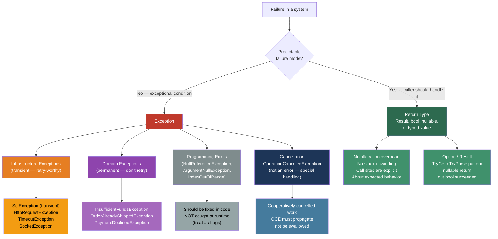
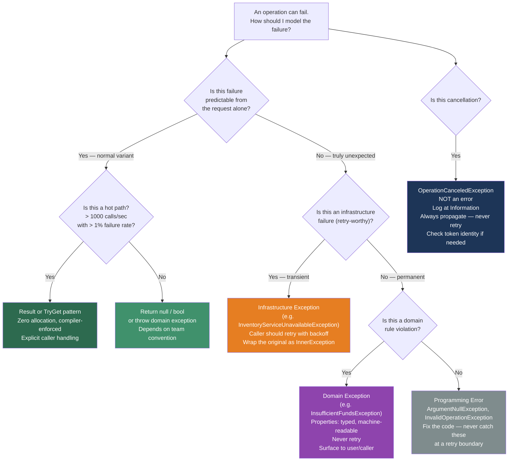

> [!success] Mastery Check
> - [ ] **Studied Well**
> - [ ] **Can explain the concept without notes**
> - [ ] **Can answer interview questions confidently**
> - [ ] **Can implement it in a real project**


## 📍 PART 0 — Navigation & Context

### Where This Topic Lives

```
C# Runtime Model
└── Error Handling & Reliability
    ├──   Exception Handling: Fundamentals (2.15)  ← prerequisite
    ├── ► Exception Handling: Production Patterns (2.36)  ← YOU ARE HERE
    ├──   async/await: The State Machine (2.29)    ← async exception propagation
    ├──   IDisposable and Resource Management (2.30)
    └──   Nullable Types (2.18)                    ← null as exception prevention
```

### What You Need Before This

- `2.15 — Exception Handling: Fundamentals` — try/catch/finally, exception hierarchy, throw vs throw ex, custom exceptions
- `2.29 — async/await: The State Machine` — how async methods capture and propagate exceptions through state machines
- `2.30 — IDisposable and Resource Management` — the relationship between finally blocks and Dispose()

### What This Unlocks After

- Designing domain exception hierarchies that survive a year of production use without becoming a catch-all mess
- Writing retry and circuit-breaker policies that handle `OperationCanceledException` correctly
- Building `Result<T>` patterns that eliminate exception-as-flow-control from internal code paths
- Diagnosing async exception swallowing bugs that only manifest in production load

### Why This Topic Matters at Scale

Exception design is a contract you make with every caller, every monitoring system, and every operations engineer who will debug your service at 3am. The patterns here are the difference between a system that fails safely with actionable information and one that eats errors silently or buries critical signals in noise.

---

## 🧠 PART 1 — The Core Mental Model

### The Fundamental Rule

> **Exceptions should signal exceptional conditions — states the caller could not reasonably predict or prevent. Predictable failure modes (invalid input, resource not found, network timeouts) belong in the return type. The practical consequence is that your exception hierarchy communicates your system's failure contract, and your return types communicate its expected variance.**

### The Plain-Language Analogy

Think of a payment processing API like a physical bank teller. The teller has two kinds of negative outcomes. The first kind is routine: "Your account balance is insufficient" — that's a known, expected response to a legitimate request. The teller hands you a slip saying "declined: insufficient funds." That is not an emergency; it's a value in the return protocol. The second kind is exceptional: the bank vault door jammed, the power went out, the system database is unreachable. That's an exception — something neither you nor the teller could anticipate from the request alone.

The failure of most C# codebases is treating all negative outcomes as the second kind. They throw `UserNotFoundException` and then catch it three frames up to show a 404 response. The vault door didn't jam — you just asked for a user that doesn't exist. That's a return value.

### The Exception Handling Taxonomy



---

## 🔬 PART 2 — Deep Mechanics

### 2.1 The Two-Pass Exception Model — What the CLR Actually Does

When an exception is thrown, the CLR does NOT immediately unwind the stack. It performs two passes. Understanding this explains why `when` filters are so powerful.

```
PASS 1 — Handler Search (frames are NOT unwound yet)
━━━━━━━━━━━━━━━━━━━━━━━━━━━━━━━━━━━━━━━━━━━━━━━━━━━━━━
Call stack at the moment throw happens:

Frame 5:  InvoiceProcessor.ApplyDiscount()   ← exception thrown HERE
Frame 4:  InvoiceService.ProcessBatch()
Frame 3:  OrderController.SubmitOrder()
Frame 2:  Middleware.InvokeAsync()            ← catch (Exception ex) when (Log(ex)) LIVES HERE
Frame 1:  Kestrel dispatcher

CLR walks UP the stack LOOKING for a handler.
It evaluates each 'catch' clause type check AND each 'when' filter.
IMPORTANT: The 'when' filter runs at Frame 5's context.
           The original call site is still alive on the stack.
           You can inspect the exception with the FULL stack trace intact.

PASS 2 — Stack Unwinding (only if a handler was found)
━━━━━━━━━━━━━━━━━━━━━━━━━━━━━━━━━━━━━━━━━━━━━━━━━━━━━━
Once a handler is found, the CLR unwinds frames 5 → 3,
running their finally blocks in reverse order.
Control transfers to the catch block in Frame 2.
```

**Why this matters for logging:** A `when (LogException(ex))` filter that always returns false can log exceptions with the original call stack before any unwinding occurs. This is how you build "observe but don't handle" exception logging without changing the exception flow.

```csharp
// Logging filter: observe the exception at its throw site
// Cost: ~50 ns per thrown exception for the filter evaluation
private static bool LogException(Exception ex)
{
    // Structured logging with full fidelity — stack still intact
    _logger.LogError(ex, "Unhandled exception at original throw site");
    return false;  // Don't handle it — just observed
}

try { await ProcessInvoiceBatch(batch); }
catch (Exception ex) when (LogException(ex))
{
    // This block NEVER executes — filter always returns false
    // But LogException ran with the original stack context
}
```

### 2.2 ExceptionDispatchInfo — Rethrowing Across Thread Boundaries

`throw ex` destroys the original stack trace. `throw` (bare) only works inside a catch block. Neither works when you've captured an exception in one context and need to rethrow it in another — async code, background workers, parallel loops.

```
WITHOUT ExceptionDispatchInfo:

Background thread catches:  ArgumentException at OrderValidator.Validate() [line 42]
Main thread rethrows (throw ex):
  Stack trace now shows:
    → at OrderService.ProcessOrder() [line 99]   ← WHERE YOU RETHREW
    The original location at OrderValidator [line 42] is GONE.

WITH ExceptionDispatchInfo:

Background thread captures:  ExceptionDispatchInfo.Capture(ex)
Main thread throws:          edi.Throw()
  Stack trace shows:
    → at OrderValidator.Validate() [line 42]      ← ORIGINAL location preserved
    --- End of stack trace from previous location ---
    → at OrderService.ProcessOrder() [line 99]    ← AND the rethrow site
```

```csharp
// Pattern: capture exception in one context, rethrow with context in another
public class OrderProcessingPipeline
{
    private ExceptionDispatchInfo? _capturedException;

    // Called on background worker thread
    public void ExecuteOnWorker(Action work)
    {
        try { work(); }
        catch (Exception ex)
        {
            // Capture preserves the stack trace EXACTLY as it exists right now
            _capturedException = ExceptionDispatchInfo.Capture(ex);
        }
    }

    // Called on the orchestrating thread after the worker completes
    public void PropagateIfFailed()
    {
        // Rethrow with original stack trace context preserved
        // The "--- End of stack trace from previous location ---" separator
        // tells readers: "the original exception originated there, this shows where it was re-raised"
        _capturedException?.Throw();
    }
}
```

**Cost:** `ExceptionDispatchInfo.Capture()` is O(1), ~20 ns — captures a reference to the existing exception object with metadata. The `Throw()` call is equivalent to a throw statement.

### 2.3 AggregateException — The Task.WhenAll Contract

`Task.WhenAll` wraps ALL exceptions from all tasks into a single `AggregateException`. Unwrapping it incorrectly causes missed exceptions.

```
Task.WhenAll behavior:
━━━━━━━━━━━━━━━━━━━━━━━━━━━━━━━━━━━━━━━━━━━━━━━━━
3 tasks run in parallel:
  Task 1 → throws InvalidOperationException
  Task 2 → succeeds
  Task 3 → throws ArgumentException

Task.WhenAll throws:
  AggregateException
  └── InnerExceptions (IReadOnlyCollection<Exception>):
      ├── InvalidOperationException  (from Task 1)
      └── ArgumentException          (from Task 3)

TRAP: await catches ONLY the FIRST inner exception.
```

```csharp
// ⚠️ WRONG: Loses Task 3's ArgumentException entirely
try
{
    await Task.WhenAll(task1, task2, task3);
}
catch (Exception ex)
{
    // ex is the FIRST exception — InvalidOperationException
    // ArgumentException from task3 is SILENTLY DROPPED
    _logger.LogError(ex, "One of the tasks failed");
}

// ✅ CORRECT: Capture all, then await for unwrapping
var allTasks = Task.WhenAll(task1, task2, task3);
try
{
    await allTasks;
}
catch
{
    // allTasks.Exception is the FULL AggregateException with ALL inner exceptions
    // Only available on the Task object itself — not via await's unwrapping
    foreach (var ex in allTasks.Exception!.InnerExceptions)
        _logger.LogError(ex, "Task failed: {ExceptionType}", ex.GetType().Name);

    throw; // Rethrow the AggregateException or handle as needed
}

// ✅ ALTERNATIVE: AggregateException.Handle() for selective handling
try
{
    await allTasks;
}
catch (AggregateException aex)
{
    // Handle() calls the predicate for each inner exception.
    // If predicate returns true: considered handled.
    // If ANY inner exception returns false: AggregateException is rethrown
    // with ONLY the unhandled exceptions as InnerExceptions.
    aex.Handle(ex =>
    {
        if (ex is TimeoutException)
        {
            _logger.LogWarning("Task timed out: {Message}", ex.Message);
            return true;  // handled
        }
        return false;     // not handled — will be re-raised
    });
}
```

**Cost of AggregateException construction:** O(n) where n = number of inner exceptions. Stack trace capture for each inner exception at ~5-10 μs each.

### 2.4 OperationCanceledException — Not an Error, a Protocol

`OperationCanceledException` (and its subclass `TaskCanceledException`) is **not an error condition** — it is a cooperative completion protocol. It must be handled differently from all other exceptions.

```
The cancellation signal chain:
━━━━━━━━━━━━━━━━━━━━━━━━━━━━━━━━━━━━━━━━━━━━━━━━━━━━━━━
CancellationTokenSource.Cancel()
    → CancellationToken.IsCancellationRequested = true
    → All registered callbacks fire synchronously
    → Any awaited operation that checks the token throws OCE

When you catch OCE at a boundary:
  CORRECT: Log at Debug/Information, NOT Error
  CORRECT: Return a "cancelled" result or rethrow
  WRONG:   Log at Error level (triggers false alerts)
  WRONG:   Swallow silently
  WRONG:   Retry (cancellation was intentional)

The one special case:
  Catch OCE when it's from a DIFFERENT token than yours
  (e.g., downstream called with an internal timeout token,
   but YOUR token hasn't been cancelled).
  In that case: it IS an error from your perspective.
```

```csharp
// Production pattern: correct OperationCanceledException handling
public async Task<PaymentResult> ProcessPaymentAsync(
    PaymentRequest request,
    CancellationToken cancellationToken)
{
    try
    {
        await _paymentGateway.ChargeAsync(request, cancellationToken);
        return PaymentResult.Success();
    }
    catch (OperationCanceledException oce)
        when (oce.CancellationToken == cancellationToken)
    {
        // Cooperative cancellation — our caller cancelled us.
        // NOT an error. Log at Information and propagate.
        _logger.LogInformation(
            "Payment processing cancelled for order {OrderId}",
            request.OrderId);
        throw;  // Propagate — callers need to know we were cancelled
    }
    catch (OperationCanceledException oce)
    {
        // A DIFFERENT token cancelled — internal timeout or downstream issue.
        // THIS is an error from our perspective.
        _logger.LogError(oce,
            "Payment gateway internal timeout for order {OrderId}",
            request.OrderId);
        throw new PaymentGatewayException("Gateway timed out internally", oce);
    }
    catch (PaymentGatewayException)
    {
        throw;  // Domain exception — let it propagate as-is
    }
    catch (Exception ex)
    {
        _logger.LogError(ex,
            "Unexpected error processing payment for order {OrderId}",
            request.OrderId);
        throw new PaymentProcessingException(
            $"Failed to process payment for order {request.OrderId}", ex);
    }
}
```

### 2.5 The Cost of Exceptions — When It Matters

```
Exception cost breakdown (approximate, .NET 8, x64):
━━━━━━━━━━━━━━━━━━━━━━━━━━━━━━━━━━━━━━━━━━━━━━━━━━━━━━
throw new Exception("message"):
  Stack trace capture:    ~5,000 ns  (walking and formatting the call stack)
  Object allocation:      ~50-200 ns (the Exception object on the heap)
  Handler search (pass1): ~20-100 ns (depends on stack depth)
  Stack unwinding (pass2): ~50-200 ns (running finally blocks)
  TOTAL:                  ~5,000-10,000 ns per throw (~5-10 μs)

This means:
  10,000 throws/sec  = ~5-10% of a single CPU core spent on exception machinery
  100,000 throws/sec = already unacceptable for most services
  Exception-as-flow-control on a hot path: definitive performance problem

Comparison:
  Returning a bool:    ~1 ns
  Returning Result<T>: ~2-5 ns (stack allocation)
  Throwing:            ~5,000 ns (5,000× slower)
```

> [!IMPORTANT] The Rule for Hot Paths If your code can be called more than ~1,000 times per second on a path that encounters "failure" more than 1% of the time, exceptions are the wrong mechanism. Use `Result<T>`, `bool TryGet...`, or a nullable return instead.

---

## 💻 PART 3 — Production Code Patterns

### 3.1 The Domain Exception Hierarchy

Build your exception hierarchy around **failure categories**, not individual error messages. Every category implies a different response strategy (retry, user error, infrastructure failure, etc.).

```csharp
// ✅ Domain exception hierarchy for an order management system

// Base: all domain exceptions carry a machine-readable error code
// so monitoring systems can alert on categories, not string matching
public abstract class OrderManagementException : Exception
{
    public string ErrorCode { get; }

    protected OrderManagementException(string errorCode, string message)
        : base(message)
    {
        ErrorCode = errorCode;
    }

    protected OrderManagementException(string errorCode, string message, Exception inner)
        : base(message, inner)
    {
        ErrorCode = errorCode;
    }
}

// Category 1: The request was valid but the domain says no.
// NEVER retry. Surface to the user.
public abstract class OrderDomainException : OrderManagementException
{
    protected OrderDomainException(string errorCode, string message)
        : base(errorCode, message) { }
}

public sealed class InsufficientInventoryException : OrderDomainException
{
    public string ProductSku    { get; }
    public int    RequestedQty  { get; }
    public int    AvailableQty  { get; }

    public InsufficientInventoryException(string sku, int requested, int available)
        : base("ORDER_INVENTORY_INSUFFICIENT",
               $"Cannot fulfill {requested} units of {sku}: only {available} available")
    {
        ProductSku   = sku;
        RequestedQty = requested;
        AvailableQty = available;
    }
}

public sealed class OrderAlreadyShippedException : OrderDomainException
{
    public string OrderId     { get; }
    public DateTimeOffset ShippedAt { get; }

    public OrderAlreadyShippedException(string orderId, DateTimeOffset shippedAt)
        : base("ORDER_ALREADY_SHIPPED",
               $"Order {orderId} was already shipped at {shippedAt:u}")
    {
        OrderId   = orderId;
        ShippedAt = shippedAt;
    }
}

// Category 2: Infrastructure failure. MAY retry with backoff.
public abstract class OrderInfrastructureException : OrderManagementException
{
    protected OrderInfrastructureException(string errorCode, string message, Exception inner)
        : base(errorCode, message, inner) { }
}

public sealed class InventoryServiceUnavailableException : OrderInfrastructureException
{
    public InventoryServiceUnavailableException(Exception inner)
        : base("INVENTORY_SERVICE_UNAVAILABLE",
               "The inventory service is currently unavailable. Retry is appropriate.",
               inner) { }
}
```

### 3.2 The Boundary Exception Translator Pattern

Services should throw their own domain exceptions. They should not leak infrastructure exceptions (`SqlException`, `HttpRequestException`) across boundaries. Translating at the boundary keeps contracts clean.

```csharp
// ⚠️ WRONG: Infrastructure exception leaks into the domain
public async Task<Order> GetOrderAsync(string orderId)
{
    // SqlException (which contains SQL server internals) leaks to the caller
    return await _db.Orders.FindAsync(orderId)
        ?? throw new KeyNotFoundException(orderId);
}

// ✅ CORRECT: Translate at the repository boundary
public sealed class OrderRepository : IOrderRepository
{
    private readonly OrderDbContext _db;
    private readonly ILogger<OrderRepository> _logger;

    public async Task<Order> GetOrderAsync(string orderId, CancellationToken ct)
    {
        try
        {
            var order = await _db.Orders
                .AsNoTracking()
                .FirstOrDefaultAsync(o => o.Id == orderId, ct);

            // Expected negative case: not an exception — return null
            // The CALLER decides if not-found is an error in their context
            return order
                ?? throw new OrderNotFoundException(orderId);  // domain exception
        }
        catch (OperationCanceledException) { throw; }  // Never swallow cancellation
        catch (OrderNotFoundException)     { throw; }  // Already a domain exception — pass through
        catch (Exception ex)
        {
            // SqlException, network errors, etc. — wrap in domain-meaningful exception
            _logger.LogError(ex,
                "Database failure retrieving order {OrderId}", orderId);
            throw new OrderDataAccessException(
                $"Failed to retrieve order {orderId}", ex);
        }
    }
}
```

### 3.3 The Retry Policy with OperationCanceledException Awareness

Retry logic that swallows `OperationCanceledException` is a common and dangerous bug. Cancelled work must never be retried.

```csharp
// Production retry with correct cancellation handling
public static async Task<T> RetryAsync<T>(
    Func<CancellationToken, Task<T>> operation,
    RetryPolicy policy,
    CancellationToken cancellationToken)
{
    int attempt = 0;

    while (true)
    {
        attempt++;
        try
        {
            return await operation(cancellationToken);
        }
        catch (OperationCanceledException)
        {
            // Cancellation is NOT a retryable failure — ALWAYS propagate
            // Never retry cancelled work. The caller has signalled intent to stop.
            throw;
        }
        catch (Exception ex) when (policy.IsRetryable(ex) && attempt < policy.MaxAttempts)
        {
            var delay = policy.GetDelay(attempt);

            _logger.LogWarning(ex,
                "Attempt {Attempt}/{MaxAttempts} failed. Retrying in {DelayMs}ms. Error: {ErrorType}",
                attempt, policy.MaxAttempts, delay.TotalMilliseconds, ex.GetType().Name);

            // Use the cancellationToken so delay itself can be cancelled
            await Task.Delay(delay, cancellationToken);
        }
        // Non-retryable exception falls through — throws naturally
    }
}

// Retry policy definition — keeps the retry logic decoupled from policy
public sealed class RetryPolicy
{
    public int MaxAttempts { get; init; } = 3;
    private readonly HashSet<Type> _retryableTypes;

    public RetryPolicy(params Type[] retryableExceptions)
    {
        _retryableTypes = new HashSet<Type>(retryableExceptions);
    }

    public bool IsRetryable(Exception ex)
        => _retryableTypes.Contains(ex.GetType())
        || _retryableTypes.Any(t => t.IsAssignableFrom(ex.GetType()));

    public TimeSpan GetDelay(int attempt)
        // Exponential backoff with jitter prevents thundering herd
        => TimeSpan.FromMilliseconds(
            Math.Min(100 * Math.Pow(2, attempt - 1), 30_000)
            + Random.Shared.Next(0, 100));
}
```

### 3.4 The Result<T> Pattern — Expected Failure as a Return Value

Use `Result<T>` when failure is an expected branch of normal execution that the caller MUST handle explicitly. The compiler enforces handling; exceptions do not.

```csharp
// A production-quality Result<T> for payment processing
public readonly struct Result<T>
{
    private readonly T?     _value;
    private readonly string? _errorCode;
    private readonly string? _errorMessage;

    private Result(T value)
    {
        _value        = value;
        IsSuccess     = true;
        _errorCode    = null;
        _errorMessage = null;
    }

    private Result(string errorCode, string errorMessage)
    {
        _value        = default;
        IsSuccess     = false;
        _errorCode    = errorCode;
        _errorMessage = errorMessage;
    }

    public bool IsSuccess { get; }
    public bool IsFailure => !IsSuccess;

    public T Value =>
        IsSuccess
            ? _value!
            : throw new InvalidOperationException(
                $"Cannot access Value on a failed Result. Error: {_errorCode}: {_errorMessage}");

    public string ErrorCode    => _errorCode    ?? string.Empty;
    public string ErrorMessage => _errorMessage ?? string.Empty;

    public static Result<T> Success(T value)               => new(value);
    public static Result<T> Failure(string code, string msg) => new(code, msg);

    // Map: transform the value if successful, pass failure through unchanged
    // ~3 ns — zero allocation (struct)
    public Result<TOut> Map<TOut>(Func<T, TOut> transform)
        => IsSuccess
            ? Result<TOut>.Success(transform(_value!))
            : Result<TOut>.Failure(_errorCode!, _errorMessage!);

    public override string ToString()
        => IsSuccess
            ? $"Success({_value})"
            : $"Failure({_errorCode}: {_errorMessage})";
}

// Usage: caller is FORCED to check IsSuccess — no silent swallowing
public async Task<Result<PaymentConfirmation>> ProcessPaymentAsync(
    PaymentRequest request,
    CancellationToken ct)
{
    if (request.Amount <= 0)
        return Result<PaymentConfirmation>.Failure(
            "INVALID_AMOUNT", "Payment amount must be positive");

    var balance = await _accountService.GetBalanceAsync(request.AccountId, ct);

    if (balance < request.Amount)
        return Result<PaymentConfirmation>.Failure(
            "INSUFFICIENT_FUNDS",
            $"Account {request.AccountId} has {balance:C}, cannot pay {request.Amount:C}");

    // Only UNEXPECTED failures become exceptions
    var confirmation = await _gateway.ChargeAsync(request, ct);
    return Result<PaymentConfirmation>.Success(confirmation);
}

// Caller:
var result = await ProcessPaymentAsync(request, ct);
if (result.IsFailure)
{
    _logger.LogInformation(
        "Payment declined for {AccountId}: {ErrorCode}",
        request.AccountId, result.ErrorCode);
    return BadRequest(result.ErrorMessage);
}
// Reaching here guarantees result.Value is safe to access
return Ok(result.Value);
```

### 3.5 The ExceptionFilter Logging Middleware Pattern

Don't log exceptions in catch blocks scattered across your codebase. Log at the boundary, once, with full context.

```csharp
// ASP.NET Core middleware: catch at the top of the pipeline, log once
public sealed class ExceptionLoggingMiddleware
{
    private readonly RequestDelegate _next;
    private readonly ILogger<ExceptionLoggingMiddleware> _logger;

    public ExceptionLoggingMiddleware(
        RequestDelegate next,
        ILogger<ExceptionLoggingMiddleware> logger)
    {
        _next   = next;
        _logger = logger;
    }

    public async Task InvokeAsync(HttpContext context)
    {
        // The 'when' filter runs BEFORE stack unwinding.
        // We see the exception in its original context.
        try
        {
            await _next(context);
        }
        catch (OperationCanceledException) when (context.RequestAborted.IsCancellationRequested)
        {
            // Client disconnected — not an error. Don't log as error.
            // Don't rethrow — the connection is already gone.
            context.Response.StatusCode = 499; // Client Closed Request
        }
        catch (OrderDomainException ex)
        {
            // Domain exceptions: known failure modes, log at Warning
            _logger.LogWarning(ex,
                "Domain rule violated: {ErrorCode} for request {RequestId}",
                ex.ErrorCode,
                context.TraceIdentifier);
            await WriteProblemDetailsAsync(context, StatusCodes.Status422UnprocessableEntity, ex);
        }
        catch (OrderInfrastructureException ex)
        {
            // Infrastructure failures: log at Error, 503
            _logger.LogError(ex,
                "Infrastructure failure: {ErrorCode} for request {RequestId}",
                ex.ErrorCode,
                context.TraceIdentifier);
            await WriteProblemDetailsAsync(context, StatusCodes.Status503ServiceUnavailable, ex);
        }
        catch (Exception ex)
        {
            // Everything else: unexpected, log at Critical
            _logger.LogCritical(ex,
                "Unhandled exception for request {RequestId} {Method} {Path}",
                context.TraceIdentifier,
                context.Request.Method,
                context.Request.Path);
            await WriteProblemDetailsAsync(context, StatusCodes.Status500InternalServerError, ex);
        }
    }

    private static async Task WriteProblemDetailsAsync(
        HttpContext context, int statusCode, Exception ex)
    {
        if (context.Response.HasStarted) return;

        context.Response.StatusCode  = statusCode;
        context.Response.ContentType = "application/problem+json";
        // Write RFC 7807 ProblemDetails — structure depends on your contracts
        var problem = new { status = statusCode, title = ex.Message, traceId = context.TraceIdentifier };
        await context.Response.WriteAsJsonAsync(problem);
    }
}
```

### 3.6 The AppDomain.UnhandledException and TaskScheduler.UnobservedTaskException Safety Nets

Every long-running service should wire up safety-net handlers for exceptions that escape all structured handling.

```csharp
// In your Program.cs or startup, register BEFORE anything else
public static class ExceptionSafetyNets
{
    public static void Register(ILogger logger)
    {
        // Catches exceptions on non-async threads that weren't handled
        // This fires AFTER the CLR has decided the process will terminate
        // Use only for emergency logging — you cannot prevent the crash here
        AppDomain.CurrentDomain.UnhandledException += (sender, args) =>
        {
            var ex = (Exception)args.ExceptionObject;
            logger.LogCritical(ex,
                "UNHANDLED EXCEPTION — process terminating. IsTerminating={IsTerminating}",
                args.IsTerminating);
            // Flush your log sink synchronously — you're about to die
        };

        // Catches fire-and-forget tasks whose exceptions were never observed
        // Does NOT terminate the process (unlike UnhandledException)
        // This is your signal that someone wrote: _ = SomeAsync(); without awaiting
        TaskScheduler.UnobservedTaskException += (sender, args) =>
        {
            logger.LogError(args.Exception,
                "UNOBSERVED TASK EXCEPTION — a fire-and-forget task failed silently");
            args.SetObserved(); // Prevents the process from terminating (.NET < 4.5 behavior)
        };
    }
}
```

### 3.7 The Validated Constructor Pattern — Exception Prevention at the Boundary

The cheapest exceptions are the ones that never happen. Validate at the system boundary — once — so interior code can assume invariants hold.

```csharp
// ⚠️ WRONG: Validation scattered, exceptions thrown deep inside
public class InvoiceLineItem
{
    public decimal UnitPrice { get; set; }
    public int     Quantity  { get; set; }

    public decimal Total()
    {
        // Interior code throwing because nobody validated at entry
        if (UnitPrice < 0) throw new InvalidOperationException("Negative price");
        if (Quantity  < 0) throw new InvalidOperationException("Negative quantity");
        return UnitPrice * Quantity;
    }
}

// ✅ CORRECT: Validate at construction, guarantee invariants thereafter
public sealed class InvoiceLineItem
{
    public decimal UnitPrice { get; }
    public int     Quantity  { get; }
    public string  ProductId { get; }

    private InvoiceLineItem(string productId, decimal unitPrice, int quantity)
    {
        ProductId = productId;
        UnitPrice = unitPrice;
        Quantity  = quantity;
    }

    // Factory method returns Result<T> for expected validation failures
    // Throws ArgumentException only for true programming errors (null productId)
    public static Result<InvoiceLineItem> Create(
        string productId, decimal unitPrice, int quantity)
    {
        ArgumentNullException.ThrowIfNull(productId); // programming error

        if (unitPrice < 0)
            return Result<InvoiceLineItem>.Failure(
                "INVALID_UNIT_PRICE", "Unit price cannot be negative");

        if (quantity <= 0)
            return Result<InvoiceLineItem>.Failure(
                "INVALID_QUANTITY", "Quantity must be greater than zero");

        return Result<InvoiceLineItem>.Success(
            new InvoiceLineItem(productId, unitPrice, quantity));
    }

    // After construction: no guards needed — invariants are guaranteed
    public decimal Total() => UnitPrice * Quantity;
}
```

---

## ⚠️ PART 4 — Gotchas & Anti-Patterns

### Gotcha 1: Swallowing OperationCanceledException in a Retry Loop

Engineers add `catch (Exception)` to retry loops to handle transient failures, but this accidentally catches and retries cancelled work — creating a service that ignores shutdown signals or exceeds request timeouts.

```csharp
// ⚠️ WRONG: Retries cancelled work indefinitely
for (int i = 0; i < maxAttempts; i++)
{
    try { return await CallDownstreamService(ct); }
    catch (Exception ex) when (IsTransient(ex))
    {
        await Task.Delay(TimeSpan.FromSeconds(i + 1));
        // When the caller cancels the token to abort the request,
        // OperationCanceledException from the delay is caught here.
        // The retry loop continues — the service ignores the cancellation signal.
    }
}

// ✅ CORRECT: OperationCanceledException is checked first, always re-thrown
for (int i = 0; i < maxAttempts; i++)
{
    try { return await CallDownstreamService(ct); }
    catch (OperationCanceledException) { throw; }  // Never retry — always propagate
    catch (Exception ex) when (IsTransient(ex))
    {
        await Task.Delay(TimeSpan.FromSeconds(i + 1), ct); // Pass token to delay too
    }
}

// WHY: The catch clause order doesn't protect you here — OperationCanceledException
// inherits from Exception and will be caught by the generic clause first.
// You must check it explicitly and rethrow BEFORE the retry logic fires.
```

### Gotcha 2: Logging After throw ex Loses the Original Stack Trace

Engineers who log and then rethrow using `throw ex` reset the StackTrace to the current catch block. The original call site that threw is gone from every logging system and every crash report.

```csharp
// ⚠️ WRONG: Stack trace now points to THIS line, not the original throw site
catch (Exception ex)
{
    _logger.LogError(ex, "Error in ProcessOrder");
    throw ex;  // DESTROYS original stack trace — ex.StackTrace now shows this line
}

// ✅ CORRECT: Bare throw preserves the original stack trace completely
catch (Exception ex)
{
    _logger.LogError(ex, "Error in ProcessOrder");
    throw;  // Rethrows the SAME exception object — StackTrace unchanged
}

// WHY: throw ex is syntactic sugar for: ex.SetStackTrace(Environment.StackTrace).
// It creates a new stack trace starting at the current location.
// throw (bare) preserves the exception object as-is, re-entering the handler search.
```

### Gotcha 3: The Finally Block Can Suppress Exceptions

A `return` statement or a new `throw` inside a `finally` block silently swallows the in-flight exception. This creates bugs that are nearly impossible to diagnose because the original exception vanishes entirely.

```csharp
// ⚠️ WRONG: The original exception from DoWork() is lost forever
try
{
    DoWork(); // throws InvalidOperationException
}
finally
{
    Cleanup(); // throws NullReferenceException
               // The InvalidOperationException is GONE.
               // Only NullReferenceException propagates.
               // You'll spend hours debugging the wrong exception.
}

// ✅ CORRECT: Guard the finally block — don't let it throw
try
{
    DoWork();
}
finally
{
    try
    {
        Cleanup();
    }
    catch (Exception cleanupEx)
    {
        // Log the cleanup failure but DO NOT let it propagate
        // The original exception from DoWork() must be preserved
        _logger.LogError(cleanupEx, "Cleanup failed — original exception takes precedence");
    }
}

// WHY: The CLR has no concept of "secondary exceptions". When a finally block
// throws, the in-flight exception from the try block is simply released (GC'd).
// The finally exception replaces it as the active exception.
```

### Gotcha 4: Task.WhenAll Loses All-But-First Exception on await

When `Task.WhenAll` completes with multiple failures and you `await` it, only the first inner exception propagates. The rest are silently discarded — no log entry, no trace, nothing.

```csharp
// ⚠️ WRONG: Loses all exceptions except the first one
try
{
    await Task.WhenAll(
        ProcessInvoice(inv1),  // throws InvoiceValidationException
        ProcessInvoice(inv2),  // throws InvoiceDuplicateException
        ProcessInvoice(inv3)); // succeeds
}
catch (InvoiceValidationException ex)
{
    // Only this runs — InvoiceDuplicateException from inv2 is NEVER seen
    _logger.LogError(ex, "Invoice processing failed");
}

// ✅ CORRECT: Hold the task reference, inspect .Exception after await
var processingTask = Task.WhenAll(
    ProcessInvoice(inv1),
    ProcessInvoice(inv2),
    ProcessInvoice(inv3));

try { await processingTask; }
catch
{
    var allErrors = processingTask.Exception?.InnerExceptions
                   ?? Enumerable.Empty<Exception>();

    foreach (var ex in allErrors)
        _logger.LogError(ex, "Invoice processing failure: {Type}", ex.GetType().Name);

    throw;
}

// WHY: await's exception unwrapping behavior extracts exactly ONE exception
// from an AggregateException — the first in InnerExceptions. This is by design
// for the common case, but it is a trap when ALL failures matter.
```

### Gotcha 5: Catching Exception in a using Block Hides Dispose Failures

When both the body of a `using` block and the `Dispose()` call throw, only the body exception propagates. The `Dispose` exception is silently lost — and since `Dispose` often flushes buffers or commits transactions, this lost exception can mean silent data corruption or resource leaks that are never diagnosed.

```csharp
// ⚠️ WRONG: If stream.Flush() in Dispose() throws, you never know
try
{
    using var stream = new FileStream(path, FileMode.Create);
    WriteInvoiceData(stream); // throws IOException (disk full)
    // stream.Dispose() is called in the finally — also throws IOException (flush failed)
    // You only ever see WriteInvoiceData's exception.
    // The Dispose failure is gone.
}
catch (IOException ex)
{
    _logger.LogError(ex, "Failed to write invoice — but did we also fail to flush?");
    // You can never know from this catch block alone.
}

// ✅ CORRECT: Separate the using scope from the outer catch
FileStream? stream = null;
Exception? writeException = null;
try
{
    stream = new FileStream(path, FileMode.Create);
    WriteInvoiceData(stream);
}
catch (Exception ex)
{
    writeException = ex;
}
finally
{
    if (stream != null)
    {
        try { stream.Dispose(); }
        catch (Exception disposeEx)
        {
            // Both failures are now observable and loggable
            if (writeException != null)
                _logger.LogError(disposeEx, "Dispose also failed after write error: {WriteError}", writeException.Message);
            else
                throw;  // Dispose was the only failure — propagate it
        }
    }
}
if (writeException != null)
    System.Runtime.ExceptionServices.ExceptionDispatchInfo.Capture(writeException).Throw();

// WHY: The using statement desugars to a try/finally where Dispose() is called
// in finally. If both the try body and the finally throw, C# (unlike Java's
// try-with-resources suppressed exceptions) simply discards the original exception.
```

---

## 📊 PART 5 — Performance Implications

### 5.1 Allocation Characteristics Table

|Scenario|Allocation Behavior|Approx Cost|
|---|---|---|
|`throw new DomainException("msg")`|One Exception heap object + stack trace strings|~5–10 μs per throw|
|`catch` block matched and entered|No allocation (existing object reused)|~50–200 ns|
|`catch (T ex) when (filter)`|Filter called; no allocation if filter is a static method|~10–50 ns|
|`ExceptionDispatchInfo.Capture(ex)`|One EDI wrapper object, holds ref to existing exception|~20 ns|
|`ExceptionDispatchInfo.Throw()`|No new allocation; rethrows captured exception|~5 μs (throw cost)|
|`AggregateException` with N inner|One AggregateException + IReadOnlyList of refs|O(N) time, ~40 + 8N bytes|
|`Result<T>` success path (struct)|Zero heap allocation (stack-allocated struct)|~2–5 ns|
|`Result<T>` failure path (struct)|Zero heap allocation (strings are literals or interned)|~2–5 ns|
|`bool TryGet(out T value)` pattern|Zero allocation|~1 ns|
|Exception in hot loop (1k/sec)|GC pressure from Exception objects, stack trace strings|Noticeable Gen0 collections|
|Exception in hot loop (100k/sec)|Major GC pressure, stop-the-world pauses|Service degradation|
|`AppDomain.UnhandledException`|Registration: zero. Invocation: exception already in flight|N/A|

### 5.2 BenchmarkDotNet: Exception vs Result vs TryGet

```csharp
[MemoryDiagnoser]
[BenchmarkCategory("ErrorHandling")]
public class ErrorHandlingCostBenchmark
{
    private static readonly Dictionary<string, decimal> _prices
        = new() { ["PROD-001"] = 9.99m, ["PROD-002"] = 14.99m };

    // Expected output (approximate, .NET 8, x64):
    // ┌────────────────────────┬──────────────┬──────────┬────────┐
    // │ Method                 │ Mean         │ Alloc    │ Gen 0  │
    // ├────────────────────────┼──────────────┼──────────┼────────┤
    // │ ExceptionOnMiss        │ 8,231 ns     │ 472 B    │ 0.0076 │
    // │ ResultOnMiss           │ 3.1 ns       │ 0 B      │ -      │
    // │ TryGetOnMiss           │ 1.8 ns       │ 0 B      │ -      │
    // │ ExceptionOnHit         │ 1.9 ns       │ 0 B      │ -      │
    // │ ResultOnHit            │ 2.1 ns       │ 0 B      │ -      │
    // └────────────────────────┴──────────────┴──────────┴────────┘

    [Benchmark(Baseline = true)]
    public decimal ExceptionOnMiss()
    {
        try
        {
            return GetPriceOrThrow("PROD-999");  // miss
        }
        catch (KeyNotFoundException)
        {
            return 0m;
        }
    }

    [Benchmark]
    public decimal ResultOnMiss()
    {
        var result = GetPriceResult("PROD-999");  // miss
        return result.IsSuccess ? result.Value : 0m;
    }

    [Benchmark]
    public decimal TryGetOnMiss()
    {
        return _prices.TryGetValue("PROD-999", out var price) ? price : 0m;
    }

    [Benchmark]
    public decimal ExceptionOnHit()
    {
        try { return GetPriceOrThrow("PROD-001"); }
        catch (KeyNotFoundException) { return 0m; }
    }

    [Benchmark]
    public decimal ResultOnHit()
    {
        var r = GetPriceResult("PROD-001");
        return r.IsSuccess ? r.Value : 0m;
    }

    private static decimal GetPriceOrThrow(string sku)
        => _prices.TryGetValue(sku, out var p)
            ? p
            : throw new KeyNotFoundException($"Product {sku} not found");

    private static Result<decimal> GetPriceResult(string sku)
        => _prices.TryGetValue(sku, out var p)
            ? Result<decimal>.Success(p)
            : Result<decimal>.Failure("PRODUCT_NOT_FOUND", $"Product {sku} not found");
}
```

### 5.3 When to Care / When to Ignore

**When this costs you:**

- Any hot path that throws exceptions as a normal control flow branch (product lookup, cache misses, validation failures on user input) — at meaningful request volume, the stack trace capture and GC pressure become measurable latency
- Retry loops that catch `Exception` broadly and retry work that was legitimately cancelled — this creates CPU spin and delays shutdown
- `Task.WhenAll` over many tasks where failure is common — AggregateException allocation multiplies per-task exception costs
- Using `catch (Exception)` in loops that process thousands of records — each throw costs ~5–10 μs, pushing a million-record batch from seconds to hours

**When this doesn't matter:**

- True exceptional paths in infrastructure code — a database connection failing at 3am is not a hot path; the 8 μs for the exception is irrelevant
- Application startup code — exceptions at startup are once-per-process; performance is not the concern
- Test code — test framework exception handling has zero production cost
- Error responses at HTTP layer boundaries — you've already spent the I/O time; exception overhead is noise compared to network latency

---

## 🎤 PART 6 — Interview Arsenal

### A. The Question Bank

---

> **"When should you use exceptions vs a Result type?"**

**Average answer:** "Exceptions are for errors, Result types are for expected failures."

**Why that's insufficient:** It's directionally right but circular. "Expected failure" needs a definition, and the answer doesn't mention the performance or discoverability implications.

**Great answer:**

> "The distinction I use is: can the caller reasonably predict and handle this failure mode as part of normal operation? If yes, it should be in the return type. If a product lookup might return 'not found' as a normal outcome, returning a `Result<T>` or nullable forces the caller to explicitly handle it — the compiler enforces the contract. Exceptions bypass that contract. The second consideration is call frequency. At over a thousand calls per second with a meaningful failure rate, exceptions become a performance problem because stack trace capture costs five to ten microseconds each. `Result<T>` is essentially free — it's a stack-allocated struct returning a discriminated union. I use exceptions for things that should not happen under correct operation: infrastructure unavailability, violated invariants, truly unrecoverable states. For everything a reasonable user input or state transition might cause, I use a typed return."

---

> **"What is `ExceptionDispatchInfo` and why does it exist?"**

**Average answer:** "It lets you rethrow exceptions without losing the stack trace."

**Why that's insufficient:** Doesn't explain why bare `throw` isn't sufficient, or what the actual problem scenario is.

**Great answer:**

> "The problem it solves is cross-context rethrowing. Inside a catch block, `throw` (bare) works — it rethrows the current exception with its original stack trace intact. But once you've left the catch block and stored the exception — in a field, across a thread, inside a task — you no longer have the catch context. If you call `throw ex` at that point, you reset the stack trace to the current location and lose the original call site entirely. `ExceptionDispatchInfo.Capture(ex)` captures a reference to the exception and preserves its stack trace metadata. When you later call `.Throw()` on the dispatch info, the CLR rethrows with the original trace plus an `--- End of stack trace from previous location ---` separator showing the rethrow site. I use this in background worker patterns where a worker thread captures an exception and the orchestrating thread needs to re-raise it as though it happened there."

---

> **"How does `Task.WhenAll` exception handling work, and what's the common bug?"**

**Average answer:** "If any task throws, WhenAll throws. You can catch it."

**Why that's insufficient:** Misses the entire point about multiple exceptions and the await unwrapping behavior.

**Great answer:**

> "When multiple tasks fail, `Task.WhenAll` wraps ALL of their exceptions into a single `AggregateException` as `InnerExceptions`. The common bug is that `await` automatically unwraps `AggregateException` and rethrows only the FIRST inner exception. Every other failure is silently discarded — no log entry, no trace. The fix is to hold a reference to the `Task` object returned by `WhenAll` before awaiting it. After the await throws and you're in the catch block, you access `task.Exception.InnerExceptions` to get all failures. Alternatively, `AggregateException.Handle()` lets you process each inner exception with a predicate and rethrows a new `AggregateException` containing only the ones you returned false for. The worst thing you can do in a batch processing pipeline is assume that one exception from `WhenAll` means one failure."

---

> **"What is the two-pass exception handling model and why does it matter for `when` filters?"**

**Average answer:** "I know that `when` filters let you add conditions to catch clauses."

**Why that's insufficient:** Doesn't explain the CLR mechanism that makes `when` filters uniquely powerful for observability.

**Great answer:**

> "When an exception is thrown, the CLR does two passes over the call stack. In the first pass it walks up looking for a handler — evaluating both the catch type check and any `when` filter conditions. Critically, this happens BEFORE any stack unwinding. The filter runs at the original exception context, with the full stack still intact. In the second pass, if a handler was found, the CLR unwinds the stack from the throw site to the handler, running `finally` blocks along the way. This is why a `when` filter that logs and returns false is so powerful: you can observe the exception with its original stack trace before any unwinding has occurred, and then let it continue propagating. Contrast that with logging inside a catch block — by then, you've already committed to handling it, and the original stack context above your catch is gone."

---

### B. Trick Questions

> [!WARNING] Trick Questions — These Sound Simple

**"Can a `finally` block suppress an exception?"** Trap: Candidates say "no, finally just runs guaranteed cleanup." The correct answer is yes — if the `finally` block executes a `return` statement or throws a new exception, the in-flight exception from the `try` block is silently discarded. This is one of the most dangerous exception-handling bugs in production C#.

**"Does `using` guarantee Dispose() is called if the constructor throws?"** Trap: Candidates say "yes, using calls Dispose on exit." The correct answer: if the constructor itself throws, the object was never assigned, so there is no object to call Dispose on. `using var x = new ExpensiveResource()` — if `new ExpensiveResource()` throws, Dispose is never called. Only if the object was successfully constructed AND assigned does `using` guarantee Dispose.

**"What happens if you throw inside a `catch (Exception ex) when (filter)` filter?"** Trap: Most engineers have never considered this. If the filter expression itself throws, the CLR treats it as if the filter returned false — the exception from the filter is DISCARDED and the original exception continues searching for a handler. Filters must be exception-safe.

**"Is `OperationCanceledException` an error?"** Trap: Candidates say "yes, it's an exception therefore an error." The correct answer: no — it is a cooperative completion signal, not an error condition. It should be logged at Information or Debug level, not Error. Logging it at Error means every graceful shutdown or request timeout fires an alert.

**"If Task A and Task B both fail inside `Task.WhenAll`, and you `await` the result, how many `catch` blocks execute?"** Answer: Exactly one. The `await` unwraps the `AggregateException` and rethrows only the first inner exception. The second exception is silently dropped unless you inspect `task.Exception.InnerExceptions` directly.

---

### C. Red Flags to Avoid

```
❌ "catch (Exception ex) { log; }" at every layer
   → This is exception log spam — you'll see the same error 5 times from 5 layers.
   → Log once at the boundary, not at every rethrow point.

❌ "throw ex" instead of "throw"
   → Destroys the original stack trace. Will be immediately noticed by any senior reviewer.
   → Always use bare "throw" to rethrow.

❌ "I use exceptions for control flow in hot paths"
   → Signals you haven't thought about performance. Exceptions cost ~5-10 μs each.
   → Shows you don't know Result<T> or TryGet patterns.

❌ Saying OperationCanceledException is "just another exception"
   → It has specific semantics: cooperative cancellation, not failure. Signals confusion
     about async programming fundamentals.

❌ "I always wrap every exception in a custom exception"
   → Wrapping adds noise. Wrap only when you're adding domain context or translating
     infrastructure exceptions at a boundary. Wrapping ArgumentNullException in
     OrderProcessingException adds nothing.

❌ Not knowing AggregateException.InnerExceptions
   → This is the first thing that trips up engineers writing parallel/concurrent code.
   → Reveals you haven't written real async fan-out code.

❌ "My exception message string contains all the information I need"
   → Messages are for humans. Properties are for machines (monitoring, alerting, retry logic).
   → Custom exceptions without typed properties are not queryable by your monitoring stack.
```

---

## 🔀 PART 7 — Decision Framework



---

## ✅ PART 8 — Self-Check

### Conceptual Questions

1. You have a method `GetProductPrice(string sku)` that is called 50,000 times per second. The product is sometimes not found. Should you throw a `KeyNotFoundException` or return `Result<decimal>`? Quantify the difference in overhead.
    
2. Explain why `throw ex` in a catch block is almost always wrong. What does it actually change about the exception object?
    
3. A background service captures an exception from a worker thread into a field, then the main thread needs to re-raise it. What mechanism should you use, and why can't you just use `throw` or `throw ex`?
    
4. `Task.WhenAll` runs three tasks. All three throw. You `await` it and catch. How many exceptions do you see? How do you see all three?
    
5. Explain the two-pass CLR exception model and describe a scenario where this behavior is operationally useful.
    
6. A `finally` block in your code calls `connection.Close()`, which throws a `SocketException`. There was already an `IOException` in flight from the `try` block. What happens? What should you do instead?
    
7. Your retry loop catches `Exception` to handle transient failures. A colleague cancels the `CancellationToken` mid-retry. What happens? How do you fix it?
    
8. You have custom exception type `InvoiceValidationException`. A caller writes `catch (Exception ex) { logger.LogError(ex, "failed"); throw; }` at every layer. What is wrong with this approach even though the final `throw` preserves the stack trace?
    
9. What is `AggregateException.Handle()` and how does it differ from iterating `InnerExceptions` manually?
    
10. When is it correct to log `OperationCanceledException` at `Error` level?
    

---

### Code Puzzles

**Puzzle 1:** What does this print? Is there a bug?

```csharp
async Task RunAsync()
{
    try
    {
        var t1 = Task.Run(() => throw new InvalidOperationException("task1 failed"));
        var t2 = Task.Run(() => throw new ArgumentException("task2 failed"));
        await Task.WhenAll(t1, t2);
    }
    catch (Exception ex)
    {
        Console.WriteLine(ex.GetType().Name);
        Console.WriteLine(ex.Message);
    }
}

await RunAsync();
```

<details> <summary>Answer (expand after trying)</summary>

**Prints:**

```
InvalidOperationException
task1 failed
```

**The bug:** `ArgumentException` from task2 is completely silently lost. `await` unwraps the `AggregateException` and rethrows only the first inner exception. The fix: hold the `Task` from `WhenAll` and inspect `.Exception.InnerExceptions` after the await throws.

</details>

---

**Puzzle 2:** Does this correctly preserve the stack trace? If not, why?

```csharp
async Task<Order> ProcessOrderAsync(string orderId, CancellationToken ct)
{
    try
    {
        return await _repository.GetOrderAsync(orderId, ct);
    }
    catch (Exception ex)
    {
        _logger.LogError(ex, "Failed to process order {OrderId}", orderId);
        throw ex;  // ← is this correct?
    }
}
```

<details> <summary>Answer (expand after trying)</summary>

**No — this is wrong.** `throw ex` resets the stack trace to point at the `throw ex` line in `ProcessOrderAsync`. The original location inside `_repository.GetOrderAsync` is lost. Every log entry and crash report will point to the wrong place.

**Fix:** use bare `throw;`. The logging line is fine — but the rethrow must be `throw;` (no variable) to preserve the original exception object and its captured stack trace.

</details>

---

**Puzzle 3:** What is printed? Where is the bug?

```csharp
static string ReadFile(string path)
{
    StreamReader? reader = null;
    try
    {
        reader = new StreamReader(path);
        return reader.ReadToEnd();
    }
    finally
    {
        reader?.Close();
        Console.WriteLine("Cleanup complete");
        return "default";  // ← is this okay?
    }
}

Console.WriteLine(ReadFile("nonexistent.txt"));
```

<details> <summary>Answer (expand after trying)</summary>

**Prints:**

```
Cleanup complete
default
```

**The bug:** `return "default"` inside the `finally` block suppresses the `FileNotFoundException` that would have been thrown from `new StreamReader(path)`. The exception is silently swallowed and the method returns `"default"` as if nothing went wrong. This is one of the most insidious exception-suppression bugs in C# — the exception exists, is thrown, and is then silently discarded by the `return` in `finally`. Never use `return` in a `finally` block.

</details>

---

**Puzzle 4:** What is wrong with this retry loop?

```csharp
static async Task<string> FetchWithRetryAsync(
    string url,
    CancellationToken ct)
{
    for (int attempt = 0; attempt < 5; attempt++)
    {
        try
        {
            return await _httpClient.GetStringAsync(url, ct);
        }
        catch (Exception ex) when (ex is HttpRequestException or TimeoutException)
        {
            await Task.Delay(TimeSpan.FromSeconds(attempt + 1));
            // keep retrying...
        }
    }
    throw new Exception("All retries exhausted");
}
```

<details> <summary>Answer (expand after trying)</summary>

**Two bugs:**

1. **`OperationCanceledException` can be caught by `when` filter incorrectly:** When `ct` is cancelled, `GetStringAsync` throws `OperationCanceledException`. This is NOT caught by the current filter (`HttpRequestException or TimeoutException`), so it propagates — which is actually correct behavior here. BUT the `Task.Delay` call on the next line doesn't receive `ct`, so if cancellation was already signalled, the delay itself will run to completion instead of cancelling. Fix: `await Task.Delay(..., ct)`.
    
2. **The exception thrown when retries are exhausted loses all context:** `throw new Exception("All retries exhausted")` discards what actually went wrong. Use a domain-meaningful exception with the last exception as `InnerException`.
    

**Fixed:**

```csharp
Exception? lastException = null;
for (int attempt = 0; attempt < 5; attempt++)
{
    try { return await _httpClient.GetStringAsync(url, ct); }
    catch (OperationCanceledException) { throw; }  // Never retry cancellation
    catch (Exception ex) when (ex is HttpRequestException or TimeoutException)
    {
        lastException = ex;
        await Task.Delay(TimeSpan.FromSeconds(attempt + 1), ct);
    }
}
throw new ExternalServiceException("Fetch failed after 5 attempts", lastException!);
```

</details>

---

**Puzzle 5:** Does the `catch` block run? What is `result`?

```csharp
int result = 0;
try
{
    result = GetValue();
    return result;
}
catch (InvalidOperationException)
{
    result = -1;
    Console.WriteLine("Caught!");
}
finally
{
    result = 99;  // Does this affect the returned value?
    Console.WriteLine($"Finally: result={result}");
}

static int GetValue() => throw new InvalidOperationException("oops");
```

<details> <summary>Answer (expand after trying)</summary>

**Output:**

```
Caught!
Finally: result=99
```

**Return value: -1** (not 99).

The catch block runs and sets `result = -1`. The method returns -1. The `finally` block then runs and sets `result = 99` — but this modifies the local variable AFTER the return value was already captured. The caller receives -1.

**Key insight:** `finally` runs after the return value is evaluated and captured, but before the method actually returns to the caller. Modifying a local variable in `finally` does NOT change the already-captured return value. The only way `finally` can change the return value is by using a `return` statement in the `finally` block itself — which is also the bug in Puzzle 3.

</details>

---

## 🔗 PART 9 — Connections & Resources

### A. Related Topics Table

|Topic|Why It Connects|
|---|---|
|[[2.15 — Exception Handling: Fundamentals]]|Direct prerequisite: throw vs throw ex, custom exception constructors, when filters — this note extends all of those|
|[[2.29 — async/await: The State Machine]]|Async state machines capture exceptions at suspension points; AggregateException and OperationCanceledException handling are async-specific concerns|
|[[2.30 — IDisposable and Resource Management]]|finally blocks and Dispose() interact directly — a throwing Dispose() in a finally block suppresses the original exception|
|[[2.18 — Nullable Types]]|Nullable returns and `ArgumentNullException.ThrowIfNull` are the primary null-guard exception-prevention patterns at API boundaries|
|[[2.21 — Delegates, Func, Action, and Closures]]|Delegates swallow exceptions when invoked in multicast chains — only the last delegate's exception propagates; `GetInvocationList` is the fix|
|[[2.28 — Equality and Comparison]]|Exception types are compared by type (catch clauses), not by value — class identity determines handler matching|
|[[2.39 — Threading Primitives]]|`AppDomain.UnhandledException` and `TaskScheduler.UnobservedTaskException` are the last-resort handlers for multi-threaded exception escapes|
|[[2.45 — Channels and Concurrent Pipelines]]|Channel pipeline stages that throw without propagating the exception to the reader cause silent pipeline stalls|

### B. Books

|Book|Chapters|Why These Chapters|
|---|---|---|
|CLR via C# — Jeffrey Richter|Ch. 20|Definitive coverage of CLR exception mechanics: two-pass model, filter execution, AggregateException internals|
|C# in Depth — Jon Skeet|Ch. 5, 6|Exception handling patterns with async, iterator, and closure interactions|
|Designing Data-Intensive Applications — Martin Kleppmann|Ch. 8|Why distinguishing transient from permanent failures is an engineering requirement, not a style preference|

### C. Essential Articles & Docs

- [Microsoft Docs: Exception Handling Best Practices](https://learn.microsoft.com/en-us/dotnet/standard/exceptions/best-practices-for-exceptions)
- [Stephen Toub: Tasks and Exceptions](https://devblogs.microsoft.com/dotnet/task-exception-handling-in-net-4-5/)
- [Microsoft Docs: ExceptionDispatchInfo](https://learn.microsoft.com/en-us/dotnet/api/system.runtime.exceptionservices.exceptiondispatchinfo)
- [Microsoft Docs: AggregateException.Handle](https://learn.microsoft.com/en-us/dotnet/api/system.aggregateexception.handle)
- [David Fowler: Async Guidance](https://github.com/davidfowl/AspNetCoreDiagnosticScenarios/blob/master/AsyncGuidance.md) — OperationCanceledException handling patterns in ASP.NET Core
- [Stephen Cleary: Exception Handling in async Tasks](https://blog.stephencleary.com/2012/08/async-exceptions.html)

### D. Template Meta-Note

> [!NOTE] What Each Part Is For
> 
> - **Part 0:** Navigation — prerequisites, position in curriculum, why this topic matters at production scale
> - **Part 1:** Core mental model — the single anchor sentence, a physical analogy, and the full taxonomy diagram
> - **Part 2:** Deep mechanics — CLR runtime behavior, memory layout, compiler transforms, and edge cases with cost labels
> - **Part 3:** Production code patterns — 5–7 annotated, real-world, domain-named patterns ready to paste into production
> - **Part 4:** Gotchas — exactly 5 bugs that appear in experienced engineers' code, with wrong → correct → why format
> - **Part 5:** Performance — allocation table, BenchmarkDotNet scaffold with expected output, and when to care vs ignore
> - **Part 6:** Interview arsenal — question bank with great answers, trick questions, and red flags to avoid
> - **Part 7:** Decision framework — a flowchart for "which approach do I use when" usable as a live interview cheat sheet
> - **Part 8:** Self-check — 8–10 conceptual questions and 4–5 code puzzles with collapsed answers
> - **Part 9:** Connections — wiki links with specific relationships, book chapters, and authoritative articles

---

_Last updated: 2026-06 · Domain: C# Language Mastery · Topic: 2.36_
