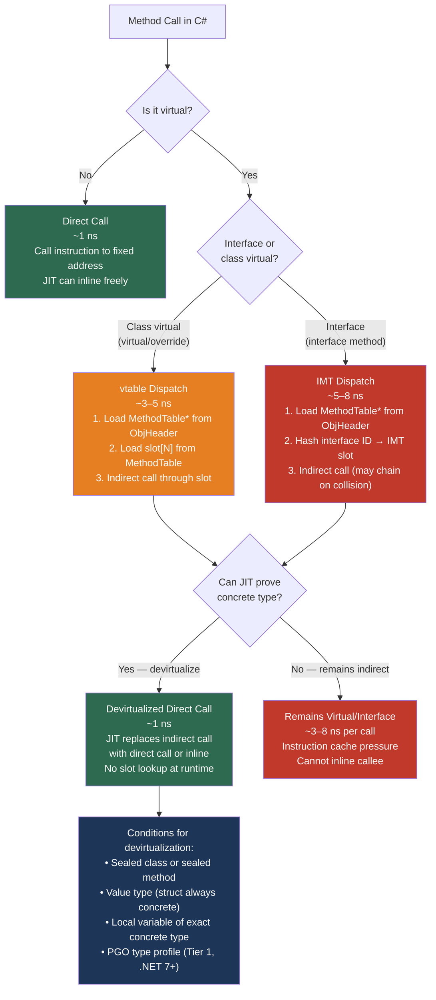

> [!success] Mastery Check
> - [ ] **Studied Well**
> - [ ] **Can explain the concept without notes**
> - [ ] **Can answer interview questions confidently**
> - [ ] **Can implement it in a real project**


## 📍 PART 0 — Navigation & Context

### Where This Topic Lives

```
C# Runtime Model
└── CLR Object Model
    ├──   Value Types vs Reference Types (2.16)      ← object header lives here
    ├──   Inheritance & Polymorphism (2.10)           ← language-level prerequisite
    ├──   Interfaces and Abstract Classes (2.11)      ← IMT dispatch builds on this
    ├── ► Virtual Dispatch & the CLR Object Model (2.37) ← YOU ARE HERE
    ├──   Collections: Internals (2.34)               ← benefits from vtable knowledge
    └──   Tiered Compilation, JIT & PGO (2.49)        ← devirtualization lives there
```

### What You Need Before This
- `2.10 — Inheritance, Polymorphism, and the Object Hierarchy` — virtual/override/sealed language semantics
- `2.11 — Interfaces and Abstract Classes` — interface declaration and implementation model
- `2.16 — Value Types vs Reference Types` — object header concept, stack vs heap allocation

### What This Unlocks After
- `2.49 — Tiered Compilation, JIT Internals, and PGO` — PGO devirtualization requires understanding what virtual call sites look like
- `2.34 — Collections: Internals and Selection Guide` — understanding why `IEnumerable<T>` dispatch in LINQ is more expensive than concrete-type iteration
- `2.41 — Performance: Zero-Allocation Patterns` — sealed types and devirtualization are key zero-cost abstractions
- `2.11 — Interfaces and Abstract Classes` — re-read it after this note: IMT dispatch will completely change how you think about interface design

### Why This Topic Matters at Scale

Every virtual call in a hot path is a potential ~3–8 ns overhead plus an instruction cache miss — and at one million calls per second, that overhead is the difference between a service running on one core and needing four. Knowing when the JIT will devirtualize a call, and how to design types to invite that optimization, is the skill that separates engineers who write fast polymorphic code from those who benchmark first and discover the problem in production.

---

## 🧠 PART 1 — The Core Mental Model

### The Fundamental Rule

> **Every reference-type object on the CLR heap begins with a method table pointer. A virtual call follows that pointer, loads a slot from the method table, and makes an indirect call through it. The practical consequence is that virtual dispatch costs ~3–5 ns and prevents inlining — unless the JIT can prove the concrete type at compile time, in which case it eliminates the indirection entirely.**

### The Plain-Language Analogy

Imagine every document in a large legal firm has a cover sheet stapled to it. The cover sheet lists the firm's procedures — which lawyer handles disputes, which paralegal files motions. When you need to take an action on a document, you look at the cover sheet, find the right person, and forward the work to them. That cover sheet is the method table. The document itself is the object on the heap. Looking up the cover sheet and forwarding the work is virtual dispatch.

Now imagine you know for certain that this specific document type always goes to the same lawyer — maybe it's the only kind of document that lawyer ever handles, and you can prove that from context. You stop looking at the cover sheet entirely and hand the work directly to that lawyer. That is devirtualization. The JIT performs this optimization whenever it can prove the concrete type, cutting the cover-sheet lookup out of the hot path entirely.

The key runtime detail: both the document (the object) and the cover-sheet reference (the method table pointer) are on the heap. There is no part of this that lives on the stack — only the local variable holding the reference to the document lives on the stack.

### The Dispatch Taxonomy



---

## 🔬 PART 2 — Deep Mechanics

### 2.1 The CLR Object Header — What Every Heap Object Looks Like

Every managed reference-type object on the heap has a fixed-size header before its field data. Understanding this layout is the foundation of everything else in this note.

```
CLR Object Layout (x64, .NET 8)
━━━━━━━━━━━━━━━━━━━━━━━━━━━━━━━━━━━━━━━━━━━━━━━━━━━━━━━━━━━━

EXAMPLE: class OrderProcessor { decimal Total; int ItemCount; }

Address layout in memory:
┌─────────────────────────────────────┐
│ Offset -8: Sync Block Index         │  8 bytes
│   Used by:                          │  - lock() keyword (thin lock)
│   - Monitor.Enter / lock            │  - GetHashCode (if no override)
│   - Interop COM object identity     │  - hash code cache slot
│   Initially: 0 (no lock, no hash)   │
├─────────────────────────────────────┤
│ Offset 0: MethodTable* (TypeHandle) │  8 bytes  ← the "type pointer"
│   Points to the MethodTable for     │  This is what GetType() returns
│   OrderProcessor in memory          │  This is how virtual dispatch works
│   Shared by ALL instances of the    │  One MethodTable per type (not per obj)
│   same type                         │
├─────────────────────────────────────┤
│ Offset 8: decimal Total             │  16 bytes  (decimal is 16 bytes)
├─────────────────────────────────────┤
│ Offset 24: int ItemCount            │  4 bytes
├─────────────────────────────────────┤
│ Offset 28: (padding to 8-byte align)│  4 bytes
└─────────────────────────────────────┘
Total object size: 40 bytes (8 sync + 8 typeptr + 16 + 4 + 4 padding)

MINIMUM OBJECT SIZE: 24 bytes (even an empty class allocates 24 bytes)
  • 8 bytes sync block
  • 8 bytes MethodTable pointer
  • 8 bytes minimum object data (CLR requires at least 1 reference-sized slot)

KEY: The MethodTable pointer at offset 0 is what the GC uses to know how
to scan the object, what the object IS, and how to dispatch virtual calls.
```

### 2.2 The MethodTable — What It Contains and How Virtual Dispatch Works

The `MethodTable` is a per-type CLR data structure allocated once per loaded type. It is not per-instance — all 10,000 `OrderProcessor` objects share a single `MethodTable`.

```
MethodTable layout (simplified, .NET 8 x64)
━━━━━━━━━━━━━━━━━━━━━━━━━━━━━━━━━━━━━━━━━━━━━━━━━━━━━━━━━━━━

MethodTable for OrderProcessor (inherits from ProcessorBase, implements IProcessor)

┌──────────────────────────────────────────────┐
│ Flags (IsInterface, IsValueType, HasFinalizer │  8 bytes
│        IsSealed, ComponentSize, etc.)         │
├──────────────────────────────────────────────┤
│ BaseSize        = 40                         │  4 bytes  (instance size)
├──────────────────────────────────────────────┤
│ ParentMethodTable*  → ProcessorBase's MT     │  8 bytes  (inheritance chain)
├──────────────────────────────────────────────┤
│ InterfaceMap    → [IProcessor, IDisposable]  │  8 bytes  (IMT pointer)
├──────────────────────────────────────────────┤
│ GC Descriptor   (which fields are refs)       │  variable
├──────────────────────────────────────────────┤
│ VTABLE SLOTS (inherited + new virtual methods)│
│ slot[0] → &Object.ToString()        (or override)  │  8 bytes each
│ slot[1] → &Object.Equals()          (or override)  │
│ slot[2] → &Object.GetHashCode()     (or override)  │
│ slot[3] → &ProcessorBase.Process()  (or override)  │
│ slot[4] → &OrderProcessor.Submit()  (virtual)      │
└──────────────────────────────────────────────┘

HOW A VIRTUAL CALL EXECUTES:
  // C#:  processor.Process();  where processor is ProcessorBase typed
  // IL:
  ldarg.0          // push 'processor' reference onto eval stack
  callvirt instance void ProcessorBase::Process()

  // JIT generates machine code (x64):
  mov  rax, [rcx]           // load MethodTable* from object at rcx (offset 0)
  mov  rax, [rax + 0x40]    // load slot[3] from MethodTable (0x40 = offset of Process slot)
  call rax                  // indirect call through the slot

  COST: 3 instructions + 2 memory loads + 1 indirect call branch
        ~3–5 ns when MethodTable is in L1 cache
        ~20–50 ns on cache miss (MethodTable evicted from cache)
```

> [!IMPORTANT] The Cache Miss Reality
> The 3–5 ns virtual call cost assumes the MethodTable is in CPU L1 cache. In production, when your code calls virtual methods on many *different* types in sequence (a polymorphic collection), each unique type's MethodTable may be in L2 or L3 cache or RAM — pushing the cost to 20–50 ns per call. This is the **megamorphic call site** problem, and it is the real performance tax of runtime polymorphism.

### 2.3 Interface Method Table (IMT) Dispatch — Why Interfaces Cost More

Interface dispatch is fundamentally different from virtual dispatch. The CLR must resolve *which* implementation of the interface corresponds to the calling object's concrete type, and it does so through a hash-table mechanism rather than a fixed slot offset.

```
INTERFACE DISPATCH MECHANISM
━━━━━━━━━━━━━━━━━━━━━━━━━━━━━━━━━━━━━━━━━━━━━━━━━━━━━━━━━━━━

Problem: The same interface (IProcessor) can be implemented by
         OrderProcessor, InvoiceProcessor, and RefundProcessor.
         Each has methods at DIFFERENT vtable slot offsets.
         A call through IProcessor cannot use a fixed slot offset.

CLR Solution: Interface Method Table (IMT)
  • Each MethodTable contains a fixed-size IMT of 19 slots (hash buckets)
  • Interface method tokens are hashed to a bucket
  • Each bucket contains a stub (direct pointer, or a dispatch chain on collision)

DISPATCH SEQUENCE for IProcessor.Process() call:

  IProcessor iface = GetProcessor(orderId);  // concrete type unknown at call site
  iface.Process();

  JIT generates:
  mov rax, [rcx]                // load MethodTable* from object header
  mov rbx, [rax + IMT_offset]   // load IMT pointer from MethodTable
  mov rax, [rbx + hash * 8]     // load IMT slot by hashing IProcessor.Process token
  // slot may contain:
  //   a) direct method pointer  → call [rax]     (no collision: ~5 ns)
  //   b) dispatch stub pointer  → jmp to stub which walks a chain (~8+ ns on collision)
  call rax

MONOMORPHIC vs POLYMORPHIC call sites:
  Monomorphic: call site always sees same concrete type
    → JIT / PGO installs a type check + direct call guard:
      if (type == OrderProcessor) goto direct_call; else goto slow_path;
    → ~1–2 ns (essentially a direct call with one branch)

  Megamorphic: call site sees many different concrete types
    → Falls back to full IMT hash lookup every call
    → ~8–15 ns + cache pressure

  This is why iterating a heterogeneous IEnumerable<IProcessor> is slower
  than iterating a List<OrderProcessor> — the concrete list uses vtable
  (monomorphic), while the interface enumeration hits IMT (polymorphic).
```

### 2.4 Devirtualization — When the JIT Eliminates the Indirect Call

Devirtualization is the JIT's most impactful optimization for object-oriented code. It turns a 3–8 ns indirect call into a 1 ns direct call, and more importantly, it **enables inlining** — which can eliminate the call overhead entirely.

```
CONDITIONS FOR JIT DEVIRTUALIZATION:
━━━━━━━━━━━━━━━━━━━━━━━━━━━━━━━━━━━━━━━━━━━━━━━━━━━━━━━━━━━━

1. SEALED CLASS — the type cannot have subclasses, so the virtual slot
   can only ever point to this type's implementation:

   sealed class FraudDetector : IPaymentValidator
   {
       public bool Validate(PaymentRequest r) => ...
   }

   FraudDetector detector = new FraudDetector();
   detector.Validate(request);  // ← JIT devirtualizes: no slot lookup

2. SEALED METHOD — the method cannot be overridden further, even if
   the class is not sealed (C# 9+):

   class OrderValidator : IValidator
   {
       public sealed override bool Validate(Order o) => ...  // no further override
   }

3. LOCAL CONCRETE TYPE — the JIT can see the exact construction site:

   // C#:
   var processor = new OrderProcessor();   // JIT KNOWS the type is OrderProcessor
   processor.Process();                    // devirtualizes

   // vs:
   IProcessor processor = GetProcessor(); // JIT does NOT know the concrete type
   processor.Process();                   // cannot devirtualize without PGO

4. VALUE TYPES — structs are always concrete (cannot be subclassed):

   struct InvoiceCalculator : ICalculator
   {
       public decimal Calculate(Invoice inv) => ...
   }
   InvoiceCalculator calc = new();
   calc.Calculate(invoice);  // ALWAYS devirtualized — structs cannot be subclassed

   // BUT: (ICalculator)calc causes boxing and loses the devirtualization benefit

5. PGO (Profile-Guided Optimization, .NET 7+ Tier 1):
   // After ~30 calls, JIT profiles which concrete type appears most often:

   // Generates approximate:
   if (processor.GetType() == typeof(OrderProcessor))
       ((OrderProcessor)processor).Process_direct();  // devirtualized fast path
   else
       processor.MethodTable[slot]();                 // full dispatch slow path

   This makes "mostly OrderProcessor" call sites nearly free.
```

**IL showing what the compiler emits for virtual vs devirtualized:**

```
// C#: virtualProcessor.Process();  (typed as ProcessorBase)
// IL: callvirt — always goes through dispatch
IL_0005: callvirt  instance void ProcessorBase::Process()

// C#: concreteProcessor.Process();  (typed as sealed OrderProcessor)
// IL: still callvirt syntactically — but JIT replaces it with direct call
IL_0005: callvirt  instance void OrderProcessor::Process()
// JIT sees OrderProcessor is sealed → emits: call OrderProcessor::Process()
// The callvirt in IL becomes a call in JIT output — this is devirtualization.
```

> [!WARNING] IL always emits `callvirt` for instance methods — even non-virtual ones, for null checking. Devirtualization is a JIT-level transform, invisible in IL. You cannot see it by reading IL; you must read the JIT disassembly (use BenchmarkDotNet's `[DisassemblyDiagnoser]`).

### 2.5 `typeof()` vs `GetType()` — What the CLR Actually Does

These look similar but have entirely different runtime costs and semantics.

```
typeof(OrderProcessor)
  Cost: ZERO at runtime — entirely resolved at JIT compile time
  Returns: The RuntimeTypeHandle baked into the JIT output as a constant
  IL: ldtoken OrderProcessor
      call Type Type::GetTypeFromHandle(RuntimeTypeHandle)
  JIT output: mov rax, [type_constant_address]   ← single load, no object traversal

GetType() call on an instance:
  Cost: ~1–2 ns — loads MethodTable* from the object header
  Returns: A Type object wrapping the MethodTable*
  IL: callvirt instance class [mscorlib]System.Type object::GetType()
  JIT output:
    mov rax, [rcx]           // load MethodTable* from object (offset 0)
    // returns a Type wrapper around that MethodTable*

// Practical difference:
Type t1 = typeof(OrderProcessor);    // compile-time constant: zero runtime cost
Type t2 = processor.GetType();       // runtime lookup: ~1–2 ns

// In type comparisons:
if (processor.GetType() == typeof(OrderProcessor))   // runtime + compile-time
if (processor is OrderProcessor)                      // same cost as above
                                                      // 'is' also uses MethodTable*

// The is-check vs GetType() comparison:
// is: uses isinst IL instruction → single MethodTable* comparison → ~1–2 ns
// GetType() == typeof(): equivalent cost, but GetType() allocates a Type object
// on the heap if not cached (the CLR caches Type objects, so usually no alloc)
```

### 2.6 The Fragile Base Class Problem — Runtime Behavior That Surprises Engineers

When a base class changes its virtual method structure — adding, removing, or reordering virtual methods — derived classes compiled against the old base can break at runtime in non-obvious ways.

```
SCENARIO: ShippingProvider in a shared library
━━━━━━━━━━━━━━━━━━━━━━━━━━━━━━━━━━━━━━━━━━━━━━━━━━━━━━━━━━━━

v1.0 of shared library:
class ShippingProvider
{
    public virtual decimal GetRate(Address from, Address to) { ... }  // slot[3]
    public virtual TimeSpan GetETA(Address to)               { ... }  // slot[4]
}

Your derived class compiled against v1.0:
class FedExProvider : ShippingProvider
{
    public override decimal GetRate(Address from, Address to) { ... }  // overrides slot[3]
    public override TimeSpan GetETA(Address to)               { ... }  // overrides slot[4]
}

v1.1 of shared library (adds a new method BEFORE GetRate in the vtable):
class ShippingProvider
{
    public virtual void ValidateAddress(Address a) { ... }  // NOW slot[3]
    public virtual decimal GetRate(...)             { ... }  // NOW slot[4]  ← SHIFTED
    public virtual TimeSpan GetETA(...)             { ... }  // NOW slot[5]  ← SHIFTED
}

YOUR DERIVED CLASS WAS NOT RECOMPILED.
At runtime, FedExProvider's vtable slots are still patched at slot[3] and slot[4].
The CLR will call FedExProvider.GetRate() when the caller asks for ValidateAddress.
The vtable is mis-aligned. In the best case: MissingMethodException.
In the worst case: the wrong method runs silently.

PROTECTION:
  • Recompile all derived assemblies when the base changes
  • Use interface segregation: depend on interfaces, not base classes
  • Seal stable leaf classes so vtable structure cannot be inherited
  • Design base classes to add new virtual methods ONLY at the END of the table
```

---

## 💻 PART 3 — Production Code Patterns

### 3.1 The Sealed Leaf Optimization — Inviting Devirtualization

The single most impactful thing you can do for virtual dispatch performance is `seal` types that are not designed for further subclassing. It costs nothing in expressiveness when the type is already a leaf, and it enables devirtualization throughout all call sites.

```csharp
// ⚠️ WRONG: Open type — JIT cannot devirtualize, forces full vtable dispatch
// on every call to ProcessPayment wherever the variable is typed PaymentProcessor
public class PaymentProcessor : IPaymentHandler
{
    public virtual decimal CalculateFee(decimal amount) => amount * 0.029m + 0.30m;
    public virtual bool Authorize(PaymentRequest request) => _gateway.Authorize(request);
}

// ✅ CORRECT: Sealed — JIT can devirtualize all calls where the concrete type is known
// Zero performance difference for callers holding IPaymentHandler references,
// but calls where the variable is typed PaymentProcessor become direct calls.
public sealed class PaymentProcessor : IPaymentHandler
{
    // sealed class: these methods CANNOT be overridden further
    // JIT sees: "only one possible implementation" → devirtualizes
    public decimal CalculateFee(decimal amount) => amount * 0.029m + 0.30m;
    public bool Authorize(PaymentRequest request) => _gateway.Authorize(request);
}

// Alternatively, seal individual methods in a non-sealed class hierarchy:
public class OrderValidator : IValidator
{
    // Derived classes can still extend OrderValidator, but CANNOT override
    // ValidateLineItems — JIT devirtualizes calls through OrderValidator-typed variables
    public sealed override bool ValidateLineItems(IReadOnlyList<LineItem> items)
    {
        return items.All(item => item.Quantity > 0 && item.UnitPrice >= 0);
    }

    // This remains polymorphic — derived classes CAN override it
    public virtual bool ValidateShippingAddress(Address address) => address.IsValid();
}
```

### 3.2 The Struct-Based Strategy Pattern — Zero-Cost Abstraction

When a strategy is used uniformly (always the same concrete type in a given context), a generic struct-based strategy eliminates virtual dispatch entirely while keeping the calling code polymorphic-looking.

```csharp
// ⚠️ WRONG: Interface-based strategy — virtual/IMT dispatch on every call
// In a hot loop processing 100k invoices, this means 100k IMT dispatches
public class InvoiceTaxCalculator
{
    private readonly ITaxStrategy _strategy;

    public InvoiceTaxCalculator(ITaxStrategy strategy) { _strategy = strategy; }

    public decimal CalculateTotal(IReadOnlyList<InvoiceLineItem> items)
    {
        decimal subtotal = 0;
        foreach (var item in items)
            subtotal += item.UnitPrice * item.Quantity;

        return subtotal + _strategy.CalculateTax(subtotal);  // IMT dispatch each call
    }
}

// ✅ CORRECT: Generic struct strategy — JIT specializes for each TStrategy,
// inlines CalculateTax if it fits, zero virtual dispatch
public interface ITaxStrategy
{
    decimal CalculateTax(decimal amount);
}

public readonly struct USTaxStrategy : ITaxStrategy
{
    private readonly decimal _rate;
    public USTaxStrategy(decimal rate) { _rate = rate; }
    public decimal CalculateTax(decimal amount) => amount * _rate;
}

public readonly struct EUVATStrategy : ITaxStrategy
{
    private readonly decimal _vatRate;
    public EUVATStrategy(decimal vatRate) { _vatRate = vatRate; }
    public decimal CalculateTax(decimal amount) => amount * _vatRate;
}

// Generic constraint: TStrategy is a value type implementing ITaxStrategy
// JIT generates ONE version per TStrategy — fully specialized, no boxing, no dispatch
public static class InvoiceTaxCalculator<TStrategy>
    where TStrategy : struct, ITaxStrategy
{
    public static decimal CalculateTotal(
        IReadOnlyList<InvoiceLineItem> items,
        TStrategy strategy)     // passed by value — no heap allocation
    {
        decimal subtotal = 0;
        foreach (var item in items)
            subtotal += item.UnitPrice * item.Quantity;

        // JIT inlines this because TStrategy is concrete — ZERO call overhead
        return subtotal + strategy.CalculateTax(subtotal);
    }
}

// Usage: each call site is compiled with its own JIT-specialized version
decimal total = InvoiceTaxCalculator<USTaxStrategy>.CalculateTotal(
    invoice.LineItems,
    new USTaxStrategy(rate: 0.0875m));
```

### 3.3 The Type-Check Anti-Pattern vs Proper Polymorphism

Using `GetType()` or a chain of `is` checks inside a method is the fragile base class problem in application code. It breaks Open/Closed Principle and forces callers to know about all concrete types.

```csharp
// ⚠️ WRONG: Manual dispatch — every new notification type requires editing this method
// The vtable dispatch that the CLR was built for is being thrown away and replaced
// with a slower, less maintainable manual dispatch table
public static void SendNotification(INotification notification)
{
    if (notification is EmailNotification email)
    {
        _emailService.Send(email.To, email.Subject, email.Body);
    }
    else if (notification is SmsNotification sms)
    {
        _smsService.Send(sms.PhoneNumber, sms.Message);
    }
    else if (notification is PushNotification push)
    {
        _pushService.Send(push.DeviceToken, push.Payload);
    }
    // Adding SlackNotification requires editing this method — fragile
}

// ✅ CORRECT: Let the vtable do its job
// Each concrete type knows how to deliver itself — one method, no chains
public interface INotification
{
    Task DeliverAsync(INotificationServices services, CancellationToken ct);
}

public sealed class EmailNotification : INotification
{
    public string To      { get; init; } = string.Empty;
    public string Subject { get; init; } = string.Empty;
    public string Body    { get; init; } = string.Empty;

    // The notification knows how to deliver itself — vtable dispatch handles routing
    public Task DeliverAsync(INotificationServices services, CancellationToken ct)
        => services.Email.SendAsync(To, Subject, Body, ct);
}

public sealed class SmsNotification : INotification
{
    public string PhoneNumber { get; init; } = string.Empty;
    public string Message     { get; init; } = string.Empty;

    public Task DeliverAsync(INotificationServices services, CancellationToken ct)
        => services.Sms.SendAsync(PhoneNumber, Message, ct);
}

// Caller: adding SlackNotification requires ZERO changes here
public static Task SendNotificationAsync(
    INotification notification,
    INotificationServices services,
    CancellationToken ct)
    => notification.DeliverAsync(services, ct);  // vtable dispatch — no type checks
```

### 3.4 The Monomorphic Call Site — Designing for Inline Caches

Modern CPUs and JITs maintain per-call-site type profiles. A call site that always sees the same concrete type is monomorphic and gets an optimized fast path. A call site that sees many types (megamorphic) loses that optimization. Design APIs to concentrate concrete types at call sites.

```csharp
// ⚠️ WRONG: Same call site receives dozens of different IOrderHandler types
// This call site becomes megamorphic — JIT/CPU inline cache overflows
// The full IMT lookup fires on every call in this loop
public async Task ProcessOrderQueueAsync(
    IReadOnlyList<IOrderHandler> handlers,  // heterogeneous mix of concrete types
    IReadOnlyList<Order> orders,
    CancellationToken ct)
{
    foreach (var order in orders)
    {
        var handler = handlers[order.HandlerIndex];
        await handler.HandleAsync(order, ct);  // megamorphic — many concrete types
    }
}

// ✅ CORRECT: Group by handler type before processing
// Each inner loop is monomorphic — always the same concrete type
// JIT devirtualizes or PGO guards each inner loop independently
public async Task ProcessOrderQueueAsync(
    IReadOnlyList<Order> orders,
    CancellationToken ct)
{
    // Group orders by their handler type so each processing loop sees one type
    // groupBy is O(n) upfront but the inner loops are monomorphic
    var byHandler = orders
        .GroupBy(o => o.HandlerType)
        .ToDictionary(g => g.Key, g => g.ToList());

    foreach (var (handlerType, handlerOrders) in byHandler)
    {
        var handler = _handlerRegistry.Get(handlerType);
        foreach (var order in handlerOrders)
            await handler.HandleAsync(order, ct);  // monomorphic within this loop
    }
}
```

### 3.5 The Abstract Base Class Slot Reservation Pattern

When designing extensible base classes for public APIs, reserve virtual slots deliberately at the END of the vtable to avoid the fragile base class problem.

```csharp
// ✅ CORRECT: Public base class designed for long-term extension
// New virtual methods are added ONLY at the end, preserving existing slot assignments
// for derived classes compiled against earlier versions of the library
public abstract class ReportGenerator
{
    // VTABLE SLOT ORDER — do not change the order of virtual methods.
    // Derived classes compiled against earlier versions of this library
    // have their override slots patched in by the CLR at load time.
    // Adding a method in the MIDDLE shifts all subsequent slot indices.

    // slot[3]: Core generation — v1.0
    public abstract string GenerateReport(ReportRequest request);

    // slot[4]: Optional header — v1.0
    public virtual string GenerateHeader(ReportRequest request)
        => $"Report: {request.Title} — {DateTime.UtcNow:u}";

    // slot[5]: Optional footer — v1.0
    public virtual string GenerateFooter(ReportRequest request)
        => "Generated by ReportGenerator v1";

    // NEW IN v1.1: Added at END to avoid slot shifting
    // slot[6]: Optional summary — v1.1
    // Derived classes compiled against v1.0 will get this base implementation
    // because they don't know about this slot — CLR fills it from the base.
    public virtual ReportSummary GenerateSummary(ReportRequest request)
        => new ReportSummary { PageCount = 1 };

    // NEVER insert a new virtual method between existing ones in a shipped API.
    // seal this class if it is NOT intended as a public extension point.
}
```

### 3.6 Covariant Return Types — Using Polymorphism for Builder Chains

C# 9 covariant return types let derived class overrides return more specific types, enabling fluent APIs without repeated casting.

```csharp
// ⚠️ WRONG: Base returns base type — callers must cast after calling derived methods
public class InvoiceBuilder
{
    protected Invoice _invoice = new();

    public virtual InvoiceBuilder WithCustomer(string customerId)
    {
        _invoice = _invoice with { CustomerId = customerId };
        return this;
    }
}

public class InternationalInvoiceBuilder : InvoiceBuilder
{
    public InternationalInvoiceBuilder WithVatNumber(string vatNumber)
    {
        _invoice = _invoice with { VatNumber = vatNumber };
        return this;
    }
}

// Caller must cast — ugly and breaks fluent chaining
var invoice = ((InternationalInvoiceBuilder)builder
    .WithCustomer("CUST-001"))     // returns InvoiceBuilder
    .WithVatNumber("GB123456789"); // ← only accessible after cast

// ✅ CORRECT: Covariant return type — override returns the MORE DERIVED type
// The vtable slot holds a pointer to a method with a different return type signature,
// but the CLR allows this because the derived return type IS-A the base return type
public class InvoiceBuilder
{
    protected Invoice _invoice = new();

    // The vtable slot for this method is shared — derived class override
    // returns InternationalInvoiceBuilder, which is-a InvoiceBuilder
    public virtual InvoiceBuilder WithCustomer(string customerId)
    {
        _invoice = _invoice with { CustomerId = customerId };
        return this;
    }
}

public sealed class InternationalInvoiceBuilder : InvoiceBuilder
{
    // Covariant return: returns InternationalInvoiceBuilder instead of InvoiceBuilder
    // CLR vtable stores this override — callers typed as base get InvoiceBuilder back;
    // callers typed as InternationalInvoiceBuilder get InternationalInvoiceBuilder back
    public override InternationalInvoiceBuilder WithCustomer(string customerId)
    {
        _invoice = _invoice with { CustomerId = customerId };
        return this;  // return this (concrete type) — no cast needed
    }

    public InternationalInvoiceBuilder WithVatNumber(string vatNumber)
    {
        _invoice = _invoice with { VatNumber = vatNumber };
        return this;
    }
}

// Fluent chaining without casting:
InternationalInvoiceBuilder builder = new();
var invoice = builder
    .WithCustomer("CUST-001")      // returns InternationalInvoiceBuilder
    .WithVatNumber("GB123456789")  // fluently chained — no cast
    .Build();
```

### 3.7 The `new` Keyword as Hiding vs `override` — Dispatch Differences

Method hiding (`new`) is one of the most misunderstood features in C#. It creates a SEPARATE slot in the vtable rather than filling the base class slot, with radically different dispatch behavior.

```csharp
public class InvoiceProcessor
{
    public virtual string GetStatus() => "Base: Processing";
}

// ⚠️ WRONG INTENT: new keyword hides — doesn't override the vtable slot
// A developer intended to override but forgot 'override', or saw a warning and
// silenced it by adding 'new' without understanding the consequence
public class PriorityInvoiceProcessor : InvoiceProcessor
{
    public new string GetStatus() => "Priority: Fast-track";
    // This creates a NEW slot in PriorityInvoiceProcessor's vtable
    // The base class vtable slot still points to InvoiceProcessor.GetStatus
}

// The hidden dispatch trap:
InvoiceProcessor     p1 = new PriorityInvoiceProcessor();
PriorityInvoiceProcessor p2 = new PriorityInvoiceProcessor();

Console.WriteLine(p1.GetStatus());  // "Base: Processing"
// ← Dispatch goes through InvoiceProcessor's vtable slot
// PriorityInvoiceProcessor.GetStatus (the 'new' one) is NEVER consulted
// because p1 is typed as InvoiceProcessor

Console.WriteLine(p2.GetStatus());  // "Priority: Fast-track"
// ← Variable is typed as PriorityInvoiceProcessor
// The NEW slot is used because the compiler uses the declared type for 'new' dispatch

// ✅ CORRECT: override fills the base class vtable slot
public class PriorityInvoiceProcessor : InvoiceProcessor
{
    public override string GetStatus() => "Priority: Fast-track";
    // The BASE CLASS vtable slot now points to this implementation
    // ALL callers — regardless of which type the variable is declared as — get this
}

// With override:
InvoiceProcessor     p1 = new PriorityInvoiceProcessor();
PriorityInvoiceProcessor p2 = new PriorityInvoiceProcessor();

Console.WriteLine(p1.GetStatus());  // "Priority: Fast-track" — override works correctly
Console.WriteLine(p2.GetStatus());  // "Priority: Fast-track"
```

---

## ⚠️ PART 4 — Gotchas & Anti-Patterns

### Gotcha 1: Sealing Only the Class But Not Noticing Inherited Non-Sealed Virtuals

Engineers `seal` a class expecting all virtual dispatch to be eliminated, but the class inherits virtual methods from a non-sealed base class. Calls through base-type variables still do full vtable dispatch because the JIT sees the declared type as the base, not the sealed derived class.

```csharp
// ⚠️ WRONG: sealed class, but calls through ProcessorBase still dispatch virtually
public class ProcessorBase
{
    public virtual void Process(Order order) { ... }  // vtable slot in ProcessorBase
}

public sealed class OrderProcessor : ProcessorBase
{
    public override void Process(Order order) { ... }  // overrides the slot
}

// Call site typed as ProcessorBase — JIT doesn't see sealed:
ProcessorBase processor = new OrderProcessor();
processor.Process(order);   // FULL VIRTUAL DISPATCH — ProcessorBase's vtable slot

// The JIT sees "ProcessorBase" as the declared type. It doesn't follow
// the object to discover it's actually an OrderProcessor at this call site.
// PGO can devirtualize this after profiling. Manually: use the concrete type.

// ✅ CORRECT: Declare the variable as the sealed concrete type
OrderProcessor processor = new OrderProcessor();
processor.Process(order);   // DEVIRTUALIZED — JIT knows OrderProcessor is sealed
```

```csharp
// WHY: Devirtualization from sealed requires the JIT to see the SEALED TYPE at the call site.
// A base-typed variable hides the sealed information from the JIT's type analysis.
// Either use the concrete type, or rely on PGO (Tier 1) to devirtualize after profiling.
```

### Gotcha 2: Struct Implementing an Interface Used Polymorphically Causes Boxing

Structs are always concrete — virtual dispatch on a struct-typed variable is always devirtualized. But the moment you assign a struct to an interface variable, it boxes, and all subsequent dispatch goes through the boxed heap object.

```csharp
// ⚠️ WRONG: Struct boxed when assigned to interface variable
// All the zero-dispatch benefit of the struct is lost after this line
public readonly struct ShippingCalculator : ICalculator
{
    private readonly decimal _ratePerKg;
    public ShippingCalculator(decimal rate) { _ratePerKg = rate; }
    public decimal Calculate(decimal weightKg) => weightKg * _ratePerKg;
}

ICalculator calc = new ShippingCalculator(5.50m);  // BOXING: heap allocation
decimal cost = calc.Calculate(10.0m);              // IMT dispatch on boxed object
                                                   // NO benefit from struct at all

// ✅ CORRECT: Use the concrete struct type at call sites that care about performance
ShippingCalculator calc = new ShippingCalculator(5.50m);  // stack allocation
decimal cost = calc.Calculate(10.0m);  // DEVIRTUALIZED and potentially inlined

// OR: use generic constraints to preserve struct optimization
public static decimal ComputeShipping<TCalc>(TCalc calc, decimal weight)
    where TCalc : struct, ICalculator
{
    return calc.Calculate(weight);  // JIT generates specialized code: no boxing, no dispatch
}
```

```csharp
// WHY: Interface variable assignment of a struct triggers boxing (Part 2.4 in 2.16).
// The boxed heap object is a reference type and goes through full IMT dispatch.
// To preserve the performance of a struct behind an interface, use generic constraints
// with 'where T : struct, IInterface' — the JIT generates one specialization per
// struct type and devirtualizes within each specialization.
```

### Gotcha 3: `new` Method Hiding Creating Silent Behavioral Divergence at Runtime

A derived class method marked `new` (hiding) instead of `override` causes the SAME OBJECT to behave differently depending solely on which declared type the variable holding it uses. This is one of the most disorienting bugs in production object-oriented C#.

```csharp
public class TaxCalculator
{
    public virtual decimal GetRate(string region) => 0.10m;
}

// ⚠️ WRONG: Developer uses 'new' because they got a "use override or new" warning
// and chose 'new' without understanding dispatch semantics
public class RegionalTaxCalculator : TaxCalculator
{
    public new decimal GetRate(string region) =>
        region == "EU" ? 0.20m : 0.10m;  // HIDES base, does NOT override
}

// Silent divergence in the same method call on the same object:
RegionalTaxCalculator regional = new RegionalTaxCalculator();
TaxCalculator         generic  = regional;  // same object, different declared type

decimal rate1 = regional.GetRate("EU");  // 0.20m — uses hidden 'new' method
decimal rate2 = generic.GetRate("EU");   // 0.10m — uses BASE vtable slot!
// rate1 != rate2 for the SAME OBJECT. This breaks every substitution assumption.

// ✅ CORRECT: Use override — fills the base vtable slot
public class RegionalTaxCalculator : TaxCalculator
{
    public override decimal GetRate(string region) =>
        region == "EU" ? 0.20m : 0.10m;
}
// Now regional.GetRate("EU") and ((TaxCalculator)regional).GetRate("EU") both return 0.20m
```

```csharp
// WHY: 'new' creates a new vtable slot in the derived type's MethodTable.
// When the variable is declared as the base type, the CLR uses the BASE type's vtable,
// which still contains the base implementation. The derived 'new' slot is unreachable
// from a base-typed reference. Liskov Substitutability Principle is violated.
```

### Gotcha 4: `GetType()` Comparison Breaks Against Subclasses Where `is` Would Not

Engineers use `GetType() == typeof(T)` when they mean `is T`, causing code that silently stops working when a subclass is introduced.

```csharp
public class PaymentEvent { }
public class RecurringPaymentEvent : PaymentEvent { }

// ⚠️ WRONG: GetType() equality fails for subclasses
// This is correct only if the exact type — not a subtype — is intended
public static bool IsPaymentEvent(object obj)
{
    return obj.GetType() == typeof(PaymentEvent);
    // Returns FALSE for RecurringPaymentEvent, even though it IS-A PaymentEvent
    // Adding a new payment event subtype silently breaks all code using this check
}

// ✅ CORRECT: Use 'is' for polymorphic type checks (works for subtypes)
public static bool IsPaymentEvent(object obj)
{
    return obj is PaymentEvent;
    // Returns TRUE for both PaymentEvent and RecurringPaymentEvent
    // Works correctly as the inheritance hierarchy grows
}

// WHEN GetType() == typeof(T) IS correct:
// When you specifically want exact-type semantics — e.g. event routing that must NOT
// match subtypes, or serialization where the exact discriminator matters:
public static string GetDiscriminator(PaymentEvent evt)
{
    return evt.GetType().Name;  // CORRECT: serialization needs the exact concrete name
}
```

```csharp
// WHY: 'is' uses the 'isinst' IL instruction which checks the type hierarchy
// (is TPaymentEvent a subtype of PaymentEvent?) — returns true for any match.
// GetType() == typeof(T) performs REFERENCE EQUALITY on two MethodTable-based
// Type objects — it is strict exact-type matching, not hierarchy matching.
// They have different and specific use cases; using the wrong one is a frequent
// substitution-assumption violation.
```

### Gotcha 5: Abstract Class Adding a New Abstract Method Breaks All Existing Concrete Subclasses

Adding an `abstract` method to an existing abstract base class is a binary-breaking change. All concrete derived classes that were compiled against the old version will throw `TypeLoadException` at runtime because they have an unimplemented abstract slot in their vtable.

```csharp
// v1.0 of shared domain library:
public abstract class DocumentProcessor
{
    public abstract void Process(Document doc);
    // vtable has 1 abstract slot
}

// Your concrete class, compiled against v1.0:
public class InvoiceProcessor : DocumentProcessor
{
    public override void Process(Document doc) { ... }
    // vtable fills the 1 abstract slot correctly
}

// v1.1 of shared library — adds a new abstract method:
public abstract class DocumentProcessor
{
    public abstract void Process(Document doc);
    public abstract void Validate(Document doc);  // NEW — now 2 abstract slots
}

// AT RUNTIME (InvoiceProcessor DLL was NOT recompiled):
// CLR loads InvoiceProcessor and discovers its vtable has 1 slot filled
// but DocumentProcessor's MethodTable now has 2 abstract slots.
// CLR throws: TypeLoadException: "InvoiceProcessor does not implement abstract member Validate"
// This happens at LOAD TIME — not at the call site. The error appears far from the cause.

// ✅ CORRECT: Add new methods as virtual (with a base implementation) to avoid breaking derived classes:
public abstract class DocumentProcessor
{
    public abstract void Process(Document doc);

    // Virtual with a default body: no TypeLoadException for old derived classes
    // They inherit the default; new classes can override
    public virtual void Validate(Document doc)
    {
        // Default: no-op — does not break existing compiled subclasses
    }
}
```

```csharp
// WHY: abstract methods occupy vtable slots that MUST be filled by every concrete
// derived class at load time. The CLR validates this during type loading, not at
// the call site. Adding abstract methods to a shipped base class is semantically
// equivalent to adding a new required interface method — it breaks all existing
// compiled implementations that weren't updated. Use virtual with a default body
// instead, or introduce a new interface, to maintain binary compatibility.
```

---

## 📊 PART 5 — Performance Implications

### 5.1 Allocation Characteristics and Call Cost Table

| Scenario | Allocation Behavior | Approx Cost |
|---|---|---|
| Direct (non-virtual) method call | Zero allocation | ~1 ns |
| Virtual method call (vtable, monomorphic, in L1 cache) | Zero allocation | ~3–5 ns |
| Virtual method call (vtable, polymorphic, cache miss) | Zero allocation | ~20–50 ns |
| Interface method call (IMT, monomorphic) | Zero allocation | ~5–8 ns |
| Interface method call (IMT, megamorphic) | Zero allocation | ~8–15 ns + cache pressure |
| Devirtualized call (sealed type or PGO) | Zero allocation | ~1 ns (same as direct) |
| Inlined devirtualized call (small method, sealed) | Zero allocation | ~0 ns (eliminated) |
| `GetType()` call on an instance | No new allocation (Type object is cached) | ~1–2 ns |
| `typeof(T)` at a call site | Zero (compile-time constant) | ~0 ns |
| `obj is T` type check | Zero allocation | ~1–2 ns |
| `obj as T` cast (success) | Zero allocation | ~1–2 ns |
| `(T)obj` explicit cast (success) | Zero allocation | ~1–2 ns |
| Struct assigned to interface variable (boxing) | One heap allocation (~24+ bytes) | ~12–50 ns + GC pressure |
| New virtual method added to abstract base (first load) | One-time MethodTable setup | Negligible (startup cost) |

### 5.2 BenchmarkDotNet: Virtual vs Direct vs Devirtualized vs Interface

```csharp
// Expected output (approximate, .NET 8, x64):
// ┌──────────────────────────────────┬──────────────┬────────┬────────┐
// │ Method                           │ Mean         │ Alloc  │ Gen 0  │
// ├──────────────────────────────────┼──────────────┼────────┼────────┤
// │ DirectCall                       │  0.24 ns     │ 0 B    │ -      │
// │ SealedVirtualDevirt              │  0.25 ns     │ 0 B    │ -      │
// │ VirtualCall_Monomorphic          │  3.41 ns     │ 0 B    │ -      │
// │ InterfaceCall_Monomorphic        │  5.82 ns     │ 0 B    │ -      │
// │ VirtualCall_Polymorphic_4Types   │ 14.70 ns     │ 0 B    │ -      │
// │ InterfaceCall_Megamorphic_8Types │ 22.10 ns     │ 0 B    │ -      │
// │ StructViaInterface_Boxed         │ 48.30 ns     │ 24 B   │ 0.0005 │
// └──────────────────────────────────┴──────────────┴────────┴────────┘

[MemoryDiagnoser]
[DisassemblyDiagnoser(maxDepth: 2)]
[BenchmarkCategory("VirtualDispatch")]
public class VirtualDispatchBenchmark
{
    // Sealed concrete type — JIT can devirtualize
    private readonly OrderFeeCalculator    _sealed    = new();
    // Base type — JIT must dispatch virtually
    private readonly FeeCalculatorBase     _virtual   = new OrderFeeCalculator();
    // Interface type — JIT uses IMT dispatch
    private readonly IFeeCalculator        _interface = new OrderFeeCalculator();

    private readonly IFeeCalculator[] _polymorphicCalcs = {
        new OrderFeeCalculator(),
        new ExpressFeeCalculator(),
        new BulkFeeCalculator(),
        new InternationalFeeCalculator(),
    };

    // ── Baseline: direct static method — no dispatch at all ──
    [Benchmark(Baseline = true)]
    public decimal DirectCall()
        => FeeCalculatorStatic.Calculate(100m);

    // ── Sealed type: JIT devirtualizes — effectively direct ──
    [Benchmark]
    public decimal SealedVirtualDevirt()
        => _sealed.Calculate(100m);

    // ── Base-typed variable: full vtable dispatch ──
    [Benchmark]
    public decimal VirtualCall_Monomorphic()
        => _virtual.Calculate(100m);

    // ── Interface-typed variable: IMT dispatch ──
    [Benchmark]
    public decimal InterfaceCall_Monomorphic()
        => _interface.Calculate(100m);

    // ── 4 different concrete types at one call site: polymorphic vtable ──
    [Benchmark]
    public decimal VirtualCall_Polymorphic_4Types()
    {
        decimal total = 0;
        foreach (var calc in _polymorphicCalcs)
            total += calc.Calculate(100m);  // 4 different MethodTable slots
        return total;
    }

    // ── Megamorphic interface: 8 types, IMT overflow ──
    private readonly IFeeCalculator[] _megamorphicCalcs = {
        new OrderFeeCalculator(), new ExpressFeeCalculator(),
        new BulkFeeCalculator(),  new InternationalFeeCalculator(),
        new RushFeeCalculator(),  new DiscountFeeCalculator(),
        new MemberFeeCalculator(),new PremiumFeeCalculator(),
    };

    [Benchmark]
    public decimal InterfaceCall_Megamorphic_8Types()
    {
        decimal total = 0;
        foreach (var calc in _megamorphicCalcs)
            total += calc.Calculate(100m);
        return total;
    }

    // ── Struct boxed to interface: allocation + IMT dispatch ──
    [Benchmark]
    public decimal StructViaInterface_Boxed()
    {
        IFeeCalculator boxed = new StructFeeCalculator(0.05m);  // boxes on every call
        return boxed.Calculate(100m);
    }
}

// Supporting types
public abstract class FeeCalculatorBase     { public virtual  decimal Calculate(decimal amt) => amt * 0.03m; }
public sealed class  OrderFeeCalculator     : FeeCalculatorBase, IFeeCalculator { public override decimal Calculate(decimal amt) => amt * 0.029m; }
public sealed class  ExpressFeeCalculator   : FeeCalculatorBase, IFeeCalculator { public override decimal Calculate(decimal amt) => amt * 0.035m; }
public sealed class  BulkFeeCalculator      : FeeCalculatorBase, IFeeCalculator { public override decimal Calculate(decimal amt) => amt * 0.020m; }
public sealed class  InternationalFeeCalculator : FeeCalculatorBase, IFeeCalculator { public override decimal Calculate(decimal amt) => amt * 0.045m; }
public sealed class  RushFeeCalculator      : FeeCalculatorBase, IFeeCalculator { public override decimal Calculate(decimal amt) => amt * 0.060m; }
public sealed class  DiscountFeeCalculator  : FeeCalculatorBase, IFeeCalculator { public override decimal Calculate(decimal amt) => amt * 0.015m; }
public sealed class  MemberFeeCalculator    : FeeCalculatorBase, IFeeCalculator { public override decimal Calculate(decimal amt) => amt * 0.025m; }
public sealed class  PremiumFeeCalculator   : FeeCalculatorBase, IFeeCalculator { public override decimal Calculate(decimal amt) => amt * 0.022m; }
public readonly struct StructFeeCalculator : IFeeCalculator { private readonly decimal _r; public StructFeeCalculator(decimal r) { _r = r; } public decimal Calculate(decimal amt) => amt * _r; }
public interface IFeeCalculator { decimal Calculate(decimal amount); }
public static class FeeCalculatorStatic { public static decimal Calculate(decimal amt) => amt * 0.029m; }
```

### 5.3 When to Care / When to Ignore

**When virtual dispatch costs you:**
- Tight computational loops processing high-volume data: order line processing, pricing calculations, CSV/JSON parsing pipelines where the same virtual method is called millions of times per second
- LINQ chains over `IEnumerable<IProcessor>` collections where the concrete types are diverse — every `Where`/`Select` lambda call through an interface is an IMT dispatch
- Serializer hot paths that use interface-based converters — JSON serialization of millions of records where each converter call is an IMT dispatch adds measurable latency
- Game engines, simulation engines, real-time data processing — any loop calling a virtual method at >500k calls/sec where the call site sees more than 3–4 concrete types (megamorphic)
- Signal processing or numerical computation pipelines where you want SIMD-friendliness: virtual calls prevent auto-vectorization

**When virtual dispatch doesn't matter:**
- Request-handling code in web APIs — the virtual dispatch cost (~5 ns) is utterly negligible against HTTP I/O (~1 ms+), SQL queries, and JSON parsing
- Startup configuration and setup code — called once, any overhead is in the noise
- Error handling paths — exceptions already cost thousands of nanoseconds; virtual dispatch on error paths is irrelevant
- Domain model orchestration code that runs once per business transaction — the latency bottleneck will be I/O, not method dispatch
- Any code path that makes a database call or sends an HTTP request — you've already spent hundreds of microseconds; 5 ns dispatch is 0.005% overhead

---

## 🎤 PART 6 — Interview Arsenal

### A. The Question Bank

---

> **"How does virtual dispatch work in the CLR?"**

**Average answer:** "The CLR uses a vtable. Each class has one, and virtual method calls look up the right method through it."

**Why that's insufficient:** It describes the concept but doesn't demonstrate understanding of the actual mechanism — the object header, the MethodTable pointer, the slot lookup sequence, or what the JIT generates.

**Great answer:**
> "Every managed object on the heap starts with a pointer to its MethodTable — that's the type's runtime descriptor. For a virtual call, the JIT generates three machine instructions: load the MethodTable pointer from the object header at offset zero, load the method address from a fixed slot in that MethodTable, and make an indirect call through it. This costs roughly three to five nanoseconds when the MethodTable is hot in L1 cache. The important insight is that ALL instances of the same class share ONE MethodTable — it's per type, not per instance. When a subclass overrides a method, the CLR patches that vtable slot in the subclass's MethodTable to point to the override's compiled address. This is why virtual dispatch works: the object's MethodTable pointer determines which slot addresses are loaded at runtime, not the declared type of the variable."

---

> **"What is devirtualization and when does the JIT perform it?"**

**Average answer:** "When the JIT knows the concrete type, it can skip the vtable lookup and call the method directly."

**Why that's insufficient:** Doesn't describe the conditions the JIT uses to establish "knowing the concrete type," and doesn't mention the performance benefit beyond "skipping the lookup" — particularly the inlining opportunity.

**Great answer:**
> "Devirtualization transforms a virtual call into a direct call — or, if the method body is small enough, eliminates the call entirely by inlining it. The JIT performs it when it can prove exactly one implementation is possible. The clearest case is a sealed class or a sealed method: if the type can't be subclassed further, the vtable slot can only ever point to one implementation. Similarly, when you construct an object with `new ConcreteType()` and the variable is typed as the concrete type, the JIT sees the construction and knows the type is exactly `ConcreteType`. In .NET 7 and later, Profile-Guided Optimization takes this further: after the JIT profiles which concrete type appears most often at a call site, it emits a type-guard check and a devirtualized fast path for that type, with a full dispatch fallback for the rare cases. The performance difference matters when the method is small — a three-nanosecond virtual call turning into an inlined load is a real win on a loop running a million iterations."

---

> **"What is the difference between vtable dispatch and interface dispatch?"**

**Average answer:** "They're similar — both use some kind of dispatch table."

**Why that's insufficient:** They are fundamentally different mechanisms with different costs. Conflating them signals shallow understanding of the CLR object model.

**Great answer:**
> "They're actually different mechanisms. Vtable dispatch uses a fixed slot offset: every subclass puts its override at the same slot index in its MethodTable as the base class does. So calling `processor.Process()` always loads from the same slot offset, regardless of the concrete type. Interface dispatch can't use a fixed offset because the same interface can be implemented by classes that have completely different vtable layouts — `IProcessor` might be at slot 3 in `OrderProcessor` and slot 7 in `InvoiceProcessor`. The CLR solves this with an Interface Method Table, or IMT, which is a hash-table per MethodTable. The interface method token is hashed to a bucket, and the bucket holds the resolved method pointer. This adds a hash computation and potentially a collision chain traversal on top of the normal slot load — roughly five to eight nanoseconds instead of three to five. For a call site that sees only one or two concrete types, the JIT or CPU inline cache can optimize it to near-direct-call performance. For a megamorphic site with eight or more types, you're paying the full IMT cost on every call."

---

> **"When would using `sealed` actually improve performance, and when is it irrelevant?"**

**Average answer:** "Sealing a class prevents subclassing, which lets the JIT optimize it."

**Why that's insufficient:** Doesn't specify what "optimize" means mechanically, and doesn't address when sealing has no effect.

**Great answer:**
> "Sealing only improves performance at call sites where the variable is typed as the sealed concrete type — that's the condition the JIT needs to see to devirtualize. If a call site holds an `IProcessor` interface reference and the concrete type happens to be a sealed class, the JIT can't devirtualize it from that declaration alone — it would need PGO profiling data to prove what the concrete type is at runtime. So sealing pays off when you're working with concrete-typed variables or when PGO profiles a hot call site and finds it's always the sealed type. In both cases, the JIT converts the indirect slot-load call into a direct call and potentially inlines the method body, which is the bigger win. For service classes in a typical ASP.NET application where calls go through constructor-injected interface references — like `IOrderService` pointing to a sealed `OrderService` — sealing the class primarily documents that it's a leaf, but the interface dispatch cost doesn't disappear until PGO promotes the call site."

---

### B. Trick Questions

> [!WARNING] These Sound Simple — They Are Not

**"Does every class in .NET have its own vtable?"**
Trap: Candidates say "yes." The correct answer: every *type* has its own MethodTable (the vtable is part of the MethodTable), but there is only ONE MethodTable per loaded type. Not one per instance. All 10,000 instances of `OrderProcessor` share a single MethodTable. The only per-instance data is the MethodTable *pointer* in the object header.

**"Is a virtual call to a sealed method any faster than a virtual call to a non-sealed method?"**
Trap: Candidates say "no, both go through the vtable." The correct answer: when the JIT can see the concrete type at the call site (because the variable is declared as the sealed type), yes — the JIT devirtualizes. The vtable slot is NOT accessed at runtime. If the variable is declared as a base class, the sealed method provides no JIT-visible optimization without PGO.

**"If a struct implements an interface and you call a method through the struct-typed variable, does virtual dispatch happen?"**
Answer: No. Structs cannot be subclassed, so all calls through a struct-typed variable are devirtualized — the JIT knows the exact type. Dispatch only becomes IMT-based if you assign the struct to an interface variable, which also boxes it.

**"What does `callvirt` in IL mean for a non-virtual method?"**
Trap: Candidates say "it's a virtual call." The actual answer: the C# compiler emits `callvirt` for ALL instance method calls, including non-virtual ones, because `callvirt` includes a null check before dispatch. The JIT then sees that the method is non-virtual and emits a direct call. `callvirt` in IL does not mean the call is polymorphic; that is determined by the method's virtual flag in the MethodTable, not the IL instruction.

**"Can two different types share the same MethodTable?"**
Answer: No — each type definition gets exactly one MethodTable when loaded. However, in generics, the CLR shares MethodTables across reference-type instantiations: `List<string>`, `List<Order>`, and `List<User>` all share ONE MethodTable at the JIT level (reference types use a shared code path). Value-type instantiations like `List<int>` and `List<decimal>` each get their own specialized MethodTable.

---

### C. Red Flags to Avoid

```
❌ "Value types have vtables too"
   → Structs do NOT have vtables in the same sense. They cannot be subclassed.
   → Virtual calls on struct-typed variables are always devirtualized by the JIT.
   → Struct boxing creates a reference type with a MethodTable, but the struct itself doesn't.

❌ "Virtual dispatch allocates memory on every call"
   → No allocation. The MethodTable is shared and already on the heap.
   → The cost is LATENCY (indirect call, cache miss), not allocation.
   → Confusing allocation with dispatch cost signals a fundamental misunderstanding.

❌ "Sealing a class always makes it faster"
   → Sealing enables devirtualization only when the concrete type is visible to the JIT.
   → Calling through an interface or base-class variable doesn't benefit without PGO.
   → This overgeneralization will be challenged immediately.

❌ "Interface dispatch is the same as vtable dispatch, just a different name"
   → They are different mechanisms. vtable uses fixed slot offsets. IMT uses hashing.
   → IMT is meaningfully slower, especially with collision chains (megamorphic call sites).
   → Conflating them shows you haven't read the CLR spec or studied the disassembly.

❌ "The JIT always devirtualizes sealed types"
   → Only when the call site can see the concrete type. Interface-typed variables won't
     be devirtualized from sealed alone; they need PGO profiling data.
   → "Always" is the wrong word here.

❌ Saying virtual dispatch "adds a function pointer indirection" and stopping there
   → Misses the instruction cache miss cost, the inlining prevention, and the megamorphic
     call site problem — all of which are more impactful than the pointer indirection alone.
   → Principals want to hear you think about cache behavior, not just pointer arithmetic.

❌ Confusing `new` (hiding) with `override`
   → These have completely different vtable semantics and this confusion directly causes bugs.
   → If you're unsure how to articulate the difference during an interview, practice Part 3.7.
```

---

## 🔀 PART 7 — Decision Framework

```mermaid
flowchart TD
    A["Designing or optimizing\na method that will be called\npolymorphically"] --> B{"Is this in a hot path?\n> 500k calls/sec or in\na tight processing loop?"}

    B -->|No — request-handling, config,\nlow-frequency code| REG["Regular virtual/override or interface\nDesign for clarity, not dispatch speed\nSealed is good hygiene but not critical"]

    B -->|Yes — performance-sensitive| C{"Do callers need to switch\nbetween multiple implementations\nat runtime (runtime polymorphism)?"}

    C -->|No — single implementation\nper call site| SEAL["Seal the class or method\nDeclare variables as concrete types\nJIT will devirtualize → ~1 ns"]

    C -->|Yes — 2–4 concrete types| D{"Can types be expressed\nas value types (structs)?"}

    D -->|Yes — small, immutable,\nno identity needed| GSTRUCT["Generic struct strategy\nwhere T : struct, IInterface\nZero boxing, zero dispatch\nJIT specializes per T → ~0 ns"]

    D -->|No — reference types needed| E{"Is the set of concrete\ntypes fixed at compile time?"}

    E -->|Yes — closed set of types| SEALED_HIER["Sealed class hierarchy\n+ PGO devirtualization\nSeal all leaf classes\nKeep call sites monomorphic"]

    E -->|No — open-ended polymorphism| F{"How many unique types\nappear at each call site?"}

    F -->|1–3 types (monomorphic)| MONO["Interface dispatch is fine\nCPU inline cache handles it\n~5–8 ns, acceptable"]

    F -->|4+ types (megamorphic)| MEGA["Group by type before processing\nEach inner loop becomes monomorphic\nAvoid mixing types at one call site"]

    style REG  fill:#2d6a4f,color:#fff
    style SEAL fill:#2d6a4f,color:#fff
    style GSTRUCT fill:#2d6a4f,color:#fff
    style SEALED_HIER fill:#40916c,color:#fff
    style MONO fill:#e67e22,color:#fff
    style MEGA fill:#c0392b,color:#fff
```

---

## ✅ PART 8 — Self-Check

### Conceptual Questions

1. An object of type `OrderProcessor` is on the heap. Describe exactly what is stored at the first 8 bytes and the second 8 bytes of that object. What does each field contain, and what is it used for?

2. You have `ProcessorBase p = new OrderProcessor()`. You call `p.Process()`. Walk through the three machine instructions the JIT emits for that call and explain what each one does.

3. Explain why interface dispatch is generally slower than class virtual dispatch. What does the CLR do differently, and why?

4. A sealed class `FraudChecker` implements `IRiskEvaluator`. You have `IRiskEvaluator eval = new FraudChecker()`. Is this call devirtualized? Explain why or why not, and what would be required to devirtualize it.

5. What is the "megamorphic call site" problem? Give a concrete production scenario where this would cause measurable latency.

6. `typeof(OrderProcessor)` is called in a hot loop one million times. How many CPU instructions does it take, and why?

7. You profile a service and find that 40% of CPU time is spent in one method that calls virtual methods on 12 different concrete types in a loop. What are your options to reduce this cost without eliminating the polymorphism entirely?

8. Explain why adding an `abstract` method to a shipped abstract base class is a binary-breaking change. What happens at runtime to existing compiled derived classes?

9. A struct `RateCalculator` implements `IRateProvider`. In one code path it is stored in `var calc = new RateCalculator()` and `calc.GetRate()` is called. In another it is stored in `IRateProvider provider = new RateCalculator()` and `provider.GetRate()` is called. What is the dispatch cost and allocation behavior of each path?

10. The C# compiler emits `callvirt` for all instance method calls, including non-virtual ones. Why, and what does the JIT do with `callvirt` on a non-virtual method?

---

### Code Puzzles

**Puzzle 1:** What does this print? Is there a dispatch difference between the two calls?

```csharp
public abstract class PricingModel
{
    public virtual decimal GetPrice(decimal cost) => cost * 1.5m;
}

public class RetailPricingModel : PricingModel
{
    public override decimal GetPrice(decimal cost) => cost * 2.0m;
}

public sealed class PremiumPricingModel : RetailPricingModel
{
    public override decimal GetPrice(decimal cost) => cost * 2.5m;
}

var premium = new PremiumPricingModel();
PricingModel  asBase    = premium;
var           asSealed  = premium;  // inferred as PremiumPricingModel

Console.WriteLine(asBase.GetPrice(10m));
Console.WriteLine(asSealed.GetPrice(10m));
```

<details>
<summary>Answer (expand after trying)</summary>

**Both print `25` (decimal 25.0).**

Both calls dispatch to `PremiumPricingModel.GetPrice` because `PremiumPricingModel` overrides the vtable slot. The *virtual dispatch mechanism* is the same for both — the object's MethodTable pointer leads to the override regardless of the declared variable type.

**The dispatch difference:** `asBase.GetPrice()` requires a vtable lookup at the JIT level because `PricingModel` is not sealed and the JIT cannot prove the concrete type from the base variable alone. `asSealed.GetPrice()` is devirtualized by the JIT because `asSealed` is typed as `PremiumPricingModel`, which is sealed — the JIT knows exactly one implementation is possible and emits a direct call (or inlines the body). Both return the same value; the difference is ~3–5 ns of dispatch overhead for the first call.

</details>

---

**Puzzle 2:** What is wrong with this code? What will happen at runtime?

```csharp
public class OrderNotifier
{
    public virtual void Notify(string message) =>
        Console.WriteLine($"Order: {message}");
}

public class UrgentOrderNotifier : OrderNotifier
{
    public new void Notify(string message) =>
        Console.WriteLine($"URGENT: {message}");
}

OrderNotifier[]  notifiers = {
    new OrderNotifier(),
    new UrgentOrderNotifier(),
    new UrgentOrderNotifier()
};

foreach (var n in notifiers)
    n.Notify("shipment delayed");
```

<details>
<summary>Answer (expand after trying)</summary>

**Output:**
```
Order: shipment delayed
Order: shipment delayed
Order: shipment delayed
```

**The bug:** `UrgentOrderNotifier.Notify` is declared with `new` (hiding) instead of `override`. This means it does NOT fill the base class vtable slot — it creates a separate slot only visible when the variable is typed as `UrgentOrderNotifier`. Since the loop variable is typed as `OrderNotifier` (the array element type), ALL calls go through `OrderNotifier`'s vtable slot, which still points to `OrderNotifier.Notify`. The "URGENT" prefix never appears.

**Fix:** Change `public new void Notify` to `public override void Notify`. This replaces the vtable slot rather than creating a new one.

</details>

---

**Puzzle 3:** Does this struct call use virtual dispatch? Does it allocate?

```csharp
public interface IDiscountStrategy
{
    decimal Apply(decimal price);
}

public readonly struct SeasonalDiscount : IDiscountStrategy
{
    private readonly decimal _percent;
    public SeasonalDiscount(decimal percent) { _percent = percent; }
    public decimal Apply(decimal price) => price * (1 - _percent);
}

public static decimal ApplyDiscount<TStrategy>(decimal price, TStrategy strategy)
    where TStrategy : struct, IDiscountStrategy
{
    return strategy.Apply(price);
}

var discount = new SeasonalDiscount(0.20m);
decimal result = ApplyDiscount(discount, discount);  // ← analyze this call
```

<details>
<summary>Answer (expand after trying)</summary>

**No virtual dispatch. No allocation.**

The generic constraint `where TStrategy : struct, IDiscountStrategy` causes the JIT to generate a *specialized* version of `ApplyDiscount` for `TStrategy = SeasonalDiscount`. Within that specialization, `strategy.Apply(price)` is called on a concrete struct type — the JIT devirtualizes it and may inline the method body entirely. No boxing occurs because the generic parameter is constrained to `struct`, so the JIT never needs to box to fulfill the interface.

Compare to: `IDiscountStrategy d = new SeasonalDiscount(0.20m)` — this boxes immediately (one heap allocation), and `d.Apply()` is IMT dispatch. The generic struct pattern above avoids both.

</details>

---

**Puzzle 4:** How many MethodTables exist for these types after loading? What is the minimum heap size of an instance of each?

```csharp
public class EmptyBase { }
public class SingleInt : EmptyBase { public int Value; }
public class TwoRefs   : EmptyBase { public string A; public object B; }
public sealed class Derived : SingleInt { public bool Flag; }
```

<details>
<summary>Answer (expand after trying)</summary>

**4 MethodTables** — one per type definition, shared across all instances.

**Minimum heap sizes (x64, .NET 8):**
- `EmptyBase`: 24 bytes (8 sync + 8 MT ptr + 8 minimum object padding)
- `SingleInt`: 24 bytes (8 sync + 8 MT ptr + 4 int + 4 padding)
- `TwoRefs`: 32 bytes (8 sync + 8 MT ptr + 8 string ref + 8 object ref)
- `Derived` (inherits `SingleInt` fields + adds `bool`):
  24 bytes for `SingleInt`'s layout, then adds 1 byte bool + 7 bytes padding = 32 bytes total

The 24-byte minimum exists because the CLR requires at least 3 pointer-sized slots per object on x64: sync block index, MethodTable pointer, and one data slot. An empty class still occupies 24 bytes.

`Derived` is `sealed` — this changes NO layout or size. Sealing only affects JIT devirtualization decisions, not memory layout.

</details>

---

**Puzzle 5:** What is printed? What runtime mechanism produces this output?

```csharp
public class ReportFormatter
{
    public virtual string Format(string data) => $"[Base] {data}";
    public string Render(string data) => Format(data);  // calls virtual Format
}

public class JsonReportFormatter : ReportFormatter
{
    public override string Format(string data) => $"{{\"data\": \"{data}\"}}";
}

var formatter = new JsonReportFormatter();
Console.WriteLine(formatter.Render("test"));
```

<details>
<summary>Answer (expand after trying)</summary>

**Prints:** `{"data": "test"}`

**The mechanism:** `Render` is a non-virtual method defined in `ReportFormatter`. Inside `Render`, it calls `Format(data)` — which is a virtual call dispatched at runtime. Even though `Render` is in `ReportFormatter`'s code, the `this` pointer at runtime points to a `JsonReportFormatter` object. The JIT emits `callvirt` for `Format` inside `Render`, which at runtime loads the MethodTable pointer from the `JsonReportFormatter` object and dispatches to `JsonReportFormatter.Format`, not `ReportFormatter.Format`.

This is the core of runtime polymorphism: virtual calls inside methods always dispatch based on the RUNTIME TYPE of `this`, not the type in which the calling method is defined. This is why the Template Method pattern works — a base class method calls virtual hooks that derived classes override, and the right hook fires even though the base class code is executing.

</details>

---

## 🔗 PART 9 — Connections & Resources

### A. Related Topics Table

| Topic | Why It Connects |
|---|---|
| [[2.10 — Inheritance, Polymorphism, and the Object Hierarchy]] | Direct prerequisite — `virtual`, `override`, `sealed`, and `new` keywords are the C# surface; this note is the CLR mechanism underneath them |
| [[2.11 — Interfaces and Abstract Classes]] | Interface declaration defines the IMT contract; after reading this note you'll understand why default interface methods added significant CLR complexity |
| [[2.16 — Value Types vs Reference Types]] | The sync block + MethodTable pointer object header layout described in 2.16 is the foundation for understanding virtual dispatch in this note |
| [[2.49 — Tiered Compilation, JIT Internals, and PGO]] | PGO's type profiling directly targets the virtual/interface call sites described here — it devirtualizes them based on collected runtime type data |
| [[2.34 — Collections: Internals and Selection Guide]] | LINQ operators call virtual `MoveNext()` on enumerators; knowing whether to use `List<T>` (devirtualizable) vs `IEnumerable<T>` (IMT) matters for perf-sensitive code |
| [[2.17 — Generics: Constraints, Reification, and the Type System]] | `where T : struct, IInterface` generic constraints eliminate virtual dispatch entirely by forcing JIT specialization per concrete type |
| [[2.39 — Threading Primitives]] | The `lock` keyword uses the sync block index field in the object header — the same 8-byte slot before the MethodTable pointer described in Part 2.1 |
| [[2.41 — Performance: Zero-Allocation Patterns]] | Sealed types and struct-based generics are among the primary zero-cost abstraction patterns; this note explains the mechanical reason they work |

### B. Books

| Book | Chapters | Why These Chapters |
|---|---|---|
| CLR via C# — Jeffrey Richter | Ch. 6, 7, 12 | The definitive source on object layout (Ch. 6), vtable/MethodTable structure (Ch. 7), and interface dispatch mechanics (Ch. 12) |
| Pro .NET Memory Management — Konrad Kokosa | Ch. 2 | Object header layout, MethodTable structure, and GC interaction with the type pointer — the memory perspective on the object model |
| Writing High-Performance .NET Code — Ben Watson | Ch. 4 | Virtual dispatch cost measurements, devirtualization strategies, and megamorphic call site profiling with real benchmark data |

### C. Essential Articles & Docs

- [Microsoft Blog: Virtual Stub Dispatch](https://learn.microsoft.com/en-us/dotnet/framework/unmanaged-api/hosting/iclrprofiler-setstubswitchoffset-method) — CLR internals on interface dispatch stubs
- [Microsoft Docs: MethodTable](https://github.com/dotnet/runtime/blob/main/docs/design/coreclr/botr/method-descriptor.md) — Book of the Runtime: method descriptors and MethodTable layout
- [Adam Sitnik: Devirtualization in .NET](https://adamsitnik.com/Disassembly-Diagnoser/) — Using DisassemblyDiagnoser to observe JIT devirtualization in practice
- [Stephen Toub: Writing High-Performance Code with Generics](https://devblogs.microsoft.com/dotnet/performance-improvements-in-net-6/) — Generic struct constraints and devirtualization patterns in real .NET runtime code
- [GitHub: Book of the Runtime — Virtual Dispatch](https://github.com/dotnet/runtime/blob/main/docs/design/coreclr/botr/virtual-stub-dispatch.md) — The authoritative CLR engineering document on interface dispatch implementation

### D. Template Meta-Note

> [!NOTE] What Each Part Is For
> - **Part 0:** Navigation — prerequisites, position in curriculum, why this topic matters at production scale
> - **Part 1:** Core mental model — the single anchor sentence, a physical analogy, and the full taxonomy diagram
> - **Part 2:** Deep mechanics — CLR runtime behavior, memory layout, compiler transforms, and edge cases with cost labels
> - **Part 3:** Production code patterns — 5–7 annotated, real-world, domain-named patterns ready to paste into production
> - **Part 4:** Gotchas — exactly 5 bugs that appear in experienced engineers' code, with wrong → correct → why format
> - **Part 5:** Performance — allocation table, BenchmarkDotNet scaffold with expected output, and when to care vs ignore
> - **Part 6:** Interview arsenal — question bank with great answers, trick questions, and red flags to avoid
> - **Part 7:** Decision framework — a flowchart for "which approach do I use when" usable as a live interview cheat sheet
> - **Part 8:** Self-check — 8–10 conceptual questions and 4–5 code puzzles with collapsed answers
> - **Part 9:** Connections — wiki links with specific relationships, book chapters, and authoritative articles

---
*Last updated: 2026-06 · Domain: C# Language Mastery · Topic: 2.37*
