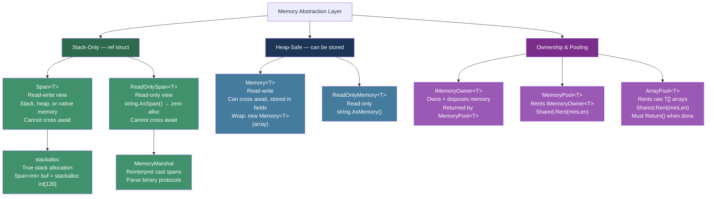
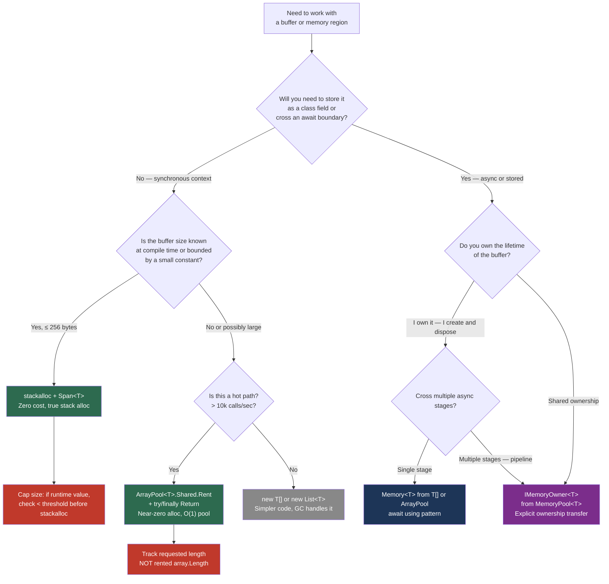

> [!success] Mastery Check
> - [ ] **Studied Well**
> - [ ] **Can explain the concept without notes**
> - [ ] **Can answer interview questions confidently**
> - [ ] **Can implement it in a real project**


## 📍 PART 0 — Navigation & Context

### Where This Topic Lives

```
C# Runtime Model
└── Memory and Performance
    ├── Value Types vs. Reference Types (2.01)  ← prerequisite
    ├── ► Spans, Memory, and Zero-Copy Patterns  ← YOU ARE HERE
    ├──   Performance: Zero-Allocation Patterns (2.15)  ← unlocked
    ├──   String Internals and High-Performance Operations (2.25)  ← unlocked
    └──   Unsafe Code and Interop (2.12)  ← unlocked
```

### What You Need Before This

- **[[2.01 — Value Types vs. Reference Types]]** — `Span<T>` is a `ref struct`; you must understand what that constraint means and why it exists
- Basic understanding of the managed heap and stack frame lifetimes
- Familiarity with arrays and string in C#

### What This Unlocks After

- **[[2.15 — Performance — Zero-Allocation Patterns]]** — `Span<T>` and `ArrayPool<T>` are the two primary tools for zero-alloc hot paths
- **[[2.25 — String Internals]]** — `AsSpan()`, `TryFormat`, and zero-alloc string parsing build directly on this
- **[[2.12 — Unsafe Code and Interop]]** — `Span<T>` can wrap native (unmanaged) memory; understanding this requires knowing Span internals
- **[[2.07 — async/await — The State Machine]]** — the reason `Span<T>` cannot cross `await` boundaries becomes clear here

### Why This Matters to a Production Engineer

`Span<T>` is the difference between parsing a 10 MB HTTP request body with 300 allocations and 0. In any I/O-heavy system operating at scale — payment processors, telemetry pipelines, API gateways — eliminating parsing allocations is the single highest-leverage performance win available in managed code.

---

## 🧠 PART 1 — The Core Mental Model

### The Fundamental Rule

> **`Span<T>` is a view over a contiguous block of memory — stack, heap, or native — without owning it or copying it. The practical consequence is that you can slice, parse, and transform any buffer for free: zero allocation, zero copy.**

### The Plain-Language Analogy

Imagine a long roll of paper on a table with data written on it. Traditionally, every time you wanted to work with a section, you'd tear off that piece and hand it to a function — making a copy. `Span<T>` is a sticky note that you slide over the roll: it says "start at inch 40, length 20 inches." The function reads the data through the sticky note. No tearing, no copy. The sticky note itself is tiny (just a start position and a length), and when it's gone, the roll is still there unchanged.

The constraint that makes this safe: the sticky note cannot outlive the roll. If you put the roll away (the stack frame returns, the array gets collected), the sticky note must already be gone. This is why `Span<T>` is a `ref struct` — the compiler enforces that it cannot escape to the heap and outlive the underlying memory it points at.

`Memory<T>` is the heap-safe cousin: think of it as a laminated card that references the roll. It can be stored in a drawer (on the heap), passed across `await` boundaries, and retrieved later — but it costs a dereference to get to the data.

### The Taxonomy Diagram



> [!IMPORTANT] The Key Distinction `Span<T>` = fast, stack-only, cannot be stored or cross `await`. `Memory<T>` = slightly slower (one extra pointer dereference), heap-safe, can cross `await`. Choose `Span<T>` by default for synchronous code; switch to `Memory<T>` only when you need to store it or pass it across an async boundary.

---

## 🔬 PART 2 — Deep Mechanics

### 2.1 Span<T> Internal Layout

`Span<T>` is a `ref struct` containing exactly two fields: a managed reference (a "byref") and a length. This is not a pointer in the traditional sense — it is a managed reference, which means the GC tracks and updates it if the underlying object moves during compaction.

```
━━━━━━━━━━━━━━━━━━━━━━━━━━━━━━━━━━━━━━━━━━━━━━━━━━━━━━
SPAN<T> STRUCT LAYOUT  (16 bytes on 64-bit)
━━━━━━━━━━━━━━━━━━━━━━━━━━━━━━━━━━━━━━━━━━━━━━━━━━━━━━

┌─────────────────────────────────┐
│  Span<int>                      │  (lives on stack — ref struct)
│  _reference  (8 bytes)  ───────────────────────────────┐
│  _length     (4 bytes)  = 5     │                       │
│  [padding]   (4 bytes)          │                       │
└─────────────────────────────────┘                       │
                                                          ▼
HEAP (int[] array):                              ┌────────────────────────────────┐
                                                 │ ObjHeader  (8 bytes)           │
                                                 │ TypePtr    (8 bytes)           │
                                                 │ Length     (4 bytes)  = 10     │
                                                 │ [0] = 10   (4 bytes)  ◄───┐   │
                                                 │ [1] = 20   (4 bytes)      │   │
                                                 │ [2] = 30   (4 bytes)      │   │
                                                 │ [3] = 40   (4 bytes)      │   │
                                                 │ [4] = 50   (4 bytes)      │   │
                                                 │ [5] = 60   (4 bytes)      │   │
                                                 │ ...                       │   │
                                                 └────────────────────────────┘   │
                                                                                  │
  var arr = new int[] {10,20,30,40,50,60,70,80,90,100};                          │
  Span<int> slice = arr.AsSpan(0, 5);  ← _reference points to &arr[0] ──────────┘
                                        _length = 5

KEY POINTS:
• _reference is a "managed pointer" (TypedReference in CLR terms)
• GC updates _reference if the array moves during compaction
• Slicing: span.Slice(2, 3) creates a NEW Span<int> with
  _reference = &arr[2], _length = 3  — ZERO allocation, O(1)
• Bounds checks use _length; JIT eliminates many via range analysis
```

**Runtime cost of Span operations:**

- `span[i]` → O(1), bounds-checked (JIT often eliminates the check in loops)
- `span.Slice(start, length)` → O(1), zero allocation — just arithmetic on the pointer and length
- `span.CopyTo(dest)` → O(n), uses `memmove` internally (highly optimized, AVX2/SSE where available)
- Creating a `Span<T>` from an array → O(1), zero allocation

### 2.2 The ref struct Constraint — Why Span<T> Cannot Cross await

The `ref struct` constraint is not an arbitrary limitation. It exists because `async` methods are transformed into state machine classes, and the state machine's local variables become fields in that class — on the heap. A `Span<T>` field on the heap would create a managed pointer into an arbitrary memory location that the GC would have to track specially. The CLR's GC does not support managed pointers as heap object fields. Therefore, the compiler forbids `ref struct` types in any context where they could escape to the heap.

```csharp
// The compiler transformation explains everything:

// What you write:
async Task ProcessAsync(byte[] data)
{
    Span<byte> span = data;         // ERROR: Span<T> cannot be used here
    await SomeAsyncOperation();     // Span would need to survive this suspension
    ParseData(span);
}

// What the compiler generates (conceptually):
class ProcessAsync_StateMachine : IAsyncStateMachine
{
    // All locals become fields — on the heap!
    private Span<byte> span;    // ILLEGAL: managed pointer as class field
    private Task _task;
    private int _state;
    // ...
}

// ✅ Fix: Use Memory<T> instead, which IS safe on the heap
async Task ProcessAsync(byte[] data)
{
    Memory<byte> memory = data;         // Memory<T> is a regular struct — safe on heap
    await SomeAsyncOperation();
    ParseData(memory.Span);             // .Span is only materialized synchronously
}
```

### 2.3 Memory<T> Internals — The Heap-Safe Wrapper

`Memory<T>` is a regular (non-ref) struct that stores three fields: an object reference, an index, and a length. Because it is a regular struct, it can be stored as a class field and survive `await` boundaries.

```
━━━━━━━━━━━━━━━━━━━━━━━━━━━━━━━━━━━━━━━━━━━━━━━━━━━━━━
MEMORY<T> STRUCT LAYOUT  (24 bytes on 64-bit)
━━━━━━━━━━━━━━━━━━━━━━━━━━━━━━━━━━━━━━━━━━━━━━━━━━━━━━

┌──────────────────────────────────┐
│  Memory<byte>                    │  (can live anywhere — regular struct)
│  _object  (8 bytes)  ────────────────────────────────► [byte[] or MemoryManager<T>]
│  _index   (4 bytes)  = 100       │
│  _length  (4 bytes)  = 200       │
└──────────────────────────────────┘

memory.Span  →  creates a Span<byte> pointing at _object[_index], length _length
              Cost: O(1), one extra pointer dereference vs Span<T> created directly

WHY THE EXTRA DEREFERENCE:
• Memory<T> stores an object reference (GC-tracked)
• .Span has to load _object, then offset by _index to get the managed pointer
• Span<T> stores the managed pointer directly — one step fewer
• In tight loops over Memory<T>.Span: materialize .Span ONCE, use the Span in the loop
```

### 2.4 ArrayPool<T> — The Rental Pattern

`ArrayPool<T>.Shared` is a thread-safe, lock-free (for small buffers) pool of reusable arrays. It eliminates the GC cost of temporary large buffer allocations — the biggest hidden performance problem in parsing, serialization, and I/O code.

```
━━━━━━━━━━━━━━━━━━━━━━━━━━━━━━━━━━━━━━━━━━━━━━━━━━━━━━━━━━━━━
ARRAYPOOL<T>.SHARED INTERNALS
━━━━━━━━━━━━━━━━━━━━━━━━━━━━━━━━━━━━━━━━━━━━━━━━━━━━━━━━━━━━━

Pool has "buckets" for power-of-2 sizes:
  Bucket[0]: arrays of length  16
  Bucket[1]: arrays of length  32
  Bucket[2]: arrays of length  64
  ...
  Bucket[16]: arrays of length 1,048,576  (1 MB)
  (max default: 1 MB)

Each bucket has a per-CPU-core cache (TLS) + a shared stack.

Rent(minimumLength):
  1. Find bucket for next power-of-2 ≥ minimumLength
  2. TryPop from per-core TLS cache  → O(1), no lock
  3. If empty, TryPop from shared stack → O(1), Interlocked
  4. If empty, allocate new array        → heap allocation (rare)
  Returns: array that is ≥ minimumLength (may be LARGER — always track actual length!)

Return(array):
  1. Find correct bucket
  2. Push to per-core TLS cache → O(1), no lock
  If pool is full, the array is simply abandoned (collected by GC)

⚠️ CRITICAL: Rented arrays are NOT zeroed. Contents from previous rental are present.
   Clear before use when processing untrusted data.
```

```csharp
// Cost labels:
// ArrayPool<byte>.Shared.Rent(n)   → O(1), ~20–50 ns, zero allocation (pool hit)
// ArrayPool<byte>.Shared.Return(a) → O(1), ~10–20 ns
// vs new byte[n]                   → O(1) amortized, ~50–200 ns + GC pressure
```

### 2.5 stackalloc — True Stack Allocation

`stackalloc` allocates memory directly on the current stack frame. No GC involvement whatsoever. The memory is reclaimed the moment the stack frame returns.

```csharp
// BEFORE C# 7.2: stackalloc required unsafe context
// AFTER C# 7.2 + Span<T>: safe, no unsafe needed

// Stack allocation pattern:
const int StackThreshold = 256; // bytes
int needed = GetNeededLength();  // runtime value

// Conditional: stack for small, pool for large
Span<byte> buffer = needed <= StackThreshold
    ? stackalloc byte[needed]                          // Stack: O(1), true zero cost
    : ArrayPool<byte>.Shared.Rent(needed);             // Pool:  O(1), near-zero cost

try
{
    ProcessBuffer(buffer[..needed]); // slice to exact needed length
}
finally
{
    // Return to pool only if it came from the pool
    // Stack memory: automatically reclaimed, nothing to do
    if (needed > StackThreshold)
        ArrayPool<byte>.Shared.Return(buffer.ToArray()); // ⚠️ see anti-pattern in Part 4
}
```

> [!WARNING] Stack Overflow Risk `stackalloc` with a size determined at runtime can cause a `StackOverflowException`. Always cap the size (typically 256–4096 bytes) before using `stackalloc`. Never `stackalloc` a size that comes from user input.

### 2.6 MemoryMarshal — Zero-Copy Binary Protocol Parsing

`MemoryMarshal` provides low-level reinterpretation of spans without copying data. It is the foundation of high-performance binary parsers (reading network packets, binary file formats, memory-mapped files).

```
━━━━━━━━━━━━━━━━━━━━━━━━━━━━━━━━━━━━━━━━━━━━━━━━━━━━━━━━━━━━━
MEMORYMARSHAL.READ<T> — ZERO COPY STRUCT EXTRACTION
━━━━━━━━━━━━━━━━━━━━━━━━━━━━━━━━━━━━━━━━━━━━━━━━━━━━━━━━━━━━━

Binary buffer in memory:
  Offset 0:  [01 00 00 00]  → int (little-endian): 1   (MessageType)
  Offset 4:  [2C 01 00 00]  → int (little-endian): 300 (PayloadLength)
  Offset 8:  [... payload ...]

MemoryMarshal.Read<MessageHeader>(buffer):
  • Reinterprets the first sizeof(MessageHeader) bytes AS a MessageHeader struct
  • No allocation. No copy. The struct fields are read directly from the span.
  • Requires: MessageHeader must be blittable (no managed references as fields)

Cost: O(1). Literally just offsetting a pointer and reading fields.
```

---

## 💻 PART 3 — Production Code Patterns

### 3.1 The Rental Guard — ArrayPool with Guaranteed Return

In payment processing and API parsing, large buffers are rented frequently. Forgetting to return them causes unbounded memory growth that GC cannot reclaim.

```csharp
// ✅ CORRECT: Rental + guaranteed return using a disposable guard
// Used in: HTTP request body buffering, JSON deserialization pipeline

public sealed class RentedBuffer<T> : IDisposable
{
    private T[]? _array;
    private bool _disposed;

    // Track exact needed length separately — pool may return a larger array
    public int Length { get; }
    public Span<T> Span => _disposed
        ? throw new ObjectDisposedException(nameof(RentedBuffer<T>))
        : _array.AsSpan(0, Length);

    public RentedBuffer(int minimumLength)
    {
        Length = minimumLength;
        _array = ArrayPool<T>.Shared.Rent(minimumLength);
    }

    public void Dispose()
    {
        if (_disposed) return;
        _disposed = true;
        if (_array is not null)
        {
            // Clear sensitive data (payment card numbers, tokens) before returning
            // Omit for non-sensitive data to avoid O(n) clear cost
            ArrayPool<T>.Shared.Return(_array, clearArray: false);
            _array = null;
        }
    }
}

// Usage in payment request parsing:
public static async Task<PaymentRequest> ParsePaymentRequestAsync(
    Stream requestBody,
    CancellationToken ct)
{
    using var buffer = new RentedBuffer<byte>(4096); // returned on using block exit
    int bytesRead = await requestBody.ReadAsync(buffer.Span, ct);
    return ParseFromSpan(buffer.Span[..bytesRead]);  // parse the exact slice
}
```

### 3.2 The Adaptive Stack/Pool Buffer

A well-known pattern from ASP.NET Core itself: use the stack for small inputs (common case, zero overhead), fall back to pool for large inputs (rare case, minimal overhead).

```csharp
// ⚠️ WRONG: Allocating a new byte[] every call
public string ParseUserId(ReadOnlySpan<byte> utf8Input)
{
    byte[] copy = utf8Input.ToArray(); // allocation every call — unnecessary
    return Encoding.UTF8.GetString(copy);
}

// ✅ CORRECT: Adaptive buffer — stack for small, pool for large
// Used in: order management service, decoding base64-encoded order IDs

public static string DecodeOrderId(ReadOnlySpan<byte> encodedBytes)
{
    // Stack threshold: 256 bytes covers 99%+ of real order ID sizes
    const int StackThreshold = 256;

    // Calculate exact needed length before allocating anything
    int decodedLength = Base64.GetMaxDecodedFromUtf8Length(encodedBytes.Length);

    byte[]? pooled = null;
    Span<byte> decodeBuf = decodedLength <= StackThreshold
        ? stackalloc byte[decodedLength]          // ~10 ns, zero GC
        : (pooled = ArrayPool<byte>.Shared.Rent(decodedLength)); // ~30 ns, no heap alloc

    try
    {
        Base64.DecodeFromUtf8(encodedBytes, decodeBuf, out _, out int written);
        // Create the string once from the exact decoded bytes — one allocation total
        return Encoding.UTF8.GetString(decodeBuf[..written]);
    }
    finally
    {
        if (pooled is not null)
            ArrayPool<byte>.Shared.Return(pooled); // always return, even on exception
    }
}
```

### 3.3 The Zero-Copy Parser

The canonical use case for `Span<T>`: parsing CSV lines, HTTP headers, or config values without any allocations in the parsing logic itself.

```csharp
// ⚠️ WRONG: String-based parsing — allocates on every delimiter
public static IEnumerable<string> ParseCsvLineSlow(string line)
{
    return line.Split(',');  // allocates: string[], N new string objects
}

// ✅ CORRECT: Span-based tokenizer — zero allocation in the hot path
// Used in: telemetry pipeline, parsing 50M+ log lines per hour

public static void ParseCsvLine(ReadOnlySpan<char> line, Action<ReadOnlySpan<char>> onToken)
{
    // No allocations. 'remaining' and 'token' are just pointer+length pairs on the stack.
    ReadOnlySpan<char> remaining = line;

    while (!remaining.IsEmpty)
    {
        int commaIdx = remaining.IndexOf(',');

        ReadOnlySpan<char> token = commaIdx < 0
            ? remaining                     // last token
            : remaining[..commaIdx];        // token before comma

        // Trim without allocation — returns a sub-span
        onToken(token.Trim());

        remaining = commaIdx < 0
            ? ReadOnlySpan<char>.Empty
            : remaining[(commaIdx + 1)..];  // advance past comma
    }
}

// Usage: process each token without creating strings
ParseCsvLine("New York, USA, 10001".AsSpan(), token =>
{
    if (!token.IsEmpty)
        ProcessField(token); // receives a ReadOnlySpan<char> — no string allocation
});
```

### 3.4 The Binary Protocol Reader (MemoryMarshal)

Parsing binary network packets or file formats. Without `MemoryMarshal`, this involves `BinaryReader`, streams, and constant buffer copies.

```csharp
// Used in: financial market data feed parser (FIX/FAST protocol)
// Packets arrive at ~500k/second; every allocation is visible in GC pauses

[StructLayout(LayoutKind.Sequential, Pack = 1)] // Pack=1: no padding between fields
public readonly struct MarketDataHeader
{
    public readonly ushort  MessageType;   // 2 bytes
    public readonly uint    SequenceNum;   // 4 bytes
    public readonly long    Timestamp;     // 8 bytes
    public readonly ushort  PayloadLength; // 2 bytes
    // Total: 16 bytes
}

public static bool TryParseMarketDataPacket(
    ReadOnlySpan<byte> packet,
    out MarketDataHeader header,
    out ReadOnlySpan<byte> payload)
{
    const int HeaderSize = 16; // sizeof(MarketDataHeader)

    if (packet.Length < HeaderSize)
    {
        header  = default;
        payload = default;
        return false;
    }

    // Zero-copy struct extraction — reads directly from the span bytes
    // No allocation. No copy. O(1).
    header = MemoryMarshal.Read<MarketDataHeader>(packet);

    if (packet.Length < HeaderSize + header.PayloadLength)
    {
        payload = default;
        return false;
    }

    // payload is a slice of the original buffer — still zero copy
    payload = packet.Slice(HeaderSize, header.PayloadLength);
    return true;
}
```

### 3.5 The IMemoryOwner<T> Pipeline — Passing Ownership Across Async

When a buffer needs to outlive its creating scope and cross `await` boundaries, rent it via `MemoryPool<T>` and transfer ownership with `IMemoryOwner<T>`.

```csharp
// Used in: streaming upload pipeline in a document management service

public static async Task<ProcessedDocument> ProcessUploadAsync(
    Stream uploadStream,
    CancellationToken ct)
{
    // Rent memory that can cross async boundaries
    // IMemoryOwner<T> implements IDisposable — the owner is responsible for returning
    IMemoryOwner<byte> memoryOwner = MemoryPool<byte>.Shared.Rent(64 * 1024); // 64KB

    try
    {
        Memory<byte> buffer = memoryOwner.Memory;
        int bytesRead = await uploadStream.ReadAsync(buffer, ct);

        // Hand ownership to the next stage — it becomes responsible for disposing
        return await TransformDocumentAsync(memoryOwner, bytesRead, ct);
        // DO NOT dispose here — ownership was transferred
    }
    catch
    {
        // Only dispose on exception — ownership NOT transferred
        memoryOwner.Dispose();
        throw;
    }
}

private static async Task<ProcessedDocument> TransformDocumentAsync(
    IMemoryOwner<byte> owner,  // Takes ownership
    int length,
    CancellationToken ct)
{
    using (owner) // Dispose when done — returns memory to pool
    {
        ReadOnlyMemory<byte> data = owner.Memory[..length];
        await Task.Delay(1, ct); // simulating async work
        return new ProcessedDocument(ExtractText(data.Span));
    }
}
```

### 3.6 String Zero-Alloc Parsing with AsSpan

The most immediately applicable pattern: parsing strings without creating substrings.

```csharp
// Used in: API gateway, parsing Authorization: Bearer <token> headers

// ⚠️ WRONG: Creates a new string every call
public static string ExtractBearerToken_Slow(string authHeader)
{
    if (!authHeader.StartsWith("Bearer "))
        throw new FormatException("Not a Bearer token");
    return authHeader.Substring(7); // allocation: new string
}

// ✅ CORRECT: Zero-allocation parsing
public static ReadOnlySpan<char> ExtractBearerToken_Fast(ReadOnlySpan<char> authHeader)
{
    ReadOnlySpan<char> bearer = "Bearer ";
    if (!authHeader.StartsWith(bearer, StringComparison.Ordinal))
        ThrowFormatException(); // extracted to separate method to keep this inlineable
    return authHeader[bearer.Length..]; // sub-span: pointer + length arithmetic only
}

[DoesNotReturn]
private static void ThrowFormatException() =>
    throw new FormatException("Authorization header must use Bearer scheme");

// If you need a string (e.g., to cache the token), call ToString() once:
// string token = ExtractBearerToken_Fast(header).ToString();
// But most validation pipelines can work entirely in span-land
```

### 3.7 Span<T> with stackalloc for Formatting

Avoiding `string.Format` and `$""` allocations in high-throughput logging or serialization.

```csharp
// Used in: structured logging in a high-throughput order processing service
// Target: format an order ID + amount without any heap allocation

public static bool TryFormatOrderSummary(
    int orderId,
    decimal amount,
    Span<char> destination,
    out int charsWritten)
{
    // TryWrite uses an interpolated string handler that writes directly to the span
    // Zero allocation — requires .NET 6+
    return destination.TryWrite(
        $"Order #{orderId}: {amount:C2}",
        out charsWritten);
}

// Usage with stack buffer:
Span<char> buf = stackalloc char[64];
if (TryFormatOrderSummary(orderId: 12345, amount: 99.99m, buf, out int written))
{
    ReadOnlySpan<char> summary = buf[..written]; // "Order #12345: $99.99"
    logger.WriteRaw(summary); // if logger accepts ReadOnlySpan<char>
}
```

---

## ⚠️ PART 4 — Gotchas & Anti-Patterns

### Gotcha 1: Returning a Span That Outlives Its Stack Memory

The most dangerous Span mistake. The compiler catches many cases, but not all — particularly with `stackalloc` inside helper methods.

Engineers fall into this trap when they refactor a working inline `stackalloc` into a helper method, not realizing the span's lifetime becomes tied to the helper's stack frame, which ends before the caller uses the span.

```csharp
// ⚠️ WRONG: Returns a Span pointing at a dead stack frame
static Span<byte> GetBuffer_Wrong()
{
    Span<byte> buf = stackalloc byte[128]; // allocated on GetBuffer_Wrong's frame
    buf[0] = 42;
    return buf; // ← UNDEFINED BEHAVIOR: stack frame is gone when caller uses this
                // The compiler DOES catch this specific case — CS8352 error
                // But patterns with ref locals can sometimes slip through
}

// ✅ CORRECT: stackalloc in the consuming scope; or use ArrayPool for cross-scope buffers
static void ProcessRequest(ReadOnlySpan<byte> input)
{
    Span<byte> buf = stackalloc byte[128]; // lives for the duration of this method
    Transform(input, buf);
    Submit(buf);
} // buf's stack frame ends here — safe
```

### Gotcha 2: Not Tracking the Rented Array's Actual Length

`ArrayPool<T>.Shared.Rent(n)` returns an array that is **at least** `n` elements, but often significantly larger (rounded up to the next power of 2). Using the array's `.Length` instead of the requested length processes garbage data.

```csharp
// ⚠️ WRONG: Using rented array's Length — processes extra garbage bytes
byte[] rented = ArrayPool<byte>.Shared.Rent(100);
// rented.Length might be 128 — contains garbage from previous rentals!
int bytesRead = stream.Read(rented, 0, rented.Length); // reads up to 128 bytes

// ✅ CORRECT: Always track requested/used length separately
int needed = 100;
byte[] rented2 = ArrayPool<byte>.Shared.Rent(needed);
try
{
    int bytesRead2 = stream.Read(rented2, 0, needed); // read only what you need
    Process(rented2.AsSpan(0, bytesRead2));            // slice to actual data
}
finally
{
    ArrayPool<byte>.Shared.Return(rented2);
}
```

### Gotcha 3: Calling .ToArray() on a Span to Return It From a Pool

This pattern negates all the performance benefits of pooling. It's common when engineers add pooling to existing code without understanding the lifetime implications.

```csharp
// ⚠️ WRONG: Allocates a new array just to store a Span reference
byte[] pooled = ArrayPool<byte>.Shared.Rent(1024);
Span<byte> span = pooled.AsSpan(0, 512);

// ... do work ...

ArrayPool<byte>.Shared.Return(span.ToArray()); // ← WRONG on two levels:
// 1. ToArray() allocates a NEW byte[] — defeating the purpose of pooling
// 2. You're returning the WRONG array (the copy) — pooled[] is leaked!

// ✅ CORRECT: Keep a reference to the original rented array
byte[] pooled2 = ArrayPool<byte>.Shared.Rent(1024);
try
{
    Span<byte> span2 = pooled2.AsSpan(0, 512);
    // ... work ...
}
finally
{
    ArrayPool<byte>.Shared.Return(pooled2); // return the ORIGINAL array
}
```

### Gotcha 4: Materializing Memory<T>.Span Inside a Loop

`Memory<T>.Span` requires loading the `_object` field and computing an interior pointer. Doing this on every loop iteration is a measurable overhead in tight inner loops.

```csharp
// ⚠️ WRONG: .Span materialized on every iteration — extra indirection in tight loop
void ProcessAllItems_Wrong(Memory<int> data)
{
    for (int i = 0; i < data.Length; i++)
    {
        int value = data.Span[i]; // materializes .Span every iteration
        Compute(value);
    }
}

// ✅ CORRECT: Materialize .Span once outside the loop
void ProcessAllItems_Correct(Memory<int> data)
{
    Span<int> span = data.Span; // one pointer resolution
    for (int i = 0; i < span.Length; i++)
    {
        int value = span[i]; // direct access, JIT can eliminate bounds check
        Compute(value);
    }
}
```

### Gotcha 5: Using MemoryMarshal.Read on Non-Blittable Types

`MemoryMarshal.Read<T>` directly reinterprets bytes as a struct. If the struct contains any managed references (string, array, class fields), the operation produces a garbage pointer and will corrupt the GC or crash the process.

```csharp
// ⚠️ WRONG: struct contains a string — NOT blittable
public struct BadHeader
{
    public int MessageType;
    public string Label; // ← managed reference! Cannot be overlaid on raw bytes
}

ReadOnlySpan<byte> packet = GetPacket();
var header = MemoryMarshal.Read<BadHeader>(packet); // ← runtime exception or memory corruption

// WHY: The 8 bytes at offset 4 in the packet are treated as a managed object pointer.
// That pointer is not a real GC reference. Using it is undefined behavior.

// ✅ CORRECT: Only use MemoryMarshal.Read with blittable structs
[StructLayout(LayoutKind.Sequential, Pack = 1)]
public readonly struct GoodHeader  // all primitive fields — blittable
{
    public readonly int    MessageType;
    public readonly int    Reserved;
    public readonly long   Timestamp;
}

var goodHeader = MemoryMarshal.Read<GoodHeader>(packet); // safe
```

---

## 📊 PART 5 — Performance Implications

### 5.1 Allocation Characteristics Table

|Scenario|Allocation Behavior|Approx Cost|
|---|---|---|
|`span[i]` indexer access|Zero allocation|~0.3 ns (may be loop-fused by JIT)|
|`span.Slice(start, len)`|Zero allocation|~0.5 ns (pointer arithmetic)|
|`span.CopyTo(dest)` of N bytes|Zero allocation|O(n), ~0.3 ns/byte (SIMD)|
|`stackalloc byte[128]`|Zero heap alloc, stack only|~1–2 ns|
|`ArrayPool<byte>.Shared.Rent(n)` — pool hit|Zero heap allocation|~20–50 ns|
|`ArrayPool<byte>.Shared.Rent(n)` — pool miss|One heap allocation|~80–200 ns|
|`ArrayPool<byte>.Shared.Return(arr)`|Zero allocation|~10–20 ns|
|`new byte[n]`|One heap allocation|~50–200 ns + GC pressure|
|`ReadOnlySpan<char> s = str.AsSpan()`|Zero allocation|~1 ns|
|`str.Substring(start, len)`|One string allocation|~30–150 ns|
|`span.ToString()`|One string allocation|~30 ns + O(n) char copy|
|`MemoryMarshal.Read<T>(span)`|Zero allocation|~1–2 ns|
|`Memory<T>.Span` property|Zero allocation|~2–5 ns (extra dereference)|
|`MemoryPool<T>.Shared.Rent(n)`|Zero (pool hit) or one alloc|~50–100 ns|

### 5.2 BenchmarkDotNet: Span vs String Parsing

```csharp
// Expected output (approximate, .NET 8, x64):
// ┌──────────────────────────────┬────────────┬──────────┬──────────┐
// │ Method                       │ Mean       │ Alloc    │ Gen 0    │
// ├──────────────────────────────┼────────────┼──────────┼──────────┤
// │ SplitAndIterate_String       │ 842.3 ns   │ 480 B    │ 0.0458   │
// │ ParseWithSpan_ReadOnlySpan   │ 112.4 ns   │ 0 B      │ -        │
// │ BinaryRead_BinaryReader      │ 1,204.1 ns │ 640 B    │ 0.0610   │
// │ BinaryRead_MemoryMarshal     │ 18.7 ns    │ 0 B      │ -        │
// └──────────────────────────────┴────────────┴──────────┴──────────┘

[MemoryDiagnoser]
[BenchmarkCategory("Spans")]
public class SpanParsingBenchmark
{
    private const string CsvLine = "10001,2024-01-15,USD,4999,APPROVED";
    private readonly byte[] _binaryPacket;

    public SpanParsingBenchmark()
    {
        _binaryPacket = new byte[16];
        MemoryMarshal.Write(_binaryPacket, new MarketDataHeader
        {
            MessageType   = 1,
            SequenceNum   = 100,
            Timestamp     = DateTimeOffset.UtcNow.ToUnixTimeMilliseconds(),
            PayloadLength = 0
        });
    }

    [Benchmark(Baseline = true)]
    public string[] SplitAndIterate_String()
    {
        // Traditional: allocates string[] + N new strings
        return CsvLine.Split(',');
    }

    [Benchmark]
    public int ParseWithSpan_ReadOnlySpan()
    {
        // Zero-alloc: count tokens as proof we traversed
        int count = 0;
        ReadOnlySpan<char> remaining = CsvLine.AsSpan();
        while (!remaining.IsEmpty)
        {
            int idx = remaining.IndexOf(',');
            count++;
            remaining = idx < 0 ? ReadOnlySpan<char>.Empty : remaining[(idx + 1)..];
        }
        return count;
    }

    [Benchmark]
    public int BinaryRead_BinaryReader()
    {
        using var ms = new MemoryStream(_binaryPacket);
        using var reader = new BinaryReader(ms);
        // Allocates MemoryStream, BinaryReader; multiple Read calls
        return reader.ReadUInt16();
    }

    [Benchmark]
    public int BinaryRead_MemoryMarshal()
    {
        // Zero-allocation binary read
        var header = MemoryMarshal.Read<MarketDataHeader>(_binaryPacket);
        return header.MessageType;
    }

    [StructLayout(LayoutKind.Sequential, Pack = 1)]
    private readonly struct MarketDataHeader
    {
        public readonly ushort MessageType;
        public readonly uint   SequenceNum;
        public readonly long   Timestamp;
        public readonly ushort PayloadLength;
    }
}
```

### 5.3 When to Care / When to Ignore

**When this costs you (optimize here):**

- **Parsing request bodies at > 5,000 req/sec** — every `Substring`, `Split`, or `ReadLine` is an allocation that becomes Gen0 churn
- **Binary protocol ingestion** (FIX, Protobuf, custom TCP protocols) — `BinaryReader` creates wrapper objects; `MemoryMarshal` does not
- **Hot-path logging** — `string.Format` or `$""` in a method called 100k+/sec creates significant GC pressure
- **JSON / CSV / config parsing in library code** — users of your library pay the allocation tax on every call
- **Streaming transformations** — reading 1 GB files chunk by chunk without `ArrayPool` puts large arrays on the LOH

**When this doesn't matter (don't over-engineer):**

- **Application startup code** — runs once; allocations here are noise
- **CRUD endpoints at < 500 req/sec** — GC can easily handle this; `Span<T>` adds complexity for no gain
- **Developer tools and scripts** — throughput doesn't matter; code clarity does
- **Logic that's not on the hot path** — profile first; `Span<T>` code is harder to read, test, and debug

> [!TIP] The Rule of Measurement Never introduce `Span<T>`, `ArrayPool<T>`, or `stackalloc` without a BenchmarkDotNet measurement showing the allocation column before and after. The complexity cost is real; it must be justified by a measured gain.

---

## 🎤 PART 6 — Interview Arsenal

### A. The Question Bank

---

> **Q: "What is Span<T> and why does it exist?"**

**Average answer:** "It's a struct that represents a slice of an array without copying data."

**Why that's insufficient:** It misses that `Span<T>` can wrap stack memory, heap memory, and native memory — not just arrays. It also misses the ref struct constraint and why it exists.

**Great answer:**

> "Span<T> is a ref struct — a stack-only view over a contiguous block of memory that can be stack-allocated, heap-allocated, or native. It exists to solve a specific problem: before Span<T>, every string or buffer operation that needed a subset of data had to allocate a new copy. Substring, Split, ToArray — all allocations. Span<T> lets you express 'give me bytes 100 through 200 of this buffer' as a pair of pointer and length, with zero allocation. The ref struct constraint is what makes it safe: because it can't be stored on the heap, the GC can guarantee the underlying memory is still alive for as long as the Span lives. The trade-off is that you can't use it across async boundaries — for that, you use Memory<T>, which is the heap-safe sibling that stores an object reference and an offset rather than a raw managed pointer."

---

> **Q: "When would you use Memory<T> instead of Span<T>?"**

**Average answer:** "When you need to store it or pass it to an async method."

**Why that's insufficient:** Correct but mechanical. Doesn't explain the internal tradeoff or when to prefer Span<T>.

**Great answer:**

> "I use Span<T> by default in synchronous code — it has direct managed pointer access with essentially zero overhead. I switch to Memory<T> in three situations: when the buffer needs to be stored as a class field, when it needs to cross an await boundary in an async method, or when ownership needs to be explicitly transferred through an IMemoryOwner<T>. The cost difference is small — Memory<T>.Span requires loading an object reference and computing an interior pointer, adding maybe one or two nanoseconds per access. In tight loops, I always materialize Memory<T>.Span once outside the loop and work with the Span inside. The ownership transfer pattern is particularly important in pipeline architectures: you rent a buffer, fill it, and pass the IMemoryOwner<T> to the next pipeline stage, making the transfer of disposal responsibility explicit."

---

> **Q: "What is ArrayPool<T> and what are the pitfalls of using it?"**

**Average answer:** "It's a pool of reusable arrays to avoid GC pressure."

**Why that's insufficient:** Doesn't address the two major pitfalls: not returning the original array, and using the array's Length instead of the requested length.

**Great answer:**

> "ArrayPool<T>.Shared is a thread-safe, largely lock-free pool organized into power-of-2 size buckets. On a pool hit, Rent and Return are O(1) operations taking 20–50 nanoseconds — compared to 50–200 nanoseconds plus GC overhead for a heap allocation. The two critical pitfalls I've seen in production code: first, the pool returns an array that is at least the requested size, but often larger — you must track the requested length separately and never use the rented array's .Length directly, or you'll process garbage bytes from the previous rental. Second, you must return the original rented array, not a copy — if you call .ToArray() on a Span derived from it and return the copy, you've both defeated the purpose and leaked the original. I always wrap rentals in a try/finally or an IDisposable guard to guarantee the Return call."

---

> **Q: "Why can't Span<T> be used in an async method?"**

**Average answer:** "Because it's a ref struct and ref structs can't be stored on the heap."

**Why that's insufficient:** Doesn't explain WHY async methods need to store locals on the heap, which is the actual reason.

**Great answer:**

> "This comes directly from what async does under the hood. The compiler transforms an async method into a state machine — a struct or class that implements IAsyncStateMachine, where all the method's local variables become fields on that state machine so they can survive across await suspension points. If Span<T> were a local in an async method, it would need to become a field in that state machine — which means a managed pointer (a byref) stored on the heap. The CLR's GC doesn't support managed pointers as heap object fields: it only tracks them on the stack. So the language prohibits ref struct types in async methods entirely. Memory<T> is the designed answer — it wraps the reference and offset as regular value-type fields that are perfectly legal in a heap-allocated state machine."

---

> **Q: "How does MemoryMarshal.Read<T> work, and when would you use it in production?"**

**Average answer:** "It reads bytes from a span and interprets them as a struct."

**Why that's insufficient:** Doesn't address the blittability requirement or the concrete production scenario.

**Great answer:**

> "MemoryMarshal.Read<T> reinterprets the raw bytes at the start of a ReadOnlySpan as a T, with zero allocation and zero copying — it's essentially a typed overlay on the memory. The critical constraint is that T must be blittable: no managed references as fields. In production, I use this for binary protocol parsing — financial data feeds, binary log formats, memory-mapped files. Without it, you'd use BinaryReader, which allocates wrapper objects and requires byte-by-byte reads. With MemoryMarshal, parsing a 16-byte protocol header is about 1–2 nanoseconds regardless of the header size. The gotcha I've hit: forgetting Pack=1 on the StructLayout attribute, causing the struct to have padding that misaligns with the wire format."

---

### B. The Trick Questions

> [!WARNING] Trick Questions — Think Before Answering

**"Can you use Span<T> as a field in a class?"** Trap: Engineers who know `ref struct` constraints might say "no" without qualification. Correct answer: No — a `Span<T>` field in a `class` is a compile error. But a `Span<T>` field in another `ref struct` is legal. The constraint is: `ref struct` cannot be a field of a non-`ref-struct` type.

**"Does `string.AsSpan()` allocate?"** Trap: The name "As" suggests a conversion, and conversions might allocate. Correct answer: No. It returns a `ReadOnlySpan<char>` backed by the string's internal character buffer. Zero allocation. The string is pinned by the fact that `ReadOnlySpan<char>` holds a reference to the managed string object.

**"ArrayPool<T>.Shared.Rent(100) returns an array of length 100, right?"** Trap: The pool rounds up to the next power of 2. Correct answer: The returned array has a length of **at least** 100, but likely 128 (next power of 2). You must use your own length variable to track how much of the array is valid data.

**"Is Span<T> faster than Memory<T>.Span for element access?"** Trap: They both "give you a span," so engineers assume equivalent performance. Correct answer: `Span<T>` has a direct managed pointer. `Memory<T>.Span` requires loading the backing `_object` reference and then computing an interior pointer from `_index`. In practice this is 1–3 ns slower per materialization. In a loop, materialize `Memory<T>.Span` once and use the `Span<T>` in the loop body.

**"Can you use `stackalloc` in an async method?"** Trap: `stackalloc` sounds like a low-level, potentially forbidden operation. Correct answer: Yes, with a restriction. `stackalloc` expressions that are immediately assigned to `Span<T>` are allowed in async methods in .NET, as long as the `Span<T>` itself does not cross an `await` — the compiler verifies this. The allocation is safe because `Span<T>` is a ref struct and the compiler ensures it doesn't escape to the async state machine.

---

### C. Red Flags to Avoid

```
❌ "Span<T> is just a pointer and a length" — it's a managed reference, not a raw pointer;
   the GC updates it during compaction. This distinction matters for unsafe code discussions.

❌ "ArrayPool returns exactly the size you request" — always wrong; this shows you haven't used it

❌ "Use Span<T> everywhere for performance" — ref struct constraints make it impossible in many
   contexts (async, class fields, interfaces); blanket advice signals you don't know the tradeoffs

❌ "Memory<T> is just a heap version of Span<T>" — incomplete; Memory<T> has ownership semantics
   via IMemoryOwner<T> that Span<T> does not

❌ "MemoryMarshal is unsafe" — it's in the safe API surface; unsafe is a different keyword.
   MemoryMarshal.Read requires blittable structs, not unsafe blocks.

❌ Forgetting to mention the ArrayPool.Return() obligation — failing to return is a correctness bug,
   not just a performance bug; interviewers look for this

❌ "stackalloc always uses the stack" — true, but failing to mention the stack overflow risk for
   runtime-sized allocations shows incomplete understanding
```

---

## 🔀 PART 7 — Decision Framework



---

## ✅ PART 8 — Self-Check

### A. Conceptual Questions

Answer these in writing. If you struggle, that's the gap to fill.

1. `Span<T>` is a `ref struct`. What does that mean for where it can live, and why is this constraint necessary for memory safety?
    
2. You have a method that accepts `ReadOnlySpan<char>`. A caller wants to pass a `string`. Does this require a cast? Does it allocate? Explain what happens at the call site.
    
3. `ArrayPool<byte>.Shared.Rent(200)` returns a byte array. You use it as `buffer.AsSpan(0, 200)`. Is there a bug? What should you do differently?
    
4. Explain why calling `memory.Span` inside a `for` loop is a performance anti-pattern and how to fix it.
    
5. You need to parse a binary packet header in a `async Task Process(ReadOnlyMemory<byte> packet)` method. Inside the method, you write `ReadOnlySpan<byte> header = packet.Span[..16]`. Is this correct? What are the lifetime constraints on `header`?
    
6. What is the difference between `MemoryPool<T>` and `ArrayPool<T>` in terms of the API they expose and the use case each is designed for?
    
7. A colleague proposes wrapping a `ReadOnlySpan<char>` in a field of a class to avoid repeatedly slicing a string. Will this compile? Why or why not? What should they use instead?
    
8. `stackalloc int[n]` where `n` is a runtime value — what is the risk, and how do you guard against it in production code?
    
9. After calling `ArrayPool<byte>.Shared.Return(array)`, a bug in your code reads from that same `array` reference. What happens? Is this a runtime exception, silent data corruption, or undefined behavior?
    
10. You are building a CSV parser library that will be called by thousands of user applications. Should you expose an API that takes `string` or `ReadOnlySpan<char>`? What are the tradeoffs?
    

---

### B. Code Puzzles

**Puzzle 1: What does this print, and is there a bug?**

```csharp
byte[] rented = ArrayPool<byte>.Shared.Rent(10);
Console.WriteLine(rented.Length); // What is printed?
Span<byte> span = rented.AsSpan(0, 10);
for (int i = 0; i < span.Length; i++) span[i] = (byte)i;
ArrayPool<byte>.Shared.Return(rented);
Console.WriteLine(span[5]); // Is this safe to access?
```

<details> <summary>Answer (expand after trying)</summary>

**Length printed:** Could be 16 (next power of 2 ≥ 10). `ArrayPool` rounds up to the nearest power of 2, so `rented.Length` is likely 16, not 10. This is the "not tracking requested length" gotcha.

**Second Console.WriteLine:** This is **undefined behavior / data corruption risk**. After `Return(rented)`, the array is back in the pool. Another thread could `Rent` and start overwriting it. `span` still holds a reference to the same backing array, so reading `span[5]` might return 5, or might return whatever another thread wrote, or might be a partially written value. There is no exception — this is a silent race condition.

</details>

---

**Puzzle 2: Does this code compile? If not, why? If yes, what does it print?**

```csharp
static ReadOnlySpan<char> GetPrefix(string input)
{
    ReadOnlySpan<char> span = input.AsSpan();
    int comma = span.IndexOf(',');
    return comma < 0 ? span : span[..comma];
}

static void Main()
{
    var result = GetPrefix("Hello,World");
    Console.WriteLine(result.ToString());
}
```

<details> <summary>Answer (expand after trying)</summary>

**Compiles:** Yes. This is valid — `ReadOnlySpan<char>` backed by a managed string is safe to return because the string (a managed reference) is kept alive by the caller's `result` variable, which holds an implicit reference to the string object. The span's managed reference points inside the string's character buffer, and the GC tracks this.

**Prints:** `Hello`

This is a correct zero-allocation pattern. The `AsSpan()` call and slicing produce zero allocations. The only allocation in the entire program is the original `"Hello,World"` string literal (which is interned, so not even a runtime allocation).

</details>

---

**Puzzle 3: Where is the bug? What happens at runtime?**

```csharp
public interface ITransformer { void Transform(Span<byte> data); }

public class Pipeline
{
    private readonly List<ITransformer> _transformers = new();
    private Span<byte> _buffer; // trying to cache the buffer

    public Pipeline(byte[] data)
    {
        _buffer = data.AsSpan(); // attempt to store Span as field
    }
}
```

<details> <summary>Answer (expand after trying)</summary>

**Compile-time error, not runtime:** This does not compile. `Span<byte>` is a `ref struct` and therefore cannot be a field in a `class`. The compiler produces CS8345: "Field or auto-implemented property cannot be of type 'Span<byte>' unless it is an instance member of a ref struct."

**Fix:** Use `Memory<byte>` as the field instead:

```csharp
public class Pipeline
{
    private readonly Memory<byte> _buffer;
    public Pipeline(byte[] data) { _buffer = data; }
    public void Run() 
    {
        Span<byte> span = _buffer.Span; // materialize Span only when needed
        foreach (var t in _transformers) t.Transform(span);
    }
}
```

This is the core lesson: `Span<T>` for synchronous local use, `Memory<T>` for storing.

</details>

---

**Puzzle 4: Does this allocate? How many allocations?**

```csharp
static void ProcessOrderIds(ReadOnlySpan<char> csv)
{
    while (!csv.IsEmpty)
    {
        int comma = csv.IndexOf(',');
        ReadOnlySpan<char> token = comma < 0 ? csv : csv[..comma];
        
        if (int.TryParse(token, out int orderId))
            ProcessOrder(orderId);
        
        csv = comma < 0 ? ReadOnlySpan<char>.Empty : csv[(comma + 1)..];
    }
}
```

<details> <summary>Answer (expand after trying)</summary>

**Zero allocations** in the parsing loop itself.

- `csv[..comma]` — sub-span, O(1), zero alloc
- `csv[(comma + 1)..]` — sub-span, O(1), zero alloc
- `int.TryParse(ReadOnlySpan<char>, out int)` — this overload (taking `ReadOnlySpan<char>`) is zero-allocation; it reads directly from the span. The overload taking `string` would allocate.
- `ReadOnlySpan<char>.Empty` — static readonly property, zero alloc

The only allocation in the entire call is whatever `ProcessOrder(int)` does internally. The parsing infrastructure itself is completely zero-allocation. This is the target pattern for a high-throughput order ingestion service.

</details>

---

**Puzzle 5: What is the output? Why?**

```csharp
Span<int> a = stackalloc int[] { 1, 2, 3, 4, 5 };
Span<int> b = a.Slice(1, 3); // b = [2, 3, 4]

b[0] = 99;

Console.WriteLine(a[1]); // What prints?
Console.WriteLine(b[0]); // What prints?

Span<int> c = a.ToArray(); // What does this do?
c[0] = 777;
Console.WriteLine(a[0]); // What prints?
```

<details> <summary>Answer (expand after trying)</summary>

**`a[1]` prints: 99** `Span<T>.Slice()` returns a view into the same underlying memory — not a copy. `b` and `a` both point at the same `stackalloc` buffer. Modifying `b[0]` modifies `a[1]`.

**`b[0]` prints: 99** Same reason — `b[0]` and `a[1]` are the same memory location.

**`a.ToArray()`:** Allocates a new `int[]` on the heap and copies the current contents of `a` into it. After this call, `c` is backed by a completely separate heap array.

**`a[0]` prints: 1** Modifying `c[0]` changes the heap array. `a` still points at the original `stackalloc` stack memory, which is unaffected. This illustrates that `ToArray()` is always a copy — the result is an independent buffer.

</details>

---

## 🔗 PART 9 — Connections & Resources

### A. Related Topics Table

|Topic|Why It Connects|
|---|---|
|[[2.01 — Value Types vs. Reference Types]]|`Span<T>` is a `ref struct` — understanding `ref struct` constraints requires knowing why value types cannot escape to the heap|
|[[2.07 — async/await — The State Machine]]|The async state machine transformation is the precise reason `Span<T>` cannot cross `await` boundaries; async locals become heap fields|
|[[2.12 — Unsafe Code and Interop]]|`Span<T>` can be created over native (unmanaged) memory via `MemoryMarshal.CreateSpan`; this is the bridge between managed and unsafe worlds|
|[[2.15 — Performance — Zero-Allocation Patterns]]|`Span<T>` and `ArrayPool<T>` are the two foundational tools for zero-alloc code; this topic provides the mechanics that make those patterns work|
|[[2.25 — String Internals and High-Performance Operations]]|`string.AsSpan()`, `ReadOnlySpan<char>` parsing, and `TryFormat`/`ISpanFormattable` are string-specific applications of the patterns here|
|[[2.28 — GC Interaction, Finalizers, and WeakReference]]|`ArrayPool<T>` exists precisely to reduce Gen0 GC churn; understanding GC generations explains why rental pools matter at scale|
|[[2.17 — Iterators and yield return]]|`IAsyncEnumerable<T>` pipelines often use `Memory<T>` to pass buffers across `await foreach` boundaries|

### B. Books

|Book|Chapters|Why These Chapters|
|---|---|---|
|Pro .NET Memory Management — Konrad Kokosa|Ch. 3, 9, 10|Ch. 3: managed pointer internals; Ch. 9–10: Span<T> and Memory<T> design, ArrayPool internals|
|Writing High-Performance .NET Code — Ben Watson|Ch. 4, 5|Memory allocation strategies, pooling patterns, and GC pressure reduction|
|CLR via C# — Jeffrey Richter|Ch. 2, 21|CLR type system (why ref struct exists), value type embedding rules|

### C. Essential Articles & Docs

- [Microsoft Docs: System.Memory — Span<T> and Memory<T>](https://learn.microsoft.com/en-us/dotnet/standard/memory-and-spans/)
- [Stephen Toub: Span<T> Usage Guidelines](https://learn.microsoft.com/en-us/dotnet/standard/memory-and-spans/memory-t-usage-guidelines) — the definitive guidelines document, written by Toub himself
- [Adam Sitnik: Span in Practice](https://adamsitnik.com/Span/) — concrete benchmarks and real-world parsing patterns
- [David Fowler: ArrayPool in ASP.NET Core](https://github.com/davidfowl/DotNetCodingPatterns) — source-level examples from the ASP.NET Core team
- [Microsoft Docs: ArrayPool<T>](https://learn.microsoft.com/en-us/dotnet/api/system.buffers.arraypool-1) — API reference with the ownership contract explicitly documented

---

> [!NOTE] Template Meta-Note **Every section here serves a specific purpose — know what you're reading:**
> 
> - **Part 0 (Navigation):** Orients you before the content starts — prerequisites and what this unlocks
> - **Part 1 (Core Mental Model):** The one-sentence rule + analogy + taxonomy — anchor everything here
> - **Part 2 (Deep Mechanics):** Runtime and CLR behavior with memory diagrams — what is actually happening
> - **Part 3 (Production Code):** Annotated patterns from named real-world domains — ready to paste
> - **Part 4 (Gotchas):** Bugs that appear in experienced engineers' code — study these for code review skills
> - **Part 5 (Performance):** Allocation table + BenchmarkDotNet + when to care — never optimize without data
> - **Part 6 (Interview Arsenal):** Full Q&A with great answers written to be spoken aloud + red flags
> - **Part 7 (Decision Framework):** The flowchart — use it during a live interview when asked "how do you decide"
> - **Part 8 (Self-Check):** Active recall questions + code puzzles — if you can't answer these, re-read
> - **Part 9 (Connections):** Wiki links + authoritative books and articles — the learning graph

---

_Last updated: 2026-06 · Domain: C# Language Mastery · Topic: 2.09_
