> [!success] Mastery Check
> - [ ] **Studied Well**
> - [ ] **Can explain the concept without notes**
> - [ ] **Can answer interview questions confidently**
> - [ ] **Can implement it in a real project**


## 📍 PART 0 — Navigation & Context

### Where This Topic Lives

```
C# Runtime Model
└── Concurrency
    ├── 2.29 — async/await (I/O-bound, no shared state)
    ├── ► Threading Primitives  ← YOU ARE HERE
    │     (CPU-bound shared state, synchronization)
    ├── 2.45 — Channels (async producer-consumer)
    └── 2.46 — TPL and PLINQ (data parallelism)
```

### What You Need Before This

- [[2.16 — Value Types vs Reference Types]] — Interlocked operates on value types at the CPU level; understanding where data lives is essential
- [[2.29 — async/await: The State Machine]] — the boundary between async I/O-bound work and thread-based CPU-bound work must be clear before this topic makes sense
- Basic CPU architecture awareness — what a cache line is, what a memory barrier is conceptually

### What This Unlocks After

- [[2.45 — Channels and Concurrent Pipelines]] — channels replace manual Monitor.Wait/Pulse patterns; knowing primitives makes channels legible
- [[2.46 — Task Parallel Library (TPL) and PLINQ]] — Parallel.For uses the thread pool and internal SpinLock; TPL internals rest on these primitives
- [[2.40 — GC Interaction, Finalizers, and WeakReference]] — finalizer thread, GC suspension, and concurrent GC require understanding thread interleaving

### Why This Matters at Scale

Incorrect use of threading primitives is the source of the hardest-to-reproduce bugs in production: deadlocks that only manifest under load, data races that corrupt financial state silently, and performance cliffs where contended locks turn a 10-node cluster into a single-threaded bottleneck. Every senior engineer must be able to reason about these mechanisms from first principles.

---

## 🧠 PART 1 — The Core Mental Model

### The Fundamental Rule

> **Threads share memory by default. Every shared mutable access needs either a synchronization primitive (to establish ordering) or an atomic operation (to make the access indivisible). Failing to do one of these two things produces a data race — undefined behavior that the CPU and compiler are free to reorder, cache, or optimize away.**

### The Plain-Language Analogy

Think of threads as workers in an open-plan office, all reading and writing to the same whiteboard. Without any rules, two workers might read the same number, add to it independently, and both write back — the second write erases the first addition. This is a data race.

A `lock` is like a single key that must be held to write on the whiteboard. Only one worker holds the key at a time. While they hold it, others must wait in a queue. This is correct but creates a bottleneck.

`Interlocked` operations are like a special atomic eraser-and-write tool that the whiteboard vendor built in — one worker can do a read-increment-write in a single physical action that cannot be interrupted. No key required, no queue, far faster.

`volatile` is like agreeing that workers will always look at the whiteboard directly, never at their personal notepad copy. It prevents caching, but does not prevent two workers from doing non-atomic read-modify-write. This is where `volatile` misleads: it gives visibility without atomicity.

The analogy holds for the hardest questions: a deadlock occurs when worker A holds key #1 and waits for key #2, while worker B holds key #2 and waits for key #1 — both frozen forever.

### The Threading Primitives Taxonomy

```mermaid
graph TD
    A["Threading Primitives\n.NET / C#"] --> B["Mutual Exclusion\n(only one at a time)"]
    A --> C["Atomic Operations\n(indivisible CPU ops)"]
    A --> D["Signaling\n(wait for a condition)"]
    A --> E["Bounded Concurrency\n(N at a time)"]
    A --> F["Memory Model\n(ordering guarantees)"]
    A --> G["Cancellation"]

    B --> B1["lock / Monitor\n~25 ns uncontended\nthin lock → fat lock"]
    B --> B2["ReaderWriterLockSlim\nmulti-reader / single-writer"]
    B --> B3["SpinLock\nCPU spin — no OS involvement\nhot path, brief critical sections"]
    B --> B4["Mutex\nOS kernel object\ncross-process capable"]
    B --> B5["System.Threading.Lock\nC# 13 object type"]

    C --> C1["Interlocked\n~5–10 ns, single CPU instruction\nIncrement, Add, CompareExchange, Exchange"]
    C --> C2["Volatile.Read/Write\nmemory fence only\nno atomicity"]

    D --> D1["Monitor.Wait / Pulse\nrelease lock + sleep\nwake on Pulse/PulseAll"]
    D --> D2["ManualResetEventSlim\ngate that stays open"]
    D --> D3["AutoResetEvent\ngate that closes after one pass"]
    D --> D4["CountdownEvent\nn threads signal, all proceed"]
    D --> D5["Barrier\nrendezvous: all arrive, all proceed"]

    E --> E1["SemaphoreSlim\nasync-capable, bounded parallelism"]
    E --> E2["Semaphore\nOS kernel, cross-process"]

    F --> F1["volatile keyword\nread/write barrier"]
    F --> F2["Thread.MemoryBarrier\nfull fence"]
    F --> F3["Interlocked ops\nimplicit full fence"]

    G --> G1["CancellationTokenSource\n/ CancellationToken"]
    G --> G2["Linked tokens\nCreateLinkedTokenSource"]

    style B fill:#1d3557,color:#fff
    style C fill:#2d6a4f,color:#fff
    style D fill:#457b9d,color:#fff
    style E fill:#6d6875,color:#fff
    style F fill:#e76f51,color:#fff
    style G fill:#264653,color:#fff
```



---

## 🔬 PART 2 — Deep Mechanics

### 2.1 — lock / Monitor: From Thin Lock to Fat Lock

`lock(obj)` is syntactic sugar over `Monitor.Enter` / `Monitor.Exit`. Understanding what happens inside the CLR is critical for knowing the actual cost.

```
━━━━━━━━━━━━━━━━━━━━━━━━━━━━━━━━━━━━━━━━━━━━━━━━━━━━━━━━━━━━━━━━━━━
OBJECT HEADER LAYOUT (every managed heap object, x64)
━━━━━━━━━━━━━━━━━━━━━━━━━━━━━━━━━━━━━━━━━━━━━━━━━━━━━━━━━━━━━━━━━━━

Address  Size  Field
──────────────────────────────────────────────────────────────────
-8       8 B   Sync Block Index  ← Monitor state lives here
 0       8 B   Method Table Pointer (type pointer)
 8+      ...   Instance fields

The sync block index field (before the object pointer) starts as 0.
━━━━━━━━━━━━━━━━━━━━━━━━━━━━━━━━━━━━━━━━━━━━━━━━━━━━━━━━━━━━━━━━━━━

THIN LOCK (no contention path):
─────────────────────────────────────────────────────────────────────
1. Monitor.Enter checks: is sync block index = 0 (free)?
2. If yes: attempt CAS (Compare-And-Swap) to store current thread ID
           in the sync block index field.
3. If CAS succeeds: lock acquired. Cost: ~25 ns. No OS call.
4. If CAS fails (another thread just took it): escalate to fat lock.

THIN LOCK STATE in sync block field:
  Bits 0..25:  Thread ID of owner
  Bit  26:     "thin lock" flag
  Bits 27..30: recursion count (thin lock supports up to 4 recursions)

FAT LOCK (contention path):
─────────────────────────────────────────────────────────────────────
1. CLR allocates a SyncBlock entry in the SyncBlock table (heap).
2. Sync block index field now points to SyncBlock table entry.
3. SyncBlock contains: an OS event handle (CRITICAL_SECTION on Win32,
   futex on Linux), owning thread ID, wait queue, recursion count.
4. Contending thread parks on the OS event. Cost: ~1–10 µs (OS context
   switch + scheduling + cache miss).
5. Owner thread unparks waiters on Monitor.Exit.

COST SUMMARY:
  Uncontended thin lock: ~25 ns   (2–3 CPU instructions, CAS)
  Contended fat lock:    ~1–10 µs (OS event, thread park/unpark)
  Ratio: 40–400× slower under contention
━━━━━━━━━━━━━━━━━━━━━━━━━━━━━━━━━━━━━━━━━━━━━━━━━━━━━━━━━━━━━━━━━━━
```

```csharp
// What the compiler generates for lock(obj) { body; }

// C#:
lock (_lock)
{
    _counter++;
}

// Compiler lowers to (approximately):
bool lockTaken = false;
try
{
    Monitor.Enter(_lock, ref lockTaken);  // thin-lock CAS attempt, escalates if needed
    _counter++;
}
finally
{
    if (lockTaken)
        Monitor.Exit(_lock);  // decrements recursion count or releases OS event
}

// The ref lockTaken pattern ensures Exit is only called if Enter succeeded.
// Without it, a ThreadAbortException between Enter completing and the try body
// executing could cause Exit to run without a matching Enter.
// (ThreadAbortException is gone in .NET Core, but the pattern remains correct.)
```

> [!WARNING] Never lock on `this`, string literals, or Type objects
> `lock(this)` allows external code to deadlock you — any caller can `lock(yourObject)`.
> `lock("some string")` — interned strings are shared across AppDomains; contention is unpredictable.
> `lock(typeof(MyClass))` — Type objects are process-wide singletons; contention scope is uncontrollable.
> Always lock on a `private readonly object _lock = new object()` dedicated to that purpose.

### 2.2 — Interlocked: CPU-Level Atomicity

`Interlocked` methods lower to **single machine instructions** with a `LOCK` prefix on x86/x64, guaranteeing atomicity without involving the OS scheduler.

```
━━━━━━━━━━━━━━━━━━━━━━━━━━━━━━━━━━━━━━━━━━━━━━━━━━━━━━━━━━━━━━━━━━━
WHAT "ATOMIC" MEANS AT THE CPU LEVEL
━━━━━━━━━━━━━━━━━━━━━━━━━━━━━━━━━━━━━━━━━━━━━━━━━━━━━━━━━━━━━━━━━━━

Without LOCK prefix (non-atomic increment):
  Thread A:  MOV EAX, [counter]   ; read: 5
  ------- Thread B preempts here -------
  Thread B:  MOV EAX, [counter]   ; read: 5
  Thread B:  ADD EAX, 1           ; EAX = 6
  Thread B:  MOV [counter], EAX   ; write: 6
  ------- Thread A resumes -------
  Thread A:  ADD EAX, 1           ; EAX = 6 (old read!)
  Thread A:  MOV [counter], EAX   ; write: 6 — LOST UPDATE

With LOCK prefix (atomic increment):
  Thread A:  LOCK XADD [counter], 1
             ← CPU asserts bus lock for this instruction's duration
             ← No other CPU can read or write [counter]
             ← Completes in one uninterruptible step
  Result: counter is always incremented correctly

INTERLOCKED METHODS AND THEIR x86 LOWERING:
  Interlocked.Increment(ref int)     → LOCK XADD [addr], 1
  Interlocked.Decrement(ref int)     → LOCK XADD [addr], -1
  Interlocked.Add(ref int, int)      → LOCK XADD [addr], value
  Interlocked.Exchange(ref T, T)     → LOCK XCHG [addr], reg
  Interlocked.CompareExchange(ref T, T newVal, T comparand)
                                     → LOCK CMPXCHG [addr], newVal
                                       (writes newVal only if [addr] == comparand)
  Interlocked.Read(ref long)         → LOCK CMPXCHG8B (needed on 32-bit for 64-bit reads)

COST: ~5–10 ns on modern Intel/AMD (cache line exclusive ownership + bus lock)
      ~25–50 ns under high contention on same cache line (cache line bounce)
━━━━━━━━━━━━━━━━━━━━━━━━━━━━━━━━━━━━━━━━━━━━━━━━━━━━━━━━━━━━━━━━━━━
```

```csharp
// CompareExchange: the foundation of all lock-free algorithms
// Pattern: read → compute new value → CAS → retry if someone else changed it

// Lock-free stack push:
public void Push(T item)
{
    var newNode = new Node { Value = item };
    Node current;
    do
    {
        current = _head;              // read current head
        newNode.Next = current;       // point new node at current head
    }
    while (Interlocked.CompareExchange(ref _head, newNode, current) != current);
    // CAS: only write newNode as new head if _head still == current.
    // If another thread pushed between our read and CAS, current != _head,
    // CAS returns the actual current value, loop retries.
    // This is an ABA-safe pattern for stack push (not pop — pop has ABA problem).
}
```

### 2.3 — volatile: Visibility Without Atomicity

This is the most consistently misunderstood primitive. Engineers who know one sentence about `volatile` often get it exactly half right.

```
━━━━━━━━━━━━━━━━━━━━━━━━━━━━━━━━━━━━━━━━━━━━━━━━━━━━━━━━━━━━━━━━━━━
THE MEMORY REORDERING PROBLEM
━━━━━━━━━━━━━━━━━━━━━━━━━━━━━━━━━━━━━━━━━━━━━━━━━━━━━━━━━━━━━━━━━━━

Modern CPUs and JIT compilers reorder instructions for performance.
From a single-thread perspective, reordering is invisible (sequential
consistency within one thread is preserved). Across threads, it is not.

EXAMPLE — flag pattern that can break without volatile:

// Thread A writes data, then sets flag:
_data = 42;        // write 1
_ready = true;     // write 2

// CPU/JIT is allowed to reorder these:
_ready = true;     // write 2 (visible to Thread B first!)
_data = 42;        // write 1

// Thread B spins on flag, then reads data:
while (!_ready) {} // waits for flag
int x = _data;     // might read 0 if reordering occurred!

━━━━━━━━━━━━━━━━━━━━━━━━━━━━━━━━━━━━━━━━━━━━━━━━━━━━━━━━━━━━━━━━━━━

WHAT volatile DOES:
  On a volatile WRITE: inserts a release fence BEFORE the write.
    All prior writes are completed and visible before this write.
    (Prevents stores from being moved AFTER the volatile store.)

  On a volatile READ: inserts an acquire fence AFTER the read.
    No subsequent read/write will be reordered before this read.
    (Prevents loads from being moved BEFORE the volatile load.)

  NET EFFECT: Establishes a happens-before relationship between
  the writer and all readers. If Thread B reads volatile _ready == true,
  it is guaranteed to see _data = 42.

WHAT volatile DOES NOT DO:
  ❌ Does NOT make read-modify-write atomic.
  ❌ Does NOT prevent interleaving of compound operations.

  // volatile int _counter = 0;
  // Thread A: _counter++   (read: 5, add 1, write: 6)
  // Thread B: _counter++   (reads 5 at the same time → writes 6 too)
  // Result: 6 instead of 7 — LOST UPDATE even with volatile!
━━━━━━━━━━━━━━━━━━━━━━━━━━━━━━━━━━━━━━━━━━━━━━━━━━━━━━━━━━━━━━━━━━━
```

```csharp
// ✅ CORRECT use of volatile: single-flag signaling
// Exactly one writer, one or more readers, flag is set once, never cleared.
public class BackgroundWorker
{
    // volatile: ensures Thread B sees _stop = true immediately
    // without needing a full lock.
    private volatile bool _stop;

    public void Stop() => _stop = true;

    public void Run()
    {
        while (!_stop)       // read with acquire fence — sees writes from Stop()
        {
            DoWork();
        }
    }
}

// ⚠️ WRONG use of volatile — thinking it makes compound operations atomic:
private volatile int _requestCount;
public void RecordRequest()
{
    _requestCount++;    // NOT atomic! Read, add, write are three separate operations.
                        // volatile only prevents reordering, not interleaving.
}

// ✅ CORRECT for count: use Interlocked
private int _requestCount; // does NOT need volatile — Interlocked implies a fence
public void RecordRequest() => Interlocked.Increment(ref _requestCount);
```

**Cost labels:**
- `volatile` read → ~1–2 ns (acquire fence, single memory barrier instruction)
- `volatile` write → ~1–2 ns (release fence)
- `Thread.MemoryBarrier()` → ~2–5 ns (full fence: StoreLoad + StoreStore + LoadLoad + LoadStore)

### 2.4 — Monitor.Wait / Pulse: The Producer-Consumer Protocol

`Monitor.Wait` and `Monitor.Pulse` are the correct way to implement condition variables in C#. They are used inside a `lock` block and implement the **monitor pattern** from operating systems theory.

```
━━━━━━━━━━━━━━━━━━━━━━━━━━━━━━━━━━━━━━━━━━━━━━━━━━━━━━━━━━━━━━━━━━━
MONITOR.WAIT MECHANICS
━━━━━━━━━━━━━━━━━━━━━━━━━━━━━━━━━━━━━━━━━━━━━━━━━━━━━━━━━━━━━━━━━━━

Monitor.Wait(obj):
  1. Calling thread MUST already hold the lock on obj.
  2. Atomically: releases the lock AND parks the thread on obj's wait queue.
  3. Thread remains parked until Monitor.Pulse(obj) or Monitor.PulseAll(obj).
  4. When awakened: re-acquires the lock before returning.
  5. On return: thread MUST re-check the condition (spurious wakeups are possible).

Monitor.Pulse(obj):
  1. Calling thread MUST hold the lock on obj.
  2. Moves ONE thread from obj's wait queue to the ready queue.
  3. Does NOT release the lock — pulsed thread waits until lock is released.

Monitor.PulseAll(obj):
  1. Same as Pulse but wakes ALL waiting threads.
  2. They compete to re-acquire the lock one at a time.

CRITICAL: Always use WHILE (not if) to re-check the condition after Wait.
          Reason: multiple threads may be waiting; when Pulse wakes one,
          another thread might consume the item before the awakened thread
          re-acquires the lock.

THREAD TIMELINE:
  Producer:                         Consumer:
  lock(_lock) {                     lock(_lock) {
    _queue.Enqueue(item);             while (_queue.Count == 0)
    Monitor.Pulse(_lock);               Monitor.Wait(_lock);
  }                                   // ← awakened here, lock re-acquired
                                      var item = _queue.Dequeue();
                                    }
━━━━━━━━━━━━━━━━━━━━━━━━━━━━━━━━━━━━━━━━━━━━━━━━━━━━━━━━━━━━━━━━━━━
```

```csharp
// Classic bounded producer-consumer using Monitor primitives.
// Note: In modern .NET, prefer Channel<T> over this pattern.
// This is shown for interview completeness and legacy codebase understanding.

public sealed class BoundedQueue<T>
{
    private readonly Queue<T> _queue = new();
    private readonly int _maxCapacity;
    private readonly object _lock = new();
    private bool _completed;

    public BoundedQueue(int maxCapacity) => _maxCapacity = maxCapacity;

    public void Enqueue(T item)
    {
        lock (_lock)
        {
            // WHILE: re-check after wakeup — another producer may have filled
            while (_queue.Count >= _maxCapacity && !_completed)
                Monitor.Wait(_lock);  // releases lock, parks thread

            if (_completed)
                throw new InvalidOperationException("Queue is closed");

            _queue.Enqueue(item);
            Monitor.PulseAll(_lock); // wake ALL — both producers and consumers check
        }
    }

    public bool TryDequeue(out T? item)
    {
        lock (_lock)
        {
            // WHILE: re-check — another consumer may have taken the item
            while (_queue.Count == 0 && !_completed)
                Monitor.Wait(_lock);

            if (_queue.Count == 0)
            {
                item = default;
                return false; // completed and empty
            }

            item = _queue.Dequeue();
            Monitor.PulseAll(_lock); // wake producers that may be waiting on capacity
            return true;
        }
    }

    public void Complete()
    {
        lock (_lock)
        {
            _completed = true;
            Monitor.PulseAll(_lock); // wake all consumers to drain and exit
        }
    }
}
```

### 2.5 — ReaderWriterLockSlim: Multi-Reader / Single-Writer

For workloads that are read-heavy with infrequent writes — reference data caches, configuration, routing tables.

```
━━━━━━━━━━━━━━━━━━━━━━━━━━━━━━━━━━━━━━━━━━━━━━━━━━━━━━━━━━━━━━━━━━━
READER-WRITER LOCK SEMANTICS
━━━━━━━━━━━━━━━━━━━━━━━━━━━━━━━━━━━━━━━━━━━━━━━━━━━━━━━━━━━━━━━━━━━

Three lock modes:
  EnterReadLock()        — shared; N readers allowed simultaneously
  EnterWriteLock()       — exclusive; no readers, no other writers
  EnterUpgradeableReadLock() — holds a read, can atomically upgrade to write

State machine:
  FREE:       Any thread can EnterReadLock or EnterWriteLock
  READ(n):    n readers active; new readers allowed; writers blocked
  WRITE:      One writer active; all readers and writers blocked
  UPGRADEABLE: One upgrader holds read; additional readers allowed;
               only upgrader can transition to WRITE

COST COMPARISON vs lock():
  Read lock (uncontended):   ~25–40 ns  (more than lock — internal state mgmt)
  Write lock (uncontended):  ~40–60 ns
  Read lock (contended):     ~100–500 ns (woken from wait queue)
  lock() (uncontended):      ~25 ns

  Rule: Use ReaderWriterLockSlim ONLY when reads >> writes and the critical
        section is non-trivial. For tiny critical sections, lock() is faster
        because the overhead of RWLS dominates.
━━━━━━━━━━━━━━━━━━━━━━━━━━━━━━━━━━━━━━━━━━━━━━━━━━━━━━━━━━━━━━━━━━━
```

```csharp
// Payment routing table: read on every transaction, updated every few minutes.
public sealed class RoutingTable : IDisposable
{
    private readonly ReaderWriterLockSlim _rwl = new(LockRecursionPolicy.NoRecursion);
    private Dictionary<string, string> _routes = new();

    // Hot path: called on every payment authorization — many concurrent readers
    public string? GetRoute(string merchantId)
    {
        _rwl.EnterReadLock();   // shared — all readers proceed simultaneously
        try
        {
            return _routes.TryGetValue(merchantId, out var route) ? route : null;
        }
        finally
        {
            _rwl.ExitReadLock(); // ALWAYS in finally — exceptions must release
        }
    }

    // Cold path: called during configuration refresh — infrequent
    public void Reload(Dictionary<string, string> newRoutes)
    {
        _rwl.EnterWriteLock();  // exclusive — blocks all reads until complete
        try
        {
            _routes = newRoutes; // swap the reference atomically under write lock
        }
        finally
        {
            _rwl.ExitWriteLock();
        }
    }

    // Upgradeable pattern: check-then-maybe-update without re-entering
    public void EnsureRoute(string merchantId, string defaultRoute)
    {
        _rwl.EnterUpgradeableReadLock(); // can read; others can also read
        try
        {
            if (_routes.ContainsKey(merchantId)) return; // common case: no write needed

            _rwl.EnterWriteLock(); // upgrade: waits for readers to finish, then exclusive
            try
            {
                if (!_routes.ContainsKey(merchantId)) // double-check after upgrade
                {
                    var copy = new Dictionary<string, string>(_routes)
                    {
                        [merchantId] = defaultRoute
                    };
                    _routes = copy;
                }
            }
            finally { _rwl.ExitWriteLock(); }
        }
        finally { _rwl.ExitUpgradeableReadLock(); }
    }

    public void Dispose() => _rwl.Dispose();
}
```

### 2.6 — SemaphoreSlim: Async-Capable Bounded Concurrency

`SemaphoreSlim` is the right tool whenever you need to limit concurrent access to a resource and your calling code may be async.

```
━━━━━━━━━━━━━━━━━━━━━━━━━━━━━━━━━━━━━━━━━━━━━━━━━━━━━━━━━━━━━━━━━━━
SEMAPHORE INTERNALS
━━━━━━━━━━━━━━━━━━━━━━━━━━━━━━━━━━━━━━━━━━━━━━━━━━━━━━━━━━━━━━━━━━━

SemaphoreSlim maintains a count:
  - Initialized to N (maximum concurrent holders)
  - WaitAsync(): if count > 0, decrements and returns; else queues caller
  - Release():   increments count; dequeues and resumes one waiting caller

vs Semaphore (OS kernel object):
  - Semaphore: cross-process, OS handle, ~1 µs per operation
  - SemaphoreSlim: in-process, managed, ~50–100 ns sync path
  - SemaphoreSlim.WaitAsync: integrates with async/await — no thread blocked
    while waiting (vs Semaphore.WaitOne which BLOCKS a thread)

WaitAsync return:
  - If permit available: returns a completed Task (zero allocation in .NET 8)
  - If permit unavailable: returns an incomplete Task; caller suspends

Cost:
  WaitAsync (permit available):   ~50–100 ns
  WaitAsync (must wait):          async suspension + context switch when resumed
  Release:                        ~50–100 ns
━━━━━━━━━━━━━━━━━━━━━━━━━━━━━━━━━━━━━━━━━━━━━━━━━━━━━━━━━━━━━━━━━━━
```

### 2.7 — CancellationToken: Internals and Linked Tokens

```
━━━━━━━━━━━━━━━━━━━━━━━━━━━━━━━━━━━━━━━━━━━━━━━━━━━━━━━━━━━━━━━━━━━
CANCELLATIONTOKEN INTERNALS
━━━━━━━━━━━━━━━━━━━━━━━━━━━━━━━━━━━━━━━━━━━━━━━━━━━━━━━━━━━━━━━━━━━

CancellationTokenSource contains:
  - volatile int _state  (0 = not canceled, 1 = canceled)
  - List<CancellationCallbackInfo> _registrations
  - ManualResetEvent (for synchronous WaitHandle.WaitOne)

CancellationToken is a STRUCT containing a reference to the source.
  - IsCancellationRequested: reads volatile _state (~1 ns, single field read)
  - ThrowIfCancellationRequested: reads _state, throws OperationCanceledException
  - Register(callback): adds to _registrations list

Cancel():
  1. CAS _state from 0 → 1
  2. Iterates all registrations and invokes callbacks
  3. Sets the ManualResetEvent

LINKED TOKENS (CreateLinkedTokenSource):
  Creates a new CTS that is canceled when ANY of the source tokens cancel.
  Implementation: registers a callback on each source token that cancels the linked CTS.
  IMPORTANT: linked CTS must be Disposed to unregister those callbacks.
  Failure to Dispose causes a MEMORY LEAK (registrations keep source alive).

COST:
  IsCancellationRequested:       ~1 ns
  ThrowIfCancellationRequested:  ~1 ns if not canceled; exception construction if canceled
  Register:                      ~100–200 ns (list mutation under lock)
  Cancel:                        O(registrations) — all callbacks fired synchronously
━━━━━━━━━━━━━━━━━━━━━━━━━━━━━━━━━━━━━━━━━━━━━━━━━━━━━━━━━━━━━━━━━━━
```

---

## 💻 PART 3 — Production Code Patterns

### 3.1 — The Lock Object Pattern (Payment Processing)

The lock-object idiom and the guard against common lock target mistakes. Every class that needs internal synchronization should follow this shape.

```csharp
// ⚠️ WRONG: Locking on 'this' — external callers can deadlock your class
public class PaymentProcessor
{
    private decimal _totalProcessed;

    public void Record(decimal amount)
    {
        lock (this)                  // ⚠️ WRONG: anyone who holds a ref to this
        {                            // object can lock(processor) externally
            _totalProcessed += amount;
        }
    }
}

// ✅ CORRECT: Private dedicated lock object, readonly to prevent reassignment
public sealed class PaymentProcessor
{
    // One lock per logical invariant — don't share locks across unrelated state
    private readonly object _balanceLock = new();
    private readonly object _auditLock   = new();

    private decimal _totalProcessed;
    private readonly List<string> _auditLog = new();

    public void Record(decimal amount, string merchantId)
    {
        lock (_balanceLock)
        {
            _totalProcessed += amount;
        }

        // Audit and balance are independent — separate locks prevents
        // holding _balanceLock while doing potentially slow audit work
        lock (_auditLock)
        {
            _auditLog.Add($"{DateTime.UtcNow:O} {merchantId} {amount:F2}");
        }
    }

    public decimal GetTotal()
    {
        lock (_balanceLock) { return _totalProcessed; }
    }
}
```

### 3.2 — Interlocked for Counters and Lock-Free State Flags (API Metrics)

Using Interlocked correctly for performance-critical metrics collection where a lock would be a bottleneck.

```csharp
// ⚠️ WRONG: lock for every metric increment in a hot path (100K req/s)
public class MetricsCollector_Slow
{
    private readonly object _lock = new();
    private long _requestCount;
    private long _errorCount;

    public void RecordRequest() { lock (_lock) { _requestCount++; } }
    public void RecordError()   { lock (_lock) { _errorCount++;   } }
    // At 100K req/s, this lock is hit 100,000 times per second.
    // Even uncontended, ~25 ns × 100,000 = 2.5 ms/sec wasted just on locking.
}

// ✅ CORRECT: Interlocked — atomic without OS involvement
public sealed class MetricsCollector
{
    // No volatile needed — Interlocked operations imply full memory fences
    private long _requestCount;
    private long _errorCount;
    private long _totalLatencyMs;

    public void RecordRequest(long latencyMs)
    {
        Interlocked.Increment(ref _requestCount);
        Interlocked.Add(ref _totalLatencyMs, latencyMs);
    }

    public void RecordError() => Interlocked.Increment(ref _errorCount);

    // Reading a snapshot: reads are approximate (racey between the two reads)
    // This is ACCEPTABLE for metrics — use lock only if exact consistency needed
    public (long requests, long errors, double avgLatencyMs) GetSnapshot()
    {
        long req    = Interlocked.Read(ref _requestCount);
        long err    = Interlocked.Read(ref _errorCount);
        long latency = Interlocked.Read(ref _totalLatencyMs);
        return (req, err, req == 0 ? 0 : (double)latency / req);
    }
}

// ✅ ADVANCED: CompareExchange for lock-free state machine (order state transitions)
public sealed class OrderStateMachine
{
    // 0 = Pending, 1 = Processing, 2 = Complete, 3 = Failed
    private int _state = 0;

    public bool TryTransitionToProcessing()
    {
        // Only transition Pending → Processing; fail if already moved
        int previous = Interlocked.CompareExchange(ref _state, 1, 0);
        return previous == 0; // true only if we were the thread that made the change
    }

    public bool TryComplete()
    {
        int previous = Interlocked.CompareExchange(ref _state, 2, 1);
        return previous == 1;
    }

    public bool TryFail()
    {
        // Can fail from either Pending or Processing
        int current = _state;
        if (current == 2) return false; // already complete, can't fail
        int previous = Interlocked.CompareExchange(ref _state, 3, current);
        return previous == current;
    }
}
```

### 3.3 — SemaphoreSlim for Bounded Parallelism (External API Rate Limiting)

Calling an external payment gateway that allows at most 10 concurrent requests.

```csharp
// ⚠️ WRONG: Unbounded concurrent outbound requests — external API throttles you,
// or you exhaust connection pool, or you trigger circuit breaker
public async Task<IEnumerable<PaymentResult>> ProcessAllAsync(
    IEnumerable<PaymentRequest> requests)
{
    // This fires ALL requests simultaneously — could be 10,000 concurrent HTTP calls
    return await Task.WhenAll(requests.Select(r => ProcessOneAsync(r)));
}

// ✅ CORRECT: SemaphoreSlim limits to exactly N concurrent operations
public sealed class GatewayClient : IDisposable
{
    private readonly SemaphoreSlim _semaphore;
    private readonly HttpClient _http;
    private const int MaxConcurrent = 10;

    public GatewayClient(HttpClient http)
    {
        _http = http;
        _semaphore = new SemaphoreSlim(MaxConcurrent, MaxConcurrent);
    }

    public async Task<PaymentResult> ChargeAsync(
        PaymentRequest request,
        CancellationToken ct = default)
    {
        // WaitAsync: if 10 operations already running, caller suspends here.
        // No thread is blocked — only the async state machine is paused.
        await _semaphore.WaitAsync(ct);
        try
        {
            return await SendToGatewayAsync(request, ct);
        }
        finally
        {
            // ALWAYS in finally — exceptions must still release the semaphore
            _semaphore.Release();
        }
    }

    public async Task<IReadOnlyList<PaymentResult>> ProcessBatchAsync(
        IReadOnlyList<PaymentRequest> requests,
        CancellationToken ct = default)
    {
        // CORRECT: Task.WhenAll with bounded concurrency — all tasks are created,
        // but each awaits the semaphore, so only MaxConcurrent run at once.
        var tasks = requests.Select(r => ChargeAsync(r, ct));
        return await Task.WhenAll(tasks);
    }

    private Task<PaymentResult> SendToGatewayAsync(PaymentRequest request, CancellationToken ct)
        => throw new NotImplementedException(); // stub

    public void Dispose() => _semaphore.Dispose();
}
```

### 3.4 — ReaderWriterLockSlim for Config Hot-Reload (Feature Flags)

High-read, low-write pattern for a feature flag system called on every request.

```csharp
// Scenario: feature flags are read on every API request, but only refreshed
// from a config store every 30 seconds. Read:Write ratio ≈ 50,000:1.

public sealed class FeatureFlagService : IDisposable
{
    private readonly ReaderWriterLockSlim _rwl =
        new(LockRecursionPolicy.NoRecursion);

    private IReadOnlyDictionary<string, bool> _flags =
        new Dictionary<string, bool>();

    // Hot path — called on every HTTP request, must be fast
    public bool IsEnabled(string flagName)
    {
        _rwl.EnterReadLock();
        try
        {
            return _flags.TryGetValue(flagName, out bool enabled) && enabled;
        }
        finally
        {
            _rwl.ExitReadLock();
        }
    }

    // Cold path — called by background timer, infrequent
    public void Reload(IReadOnlyDictionary<string, bool> newFlags)
    {
        _rwl.EnterWriteLock();
        try
        {
            _flags = newFlags; // swap reference — readers see new dict atomically
        }
        finally
        {
            _rwl.ExitWriteLock();
        }
    }

    public void Dispose() => _rwl.Dispose();
}
```

### 3.5 — Deadlock Prevention: Consistent Lock Ordering (Fund Transfer)

The single most important rule for multi-lock code. Teaching the consistent-ordering discipline through a financial example.

```csharp
// ⚠️ WRONG: Inconsistent lock order causes deadlock
// Thread A: TransferAtoB locks Account A, then Account B
// Thread B: TransferBtoA locks Account B, then Account A
// Both running simultaneously = each holds what the other needs = deadlock

public class BankAccount_Broken
{
    private readonly object _lock = new();
    public decimal Balance { get; private set; }
    public int Id { get; }

    public BankAccount_Broken(int id, decimal initialBalance)
    {
        Id = id;
        Balance = initialBalance;
    }

    public static void Transfer_Broken(
        BankAccount_Broken from,
        BankAccount_Broken to,
        decimal amount)
    {
        lock (from._lock)         // Thread A holds from=A, Thread B holds from=B
        {
            lock (to._lock)       // Thread A waits for B's lock, Thread B waits for A's lock
            {                     // DEADLOCK if both run simultaneously
                from.Balance -= amount;
                to.Balance   += amount;
            }
        }
    }
}

// ✅ CORRECT: Always acquire multiple locks in a canonical order
// (lowest ID first). Regardless of which direction a transfer goes,
// both threads acquire locks in the same order → no circular wait.
public sealed class BankAccount
{
    private readonly object _lock = new();
    public decimal Balance { get; private set; }
    public int Id { get; }

    public BankAccount(int id, decimal initialBalance)
    {
        Id = id;
        Balance = initialBalance;
    }

    // Static factory enforces ordering; callers cannot get the order wrong
    public static void Transfer(BankAccount from, BankAccount to, decimal amount)
    {
        // Canonical order: always lock lower-ID account first
        var (first, second) = from.Id < to.Id ? (from, to) : (to, from);

        lock (first._lock)
        {
            lock (second._lock)
            {
                // Safe: both threads acquire in the same order
                if (from.Balance < amount)
                    throw new InvalidOperationException("Insufficient funds");
                from.Balance -= amount;
                to.Balance   += amount;
            }
        }
    }
}
```

### 3.6 — CancellationToken Propagation (Order Processing Pipeline)

The correct way to plumb cancellation through a multi-stage async pipeline with linked tokens.

```csharp
public sealed class OrderPipeline : IDisposable
{
    private readonly CancellationTokenSource _shutdownCts = new();

    // Per-request timeout + global shutdown: linked token combines both
    public async Task ProcessOrderAsync(Order order)
    {
        // Request-scoped timeout
        using var requestCts = new CancellationTokenSource(
            TimeSpan.FromSeconds(30));

        // Linked: cancels if EITHER the 30s timeout OR global shutdown fires
        using var linked = CancellationTokenSource.CreateLinkedTokenSource(
            requestCts.Token,
            _shutdownCts.Token);

        // Pass linked token through the entire pipeline
        var ct = linked.Token;
        try
        {
            await ValidateAsync(order, ct);
            await ReserveInventoryAsync(order, ct);
            await ChargePaymentAsync(order, ct);
            await ConfirmAsync(order, ct);
        }
        catch (OperationCanceledException) when (requestCts.IsCancellationRequested)
        {
            // Timeout: log and return timeout response
            throw new TimeoutException($"Order {order.Id} processing timed out");
        }
        catch (OperationCanceledException) when (_shutdownCts.IsCancellationRequested)
        {
            // Shutdown: log and propagate for graceful drain
            throw;
        }
        // linked and requestCts are Disposed by 'using' — CRITICAL:
        // linked CTS Dispose unregisters the callbacks from _shutdownCts.Token.
        // Without this, _shutdownCts would accumulate registrations = memory leak.
    }

    public void Shutdown() => _shutdownCts.Cancel();

    public void Dispose() => _shutdownCts.Dispose();

    private Task ValidateAsync(Order o, CancellationToken ct) => Task.CompletedTask;
    private Task ReserveInventoryAsync(Order o, CancellationToken ct) => Task.CompletedTask;
    private Task ChargePaymentAsync(Order o, CancellationToken ct) => Task.CompletedTask;
    private Task ConfirmAsync(Order o, CancellationToken ct) => Task.CompletedTask;
}
```

### 3.7 — System.Threading.Lock (C# 13)

The new `Lock` type replaces the `object` pattern with a dedicated, optimized, scope-aware type.

```csharp
// C# 13: System.Threading.Lock is a dedicated lock type.
// Benefits over object:
//   - The JIT can optimize its EnterScope() return value (a ref struct)
//   - Cannot accidentally lock on a random object — type-safe
//   - EnterScope() returns a disposable ref struct for using-statement syntax
//   - Diagnostics tools understand it as a lock

public sealed class InventoryService
{
    // ✅ C# 13: use Lock instead of object for new code
    private readonly Lock _lock = new();
    private readonly Dictionary<string, int> _stock = new();

    public void Restock(string sku, int quantity)
    {
        // EnterScope returns a ref struct — using statement calls Dispose = Exit
        using (_lock.EnterScope())
        {
            _stock[sku] = _stock.GetValueOrDefault(sku) + quantity;
        }
    }

    public bool TryReserve(string sku, int quantity)
    {
        using (_lock.EnterScope())
        {
            if (_stock.GetValueOrDefault(sku) < quantity) return false;
            _stock[sku] -= quantity;
            return true;
        }
    }
}
```

---

## ⚠️ PART 4 — Gotchas & Anti-Patterns

### Gotcha 1: volatile Confused with Interlocked (Lost Updates)

Engineers who learn that `volatile` "makes a variable thread-safe" and apply it to counters. The increment still races.

```csharp
// Wrong mental model: "volatile makes this thread-safe"
// ⚠️ WRONG CODE
public class RequestCounter
{
    private volatile int _count; // volatile prevents stale reads, but...

    public void Increment()
    {
        _count++; // NOT ATOMIC: read _count (acquire), add 1, write back (release)
                  // Two threads can both read 5, both write 6 → lost update
                  // WHY: volatile only prevents instruction reordering.
                  // It does not make the three-step increment indivisible.
    }
}

// ✅ CORRECT CODE
public class RequestCounter
{
    private int _count; // no volatile needed — Interlocked implies full fence

    public void Increment() => Interlocked.Increment(ref _count);
    public int Get() => Interlocked.Read(ref _count); // needed for 64-bit on 32-bit OS
}

// WHY: Interlocked.Increment lowers to LOCK XADD — a single CPU instruction
// that is guaranteed to be indivisible. No thread can interleave between
// the read, add, and write. The result is always exactly correct.
```

### Gotcha 2: Locking on Mutable or Non-Private Fields

Lock objects that can be reassigned or accessed externally allow the lock to be bypassed or cause deadlocks from unexpected contention.

```csharp
// ⚠️ WRONG CODE — the lock object can be changed from outside!
public class DataCache
{
    public object CacheLock = new object(); // public AND mutable!
    private Dictionary<string, object> _data = new();

    public void Add(string key, object value)
    {
        lock (CacheLock)    // Another thread does: cache.CacheLock = new object();
        {                   // Now two threads can be inside here simultaneously.
            _data[key] = value; // Data race on _data.
        }
        // WHY: if CacheLock is reassigned, Thread A holds old lock,
        // Thread B acquires new lock — they're different objects → no mutual exclusion.
    }
}

// ✅ CORRECT CODE
public class DataCache
{
    private readonly object _lock = new(); // private AND readonly
    private readonly Dictionary<string, object> _data = new();

    public void Add(string key, object value)
    {
        lock (_lock) { _data[key] = value; }
    }
}

// WHY: private prevents external reassignment or external locking.
// readonly prevents internal reassignment. Together they guarantee
// the lock object identity is stable for the lifetime of the instance.
```

### Gotcha 3: Not Disposing Linked CancellationTokenSource (Memory Leak)

Creating linked tokens in a hot path and not disposing them leaks callback registrations.

```csharp
// ⚠️ WRONG CODE — linked CTS is never disposed
// In a service that processes 1M requests/day, this leaks 1M callback registrations
// on _globalShutdownToken, growing until OOM.
public async Task HandleRequest(HttpContext ctx)
{
    // No using! No Dispose! This leaks a registration on _globalShutdownToken.
    var linked = CancellationTokenSource.CreateLinkedTokenSource(
        ctx.RequestAborted,
        _globalShutdownToken);

    await ProcessAsync(linked.Token); // linked is never cleaned up
}

// ✅ CORRECT CODE
public async Task HandleRequest(HttpContext ctx)
{
    // using statement: Dispose() is called even if ProcessAsync throws.
    // Dispose() unregisters the callback on _globalShutdownToken.
    using var linked = CancellationTokenSource.CreateLinkedTokenSource(
        ctx.RequestAborted,
        _globalShutdownToken);

    await ProcessAsync(linked.Token);
}

// WHY: CreateLinkedTokenSource.Register() adds a CancellationCallbackInfo
// to each source token's registration list. The list holds a reference
// to the linked CTS. Without Dispose(), neither the linked CTS nor anything
// it references can be collected while the source tokens are alive.
// _globalShutdownToken is alive for the entire process lifetime → permanent leak.
```

### Gotcha 4: Double-Checked Locking Without volatile

The classic pattern that looks safe but races on the visibility of the field without a memory barrier.

```csharp
// ⚠️ WRONG CODE — _instance can be partially initialized
// The JIT can write a non-null reference to _instance BEFORE finishing
// the constructor. Another thread sees non-null and uses a broken object.
public class OrderServiceFactory
{
    private static OrderService _instance; // Missing: volatile!

    public static OrderService GetInstance()
    {
        if (_instance == null)             // Read: might see stale null
        {
            lock (_lock)
            {
                if (_instance == null)
                {
                    _instance = new OrderService(); // JIT can reorder:
                    // 1. Allocate memory (write reference to _instance)
                    // 2. Run constructor  ← another thread can slip in between
                    // Another thread sees non-null _instance, uses it,
                    // constructor hasn't finished → corrupted state.
                }
            }
        }
        return _instance;
    }
}

// ✅ CORRECT CODE — volatile ensures constructor completion is visible
public class OrderServiceFactory
{
    private static volatile OrderService? _instance;
    private static readonly object _lock = new();

    public static OrderService GetInstance()
    {
        if (_instance == null)
        {
            lock (_lock)
            {
                if (_instance == null)
                    _instance = new OrderService();
                    // volatile write: constructor must complete BEFORE
                    // the reference is written. Memory barrier prevents reordering.
            }
        }
        return _instance;
    }
}

// ✅ BETTER: Use Lazy<T> — handles this correctly with less code
private static readonly Lazy<OrderService> _lazy =
    new(() => new OrderService(), LazyThreadSafetyMode.ExecutionAndPublication);

public static OrderService GetInstance() => _lazy.Value;

// WHY Lazy<T> is correct: ExecutionAndPublication mode uses a lock internally
// and writes the value with a volatile write, guaranteeing correct visibility.
```

### Gotcha 5: lock Inside an async Method Blocking the Thread Pool

Holding a lock across an `await` point blocks the thread for the duration of the async operation, defeating the purpose of async and potentially causing thread pool exhaustion.

```csharp
// ⚠️ WRONG CODE — lock held across await = thread pool thread blocked
// If the awaited operation takes 500ms and 20 concurrent requests hit this,
// 20 thread pool threads are blocked holding the lock. Thread pool can exhaust.
public async Task<Order> GetOrCreateOrderAsync(string customerId)
{
    lock (_lock)  // Compile error in C# (can't await inside lock)
    {             // But this pattern appears as Monitor.Enter/Exit directly:
        var cached = _cache.Get(customerId);
        if (cached != null) return cached;

        var order = await _db.FetchOrderAsync(customerId); // async while holding lock!
        _cache.Set(customerId, order);
        return order;
    }
}

// ✅ CORRECT: Use SemaphoreSlim for async-compatible mutual exclusion
private readonly SemaphoreSlim _semaphore = new(1, 1); // maxCount: 1 = mutex behavior
private readonly Dictionary<string, Order> _cache = new();

public async Task<Order> GetOrCreateOrderAsync(string customerId)
{
    // Check cache without lock first (read under no lock is fine if we
    // can tolerate duplicate fetches — see below)
    if (_cache.TryGetValue(customerId, out var existing))
        return existing;

    // Serialize only the expensive path
    await _semaphore.WaitAsync();
    try
    {
        // Double-check inside the semaphore — another waiter may have populated
        if (_cache.TryGetValue(customerId, out existing))
            return existing;

        var order = await _db.FetchOrderAsync(customerId); // safe: no thread blocked
        _cache[customerId] = order;
        return order;
    }
    finally
    {
        _semaphore.Release(); // always release, even on exception
    }
}

// WHY: SemaphoreSlim.WaitAsync suspends the async state machine — no thread
// is parked. The thread pool thread is returned to the pool while waiting.
// When the semaphore is released, a thread is borrowed from the pool to resume.
```

---

## 📊 PART 5 — Performance Implications

### 5.1 — Synchronization Mechanism Cost Table

| Scenario | Mechanism | Approx Cost | Notes |
|---|---|---|---|
| Uncontended `lock` (thin lock) | `Monitor.Enter/Exit` | ~25 ns | CAS on sync block field, no OS call |
| Contended `lock` (fat lock) | OS event wait | ~1–10 µs | Thread park/unpark, OS scheduler |
| `Interlocked.Increment` (uncontended) | LOCK XADD | ~5–10 ns | Single CPU instruction |
| `Interlocked.Increment` (hot cache line) | Bus lock contention | ~25–50 ns | Cache line bounced between cores |
| `Interlocked.CompareExchange` | LOCK CMPXCHG | ~5–10 ns | Foundation of all lock-free algorithms |
| `volatile` read | Acquire fence | ~1–2 ns | Memory barrier instruction |
| `volatile` write | Release fence | ~1–2 ns | Memory barrier instruction |
| `Thread.MemoryBarrier()` | Full fence | ~2–5 ns | All four fence types |
| `ReaderWriterLockSlim` read (uncontended) | Internal state + CAS | ~25–40 ns | More overhead than plain `lock` |
| `ReaderWriterLockSlim` write (uncontended) | Internal state + CAS | ~40–60 ns | — |
| `SemaphoreSlim.WaitAsync` (permit available) | State check + CAS | ~50–100 ns | Returns completed Task |
| `SemaphoreSlim.WaitAsync` (must wait) | Async suspension | ~1–10 µs | No thread blocked, but context switch on resume |
| `Monitor.Wait` / `Pulse` | OS event | ~1–10 µs | Park/unpark cycle |
| `CancellationToken.IsCancellationRequested` | `volatile` field read | ~1 ns | Single field read |
| `CancellationTokenSource.Cancel()` | All callbacks | O(registrations) | Callbacks fire synchronously on calling thread |
| `Lazy<T>` first access (ExecutionAndPublication) | `lock` + volatile write | ~50–100 ns | One-time cost |

### 5.2 — BenchmarkDotNet: Lock vs Interlocked vs No-Sync

```csharp
using BenchmarkDotNet.Attributes;

[MemoryDiagnoser]
[SimpleJob]
public class SynchronizationBenchmarks
{
    private int _lockedCounter;
    private int _interlockedCounter;
    private int _unsafeCounter;
    private readonly object _lock = new();
    private readonly SemaphoreSlim _sem = new(1, 1);

    // Baseline: no synchronization (unsafe, for reference only)
    [Benchmark(Baseline = true)]
    public void NoSync() => _unsafeCounter++;

    // Standard lock
    [Benchmark]
    public void LockIncrement()
    {
        lock (_lock) { _lockedCounter++; }
    }

    // Interlocked — same logical operation, no OS involvement
    [Benchmark]
    public void InterlockedIncrement()
        => Interlocked.Increment(ref _interlockedCounter);

    // SemaphoreSlim sync path (permit available — best case)
    [Benchmark]
    public async Task SemaphoreSlimAsync()
    {
        await _sem.WaitAsync();
        try { _interlockedCounter++; }
        finally { _sem.Release(); }
    }
}

// Expected output (approximate, .NET 8, x64, single-threaded — no contention):
// | Method              | Mean     | Ratio | Allocated |
// |---------------------|----------|-------|-----------|
// | NoSync              |  0.32 ns | 1.00  | -         |
// | InterlockedIncrement|  5.41 ns | 17x   | -         |
// | LockIncrement       | 24.87 ns | 78x   | -         |
// | SemaphoreSlimAsync  | 67.14 ns | 210x  | -         |
//
// Under heavy contention (8 threads, same counter):
// | Method              | Mean      | Ratio |
// |---------------------|-----------|-------|
// | NoSync              |   0.4 ns  |  1x   | (incorrect results)
// | InterlockedIncrement|  48.2 ns  | 120x  |
// | LockIncrement       | 892.0 ns  | 2230x | (thread park/unpark)
//
// Key insight: Interlocked is 18× faster than lock under heavy contention.
// The gap widens as thread count increases because lock causes OS scheduling.
```

### 5.3 — When to Care / When to Ignore

**When this costs you:**

- **High-frequency lock contention.** A single `lock` protecting a counter at 100K/sec with 8 threads means each thread fights for the lock at ~12,500 tries/sec. Under contention, each acquisition costs ~1 µs instead of 25 ns — a 40× slowdown. Replace with `Interlocked` or per-thread aggregation with periodic merge.
- **`lock` inside an async hot path.** Holding a `lock` across `await` parks the OS thread, defeating the async model. Under load this exhausts the thread pool. Replace with `SemaphoreSlim`.
- **Fine-grained vs coarse-grained locking.** One global lock on a high-throughput cache is a serialization point. Partition by key hash into N locks (lock striping) for N× throughput.
- **Missed `Dispose` on linked CancellationTokenSource.** Each leaked registration is ~200 bytes. At 1M requests/day, this is 200 MB/day of leaked memory.

**When this doesn't matter:**

- **Startup initialization.** A `Lazy<T>` for a singleton initialized once at startup — the synchronization cost happens once and is irrelevant.
- **Error paths and low-frequency admin operations.** A configuration reload that happens once per minute doesn't need `ReaderWriterLockSlim` — `lock` is fine and simpler.
- **Single-threaded contexts.** ASP.NET Core request handlers run concurrently, but a `DbContext` is single-threaded per request — no locking needed for in-request state.
- **Thread-safe collections on read-heavy traffic.** `ConcurrentDictionary` for a lookup that's 99% reads may be worse than `ImmutableDictionary` (no locking at all) swapped atomically under a write lock.

---

## 🎤 PART 6 — Interview Arsenal

### A. The Question Bank

---

**Q1: "What is the difference between `lock`, `Interlocked`, and `volatile`? When would you use each?"**

**Average Answer:** "Lock is for mutual exclusion. Interlocked is for atomic operations. Volatile prevents caching."

**Why That's Insufficient:** Doesn't explain the actual mechanisms, costs, or the critical distinction that `volatile` gives visibility but not atomicity — the most common misunderstanding.

> **Great Answer:** "These three solve different problems at different layers. `lock` provides mutual exclusion — only one thread enters the protected section. It works by acquiring ownership of a sync block on the lock object, either as a thin lock via CAS for the uncontended case at about 25 nanoseconds, or escalating to an OS event under contention at one to ten microseconds. `Interlocked` works at the CPU instruction level — `Increment` lowers to a single `LOCK XADD` instruction, around five to ten nanoseconds with no OS involvement. I use it for counters, state flags, and any read-modify-write that would otherwise need a lock just to protect one field. `volatile` is for visibility only — it inserts memory barriers that prevent the JIT and CPU from reordering reads and writes around the marked variable. The critical point is that `volatile` does not make compound operations atomic. `volatile int counter; counter++` still races because the increment is three separate operations. I use `volatile` for single-assignment stop flags or when coordinating a write in one thread with a read in another where the ordering matters but no compound operation is involved. When I need both visibility and atomicity on a single field, I use `Interlocked`."

---

**Q2: "Explain what a deadlock is and how you would prevent one in code that acquires multiple locks."**

**Average Answer:** "A deadlock is when two threads each wait for a lock the other holds."

**Why That's Insufficient:** Doesn't give the four Coffman conditions, doesn't explain the prevention strategy, and doesn't give a concrete implementation pattern.

> **Great Answer:** "A deadlock requires four conditions: mutual exclusion, hold-and-wait, no preemption, and circular wait. The most practical prevention in .NET code that acquires multiple locks is to eliminate circular wait through consistent lock ordering. If every thread that needs locks A and B always acquires A before B — regardless of the business logic direction — circular wait is impossible. I implement this by assigning a canonical identity to each lockable resource, typically an ID or a hash code, and always acquiring locks in ascending order. For bank transfers, this means the method takes both accounts, sorts them by account ID, and acquires the lower-ID lock first. The business logic runs the same direction, but the lock acquisition order is always deterministic. I also keep critical sections short and never call external code while holding a lock. A second technique is lock-timeout with fallback: `Monitor.TryEnter(obj, timeout)` lets you detect a potential deadlock and back off, though this treats the symptom rather than the cause."

---

**Q3: "Why should you not use `lock` inside an async method, and what do you use instead?"**

**Average Answer:** "Because you can't await inside a lock statement."

**Why That's Insufficient:** `lock` inside async is actually syntactically blocked by the compiler (for the `lock` keyword). The real question is about `Monitor.Enter` directly or the design mistake of needing mutual exclusion across async operations.

> **Great Answer:** "The compiler prevents `await` inside a `lock` block, which is the right call because holding a lock across an await would park the OS thread while waiting for the async operation to complete. In an ASP.NET Core service handling hundreds of concurrent requests, this means thread pool threads are blocked rather than available for other work, and under load you'd hit thread pool exhaustion — all threads parked waiting on locks that can't be released because the async operations they're waiting on can't get a thread to complete. The async-safe alternative is `SemaphoreSlim` with `WaitAsync`. It provides mutual exclusion semantics — maxCount of 1 makes it a binary semaphore — but callers suspend as async state machines, not as parked OS threads. The thread is returned to the pool while waiting. I always wrap the protected section in try/finally to guarantee `Release` is called even on exceptions, exactly mirroring how `lock` lowers to Monitor.Enter in a try block with Exit in finally."

---

**Q4: "What is the double-checked locking pattern and what is the bug in the naive implementation?"**

**Average Answer:** "It's a pattern for lazy initialization that checks the instance twice to avoid locking every time. Without volatile there can be a threading issue."

**Why That's Insufficient:** Doesn't explain the actual mechanism — the JIT reordering that allows a partially-constructed object to be observed — or the correct fix.

> **Great Answer:** "Double-checked locking is a lazy initialization pattern: check if the singleton is null without locking first, and only take the lock if it is null, then check again inside the lock. The naive bug is omitting `volatile` on the instance field. The JIT is allowed to reorder writes, and specifically it can write a non-null pointer to the instance field before the constructor has finished executing — the allocation and the constructor run are two separate steps, and a memory store for the reference can be reordered ahead of the constructor stores. A second thread reads non-null and proceeds to use an object whose constructor hasn't completed, which means fields are zeroed or in mid-initialization. Adding `volatile` inserts a release fence on the write, which ensures the constructor must complete before the reference becomes visible to other threads. In modern .NET, I'd use `Lazy<T>` with `ExecutionAndPublication` mode which handles this correctly and is more readable, but understanding the underlying `volatile` mechanism is important for any custom lock-free initialization you might encounter."

---

**Q5: "Describe a race condition you've seen or can construct in production C# code."**

**Average Answer:** "Two threads incrementing a counter without synchronization."

**Why That's Insufficient:** Too simple. A principal interviewer wants to see sophisticated understanding of real production failure modes.

> **Great Answer:** "A subtle race I've seen in production is in lazy-initialized caches: a method checks a dictionary for a cached result, misses, computes the expensive value, then inserts it. Without synchronization, two threads can both miss, both compute, and both insert — one computation is wasted. That's benign. The dangerous version is when the expensive computation has a side effect, like sending an email or charging a card. Both threads complete the action and both insert. The check-then-act is a non-atomic compound operation. The fix is `ConcurrentDictionary.GetOrAdd`, but even that only guarantees atomicity of the dictionary operation, not the factory function — the factory can be called by multiple threads. For factories with side effects, you need `GetOrAdd` with a `Lazy<T>` value, which ensures only one factory fires. Another real pattern I've debugged: a service that reads a config flag and then takes an action — the flag changes between the read and the action, so the action executes under stale state. The fix is to read the flag once into a local variable and use that local for the entire operation."

---

### B. The Trick Questions

> [!WARNING] These sound like basic questions but have subtle correct answers.

**Trick 1:** "Is `int` read/write thread-safe in C#?"

**The Trap:** Sounds like a simple yes — it's a primitive!

**Correct Answer:** Reads and writes of `int` (32-bit) are atomic on 32-bit and 64-bit platforms per the C# spec — you won't observe a torn read. However, "atomic read/write" doesn't mean "thread-safe." Without `volatile` or `Interlocked`, the JIT may cache the value in a register, another thread's write to the field is invisible, and the thread reads stale data forever. `long` (64-bit) on a 32-bit process is NOT atomically read/written — needs `Interlocked.Read`.

---

**Trick 2:** "Can you call `Monitor.Pulse` without holding the lock?"

**The Trap:** Sounds like an implementation detail that doesn't matter.

**Correct Answer:** No — it throws `SynchronizationLockException`. `Monitor.Pulse` must be called while holding the lock on the same object. This is by design: the lock protects the condition you're signaling about. If you could Pulse without the lock, you could signal before the condition is set, and the waiting thread would re-enter the lock, re-check, and wait again — a lost signal.

---

**Trick 3:** "Does `Interlocked.Increment` allocate?"

**The Trap:** It's a static method that takes a `ref int` — any static call with a value type could look allocation-free.

**Correct Answer:** Zero allocation. `Interlocked.Increment(ref int)` takes a managed reference to an existing variable. It lowers to `LOCK XADD` — one CPU instruction. No heap allocation, no boxing, no object creation of any kind.

---

**Trick 4:** "Two threads each execute `x = x + 1` on the same field with no synchronization. After both complete, what is `x`?"

**The Trap:** "x + 2" feels right.

**Correct Answer:** Could be x+1 or x+2 — and there's no guarantee which. The read-add-write is three operations. Both threads can read the same initial value, both compute +1, both write the same result. Or one can complete before the other starts. Both outcomes are valid in the C# memory model. This is why you need either `lock` or `Interlocked.Add`.

---

**Trick 5:** "Is it safe to check `if (cancellationToken.IsCancellationRequested)` at the top of a tight loop without calling `ThrowIfCancellationRequested`?"

**The Trap:** "ThrowIfCancellationRequested is more correct."

**Correct Answer:** Checking `IsCancellationRequested` and breaking or returning is completely valid and is sometimes *preferred* — it gives the caller control over the exit path without exception overhead. `ThrowIfCancellationRequested` is idiomatic when the calling code expects `OperationCanceledException` as the cancellation signal (most async patterns). In a synchronous tight loop where you want minimal overhead and control flow is obvious, the explicit check + break is fine and avoids exception construction (~1–2 µs for exception stack capture vs ~1 ns for the volatile field read).

---

### C. Red Flags to Avoid

```
❌ "volatile makes a variable thread-safe" — volatile gives visibility, NOT atomicity.
   Saying this signals you don't understand the most fundamental distinction in threading.

❌ "Just use lock everywhere to be safe" — shows no awareness of contention, deadlock risk,
   or the unsuitability of lock in async contexts. Interviewers hear: no performance awareness.

❌ "lock prevents the variable from being changed" — lock prevents CONCURRENT access,
   not modification. Code outside the lock can still modify the variable.
   Signals misunderstanding of what lock actually does.

❌ "You can lock on any object" — locking on this, string literals, or Type objects is
   explicitly dangerous. Lack of awareness here is a production safety red flag.

❌ "I'd use a mutex for this" — Mutex is a kernel object with ~1 µs overhead and
   cross-process capability. Using Mutex for in-process synchronization shows unfamiliarity
   with the .NET primitives. The correct answer is almost always lock or SemaphoreSlim.

❌ "I'd use ReaderWriterLockSlim for everything read-heavy" — RWLS has MORE overhead than
   lock for tiny critical sections. It only wins when the critical section is non-trivial
   and the read:write ratio is very high (>10:1 at minimum). Saying "use RWLS for reads"
   without this qualification is a performance anti-pattern.

❌ Calling Thread.Sleep() for synchronization — this is a polling anti-pattern. The correct
   tool is Monitor.Wait/Pulse, ManualResetEventSlim, or Channel<T>. Sleep is non-deterministic
   and wastes CPU time.

❌ "Double-checked locking is broken in C#" — it's correct WITH volatile and correct
   with Lazy<T>. Saying it's always broken shows knowledge from a different era (Java 1.4)
   without understanding the C# memory model or modern guidance.
```

---

## 🔀 PART 7 — Decision Framework

```mermaid
flowchart TD
    START([Need thread-safe access to shared state]) --> Q1{Are you in an\nasync context?}

    Q1 -->|Yes — async method| Q2{Need mutual\nexclusion across\nan await?}
    Q2 -->|Yes| SEMASYNC["✅ SemaphoreSlim\nWaitAsync / Release\nAsync-safe mutex"]
    Q2 -->|No — just reading| VOLREAD["✅ volatile read or\nInterlocked.Read\nfor visibility only"]

    Q1 -->|No — synchronous| Q3{What kind of\noperation?}

    Q3 -->|Increment / add\na counter| INTERLOCKED["✅ Interlocked\n~5–10 ns\nno OS, no contention"]
    Q3 -->|Read-Modify-Write\ncomplex state| Q4{How long is the\ncritical section?}

    Q4 -->|Nanoseconds\n(few operations)| LOCK["✅ lock / Monitor\n~25 ns uncontended\nsimple, correct"]
    Q4 -->|Microseconds\n(non-trivial work)| Q5{What is the\nread:write ratio?}

    Q5 -->|Mostly reads\n>10:1 ratio| RWLS["✅ ReaderWriterLockSlim\nN readers simultaneously\nInfrequent writes"]
    Q5 -->|Mixed reads/writes| LOCK

    Q3 -->|Signal between\nthreads (wait/notify)| Q6{Multiple\nconditions?}
    Q6 -->|Single flag\n(stop / ready)| MANUAL["✅ ManualResetEventSlim\nor volatile bool"]
    Q6 -->|Condition variable\n(producer-consumer)| MONITOR["✅ Monitor.Wait/Pulse\nOR Channel<T>\n(prefer Channel in new code)"]

    Q3 -->|Limit concurrent\naccess to N| Q7{Is calling\ncode async?}
    Q7 -->|Yes| SEMA["✅ SemaphoreSlim(N,N)\nWaitAsync — no thread blocked"]
    Q7 -->|No| SEMA

    Q3 -->|One-time lazy init| LAZY["✅ Lazy<T>\nExecutionAndPublication\nSimplest correct pattern"]

    style INTERLOCKED fill:#2d6a4f,color:#fff
    style LOCK fill:#457b9d,color:#fff
    style RWLS fill:#6d6875,color:#fff
    style SEMASYNC fill:#2d6a4f,color:#fff
    style SEMA fill:#2d6a4f,color:#fff
    style MONITOR fill:#457b9d,color:#fff
    style MANUAL fill:#457b9d,color:#fff
    style LAZY fill:#2d6a4f,color:#fff
    style VOLREAD fill:#264653,color:#fff
```

---

## ✅ PART 8 — Self-Check

### A. Conceptual Questions

1. A field is marked `volatile int _x`. Thread A does `_x = 1; _data = 42;`. Thread B does `int d = _data; if (_x == 1) Use(d);`. Is this safe? What is the precise guarantee that `volatile` provides here?

2. `Interlocked.CompareExchange(ref int location, int value, int comparand)` — what does it return, and what does the return value tell you?

3. You have a `Dictionary<string, Order>` read by 50 concurrent request-handling threads and written by a background refresh every 60 seconds. Walk through your design decision: which synchronization primitive, why, and what happens to in-flight readers during a refresh?

4. Explain why `Monitor.Wait` must be called inside a `while` loop rather than an `if` statement. Name two specific scenarios where the wrong condition could be observed after wakeup.

5. A thread calls `SemaphoreSlim.WaitAsync()` and is not immediately granted a permit. Is the calling OS thread blocked? Where does execution go while waiting?

6. What are the four Coffman conditions for deadlock? Which one is the easiest to eliminate in practice, and how do you eliminate it?

7. You see this in a code review: `private static object _lockObj;` (no initializer, no `readonly`). Name two bugs this can cause and explain the fix.

8. When is `ReaderWriterLockSlim` SLOWER than a plain `lock`? Give a concrete scenario.

9. Why does `CancellationTokenSource.CreateLinkedTokenSource` require a `Dispose` call? What leaks if you don't?

10. Describe what happens in memory when `Monitor.Enter` escalates from a thin lock to a fat lock. What additional CLR data structures are allocated?

### B. Code Puzzles

**Puzzle 1 — What is the bug? Will this always produce the correct count?**
```csharp
public class HitCounter
{
    private volatile int _count;

    public void Record()
    {
        _count++;
    }

    public int Get() => _count;
}

// 8 threads each call Record() 1000 times concurrently.
// Is the final _count guaranteed to be 8000?
```

<details>
<summary>Answer (expand after trying)</summary>

**No — this is a data race. The final count will almost certainly be less than 8000.**

`_count++` is NOT atomic even with `volatile`. It compiles to:
```
mov eax, [_count]    ; read (acquire fence from volatile)
add eax, 1           ; add
mov [_count], eax    ; write (release fence from volatile)
```

Two threads can both read the same value (say, 500), both compute 501, both write 501. One increment is lost. `volatile` only prevents the JIT from caching `_count` in a register across calls and prevents reordering — it does NOT make the increment indivisible.

**Fix:**
```csharp
public void Record() => Interlocked.Increment(ref _count);
public int Get() => Interlocked.Read(ref _count);
```
`Interlocked.Increment` lowers to `LOCK XADD` — genuinely indivisible.
</details>

---

**Puzzle 2 — Does this deadlock? If so, under what conditions?**
```csharp
private static readonly object _lockA = new();
private static readonly object _lockB = new();

public static void MethodX()
{
    lock (_lockA)
    {
        Thread.Sleep(10);
        lock (_lockB) { Console.WriteLine("X done"); }
    }
}

public static void MethodY()
{
    lock (_lockB)
    {
        Thread.Sleep(10);
        lock (_lockA) { Console.WriteLine("Y done"); }
    }
}

// Thread 1 calls MethodX, Thread 2 calls MethodY, at the same time.
```

<details>
<summary>Answer (expand after trying)</summary>

**Yes, this deadlocks.** Almost every concurrent execution will deadlock.

Execution order:
1. Thread 1 acquires `_lockA`, sleeps 10ms
2. Thread 2 acquires `_lockB`, sleeps 10ms
3. Thread 1 wakes, tries to acquire `_lockB` — blocked (Thread 2 holds it)
4. Thread 2 wakes, tries to acquire `_lockA` — blocked (Thread 1 holds it)
5. Both threads wait forever. Classic circular wait.

**Fix:** enforce consistent lock ordering — always acquire `_lockA` before `_lockB`:
```csharp
public static void MethodX() { lock (_lockA) { lock (_lockB) { ... } } }
public static void MethodY() { lock (_lockA) { lock (_lockB) { ... } } } // same order!
```
Both methods acquire in the same order → no circular wait → no deadlock.
</details>

---

**Puzzle 3 — What does this print? Is there a race condition?**
```csharp
int _value = 0;
var t1 = Task.Run(() =>
{
    _value = 42;
    Console.WriteLine("Writer done");
});
var t2 = Task.Run(() =>
{
    Thread.Sleep(100); // give writer time
    Console.WriteLine("Reader: " + _value);
});
await Task.WhenAll(t1, t2);
```

<details>
<summary>Answer (expand after trying)</summary>

**Probably prints "Writer done" then "Reader: 42" — but this is NOT guaranteed correct.**

The `Thread.Sleep(100)` is a timing hack, not a synchronization primitive. There is no memory barrier between the write in t1 and the read in t2. The JIT or CPU could:
1. Keep `_value = 42` in a register and not flush to memory
2. Reorder the store past the `Console.WriteLine` 
3. The reader thread could have a cached copy of `_value = 0` in its L1 cache

In practice, on x86/x64 (which has a strong memory model), this usually works. On ARM (which has a weak memory model and is used in Azure ARM instances and Apple Silicon dev machines), this can observe stale values.

**Fix:** use a proper synchronization barrier:
```csharp
// Option A: use a shared CancellationToken, ManualResetEventSlim, or TaskCompletionSource
// to signal completion
// Option B: mark _value as volatile
// Option C: use Thread.MemoryBarrier() before write and after read
// Option D: use Interlocked.Exchange and Interlocked.Read
```
The correct tool depends on whether you need atomicity (use Interlocked) or just ordering (use volatile or barrier).
</details>

---

**Puzzle 4 — Find the bug. This class is used in an ASP.NET Core service.**
```csharp
public class UserSessionCache
{
    private readonly Dictionary<Guid, UserSession> _sessions = new();
    private readonly object _lock = new();

    public async Task<UserSession> GetOrCreateAsync(Guid userId)
    {
        lock (_lock)
        {
            if (_sessions.TryGetValue(userId, out var session))
                return session;
        }

        // Expensive: calls auth service over HTTP
        var newSession = await _authService.CreateSessionAsync(userId);

        lock (_lock)
        {
            _sessions[userId] = newSession;
            return newSession;
        }
    }
}
```

<details>
<summary>Answer (expand after trying)</summary>

**Two bugs:**

**Bug 1: Duplicate session creation (TOCTOU race).**
Two concurrent requests for the same `userId` both miss the cache (both execute the first `lock` block and find nothing), both call `CreateSessionAsync`, both insert. If session creation has side effects (tokens, audit log, billing), they fire twice. The fix is a `ConcurrentDictionary` with `Lazy<Task<UserSession>>` as the value type, ensuring only one factory fires.

**Bug 2: Lock held across await is impossible here (C# prevents it), but the two-lock pattern creates a check-then-act window.**
Between releasing the first lock and acquiring the second, any number of threads can also miss the cache. The pattern correctly handles the final write (last-write-wins is tolerable for session creation), but the duplicate factory invocation is the real issue.

**Correct approach:**
```csharp
private readonly ConcurrentDictionary<Guid, Lazy<Task<UserSession>>> _sessions = new();

public Task<UserSession> GetOrCreateAsync(Guid userId)
{
    return _sessions.GetOrAdd(userId, _ =>
        new Lazy<Task<UserSession>>(() => _authService.CreateSessionAsync(userId),
            LazyThreadSafetyMode.ExecutionAndPublication)).Value;
}
```
The `Lazy<Task<UserSession>>` ensures only one `CreateSessionAsync` call fires per key. `GetOrAdd` atomically ensures only one `Lazy` is stored per key (though the factory can be called more than once — the dictionary insertion is atomic, but the factory is not).
</details>

---

**Puzzle 5 — What is wrong with this cancellation code?**
```csharp
public class BatchProcessor : IDisposable
{
    private readonly CancellationTokenSource _cts = new();

    public async Task RunAsync()
    {
        while (!_cts.IsCancellationRequested)
        {
            using var timeoutCts = new CancellationTokenSource(TimeSpan.FromSeconds(5));
            var linked = CancellationTokenSource.CreateLinkedTokenSource(
                timeoutCts.Token, _cts.Token);

            try
            {
                await ProcessBatchAsync(linked.Token);
            }
            catch (OperationCanceledException) { }
        }
    }

    public void Stop() => _cts.Cancel();
    public void Dispose() => _cts.Dispose();
}
```

<details>
<summary>Answer (expand after trying)</summary>

**Memory leak: `linked` is never disposed.**

On every iteration of the loop, `CreateLinkedTokenSource` creates a new `CancellationTokenSource` and registers a callback on both `timeoutCts.Token` AND `_cts.Token`. The `timeoutCts` is correctly disposed by `using`. But `linked` has no `using` statement.

Each iteration leaks one callback registration on `_cts.Token`. Since `_cts` lives for the entire `BatchProcessor` lifetime and the loop can run thousands of times, the registration list grows unboundedly.

**Fix:**
```csharp
using var linked = CancellationTokenSource.CreateLinkedTokenSource(
    timeoutCts.Token, _cts.Token);
```

Adding `using` to `linked` ensures `Dispose()` is called, which unregisters the callback from `_cts.Token`. The `timeoutCts` is also correctly disposed first (inner using runs first, then outer).
</details>

---

## 🔗 PART 9 — Connections & Resources

### A. Related Topics Table

| Topic | Why It Connects |
|---|---|
| [[2.29 — async/await: The State Machine]] | async/await is built on top of the thread pool and synchronization context; `SemaphoreSlim.WaitAsync` bridges the two worlds |
| [[2.16 — Value Types vs Reference Types]] | `Interlocked` operates on value types via managed references; the sync block index is embedded in every reference type's object header |
| [[2.45 — Channels and Concurrent Pipelines]] | `Channel<T>` replaces `Monitor.Wait/Pulse` bounded queues; understanding the primitive makes the abstraction legible |
| [[2.46 — Task Parallel Library (TPL) and PLINQ]] | `Parallel.For` uses the thread pool scheduler and internally uses `SpinLock`; CPU-bound parallelism rests on these primitives |
| [[2.40 — GC Interaction, Finalizers, and WeakReference]] | GC suspends all managed threads to collect; the finalizer thread runs concurrently; understanding thread scheduling explains GC pauses |
| [[2.37 — Virtual Dispatch and the CLR Object Model]] | The sync block index is part of every managed object's header; virtual dispatch and monitor locking both use the method table pointer |
| [[2.50 — Advanced Async Patterns]] | `ManualResetValueTaskSourceCore<T>` uses `Interlocked.CompareExchange` internally; custom awaitables rest on these primitives |
| [[2.34 — Collections: Internals and Selection Guide]] | `ConcurrentDictionary` uses striped locking — a direct application of the lock-striping pattern described in Part 3 |

### B. Books

| Book | Chapters | Why These Chapters |
|---|---|---|
| CLR via C# — Jeffrey Richter | Ch. 28, 29, 30 | Definitive reference on CLR thread pool, Monitor internals, and synchronization constructs with IL-level detail |
| Concurrency in C# Cookbook — Stephen Cleary | Ch. 1, 2, 11, 12 | Canonical patterns for async synchronization, cancellation, and the async-compatible primitives |
| .NET Concurrency — MSDN Architecture Guide | All | Thread safety patterns, lock-free data structures, and concurrent collections with production guidance |
| Programming Concurrency on the JVM — Venkat Subramaniam | Ch. 2, 3 | The Coffman conditions, deadlock, and memory model concepts translate directly to .NET; useful for first-principles grounding |

### C. Essential Articles & Docs

- [Microsoft Docs: System.Threading Overview](https://learn.microsoft.com/en-us/dotnet/standard/threading/overview-of-synchronization-primitives) — authoritative reference covering every primitive with use-case guidance
- [Stephen Toub: Async Synchronization Primitives](https://devblogs.microsoft.com/pfxteam/building-async-coordination-primitives-part-1-asyncmanualresetevent/) — the definitive series on implementing async-compatible synchronization
- [Stephen Toub: The implementation of AsyncLocal](https://devblogs.microsoft.com/pfxteam/executioncontext-vs-synchronizationcontext/) — SynchronizationContext and ExecutionContext interaction with threading primitives
- [Adam Sitnik: Interlocked internals and memory ordering](https://adamsitnik.com/Array-Pool/) — benchmarks and analysis of atomic operations vs locks with BenchmarkDotNet data
- [Microsoft Docs: Monitor class](https://learn.microsoft.com/en-us/dotnet/api/system.threading.monitor) — official reference for thin lock / fat lock behavior and Wait/Pulse protocol
- [Joe Duffy: Mutual Exclusion in .NET](https://web.archive.org/web/20160211142345/http://joeduffyblog.com/2006/12/14/clr-thread-pool-injection-stuttering-and-waits/) — CLR thread pool injection and how lock contention triggers pool growth

---

> [!NOTE] Template Meta-Note
> **Every section in this note serves a specific purpose in your preparation:**
> - **Part 0 — Navigation**: Know where threading sits relative to async and TPL. Read this before any concurrent system design interview.
> - **Part 1 — Core Mental Model**: The fundamental rule about shared mutable state. The whiteboard analogy. Say the rule aloud until it is instinctive.
> - **Part 2 — Deep Mechanics**: The thin lock → fat lock escalation, the CPU instruction under Interlocked, the memory fence model for volatile. This is what separates a senior answer from a junior answer.
> - **Part 3 — Production Code**: Seven patterns with explicit wrong→right→why. The deadlock prevention pattern in 3.5 is interview gold — have it ready to draw on a whiteboard.
> - **Part 4 — Gotchas**: The five bugs that appear in senior engineers' code. Puzzle 1 (volatile increment race) is the most common wrong answer in interviews. Know it cold.
> - **Part 5 — Performance**: The cost table is your cheat sheet. Interlocked vs lock under contention is a 40× gap — know the numbers.
> - **Part 6 — Interview Arsenal**: The Great Answers are written to speak aloud. Practice Q1 (volatile vs Interlocked vs lock) and Q3 (lock in async) until delivery is natural.
> - **Part 7 — Decision Framework**: Trace the flowchart for any concurrent design question. The async branch (SemaphoreSlim) vs sync branch (lock/Interlocked) split is the most important decision.
> - **Part 8 — Self-Check**: Puzzle 2 (deadlock), Puzzle 4 (TOCTOU cache), and Puzzle 5 (linked CTS leak) are the highest-signal questions. Write out answers before expanding.
> - **Part 9 — Connections**: Stephen Cleary's cookbook and Stephen Toub's async primitive series are required reading for any senior role involving concurrent .NET.

---
*Last updated: 2026-06 · Domain: C# Language Mastery · Topic: 2.39 — Threading Primitives*
