> [!success] Mastery Check
> - [ ] **Studied Well**
> - [ ] **Can explain the concept without notes**
> - [ ] **Can answer interview questions confidently**
> - [ ] **Can implement it in a real project**


## 📍 PART 0 — Navigation & Context

### Where This Topic Lives

```
C# Performance Engineering
├── Understanding the Cost Model
│   ├── [[2.40 — GC Interaction]]        ← WHY allocations are expensive
│   └── [[2.16 — Value Types vs Ref]]    ← WHAT allocates vs what doesn't
├── ► Zero-Allocation Patterns           ← YOU ARE HERE
│   ├── ArrayPool / MemoryPool
│   ├── Span<T> / stackalloc
│   ├── string.Create / TryFormat
│   ├── CollectionsMarshal
│   ├── ObjectPool<T>
│   └── [SkipLocalsInit]
├── [[2.38 — Spans and Zero-Copy]]       ← PRIMARY TOOL: Span<T>
├── [[2.35 — String Internals]]          ← zero-alloc string patterns
└── [[2.48 — BenchmarkDotNet]]           ← MEASUREMENT: validate the work
```

### What You Need Before This

- **[[2.40 — GC Interaction, Finalizers, and WeakReference]]** — you must understand Gen0/Gen1/Gen2 promotion, collection cost, and why allocation rate drives p99 latency before optimizing for zero-alloc
- **[[2.16 — Value Types vs Reference Types]]** — understanding which operations allocate (class instantiation, boxing, lambda captures) is the prerequisite for eliminating them
- **[[2.38 — Spans, Memory, and Zero-Copy Patterns]]** — `Span<T>`, `Memory<T>`, and `ArrayPool<T>` are covered there; this note shows how they integrate into a complete zero-alloc strategy

### What This Unlocks After

- **[[2.48 — Benchmarking with BenchmarkDotNet]]** — you cannot claim zero-alloc without measurement; BDN's `[MemoryDiagnoser]` is the verification gate
- **[[2.49 — Tiered Compilation, JIT Internals, and PGO]]** — JIT escape analysis can elide heap allocations automatically; knowing what the JIT can do changes what you need to do manually
- **[[2.50 — Advanced Async Patterns: ValueTask]]** — `ValueTask<T>` is zero-alloc on the synchronous path; the same principles apply

### Why This Matters at Scale

In a high-throughput .NET service — payment processing at 50,000 RPS, order ingestion, real-time telemetry — the GC is your primary latency antagonist. Every allocation is a future GC pause. Zero-allocation patterns are not premature optimization; at scale they are the difference between p99 = 5 ms and p99 = 80 ms.

---

## 🧠 PART 1 — The Core Mental Model

### The Fundamental Rule

> **Every heap allocation is a deferred tax: the GC collects it later, and collection pauses every thread. Zero-allocation patterns eliminate the tax by keeping data on the stack, renting buffers from pools, and slicing existing memory instead of copying it.**

### The Plain-Language Analogy

Think of the heap like a **shared whiteboard in an open-plan office**. Every time you need to write something down, you claim a section of the whiteboard (allocation). When you're done, you don't erase it immediately — a janitor (the GC) comes periodically and erases all the sections nobody is pointing at anymore. While the janitor is working, everyone has to stop and wait (stop-the-world pause). The more you write on the whiteboard, the more often the janitor comes, and the longer the waits.

Zero-allocation patterns are about using **pocket notebooks** instead (the stack — private, instant, gone when you leave the room), or **borrowing a whiteboard section from a pool** and returning it immediately after use (ArrayPool), or **reading the existing writing on the whiteboard through a magnifying glass without copying it** (Span/Memory). The whiteboard stays clean. The janitor comes far less often.

### The Zero-Allocation Taxonomy

```mermaid
graph TD
    A["Zero-Allocation Strategies"] --> B["Avoid Allocating"]
    A --> C["Pool and Reuse"]
    A --> D["Slice, Don't Copy"]
    A --> E["Format In-Place"]

    B --> B1["struct instead of class\nvalue type embedding"]
    B --> B2["static lambda / cached delegate\n(no closure capture)"]
    B --> B3["[SkipLocalsInit]\n(skip stack zeroing)"]
    B --> B4["stackalloc + Span<T>\n(stack-resident buffer)"]
    B --> B5["ValueTask<T>\n(zero-alloc on sync path)"]

    C --> C1["ArrayPool<T>.Shared\n(rent/return byte arrays)"]
    C --> C2["MemoryPool<T>\n(IMemoryOwner<T> lifetime)"]
    C --> C3["ObjectPool<T>\n(Microsoft.Extensions)"]
    C --> C4["ConcurrentBag / custom pool\n(domain object reuse)"]

    D --> D1["Span<T> / ReadOnlySpan<T>\n(stack-only slice)"]
    D --> D2["Memory<T> / ReadOnlyMemory<T>\n(async-safe slice)"]
    D --> D3["CollectionsMarshal.AsSpan()\n(zero-copy List<T> body)"]
    D --> D4["string.AsSpan()\n(ReadOnlySpan<char>)"]

    E --> E1["ISpanFormattable / TryFormat\n(write into buffer, no string)"]
    E --> E2["string.Create<TState>\n(single allocation string build)"]
    E --> E3["Utf8Formatter / Utf8Parser\n(binary protocol, no string)"]
    E --> E4["InterpolatedStringHandler\n(C# 10, compile-time format)"]

    style B fill:#2d6a4f,color:#fff
    style C fill:#1d3557,color:#fff
    style D fill:#6a1d4f,color:#fff
    style E fill:#6a4f1d,color:#fff
    style B1 fill:#40916c,color:#fff
    style B2 fill:#40916c,color:#fff
    style B3 fill:#40916c,color:#fff
    style B4 fill:#40916c,color:#fff
    style B5 fill:#40916c,color:#fff
    style C1 fill:#457b9d,color:#fff
    style C2 fill:#457b9d,color:#fff
    style C3 fill:#457b9d,color:#fff
    style C4 fill:#457b9d,color:#fff
    style D1 fill:#9d457b,color:#fff
    style D2 fill:#9d457b,color:#fff
    style D3 fill:#9d457b,color:#fff
    style D4 fill:#9d457b,color:#fff
    style E1 fill:#9d7b45,color:#fff
    style E2 fill:#9d7b45,color:#fff
    style E3 fill:#9d7b45,color:#fff
    style E4 fill:#9d7b45,color:#fff
```



> [!IMPORTANT] The Priority Order Work through these strategies in order: first **avoid** (does this need to be a heap object at all?), then **pool** (if it must be heap-allocated, can it be rented and returned?), then **slice** (can we reference existing data instead of copying?), then **format in-place** (can we write output directly into a buffer?). Jumping straight to pooling without first asking "does this need to exist at all?" is the most common mistake.

---

## 🔬 PART 2 — Deep Mechanics

### 2.1 The GC Allocation Budget — What You're Actually Avoiding

The cost of allocation is not the `new` keyword itself. The cost is the eventual collection. Understanding the budget makes the "zero-alloc" goal concrete.

```
━━━━━━━━━━━━━━━━━━━━━━━━━━━━━━━━━━━━━━━━━━━━━━━━━━━━━━━━━━
GEN0 COLLECTION MODEL (.NET 8, Server GC, 64-bit)
━━━━━━━━━━━━━━━━━━━━━━━━━━━━━━━━━━━━━━━━━━━━━━━━━━━━━━━━━━

Gen0 heap size per logical core: ~16 MB (Server GC default)
Gen0 collection trigger:          heap full OR explicit GC.Collect()
Gen0 collection pause:            ~0.5–5 ms (stop-the-world)
Gen0 collection frequency:        depends on allocation rate

EXAMPLE — Payment Processing Service, 10,000 RPS:
  Each request allocates:    ~50 KB (strings, DTOs, LINQ iterators)
  Total rate:                500 MB/s
  Gen0 fills in:             16 MB / 500 MB/s ≈ 32 ms
  Collections per second:    ~31
  Total pause time per sec:  31 × 2 ms avg ≈ 62 ms/s of GC pauses
  → p99 latency spike every ~32 ms from GC alone

AFTER zero-alloc optimization — same service:
  Each request allocates:    ~2 KB (only truly unavoidable objects)
  Total rate:                20 MB/s
  Gen0 fills in:             16 MB / 20 MB/s ≈ 800 ms
  Collections per second:    ~1.25
  Total pause time per sec:  1.25 × 1 ms avg ≈ 1.25 ms/s
  → GC is no longer a latency factor

This is not a micro-optimization. It is a system-level latency characteristic.
```

**Cost label:** Every 1 MB/s reduction in allocation rate buys ~1.6 ms of GC headroom at 10K RPS.

### 2.2 The Seven Hidden Allocation Sources

Engineers who know boxing and `new` still miss these in code review.

```csharp
// ─────────────────────────────────────────────────────────
// SOURCE 1: String interpolation with non-string types
// ─────────────────────────────────────────────────────────
int orderId = 42;
string s = $"Order: {orderId}";
// Pre-.NET 6: boxes orderId to object → heap allocation
// .NET 6+: int implements ISpanFormattable → uses TryFormat → zero extra alloc
// LESSON: On .NET 8, simple interpolation of primitive types is zero-alloc.
//         Complex types or many arguments may still allocate.
//         Always verify with BenchmarkDotNet [MemoryDiagnoser].

// ─────────────────────────────────────────────────────────
// SOURCE 2: LINQ iterator chains
// ─────────────────────────────────────────────────────────
var filtered = orders.Where(o => o.Status == "Pending")
                     .Select(o => o.Total)
                     .ToList();
// Each operator (.Where, .Select) allocates a heap iterator object.
// .ToList() allocates a new List<T> + its backing array.
// For N=1000 orders: ~3 allocations minimum, plus list backing array.
// Cost: O(N) + 3 heap objects minimum per call.

// ─────────────────────────────────────────────────────────
// SOURCE 3: Closure captures
// ─────────────────────────────────────────────────────────
decimal threshold = 100m;
var expensive = orders.Where(o => o.Total > threshold); // captures threshold
// Compiler generates: DisplayClass heap object { decimal threshold; }
// Allocated on every call to this method.
// Cost: 1 heap allocation per call even before any data is processed.

// FIX: static lambda — cannot capture, forces zero capture allocation:
// orders.Where(static o => o.Total > 100m); // no capture object

// ─────────────────────────────────────────────────────────
// SOURCE 4: params arrays
// ─────────────────────────────────────────────────────────
void LogEvent(string message, params object[] args) { }
LogEvent("Order {0} placed", orderId); // allocates object[] every call
// Cost: 1 heap allocation per call site, 1 boxing per value-type arg.

// FIX: Use params ReadOnlySpan<object> (.NET 9+) or provide overloads.
// Or: structured logging with ILogger<T> which uses LoggerMessage.Define.

// ─────────────────────────────────────────────────────────
// SOURCE 5: foreach on non-struct enumerators
// ─────────────────────────────────────────────────────────
IEnumerable<Order> orders2 = GetOrders();
foreach (var order in orders2) { } // GetEnumerator() returns heap object

// List<T>.GetEnumerator() returns a STRUCT — zero allocation.
// IEnumerable<T>.GetEnumerator() is virtual → returns boxed struct → heap.
// Cost: 1 allocation if iterating through IEnumerable<T> interface.
// FIX: iterate on the concrete type (List<T>, array) not IEnumerable<T>.

// ─────────────────────────────────────────────────────────
// SOURCE 6: async state machines for synchronous-path async methods
// ─────────────────────────────────────────────────────────
public async Task<Order> GetOrderAsync(int id)
{
    // If cache always hits, we complete synchronously —
    // but the async state machine is STILL allocated as a Task<Order>.
    if (_cache.TryGetValue(id, out var cached)) return cached;
    return await _repository.GetAsync(id); // only truly async path
}
// Cost: ~112 bytes heap for Task<Order> + state machine, even on sync path.
// FIX: ValueTask<T> — zero allocation when completing synchronously.

// ─────────────────────────────────────────────────────────
// SOURCE 7: Exception construction
// ─────────────────────────────────────────────────────────
if (amount <= 0)
    throw new ArgumentOutOfRangeException(nameof(amount), "Must be positive");
// Exception construction: ~200 bytes + stack trace capture (~500 ns–5 μs).
// This is fine for EXCEPTIONAL paths. The bug is using exceptions for control flow.
// Cost: ~200–500 bytes per throw, plus stack walk.
```

### 2.3 ArrayPool — The Buffer Rental Protocol

`ArrayPool<T>` is the primary tool for temporary buffer management. Understanding the contract prevents the most expensive mistakes.

```
━━━━━━━━━━━━━━━━━━━━━━━━━━━━━━━━━━━━━━━━━━━━━━━━━━━━━━━━━━━━━━━
ArrayPool<T>.Shared — SHARED POOL INTERNALS (.NET 8)
━━━━━━━━━━━━━━━━━━━━━━━━━━━━━━━━━━━━━━━━━━━━━━━━━━━━━━━━━━━━━━━

Pool structure: 27 buckets, each holding arrays of a specific power-of-two size
  Bucket 0:  arrays of length   16
  Bucket 1:  arrays of length   32
  Bucket 2:  arrays of length   64
  ...
  Bucket 26: arrays of length 67,108,864

Per-bucket: up to 8 arrays per CPU core (TlsOverPerCoreLockedStacksArrayPool)

Rent(minimumLength: 100):
  → Rounds up to next power of 2 → requests bucket for 128-element arrays
  → Returns a 128-element array (NOT a 100-element array!)
  → If bucket empty: allocates new array (one heap alloc, then cached)
  → Cost: O(1), ~10–50 ns on cache hit

Return(array, clearArray: false):
  → Returns to correct power-of-two bucket
  → If clearArray=false: data from previous use IS STILL IN THE ARRAY
  → If bucket full: array is abandoned (GC collects it)
  → Cost: O(1), ~5–20 ns

CRITICAL CONTRACT:
  1. The rented array is LONGER than requested. ALWAYS track actual length separately.
  2. The rented array is NOT zeroed by default. Previous contents may be present.
  3. Return EXACTLY the array you rented — not a slice, not a copy.
  4. Return from the SAME thread context (or be aware of cross-thread returns).
  5. After Return(), never access the array again.

MEMORY LAYOUT during use:
  Stack:   [ byte[] rentedBuffer (pointer, 8 bytes) ]
           [ int    actualLength  (4 bytes)          ]
  Heap:    [ ObjHeader ][ TypePtr ][ length=128 ][ b0 b1 b2 ... b127 ]
                                                   ↑ Only [0..actualLength-1] is valid
```

```csharp
// CORRECT usage contract — financial report CSV serialization

public static void WriteOrdersCsv(IReadOnlyList<Order> orders, Stream output)
{
    // Rent a buffer from the shared pool — not a new allocation
    // minimumLength: how much we need; actual array may be larger
    const int minimumBufferSize = 4096;
    byte[] rentedBuffer = ArrayPool<byte>.Shared.Rent(minimumBufferSize);

    try
    {
        // ALWAYS wrap in try/finally — exceptions must not leak the buffer
        int bytesWritten;
        foreach (var order in orders)
        {
            // Write directly into the rented buffer — zero intermediate allocation
            if (!TryFormatOrderLine(order, rentedBuffer, out bytesWritten))
                throw new InvalidOperationException("Buffer too small for order line");

            // Only write the bytes we actually filled — rentedBuffer may be 8192
            output.Write(rentedBuffer, 0, bytesWritten);
        }
    }
    finally
    {
        // Return to pool: clearArray: false for performance (no sensitive data here)
        // Use clearArray: true if buffer contained passwords, PII, encryption keys
        ArrayPool<byte>.Shared.Return(rentedBuffer, clearArray: false);
        // ⚠️ After this line: rentedBuffer must never be accessed again.
        //    Set rentedBuffer = null; if there's any risk of accidental reuse.
    }
}

static bool TryFormatOrderLine(Order order, Span<byte> buffer, out int written)
{
    // Write UTF-8 directly into the span — zero string allocation
    return Utf8Formatter.TryFormat(order.Id, buffer, out written);
}
```

**Cost summary:**

- Rent (cache hit): ~20 ns, 0 heap allocations
- Rent (cache miss / first use): ~50 ns, 1 heap allocation (cached thereafter)
- Return: ~10 ns, 0 allocations
- Compare to `new byte[4096]`: ~40–80 ns, 1 heap allocation per call, GC pressure

### 2.4 CollectionsMarshal — Zero-Copy List Body Access

`CollectionsMarshal.AsSpan<T>(list)` returns a `Span<T>` pointing directly at `List<T>`'s internal backing array. No copy. No allocation. The fastest way to iterate or mutate a `List<T>`.

```csharp
// ━━━━━━━━━━━━━━━━━━━━━━━━━━━━━━━━━━━━━━━━━━━━━━━━━━━━━━━━━
// WHAT AsSpan DOES AT THE MEMORY LEVEL
// ━━━━━━━━━━━━━━━━━━━━━━━━━━━━━━━━━━━━━━━━━━━━━━━━━━━━━━━━━

// List<T> internal state:
//   _items: T[]    → backing array (may be larger than _size)
//   _size: int     → number of valid elements
//   _version: int  → mutation guard for enumerators

// CollectionsMarshal.AsSpan(list) ≈ new Span<T>(list._items, 0, list._size)
// This is done via Unsafe.As to bypass access restrictions — it's intentional,
// documented, and the BCL uses this pattern internally.

// ⚠️ CRITICAL INVARIANTS YOU MUST MAINTAIN:
//   1. Do NOT add or remove from the list while holding the Span — this may
//      cause list resize (new array), making your Span point at abandoned memory.
//   2. Do NOT expose the Span outside the current stack frame.
//   3. Only use for List<T> of value types for maximum benefit;
//      List<T> of reference types still dereferences each pointer.

using System.Runtime.InteropServices;

// Scenario: pricing engine — bulk-update prices of order line items
public static void ApplyBulkDiscount(List<OrderLineItem> items, decimal discountPct)
{
    // ⚠️ WRONG: foreach creates enumerator object + iterates via virtual MoveNext
    // Cost: 1 heap allocation (enumerator), N virtual calls
    foreach (var item in items)
    {
        item.Price *= (1 - discountPct); // also wrong: struct copy mutation
    }

    // ✅ CORRECT: AsSpan gives direct backed-array access
    // Cost: 0 allocations, N direct field accesses via span pointer arithmetic
    Span<OrderLineItem> span = CollectionsMarshal.AsSpan(items);
    for (int i = 0; i < span.Length; i++)
    {
        // ref local: direct reference into backing array — no copy
        ref OrderLineItem item = ref span[i];
        item.Price *= (1 - discountPct); // mutates in-place, no copy
    }
    // span.Length == items.Count (not items.Capacity)
}

// Scenario: inventory scan — find first item below reorder threshold
public static int FindFirstLowStock(List<InventoryItem> items, int threshold)
{
    ReadOnlySpan<InventoryItem> span = CollectionsMarshal.AsSpan(items);
    for (int i = 0; i < span.Length; i++)
        if (span[i].Quantity < threshold)
            return i;
    return -1;
}
// Cost vs LINQ .FirstOrDefault() lambda: 0 allocations, no delegate overhead, ~3× faster
```

**Cost:** `AsSpan` itself: O(1), ~2 ns, 0 allocations. Subsequent iteration: direct memory access, CPU prefetch-friendly, JIT can vectorize.

### 2.5 `string.Create<TState>` — The Single-Allocation String Builder

When you know the final string length up front, `string.Create` builds it in one allocation by writing directly into the string's internal buffer.

```csharp
// ━━━━━━━━━━━━━━━━━━━━━━━━━━━━━━━━━━━━━━━━━━━━━━━━━━━━━━━━━
// WHAT string.Create DOES INTERNALLY
// ━━━━━━━━━━━━━━━━━━━━━━━━━━━━━━━━━━━━━━━━━━━━━━━━━━━━━━━━━
//
// string.Create<TState>(int length, TState state, SpanAction<char, TState> action):
//   1. Allocates a new string of exactly 'length' chars (one heap alloc)
//   2. Pins the internal char buffer as a Span<char>
//   3. Calls action(span, state) — you fill the span directly
//   4. Returns the finished string (immutable from this point)
//
// The key insight: TState is passed by value (not captured) to AVOID the
// closure heap allocation that a regular lambda would incur.
// The lambda itself must be static or pre-cached — otherwise it allocates.

// Scenario: building a payment reference code from parts
// Format: "PAY-{customerId:D8}-{timestamp:yyyyMMdd}-{sequence:D4}"
// Total length: 4 + 8 + 1 + 8 + 1 + 4 = 26 chars (known at compile time)

public static string BuildPaymentReference(int customerId, DateTime date, int sequence)
{
    const int TotalLength = 26;

    // ⚠️ WRONG: string concatenation — 4+ intermediate string allocations
    string bad = "PAY-"
        + customerId.ToString("D8")          // allocation 1
        + "-"
        + date.ToString("yyyyMMdd")          // allocation 2
        + "-"
        + sequence.ToString("D4");           // allocation 3
    // Plus the final concat allocation(s)

    // ✅ CORRECT: single allocation, write directly into the string buffer
    // The state struct passes all inputs without closure heap allocation
    var state = (CustomerId: customerId, Date: date, Sequence: sequence);

    return string.Create(TotalLength, state, static (span, s) =>
    {
        // Write each part directly into the span — zero intermediate strings
        "PAY-".AsSpan().CopyTo(span);
        span = span[4..];

        s.CustomerId.TryFormat(span, out int written, "D8");
        span = span[written..];

        span[0] = '-';
        span = span[1..];

        // Write date as yyyyMMdd — 8 chars
        s.Date.TryFormat(span, out written, "yyyyMMdd");
        span = span[written..];

        span[0] = '-';
        span = span[1..];

        s.Sequence.TryFormat(span, out written, "D4");
        // span now has exactly 0 remaining chars — we filled it exactly
    });
    // Result: exactly 1 string allocation for the entire operation.
    // Cost: ~1 heap alloc (the final string), ~50–80 ns total.
    // vs concatenation: 4+ heap allocs, ~200–400 ns.
}
```

**Cost:** 1 heap allocation (the result string, unavoidable). Compare to StringBuilder which allocates the builder object + its internal char array + the final string = 3 allocations minimum.

### 2.6 `[SkipLocalsInit]` — Eliminating Stack Zeroing

The CLR guarantees that local variables are zero-initialized before a method runs. In safe code this is a correctness guarantee. In high-performance code with large `stackalloc` buffers, it is measurable overhead.

```csharp
using System.Runtime.CompilerServices;

// The CLR emits a 'localloc' or zeroing loop before the method body.
// For a stackalloc byte[4096], that's 4096 bytes to zero before any real work.
// At 100,000 calls/sec: 409 MB/s of pointless memory writes.

// [SkipLocalsInit] tells the JIT: do NOT zero local variables.
// You take responsibility for not reading uninitialized memory.
// This is safe ONLY when you initialize before reading — which you always
// do when using stackalloc with a Span<T> you fill yourself.

[SkipLocalsInit]
public static bool TryParseTransactionFrame(
    ReadOnlySpan<byte> networkBuffer,
    out TransactionFrame frame)
{
    // stackalloc: 256 bytes on stack, NOT zeroed (SkipLocalsInit active)
    // We fill the entire span before reading any of it — safe.
    Span<byte> workBuffer = stackalloc byte[256];

    // Immediately fill the buffer — no read of uninitialized data
    networkBuffer[..Math.Min(networkBuffer.Length, 256)].CopyTo(workBuffer);

    // ... parse the frame from workBuffer ...
    frame = ParseFrame(workBuffer);
    return true;
}
// Cost saving: eliminates ~256 bytes of stack zeroing per call.
// At 100K calls/sec: saves ~25 MB/s of memset work.
// For large stackalloc (4096+): the saving becomes very significant.

// ⚠️ DANGER: [SkipLocalsInit] is unsafe if you ever read a local BEFORE writing.
// The value is whatever was on the stack from a prior call — could be anything.
// Only use when you can guarantee write-before-read for all locals in the method.
```

**Cost label:** `stackalloc byte[N]` without `[SkipLocalsInit]`: N bytes zeroed, ~N/10 ns. With `[SkipLocalsInit]`: ~2 ns (just adjusts the stack pointer).

### 2.7 ObjectPool — Reusing Domain Objects

For objects that are expensive to construct but have a deterministic initialization/reset lifecycle, `ObjectPool<T>` from `Microsoft.Extensions.ObjectPool` provides a thread-safe pool with minimal overhead.

```csharp
using Microsoft.Extensions.ObjectPool;

// Scenario: order validation — each request needs a fresh ValidationContext
// that holds pre-allocated error lists, rule state, etc.
// Cost to construct: ~2 μs (multiple allocations for internal lists)
// Cost to reset: ~100 ns (clear lists, reset state)
// At 5,000 RPS: construction cost = 10 ms/s; reset cost = 0.5 ms/s
// → pooling saves ~9.5 ms/s of construction overhead

public sealed class ValidationContext
{
    public List<string>  Errors       { get; } = new(capacity: 16);
    public List<string>  Warnings     { get; } = new(capacity: 8);
    public Dictionary<string, object> State { get; } = new(16);
    public bool          IsValid       => Errors.Count == 0;

    // Called by pool when an object is returned and needs to be reset
    public void Reset()
    {
        Errors.Clear();
        Warnings.Clear();
        State.Clear();
        // Note: Clear() does NOT shrink capacity — internal arrays are reused.
    }
}

public sealed class ValidationContextPoolPolicy : IPooledObjectPolicy<ValidationContext>
{
    public ValidationContext Create() => new ValidationContext();

    public bool Return(ValidationContext obj)
    {
        // Return false to discard an object rather than returning it to pool.
        // Discard if state has grown too large (prevents memory hoarding).
        if (obj.Errors.Capacity > 512 || obj.State.Count > 1000)
            return false; // pool discards; Create() will make a fresh one next time

        obj.Reset();
        return true; // pool keeps this object for next rental
    }
}

// Registration (in ASP.NET Core DI setup):
// services.AddSingleton<ObjectPool<ValidationContext>>(provider =>
// {
//     var policy = new ValidationContextPoolPolicy();
//     return new DefaultObjectPool<ValidationContext>(policy, maximumRetained: 32);
// });

// Usage in an order validation service:
public sealed class OrderValidationService
{
    private readonly ObjectPool<ValidationContext> _contextPool;

    public OrderValidationService(ObjectPool<ValidationContext> contextPool)
        => _contextPool = contextPool;

    public ValidationResult ValidateOrder(Order order)
    {
        ValidationContext ctx = _contextPool.Get();
        try
        {
            // ctx is a fresh/reset context — no allocation for the object itself
            RunValidationRules(order, ctx);
            return new ValidationResult(ctx.IsValid, ctx.Errors.ToArray());
        }
        finally
        {
            // Return to pool even if an exception occurs
            // Pool's Return() method resets the object
            _contextPool.Return(ctx);
        }
    }
}
// Cost: Get() ~20 ns on hit, Return() ~20 ns — vs 2 μs construction.
// 100x improvement in object acquisition cost for steady-state traffic.
```

---

## 💻 PART 3 — Production Code Patterns

### 3.1 The ArrayPool Guard Pattern

The most common production mistake with ArrayPool is leaking the buffer on exception. The fix is always a `try/finally` with return in `finally`.

```csharp
// Scenario: telemetry pipeline — serializing sensor readings to a binary frame
// for network transmission. Called 50,000 times/sec per service instance.

// ⚠️ WRONG: buffer leak on exception
public static byte[] SerializeSensorReadingBad(SensorReading reading)
{
    byte[] buffer = ArrayPool<byte>.Shared.Rent(512);
    int written = BinarySerializer.Write(reading, buffer); // may throw!
    // If BinarySerializer.Write throws: buffer is NEVER returned.
    // After enough exceptions, the pool is empty; subsequent Rent() allocates new arrays.
    // The pool degrades from O(1) cache hit to O(1) allocation — defeating the purpose.
    return buffer[..written].ToArray(); // Also wrong: ToArray() allocates a new array anyway
}

// ✅ CORRECT: guaranteed return with try/finally, caller receives data via Span/Memory
public static void SerializeSensorReading(
    SensorReading reading,
    IBufferWriter<byte> writer)    // caller provides output buffer — zero extra allocation
{
    byte[] rentedBuffer = ArrayPool<byte>.Shared.Rent(512);
    try
    {
        // Write reading into rented buffer
        int bytesWritten = BinarySerializer.Write(reading, rentedBuffer);

        // Advance the caller's IBufferWriter — copies into their pre-allocated buffer
        // This is the pattern used by System.IO.Pipelines and NetworkStream
        var destination = writer.GetSpan(bytesWritten);
        rentedBuffer.AsSpan(0, bytesWritten).CopyTo(destination);
        writer.Advance(bytesWritten);
        // Total: 0 net heap allocations for the serialization path
    }
    finally
    {
        // Always returned — even if BinarySerializer.Write or writer operations throw
        ArrayPool<byte>.Shared.Return(rentedBuffer, clearArray: false);
    }
}
```

### 3.2 The Static Lambda Capture Elimination

Closures in hot LINQ paths silently allocate a display class heap object on every call. `static` lambdas prevent this at the language level.

```csharp
// Scenario: order management — filtering and scoring thousands of orders per second
// in a real-time recommendation engine.

public sealed class OrderScoringService
{
    private readonly decimal _minimumScore;  // instance field

    public OrderScoringService(decimal minimumScore)
        => _minimumScore = minimumScore;

    // ⚠️ WRONG: captures 'this._minimumScore' → display class allocated per call
    public IEnumerable<ScoredOrder> ScoreBad(IReadOnlyList<Order> orders)
    {
        return orders
            .Where(o => o.Total > _minimumScore)        // captures 'this' → 1 allocation
            .Select(o => new ScoredOrder(o, ComputeScore(o))); // always allocates anyway
    }

    // ✅ CORRECT: extract the threshold to avoid capture; static lambda for the predicate
    public IEnumerable<ScoredOrder> ScoreGood(IReadOnlyList<Order> orders)
    {
        decimal threshold = _minimumScore; // copy to local — now capturable without 'this'

        // static lambda: compiler verifies no captures → zero display class allocation
        return orders
            .Where(static (o, t) => o.Total > t, threshold) // two-arg Where with state
            .Select(static o => new ScoredOrder(o, ComputeScore(o)));
        // Note: the two-arg Where overload (value, state) avoids capture entirely.
        // The static keyword on the Select is fine because ComputeScore is static.
    }

    private static decimal ComputeScore(Order order)
        => order.Total * (order.IsLoyaltyMember ? 1.2m : 1.0m);
}
```

> [!TIP] The Two-Arg LINQ Overloads Many LINQ operators have two-arg overloads: `Where(source, Func<T,TState,bool> predicate, TState state)`. These pass external state as a parameter instead of a captured variable, enabling zero-allocation predicates even when you need external data.

### 3.3 The Span-Based Parser

Replacing string-splitting with `ReadOnlySpan<char>` tokenizing eliminates every intermediate string allocation in parsing hot paths.

```csharp
// Scenario: payment gateway — parsing comma-separated transaction records
// from a high-frequency settlement file. 2 million lines processed per batch.

// ⚠️ WRONG: string.Split allocates an array + one string per field per line
public static TransactionRecord ParseLineBad(string line)
{
    string[] parts = line.Split(','); // 1 string[] + N string allocations per line
    return new TransactionRecord(
        Id:     int.Parse(parts[0]),   // parts[0] is a substring allocation
        Amount: decimal.Parse(parts[1]),
        Status: parts[2]
    );
}
// Cost: 5+ heap allocations per line × 2,000,000 lines = 10M+ allocations per batch

// ✅ CORRECT: ReadOnlySpan<char> — zero allocation tokenizing
public static TransactionRecord ParseLine(ReadOnlySpan<char> line)
{
    // Slice without allocating — span is a managed pointer + length on the stack
    int comma1 = line.IndexOf(',');
    ReadOnlySpan<char> idSpan = line[..comma1];
    line = line[(comma1 + 1)..];

    int comma2 = line.IndexOf(',');
    ReadOnlySpan<char> amountSpan = line[..comma2];
    ReadOnlySpan<char> statusSpan = line[(comma2 + 1)..];

    // int.Parse(ReadOnlySpan<char>) — no string creation
    // decimal.Parse(ReadOnlySpan<char>) — no string creation
    // For Status: if it maps to an enum, parse without string.
    //             If truly needed as string: new string(statusSpan) — 1 allocation, unavoidable.
    return new TransactionRecord(
        Id:     int.Parse(idSpan),
        Amount: decimal.Parse(amountSpan),
        Status: new string(statusSpan)     // 1 unavoidable allocation if string is required
    );
}
// Usage: pass line.AsSpan() from StreamReader lines
// Cost: 1 allocation (Status string, if needed), vs 5+ in the bad version.
// For enum-mapped status: 0 allocations. Pure stack work.
```

### 3.4 The ValueTask Hot-Path Pattern

`Task<T>` always allocates. `ValueTask<T>` allocates only when the operation is actually asynchronous. On a hot cache-hit path, this is the difference between allocating and not.

```csharp
// Scenario: user profile service — in-memory cache serves 95% of requests synchronously.
// At 20,000 RPS: 19,000 requests hit cache (sync); 1,000 go to database (async).

// ⚠️ WRONG: Task<T> always allocates, even on synchronous cache hits
public async Task<UserProfile> GetProfileBad(Guid userId)
{
    if (_cache.TryGetValue(userId, out var cached))
        return cached; // Still wraps result in a new Task<UserProfile> — ~112 bytes
    return await _repository.GetAsync(userId);
}
// Cost on cache-hit path: 1 heap allocation per call × 19,000/sec = 19,000 allocs/sec

// ✅ CORRECT: ValueTask<T> — zero allocation on the synchronous path
public ValueTask<UserProfile> GetProfile(Guid userId)
{
    // Synchronous path: returns a completed ValueTask wrapping the value.
    // ValueTask<T> is a struct — it lives on the stack, zero heap allocation.
    if (_cache.TryGetValue(userId, out var cached))
        return ValueTask.FromResult(cached);  // struct, no allocation

    // Asynchronous path: ValueTask wraps the Task from the async operation.
    // One allocation here is unavoidable — but this path is only 5% of traffic.
    return new ValueTask<UserProfile>(FetchAndCacheAsync(userId));
}

private async Task<UserProfile> FetchAndCacheAsync(Guid userId)
{
    var profile = await _repository.GetAsync(userId);
    _cache[userId] = profile;
    return profile;
}
// Cost on cache-hit path: 0 heap allocations.
// Cost on async path: 1 Task + state machine allocation (same as before).
// Net saving: 19,000 allocations/sec eliminated ≈ ~2 MB/s less GC pressure.
```

### 3.5 The Struct State Machine Parser

For binary protocol parsing in financial systems or telemetry pipelines, a struct-based state machine eliminates the object allocation per message.

```csharp
// Scenario: FIX protocol parser for trade order messages.
// Each message can arrive in fragments across network buffers.
// Naive approach: allocate a FixMessage class per in-flight parse.
// At 100,000 messages/sec: 100,000 class allocations/sec + GC pressure.

// ✅ CORRECT: struct-based parser state — zero allocation for the parser itself
public struct FixMessageParser
{
    // All state is value-typed and embedded in the struct
    // When used as a local variable, the entire parser lives on the stack
    private ParseState _state;
    private int        _tagStart;
    private int        _valueStart;
    private int        _currentTag;

    private enum ParseState : byte { WaitingForTag, ReadingTag, ReadingValue, Complete }

    // Returns true when a complete tag=value pair is parsed
    // Caller accumulates results — zero allocation in the parser
    public bool TryAdvance(ReadOnlySpan<byte> buffer, ref int position,
        out int tag, out ReadOnlySpan<byte> value)
    {
        tag   = 0;
        value = default;

        while (position < buffer.Length)
        {
            byte b = buffer[position++];

            switch (_state)
            {
                case ParseState.WaitingForTag:
                    if (b >= '0' && b <= '9')
                    {
                        _tagStart = position - 1;
                        _state    = ParseState.ReadingTag;
                        _currentTag = b - '0';
                    }
                    break;

                case ParseState.ReadingTag:
                    if (b == '=')
                    {
                        _valueStart = position;
                        _state      = ParseState.ReadingValue;
                    }
                    else
                    {
                        _currentTag = _currentTag * 10 + (b - '0');
                    }
                    break;

                case ParseState.ReadingValue:
                    if (b == '\x01') // FIX delimiter SOH
                    {
                        tag   = _currentTag;
                        value = buffer[_valueStart..(position - 1)]; // slice, no alloc
                        _state = ParseState.WaitingForTag;
                        return true; // caller gets tag+value, no heap object created
                    }
                    break;
            }
        }
        return false;
    }
}

// Usage in a trading system order ingestion loop:
public static void ProcessFixBuffer(ReadOnlySpan<byte> networkData, TradeOrder order)
{
    var parser = new FixMessageParser(); // struct on stack — 0 heap allocation
    int position = 0;

    while (parser.TryAdvance(networkData, ref position, out int tag, out ReadOnlySpan<byte> value))
    {
        switch (tag)
        {
            case 11:  order.ClOrderId = new string(System.Text.Encoding.ASCII.GetChars(value)); break;
            case 54:  order.Side      = value[0] == '1' ? TradeSide.Buy : TradeSide.Sell; break;
            case 38:  order.Quantity  = int.Parse(value, System.Globalization.NumberStyles.Integer,
                                            null); break;
            case 44:  decimal.TryParse(value, out order.Price); break;
        }
    }
}
// Cost per message: 0 heap allocations for the parser.
// Only the final string fields (ClOrderId etc.) allocate — unavoidable.
```

### 3.6 The `ISpanFormattable` Output Pattern

When building output strings from numeric values in a hot path, `TryFormat` writes directly into a `Span<char>` without creating intermediate strings.

```csharp
// Scenario: financial reporting — building thousands of formatted numeric outputs
// for a real-time dashboard feed (WebSocket push, ~500 updates/sec per connection).

// ⚠️ WRONG: ToString() allocates a new string on every call
public static string FormatPrice_Bad(decimal price, string currency)
{
    return $"{price:N2} {currency}"; // 2 allocations: the interpolated string + boxing risk
}

// ✅ CORRECT: Write into a stack-allocated char buffer, no intermediate strings
public static bool TryFormatPrice(
    decimal price,
    ReadOnlySpan<char> currency,
    Span<char> destination,
    out int charsWritten)
{
    charsWritten = 0;

    // Write the numeric price directly into the destination span
    if (!price.TryFormat(destination, out int priceChars, "N2"))
        return false;
    charsWritten += priceChars;

    // Write the space separator
    if (charsWritten >= destination.Length) return false;
    destination[charsWritten++] = ' ';

    // Write the currency code
    if (charsWritten + currency.Length > destination.Length) return false;
    currency.CopyTo(destination[charsWritten..]);
    charsWritten += currency.Length;

    return true;
}

// Caller:
public static void PushPriceUpdate(WebSocket socket, decimal price, string currency)
{
    // Stack-allocate a char buffer — typical price + currency fits in 32 chars
    Span<char> charBuffer = stackalloc char[32];

    if (!TryFormatPrice(price, currency.AsSpan(), charBuffer, out int charsWritten))
        throw new InvalidOperationException("Price too long for buffer");

    // Convert to UTF-8 for wire format without creating a string:
    Span<byte> utf8Buffer = stackalloc byte[charsWritten * 3]; // max UTF-8 expansion
    int bytesWritten = System.Text.Encoding.UTF8.GetBytes(charBuffer[..charsWritten], utf8Buffer);

    socket.SendAsync(utf8Buffer[..bytesWritten].ToArray(), // ToArray here: unavoidable for SendAsync
        WebSocketMessageType.Text, true, CancellationToken.None);
}
// Cost: 0 intermediate string allocations for the formatting step.
// The ToArray() for SendAsync is the only unavoidable allocation in this path.
// With System.IO.Pipelines, even that can be eliminated.
```

### 3.7 The Pre-Allocated Delegate Cache

`new Action(...)` or `new Func<T,R>(...)` allocates a delegate object. For frequently used delegates, cache them at the class level.

```csharp
// Scenario: event processing pipeline — the same transform delegates are applied
// to every event in a 100K events/sec stream.

// ⚠️ WRONG: allocating a new delegate on every pipeline construction
public static IEnumerable<ProcessedEvent> ProcessEventsBad(IEnumerable<RawEvent> events)
{
    return events
        .Where(e => e.Severity >= Severity.Warning)     // new delegate each call
        .Select(e => new ProcessedEvent(e.Id, e.Payload)); // new delegate each call
}
// Cost: 2 delegate allocations per call to this method.
// At 10K calls/sec: 20,000 delegate heap allocations/sec.

// ✅ CORRECT: static readonly cached delegates — allocated once at startup
public static class EventPipelineFilters
{
    // Static readonly: allocated once when the class is first loaded.
    // static lambda: compiler verifies no captures → single delegate instance.
    private static readonly Func<RawEvent, bool> s_warningFilter
        = static e => e.Severity >= Severity.Warning;

    private static readonly Func<RawEvent, ProcessedEvent> s_toProcessed
        = static e => new ProcessedEvent(e.Id, e.Payload);

    public static IEnumerable<ProcessedEvent> ProcessEvents(IEnumerable<RawEvent> events)
    {
        // No allocation: reuses the pre-cached delegate instances
        return events.Where(s_warningFilter).Select(s_toProcessed);
    }
}
// Cost: 0 delegate allocations per call.
// The LINQ iterators (.Where, .Select) still allocate — see pattern 3.3
// for how to eliminate those too with span-based processing.
```

---

## ⚠️ PART 4 — Gotchas & Anti-Patterns

### Gotcha 1: ArrayPool Returns a Larger Array Than You Requested

Engineers assume the rented array has exactly `minimumLength` elements. It has at least that many — rounded up to the next power of two. Reading or writing beyond your intended length corrupts data silently.

```csharp
// ⚠️ WRONG: treating rentedBuffer.Length as the valid data length
byte[] rentedBuffer = ArrayPool<byte>.Shared.Rent(100);
// rentedBuffer.Length is 128 (next power of two) — NOT 100

FillBuffer(rentedBuffer); // only fills rentedBuffer[0..99]
stream.Write(rentedBuffer, 0, rentedBuffer.Length); // writes 128 bytes — 28 are garbage!

// ✅ CORRECT: always track the requested length separately
byte[] rentedBuffer2 = ArrayPool<byte>.Shared.Rent(100);
const int requestedLength = 100;
try
{
    int actuallyWritten = FillBuffer(rentedBuffer2.AsSpan(0, requestedLength));
    stream.Write(rentedBuffer2, 0, actuallyWritten); // write only the valid portion
}
finally
{
    ArrayPool<byte>.Shared.Return(rentedBuffer2);
}
// WHY: ArrayPool buckets pool power-of-two sized arrays for efficiency.
// The contract says "at least minimumLength" — not "exactly minimumLength."
// Always pass your actual data length, not rentedBuffer.Length.
```

### Gotcha 2: Returning a Rented Array and Then Accessing It

After calling `Return()`, the array is back in the pool and may be immediately handed to another thread via `Rent()`. Accessing it after return causes a race condition — data corruption, not an exception.

```csharp
// ⚠️ WRONG: accessing buffer after Return() — silent data corruption
byte[] buf = ArrayPool<byte>.Shared.Rent(256);
int len = BuildMessage(buf);
ArrayPool<byte>.Shared.Return(buf); // buf is back in pool — ANOTHER THREAD MAY USE IT NOW
ProcessMessage(buf, len);           // reading data that may be mid-write by another thread

// ✅ CORRECT: finish all access before Return()
byte[] buf2 = ArrayPool<byte>.Shared.Rent(256);
try
{
    int len2 = BuildMessage(buf2);
    ProcessMessage(buf2, len2); // all access within try block
}
finally
{
    ArrayPool<byte>.Shared.Return(buf2);
    // buf2 is now off-limits — do not use it after this line
}
// WHY: ArrayPool is thread-safe for Rent/Return, but not for concurrent access
// to the array itself. Once returned, the pool owns the array and may lend it
// to any waiting Rent() call on any thread.
```

### Gotcha 3: CollectionsMarshal.AsSpan After a List Mutation

The `Span<T>` from `AsSpan` points to `List<T>`'s internal backing array. If the list grows (via `Add`) or shrinks (via `Remove`) while the span is alive, the list may reallocate its internal array. Your span now points to the abandoned old array — stale memory.

```csharp
// ⚠️ WRONG: mutating the list while holding the span
List<OrderLineItem> items = GetLineItems(); // 100 items, capacity 128
Span<OrderLineItem> span = CollectionsMarshal.AsSpan(items);

items.Add(new OrderLineItem()); // if Count hits Capacity, list reallocates!
                                 // span now points to the OLD array — dangling!

span[0].Price = 99.99m; // reads/writes old, potentially GC'd or reused memory
                         // undefined behavior — no exception, just wrong data

// ✅ CORRECT: lock the list from structural changes for the duration of span use
Span<OrderLineItem> span2 = CollectionsMarshal.AsSpan(items);
// Perform ONLY read or field-mutation operations — no Add/Remove/Clear/Insert
for (int i = 0; i < span2.Length; i++)
    span2[i].Price *= 0.9m;  // in-place mutation: safe

// WHY: Span<T> is a pointer + length. If the backing array moves,
// the pointer is stale. The GC won't collect the old array immediately,
// so you get wrong data rather than a crash — making this very hard to debug.
```

### Gotcha 4: Thinking `static` Lambda Eliminates All Allocations in LINQ

`static` on a lambda prevents the closure display class allocation. It does NOT prevent the LINQ iterator objects (`WhereEnumerableIterator<T>`, `SelectEnumerableIterator<T>`) that each chained operator allocates.

```csharp
// ⚠️ WRONG mental model: "static lambda = zero allocation in LINQ"
var results = orders
    .Where(static o => o.IsActive)    // ← zero closure alloc ✅
    .Select(static o => o.Total)      // ← zero closure alloc ✅
    .ToList();
// BUT: .Where() still allocates a WhereEnumerableIterator<Order> (1 heap object)
// AND: .Select() still allocates a SelectEnumerableIterator<Order,decimal> (1 heap object)
// AND: .ToList() allocates a List<decimal> + its backing array
// Total: still 4 heap allocations minimum.

// ✅ CORRECT for truly zero-alloc paths: use span-based processing
Span<Order> span = CollectionsMarshal.AsSpan(orders);
var totals = new List<decimal>(span.Length);
for (int i = 0; i < span.Length; i++)
    if (span[i].IsActive)
        totals.Add(span[i].Total);
// Cost: 1 allocation (the totals list + backing array at pre-set capacity).
// No iterator objects. Zero LINQ overhead.

// WHY: LINQ is built on IEnumerable<T>. Each operator wraps the source in a
// new iterator object — always a heap allocation, regardless of lambda capture status.
// static lambdas only eliminate the CAPTURE object, not the OPERATOR object.
```

### Gotcha 5: Using `string.Create` With a Captured-Variable Lambda

`string.Create` accepts a `TState` parameter specifically to avoid lambda captures. Passing a captured lambda instead of a static one with state defeats the purpose and re-introduces the allocation.

```csharp
// ⚠️ WRONG: the lambda captures 'prefix' → display class heap allocation
// This DEFEATS the purpose of using string.Create for zero-alloc building
string prefix = "INV-";
string invoiceId = string.Create(16, invoiceNumber, (span, num) =>
{
    prefix.AsSpan().CopyTo(span); // 'prefix' captured → heap allocation!
    num.TryFormat(span[prefix.Length..], out _, "D10");
});

// ✅ CORRECT: pass all needed state through the TState parameter
// The lambda is static — compiler verifies no captures
record struct InvoiceState(string Prefix, int Number);

string invoiceId2 = string.Create(16,
    new InvoiceState("INV-", invoiceNumber),
    static (span, state) =>
    {
        state.Prefix.AsSpan().CopyTo(span);
        state.Number.TryFormat(span[state.Prefix.Length..], out _, "D10");
    });
// Cost: 1 allocation (the result string only). Zero display class.
// WHY: TState is copied by value into the string.Create call — no heap object needed.
// The static keyword on the lambda enforces this: the compiler refuses to compile
// a static lambda that captures anything, catching the mistake at build time.
```

---

## 📊 PART 5 — Performance Implications

### 5.1 Allocation Characteristics Table

|Scenario|Allocation Behavior|Approx Cost|
|---|---|---|
|`new byte[4096]` on every call|1 heap alloc per call, GC pressure scales with call rate|~60 ns + GC overhead|
|`ArrayPool<byte>.Shared.Rent(4096)` (cache hit)|0 heap allocs; returns cached 4096-byte array|~15–30 ns|
|`ArrayPool<byte>.Shared.Rent(4096)` (cache miss)|1 heap alloc; cached for future calls|~60 ns (once)|
|`stackalloc byte[256]` with `[SkipLocalsInit]`|0 heap allocs; stack pointer adjustment only|~2–5 ns|
|`stackalloc byte[256]` without `[SkipLocalsInit]`|0 heap allocs; but zeroes 256 bytes|~20–30 ns|
|`string.Create<TState>(len, state, action)`|1 alloc (the result string); 0 intermediate strings|~30–80 ns|
|String concatenation (`a + b + c + d`)|N-1 intermediate string allocations + final string|~150–400 ns for 4 segments|
|`StringBuilder` for string building|1 builder alloc + 1 char[] alloc + 1 final string alloc|~100–200 ns setup|
|LINQ `.Where(...).Select(...).ToList()`|3+ iterator + result allocations regardless of static lambdas|~200 ns + O(N)|
|`CollectionsMarshal.AsSpan(list)` iteration|0 allocations; direct backed-array pointer|~2 ns + O(N) direct access|
|`ObjectPool<T>.Get()` (cache hit)|0 heap allocs; returns reset object|~20 ns|
|`ObjectPool<T>.Get()` (pool empty)|1 alloc via `IPooledObjectPolicy.Create()`|~varies by type|
|Async method returning `Task<T>` (sync path)|1 Task + state machine alloc (~112 bytes) per call|~40–80 ns|
|Async method returning `ValueTask<T>` (sync path)|0 heap allocs; struct wraps the value|~5–10 ns|
|Non-static lambda in hot path|1 display class heap alloc per call site invocation|~15–30 ns|
|`static` lambda (no captures)|0 allocs; cached as single delegate instance|~0 ns (after JIT init)|

### 5.2 BenchmarkDotNet: Allocation Strategy Comparison

```csharp
using BenchmarkDotNet.Attributes;
using BenchmarkDotNet.Running;
using System.Buffers;
using System.Runtime.InteropServices;

[MemoryDiagnoser]
[BenchmarkCategory("ZeroAlloc")]
public class ZeroAllocBenchmark
{
    private const int BufferSize  = 4096;
    private const int ListSize    = 10_000;
    private readonly List<OrderItem> _orderItems;
    private readonly decimal _threshold = 50m;

    public ZeroAllocBenchmark()
    {
        _orderItems = new List<OrderItem>(ListSize);
        for (int i = 0; i < ListSize; i++)
            _orderItems.Add(new OrderItem(i, i * 0.01m));
    }

    // ── Buffer allocation strategies ──

    [Benchmark(Baseline = true)]
    public byte[] NewArrayBaseline()
    {
        var buffer = new byte[BufferSize]; // heap allocation every call
        FillBuffer(buffer);
        return buffer;
    }

    [Benchmark]
    public int ArrayPoolRent()
    {
        byte[] rented = ArrayPool<byte>.Shared.Rent(BufferSize);
        try
        {
            FillBuffer(rented);
            return rented[0]; // use result to prevent dead-code elimination
        }
        finally { ArrayPool<byte>.Shared.Return(rented); }
    }

    // ── Collection iteration strategies ──

    [Benchmark]
    public decimal LinqSum()
    {
        // 2 iterator allocations + closure capture
        decimal threshold = _threshold;
        return _orderItems
            .Where(i => i.Price > threshold)
            .Sum(i => i.Price);
    }

    [Benchmark]
    public decimal SpanSum()
    {
        // Zero allocations
        decimal sum = 0;
        ReadOnlySpan<OrderItem> span = CollectionsMarshal.AsSpan(_orderItems);
        for (int i = 0; i < span.Length; i++)
            if (span[i].Price > _threshold)
                sum += span[i].Price;
        return sum;
    }

    // ── String building strategies ──

    [Benchmark]
    public string StringConcatFormat()
    {
        int orderId = 12345;
        return "ORDER-" + orderId.ToString("D8"); // 2 string allocations
    }

    [Benchmark]
    public string StringCreateFormat()
    {
        int orderId = 12345;
        return string.Create(14, orderId, static (span, id) =>
        {
            "ORDER-".AsSpan().CopyTo(span);
            id.TryFormat(span[6..], out _, "D8");
        }); // 1 allocation
    }

    private static void FillBuffer(byte[] b) { for (int i = 0; i < b.Length; i++) b[i] = (byte)i; }

    record struct OrderItem(int Id, decimal Price);
}

// Expected output (approximate, .NET 8, x64, Release):
// ┌──────────────────────┬──────────────┬──────────┬───────────┬──────────┐
// │ Method               │ Mean         │ Ratio    │ Allocated │ Gen 0    │
// ├──────────────────────┼──────────────┼──────────┼───────────┼──────────┤
// │ NewArrayBaseline     │  2,850 ns    │ 1.00     │ 4096 B    │ 0.0076   │
// │ ArrayPoolRent        │    182 ns    │ 0.06     │ -         │ -        │
// │ LinqSum              │ 48,200 ns    │ —        │ 304 B     │ -        │
// │ SpanSum              │  6,100 ns    │ —        │ -         │ -        │
// │ StringConcatFormat   │    143 ns    │ —        │ 96 B      │ 0.0009   │
// │ StringCreateFormat   │     72 ns    │ —        │ 48 B      │ 0.0005   │
// └──────────────────────┴──────────────┴──────────┴───────────┴──────────┘
//
// Key takeaways:
//   • ArrayPool: 16x faster than new[], 0 allocations after warmup
//   • SpanSum: 8x faster than LINQ, 0 allocations vs 304 bytes
//   • string.Create: 2x faster than concat, half the allocation
//   • SpanSum's speed difference is partly CPU cache locality: struct array is
//     contiguous in memory, prefetch-friendly, JIT may auto-vectorize.
```

### 5.3 When to Care / When to Ignore

**When this costs you:**

- Any service processing more than ~5,000 requests/sec where request latency p99 matters. GC pause accumulates linearly with allocation rate — this is not theoretical.
- Hot loops in financial matching engines, telemetry aggregators, or game servers where a single method is called millions of times per second. Even a single 64-byte allocation per call becomes 64 MB/s of GC pressure at 1M calls/sec.
- ASP.NET Core middleware that processes every request — allocation in a middleware adds to every request's latency budget, not just some.
- Binary protocol parsers (FIX, Protobuf, custom TCP frames) where string allocation on every field parse is the bottleneck.

**When this doesn't matter:**

- Startup code, configuration loading, admin endpoints, health check endpoints — these run rarely and have no meaningful allocation budget concern.
- Any code path that does I/O (disk read, network call, database query) — the I/O latency (milliseconds) dwarfs the allocation cost (nanoseconds) by 3–6 orders of magnitude. Optimize the I/O before the allocations.
- Domain object construction for request-scoped DTOs in typical CRUD APIs at moderate load (<1,000 RPS). GC handles this comfortably.
- Code that runs in a background batch job once per hour. Allocation rate × duration is tiny.

> [!WARNING] Measure First Applying zero-alloc patterns to un-measured code is premature optimization that costs readability without proven benefit. Always profile first with BenchmarkDotNet's `[MemoryDiagnoser]` and a production-representative load. The patterns in this note are tools for measured hot paths, not default style.

---

## 🎤 PART 6 — Interview Arsenal

### 6.1 The Question Bank

---

> **Q: "What is GC pressure, and how do zero-allocation patterns address it?"**

**Average answer:** "GC pressure is when your app allocates a lot of memory and the GC has to collect it frequently. Zero-alloc patterns reduce allocations."

**Why that's insufficient:** It names the concept but doesn't show understanding of the actual mechanism — why collections cause latency, and which specific patterns address which allocation sources.

**Great answer (speak this aloud):**

> "GC pressure is the allocation rate exceeding the GC's comfortable throughput, which forces increasingly frequent collection cycles. The key mechanism is Gen0: when it fills up — typically around 16 MB per core in Server GC — the runtime suspends all managed threads for a stop-the-world pause, which is anywhere from half a millisecond to several milliseconds. In a payment service running at 10,000 RPS with each request allocating 50 KB, Gen0 fills in about 32 milliseconds. That means a GC pause every 32 ms — which directly shows up in p99 latency. Zero-allocation patterns attack the allocation rate: `ArrayPool<T>` eliminates buffer allocations by renting and returning rather than creating and discarding. `Span<T>` slices existing memory instead of copying. `string.Create` builds strings in a single pass. `static` lambdas eliminate closure display classes. `ValueTask<T>` eliminates the Task wrapper on synchronous paths. Together, they can drop allocation rate from hundreds of MB/s to single-digit MB/s — turning a GC-dominated service into one where GC is irrelevant to latency."

---

> **Q: "How does `ArrayPool<T>` work internally, and what are the correctness constraints when using it?"**

**Average answer:** "ArrayPool keeps a pool of reusable arrays so you don't have to allocate new ones. You rent and return."

**Why that's insufficient:** It describes the concept without the contract — the pool-larger-than-requested behavior, the return-before-access rule, and the clearArray flag are the real interview substance.

**Great answer (speak this aloud):**

> "The shared `ArrayPool<T>` maintains a set of buckets, one per power-of-two size from 16 to about 67 million elements. When you call `Rent(minimumLength)`, the pool rounds up to the next power of two and returns an array from the appropriate bucket — which means the array you get is very likely larger than you asked for. That's the first correctness constraint: you must track your actual data length separately, not trust `rentedBuffer.Length`. The second constraint is return discipline: once you call `Return()`, that buffer may be handed to another thread on the next `Rent()` call, so you must finish all access before returning — typically enforced with `try/finally`. The third is the `clearArray` flag: by default it's `false` for performance, meaning the buffer contains whatever data was in it from the previous rental. For buffers that held sensitive data like payment card numbers, always pass `clearArray: true`. The pool holds up to eight arrays per size bucket per CPU core, so on a 32-core machine that's 256 cached arrays per bucket — substantial memory commitment, which is why you should not create custom `ArrayPool` instances lightly."

---

> **Q: "When is it appropriate to use `[SkipLocalsInit]`, and what risk does it introduce?"**

**Average answer:** "It skips zeroing local variables for performance, but it's unsafe."

**Why that's insufficient:** "Unsafe" needs precision — the condition under which it is safe and what the actual failure mode is.

**Great answer (speak this aloud):**

> "`[SkipLocalsInit]` tells the JIT not to emit the local variable zeroing that the CLR normally guarantees before a method runs. The risk is straightforward: if you read a local variable before writing to it, you get whatever bytes happened to be on the stack from a previous call — usually garbage data, no exception thrown. It is safe precisely when you can guarantee write-before-read for every local, which is almost always true for `stackalloc` buffers you immediately fill. For a `stackalloc byte[4096]` that you copy into immediately, the zero-init was pure overhead — 4096 bytes of memset that the JIT now skips. At 100,000 calls per second, that's 400 MB/s of saved memory writes. I apply it only to methods where I've profiled the zeroing cost and confirmed it's measurable, I've reviewed every local for write-before-read, and the method has tight bounds on stack usage — oversized stackalloc is a stack overflow risk regardless of `[SkipLocalsInit]`. I also document the attribute at the method level with a comment explaining why it's safe."

---

> **Q: "What's the difference between `static` on a lambda and actually achieving zero allocation in LINQ?"**

**Average answer:** "Static lambdas don't capture variables so they don't allocate."

**Why that's insufficient:** True but incomplete — `static` only eliminates closure objects, not LINQ iterator objects. Most candidates don't know the distinction.

**Great answer (speak this aloud):**

> "This is a common misunderstanding. A `static` lambda eliminates the closure display class — the compiler-generated heap object that holds captured variables. So `orders.Where(static o => o.IsActive)` will not allocate a display class. But `.Where()` itself still returns a `WhereEnumerableIterator<Order>` — a heap-allocated wrapper object. So does `.Select()`, and any other chained operator. These iterator objects are the LINQ implementation and they exist regardless of lambda capture semantics. In practice, a three-operator LINQ chain with all-static lambdas might allocate 300 bytes of iterator objects per call, down from 360 bytes with capturing lambdas — an improvement, but not zero-alloc. Truly zero-alloc list processing requires abandoning the IEnumerable chain entirely: iterate a `Span<T>` from `CollectionsMarshal.AsSpan()` in a plain for loop. That's zero allocations and often five to ten times faster due to CPU cache locality and JIT vectorization. I use LINQ for readability-first code and span loops for measured hot paths."

---

> **Q: "You have a method that is 95% synchronous (cache hit) and 5% asynchronous. How do you optimize it?"**

**Average answer:** "Use ValueTask instead of Task."

**Why that's insufficient:** This names the tool but doesn't articulate the mechanism, the constraint, or the tradeoff.

**Great answer (speak this aloud):**

> "The right tool is `ValueTask<T>`, and the reason it works is structural. `Task<T>` is always a class — returning one always allocates a heap object and the async state machine, roughly 112 bytes, even when the result is immediately available from cache. `ValueTask<T>` is a struct: when completing synchronously, you return `ValueTask.FromResult(cachedValue)` which is a zero-allocation stack value. Only when the operation is truly asynchronous does `ValueTask<T>` wrap a `Task<T>`, so the allocation happens only on the 5% of calls that go to the database. At 20,000 RPS with 95% cache hit, that turns 20,000 Task allocations per second into 1,000 — a 95% reduction in async-path allocations. The constraint to know is that `ValueTask<T>` must not be awaited more than once and must not be stored across async boundaries without explicit care — it's designed to be used once and discarded. For the cache-hit path that returns immediately, there's no issue. For the async path, the wrapped Task follows normal rules."

---

### 6.2 Trick Questions

> [!WARNING] These sound simple but have non-obvious answers.

**"Does `stackalloc` allocate on the heap?"** Trap: candidates say "no, it's on the stack" and leave it there. Full answer: Normally no — `stackalloc` allocates on the stack. However, if used inside an `async` method or captured by a lambda, the compiler may reject it entirely (ref struct constraint). Additionally, if the `stackalloc` size is very large (>1 MB), it risks a stack overflow — the stack is typically limited to 1 MB on .NET. The safe pattern is: `stackalloc` for small, known-at-compile-time buffers only; use `ArrayPool<T>` for anything larger or dynamically sized.

**"Is `string.Create<TState>` always faster than StringBuilder?"** Trap: "yes, fewer allocations." Full answer: Only when you know the final length. `string.Create` requires the exact character count upfront. If you don't know it — for example, building a string whose length depends on data — you either over-allocate (wasted memory), use multiple passes (extra CPU), or fall back to `StringBuilder`. `StringBuilder` is the right tool when length is unknown. `string.Create` wins when length is deterministic.

**"Can you use `CollectionsMarshal.AsSpan` on a `Dictionary<K,V>`?"** Trap: "yes, similar to List." Full answer: No. `CollectionsMarshal.AsSpan` only works on `List<T>`. Dictionaries use a completely different internal structure (bucket array + entry array, not a simple contiguous T array). For dictionary iteration, use `CollectionsMarshal.GetValueRefOrAddDefault` for zero-alloc value access by key, or iterate with `foreach (var (k, v) in dict)` — no special marshal needed.

**"If I pool objects using `ObjectPool<T>`, does that eliminate all GC pressure for those objects?"** Trap: "yes." Full answer: Mostly, but not entirely. Pooled objects themselves are not reclaimed between rentals. However, if the objects contain reference-type fields (strings, lists), those sub-objects still allocate during the object's lifetime and are released when the pool resets the object — either at return or at pool discard. The pool eliminates the construction/destruction cost, not the cost of mutable heap-typed sub-fields. For complete zero-alloc pooling, pool objects that contain only value types, or that have pre-allocated sub-fields that get `Clear()`-ed on return.

**"Does reducing allocations always improve p99 latency?"** Trap: "yes, fewer allocations = less GC = better latency." Full answer: Usually, but not always. If allocation reduction is achieved through `stackalloc` for large buffers, you may increase stack pressure and risk stack overflow. If it's achieved through complex pooling logic that adds synchronization overhead (lock contention), the pooling cost may exceed the GC savings for low-rate paths. And if the actual bottleneck is I/O or CPU computation rather than GC, allocation reduction achieves nothing measurable. Always profile: reduce allocations only where the Allocated column in BDN shows meaningful values on a proven hot path.

---

### 6.3 Red Flags to Avoid

- **"Just use ArrayPool everywhere instead of new"** — ArrayPool adds complexity and a correctness contract; using it for infrequently-called code adds bugs without benefit. Context matters.
- **"static lambdas make LINQ zero-allocation"** — as detailed above, static only eliminates closure objects, not LINQ iterator objects. Saying this signals superficial knowledge.
- **"Value types never allocate"** — false: boxing, lambda capture, and object field storage all put value types on the heap. See [[2.16 — Value Types vs Reference Types]] Part 2.3.
- **"You should always avoid LINQ for performance"** — LINQ's overhead is ~200–500 ns and 300 bytes. For a method called at 100 RPS, this is completely irrelevant. Blanket LINQ avoidance is premature optimization advice.
- **"stackalloc is the same as malloc in C"** — stackalloc is safe: bounds-checked via Span, cannot be freed early, cannot escape the stack frame. It is nothing like `malloc`, which is unmanaged and unchecked.
- **"Pool all the things"** — over-pooling adds complexity, can cause memory retention (pooled objects hold references longer than needed), and can cause concurrency bugs. Only pool objects whose construction is demonstrably expensive on a measured hot path.
- **"Reducing GC pause means reducing all latency"** — GC is one latency source. Thread contention, I/O wait, lock convoy, and CPU cache misses are others. Optimizing only for GC while ignoring these is common and misleading.

---

## 🔀 PART 7 — Decision Framework

```mermaid
flowchart TD
    A["Need to eliminate\nan allocation?"] --> B{"Is this a\nmeasured hot path?\n(BDN shows allocation)"}

    B -->|"No — not measured"| STOP["Stop. Measure first.\nDo not optimize on intuition."]
    B -->|"Yes — allocation confirmed"| C{"What is the\nsource of allocation?"}

    C -->|"Temporary buffer\n(byte[], char[])"| D{"Buffer size\nknown at compile time?"}
    C -->|"Temporary object\n(state, context)"| OBJPOOL["ObjectPool<T>\nMicrosoft.Extensions"]
    C -->|"String building"| E{"Final length\nknown upfront?"}
    C -->|"Lambda/closure capture"| STATIC["static lambda\n+ pass state as TState arg"]
    C -->|"Async Task on sync path"| VTASK["ValueTask<T>\nzero-alloc on sync path"]
    C -->|"Collection iteration/mutation"| SPAN["CollectionsMarshal.AsSpan()\n+ for loop"]
    C -->|"LINQ iterator chain"| SPANFOR["Replace LINQ with\nSpan + for loop"]

    D -->|"Yes, small (≤ ~1KB)"| STACKALLOC["stackalloc Span<T>\n+ [SkipLocalsInit]"]
    D -->|"No or large (> 1KB)"| ARRPOOL["ArrayPool<T>.Shared.Rent()\n+ try/finally Return()"]

    E -->|"Yes"| STRCREATE["string.Create<TState>\n(1 allocation, static action)"]
    E -->|"No"| F{"Many appends\nor conditional parts?"}
    F -->|"Yes"| SB["StringBuilder\n(2-3 allocs but flexible)"]
    F -->|"No, 2-3 known parts"| INTERP["$\" \" interpolation\n(.NET 8+, ISpanFormattable)"]

    style STOP fill:#8b0000,color:#fff
    style STACKALLOC fill:#2d6a4f,color:#fff
    style ARRPOOL fill:#2d6a4f,color:#fff
    style STRCREATE fill:#2d6a4f,color:#fff
    style STATIC fill:#2d6a4f,color:#fff
    style VTASK fill:#2d6a4f,color:#fff
    style SPAN fill:#2d6a4f,color:#fff
    style SPANFOR fill:#2d6a4f,color:#fff
    style OBJPOOL fill:#1d3557,color:#fff
    style SB fill:#e9c46a,color:#000
    style INTERP fill:#e9c46a,color:#000
```

---

## ✅ PART 8 — Self-Check

### Conceptual Questions

These require reasoning from the mechanics, not recall of definitions.

1. A method is called 50,000 times per second and allocates 200 bytes per call. How many MB/s of allocation does this represent? How does that compare to a typical Gen0 size of 16 MB? Approximately how often does Gen0 collect?
    
2. You call `ArrayPool<byte>.Shared.Rent(1000)`. The returned array has `Length = 1024`. You write 800 bytes of valid data. What do you pass as the count argument to `stream.Write(buffer, 0, ???)`? Why would `buffer.Length` be wrong?
    
3. You have a `static` lambda `static o => o.Total > 100m` inside a method. Does adding `static` eliminate all allocations when used with `.Where()`? What allocations remain?
    
4. A colleague argues that replacing `Task<T>` with `ValueTask<T>` in all async methods will improve performance. Under what conditions is this argument correct? When might it make things worse?
    
5. `CollectionsMarshal.AsSpan(myList)` returns a `Span<T>`. You then call `myList.Add(newItem)`. Describe exactly what may go wrong and why no exception is thrown.
    
6. A payment processing method uses `string.Create<TState>` but the developer passes a capturing lambda (not `static`). What allocation does this introduce? How do you detect it with BenchmarkDotNet?
    
7. You have a method that uses `stackalloc byte[256]`. Then a colleague changes it to `stackalloc byte[256 * 1024]` (256 KB). What specific runtime risk does this introduce that `[SkipLocalsInit]` does not help with?
    
8. An `ObjectPool<ValidationContext>` is configured with `maximumRetained: 4`. Your service has 32 concurrent threads each needing a context simultaneously. What happens to the 28 threads that cannot get a pooled context? Does this cause an exception?
    
9. Why is `foreach (var item in myList)` zero-allocation when `myList` is a `List<T>`, but potentially one allocation when the same loop is written as `foreach (var item in (IEnumerable<T>)myList)`?
    
10. You want to parse a 10-million-line CSV file with zero allocations for the parsing stage. Walk through which primitives you would use and why, starting from reading the file.
    

---

### Code Puzzles

**Puzzle 1:** Does this allocate? How many heap allocations does the hot path produce?

```csharp
[MemoryDiagnoser]
public class PriceSumBenchmark
{
    private readonly List<Product> _products = Enumerable
        .Range(1, 10_000)
        .Select(i => new Product(i, i * 0.99m))
        .ToList();

    [Benchmark]
    public decimal SumHighValueProducts()
    {
        decimal threshold = 500m;
        return _products
            .Where(p => p.Price > threshold)
            .Sum(p => p.Price);
    }

    record class Product(int Id, decimal Price);
}
```

<details> <summary>Answer (expand after trying)</summary>

**At least 2 heap allocations per benchmark call:**

1. A `WhereEnumerableIterator<Product>` object from `.Where(...)` — ~48 bytes
2. A `SelectEnumerableIterator<Product, decimal>` is NOT allocated here because `.Sum()` is an aggregation operator that doesn't wrap in another iterator — it enumerates directly. But `.Where()` does allocate its iterator.
3. Additionally: `threshold` is captured by the lambda — the compiler generates a display class heap object (~32 bytes) containing `decimal threshold`. This is a third allocation.

**Total: 2 heap allocations per call** (WhereIterator + closure display class).

The `static` keyword on the lambda would eliminate the display class. The `Where` iterator allocation is unavoidable with LINQ. To get to zero allocations, replace with `CollectionsMarshal.AsSpan(_products)` and a for loop.

</details>

---

**Puzzle 2:** Where is the bug? What is the symptom?

```csharp
public static byte[] SerializeOrders(List<Order> orders)
{
    byte[] buffer = ArrayPool<byte>.Shared.Rent(orders.Count * 64);
    int offset = 0;

    foreach (var order in orders)
    {
        BinaryPrimitives.WriteInt32LittleEndian(buffer.AsSpan(offset), order.Id);
        offset += 4;
        BinaryPrimitives.WriteDecimalLittleEndian(buffer.AsSpan(offset), order.Total);
        offset += 16;
    }

    ArrayPool<byte>.Shared.Return(buffer);
    return buffer[..offset]; // return a slice of the rented buffer
}
```

<details> <summary>Answer (expand after trying)</summary>

**Two bugs:**

1. **Returning a slice of the rented buffer after Return().** `buffer[..offset]` is a `Span<byte>` or range — but if called with `return buffer[..offset].ToArray()` it would be fine. As written, `buffer[..offset]` is called after `Return(buffer)`, which means the buffer is back in the pool. The caller receives a reference to a `byte[]` that is now owned by the pool and may be rented to another thread concurrently. **Data corruption without exception.**
    
2. **`BinaryPrimitives.WriteDecimalLittleEndian` does not exist** — there is no built-in little-endian decimal serializer. This would be a compile error. `decimal` requires manual layout (4 int fields).
    

**Correct pattern:** Either copy valid bytes to a new array before Return, or use `IBufferWriter<byte>` so the caller owns the buffer and you never return borrowed memory to the caller.

</details>

---

**Puzzle 3:** How many allocations does this produce per call? What is the fix?

```csharp
public class OrderEventDispatcher
{
    public void Dispatch(IReadOnlyList<Order> orders)
    {
        foreach (var order in orders)
        {
            int orderId = order.Id;
            _eventBus.Publish(new OrderEvent(order.Id, () => ReprocessOrder(orderId)));
            // OrderEvent stores the Func<Task> for later invocation
        }
    }

    private Task ReprocessOrder(int id) { /* ... */ return Task.CompletedTask; }
}
```

<details> <summary>Answer (expand after trying)</summary>

**Per iteration of the foreach loop: 2–3 heap allocations.**

1. `new OrderEvent(...)` — the event object itself (1 allocation)
2. `() => ReprocessOrder(orderId)` captures `orderId` (local copy of an int) — compiler generates a display class `<>c__DisplayClass` with an `int orderId` field (1 allocation)
3. The `Func<Task>` delegate object itself (1 allocation — wraps the display class method)

**Total per order: 3 heap allocations.** For 10,000 orders: 30,000 allocations per Dispatch call.

**Fix option 1:** Cache the delegate if orderId is not needed at capture time and the method is always the same. Not applicable here since orderId varies.

**Fix option 2:** Change `OrderEvent` to store `(int orderId, Func<int, Task> handler)` and pass `ReprocessOrder` as a static method reference. The static method reference is cached by the JIT — zero allocation. The display class is eliminated.

```csharp
// static cached delegate — zero allocation
private static readonly Func<int, Task> s_reprocess = static id => ReprocessOrder(id);
_eventBus.Publish(new OrderEvent(order.Id, s_reprocess));
// OrderEvent stores (int orderId, Func<int,Task> handler) — no closure needed
```

</details>

---

**Puzzle 4:** Does this code achieve zero allocation? If not, what allocates?

```csharp
[SkipLocalsInit]
public static int CountAboveThreshold(ReadOnlySpan<int> values, int threshold)
{
    Span<int> above = stackalloc int[values.Length]; // store matching values
    int count = 0;

    for (int i = 0; i < values.Length; i++)
        if (values[i] > threshold)
            above[count++] = values[i];

    return count;
}
```

<details> <summary>Answer (expand after trying)</summary>

**If `values.Length` is large, this has a runtime risk, not a heap allocation issue.**

The method itself produces **0 heap allocations** — `stackalloc` is stack memory, and `[SkipLocalsInit]` eliminates zeroing. `count` and loop variables are value types on the stack.

However, `stackalloc int[values.Length]` where `values.Length` is runtime-determined and potentially large (e.g., 100,000 elements = 400 KB) will cause a **stack overflow**. The stack is typically 1 MB per thread.

**Best practice:** stackalloc is for small, bounded buffers. For a buffer sized by runtime input, use `ArrayPool<int>.Shared.Rent(values.Length)` instead. The `above` buffer is not even needed here since we only count — the method can be rewritten as a simple count without any buffer at all:

```csharp
public static int CountAboveThreshold(ReadOnlySpan<int> values, int threshold)
{
    int count = 0;
    for (int i = 0; i < values.Length; i++)
        if (values[i] > threshold) count++;
    return count;
    // Zero allocation, zero stack risk.
}
```

</details>

---

**Puzzle 5:** This is the most common misunderstanding of this topic. What does BenchmarkDotNet report for `Allocated`?

```csharp
[MemoryDiagnoser]
public class StringFormatBenchmark
{
    private readonly int _orderId    = 12345;
    private readonly string _status  = "Shipped";

    [Benchmark]
    public string Interpolation()
        => $"Order {_orderId} is {_status}"; // .NET 8

    [Benchmark]
    public string StringCreate()
    {
        var state = (_orderId, _status);
        return string.Create(
            6 + 5 + 4 + _status.Length,
            state,
            static (span, s) =>
            {
                "Order ".AsSpan().CopyTo(span);
                s._orderId.TryFormat(span[6..], out int w, default);
                " is ".AsSpan().CopyTo(span[(6 + w)..]);
                s._status.AsSpan().CopyTo(span[(6 + w + 4)..]);
            });
    }
}
```

<details> <summary>Answer (expand after trying)</summary>

**Both allocate exactly the same: one string object (the result). The `Allocated` column will be similar for both.**

On .NET 8, `$"Order {_orderId} is {_status}"` uses the `DefaultInterpolatedStringHandler` which, for simple cases like this (one int + one string), compiles to a highly optimized path that does NOT create a StringBuilder and does NOT box the int (int implements `ISpanFormattable`). The final allocation is just the result string.

`string.Create` also allocates exactly one string (the result).

The "interpolation allocates more" intuition is **a .NET 5-era fact that is outdated on .NET 8**. The C# 10+ interpolated string handler feature made simple interpolation essentially as efficient as `string.Create` for common patterns.

The lesson: always measure on your actual runtime version. Performance folklore from older .NET versions can lead you to add complexity (`string.Create`) with zero benefit. `string.Create` is still superior when the length is not trivially computable by the runtime, or when the content involves complex conditional assembly.

</details>

---

## 🔗 PART 9 — Connections & Resources

### Related Topics in This Vault

|Topic|Why It Connects|
|---|---|
|[[2.16 — Value Types vs Reference Types]]|The root taxonomy of what allocates: class instances, boxing, lambda captures — understanding value type embedding is the prerequisite for all zero-alloc reasoning|
|[[2.38 — Spans, Memory, and Zero-Copy Patterns]]|`Span<T>`, `Memory<T>`, `ArrayPool<T>`, and `stackalloc` are the primary mechanical tools; this note shows how to integrate them into a complete allocation strategy|
|[[2.40 — GC Interaction, Finalizers, and WeakReference]]|Gen0/Gen1/Gen2 mechanics, collection frequency, and stop-the-world pauses are the "why" behind every zero-alloc optimization — understanding the cost model justifies the patterns|
|[[2.35 — Strings: Internals and High-Performance Operations]]|`string.Create<TState>`, `string.AsSpan()`, `TryFormat`/`ISpanFormattable`, and `u8` literals are the zero-alloc string toolkit detailed there|
|[[2.48 — Benchmarking with BenchmarkDotNet]]|`[MemoryDiagnoser]`'s Allocated column is the only reliable way to confirm zero-alloc claims; understanding BDN output is mandatory before applying these patterns|
|[[2.29 — async/await: The State Machine]]|Async state machines allocate a Task + state machine object per call; `ValueTask<T>` is the zero-alloc solution on synchronous paths — the state machine internals explain why|
|[[2.49 — Tiered Compilation, JIT Internals, and PGO]]|The JIT's escape analysis can elide heap allocations automatically for small short-lived objects — knowing what the JIT optimizes changes what you need to optimize manually|
|[[2.34 — Collections: Internals and Selection Guide]]|`CollectionsMarshal.AsSpan(List<T>)` only works because `List<T>` uses a contiguous backing array; understanding List internals explains why AsSpan is possible and what invalidates it|

### Books

|Book|Chapters|Why These Chapters|
|---|---|---|
|Pro .NET Memory Management — Konrad Kokosa|Ch. 3 (Allocation internals), Ch. 5 (ArrayPool and memory pools), Ch. 7 (Span and Memory)|The most complete treatment of .NET allocation mechanics available in book form; Ch. 5 alone is worth the price for pool patterns|
|Writing High-Performance .NET Code — Ben Watson (2nd ed.)|Ch. 3 (Garbage Collector), Ch. 5 (Memory allocation), Ch. 8 (Collections)|Direct coverage of GC cost model, allocation rate, and collection tuning — the context for understanding why these patterns exist|
|C# in Depth — Jon Skeet (4th ed.)|Ch. 2 (Value types), Ch. 17 (Async internals)|Async state machine allocation and value type embedding are the two largest underpinning concepts for zero-alloc; Skeet's treatment is definitive|

### Essential Articles & Docs

- [Stephen Toub: Performance Improvements in .NET 8](https://devblogs.microsoft.com/dotnet/performance-improvements-in-net-8/) — the canonical reference showing exactly which allocation-heavy patterns the BCL team optimized and how; essential reading for understanding what the runtime now handles vs what you must handle yourself
- [Adam Sitnik: Span — A Fundamental Concept for .NET High Performance](https://adamsitnik.com/Span/) — covers Span internals, stackalloc safety, and MemoryMarshal patterns with benchmark evidence
- [Microsoft Docs: ArrayPool<T>](https://learn.microsoft.com/en-us/dotnet/api/system.buffers.arraypool-1) — the official contract documentation; the remarks section on `Return(array, clearArray)` is required reading
- [Microsoft Docs: CollectionsMarshal](https://learn.microsoft.com/en-us/dotnet/api/system.runtime.interopservices.collectionsmarshal) — official documentation for `AsSpan`, `GetValueRefOrAddDefault`, and the invariants the caller must maintain
- [David Fowler: Zero-allocation request processing in ASP.NET Core](https://github.com/davidfowl/AspNetCoreDiagnosticScenarios/blob/master/AsyncGuidance.md) — practical zero-alloc patterns in the context of ASP.NET Core middleware and request handling from one of the framework's architects

---

> [!NOTE] Template Meta-Note **This note follows the standard 9-part C# Language Mastery template. Here is what each part is for:**
> 
> - **Part 0: Navigation** — orient yourself before reading; prerequisites and what this topic unlocks
> - **Part 1: Core Mental Model** — the one sentence you must be able to say, the analogy, and the full taxonomy diagram
> - **Part 2: Deep Mechanics** — what the runtime is actually doing: GC budget math, pool internals, compiler transforms, edge cases with cost labels
> - **Part 3: Production Code** — 7 annotated patterns from real enterprise domains (payment processing, trading systems, telemetry); anti-pattern + correct for each
> - **Part 4: Gotchas** — 5 bugs that appear in experienced engineers' code (ArrayPool size assumption, post-return access, AsSpan mutation, LINQ static lambda misconception, string.Create capture)
> - **Part 5: Performance** — 13-row allocation table, runnable BDN benchmark with expected output, explicit when-to-care vs when-to-ignore guidance
> - **Part 6: Interview Arsenal** — 5 full Q&A with spoken-aloud great answers, 5 trick questions with correct answers, 7 red flags
> - **Part 7: Decision Framework** — flowchart routing from "need to eliminate an allocation" to the specific pattern; starts with "measure first"
> - **Part 8: Self-Check** — 10 reasoning questions + 5 code puzzles with collapsed answers (including the most common misunderstanding: interpolation vs string.Create on .NET 8)
> - **Part 9: Connections** — wiki links with specific dependency explanations, 3 books with chapter-level justification, 5 authoritative articles only
> 
> To generate the next note, open `_phonebook.md`, pick the next queued topic, copy the master prompt from `_main.md`, fill in `TOPIC_ID`, `TOPIC_NAME`, and `RELATED_TOPICS`, and send.

---

_Last updated: 2026-06 · Domain: C# Language Mastery · Topic: 2.41 — Performance: Zero-Allocation Patterns_
