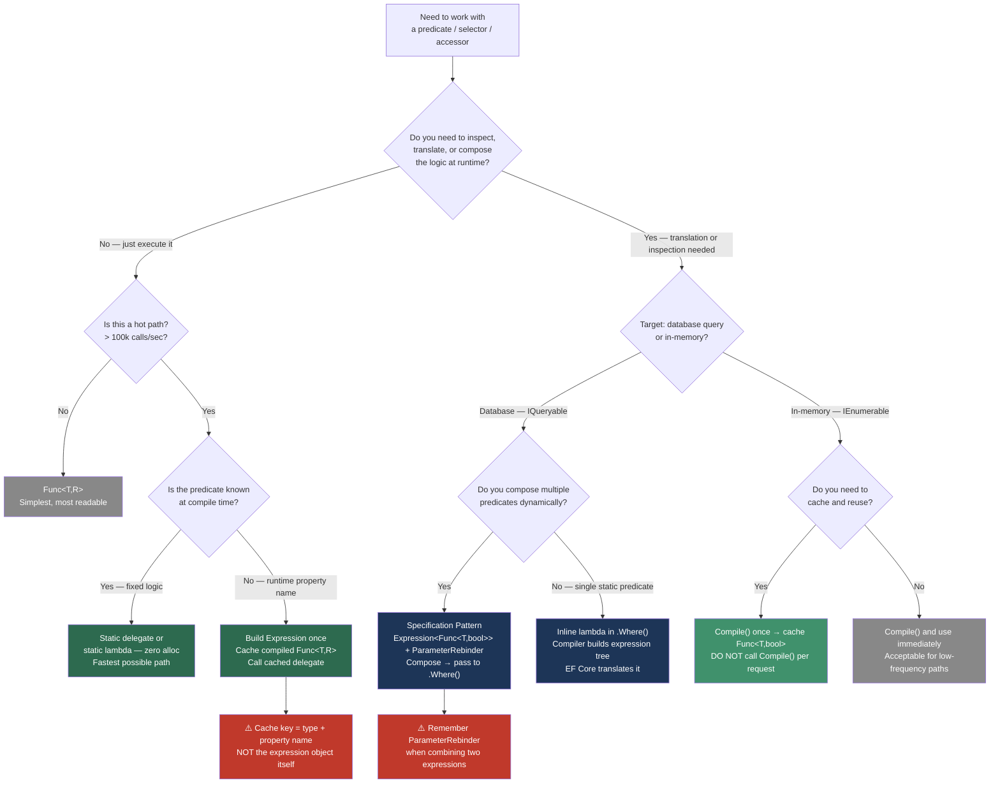

> [!success] Mastery Check
> - [ ] **Studied Well**
> - [ ] **Can explain the concept without notes**
> - [ ] **Can answer interview questions confidently**
> - [ ] **Can implement it in a real project**


## 📍 PART 0 — Navigation & Context

### Where This Topic Lives

```
C# Runtime Model
└── Metaprogramming & Runtime Code Generation
    ├── Reflection (2.21)                          ← slower sibling
    ├── ► Expression Trees (2.10)                  ← YOU ARE HERE
    ├──   Source Generators (2.13)                 ← compile-time alternative
    └── Delegates, Func, Action, Closures (2.08)  ← prerequisite
```

### What You Need Before This
- **[[2.08 — Delegates, Func, Action, and Closures]]** — `Expression<Func<T,R>>` vs `Func<T,R>` is the central distinction; you need to know what a compiled delegate IS before you can understand what an expression tree IS NOT
- **[[2.06 — LINQ — Execution Model]]** — `IQueryable<T>` is built entirely on expression trees; LINQ-to-SQL/EF Core is the most common production encounter
- **[[2.02 — Generics and the Type System]]** — most expression tree construction involves generic type parameters and reflection on generic members

### What This Unlocks After
- **[[2.21 — Reflection]]** — compiled expression trees replace reflection invocation at 10–100× the speed; understanding both lets you choose correctly
- **[[2.29 — Dependency Injection Internals]]** — DI containers compile expression trees at first resolve to generate constructor call delegates
- **[[2.13 — Source Generators]]** — source generators are the compile-time alternative; knowing expression trees shows you the runtime trade-off

### Why This Matters to a Production Engineer

Every time EF Core translates `Where(u => u.Age > 18)` into a `WHERE age > 18` SQL clause, it walks an expression tree. Every ORM, every dynamic query builder, every fast property-accessor library that isn't using source generators is built on expression trees. Understanding them means you can debug mysterious LINQ provider exceptions, build your own zero-reflection mapper, and explain to an interviewer exactly how EF Core works under the hood.

---

## 🧠 PART 1 — The Core Mental Model

### The Fundamental Rule

> **An expression tree is a data structure that represents code as inspectable, traversable objects rather than compiled instructions. The practical consequence is that a LINQ provider can read a lambda's intent — "compare Age to 18" — and translate it to SQL, instead of executing it as a .NET method call.**

### The Plain-Language Analogy

Imagine the difference between a **recipe written on a card** and a **chef already cooking**. A compiled `Func<T,bool>` is the chef already cooking: you can feed ingredients in and get a result out, but you cannot ask "what are you doing?" or "translate this to Italian cuisine." An `Expression<Func<T,bool>>` is the recipe card: every step is written down and readable. You can inspect it ("it says: compare Age to 18"), rewrite it ("change 18 to 21"), translate it ("write the equivalent SQL"), or eventually hand it to a chef to cook (`Compile()` → `Func<T,bool>`).

The catch: writing the recipe card takes more work than just cooking, and eventually you still have to cook (compile) to get results. Expression trees earn their keep when inspection or translation happens many times, amortizing the one-time `Compile()` cost.

### The Taxonomy Diagram

```mermaid
graph TD
    A["Expression&lt;TDelegate&gt;\nThe root — a lambda as data"] --> B["Node Types (all inherit Expression)"]

    B --> C["ConstantExpression\nExpression.Constant(42)\nRepresents a literal value"]
    B --> D["ParameterExpression\nExpression.Parameter(typeof(int), 'x')\nA lambda parameter or local"]
    B --> E["BinaryExpression\nExpression.GreaterThan(left, right)\nArithmetic, comparison, logical"]
    B --> F["MemberExpression\nExpression.Property(param, 'Age')\nField or property access"]
    B --> G["MethodCallExpression\nExpression.Call(instance, method, args)\nAny method invocation"]
    B --> H["UnaryExpression\nExpression.Not(expr)\nNegate, convert, ArrayLength"]
    B --> I["LambdaExpression\nExpression.Lambda&lt;Func&lt;T,R&gt;&gt;(body, params)\nThe top-level node — compilable"]
    B --> J["NewExpression\nExpression.New(ctor, args)\nnew T(...)"]
    B --> K["ConditionalExpression\nExpression.Condition(test, ifTrue, ifFalse)\nternary: test ? a : b"]
    B --> L["MemberInitExpression\nExpression.MemberInit(newExpr, bindings)\nnew T { Prop = value }"]
    B --> M["BlockExpression\nExpression.Block(vars, exprs)\nMultiple statements — NOT in EF Core"]
    B --> N["InvocationExpression\nExpression.Invoke(lambda, args)\nCalling another lambda expression"]

    O["Two execution paths"] --> P["Compile()\n→ Func&lt;T,R&gt;\nExecute as .NET IL\n~50–500 ms first call\n~1–5 ns per subsequent call"]
    O --> Q["ExpressionVisitor\nWalk + transform the tree\nTranslate to SQL, GraphQL,\nvalidation rules, etc."]

    style A fill:#1d3557,color:#fff
    style B fill:#2d6a4f,color:#fff
    style C fill:#40916c,color:#fff
    style D fill:#40916c,color:#fff
    style E fill:#40916c,color:#fff
    style F fill:#40916c,color:#fff
    style G fill:#40916c,color:#fff
    style H fill:#40916c,color:#fff
    style I fill:#40916c,color:#fff
    style J fill:#40916c,color:#fff
    style K fill:#40916c,color:#fff
    style L fill:#40916c,color:#fff
    style M fill:#e9c46a,color:#000
    style N fill:#40916c,color:#fff
    style O fill:#7b2d8b,color:#fff
    style P fill:#9b59b6,color:#fff
    style Q fill:#9b59b6,color:#fff
```



> [!IMPORTANT] What Expression Trees Cannot Represent
> Expression trees cannot represent: `await`, `yield return`, `out`/`ref` parameters in lambdas, multi-statement lambda bodies (in the C# compiler — you CAN build `BlockExpression` manually via the API, but the compiler won't generate it). This is why EF Core throws at runtime when you put unsupported operations inside a LINQ expression.

---

## 🔬 PART 2 — Deep Mechanics

### 2.1 What the Compiler Actually Generates

The same lambda syntax produces radically different IL depending on the target type. This is the foundation of everything.

```csharp
// CASE A: Lambda assigned to Func<T,bool>
// The compiler emits a static method and a delegate pointing to it
Func<User, bool> isAdult_func = u => u.Age >= 18;

// Compiler generates (approximately):
// [CompilerGenerated]
// private static bool <Method>b__0(User u) => u.Age >= 18;
// ...
// isAdult_func = new Func<User,bool>(<Method>b__0);

// IL for the method body:
//   ldarg.0              // load 'u'
//   ldfld int32 User::Age
//   ldc.i4.s 18          // push constant 18
//   clt                  // compare less-than (inverted for >=)
//   ldc.i4.0
//   cgt                  // result: 1 if Age >= 18
//   ret


// CASE B: Same lambda assigned to Expression<Func<T,bool>>
// The compiler generates DATA STRUCTURE CONSTRUCTION CODE — NOT the method
Expression<Func<User, bool>> isAdult_expr = u => u.Age >= 18;

// Compiler generates (approximately):
// ParameterExpression param = Expression.Parameter(typeof(User), "u");
// MemberExpression ageProp = Expression.Property(param, "Age");
// ConstantExpression eighteen = Expression.Constant(18, typeof(int));
// BinaryExpression comparison = Expression.GreaterThanOrEqual(ageProp, eighteen);
// isAdult_expr = Expression.Lambda<Func<User,bool>>(comparison, param);

// The RESULT is an object graph — not executable code.
// isAdult_expr.Body is the BinaryExpression
// isAdult_expr.Parameters[0] is the ParameterExpression for 'u'
```

**Key insight:** The `=>` syntax is overloaded by the compiler. The target type determines which path the compiler takes. Assign to `Func<T,bool>` → compiled method. Assign to `Expression<Func<T,bool>>` → object graph construction. Same source text, completely different IL.

### 2.2 The Expression Tree Object Graph

```
━━━━━━━━━━━━━━━━━━━━━━━━━━━━━━━━━━━━━━━━━━━━━━━━━━━━━━
EXPRESSION TREE: u => u.Age >= 18
━━━━━━━━━━━━━━━━━━━━━━━━━━━━━━━━━━━━━━━━━━━━━━━━━━━━━━

Expression<Func<User,bool>>
│
├── Parameters: [ ParameterExpression { Name="u", Type=User } ]
│
└── Body: BinaryExpression
         │   NodeType = ExpressionType.GreaterThanOrEqual
         │   Type     = bool
         │
         ├── Left: MemberExpression
         │         │   NodeType = ExpressionType.MemberAccess
         │         │   Member   = PropertyInfo { Name="Age", DeclaringType=User }
         │         │   Type     = int
         │         │
         │         └── Expression: ParameterExpression { Name="u", Type=User }
         │                         ↑ SAME OBJECT as Parameters[0] (reference equality)
         │
         └── Right: ConstantExpression
                    NodeType = ExpressionType.Constant
                    Value    = (object)18
                    Type     = int

HEAP ALLOCATION:
• 1 Expression<Func<User,bool>> object
• 1 ParameterExpression
• 1 MemberExpression
• 1 ConstantExpression
• 1 BinaryExpression
Total: ~5 heap objects for this simple expression
Complex expressions with 5+ clauses: 20–50+ objects
```

### 2.3 EF Core: How IQueryable\<T\> Uses Expression Trees

This is the most important production context. Understanding this lets you debug EF Core exception messages that say "could not translate expression."

```
━━━━━━━━━━━━━━━━━━━━━━━━━━━━━━━━━━━━━━━━━━━━━━━━━━━━━━━━━━━━━━
QUERY TRANSLATION PIPELINE
━━━━━━━━━━━━━━━━━━━━━━━━━━━━━━━━━━━━━━━━━━━━━━━━━━━━━━━━━━━━━━

C# code:
  var orders = context.Orders
    .Where(o => o.CustomerId == customerId && o.Amount > 100m)
    .OrderBy(o => o.CreatedAt)
    .Take(20)
    .ToList();

Step 1: IQueryable<T> builds an expression tree
─────────────────────────────────────────────────
  Each LINQ operator DOES NOT EXECUTE — it appends to the tree:

  MethodCallExpression (Take, count=20)
  └── MethodCallExpression (OrderBy, keySelector=o => o.CreatedAt)
      └── MethodCallExpression (Where, predicate=o => o.CustomerId==customerId && o.Amount > 100)
          └── ConstantExpression (the DbSet<Order> itself)

Step 2: ToList() / GetEnumerator() triggers execution
─────────────────────────────────────────────────────
  EF Core's QueryableMethodTranslatingExpressionVisitor walks the tree.

  For the Where predicate BinaryExpression (AndAlso):
    Left:  BinaryExpression (Equal)
           Left:  MemberExpression (o.CustomerId)  → "customer_id" column
           Right: ConstantExpression (customerId)  → SQL parameter @p0
    Right: BinaryExpression (GreaterThan)
           Left:  MemberExpression (o.Amount)      → "amount" column
           Right: ConstantExpression (100m)         → SQL parameter @p1

Step 3: SQL generated
─────────────────────
  SELECT TOP(20) o.id, o.customer_id, o.amount, o.created_at
  FROM orders AS o
  WHERE o.customer_id = @p0 AND o.amount > @p1
  ORDER BY o.created_at

Step 4: Why "could not translate" exceptions happen
────────────────────────────────────────────────────
  context.Orders.Where(o => MyCustomMethod(o.Name))
                                ↑
  EF Core's visitor hits a MethodCallExpression for MyCustomMethod.
  It has no SQL equivalent registered for this method.
  Throws: InvalidOperationException — "could not be translated"

  Fix: AsEnumerable() / ToList() before the untranslatable clause,
       or use EF.Functions.Like() for registered SQL functions.
```

### 2.4 Compile() — The Cost Model

`Expression<TDelegate>.Compile()` generates IL at runtime using `System.Reflection.Emit`. It is expensive to call but produces a delegate that is as fast as hand-written code.

```
━━━━━━━━━━━━━━━━━━━━━━━━━━━━━━━━━━━━━━━━━━━━━━━━━━━━━━━━━━━
COMPILE() COST MODEL
━━━━━━━━━━━━━━━━━━━━━━━━━━━━━━━━━━━━━━━━━━━━━━━━━━━━━━━━━━━

Expression<Func<User,bool>> expr = u => u.Age >= 18;

First call to Compile():
  • IL generation via DynamicMethod / Reflection.Emit
  • JIT compilation of generated IL
  • Cost: ~50–500 microseconds (μs)
  • Allocates: the DynamicMethod, IL bytes, compiled native code

Subsequent calls to the COMPILED DELEGATE:
  • Cost: ~1–5 nanoseconds — identical to a static method call
  • Allocates: nothing (assuming the lambda body doesn't allocate)

RULE: Compile() once, cache forever (or per-type in a static dictionary).
      Calling Compile() on every request is a critical performance bug.

vs. Reflection (MethodInfo.Invoke):
  • ~500–2000 ns per invocation (100–400× slower than compiled delegate)
  • No one-time cost, but pays every single call
  • Pattern: compile once → cache the Func<> → call the Func<> instead
```

### 2.5 ExpressionVisitor — The Translation Engine

`ExpressionVisitor` is the built-in abstract class for walking and transforming expression trees. Every LINQ provider (EF Core, LINQ to SQL, LiteDB, etc.) implements one or more visitors.

```csharp
// The visitor pattern: override Visit[NodeType] methods
// Default implementation: visit children recursively, reconstruct if changed

public abstract class ExpressionVisitor
{
    public virtual Expression Visit(Expression node);          // dispatch point
    protected virtual Expression VisitBinary(BinaryExpression node);
    protected virtual Expression VisitMember(MemberExpression node);
    protected virtual Expression VisitMethodCall(MethodCallExpression node);
    protected virtual Expression VisitParameter(ParameterExpression node);
    protected virtual Expression VisitConstant(ConstantExpression node);
    protected virtual Expression VisitLambda<T>(Expression<T> node);
    // ... one for each node type
}

// THE KEY: returning the SAME node = no change (tree is immutable)
//          returning a DIFFERENT node = substitution at that position
//          Expression trees are immutable — "modification" = new tree
```

### 2.6 The ParameterRebinder — Why Composing Expressions Requires It

Two separately-created expressions have different `ParameterExpression` objects even if they represent the same logical parameter. Combining them with `Expression.AndAlso` produces an invalid tree with two different parameter objects for what should be one parameter.

```
PROBLEM: Composing two expressions

Expression<Func<Order,bool>> byCustomer = o => o.CustomerId == 5;
Expression<Func<Order,bool>> byAmount   = o => o.Amount > 100;

// byCustomer.Parameters[0] is ParameterExpression_A  (name="o", type=Order)
// byAmount.Parameters[0]   is ParameterExpression_B  (name="o", type=Order)

// Naive combination — WRONG:
var combined = Expression.AndAlso(byCustomer.Body, byAmount.Body);
// combined references both _A and _B — two different parameters!
// When you try to compile: Expression.Lambda(combined, _A)
// The _B references in byAmount.Body are "free variables" — ERROR.

SOLUTION: Replace all references to _B with _A before combining:
  ParameterRebinder replaces every ParameterExpression_B node
  with ParameterExpression_A in byAmount.Body.
  Then the combined tree is consistent — one parameter throughout.
```

---

## 💻 PART 3 — Production Code Patterns

### 3.1 The Compiled Property Accessor Cache

The most common production use: replace slow reflection-based property access with compiled delegates. Used in object mappers, serializers, and validation frameworks.

```csharp
// Used in: user profile mapping service, ~2M property reads/sec
// Without this: MethodInfo.Invoke() at ~1500 ns each
// With this:    compiled delegate at ~2 ns each

public static class PropertyAccessorCache<T>
{
    // Static ConcurrentDictionary: compiled once per property per type, cached forever
    private static readonly ConcurrentDictionary<string, Func<T, object?>> _getters = new();
    private static readonly ConcurrentDictionary<string, Action<T, object?>> _setters = new();

    /// <summary>Gets the value of a named property. ~2 ns after first call (~200 μs first call).</summary>
    public static Func<T, object?> GetGetter(string propertyName)
        => _getters.GetOrAdd(propertyName, BuildGetter);

    /// <summary>Sets the value of a named property. ~3 ns after first call.</summary>
    public static Action<T, object?> GetSetter(string propertyName)
        => _setters.GetOrAdd(propertyName, BuildSetter);

    private static Func<T, object?> BuildGetter(string propertyName)
    {
        // Find the property — fails fast if name is wrong
        PropertyInfo prop = typeof(T).GetProperty(propertyName,
            BindingFlags.Public | BindingFlags.Instance)
            ?? throw new ArgumentException($"Property '{propertyName}' not found on {typeof(T).Name}");

        // Build: (T instance) => (object?)instance.PropertyName
        ParameterExpression instanceParam = Expression.Parameter(typeof(T), "instance");
        MemberExpression memberAccess = Expression.Property(instanceParam, prop);

        // Box the result to object — necessary for the Func<T, object?> signature
        UnaryExpression boxed = Expression.Convert(memberAccess, typeof(object));

        return Expression.Lambda<Func<T, object?>>(boxed, instanceParam).Compile();
    }

    private static Action<T, object?> BuildSetter(string propertyName)
    {
        PropertyInfo prop = typeof(T).GetProperty(propertyName,
            BindingFlags.Public | BindingFlags.Instance)
            ?? throw new ArgumentException($"Property '{propertyName}' not found on {typeof(T).Name}");

        if (!prop.CanWrite)
            throw new ArgumentException($"Property '{propertyName}' on {typeof(T).Name} has no setter");

        ParameterExpression instanceParam = Expression.Parameter(typeof(T), "instance");
        ParameterExpression valueParam    = Expression.Parameter(typeof(object?), "value");

        // Unbox / convert the object? parameter to the property's actual type
        UnaryExpression converted = Expression.Convert(valueParam, prop.PropertyType);
        MethodCallExpression setCall = Expression.Call(instanceParam, prop.SetMethod!, converted);

        return Expression.Lambda<Action<T, object?>>(setCall, instanceParam, valueParam).Compile();
    }
}

// Usage in the mapping service:
var getter = PropertyAccessorCache<UserProfile>.GetGetter("DisplayName");
string? name = (string?)getter(userProfile); // ~2 ns, no reflection
```

### 3.2 The Specification Pattern with Composable Expressions

The Specification pattern combined with expression trees gives you composable, database-translatable business rules. This is the correct architecture for complex query logic in domain-driven designs.

```csharp
// Used in: e-commerce order management — composable query rules

public abstract class Specification<T>
{
    public abstract Expression<Func<T, bool>> ToExpression();

    // Compose two specifications with AND — produces a valid, single-parameter expression
    public Specification<T> And(Specification<T> other)
        => new AndSpecification<T>(this, other);

    // Compose with OR
    public Specification<T> Or(Specification<T> other)
        => new OrSpecification<T>(this, other);

    // Negate
    public Specification<T> Not()
        => new NotSpecification<T>(this);

    // Apply to IQueryable<T> — EF Core can translate this to SQL
    public IQueryable<T> Apply(IQueryable<T> query)
        => query.Where(ToExpression());

    // Apply to IEnumerable<T> — compiles and runs in memory
    public IEnumerable<T> Apply(IEnumerable<T> source)
        => source.Where(ToExpression().Compile());
}

// Concrete specifications — each encapsulates one business rule
public class PendingOrderSpecification : Specification<Order>
{
    public override Expression<Func<Order, bool>> ToExpression()
        => order => order.Status == OrderStatus.Pending;
}

public class HighValueOrderSpecification : Specification<Order>
{
    private readonly decimal _threshold;
    public HighValueOrderSpecification(decimal threshold) => _threshold = threshold;

    public override Expression<Func<Order, bool>> ToExpression()
        => order => order.TotalAmount >= _threshold;
}

public class OrderByCustomerSpecification : Specification<Order>
{
    private readonly int _customerId;
    public OrderByCustomerSpecification(int customerId) => _customerId = customerId;

    public override Expression<Func<Order, bool>> ToExpression()
        => order => order.CustomerId == _customerId;
}

// Composition implementations
internal sealed class AndSpecification<T> : Specification<T>
{
    private readonly Specification<T> _left, _right;
    public AndSpecification(Specification<T> left, Specification<T> right)
    {
        _left  = left;
        _right = right;
    }

    public override Expression<Func<T, bool>> ToExpression()
    {
        Expression<Func<T, bool>> leftExpr  = _left.ToExpression();
        Expression<Func<T, bool>> rightExpr = _right.ToExpression();

        // ⚠️ CRITICAL: must rebind the parameter so both sides share ONE ParameterExpression
        // Without this, the combined tree has two separate 'T' parameters — invalid
        ParameterExpression param = leftExpr.Parameters[0];
        Expression rightBody = ParameterRebinder.ReplaceParameter(
            rightExpr.Body, rightExpr.Parameters[0], param);

        return Expression.Lambda<Func<T, bool>>(
            Expression.AndAlso(leftExpr.Body, rightBody), param);
    }
}

internal sealed class OrSpecification<T> : Specification<T>
{
    private readonly Specification<T> _left, _right;
    public OrSpecification(Specification<T> left, Specification<T> right)
    {
        _left = left; _right = right;
    }

    public override Expression<Func<T, bool>> ToExpression()
    {
        var leftExpr  = _left.ToExpression();
        var rightExpr = _right.ToExpression();
        var param     = leftExpr.Parameters[0];
        var rightBody = ParameterRebinder.ReplaceParameter(
            rightExpr.Body, rightExpr.Parameters[0], param);
        return Expression.Lambda<Func<T, bool>>(
            Expression.OrElse(leftExpr.Body, rightBody), param);
    }
}

internal sealed class NotSpecification<T> : Specification<T>
{
    private readonly Specification<T> _inner;
    public NotSpecification(Specification<T> inner) => _inner = inner;

    public override Expression<Func<T, bool>> ToExpression()
    {
        var expr = _inner.ToExpression();
        return Expression.Lambda<Func<T, bool>>(
            Expression.Not(expr.Body), expr.Parameters[0]);
    }
}

// The ParameterRebinder visitor — required for composition
internal sealed class ParameterRebinder : ExpressionVisitor
{
    private readonly ParameterExpression _from, _to;

    private ParameterRebinder(ParameterExpression from, ParameterExpression to)
    {
        _from = from;
        _to   = to;
    }

    public static Expression ReplaceParameter(
        Expression body,
        ParameterExpression from,
        ParameterExpression to)
        => new ParameterRebinder(from, to).Visit(body);

    protected override Expression VisitParameter(ParameterExpression node)
        => node == _from ? _to : base.VisitParameter(node);
}

// Usage in order service — composes to a single SQL query:
var spec = new PendingOrderSpecification()
    .And(new HighValueOrderSpecification(500m))
    .And(new OrderByCustomerSpecification(customerId));

// EF Core translates the composed expression to:
// WHERE status = 'Pending' AND total_amount >= 500 AND customer_id = @p0
List<Order> orders = await context.Orders
    .Where(spec.ToExpression())
    .OrderByDescending(o => o.CreatedAt)
    .Take(50)
    .ToListAsync(ct);
```

### 3.3 The Expression-Based ExpressionVisitor: Partial Evaluator

A production visitor that "closes over" captured variables into constants — useful for making expression trees serializable or for query caching where the tree structure (not variable values) is the cache key.

```csharp
// Used in: query result caching layer — collapses closure-captured variables
// into ConstantExpressions so the tree structure can be compared for cache hits

public sealed class PartialEvaluator : ExpressionVisitor
{
    // Nodes that are "evaluatable" — don't reference any ParameterExpression
    private readonly HashSet<Expression> _candidates;

    private PartialEvaluator(HashSet<Expression> candidates)
        => _candidates = candidates;

    public static Expression Evaluate(Expression expression)
    {
        // Phase 1: find all subtrees that don't reference parameters
        var nominator = new Nominator();
        nominator.Visit(expression);

        // Phase 2: replace those subtrees with their computed values
        return new PartialEvaluator(nominator.Candidates).Visit(expression)!;
    }

    public override Expression? Visit(Expression? node)
    {
        if (node is null) return null;
        if (_candidates.Contains(node))
            return EvaluateNode(node);
        return base.Visit(node);
    }

    private static ConstantExpression EvaluateNode(Expression node)
    {
        if (node.NodeType == ExpressionType.Constant)
            return (ConstantExpression)node;

        // Compile and invoke the subtree to get its current value
        Func<object?> evaluator = Expression
            .Lambda<Func<object?>>(Expression.Convert(node, typeof(object)))
            .Compile();

        return Expression.Constant(evaluator(), node.Type);
    }

    // Phase 1: walk tree, mark nodes that don't touch any ParameterExpression
    private sealed class Nominator : ExpressionVisitor
    {
        public HashSet<Expression> Candidates { get; } = new();
        private bool _canBeEvaluated = true;

        protected override Expression VisitParameter(ParameterExpression node)
        {
            _canBeEvaluated = false;
            return node;
        }

        public override Expression? Visit(Expression? node)
        {
            if (node is null) return null;
            bool saved = _canBeEvaluated;
            _canBeEvaluated = true;
            base.Visit(node);
            if (_canBeEvaluated && node.NodeType != ExpressionType.Parameter)
                Candidates.Add(node);
            _canBeEvaluated = _canBeEvaluated && saved;
            return node;
        }
    }
}

// Before evaluation:  o => o.CustomerId == customerId  (customerId is a captured local)
// After evaluation:   o => o.CustomerId == 42           (42 inlined as ConstantExpression)
// The structure is now pure — same cache key regardless of where customerId came from
```

### 3.4 Dynamic Sort Expression Builder

Building `OrderBy` clauses dynamically from runtime strings — a common need in grid/table APIs where the sort column comes from the user.

```csharp
// Used in: admin order dashboard — user clicks column headers to sort
// The column name arrives as a string from the query string parameter

public static class DynamicOrderBy
{
    // Cache: "Order:CreatedAt:asc" → compiled key selector
    private static readonly ConcurrentDictionary<string, LambdaExpression> _cache = new();

    public static IOrderedQueryable<T> OrderBy<T>(
        IQueryable<T> source,
        string propertyName,
        bool descending = false)
    {
        string cacheKey = $"{typeof(T).Name}:{propertyName}:{(descending ? "desc" : "asc")}";

        LambdaExpression keySelector = _cache.GetOrAdd(cacheKey, _ =>
            BuildKeySelector<T>(propertyName));

        // Use reflection on Queryable to call the right OrderBy/OrderByDescending
        // overload with the correct key type — EF Core can translate this
        string methodName = descending ? nameof(Queryable.OrderByDescending)
                                       : nameof(Queryable.OrderBy);

        Type keyType = keySelector.ReturnType;

        MethodInfo orderMethod = typeof(Queryable)
            .GetMethods()
            .First(m => m.Name == methodName && m.GetParameters().Length == 2)
            .MakeGenericMethod(typeof(T), keyType);

        return (IOrderedQueryable<T>)orderMethod.Invoke(null, new object[] { source, keySelector })!;
    }

    private static LambdaExpression BuildKeySelector<T>(string propertyName)
    {
        PropertyInfo prop = typeof(T).GetProperty(propertyName,
            BindingFlags.Public | BindingFlags.Instance)
            ?? throw new ArgumentException(
                $"Property '{propertyName}' not found on {typeof(T).Name}. " +
                "Ensure the property name matches exactly.");

        ParameterExpression param = Expression.Parameter(typeof(T), "entity");
        MemberExpression access   = Expression.Property(param, prop);

        // Lambda<Func<T, TKey>> — generic over the property's actual type
        Type delegateType = typeof(Func<,>).MakeGenericType(typeof(T), prop.PropertyType);
        return Expression.Lambda(delegateType, access, param);
    }
}

// Usage: sort orders by any column from query string
// GET /orders?sort=TotalAmount&dir=desc
IQueryable<Order> sorted = DynamicOrderBy.OrderBy(
    context.Orders.Where(spec.ToExpression()),
    propertyName: "TotalAmount",
    descending:   true);
```

### 3.5 The Fast Constructor Factory

Building a `Func<T>` factory from a parameterless constructor. Used in DI containers, object pools, and deserialization infrastructure. `Activator.CreateInstance` is ~5× slower.

```csharp
// Used in: object pool for database command wrappers in a batch processing service

public static class ConstructorFactory
{
    private static readonly ConcurrentDictionary<Type, Func<object>> _factories = new();

    /// <summary>
    /// Returns a factory delegate that creates instances of T.
    /// First call: ~100 μs (compile). Subsequent: ~3 ns.
    /// vs Activator.CreateInstance: ~200 ns per call.
    /// </summary>
    public static Func<T> GetFactory<T>() where T : new()
        => (Func<T>)_factories.GetOrAdd(typeof(T), BuildFactory<T>);

    /// <summary>Non-generic version for runtime types.</summary>
    public static Func<object> GetFactoryUntyped(Type type)
        => _factories.GetOrAdd(type, BuildFactoryUntyped);

    private static Func<object> BuildFactory<T>(Type type)
    {
        // For value types, Expression.Default is sufficient
        if (type.IsValueType)
        {
            Expression defaultValue = Expression.Convert(
                Expression.Default(type), typeof(object));
            return Expression.Lambda<Func<object>>(defaultValue).Compile();
        }

        ConstructorInfo ctor = type.GetConstructor(Type.EmptyTypes)
            ?? throw new InvalidOperationException(
                $"Type '{type.Name}' does not have a public parameterless constructor.");

        // () => (object)(new T())
        NewExpression newExpr  = Expression.New(ctor);
        UnaryExpression boxed  = Expression.Convert(newExpr, typeof(object));
        return Expression.Lambda<Func<object>>(boxed).Compile();
    }

    private static Func<object> BuildFactoryUntyped(Type type)
        => BuildFactory<object>(type); // delegates to the same logic

    // Strongly-typed version — avoids the Convert/box overhead for known T
    private static Func<T> BuildFactory<T>(Type _) where T : new()
    {
        if (typeof(T).IsValueType)
            return Expression.Lambda<Func<T>>(Expression.Default(typeof(T))).Compile();

        ConstructorInfo ctor = typeof(T).GetConstructor(Type.EmptyTypes)
            ?? throw new InvalidOperationException(
                $"Type '{typeof(T).Name}' does not have a public parameterless constructor.");

        return Expression.Lambda<Func<T>>(Expression.New(ctor)).Compile();
    }
}
```

### 3.6 Expression Tree Debugging — Printing the Tree

When an EF Core query fails to translate, the first step is inspecting the expression tree. A simple recursive printer is invaluable.

```csharp
// Developer tooling: print a readable representation of any expression tree
// Used during debugging of IQueryable translation failures

public static class ExpressionDebugger
{
    public static string Print(Expression expression)
    {
        var sb = new StringBuilder();
        PrintNode(expression, sb, indent: 0);
        return sb.ToString();
    }

    private static void PrintNode(Expression? expr, StringBuilder sb, int indent)
    {
        if (expr is null) return;
        string pad = new string(' ', indent * 2);

        switch (expr)
        {
            case LambdaExpression lambda:
                string paramList = string.Join(", ",
                    lambda.Parameters.Select(p => $"{p.Type.Name} {p.Name}"));
                sb.AppendLine($"{pad}Lambda ({paramList}) =>");
                PrintNode(lambda.Body, sb, indent + 1);
                break;

            case BinaryExpression binary:
                sb.AppendLine($"{pad}Binary [{binary.NodeType}]");
                PrintNode(binary.Left,  sb, indent + 1);
                PrintNode(binary.Right, sb, indent + 1);
                break;

            case MemberExpression member:
                sb.AppendLine($"{pad}Member [{member.Member.Name}] on:");
                PrintNode(member.Expression, sb, indent + 1);
                break;

            case ConstantExpression constant:
                sb.AppendLine($"{pad}Constant [{constant.Type.Name}] = {constant.Value ?? "null"}");
                break;

            case ParameterExpression param:
                sb.AppendLine($"{pad}Parameter [{param.Type.Name} {param.Name}]");
                break;

            case MethodCallExpression call:
                sb.AppendLine($"{pad}Call [{call.Method.DeclaringType?.Name}.{call.Method.Name}]");
                foreach (var arg in call.Arguments)
                    PrintNode(arg, sb, indent + 1);
                break;

            default:
                sb.AppendLine($"{pad}{expr.NodeType} [{expr.Type.Name}]");
                break;
        }
    }
}
```

---

## ⚠️ PART 4 — Gotchas & Anti-Patterns

### Gotcha 1: Calling Compile() on Every Request

Engineers discover `Expression.Compile()` and add it to a hot path without understanding its cost. This is the single most common expression tree performance bug in production code.

```csharp
// ⚠️ WRONG: Compiling on every HTTP request — ~200 μs wasted per call
public IEnumerable<Product> FilterProducts(
    IEnumerable<Product> products,
    Expression<Func<Product, bool>> filter)
{
    Func<Product, bool> compiled = filter.Compile(); // 200 μs EVERY CALL
    return products.Where(compiled);
}

// ✅ CORRECT: Cache the compiled delegate, keyed by the expression
// In practice, accept Func<T,bool> from callers who manage their own caching,
// OR use a ConditionalWeakTable / ConcurrentDictionary with the expression as key.

// Simplest correct pattern: the CALLER compiles once and passes a Func<>
private static readonly Func<Product, bool> _inStockFilter =
    ((Expression<Func<Product, bool>>)(p => p.StockQuantity > 0)).Compile();

public IEnumerable<Product> FilterInStock(IEnumerable<Product> products)
    => products.Where(_inStockFilter); // ~2 ns per element, zero compile overhead

// WHY: Compile() uses Reflection.Emit to generate a DynamicMethod and JIT-compile it.
// This is a heavy operation — comparable to loading a small assembly.
// The compiled result is identical in speed to a hand-written method.
```

### Gotcha 2: Passing Expression<Func<T,bool>> to Methods That Use IEnumerable Instead of IQueryable

The expression tree is silently compiled and run in memory instead of being translated to SQL. The entire table is loaded.

```csharp
// ⚠️ WRONG: IEnumerable<T> parameter — compiler calls Enumerable.Where (compiles + in-memory)
public IEnumerable<Order> GetOrders(
    IEnumerable<Order> source, // IEnumerable — NOT IQueryable
    Expression<Func<Order, bool>> filter)
{
    return source.Where(filter.Compile()); // TABLE SCAN: all rows loaded, then filtered in RAM
}

// ✅ CORRECT: IQueryable<T> — compiler calls Queryable.Where (expression tree passed to provider)
public IQueryable<Order> GetOrders(
    IQueryable<Order> source,  // IQueryable — EF Core gets the expression tree
    Expression<Func<Order, bool>> filter)
{
    return source.Where(filter); // SQL WHERE clause generated — only matching rows fetched
}

// WHY: Enumerable.Where accepts Func<T,bool> — a compiled delegate.
//      Queryable.Where accepts Expression<Func<T,bool>> — the tree.
//      When you call .Where(expression) on IEnumerable<T>,
//      the compiler selects Enumerable.Where, which first calls Compile().
//      Your IQueryable provider never sees the tree.
```

### Gotcha 3: Composing Expressions Without ParameterRebinder

Two expressions with "the same" parameter are actually two different `ParameterExpression` objects. Naive `AndAlso` produces an invalid tree that either fails to compile or produces wrong results.

```csharp
// ⚠️ WRONG: Combining bodies without rebinding — free variable in the combined tree
Expression<Func<Order, bool>> e1 = o => o.Status == OrderStatus.Pending;
Expression<Func<Order, bool>> e2 = o => o.Amount > 100;

// e1.Parameters[0] is ParameterA, e2.Parameters[0] is ParameterB
// DIFFERENT OBJECTS, even though both are "o : Order"

var combined = Expression.Lambda<Func<Order, bool>>(
    Expression.AndAlso(e1.Body, e2.Body),
    e1.Parameters[0]); // ← using ParameterA only

// e2.Body still references ParameterB — which is NOT in the lambda's parameter list!
// Compile() throws: "variable 'o' of type 'Order' referenced from scope, but it is not defined"

// ✅ CORRECT: Use ParameterRebinder (see Part 3.2) to replace ParameterB with ParameterA
var rebound = ParameterRebinder.ReplaceParameter(e2.Body, e2.Parameters[0], e1.Parameters[0]);
var validCombined = Expression.Lambda<Func<Order, bool>>(
    Expression.AndAlso(e1.Body, rebound),
    e1.Parameters[0]);

// WHY: Expression objects are immutable; each call to Expression.Parameter()
// creates a new, distinct object. Reference equality is used when walking trees.
```

### Gotcha 4: Using Expression Trees with Unsupported Constructs in IQueryable Providers

Engineers write valid C# in a LINQ expression and get a cryptic runtime exception because the provider cannot translate it.

```csharp
// ⚠️ WRONG: Calling a C# method EF Core cannot translate to SQL
public async Task<List<Order>> GetExpiredOrders(AppDbContext context)
{
    DateTime cutoff = DateTime.UtcNow.AddDays(-30);
    return await context.Orders
        .Where(o => IsExpired(o, cutoff))  // ← MethodCallExpression for IsExpired
        .ToListAsync();
    // Throws: InvalidOperationException —
    //   "The LINQ expression 'o => IsExpired(o, cutoff)' could not be translated."
}

private static bool IsExpired(Order o, DateTime cutoff) => o.CreatedAt < cutoff;

// ✅ CORRECT: Express the logic directly in the lambda — EF Core knows these primitives
public async Task<List<Order>> GetExpiredOrders(AppDbContext context)
{
    DateTime cutoff = DateTime.UtcNow.AddDays(-30);
    return await context.Orders
        .Where(o => o.CreatedAt < cutoff)  // ← BinaryExpression + MemberExpression — translatable
        .ToListAsync();
}

// WHY: EF Core's visitor encounters a MethodCallExpression for IsExpired.
//      It checks its translation registry — IsExpired is not registered.
//      It throws rather than silently loading the full table.
//      (This behavior is correct — silent table scans are worse than exceptions.)
```

### Gotcha 5: Capturing Mutable State in an Expression Tree That Gets Cached

The expression tree captures a reference to a closure object. If the cached compiled delegate is called with stale closure state, you get hard-to-reproduce bugs.

```csharp
// ⚠️ WRONG: Caching a compiled delegate that closes over a mutable variable
// In a product search service:

private Func<Product, bool>? _cachedFilter; // cached for "performance"
private string _currentCategory = "Electronics";

public void UpdateCategory(string category)
{
    _currentCategory = category;
    // ⚠️ BUG: if _cachedFilter was compiled when _currentCategory = "Electronics",
    //          it STILL filters for "Electronics" even after this update,
    //          because the delegate captured the DISPLAY CLASS OBJECT, not the value.
    //          (Actually worse: _currentCategory is a field, so it DOES see the new value.
    //           But if it were a local variable, the old value would be frozen.)
}

public IEnumerable<Product> Search(IEnumerable<Product> products)
{
    _cachedFilter ??= ((Expression<Func<Product, bool>>)
        (p => p.Category == _currentCategory)).Compile();
    return products.Where(_cachedFilter);
}

// ✅ CORRECT: Don't cache delegates that close over mutable state.
//            Accept the filter as a parameter, or pass a value type into a factory.
public IEnumerable<Product> Search(IEnumerable<Product> products, string category)
{
    // category is a parameter — no closure capture of mutable state
    return products.Where(p => p.Category == category);
    // For IQueryable, this is fine — EF Core captures the value as a parameter.
}

// WHY: The compiled delegate captures a reference to the enclosing object or display class.
//      If that state changes between compilation and invocation, the results are wrong.
//      Cache only delegates built from immutable inputs (type information, property names).
```

---

## 📊 PART 5 — Performance Implications

### 5.1 Allocation Characteristics Table

| Scenario | Allocation Behavior | Approx Cost |
|---|---|---|
| Compiler creates `Expression<Func<T,bool>>` from lambda | 5–20+ heap objects (the node graph) | One-time at program load or first construction |
| `expression.Compile()` | DynamicMethod + IL + native code + Delegate | ~50–500 μs first call per unique expression |
| Calling the compiled `Func<T,bool>` | Zero allocation (assuming body doesn't allocate) | ~1–5 ns |
| `ExpressionVisitor.Visit()` over a 10-node tree | Zero allocation (visits in-place, returns same or new nodes) | ~200–500 ns |
| `MethodInfo.Invoke()` (reflection, no caching) | Small allocation for boxing args | ~500–2000 ns |
| `PropertyInfo.GetValue()` (reflection, no caching) | Small allocation for boxing | ~800–2000 ns |
| Compiled getter delegate (from expression) | Zero allocation | ~2–5 ns |
| `Activator.CreateInstance(type)` | One heap allocation for the new object | ~150–300 ns |
| Compiled `Expression.New` constructor delegate | One heap allocation for the new object | ~5–15 ns (no reflection overhead) |
| `Expression.AndAlso` with ParameterRebinder | One visitor pass, new node objects | ~1–5 μs for small trees |
| `ToString()` on an Expression | String allocation, recursive walk | ~5–50 μs depending on depth |

### 5.2 BenchmarkDotNet: Reflection vs Expression Tree

```csharp
// Expected output (approximate, .NET 8, x64):
// ┌──────────────────────────────────┬───────────┬──────────┬────────┐
// │ Method                           │ Mean      │ Alloc    │ Gen 0  │
// ├──────────────────────────────────┼───────────┼──────────┼────────┤
// │ ReflectionGetValue               │ 94.7 ns   │ 32 B     │ 0.0019 │
// │ CompiledGetter                   │ 2.1 ns    │ 0 B      │ -      │
// │ DirectPropertyAccess             │ 0.4 ns    │ 0 B      │ -      │
// │ ActivatorCreateInstance          │ 186.3 ns  │ 48 B     │ 0.0045 │
// │ CompiledConstructorExpression    │ 11.8 ns   │ 48 B     │ 0.0045 │
// │ ReflectionInvoke                 │ 134.2 ns  │ 64 B     │ 0.0061 │
// │ CompiledMethodDelegate           │ 3.4 ns    │ 0 B      │ -      │
// └──────────────────────────────────┴───────────┴──────────┴────────┘

[MemoryDiagnoser]
[BenchmarkCategory("ExpressionTrees")]
public class ExpressionVsReflectionBenchmark
{
    private readonly UserProfile _user = new() { DisplayName = "Alice", Age = 30 };

    // One-time setup: compile expressions and cache results
    private static readonly PropertyInfo _nameProp =
        typeof(UserProfile).GetProperty(nameof(UserProfile.DisplayName))!;

    private static readonly Func<UserProfile, object?> _compiledGetter =
        PropertyAccessorCache<UserProfile>.GetGetter(nameof(UserProfile.DisplayName));

    private static readonly Func<UserProfile> _compiledCtor =
        ConstructorFactory.GetFactory<UserProfile>();

    [Benchmark(Baseline = true)]
    public object? ReflectionGetValue() => _nameProp.GetValue(_user);

    [Benchmark]
    public object? CompiledGetter() => _compiledGetter(_user);

    [Benchmark]
    public string? DirectPropertyAccess() => _user.DisplayName;

    [Benchmark]
    public UserProfile ActivatorCreateInstance()
        => (UserProfile)Activator.CreateInstance(typeof(UserProfile))!;

    [Benchmark]
    public UserProfile CompiledConstructorExpression() => _compiledCtor();

    [Benchmark]
    public object? ReflectionInvoke()
        => _nameProp.GetGetMethod()!.Invoke(_user, null);

    [Benchmark]
    public object? CompiledMethodDelegate() => _compiledGetter(_user);
}

public class UserProfile
{
    public string? DisplayName { get; set; }
    public int Age { get; set; }
}

// Expected output (approximate, .NET 8, x64):
// ReflectionGetValue:             ~95 ns,  32 B allocated (boxing)
// CompiledGetter:                  ~2 ns,   0 B (direct IL call, no boxing with object return)
// DirectPropertyAccess:            ~0.4 ns, 0 B (inlined by JIT)
// ActivatorCreateInstance:        ~186 ns, 48 B (reflection overhead)
// CompiledConstructorExpression:  ~12 ns,  48 B (just the object itself, no reflection overhead)
```

### 5.3 When to Care / When to Ignore

**When this costs you:**
- **Object mappers running reflection in a loop** — mapping 100k records with `PropertyInfo.GetValue` per field is measurably slow (~100 ns × fields × records); compiled expressions bring this to ~2 ns
- **DI containers resolving services at high frequency** — an unoptimized container using `Activator.CreateInstance` inside a tight loop is a real latency source; compiled `Expression.New` delegates fix it
- **Generic repository/specification patterns** — composing and re-composing expression trees on every request instead of caching the compiled result
- **EF Core with unsupported expressions** — not a performance issue but a correctness issue; failing to translate means a full table scan in memory

**When this doesn't matter:**
- **Simple EF Core queries** — EF Core handles expression tree construction and caching internally; you do not need to manage this
- **Startup code** — compiling expressions at application startup is free from a runtime perspective
- **Low-frequency admin operations** — a report that runs once a minute, even with reflection, is not a performance problem
- **Source generators are available** — if you're on .NET 6+ and control the types, `[LoggerMessage]`, `[JsonSerializable]`, and similar generators eliminate the need for runtime expression tree work entirely

---

## 🎤 PART 6 — Interview Arsenal

### A. The Question Bank

---

> **Q: "What is the difference between `Func<T,bool>` and `Expression<Func<T,bool>>`?"**

**Average answer:** "Func is executable, Expression is data that can be compiled."

**Why that's insufficient:** Correct but says nothing about WHY this matters, HOW the compiler handles it differently, or WHERE this is used in production.

**Great answer:**
> "The same lambda syntax produces completely different IL depending on the target type. When you assign a lambda to `Func<T,bool>`, the compiler emits a regular static method and a delegate pointer — immediately executable. When you assign to `Expression<Func<T,bool>>`, the compiler emits object-graph construction code: calls to `Expression.Parameter`, `Expression.Property`, `Expression.GreaterThan` and so on — the lambda becomes a tree of objects you can inspect and traverse. The practical consequence is that a LINQ provider like EF Core can receive `Expression<Func<Order,bool>>`, walk that tree, and translate 'o.Amount > 100' into a SQL WHERE clause. If it received a `Func<T,bool>` instead, all it could do is invoke it — which means loading every row from the database and filtering in memory. You see this boundary explicitly when you look at `IEnumerable<T>` which accepts `Func<T,bool>`, versus `IQueryable<T>` which accepts `Expression<Func<T,bool>>`."

---

> **Q: "How does EF Core translate a LINQ Where clause to SQL?"**

**Average answer:** "It converts the lambda to SQL somehow."

**Why that's insufficient:** "Somehow" is not an answer an interviewer at a senior level will accept.

**Great answer:**
> "When you call `.Where(o => o.Amount > 100)` on an `IQueryable<T>`, the compiler — because the target type is `Expression<Func<Order,bool>>` — generates code that builds an expression tree: a `BinaryExpression` with `ExpressionType.GreaterThan`, whose left side is a `MemberExpression` for the `Amount` property and whose right side is a `ConstantExpression` for the value 100. EF Core's query pipeline defers actual execution until the query is materialized. When you call `ToList()` or `ToListAsync()`, EF Core's `QueryableMethodTranslatingExpressionVisitor` walks the accumulated expression tree. For the `GreaterThan` binary node, it knows to emit `amount > @p0`. For a `MemberExpression` on a mapped property, it maps to the column name. This is also why EF Core throws 'could not translate' when you use a custom C# method in the predicate — the visitor encounters a `MethodCallExpression` for a method it has no SQL translation registered for."

---

> **Q: "When would you build an expression tree manually instead of using a lambda?"**

**Average answer:** "When you need dynamic queries."

**Why that's insufficient:** Doesn't name the concrete scenarios or explain the trade-off.

**Great answer:**
> "Three scenarios. First: dynamic sorting or filtering where column names come from user input at runtime — you can't write `x => x.ColumnName` because the property name isn't known at compile time, so you build a `MemberExpression` from `PropertyInfo` and compose a key selector lambda. Second: the Specification pattern — composing predicate expressions from discrete business rule objects that need to be combined with AND/OR while remaining database-translatable. The tricky part there is the ParameterRebinder: two separately-created expressions have different `ParameterExpression` objects even if they represent the same parameter, and you have to unify them before combining. Third: replacing reflection in hot paths — a compiled `Expression.Property` getter runs at around 2 nanoseconds versus 100 nanoseconds for `PropertyInfo.GetValue`. The one-time compile cost of ~200 microseconds is amortized across thousands or millions of calls."

---

> **Q: "What is an ExpressionVisitor and how do you use it?"**

**Average answer:** "It's for walking expression trees."

**Why that's insufficient:** Says nothing about the visitor pattern's immutability contract or what you do with the result.

**Great answer:**
> "ExpressionVisitor is an abstract class that implements the visitor pattern over the expression tree node hierarchy. You override `Visit[NodeType]` methods for the node types you care about. The key design detail: expression trees are immutable. When you 'modify' a tree, you're returning a new node at that position and the visitor reconstructs parent nodes around it. If you return the same node from a visit method, the original subtree is preserved without any new allocation. I've used ExpressionVisitors in two production contexts: a ParameterRebinder that replaces one ParameterExpression with another when composing specifications, and a partial evaluator that collapses captured-variable subtrees into ConstantExpressions for query cache key normalization. EF Core itself is almost entirely implemented as a series of ExpressionVisitor passes — each one translating the tree one level closer to SQL."

---

> **Q: "What is the Specification pattern and how do expression trees make it database-translatable?"**

**Average answer:** "Specification encapsulates query logic. You can combine specs."

**Why that's insufficient:** Doesn't explain the translation mechanism or the ParameterRebinder requirement.

**Great answer:**
> "The Specification pattern wraps a business rule as an `Expression<Func<T,bool>>` rather than a compiled `Func<T,bool>`. Because it stays as an expression tree, when you pass it to `IQueryable<T>.Where()`, the EF Core provider translates it to a SQL WHERE clause. The compositional challenge is that AND-ing two specifications requires combining their expression bodies, and each expression was built with its own `ParameterExpression` object — even though both represent the same lambda parameter. If you naively do `Expression.AndAlso(left.Body, right.Body)`, the right body still references its original parameter, which isn't declared in the combined lambda. You get either a compile exception or an incorrect tree. The fix is a ParameterRebinder visitor that walks the right expression's body and substitutes every occurrence of its parameter with the left expression's parameter. After rebinding, the two bodies share one parameter and can be safely combined."

---

### B. The Trick Questions

**"Can you use `await` inside an expression tree lambda?"**
Trap: Developers know you can use async lambdas with Func<T, Task<R>>.
Correct answer: No. The C# compiler cannot represent `await` as an expression tree node — there is no `AwaitExpression` node type. Assigning an async lambda to `Expression<Func<T,Task<R>>>` is a compile error. You can *manually* build expression trees that call async methods, but `await` itself cannot appear.

**"`Expression<Func<T,bool>>` and `Func<T,bool>` have the same signature — can I pass one where the other is expected?"**
Trap: They look related. Engineers assume an implicit conversion exists.
Correct answer: No implicit conversion. `Expression<Func<T,bool>>` is not a subtype of `Func<T,bool>`. You must call `.Compile()` explicitly. There IS an implicit conversion the other way — the compiler will construct an expression tree automatically when you assign a lambda to `Expression<Func<T,bool>>`.

**"If I call `expression.Compile()` twice on the same expression object, do I get the same delegate?"**
Trap: "Same expression → same result, probably cached."
Correct answer: No. Each `Compile()` call generates a new `DynamicMethod` and a new delegate. There is no built-in caching. This is why you must cache the compiled delegate yourself — repeated `Compile()` calls are the anti-pattern.

**"Why does this throw at runtime: `context.Users.Where(u => u.GetFullName() == name)`?"**
Trap: It's valid C#, it looks fine.
Correct answer: `GetFullName()` is a user-defined method with no registered SQL translation in EF Core. The visitor encounters a `MethodCallExpression` for `GetFullName`, finds no matching translator, and throws `InvalidOperationException`. Fix: compute `GetFullName()` outside the expression and compare to a constant, or restructure as `u.FirstName + " " + u.LastName == name` using concatenation EF Core knows to translate.

**"Is an expression tree mutable?"**
Trap: You've seen `ExpressionVisitor` "modify" trees, so maybe yes.
Correct answer: No. All expression tree nodes are immutable. ExpressionVisitor "modifies" a tree by returning new nodes; the original nodes are unchanged. The visitor returns a new root expression with the substitutions applied. This is why visitor implementations don't need locking — they create new trees, never modify existing ones.

---

### C. Red Flags to Avoid

```
❌ "Expression trees are just for LINQ" — they're also for compiled property accessors,
   DI containers, dynamic sorting, object mappers, and any reflection-heavy hot path

❌ "Compile() caches the result" — it does NOT; every Compile() call is ~200 μs.
   Saying this signals you've never profiled an expression tree in production.

❌ Forgetting to mention the ParameterRebinder requirement when discussing specification
   composition — this is the #1 practical bug in expression tree code; missing it means
   you haven't actually implemented the pattern

❌ Confusing ExpressionVisitor returning the same node (no change) with modifying in place —
   trees are immutable; "modifying" means returning a new tree

❌ "You can use any C# in an IQueryable expression" — this is wrong and leads to
   runtime errors in production; only constructs the provider has registered translators
   for will work

❌ "Expression trees are slow" — the TREE CONSTRUCTION is O(nodes) but cheap;
   Compile() is expensive once; the compiled delegate is as fast as hand-written code.
   "Slow" without this nuance is wrong.

❌ Not mentioning IQueryable<T> vs IEnumerable<T> when discussing expression trees —
   this boundary is where the value of expression trees is realized or lost
```

---

## 🔀 PART 7 — Decision Framework



---

## ✅ PART 8 — Self-Check

### A. Conceptual Questions

1. You assign the same lambda `x => x.Age > 18` to both a `Func<User,bool>` variable and an `Expression<Func<User,bool>>` variable. Describe exactly what IL the compiler emits for each. What is structurally different about the two outputs?

2. Why does `IQueryable<T>.Where(predicate)` require `Expression<Func<T,bool>>` instead of `Func<T,bool>`? What happens to query performance if you accidentally call `.AsEnumerable()` before `.Where()` in an EF Core query?

3. An `ExpressionVisitor` override returns the exact same node it received (i.e., `return node;`). What happens to the tree at that position? Does the visitor reconstruct parent nodes?

4. You have `Expression<Func<Order,bool>> e1` and `Expression<Func<Order,bool>> e2`. You try to combine them with `Expression.AndAlso(e1.Body, e2.Body)` and then call `Expression.Lambda<Func<Order,bool>>(combined, e1.Parameters[0]).Compile()`. Describe precisely what goes wrong.

5. What is the runtime cost of `expression.Compile()` and how does it compare to calling the compiled delegate? What does this imply about where `Compile()` should be called?

6. An engineer writes: `context.Orders.Where(o => GetThreshold(o.CustomerId) < o.Amount)`. At runtime, EF Core throws an exception. Why? What are two ways to fix it?

7. Why can't `await` appear in a lambda assigned to `Expression<Func<T,Task<R>>>`? Answer in terms of what the expression tree node types would need to represent.

8. Explain the difference between `Expression.AndAlso` and `Expression.And`. When would each be appropriate in a business rule Specification?

9. In the compiled property getter pattern (`PropertyAccessorCache<T>`), why is there a `Expression.Convert(memberAccess, typeof(object))` call? What happens at the IL level for value-type properties without this conversion?

10. Source generators are a compile-time alternative to expression trees for generating property accessors and object mappers. What is one scenario where expression trees are still necessary even when source generators are available?

---

### B. Code Puzzles

**Puzzle 1: What is the type and value of `result`?**
```csharp
Expression<Func<int, int, int>> add = (a, b) => a + b;

Console.WriteLine(add.NodeType);       // What prints?
Console.WriteLine(add.Body.NodeType);  // What prints?

var compiled = add.Compile();
int result = compiled(3, 4);
Console.WriteLine(result);             // What prints?
```

<details>
<summary>Answer (expand after trying)</summary>

**`add.NodeType`**: `Lambda` — the top-level expression is always a `LambdaExpression` with `NodeType = ExpressionType.Lambda`.

**`add.Body.NodeType`**: `Add` — `a + b` is a `BinaryExpression` with `NodeType = ExpressionType.Add`.

**`result`**: `7` — the compiled delegate executes `3 + 4`.

The key insight: the expression tree preserves the structure of the operation. `Body` is the `BinaryExpression` for the `+` operator. Calling `.Compile()` turns this back into executable IL.

</details>

---

**Puzzle 2: Does this compile? If yes, what does it print? If no, why not?**
```csharp
int threshold = 100;

Expression<Func<Order, bool>> expr = o => o.Amount > threshold;

threshold = 200;

Func<Order, bool> compiled = expr.Compile();
var testOrder = new Order { Amount = 150m };

Console.WriteLine(compiled(testOrder)); // What prints?
```

<details>
<summary>Answer (expand after trying)</summary>

**Compiles:** Yes.

**Prints:** `False`.

Why `False` and not `True`? When the compiler builds the expression tree for `o => o.Amount > threshold`, `threshold` is a local variable. The compiler captures it in a closure (display class), and the expression tree stores a `MemberExpression` pointing at the display class field holding `threshold`, wrapped in a `ConstantExpression` pointing at the display class object.

When `threshold = 200` is executed, the display class field is updated to 200. When `Compile()` is called and the delegate is invoked, it reads the field — which is now 200. So the test is `150 > 200` → `False`.

This is the mutable closure capture behavior — the expression tree's `ConstantExpression` holds a reference to the display class, not a snapshot of the value. This is distinct from inlining the value.

</details>

---

**Puzzle 3: Find the bug. What exception is thrown and why?**
```csharp
Expression<Func<Product, bool>> cheapFilter =
    p => p.Price < 50m;

Expression<Func<Product, bool>> inStockFilter =
    p => p.StockQuantity > 0;

var combinedBody = Expression.AndAlso(cheapFilter.Body, inStockFilter.Body);

var combined = Expression.Lambda<Func<Product, bool>>(
    combinedBody,
    cheapFilter.Parameters[0]);

var func = combined.Compile();
var products = new List<Product> { new() { Price = 30m, StockQuantity = 5 } };
Console.WriteLine(func(products[0]));
```

<details>
<summary>Answer (expand after trying)</summary>

**The bug:** `inStockFilter.Body` references `inStockFilter.Parameters[0]` — a different `ParameterExpression` object than `cheapFilter.Parameters[0]`. The combined lambda is declared with only `cheapFilter.Parameters[0]`, leaving the parameter in `inStockFilter.Body` as a "free variable."

**Exception:** `InvalidOperationException` — "variable 'p' of type 'Product' referenced from scope '', but it is not defined" — thrown at `Compile()` time.

**Fix:** Apply `ParameterRebinder` before combining:
```csharp
var reboundBody = ParameterRebinder.ReplaceParameter(
    inStockFilter.Body,
    inStockFilter.Parameters[0],
    cheapFilter.Parameters[0]);

var combinedBody = Expression.AndAlso(cheapFilter.Body, reboundBody);
```

</details>

---

**Puzzle 4: What is printed, and why is this a performance problem?**
```csharp
public class ProductSearchService
{
    private readonly List<Product> _products;

    public ProductSearchService(List<Product> products)
        => _products = products;

    public List<Product> Search(decimal maxPrice)
    {
        Expression<Func<Product, bool>> expr = p => p.Price <= maxPrice;
        Func<Product, bool> filter = expr.Compile(); // ← note this line
        return _products.Where(filter).ToList();
    }
}

var service = new ProductSearchService(GetProducts());
for (int i = 0; i < 1000; i++)
{
    var results = service.Search(maxPrice: 99.99m);
}
```

<details>
<summary>Answer (expand after trying)</summary>

**What prints:** Nothing — this code doesn't print anything. But the question is about performance.

**The performance problem:** `expr.Compile()` is called on **every one of the 1,000 loop iterations**. Each call costs ~200 microseconds. Total wasted time: ~200 ms just in compilation overhead, for what should be a trivial in-memory filter.

**Fix:** Move `expr` and the compiled `filter` to a static field, or accept `maxPrice` as a closure and cache with `maxPrice` as part of the cache key, or — simplest — just use a `Func<Product,bool>` directly since there's no IQueryable/translation need here:

```csharp
// Simplest fix — no expression tree needed for in-memory filtering
public List<Product> Search(decimal maxPrice)
    => _products.Where(p => p.Price <= maxPrice).ToList();
// The lambda compiles once (static method, no closure — JIT caches the delegate).
```

</details>

---

**Puzzle 5: What does EF Core do with this query, and where will it fail?**
```csharp
public class OrderService
{
    private readonly AppDbContext _context;

    private static bool IsHighValue(Order o) => o.TotalAmount > 500m;

    public async Task<List<Order>> GetHighValuePendingOrders()
    {
        return await _context.Orders
            .Where(o => o.Status == OrderStatus.Pending)
            .Where(o => IsHighValue(o))           // Line A
            .OrderByDescending(o => o.CreatedAt)
            .Take(100)
            .ToListAsync();
    }
}
```

<details>
<summary>Answer (expand after trying)</summary>

**Line A fails at runtime** with `InvalidOperationException`: "The LINQ expression 'o => IsHighValue(o)' could not be translated."

**What EF Core does:** The first `.Where(o => o.Status == OrderStatus.Pending)` is fine — `==` on a mapped property with a constant is translatable. For the second `.Where(o => IsHighValue(o))`, EF Core's expression visitor encounters a `MethodCallExpression` for `IsHighValue`. It searches its translator registry for `OrderService.IsHighValue` — finds nothing — and throws.

**What happens if you put `.AsEnumerable()` before the second Where:** The `Status == Pending` filter IS sent to SQL, all pending orders are loaded into memory, then `IsHighValue` is evaluated in C# in memory. This is "correct" but potentially loads thousands of rows. The actual fix:

```csharp
.Where(o => o.Status == OrderStatus.Pending && o.TotalAmount > 500m)
```

Both conditions are translatable primitives and become a single SQL WHERE clause.

</details>

---

## 🔗 PART 9 — Connections & Resources

### A. Related Topics Table

| Topic | Why It Connects |
|---|---|
| [[2.08 — Delegates, Func, Action, and Closures]] | `Expression<Func<T,R>>` and `Func<T,R>` are distinguished only by target type at the call site; closures in expression trees behave the same as in compiled lambdas |
| [[2.06 — LINQ — Execution Model and Every Operator]] | `IQueryable<T>` is implemented entirely by accumulating an expression tree and translating it on enumeration; expression trees are the mechanism that makes LINQ-to-database work |
| [[2.21 — Reflection]] | Compiled expression tree delegates run at ~2 ns vs reflection's ~100–2000 ns; expression trees are the performance replacement for reflection in hot paths |
| [[2.02 — Generics and the Type System]] | Building generic expression trees requires `MakeGenericType`, `MakeGenericMethod`, and understanding how the type system handles open/closed generic methods |
| [[2.29 — Dependency Injection Internals]] | Microsoft's DI container compiles `Expression.New` trees at first service resolve, trading ~200 μs startup for ~5 ns per subsequent call |
| [[2.13 — Source Generators]] | Source generators are the compile-time alternative that eliminates both the runtime expression tree construction AND the `Compile()` cost — choose generators when types are known at compile time |
| [[2.04 — Pattern Matching]] | Switch expressions compile to expression trees in some IQueryable contexts; pattern-like constructs have different translatability rules in EF Core |

### B. Books

| Book | Chapters | Why These Chapters |
|---|---|---|
| C# in Depth — Jon Skeet | Ch. 9, 10 | Expression trees as data, the compiler's dual treatment of lambdas, LINQ provider architecture |
| CLR via C# — Jeffrey Richter | Ch. 11, 22 | Delegate internals and Reflection.Emit — the machinery that `Compile()` uses |
| Entity Framework Core in Action — Jon P. Smith | Ch. 2, 10 | How IQueryable expression trees become SQL; debugging translation failures |

### C. Essential Articles & Docs

- [Microsoft Docs: Expression Trees (C# Programming Guide)](https://learn.microsoft.com/en-us/dotnet/csharp/programming-guide/concepts/expression-trees/) — the authoritative reference for node types and the API
- [Microsoft Docs: How to Use Expression Trees to Build Dynamic Queries](https://learn.microsoft.com/en-us/dotnet/csharp/programming-guide/concepts/expression-trees/how-to-use-expression-trees-to-build-dynamic-queries) — the official dynamic OrderBy example
- [Stephen Toub: Performance and Expression Trees](https://devblogs.microsoft.com/dotnet/expression-trees-and-dynamic-linq/) — patterns for caching and the cost model
- [EF Core Source: QueryableMethodTranslatingExpressionVisitor](https://github.com/dotnet/efcore/blob/main/src/EFCore/Query/QueryableMethodTranslatingExpressionVisitor.cs) — reading the actual EF Core visitor is the best way to understand what is and isn't translatable
- [Matt Warren: LINQ IQueryProvider from Scratch](https://blogs.msdn.microsoft.com/mattwar/2007/07/30/linq-building-an-iqueryable-provider-part-i/) — a classic series building a LINQ provider step by step; makes the expression tree translation pipeline concrete

---

> [!NOTE] Template Meta-Note
> **Every section here serves a specific purpose — know what you're reading:**
> - **Part 0 (Navigation):** Orients you before the content starts — prerequisites and what this unlocks
> - **Part 1 (Core Mental Model):** The one-sentence rule + analogy + taxonomy — anchor everything here
> - **Part 2 (Deep Mechanics):** Runtime and CLR behavior with memory diagrams — what is actually happening
> - **Part 3 (Production Code):** Annotated patterns from named real-world domains — ready to paste
> - **Part 4 (Gotchas):** Bugs that appear in experienced engineers' code — study these for code review skills
> - **Part 5 (Performance):** Allocation table + BenchmarkDotNet + when to care — never optimize without data
> - **Part 6 (Interview Arsenal):** Full Q&A with great answers written to be spoken aloud + red flags
> - **Part 7 (Decision Framework):** The flowchart — use it during a live interview when asked "how do you decide"
> - **Part 8 (Self-Check):** Active recall questions + code puzzles — if you can't answer these, re-read
> - **Part 9 (Connections):** Wiki links + authoritative books and articles — the learning graph

---
*Last updated: 2026-06 · Domain: C# Language Mastery · Topic: 2.10*
