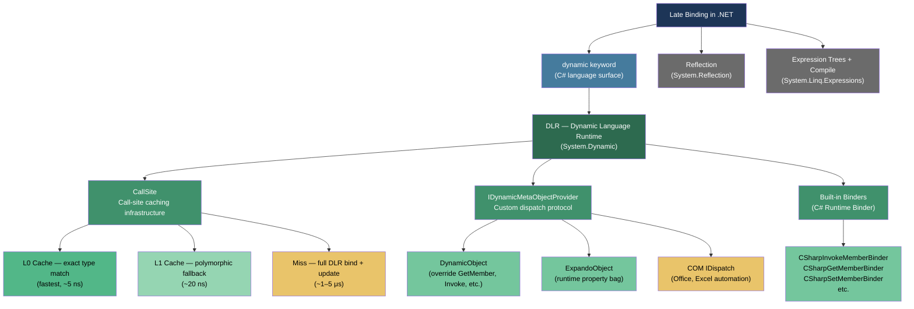

> [!success] Mastery Check
> - [ ] **Studied Well**
> - [ ] **Can explain the concept without notes**
> - [ ] **Can answer interview questions confidently**
> - [ ] **Can implement it in a real project**


## 📍 PART 0 — Navigation & Context

### Where This Topic Lives

```
C# Type System
└── Binding Model
    ├── Static binding (compile-time) — the default
    │   ├── Generics (2.17) — type-safe compile-time polymorphism
    │   └── Interfaces / Virtual Dispatch (2.37)
    ├── Reflection (2.42) — runtime metadata inspection, ~1–5 μs per call
    ├── Expression Trees (2.43) — compiled delegates, ~5–10 ns after compile
    └── ► Dynamic / DLR (2.44)  ← YOU ARE HERE
        └── Late binding — type resolution deferred to runtime
```

### What You Need Before This

- **[[2.42 — Reflection]]** — dynamic is commonly compared to reflection; you must know what it actually replaces and where it doesn't
- **[[2.10 — Inheritance, Polymorphism, Casting, and the Object Hierarchy]]** — the CLR type system that dynamic bypasses
- **[[2.17 — Generics: Constraints, Reification, and the Type System]]** — the primary alternative to dynamic for type-safe polymorphism
- **[[2.08 — Classes]]** — `ExpandoObject` and `DynamicObject` are classes you subclass or use directly

### What This Unlocks After

- **[[2.51 — Unsafe Code and Interop]]** — COM interop is the canonical production use case for `dynamic`
- **[[2.53 — Native AOT, Trimming, and Publish-Time Constraints]]** — `dynamic` is incompatible with AOT; this topic makes that constraint concrete
- Understanding why scripting engines (IronPython, IronRuby) integrate with .NET the way they do

### Why This Matters in Production

`dynamic` is a sharp tool that solves real problems in COM interop and plugin architectures — but it silences the compiler's entire type-checking pass for everything it touches, and it is incompatible with Native AOT. Knowing when it is the correct choice, and exactly what you pay for it, is what separates engineers who reach for it appropriately from those who regret it.

---

## 🧠 PART 1 — The Core Mental Model

### The Fundamental Rule

> **`dynamic` moves type resolution from compile time to runtime. The compiler generates a call-site cache object that resolves the method on first execution using the actual runtime type — not the declared type — and caches that resolution for future calls at the same site.**

### The Plain-Language Analogy

Imagine you're a contractor who normally builds from fully detailed blueprints (static typing — the compiler checks every joint before a nail is driven). With `dynamic`, you instead receive a sketch on a napkin. You show up on site, look at the actual material in your hand, figure out what it is, pick the right tool, and do the work. The **first time** you do this, it costs real effort. But if you return to the same site tomorrow with the same type of material, you remember what tool you used last time and go straight to it — that's the **call-site cache**. If tomorrow's material is a different type, you reason it out again and update your notes. The sketch-on-a-napkin approach lets you work with materials that were unknown at blueprint time, but it introduces a discovery cost and removes the safety net of having an architect verify the plan in advance.

### The Taxonomy Diagram



> [!IMPORTANT] dynamic is NOT Reflection Reflection (`MethodInfo.Invoke`) re-resolves the method on **every call** (~1–5 μs each time). The DLR's call-site cache means `dynamic` is **fast after the first call at each call site** — typically 5–20 ns on a cache hit. They look similar in code but have completely different performance profiles.

---

## 🔬 PART 2 — Deep Mechanics

### 2.1 What the Compiler Actually Generates

When you write `dynamic obj = GetSomething(); obj.Process(42);`, the C# compiler does not emit a direct `callvirt` instruction. Instead it emits infrastructure to drive the DLR:

```
// C# source:
dynamic payload = GetPayload();
string result = payload.Serialize();

// Compiler generates (approximately):
// 1. A static CallSite<Func<CallSite, object, string>> field on a compiler-generated class
// 2. An initialization check on every call
// 3. The actual dispatch through the site

// Pseudo-IL expansion:
static CallSite<Func<CallSite, object, string>> _site_Serialize;

if (_site_Serialize == null)
{
    _site_Serialize = CallSite<Func<CallSite, object, string>>.Create(
        Microsoft.CSharp.RuntimeBinder.Binder.InvokeMember(
            CSharpBinderFlags.None,
            "Serialize",
            null,           // no generic type args
            typeof(CallerClass),
            new[] { CSharpArgumentInfo.Create(CSharpArgumentInfoFlags.None, null) }
        )
    );
}

string result = _site_Serialize.Target(_site_Serialize, payload);
```

The `Target` delegate on the call site IS the cache. On first hit it points to `UpdateAndExecute` — which runs the full DLR binder to resolve the method, updates the cache, then calls through. On subsequent hits with the same runtime type, `Target` points directly to a compiled delegate that calls the resolved method — no DLR overhead.

```
CallSite dispatch lifecycle:

First call (cache miss):
  payload (runtime: OrderPayload)
    ↓
  _site.Target → UpdateAndExecute
    ↓
  C# Runtime Binder: reflect on OrderPayload, find Serialize()
    ↓
  Generate L0 rule: if (obj is OrderPayload) call directly
    ↓
  _site.Target ← compiled L0 rule delegate
    ↓
  Call OrderPayload.Serialize() — cost: ~1–5 μs

Second call (same site, same type):
  payload (runtime: OrderPayload)
    ↓
  _site.Target → L0 rule (already compiled)
    ↓
  Type check: obj is OrderPayload? ✓
    ↓
  Direct call — cost: ~5–10 ns

Third call (same site, DIFFERENT type — e.g., InvoicePayload):
  _site.Target → L0 rule: obj is OrderPayload? ✗
    ↓
  Fall through to UpdateAndExecute
    ↓
  Generate L1 polymorphic rule (handles both types)
    ↓
  Cost: ~1–5 μs for this call; subsequent: ~20 ns
```

### 2.2 The Three-Level Cache

The DLR maintains a three-level cache per call site:

```
┌──────────────────────────────────────────────────────────────────┐
│ CallSite<TDelegate> internal cache structure                     │
├──────────────────────────────────────────────────────────────────┤
│                                                                  │
│  L0 (Monomorphic)   — baked into Target delegate directly        │
│  ─────────────────────────────────────────────────────────────   │
│  Fast path: single type test + direct call                       │
│  Cost on hit: ~5 ns (just a delegate invoke)                     │
│  Evicted: when a new type is seen at this call site              │
│                                                                  │
│  L1 (Polymorphic)   — array of up to ~10 type-specific rules    │
│  ─────────────────────────────────────────────────────────────   │
│  Linear scan of cached type → method pairings                    │
│  Cost on hit: ~10–20 ns                                          │
│  Populated: each new type seen at the site gets a slot           │
│                                                                  │
│  Miss → UpdateAndExecute (full bind)                             │
│  ─────────────────────────────────────────────────────────────   │
│  C# Runtime Binder runs full reflection-style resolution         │
│  Cost: ~1–5 μs (similar to one MethodInfo.Invoke)               │
│  Outcome: new rule generated, L0/L1 updated                      │
│                                                                  │
└──────────────────────────────────────────────────────────────────┘
```

> [!WARNING] Polymorphic Call Sites in Hot Loops If a `dynamic` call site in a tight loop sees more than ~10 distinct runtime types, the DLR's L1 array fills and **every call becomes a cache miss** (~1–5 μs). This is the most common performance disaster caused by misusing `dynamic`. Cost: ~10,000× slower than a direct call.

### 2.3 ExpandoObject — The Runtime Property Bag

`ExpandoObject` implements `IDynamicMetaObjectProvider` and stores properties in an internal dictionary. It is not magic — it is a `Dictionary<string, object>` with DLR dispatch glued on top.

```
ExpandoObject memory layout (conceptual):

ExpandoObject instance (heap):
┌────────────────────────────────────────────┐
│  ObjHeader                    (8 bytes)    │
│  TypePtr                      (8 bytes)    │
│  _data: ExpandoData ──────────────────────►│─── heap
│  _lockObject: object          (8 bytes)    │    ┌─────────────────────────────┐
└────────────────────────────────────────────┘    │  ExpandoData (heap)         │
                                                  │  _class: ExpandoClass       │
                                                  │  (maps property names       │
                                                  │   to integer slot indices)  │
                                                  │  _dataArray: object[]       │
                                                  │  [0] = "Alice"   (Name)     │
                                                  │  [1] = 42        (Age)      │
                                                  └─────────────────────────────┘

Property access: DLR resolves "Name" → slot 0 → _dataArray[0]
Cost on first access: miss → resolve slot → ~1 μs
Cost on subsequent accesses (same call site): L0 cache hit → ~5 ns
```

```csharp
// What ExpandoObject enables:
dynamic user = new ExpandoObject();
user.Name   = "Alice";    // No compile-time class needed
user.Age    = 42;
user.Greet  = (Action)(() => Console.WriteLine($"Hello, {user.Name}"));

user.Greet(); // Invokes the delegate stored as a property

// ExpandoObject also implements IDictionary<string, object>:
var dict = (IDictionary<string, object>)user;
dict["Score"] = 99;          // Same as user.Score = 99
bool hasScore = dict.ContainsKey("Score");  // true

// INotifyPropertyChanged is also implemented:
((INotifyPropertyChanged)user).PropertyChanged += (s, e)
    => Console.WriteLine($"Changed: {e.PropertyName}");
```

### 2.4 DynamicObject — Custom Dispatch

`DynamicObject` lets you intercept every DLR operation (member get, member set, method invoke, indexer, conversion) and implement custom behavior. This is how scripting language integration works.

```csharp
// DynamicObject override points:
public class CustomDynamic : DynamicObject
{
    // Override TryGetMember:  obj.SomeProp
    public override bool TryGetMember(GetMemberBinder binder, out object? result)

    // Override TrySetMember:  obj.SomeProp = value
    public override bool TrySetMember(SetMemberBinder binder, object? value)

    // Override TryInvokeMember: obj.SomeMethod(args)
    public override bool TryInvokeMember(InvokeMemberBinder binder, object?[]? args, out object? result)

    // Override TryInvoke:     obj(args)  (callable object)
    public override bool TryInvoke(InvokeBinder binder, object?[]? args, out object? result)

    // Override TryConvert:    (TargetType)obj
    public override bool TryConvert(ConvertBinder binder, out object? result)

    // Override TryGetIndex:   obj[key]
    public override bool TryGetIndex(GetIndexBinder binder, object[] indexes, out object? result)

    // Override TrySetIndex:   obj[key] = value
    public override bool TrySetIndex(SetIndexBinder binder, object[] indexes, object? value)

    // Returning false from any Try* method means "I don't handle this"
    // → DLR throws RuntimeBinderException (equivalent of a compile-time error)
}
```

### 2.5 COM Interop — The Real Production Use Case

Before `dynamic`, interacting with COM objects required casting through `Marshal` and using `object` parameters everywhere. `dynamic` removes all of that noise:

```csharp
// ⚠️ PRE-dynamic COM interop (Excel automation, ~2008 style):
// Required: adding reference to Microsoft.Office.Interop.Excel
Excel.Application xlApp = new Excel.Application();
Excel.Workbooks books = xlApp.Workbooks;
Excel.Workbook book = books.Open(@"C:\reports\quarterly.xlsx");
Excel.Sheets sheets = book.Sheets;
Excel.Worksheet sheet = (Excel.Worksheet)sheets[1];
Excel.Range range = (Excel.Range)sheet.Cells[1, 1];
range.Value2 = "Revenue";  // Value2 is a property on Range — known at compile time

// ✅ WITH dynamic (same operation, far less ceremony):
dynamic xlApp = Activator.CreateInstance(
    Type.GetTypeFromProgID("Excel.Application")!);
xlApp.Visible = true;
dynamic book = xlApp.Workbooks.Open(@"C:\reports\quarterly.xlsx");
dynamic sheet = book.Sheets[1];
sheet.Cells[1, 1].Value = "Revenue";
book.Save();
xlApp.Quit();
// Type names and casts gone. COM's IDispatch handles dispatch at runtime.
```

The reason this works: COM objects expose an `IDispatch` interface that is itself a late-binding protocol. `dynamic` maps perfectly to it — the DLR's COM binder calls `IDispatch.GetIDsOfNames` and `IDispatch.Invoke` under the hood, which is exactly what the verbose version did through generated interop wrappers.

---

## 💻 PART 3 — Production Code Patterns

### 3.1 The Configuration Property Bag

When you need to build a dynamic configuration object that can carry arbitrary named values without knowing them at design time — common in plugin systems and workflow engines — `ExpandoObject` is the correct tool.

```csharp
// Scenario: workflow engine that builds step context at runtime
// Each workflow step type registers different properties

public class WorkflowContext
{
    // ✅ CORRECT: Expose ExpandoObject as IDictionary to callers that need
    // typed access, and as dynamic to steps that need late binding.
    private readonly ExpandoObject _bag = new();

    public dynamic Properties => _bag;

    public IDictionary<string, object?> AsDictionary()
        => (IDictionary<string, object?>)_bag;

    public void Set(string key, object? value)
        => AsDictionary()[key] = value;

    public T? Get<T>(string key)
    {
        var dict = AsDictionary();
        return dict.TryGetValue(key, out var val) ? (T?)val : default;
    }
}

// Usage in a payment workflow step:
public class PaymentAuthStep : IWorkflowStep
{
    public void Execute(WorkflowContext ctx)
    {
        ctx.Set("AuthCode", "AUTH-98234");
        ctx.Set("AuthTimestampUtc", DateTime.UtcNow);
        ctx.Set("GatewayTransactionId", "TXN-77291");
    }
}

// Usage in a downstream settlement step:
public class SettlementStep : IWorkflowStep
{
    public void Execute(WorkflowContext ctx)
    {
        // Typed access via Get<T> — no dynamic dispatch in hot path
        string? authCode = ctx.Get<string>("AuthCode");
        DateTime ts = ctx.Get<DateTime>("AuthTimestampUtc");

        // Or dynamic access for exploratory code / debugging:
        dynamic props = ctx.Properties;
        Console.WriteLine(props.GatewayTransactionId); // late bound
    }
}
```

### 3.2 The Plugin Dispatcher

When loading plugins from external assemblies at runtime, you often cannot reference their types at compile time. `dynamic` eliminates the reflection boilerplate:

```csharp
// Scenario: logistics system loads carrier plugins as DLLs at runtime.
// Carriers implement a known interface but that interface is in their assembly.

public class CarrierPluginDispatcher
{
    private readonly Dictionary<string, object> _plugins = new();

    public void Register(string carrierId, string assemblyPath)
    {
        // Load the assembly from disk (ALC-isolated in production)
        var asm = System.Reflection.Assembly.LoadFrom(assemblyPath);
        var pluginType = asm.GetTypes()
            .FirstOrDefault(t => t.Name == "CarrierPlugin")
            ?? throw new InvalidOperationException(
                $"CarrierPlugin type not found in {assemblyPath}");

        _plugins[carrierId] = Activator.CreateInstance(pluginType)!;
    }

    // ✅ CORRECT: dynamic dispatch used exactly at the interop boundary.
    // The rest of the system sees typed results.
    public ShippingLabel CreateLabel(string carrierId, ShipmentRequest request)
    {
        if (!_plugins.TryGetValue(carrierId, out var plugin))
            throw new KeyNotFoundException($"No plugin for carrier: {carrierId}");

        // Plugin's CreateLabel method is unknown at compile time
        // but always returns a JSON string we can deserialize.
        dynamic dPlugin = plugin;
        string labelJson = dPlugin.CreateLabel(request.TrackingNumber,
                                               request.WeightKg,
                                               request.DestinationZip);

        return System.Text.Json.JsonSerializer.Deserialize<ShippingLabel>(labelJson)
               ?? throw new InvalidOperationException("Carrier returned null label");
    }
}

// Key principle: dynamic is used at the boundary only.
// Everything downstream is strongly typed.
```

### 3.3 The DynamicObject Proxy — Intercepting for Logging

`DynamicObject` lets you intercept calls to add cross-cutting concerns (logging, metrics, authorization) without knowing the target's API at compile time:

```csharp
// Scenario: audit all method calls on an external pricing service object
// during integration testing without modifying the service class.

public class AuditingProxy : DynamicObject
{
    private readonly object _target;
    private readonly ILogger _log;

    public AuditingProxy(object target, ILogger log)
    {
        _target = target;
        _log = log;
    }

    public override bool TryInvokeMember(
        InvokeMemberBinder binder, object?[]? args, out object? result)
    {
        var sw = System.Diagnostics.Stopwatch.StartNew();
        try
        {
            // Delegate to the real target via reflection (one-time cost acceptable
            // in test/audit contexts — this is not a production hot path)
            var method = _target.GetType()
                .GetMethod(binder.Name,
                    System.Reflection.BindingFlags.Public |
                    System.Reflection.BindingFlags.Instance)
                ?? throw new MissingMethodException(
                    _target.GetType().Name, binder.Name);

            result = method.Invoke(_target, args);
            _log.LogInformation("Called {Method} in {Elapsed:0.##}ms",
                binder.Name, sw.Elapsed.TotalMilliseconds);
            return true;
        }
        catch (Exception ex)
        {
            _log.LogError(ex, "Failed: {Method}", binder.Name);
            result = null;
            return false;  // Causes RuntimeBinderException to be thrown
        }
    }
}

// Usage:
PricingService realService = new PricingService();
dynamic audited = new AuditingProxy(realService, logger);
decimal price = audited.GetUnitPrice("SKU-4421", 100);  // intercepted
```

### 3.4 COM Office Automation — The Canonical Dynamic Use Case

```csharp
// Scenario: generate a monthly revenue report in Excel from a background job.
// Without dynamic, Office interop requires ~3× the lines of code.

public class RevenueReportGenerator
{
    public void GenerateExcelReport(
        IEnumerable<MonthlyRevenue> revenues, string outputPath)
    {
        // ✅ Type.GetTypeFromProgID works when Office is installed (server-side is NOT
        // recommended; use this in desktop/service contexts with Office installed)
        var excelType = Type.GetTypeFromProgID("Excel.Application")
            ?? throw new InvalidOperationException("Excel not installed");

        dynamic excel = Activator.CreateInstance(excelType)!;
        excel.Visible     = false;
        excel.DisplayAlerts = false;

        try
        {
            dynamic workbook  = excel.Workbooks.Add();
            dynamic worksheet = workbook.Sheets[1];
            worksheet.Name    = "Monthly Revenue";

            // Headers
            worksheet.Cells[1, 1].Value = "Month";
            worksheet.Cells[1, 2].Value = "Revenue (USD)";
            worksheet.Cells[1, 3].Value = "Growth %";

            // Data rows — late binding, but the COM contract is clear from docs
            int row = 2;
            foreach (var rev in revenues)
            {
                worksheet.Cells[row, 1].Value = rev.Month.ToString("MMM yyyy");
                worksheet.Cells[row, 2].Value = rev.TotalUsd;
                worksheet.Cells[row, 3].Value = rev.GrowthPercent;
                row++;
            }

            workbook.SaveAs(outputPath);
            workbook.Close(false);
        }
        finally
        {
            excel.Quit();
            // Release COM objects — important to prevent Excel zombie processes
            System.Runtime.InteropServices.Marshal.ReleaseComObject(excel);
        }
    }
}
```

### 3.5 The Static Lambda Cache — Avoiding Per-Site Allocation

A subtle but important pattern: when you want to call a method on many objects of unknown type, creating one call site per object (via a loop) floods the DLR. Instead, cache the call site or use a typed delegate:

```csharp
// ⚠️ WRONG: Creates a new DLR call site on every loop iteration
//           Each 'dynamic' variable in a new scope = potential new site
public static void ProcessOrders_Wrong(IEnumerable<object> orders)
{
    foreach (var order in orders)
    {
        dynamic d = order;
        d.Submit();  // New call site created if runtime type varies — can flood DLR
    }
}

// ✅ CORRECT: One call site for the whole loop (compiler hoists it because
//            the call site is at a stable code location, not inside a closure)
public static void ProcessOrders_Correct(IEnumerable<object> orders)
{
    // The call site for .Submit() is created once by the compiler at this
    // method's call site location. The DLR handles polymorphism internally.
    foreach (dynamic order in orders)
    {
        order.Submit();  // Same call site — DLR L1 cache handles multiple types
    }
}

// ✅ BEST for hot paths: compile a typed delegate via reflection once, reuse it
private static readonly System.Collections.Concurrent.ConcurrentDictionary<Type, Action<object>>
    _submitCache = new();

public static void ProcessOrders_Optimal(IEnumerable<object> orders)
{
    foreach (var order in orders)
    {
        var type = order.GetType();
        var submit = _submitCache.GetOrAdd(type, t =>
        {
            var method = t.GetMethod("Submit",
                System.Reflection.BindingFlags.Public |
                System.Reflection.BindingFlags.Instance)
                ?? throw new MissingMethodException(t.Name, "Submit");
            // Compile once → ~10 ns per call after warm-up
            var param = System.Linq.Expressions.Expression.Parameter(typeof(object));
            var cast  = System.Linq.Expressions.Expression.Convert(param, t);
            var call  = System.Linq.Expressions.Expression.Call(cast, method);
            return System.Linq.Expressions.Expression.Lambda<Action<object>>(call, param)
                .Compile();
        });
        submit(order);  // Direct delegate invoke — no DLR overhead
    }
}
```

### 3.6 Interop with Scripting Engines — IronPython Integration

`dynamic` makes scripting engine integration idiomatic:

```csharp
// Scenario: order validation rules defined in Python scripts by business analysts.
// Uses IronPython (pip install or NuGet: IronPython).

public class PythonRuleEngine
{
    private readonly dynamic _engine;
    private readonly dynamic _scope;

    public PythonRuleEngine(string ruleScriptPath)
    {
        // IronPython creates a DLR-aware engine whose objects implement IDMOP
        _engine = IronPython.Hosting.Python.CreateEngine();
        _scope  = _engine.CreateScope();
        _engine.ExecuteFile(ruleScriptPath, _scope);
    }

    public bool ValidateOrder(OrderSummary order)
    {
        // The Python function 'validate_order' is resolved at runtime.
        // IronPython's scope object implements IDynamicMetaObjectProvider.
        dynamic validateFn = _scope.validate_order;
        dynamic result     = validateFn(order.TotalAmount, order.ItemCount,
                                        order.CustomerTier);
        return (bool)result;  // Python bool → .NET bool via DLR conversion
    }
}

// rule_engine.py (analyst-authored):
// def validate_order(total, item_count, tier):
//     if tier == "PREMIUM": return True
//     return total < 10000 and item_count <= 50
```

### 3.7 The Named Property Accessor — ExpandoObject with Change Notification

```csharp
// Scenario: MVVM-style view model in a forms engine where field names are
// determined by a database schema at runtime, not at compile time.

public class DynamicFormViewModel : INotifyPropertyChanged
{
    private readonly ExpandoObject _data = new();
    public event PropertyChangedEventHandler? PropertyChanged;

    public DynamicFormViewModel()
    {
        // ExpandoObject fires INotifyPropertyChanged automatically
        ((INotifyPropertyChanged)_data).PropertyChanged += (s, e)
            => PropertyChanged?.Invoke(this, e);
    }

    // UI binds to this — WPF/MAUI can data-bind to ExpandoObject fields by name
    public dynamic Fields => _data;

    public void LoadSchema(IEnumerable<FormField> schema)
    {
        var dict = (IDictionary<string, object?>)_data;
        foreach (var field in schema)
            dict[field.Name] = field.DefaultValue;
    }

    public Dictionary<string, object?> Collect()
        => new((IDictionary<string, object?>)_data);
}
```

---

## ⚠️ PART 4 — Gotchas & Anti-Patterns

### Gotcha 1: RuntimeBinderException Is a Silent Compile-Time Error Deferred to Runtime

Engineers accustomed to compile errors expect to catch mistakes before the program runs. With `dynamic`, every typo, wrong argument count, and missing member becomes a `RuntimeBinderException` — and only fires on the code path that actually executes the bad call.

```csharp
// ⚠️ WRONG: This compiles with zero warnings. The bug is invisible until runtime.
dynamic order = GetOrder();
decimal total = order.Totall;   // Typo: "Totall" instead of "Total"
                                 // Compiler says nothing.
                                 // RuntimeBinderException fires at runtime,
                                 // possibly only in one specific code path.

// ✅ CORRECT: Keep the dynamic surface minimal; return to strong types ASAP.
dynamic order = GetOrder();
decimal total = (decimal)order.Total;  // Still late-bound, but at least the
                                        // cast will fail immediately, loudly, on
                                        // first execution. Consider:

// ✅ BETTER: Write an adapter that narrows the dynamic to a typed record immediately.
OrderData typed = new OrderData(
    Total:    (decimal)order.Total,
    Currency: (string)order.Currency,
    OrderId:  (string)order.Id
);
// From here on, all code is statically typed. Dynamic surface = 3 lines.
```

### Gotcha 2: `dynamic` Variables Are Not Boxed — But They Can Be `object`

There is a common misconception that every `dynamic` access goes through boxing. In fact, the DLR handles value types correctly for CALL operations — but assignment to `object` (which `dynamic` compiles to in the IL) does cause boxing.

```csharp
// ⚠️ WRONG MENTAL MODEL: "dynamic always boxes value types"
dynamic x = 42;       // IL: object x = 42 — YES, this boxes the int
x = x + 1;           // The DLR's addition binder handles int + int → int
                      // and boxes the result back to object for storage.
                      // net: two boxing allocations per increment.

// ✅ CORRECT: If you need dynamic dispatch on value types in a hot loop,
// the call SITE doesn't box — but STORAGE in a dynamic/object variable does.
// Extract the value type immediately after dispatch.
dynamic result = order.ComputeDiscount();
decimal discount = (decimal)result;  // Unbox once, then work with typed decimal
for (int i = 0; i < 100_000; i++)
    discount *= 0.99m;               // Zero dynamic overhead from here down

// WHY: The DLR generates type-specific binders for value types in call sites,
// but the storage slot (object/dynamic) always requires boxing.
```

### Gotcha 3: `dynamic` Silently Defeats Overload Resolution

When `dynamic` is involved in a method call, the C# compiler emits a dynamic dispatch for the ENTIRE call — even if only ONE argument is dynamic. This can invoke a completely different overload than you expect.

```csharp
// ⚠️ WRONG: The behavior is surprising and not a compile error.
void Log(string message) => Console.WriteLine($"[STRING] {message}");
void Log(int code)       => Console.WriteLine($"[INT] {code}");
void Log(object o)       => Console.WriteLine($"[OBJECT] {o}");

dynamic val = GetValue();  // Returns string "Hello" at runtime

// You expect this to call Log(string) — but since 'val' is dynamic,
// the ENTIRE call is late-bound. The DLR resolves overloads at runtime
// using the actual type. This is correct behavior — but it violates the
// expectations of engineers who think of dynamic as "just an object".
Log(val);  // Calls Log(string) if val is string — CORRECT at runtime,
           // but if val is unexpectedly null: calls Log(object)
           // If val is an int: calls Log(int)
           // No compile-time visibility into which overload fires.

// ✅ CORRECT: Cast before the call if you know the expected type.
Log((string)val);  // Statically resolved to Log(string). Fails loudly if wrong type.
```

### Gotcha 4: `dynamic` + `async` = Pain

`dynamic` and `async` interact badly. You cannot `await` a dynamic expression directly in a useful way without knowing the return type.

```csharp
// ⚠️ WRONG: Awaiting a dynamic expression produces dynamic, not the awaited value.
dynamic service = GetOrderService();
dynamic result  = await service.GetOrderAsync(orderId);
// result is typed as dynamic — you lose all type information.
// Any error in the awaited type will be deferred to the next dynamic access.

// Worse: if service.GetOrderAsync() returns Task<Order>, the await extracts the
// Order, but it is stored as dynamic/object, so you get boxing and late binding
// for every subsequent access on 'result'.

// ✅ CORRECT: Cast the Task first, then await the typed Task.
Task<Order> orderTask = (Task<Order>)service.GetOrderAsync(orderId);
Order order = await orderTask;  // Strongly typed from here on.

// WHY: async/await needs to call GetAwaiter() on the expression.
// When the expression is dynamic, GetAwaiter() is also dynamically dispatched,
// and the IsCompleted/OnCompleted/GetResult() pattern becomes opaque to the
// compiler's state machine generator. The result type is inferred as dynamic.
```

### Gotcha 5: `dynamic` Breaks Native AOT — Silently in Some Configurations

Native AOT publishes a completely static binary. `dynamic` requires the DLR runtime binder, which uses reflection and code generation internally. In an AOT-published app, `dynamic` either throws at runtime or is entirely stripped.

```csharp
// ⚠️ WRONG: This project uses PublishAot=true in .csproj
// The following code compiles and runs fine in JIT mode.
// In AOT mode it may throw PlatformNotSupportedException at runtime.

dynamic d = new OrderProcessor();
d.Process(new Order());  // DLR binder uses Reflection.Emit internally — GONE in AOT

// ✅ CORRECT: Replace dynamic with generics or interfaces for AOT targets.
// Before:
void Dispatch(dynamic processor, object payload) => processor.Process(payload);

// After — interface-based, AOT compatible:
public interface IProcessor<T> { void Process(T payload); }
void Dispatch<TProcessor, TPayload>(TProcessor processor, TPayload payload)
    where TProcessor : IProcessor<TPayload>
    => processor.Process(payload);

// WHY: Generics are reified by the AOT compiler into concrete implementations.
// dynamic requires runtime code generation (Reflection.Emit) which does not
// exist in the AOT binary.
```

---

## 📊 PART 5 — Performance Implications

### 5.1 Allocation and Cost Characteristics

|Scenario|Allocation Behavior|Approx Cost|
|---|---|---|
|First call at a dynamic call site|CallSite + rule delegate + binder allocation|~1–5 μs|
|Repeated call, same type (L0 hit)|Zero allocation|~5–10 ns|
|Repeated call, 2–10 types (L1 polymorphic)|Zero allocation (rules reused)|~10–20 ns|
|>10 types at one call site|Miss every call — binder runs each time|~1–5 μs per call|
|`dynamic x = someInt`|Boxes the int → 24-byte heap allocation|~12 ns|
|`ExpandoObject` creation|One heap alloc for ExpandoObject + ExpandoData|~200 bytes|
|ExpandoObject property get (L0 hit)|Zero allocation|~5–10 ns|
|ExpandoObject property get (miss)|Slot resolution, updates cache|~500 ns|
|`DynamicObject` method via TryInvokeMember|Depends on your override (reflection = ~1–5 μs)|Variable|
|COM IDispatch call via dynamic|`GetIDsOfNames` + `Invoke` on COM runtime|~10–100 μs|
|Compiled delegate via Expression.Compile|Zero alloc post-compile (cache the delegate)|~5–10 ns|

### 5.2 BenchmarkDotNet Comparison

```csharp
// Expected output (approximate, .NET 8, x64):
// ┌──────────────────────────────┬──────────────┬──────────┬──────────┐
// │ Method                       │ Mean         │ Alloc    │ Notes    │
// ├──────────────────────────────┼──────────────┼──────────┼──────────┤
// │ DirectCall                   │    0.3 ns    │   0 B    │ baseline │
// │ InterfaceCall                │    1.2 ns    │   0 B    │ vtable   │
// │ DynamicCall_WarmL0           │    8.4 ns    │   0 B    │ L0 hit   │
// │ DynamicCall_PolyL1           │   18.7 ns    │   0 B    │ L1 hit   │
// │ DynamicCall_CacheMiss        │ 2,143.0 ns   │ 312 B    │ bind     │
// │ ReflectionInvoke             │ 1,890.0 ns   │ 104 B    │ every    │
// │ CompiledDelegate             │    5.1 ns    │   0 B    │ cached   │
// └──────────────────────────────┴──────────────┴──────────┴──────────┘

[MemoryDiagnoser]
[BenchmarkCategory("DynamicDispatch")]
public class DynamicDispatchBenchmark
{
    private readonly OrderProcessor _typed;
    private readonly dynamic       _dynamic;
    private readonly IProcessor    _interface;
    private readonly Action<Order> _compiled;
    private readonly MethodInfo    _method;
    private readonly Order         _order;

    public DynamicDispatchBenchmark()
    {
        _typed     = new OrderProcessor();
        _dynamic   = _typed;
        _interface = _typed;
        _order     = new Order { Total = 99.99m };
        _method    = typeof(OrderProcessor).GetMethod(nameof(OrderProcessor.Process))!;

        // Compile delegate once — this is the "optimal" pattern
        var param = Expression.Parameter(typeof(Order));
        var inst  = Expression.Constant(_typed);
        var call  = Expression.Call(inst, _method, param);
        _compiled = Expression.Lambda<Action<Order>>(call, param).Compile();
    }

    [Benchmark(Baseline = true)]
    public void DirectCall() => _typed.Process(_order);

    [Benchmark]
    public void InterfaceCall() => _interface.Process(_order);

    [Benchmark]
    public void DynamicCall_WarmL0() => _dynamic.Process(_order);

    [Benchmark]
    public void ReflectionInvoke() => _method.Invoke(_typed, new object[] { _order });

    [Benchmark]
    public void CompiledDelegate() => _compiled(_order);
}

public class OrderProcessor : IProcessor
{
    public void Process(Order o) { /* payment processing logic */ }
}
public interface IProcessor { void Process(Order o); }
public class Order { public decimal Total; }
```

### 5.3 When to Care / When to Ignore

**When `dynamic` costs you:**

- **Tight loops over heterogeneous collections.** If you call `order.Process()` via `dynamic` on 100,000 orders per second and the orders are of 20 different types, you flood the L1 cache and every call is a miss. Throughput collapses by 1,000–10,000×.
- **Microservices with AOT deployment goals.** The DLR binder isn't present; you discover this at deployment, not development.
- **GC-sensitive services.** The call-site object, binder instances, and rule delegates allocated on first use per site are small but real. In containerized services that restart frequently, the warmup cost is paid on every restart.
- **Type-safe APIs you expose to other teams.** Any `dynamic` return type from a public API removes all IntelliSense and compiler checks from consumers.

**When `dynamic` doesn't matter:**

- **COM Office automation on a desktop app.** COM calls are ~10–100 μs each. The DLR overhead is rounding error. Use `dynamic` and keep the code clean.
- **One-shot script execution** (configuration loading, startup-only reflection, test utilities). The cost is paid once.
- **Plugin bootstrapping at startup.** Loading 10 plugins takes 50 μs of DLR initialization. This is irrelevant compared to the 200 ms of IO loading the assemblies.
- **`ExpandoObject` used as a view model for a UI form.** User input is ~100 ms apart. Call site cache is cold every time and it still doesn't matter.

---

## 🎤 PART 6 — Interview Arsenal

### A. The Question Bank

---

> **Q: "What is `dynamic` in C#, and how is it different from `object`?"**

**Average answer:** "Both can hold any type, but `dynamic` skips compile-time type checking while `object` requires casting."

**Why that's insufficient:** It only describes the surface syntax. It says nothing about the DLR, call-site caching, or performance implications — the things an interviewer wants to hear.

> **Great answer:** "Both `object` and `dynamic` store a reference to a heap object, but the difference is in how member access is resolved. With `object`, member access requires an explicit cast first — the compiler verifies the member exists on the cast-to type at compile time. With `dynamic`, the compiler generates a `CallSite<T>` object — a caching structure from the DLR — that defers resolution of the member name to runtime, using the actual type of the object at that moment. The first call at each call site costs roughly the same as a `MethodInfo.Invoke` (~1–5 μs), but the call site caches the resolution as a compiled delegate, so subsequent calls with the same runtime type cost ~5–10 ns. The practical consequence: `dynamic` is not slow per se, it is slow _the first time at each call site_ per type. It becomes a problem when many different types hit the same call site and flood the cache."

---

> **Q: "What is the DLR?"**

**Average answer:** "The Dynamic Language Runtime — it's what powers the `dynamic` keyword."

**Why that's insufficient:** It is circular. It doesn't explain what the DLR actually does or why it exists.

> **Great answer:** "The DLR is a set of services, sitting on top of the CLR, that enable late-bound method resolution with intelligent caching. Its core abstraction is `CallSite<T>` — a per-call-site cache that stores compiled delegates for each runtime type seen at that location. When a dynamic call is first made, the DLR's binder walks the runtime type's metadata to find the right method, compiles a small delegate that can call it directly, and stores that delegate in the call site. Future calls check the cache first. The DLR also defines `IDynamicMetaObjectProvider` — an interface that lets types define their own dispatch behavior. `ExpandoObject` and `DynamicObject` implement it. COM's `IDispatch` is another implementation, which is why `dynamic` makes COM interop so much cleaner — the DLR's COM binder maps directly to `IDispatch.GetIDsOfNames` and `IDispatch.Invoke`."

---

> **Q: "When would you actually use `dynamic` in production code?"**

**Average answer:** "When you don't know the type at compile time, or for COM interop."

**Why that's insufficient:** "Don't know the type at compile time" describes every reflection scenario, not specifically `dynamic`. The answer needs to distinguish when `dynamic` is the _right_ tool.

> **Great answer:** "I reach for `dynamic` in three specific scenarios. First, COM interop — when automating Office or other COM objects through `IDispatch`, `dynamic` removes several layers of generated wrapper code without any meaningful performance penalty, because COM calls themselves cost ~10–100 μs anyway. Second, loading plugins from external assemblies where I genuinely cannot reference the type at compile time and the plugin author hasn't provided an interface — `dynamic` lets me call into it cleanly, though I always narrow back to a typed result immediately. Third, integrating DLR-aware scripting engines like IronPython, where the Python scope object implements `IDynamicMetaObjectProvider` and the whole point is to call Python functions from C#. Outside these three, I prefer generics or interfaces — they give me all the flexibility I need without silencing the compiler."

---

> **Q: "What is `ExpandoObject` and when is it appropriate?"**

**Average answer:** "It's a dynamic object that lets you add properties at runtime, like a dictionary."

**Why that's insufficient:** It doesn't explain the internal mechanism, the performance characteristics, or when this is genuinely the right call.

> **Great answer:** "Internally, `ExpandoObject` is a dictionary mapping string names to object values, with a DLR adapter on top that maps member-access syntax (`expando.Name`) to dictionary lookups. It implements `IDictionary<string, object>`, `INotifyPropertyChanged`, and `IDynamicMetaObjectProvider`. I consider it appropriate in two situations: schema-driven forms or reports where field names are defined in a database at runtime, and data pipeline stages where you're assembling a property bag that downstream consumers will pull from by name. The key rule I follow is to avoid it in hot paths — the first property access at a new call site triggers DLR resolution (~500 ns), and if you have many different property names accessed from many different code locations, you accumulate a lot of cold-start cost. For anything performance-sensitive, I use a typed `Dictionary<string, object>` directly."

---

### B. The Trick Questions

> **"Is `dynamic x = 42; x = x + 1;` zero-allocation?"**

**The trap:** Engineers remember that DLR call sites cache and assume "no allocation after warm-up."

**Correct answer:** No. `dynamic x` is stored as `object` in IL. `42` is boxed on assignment (~24-byte heap allocation). `x + 1` resolves the `+` operator via DLR (free on cache hit), but the result is another boxed int. Two boxing allocations per increment, every time. The call-site cache eliminates the _dispatch cost_, not the _storage cost_.

---

> **"Can you `await` a `dynamic` expression?"**

**The trap:** "Yes, you just write `await dynamicObj.GetSomethingAsync()`."

**Correct answer:** Syntactically yes, but the result is `dynamic`, not the `T` inside `Task<T>`. The `await` expression calls `GetAwaiter()` via dynamic dispatch, which works if the runtime type is `Task<T>`. But the result type is inferred as `dynamic` by the compiler — you lose static type safety on the awaited value. The correct pattern is to cast to `Task<T>` first: `await (Task<Order>)dynamicObj.GetOrderAsync(id)`.

---

> **"What happens if you pass a `dynamic` argument to a method that has multiple overloads?"**

**The trap:** Assuming the most-specific overload is selected based on the declared type.

**Correct answer:** The entire method call is deferred to runtime. The DLR performs overload resolution using the actual runtime type of the `dynamic` argument — which may select a different overload than you'd expect at compile time. Critically, this means that changing the runtime type of a `dynamic` value can silently change which overload fires. This is not a bug — it is the correct behavior of the DLR — but it surprises engineers who think of `dynamic` as just a type-erased `object`.

---

> **"Does `dynamic` work in a Native AOT-published application?"**

**The trap:** "Yes, C# `dynamic` is a language feature, not a runtime feature."

**Correct answer:** No. The DLR's `CSharpRuntimeBinder` uses `Reflection.Emit` to generate call-site rules at runtime. Native AOT does not include `Reflection.Emit` or a JIT compiler. A `dynamic` call in an AOT application will throw `PlatformNotSupportedException` at runtime (or earlier, if the trimmer's warnings are treated as errors). The fix is to replace `dynamic` with generics, interfaces, or source-generated code.

---

> **"Is `dynamic` the same as using `MethodInfo.Invoke` everywhere?"**

**The trap:** "Basically yes — both skip compile-time checking."

**Correct answer:** They differ fundamentally in performance model. `MethodInfo.Invoke` does full reflection resolution on _every call_ (~1–5 μs each). `dynamic` does full resolution _once per call site per type_, compiles a delegate, and reuses it — subsequent calls cost ~5–10 ns. For code that calls the same method repeatedly on the same type, `dynamic` is ~100–1000× faster than `MethodInfo.Invoke`. For code that calls many different types at one call site, the advantage disappears as the cache fills.

---

### C. Red Flags to Avoid

- ❌ **"I use `dynamic` instead of generics when the types are complex"** — generics are the correct tool for type-safe polymorphism; `dynamic` is for genuinely unknown types, not complex ones.
- ❌ **"dynamic is basically an object that avoids casting"** — this misses the entire DLR, call-site caching, and `IDynamicMetaObjectProvider` story. It sounds like you only read the first paragraph of the docs.
- ❌ **"dynamic performance is fine because it caches"** — partially true, but it ignores the cold-start cost, the boxing of value types in storage, and the catastrophic L1 overflow scenario with >10 types.
- ❌ **"You can use dynamic for dependency injection or service location"** — this is the service locator anti-pattern amplified; it removes all compiler checking AND DI container safety.
- ❌ **"ExpandoObject is like a JSON object in JavaScript"** — the analogy is tempting but wrong in two ways: ExpandoObject properties are `object` typed (not JSON-typed), and the DLR dispatch overhead is completely unlike JS property access. Use the analogy informally, never in an interview.
- ❌ **"I can use dynamic to avoid writing interfaces"** — interfaces are free at runtime (vtable dispatch, ~1.2 ns) and give the compiler full visibility. Replacing interfaces with `dynamic` is always a regression unless you cannot reference the type's assembly.
- ❌ **"dynamic works fine with async/await"** — see Gotcha 4. The interaction is non-obvious and the result type is dynamic, which is almost never what you want.
- ❌ Conflating `dynamic` with `var` — `var` is static type inference at compile time, no runtime overhead whatsoever. They are completely different features.

---

## 🔀 PART 7 — Decision Framework

```mermaid
flowchart TD
    A["Need to call a method\non an object whose type\nyou don't know at compile time?"]
    A --> B{Do you control\nthe type being called?}

    B -->|Yes| C{Can you add an interface\nor abstract base class?}
    C -->|Yes| IFACE["Use an interface / abstract class\n✅ Free at runtime, compiler-verified"]
    C -->|No| D{Is the type a value type\nor do you need high performance?}
    D -->|Yes| GENERIC["Use generics with constraints\n✅ Reified, zero-boxing, fast"]
    D -->|No| DYNAMIC_OWN["Use dynamic\n(acceptable — you own the risk)"]

    B -->|No| E{Is it a COM object\nor legacy IDispatch?}
    E -->|Yes| COM["Use dynamic\n✅ Canonical use case — COM binder is built for this"]
    E -->|No| F{Do you have the assembly\nbut not a shared interface?}
    F -->|Yes| G{Is this a hot path\n(>1,000 calls/sec)?}
    G -->|Yes| COMPILED["Compile a typed delegate\nvia Expression.Lambda().Compile()\n✅ ~5 ns after first compile"]
    G -->|No| DYNAMIC_PLUGIN["Use dynamic at the boundary\nthen narrow to typed result\n✅ Acceptable for plugin interop"]
    F -->|No| H{Is this a scripting engine\nthat implements IDMOP?}
    H -->|Yes| SCRIPT["Use dynamic\n✅ Scripting engine integration is\nthe DLR's design purpose"]
    H -->|No| REFLECT["Use Reflection + cache MethodInfo\nor consider source generators"]

    Z{Publishing with\nNative AOT?}
    DYNAMIC_OWN --> Z
    COM --> Z
    DYNAMIC_PLUGIN --> Z
    SCRIPT --> Z
    Z -->|Yes| AOT_WARN["⚠️ Replace dynamic with interfaces,\ngenerics, or source-generated code.\ndynamic breaks Native AOT."]
    Z -->|No| DONE["Proceed"]

    style IFACE fill:#2d6a4f,color:#fff
    style GENERIC fill:#2d6a4f,color:#fff
    style COMPILED fill:#2d6a4f,color:#fff
    style COM fill:#457b9d,color:#fff
    style DYNAMIC_PLUGIN fill:#457b9d,color:#fff
    style SCRIPT fill:#457b9d,color:#fff
    style DYNAMIC_OWN fill:#e9c46a,color:#000
    style REFLECT fill:#e9c46a,color:#000
    style AOT_WARN fill:#e63946,color:#fff
    style DONE fill:#52b788,color:#000
```

---

## ✅ PART 8 — Self-Check

### A. Conceptual Questions

Answer each from memory before checking.

1. A `dynamic` call site sees 15 different runtime types over its lifetime in production. Describe what happens in the DLR's cache and what the long-term throughput looks like at this call site.
    
2. You have `dynamic d = 42; object o = d;`. How many heap allocations occur, and where?
    
3. Explain the difference between `ExpandoObject` and `DynamicObject`. When would you choose one over the other?
    
4. A colleague proposes replacing a generic repository `IRepository<T>` with `dynamic repository` to "simplify the interface." List three concrete reasons this is a bad idea, beyond "it loses type safety."
    
5. A payment service that uses `dynamic` for plugin dispatch is being migrated to Native AOT for faster cold starts. What breaks and what are the two correct migration paths?
    
6. `ExpandoObject` implements `INotifyPropertyChanged`. Explain what triggers property change notifications and how you subscribe to them, given that `ExpandoObject` is typically accessed via `dynamic`.
    
7. The DLR's call-site cache has an L0 (monomorphic) and an L1 (polymorphic) level. What is the observable performance signature in a BenchmarkDotNet run when a call site transitions from L0 to L1?
    
8. What is `IDynamicMetaObjectProvider`? Name two .NET types that implement it and one type from a third-party ecosystem that implements it.
    
9. `dynamic` overload resolution is deferred to runtime. Write a code snippet that demonstrates a case where this produces behavior that surprises an engineer who expected compile-time overload resolution.
    
10. In what specific way does `await dynamicObj.GetOrderAsync()` produce a wrong result even if `GetOrderAsync()` is a valid method that returns `Task<Order>`?
    

### B. Code Puzzles

---

**Puzzle 1** — What is printed? Does it allocate?

```csharp
dynamic x = 5;
dynamic y = x + 3;
Console.WriteLine(y.GetType().Name);
Console.WriteLine(y == 8);
```

<details> <summary>Answer (expand after attempting)</summary>

**Output:**

```
Int32
True
```

**Allocation:** Yes. `x = 5` boxes the int (24-byte heap allocation). `x + 3` uses the DLR's arithmetic binder to compute `5 + 3 = 8` (int), then boxes the result for storage in `y` (another 24-byte allocation). `y.GetType()` dispatches via dynamic to get the runtime type (Int32). `y == 8` triggers the DLR equality binder — it resolves to `int.op_Equality(8, 8)`, result is `true`, boxed to bool (another allocation for the dynamic result). Total: at least 3 boxing allocations.

**Key insight:** Dynamic storage is always `object` in IL. Every assignment of a value type to a dynamic variable boxes.

</details>

---

**Puzzle 2** — What happens? Is this a compile error or a runtime error?

```csharp
public class OrderProcessor
{
    public void Process(string orderId) => Console.WriteLine($"Processing: {orderId}");
    public void Process(int orderCode) => Console.WriteLine($"Code: {orderCode}");
}

var processor = new OrderProcessor();
dynamic value = null;
processor.Process(value);
```

<details> <summary>Answer (expand after attempting)</summary>

**Runtime behavior:** `RuntimeBinderException` is thrown at the `processor.Process(value)` call.

**Why:** The call is late-bound because `value` is `dynamic`. The DLR performs overload resolution at runtime using the actual type of `value`, which is `null`. `null` has no type — the DLR cannot determine which `Process` overload to call. It throws `RuntimeBinderException: The best overloaded method match for 'OrderProcessor.Process(string)' has some invalid arguments` (actual message varies by runtime version).

**This is NOT a compile error** — the compiler sees `dynamic` and defers everything.

**Fix:** `processor.Process((string?)value)` — cast to a concrete type before the call, even if it's a nullable type.

</details>

---

**Puzzle 3** — Find the bug. What does `counter.Value` print?

```csharp
public interface ICounter { void Increment(); int Value { get; } }

public class Counter : ICounter
{
    public int Value { get; private set; }
    public void Increment() => Value++;
}

dynamic d = new Counter();
for (int i = 0; i < 5; i++)
    d.Increment();

ICounter counter = d;
Console.WriteLine(counter.Value);
```

<details> <summary>Answer (expand after attempting)</summary>

**Output:** `5`

**No bug here** — this is a trick question designed to test whether you expect the `dynamic` behavior to be surprising when the underlying type is a class (reference type).

`Counter` is a class (reference type). `d` holds a reference to the same `Counter` object on the heap. `d.Increment()` is dispatched via the DLR but calls the real `Increment()` method on the actual `Counter` object. `ICounter counter = d` then assigns the interface reference to the same heap object. `counter.Value` reads the same object's field — which is `5`.

**Contrast with the struct version:** If `Counter` were a `struct`, casting to `ICounter` would box a _copy_. `Increment()` on `d` would modify the original; `counter.Value` would show 0. But here it's a class — one object, one answer.

</details>

---

**Puzzle 4** — What is printed?

```csharp
dynamic expando = new ExpandoObject();
expando.Price = 99.99m;
expando.Currency = "USD";

var dict = (IDictionary<string, object>)expando;
dict["Price"] = 149.99m;

Console.WriteLine(expando.Price);
Console.WriteLine(dict["Currency"]);
```

<details> <summary>Answer (expand after attempting)</summary>

**Output:**

```
149.99
USD
```

**Why:** `ExpandoObject` stores properties in a single internal dictionary. The `dynamic` view (`expando.Price`) and the `IDictionary<string, object>` view (`dict["Price"]`) are **two views of the same underlying storage** — not two different dictionaries. Mutating through `dict["Price"] = 149.99m` is exactly the same as `expando.Price = 149.99m`. Reading back through either view gives the updated value.

**Key insight:** `ExpandoObject` is not a magic type — it is a `Dictionary<string, object>` with a DLR adapter. Both access paths are aliases for the same data.

</details>

---

**Puzzle 5** — Where is the bug? What does this print, and what should it print?

```csharp
// Scenario: A reporting engine calls a formatting method on shipment records.
// ShipmentRecord and FreightRecord both have a FormatSummary() method.
// SpecialRecord does NOT have FormatSummary().

var records = new object[]
{
    new ShipmentRecord { TrackingId = "TRK-001" },
    new SpecialRecord  { Note = "FRAGILE" },
    new FreightRecord  { WeightKg = 120 }
};

var summaries = new List<string>();
foreach (dynamic record in records)
{
    try
    {
        summaries.Add(record.FormatSummary());
    }
    catch (Exception)
    {
        summaries.Add("[unsupported record type]");
    }
}

Console.WriteLine(string.Join(", ", summaries));

public class ShipmentRecord { public string TrackingId = ""; public string FormatSummary() => $"Ship:{TrackingId}"; }
public class SpecialRecord  { public string Note = ""; }
public class FreightRecord  { public decimal WeightKg; public string FormatSummary() => $"Freight:{WeightKg}kg"; }
```

<details> <summary>Answer (expand after attempting)</summary>

**Output:**

```
Ship:TRK-001, [unsupported record type], Freight:120kg
```

**Is there a bug?** Functionally the code produces the "right" output. But there is a **serious production anti-pattern** buried here:

1. `catch (Exception)` catches `RuntimeBinderException` when `SpecialRecord` doesn't have `FormatSummary()`. This is using exception handling for control flow — `RuntimeBinderException` is expensive (~expensive stack unwind + message formatting), and this will degrade performance sharply if many `SpecialRecord` instances appear.
    
2. **The correct fix** is to check whether the method exists before calling, or better yet, to use an interface:
    

```csharp
// ✅ CORRECT: check type first
foreach (var record in records)
{
    if (record is ShipmentRecord s) summaries.Add(s.FormatSummary());
    else if (record is FreightRecord f) summaries.Add(f.FormatSummary());
    else summaries.Add("[unsupported record type]");
}

// ✅ BETTER: interface-based — compiler-verified, zero dynamic
public interface ISummarizeable { string FormatSummary(); }
// ShipmentRecord and FreightRecord implement it; SpecialRecord does not.
foreach (var record in records)
    summaries.Add(record is ISummarizeable s ? s.FormatSummary() : "[unsupported]");
```

The puzzle illustrates the core anti-pattern: using `dynamic` + exception handling to simulate duck typing, instead of using interfaces.

</details>

---

## 🔗 PART 9 — Connections & Resources

### A. Related Topics Table

|Topic|Why It Connects|
|---|---|
|[[2.42 — Reflection]]|Dynamic is commonly compared to reflection; DLR call-site caching is what makes dynamic faster on repeated calls at the same site|
|[[2.10 — Inheritance, Polymorphism, Casting, and the Object Hierarchy]]|Dynamic bypasses the CLR's vtable-based virtual dispatch; understanding what it replaces requires knowing how normal dispatch works|
|[[2.17 — Generics: Constraints, Reification, and the Type System]]|Generics are almost always the correct alternative to `dynamic` for polymorphism; the choice between them is the primary design decision this topic informs|
|[[2.43 — Expression Trees]]|Compiled expression trees (via `Expression.Lambda().Compile()`) are the high-performance replacement for dynamic dispatch in hot paths|
|[[2.37 — Virtual Dispatch, Polymorphism, and the CLR Object Model]]|The CLR's vtable (virtual dispatch) costs ~1.2 ns; `dynamic` L0 costs ~5-10 ns — knowing both gives the true cost comparison|
|[[2.53 — Native AOT, Trimming, and Publish-Time Constraints]]|`dynamic` requires `Reflection.Emit` which does not exist in AOT binaries; this topic is the "why it breaks" explanation|
|[[2.08 — Classes: Fields, Constructors, Static Members, and Object Initialization]]|`ExpandoObject` and `DynamicObject` are standard classes; understanding them deeply requires solid class fundamentals|
|[[2.34 — Collections: Internals and Selection Guide]]|`ExpandoObject` is internally a dictionary; its performance characteristics follow dictionary internals|

### B. Books

|Book|Chapters|Why These Chapters|
|---|---|---|
|C# in Depth — Jon Skeet|Ch. 14 (4th ed.)|Dynamic binding, DLR internals, and ExpandoObject explained at language-spec depth|
|CLR via C# — Jeffrey Richter|Ch. 5, 22|How the CLR type system interacts with late binding; COM interop mechanisms|
|Pro .NET Performance — Sasha Goldshtein et al.|Ch. 10|Dynamic dispatch cost, call-site caching measurement, when to avoid|

### C. Essential Articles & Docs

- [Microsoft Docs: Using Type dynamic (C# Programming Guide)](https://learn.microsoft.com/en-us/dotnet/csharp/programming-guide/types/using-type-dynamic)
- [Microsoft Docs: ExpandoObject Class — System.Dynamic](https://learn.microsoft.com/en-us/dotnet/api/system.dynamic.expandoobject)
- [Microsoft Docs: DynamicObject Class — System.Dynamic](https://learn.microsoft.com/en-us/dotnet/api/system.dynamic.dynamicobject)
- [Microsoft DevBlog: The DLR Book (Jim Hugunin, DLR designer)](https://docs.microsoft.com/en-us/archive/blogs/hugunin/a-dynamic-language-runtime-dlr)
- [Microsoft Docs: Native AOT Deployment — Limitations](https://learn.microsoft.com/en-us/dotnet/core/deploying/native-aot/#limitations-of-native-aot-deployment)
- [Stephen Toub: Understanding C# dynamic (via .NET Blog)](https://devblogs.microsoft.com/dotnet/)

---

> [!NOTE] Template Meta-Note **This note follows the 9-part C# Language Mastery template. Each section serves a distinct purpose:**
> 
> - **Part 0 — Navigation:** Orients you in the curriculum before a single line of content; tells you what to read first and what this unlocks.
> - **Part 1 — Core Mental Model:** One anchor sentence + physical analogy + taxonomy diagram. Internalize this before the rest.
> - **Part 2 — Deep Mechanics:** What the runtime is _actually_ doing — IL expansion, call-site cache internals, memory layout. Read this slowly.
> - **Part 3 — Production Code:** Seven annotated patterns from real business domains. Copy-paste quality; comments explain _why_, not _what_.
> - **Part 4 — Gotchas:** Five bugs that appear in experienced engineers' code. Wrong → Right → Runtime Reason.
> - **Part 5 — Performance:** Allocation table + full BenchmarkDotNet class + "when to care / when to ignore" — never optimize without this context.
> - **Part 6 — Interview Arsenal:** Full questions with shallow vs great answers + trick questions + red flags. Read aloud. Practice speaking the Great Answers.
> - **Part 7 — Decision Framework:** One flowchart to use live in an interview when asked "how do you decide."
> - **Part 8 — Self-Check:** Ten conceptual questions + five code puzzles with hidden answers. If you can answer all of these, you know the topic.
> - **Part 9 — Connections:** Wiki links with specific dependency reasons + authoritative books and articles only.

---

_Last updated: 2026-06 · Domain: C# Language Mastery · Topic: 2.44 — Dynamic, the DLR, and Late Binding_
