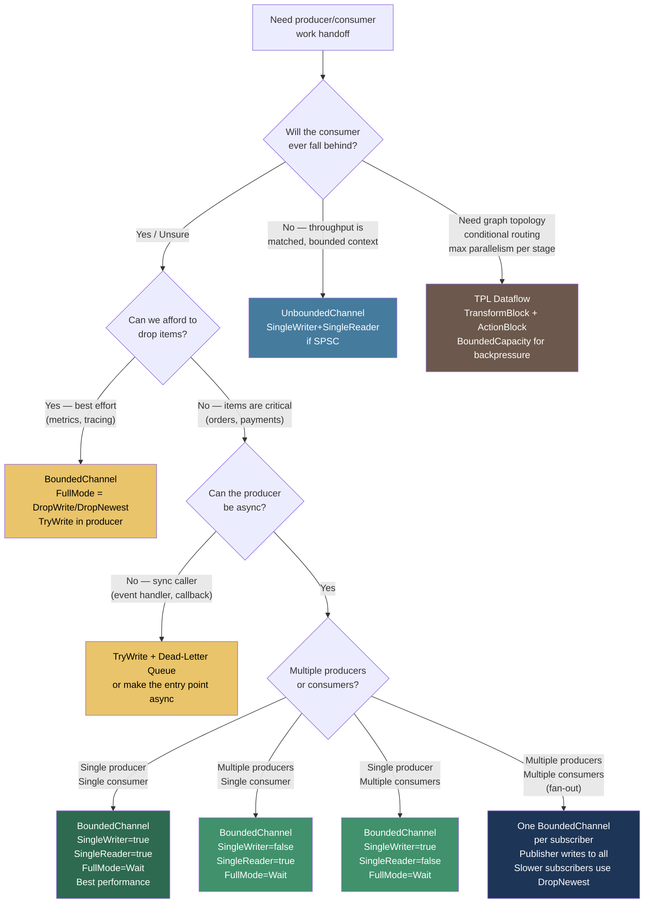

> [!success] Mastery Check
> - [ ] **Studied Well**
> - [ ] **Can explain the concept without notes**
> - [ ] **Can answer interview questions confidently**
> - [ ] **Can implement it in a real project**


## 📍 PART 0 — Navigation & Context

### Where This Topic Lives

```
C# Runtime Model
└── Concurrency & Asynchrony
    ├── async/await — The State Machine (2.07)       ← prerequisite
    ├── Threading Primitives (2.23)                  ← prerequisite
    ├── ► Channels and Concurrent Pipelines (2.11)   ← YOU ARE HERE
    ├──   TPL and PLINQ (2.24)                       ← compare/contrast
    └──   Iterators and yield return (2.17)          ← underpins ReadAllAsync
```

### What You Need Before This

- **[[2.07 — async/await — The State Machine]]** — Channel reads and writes are async operations; you must understand `ValueTask<T>`, `ConfigureAwait`, and `CancellationToken` before this
- **[[2.23 — Threading Primitives]]** — Channels replace `BlockingCollection<T>` and `Monitor.Wait/Pulse`; you need to know what they replace and why
- **[[2.17 — Iterators and yield return]]** — `ChannelReader<T>.ReadAllAsync()` returns `IAsyncEnumerable<T>`; understanding async iterators prevents misuse

### What This Unlocks After

- **[[2.24 — TPL and PLINQ]]** — TPL Dataflow (`TransformBlock`, `ActionBlock`) is the alternative for heavier graph-based pipelines; you need Channels first to understand the tradeoff
- High-throughput microservice message processing (Kafka consumer fan-out, webhook delivery queues, order event pipelines)
- Zero-contention producer/consumer patterns that replace `lock` + `Queue<T>` everywhere

### Why This Matters at Scale

Every high-throughput .NET service processes work asynchronously across stages — ingestion, enrichment, persistence, delivery — and `System.Threading.Channels` is the purpose-built, allocation-efficient, async-native primitive for connecting those stages without blocking threads or spinning.

---

## 🧠 PART 1 — The Core Mental Model

### The Fundamental Rule

> **A Channel is a thread-safe, async-native, optionally-bounded queue between producers and consumers. Backpressure is the feature: a bounded channel makes the producer wait when the consumer falls behind, preventing unbounded memory growth.**

That sentence covers the full design intent. Every API decision in `System.Threading.Channels` flows from it.

### The Plain-Language Analogy

Think of a Channel as a **conveyor belt with a configurable belt length** between a factory floor (producer) and a packing station (consumer). When the belt has space, the factory drops items onto it and keeps working. When the belt is full, the factory worker has to stop and wait — the belt is full, and dropping more would mean items falling off the floor. This waiting is backpressure: the consumer's processing speed limits the producer. An unbounded channel removes the length limit — the conveyor belt can grow infinitely — but now you can run out of warehouse space (memory) if the consumer falls too far behind. The async API means the factory worker doesn't have to stand there staring at the belt waiting for space; they go do something else and get notified when a slot opens.

This analogy holds for the edge case too: when you call `Complete()` on the writer, you are cutting power to the conveyor belt — no more items can be placed, and the consumer will drain whatever remains and then get told the belt is done.

### The Taxonomy Diagram

```mermaid
graph TD
    A["System.Threading.Channels"] --> B["Channel.CreateBounded&lt;T&gt;"]
    A --> C["Channel.CreateUnbounded&lt;T&gt;"]

    B --> D["BoundedChannelOptions"]
    D --> D1["Capacity: int\n(max items in queue)"]
    D --> D2["FullMode\n(what to do when full)"]
    D2 --> D2a["Wait\n(default — block/async-wait writer)"]
    D2 --> D2b["DropOldest\n(evict head, enqueue tail)"]
    D2 --> D2c["DropNewest\n(discard incoming item)"]
    D2 --> D2d["DropWrite\n(discard, return false)"]
    D --> D3["SingleWriter: bool\n(eliminates write-side lock)"]
    D --> D4["SingleReader: bool\n(eliminates read-side lock)"]
    D --> D5["AllowSynchronousContinuations: bool\n(inline continuations — careful!)"]

    C --> E["UnboundedChannelOptions"]
    E --> E1["SingleWriter: bool"]
    E --> E2["SingleReader: bool"]
    E --> E3["AllowSynchronousContinuations: bool"]

    A --> F["Channel&lt;T&gt;"]
    F --> G["ChannelWriter&lt;T&gt;"]
    F --> H["ChannelReader&lt;T&gt;"]

    G --> G1["WriteAsync(T) → ValueTask"]
    G --> G2["TryWrite(T) → bool\n(non-blocking)"]
    G --> G3["WaitToWriteAsync() → ValueTask&lt;bool&gt;"]
    G --> G4["Complete(Exception?)"]
    G --> G5["TryComplete(Exception?)"]

    H --> H1["ReadAsync() → ValueTask&lt;T&gt;"]
    H --> H2["TryRead(out T) → bool\n(non-blocking)"]
    H --> H3["WaitToReadAsync() → ValueTask&lt;bool&gt;"]
    H --> H4["ReadAllAsync() → IAsyncEnumerable&lt;T&gt;"]
    H --> H5["Count: int\n(approximate — races)"]

    style A fill:#1d3557,color:#fff
    style B fill:#2d6a4f,color:#fff
    style C fill:#2d6a4f,color:#fff
    style G fill:#457b9d,color:#fff
    style H fill:#457b9d,color:#fff
    style D2a fill:#40916c,color:#fff
    style D2b fill:#e9c46a,color:#000
    style D2c fill:#e9c46a,color:#000
    style D2d fill:#e9c46a,color:#000
```



> [!NOTE] Channel\<T\> vs ChannelWriter\<T\> / ChannelReader\<T\>
> `Channel<T>` is the owner — it holds both ends. In production, inject `ChannelWriter<T>` into producers and `ChannelReader<T>` into consumers. This enforces the single-responsibility of each side at the type level and prevents a consumer from accidentally calling `Complete()`.

---

## 🔬 PART 2 — Deep Mechanics

### 2.1 Internal Structure of a Bounded Channel

Understanding the internals tells you which operations are cheap and why `SingleWriter`/`SingleReader` matter.

```
━━━━━━━━━━━━━━━━━━━━━━━━━━━━━━━━━━━━━━━━━━━━━━━━━━━━━━━━━━━━
BoundedChannel<T> Heap Layout (simplified, .NET 8)
━━━━━━━━━━━━━━━━━━━━━━━━━━━━━━━━━━━━━━━━━━━━━━━━━━━━━━━━━━━━

BoundedChannel<T> object:
┌─────────────────────────────────────────────────────────┐
│ ObjHeader   (8 bytes)                                   │
│ TypePtr     (8 bytes)                                   │
│                                                         │
│ _items: Deque<T>  ──────────────────►  circular array   │
│         (ring buffer of T)             [item0][item1].. │
│                                                         │
│ _blockedReaders: Deque<AsyncOp<T>>  ── waiting readers  │
│         (tasks awaiting items)         [op1][op2]...    │
│                                                         │
│ _blockedWriters: Deque<AsyncOp<T>>  ── waiting writers  │
│         (tasks awaiting space)         [op1][op2]...    │
│                                                         │
│ _waitingReaders: Deque<AsyncOp<bool>> ─ WaitToReadAsync │
│ _waitingWriters: Deque<AsyncOp<bool>> ─ WaitToWriteAsync│
│                                                         │
│ _lock: object  ─── single lock guards the whole channel │
│         (eliminated when SingleWriter+SingleReader=true)│
│                                                         │
│ _capacity: int   (the bound)                            │
│ _doneWriting: Exception? (null until Complete())        │
└─────────────────────────────────────────────────────────┘

Key operations and their internal paths:
  WriteAsync(item) when _items.Count < _capacity:
    acquire _lock → enqueue → signal one _blockedReader or _waitingReader
    → release _lock → return completed ValueTask  (~50-100 ns)

  WriteAsync(item) when _items.Count == _capacity (FullMode=Wait):
    acquire _lock → create AsyncOp → enqueue to _blockedWriters
    → release _lock → return pending ValueTask (suspends caller)
    → resumed when a reader dequeues an item                    (~async overhead)

  ReadAsync() when _items.Count > 0:
    acquire _lock → dequeue item → signal one _blockedWriter
    → release _lock → return completed ValueTask<T>  (~50-100 ns)

  ReadAsync() when _items.Count == 0:
    acquire _lock → create AsyncOp → enqueue to _blockedReaders
    → release _lock → return pending ValueTask<T> (suspends caller)
    → resumed when a writer enqueues an item                    (~async overhead)
```

> [!IMPORTANT] Cost of the Lock
> The internal `_lock` is a plain `Monitor` (`lock` statement). Every `WriteAsync`/`ReadAsync` call acquires it. Under high throughput with many producers, this lock becomes the bottleneck. `SingleWriter = true` and `SingleReader = true` remove the corresponding side's lock — the runtime uses interlocked operations instead. For a single-producer/single-consumer pipeline, always set both.

### 2.2 Unbounded Channel — A Different Implementation

`Channel.CreateUnbounded<T>()` uses a `ConcurrentQueue<T>` internally when `SingleReader = false`, giving lock-free writes. This matters because:

```
UnboundedChannel<T> with SingleReader=false:
  _items:          ConcurrentQueue<T>   (lock-free writes, ~30-50 ns enqueue)
  _blockedReaders: single AsyncOperation<T>   (one waiter at a time)

  TryWrite(item):
    ConcurrentQueue.Enqueue(item)   [Interlocked.Exchange based, ~30 ns]
    if _blockedReaders has waiter → signal it
    return true   (always succeeds — no bound)

  WriteAsync(item):
    always returns synchronously completed ValueTask  (~zero overhead)
    no allocation if the ValueTask completes synchronously

UnboundedChannel<T> with SingleReader=true + SingleWriter=true:
  Uses a custom lock-free SPSC (single-producer single-consumer) queue
  Fastest possible path: ~20-30 ns per operation
  ZERO lock acquisition on the fast path
```

> [!DANGER] Unbounded Does Not Mean Free
> An unbounded channel with a slow consumer will grow without limit. In a payment processing pipeline where enrichment calls a slow third-party API, the channel can hold millions of pending orders, consuming gigabytes of heap and triggering LOH allocations. Always prefer bounded unless you have a specific reason (e.g., the channel is a micro-buffer inside a known-bounded larger system).

### 2.3 Completion and Drain Semantics

`Complete()` / `TryComplete()` is the most misunderstood part of Channels. The contract is:

```
Writer calls Complete():
  1. Sets _doneWriting = null (or the passed exception)
  2. Wakes all _blockedReaders so they can drain remaining items
  3. After all items are drained, ReadAsync() throws ChannelClosedException
     (or the exception passed to Complete)
  4. WaitToReadAsync() returns false (no more items will ever arrive)

What does NOT happen:
  • Items already in the channel are NOT dropped
  • In-flight WriteAsync calls that are already pending:
    they throw ChannelClosedException (their continuation sees the closed state)
  • Calling Complete() twice: second call returns false (TryComplete) or throws

Reader calling ReadAllAsync():
  await foreach (var item in channel.Reader.ReadAllAsync())
  {
      // processes all items until Complete() + drained
      // loop exits cleanly when done — no exception needed
  }
  // This is the preferred drain pattern. No try/catch required for normal completion.
```

```
Timeline diagram:

Writer:   [A][B][C]──Complete()──────────────────────────────
                         │
Channel:  [A][B][C] → [B][C] → [C] → []  ← empty + done
                │        │       │      │
Reader:        A        B       C    exits loop
```

**Cost:** `Complete()` itself is O(1) — ~100 ns. The loop `ReadAllAsync()` processes items at the rate of `ReadAsync()` calls.

### 2.4 AllowSynchronousContinuations — The Hidden Footgun

```csharp
// AllowSynchronousContinuations = true means:
// When a writer calls WriteAsync() and a reader is waiting,
// the reader's continuation runs INLINE on the WRITER'S THREAD
// before WriteAsync() returns.

// In a pipeline:
var channel = Channel.CreateBounded<OrderEvent>(new BoundedChannelOptions(100)
{
    AllowSynchronousContinuations = true  // ⚠️ DANGEROUS
});

// Writer thread (thread pool thread A):
await channel.Writer.WriteAsync(order);
// If a reader was waiting, their await continuation runs HERE,
// on thread pool thread A, BEFORE WriteAsync returns.
// This means the writer thread can now be blocked by the reader's work.
// Stack depth increases. Deadlocks become possible.

// ✅ CORRECT: leave AllowSynchronousContinuations = false (default)
// The reader's continuation is scheduled onto the thread pool as a separate item.
// More overhead (~100-200 ns per operation), but correct, deadlock-free behavior.
```

**When `AllowSynchronousContinuations = true` is safe:** You have a single-threaded consumer doing trivial work (like collecting into a list in a test), and you've profiled that the scheduling overhead is actually measurable. In production, leave it false.

### 2.5 ValueTask Allocation Behavior in Channels

This is interview-critical. Channels are specifically designed to minimize allocations on the hot path.

```
WriteAsync / ReadAsync return ValueTask or ValueTask<T>:

Fast path (item available / space available):
  The ValueTask is created from a pooled IValueTaskSource.
  No Task allocation. Zero GC pressure.
  The caller sees IsCompleted = true immediately.
  await on an already-completed ValueTask: ~3-5 ns overhead.

Slow path (must wait):
  The channel uses an internal pooled AsyncOperation<T> object.
  This IS a heap allocation — but it's a single allocation per waiting operation.
  The allocation is reused from a pool if SingleReader/SingleWriter is true.
  Cost: ~64-128 bytes per wait operation (comparable to one small Task).

Compare to BlockingCollection<T>:
  GetConsumingEnumerable() blocks a thread (~1 MB stack per blocked thread).
  Even one blocked thread costs orders of magnitude more than a Channel wait.
```

---

## 💻 PART 3 — Production Code Patterns

### 3.1 The Single-Stage Background Processor

The most common Channel pattern: a background service consuming from a channel while HTTP handlers produce into it. Used in order management systems for async order event persistence.

```csharp
// ✅ CORRECT: Inject ChannelWriter<T> into producers, ChannelReader<T> into consumers.
// Never inject Channel<T> directly — it gives consumers write access they shouldn't have.

public sealed class OrderEventProcessor : BackgroundService
{
    private readonly ChannelReader<OrderEvent> _reader;
    private readonly IOrderRepository _repository;
    private readonly ILogger<OrderEventProcessor> _logger;

    public OrderEventProcessor(
        ChannelReader<OrderEvent> reader,
        IOrderRepository repository,
        ILogger<OrderEventProcessor> logger)
    {
        _reader = reader;
        _repository = repository;
        _logger = logger;
    }

    protected override async Task ExecuteAsync(CancellationToken stoppingToken)
    {
        // ReadAllAsync() is the idiomatic drain loop.
        // It exits cleanly when Complete() is called on the writer.
        // Pass stoppingToken so the host can cancel during shutdown.
        await foreach (OrderEvent evt in _reader.ReadAllAsync(stoppingToken))
        {
            try
            {
                await _repository.PersistAsync(evt, stoppingToken);
            }
            catch (Exception ex) when (ex is not OperationCanceledException)
            {
                // Log and continue — one bad event must not kill the whole pipeline.
                // For payment systems, consider a dead-letter channel here.
                _logger.LogError(ex, "Failed to persist order event {OrderId}", evt.OrderId);
            }
        }
    }
}

// DI Registration (Program.cs / Startup.cs):
// The channel is the boundary. Capacity = 1000 provides backpressure without
// unbounded memory growth. FullMode = Wait means HTTP handlers slow down
// rather than dropping order events.
services.AddSingleton(_ =>
    Channel.CreateBounded<OrderEvent>(new BoundedChannelOptions(1_000)
    {
        FullMode = BoundedChannelFullMode.Wait,
        SingleWriter = false, // multiple HTTP handlers write concurrently
        SingleReader = true   // one background processor reads
    }));

services.AddSingleton(sp =>
    sp.GetRequiredService<Channel<OrderEvent>>().Writer);

services.AddSingleton(sp =>
    sp.GetRequiredService<Channel<OrderEvent>>().Reader);

services.AddHostedService<OrderEventProcessor>();
```

### 3.2 The Multi-Stage Pipeline

Three-stage pipeline for a logistics document processing system: parse → enrich → persist. Each stage is a separate background service. Backpressure propagates from right to left.

```csharp
public sealed class DocumentPipeline
{
    // Stage boundaries are channels. Each is bounded so backpressure propagates.
    // If persistence is slow, enrichment blocks; if enrichment blocks, parsing blocks.
    public Channel<RawDocument>       ParseInput   { get; }
    public Channel<ParsedDocument>    EnrichInput  { get; }
    public Channel<EnrichedDocument>  PersistInput { get; }

    public DocumentPipeline()
    {
        ParseInput   = Channel.CreateBounded<RawDocument>(      new BoundedChannelOptions(500));
        EnrichInput  = Channel.CreateBounded<ParsedDocument>(   new BoundedChannelOptions(200));
        PersistInput = Channel.CreateBounded<EnrichedDocument>( new BoundedChannelOptions(100));
        // Capacity decreases downstream intentionally:
        // Parsing is fast (CPU), enrichment calls external API (slow), persistence is I/O.
        // Smaller downstream buffers mean we don't overwhelm the slow stages.
    }
}

// Stage 1: Parse
public sealed class DocumentParserStage : BackgroundService
{
    private readonly ChannelReader<RawDocument>    _input;
    private readonly ChannelWriter<ParsedDocument> _output;
    private readonly IDocumentParser               _parser;

    public DocumentParserStage(
        ChannelReader<RawDocument> input,
        ChannelWriter<ParsedDocument> output,
        IDocumentParser parser)
    {
        _input = input; _output = output; _parser = parser;
    }

    protected override async Task ExecuteAsync(CancellationToken ct)
    {
        try
        {
            await foreach (RawDocument raw in _input.ReadAllAsync(ct))
            {
                ParsedDocument parsed = _parser.Parse(raw);
                // WriteAsync applies backpressure: if Stage 2 is slow, we wait here.
                await _output.WriteAsync(parsed, ct);
            }
        }
        finally
        {
            // Complete the downstream channel when this stage is done.
            // This propagates the "no more data" signal through the entire pipeline.
            _output.TryComplete();
        }
    }
}

// Stages 2 (enrich) and 3 (persist) follow the exact same pattern.
// The finally { _output.TryComplete() } is the critical completion propagation.
```

### 3.3 Fan-Out with Per-Subscriber Channels

Distributing payment events to multiple independent subscribers (audit log, fraud detection, analytics) without coupling them. Each subscriber has its own bounded channel; slow subscribers don't block fast ones.

```csharp
// ⚠️ WRONG: Shared channel — subscribers compete for the same items
// Subscriber A and B both read from one channel:
// every payment event goes to exactly ONE of them, not BOTH.

// ✅ CORRECT: One channel per subscriber
public sealed class PaymentEventBroadcaster
{
    private readonly IReadOnlyList<ChannelWriter<PaymentEvent>> _subscribers;

    public PaymentEventBroadcaster(IReadOnlyList<ChannelWriter<PaymentEvent>> subscribers)
        => _subscribers = subscribers;

    // Publish to all subscribers. Use WhenAll so we don't serialize the writes.
    // Each WriteAsync independently applies backpressure for its subscriber.
    public async ValueTask PublishAsync(PaymentEvent evt, CancellationToken ct = default)
    {
        // For a small fixed number of subscribers, allocate tasks on the stack.
        var tasks = new ValueTask[_subscribers.Count];
        for (int i = 0; i < _subscribers.Count; i++)
            tasks[i] = _subscribers[i].WriteAsync(evt, ct);

        // Await all — if any subscriber's channel is full, we wait for it.
        // For truly independent subscribers where one being slow is acceptable,
        // use DropNewest/DropOldest on that subscriber's channel instead.
        foreach (var task in tasks)
            await task;
    }

    public void Complete()
    {
        foreach (var writer in _subscribers)
            writer.TryComplete();
    }
}
```

### 3.4 The Graceful Drain on Shutdown

Ensuring all in-flight work completes before the process exits. Critical for financial systems where losing an in-flight order is unacceptable.

```csharp
// ⚠️ WRONG: Cancelling immediately drops items still in the channel
protected override async Task ExecuteAsync(CancellationToken stoppingToken)
{
    await foreach (var order in _reader.ReadAllAsync(stoppingToken))
        await ProcessAsync(order, stoppingToken);
    // If stoppingToken fires, items still in the channel are NOT processed.
}

// ✅ CORRECT: Two-phase shutdown — stop accepting new items, then drain existing items
protected override async Task ExecuteAsync(CancellationToken stoppingToken)
{
    // Phase 1: consume until the host requests stop
    // Use a separate cancellation source that we control
    using var drainCts = new CancellationTokenSource();

    // Register: when the host wants to stop, don't cancel immediately.
    // The writer.Complete() call (from the HTTP layer shutdown) will naturally
    // close the channel. We want to drain whatever is already queued.
    stoppingToken.Register(() =>
    {
        // Signal the writer to stop accepting new items
        _writer.TryComplete();
        // Give the drain a time limit (5 seconds) to avoid hanging shutdown
        drainCts.CancelAfter(TimeSpan.FromSeconds(5));
    });

    try
    {
        // ReadAllAsync with the drain token: processes remaining items
        // until the channel is empty AND complete, or drain timeout fires.
        await foreach (var order in _reader.ReadAllAsync(drainCts.Token))
            await ProcessAsync(order, CancellationToken.None); // don't cancel in-flight processing
    }
    catch (OperationCanceledException) when (drainCts.IsCancellationRequested)
    {
        _logger.LogWarning("Drain timeout reached — {Count} items may have been lost",
            _reader.Count);
    }
}
```

### 3.5 The Batching Consumer

Accumulating individual items into micro-batches for efficient database inserts. Used in telemetry systems writing thousands of events per second to a time-series database.

```csharp
public sealed class TelemetryBatchWriter : BackgroundService
{
    private readonly ChannelReader<TelemetryEvent> _reader;
    private readonly ITelemetryStore               _store;
    private readonly int                           _maxBatchSize;
    private readonly TimeSpan                      _maxBatchAge;

    public TelemetryBatchWriter(
        ChannelReader<TelemetryEvent> reader,
        ITelemetryStore store,
        int maxBatchSize = 500,
        TimeSpan? maxBatchAge = null)
    {
        _reader       = reader;
        _store        = store;
        _maxBatchSize = maxBatchSize;
        _maxBatchAge  = maxBatchAge ?? TimeSpan.FromMilliseconds(50);
    }

    protected override async Task ExecuteAsync(CancellationToken ct)
    {
        var batch = new List<TelemetryEvent>(_maxBatchSize);

        while (await _reader.WaitToReadAsync(ct))
        {
            var batchDeadline = DateTimeOffset.UtcNow + _maxBatchAge;

            // Drain as many items as available up to batch size, without waiting.
            // TryRead is non-blocking — O(1), ~30 ns, no allocation.
            while (batch.Count < _maxBatchSize && _reader.TryRead(out var evt))
                batch.Add(evt);

            // If we didn't fill the batch, wait a bit for more items to arrive
            // to avoid sending many tiny batches during low traffic.
            if (batch.Count < _maxBatchSize)
            {
                using var batchCts = CancellationTokenSource.CreateLinkedTokenSource(ct);
                batchCts.CancelAfter(_maxBatchAge);
                try
                {
                    while (batch.Count < _maxBatchSize &&
                           await _reader.WaitToReadAsync(batchCts.Token))
                    {
                        while (batch.Count < _maxBatchSize && _reader.TryRead(out var evt))
                            batch.Add(evt);
                    }
                }
                catch (OperationCanceledException) { /* batch age exceeded, flush what we have */ }
            }

            if (batch.Count > 0)
            {
                await _store.InsertBatchAsync(batch, ct);
                batch.Clear(); // reuse the list — avoid re-allocating
            }
        }
    }
}
```

### 3.6 Channels vs BlockingCollection\<T\> — The Replacement Pattern

When migrating legacy code, this is the mechanical substitution.

```csharp
// ⚠️ WRONG (legacy): BlockingCollection<T> blocks a thread
// This pattern burns one thread per consumer from the thread pool.
// Under load: thread pool exhaustion, 100ms+ scheduling delays.
public class LegacyOrderQueue
{
    private readonly BlockingCollection<Order> _queue =
        new BlockingCollection<Order>(boundedCapacity: 1_000);

    public void Enqueue(Order order) => _queue.Add(order); // BLOCKS thread if full

    public void StartConsumer() => Task.Run(() =>
    {
        foreach (var order in _queue.GetConsumingEnumerable()) // BLOCKS thread when empty
            Process(order);
    });
}

// ✅ CORRECT (modern): Channel<T> — async, non-blocking
public class ModernOrderQueue
{
    private readonly Channel<Order> _channel =
        Channel.CreateBounded<Order>(new BoundedChannelOptions(1_000)
        {
            FullMode = BoundedChannelFullMode.Wait
        });

    // Returns ValueTask — caller must await it; never fire-and-forget
    public ValueTask EnqueueAsync(Order order, CancellationToken ct = default)
        => _channel.Writer.WriteAsync(order, ct);

    public ChannelReader<Order> GetReader() => _channel.Reader;

    // Consumer in BackgroundService:
    // await foreach (var order in GetReader().ReadAllAsync(ct))
    //     await ProcessAsync(order, ct);
}
```

### 3.7 TryWrite for Non-Blocking Best-Effort Publish

When you explicitly want to drop events rather than slow down a producer. Used in real-time monitoring where dropping a metric sample is acceptable but blocking the request pipeline is not.

```csharp
public sealed class MetricsCollector
{
    // DropWrite: if the channel is full, WriteAsync still returns false immediately.
    // This is the same behavior as TryWrite — we want a non-blocking channel.
    private readonly Channel<MetricSample> _channel =
        Channel.CreateBounded<MetricSample>(new BoundedChannelOptions(10_000)
        {
            FullMode = BoundedChannelFullMode.DropWrite, // discard silently when full
            SingleReader = true
        });

    private long _droppedCount;

    // Called on every request — must NEVER block.
    // TryWrite: ~30-50 ns. Zero allocation. No async overhead.
    public void Record(MetricSample sample)
    {
        if (!_channel.Writer.TryWrite(sample))
            Interlocked.Increment(ref _droppedCount); // track drops for monitoring
    }

    public long DroppedCount => Interlocked.Read(ref _droppedCount);
    public ChannelReader<MetricSample> Reader => _channel.Reader;
}
```

---

## ⚠️ PART 4 — Gotchas & Anti-Patterns

### Gotcha 1: Forgetting to Propagate Completion Through Pipeline Stages

Engineers understand they need to call `Complete()` on the final writer but forget to propagate it through intermediate stages. The result: the pipeline stalls permanently — the final stage's `ReadAllAsync()` never returns, the background service hangs, and the process won't shut down cleanly.

```csharp
// ⚠️ WRONG: Stage completion is not propagated
protected override async Task ExecuteAsync(CancellationToken ct)
{
    await foreach (var raw in _input.ReadAllAsync(ct))
    {
        var parsed = Parse(raw);
        await _output.WriteAsync(parsed, ct);
    }
    // _input is done, but _output is NEVER completed!
    // The next stage waits forever on _output.ReadAllAsync().
}

// ✅ CORRECT: Propagate completion in a finally block
protected override async Task ExecuteAsync(CancellationToken ct)
{
    try
    {
        await foreach (var raw in _input.ReadAllAsync(ct))
        {
            var parsed = Parse(raw);
            await _output.WriteAsync(parsed, ct);
        }
    }
    catch (Exception ex)
    {
        // Propagate exceptions as channel faults — downstream sees ChannelClosedException(ex)
        _output.TryComplete(ex);
        throw;
    }
    finally
    {
        // Normal completion — always runs, even on cancellation
        _output.TryComplete();
    }
}

// WHY: ReadAllAsync() exits only when WaitToReadAsync() returns false, which only
// happens after Complete() is called AND the channel is drained. Without TryComplete()
// in finally, the downstream stage's WaitToReadAsync() waits indefinitely.
```

### Gotcha 2: Using Channel.Count for Flow Control

`ChannelReader<T>.Count` is appealing as a way to check if the channel is "busy" before writing, but it creates a check-then-act race condition and provides a false sense of control.

```csharp
// ⚠️ WRONG: Count is approximate and racy
if (_channel.Reader.Count < 900) // "it's not full"
{
    await _channel.Writer.WriteAsync(order); // but it MIGHT be full NOW
}
// Between the Count check and WriteAsync, other writers may have filled the channel.
// Worse: you've introduced a subtle throttle that's not based on actual backpressure.

// ✅ CORRECT: Let the channel's bounded capacity be the throttle
// WriteAsync with FullMode=Wait is the correct, race-free backpressure mechanism.
await _channel.Writer.WriteAsync(order, ct);
// This blocks (async) if and only if the channel is actually full.
// No race condition. No approximation.

// WHY: Count returns the count at the moment of the call. By the time you act on it,
// other threads have changed the state. WriteAsync with a bounded channel atomically
// checks capacity and either succeeds or queues the caller — exactly one correct outcome.
```

### Gotcha 3: Awaiting Multiple Readers on the Same Channel

Spawning multiple background tasks all reading from the same channel seems like "easy parallelism" but creates hidden ordering problems and uneven load distribution.

```csharp
// ⚠️ WRONG: Multiple concurrent ReadAllAsync loops on one channel
// with SingleReader=true — this causes undefined behavior (data races)
var channel = Channel.CreateBounded<WorkItem>(new BoundedChannelOptions(1000)
{
    SingleReader = true  // ← means ONE reader. You're about to violate this.
});

// These two tasks both read from the same channel — SingleReader=true means the
// internal implementation is NOT thread-safe for concurrent reads.
var t1 = Task.Run(() => ProcessLoopAsync(channel.Reader, ct));
var t2 = Task.Run(() => ProcessLoopAsync(channel.Reader, ct)); // DATA RACE

// ✅ CORRECT option A: Use SingleReader=false if you need multiple consumers
var channel = Channel.CreateBounded<WorkItem>(new BoundedChannelOptions(1000)
{
    SingleReader = false  // now multiple concurrent readers are safe
});

// ✅ CORRECT option B: Use a single reader that fans out via sub-channels or Tasks
protected override async Task ExecuteAsync(CancellationToken ct)
{
    await Parallel.ForEachAsync(
        _reader.ReadAllAsync(ct),
        new ParallelOptions { MaxDegreeOfParallelism = 4, CancellationToken = ct },
        async (item, token) => await ProcessItemAsync(item, token));
}

// WHY: When SingleReader=true, the channel uses a non-thread-safe fast path for
// the reader side. Two concurrent readers can both dequeue the same item (phantom read)
// or corrupt the internal state. The documentation says "single reader" — mean it.
```

### Gotcha 4: Dropping ChannelClosedException Instead of Handling It

When `Complete(exception)` is called with an exception (fault propagation), the downstream reader's `ReadAllAsync()` will throw. Engineers often catch this exception generically and lose the pipeline fault signal.

```csharp
// ⚠️ WRONG: Catching all exceptions swallows the fault signal
try
{
    await foreach (var item in _reader.ReadAllAsync(ct))
        await ProcessAsync(item, ct);
}
catch (Exception ex)
{
    _logger.LogWarning("Consumer exited: {Message}", ex.Message);
    // The ChannelClosedException.InnerException holds the upstream fault.
    // You swallowed it. You don't know if upstream died with an error.
}

// ✅ CORRECT: Differentiate normal completion from faulted completion
try
{
    await foreach (var item in _reader.ReadAllAsync(ct))
        await ProcessAsync(item, ct);
    // Exiting the loop normally means Complete() was called without exception.
    _logger.LogInformation("Consumer completed normally.");
}
catch (ChannelClosedException ex) when (ex.InnerException is not null)
{
    // Upstream faulted — propagate the real exception
    _logger.LogError(ex.InnerException, "Upstream pipeline stage faulted");
    throw new PipelineException("Pipeline fault in upstream stage", ex.InnerException);
}
catch (OperationCanceledException) when (ct.IsCancellationRequested)
{
    _logger.LogInformation("Consumer cancelled by host.");
}

// WHY: Channel.TryComplete(exception) stores the exception in the channel's completion
// state. When drained, ReadAllAsync throws ChannelClosedException with that exception
// as InnerException. Swallowing it is how pipeline faults go silently unnoticed in production.
```

### Gotcha 5: Fire-and-Forget WriteAsync

`ChannelWriter<T>.WriteAsync()` returns a `ValueTask`. If you don't await it — which is easy to do accidentally in a synchronous call site — you lose backpressure entirely AND silently drop items when the channel is full and `FullMode = DropWrite`.

```csharp
// ⚠️ WRONG: Not awaiting WriteAsync — backpressure is bypassed
public void OnOrderReceived(Order order)
{
    // Returns ValueTask, but we're in a sync method so we "just call it"
    _ = _channel.Writer.WriteAsync(order); // ValueTask not awaited!
    // If the channel is full, this might have returned a pending ValueTask.
    // Since we discarded it, no one awaits the backpressure signal.
    // Orders are silently dropped if FullMode=DropWrite, or the behavior is
    // undefined if FullMode=Wait (the pending write is GC'd before completion).
}

// ✅ CORRECT: Use TryWrite for sync callers that want best-effort semantics
public void OnOrderReceived(Order order)
{
    if (!_channel.Writer.TryWrite(order))
    {
        _logger.LogWarning("Order {OrderId} dropped — channel full", order.Id);
        _metrics.IncrementDropped();
    }
}

// ✅ CORRECT: Make the caller async if backpressure is required
public async ValueTask OnOrderReceivedAsync(Order order, CancellationToken ct)
{
    await _channel.Writer.WriteAsync(order, ct);
}

// WHY: TryWrite is the correct synchronous, non-blocking, non-backpressure write.
// WriteAsync is the correct async, backpressure-applying write.
// Mixing them (calling WriteAsync without awaiting) is neither — it's a bug.
```

---

## 📊 PART 5 — Performance Implications

### 5.1 Allocation Characteristics Table

| Scenario | Allocation Behavior | Approx Cost |
|---|---|---|
| `TryWrite(item)` — channel has space | Zero allocation | ~30–50 ns |
| `WriteAsync(item)` — channel has space (fast path) | Zero allocation (completed ValueTask from pool) | ~50–100 ns |
| `WriteAsync(item)` — channel full, FullMode=Wait | One AsyncOperation allocation (~128 bytes) | ~200–500 ns + async overhead |
| `TryRead(out item)` — item available | Zero allocation | ~30–50 ns |
| `ReadAsync()` — item available (fast path) | Zero allocation (completed ValueTask from pool) | ~50–100 ns |
| `ReadAsync()` — channel empty, must wait | One AsyncOperation allocation (~128 bytes) | ~200–500 ns + async overhead |
| `ReadAllAsync()` loop overhead per item | Zero beyond the per-call cost above | ~50 ns per iteration (fast path) |
| `Channel.CreateBounded<T>(...)` | One Channel object + initial Deque arrays (~1-2 KB) | Once at startup |
| Unbounded channel `TryWrite` (SPSC) | Zero allocation | ~20–30 ns |
| `BlockingCollection<T>.Add()` (comparison) | Blocks thread (1 MB stack per blocked thread) | ~50 ns if not blocked; catastrophic if blocked |
| `BlockingCollection<T>.GetConsumingEnumerable()` | Blocks a thread for its lifetime | 1 MB stack + thread scheduler overhead |
| Fan-out publish to N channels | N separate `WriteAsync` calls | N × ~50–100 ns |

### 5.2 BenchmarkDotNet: Channel Throughput Comparison

```csharp
// Expected output (approximate, .NET 8, x64):
// ┌──────────────────────────────────┬─────────────┬─────────┬──────────┐
// │ Method                           │ Mean        │ Alloc   │ Gen 0    │
// ├──────────────────────────────────┼─────────────┼─────────┼──────────┤
// │ BlockingCollection_AddTake       │ 850 ns/op   │ 0 B     │ -        │
// │ BoundedChannel_WriteRead         │ 110 ns/op   │ 0 B     │ -        │
// │ BoundedChannel_SPSC              │ 45 ns/op    │ 0 B     │ -        │
// │ UnboundedChannel_SPSC            │ 35 ns/op    │ 0 B     │ -        │
// │ UnboundedChannel_MultiProducer   │ 65 ns/op    │ 0 B     │ -        │
// └──────────────────────────────────┴─────────────┴─────────┴──────────┘
// Note: BlockingCollection Mean includes thread contention; spikes to 10-100 μs under load.

[MemoryDiagnoser]
[BenchmarkCategory("Channels")]
public class ChannelThroughputBenchmark
{
    private BlockingCollection<int>   _blocking  = null!;
    private Channel<int>              _bounded   = null!;
    private Channel<int>              _spsc      = null!;
    private Channel<int>              _unbounded = null!;

    [GlobalSetup]
    public void Setup()
    {
        _blocking  = new BlockingCollection<int>(boundedCapacity: 1_000);
        _bounded   = Channel.CreateBounded<int>(1_000);
        _spsc      = Channel.CreateBounded<int>(new BoundedChannelOptions(1_000)
        {
            SingleWriter = true,
            SingleReader = true
        });
        _unbounded = Channel.CreateUnbounded<int>(new UnboundedChannelOptions
        {
            SingleWriter = true,
            SingleReader = true
        });
    }

    [Benchmark(Baseline = true)]
    public int BlockingCollection_AddTake()
    {
        _blocking.Add(42);
        return _blocking.Take();
    }

    [Benchmark]
    public async Task<int> BoundedChannel_WriteRead()
    {
        await _bounded.Writer.WriteAsync(42);
        return await _bounded.Reader.ReadAsync();
    }

    [Benchmark]
    public async Task<int> BoundedChannel_SPSC()
    {
        await _spsc.Writer.WriteAsync(42);
        return await _spsc.Reader.ReadAsync();
    }

    [Benchmark]
    public async Task<int> UnboundedChannel_SPSC()
    {
        await _unbounded.Writer.WriteAsync(42);
        return await _unbounded.Reader.ReadAsync();
    }
}
```

### 5.3 When to Care / When to Ignore

**When this costs you:**

- A bounded channel with `FullMode = Wait` and a slow consumer will make `WriteAsync` callers queue up. If those callers are HTTP request handlers (ASP.NET Core), the entire request is suspended until a slot opens. At high enough throughput, this is correct behavior (backpressure), but if the consumer is pathologically slow (e.g., calling a third-party API with no timeout), you can see request timeout cascades.
- Fan-out to N slow subscribers: each `WriteAsync` call in the broadcaster is independent, but if each is blocked (channel full), publishing one event requires N sequential `await` calls — latency = sum of N waits instead of max.
- `AllowSynchronousContinuations = true` on a hot path: the reader's continuation runs on the writer's thread. If that continuation is expensive, the writer's throughput drops proportionally.

**When this doesn't matter:**

- Startup-only pipelines with human-scale data volumes (< 10 events/second). The overhead difference between Channels and `BlockingCollection` is imperceptible at low throughput.
- Pipeline stages where the I/O cost (database write, external HTTP call, file system) dominates by 100× or more. A 50 ns vs 850 ns difference per operation means nothing if each operation takes 20 ms.
- Test code. Use whatever is simplest to set up.

---

## 🎤 PART 6 — Interview Arsenal

### 6.1 The Core Questions

---

> **Q: "What is a Channel in .NET and when would you use one over other concurrency primitives?"**

**Average answer:** "A Channel is a thread-safe queue for passing data between producers and consumers asynchronously."

**Why that's insufficient:** It doesn't address bounded vs unbounded, backpressure, or what it replaces and why.

**Great answer:**
> "A Channel is .NET's async-native, optionally-bounded producer/consumer queue — the modern replacement for `BlockingCollection<T>`. The critical difference from `BlockingCollection` is that Channels don't block threads: when a consumer is waiting for items, it suspends with `await` and returns its thread to the pool rather than burning a thread stack. And the reason I reach for a bounded Channel specifically is backpressure: when the consumer falls behind the producer, `WriteAsync` returns a pending `ValueTask` and the producer suspends. That's the backpressure signal propagating upstream — it's the mechanism that prevents unbounded memory growth. I use Channels whenever I need to decouple work stages in a high-throughput service, like connecting an HTTP ingestion layer to a background persistence stage. The fact that the API gives me `ChannelWriter<T>` and `ChannelReader<T>` separately also means I can inject only the correct end into each component, which is a type-level enforcement of the pipeline contract."

---

> **Q: "What is the difference between BoundedChannel and UnboundedChannel, and when is each appropriate?"**

**Average answer:** "Bounded has a capacity limit; unbounded can grow indefinitely."

**Why that's insufficient:** Doesn't address the runtime implementation difference, the memory risk, or when unbounded is actually correct.

**Great answer:**
> "Bounded channels have a fixed capacity and, on `WriteAsync`, will suspend the producer when that capacity is reached — that suspension is backpressure. Internally they use a ring buffer guarded by a `Monitor` lock. Unbounded channels, by contrast, use a `ConcurrentQueue<T>` internally which allows lock-free concurrent writes, and `WriteAsync` always completes synchronously. So unbounded is actually faster at high write throughput — but the tradeoff is that a slow consumer can grow the channel's memory without limit. In production, I almost always start with bounded. I use unbounded only when I have an external bound already — like when the channel is a micro-buffer inside a pipeline stage where the upstream source is itself bounded. The scenario where unbounded genuinely makes sense is when the consumer is reliably fast and the pipeline's overall memory is controlled at a higher level."

---

> **Q: "How does backpressure work in a multi-stage Channel pipeline?"**

**Average answer:** "If the channel is full, the writer waits."

**Why that's insufficient:** Doesn't explain propagation through stages or what the failure mode looks like.

**Great answer:**
> "In a multi-stage pipeline, backpressure propagates from the slowest stage back to the source. Say I have three bounded channels: parse → enrich → persist. If the persistence stage slows down — maybe the database is under load — the persist channel fills up. Now the enrich stage's `WriteAsync` into the persist channel suspends. Enrichment slows down. The enrich channel starts filling. The parse stage's `WriteAsync` into the enrich channel suspends. The ingestion layer eventually hits backpressure too and either suspends HTTP requests or starts dropping. This is the intended behavior for resilient systems — it's better to slow down ingestion than to buffer unbounded data in memory. The thing I've burned time on in production is forgetting to propagate `TryComplete()` through stages in a `finally` block. If the parse stage finishes but doesn't complete the enrich channel, the enrich and persist stages wait forever, and the service never shuts down cleanly."

---

> **Q: "Why would you set SingleWriter=true or SingleReader=true on a Channel?"**

**Average answer:** "It's an optimization for when you only have one producer or consumer."

**Why that's insufficient:** Doesn't explain the runtime mechanism — what the optimization actually eliminates.

**Great answer:**
> "Setting `SingleWriter = true` tells the channel implementation that only one thread will ever call `WriteAsync` or `TryWrite` concurrently. The channel can then eliminate the write-side lock and use cheaper interlocked operations or even a fully lock-free path for the writer. Same for `SingleReader` on the read side. The performance gain is real — in my benchmarks, SPSC (single-producer single-consumer) with both flags set runs at roughly half the latency of the default multi-producer multi-consumer bounded channel, and unbounded SPSC approaches 20-30 nanoseconds per round-trip. The risk is that setting these flags and then violating them — say, spinning up two background tasks that both call `ReadAllAsync` on a `SingleReader = true` channel — creates a data race in the channel's internal non-thread-safe fast path. Items get delivered to the wrong reader or the internal state corrupts silently. I always tie the flags to my DI registration: if I register one `HostedService` as the consumer, `SingleReader = true` is safe and correct."

---

> **Q: "How do you correctly shut down a Channel pipeline in an ASP.NET Core service?"**

**Average answer:** "Call Complete() on the writer when you're done."

**Why that's insufficient:** Doesn't address drain semantics, multi-stage propagation, or the IHostedService lifecycle interaction.

**Great answer:**
> "Shutdown in a Channel pipeline has two parts: stopping new items from entering, and draining items already in the channel. In an ASP.NET Core `BackgroundService`, the host calls `StopAsync()` which triggers the `CancellationToken` passed to `ExecuteAsync`. If I pass that cancellation token directly to `ReadAllAsync`, the loop cancels and I lose every item still in the channel — which is almost always wrong for financial or order processing systems. Instead, I use two-phase shutdown: I register a callback on the `stoppingToken` that calls `Writer.TryComplete()` and then sets a drain deadline. The consumer switches to a separate `CancellationTokenSource` with a bounded timeout, and continues reading until the channel drains or the timeout fires. And in each intermediate stage, `TryComplete()` must be called in a `finally` block so that the shutdown signal propagates forward through every stage automatically."

---

### 6.2 The Trick Questions

> [!WARNING] These Sound Simple

**"Is `Channel<T>` thread-safe?"**
*Trap:* "Yes" is incomplete. *Correct:* The channel as a whole is thread-safe. But `SingleWriter=true` / `SingleReader=true` flags tell the implementation to use a non-thread-safe fast path for that side — if you then use multiple writers/readers, you corrupt the channel's state. The flags are a contract you must honor.

**"Does `TryWrite` ever block?"**
*Trap:* "No" — but it's worth knowing *why* and the edge case. `TryWrite` is synchronous and non-blocking by definition. It returns `false` if the channel is full (regardless of `FullMode`). The `FullMode` setting only affects `WriteAsync`'s behavior. Even `FullMode = DropWrite` still makes `WriteAsync` non-blocking (returns completed `ValueTask<bool>` with value `false`), but `TryWrite` does that unconditionally.

**"Can `ReadAllAsync()` throw?"**
*Trap:* Engineers assume it only throws on cancellation. *Correct:* If the writer called `Complete(exception)` — fault propagation — `ReadAllAsync` will throw `ChannelClosedException` with that exception as `InnerException`, after draining all items. This is how upstream faults signal downstream stages. Swallowing all exceptions in the consumer loop silently hides upstream pipeline faults.

**"What happens if you `await` a `ValueTask` from `WriteAsync` more than once?"**
*Trap:* Easy to do if you store the ValueTask and await it in two places. *Correct:* `ValueTask` must be awaited at most once and not accessed concurrently. Awaiting a `ValueTask` twice is undefined behavior — the underlying `IValueTaskSource` is returned to the pool after the first await. The channel recycles the `AsyncOperation` object. Awaiting it a second time reads from a recycled object and corrupts state. Always `await` immediately and don't store `ValueTask` in a variable unless you know it's already completed.

---

### 6.3 Red Flags to Avoid

```
❌ "Channels are like concurrent queues" — Channels are queue + async notification + completion semantics.
   ConcurrentQueue<T> has no awaitable wait, no completion signal, no backpressure.

❌ "Unbounded channels have no overhead" — They have no capacity overhead, but their lock-free
   ConcurrentQueue has its own allocation and cache-line costs. And memory growth is the real cost.

❌ "You can have as many readers as you want" — Only if SingleReader=false. Violating SingleReader=true
   is a data race the compiler won't catch.

❌ "I can use Channel.Reader.Count to implement backpressure" — Count is approximate and racy.
   The bounded capacity + FullMode=Wait IS the backpressure mechanism. Don't replicate it manually.

❌ "Complete() drops items in the channel" — Wrong. Complete signals no more items will be written.
   Items already in the channel are still delivered. The reader drains everything then exits.

❌ "I fire-and-forget WriteAsync to avoid blocking the caller" — This is always wrong. Either
   use TryWrite (sync, non-blocking, returns bool) or await WriteAsync. Discarding the ValueTask
   bypasses backpressure and risks losing items.

❌ "BlockingCollection is fine for this" — It blocks OS threads. At high throughput, you'll see
   thread pool exhaustion, 100ms+ scheduling jitter, and GC pressure from stack roots.
```

---

## 🔀 PART 7 — Decision Framework



---

## ✅ PART 8 — Self-Check

### Conceptual Questions

Answer these from memory. If you struggle, re-read the relevant section.

1. A background service consuming from a bounded channel (`FullMode = Wait`) is suddenly very slow — it takes 500 ms per item instead of 10 ms. The channel capacity is 100. What happens to the HTTP request handlers that are calling `WriteAsync` into that channel? Walk through the runtime behavior.

2. You have a three-stage pipeline: stage A writes to Channel₁, stage B reads from Channel₁ and writes to Channel₂, stage C reads from Channel₂. Stage A finishes and you call `Complete()` on Channel₁. Stage B's `ReadAllAsync` exits. What happens to stage C — does it exit, hang, or throw? Why?

3. A colleague sets `AllowSynchronousContinuations = true` to improve throughput on a high-frequency pricing pipeline. Under what conditions would this cause a deadlock or starvation? Name the specific scenario.

4. You have an unbounded channel with `SingleWriter = true, SingleReader = true`. You spin up two `Task.Run` calls that both read from the same `ChannelReader<T>`. What can go wrong at the runtime level?

5. Your fan-out broadcaster publishes to 5 subscriber channels sequentially with `await writer.WriteAsync(evt)`. One subscriber's consumer is stuck and its channel is full. What is the worst-case latency impact on the other 4 subscribers? How would you fix it?

6. `ChannelReader<T>.Count` returns `0`. Is the channel empty? Can you rely on this to avoid a `ReadAsync` call?

7. You call `channel.Writer.Complete()` while `WriteAsync` calls from other threads are still pending (their `ValueTask` hasn't completed yet). What happens to those pending writes?

8. You need to process payment events with exactly-once semantics — a payment must not be lost even if the process crashes. Can a Channel provide this guarantee? What does it NOT do that you'd need for exactly-once?

9. Why does `ReadAllAsync()` not need a `try/catch` for normal pipeline shutdown, but DOES need one for faulted pipeline shutdown? What specific exception signals a fault?

10. You have a `BoundedChannel` with `FullMode = DropOldest`. The channel holds events: `[E1, E2, E3, E4, E5]` (E1 is oldest). You call `WriteAsync(E6)`. What is the channel's state after the write?

---

### Code Puzzles

**Puzzle 1:** What is the output, and is there a bug?
```csharp
var channel = Channel.CreateBounded<int>(new BoundedChannelOptions(3)
{
    SingleWriter = true,
    SingleReader = true
});

var writer = channel.Writer;
var reader = channel.Reader;

await writer.WriteAsync(1);
await writer.WriteAsync(2);
await writer.WriteAsync(3);
writer.Complete();

// Two concurrent readers
var t1 = Task.Run(async () =>
{
    await foreach (var item in reader.ReadAllAsync())
        Console.Write($"T1:{item} ");
});

var t2 = Task.Run(async () =>
{
    await foreach (var item in reader.ReadAllAsync())
        Console.Write($"T2:{item} ");
});

await Task.WhenAll(t1, t2);
```

<details>
<summary>Answer</summary>

**Output:** Undefined / corrupted — this is a data race and a bug.

`SingleReader = true` was specified, but two tasks both call `ReadAllAsync()` on the same reader. The internal implementation assumes only one reader and uses a non-thread-safe fast path. Items may be delivered to both tasks (phantom reads), or the internal reader state may corrupt silently. In practice you might see items split between T1 and T2 in non-deterministic order, or an exception, or both tasks seeing the same items, or a hang.

**Fix:** Either set `SingleReader = false`, or use one reader loop that dispatches to worker tasks with `Parallel.ForEachAsync`.
</details>

---

**Puzzle 2:** Does this drain all items? What is printed?
```csharp
var channel = Channel.CreateBounded<string>(10);

await channel.Writer.WriteAsync("order-001");
await channel.Writer.WriteAsync("order-002");
await channel.Writer.WriteAsync("order-003");

// Simulate shutdown
using var cts = new CancellationTokenSource();
cts.Cancel(); // cancel immediately

try
{
    await foreach (var item in channel.Reader.ReadAllAsync(cts.Token))
        Console.WriteLine($"Processed: {item}");
}
catch (OperationCanceledException)
{
    Console.WriteLine("Cancelled");
}

Console.WriteLine($"Remaining: {channel.Reader.Count}");
```

<details>
<summary>Answer</summary>

**Output:**
```
Cancelled
Remaining: 3
```

When `CancellationToken` is already cancelled at the start of `ReadAllAsync`, the `await foreach` throws `OperationCanceledException` immediately without processing any items. All 3 items remain in the channel unprocessed.

This is the classic "lost items on shutdown" bug. The fix is to call `Writer.Complete()` first, then use a fresh non-cancelled token (or a drain timeout token) for `ReadAllAsync` so the loop drains remaining items before exiting.
</details>

---

**Puzzle 3:** Where is the bug? What production failure does this cause?
```csharp
public class OrderIngestionService
{
    private readonly Channel<Order> _channel;

    public OrderIngestionService()
    {
        _channel = Channel.CreateBounded<Order>(new BoundedChannelOptions(1_000)
        {
            FullMode = BoundedChannelFullMode.Wait
        });
    }

    // Called by multiple ASP.NET Core request handlers concurrently
    public void SubmitOrder(Order order)
    {
        _ = _channel.Writer.WriteAsync(order); // fire and forget
    }

    public ChannelReader<Order> Reader => _channel.Reader;
}
```

<details>
<summary>Answer</summary>

**Bug:** `WriteAsync` is called but its `ValueTask` is discarded with `_ =`.

**Production failure:** When the channel is at capacity (1,000 items), `WriteAsync` returns a pending `ValueTask` — it hasn't completed yet because there's no space. By discarding the `ValueTask`, the pending write operation's continuation is never awaited. The order is never actually written to the channel. The backpressure signal is completely bypassed. Under load, orders are silently dropped with no error, no logging, no retry. In a payment or order management system, this means lost revenue and corrupted audit trails.

**Fix:** Either use `TryWrite(order)` (sync, returns `false` if full, no drop/silently) and handle the `false` case explicitly, or make `SubmitOrder` an `async ValueTask` and `await _channel.Writer.WriteAsync(order, ct)`.
</details>

---

**Puzzle 4:** What is printed? Is there any allocation in the WriteAsync call?
```csharp
var channel = Channel.CreateBounded<int>(new BoundedChannelOptions(100)
{
    SingleWriter = true,
    SingleReader = true
});

// Pre-fill 50 items
for (int i = 0; i < 50; i++)
    channel.Writer.TryWrite(i);

// Now write one more
ValueTask writeTask = channel.Writer.WriteAsync(99);

Console.WriteLine($"IsCompleted: {writeTask.IsCompleted}");
Console.WriteLine($"Count after write: {channel.Reader.Count}");

int result = await channel.Reader.ReadAsync();
Console.WriteLine($"First read: {result}");
```

<details>
<summary>Answer</summary>

**Output:**
```
IsCompleted: True
Count after write: 51
First read: 0
```

Because the channel has capacity (100 max, 50 filled, so 50 free), `WriteAsync(99)` completes synchronously — there's space available, so the item is enqueued immediately and the returned `ValueTask` has `IsCompleted = true`. No `AsyncOperation` allocation occurs (fast path). The count is 51 (50 pre-filled + 1 new item). The first `ReadAsync` returns item `0` (FIFO order — first item enqueued was 0).

Zero allocation on the `WriteAsync` call.
</details>

---

**Puzzle 5:** This three-stage pipeline has a completion propagation bug. Find it.
```csharp
// Stage 1: Fetch
async Task FetchStage(ChannelWriter<RawInvoice> output, CancellationToken ct)
{
    var invoices = await _invoiceRepository.GetPendingAsync(ct);
    foreach (var invoice in invoices)
        await output.WriteAsync(invoice, ct);
    output.Complete(); // ← completes output
}

// Stage 2: Enrich
async Task EnrichStage(
    ChannelReader<RawInvoice> input,
    ChannelWriter<EnrichedInvoice> output,
    CancellationToken ct)
{
    await foreach (var raw in input.ReadAllAsync(ct))
    {
        var enriched = await _enricher.EnrichAsync(raw, ct);
        await output.WriteAsync(enriched, ct);
    }
    // ← NO output.Complete() here
}

// Stage 3: Persist
async Task PersistStage(ChannelReader<EnrichedInvoice> input, CancellationToken ct)
{
    await foreach (var invoice in input.ReadAllAsync(ct))
        await _repository.SaveAsync(invoice, ct);

    Console.WriteLine("All invoices persisted.");
}
```

<details>
<summary>Answer</summary>

**Bug:** `EnrichStage` does not call `output.Complete()` after its `foreach` loop exits.

**What happens:** `FetchStage` completes its output channel. `EnrichStage`'s `ReadAllAsync` loop exits normally (because the input channel was completed). `EnrichStage` returns. But `output` — the channel feeding `PersistStage` — is **never completed**. `PersistStage`'s `ReadAllAsync` loop drains all enriched invoices and then hangs indefinitely waiting for more items that will never arrive. `Console.WriteLine("All invoices persisted.")` is never reached. The background task running `PersistStage` never completes, leaking a Task and preventing clean shutdown.

**Fix:**
```csharp
async Task EnrichStage(...)
{
    try
    {
        await foreach (var raw in input.ReadAllAsync(ct))
        {
            var enriched = await _enricher.EnrichAsync(raw, ct);
            await output.WriteAsync(enriched, ct);
        }
    }
    finally
    {
        output.TryComplete(); // always propagate completion downstream
    }
}
```
</details>

---

## 🔗 PART 9 — Connections & Resources

### A. Related Topics in This Vault

| Topic | Why It Connects |
|---|---|
| [[2.07 — async/await — The State Machine]] | Channel reads and writes return `ValueTask`/`ValueTask<T>`; understanding async state machines explains why `ReadAllAsync` suspends without blocking a thread |
| [[2.23 — Threading Primitives]] | Channels replace `BlockingCollection<T>` + `Monitor.Wait/Pulse`; knowing what they replace explains the design choices (no blocked threads, no manual `lock`) |
| [[2.24 — TPL and PLINQ]] | `TransformBlock` + `ActionBlock` (TPL Dataflow) is the alternative to raw Channels for graph-shaped pipelines; you need both to choose correctly |
| [[2.17 — Iterators and yield return]] | `ChannelReader<T>.ReadAllAsync()` returns `IAsyncEnumerable<T>`; understanding async iterators explains why `await foreach` over it exits cleanly on `Complete()` |
| [[2.15 — Performance — Zero-Allocation Patterns]] | Channels are allocation-optimized on the fast path; understanding `ValueTask` source pooling and `SingleWriter`/`SingleReader` flags is part of zero-alloc pipeline design |
| [[2.01 — Value Types vs. Reference Types]] | Channel items are passed by value or reference depending on `T`; large struct items cause copy overhead per enqueue/dequeue on the fast path |
| [[2.27 — Exception Handling Patterns]] | `Complete(exception)` propagates faults through the pipeline as `ChannelClosedException`; handling this correctly requires understanding exception propagation across async boundaries |

### B. Books

| Book | Chapters | Why These Chapters |
|---|---|---|
| Concurrency in C# Cookbook — Stephen Cleary | Ch. 9 (Async Streams), Ch. 3 (Async Coordination) | Practical patterns for `IAsyncEnumerable<T>` and Channel-based coordination |
| Pro .NET Memory Management — Konrad Kokosa | Ch. 7 (Thread Pool), Ch. 11 (Async Internals) | Explains why blocking threads with `BlockingCollection` is expensive and how async avoids it |
| C# in Depth — Jon Skeet | Ch. 15 (Async internals), Ch. 16 (Async in practice) | Foundational understanding of `ValueTask` and async state machines that underpin Channel operations |

### C. Essential Articles & Docs

- [Microsoft Docs: System.Threading.Channels](https://learn.microsoft.com/en-us/dotnet/core/extensions/channels) — official API reference and usage guidance
- [Stephen Toub: An Introduction to System.Threading.Channels](https://devblogs.microsoft.com/dotnet/an-introduction-to-system-threading-channels/) — the authoritative deep dive on Channels internals by the author
- [Stephen Toub: Understanding the Whys, Whats, and Whens of ValueTask](https://devblogs.microsoft.com/dotnet/understanding-the-whys-whats-and-whens-of-valuetask/) — explains the pooled `IValueTaskSource` that makes Channel fast paths allocation-free
- [David Fowler: Pipelines — a guided tour of System.IO.Pipelines](https://devblogs.microsoft.com/dotnet/system-io-pipelines-high-performance-io-in-net/) — related high-performance pipeline pattern for byte streams
- [Microsoft: TPL Dataflow vs Channels](https://learn.microsoft.com/en-us/dotnet/standard/parallel-programming/dataflow-task-parallel-library) — when to prefer Dataflow's graph model over raw Channels

---

> [!NOTE] Template Meta-Note
> **This file is part of the C# Language Mastery series.** Each section serves a specific purpose:
> - Part 0: Navigation — orients you before any reading, shows prerequisites and what this unlocks
> - Part 1: Core Mental Model — one fundamental rule + physical analogy + full taxonomy diagram
> - Part 2: Deep Mechanics — what the runtime is actually doing (internals, memory layout, cost labels)
> - Part 3: Production Code — 5-7 real-world patterns with anti-patterns and named enterprise scenarios
> - Part 4: Gotchas — 5 production bugs written by experienced engineers, wrong→right→why format
> - Part 5: Performance — allocation table + runnable BenchmarkDotNet class + when to care/ignore
> - Part 6: Interview Arsenal — full Q&A with great answers + trick questions + red flags to avoid
> - Part 7: Decision Framework — Mermaid flowchart for "which Channel configuration do I use"
> - Part 8: Self-Check — 10 conceptual questions + 5 code puzzles with collapsed answer blocks
> - Part 9: Connections — wiki links with specific relationship explanations + books + articles
>
> To create the next topic note, copy this structure and fill each section. The quality bar: every section should make you better at interviews AND better at production code.

---
*Last updated: 2026-06 · Domain: C# Language Mastery · Topic: 2.11*
