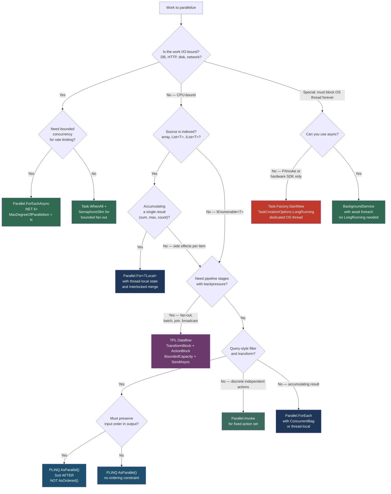

> [!success] Mastery Check
> - [ ] **Studied Well**
> - [ ] **Can explain the concept without notes**
> - [ ] **Can answer interview questions confidently**
> - [ ] **Can implement it in a real project**


## 📍 PART 0 — Navigation & Context

### Where This Topic Lives

```
C# Runtime Model
└── Concurrency & Parallelism
    ├── async/await: The State Machine (2.29) ─── I/O-bound suspension, no threads blocked
    ├── Threading Primitives (2.39) ───────────── lock, Interlocked, shared state protection
    ├── Channels and Concurrent Pipelines (2.45) ─ async producer/consumer without Dataflow overhead
    └── ► Task Parallel Library (TPL) and PLINQ (2.46) ← YOU ARE HERE
            ├── Parallel Class (For / ForEach / Invoke / ForEachAsync)
            ├── PLINQ (AsParallel, AsOrdered, Aggregate)
            └── TPL Dataflow (TransformBlock, ActionBlock, BroadcastBlock, BatchBlock)
```

### What You Need Before This

- **[[2.29 — async/await: The State Machine]]** — async/await is the I/O-bound counterpart; understanding _why_ it doesn't block threads is essential to knowing when to use TPL vs await
- **[[2.39 — Threading Primitives]]** — `Parallel` loop bodies run on thread pool threads and still require `Interlocked`, `lock`, and `SemaphoreSlim` for shared state
- **[[2.24 — LINQ: Execution Model, Deferred Evaluation, and IQueryable]]** — PLINQ is `AsParallel()` on top of `IEnumerable<T>`; LINQ's deferred iterator model is the foundation
- **[[2.16 — Value Types vs Reference Types: Deep Mechanics]]** — struct-typed work items avoid per-iteration heap allocation; value vs reference semantics affect how parallel bodies interact with shared state

### What This Unlocks After

- **[[2.47 — Dependency Injection Internals]]** — `Parallel.ForEachAsync` appears inside `BackgroundService` implementations registered through DI scopes
- **[[2.48 — Benchmarking with BenchmarkDotNet]]** — measuring parallel speedup and thread-count sensitivity requires benchmark rigor
- **[[2.49 — Tiered Compilation, JIT Internals, and PGO]]** — PGO type profiles from parallel dispatch bodies influence devirtualization
- **[[2.50 — Advanced Async Patterns]]** — `IAsyncEnumerable<T>` as a streaming input source to `Parallel.ForEachAsync`

**Why this matters to a production engineer:** When your bottleneck is CPU — image encoding, PDF generation, financial simulation, ML scoring — `async/await` gives you nothing. TPL is the difference between saturating one core and saturating all of them. Getting it wrong means either serialized execution masquerading as parallelism, or data races that corrupt calculations silently without a single exception.

---

## 🧠 PART 1 — The Core Mental Model

### The Fundamental Rule

> **TPL distributes CPU-bound work across thread pool threads using a work-stealing scheduler. PLINQ applies the same model to `IEnumerable<T>` query pipelines. Neither is appropriate for I/O-bound work — that is `async/await`'s domain, not the thread pool's.**

The practical consequence: calling `Parallel.ForEach` with database queries or HTTP requests inside the body creates a thread storm — every I/O wait blocks a pool thread, the pool injects replacements, latency spikes, and in an ASP.NET server the request threads are starved. The correct tool for bounded async I/O fan-out is `Parallel.ForEachAsync` (`.NET 6+`) or `Task.WhenAll` + `SemaphoreSlim`.

### The Plain-Language Analogy

Think of the thread pool as a restaurant kitchen during lunch rush. There is a shared order queue on the pass (the global queue) and each cook has a personal prep board (their local deque). When `Parallel.For` starts, the head chef (the partitioner) breaks 10,000 items into roughly four stacks for a quad-core kitchen and hands one stack to each cook.

Here is the key mechanism: when Cook A finishes her stack early, she walks to Cook D's station and takes work from the _bottom_ of his board — not the top. Cook D takes from his top (most recently queued, warmest cache). Cook A takes from the bottom (oldest item, cold cache — but better than standing idle). This is work-stealing: every core stays busy without a centralized dispatch bottleneck. PLINQ wraps this same mechanism in LINQ operator syntax. The partitioning and stealing happen beneath the fluent API, invisible to the caller.

### The Taxonomy Diagram

```mermaid
graph TD
    A["Task Parallel Library\nSystem.Threading.Tasks"] --> B["Parallel Class"]
    A --> C["TPL Dataflow\nNuGet: System.Threading.Tasks.Dataflow"]
    A --> D["Task / Task&lt;T&gt;\nraw parallelism primitives"]
    A --> E["PLINQ\nParallel LINQ"]

    B --> B1["Parallel.For\nindex range + work-stealing"]
    B --> B2["Parallel.ForEach\nIEnumerable&lt;T&gt; + partitioner"]
    B --> B3["Parallel.ForEachAsync\n.NET 6+ — async body, bounded I/O"]
    B --> B4["Parallel.Invoke\nfixed set of discrete actions"]

    C --> C1["ActionBlock&lt;T&gt;\nterminal consumer, no output"]
    C --> C2["TransformBlock&lt;T,TOut&gt;\ntransform + forward downstream"]
    C --> C3["TransformManyBlock&lt;T,TOut&gt;\none item → many outputs"]
    C --> C4["BufferBlock&lt;T&gt;\nbuffered intermediate queue"]
    C --> C5["BroadcastBlock&lt;T&gt;\none → many fan-out (clones)"]
    C --> C6["BatchBlock&lt;T&gt;\naccumulate N items → T[]"]
    C --> C7["JoinBlock&lt;T1,T2&gt;\nwait for one from each input"]

    D --> D1["Task.Run\npool + DenyChildAttach (default)"]
    D --> D2["Task.Factory.StartNew\nfull options: LongRunning, scheduler"]
    D --> D3["Task.WhenAll / WhenAny\ncomposed parallel waits on Tasks"]

    E --> E1["AsParallel()\nentry point"]
    E --> E2["AsOrdered()\npreserve input order — has cost"]
    E --> E3["WithDegreeOfParallelism(n)\nlimit thread count"]
    E --> E4["WithExecutionMode(ForceParallelism)\noverride automatic sequential fallback"]
    E --> E5["WithMergeOptions()\nAutoBuffered / NotBuffered / FullyBuffered"]
    E --> E6["Aggregate()\nparallel fold with per-partition seed"]
    E --> E7["ForAll()\nterminal, unordered, no materialization"]

    style A fill:#1d3557,color:#fff
    style B fill:#2d6a4f,color:#fff
    style C fill:#6b3a6d,color:#fff
    style D fill:#3a6b5d,color:#fff
    style E fill:#1d4f6e,color:#fff
    style B1 fill:#40916c,color:#fff
    style B2 fill:#40916c,color:#fff
    style B3 fill:#40916c,color:#fff
    style B4 fill:#40916c,color:#fff
    style C1 fill:#9b59b6,color:#fff
    style C2 fill:#9b59b6,color:#fff
    style C3 fill:#9b59b6,color:#fff
    style C4 fill:#9b59b6,color:#fff
    style C5 fill:#9b59b6,color:#fff
    style C6 fill:#9b59b6,color:#fff
    style C7 fill:#9b59b6,color:#fff
    style D1 fill:#4a8a7d,color:#fff
    style D2 fill:#4a8a7d,color:#fff
    style D3 fill:#4a8a7d,color:#fff
    style E1 fill:#2980b9,color:#fff
    style E2 fill:#2980b9,color:#fff
    style E3 fill:#2980b9,color:#fff
    style E4 fill:#2980b9,color:#fff
    style E5 fill:#2980b9,color:#fff
    style E6 fill:#2980b9,color:#fff
    style E7 fill:#2980b9,color:#fff
```



---

## 🔬 PART 2 — Deep Mechanics

### 2.1 The Work-Stealing Scheduler — What Actually Executes Your Code

The .NET thread pool maintains two kinds of queues simultaneously: a single global FIFO queue (for external enqueue via `ThreadPool.QueueUserWorkItem`) and per-thread local deques (for tasks spawned within an already-executing task). The critical insight is that the stealing algorithm is asymmetric by design:

```
THREAD POOL — WORK-STEALING ARCHITECTURE

Global Queue (FIFO):
 ┌────────────────────────────────────────────────────────────┐
 │  Task G4  │  Task G3  │  Task G2  │  Task G1 ← enqueue   │
 └────────────────────────────────────────────────────────────┘
                                       ↑ all threads dequeue from this end when local empty

Thread 0 Local Deque (own thread pushes/pops LIFO at top):
 ┌──────────────────────────────────────────────────────────────┐
 │  T0-E  │  T0-D  │  T0-C  │  T0-B  │  T0-A ← own thread   │
 └──────────────────────────────────────────────────────────────┘
    ↑ other threads steal from THIS end (FIFO — oldest item first)

Thread 1 Local Deque (runs dry — steals from Thread 0):
 ┌──────────────────────┐
 │  T1-B  │  T1-A ← pop│  (almost empty)
 └──────────────────────┘
 Steal: Thread 1 takes T0-E (the OLDEST item) from the bottom of Thread 0's deque.
 T0-E is likely the parent of T0-D..T0-A. Stealing the parent brings all its children.
 This minimizes future steal events — one steal, many work items acquired.

WHY THE ASYMMETRY:
  • LIFO (local):  most recently pushed task reuses hottest cache lines — best locality
  • FIFO (steal):  oldest tasks are parents of large subtrees — more bang per steal
  • Result:        near-linear parallel speedup without a centralized bottleneck

COST LABELS:
  • Task scheduling (local enqueue):     ~50–80 ns
  • Task scheduling (global enqueue):    ~100–200 ns (contended CAS on global lock)
  • Steal operation:                     ~200–500 ns
  • Direct function call (comparison):   ~5 ns
  → Parallel.For does NOT create one task per iteration.
    It creates one task per PARTITION (chunk of iterations).
    Each task runs hundreds of iterations sequentially, amortizing scheduling cost.
```

**Thread injection:** when all pool threads are blocked (e.g., `Thread.Sleep` inside a parallel body), the pool detects throughput stall and injects one new thread approximately every 500ms until work resumes or the `ThreadPool.SetMaxThreads` limit is reached. Each injected thread costs ~1ms startup time and ~1MB of stack. Injecting 50 threads = 50MB of stack and 25 seconds of stalled throughput before all threads are live. This is the mechanism behind the "Thread.Sleep in parallel body" gotcha.

### 2.2 Partitioning Strategies — How the Source Data Gets Divided

The partitioner determines how source data is split before work begins. Using the wrong partitioner for your data shape is the most common TPL performance mistake.

```
PARTITIONING STRATEGIES

━━━━━━━━━━━━━━━━━━━━━━━━━━━━━━━━━━━━━━━━━━━━━━━━━━━━━━━━━
1. RANGE PARTITIONER  (arrays, List<T>, IList<T>)
━━━━━━━━━━━━━━━━━━━━━━━━━━━━━━━━━━━━━━━━━━━━━━━━━━━━━━━━━
Source: int[8]   Threads: 4

  Partition 0: indices [0, 2)  → Thread 0
  Partition 1: indices [2, 4)  → Thread 1
  Partition 2: indices [4, 6)  → Thread 2
  Partition 3: indices [6, 8)  → Thread 3

  Cost to divide: O(1) — pure arithmetic, no enumeration
  Best when:      uniform work per element, indexed source
  Worst when:     work per element varies widely (skewed load)

━━━━━━━━━━━━━━━━━━━━━━━━━━━━━━━━━━━━━━━━━━━━━━━━━━━━━━━━━
2. CHUNK PARTITIONER  (IEnumerable<T> — unknown length)
━━━━━━━━━━━━━━━━━━━━━━━━━━━━━━━━━━━━━━━━━━━━━━━━━━━━━━━━━
Source: IEnumerable<T> (streaming, unknown count)

  Initial chunk size: 1 item  → Thread 0
  Doubles:            2 items → Thread 1
  Doubles:            4 items → Thread 0 (work-stolen from Thread 1)
  Doubles:            8 items → Thread 2
  Doubles:            16 items → Thread 3
  ...adapts to source throughput

  Why doubling: small initial chunks keep all threads busy early;
                large later chunks amortize scheduling overhead.
  Best when:    IEnumerable source, variable work per item
  Worst when:   work per item is tiny (scheduling dominates)

━━━━━━━━━━━━━━━━━━━━━━━━━━━━━━━━━━━━━━━━━━━━━━━━━━━━━━━━━
3. STRIPED PARTITIONER  (PLINQ + AsOrdered())
━━━━━━━━━━━━━━━━━━━━━━━━━━━━━━━━━━━━━━━━━━━━━━━━━━━━━━━━━
Source: [0,1,2,3,4,5,6,7]   Threads: 4

  Thread 0: indices 0, 4  (interleaved)
  Thread 1: indices 1, 5
  Thread 2: indices 2, 6
  Thread 3: indices 3, 7

  The merge phase must reassemble results IN INPUT ORDER.
  Thread 3 may finish before Thread 0 — Thread 3 must then WAIT
  at the merge barrier for Threads 0, 1, 2 to deliver earlier elements.
  Under high variance in per-element cost, fast threads idle at the barrier.
  This is why AsOrdered() can make PLINQ slower than sequential LINQ.

━━━━━━━━━━━━━━━━━━━━━━━━━━━━━━━━━━━━━━━━━━━━━━━━━━━━━━━━━
CUSTOM PARTITIONER: when defaults are wrong
━━━━━━━━━━━━━━━━━━━━━━━━━━━━━━━━━━━━━━━━━━━━━━━━━━━━━━━━━

// Force static pre-division (uniform work, no dynamic rebalancing):
int chunkSize = data.Length / Environment.ProcessorCount;
var staticPartitioner = Partitioner.Create(0, data.Length, chunkSize);
Parallel.ForEach(staticPartitioner, range =>
{
    for (int i = range.Item1; i < range.Item2; i++)
        Process(data[i]);
});
// Good when: every element costs identically; avoids chunk negotiation overhead
// Bad when:  work is skewed (first half cheap, second half expensive — Thread 0 idles)
```

### 2.3 PLINQ Execution Pipeline — From AsParallel() to the First Result

PLINQ transforms a sequential query into a parallel one at three distinct phases. The merge phase is where most PLINQ performance problems hide.

```
PLINQ EXECUTION PIPELINE

Source: IEnumerable<Product> (or IList<Product> for range partitioning)
         │
         ▼ (runs on calling thread — negligible cost for IList)
┌──────────────────────────────────────────────────────────────────┐
│  PARTITION PHASE                                                 │
│  Source divided into N partitions (N = ProcessorCount default)   │
│  Each partition becomes an independent IEnumerator<T>            │
│  Cost: O(1) for IList; first-enumeration overhead for IEnumerable│
└──────────────────────────────────────────────────────────────────┘
         │  N tasks queued to thread pool
         ▼
┌──────────────────────────────────────────────────────────────────┐
│  PIPELINE PHASE  (N threads in parallel)                         │
│                                                                  │
│  Thread 0: partition[0] → .Where(pred) → .Select(proj) → buffer │
│  Thread 1: partition[1] → .Where(pred) → .Select(proj) → buffer │
│  Thread 2: partition[2] → .Where(pred) → .Select(proj) → buffer │
│  Thread 3: partition[3] → .Where(pred) → .Select(proj) → buffer │
│                                                                  │
│  Each thread runs the FULL operator chain on its slice.          │
│  NO inter-thread communication here — full parallel isolation.   │
│  Exceptions propagate to the merge phase wrapped in              │
│  AggregateException (unwrap with .Flatten().Handle()).           │
└──────────────────────────────────────────────────────────────────┘
         │
         ▼
┌──────────────────────────────────────────────────────────────────┐
│  MERGE PHASE  (runs on consuming thread)                         │
│                                                                  │
│  AutoBuffered (default):                                         │
│    Results chunked into output buffers. Consumer receives chunks │
│    as they fill. Balances producer/consumer throughput.          │
│    Good for: streaming with a fast consumer.                     │
│                                                                  │
│  NotBuffered:                                                     │
│    Each result forwarded to consumer immediately on completion.   │
│    Lower latency to first result; lower overall throughput.       │
│    Good for: UI progress updates, early exit patterns.           │
│                                                                  │
│  FullyBuffered:                                                  │
│    All partitions complete, ALL results collected, THEN deliver. │
│    Required for: OrderBy, Reverse, Min, Max, Count, ToList.      │
│    Highest throughput; highest latency to first result.          │
│    WARNING: OrderBy forces FullyBuffered — no streaming possible. │
└──────────────────────────────────────────────────────────────────┘

OVERHEAD BUDGET:
  Setup (partitioner + task queue):   ~1–2 μs flat per query
  Break-even (parallel wins):         when total sequential time > ~2 ms
  Below break-even:                   sequential LINQ is faster
  Tip: .WithExecutionMode(ForceParallelism) overrides auto-fallback.
       Rarely correct — use it only when you've measured.
```

### 2.4 TPL Dataflow Block Internals — Buffers, Concurrency, and Backpressure

Every Dataflow block is a self-contained pipeline node with three zones: an input buffer, a processing section, and an output buffer. Backpressure flows upstream when `BoundedCapacity` is set.

```
DATAFLOW: TransformBlock<TIn, TOut> internal structure

External producer (your code)
    │
    │  await block.SendAsync(item)  ← suspends if input buffer full (backpressure ✅)
    │  block.Post(item)             ← returns false if full; item DROPPED silently (⚠️)
    ▼
┌────────────────────────────────────────────────────────────────────┐
│  INPUT BUFFER  (capacity = BoundedCapacity, default = unbounded)  │
│  ┌──────────────────────────────────────────────────────────────┐  │
│  │  item7 │ item6 │ item5 │ item4 │ item3 │ item2 │ item1 →   │  │
│  └──────────────────────────────────────────────────────────────┘  │
│  If BoundedCapacity = 100 and buffer holds 100 items:              │
│    SendAsync suspends producer until slot opens ← TRUE backpressure│
│    Post() returns false ← item silently lost                       │
└────────────────────────────────────────────────────────────────────┘
    │  dequeues up to MaxDegreeOfParallelism items concurrently
    ▼
┌────────────────────────────────────────────────────────────────────┐
│  PROCESSING  (MaxDegreeOfParallelism concurrent tasks)            │
│                                                                    │
│  Task: transform(item1) → result1   (thread pool thread)          │
│  Task: transform(item2) → result2   (thread pool thread)          │
│  Task: transform(item3) → result3   (thread pool thread)          │
│                                                                    │
│  Exceptions: captured, block enters Faulted state.                │
│  Completion propagates via Completion Task (observe it!).         │
└────────────────────────────────────────────────────────────────────┘
    │  results placed in output buffer in completion order
    ▼
┌────────────────────────────────────────────────────────────────────┐
│  OUTPUT BUFFER → forwarded to linked downstream block              │
│  LinkedBlock.SendAsync is awaited internally — no loss possible    │
└────────────────────────────────────────────────────────────────────┘

BLOCK LIFECYCLE:
  producer.Complete()     → signal: no more input arriving
  block.Completion        → Task that completes when all items processed
  PropagateCompletion=true → upstream Complete() cascades to downstream

COST LABELS:
  Post() to non-full block:     ~200–500 ns
  SendAsync() (non-blocking):   ~1–2 μs (async overhead even if immediate)
  Per-item Dataflow overhead:   ~3–5 μs total vs raw Channel<T> (~100 ns)
  Use Dataflow for:             graphs (fan-out, join, batch, broadcast)
  Use Channel<T> for:           simple single-producer/single-consumer queues
```

### 2.5 Task.Run vs Task.Factory.StartNew — The Differences That Actually Hurt You

These look equivalent. They are not.

```csharp
// Task.Run — correct for 99% of parallel CPU work
var t1 = Task.Run(() => ExpensiveComputation());

// What Task.Run actually does internally (approximately):
var t1 = Task.Factory.StartNew(
    () => ExpensiveComputation(),
    CancellationToken.None,
    TaskCreationOptions.DenyChildAttach,    // prevents child task attachment (safer)
    TaskScheduler.Default);                 // always thread pool, never ambient scheduler

// ─────────────────────────────────────────────────────────────────
// CRITICAL DIFFERENCE: the async lambda trap
// ─────────────────────────────────────────────────────────────────

// ⚠️ WRONG: Task.Factory.StartNew does NOT unwrap async lambdas
Task<int> wrong = Task.Factory.StartNew(async () =>
{
    await Task.Delay(1000);
    return 42;
});
// 'wrong' is Task<Task<int>> — the outer Task completes when the lambda
// STARTS (hits its first await), not when the async operation finishes.
// wrong.Result is Task<int> — NOT int. You silently got the wrong thing.

// ✅ CORRECT option A: Task.Run — detects async lambda, unwraps automatically
Task<int> correct = Task.Run(async () =>
{
    await Task.Delay(1000);
    return 42;
});
// 'correct' is Task<int> — completes when async operation finishes.

// ✅ CORRECT option B: .Unwrap() if you must use StartNew
Task<int> corrected = Task.Factory.StartNew(async () =>
{
    await Task.Delay(1000);
    return 42;
}).Unwrap();

// ─────────────────────────────────────────────────────────────────
// WHEN Task.Factory.StartNew IS CORRECT: the LongRunning hint
// ─────────────────────────────────────────────────────────────────
// LongRunning spins up a DEDICATED OS thread — NOT from the pool.
// The pool won't wait for it to free up; it won't starve other work.
// Use ONLY for work that blocks an OS thread for the application's lifetime.
// Do NOT use for normal parallel loop bodies — defeats work-stealing entirely.

Task.Factory.StartNew(
    () =>
    {
        while (!_cancellation.IsCancellationRequested)
        {
            byte[] data = nativeLibrary.BlockingRead(timeoutMs: 100); // no async path
            if (data.Length > 0) _channel.Writer.TryWrite(data);
        }
    },
    _cancellation.Token,
    TaskCreationOptions.LongRunning,    // dedicated thread, ~1ms startup, ~1MB stack
    TaskScheduler.Default);
// Cost: ~1ms for dedicated thread creation. After creation: same as any OS thread.
```

---

## 💻 PART 3 — Production Code Patterns

### 3.1 The Thread-Local Accumulator Pattern — Product Catalog Image Processing

The most critical correctness pattern for `Parallel.For`. Any accumulation across iterations requires thread-local state to avoid lock contention.

```csharp
// ✅ CORRECT: CPU-bound brightness aggregation across a batch of product images.
// Parallel.For<TLocal> overload: localInit → body → localFinally
// Pattern: each thread accumulates locally; ONE atomic merge at the end.

public static long CalculateTotalBrightness(byte[][] imagePixelData)
{
    long totalBrightness = 0;

    Parallel.For<long>(
        fromInclusive: 0,
        toExclusive:   imagePixelData.Length,
        // Called ONCE per thread when it first enters the loop — creates
        // thread-local accumulator. Zero allocation per ITERATION.
        localInit: () => 0L,
        // Body: runs per iteration ON A SINGLE THREAD for its partition.
        // 'localSum' is this thread's private accumulator — never shared.
        // No lock, no contention, no false sharing.
        body: (i, loopState, localSum) =>
        {
            byte[] pixels = imagePixelData[i];
            long rowBrightness = 0;
            for (int j = 0; j < pixels.Length; j++)
                rowBrightness += pixels[j];
            return localSum + rowBrightness; // updated accumulator passed to next iteration
        },
        // localFinally: called ONCE per thread after its partition is complete.
        // This is the ONLY synchronization point — O(thread count), not O(item count).
        localFinally: localSum =>
        {
            Interlocked.Add(ref totalBrightness, localSum);
        });

    return totalBrightness;
}

// ⚠️ WRONG version — lock per iteration serializes all work:
public static long CalculateTotalBrightnessNaive(byte[][] imagePixelData)
{
    long total = 0;
    object lockObj = new();
    Parallel.For(0, imagePixelData.Length, i =>
    {
        long rowSum = imagePixelData[i].Sum(b => (long)b);
        lock (lockObj) { total += rowSum; }   // ← lock on every iteration
                                              // 4 threads, each waits for lock
                                              // effective parallelism: near zero
    });
    return total;
}
// With thread-local: lock acquired O(ProcessorCount) times
// With per-iteration lock: lock acquired O(N) times — serial bottleneck
```

### 3.2 Cancellation and Exception Handling in Parallel.ForEach — Order Validation

```csharp
// ✅ CORRECT: parallel order validation with graceful cancellation and exception aggregation.
// Parallel.ForEach wraps all exceptions in AggregateException — you MUST unwrap.

public static OrderValidationReport ValidateOrders(
    IReadOnlyList<PurchaseOrder> orders,
    CancellationToken cancellationToken)
{
    var errors = new ConcurrentBag<OrderError>(); // thread-safe multi-producer add

    try
    {
        Parallel.ForEach(
            orders,
            new ParallelOptions
            {
                CancellationToken       = cancellationToken,
                MaxDegreeOfParallelism  = Environment.ProcessorCount
            },
            (order, loopState) =>
            {
                // Check cancellation inside body — CancellationToken passed
                // to ParallelOptions will also throw OperationCanceledException
                // at the loop level if cancelled before a partition starts.
                if (cancellationToken.IsCancellationRequested)
                {
                    loopState.Stop(); // signal all partitions to stop after current item
                    return;
                }

                var result = ValidateSingleOrder(order);

                if (result.IsCriticalFailure)
                {
                    // loopState.Stop()  — stop ASAP; may not stop the very next iteration
                    // loopState.Break() — stop after all lower indices complete (ordered)
                    // For "stop on first critical fault" use Stop().
                    loopState.Stop();
                    errors.Add(new OrderError(order.Id, result.ErrorMessage, isCritical: true));
                    return;
                }

                if (!result.IsValid)
                    errors.Add(new OrderError(order.Id, result.ErrorMessage, isCritical: false));
            });
    }
    catch (OperationCanceledException)
    {
        // Thrown when CancellationToken is signalled before a partition starts
        return OrderValidationReport.Cancelled(errors.ToArray());
    }
    catch (AggregateException ae)
    {
        // Parallel.ForEach catches all unhandled exceptions from body invocations
        // and rethrows as a single AggregateException containing all of them.
        // Flatten() removes nested AggregateExceptions from AggregateException chains.
        var unhandled = ae.Flatten().InnerExceptions
            .Select(ex => new OrderError(orderId: null, ex.Message, isCritical: true))
            .ToArray();
        return OrderValidationReport.WithExceptions(errors.ToArray(), unhandled);
    }

    bool hasCritical = errors.Any(e => e.IsCritical);
    return hasCritical
        ? OrderValidationReport.CriticalFailure(errors.ToArray())
        : OrderValidationReport.Success(errors.ToArray());
}
```

### 3.3 PLINQ Aggregate — Parallel Financial Risk Calculation

```csharp
// ✅ CORRECT: Parallel VaR (Value at Risk) aggregation across a large portfolio.
// Uses the 4-parameter Aggregate() overload for per-partition accumulators.
// This is the CORRECT pattern for PLINQ aggregation — avoids shared state entirely.

public static RiskSummary CalculatePortfolioRisk(
    IReadOnlyList<PortfolioPosition> positions,
    MarketScenario scenario)
{
    // The 4-argument Aggregate overload is the PLINQ-specific one:
    // seedFactory          → called ONCE PER PARTITION (not once total)
    // updateAccumulatorFunc → runs per element, single thread per partition, no locks
    // combineAccumulatorsFunc → merges two partition results, called O(thread count)
    // resultSelector        → final transform of the combined accumulator
    return positions
        .AsParallel()
        .WithDegreeOfParallelism(Environment.ProcessorCount)
        .Aggregate(
            seedFactory: () => new RiskAccumulator(),   // one per partition

            updateAccumulatorFunc: (acc, position) =>
            {
                // Pure CPU math — no I/O, no shared state.
                // This runs inside a single partition's thread — safe to mutate acc.
                decimal varContrib = scenario.ComputeVaRContribution(position);
                decimal deltaContrib = scenario.ComputeDelta(position);
                acc.Add(varContrib, deltaContrib, position.Notional);
                return acc;
            },

            combineAccumulatorsFunc: (a, b) => a.Combine(b), // merge two partition results

            resultSelector: finalAcc => finalAcc.ToRiskSummary());
}

// ⚠️ WRONG — naive Sum() with a Select(): materializes an intermediate sequence,
//            uses the 2-arg Aggregate which accumulates sequentially across partitions.
public static decimal CalculateVaRNaive(IReadOnlyList<PortfolioPosition> positions, MarketScenario s)
{
    return positions
        .AsParallel()
        .Select(p => s.ComputeVaRContribution(p)) // parallel ✅
        .Aggregate((a, b) => a + b);              // ⚠️ 2-arg Aggregate: NOT per-partition
                                                  // This IS parallelized, but the combine
                                                  // function runs sequentially — suboptimal.
}
// Use the 4-arg Aggregate when: accumulator is mutable, combine is expensive.
// Use .Sum() when: elements are numeric and summation is all you need (PLINQ optimizes this).
```

### 3.4 TPL Dataflow: Multi-Stage Order Fulfillment Pipeline

```csharp
// ✅ CORRECT: bounded, backpressure-aware three-stage pipeline.
// Stage 1: CPU-bound validation (high parallelism, BoundedCapacity prevents memory explosion)
// Stage 2: I/O-bound enrichment (async body, bounded to avoid overwhelming inventory DB)
// Stage 3: I/O-bound routing (lower parallelism for rate-limited downstream)
// PropagateCompletion = true: calling Complete() on Stage 1 cascades to Stage 3 automatically.

public sealed class OrderFulfillmentPipeline : IAsyncDisposable
{
    private readonly TransformBlock<RawOrder, ValidatedOrder> _validationBlock;
    private readonly TransformBlock<ValidatedOrder, EnrichedOrder> _enrichmentBlock;
    private readonly ActionBlock<EnrichedOrder> _routingBlock;

    public OrderFulfillmentPipeline(IInventoryService inventory, IShippingRouter router)
    {
        var linkOptions = new DataflowLinkOptions { PropagateCompletion = true };

        // Stage 1: Validation — CPU-bound, high parallelism OK
        _validationBlock = new TransformBlock<RawOrder, ValidatedOrder>(
            order => ValidateOrder(order),
            new ExecutionDataflowBlockOptions
            {
                MaxDegreeOfParallelism = Environment.ProcessorCount,
                BoundedCapacity = 500   // producer suspends via SendAsync if this fills
            });

        // Stage 2: Enrichment — async I/O (inventory DB lookup)
        _enrichmentBlock = new TransformBlock<ValidatedOrder, EnrichedOrder>(
            async order =>
            {
                // async transform: thread returned to pool during DB round-trip
                // MaxDegreeOfParallelism = 20 means 20 concurrent DB calls, not 20 threads
                InventoryStatus inv = await inventory.GetAvailabilityAsync(order.Sku);
                return order.WithInventory(inv);
            },
            new ExecutionDataflowBlockOptions
            {
                MaxDegreeOfParallelism = 20,    // 20 concurrent inventory lookups
                BoundedCapacity = 100           // smaller buffer — I/O is slower than CPU stage
            });

        // Stage 3: Routing — write to fulfillment queue / notify warehouse
        _routingBlock = new ActionBlock<EnrichedOrder>(
            async order => await router.RouteToWarehouseAsync(order),
            new ExecutionDataflowBlockOptions
            {
                MaxDegreeOfParallelism = 10,
                BoundedCapacity = 50
            });

        // Wire: completion propagates forward automatically
        _validationBlock.LinkTo(_enrichmentBlock, linkOptions);
        _enrichmentBlock.LinkTo(_routingBlock,    linkOptions);
    }

    // ✅ CRITICAL: use SendAsync — provides backpressure.
    // Post() would drop messages silently if _validationBlock's buffer is full.
    public async Task SubmitAsync(RawOrder order, CancellationToken ct = default)
        => await _validationBlock.SendAsync(order, ct);

    public async Task DrainAsync()
    {
        _validationBlock.Complete();    // signal: no more input
        await _routingBlock.Completion; // await full pipeline drain
    }

    public async ValueTask DisposeAsync() => await DrainAsync();

    private static ValidatedOrder ValidateOrder(RawOrder order)
    {
        if (string.IsNullOrEmpty(order.CustomerId))
            throw new ArgumentException($"Order {order.Id} missing CustomerId");
        if (order.Quantity <= 0)
            throw new ArgumentOutOfRangeException(nameof(order.Quantity));
        return new ValidatedOrder(order);
    }
}
```

### 3.5 Fan-Out Broadcast Pipeline — Order Event Routing

```csharp
// ✅ CORRECT: single event source broadcast to three independent processing pipelines.
// Use case: OrderPlaced event → email notification | analytics tracking | stock deduction
// BroadcastBlock sends a CLONE of each item to ALL linked targets independently.

public sealed class OrderEventBroadcaster : IAsyncDisposable
{
    private readonly BroadcastBlock<OrderPlacedEvent>  _broadcast;
    private readonly ActionBlock<OrderPlacedEvent>     _emailBlock;
    private readonly ActionBlock<OrderPlacedEvent>     _analyticsBlock;
    private readonly ActionBlock<OrderPlacedEvent>     _inventoryBlock;

    public OrderEventBroadcaster(IEmailService email, IAnalytics analytics, IInventory inventory)
    {
        // BroadcastBlock: one item in → N copies out (one per linked target)
        // Cloning function is mandatory: each target must get its own copy.
        // If a target's buffer is full: BroadcastBlock DROPS that target's copy
        // (not other targets' copies — each linkage is independent).
        _broadcast = new BroadcastBlock<OrderPlacedEvent>(
            clone: e => e with { },     // record copy — immutable, safe to share
            new DataflowBlockOptions { BoundedCapacity = 200 });

        _emailBlock = new ActionBlock<OrderPlacedEvent>(
            async e => await email.SendConfirmationAsync(e.OrderId, e.CustomerEmail),
            new ExecutionDataflowBlockOptions { MaxDegreeOfParallelism = 5, BoundedCapacity = 50 });

        _analyticsBlock = new ActionBlock<OrderPlacedEvent>(
            async e => await analytics.TrackConversionAsync(e.OrderId, e.Revenue),
            new ExecutionDataflowBlockOptions { MaxDegreeOfParallelism = 20, BoundedCapacity = 500 });

        // Inventory deduction: MaxDegreeOfParallelism = 1 — optimistic locking, serialized
        _inventoryBlock = new ActionBlock<OrderPlacedEvent>(
            async e => await inventory.DeductStockAsync(e.Sku, e.Quantity),
            new ExecutionDataflowBlockOptions { MaxDegreeOfParallelism = 1, BoundedCapacity = 200 });

        var opts = new DataflowLinkOptions { PropagateCompletion = true };
        _broadcast.LinkTo(_emailBlock,     opts);
        _broadcast.LinkTo(_analyticsBlock, opts);
        _broadcast.LinkTo(_inventoryBlock, opts);
    }

    public ValueTask PublishAsync(OrderPlacedEvent evt, CancellationToken ct = default)
        => new(_broadcast.SendAsync(evt, ct));

    public async Task DrainAsync()
    {
        _broadcast.Complete();
        // All three consumers drain independently — wait for all three
        await Task.WhenAll(
            _emailBlock.Completion,
            _analyticsBlock.Completion,
            _inventoryBlock.Completion);
    }

    public async ValueTask DisposeAsync() => await DrainAsync();
}
```

### 3.6 Parallel.ForEachAsync — Bounded Async Fan-Out for Pricing API

```csharp
// ✅ CORRECT: bounded parallel HTTP calls to an external pricing service.
// Parallel.ForEachAsync (.NET 6+) is the RIGHT tool when:
//   - Work is I/O-bound (HTTP, DB, storage)
//   - You need bounded concurrency (respect rate limits, avoid connection saturation)
//   - You need a real async body (NOT Parallel.ForEach, which fires-and-forgets async)

public static async Task<IReadOnlyDictionary<string, ProductPrice>> FetchPricesBatchAsync(
    IReadOnlyList<string> skus,
    IPricingServiceClient pricingClient,
    CancellationToken cancellationToken)
{
    var prices = new ConcurrentDictionary<string, ProductPrice>(StringComparer.Ordinal);

    // MaxDegreeOfParallelism here limits CONCURRENT I/O OPERATIONS, not CPU threads.
    // 20 concurrent HTTP calls: far more than ProcessorCount because threads yield during I/O.
    await Parallel.ForEachAsync(
        skus,
        new ParallelOptions
        {
            MaxDegreeOfParallelism = 20,
            CancellationToken = cancellationToken
        },
        async (sku, ct) =>
        {
            // async body: thread returns to pool during HTTP — no thread is blocked
            ProductPrice price = await pricingClient.FetchPriceAsync(sku, ct);
            prices.TryAdd(sku, price);
        });

    return prices;
}

// ⚠️ WRONG version — Parallel.ForEach with async lambda (fire-and-forget)
public static async Task<IReadOnlyDictionary<string, ProductPrice>> FetchPricesBad(
    IReadOnlyList<string> skus,
    IPricingServiceClient pricingClient)
{
    var prices = new ConcurrentDictionary<string, ProductPrice>();

    // ⚠️ COMPILES — but this is async void masquerading as Action<T>
    // Parallel.ForEach accepts Action<string>. An async lambda without an awaited
    // Func<string,Task> overload compiles to async void — fire and forget.
    // Parallel.ForEach fires all HTTP calls and RETURNS before any complete.
    // Exceptions are unobservable. prices is empty when method returns.
    Parallel.ForEach(skus, async sku =>
    {
        var price = await pricingClient.FetchPriceAsync(sku, default);
        prices.TryAdd(sku, price);
    });

    return prices; // Always empty — nothing has completed yet.
}
```

### 3.7 Task.Factory.StartNew with LongRunning — Native Interop Receiver

```csharp
// ✅ CORRECT: dedicated OS thread for a blocking native call that has no async path.
// The ONLY scenario where LongRunning is appropriate:
// - Work blocks an OS thread for the application's entire lifetime
// - No async/await path available (P/Invoke, hardware polling, COM blocking call)
// - You do NOT want this to consume a pool thread (would starve the pool)

public sealed class HardwareDataReceiver : IHostedService, IAsyncDisposable
{
    private readonly Channel<SensorReading> _outboundChannel;
    private readonly CancellationTokenSource _cts = new();
    private Task _receiverTask = Task.CompletedTask;

    public HardwareDataReceiver()
    {
        // Channel: bridge between the LongRunning thread and the async processing world
        _outboundChannel = Channel.CreateBounded<SensorReading>(
            new BoundedChannelOptions(capacity: 1000)
            {
                FullMode = BoundedChannelFullMode.DropOldest,   // sensor data: freshness > history
                SingleWriter = true,
                SingleReader = false
            });
    }

    public Task StartAsync(CancellationToken cancellationToken)
    {
        // Task.Factory.StartNew with LongRunning: spins a dedicated OS thread.
        // NOT Task.Run — that would consume a pool thread and not get the dedicated allocation.
        _receiverTask = Task.Factory.StartNew(
            ReceiveLoop,
            _cts.Token,
            TaskCreationOptions.LongRunning,    // dedicated thread — ~1ms startup, ~1MB stack
            TaskScheduler.Default);

        return Task.CompletedTask;
    }

    private void ReceiveLoop(object? state)
    {
        var token = _cts.Token;
        // Synchronous blocking P/Invoke — no async path exists for this hardware SDK.
        while (!token.IsCancellationRequested)
        {
            SensorData raw = SensorHardware.BlockingRead(timeoutMs: 100); // P/Invoke
            if (raw.IsValid)
            {
                var reading = new SensorReading(raw.Timestamp, raw.Value, raw.DeviceId);
                // TryWrite: non-blocking. DropOldest mode handles full channel.
                _outboundChannel.Writer.TryWrite(reading);
            }
        }
        _outboundChannel.Writer.Complete();
    }

    public ChannelReader<SensorReading> Readings => _outboundChannel.Reader;

    public async Task StopAsync(CancellationToken cancellationToken)
    {
        _cts.Cancel();
        await _receiverTask;
    }

    public async ValueTask DisposeAsync()
    {
        _cts.Cancel();
        await _receiverTask;
        _cts.Dispose();
    }
}
```

---

## ⚠️ PART 4 — Gotchas & Anti-Patterns

### Gotcha 1: async Lambda in Parallel.ForEach Silently Fires-and-Forgets

`Parallel.ForEach` accepts `Action<T>` — a synchronous delegate. When you write `async item => await ProcessAsync(item)`, the compiler selects the `Action<T>` overload (not `Func<T, Task>`), producing `async void`. The loop starts all async operations without awaiting any, returns immediately, and exceptions disappear.

```csharp
// ⚠️ WRONG: async void Action<T> — fire-and-forget with no exception visibility
var orders = await GetPendingOrdersAsync();
Parallel.ForEach(orders, async order =>        // compiles as async void — no Func<T,Task> overload
{
    await FulfillOrderAsync(order);            // starts a Task, immediately returns to caller
});
// HERE: Parallel.ForEach has returned. FulfillOrderAsync calls are running (or not).
// Unhandled exceptions from async void propagate to TaskScheduler.UnobservedTaskException.
// In .NET Core: exceptions are silently swallowed. In .NET Framework: crash.

// ✅ CORRECT: Parallel.ForEachAsync (.NET 6+) — accepts Func<T, CancellationToken, ValueTask>
await Parallel.ForEachAsync(
    orders,
    new ParallelOptions { MaxDegreeOfParallelism = 10 },
    async (order, ct) => await FulfillOrderAsync(order));
// HERE: all FulfillOrderAsync calls have completed.
// Exceptions propagate as AggregateException from the awaited ForEachAsync.

// WHY: Parallel.ForEachAsync has the correct generic overload that accepts
// Func<TSource, CancellationToken, ValueTask>. The compiler selects it properly.
// The runtime awaits each ValueTask and aggregates exceptions correctly.
```

### Gotcha 2: Shared Mutable State Creates Silent Data Races

Developers add `Parallel.For` to an existing loop without auditing shared writes. The bug produces wrong results silently — no exception, no crash — just incorrect totals that appear in financial reports.

```csharp
// ⚠️ WRONG: count++ is not atomic — this is a data race
int processedCount = 0;
decimal totalRevenue = 0;
Parallel.For(0, orders.Length, i =>
{
    ProcessOrder(orders[i]);
    processedCount++;               // read + increment + write: 3 non-atomic instructions
    totalRevenue += orders[i].Total; // same problem — decimal arithmetic is NOT atomic
});
// Result: processedCount and totalRevenue are WRONG. Lower than actual. Silent corruption.

// ✅ CORRECT option A: Interlocked for simple integer counters (~5 ns, single CPU instruction)
int processedCount = 0;
Parallel.For(0, orders.Length, i =>
{
    ProcessOrder(orders[i]);
    Interlocked.Increment(ref processedCount);
});

// ✅ CORRECT option B: thread-local accumulation for aggregates (fastest, zero contention)
long totalRevenueCents = 0;
Parallel.For<long>(
    0, orders.Length,
    () => 0L,
    (i, _, local) => { ProcessOrder(orders[i]); return local + (long)(orders[i].Total * 100); },
    local => Interlocked.Add(ref totalRevenueCents, local));

// WHY: totalRevenue += x compiles to: tmp = totalRevenue; tmp += x; totalRevenue = tmp;
// Three instructions. Two threads can read the SAME totalRevenue value simultaneously,
// both add their order, and both write — one write is lost. Silent undercount.
```

### Gotcha 3: AsOrdered() Performance Cliff

`AsOrdered()` sounds harmless — "preserve input order." What it does at runtime is force the merge phase to synchronize across all partitions, waiting for earlier indices before delivering later ones. Under uneven per-element cost, fast threads idle at the merge barrier.

```csharp
// ⚠️ WRONG: AsOrdered() with uneven per-element cost — can be SLOWER than sequential
// Scenario: product catalog with 1M products; some queries are cheap (cached), some expensive.
var enrichedProducts = productCatalog
    .AsParallel()
    .AsOrdered()                              // ← forces striped partition + ordered merge
    .Where(p => p.IsActive)
    .Select(p => EnrichWithPricingData(p))    // variable cost: 1ms to 50ms per product
    .ToList();
// Thread 3 finishes all its elements in 2 seconds.
// Thread 0 has a slow element taking 10 seconds.
// Thread 3 idles 8 seconds at the merge barrier.
// Effective parallelism: near zero while Thread 0 is stuck.
// On 8 cores: 890ms → 180ms SEQUENTIAL might actually be faster here!

// ✅ CORRECT: no AsOrdered(); sort after if needed (predictable, measurable cost)
var enrichedProducts = productCatalog
    .AsParallel()                             // no AsOrdered — results arrive in completion order
    .Where(p => p.IsActive)
    .Select(p => EnrichWithPricingData(p))
    .ToList();                                // materialize in whatever order they completed

// If the caller genuinely needs sorted output — sort it separately with known cost:
enrichedProducts.Sort((a, b) => string.Compare(a.Sku, b.Sku, StringComparison.Ordinal));

// WHY: AsOrdered() uses a barrier synchronization in the merge phase.
// Every element N cannot be delivered until elements 0..N-1 are ready.
// Under high variance in processing time, this serializes the critical path.
// The speedup you measured without AsOrdered() disappears completely with it.
```

### Gotcha 4: Post() Silently Drops Messages When BoundedCapacity Is Full

`DataflowBlock.Post()` is synchronous, returns `bool`, and silently drops the message when the block's input buffer is at capacity. This is the most dangerous API in TPL Dataflow — it compiles, runs, and loses data without a trace.

```csharp
// ⚠️ WRONG: Post() drops orders silently when pipeline buffer is full
var fulfillmentBlock = new ActionBlock<PurchaseOrder>(
    async order => await ProcessOrderAsync(order),
    new ExecutionDataflowBlockOptions { BoundedCapacity = 100 });

foreach (var order in incomingOrders)  // 10,000 orders
{
    bool accepted = fulfillmentBlock.Post(order); // ← returns false after 100 items
    // accepted = false means ORDER LOST. No retry. No exception. No logging.
    // 9,900 orders disappear silently.
}

// ✅ CORRECT: SendAsync for true backpressure — producer suspends, no message loss
foreach (var order in incomingOrders)
{
    // Suspends calling thread (asynchronously) until the block has capacity.
    // Returns false ONLY if the block has been completed or faulted — not on capacity.
    await fulfillmentBlock.SendAsync(order);
}
fulfillmentBlock.Complete();
await fulfillmentBlock.Completion;

// ✅ CORRECT alternative: wrap production in Parallel.ForEachAsync if source is large
await Parallel.ForEachAsync(
    incomingOrders,
    new ParallelOptions { MaxDegreeOfParallelism = 1 }, // single producer
    async (order, ct) => await fulfillmentBlock.SendAsync(order, ct));

// WHY: DataflowBlock.BoundedCapacity provides push-back to producers.
// But Post() bypasses that push-back entirely — it was designed for non-async callers.
// In any production pipeline, use SendAsync exclusively. Post() is for unit tests.
```

### Gotcha 5: Thread.Sleep in Thread Pool Work Items Causes Thread Storm

TPL uses thread pool threads. `Thread.Sleep` blocks the OS thread for its duration. When many parallel bodies sleep simultaneously, the pool detects throughput stall and injects new threads — each costing ~1ms and ~1MB of stack — until either work resumes or the thread cap is hit.

```csharp
// ⚠️ WRONG: Thread.Sleep inside parallel body — triggers thread injection cascade
// Scenario: rate-limited API export — need 500ms pause between batches
Parallel.ForEach(reportRequests, request =>
{
    var data = FetchReportDataSynchronously(request);
    Thread.Sleep(500);      // rate-limit backoff — blocks 1 thread per request
    SubmitReport(data);
});
// With 50 requests: 50 threads blocked sleeping simultaneously.
// Thread pool injects replacements every ~500ms.
// Result: ~50 new threads × 1MB stack = 50MB of wasted stack memory.
//         ~25 seconds of injection delay before all threads are live.
//         Application responsiveness degrades for ALL work during this period.

// ✅ CORRECT: use async body with Task.Delay — releases thread during sleep
await Parallel.ForEachAsync(
    reportRequests,
    new ParallelOptions { MaxDegreeOfParallelism = 5 },
    async (request, ct) =>
    {
        var data = await FetchReportDataAsync(request, ct);
        await Task.Delay(500, ct);          // yields thread to pool — NO blocking
        await SubmitReportAsync(data, ct);
    });
// 5 concurrent operations, each awaiting Task.Delay — thread returns to pool during delay.
// Thread pool stays healthy. No injection. No memory spike.

// WHY: Task.Delay posts a callback to the OS timer queue and immediately returns
// the thread. Thread.Sleep tells the OS scheduler to not wake this thread for N ms —
// the thread is blocked, unavailable for any other work, pool throughput drops.
```

---

## 📊 PART 5 — Performance Implications

### 5.1 Allocation Characteristics Table

|Scenario|Allocation Behavior|Approx Cost|
|---|---|---|
|`Parallel.For` body — no closure|One `Task` per partition (~ProcessorCount), body allocates nothing|~2–8 KB total|
|`Parallel.For` with thread-local state (`TLocal`)|`localInit` lambda allocated once per thread; `localFinally` closure once per thread|~100–300 B per thread|
|`Parallel.ForEach` body closing over local variable|Closure (display class) allocated per partition start, not per item|~80–200 B per thread|
|`Task.Run(() => ...)` — no capture|Zero — JIT caches static delegate|0 B|
|`Task.Run(async () => ...)` — async body|State machine struct + Task heap allocation|~200–400 B|
|PLINQ `.AsParallel().Where().Select().ToList()` on 100K items|Partition task array + output `List<T>` with backing array|~3–6 KB overhead + output|
|PLINQ `.AsOrdered()` on 100K items|Per-element ordering slots + coordination state|~400 KB–2 MB (varies)|
|`TransformBlock.SendAsync()` — buffer not full|`Task<bool>` allocation even when completing synchronously|~200 B|
|`TransformBlock.Post()` — buffer not full|Internal work item queued; no Task allocated|~100–200 B|
|`BroadcastBlock` fan-out to N targets|N clone calls + N internal message copies|N × (clone cost + ~100 B)|
|Thread injection from `Thread.Sleep` in pool|New OS thread startup|~1 MB stack per thread, ~1 ms|
|PLINQ on < 1,000 items (auto sequential fallback)|Zero parallelism overhead — runs sequentially|Same as LINQ|

### 5.2 BenchmarkDotNet: Sequential vs Parallel.For vs PLINQ

```csharp
// Expected output (approximate, .NET 8, x64, 8-core Ryzen 7):
// ┌───────────────────────────────┬───────────┬────────┬────────────┬─────────┐
// │ Method                        │ Mean      │ Ratio  │ Allocated  │ Gen0    │
// ├───────────────────────────────┼───────────┼────────┼────────────┼─────────┤
// │ Sequential                    │ 241.3 ms  │  1.00  │       0 B  │       - │
// │ ParallelForThreadLocal        │  34.2 ms  │  0.142 │   3.5 KB   │       - │
// │ PLINQAggregate4Arg            │  32.8 ms  │  0.136 │   2.9 KB   │       - │
// │ PLINQSum (no AsOrdered)       │  33.5 ms  │  0.139 │   2.1 KB   │       - │
// │ PLINQOrdered                  │ 188.7 ms  │  0.782 │ 891.4 KB   │  0.9766 │
// │ ParallelForEachNaiveLockEach  │  39.1 ms  │  0.162 │   8.3 KB   │       - │
// └───────────────────────────────┴───────────┴────────┴────────────┴─────────┘
//
// Key observations:
//  • Thread-local accumulation ≈ PLINQ Aggregate ≈ raw PLINQ Sum — all near-linear speedup
//  • AsOrdered() allocated 891 KB and ran at 78% of sequential speed — SLOWER than expected
//  • Naive per-iteration lock: still 6× faster than sequential but 10× more allocated

[MemoryDiagnoser]
[BenchmarkCategory("TPL", "Parallelism")]
public class ParallelismBenchmark
{
    private double[] _data = null!;
    private const int N = 1_000_000;

    [GlobalSetup]
    public void Setup()
    {
        _data = new double[N];
        for (int i = 0; i < N; i++) _data[i] = i;
    }

    [Benchmark(Baseline = true)]
    public double Sequential()
    {
        double sum = 0;
        for (int i = 0; i < _data.Length; i++)
            sum += Math.Sqrt(_data[i]);
        return sum;
    }

    [Benchmark]
    public double ParallelForThreadLocal()
    {
        double total = 0;
        Parallel.For<double>(
            0, _data.Length,
            () => 0.0,
            (i, _, local) => local + Math.Sqrt(_data[i]),
            local => { lock (this) { total += local; } });
        return total;
    }

    [Benchmark]
    public double PLINQAggregate4Arg()
    {
        return _data.AsParallel().Aggregate(
            seedFactory: () => 0.0,
            updateAccumulatorFunc: (acc, x) => acc + Math.Sqrt(x),
            combineAccumulatorsFunc: (a, b) => a + b,
            resultSelector: total => total);
    }

    [Benchmark]
    public double PLINQSum()
    {
        // PLINQ internally optimizes Sum() — no user-written Aggregate needed
        return _data.AsParallel()
            .Select(x => Math.Sqrt(x))
            .Sum();
    }

    [Benchmark]
    public double PLINQOrdered()
    {
        // ⚠️ Included to demonstrate AsOrdered() regression — NOT a recommended pattern
        return _data.AsParallel()
            .AsOrdered()                    // ← enables striped partitioner + ordered merge
            .Select(x => Math.Sqrt(x))
            .Sum();
    }

    [Benchmark]
    public double ParallelForEachNaiveLockEach()
    {
        double total = 0;
        Parallel.ForEach(_data, x =>
        {
            double r = Math.Sqrt(x);
            lock (this) { total += r; }     // per-item lock — worst-case contention pattern
        });
        return total;
    }
}
```

### 5.3 When to Care / When to Ignore

**When this costs you:**

CPU-bound batch processing is the canonical use case. Image transcoding, PDF rendering, cryptographic hashing, ML inference over pre-loaded models, financial simulation — on an 8-core machine with proper thread-local accumulation, `Parallel.For` completes in roughly `1/N` of sequential time. The improvement is real and measurable.

PLINQ is cost-effective for filter-project-aggregate operations over 100K+ items with uniform per-element cost. When you're filtering a million-product catalog to return active items with computed pricing, the break-even (overhead + scheduling beats sequential gain) typically occurs around 2–5ms of total sequential work.

TPL Dataflow pays off when you have multiple pipeline stages with different throughput characteristics. A three-stage pipeline where Stage 1 (CPU) runs at 5,000 items/sec, Stage 2 (DB) at 500 items/sec, and Stage 3 (external API) at 100 items/sec benefits heavily from Dataflow's bounded backpressure: Stage 1 doesn't overwhelm Stages 2 and 3, memory stays bounded, and each stage runs at its natural throughput.

**When this doesn't matter:**

I/O-bound work inside a parallel body is wrong at the architecture level, not just slow. No number of threads can make database calls faster — they're bottlenecked on network latency and server capacity. Use `async/await` and `Task.WhenAll` / `Parallel.ForEachAsync`.

Small datasets. PLINQ on fewer than 10,000 uniformly-sized items is routinely slower than sequential LINQ. The partitioner, task queue, and merge overhead (~1–2 μs) consumes more time than the parallel computation saves. Benchmark before parallelizing.

Per-request parallelism in a high-traffic ASP.NET Core service. Parallelizing inside each HTTP handler consumes thread pool threads that other requests need. Under concurrency, multiple handlers competing for pool threads causes queueing delay. Latency p99 degrades badly. The correct pattern is parallel at the request level (many concurrent requests), not within each request.

---

## 🎤 PART 6 — Interview Arsenal

### A. The Question Bank

---

> **Q: "When would you reach for `Parallel.For` versus `Task.WhenAll`?"**

**Average answer:** "Parallel.For is for loops; Task.WhenAll is when you have multiple tasks."

**Why that's insufficient:** It describes the API surface without explaining the governing principle — CPU-bound versus I/O-bound work.

> **Great answer:** "The governing principle is what the work is actually waiting on. `Parallel.For` is correct when work is CPU-bound — mathematical computation, image processing, encryption, ML scoring. It saturates available cores by distributing work across thread pool threads using a work-stealing scheduler. The key is that all time is spent doing real computation, so more threads means more throughput. If the work is I/O-bound — database queries, HTTP calls, file reads — threads would spend most of their time suspended waiting on the OS. Using `Parallel.For` there just blocks threads that aren't doing useful work, which is wasteful and under load starves the thread pool that's also serving incoming requests. For I/O-bound fan-out, `Task.WhenAll` with async operations is correct because threads yield at each await point and return to the pool. For bounded I/O concurrency, `Parallel.ForEachAsync` in .NET 6+ is the cleanest API — it accepts a real async body and a `MaxDegreeOfParallelism` that limits concurrent I/O operations, not CPU threads. The practical test: if you'd use `await` inside the body, use `Parallel.ForEachAsync` or `Task.WhenAll`. If not, `Parallel.For`."

---

> **Q: "Explain the work-stealing scheduler and why it matters."**

**Average answer:** "It lets idle threads take work from busy threads so they don't sit doing nothing."

**Why that's insufficient:** Misses the asymmetry — LIFO local access versus FIFO stealing — and why that asymmetry is the key engineering insight.

> **Great answer:** "The work-stealing scheduler gives each thread pool thread its own local deque in addition to the global queue. When a thread creates child tasks — like the iterations inside a `Parallel.For` — they go to the thread's local deque and are processed LIFO: most recent task first, which means hottest CPU cache data. When a thread exhausts its local work, it steals from the _bottom_ of another thread's deque — the FIFO end, taking the oldest tasks. The asymmetry is intentional. The oldest task is likely the parent of a whole subtree of work: steal one parent, get all its children for free in subsequent iterations. This minimizes steal events and inter-thread coordination. The practical consequence is that TPL achieves near-linear parallel speedup on CPU-bound workloads without a centralized dispatch bottleneck that would become the single source of contention. It also means blocking pool threads — via `Thread.Sleep` or synchronous I/O — is catastrophic: you remove threads from work-stealing, throughput drops, and the pool injects expensive replacement threads to compensate."

---

> **Q: "What's wrong with using an async lambda in `Parallel.ForEach`?"**

**Average answer:** "You can't use async with Parallel.ForEach."

**Why that's insufficient:** It compiles without warning. The real bug is in the semantics, not the compilation.

> **Great answer:** "`Parallel.ForEach` accepts `Action<T>` — a synchronous delegate. When you write `async item => await ProcessAsync(item)`, it compiles because an async lambda can satisfy `Action<T>` as `async void`. The compiler selects `Action<T>` because there's no `Func<T, Task>` overload. The loop then starts all async operations without awaiting them — it's fire-and-forget at scale. `Parallel.ForEach` returns before any async work completes. In a payment processing system, this means you'd return 'orders dispatched' while none actually went through. Exceptions from those async void methods are unobservable in .NET Core — they disappear silently. The fix is `Parallel.ForEachAsync` which has the right signature: `Func<TSource, CancellationToken, ValueTask>`. The compiler selects it correctly, the runtime awaits each body, and exceptions aggregate into `AggregateException`. Any time I see an async lambda passed to `Parallel.ForEach` in a code review, that's an immediate blocker."

---

> **Q: "What is `BoundedCapacity` in TPL Dataflow, and why does it matter for production systems?"**

**Average answer:** "It limits how many items can queue up in a block."

**Why that's insufficient:** Doesn't explain the backpressure mechanism or the catastrophic difference between `Post()` and `SendAsync()` when the buffer is full.

> **Great answer:** "BoundedCapacity sets the maximum size of a block's input buffer, and its primary purpose is enabling backpressure. When the buffer is full, the behavior completely depends on how the producer sends items. If you use `Post()`, it returns `false` and the message is silently dropped — no exception, no retry, no indication. If you use `await SendAsync()`, the producer's coroutine is suspended until space becomes available. The second is almost always what you want in a real pipeline. In an order fulfillment pipeline, if the database-write stage processes 200 orders/sec and the validation stage produces 2,000 orders/sec, without `BoundedCapacity` the pipeline buffers 10× the orders in memory every second until the process runs out of RAM. With `BoundedCapacity` and `SendAsync`, the slow database stage naturally throttles the fast validation stage — the producer suspends rather than materializing everything in memory. The common production bug is using `Post()` on a bounded block and wondering why some orders disappear. I enforce `SendAsync`-only as a team convention whenever `BoundedCapacity` is set."

---

### B. The Trick Questions

> [!WARNING] These Sound Simple But Contain Non-Obvious Answers

**"Does `Parallel.For` guarantee that all iterations execute in parallel simultaneously?"** Trap: "parallel" is conflated with "simultaneous." Answer: No. `Parallel.For` enables parallelism by requesting work from the thread pool, but the runtime may execute all iterations on a single thread if the dataset is small, the machine has one core, or all pool threads are busy. Use `.WithExecutionMode(ParallelExecutionMode.ForceParallelism)` to override the automatic sequential fallback — but this is almost never correct in production, because the runtime's heuristic is usually right.

**"Can I safely use `Parallel.For` inside an ASP.NET Core request handler?"** Trap: developers ask "will it work" instead of "will it scale." Answer: Technically yes — but it's dangerous under load. `Parallel.For` consumes thread pool threads to parallelize one request. Under high request concurrency, multiple handlers each consuming multiple pool threads creates thread contention. The pool queues requests waiting for threads, p99 latency spikes, and under sustained load the pool injects threads which worsens GC pressure. The correct pattern is parallel _across_ requests (each request uses one thread), not parallel _within_ each request.

**"What does `Task.Factory.StartNew(async () => { await Task.Delay(1); return 42; })` return?"** Trap: engineers expect `Task<int>`. Answer: `Task<Task<int>>`. The outer task completes when the async lambda starts and hits its first `await`. The `Task<int>` result lives inside the inner task. You must call `.Unwrap()` to get `Task<int>`, then await that. `Task.Run` does NOT have this problem — it detects the async lambda, calls `.Unwrap()` internally, and returns the correct `Task<int>`. This is the most common `Task.Factory.StartNew` production bug.

**"If I call `AsParallel()` on a LINQ query that makes database calls, will it be faster?"** Trap: parallel sounds fast, PLINQ sounds like LINQ but better. Answer: No — it will be slower and may destabilize the application. PLINQ is CPU-bound parallelism applied to `IEnumerable<T>`. Database calls are I/O-bound. `AsParallel()` on a chain with I/O inside will block N thread pool threads on DB round-trips simultaneously, triggering thread injection, degrading pool health for other requests, and adding scheduling overhead on top of network latency that was already the bottleneck. Use `Parallel.ForEachAsync` with an async body and `MaxDegreeOfParallelism` set to the appropriate connection pool size.

---

### C. Red Flags to Avoid

```
❌ "Parallel.ForEach works with async lambdas" — it compiles async void; async voids fire-and-forget.
   Mentioning this without explaining the bug tells interviewers you've never debugged it.

❌ "Thread.Sleep is fine in a Parallel.For body" — triggers thread injection, pool starvation,
   and memory growth. Shows you don't understand the thread pool lifecycle.

❌ "AsOrdered() has no performance cost" — it forces a synchronization barrier in the merge phase.
   Saying this shows you haven't benchmarked parallel code or read the PLINQ source.

❌ "I'll put a lock around the shared variable inside the loop body" — per-iteration locking
   effectively serializes all work. The correct answer is Interlocked or thread-local accumulation.

❌ "PLINQ is always faster than LINQ" — PLINQ has fixed overhead (~1–2 μs setup) and a break-even
   threshold. Small datasets are reliably slower with PLINQ. Absolute performance claims without
   benchmarks are a red flag for any senior interview.

❌ "Task.Factory.StartNew is the same as Task.Run" — StartNew has DenyChildAttach differences,
   does not unwrap async lambdas, and respects ambient scheduler. Using StartNew everywhere
   signals unfamiliarity with modern Task patterns.

❌ "I use LongRunning for all my parallel work to give them dedicated threads" — LongRunning bypasses
   work-stealing entirely and is appropriate only for threads that block indefinitely. Using it
   for normal parallel loops defeats the entire point of the thread pool.

❌ "Parallel.ForEach is the right tool for database calls" — CPU-bound vs I/O-bound confusion is
   the #1 TPL conceptual error. Saying this ends the interview on parallelism topics.
```

---

## 🔀 PART 7 — Decision Framework



---

## ✅ PART 8 — Self-Check

### A. Conceptual Questions

1. A `Parallel.For(0, 1_000_000, ...)` loop runs on an 8-core machine. The thread pool creates how many tasks to represent this work? Why is it not 1,000,000? What controls that number?
    
2. You have a `Parallel.ForEach` over an `IEnumerable<SalesRecord>` streaming from a CSV file being read line-by-line. What partitioner does PLINQ use, and what happens to the file reader when multiple threads try to advance it simultaneously?
    
3. Explain why `AsOrdered()` placed _before_ `.Where()` in a PLINQ chain is worse than `.Where()` placed _before_ `AsOrdered()`. Think about what `AsOrdered()` costs and what `.Where()` removes.
    
4. A `TransformBlock<T, R>` has `BoundedCapacity = 100` and `MaxDegreeOfParallelism = 4`. The transform function takes exactly 50ms. What is the maximum sustainable input rate (items/second) this block can handle before the input buffer fills?
    
5. You use `Parallel.For` with no shared state — each iteration operates on its own array slice. On a 4-core machine the speedup is only 1.8×, not 4×. List four plausible reasons.
    
6. PLINQ's `ForAll(action)` completes without returning a value. What does `ForAll` avoid that `.ToList()` requires, and in what scenario is `ForAll` genuinely beneficial over a `foreach` on the PLINQ result?
    
7. Two `TransformBlock`s are linked with `PropagateCompletion = true`. The first block's transform lambda throws an unhandled exception on one item. What happens to: (a) other items currently in the first block's input buffer, (b) the first block's `Completion` task, (c) the second block?
    
8. `Task.WhenAll(tasks)` — if three of the five tasks fault, how many exceptions does the returned `AggregateException` contain? How do you observe all three?
    
9. You have a `Parallel.For` loop processing mortgage applications. The body performs a `lock(this)` on every iteration to update a shared `Dictionary<string, List<Application>>`. Execution is slower than sequential. Diagnose the problem and describe two distinct fixes.
    
10. `Parallel.ForEachAsync` with `MaxDegreeOfParallelism = 10` dispatches 10,000 HTTP calls. Thread count in the process stays at 12 throughout. Explain how 10,000 concurrent HTTP calls can run on 12 threads.
    

### B. Code Puzzles

**Puzzle 1:** What is the final value of `total`? Is it guaranteed?

```csharp
int total = 0;
Parallel.For(0, 10_000, i =>
{
    total++;
});
Console.WriteLine(total);
```

<details> <summary>Answer (expand after trying)</summary>

**Any value from 1 to 10,000 — non-deterministic, and NOT guaranteed to be 10,000.** `total++` compiles to a read-modify-write sequence of at least two CPU instructions: read `total` into a register, increment the register, write back to `total`. Two threads can read the same value of `total` simultaneously, both compute `+1`, and both write the same result — one increment is lost. This is a data race. The result varies per run, per machine, per OS scheduler state. Correct fix: `Interlocked.Increment(ref total)` (single atomic CPU instruction, ~5 ns, no lock). For aggregations: use the `Parallel.For<TLocal>` overload with thread-local accumulators.

</details>

---

**Puzzle 2:** How many orders does this actually process? What does it print?

```csharp
var orders = Enumerable.Range(1, 50).ToList();
var processed = new List<int>();

Parallel.ForEach(orders, async orderId =>
{
    await Task.Delay(10); // simulate async work
    processed.Add(orderId);
});

Console.WriteLine($"Processed: {processed.Count}");
```

<details> <summary>Answer (expand after trying)</summary>

**Prints `Processed: 0` (or a very small number, non-deterministically).** The async lambda compiles as `async void Action<int>` — there is no `Func<int, Task>` overload on `Parallel.ForEach`. The loop fires 50 fire-and-forget async void methods and returns immediately. `processed.Count` is read before virtually any `Task.Delay` completes. Additionally, `List<int>.Add` is not thread-safe, so the few items that do complete before the `Console.WriteLine` may corrupt the list or throw `IndexOutOfRangeException`. Two bugs: async void fire-and-forget, and non-thread-safe collection. Fix: use `await Parallel.ForEachAsync` with a `ConcurrentBag<int>` or a pre-allocated array with index-based writes.

</details>

---

**Puzzle 3:** Does this PLINQ query run in parallel? What is printed?

```csharp
var result = Enumerable.Range(1, 5)
    .AsParallel()
    .AsOrdered()
    .Select(x => x * x)
    .ToList();

Console.WriteLine(string.Join(", ", result));
```

<details> <summary>Answer (expand after trying)</summary>

**Prints `1, 4, 9, 16, 25` — correct, ordered squares.** Whether it actually runs in parallel is not guaranteed. PLINQ has a minimum dataset threshold below which it automatically falls back to sequential execution to avoid overhead exceeding the speedup. For 5 elements with trivial `x * x` work, the runtime's heuristic almost certainly chooses sequential execution. `AsOrdered()` correctly preserves input order in the output regardless. To force parallel for testing: `.WithExecutionMode(ParallelExecutionMode.ForceParallelism)` — but this is almost never appropriate in production because the auto-fallback heuristic is correct.

</details>

---

**Puzzle 4:** Find all the bugs.

```csharp
var block = new TransformBlock<Order, Invoice>(order =>
{
    Thread.Sleep(200); // simulate slow processing
    return GenerateInvoice(order);
}, new ExecutionDataflowBlockOptions { BoundedCapacity = 10, MaxDegreeOfParallelism = 4 });

var printBlock = new ActionBlock<Invoice>(invoice => Console.WriteLine(invoice.Total));
block.LinkTo(printBlock);

foreach (var order in GetOrders()) // returns 100 orders
{
    block.Post(order);
}

block.Complete();
await block.Completion;
```

<details> <summary>Answer (expand after trying)</summary>

Three bugs. (1) **`Post()` silently drops messages.** `BoundedCapacity = 10` means after 10 items + 4 being processed, `Post()` returns `false`. The remaining ~86 orders are dropped silently. Fix: `await block.SendAsync(order)` for true backpressure. (2) **`Thread.Sleep` blocks thread pool threads.** With `MaxDegreeOfParallelism = 4`, four threads sleep 200ms each. The pool may inject replacement threads. Fix: make the transform `async` and use `await Task.Delay(200)`. (3) **`PropagateCompletion = false` (the default).** When `block.Complete()` cascades through, `printBlock` is never completed — `printBlock.Completion` never finishes. The `await block.Completion` returns before `printBlock` drains. Fix: `block.LinkTo(printBlock, new DataflowLinkOptions { PropagateCompletion = true })`.

</details>

---

**Puzzle 5:** Which of the following allocates on the heap? Explain each.

```csharp
// A: PLINQ sum
double sumA = data.AsParallel().Select(x => Math.Sqrt(x)).Sum();

// B: Parallel.For with thread-local (data is double[])
double sumB = 0;
Parallel.For<double>(0, data.Length, () => 0.0,
    (i, _, local) => local + data[i], local => { lock(x) { sumB += local; } });

// C: PLINQ with AsOrdered
var listC = data.AsParallel().AsOrdered().Select(x => x * 2).ToList();

// D: Parallel.ForEach with async lambda
Parallel.ForEach(data, async x => await Task.Delay(1));

// E: Task.Run with static method (no closure)
await Task.Run(ComputeExpensiveResult);
```

<details> <summary>Answer (expand after trying)</summary>

**A:** Allocates the partition task array (~ProcessorCount `Task` objects), internal PLINQ state, and the enumerator objects — roughly 2–4 KB. The `Select` lambda also allocates if it captures anything; `x => Math.Sqrt(x)` does not capture, so the JIT may cache the delegate. **B:** Allocates the `() => 0.0` (localInit) and the `local => ...` (localFinally) closures once per thread (since they capture `sumB`), plus the partition tasks. Minimal — O(ProcessorCount) allocations. **C:** Allocates significantly more — partition tasks, per-element ordering slots in the merge buffer (~400 bytes × N for large N), plus the output `List<T>` and its backing array. **D:** Allocates 50 (or however many elements) `async void` state machine objects — one per element, immediately — before any complete. Each async void state machine is a heap-allocated class. Also: this is fire-and-forget (async void), so none of the `Task.Delay` calls are awaited. **E:** Zero allocation if `ComputeExpensiveResult` is a static method group with no capture. `Task.Run` with a non-capturing method group: the JIT caches the `Action` delegate permanently. The `Task` itself allocates (~200 B), but the delegate does not.

</details>

---

## 🔗 PART 9 — Connections & Resources

### A. Related Topics Table

|Topic|Why It Connects|
|---|---|
|[[2.29 — async/await: The State Machine]]|async/await handles I/O-bound concurrency; TPL handles CPU-bound — the CPU vs I/O distinction determines which to use at every call site where work is dispatched|
|[[2.39 — Threading Primitives]]|Parallel loop bodies run on thread pool threads and still need `Interlocked`, `lock`, `SemaphoreSlim`, and `volatile` for any shared mutable state — threading primitives are the synchronization layer beneath TPL|
|[[2.45 — Channels and Concurrent Pipelines]]|`Channel<T>` is a lighter alternative to TPL Dataflow for simple single-producer/single-consumer pipelines; Dataflow is correct when you need graphs with fan-out, join, batch, or broadcast semantics that Channel cannot express|
|[[2.24 — LINQ: Execution Model, Deferred Evaluation, and IQueryable]]|PLINQ is `AsParallel()` on `IEnumerable<T>`; understanding LINQ's deferred iterator composition and what "materializing" means is required to reason about PLINQ's pipeline and merge phases|
|[[2.16 — Value Types vs Reference Types: Deep Mechanics]]|Struct work items in `Parallel.For` bodies avoid per-iteration heap allocation; arrays of structs have better cache locality than arrays of references, directly impacting parallel loop throughput|
|[[2.41 — Performance: Zero-Allocation Patterns]]|Thread-local state in `Parallel.For<TLocal>` is the zero-allocation alternative to `ConcurrentBag` accumulation; understanding both is needed to pick the right pattern per scenario|
|[[2.48 — Benchmarking with BenchmarkDotNet]]|TPL speedup claims must be validated with benchmarks — wall clock time in a unit test is not sufficient; BDN measures allocation, GC events, and real throughput with the memory diagnoser|
|[[2.40 — GC Interaction, Finalizers, and WeakReference]]|Parallel workloads that allocate per-iteration objects produce Gen0 GC pressure proportional to core count — a 16-core machine allocating per-iteration produces 16× the GC pause frequency|

### B. Books

|Book|Chapters|Why These Chapters|
|---|---|---|
|Concurrency in C# Cookbook — Stephen Cleary|Ch. 1, 2, 3, 4|Chapter 2 covers Parallel class patterns with idiomatic recipes; Chapter 3 covers async coordination; Chapter 4 covers TPL Dataflow blocks end-to-end. Cleary is the most practical real-world reference.|
|CLR via C# — Jeffrey Richter|Ch. 27, 28|Chapter 27 covers thread pool internals including work-stealing, injection heuristics, and the global/local queue architecture. Chapter 28 covers asynchronous I/O and the relationship between async and thread pool.|
|Pro .NET Parallel Programming in C# — Adam Freeman|Ch. 3, 4, 5, 7|Chapter 3: Parallel class API; Chapter 4: PLINQ with operator reference; Chapter 5: TPL Dataflow blocks and pipeline patterns; Chapter 7: common parallel patterns and debugging. Older edition — verify against .NET 6+ for `ForEachAsync`.|

### C. Essential Articles & Docs

- [Microsoft Docs: Parallel Programming in .NET](https://learn.microsoft.com/en-us/dotnet/standard/parallel-programming/) — canonical reference for Parallel class, PLINQ, Dataflow, and threading considerations
- [Stephen Toub: Patterns for Parallel Programming (PDF)](https://www.microsoft.com/en-us/download/details.aspx?id=19222) — the definitive paper on TPL design patterns, written by the principal TPL architect; covers work-stealing, aggregation, and pipeline patterns in depth
- [Stephen Toub: Task.Run vs Task.Factory.StartNew](https://devblogs.microsoft.com/pfxteam/task-run-vs-task-factory-startnew/) — explains every behavioral difference between the two APIs; written by the API author; required reading before using either in production
- [Stephen Cleary: There Is No Thread](https://blog.stephencleary.com/2013/11/there-is-no-thread.html) — explains why I/O-bound `async/await` does not consume threads, which is the prerequisite for understanding why `Parallel.For` is wrong for I/O work
- [Microsoft Docs: TPL Dataflow Library](https://learn.microsoft.com/en-us/dotnet/standard/parallel-programming/dataflow-task-parallel-library) — complete block reference including `BoundedCapacity`, `PropagateCompletion`, and multi-block pipeline composition

---

> [!NOTE] Template Meta-Note **Every note in this vault follows this 9-part structure:**
> 
> - **Part 0:** Navigation — situate yourself before reading a word of content; prerequisites are what unlocks this topic, this topic unlocks what comes next
> - **Part 1:** Core Mental Model — the one-sentence rule you defend in an interview, the analogy that makes it physical, the full taxonomy diagram you can sketch on a whiteboard
> - **Part 2:** Deep Mechanics — what the runtime is actually doing; ASCII memory diagrams, compiler transforms, cost labels on every non-trivial operation
> - **Part 3:** Production Code — 5–7 annotated patterns from named enterprise domains; anti-pattern immediately before correct version; paste-into-production quality
> - **Part 4:** Gotchas — exactly 5 production bugs that appear in experienced engineers' code; wrong → right → why format
> - **Part 5:** Performance — allocation table, BenchmarkDotNet benchmark with expected output comment block, explicit "when to care / when to ignore" split
> - **Part 6:** Interview Arsenal — full spoken-aloud Q&A narratives in first person, trick questions with traps named explicitly, red flags that reduce your interview score
> - **Part 7:** Decision Framework — Mermaid flowchart answering "when do I use X vs Y"; usable as a cheat sheet in a live whiteboard session
> - **Part 8:** Self-Check — 8–10 questions requiring first-principles reasoning + 4–5 code puzzles with non-obvious answers in collapsed `<details>` blocks
> - **Part 9:** Connections — wiki links with specific dependency explanations, books with exact chapters, authoritative articles only (no SEO tutorial sites)

---

_Last updated: 2026-06 · Domain: C# Language Mastery · Topic: 2.46_
