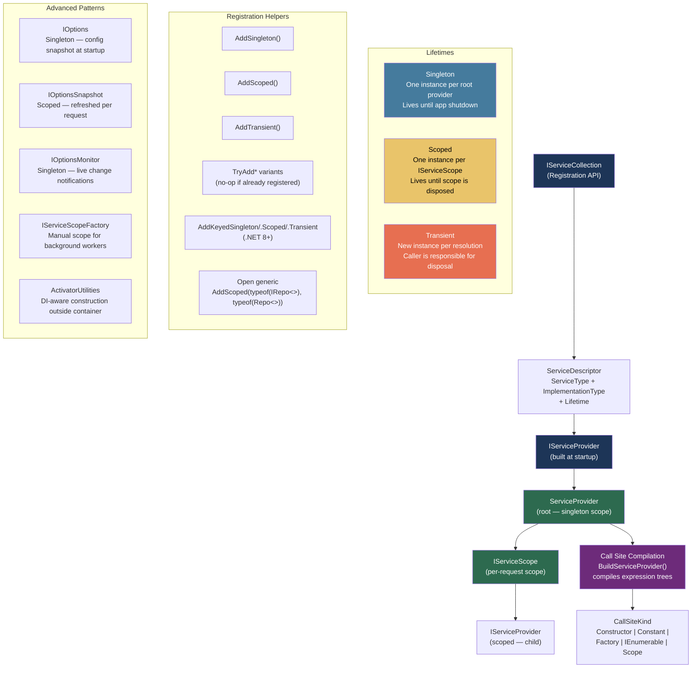
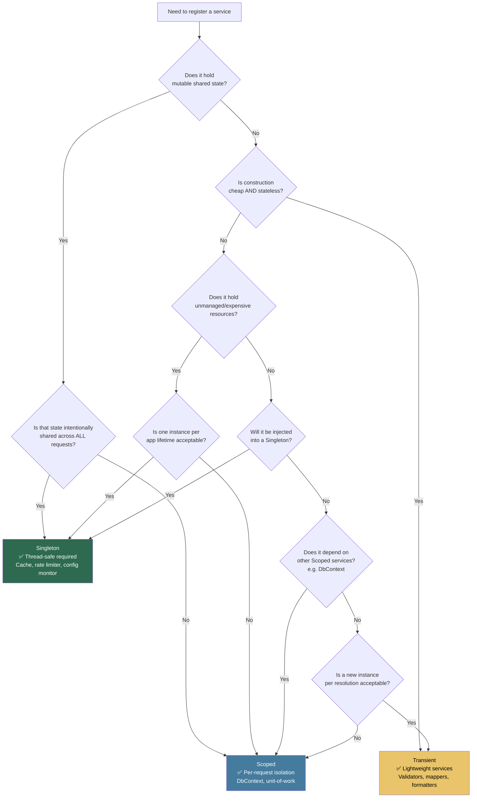

> [!success] Mastery Check
> - [ ] **Studied Well**
> - [ ] **Can explain the concept without notes**
> - [ ] **Can answer interview questions confidently**
> - [ ] **Can implement it in a real project**


## 📍 PART 0 — Navigation & Context

### Where This Topic Lives

```
C# Language Mastery
└── Level 4 — Advanced & Specialist
    ├── ► 2.47 Dependency Injection Internals   ← YOU ARE HERE
    ├──   2.48 Benchmarking with BenchmarkDotNet
    ├──   2.49 Tiered Compilation, JIT Internals, and PGO
    └──   2.50 Advanced Async Patterns

    Dependencies (must know before this):
    └── 2.30 IDisposable & Resource Management  ← Scopes ARE IDisposable
    └── 2.43 Expression Trees                   ← Container compiles call-site trees
    └── 2.42 Reflection                         ← Discovery phase at startup
    └── 2.29 async/await                        ← IAsyncDisposable + CreateAsyncScope
```

### What You Need Before This

- [[2.30 — IDisposable, IAsyncDisposable, and Resource Management]] — scopes are `IDisposable`; the entire lifetime model rests on this contract
- [[2.43 — Expression Trees]] — the container compiles expression trees at `BuildServiceProvider()` time; cold-path resolution is expression compilation
- [[2.42 — Reflection]] — service discovery at startup uses `ConstructorInfo`; this is replaced by compiled delegates for the hot path
- [[2.16 — Value Types vs Reference Types]] — understanding why service resolution is ~50 ns (pointer indirection, not copying) requires memory model knowledge

### What This Unlocks After

- Diagnosing captive dependency bugs in staging environments without hours of guesswork
- Implementing custom DI containers, decorators, and interceptors for production middleware
- Designing background worker scoping patterns that don't leak scoped services into singleton territory
- Understanding ASP.NET Core request lifetime at the framework level, not just the documentation level

### Why This Topic Matters at Scale

At scale, a captive dependency bug — a Singleton capturing a Scoped service — produces intermittent data corruption under concurrent load that doesn't reproduce in tests and doesn't appear in traces. Understanding the container's lifetime model, call-site compilation, and scope validation is what separates engineers who debug this in minutes from those who debug it in days.

---

## 🧠 PART 1 — The Core Mental Model

### The Fundamental Rule

> **The DI container is a factory compiled once. It resolves services by executing a pre-compiled expression tree, not by running reflection at each call. The lifetime — Singleton, Scoped, or Transient — determines whether that factory returns a cached instance or creates a new one.**

### The Plain-Language Analogy

Think of the DI container as a **hotel with three types of rooms**. When you call `BuildServiceProvider()`, management (the compiler) walks the entire hotel blueprint, decides which rooms need to be pre-furnished (Singleton), which rooms get furnished fresh for each guest's stay (Scoped), and which rooms get assembled on demand and torn down immediately (Transient). Once the hotel opens, guests don't get blueprints — they get a key in ~50 nanoseconds. The key works because the blueprint was compiled into an optimised floor plan at build time.

The critical insight is what happens when a Singleton room _holds a reference_ to a Scoped room: the Scoped room is supposed to be emptied after each guest's stay, but the Singleton never lets go of it. The room is perpetually occupied by the first guest who ever checked in. New guests think they're getting a fresh room; they're not. This is the captive dependency bug, and the hotel analogy maps to the runtime exactly.

### The Taxonomy Diagram



---

## 🔬 PART 2 — Deep Mechanics

### 2.1 BuildServiceProvider — What Actually Happens

`BuildServiceProvider()` is not a cheap call. It does real work. Every engineer who calls it inside a hot path (unit tests, factory methods) is paying a serious price without knowing it.

```
BUILDSERVICEPROVIDER() EXECUTION SEQUENCE
━━━━━━━━━━━━━━━━━━━━━━━━━━━━━━━━━━━━━━━━

1. Walk IServiceCollection (O(n) where n = # of registered descriptors)
   - Build a lookup table: Type → List<ServiceDescriptor>

2. Construct the ServiceProvider root object
   - Allocates a CallSiteFactory (caches call sites by type)
   - Allocates a ServiceProviderEngine (determines runtime strategy:
     Dynamic | Expressions | Runtime | ILEmit)

3. For each registered type (lazily, on first resolution):
   - Analyse constructor dependencies recursively
   - Build a CallSiteChain (detects circular dependencies)
   - Produce a CallSiteKind node tree:
     ConstructorCallSite → [ConstructorCallSite, ScopeCallSite, ConstantCallSite ...]

4. Compile CallSite tree to Expression<Func<ServiceProviderEngineScope, object>>
   - This is the "call site" — a Linq Expression tree compiled to IL via Compile()
   - Result is a Func<ServiceProviderEngineScope, object> delegate
   - Cached in a ConcurrentDictionary<Type, Func<...>> (the "resolved cache")

5. Scope validation (when ValidateScopes = true, default in Development):
   - Walk the entire call-site graph
   - Detect any Singleton → Scoped dependency edge
   - Throw InvalidOperationException at startup, not at runtime

Cost: ~0.5–5 ms depending on registration count. Never call inside a loop.
```

**Memory layout of a resolved service:**

```
ROOT ServiceProvider (singleton scope)
┌──────────────────────────────────────────────────────────────┐
│  _callSiteCache: ConcurrentDictionary<Type, CallSite>        │
│  _realizedServices: ConcurrentDictionary<Type, object>       │
│    → singletons live here, keyed by ServiceType              │
│  _engine: ServiceProviderEngine (holds compiled delegates)   │
│  _root: ServiceProviderEngineScope (the root scope object)   │
└──────────────────────────────────────────────────────────────┘

IServiceScope (per-request scope)
┌──────────────────────────────────────────────────────────────┐
│  _serviceScopeFactory: ref to root                           │
│  _resolvedServices: Dictionary<Type, object>                 │
│    → scoped instances live here, keyed by ServiceType        │
│  _capturedDisposables: List<IDisposable>                     │
│    → all Transient+Scoped IDisposables tracked for Dispose() │
└──────────────────────────────────────────────────────────────┘
```

**Cost labels:**

- `BuildServiceProvider()`: ~0.5–5 ms, one heap allocation per ServiceDescriptor → call-site compilation
- `serviceProvider.GetService<T>()` (cold — first call per type): ~1–5 µs (expression compilation)
- `serviceProvider.GetService<T>()` (warm — subsequent calls): ~50–200 ns (delegate invocation + dictionary lookup)
- `scope.Dispose()`: O(n) where n = tracked disposables in scope

---

### 2.2 Call-Site Compilation — Expression Trees Under the Hood

When you resolve `IOrderService`, the container doesn't call `new OrderService(new OrderRepository(...))` via reflection. It compiles an expression tree once and then invokes a delegate. Here's what that looks like conceptually:

```csharp
// You registered:
services.AddScoped<IOrderService, OrderService>();
services.AddScoped<IOrderRepository, OrderRepository>();
services.AddSingleton<ILogger<OrderService>, Logger<OrderService>>();

// The container builds (approximately) this expression tree at first resolution:
// Expression<Func<ServiceProviderEngineScope, object>>:

scope =>
    new OrderService(                                        // ConstructorCallSite
        (IOrderRepository)scope.GetOrCreateScoped(          // ScopeCallSite
            typeof(IOrderRepository),
            s => new OrderRepository(                        // ConstructorCallSite
                (IDbContext)s.GetOrCreateScoped(             // ScopeCallSite
                    typeof(IDbContext),
                    s2 => new AppDbContext(
                        (DbContextOptions)s2.Root            // ConstantCallSite
                            .GetSingleton(typeof(DbContextOptions))
                    )
                )
            )
        ),
        (ILogger<OrderService>)scope.Root                    // SingletonCallSite
            .GetSingleton(typeof(ILogger<OrderService>))
    )

// This expression is compiled to a Func<ServiceProviderEngineScope, object>
// and cached. Subsequent resolutions invoke this delegate directly.
// Reflection is used ONCE to build this tree at startup — never again per resolve.
```

**The four call-site kinds you'll see in diagnostics:**

|CallSite Kind|Meaning|Lifetime|
|---|---|---|
|`ConstructorCallSite`|Call `new T(...)` with resolved args|Any|
|`ScopeCallSite`|Check scope cache; create if absent|Scoped|
|`SingletonCallSite`|Check root cache; create if absent|Singleton|
|`TransientCallSite`|Always call factory — no cache|Transient|
|`ConstantCallSite`|Return pre-built instance directly|Singleton (pre-registered)|
|`FactoryCallSite`|Invoke user-provided `Func<IServiceProvider,T>`|Any|

---

### 2.3 Lifetime Rules — The Captive Dependency Bug in Detail

The captive dependency bug is the most dangerous DI mistake in production. It causes silent data sharing between requests that is nearly impossible to detect through logging or traces.

```
LIFETIME COMPATIBILITY MATRIX
(row = consumer lifetime, col = dependency lifetime)

               Dependency:  Singleton  Scoped  Transient
Consumer:
  Singleton              ✅         ❌       ⚠️
  Scoped                 ✅         ✅       ⚠️
  Transient              ✅         ✅       ✅

❌ = Captive dependency — ALWAYS a bug
⚠️ = Legal but risky — Singleton holding a Transient means
     the transient lives for the full app lifetime (leaked)
```

**What the captive dependency looks like at runtime:**

```
Timeline: Two concurrent HTTP requests

Request A begins: scope_A created
  → resolves UserService from scope_A
  → UserService.Ctor captures _dbContext from scope_A

BUT: UserService is Singleton — it was captured on the FIRST request ever.

Request B begins: scope_B created
  → resolves UserService — returns the SAME instance (singleton!)
  → UserService._dbContext is scope_A's context
  → Request B's database operations run on Request A's DbContext instance
  → EF Core DbContext is not thread-safe
  → DATA CORRUPTION or ObjectDisposedException
```

```csharp
// ⚠️ WRONG: The bug is invisible at compile time and at startup in Production mode
public class UserService
{
    private readonly AppDbContext _db;

    // ⚠️ AppDbContext is Scoped. UserService is Singleton.
    // If ValidateScopes is disabled (Production default in pre-.NET 6 templates),
    // this silently captures scope_0's DbContext for the lifetime of the app.
    public UserService(AppDbContext db) => _db = db;
}

services.AddSingleton<UserService>();  // ← Singleton
services.AddDbContext<AppDbContext>(); // ← Scoped (AddDbContext default)

// ✅ CORRECT OPTION A: Make UserService Scoped too
services.AddScoped<UserService>();

// ✅ CORRECT OPTION B: Inject IServiceScopeFactory and create a scope per operation
public class UserService
{
    private readonly IServiceScopeFactory _scopeFactory;
    public UserService(IServiceScopeFactory scopeFactory) => _scopeFactory = scopeFactory;

    public async Task<User> GetUserAsync(int id)
    {
        // Explicitly create a scope — this scope owns the DbContext lifetime
        await using var scope = _scopeFactory.CreateAsyncScope();
        var db = scope.ServiceProvider.GetRequiredService<AppDbContext>();
        return await db.Users.FindAsync(id);
    }
}
```

---

### 2.4 Scope Validation — Development vs Production Default

```csharp
// The WebApplication.CreateBuilder() template in .NET 6+:
// ValidateScopes = true in Development (default)
// ValidateScopes = false in Production (default — for performance)

// To enable in production (recommended for safety):
builder.Host.UseDefaultServiceProvider(options =>
{
    options.ValidateScopes = true;    // catches captive deps at startup
    options.ValidateOnBuild = true;   // validates all registered types are resolvable
                                      // (catches missing registrations immediately)
});

// What ValidateOnBuild does:
// At BuildServiceProvider() time, attempt to resolve EVERY registered root type.
// If any constructor dependency is missing → throws at startup.
// Cost: ~2-10x longer startup. Worth it in staging.

// What ValidateScopes does:
// Walk every call site graph at BuildServiceProvider() time.
// If any Singleton → Scoped edge is found → throws InvalidOperationException.
// This is pure compile-time graph analysis — no runtime overhead after startup.
```

**The exception you see when ValidateScopes catches the bug:**

```
System.InvalidOperationException: Cannot consume scoped service 'AppDbContext'
from singleton 'UserService'.
   at Microsoft.Extensions.DependencyInjection.ServiceProvider.ValidateCallSite(...)
```

---

### 2.5 IServiceScopeFactory — The Correct Pattern for Background Workers

`IHostedService` and `BackgroundService` run as singletons. They need scoped services. The only safe pattern is `IServiceScopeFactory`.

```csharp
// The correct background worker pattern
// This is the pattern ASP.NET Core's own source uses for hosted services

public class OrderProcessingWorker : BackgroundService
{
    private readonly IServiceScopeFactory _scopeFactory;
    private readonly ILogger<OrderProcessingWorker> _logger;

    // IServiceScopeFactory is itself a Singleton — safe to inject here
    public OrderProcessingWorker(
        IServiceScopeFactory scopeFactory,
        ILogger<OrderProcessingWorker> logger)
    {
        _scopeFactory = scopeFactory;
        _logger = logger;
    }

    protected override async Task ExecuteAsync(CancellationToken stoppingToken)
    {
        while (!stoppingToken.IsCancellationRequested)
        {
            // Each iteration creates its own scope — DbContext is scoped per iteration
            await using var scope = _scopeFactory.CreateAsyncScope();

            // Scoped services resolved here have the same lifetime as this scope block
            var orderRepo = scope.ServiceProvider
                .GetRequiredService<IOrderRepository>();
            var paymentService = scope.ServiceProvider
                .GetRequiredService<IPaymentService>();

            await ProcessNextBatchAsync(orderRepo, paymentService, stoppingToken);

            // scope.DisposeAsync() is called here via await using:
            // - Calls DisposeAsync() on all IAsyncDisposable scoped services
            // - Calls Dispose() on all IDisposable scoped services
            // - DbContext is flushed and connection returned to pool
        }
    }

    private async Task ProcessNextBatchAsync(
        IOrderRepository orderRepo,
        IPaymentService paymentService,
        CancellationToken cancellationToken)
    {
        var pendingOrders = await orderRepo.GetPendingAsync(cancellationToken);
        foreach (var order in pendingOrders)
            await paymentService.ProcessAsync(order, cancellationToken);
    }
}
```

---

## 💻 PART 3 — Production Code Patterns

### 3.1 The Keyed Services Pattern (.NET 8+)

Multiple implementations of the same interface, selected by a key. This replaces the factory-lambda workaround that was the only option before .NET 8.

```csharp
// Payment processing system: multiple payment providers, selected by key

public interface IPaymentProvider
{
    Task<PaymentResult> ChargeAsync(PaymentRequest request, CancellationToken ct);
}

// Registration — keyed services with string or enum keys
services.AddKeyedScoped<IPaymentProvider, StripePaymentProvider>("stripe");
services.AddKeyedScoped<IPaymentProvider, PayPalPaymentProvider>("paypal");
services.AddKeyedScoped<IPaymentProvider, BraintreePaymentProvider>("braintree");

// ✅ Correct resolution via [FromKeyedServices] in ASP.NET Core controllers:
public class CheckoutController : ControllerBase
{
    // The container matches the key at build time — no runtime dictionary lookup
    public CheckoutController(
        [FromKeyedServices("stripe")] IPaymentProvider stripe,
        [FromKeyedServices("paypal")] IPaymentProvider paypal)
    { ... }
}

// ✅ Correct resolution via IKeyedServiceProvider in generic code:
public class PaymentRouter
{
    private readonly IKeyedServiceProvider _sp;
    public PaymentRouter(IKeyedServiceProvider sp) => _sp = sp;

    public IPaymentProvider GetProvider(string gateway)
        => _sp.GetRequiredKeyedService<IPaymentProvider>(gateway);
}

// ⚠️ WRONG — the pre-.NET 8 workaround using a factory lambda is a service locator
// (shown here for recognition purposes only — don't write new code like this):
// services.AddScoped<Func<string, IPaymentProvider>>(sp => key =>
//     key switch { "stripe" => sp.GetRequiredService<StripePaymentProvider>(), ... });
```

### 3.2 The Open Generic Registration Pattern

When you have one generic repository interface and many entities, registering each pair individually does not scale. Open generic registration solves this in one line.

```csharp
// Order management system: IRepository<T> for every entity type

public interface IRepository<T> where T : class
{
    Task<T?> FindByIdAsync(Guid id, CancellationToken ct);
    Task AddAsync(T entity, CancellationToken ct);
    Task<IReadOnlyList<T>> QueryAsync(Expression<Func<T, bool>> predicate, CancellationToken ct);
}

public class EfRepository<T> : IRepository<T> where T : class
{
    private readonly OrderDbContext _db;
    public EfRepository(OrderDbContext db) => _db = db;
    // ... implementations using _db.Set<T>()
}

// ✅ One registration covers ALL entity types — IRepository<Order>, IRepository<Customer>, etc.
services.AddScoped(typeof(IRepository<>), typeof(EfRepository<>));

// The container handles the closed generic construction:
// GetService<IRepository<Order>>() → EfRepository<Order>(OrderDbContext)
// GetService<IRepository<Customer>>() → EfRepository<Customer>(OrderDbContext)
// Both get the same scoped OrderDbContext instance within the same request.

// ⚠️ WRONG: Registering each pair manually
// services.AddScoped<IRepository<Order>, EfRepository<Order>>();
// services.AddScoped<IRepository<Customer>, EfRepository<Customer>>();
// services.AddScoped<IRepository<Invoice>, EfRepository<Invoice>>();
// ... N more registrations, each requiring a code change when a new entity is added
```

### 3.3 The TryAdd Pattern — Safe Extension Method Registration

Library authors must never unconditionally register services. Unconditional registration overwrites the host application's own registrations and breaks extensibility. `TryAdd` only registers if no registration exists yet.

```csharp
// Payment SDK published as a NuGet library
// Allows the consuming application to override any component

public static class PaymentServiceCollectionExtensions
{
    public static IServiceCollection AddPaymentSdk(
        this IServiceCollection services,
        Action<PaymentOptions> configure)
    {
        // ✅ Configure the options (safe — AddOptions handles duplicates internally)
        services.Configure<PaymentOptions>(configure);

        // ✅ TryAddScoped — if the app already registered IPaymentGateway, don't overwrite
        services.TryAddScoped<IPaymentGateway, DefaultPaymentGateway>();

        // ✅ TryAddSingleton — default retry policy; app can replace with Polly-backed version
        services.TryAddSingleton<IRetryPolicy, ExponentialBackoffRetryPolicy>();

        // ✅ TryAddScoped for the core service — app can replace with a mock or alternative
        services.TryAddScoped<IPaymentProcessor, StripePaymentProcessor>();

        // ✅ AddSingleton (not TryAdd) only for things that must stack, not replace
        // e.g., IStartupFilter: these must ALL run, not just the first one
        services.AddSingleton<IStartupFilter, PaymentSdkStartupFilter>();

        return services;
    }
}

// Consuming application can override before or after:
services.AddPaymentSdk(opts => opts.Environment = "production");
// Override the default gateway with a test double in integration tests:
services.AddScoped<IPaymentGateway, WiremockPaymentGateway>();
// Because TryAdd was used, the last line wins in any registration order
// that the app controls.
```

### 3.4 The Decorator Pattern via Registration

Wrapping a registered service with a decorator without modifying the original class — the correct way to add cross-cutting concerns like caching, logging, or metrics.

```csharp
// Product catalog system: add caching to IProductRepository without changing it

public interface IProductRepository
{
    Task<Product?> GetByIdAsync(int id, CancellationToken ct);
    Task<IReadOnlyList<Product>> SearchAsync(string query, CancellationToken ct);
}

// ✅ Decorator wraps the real implementation, adds caching
public class CachingProductRepository : IProductRepository
{
    private readonly IProductRepository _inner;      // the real repo
    private readonly IMemoryCache _cache;

    // The decorator receives the real implementation via constructor —
    // the container injects it. This is possible because we register using a factory.
    public CachingProductRepository(IProductRepository inner, IMemoryCache cache)
    {
        _inner = inner;
        _cache = cache;
    }

    public async Task<Product?> GetByIdAsync(int id, CancellationToken ct)
    {
        var key = $"product:{id}";
        if (_cache.TryGetValue(key, out Product? cached)) return cached;

        var product = await _inner.GetByIdAsync(id, ct);
        if (product is not null)
            _cache.Set(key, product, TimeSpan.FromMinutes(5));
        return product;
    }

    public Task<IReadOnlyList<Product>> SearchAsync(string query, CancellationToken ct)
        => _inner.SearchAsync(query, ct); // pass-through — no caching for search
}

// Registration with factory lambda to wire the decorator pattern
services.AddScoped<EfProductRepository>(); // register concrete type directly
services.AddScoped<IProductRepository>(sp =>
    new CachingProductRepository(
        sp.GetRequiredService<EfProductRepository>(),  // inner = real impl
        sp.GetRequiredService<IMemoryCache>()
    ));

// ⚠️ WRONG: Registering both under the same interface
// services.AddScoped<IProductRepository, EfProductRepository>();
// services.AddScoped<IProductRepository, CachingProductRepository>();
// This registers two implementations — GetService<IProductRepository>()
// returns the LAST registered one; the decorator doesn't wrap the first.
```

### 3.5 IOptions vs IOptionsSnapshot vs IOptionsMonitor

Three options patterns with meaningfully different lifetimes — one of the most common DI mistakes in real ASP.NET Core services.

```csharp
// Feature flag service in an e-commerce platform

// ✅ IOptions<T>: Singleton. Reads config ONCE at BuildServiceProvider().
// Use for: static configuration that never changes at runtime.
// Safe to inject into Singletons.
public class EmailTemplateService
{
    private readonly EmailSettings _settings;
    public EmailTemplateService(IOptions<EmailSettings> options)
        => _settings = options.Value; // .Value is read once and cached in this field
}

// ✅ IOptionsSnapshot<T>: Scoped. Recomputed once per request from current config.
// Use for: settings that can change between requests (feature flags, rate limits).
// CANNOT be injected into Singletons — it IS Scoped.
public class CheckoutService
{
    private readonly CheckoutSettings _settings;
    public CheckoutService(IOptionsSnapshot<CheckoutSettings> options)
        => _settings = options.Value; // fresh value per HTTP request — reflects reloads
}

// ✅ IOptionsMonitor<T>: Singleton. Live notifications via OnChange callback.
// Use for: long-running singletons that need to react to config changes.
// CurrentValue property always returns the latest value.
public class RateLimiterSingleton
{
    private readonly IOptionsMonitor<RateLimitSettings> _monitor;
    private readonly IDisposable _changeToken;

    public RateLimiterSingleton(IOptionsMonitor<RateLimitSettings> monitor)
    {
        _monitor = monitor;
        // Register a callback when the underlying IConfiguration changes
        _changeToken = monitor.OnChange(settings =>
        {
            // Reconfigure the rate limiter in-place without restart
            RebuildLimiter(settings);
        });
    }

    public bool AllowRequest(string clientId)
        => CheckLimit(clientId, _monitor.CurrentValue.RequestsPerMinute);

    public void Dispose() => _changeToken.Dispose(); // unregister the callback
}

// ⚠️ WRONG: Injecting IOptionsSnapshot into a Singleton
// public class MySingleton { public MySingleton(IOptionsSnapshot<Opts> opts) { ... } }
// → InvalidOperationException at startup (ValidateScopes)
// → Silent data sharing bug at runtime (Production with ValidateScopes disabled)
```

### 3.6 ActivatorUtilities — DI-Aware Construction Outside the Container

When you need to construct an object with DI-resolved dependencies AND caller-provided parameters that don't live in the container.

```csharp
// Order processing pipeline: each order handler takes the order as a constructor arg
// alongside DI-resolved services. You can't register every possible order in the DI container.

public class OrderFulfillmentHandler
{
    private readonly IInventoryService _inventory;
    private readonly IShippingService _shipping;
    private readonly Order _order; // not registered in DI — known at runtime only

    public OrderFulfillmentHandler(
        IInventoryService inventory,
        IShippingService shipping,
        Order order) // mixed: DI services + runtime value
    {
        _inventory = inventory;
        _shipping = shipping;
        _order = order;
    }

    public async Task FulfillAsync(CancellationToken ct) { ... }
}

// Factory that uses ActivatorUtilities to construct the handler per order
public class OrderHandlerFactory
{
    private readonly IServiceProvider _sp;
    public OrderHandlerFactory(IServiceProvider sp) => _sp = sp;

    public OrderFulfillmentHandler CreateFor(Order order)
        // ActivatorUtilities resolves IInventoryService and IShippingService from _sp,
        // passes `order` as the additional parameter.
        // It matches constructor parameters by type — `order` fills the `Order` parameter.
        => ActivatorUtilities.CreateInstance<OrderFulfillmentHandler>(_sp, order);
}

// ⚠️ WRONG: Using the container directly with a factory lambda
// services.AddTransient<OrderFulfillmentHandler>(sp => new OrderFulfillmentHandler(
//     sp.GetRequiredService<IInventoryService>(),
//     sp.GetRequiredService<IShippingService>(),
//     ??? // you don't have the order at registration time
// ));

// ⚠️ ALSO WRONG: Service Locator pattern inside the handler
// public OrderFulfillmentHandler(IServiceProvider sp, Order order) { ... }
// This hides dependencies, makes the constructor lie, and kills testability.
```

### 3.7 The Dispose Contract — What Happens When a Scope Is Disposed

```csharp
// The container tracks IDisposable and IAsyncDisposable services automatically.
// Understanding the tracking rules prevents resource leaks.

// RULE: The container tracks Scoped and Transient services for disposal
//       IF they implement IDisposable or IAsyncDisposable.
//       Singletons are tracked by the root scope.

// ✅ Correct async scope lifecycle in an integration test
public async Task TestOrderProcessingAsync()
{
    var services = new ServiceCollection();
    services.AddDbContext<OrderDbContext>(opts =>
        opts.UseInMemoryDatabase("test"));
    services.AddScoped<IOrderService, OrderService>();

    await using var provider = services.BuildServiceProvider();

    // ✅ Create an explicit scope for this test case
    await using var scope = provider.CreateAsyncScope();
    var orderService = scope.ServiceProvider.GetRequiredService<IOrderService>();
    await orderService.PlaceOrderAsync(new OrderRequest { ... });

    // When scope is disposed (await using):
    // 1. IOrderService.DisposeAsync() called (if implemented)
    // 2. OrderDbContext.DisposeAsync() called → connection returned to pool
    // 3. Any other scoped IDisposable services disposed in LIFO order
}

// ⚠️ The transient disposal trap:
// Transient IDisposable services resolved directly from the root provider
// are tracked by the ROOT scope and live until app shutdown.
// This is a resource leak if the transient is expensive (e.g., holds a DB connection).

// ⚠️ WRONG (leaks the HttpClient handler until app shutdown):
var rootProvider = services.BuildServiceProvider();
var client = rootProvider.GetRequiredService<HttpClient>(); // Transient + IDisposable
// client is now held by the root scope. It will never be disposed until the app exits.

// ✅ CORRECT: Always resolve Transient IDisposable services from a scope
await using var scope = rootProvider.CreateAsyncScope();
var client = scope.ServiceProvider.GetRequiredService<HttpClient>();
// Disposed when scope is disposed.
```

---

## ⚠️ PART 4 — Gotchas & Anti-Patterns

### Gotcha 1: The Captive Dependency Survives Scope Validation Off

Engineers enable `ValidateScopes = false` in production for performance, knowing it's the default. Then they forget they're running without the safety net — and a newly added Scoped dependency gets captured by an existing Singleton.

```csharp
// This code is entirely legal at compile time and passes startup validation
// when ValidateScopes = false (Production default in older templates).
// It silently corrupts data under concurrent load.

// ⚠️ WRONG: Singleton consuming Scoped (bug introduced by a new developer)
public class ReportingService // Singleton
{
    // Developer added this new dependency thinking it was fine.
    // The PR reviewed the class, not the registration.
    private readonly IReportRepository _repo; // Scoped! DbContext-backed.

    public ReportingService(IReportRepository repo) => _repo = repo;

    public async Task<Report> GenerateAsync(ReportRequest request)
        => await _repo.BuildReportAsync(request);
    // First request's DbContext used for ALL subsequent requests.
    // ObjectDisposedException appears intermittently.
}

// ✅ CORRECT: Enable ValidateScopes in ALL environments
builder.Host.UseDefaultServiceProvider(opts =>
{
    opts.ValidateScopes = true;      // catches this at startup
    opts.ValidateOnBuild = true;     // catches unresolvable types too
});
// Now: InvalidOperationException at startup in EVERY environment.
// The bug cannot go unnoticed.
```

### Gotcha 2: GetService vs GetRequiredService — Silent Null in Production

```csharp
// GetService<T>() returns null if T is not registered. It does NOT throw.
// In a long method chain, the null propagates until a NullReferenceException
// fires far from the missing registration.

// ⚠️ WRONG:
var repo = serviceProvider.GetService<IUserRepository>();
var user = await repo.GetByIdAsync(userId); // NullReferenceException — repo is null
                                             // Stack trace points here, not at the missing registration

// ✅ CORRECT: Use GetRequiredService<T>() in application code
var repo = serviceProvider.GetRequiredService<IUserRepository>();
// Throws InvalidOperationException immediately with a clear message:
// "No service for type 'IUserRepository' has been registered."
// Stack trace points directly at the missing registration.

// WHY: GetService<T>() is designed for optional dependencies and
// infrastructure code that probes for capabilities.
// In application code, a missing registration is always a programming error.
```

### Gotcha 3: Registering an Instance That Is Already Disposed

When you pre-build an expensive singleton and register the instance directly, the container's ownership semantics can cause a double-dispose or use-after-dispose.

```csharp
// ⚠️ WRONG: Registering a pre-built instance that will be disposed externally
var connection = new SqlConnection(connectionString);
connection.Open();
services.AddSingleton<SqlConnection>(connection);
// Problem: the DI container does NOT dispose instances registered with AddSingleton(instance).
// The caller is responsible. But in practice, nobody disposes it — it leaks.
// Alternatively, if the caller DOES dispose it, the container hands out a disposed object.

// ✅ CORRECT OPTION A: Register a factory — the container owns the lifetime
services.AddSingleton<SqlConnection>(sp =>
{
    var conn = new SqlConnection(connectionString);
    conn.Open();
    return conn;
    // The container created it → the container disposes it at app shutdown.
});

// ✅ CORRECT OPTION B: For resources with complex setup, use IOptions + factory
// and let IHostApplicationLifetime.ApplicationStopping trigger cleanup.

// WHY: When you call AddSingleton(instance), the container skips disposal tracking
// for that instance. This is by design — you pre-built it, you own it.
// When you register a factory, the container owns the lifecycle and disposes it.
```

### Gotcha 4: AddSingleton with a Mutable Class Used Concurrently

Singletons are shared across all threads and all requests. If the singleton holds mutable state without synchronization, you get data races.

```csharp
// ⚠️ WRONG: Singleton with a mutable dictionary — race condition under load
public class ProductCacheService // registered as Singleton
{
    // Regular Dictionary is NOT thread-safe
    private readonly Dictionary<int, Product> _cache = new();

    public void Set(int id, Product product) => _cache[id] = product; // ← DATA RACE
    public Product? Get(int id) => _cache.TryGetValue(id, out var p) ? p : null;
}

// ✅ CORRECT: Use thread-safe collections for mutable singleton state
public class ProductCacheService
{
    // ConcurrentDictionary handles all concurrent reads and writes safely
    private readonly ConcurrentDictionary<int, Product> _cache = new();

    public void Set(int id, Product product) => _cache[id] = product;

    // GetOrAdd with a factory — atomically add if absent, no double-add race
    public Product GetOrAdd(int id, Func<int, Product> factory)
        => _cache.GetOrAdd(id, factory);
}

// WHY: ASP.NET Core processes requests on the thread pool — many threads
// call into the singleton concurrently. Dictionary<K,V> is not designed
// for concurrent access; internal state corruption or infinite loops
// under concurrent resize are documented failure modes.
```

### Gotcha 5: Enumerable Resolution Order and the Last-Wins Assumption

When multiple registrations exist for the same interface, `GetService<T>` returns the LAST registered one. But `GetServices<IEnumerable<T>>` returns ALL of them in registration order. Engineers frequently mix up which behavior they're getting.

```csharp
// Notification system: multiple INotificationChannel implementations
services.AddScoped<INotificationChannel, EmailNotificationChannel>();
services.AddScoped<INotificationChannel, SmsNotificationChannel>();
services.AddScoped<INotificationChannel, PushNotificationChannel>();

// ⚠️ WRONG: Expecting GetService to return all three
var channel = provider.GetRequiredService<INotificationChannel>();
// Returns ONLY PushNotificationChannel — the last registered.
// EmailNotificationChannel and SmsNotificationChannel are silently ignored.

// ✅ CORRECT: Use IEnumerable<T> to get all registered implementations
public class NotificationDispatcher
{
    private readonly IEnumerable<INotificationChannel> _channels;

    public NotificationDispatcher(IEnumerable<INotificationChannel> channels)
        => _channels = channels; // receives all three, in registration order

    public async Task NotifyAllAsync(Notification notification, CancellationToken ct)
    {
        foreach (var channel in _channels)
            await channel.SendAsync(notification, ct);
    }
}

// WHY: The IServiceCollection is a LIST — multiple registrations are valid and all
// are preserved. GetService<T> picks the last one (standard LIFO override behavior).
// IEnumerable<T> enumerates them all. If you intended override semantics, use TryAdd
// so only the first registration wins.
```

---

## 📊 PART 5 — Performance Implications

### 5.1 Allocation Characteristics Table

|Scenario|Allocation Behavior|Approx Cost|
|---|---|---|
|`BuildServiceProvider()`|O(n) expressions compiled; one `Func<>` per service type|0.5–5 ms startup|
|`GetRequiredService<T>()` cold (first call per type)|Expression tree compiled → `Func<>` cached in `ConcurrentDictionary`|~1–5 µs|
|`GetRequiredService<T>()` warm (subsequent calls)|Delegate invocation + dictionary lookup|~50–200 ns|
|Resolving a Transient service|New instance created per call; tracked for disposal if IDisposable|~50 ns + ctor cost|
|Resolving a Scoped service (cache hit)|Dictionary lookup in scope's `_resolvedServices`|~20–50 ns|
|Resolving a Singleton service (cache hit)|Dictionary lookup in root scope's `_realizedServices`|~15–40 ns|
|`serviceProvider.CreateScope()`|Allocates `ServiceProviderEngineScope` + empty `Dictionary<Type, object>`|~200 ns / ~200 B|
|`scope.Dispose()` with 5 IDisposable services|Iterates `_capturedDisposables`, calls Dispose() on each|~500 ns + disposal costs|
|`ActivatorUtilities.CreateInstance<T>()`|Reflection-based on first call; cached thereafter|~200 ns warm|
|Open generic resolution (closed for first time)|Closes the generic type, compiles call site|~2–5 µs (once)|
|`IEnumerable<T>` resolution (3 implementations)|Creates a new array of 3 elements per resolution|~300 ns + 3× service ctor|
|ValidateOnBuild during startup|Resolves ALL registered types once|+50–500% startup time|

### 5.2 BenchmarkDotNet Code

```csharp
using BenchmarkDotNet.Attributes;
using BenchmarkDotNet.Running;
using Microsoft.Extensions.DependencyInjection;

[MemoryDiagnoser]
[BenchmarkCategory("DependencyInjection")]
public class DiResolutionBenchmark
{
    private IServiceProvider _provider = null!;
    private IServiceScope _scope = null!;

    // Interfaces and implementations for the benchmark
    public interface IOrderService { void DoWork(); }
    public interface IOrderRepository { void Fetch(); }
    public class OrderRepository : IOrderRepository { public void Fetch() { } }
    public class OrderService : IOrderService
    {
        private readonly IOrderRepository _repo;
        public OrderService(IOrderRepository repo) => _repo = repo;
        public void DoWork() { }
    }

    [GlobalSetup]
    public void Setup()
    {
        var services = new ServiceCollection();
        services.AddTransient<IOrderService, OrderService>();
        services.AddTransient<IOrderRepository, OrderRepository>();
        _provider = services.BuildServiceProvider();
        _scope = _provider.CreateScope();
    }

    [GlobalCleanup]
    public void Cleanup()
    {
        _scope.Dispose();
        (_provider as IDisposable)?.Dispose();
    }

    // Baseline: direct new — zero container overhead
    [Benchmark(Baseline = true)]
    public IOrderService DirectNew()
        => new OrderService(new OrderRepository());

    // Warm resolution from a pre-existing scope
    [Benchmark]
    public IOrderService ScopedResolutionWarm()
        => _scope.ServiceProvider.GetRequiredService<IOrderService>();

    // Scoped resolution including scope creation and disposal
    [Benchmark]
    public IOrderService ScopeCreateAndResolve()
    {
        using var scope = _provider.CreateScope();
        return scope.ServiceProvider.GetRequiredService<IOrderService>();
    }

    // ActivatorUtilities — useful for mixed DI + runtime args
    [Benchmark]
    public IOrderService ActivatorUtilitiesCreate()
        => ActivatorUtilities.CreateInstance<OrderService>(
               _scope.ServiceProvider);
}

// Expected output (approximate, .NET 8, x64):
// | Method                   | Mean      | Allocated |
// |--------------------------|-----------|-----------|
// | DirectNew                |   1.8 ns  |       0 B |
// | ScopedResolutionWarm     |  85.0 ns  |      48 B |
// | ScopeCreateAndResolve    | 290.0 ns  |     232 B |
// | ActivatorUtilitiesCreate | 210.0 ns  |      48 B |
```

### 5.3 When to Care / When to Ignore

**When this costs you:**

- Calling `BuildServiceProvider()` in a factory method or test helper called repeatedly — each call takes 1–5 ms and allocates significantly
- Resolving `IEnumerable<T>` on every hot request when there are 10+ implementations — each call allocates a new array
- Registering expensive Transient `IDisposable` services directly from the root provider — they never get disposed until app shutdown
- Calling `serviceProvider.CreateScope()` inside a tight loop (e.g., processing 100k messages) — 200 ns × 100k = 20 ms + GC pressure
- Resolving services in a hot path that could instead be resolved once at startup

**When this doesn't matter:**

- Per-request service resolution in an ASP.NET Core controller — 50–200 ns is negligible vs a database call
- Standard three-tier web application with reasonable service count (< 200 registrations) — BuildServiceProvider takes well under 5 ms
- Integration tests that build a provider once per test class — the cost is amortized
- Services resolved during application startup for initialization only

---

## 🎤 PART 6 — Interview Arsenal

### A. The Question Bank

---

**Q: "Explain the three DI lifetimes in .NET and when you'd use each."**

**Average Answer:** "Singleton means one instance for the whole app, Scoped means one per request, and Transient means new every time."

**Why That's Insufficient:** It's correct but doesn't demonstrate understanding of the ownership model, disposal behavior, captive dependency risk, or the consequences of each choice under concurrency.

> **Great Answer:** "Singleton means one instance per root `IServiceProvider` — it lives for the application's lifetime and must be fully thread-safe because it's shared across all concurrent requests. Scoped means one instance per `IServiceScope`, which in ASP.NET Core corresponds to one HTTP request — the container creates it, tracks it, and disposes it when the scope is disposed. Transient means a new instance per resolution call, with disposal tracked by whichever scope performed the resolution. The production decision I care most about is the captive dependency trap: a Singleton must never directly hold a Scoped dependency, because the Scoped instance gets captured on the first request and effectively becomes a Singleton itself — any per-request state it was meant to isolate is now shared. I always enable `ValidateScopes = true` and `ValidateOnBuild = true` in all environments, including production, because catching this at startup costs a few milliseconds and prevents multi-hour debugging sessions."

---

**Q: "What happens inside the container when you call BuildServiceProvider()?"**

**Average Answer:** "It compiles and prepares the container so services can be resolved."

**Why That's Insufficient:** Doesn't explain expression tree compilation, call-site caching, or what the cost actually is.

> **Great Answer:** "When you call `BuildServiceProvider()`, the container walks every `ServiceDescriptor` in the collection and builds a call-site graph for each registered type — a tree of `ConstructorCallSite`, `ScopeCallSite`, `SingletonCallSite`, and `FactoryCallSite` nodes that describes how to construct each service and its transitive dependencies. It then compiles that graph into a `Func<ServiceProviderEngineScope, object>` delegate via expression tree compilation — this is why the first call to `GetService<T>()` per type costs microseconds while subsequent calls cost around 50–200 nanoseconds. If `ValidateScopes` is on, it also walks the full graph looking for Singleton→Scoped edges and throws immediately if any exist. The key implication is that `BuildServiceProvider()` is expensive — typically a millisecond or more — so calling it in a hot path or in a test helper that runs per test is a real cost."

---

**Q: "What is the correct pattern for using scoped services inside a background worker?"**

**Average Answer:** "Inject `IServiceScopeFactory` and create a new scope for each operation."

**Why That's Insufficient:** Correct but doesn't explain why, doesn't show the `await using` pattern, and doesn't address the disposal contract.

> **Great Answer:** "Background services are registered as singletons, which means they can't take scoped dependencies directly in their constructor — that would be the captive dependency bug. The correct pattern is to inject `IServiceScopeFactory`, which is itself a singleton and therefore safe, then create an `IServiceScope` with `CreateAsyncScope()` at the start of each logical unit of work — typically each iteration of the processing loop. The `await using` pattern guarantees that when the unit of work completes, the scope's `DisposeAsync()` is called, which propagates disposal to every scoped `IAsyncDisposable` service that was resolved within it — including `DbContext`, which flushes pending changes and returns the connection to the pool. Skipping the `await using` means database connections leak until the GC eventually collects them, which under load will exhaust the connection pool."

---

**Q: "What's the difference between IOptions<T>, IOptionsSnapshot<T>, and IOptionsMonitor<T>?"**

**Average Answer:** "They all let you access configuration options with different refresh behaviors."

**Why That's Insufficient:** Doesn't state the lifetimes, which is what matters when deciding which to inject where.

> **Great Answer:** "`IOptions<T>` is a Singleton — its `Value` is captured once at `BuildServiceProvider()` time and never refreshed. It's safe to inject into other Singletons and appropriate for configuration that is truly static for the app lifetime. `IOptionsSnapshot<T>` is Scoped — it's recomputed from the current `IConfiguration` once per `IServiceScope`, which in ASP.NET Core means once per request. This means it reflects configuration reloads, but it cannot be injected into a Singleton, because that would be the captive dependency bug — I've seen this bite teams when they add a feature flag to a Scoped snapshot and inject it into an existing Singleton service. `IOptionsMonitor<T>` is a Singleton with a `CurrentValue` property that always returns the latest configuration, and an `OnChange` callback for reactive response to changes. The correct pattern for a long-running Singleton that needs live config updates — like a rate limiter or circuit breaker — is `IOptionsMonitor<T>` with an `OnChange` handler that reconfigures the service in place."

---

### B. The Trick Questions

**"Can I inject `IServiceProvider` into a service and use it to resolve dependencies?"** _The trap:_ Sounds like a powerful escape hatch. _Correct answer:_ Yes, but it's the Service Locator anti-pattern. It hides dependencies (the constructor doesn't declare them), makes the class impossible to test without a real container, and moves errors from compile-time/startup-time to runtime. The only legitimate place for `IServiceProvider` injection is infrastructure code that genuinely has dynamic resolution requirements — like `ActivatorUtilities`-based factory classes. In application services, every dependency should be declared in the constructor.

**"If I register the same interface twice with AddScoped, what happens?"** _The trap:_ Engineers assume it's an error or idempotent. _Correct answer:_ Both registrations are preserved. `GetService<T>()` returns the **last** registration. `GetServices<IEnumerable<T>>()` returns **all** registrations. This is intentional — it's how override/decoration works. If you want idempotent registration (first wins), use `TryAddScoped`.

**"Does the container call Dispose() on a Transient service?"** _The trap:_ "Transient means no tracking" is a common misconception. _Correct answer:_ Yes — but only if the transient implements `IDisposable` or `IAsyncDisposable`. The scope that resolved the transient adds it to its disposal list. When the scope is disposed, all tracked transients in that scope are disposed. Transients resolved directly from the root provider are tracked by the root scope and disposed at app shutdown — this is the transient disposal leak trap.

**"What's the difference between BuildServiceProvider() and CreateServiceProvider() in test code?"** _The trap:_ Most engineers only know `BuildServiceProvider()`. _Correct answer:_ `BuildServiceProvider()` is the production method on `IServiceCollection` which produces a `ServiceProvider`. In tests, calling it per-test is expensive. The pattern is to call it once per test class (`[ClassInitialize]` or constructor) and create per-test scopes via `CreateScope()`. `CreateServiceProvider()` is an internal/extension method in some test frameworks, not a standard API — the question probes whether the candidate knows the cost model.

---

### C. Red Flags to Avoid

```
❌ "Scoped and Transient are basically the same" 
   — they have completely different ownership semantics and disposal behavior

❌ "I inject IServiceProvider so I can resolve whatever I need"
   — this is the Service Locator anti-pattern; says your design has problems

❌ "ValidateScopes is a development-only feature, no point in production"
   — the captive dependency bug IS a production bug; the cost at startup is negligible

❌ "Singletons are thread-safe by default because the container manages them"
   — the container creates one instance; thread safety is entirely your responsibility

❌ "I disable ValidateScopes in tests to make them faster"
   — this is exactly where you WANT captive dependency errors to surface

❌ "Transient services are never disposed; that's the whole point"
   — IDisposable transients ARE disposed when their resolving scope is disposed

❌ "BuildServiceProvider() is cheap, I call it per-request to get a fresh container"
   — this is catastrophically wrong; 1–5 ms per request, plus memory leaks

❌ Conflating AddSingleton(instance) with AddSingleton<T>() in terms of disposal ownership
   — the container disposes factory-registered singletons; it does NOT dispose instance-registered singletons
```

---

## 🔀 PART 7 — Decision Framework



---

## ✅ PART 8 — Self-Check

### A. Conceptual Questions

1. You have a `ReportingService` registered as Singleton that takes `AppDbContext` in its constructor. `AppDbContext` is registered with `AddDbContext()`, which defaults to Scoped. Without `ValidateScopes`, what happens at runtime under concurrent load? Describe the exact failure mode.
    
2. You call `provider.GetRequiredService<IEnumerable<INotificationChannel>>()`. Three implementations are registered. What do you get? If you call `provider.GetRequiredService<INotificationChannel>()` instead, what do you get? Why the difference?
    
3. What is the difference between `services.AddSingleton<ICache, RedisCache>()` and `services.AddSingleton<ICache>(new RedisCache(connectionString))`? When does each form dispose the `RedisCache` instance?
    
4. A team member says "we can speed up our background service by removing the scope creation — just inject `IOrderRepository` directly into the `BackgroundService` constructor". What's wrong with this advice? What would happen?
    
5. You need `IOptionsSnapshot<FeatureFlags>` but your service is a Singleton. What's the correct alternative? Write the constructor signature.
    
6. When does `ValidateOnBuild` throw vs `ValidateScopes`? Give an example scenario that each catches but the other doesn't.
    
7. You register `services.AddTransient<IEmailSender, SmtpEmailSender>()`. `SmtpEmailSender` holds an open `SmtpClient` and implements `IDisposable`. Inside an ASP.NET Core controller, you resolve it via `HttpContext.RequestServices.GetRequiredService<IEmailSender>()`. When is `Dispose()` called on the `SmtpClient`? What if you resolve it from the root provider instead?
    
8. Explain why calling `services.BuildServiceProvider()` inside a unit test fixture's `[TestInitialize]` method (which runs before every test) is a performance problem. What's the correct pattern?
    
9. What does `TryAddScoped<T>()` do that `AddScoped<T>()` doesn't? Give a concrete scenario where the difference matters.
    
10. You have an `IRepository<T>` open generic interface. You register `services.AddScoped(typeof(IRepository<>), typeof(EfRepository<>))`. A developer on your team registers `services.AddScoped<IRepository<Order>, CachedOrderRepository>()` later in the startup pipeline. What does `GetRequiredService<IRepository<Order>>()` return? What about `GetRequiredService<IRepository<Customer>>()`?
    

### B. Code Puzzles

**Puzzle 1 — What happens at startup?**

```csharp
var services = new ServiceCollection();
services.AddSingleton<ReportService>();
services.AddScoped<AppDbContext>();

var provider = services.BuildServiceProvider(
    new ServiceProviderOptions { ValidateScopes = true });

// Line A: Does this throw?
var report = provider.GetRequiredService<ReportService>();
```

<details> <summary>Answer (expand after trying)</summary>

**Line A throws `InvalidOperationException`** when `ValidateScopes = true`, but NOT at `BuildServiceProvider()`. `ValidateScopes` is enforced lazily at first resolution time (unless `ValidateOnBuild = true` is also set). The exception message is: _"Cannot consume scoped service 'AppDbContext' from singleton 'ReportService'."_ If `ValidateOnBuild = true` were set, it would throw during `BuildServiceProvider()` itself.

</details>

---

**Puzzle 2 — What is the output?**

```csharp
var services = new ServiceCollection();
services.AddScoped<IPaymentProvider, StripeProvider>();
services.AddScoped<IPaymentProvider, PayPalProvider>();

var provider = services.BuildServiceProvider();
using var scope = provider.CreateScope();

var single = scope.ServiceProvider.GetRequiredService<IPaymentProvider>();
var all = scope.ServiceProvider.GetRequiredService<IEnumerable<IPaymentProvider>>();

Console.WriteLine(single.GetType().Name);
Console.WriteLine(all.Count());
```

<details> <summary>Answer (expand after trying)</summary>

Output:

```
PayPalProvider
2
```

`GetRequiredService<IPaymentProvider>()` returns the **last** registered implementation — `PayPalProvider`. `GetRequiredService<IEnumerable<IPaymentProvider>>()` returns **all** registered implementations in registration order — both `StripeProvider` and `PayPalProvider`. Count = 2.

</details>

---

**Puzzle 3 — Does this leak?**

```csharp
public class Startup
{
    private readonly IServiceProvider _rootProvider;

    public Startup()
    {
        var services = new ServiceCollection();
        services.AddTransient<IReportGenerator, PdfReportGenerator>();
        // PdfReportGenerator implements IDisposable and holds a GDI resource
        _rootProvider = services.BuildServiceProvider();
    }

    public void GenerateReport()
    {
        var generator = _rootProvider.GetRequiredService<IReportGenerator>();
        generator.Generate("monthly-report.pdf");
        // No explicit disposal here
    }
}
```

<details> <summary>Answer (expand after trying)</summary>

**Yes, this leaks — but the leak is deferred.** Transient `IDisposable` services resolved from the root provider are tracked by the root scope and disposed only when the root `ServiceProvider` is disposed (i.e., application shutdown). If `GenerateReport()` is called 1,000 times, there will be 1,000 live `PdfReportGenerator` instances holding GDI resources until app shutdown. The fix: resolve from a scope with `using var scope = _rootProvider.CreateScope()` and resolve `IReportGenerator` from `scope.ServiceProvider`. The generator is then disposed when the scope is disposed after each call.

</details>

---

**Puzzle 4 — Find the bug**

```csharp
// Background worker that processes invoices
public class InvoiceWorker : BackgroundService
{
    private readonly IInvoiceService _invoiceService;

    public InvoiceWorker(IInvoiceService invoiceService)
    {
        _invoiceService = invoiceService;
    }

    protected override async Task ExecuteAsync(CancellationToken stoppingToken)
    {
        while (!stoppingToken.IsCancellationRequested)
        {
            await _invoiceService.ProcessPendingAsync(stoppingToken);
            await Task.Delay(TimeSpan.FromSeconds(30), stoppingToken);
        }
    }
}

// Registration
services.AddHostedService<InvoiceWorker>();
services.AddScoped<IInvoiceService, InvoiceService>();  // Scoped!
```

<details> <summary>Answer (expand after trying)</summary>

**Bug: Captive dependency.** `BackgroundService` is registered as a Singleton (all `IHostedService` implementations are). `IInvoiceService` is Scoped. Injecting a Scoped service into a Singleton constructor captures the very first scope's instance — which means all 1,000+ calls to `ProcessPendingAsync` over the service's lifetime use the same `InvoiceService` instance, and more critically, the same `DbContext` it depends on. This causes `ObjectDisposedException` or silent data sharing. The fix: inject `IServiceScopeFactory` instead, and create a new scope per iteration in `ExecuteAsync`.

</details>

---

**Puzzle 5 — What is the allocation cost?**

```csharp
// Called on every HTTP request in a high-traffic API
public class ProductController : ControllerBase
{
    private readonly IServiceProvider _sp;

    public ProductController(IServiceProvider sp) => _sp = sp;

    [HttpGet("{id}")]
    public async Task<Product> GetProduct(int id)
    {
        var repo = _sp.GetRequiredService<IProductRepository>();
        var cache = _sp.GetRequiredService<IProductCache>();
        var logger = _sp.GetRequiredService<ILogger<ProductController>>();
        return await repo.GetByIdAsync(id);
    }
}
```

<details> <summary>Answer (expand after trying)</summary>

**Two bugs, one design problem:**

1. **Service Locator anti-pattern** — dependencies are hidden; the controller is untestable without a real container.
2. **Scoped services may be resolved without a scope** — if `IProductRepository` is Scoped and `_sp` is the root provider, this either returns the wrong lifetime or throws depending on configuration.
3. **Allocation on every request** — three separate `GetRequiredService` calls with dictionary lookups, vs injecting all three via constructor (which is compiled once to a delegate). Performance cost: ~150–600 ns extra per request compared to constructor injection.

**Correct pattern:** Declare all three as constructor parameters. The DI framework injects them with a single compiled call-site expression. No runtime lookups. No hidden dependencies.

</details>

---

## 🔗 PART 9 — Connections & Resources

### A. Related Topics Table

|Topic|Why It Connects|
|---|---|
|[[2.43 — Expression Trees]]|`BuildServiceProvider()` compiles call-site graphs to `Expression<Func<...>>` delegates; the warm resolution path IS compiled expression tree invocation|
|[[2.42 — Reflection]]|The cold path (first resolution per type) uses `ConstructorInfo` to build the expression tree; reflection is used once, not per resolve|
|[[2.30 — IDisposable, IAsyncDisposable, and Resource Management]]|Scopes are `IAsyncDisposable`; the container tracks every `IDisposable` service it creates and disposes them when the scope ends — the entire lifetime model rests on this contract|
|[[2.29 — async/await: The State Machine]]|`IAsyncDisposable` scopes require `await using`; `CreateAsyncScope()` is the async-safe scope creation API; understanding the state machine explains why scoped services can't survive across certain await boundaries|
|[[2.16 — Value Types vs Reference Types]]|Singleton resolution is a pointer lookup into a dictionary; understanding why warm resolution costs ~50 ns (not µs) requires knowing that it's pointer indirection, not object copying|
|[[2.40 — GC Interaction, Finalizers, and WeakReference]]|Leaked singletons holding disposable resources prevent GC collection; understanding generational GC explains why the transient-from-root leak matters|
|[[2.17 — Generics: Constraints, Reification, and the Type System]]|Open generic registration (`typeof(IRepository<>)`) relies on CLR generic reification to close the generic at resolution time|
|[[2.52 — Source Generators]]|Source generators can eliminate DI reflection overhead entirely at compile time — used by some DI frameworks as an alternative to runtime expression compilation|

### B. Books

|Book|Chapters|Why These Chapters|
|---|---|---|
|_Dependency Injection Principles, Practices, and Patterns_ — Mark Seemann & Steven van Deursen|Ch. 1–5, 8, 12|The definitive textbook on DI patterns; captive dependency chapter (5) and composition root chapter (4) are essential reading|
|_Pro ASP.NET Core_ — Adam Freeman|Ch. 14–16|Covers the Microsoft.Extensions.DependencyInjection container specifically as used in ASP.NET Core, including options patterns and hosted services|
|_Designing Data-Intensive Applications_ — Martin Kleppmann|Ch. 1–2|Indirectly relevant: explains why shared mutable state under concurrency (the captive dependency bug's effect) causes data integrity problems that are hard to trace|

### C. Essential Articles & Docs

- [Microsoft Docs: Dependency Injection in .NET](https://learn.microsoft.com/en-us/dotnet/core/extensions/dependency-injection)
- [Microsoft Docs: Dependency Injection Guidelines](https://learn.microsoft.com/en-us/dotnet/core/extensions/dependency-injection-guidelines) — covers captive dependencies and anti-patterns explicitly
- [Microsoft Docs: IOptions, IOptionsSnapshot, IOptionsMonitor](https://learn.microsoft.com/en-us/dotnet/core/extensions/options)
- [Andrew Lock: Understanding Scoped Lifetimes in .NET](https://andrewlock.net/the-subtleties-of-asp-net-core-dependency-injection/) — deep coverage of scope lifetime edge cases
- [David Fowler (ASP.NET Core lead): DI Antipatterns](https://github.com/davidfowl/AspNetCoreDiagnosticScenarios/blob/master/AspNetCoreGuidance.md) — authoritative list of mistakes in ASP.NET Core DI usage

---

> [!NOTE] Template Meta-Note **Each part of this note has a specific purpose — here's the map:**
> 
> - **Part 0:** Orientation — where this topic fits in the curriculum and what to know first
> - **Part 1:** Core mental model — one anchor sentence + analogy + taxonomy diagram
> - **Part 2:** Deep mechanics — what the runtime actually does (call-site compilation, lifetime internals, scope tracking)
> - **Part 3:** Production code — 7 annotated patterns drawn from real enterprise domains
> - **Part 4:** Gotchas — 5 production bugs with wrong→correct→why structure
> - **Part 5:** Performance — allocation table + BenchmarkDotNet class + when to care
> - **Part 6:** Interview arsenal — full Q&A with great answers + trick questions + red flags
> - **Part 7:** Decision framework — lifetime selection flowchart usable as a live interview cheat sheet
> - **Part 8:** Self-check — 10 conceptual questions + 5 code puzzles with collapsed answers
> - **Part 9:** Connections — wiki links to related notes + books with chapter precision + authoritative articles

---

_Last updated: 2026-06 · Domain: C# Language Mastery · Topic: 2.47 — Dependency Injection Internals_
