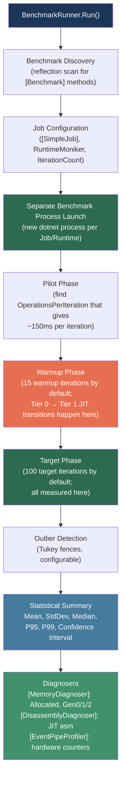
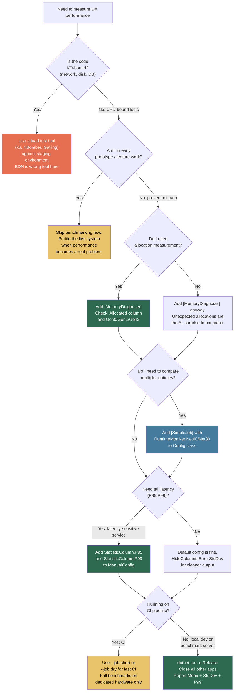

> [!success] Mastery Check
> - [ ] **Studied Well**
> - [ ] **Can explain the concept without notes**
> - [ ] **Can answer interview questions confidently**
> - [ ] **Can implement it in a real project**


## 📍 PART 0 — Navigation & Context

### Where This Topic Lives

```
C# Performance Engineering
└── Measurement & Validation
    ├── Profiling (CPU/memory profilers: dotTrace, PerfView)
    ├── ► Benchmarking with BenchmarkDotNet  ← YOU ARE HERE
    ├──   Zero-Allocation Patterns (2.41)
    ├──   JIT Internals & Tiered Compilation (2.49)
    └──   GC Interaction & WeakReference (2.40)
```

### What You Need Before This

- [[2.16 — Value Types vs Reference Types]] — struct vs class benchmarks are the most common first BDN examples; copy semantics explain why results differ
- [[2.49 — Tiered Compilation, JIT Internals, and PGO]] — understanding why warmup is mandatory requires knowing Tier 0 vs Tier 1 JIT compilation
- [[2.40 — GC Interaction, Finalizers, and WeakReference]] — interpreting the `Gen0`/`Gen1`/`Gen2` columns requires knowing what GC generations mean

### What This Unlocks After

- [[2.41 — Performance: Zero-Allocation Patterns]] — you cannot validate zero-alloc work without measuring it; BDN is the validation tool
- [[2.35 — Strings: Internals and High-Performance Operations]] — string operation benchmarks are the most common real-world BDN first contact
- [[2.51 — Unsafe Code and Interop]] — SIMD and unsafe optimizations require measurement to prove they actually help

### Why This Matters in Production

Without reproducible, statistically valid measurements you are guessing. Every performance claim—"this is faster," "this doesn't allocate"—is fiction until BenchmarkDotNet proves it with controlled methodology, statistical analysis, and allocation tracking.

---

## 🧠 PART 1 — The Core Mental Model

### The Fundamental Rule

> **BenchmarkDotNet runs your code in a separate process with full JIT warmup, statistical analysis, and GC instrumentation. The result is a measurement of the steady-state, Tier-1-JIT cost of your code—not a guess.**

### The Plain-Language Analogy

Imagine you want to measure how long it takes a race car to lap a track. If you use a stopwatch on the first ever lap, you are measuring the driver warming up, learning the corners, and the engine reaching operating temperature—not the car's actual capability. BenchmarkDotNet is the timing system at a professional race: it runs dozens of warm-up laps first, then records hundreds of timed laps, discards the outliers caused by pit-lane interference (OS scheduling, GC), and gives you a statistically defensible mean with confidence intervals. The "pit-lane interference" in software is the JIT tiered compilation pipeline, the garbage collector, and OS thread scheduling. BDN accounts for all of them.

### The BenchmarkDotNet Execution Taxonomy



---

## 🔬 PART 2 — Deep Mechanics

### 2.1 Why You Cannot Use `Stopwatch` for Micro-Benchmarks

The three killers of naive `Stopwatch` timing:

```
━━━━━━━━━━━━━━━━━━━━━━━━━━━━━━━━━━━━━━━━━━━━━━━━━━━━━━━━━━━━━━━━━━
KILLER 1: Tiered JIT (The Most Important One)
━━━━━━━━━━━━━━━━━━━━━━━━━━━━━━━━━━━━━━━━━━━━━━━━━━━━━━━━━━━━━━━━━━

First call to a method:
  ├─ Tier 0 JIT: fast unoptimized compilation (~50µs overhead)
  └─ Output: slow, instrumented native code (call counters inserted)

After ~30 calls:
  ├─ Tier 1 JIT: full optimization (inlining, loop unrolling, devirt)
  └─ Output: fast, production-quality native code

If your Stopwatch loop runs 10 iterations:
  Iterations 1–30:  Tier 0 code (2–10x SLOWER than final)
  Iterations 31+:   Tier 1 code (real speed)
  
A Stopwatch average across all iterations is WRONG.
BDN's warmup phase runs until Tier 1 is stable, THEN starts measuring.

━━━━━━━━━━━━━━━━━━━━━━━━━━━━━━━━━━━━━━━━━━━━━━━━━━━━━━━━━━━━━━━━━━
KILLER 2: Dead Code Elimination
━━━━━━━━━━━━━━━━━━━━━━━━━━━━━━━━━━━━━━━━━━━━━━━━━━━━━━━━━━━━━━━━━━

// This code looks like it measures something:
var sw = Stopwatch.StartNew();
for (int i = 0; i < 1_000_000; i++)
{
    int result = SomePureComputation(i); // result is never used!
}
sw.Stop();

// The JIT sees: result is dead. SomePureComputation has no side effects.
// Entire loop body is ELIMINATED. You are measuring an empty loop.
// Stopwatch reports ~2ns per iteration. SomePureComputation is NOT 2ns.

// BDN fix: [Benchmark] methods must return a value, or use Consumer:
[Benchmark]
public int MyBenchmark() => SomePureComputation(42); // return value forces evaluation

━━━━━━━━━━━━━━━━━━━━━━━━━━━━━━━━━━━━━━━━━━━━━━━━━━━━━━━━━━━━━━━━━━
KILLER 3: Constant Folding and Loop Hoisting
━━━━━━━━━━━━━━━━━━━━━━━━━━━━━━━━━━━━━━━━━━━━━━━━━━━━━━━━━━━━━━━━━━

// You think you're measuring 1M string concatenations:
var sw = Stopwatch.StartNew();
for (int i = 0; i < 1_000_000; i++)
{
    string s = "hello" + "world"; // JIT: this is a constant! Fold it out.
}
// JIT replaces the loop body with: string s = "helloworld"; (done once)
// Or eliminates the unused s entirely.

// BDN fix: [Params] with non-constant values, or use [GlobalSetup] data
```

**Cost labels:**

- Tier 0 → Tier 1 JIT transition: ~30–200 calls, ~50–500µs one-time cost
- BDN warmup phase: 15 iterations × OperationsPerIteration (default)
- Statistical confidence interval at 95%: requires ~100 target iterations

### 2.2 The Benchmark Lifecycle in Detail

```
TIMELINE OF A SINGLE BENCHMARK METHOD EXECUTION:
━━━━━━━━━━━━━━━━━━━━━━━━━━━━━━━━━━━━━━━━━━━━━━━━━━━━━━━━━━━━━━━━━━

[GlobalSetup]          ← Runs ONCE before all iterations
                         Heavy initialization: load files, build test data,
                         create large arrays. NOT measured.
                         Cost: ~O(1) per benchmark class

  [IterationSetup]     ← Runs ONCE before EACH iteration (warmup + target)
                         Reset state that changes per iteration.
                         Small cost, still not measured.

    [Benchmark]        ← The measured code. Runs OperationsPerIteration times
    [Benchmark]          inside a single iteration. The timer wraps the entire
    [Benchmark]          OperationsPerIteration calls, then divides.
    ...N times

  [IterationCleanup]   ← After each iteration. Not measured.

[GlobalCleanup]        ← Runs ONCE after all iterations. Not measured.

━━━━━━━━━━━━━━━━━━━━━━━━━━━━━━━━━━━━━━━━━━━━━━━━━━━━━━━━━━━━━━━━━━
HOW OperationsPerIteration IS DETERMINED (Pilot Phase):
━━━━━━━━━━━━━━━━━━━━━━━━━━━━━━━━━━━━━━━━━━━━━━━━━━━━━━━━━━━━━━━━━━

BDN starts with N=1 and doubles until one iteration takes ~150ms.
This ensures the timer (100ns resolution) is not the bottleneck.

For a 1ns operation: OperationsPerIteration ≈ 150_000_000
For a 1µs operation: OperationsPerIteration ≈ 150_000
For a 1ms operation: OperationsPerIteration ≈ 150
```

### 2.3 The [MemoryDiagnoser] — Reading Allocation Columns

```
BENCHMARKDOTNET MEMORY COLUMNS EXPLAINED:
━━━━━━━━━━━━━━━━━━━━━━━━━━━━━━━━━━━━━━━━━━━━━━━━━━━━━━━━━━━━━━━━━━

| Method          | Mean    | Gen0   | Gen1   | Gen2   | Allocated |
|-----------------|---------|--------|--------|--------|-----------|
| WithAllocation  | 45.2 ns | 0.0024 | -      | -      | 24 B      |
| ZeroAlloc       | 1.8 ns  | -      | -      | -      | 0 B       |
| LargeAlloc      | 850 µs  | 12.500 | 0.9766 | -      | 102,400 B |

COLUMN MEANINGS:

Gen0:      GC collections per 1000 operations in Gen 0 (frequent, cheap)
           0.0024 = ~2.4 Gen0 collections per 1000 ops (one per 416 ops)

Gen1:      GC collections per 1000 operations in Gen 1 (less frequent)
           Triggered when Gen0 objects survive → promoted to Gen1

Gen2:      GC collections per 1000 operations in Gen 2 (rare, expensive)
           Full GC: stop-the-world. Anything here is a production alarm.

Allocated: Total managed heap bytes allocated per single operation.
           This is TOTAL allocated, not net retained.
           "0 B" means zero heap allocation — this is the goal for hot paths.

━━━━━━━━━━━━━━━━━━━━━━━━━━━━━━━━━━━━━━━━━━━━━━━━━━━━━━━━━━━━━━━━━━
IMPORTANT: Gen columns are per 1000 operations. Allocated is per operation.
Don't confuse them.
━━━━━━━━━━━━━━━━━━━━━━━━━━━━━━━━━━━━━━━━━━━━━━━━━━━━━━━━━━━━━━━━━━
```

**Cost labels:**

- Gen0 GC collection: ~0.2–2ms, stop-the-world
- Gen1 GC collection: ~1–10ms
- Gen2 GC collection: ~10–200ms (full blocking GC)
- Monitoring memory allocation: ~5% overhead (ETW events)

### 2.4 The [DisassemblyDiagnoser] — Reading JIT Output

The disassembly diagnoser shows you the actual x86-64 instructions the JIT emitted. This is the final arbiter of whether the JIT did what you expected.

```csharp
// Add to benchmark:
[DisassemblyDiagnoser(maxDepth: 3, printInstructionAddresses: false)]

// Output for a simple addition benchmark (approximate):
// MyBenchmark.AddTwoInts():
//   L0000: lea eax, [rcx+rdx]    ; add rcx and rdx, store in eax (1 cycle)
//   L0003: ret                    ; return

// What you're looking for:
// ✅ GOOD: lea, add, mov, ret — simple arithmetic, no function calls
// ✅ GOOD: No call instructions → inlining worked
// ⚠️ BAD: callq [xxx] → virtual dispatch not devirtualized
// ⚠️ BAD: newobj → heap allocation you didn't expect
// ⚠️ BAD: call System.ThrowHelper → bounds checks not eliminated
```

**Cost labels:**

- `call` vs inlined: ~3–5 ns vs 0 ns overhead
- Virtual dispatch (`callq [rax+0x28]`): ~3–5 ns indirect call overhead
- Bounds check (`call System.ThrowHelper`): ~2–4 ns if not eliminated

### 2.5 Statistical Output — What the Numbers Mean

```
BDN STATISTICAL REPORT COLUMNS:
━━━━━━━━━━━━━━━━━━━━━━━━━━━━━━━━━━━━━━━━━━━━━━━━━━━━━━━━━━━━━━━━━━

Mean:    Arithmetic mean across all non-outlier target iterations.
         Best for stable, low-variance workloads.
         Use for: pure CPU computations, hashmap lookups.

StdDev:  Standard deviation. High StdDev → high variance → results
         not reliable. Investigate why (GC interruptions? I/O?).
         Target: StdDev < 5% of Mean for CPU benchmarks.

Median:  50th percentile. More robust to outliers than mean.
         Better than mean when StdDev > 10% of Mean.

P95/P99: 95th/99th percentile tail latency.
         CRITICAL for latency-sensitive production systems.
         P99 = "1 in 100 requests takes this long."
         Use [RankColumn, StatisticColumn.P95, StatisticColumn.P99].

Ratio:   When [Baseline = true] is set, all other methods show
         Ratio = their Mean / Baseline Mean.
         Ratio 0.5 = 2x faster. Ratio 2.0 = 2x slower.

━━━━━━━━━━━━━━━━━━━━━━━━━━━━━━━━━━━━━━━━━━━━━━━━━━━━━━━━━━━━━━━━━━
CONFIDENCE INTERVALS (CI):
━━━━━━━━━━━━━━━━━━━━━━━━━━━━━━━━━━━━━━━━━━━━━━━━━━━━━━━━━━━━━━━━━━

BDN reports 99% CI by default, e.g.:
  Mean: 45.2 ns, 99% CI: [44.1 ns, 46.3 ns]

This means: if the benchmark were repeated 100 times, 99 of those
runs would report a mean within this interval.

A wide CI (> 10% of Mean) means the measurement is noisy.
A narrow CI (< 1% of Mean) means the measurement is stable.
```

---

## 💻 PART 3 — Production Code Patterns

### 3.1 The Minimal Correct Benchmark Setup

Every BDN benchmark in production code starts from this skeleton. No deviation without a reason.

```csharp
// Order management service: measuring order deserialization approaches
// Package: BenchmarkDotNet (nuget install BenchmarkDotNet)

using BenchmarkDotNet.Attributes;
using BenchmarkDotNet.Running;

// Entry point: run from a Release build, never Debug
// dotnet run -c Release

class Program
{
    static void Main(string[] args)
        => BenchmarkRunner.Run<OrderDeserializationBenchmark>(null, args);
        // Pass args to allow BDN CLI options: --filter, --list, --runtimes
}

[MemoryDiagnoser]                    // Adds Gen0/Gen1/Gen2/Allocated columns — always include
[HideColumns("Error", "StdDev")]     // Reduce noise in output for presentation
public class OrderDeserializationBenchmark
{
    // [GlobalSetup] runs ONCE before all iterations — put expensive prep here
    // It is NOT included in the measurement
    [GlobalSetup]
    public void Setup()
    {
        // Prepare test data once: no allocation during the hot loop
        _orderJson = File.ReadAllText("testdata/order_large.json");
        _orderBytes = Encoding.UTF8.GetBytes(_orderJson);
    }

    private string  _orderJson  = null!;
    private byte[]  _orderBytes = null!;

    // The [Baseline = true] benchmark is used as the 1.0 reference point
    // All other benchmarks display Ratio column relative to this
    [Benchmark(Baseline = true)]
    public Order? NewtonsoftDeserialize()
        => Newtonsoft.Json.JsonConvert.DeserializeObject<Order>(_orderJson);

    [Benchmark]
    public Order? SystemTextJsonDeserialize()
        => System.Text.Json.JsonSerializer.Deserialize<Order>(_orderJson);

    [Benchmark]
    public Order? SystemTextJsonFromBytes()
        // Avoids the UTF8 string decode step — operates directly on bytes
        => System.Text.Json.JsonSerializer.Deserialize<Order>(_orderBytes);
}

// Expected output (approximate, .NET 8, x64, mid-range workstation):
// | Method                    | Mean      | Ratio | Gen0   | Allocated |
// |---------------------------|-----------|-------|--------|-----------|
// | NewtonsoftDeserialize      | 5,820 ns  | 1.00  | 0.5112 | 4,288 B   |
// | SystemTextJsonDeserialize  | 2,104 ns  | 0.36  | 0.1297 | 1,088 B   |
// | SystemTextJsonFromBytes    | 1,891 ns  | 0.32  | 0.1068 | 896 B     |
```

### 3.2 The [Params] Pattern — Avoiding Constant Folding

The JIT can optimize away any computation on constants it knows at compile time. `[Params]` injects values at runtime, preventing constant folding and loop hoisting.

```csharp
// Payment processing: hashing strategy comparison across payload sizes

[MemoryDiagnoser]
public class HashingStrategyBenchmark
{
    // [Params] creates one benchmark row per value
    // The JIT sees these as non-constant → cannot fold computations away
    [Params(64, 512, 4096, 65536)]
    public int PayloadSizeBytes { get; set; }

    private byte[] _payload = null!;

    [GlobalSetup]
    public void Setup()
    {
        // Regenerated when PayloadSizeBytes changes (before each Params group)
        _payload = new byte[PayloadSizeBytes];
        new Random(42).NextBytes(_payload);
    }

    [Benchmark(Baseline = true)]
    public byte[] Sha256Hash()
    {
        using var sha = System.Security.Cryptography.SHA256.Create();
        return sha.ComputeHash(_payload);
        // ⚠️ Creates SHA256 instance on every call — allocates every iteration
    }

    [Benchmark]
    public byte[] Sha256HashReused()
    {
        // ✅ SHA256 instance pre-created in GlobalSetup (not shown for brevity)
        // In real code: _sha256 = SHA256.Create() in GlobalSetup
        return _sha256Pool.ComputeHash(_payload);
    }

    [Benchmark]
    public bool TryComputeSha256IntoSpan()
    {
        // ✅ Zero-allocation: write hash directly into a stack-allocated span
        Span<byte> dest = stackalloc byte[32];
        return System.Security.Cryptography.SHA256.TryHashData(_payload, dest, out _);
    }

    private System.Security.Cryptography.SHA256 _sha256Pool = null!;

    // Expected output (approximate, .NET 8, x64, PayloadSizeBytes=4096):
    // | Method                | Mean      | Gen0   | Allocated |
    // |-----------------------|-----------|--------|-----------|
    // | Sha256Hash            | 14,200 ns | 0.0305 | 328 B     |
    // | Sha256HashReused      | 13,100 ns | 0.0153 | 64 B      |  ← saves SHA256 alloc
    // | TryComputeSha256Span  | 12,800 ns | -      | 0 B       |  ← zero alloc
}
```

### 3.3 The Multi-Runtime Comparison Pattern

Compare the same code across .NET versions or runtimes in a single benchmark run. Use this when evaluating a framework upgrade.

```csharp
// User service: evaluating whether to upgrade from .NET 6 to .NET 8

using BenchmarkDotNet.Configs;
using BenchmarkDotNet.Jobs;
using BenchmarkDotNet.Toolchains.CsProj;

// Configure which runtimes to run
[Config(typeof(MultiRuntimeConfig))]
[MemoryDiagnoser]
public class UserLookupBenchmark
{
    private class MultiRuntimeConfig : ManualConfig
    {
        public MultiRuntimeConfig()
        {
            AddJob(Job.Default
                .WithToolchain(CsProjCoreToolchain.NetCoreApp60)
                .WithId(".NET 6"));

            AddJob(Job.Default
                .WithToolchain(CsProjCoreToolchain.NetCoreApp80)
                .WithId(".NET 8"));
        }
    }

    private Dictionary<string, User> _userStore = null!;

    [GlobalSetup]
    public void Setup()
    {
        _userStore = Enumerable.Range(0, 10_000)
            .ToDictionary(i => $"user_{i}", i => new User(i, $"Name_{i}"));
    }

    [Benchmark]
    public User? DictionaryLookup() => _userStore.TryGetValue("user_5000", out var u) ? u : null;

    [Benchmark]
    public int LinqSearch() => _userStore.Values.FirstOrDefault(u => u.Id == 5000)?.Id ?? -1;

    private sealed record User(int Id, string Name);
}
// Expected output shows both runtimes side-by-side for each method:
// | Method        | Runtime  | Mean      | Allocated |
// |---------------|----------|-----------|-----------|
// | DictionaryLookup | .NET 6 | 48 ns    | 0 B       |
// | DictionaryLookup | .NET 8 | 42 ns    | 0 B       |
// | LinqSearch       | .NET 6 | 312 ns   | 72 B      |
// | LinqSearch       | .NET 8 | 287 ns   | 72 B      |
```

### 3.4 The Tail Latency Pattern — P95/P99 Reporting

For APIs and services, mean latency is misleading. A 5ms mean with a 200ms P99 produces user-visible latency spikes. Always add P95/P99 columns for latency-sensitive work.

```csharp
// Inventory service: cache lookup with occasional miss + DB fallback

using BenchmarkDotNet.Columns;
using BenchmarkDotNet.Configs;
using BenchmarkDotNet.Exporters;

[Config(typeof(TailLatencyConfig))]
[MemoryDiagnoser]
public class InventoryCacheBenchmark
{
    private class TailLatencyConfig : ManualConfig
    {
        public TailLatencyConfig()
        {
            // These columns reveal GC pause impact on P99
            AddColumn(StatisticColumn.P95);
            AddColumn(StatisticColumn.P99);
            AddColumn(RankColumn.ASC);
            AddExporter(RPlotExporter.Default); // Generates distribution plots
        }
    }

    [Params(0, 5, 20)] // Cache miss rate: 0%, 5%, 20%
    public int MissRatePercent { get; set; }

    private MemoryCache<string, InventoryItem> _cache = null!;
    private string[] _keys = null!;
    private Random _rng = null!;

    [GlobalSetup]
    public void Setup()
    {
        _cache = new MemoryCache<string, InventoryItem>(capacity: 1000);
        _keys = Enumerable.Range(0, 1000)
            .Select(i => $"product-{i:D4}")
            .ToArray();
        // Pre-populate cache
        foreach (var key in _keys)
            _cache.Set(key, new InventoryItem(key, Random.Shared.Next(0, 100)));
        _rng = new Random(42);
    }

    [Benchmark]
    public InventoryItem? LookupItem()
    {
        // Simulate cache misses at the configured rate
        bool forceMiss = _rng.Next(100) < MissRatePercent;
        string key = forceMiss
            ? $"missing-{_rng.Next()}"   // guaranteed miss → simulates DB roundtrip
            : _keys[_rng.Next(_keys.Length)]; // likely hit

        return _cache.TryGetValue(key, out var item)
            ? item
            : SimulateDbFetch(key); // ~50µs simulated DB latency
    }

    private static InventoryItem SimulateDbFetch(string key)
    {
        // Simulate database access latency (in real code: actual DB call)
        Thread.SpinWait(10_000); // ~30–50µs on modern hardware
        return new InventoryItem(key, 0);
    }

    private sealed record InventoryItem(string Sku, int Quantity);
}
// P99 reveals the DB fetch impact that Mean hides entirely.
```

### 3.5 The Consumer Pattern — Preventing Dead Code Elimination

When a benchmark produces multiple values or the JIT might eliminate work, use `Consumer` to force evaluation without actual I/O.

```csharp
// Order processing: comparing collection transformation strategies

using BenchmarkDotNet.Engines;

[MemoryDiagnoser]
public class OrderTransformBenchmark
{
    // Consumer forces BDN to consume return values so JIT cannot eliminate them
    private readonly Consumer _consumer = new();

    private List<Order> _orders = null!;

    [GlobalSetup]
    public void Setup()
    {
        _orders = Enumerable.Range(0, 10_000)
            .Select(i => new Order(i, $"Customer_{i}", (decimal)(i * 1.5)))
            .ToList();
    }

    [Benchmark(Baseline = true)]
    public void LINQSelect()
        // ⚠️ Without .Consume(), the JIT might eliminate the entire call chain
        => _orders.Select(o => new OrderDto(o.Id, o.Total * 1.1m)).Consume(_consumer);

    [Benchmark]
    public void ForLoop()
    {
        var results = new List<OrderDto>(_orders.Count);
        // Pre-size list → avoids all intermediate reallocations
        for (int i = 0; i < _orders.Count; i++)
        {
            var o = _orders[i];
            results.Add(new OrderDto(o.Id, o.Total * 1.1m));
        }
        results.Consume(_consumer);
    }

    [Benchmark]
    public void SpanIteration()
    {
        // CollectionsMarshal.AsSpan: zero-copy access to List<T> backing array
        var span = System.Runtime.InteropServices.CollectionsMarshal.AsSpan(_orders);
        var results = new List<OrderDto>(span.Length);
        foreach (ref readonly var o in span)
            results.Add(new OrderDto(o.Id, o.Total * 1.1m));
        results.Consume(_consumer);
    }

    private sealed record Order(int Id, string Customer, decimal Total);
    private sealed record OrderDto(int Id, decimal AdjustedTotal);

    // Expected output (approximate, .NET 8, x64):
    // | Method        | Mean      | Ratio | Gen0   | Allocated |
    // |---------------|-----------|-------|--------|-----------|
    // | LINQSelect    | 820 µs    | 1.00  | 6.8359 | 573,200 B |
    // | ForLoop       | 310 µs    | 0.38  | 1.9531 | 160,024 B |
    // | SpanIteration | 285 µs    | 0.35  | 1.9531 | 160,024 B |
}
```

### 3.6 The BenchmarkSwitcher — Multi-Class Runner

In a performance test project with multiple benchmark classes, `BenchmarkSwitcher` allows filtering at the CLI without changing code.

```csharp
// Program.cs — top-level benchmark runner for the entire performance project

using BenchmarkDotNet.Running;
using System.Reflection;

// BenchmarkSwitcher.FromAssembly discovers all [MemoryDiagnoser]/[Benchmark] classes
// CLI: dotnet run -c Release -- --filter *Hashing*   (run only hashing benchmarks)
// CLI: dotnet run -c Release -- --list flat          (list all discovered benchmarks)
// CLI: dotnet run -c Release -- --job dry            (dry run: 1 iter, fast feedback)
// CLI: dotnet run -c Release -- --filter *           (run everything)

class Program
{
    static void Main(string[] args)
        => BenchmarkSwitcher
            .FromAssembly(Assembly.GetExecutingAssembly())
            .Run(args);
}

// Recommended project structure:
// PerformanceTests/
//   Program.cs                        ← entry point above
//   Serialization/
//     OrderDeserializationBenchmark.cs
//     UserSerializationBenchmark.cs
//   Collections/
//     DictionaryVsHashSetBenchmark.cs
//   Strings/
//     StringBuilderVsInterpolateBenchmark.cs
```

---

## ⚠️ PART 4 — Gotchas & Anti-Patterns

### Gotcha 1: Running in Debug Mode

Engineers new to BDN often forget to specify Release mode and get results that are 5–20× slower than production, leading to false optimization conclusions.

```csharp
// ⚠️ WRONG: running in Debug mode or via IDE "Run" button
// dotnet run (no -c Release flag)
// Or: pressing F5 in Visual Studio with Debug configuration

// Debug mode effects:
// 1. No JIT optimizations (all methods unoptimized)
// 2. No inlining
// 3. No dead code elimination
// 4. Stack frame tracking overhead
// 5. Edit-and-continue instrumentation
// Results are 3–20x slower and do not reflect production behavior.

// ✅ CORRECT: Always run in Release mode
// dotnet run -c Release
// Or in Visual Studio: set to Release configuration, then run without debugger

// BDN will WARN you if it detects a Debug build — never ignore this warning:
// "// * WARNING: You are running in DEBUG configuration..."
```

### Gotcha 2: Benchmarking I/O-Bound Code Without Realistic I/O

Network or disk I/O benchmarks on localhost return results that never match production. The latency distribution is entirely wrong.

```csharp
// ⚠️ WRONG: benchmarking HTTP calls against localhost (no network latency)
[Benchmark]
public async Task<string> FetchOrderStatusLocal()
    => await _httpClient.GetStringAsync("http://localhost:5000/api/orders/123");
// Results: 0.8ms. Production with real network: 12ms. Benchmark is useless.

// ✅ CORRECT: Use BDN for CPU-bound logic only.
// For I/O-bound code: use load tests (k6, NBomber, Gatling) against
// a staging environment with realistic network topology.

// ✅ CORRECT: If you must benchmark I/O-adjacent code, benchmark the
// CPU portion only: the parsing, serialization, or transformation layer.
[Benchmark]
public Order? ParseOrderResponse()
    => JsonSerializer.Deserialize<Order>(_preloadedResponseJson);
// Now you're measuring the actual CPU work, not the network.
```

### Gotcha 3: Using [IterationSetup] for Large Data Preparation

`[IterationSetup]` runs before every single iteration (including 100 warmup + 100 target = 200 calls). Large allocations in `[IterationSetup]` dominate the result and you're benchmarking setup, not the method under test.

```csharp
// ⚠️ WRONG: building large test data in IterationSetup
[IterationSetup]
public void IterSetup()
{
    // This runs ~200 times. Building 100k items each time = 200 * 100k allocations
    // Your benchmark now measures List construction, not your method.
    _items = Enumerable.Range(0, 100_000)
                       .Select(i => new Product(i, $"Product {i}"))
                       .ToList();
}

[Benchmark]
public int SumPrices() => _items.Sum(p => p.Price);

// ✅ CORRECT: use [GlobalSetup] for expensive, one-time data creation
[GlobalSetup]
public void GlobalSetup()
{
    _items = Enumerable.Range(0, 100_000)
                       .Select(i => new Product(i, $"Product {i}"))
                       .ToList();
}
// [IterationSetup] is for: resetting a counter, clearing a cache,
// returning a pooled buffer. Never for building large collections.
```

### Gotcha 4: Confusing Throughput vs Latency

BDN reports nanoseconds per operation by default. This is correct for latency. But for throughput benchmarks (how many ops/sec), using a loop inside the benchmark method and forgetting to set `[Benchmark(OperationsPerInvoke = N)]` means BDN reports the total loop time, not the per-operation time.

```csharp
// ⚠️ WRONG: loop inside benchmark without OperationsPerInvoke
[Benchmark]
public void ProcessBatch()
{
    for (int i = 0; i < 1000; i++)
        ProcessSingleOrder(_orders[i]);
}
// BDN reports: Mean = 45,000 ns (the total loop time)
// You think: "Processing an order takes 45,000 ns."
// WRONG: it takes 45 ns. You measured 1000 operations as 1.

// ✅ CORRECT option A: OperationsPerInvoke tells BDN to divide by N
[Benchmark(OperationsPerInvoke = 1000)]
public void ProcessBatch()
{
    for (int i = 0; i < 1000; i++)
        ProcessSingleOrder(_orders[i]);
}
// Now BDN reports: Mean = 45 ns (correctly per-operation)

// ✅ CORRECT option B: measure one operation (simplest and most common)
[Benchmark]
public void ProcessSingleOrder() => ProcessSingleOrder(_orders[0]);
```

### Gotcha 5: Benchmark Results Are Invalidated by Hot Machine State

A benchmark run on a laptop under thermal throttling, a developer machine running Slack/Chrome/Docker, or a VM on a shared host will produce results with 10–50% noise — enough to flip a conclusion.

```csharp
// ⚠️ WRONG: Running benchmarks on:
// • A laptop plugged in / on battery (CPU frequency varies)
// • A machine running IDE, browser, Docker, and other workloads
// • A shared CI runner (virtual machine with noisy neighbors)
// • Just after starting the machine (Windows Update background processes)
// Results: StdDev may be 20–40% of Mean. The measurement is unreliable.

// ✅ CORRECT: Production-quality benchmark environment:
// 1. Dedicated bare-metal machine (not a VM) where possible
// 2. Run: "sudo cpupower frequency-set -g performance" (Linux) or
//    "powercfg /setactive 8c5e7fda-e8bf-4a96-9a85-a6e23a8c635c" (Windows High Performance)
// 3. Close all non-essential applications
// 4. Run at least 3 times; results should agree within ~3%
// 5. Report StdDev with results — don't publish a Mean without it

// BDN built-in help: [SimpleJob(launchCount: 3)] runs 3 separate process launches
// and aggregates — this averages out OS interference better than launchCount: 1
[SimpleJob(launchCount: 3, warmupCount: 10, iterationCount: 50)]
public class RobustBenchmarkClass { ... }
```

---

## 📊 PART 5 — Performance Implications

### 5.1 BDN Benchmark Overhead and Resolution

|Scenario|Allocation Behavior|Approx Cost/Notes|
|---|---|---|
|Running BDN itself|BDN framework: ~100 KB per benchmark class|One-time setup cost|
|Single `[Benchmark]` iteration timing|No allocation; hardware timer read|~20 ns timer overhead|
|`[MemoryDiagnoser]` active|ETW events for GC monitoring|~3–7% overhead per op|
|`[DisassemblyDiagnoser]` active|Spawns objdump/llvm-objdump|~5s extra per benchmark|
|`[EventPipeProfiler]` active|.nettrace file written to disk|10–40 MB per run|
|`[Params(1,2,4,8)]`|Multiplies benchmark count by Params count|4× longer total run|
|`launchCount: 3`|3 separate OS processes per benchmark|3× longer, more reliable|
|`--job dry` CLI flag|1 warmup + 1 target iteration|~5 seconds; fast feedback only|
|Full benchmark run (1 method)|Default: 15 warmup + 100 target|~45 seconds per method|
|Full benchmark run (20 methods)|With default settings|~15–20 minutes total|
|Running on CI per PR|All benchmarks, default settings|❌ Too slow; use `--job short`|

### 5.2 BenchmarkDotNet Complete Reference Benchmark

```csharp
// Full-featured benchmark demonstrating every major BDN capability in one class.
// Domain: user authentication token validation
// Shows: baseline, params, multi-variant, memory, tail latency

using BenchmarkDotNet.Attributes;
using BenchmarkDotNet.Columns;
using BenchmarkDotNet.Configs;
using BenchmarkDotNet.Jobs;
using BenchmarkDotNet.Running;
using System.IdentityModel.Tokens.Jwt;
using System.Security.Cryptography;
using System.Text;

[Config(typeof(AuthBenchConfig))]
[MemoryDiagnoser]
public class TokenValidationBenchmark
{
    private class AuthBenchConfig : ManualConfig
    {
        public AuthBenchConfig()
        {
            AddColumn(StatisticColumn.P95);
            AddColumn(StatisticColumn.P99);
            AddJob(Job.Default.WithId("Default"));
        }
    }

    // [Params] creates separate rows for each token size / claim count
    [Params(5, 20, 50)]
    public int ClaimCount { get; set; }

    private string  _validToken   = null!;
    private byte[]  _secretKey    = null!;
    private string  _secretBase64 = null!;

    [GlobalSetup]
    public void Setup()
    {
        _secretKey    = RandomNumberGenerator.GetBytes(32);
        _secretBase64 = Convert.ToBase64String(_secretKey);
        _validToken   = GenerateToken(ClaimCount, _secretKey);
    }

    // ── Baseline: the current production approach ──────────────────────────
    [Benchmark(Baseline = true)]
    public bool ValidateWithJwtHandler()
    {
        var handler   = new JwtSecurityTokenHandler();  // ⚠️ allocated per call
        var key       = new Microsoft.IdentityModel.Tokens.SymmetricSecurityKey(_secretKey);
        var tokenValidationParameters = new Microsoft.IdentityModel.Tokens.TokenValidationParameters
        {
            ValidateIssuerSigningKey = true,
            IssuerSigningKey = key,
            ValidateIssuer   = false,
            ValidateAudience = false,
        };
        handler.ValidateToken(_validToken, tokenValidationParameters, out _);
        return true;
    }

    // ── Optimized: reuse handler and parameters ────────────────────────────
    private JwtSecurityTokenHandler _reusedHandler = null!;
    private Microsoft.IdentityModel.Tokens.TokenValidationParameters _reusedParams = null!;

    [GlobalSetup(Target = nameof(ValidateWithReusedHandler))]
    public void SetupReused()
    {
        Setup(); // run base setup first
        _reusedHandler = new JwtSecurityTokenHandler();
        _reusedParams = new Microsoft.IdentityModel.Tokens.TokenValidationParameters
        {
            ValidateIssuerSigningKey = true,
            IssuerSigningKey = new Microsoft.IdentityModel.Tokens.SymmetricSecurityKey(_secretKey),
            ValidateIssuer   = false,
            ValidateAudience = false,
        };
    }

    [Benchmark]
    public bool ValidateWithReusedHandler()
    {
        _reusedHandler.ValidateToken(_validToken, _reusedParams, out _);
        return true;
    }

    // ── Span-based HMAC verification (manual, no JWT library overhead) ─────
    [Benchmark]
    public bool ValidateHmacManually()
    {
        // Split token: header.payload.signature
        ReadOnlySpan<char> tokenSpan = _validToken;
        int firstDot  = tokenSpan.IndexOf('.');
        int secondDot = tokenSpan[(firstDot + 1)..].IndexOf('.') + firstDot + 1;

        ReadOnlySpan<char> headerPayload  = tokenSpan[..secondDot];
        ReadOnlySpan<char> signatureB64   = tokenSpan[(secondDot + 1)..];

        // Verify HMAC-SHA256 signature without any string allocations
        Span<byte> inputBytes  = stackalloc byte[Encoding.UTF8.GetByteCount(headerPayload)];
        Encoding.UTF8.GetBytes(headerPayload, inputBytes);

        Span<byte> computedSig = stackalloc byte[32];
        HMACSHA256.TryHashData(_secretKey, inputBytes, computedSig, out _);

        Span<byte> tokenSig = stackalloc byte[32];
        Convert.TryFromBase64Chars(signatureB64, tokenSig, out _);

        return CryptographicOperations.FixedTimeEquals(computedSig, tokenSig);
    }

    private static string GenerateToken(int claimCount, byte[] key)
    {
        // Simplified token generation for test setup (not shown: real JWT library call)
        var payload = string.Concat(Enumerable.Range(0, claimCount)
            .Select(i => $"\"claim{i}\":\"value{i}\","));
        var header  = Convert.ToBase64String(Encoding.UTF8.GetBytes("{\"alg\":\"HS256\"}"));
        var body    = Convert.ToBase64String(Encoding.UTF8.GetBytes($"{{{payload.TrimEnd(',')}}}"));
        var sig     = Convert.ToBase64String(
            HMACSHA256.HashData(key, Encoding.UTF8.GetBytes($"{header}.{body}")));
        return $"{header}.{body}.{sig}";
    }
}

// Expected output (approximate, .NET 8, x64, ClaimCount=20):
// | Method                    | Claims | Mean      | P95       | Ratio | Gen0   | Alloc  |
// |---------------------------|--------|-----------|-----------|-------|--------|--------|
// | ValidateWithJwtHandler    | 20     | 18,400 ns | 22,100 ns | 1.00  | 0.5493 | 4,616B |
// | ValidateWithReusedHandler | 20     | 11,200 ns | 13,800 ns | 0.61  | 0.2441 | 2,048B |
// | ValidateHmacManually      | 20     | 1,840 ns  | 2,100 ns  | 0.10  | -      | 0 B    |
```

### 5.3 When to Care / When to Ignore

**When performance measurement with BDN costs you:**

- **Hot API path regression detection**: A 10% regression on a token validation or order deserialization method called 10M times/day is 15+ minutes of extra latency per day. BDN catches this in CI before deployment.
- **Allocation-driven GC pauses in latency-sensitive services**: Payment processing, trading systems, real-time inventory. `Gen0` collection every 400 ops can cause 2–5ms spikes that violate SLAs.
- **Pre/post optimization validation**: Before claiming "we improved hashing speed by 40%", prove it with a BDN comparison. Without this, performance claims are anecdotes.
- **Evaluating library upgrades**: Newtonsoft.Json vs System.Text.Json, Dapper vs EF Core — don't decide on blog posts; measure with your own payloads.

**When benchmarking doesn't matter:**

- **One-time startup code**: An application startup routine that runs once and takes 200ms does not benefit from nanosecond optimization. Profile it if startup is a problem, but BDN is the wrong tool.
- **Operations dominated by external I/O**: If 95% of request time is a database query, optimizing the 0.5% C# serialization overhead is premature. Fix the query first.
- **CRUD endpoints with no hot-path characteristics**: An admin endpoint called 10 times per day that takes 50ms — even if you make it 25ms, you saved 500ms per day total. Not worth the complexity.
- **Early-stage product development**: Premature optimization before the business logic is stable leads to optimizing code you delete two sprints later.

---

## 🎤 PART 6 — Interview Arsenal

### A. The Question Bank

---

**Q: "How do you measure the performance of a C# method? Walk me through your approach."**

**Average Answer:** "I use `Stopwatch` and call the method in a loop and average the results."

**Why That's Insufficient:** Stopwatch on a loop measures Tier 0 JIT compilation, dead code elimination artifacts, and GC pauses — not the actual method cost. The results are unreliable.

**Great Answer:**

> "My first tool is BenchmarkDotNet, not Stopwatch. The reason is that Stopwatch-in-a-loop has three failure modes that invalidate the result: first, the JIT starts in Tier 0 mode — fast, unoptimized compilation — and only promotes to Tier 1 after about 30 calls; averaging those early calls in with the steady-state numbers produces a pessimistic mean. Second, if the return value isn't consumed, the JIT may eliminate the entire call as dead code. Third, I'd need to manually account for statistical variance, GC interference, and outliers. BDN solves all of this: it runs warmup iterations until Tier 1 is stable, uses a `Consumer` to prevent dead code elimination, runs 100 target iterations, and applies Tukey outlier detection before computing mean and confidence intervals. I always add `[MemoryDiagnoser]` to see the `Allocated` column — unexpected allocations in a hot path are usually the actual problem."

---

**Q: "What is dead code elimination in the context of benchmarking, and how do you prevent it?"**

**Average Answer:** "It's when the compiler removes code that isn't used. You can return the result."

**Why That's Insufficient:** Doesn't explain when it happens (JIT, not C# compiler), or mention the `Consumer` pattern for void methods.

**Great Answer:**

> "Dead code elimination in benchmarks is a JIT optimization, not a C# compiler optimization — the C# compiler generates the IL faithfully. The JIT, during Tier 1 recompilation, performs escape analysis and sees that the result of a pure computation is never observed. It then eliminates the computation entirely. I've seen this produce a benchmark reporting 0.3 ns for a function that should take 40 ns — the JIT eliminated everything. The two prevention strategies are: first, return a value from the `[Benchmark]` method — BDN itself consumes the return value, which counts as an observation. Second, for methods that produce multiple results or are void, use BDN's `Consumer` class in a field and call `result.Consume(_consumer)` — BDN's Consumer is specifically designed to be opaque to the JIT so it cannot be optimized away."

---

**Q: "What does the `Allocated` column in BenchmarkDotNet tell you, and why is `0 B` the goal for hot paths?"**

**Average Answer:** "It shows how much memory the benchmark allocates."

**Why That's Insufficient:** Doesn't explain the GC cost chain, generational heap mechanics, or when zero-allocation actually matters.

**Great Answer:**

> "The `Allocated` column shows the total managed heap bytes allocated per single operation. `0 B` means no heap allocations occurred — every operation used only stack memory or pre-existing heap objects. The reason this matters for hot paths is the downstream effect on GC. Every heap allocation eventually needs to be collected. If a method allocates 32 bytes and gets called 100,000 times per second, that's 3.2 MB per second into Gen 0. Gen 0 collections happen roughly every 4 MB — so you're triggering a stop-the-world GC every 1.25 seconds just from this one method. In a latency-sensitive service like payment processing, that Gen 0 collection causes a 0.5–2 ms pause that shows up as a tail latency spike in P99. The `Allocated: 0 B` result in BDN is the measurement that proves you've eliminated that pressure. Without BDN, you'd never know."

---

**Q: "Explain the difference between Mean and P99 in benchmark results. When would you report P99 instead of Mean?"**

**Average Answer:** "P99 is the 99th percentile — most requests are faster, a few are slower."

**Why That's Insufficient:** Doesn't explain what drives the P99 vs Mean divergence in production contexts (GC pauses, lock contention), or connect to user experience.

**Great Answer:**

> "Mean is the average cost across all iterations once you've discarded statistical outliers. P99 is the value below which 99% of iterations fall — equivalently, 1 in 100 requests takes P99 or longer. The divergence between Mean and P99 is what matters. A method might have Mean = 2 ms but P99 = 85 ms because 1% of calls trigger a Gen 2 GC collection that pauses the entire process. That 2 ms mean looks great in a dashboard until a user complains about a random 85 ms response. I report P99 instead of Mean for anything in a request-response path that has an SLA — API endpoints, message queue consumers, auth middleware. I add `StatisticColumn.P95` and `StatisticColumn.P99` to my BDN config explicitly. If P99 is more than 10× Mean, there's something non-deterministic in the hot path — usually GC, lock contention, or I/O."

---

### B. The Trick Questions

> [!WARNING] These Sound Simple — They Aren't

**Trick Q: "I ran the benchmark and it says 0.3 ns per operation. That's faster than a single CPU instruction (~0.3 ns at 3 GHz). Is the benchmark correct?"**

The trap: You're proud of the result. You don't question it.

The correct answer: No, it almost certainly isn't correct. 0.3 ns is below the resolution of the hardware timer and below the cost of a function call boundary. This is dead code elimination: the JIT determined the benchmark's computation has no observable effect and removed it. The fix is to return the computed value from the `[Benchmark]` method, or use `Consumer`. A valid benchmark for a CPU-bound operation cannot be faster than the individual instructions it contains.

---

**Trick Q: "My benchmark shows Method A is 20% faster than Method B on my laptop. Should I ship Method A?"**

The trap: 20% sounds like a lot. The answer seems obvious.

The correct answer: Not without more information. 20% in a micro-benchmark translates to a different percentage in a real workload where the method is one component among many. More importantly, a 20% result on a laptop (where CPU frequency varies, thermal throttling applies, OS interference is high) may not reproduce on production hardware. The result should be validated on production-equivalent hardware, the StdDev should be less than 5% of Mean (otherwise the 20% is within noise), and the improvement should be profiled in context to verify the method is actually on the critical path.

---

**Trick Q: "My benchmark is measuring a dictionary lookup. I added `[IterationSetup]` to reset the dictionary before each iteration so I don't measure stale cache effects. Is that correct?"**

The trap: The reasoning sounds sensible.

The correct answer: Only if dictionary construction is fast. `[IterationSetup]` runs before each warmup and target iteration — approximately 215 times. If the dictionary has 100,000 entries, you're rebuilding a 100K-entry dictionary 215 times. BDN's timer starts after `[IterationSetup]` completes, so you won't measure the setup itself, but the GC pressure from 215 dictionary constructions will affect the measured iterations via Gen0/Gen1 collections interrupting your target phase. Use `[GlobalSetup]` for large data and `[IterationSetup]` only for resetting primitive counters or returning small pooled objects.

---

**Trick Q: "Should I add benchmarks for all methods to my CI pipeline so I can catch regressions automatically?"**

The trap: Sounds like good engineering practice.

The correct answer: Running full BDN benchmarks in CI is problematic. A default BDN run takes ~45 seconds per benchmark method — a project with 50 benchmark methods takes ~37 minutes. CI runners are also virtual machines with unpredictable CPU contention; results can vary by 10–30% between runs. The correct approach: run with `--job short` (1–2 seconds per method) for a fast smoke-test in CI, and run full benchmarks on dedicated hardware for release gates. Tools like `BenchmarkDotNet.Artifacts` + `BenchmarkDotNet.Baseline` can automatically flag regressions above a threshold (e.g., > 10% slower).

---

### C. Red Flags to Avoid

- **"I use Stopwatch for benchmarking"** — Flags you as unaware of tiered JIT, dead code elimination, and statistical variance. Every senior .NET engineer uses BDN.
- **"Value types are always faster because they're on the stack"** — Large struct copies are slower than class pointer copies; this statement is missing the cost model entirely.
- **"A 10% improvement in my benchmark means 10% improvement in production"** — Benchmarks measure an isolated method in steady state; production involves cache misses, lock contention, GC, and work distribution. Benchmark improvements don't transfer linearly.
- **"I'll benchmark it in Debug mode first to make sure it's correct, then switch to Release"** — Debug and Release have fundamentally different JIT behavior. Debug benchmarks have no informational value about Release performance.
- **"The `Allocated: 0 B` result means my code has no memory cost"** — Zero managed heap allocation doesn't mean zero memory use; stack allocation, ArrayPool rentals, and previously pooled objects all have costs that won't appear in the `Allocated` column.
- **"I got the same result three times so I'm confident it's right"** — Three runs on the same loaded developer machine don't establish statistical confidence. Report StdDev. Run on dedicated hardware.
- **"P99 doesn't matter for internal services"** — Internal service latency directly affects end-user P99 in a microservices call chain (each hop's P99 compounds multiplicatively).

---

## 🔀 PART 7 — Decision Framework



---

## ✅ PART 8 — Self-Check

### A. Conceptual Questions

1. A colleague runs a benchmark that reports 0.2 ns per call. Your intuition says the real cost should be closer to 15 ns. What three things would you check first to diagnose what went wrong with the benchmark?
    
2. Explain why `[IterationSetup]` is different from `[GlobalSetup]` and give a concrete example of when each is the right choice. What happens to your results if you use `[IterationSetup]` for a task that takes 10ms?
    
3. BDN reports `Gen0: 0.0024` for your benchmark. What does this number mean exactly? At what rate does this translate to Gen0 collections in a production service receiving 50,000 requests/second?
    
4. You benchmark a method and get `Mean: 45 ns, StdDev: 22 ns, P99: 420 ns`. The StdDev is nearly 50% of the Mean. What does this tell you about the method's performance characteristics, and what should you investigate?
    
5. What is tiered compilation and why does it make warmup phases mandatory in benchmarks? What would happen to your Mean result if BDN skipped warmup entirely?
    
6. Your benchmark for a JSON serializer shows `Allocated: 0 B`. A colleague says "great, no GC pressure." You say they're only half right. What's the other half?
    
7. Explain why running a benchmark in Debug mode is worse than useless — not just "not as accurate," but actively misleading. What specific JIT optimizations are disabled?
    
8. You have a benchmark that must measure a method that returns `void` and mutates state through a parameter. You can't return a value. How do you prevent dead code elimination?
    
9. A method has `Mean: 5 ns` on your laptop and `Mean: 8 ns` on the CI server (a VM). Which result should you trust for production performance decisions, and how do you resolve the discrepancy?
    
10. Your benchmark class has 4 `[Params]` values and 3 `[Benchmark]` methods. How many individual benchmark rows will BDN produce? How long will this take at ~45 seconds per row?
    

### B. Code Puzzles

**Puzzle 1 — Dead Code Elimination:** What does BDN actually measure in this benchmark, and what result would you expect to see?

```csharp
[Benchmark]
public void ParseOrderId()
{
    int orderId = int.Parse("12345678");
    // orderId is never returned or used
}
```

<details> <summary>Answer</summary>

BDN measures nothing meaningful. `orderId` is a local variable that is never returned, never passed to another method, and has no observable side effects. The JIT performs dead code elimination and removes `int.Parse("12345678")` entirely. The result will be approximately 0.3–0.5 ns — the cost of an empty method call boundary. The fix: `return int.Parse("12345678");` — make it return the value so BDN can consume it.

</details>

---

**Puzzle 2 — The Params Constant Folding Trap:** Will the JIT fold this away? What should the benchmark look like instead?

```csharp
[Benchmark]
public int CalculateOrderDiscount()
{
    decimal price    = 100.00m;
    decimal discount = 0.15m;
    return (int)(price * discount);
    // Returns 15 every time — constant computation
}
```

<details> <summary>Answer</summary>

Yes, the JIT can constant-fold this. Both `price` and `discount` are compile-time constants (`100.00m` and `0.15m`). The Tier 1 JIT will evaluate `(int)(100.00m * 0.15m)` = `15` at JIT time and replace the method body with `return 15;` — measuring nothing. Fix: use `[Params]` or `[GlobalSetup]`-loaded data so the values are not constants the JIT can see at JIT time:

```csharp
[Params(99.99, 149.50, 299.00)]
public double OrderTotal { get; set; }

[Benchmark]
public int CalculateOrderDiscount()
    => (int)(OrderTotal * 0.15);
```

Now `OrderTotal` is a property loaded from a field at runtime — the JIT cannot fold it.

</details>

---

**Puzzle 3 — The IterationSetup Cost Bug:** What is this benchmark actually measuring? What's the fix?

```csharp
private List<Customer> _customers = null!;

[IterationSetup]
public void Setup()
{
    _customers = Enumerable.Range(0, 50_000)
        .Select(i => new Customer(i, $"Name {i}", i * 10.5m))
        .ToList();
}

[Benchmark]
public Customer? FindHighValueCustomer()
    => _customers.FirstOrDefault(c => c.LifetimeValue > 400_000m);
```

<details> <summary>Answer</summary>

The benchmark is primarily measuring list construction, not `FirstOrDefault`. `[IterationSetup]` runs before every warmup and target iteration (~215 times with default settings). Building a 50,000-element `List<Customer>` takes ~3–5 ms each time. The GC pressure from these 215 constructions causes Gen0 and Gen1 collections during the target phase, inflating the measured mean and making results noisy.

Fix: Move the list construction to `[GlobalSetup]`:

```csharp
[GlobalSetup]
public void Setup()
{
    _customers = Enumerable.Range(0, 50_000)
        .Select(i => new Customer(i, $"Name {i}", i * 10.5m))
        .ToList();
}
```

Now the list is built once and the benchmark cleanly measures only `FirstOrDefault`.

</details>

---

**Puzzle 4 — The Debug Mode Trap:** What is wrong with this CI benchmark comparison?

```csharp
// CI pipeline step:
// dotnet build
// dotnet run --project PerformanceBenchmarks

// Results from CI:
// NewtonsoftDeserialize:   8,400 ns   Allocated: 6,200 B
// SystemTextJsonDeserialize: 7,900 ns  Allocated: 5,800 B

// Conclusion: "System.Text.Json is only 6% faster. Not worth migrating."
```

<details> <summary>Answer</summary>

Two problems: (1) `dotnet build` without `-c Release` produces a Debug build. (2) `dotnet run` without `-c Release` also runs Debug. In Debug mode, the JIT does not perform inlining, loop unrolling, or vectorization. Both methods run unoptimized code, masking the real performance difference. In Release mode (Tier 1 JIT), System.Text.Json is typically 2–5× faster than Newtonsoft for common payloads. The 6% result is an artifact of both methods being equally penalized by Debug overhead. The fix: `dotnet run -c Release --project PerformanceBenchmarks`. BDN also emits a warning when it detects a Debug build — this warning was probably present but ignored.

</details>

---

**Puzzle 5 — The OperationsPerInvoke Omission:** What does BDN report as "Mean" here, and what does it actually represent?

```csharp
private string[] _orderIds = null!;

[GlobalSetup]
public void Setup()
    => _orderIds = Enumerable.Range(0, 10_000)
        .Select(i => $"ORD-{i:D6}")
        .ToArray();

[Benchmark]
public void ValidateAllOrderIds()
{
    foreach (var id in _orderIds)
        _ = id.StartsWith("ORD-", StringComparison.Ordinal);
}
```

<details> <summary>Answer</summary>

BDN reports the Mean time for one call to `ValidateAllOrderIds()`, which internally performs 10,000 `StartsWith` checks. The reported Mean (approximately 35–50 µs) represents the time to process the entire array of 10,000 order IDs — not the per-order-ID cost.

If you want the per-operation cost, add `[Benchmark(OperationsPerInvoke = 10_000)]`:

```csharp
[Benchmark(OperationsPerInvoke = 10_000)]
public void ValidateAllOrderIds()
{
    foreach (var id in _orderIds)
        _ = id.StartsWith("ORD-", StringComparison.Ordinal);
}
```

BDN will then divide the total iteration time by 10,000, reporting the per-order-ID cost (~3.5–5 ns per ID), which is the meaningful unit for capacity planning.

</details>

---

## 🔗 PART 9 — Connections & Resources

### A. Related Topics Table

|Topic|Why It Connects|
|---|---|
|[[2.41 — Performance: Zero-Allocation Patterns]]|BDN is the validation instrument for every zero-alloc claim; `Allocated: 0 B` is the target metric for all zero-alloc work|
|[[2.49 — Tiered Compilation, JIT Internals, and PGO]]|Understanding Tier 0 → Tier 1 JIT progression is why BDN warmup phases are mandatory; without this context, warmup looks like overhead|
|[[2.40 — GC Interaction, Finalizers, and WeakReference]]|Interpreting `Gen0`/`Gen1`/`Gen2` columns requires understanding generational heap mechanics and what triggers each collection|
|[[2.16 — Value Types vs Reference Types]]|Struct vs class benchmarks are the most common first BDN contact; copy semantics explain why allocation patterns differ|
|[[2.35 — Strings: Internals and High-Performance Operations]]|`string.Create`, `TryFormat`, and `string.AsSpan` optimizations are validated by benchmarking; this topic tells you what to benchmark|
|[[2.38 — Spans, Memory, and Zero-Copy Patterns]]|`Span<T>`-based algorithms show `Allocated: 0 B` where string-based equivalents allocate; BDN proves the claim|
|[[2.29 — async/await: The State Machine]]|Async hot path benchmarks require `[AsyncBenchmark]` awareness; `ValueTask` vs `Task` allocation difference is proven with BDN|
|[[2.34 — Collections: Internals and Selection Guide]]|Collection selection decisions (Dictionary vs FrozenDictionary, List vs Array) are validated with BDN throughput and allocation benchmarks|

### B. Books

|Book|Chapters|Why These Chapters|
|---|---|---|
|Pro .NET Memory Management — Konrad Kokosa|Ch. 1–2, 16|Ch. 1–2: allocation cost model and GC fundamentals that BDN metrics measure; Ch. 16: practical measurement methodology|
|C# 12 and .NET 8 — Mark Price|Ch. 12|Dedicated performance measurement chapter covering BDN setup, configuration, and interpretation|
|Writing High-Performance .NET Code — Ben Watson|Ch. 1–2, 14|Ch. 1–2: the measurement-first philosophy; Ch. 14: BDN practical patterns for real workloads|
|Designing .NET APIs — Marcel de Vries & Marc Gravell|Ch. 8|Performance contracts in API design — how to use BDN output as a specification, not just a report|

### C. Essential Articles & Docs

- [BenchmarkDotNet Official Docs](https://benchmarkdotnet.org/articles/overview.html) — authoritative reference for every attribute, diagnoser, and config option
- [Adam Sitnik: BenchmarkDotNet Design and Rationale](https://adamsitnik.com/the-new-BenchmarkDotNet/) — the creator explaining why each design decision was made; essential for understanding what problems BDN solves
- [Stephen Toub: Performance Improvements in .NET 8](https://devblogs.microsoft.com/dotnet/performance-improvements-in-net-8/) — the canonical example of how the .NET team uses BDN to validate every runtime optimization; reading this teaches measurement methodology by example
- [Adam Sitnik: Disassembly Diagnoser](https://adamsitnik.com/Disassembly-Diagnoser/) — deep dive on reading JIT output from BDN to verify inlining, vectorization, and devirtualization
- [Microsoft Performance Best Practices](https://learn.microsoft.com/en-us/dotnet/core/extensions/high-performance-struct) — official guidance on what to benchmark and what results imply about struct design

### D. Template Meta-Note

> [!NOTE] What Each Part of This Note Is For
> 
> - **Part 0 — Navigation**: Orient yourself in the topic graph before reading a line of content
> - **Part 1 — Core Mental Model**: The one sentence + analogy + taxonomy that anchors everything else
> - **Part 2 — Deep Mechanics**: Runtime behavior, measurement lifecycle internals, and JIT interaction
> - **Part 3 — Production Code**: 6 annotated patterns you can paste into a real benchmark project
> - **Part 4 — Gotchas**: The 5 bugs that appear in real benchmark codebases written by experienced engineers
> - **Part 5 — Performance**: BDN overhead table + full reference benchmark + when to care vs when to skip
> - **Part 6 — Interview Arsenal**: Full questions with spoken Great Answers, trick questions, and red flags
> - **Part 7 — Decision Framework**: The flowchart for "what tool, what config, what environment"
> - **Part 8 — Self-Check**: 10 questions requiring first-principles reasoning + 5 code puzzles with answers
> - **Part 9 — Connections**: Wiki links to dependent topics + books + authoritative articles

---

_Last updated: 2026-06 · Domain: C# Language Mastery · Topic: 2.48 — Benchmarking with BenchmarkDotNet_
