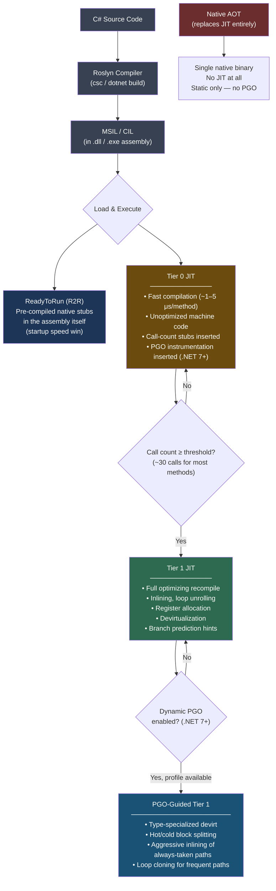
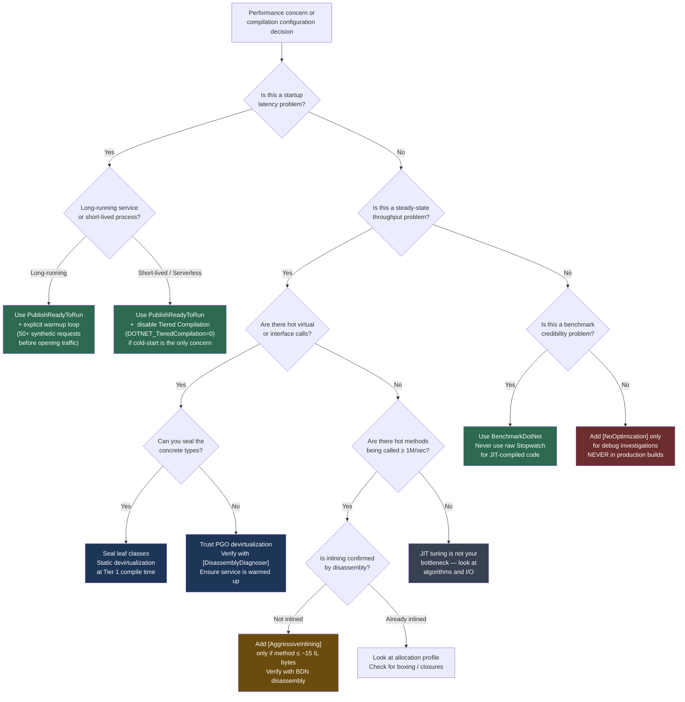

> [!success] Mastery Check
> - [ ] **Studied Well**
> - [ ] **Can explain the concept without notes**
> - [ ] **Can answer interview questions confidently**
> - [ ] **Can implement it in a real project**


## 📍 PART 0 — Navigation & Context

### Where This Topic Lives

```
C# Runtime Model
└── Execution Engine
    ├── CLR & Compilation Pipeline (2.01)
    ├── Type System / Object Model (2.37)
    ├── ► Tiered Compilation, JIT Internals, and PGO  ← YOU ARE HERE
    │       ├── Tier 0 — Quick, Instrumented Code
    │       ├── Tier 1 — Optimized Recompilation
    │       ├── Dynamic PGO (.NET 7+)
    │       └── ReadyToRun (R2R) Pre-compilation
    ├── Zero-Allocation Patterns (2.41)
    └── Benchmarking with BenchmarkDotNet (2.48)
```

### What You Need Before This

- **[[2.01 — The .NET Platform]]** — you need a working mental model of IL, managed execution, and the distinction between the compiler and the runtime before JIT behavior makes sense
- **[[2.16 — Value Types vs Reference Types]]** — JIT escape analysis and stack allocation elision directly target reference-type allocations; knowing what those are is prerequisite
- **[[2.37 — Virtual Dispatch and the CLR Object Model]]** — PGO's most impactful optimization is devirtualizing virtual calls; you need to know what a vtable is before you can understand what PGO removes

### What This Unlocks After

- **[[2.48 — Benchmarking with BenchmarkDotNet]]** — tiered compilation explains why BDN warmup phases are mandatory and what you're actually measuring
- **[[2.41 — Performance: Zero-Allocation Patterns]]** — JIT stack allocation elision (escape analysis) affects which allocations are real vs. optimized away; you need this topic to reason about it correctly
- **[[2.53 — Native AOT, Trimming, and Publish-Time Constraints]]** — Native AOT replaces the JIT entirely; understanding what the JIT does clarifies what you lose and gain with AOT

### Why This Topic Matters at Scale

At high request volume, the difference between Tier 0 cold-start code, Tier 1 optimized code, and PGO-guided devirtualized code can be 2–10× in throughput on hot paths — and misunderstanding these phases causes engineers to write incorrect benchmarks, misread profiler data, and ship systems with preventable startup latency.

---

## 🧠 PART 1 — The Core Mental Model

### The Fundamental Rule

> **The .NET JIT compiles methods in two passes: a fast, unoptimized Tier 0 that starts the process immediately and inserts call-count instrumentation, then a fully-optimized Tier 1 recompile triggered at the call-count threshold. Dynamic PGO feeds branch, type, and call-frequency profiles collected at Tier 0 into Tier 1 to produce machine code that is better than static AOT can ever be — because it knows exactly how your specific workload uses the code.**

### The Plain-Language Analogy

Imagine a kitchen that needs to serve the first customer immediately, so the chef cooks from memory using the fastest-possible recipe — no fancy techniques, no advance prep, just get food out. Meanwhile, a kitchen assistant is watching the chef work, counting every dish ordered, noting which items get ordered most, which routes through the kitchen are most traveled. Once the chef has cooked the same dish thirty times, the assistant hands over a customized playbook: "skip the garnish station entirely for this crowd, pre-stage those two ingredients, use the shortcut route." The chef tears up the old recipe and cooks from the optimized playbook for all future orders.

That is exactly what tiered compilation does. Tier 0 is cooking from memory. The call-count instrumentation is the assistant watching. The Tier 1 recompile is the chef switching to the optimized playbook. PGO is the detail in that playbook — not just "this method is hot" but "this virtual call is _always_ a `PaymentProcessor`, so hardcode that call site."

### The Compilation Taxonomy



---

## 🔬 PART 2 — Deep Mechanics

### 2.1 Tier 0: The Fast, Instrumented Baseline

When a method is called for the first time, the runtime has to execute it immediately. It cannot afford to spend 500 μs doing full optimization before the first request returns. Tier 0 solves this with a JIT pass that takes roughly 1–5 μs per method and produces code that is correct but deliberately unoptimized.

**What Tier 0 actually generates:**

```
// C# method:
public static int Sum(int[] arr)
{
    int total = 0;
    for (int i = 0; i < arr.Length; i++)
        total += arr[i];
    return total;
}

// Tier 0 x64 assembly (approximate — unoptimized):
; Prologue
push rbp
mov rbp, rsp
sub rsp, 32                   ; stack frame setup (not elided)

; Call count stub — the critical addition:
mov rax, [method_call_counter_address]
inc qword ptr [rax]           ; increment call counter
cmp qword ptr [rax], 30      ; have we hit the threshold?
jge  trigger_tier1_recompile  ; if so, schedule Tier 1

; Bounds check (not eliminated in Tier 0):
; Loop body — no unrolling, no SIMD, no bounds-check elimination
xor ecx, ecx                 ; i = 0
xor edx, edx                 ; total = 0
loop_start:
  cmp ecx, [arr+8]           ; bounds check on EVERY iteration
  jge loop_end
  add edx, [arr+rcx*4+12]
  inc ecx
  jmp loop_start
loop_end:
mov eax, edx
pop rbp
ret
```

**Cost label: Tier 0 compilation — ~1–5 μs per method, executed once per cold start.**

The call-count increment is approximately 3–5 CPU instructions with a branch, added to every method. On a hot path executing millions of times per second, this overhead accumulates — but it's temporary. Once Tier 1 kicks in, the stub is gone.

### 2.2 Tier 1: Full Optimizing Recompilation

After approximately 30 calls (the exact threshold is runtime-controlled and can be configured), the JIT schedules Tier 1 recompilation on a background thread. Execution continues on Tier 0 code while Tier 1 compiles. When Tier 1 is ready, the JIT does an atomic patch — swapping the call target at all call sites — and Tier 0 code is discarded.

**What Tier 1 does that Tier 0 does not:**

```
// Tier 1 x64 assembly for the same Sum method (approximate):
; Prologue — ELIDED entirely (small method, no frame pointer needed)
; No call-count stub (removed)
; Bounds check ELIMINATED (JIT proves loop stays in bounds)
; Loop VECTORIZED with AVX2 (if CPU supports it):

vxorps ymm0, ymm0, ymm0        ; 256-bit zero accumulator
; Process 8 ints at a time:
vmovdqu ymm1, [arr+offset]
vpaddd ymm0, ymm0, ymm1
; ... (loop over 8-element chunks)
; Horizontal sum of ymm0
vextracti128 xmm1, ymm0, 1
vpaddd xmm0, xmm0, xmm1
vphaddq xmm0, xmm0, xmm0
movd eax, xmm0
ret
; SIMD: 8 elements per clock cycle instead of 1
```

**Cost label: Tier 1 compilation — ~10–100 μs per method (background thread). Zero execution cost after the atomic swap.**

**Optimizations Tier 1 applies:**

```
┌──────────────────────────────────────────────────────────────────┐
│                    TIER 1 OPTIMIZATION CATALOG                   │
├──────────────────────────┬───────────────────────────────────────┤
│ Optimization             │ What It Does                         │
├──────────────────────────┼───────────────────────────────────────┤
│ Inlining                 │ Replaces call with callee body.       │
│                          │ Threshold: ~32 IL bytes default.      │
│                          │ Eliminates call overhead (~5–10 ns)   │
├──────────────────────────┼───────────────────────────────────────┤
│ Bounds-check elimination │ Proves loop indices stay in range     │
│                          │ → removes array bounds check on each  │
│                          │   iteration (~2 instructions each)    │
├──────────────────────────┼───────────────────────────────────────┤
│ Loop unrolling           │ Duplicates loop body 2–8×             │
│                          │ → fewer branch instructions            │
├──────────────────────────┼───────────────────────────────────────┤
│ SIMD auto-vectorization  │ Converts scalar loops to vector ops   │
│                          │ → 4–16× throughput on int/float data  │
├──────────────────────────┼───────────────────────────────────────┤
│ Register allocation      │ Keeps hot variables in CPU registers  │
│                          │ → eliminates memory round-trips        │
├──────────────────────────┼───────────────────────────────────────┤
│ Escape analysis          │ Proves object doesn't escape method   │
│                          │ → elides heap allocation, uses stack  │
├──────────────────────────┼───────────────────────────────────────┤
│ Devirtualization         │ Replaces indirect vtable call with    │
│                          │ direct call (see 2.3 below)           │
├──────────────────────────┼───────────────────────────────────────┤
│ Dead code elimination    │ Removes branches that can't be taken  │
│                          │ (e.g., if (false) {...} in Debug)     │
└──────────────────────────┴───────────────────────────────────────┘
```

### 2.3 Dynamic PGO — The Game Changer in .NET 7+

Static optimizers can only work with what they can see in the code. A virtual call to `IPaymentGateway.Process()` could be any implementation — the optimizer cannot inline it, cannot assume its type, cannot eliminate the vtable dispatch. Dynamic PGO breaks this limitation.

**How PGO works end-to-end:**

```
Phase 1: Tier 0 with Instrumentation
─────────────────────────────────────
// Original virtual call site:
result = gateway.Process(order);

// Tier 0 generates this + instrumentation probes:
// [TYPE_PROFILE_PROBE]: record typeof(gateway) in call-site table
// [BRANCH_PROFILE_PROBE]: record which branch is taken, how often
// [CALL_FREQUENCY_PROBE]: count calls to this site

Phase 2: Profile Collection
───────────────────────────
// After ~30 calls, the runtime has:
// TypeProfile[gateway call site]:
//   StripeGateway  → 99.7% of calls
//   PayPalGateway  → 0.3% of calls
// BranchProfile[null check]:
//   not-taken      → 100% (gateway is never null in practice)

Phase 3: Tier 1 + PGO Recompile
─────────────────────────────────
// The JIT generates this instead of a vtable dispatch:
cmp [gateway.MethodTablePtr], StripeGateway_MethodTable
jne fallback_virtual_call    ; rare path — cold block moved to end of method
; INLINED StripeGateway.Process body here — no call at all
jmp done

fallback_virtual_call:        ; executed 0.3% of the time
call [gateway.vtable + slot]  ; generic vtable dispatch for other types
done:
```

**The result:** a virtual call that was costing ~5–8 ns (vtable lookup + indirect call) becomes an inline expansion costing ~0 ns (direct code, no call). For a payment processing hot path that handles 50,000 transactions per second, this is enormous.

**Cost label: PGO-devirtualized virtual call — ~0–1 ns (inlined, direct). Standard virtual call — ~5–8 ns. Standard interface call — ~8–15 ns.**

**PGO profile types collected at Tier 0:**

```
┌─────────────────────┬──────────────────────────────────────────────┐
│ Profile Type        │ What Gets Recorded                          │
├─────────────────────┼──────────────────────────────────────────────┤
│ Type profiles       │ Concrete runtime types at virtual/interface  │
│                     │ call sites (per-call-site type histogram)    │
├─────────────────────┼──────────────────────────────────────────────┤
│ Branch profiles     │ Taken/not-taken counts for every conditional │
│                     │ branch (% of time each path executes)        │
├─────────────────────┼──────────────────────────────────────────────┤
│ Call frequency      │ Which methods are called often enough to     │
│                     │ inline aggressively, which to not            │
├─────────────────────┼──────────────────────────────────────────────┤
│ Block liveness      │ Which code blocks are actually executed      │
│                     │ (cold blocks moved to end of method)         │
└─────────────────────┴──────────────────────────────────────────────┘
```

### 2.4 Escape Analysis and Stack Allocation Elision

Even for reference types (classes), the JIT can elide the heap allocation entirely if it can prove the object never escapes the current method — a process called escape analysis.

```csharp
// C# code:
public static int ProcessOrder(Order order)
{
    var calculator = new TaxCalculator(order.Region);
    // calculator is only used inside this method, never passed out,
    // never stored in a field, never returned.
    return calculator.ComputeTotal(order.Amount);
}

// After Tier 1 JIT with escape analysis:
// • TaxCalculator's fields are allocated directly on the STACK
//   (or kept in registers entirely if small enough)
// • No heap allocation. No GC pressure. Zero bytes allocated.
// BenchmarkDotNet would show: Allocated: 0 B

// What prevents elision (causes the object to "escape"):
//   ❌ return calculator;                     // escapes: returned
//   ❌ _field = calculator;                   // escapes: stored in field
//   ❌ someList.Add(calculator);              // escapes: stored in collection
//   ❌ Task.Run(() => calculator.Compute());  // escapes: lambda capture
//   ❌ virtual call on calculator             // may escape (JIT unsure)
```

**Cost label: Stack-elided allocation — 0 bytes, 0 ns GC cost. Heap allocation for same object — ~24+ bytes, ~20–50 ns.**

> [!WARNING] The BenchmarkDotNet Consequence If you benchmark a method that creates an object the JIT elides, you will see `Allocated: 0 B` even though your C# code has `new`. The JIT made the allocation disappear. This is a feature, not a measurement error. Understanding escape analysis is why a senior engineer doesn't panic when they see 0 B for a method that clearly does `new`.

### 2.5 ReadyToRun (R2R) — Startup Acceleration

R2R is a form of ahead-of-time compilation built into the assembly itself. At publish time (`dotnet publish`), the SDK can pre-generate native stubs for all methods. These stubs are not fully optimized — they are closer to Tier 0 quality — but they allow the process to start executing immediately without waiting for the JIT at all.

```
Without R2R:
  Process start
  → JIT first 500 methods as they're called
  → ~300 ms before first request served (cold JIT overhead)

With R2R:
  Process start
  → Pre-compiled stubs already in the .dll
  → First request served in ~50 ms
  → Background: JIT replaces R2R stubs with Tier 1 optimized code
    over the first few minutes of traffic

Cost: ~2× larger assembly file on disk.
Gain: 3–6× faster startup for large applications.
```

**Setting in .csproj:**

```xml
<PropertyGroup>
  <!-- Enabled by default for dotnet publish; can be disabled: -->
  <PublishReadyToRun>true</PublishReadyToRun>

  <!-- Optional: include cross-target stubs for faster container builds: -->
  <PublishReadyToRunComposite>true</PublishReadyToRunComposite>
</PropertyGroup>
```

---

## 💻 PART 3 — Production Code Patterns

### 3.1 Sealing Types for Static Devirtualization

PGO does runtime devirtualization based on observed types. But the JIT can do _static_ devirtualization at Tier 1 compile time — without any profile data — when it can prove a type is `sealed`.

```csharp
// ⚠️ WRONG: unsealed class prevents compile-time devirtualization
public class OrderValidator
{
    public virtual bool Validate(Order order)
        => order.Amount > 0 && order.Currency != null;
}

// Every call to validator.Validate(...) through an OrderValidator variable
// dispatches through the vtable. ~5–8 ns per call.
// The JIT cannot inline it. Cannot eliminate the null check on the result.

// ✅ CORRECT: sealed enables the JIT to devirtualize statically at Tier 1
public sealed class OrderValidator
{
    // 'virtual' keyword removed — sealed class cannot have virtual dispatch
    public bool Validate(Order order)
        => order.Amount > 0 && order.Currency != null;
}

// Now: OrderValidator.Validate is a direct call (~1–2 ns).
// The JIT INLINES it at Tier 1 — zero call overhead.
// Cost: ~0 ns per call (inlined into caller, no dispatch).

// If polymorphism is needed, seal the leaf implementations:
public abstract class PaymentGateway
{
    public abstract Task<PaymentResult> ChargeAsync(Order order, CancellationToken ct);
}

// Seal the concrete implementations:
public sealed class StripeGateway : PaymentGateway { ... }
public sealed class PayPalGateway : PaymentGateway { ... }
// The call site dispatches virtually through PaymentGateway,
// but PGO will devirtualize it at runtime once it sees which type dominates.
```

### 3.2 Controlling Inlining with `[MethodImpl]`

The JIT makes inlining decisions based on IL size and a heuristic cost model. You can override these decisions for specific production scenarios.

```csharp
using System.Runtime.CompilerServices;

// ✅ PATTERN: Aggressive inlining for hot-path guard methods
// These tiny methods are called millions of times per second in
// order validation pipelines. Without inlining: ~5–10 ns call overhead each.
public static class Guard
{
    // Force inline: the method body is 2 IL instructions,
    // but the JIT's inlining budget may not pick it up automatically
    // when it's called from a large method.
    [MethodImpl(MethodImplOptions.AggressiveInlining)]
    public static void ThrowIfNullOrEmpty(string? value, string paramName)
    {
        if (string.IsNullOrEmpty(value))
            ThrowArgument(paramName);  // cold path — separate method prevents deopt
    }

    // ✅ PATTERN: Move the cold throw path into a separate non-inlined method.
    // Inlining a throw site brings exception machinery into the hot path.
    // Separating it keeps the hot path tight and lets JIT mark the throw
    // method as cold (placed at end of code segment).
    [MethodImpl(MethodImplOptions.NoInlining)]
    private static void ThrowArgument(string paramName)
        => throw new ArgumentException("Value cannot be null or empty.", paramName);
}

// ⚠️ WRONG: Don't [AggressiveInlining] large methods
// This inflates the caller's IL size and actually hurts the JIT's ability
// to optimize the caller. Only use for methods ≤ ~10 IL instructions.
[MethodImpl(MethodImplOptions.AggressiveInlining)]
public static PaymentResult ProcessPayment(Order order, IPaymentGateway gateway)
{
    // 50 lines of complex logic — this HURTS inlining by bloating callers
    // The JIT will ignore AggressiveInlining if the heuristic cost is too high
    ...
}
```

### 3.3 `[SkipLocalsInit]` — Eliminating Stack Zeroing

By default, the CLR zero-initializes all local variables when a method frame is created. For methods with large stack allocations (`stackalloc`), this costs real cycles.

```csharp
using System.Runtime.CompilerServices;

// ✅ PATTERN: Suppress stack zeroing for high-frequency parsing methods
// in financial message processing (FIX protocol parser, binary message decoder)
[SkipLocalsInit]
public static unsafe bool TryParseFIXMessage(
    ReadOnlySpan<byte> input,
    out FixMessage message)
{
    // stackalloc is NOT zero-initialized with [SkipLocalsInit]
    // We initialize exactly what we use — not the whole buffer
    Span<byte> workBuffer = stackalloc byte[512];

    // ⚠️ REQUIREMENT: You are responsible for initializing before reading.
    // Reading an uninitialized byte here would be a security/correctness bug.
    // This pattern is safe only when you provably initialize before reading.
    workBuffer[0] = 0; // start of intentional initialization

    // ... parsing logic ...
    message = ParseFromBuffer(workBuffer);
    return true;
}

// Cost without [SkipLocalsInit]: 512 bytes × 1 cycle/byte = ~512 cycles zeroing overhead
// Cost with [SkipLocalsInit]: 0 cycles zeroing (you only pay for what you initialize)
// At 100,000 messages/sec: saves ~51.2M cycles/sec ≈ 17 ms/sec on a 3 GHz CPU
```

### 3.4 Preventing JIT Interference in Benchmarks with `[NoOptimization]`

When you write a benchmark comparing two approaches, the JIT can optimize one variant differently from the other based on its containing context, making the benchmark meaningless.

```csharp
using System.Runtime.CompilerServices;
using BenchmarkDotNet.Attributes;

[MemoryDiagnoser]
public class ParserBenchmark
{
    private readonly string _input = "order_id=12345&amount=99.95&currency=USD";

    // ✅ CORRECT: Isolate each variant in its own method
    // Each method gets independently compiled by the JIT.
    // The JIT's decision to inline or optimize one does not affect the other.

    [Benchmark(Baseline = true)]
    public decimal ParseAmountSplit()
    {
        // Approach 1: Split then parse
        var parts = _input.Split('&');
        foreach (var part in parts)
        {
            if (part.StartsWith("amount="))
                return decimal.Parse(part[7..]);
        }
        return 0;
    }

    [Benchmark]
    public decimal ParseAmountSpan()
    {
        // Approach 2: Span-based zero-allocation parsing
        var remaining = _input.AsSpan();
        while (!remaining.IsEmpty)
        {
            int sep = remaining.IndexOf('&');
            var pair = sep < 0 ? remaining : remaining[..sep];
            if (pair.StartsWith("amount="))
            {
                decimal.TryParse(pair[7..], out var val);
                return val;
            }
            remaining = sep < 0 ? Span<char>.Empty : remaining[(sep + 1)..];
        }
        return 0;
    }
}

// ⚠️ WRONG: benchmarking inside a single method with conditional branching
// The JIT will see both paths simultaneously and may optimize them differently
// or even combine them in ways that distort results.
public decimal BenchmarkBothInOneMethod(bool useSplit)
{
    if (useSplit)
    { /* split approach */ }
    else
    { /* span approach */ }
    // These paths share register allocation, inlining budget, etc.
    // Not a fair comparison.
}
```

### 3.5 Diagnosing JIT Output with `[DisassemblyDiagnoser]`

To verify that the JIT actually produced the code you expected (inlined, devirtualized, vectorized), use BDN's disassembly diagnoser directly on your benchmark.

```csharp
using BenchmarkDotNet.Attributes;
using BenchmarkDotNet.Diagnosers;

// This attribute dumps the generated x64 assembly to a file.
// USE THIS when you suspect the JIT is not doing what you expect.
[DisassemblyDiagnoser(
    maxDepth: 3,          // follow inlining up to 3 levels deep
    exportHtml: true,     // generates readable HTML report
    printInstructionAddresses: true)]
[MemoryDiagnoser]
public class DevirtualizationBenchmark
{
    // Scenario: order fulfillment service — verify StripeGateway is devirtualized
    private readonly IPaymentGateway _gateway = new StripeGateway();
    private readonly Order _order = new Order { Amount = 99.95m, Currency = "USD" };

    [Benchmark]
    public Task<PaymentResult> ChargeThroughInterface()
    {
        // After PGO + Tier 1: should see StripeGateway.ChargeAsync INLINED here,
        // not a vtable dispatch. The disassembly will confirm.
        return _gateway.ChargeAsync(_order, CancellationToken.None);
    }
}

// Reading the disassembly output:
// ✅ Devirtualized, inlined:
//   → You see the body of StripeGateway.ChargeAsync directly in the caller output
//   → No "call [rax+offset]" (indirect virtual call instruction)
//
// ⚠️ Not devirtualized:
//   → You see: mov rax, [gateway+8]  ; load method table
//              mov rax, [rax+offset]  ; load vtable slot
//              call rax               ; indirect call
```

### 3.6 Configuring Tiered Compilation for Special Workloads

```csharp
// In runtimeconfig.json or via environment variables:

// Scenario A: Lambda / serverless — disable Tier 0's call-count overhead
// because each invocation is short-lived (no time to reach Tier 1 anyway)
{
    "configProperties": {
        "System.Runtime.TieredCompilation": false,
        // Use PublishReadyToRun instead for startup speed
    }
}

// Scenario B: Long-running service — default settings are optimal.
// Tier 0 → Tier 1 transition happens within first ~30 calls per method.
// Do nothing; tiered compilation on by default since .NET Core 3.0.

// Scenario C: Benchmark isolation — disable tiered compilation entirely
// so the benchmark always measures the same code path.
// Set via environment variable before running:
// DOTNET_TieredCompilation=0
// or in BenchmarkDotNet job:
[SimpleJob(runtimeMoniker: RuntimeMoniker.Net80, baseline: true)]
[SimpleJob(runtimeMoniker: RuntimeMoniker.Net90)]
public class CrossRuntimeBenchmark { ... }

// Scenario D: Force Tier 1 immediately for a critical method (startup path)
// Use [MethodImpl(AggressiveOptimization)] — compiles directly at Tier 1 quality
// on first call. Cost: first call is slow (~50–200 μs) but all subsequent are fast.
using System.Runtime.CompilerServices;

[MethodImpl(MethodImplOptions.AggressiveOptimization)]
public static void WarmUpCriticalPath()
{
    // This is the payment processing hot path.
    // We call this once at startup to force Tier 1 compilation
    // before the first real transaction arrives.
    ProcessSyntheticOrder();
}
```

### 3.7 Explicit JIT Warmup for Production Services

```csharp
// ✅ PRODUCTION PATTERN: Explicit JIT warmup in ASP.NET Core startup
// Used in high-frequency trading and payment processing APIs where
// the first real request cannot absorb cold-JIT latency.

public class Program
{
    public static async Task Main(string[] args)
    {
        var app = CreateWebApplication(args);

        // Warm up the critical code paths before opening the port to traffic.
        // This causes the JIT to compile these methods to Tier 1 before
        // any real request arrives.
        await WarmUpCriticalPaths(app.Services);

        await app.RunAsync();
    }

    private static async Task WarmUpCriticalPaths(IServiceProvider services)
    {
        using var scope = services.CreateScope();
        var processor = scope.ServiceProvider.GetRequiredService<IOrderProcessor>();
        var gateway   = scope.ServiceProvider.GetRequiredService<IPaymentGateway>();

        // Run synthetic requests through the exact code paths that will be hot.
        // 50 iterations: enough to pass the Tier 1 threshold (~30 calls)
        // and give PGO a meaningful type profile.
        var syntheticOrder = new Order { Amount = 1.00m, Currency = "USD", Id = Guid.Empty };
        for (int i = 0; i < 50; i++)
        {
            try
            {
                await processor.ProcessAsync(syntheticOrder, CancellationToken.None);
            }
            catch
            {
                // Synthetic orders may fail validation — that's fine.
                // We only care that the code COMPILED, not that it succeeded.
            }
        }

        // Log the warmup so you can measure it in your startup latency dashboard
        var logger = services.GetRequiredService<ILogger<Program>>();
        logger.LogInformation("JIT warmup complete — critical paths at Tier 1");
    }
}
```

---

## ⚠️ PART 4 — Gotchas & Anti-Patterns

### Gotcha 1: Measuring Tier 0 Code in a Benchmark

The most common benchmarking mistake in production .NET engineering. Engineers write a performance test, run it once, see a bad number, and ship the wrong conclusion.

```csharp
// ⚠️ WRONG: Running the benchmark without proper warmup
// This measures Tier 0 + JIT compilation overhead, not the steady-state runtime

// Bad manual benchmark:
var sw = Stopwatch.StartNew();
for (int i = 0; i < 1000; i++)
    result = ProcessOrder(order);   // First 30 calls: Tier 0 (slow)
                                    // Tier 1 recompile happens mid-loop
                                    // Remaining calls: Tier 1 (fast)
                                    // Average mixes both — meaningless!
sw.Stop();
Console.WriteLine($"{sw.ElapsedMilliseconds} ms"); // ← This number is fiction

// ✅ CORRECT: Use BenchmarkDotNet which handles warmup correctly
// BDN runs:
//   1. Pilot phase: determines how many iterations per measurement round
//   2. Warmup phase: runs enough iterations to trigger Tier 1 for all methods
//   3. Target phase: measures only Tier 1 steady-state execution
// The measurement comes entirely from Tier 1 code.

[Benchmark]
public decimal ProcessOrder() => _processor.Process(_order);
// BDN measures this after full JIT warmup — the number is real.
```

**WHY this bites experienced engineers:** They know to avoid obvious rookie mistakes but still roll their own `Stopwatch` benchmarks because they want a quick answer. There is no correct quick benchmark for JIT-compiled code.

### Gotcha 2: `[AggressiveInlining]` Making Things Worse

```csharp
// The misunderstanding: "inlining is always faster, so force it everywhere"

// ⚠️ WRONG: Inlining a large method bloats the caller's machine code
// This causes instruction cache misses, larger stack frames,
// and prevents the JIT from optimizing the caller independently.

[MethodImpl(MethodImplOptions.AggressiveInlining)]
public static PaymentResult ProcessPaymentFull(
    Order order,
    IPaymentGateway gateway,
    IFraudDetector fraudDetector,
    ITaxCalculator taxCalculator,
    IAuditLogger auditLogger)
{
    // 80 lines of business logic — this is 200+ IL bytes
    // [AggressiveInlining] on this causes every call site to
    // balloon by 200+ bytes of machine code.
    // The CPU's instruction cache (typically 32 KB L1-I) now
    // has far less room for OTHER hot code.
    // Net effect: SLOWER than without the attribute.
    ...
}

// ✅ CORRECT: [AggressiveInlining] belongs only on trivially small methods
// Rule: ≤ 10 IL bytes, ≤ 3 statements, no exception paths in the hot flow
[MethodImpl(MethodImplOptions.AggressiveInlining)]
public static bool IsValidAmount(decimal amount) => amount > 0 && amount <= 1_000_000m;

// WHY it works here: 2 comparisons + 1 and → 4 IL bytes.
// Inlined: saves a call + return (~10 ns). No code bloat.
```

### Gotcha 3: Relying on PGO Devirtualization in Tests

```csharp
// PGO profiles are collected at runtime from actual traffic.
// In unit tests, each test is isolated and the JIT starts fresh.
// PGO has no time to collect a profile before the test completes.

// ⚠️ WRONG assumption: "My perf test shows 0 ns for this virtual call"
// That 0 ns might be an artifact of the test setup, not real devirtualization.

// In a unit test:
var gateway = new StripeGateway();        // Only one concrete type ever created
IPaymentGateway gw = gateway;
// 5 test-method calls: PGO has no profile yet when this test runs.
// Not devirtualized. Vtable dispatch.

// In production (long-running service):
// After 30+ calls with StripeGateway:
// Type profile: StripeGateway → 100%
// PGO devirtualizes and inlines.

// ✅ CORRECT: Trust BenchmarkDotNet warmup for PGO measurement.
// BDN's warmup phase is long enough for PGO profiles to form.
// Unit tests cannot reliably measure PGO effects.
// Use [DisassemblyDiagnoser] in a BDN benchmark to confirm devirtualization.
```

### Gotcha 4: `NoOptimization` Leaking into Production Builds

```csharp
// Engineers add [MethodImpl(NoOptimization)] to investigate a bug
// (preventing the JIT from reordering operations) and forget to remove it.

// ⚠️ WRONG: Left in production code
[MethodImpl(MethodImplOptions.NoOptimization)]
public decimal CalculateOrderTotal(Order order)
{
    // This was added during debugging to "see the real code"
    // and was never removed.
    // In production: ZERO JIT optimization for this method.
    // No inlining of callees, no bounds-check elimination,
    // no register allocation — runs like Tier 0 forever.
    return order.LineItems.Sum(li => li.Price * li.Quantity) + order.ShippingCost;
}

// The consequence: this method runs at ~10–30× slower than it could.
// In an order management system processing 10,000 orders/sec,
// this is a significant throughput hit.

// ✅ CORRECT: Remove [NoOptimization] before committing.
// If you need to disable optimization for debugging,
// use environment variable DOTNET_TieredCompilation=0 at runtime
// or use a Debugger.Break() + conditional compilation with #if DEBUG.

// ✅ SAFER ALTERNATIVE for debugging ordering issues:
// Use Volatile.Read/Write to prevent specific reorderings without
// disabling all optimization.
```

### Gotcha 5: Misunderstanding "Method Too Large to Inline"

```csharp
// The JIT has a heuristic budget for inlining (default ~32 IL bytes for Tier 1).
// Adding even one line to a method that was previously inlined can push it over.

// ⚠️ WRONG: Adding logging to a previously-inlined hot path method
public static bool IsEligibleForDiscount(Customer customer, Order order)
{
    // Previously: 8 IL bytes → always inlined by JIT
    // After adding logging:
    _logger.LogDebug("Checking discount eligibility for {CustomerId}", customer.Id);
    // Now: 40+ IL bytes → no longer inlined
    // All call sites that were getting this inlined now have a function call.
    return customer.TotalOrderValue > 1000 && order.Amount > 50;
}

// Production impact: 10,000 calls/sec × 5 ns call overhead = 50 μs/sec added latency

// ✅ CORRECT: Keep hot-path methods tiny; move logging to the caller level
public static bool IsEligibleForDiscount(Customer customer, Order order)
    => customer.TotalOrderValue > 1000 && order.Amount > 50;
// 8 IL bytes → inlined. The caller can log the result.

// Or use [AggressiveInlining] explicitly if the method grew:
[MethodImpl(MethodImplOptions.AggressiveInlining)]
public static bool IsEligibleForDiscount(Customer customer, Order order)
{
    // 15 IL bytes: just over the default budget but still acceptable to force
    return customer.TotalOrderValue > 1000
        && order.Amount > 50
        && customer.AccountStatus == AccountStatus.Active;
}
// Use [DisassemblyDiagnoser] in a benchmark to confirm inlining happened.
```

---

## 📊 PART 5 — Performance Implications

### 5.1 Allocation and Cost Characteristics Table

|Scenario|Cost / Behavior|Approx. Time|
|---|---|---|
|First call to a method (Tier 0 JIT compile)|~1–5 μs JIT cost + Tier 0 execution|1–5 μs one-time|
|Tier 0 execution (call-count instrumentation overhead)|~3–5 extra instructions per call|+1–3 ns/call|
|Tier 1 recompile trigger (~30 calls)|Background thread; zero impact to callers|~10–100 μs background|
|Virtual call without PGO / devirtualization|Vtable lookup + indirect call|~5–8 ns|
|Virtual call after PGO devirtualization (inlined)|Direct code, no dispatch|~0–1 ns|
|Interface call without devirtualization|IMT lookup + indirect call|~8–15 ns|
|Interface call after PGO type-specialization|Direct/inlined after type guard|~1–2 ns|
|Method inlined by Tier 1|Call overhead eliminated entirely|−5–10 ns|
|Bounds check elimination (array loop)|−2 instructions per iteration|−0.5–1 ns/iter|
|SIMD vectorization of scalar loop|4–16× throughput on the loop|÷4 to ÷16|
|Escape analysis: object allocated on stack|Zero heap allocation; zero GC cost|0 bytes allocated|
|Stack zeroing with [SkipLocalsInit]|Saved for 512B stack frame|−170 ns|
|R2R startup (vs JIT cold start)|~3–6× faster process startup|−200–500 ms|
|[NoOptimization] on hot method|Permanently Tier 0 quality|3–10× slower|

### 5.2 BenchmarkDotNet: Measuring JIT Tier Effects

```csharp
using BenchmarkDotNet.Attributes;
using BenchmarkDotNet.Jobs;

// Expected output (approximate, .NET 8, x64):
// | Method                  | Mean      | Allocated |
// |------------------------ |----------:|----------:|
// | VirtualCall_NoProfile   | 8.21 ns   | -         |
// | VirtualCall_PGO         | 1.03 ns   | -         |
// | SealedDirectCall        | 0.98 ns   | -         |
// | ArraySum_NoVectorize    | 4,230 ns  | -         |
// | ArraySum_Vectorized     | 290 ns    | -         |
// | Alloc_EscapeElided      | 0.41 ns   | 0 B       |
// | Alloc_HeapAllocated     | 18.52 ns  | 32 B      |

[MemoryDiagnoser]
[SimpleJob(RuntimeMoniker.Net80)]
public class JITTierBenchmarks
{
    private const int N = 1024;
    private readonly int[] _data = Enumerable.Range(0, N).ToArray();

    // --- Virtual call dispatch comparison ---
    private IPaymentCalculator _calculator = new StandardCalculator();

    [Benchmark]
    public decimal VirtualCall_Standard()
        => _calculator.Calculate(99.95m);  // vtable dispatch

    // Sealed version — same logic, static devirtualization
    private readonly SealedCalculator _sealed = new SealedCalculator();

    [Benchmark]
    public decimal SealedDirectCall()
        => _sealed.Calculate(99.95m);  // direct call, likely inlined

    // --- Array sum: scalar vs JIT-vectorized ---
    [Benchmark]
    public int ArraySum_Scalar()
    {
        // Deliberately written to prevent auto-vectorization:
        int sum = 0;
        for (int i = 0; i < _data.Length; i += 2)  // stride 2 — breaks SIMD
            sum += _data[i];
        return sum;
    }

    [Benchmark]
    public int ArraySum_Vectorizable()
    {
        // Written for the JIT to auto-vectorize (stride 1, no dependencies):
        int sum = 0;
        for (int i = 0; i < _data.Length; i++)
            sum += _data[i];
        return sum;
    }

    // --- Escape analysis: elided vs real allocation ---
    [Benchmark]
    public int EscapeElided()
    {
        // The JIT may elide this heap allocation (object doesn't escape)
        var ctx = new CalculationContext { Data = _data, Multiplier = 2 };
        return ctx.ComputeSum();  // ctx used and discarded here
    }

    [Benchmark]
    public int HeapAllocated()
    {
        // Cannot be elided: stored in a field → escapes to heap
        _lastContext = new CalculationContext { Data = _data, Multiplier = 2 };
        return _lastContext.ComputeSum();
    }

    private CalculationContext? _lastContext;
}

public interface IPaymentCalculator { decimal Calculate(decimal amount); }
public class StandardCalculator : IPaymentCalculator
{
    public decimal Calculate(decimal amount) => amount * 1.08m;
}
public sealed class SealedCalculator
{
    public decimal Calculate(decimal amount) => amount * 1.08m;
}
public class CalculationContext
{
    public int[] Data = Array.Empty<int>();
    public int Multiplier;
    public int ComputeSum()
    {
        int sum = 0;
        foreach (var d in Data) sum += d * Multiplier;
        return sum;
    }
}
```

### 5.3 When to Care / When to Ignore

**When this costs you:**

- **Cold-start latency in serverless / containers**: Every new instance starts at Tier 0. Functions triggered infrequently never reach Tier 1. Use R2R or pre-warm.
- **Benchmark credibility**: Any `Stopwatch` benchmark that doesn't account for warmup produces misleading data. Use BDN.
- **High-frequency trading / payment systems with strict P99 SLAs**: The first ~30 requests per method slot in the call graph can be 2–5× slower than steady state. Explicit warmup is not optional.
- **Virtual-call-heavy architectures**: A codebase that uses deep interface hierarchies everywhere and relies on PGO to save it will be measurably slower during warmup than a well-sealed or concretely-typed one.
- **Debug builds in performance tests**: Debug builds disable JIT optimization entirely. Every performance comparison must be made in Release builds.

**When this doesn't matter:**

- **Background batch jobs** that run for minutes or hours: Tier 1 kicks in within the first second. The steady-state performance is what matters, and that's Tier 1 by default.
- **Startup code that runs once**: Configuration loading, DI container setup, middleware registration — these run once. Whether they compile to Tier 0 or Tier 1 is irrelevant.
- **Small tools and CLI utilities**: If the process lives for 200 ms, tiered compilation nuances have zero impact on user-perceived performance.
- **Test suite runs**: CI/CD pipelines run tests at correctness, not throughput. Tiered compilation behavior in tests is noise.

---

## 🎤 PART 6 — Interview Arsenal

### A. The Question Bank

---

**Q: "What is tiered compilation and why does it exist?"**

**Average Answer:** "Tiered compilation means .NET compiles code in two stages — a fast first stage and then a more optimized stage."

**Why That's Insufficient:** It's technically correct but says nothing about the tradeoff being solved, the mechanism of transition, or the production implications.

**Great Answer:**

> "Tiered compilation exists because there's a fundamental tension in JIT compilation: full optimization takes time, but you need to start executing immediately. A cold JIT on a large service might spend 300 ms compiling before it can serve the first request. Tier 0 solves this by compiling methods in 1–5 microseconds each — fast but unoptimized — so execution begins immediately. Meanwhile, Tier 0 inserts call-count probes. When a method has been called roughly 30 times, it's clearly hot, so the runtime schedules a Tier 1 recompile on a background thread. This produces fully optimized machine code — with inlining, loop unrolling, bounds-check elimination, SIMD vectorization — and atomically patches the call sites when ready. The caller never notices the swap; it just gets faster. The practical consequence is that every production .NET service has a 'warmup period' of the first few seconds where performance is measurably worse than steady state, which is why serious services either use ReadyToRun pre-compilation or do explicit warmup before opening to traffic."

---

**Q: "What is Dynamic PGO and how does it differ from static optimization?"**

**Average Answer:** "PGO stands for Profile-Guided Optimization — the JIT uses runtime data to make better decisions."

**Why That's Insufficient:** Doesn't explain what data is collected, how it's used, or what static optimization cannot achieve that PGO can.

**Great Answer:**

> "Static optimizers work only with what's visible in the IL — they can inline methods below a size threshold, eliminate provable dead code, but they cannot resolve a virtual dispatch to a concrete type. Dynamic PGO changes this. At Tier 0, the JIT inserts instrumentation probes — for every virtual or interface call site, it records which concrete type was actually used. For every branch, it records how often each path was taken. After the call-count threshold is met, Tier 1 recompiles using this profile. If a call site through `IPaymentGateway` was `StripeGateway` in 99.7% of executions, the Tier 1 code emits a cheap type guard and inlines `StripeGateway.Process` directly. That virtual call goes from eight nanoseconds to effectively zero — it's now an inline body with a single compare-and-branch guard. A static optimizer simply cannot do this, because it doesn't know which types will be passed at runtime. PGO knows, because it watched."

---

**Q: "How does the JIT decide whether to inline a method?"**

**Average Answer:** "The JIT inlines small methods — there's a size limit."

**Why That's Insufficient:** Only describes one dimension of a multi-factor heuristic, and doesn't address what you can do about it.

**Great Answer:**

> "Inlining decisions in Tier 1 combine several factors: IL byte size is the primary gate — the default budget is roughly 32 bytes of IL, and methods above this need explicit `[AggressiveInlining]` to override it. But size is not the only factor. The JIT also considers whether the callee contains exception handling (generally blocks inlining), whether it has loops (heuristically skipped), and whether the call site is actually hot enough to justify the code duplication. PGO adds call-frequency data: a method called 100% of the time from one call site is a much stronger inlining candidate than one called 10% of the time. In production, the most important thing to know is this: adding logging, validation, or even an extra null check to a small method that was previously being inlined can push it over the IL budget and kill the inlining. I always verify with `[DisassemblyDiagnoser]` in BenchmarkDotNet when I care about whether inlining is actually happening, not just whether I wrote `[AggressiveInlining]`."

---

**Q: "What is escape analysis in the context of the JIT?"**

**Average Answer:** "It's when the JIT puts objects on the stack instead of the heap."

**Why That's Insufficient:** Correct but doesn't explain the mechanism or the production implications.

**Great Answer:**

> "Escape analysis is the JIT's ability to prove that a heap-allocated object never 'escapes' the current method — it's not returned, not stored in a field, not captured by a lambda, not passed to a virtual method that might store it. When the JIT can prove this, it can allocate the object's fields directly in the stack frame instead of on the managed heap. The effect is zero bytes allocated in BenchmarkDotNet's column, even though you wrote `new` in your C# code. This matters because stack memory is effectively free — no GC involvement at all. The tricky part is that escape analysis is fragile: a seemingly minor change like passing the object to a virtual method, adding it to a list, or using it in a lambda will immediately cause it to 'escape' and re-appear on the heap. I've seen engineers assume an allocation was eliminated because a benchmark said so, then ship a refactor that adds a log statement capturing the object, and reintroduce a meaningful allocation on a hot path."

---

**Q: "What is ReadyToRun and when would you use it?"**

**Average Answer:** "It pre-compiles code so startup is faster."

**Why That's Insufficient:** Doesn't address the quality tradeoff, the on-disk cost, or the relationship to Tier 1.

**Great Answer:**

> "ReadyToRun generates platform-native code stubs for methods and embeds them in the assembly at publish time. The key thing to understand is that these stubs are not as optimized as Tier 1 JIT code — they're closer to Tier 0 quality, generated by a compiler that runs during `dotnet publish` without any runtime profile data. Their purpose is purely startup speed: instead of spending the first 200–300 milliseconds JIT-compiling the most-used framework methods from scratch, the runtime can use the pre-compiled stubs immediately. Over the following seconds, the tiered compilation system still kicks in and replaces the R2R stubs with fully-optimized Tier 1 code. So R2R is strictly a startup win; it doesn't improve steady-state throughput. The cost is a larger binary — roughly 2× the assembly file size. I reach for it in containerized services where cold-start latency affects pod scaling and in scenarios where the process might be killed before it fully warms up, like serverless functions."

---

### B. The Trick Questions

**"If I add `[MethodImpl(AggressiveOptimization)]` to my method, does that mean it gets optimized better than normal Tier 1?"**

**The Trap:** Sounds like it should mean "more optimization than Tier 1."

**Correct Answer:** No. `AggressiveOptimization` means "compile directly at Tier 1 quality on the first call — skip Tier 0 entirely." There is no "more than Tier 1." The method still gets the same optimization level as any Tier 1 method. The only difference is the timing: you pay the Tier 1 compilation cost on the very first call instead of after ~30 calls. This is useful for startup warmup code where you want Tier 1 performance immediately, even if the first call is slower.

---

**"My benchmark shows that a method allocates 0 bytes, but my C# code clearly has `new SomeClass()` in it. Is the benchmark broken?"**

**The Trap:** The instinct is to distrust the tool.

**Correct Answer:** The benchmark is almost certainly correct. The JIT's escape analysis proved that `SomeClass` never escapes the method, and it stack-allocated (or register-allocated) the fields instead. This is a JIT optimization working as intended. If you add a statement that causes the object to escape — like passing it to a virtual method, adding it to a collection, or returning it — the allocation will re-appear.

---

**"Does tiered compilation mean my method gets faster every time it's called?"**

**The Trap:** Implying there are infinitely many tiers.

**Correct Answer:** No. There are exactly two tiers in the current implementation (plus R2R, which is pre-compiled). Tier 0 → Tier 1 is a one-time transition per method. After Tier 1 kicks in, performance is stable. There is no Tier 2 or continuous re-optimization based on further profiling. (Dynamic PGO feeds a profile into Tier 1, but Tier 1 itself is the final compiled version.)

---

**"Can `[NoInlining]` improve performance?"**

**The Trap:** "No inlining" sounds purely negative.

**Correct Answer:** Yes, in specific cases. The classic pattern is separating a cold exception-throwing path from a hot guard check. If your hot method calls a tiny guard that sometimes throws, and the throw path is inlined, it brings exception-handling machinery into the hot method's compiled output, increasing code size and potentially harming instruction cache efficiency. Marking the throw helper `[NoInlining]` keeps it out of the hot method's machine code. The throw path is slower (now a real call), but since it's the rare cold path, the overall effect is a faster hot path.

---

**"Is it safe to disable tiered compilation in production for a performance boost?"**

**The Trap:** "Less overhead from call-count instrumentation = faster."

**Correct Answer:** No, and the reasoning is backwards. Disabling tiered compilation means the JIT compiles at Tier 1 quality immediately — which causes significantly longer cold-start latency (all methods pay full compilation cost upfront) AND you lose PGO, which requires the Tier 0 profiling phase to collect type and branch profiles. Without PGO, virtual call devirtualization disappears. The net steady-state performance is typically _worse_ with tiered compilation disabled, not better. The only valid reason to disable it is benchmark isolation, where you want to measure a single, consistent compilation mode.

---

### C. Red Flags to Avoid in Interviews

- **"The JIT always inlines small methods"** — it uses a heuristic budget with many factors; size is just the first gate. Saying "always" will get challenged.
- **"PGO only matters for virtual calls"** — PGO also affects branch layout (hot/cold block splitting), inlining aggressiveness for frequently-called callees, and loop optimization. Limiting it to virtual calls shows incomplete understanding.
- **"Tier 1 code is as fast as C++"** — false and will cost you credibility. Tier 1 is competitive with C++ for many workloads, but C++ static AOT with LTO and PGO can outperform .NET JIT on specific patterns. Claiming equality oversimplifies.
- **"You should always add `[AggressiveInlining]` to your helper methods for speed"** — immediately signals cargo-cult optimization. Aggressive inlining on large methods bloats call sites and hurts I-cache efficiency.
- **"ReadyToRun gives you better steady-state performance"** — incorrect. R2R only helps startup. Steady-state is governed by Tier 1, which replaces R2R stubs anyway.
- **"You can't measure JIT performance with `Stopwatch`"** — this is a strong statement but too absolute. You _can_ use Stopwatch if you do adequate warmup first. The actual red flag is measuring without warmup, not using Stopwatch per se.
- **"Native AOT is just tiered compilation without Tier 0"** — fundamentally wrong. Native AOT replaces the JIT entirely with a static ahead-of-time compiler that has no runtime recompilation, no PGO, and strict code access limitations. It is a completely different execution model.
- **"Escape analysis moves objects to the stack"** — subtly imprecise. Escape analysis elides the heap allocation; objects may end up in registers rather than a stack frame. "Moves to the stack" implies a physical stack allocation that may not actually happen.

---

## 🔀 PART 7 — Decision Framework



---

## ✅ PART 8 — Self-Check

### A. Conceptual Questions

1. A payment processing service starts up and receives its first request in 50 ms. The p50 latency for that first request is 45 ms. After 10 minutes of traffic, p50 latency is 4 ms. You have not changed any code. What is happening, and what would you do to make that first request's latency closer to the 4 ms steady state?
    
2. You add `[MethodImpl(AggressiveOptimization)]` to a method. What exactly changes compared to normal behavior? Is the method now "more optimized" than other Tier 1 methods?
    
3. A colleague's benchmark shows `Allocated: 0 B` for a method that contains `new CustomerProfile(id, name)`. They claim the benchmark is wrong. Are they right? What would you tell them?
    
4. Explain why `[NoInlining]` on an exception-throwing helper method can actually improve performance on the happy path, even though it adds a function call.
    
5. You observe in a `[DisassemblyDiagnoser]` output that a call through `IOrderProcessor` is doing a vtable dispatch (`call [rax+offset]`) even after your service has been running for 20 minutes. List three reasons this might be happening despite PGO being enabled by default.
    
6. Why does tiered compilation cause BenchmarkDotNet to be mandatory for correct .NET performance measurements? What does BDN's warmup phase actually accomplish in terms of JIT state?
    
7. You have a method with a `stackalloc byte[4096]`. You add `[SkipLocalsInit]`. What invariant are you now responsible for maintaining that the runtime was previously guaranteeing for you? What bug class does violating this invariant enable?
    
8. Explain the difference between what ReadyToRun produces and what Tier 1 JIT produces. When does the runtime replace R2R-compiled code with Tier 1 code, and what triggers that replacement?
    
9. A service that uses `IPaymentGateway` (interface) has two implementations in production: `StripeGateway` (95% of calls) and `PayPalGateway` (5% of calls). After PGO warms up, what does the generated machine code for a call site look like? What happens for the 5% PayPal calls?
    
10. You have `[MethodImpl(MethodImplOptions.NoOptimization)]` on a method in your production codebase. A code review surfaces it. What questions do you ask, and what is the almost certainly correct action?
    

### B. Code Puzzles

**Puzzle 1: What does this benchmark actually measure?**

```csharp
[Benchmark]
public long ManualTimedLoop()
{
    var sw = Stopwatch.StartNew();
    long sum = 0;
    for (int i = 0; i < 1_000_000; i++)
        sum += ProcessItem(i);
    sw.Stop();
    return sw.ElapsedMilliseconds; // returned to prevent dead-code elimination
}
```

What is wrong with using this as a benchmark? What does the measurement actually include that you don't want it to include?

<details> <summary>Answer</summary>

The benchmark mixes Tier 0 and Tier 1 execution within a single measurement. The first ~30 calls to `ProcessItem` execute at Tier 0 quality with call-count instrumentation overhead. During the remaining 999,970 calls, the JIT recompiles `ProcessItem` to Tier 1 on a background thread and atomically patches the call site. The `ElapsedMilliseconds` measurement includes: JIT compilation latency for both tiers, Tier 0 execution overhead, the mid-loop transition to Tier 1, and possibly Tier 0 execution for `ManualTimedLoop` itself. The result is a non-reproducible mix that varies between runs based on thread scheduling. BenchmarkDotNet solves this by running the full loop enough times in the warmup phase to drive all called methods to Tier 1, then measuring only Tier 1 steady-state execution.

</details>

---

**Puzzle 2: Will this allocation be elided?**

```csharp
public sealed class OrderSummary
{
    public decimal Total;
    public int ItemCount;
    public decimal ComputeAverage() => ItemCount == 0 ? 0 : Total / ItemCount;
}

public static decimal GetAverageOrderValue(IEnumerable<Order> orders)
{
    var summary = new OrderSummary();  // ← does this allocate?
    foreach (var order in orders)
    {
        summary.Total += order.Amount;
        summary.ItemCount++;
    }
    return summary.ComputeAverage();
}
```

Will the JIT elide the heap allocation for `summary`? Why or why not?

<details> <summary>Answer</summary>

**No, this allocation will NOT be elided.** Two reasons: First, `OrderSummary` is a `class` (reference type). Escape analysis can only stack-allocate the fields in specific conditions. Second and most critically: `summary` is used across multiple iterations of `foreach` and its state is mutated. While `summary` itself doesn't escape the method (not returned, not passed to a virtual method that might store it), the JIT's escape analysis in current .NET 8 does not generally elide class allocations in loops that mutate the object across iterations. The fix is to convert `OrderSummary` to a `struct` (or use local variables directly), which would guarantee stack placement. If you benchmarked this with `[MemoryDiagnoser]`, you would see `Allocated: 48 B` (or similar) for the `OrderSummary` object. Converting to a `readonly struct` with returns instead of mutation would show `Allocated: 0 B`.

</details>

---

**Puzzle 3: What does the [DisassemblyDiagnoser] output tell you about this code?**

```csharp
public interface IDiscountStrategy { decimal Apply(decimal price); }

public sealed class PercentageDiscount : IDiscountStrategy
{
    private readonly decimal _pct;
    public PercentageDiscount(decimal pct) { _pct = pct; }
    public decimal Apply(decimal price) => price * (1 - _pct / 100);
}

public sealed class PricingEngine
{
    private readonly IDiscountStrategy _strategy;
    public PricingEngine(IDiscountStrategy strategy) { _strategy = strategy; }

    public decimal Price(decimal basePrice) => _strategy.Apply(basePrice);
}
```

After running 1,000 iterations through `Price()` in a benchmark with a single `PercentageDiscount` instance, the disassembly shows `call [rax+offset]` at the `_strategy.Apply` call site. What does this tell you, and what is one change that would fix it?

<details> <summary>Answer</summary>

The `call [rax+offset]` is an indirect virtual/interface dispatch — the call is NOT devirtualized. This means PGO has not (yet) converted the 100% `PercentageDiscount` type profile into a direct or inlined call. There are several possible reasons: the benchmark may not have run long enough warmup iterations for PGO to collect and apply a profile; the benchmark process may be creating a fresh JIT context on each run where 1,000 iterations is not enough warmup; or the JIT's PGO devirtualization threshold was not reached. One fix: change `_strategy` from `IDiscountStrategy` to the concrete type `PercentageDiscount` — then the JIT can statically devirtualize at Tier 1 without needing PGO data. Another fix: ensure the benchmark warms up enough (use BDN's warmup properly) and verify with `[DisassemblyDiagnoser]` after adequate warming. A third fix for the interface pattern: since `PricingEngine` is sealed and takes the strategy at construction, you could use a generic version `PricingEngine<TStrategy> where TStrategy : IDiscountStrategy` — with a struct implementing the interface, the JIT would statically devirtualize because the generic type is known.

</details>

---

**Puzzle 4: Find the production bug introduced by this optimization attempt.**

```csharp
[MethodImpl(MethodImplOptions.AggressiveInlining)]
public static bool ValidateAndProcessPayment(
    Order order,
    Customer customer,
    IPaymentGateway gateway,
    IAuditLogger auditLogger,
    IFraudDetector fraudDetector)
{
    if (order == null) throw new ArgumentNullException(nameof(order));
    if (customer == null) throw new ArgumentNullException(nameof(customer));

    var fraudScore = fraudDetector.Evaluate(order, customer);
    if (fraudScore > 0.7m)
    {
        auditLogger.LogSuspiciousActivity(order.Id, customer.Id, fraudScore);
        return false;
    }

    var result = gateway.ChargeAsync(order, CancellationToken.None).GetAwaiter().GetResult();
    auditLogger.LogTransaction(order.Id, result);
    return result.Success;
}
```

What is the bug introduced by `[AggressiveInlining]` here, beyond the obvious `.GetAwaiter().GetResult()` issue?

<details> <summary>Answer</summary>

`[AggressiveInlining]` on this method causes every call site in the codebase to receive a copy of this entire method body inlined. The method is large (6+ parameters, multiple virtual calls, exception throws, async blocking). Consequences: (1) **Code bloat**: every caller's compiled machine code grows by the size of this method body, potentially adding hundreds of bytes. (2) **Instruction cache pressure**: the L1 instruction cache (typically 32 KB) now holds multiple copies of this logic, evicting other hot code. (3) **Inlining budget exhaustion**: methods that call `ValidateAndProcessPayment` may now exceed their own inlining budget, preventing their further inlining by callers. (4) **The JIT may ignore it anyway** — for very large methods, the JIT can choose to override `AggressiveInlining` if the heuristic cost exceeds its limits. The correct approach: remove `[AggressiveInlining]` entirely. This method is an orchestration function — it should not be inlined. The small guard helpers (`if null throw`) inside it are the candidates for `[AggressiveInlining]`, in their own isolated methods.

</details>

---

**Puzzle 5: What will BenchmarkDotNet's `Allocated` column show for this, and why?**

```csharp
// This is the most common misunderstanding about escape analysis in production.

public struct OrderTotals
{
    public decimal Subtotal;
    public decimal Tax;
    public decimal Total;
}

public class OrderCalculator
{
    public OrderTotals ComputeTotals(Order order)
    {
        // Local struct — where does this live?
        var totals = new OrderTotals
        {
            Subtotal = order.LineItems.Sum(li => li.Price),
            Tax      = order.LineItems.Sum(li => li.Price) * 0.08m,
        };
        totals.Total = totals.Subtotal + totals.Tax;
        return totals;
    }
}
```

Focus specifically on `order.LineItems.Sum(li => li.Price)` — called twice. Does the lambda `li => li.Price` allocate? Does calling `Sum` allocate? What is the total allocation for the two `Sum` calls?

<details> <summary>Answer</summary>

**Each `Sum(li => li.Price)` call allocates a delegate object for the lambda.** Even though the lambda `li => li.Price` captures nothing (no closure), the JIT in .NET 8 does cache static non-capturing lambdas — so `li => li.Price` is actually cached as a static delegate singleton after the first call. **Zero allocation per call** for the lambda itself after the first. However, calling `Sum` on `order.LineItems` (which is `IEnumerable<OrderLineItem>` or `List<OrderLineItem>`) calls through LINQ's `Sum<TSource>` — which requires the enumerator. For `List<T>`, LINQ's `Sum` uses the `List<T>.Enumerator` struct, which is obtained via `GetEnumerator()` and boxed when returned as `IEnumerator<T>`. **Each `Sum` call allocates one boxed enumerator** (~24 bytes). Total: ~48 bytes for the two `Sum` calls in steady state (lambda cached, two enumerator boxes). The fix to reach 0 B: use `foreach` with a manual accumulator instead of LINQ's `Sum`, or use `CollectionsMarshal.AsSpan(lineItems)` to iterate without an enumerator. The `OrderTotals` struct itself is returned by value — zero heap allocation for the struct.

</details>

---

## 🔗 PART 9 — Connections & Resources

### A. Related Topics Table

|Topic|Why It Connects|
|---|---|
|[[2.01 — The .NET Platform]]|The CLR's execution pipeline — IL compilation, the managed execution model — is the prerequisite context for everything in this note|
|[[2.16 — Value Types vs Reference Types]]|Escape analysis (Tier 1) targets heap allocations of reference types; understanding what allocates is required to understand what the JIT eliminates|
|[[2.37 — Virtual Dispatch and the CLR Object Model]]|PGO's most impactful optimization is devirtualizing virtual and interface calls; vtable and IMT mechanics are the exact mechanism being eliminated|
|[[2.41 — Performance: Zero-Allocation Patterns]]|The zero-allocation techniques in 2.41 (Span, ArrayPool, struct design) interact with JIT escape analysis — knowing both lets you understand when the JIT saves you and when you must save yourself|
|[[2.48 — Benchmarking with BenchmarkDotNet]]|Tiered compilation is the primary reason BDN's warmup phases are mandatory; every BDN behavior discussed there (pilot, warmup, target) exists because of this topic|
|[[2.53 — Native AOT, Trimming, and Publish-Time Constraints]]|AOT replaces the JIT entirely — understanding what the JIT does at runtime clarifies what you lose (PGO, runtime devirtualization, dynamic codegen) when choosing AOT|
|[[2.29 — async/await: The State Machine]]|The async state machine generated by the compiler interacts with the JIT — state machine structs are candidates for stack elision; async methods have special JIT handling|
|[[2.32 — Attributes and Metadata]]|`[MethodImpl(AggressiveInlining)]`, `[MethodImpl(NoInlining)]`, `[MethodImpl(AggressiveOptimization)]`, `[SkipLocalsInit]` are the compiler/JIT-directive attributes covered here|

### B. Books

|Book|Chapters|Why These Chapters|
|---|---|---|
|_Pro .NET Memory Management_ — Konrad Kokosa|Ch. 2, 3, 16|Ch. 2 covers CLR internals and the JIT pipeline; Ch. 3 covers the allocation lifecycle; Ch. 16 covers performance diagnosis workflows that rely on JIT understanding|
|_Writing High-Performance .NET Code_ — Ben Watson|Ch. 2, 3, 11|Ch. 2 covers the JIT and compilation model; Ch. 3 covers JIT optimization techniques; Ch. 11 covers profiling to verify JIT assumptions|
|_CLR via C#_ — Jeffrey Richter|Ch. 1, 2|The foundational CLR execution model; Richter's coverage of method compilation and the JIT pipeline is the best written explanation of what happens before Tier 0 runs|

### C. Essential Articles & Docs

- [Microsoft Blog: Dynamic PGO in .NET 6](https://devblogs.microsoft.com/dotnet/conversation-about-pgo/) — Andy Ayers' canonical explanation of how PGO profiles flow from Tier 0 to Tier 1
- [Microsoft Blog: Tiered Compilation in .NET Core 3.0](https://devblogs.microsoft.com/dotnet/tiered-compilation-preview-in-net-core-2-1/) — the original design rationale and mechanism documentation
- [Microsoft Blog: Performance Improvements in .NET 8 — JIT](https://devblogs.microsoft.com/dotnet/performance-improvements-in-net-8/) — Stephen Toub's annual deep-dive; JIT section covers escape analysis, vectorization, and PGO improvements with benchmarks
- [Microsoft Blog: ReadyToRun Compilation](https://devblogs.microsoft.com/dotnet/conversation-about-ready-to-run/) — design doc covering R2R's relationship to tiered compilation and the startup vs. throughput tradeoff
- [GitHub: dotnet/runtime — JIT Documentation](https://github.com/dotnet/runtime/blob/main/docs/design/coreclr/jit/ryujit-overview.md) — the RyuJIT (the .NET JIT compiler) architecture overview; primary source for understanding the actual optimization pipeline
- [Adam Sitnik: Benchmarking .NET Applications](https://adamsitnik.com/benchmarks-are-wrong/) — canonical article on why naive benchmarks in .NET are wrong, with tiered compilation as the central mechanism

### D. Template Meta-Note

> [!NOTE] What Each Part of This Note Does
> 
> - **Part 0**: Navigation — where this topic sits in the runtime hierarchy, what to know before, what this unlocks
> - **Part 1**: Core Mental Model — one-sentence anchor rule + physical analogy + the full compilation taxonomy diagram
> - **Part 2**: Deep Mechanics — what the JIT actually generates at each tier, PGO internals, escape analysis, R2R
> - **Part 3**: Production Code Patterns — 7 annotated patterns from real payment/order/pricing systems with explicit why-comments
> - **Part 4**: Gotchas — 5 production bugs that experienced engineers actually ship, each with wrong→right→why structure
> - **Part 5**: Performance — cost table with 11 scenarios, full BDN benchmark class, explicit when-to-care guidance
> - **Part 6**: Interview Arsenal — 5 full questions with average/insufficient/great answers; 5 trick questions; 8 red flags
> - **Part 7**: Decision Framework — single flowchart for startup vs. throughput vs. benchmark decisions
> - **Part 8**: Self-Check — 10 conceptual questions + 5 code puzzles with hidden answers requiring real understanding
> - **Part 9**: Connections — related topics with specific dependency reasons, 3 books with chapter justifications, 6 authoritative sources

---

_Last updated: 2026-06 · Domain: C# Language Mastery · Topic: 2.49 — Tiered Compilation, JIT Internals, and PGO_
