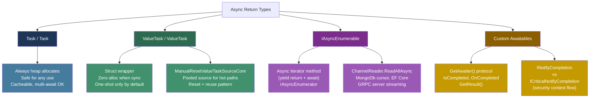
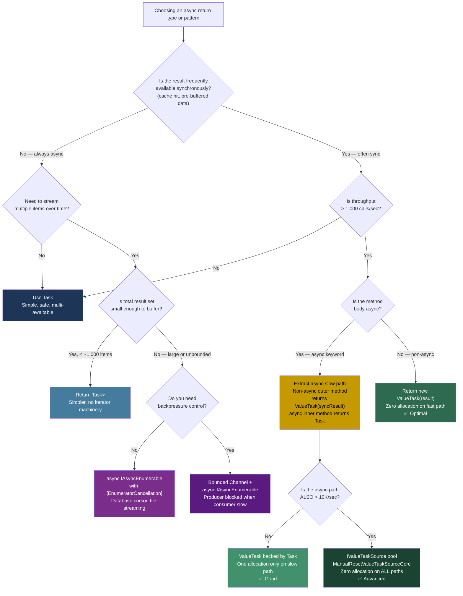

> [!success] Mastery Check
> - [ ] **Studied Well**
> - [ ] **Can explain the concept without notes**
> - [ ] **Can answer interview questions confidently**
> - [ ] **Can implement it in a real project**


## 📍 PART 0 — Navigation & Context

### Where This Topic Lives

```
C# Runtime Model
└── Concurrency & Async
    ├──   async/await: The State Machine (2.29)  ← PREREQUISITE
    ├──   Threading Primitives (2.39)
    ├──   Channels and Concurrent Pipelines (2.45)
    ├── ► Advanced Async Patterns (2.50)          ← YOU ARE HERE
    └──   TPL and PLINQ (2.46)
```

### What You Need Before This

- **[[2.29 — async/await: The State Machine]]** — you must understand what the compiler generates for `async` methods before you can optimize or extend it
- **[[2.25 — Iterators and yield return]]** — async iterators combine the `yield return` state machine with the async state machine; you need both mental models
- **[[2.38 — Spans, Memory, and Zero-Copy Patterns]]** — `Memory<T>` is the async-safe complement to `Span<T>` and appears throughout async stream patterns
- **[[2.16 — Value Types vs Reference Types]]** — `ValueTask<T>` is a struct-based return type; its correctness guarantees are rooted in value-type copy semantics

### What This Unlocks After

- **[[2.41 — Performance: Zero-Allocation Patterns]]** — `ValueTask<T>` is the primary async tool in that topic's arsenal
- **[[2.47 — Dependency Injection Internals]]** — `IAsyncEnumerable<T>` as a streaming service response pattern
- **[[2.53 — Native AOT, Trimming, and Publish-Time Constraints]]** — custom awaitables must be AOT-compatible; source-generated patterns rely on `IAsyncEnumerable<T>`

### Why This Topic Matters in Production

In a high-throughput service — a payment processor handling 50,000 RPS, a real-time market data feed, a streaming API — allocating a `Task<T>` object on every fast-path call is the difference between 40 MB/s of GC pressure and zero. This topic is the toolkit for eliminating that pressure without giving up the readability of async/await.

---

## 🧠 PART 1 — The Core Mental Model

### The Fundamental Rule

> **`Task<T>` always allocates a heap object. `ValueTask<T>` allocates nothing when the result is already available — and that is the only difference that matters.** The practical consequence is that `ValueTask<T>` is the correct return type for any hot-path async method where the result is usually synchronously available (cache hits, buffered reads, pre-computed values), and `Task<T>` remains correct for everything else.

### The Plain-Language Analogy

Think of `Task<T>` as a **formal promissory note printed on dedicated paper**: every time you make a promise — even one you can fulfill immediately from your pocket — you have to go to the printing press, generate a new document, and hand it over. The recipient always gets a document whether or not they needed it.

`ValueTask<T>` is a **verbal promise with a notepad in your back pocket**: if you can answer right now, you say the answer and nothing is written down. Only if you genuinely need to defer — because the work hasn't finished — do you pull out the notepad. The notepad (the `Task`) exists only when necessary.

`IAsyncEnumerable<T>` is a **vending machine with an async slot**: instead of getting all items at once (eager), the caller pulls one item at a time, and each pull can itself be asynchronous — the machine may need to refill before the next item is ready. The caller decides when to ask and when to stop.

### The Taxonomy Diagram



> [!IMPORTANT] The One-Shot Rule A `ValueTask<T>` may only be awaited **once**. It may not be stored and awaited again. It may not be awaited by multiple concurrent callers. Violating this produces undefined behavior — not a nice exception. If you need multi-await semantics, call `.AsTask()` on it first and pay the one-time allocation cost.

---

## 🔬 PART 2 — Deep Mechanics

### 2.1 ValueTask<T> Internals — Three Representations in One Struct

`ValueTask<T>` is a discriminated union packed into a struct. It holds exactly one of three things, selected at construction time:

```
ValueTask<T> struct layout (simplified):
┌────────────────────────────────────────────────────────────────┐
│ ValueTask<T>                                                   │
│                                                                │
│  object? _obj     ← null        = synchronous result          │
│                   ← Task<T>     = already-existing Task        │
│                   ← IValueTaskSource<T> = pooled source        │
│                                                                │
│  T _result        ← used when _obj == null (sync fast path)    │
│  short _token     ← version token for IValueTaskSource<T>      │
│  bool _continueOnCapturedContext  ← ConfigureAwait state       │
└────────────────────────────────────────────────────────────────┘

Case 1 — Synchronous result (ZERO allocation):
  new ValueTask<int>(42)
  → _obj = null, _result = 42
  → IsCompleted = true immediately
  → GetAwaiter().GetResult() returns 42 with no heap touch

Case 2 — Backed by a Task<T> (one allocation):
  new ValueTask<int>(someTask)
  → _obj = someTask (the Task is already allocated)
  → Awaiting: delegates to the Task's continuation mechanism

Case 3 — Backed by IValueTaskSource<T> (zero extra allocation):
  new ValueTask<int>(myPooledSource, token)
  → _obj = myPooledSource (retrieved from pool, REUSED)
  → token is version number preventing stale access
  → Awaiting: calls myPooledSource.OnCompleted(...)
```

**The allocation story for each path:**

```
RPC call to cache service:
  99% of the time → item in L1 cache → Case 1 → 0 bytes allocated
  1%  of the time → actual I/O       → Case 2 → ~120 bytes for Task<T>

With ManualResetValueTaskSourceCore<T> pool:
  100% of the time → pool provides reused source → Case 3 → 0 bytes allocated
```

### 2.2 The Awaiter Protocol — What `await` Actually Calls

`await expr` is syntactic sugar. The compiler looks for a `GetAwaiter()` method on the expression's type (either as an instance method or extension method). The returned awaiter must expose exactly three members:

```csharp
// The compiler-required awaiter contract:
// await expr;  expands to roughly:
//
//   var awaiter = expr.GetAwaiter();
//   if (!awaiter.IsCompleted)
//   {
//       // register continuation, yield control (state machine suspension)
//       awaiter.OnCompleted([state machine MoveNext callback]);
//       return;   // ← suspension point
//   }
//   // resumption path:
//   var result = awaiter.GetResult();

public interface IAwaiter<T> : INotifyCompletion
{
    bool IsCompleted { get; }     // true = synchronous, no suspension needed
    T    GetResult();             // called on resumption; throws if faulted
    void OnCompleted(Action continuation); // from INotifyCompletion
}

// ICriticalNotifyCompletion adds:
//   void UnsafeOnCompleted(Action continuation);
// This variant does NOT flow ExecutionContext (security context)
// Used by ValueTask awaiters for maximum performance
```

**IL the compiler generates for `int x = await someValueTask;`:**

```
// (Approximate — actual state machine is more complex)

// Suspension check:
ldloca  _valueTask       // push address of the struct (ref)
call    ValueTask<int32>.GetAwaiter()
stloc   _awaiter

ldloca  _awaiter
call    ValueTaskAwaiter<int32>.get_IsCompleted
brtrue  RESUMPTION_LABEL  // if already done, skip the suspension dance

// --- SUSPENSION PATH ---
ldloca  _awaiter
ldarg.0              // 'this' (the state machine object)
call    ValueTaskAwaiter<int32>.UnsafeOnCompleted(Action)
ret                  // return to caller — we are suspended

// --- RESUMPTION PATH (called by callback) ---
RESUMPTION_LABEL:
ldloca  _awaiter
call    ValueTaskAwaiter<int32>.GetResult()  // may throw!
stloc   _result_x
```

> [!NOTE] Why `UnsafeOnCompleted` vs `OnCompleted` `OnCompleted` flows `ExecutionContext` (which carries security, ambient transaction, and culture context) to the continuation. `UnsafeOnCompleted` skips this — safe only when the awaitable guarantees it doesn't need context flow, as `ValueTask<T>` does internally. The distinction costs ~100 ns per await when context flow is suppressed; irrelevant for most code but measurable at 1M+ awaits/sec.

### 2.3 ManualResetValueTaskSourceCore<T> — The Pooled Awaitable Pattern

This is the advanced tool for eliminating ALL async allocations in hot loops. It is used internally by `Channel<T>`, `Socket`, and `Pipe`. Understanding it is what separates an engineer who knows `ValueTask` from one who can implement a zero-allocation async pipeline.

```
The problem:
  An await on an incomplete ValueTask<T> backed by a Task<T> allocates:
    - The Task<T> object itself (~120 bytes)
    - The continuation Action delegate (~48 bytes)
  Total: ~168 bytes per async suspension on the hot path.

The solution with IValueTaskSource<T>:
  1. Allocate one source object per "slot" at startup → pool it
  2. Each operation reuses the same source object
  3. A short version token prevents stale access after reset
  4. Zero allocations on both the synchronous AND asynchronous path

Memory before pooling (10,000 concurrent sockets):
  10,000 × 168 bytes = ~1.6 MB of short-lived objects per second

Memory after pooling (same 10,000 sockets):
  10,000 × (pool slot already allocated) = 0 bytes per second
```

```csharp
// Core lifecycle of ManualResetValueTaskSourceCore<T>:

// Phase 1: Create and pool at startup
var source = new ManualResetValueTaskSourceCore<int>();

// Phase 2: Before each operation, get a fresh token (version number)
short token = source.Version; // increments each Reset()

// Phase 3: Return a ValueTask<T> backed by this source (zero allocation)
var vt = new ValueTask<int>(source_as_IValueTaskSource, token);

// Phase 4: When the operation completes:
source.SetResult(42);    // wakes up the awaiting continuation
// OR:
source.SetException(ex); // propagates the exception

// Phase 5: After the awaiter has retrieved the result — reset for reuse
source.Reset(); // increments Version, clears state
// Now safe to reuse for the next operation

// The token guards against use-after-reset:
// If stale code tries to await the old token, it gets InvalidOperationException
```

### 2.4 IAsyncEnumerable<T> — The State Machine Behind Async Streams

An `async` method returning `IAsyncEnumerable<T>` generates two nested state machines: one for `yield` (position tracking) and one for `async` (suspension on I/O). Understanding their composition is essential for diagnosing production issues.

```
Normal iterator (yield return):
  Caller calls MoveNext() → state machine runs until yield return → suspends
  State lives in: IEnumerator<T> heap object (one allocation)

Normal async method (async/await):
  Caller awaits → state machine runs until await → suspends
  State lives in: Task<T> + state machine class (two allocations)

Async iterator (async + yield return):
  Caller awaits MoveNext() → state machine runs until yield return OR await
  Two suspension points in the same state machine:
    → yield return: caller received value, resumes on next MoveNext() call
    → await:        waiting for I/O, resumes when I/O completes
  State lives in: ONE compiler-generated class that is both IAsyncEnumerator<T>
                  AND IValueTaskSource<bool> (for allocation efficiency)
```

**The IAsyncEnumerator<T> protocol that `await foreach` calls:**

```csharp
// await foreach (var item in asyncSequence) { ... }
// Compiler expands to approximately:

await using var enumerator = asyncSequence.GetAsyncEnumerator(cancellationToken);
while (await enumerator.MoveNextAsync())   // each MoveNextAsync() is a ValueTask<bool>
{
    var item = enumerator.Current;
    // loop body
}
// GetAsyncEnumerator returns IAsyncEnumerator<T>
// MoveNextAsync returns ValueTask<bool>: zero alloc when item was ready (buffered data)
// DisposeAsync cleans up resources (e.g., closes database cursor)
```

**What the compiler generates for an async iterator method:**

```
async IAsyncEnumerable<OrderSummary> StreamOrders(...)

Compiler generates:
  private sealed class <StreamOrders>d__0 :
    IAsyncEnumerable<OrderSummary>,
    IAsyncEnumerator<OrderSummary>,
    IValueTaskSource<bool>,        // enables zero-alloc MoveNextAsync
    IAsyncStateMachine
  {
    int _state;                    // current position in the method
    OrderSummary _current;         // Current property value
    ManualResetValueTaskSourceCore<bool> _valueTaskSource; // pooled awaitable
    CancellationToken _cancellationToken;
    // ... all captured locals ...

    ValueTask<bool> MoveNextAsync()
    {
        // resumes state machine
        // if next value is synchronously available → ValueTask<bool>(true) — zero alloc
        // if awaiting I/O → returns ValueTask<bool>(this, _valueTaskSource.Version)
    }

    OrderSummary get_Current() => _current;
    ValueTask DisposeAsync() { ... }
  }
```

> [!WARNING] The ConfigureAwait(false) on await foreach `await foreach (var item in source)` captures the `SynchronizationContext` on each `MoveNextAsync`. In ASP.NET Core this means marshaling back to the request context on every item — expensive for a 10,000-row database result. Always write: `await foreach (var item in source.ConfigureAwait(false))` for library code. This calls `GetAsyncEnumerator()` and wraps each `MoveNextAsync()` in a `ConfigureAwait(false)` internally.

### 2.5 Custom Awaitable — Full Protocol Implementation

```csharp
// A minimal correct awaitable that does NOT flow ExecutionContext:
// Cost: zero allocation for the synchronous path

public readonly struct ZeroAllocAwaitable
{
    private readonly int _value;
    private readonly bool _isCompleted;
    private readonly Task<int> _pending; // null when synchronous

    public ZeroAllocAwaitable(int syncResult)
    {
        _value = syncResult;
        _isCompleted = true;
        _pending = null;
    }

    public ZeroAllocAwaitable(Task<int> pendingTask)
    {
        _value = 0;
        _isCompleted = false;
        _pending = pendingTask;
    }

    // GetAwaiter() must return something with IsCompleted, GetResult, OnCompleted
    public Awaiter GetAwaiter() => new Awaiter(this);

    public readonly struct Awaiter : ICriticalNotifyCompletion
    {
        private readonly ZeroAllocAwaitable _parent;

        internal Awaiter(ZeroAllocAwaitable parent) => _parent = parent;

        // Called synchronously before potential suspension:
        public bool IsCompleted => _parent._isCompleted;

        // Called after resumption — must be idempotent for a given instance:
        public int GetResult()
        {
            if (_parent._isCompleted) return _parent._value;
            return _parent._pending!.GetAwaiter().GetResult(); // re-throw if faulted
        }

        // INotifyCompletion — flows ExecutionContext:
        public void OnCompleted(Action continuation)
            => _parent._pending!.ConfigureAwait(true)
                                .GetAwaiter()
                                .OnCompleted(continuation);

        // ICriticalNotifyCompletion — does NOT flow ExecutionContext:
        public void UnsafeOnCompleted(Action continuation)
            => _parent._pending!.ConfigureAwait(false)
                                .GetAwaiter()
                                .UnsafeOnCompleted(continuation);
    }
}
```

---

## 💻 PART 3 — Production Code Patterns

### 3.1 The Cache-Hit Fast Path — ValueTask<T> for the Common Case

The canonical use case: a product catalog service where 95% of lookups hit an in-memory cache and never touch the database. Using `Task<T>` here allocates a `Task` object on every single cache hit.

```csharp
// ⚠️ WRONG: Allocates Task<ProductDto> even on cache hit (95% of calls)
public async Task<ProductDto> GetProductAsync(Guid productId, CancellationToken ct)
{
    if (_cache.TryGetValue(productId, out var cached))
        return cached; // The compiler wraps this in Task.FromResult<ProductDto>(cached)
                       // = heap allocation every single cache hit

    var product = await _repository.FindByIdAsync(productId, ct);
    _cache[productId] = product;
    return product;
}

// ✅ CORRECT: Zero allocation on cache hit path
public ValueTask<ProductDto> GetProductAsync(Guid productId, CancellationToken ct)
{
    // Synchronous fast path: wraps result in struct, no heap object
    if (_cache.TryGetValue(productId, out var cached))
        return new ValueTask<ProductDto>(cached); // struct, zero allocation

    // Asynchronous slow path: must actually do I/O
    // We return a Task-backed ValueTask here — one allocation, but only 5% of the time
    return new ValueTask<ProductDto>(FetchAndCacheAsync(productId, ct));
}

// Extract the async portion to a separate method.
// CRITICAL: The async method MUST be separate — an async method body always
// allocates the state machine object, even if it completes synchronously.
// By extracting it, we avoid that allocation on the 95% fast path.
private async Task<ProductDto> FetchAndCacheAsync(Guid productId, CancellationToken ct)
{
    var product = await _repository.FindByIdAsync(productId, ct);
    _cache[productId] = product;
    return product;
}
```

### 3.2 The Pooled Source Pattern — Zero Allocation on Both Paths

Used when the async path itself is also high frequency — for example, a Socket reader that fires 100,000 times per second. The `ManualResetValueTaskSourceCore<T>` source is held as a field and reused for every operation.

```csharp
// Pattern: socket receive pipeline, zero allocation on every call

public sealed class PooledReceiver : IValueTaskSource<int>, IDisposable
{
    // The core: one reusable source struct per PooledReceiver instance
    private ManualResetValueTaskSourceCore<int> _core;
    private readonly Socket _socket;
    private readonly byte[] _buffer;

    public PooledReceiver(Socket socket, int bufferSize)
    {
        _socket = socket;
        _buffer = GC.AllocateArray<byte>(bufferSize, pinned: true); // pinned for async
    }

    // Public API: returns a ValueTask backed by THIS object (no Task allocation)
    public ValueTask<int> ReceiveAsync()
    {
        // Reset before issuing the next operation — increments Version token
        _core.Reset();

        // Post async socket receive; callback will call SetResult/SetException
        _ = _socket.ReceiveAsync(_buffer, SocketFlags.None, CancellationToken.None)
                   .AsTask()
                   .ContinueWith(CompleteCore, this, TaskContinuationOptions.ExecuteSynchronously);

        // Return a ValueTask backed by this object — zero allocation
        return new ValueTask<int>(this, _core.Version);
    }

    // Called by the socket completion callback
    private static void CompleteCore(Task<int> task, object? state)
    {
        var self = (PooledReceiver)state!;
        if (task.IsCompletedSuccessfully)
            self._core.SetResult(task.Result);
        else
            self._core.SetException(task.Exception!.InnerException!);
    }

    // IValueTaskSource<int> implementation — called by the ValueTask awaiter
    int IValueTaskSource<int>.GetResult(short token)
        => _core.GetResult(token); // token mismatch throws InvalidOperationException

    ValueTaskSourceStatus IValueTaskSource<int>.GetStatus(short token)
        => _core.GetStatus(token);

    void IValueTaskSource<int>.OnCompleted(
        Action<object?> continuation, object? state, short token,
        ValueTaskSourceOnCompletedFlags flags)
        => _core.OnCompleted(continuation, state, token, flags);

    public void Dispose() => _socket.Dispose();
}

// Usage: no Task allocation on any path
var receiver = new PooledReceiver(socket, 4096);
while (true)
{
    int bytesRead = await receiver.ReceiveAsync(); // 0 bytes allocated
    ProcessPacket(receiver.Buffer.AsSpan(0, bytesRead));
}
```

### 3.3 The Database Cursor Stream — IAsyncEnumerable<T> for Large Result Sets

Streaming pattern for reading 100,000+ rows from a database without buffering them all in memory. The consumer controls the pace; backpressure is natural.

```csharp
// ⚠️ WRONG: Buffers entire result set in memory before caller sees any rows
public async Task<List<OrderSummary>> GetLargeOrderBatchAsync(
    DateTimeOffset from, DateTimeOffset to, CancellationToken ct)
{
    var results = new List<OrderSummary>();
    // ... await all 100,000 rows into memory ...
    return results; // caller waits for ALL rows; memory spikes
}

// ✅ CORRECT: Stream rows as they arrive; caller gets first row before last row is read
public async IAsyncEnumerable<OrderSummary> StreamOrdersAsync(
    DateTimeOffset from,
    DateTimeOffset to,
    [EnumeratorCancellation] CancellationToken ct = default) // ← attribute required for
                                                             // cancellation via WithCancellation
{
    await using var connection = await _connectionFactory.OpenAsync(ct);
    await using var reader = await connection.ExecuteReaderAsync(
        "SELECT Id, CustomerId, Total, Status FROM Orders WHERE CreatedAt BETWEEN @from AND @to",
        new { from, to },
        cancellationToken: ct);

    while (await reader.ReadAsync(ct))
    {
        // yield return suspends the iterator, returns control to the caller
        // Next MoveNextAsync() call resumes here
        yield return new OrderSummary(
            reader.GetGuid(0),
            reader.GetGuid(1),
            reader.GetDecimal(2),
            reader.GetString(3));
    }
}

// Caller: processes each row immediately, never holds all rows in memory
public async Task ProcessOrdersAsync(CancellationToken ct)
{
    var batchStart = DateTimeOffset.UtcNow.AddDays(-7);
    var batchEnd   = DateTimeOffset.UtcNow;

    await foreach (var order in _service
        .StreamOrdersAsync(batchStart, batchEnd, ct)
        .ConfigureAwait(false)) // suppress context marshal per iteration
    {
        await _processor.ProcessAsync(order, ct);
    }
}
```

### 3.4 The Fan-Out Async Stream — WithCancellation and Custom Operators

Production pattern: merge multiple async streams (e.g., multiple exchange price feeds) into a single `IAsyncEnumerable<T>` that can be cancelled cleanly.

```csharp
// Extension method: take N async sequences, yield items in arrival order
public static async IAsyncEnumerable<T> MergeAsync<T>(
    this IEnumerable<IAsyncEnumerable<T>> sources,
    [EnumeratorCancellation] CancellationToken ct = default)
{
    // Channel as the aggregation point — bounded to prevent memory runaway
    var channel = Channel.CreateBounded<T>(new BoundedChannelOptions(1024)
    {
        FullMode = BoundedChannelFullMode.Wait,
        SingleWriter = false, // multiple producers
        SingleReader = true   // one consumer (the yield loop below)
    });

    // Fire one task per source that writes to the channel
    var producers = sources.Select(async source =>
    {
        try
        {
            await foreach (var item in source.WithCancellation(ct).ConfigureAwait(false))
                await channel.Writer.WriteAsync(item, ct);
        }
        finally
        {
            // Only complete when ALL producers are done
            // Using Interlocked to count completions is the correct pattern here
        }
    }).ToArray();

    // When all producers finish, complete the channel so the reader can stop
    _ = Task.WhenAll(producers).ContinueWith(_ => channel.Writer.Complete());

    // Consumer: yield items as they arrive from any source
    await foreach (var item in channel.Reader.ReadAllAsync(ct).ConfigureAwait(false))
        yield return item;
}

// Usage: merge two real-time price feeds into one stream
IAsyncEnumerable<PriceQuote> mergedFeed = new[]
{
    _nyseAdapter.StreamQuotesAsync(ct),
    _nasdaqAdapter.StreamQuotesAsync(ct)
}.MergeAsync(ct);

await foreach (var quote in mergedFeed.ConfigureAwait(false))
    _pricingEngine.UpdateBestBid(quote);
```

### 3.5 Propagating Cancellation Through Async Streams — The [EnumeratorCancellation] Pattern

This is a subtle but critical detail. The `[EnumeratorCancellation]` attribute is the bridge between `WithCancellation(ct)` at the call site and the `CancellationToken` parameter inside the iterator body.

```csharp
// ⚠️ WRONG: Cancellation token is ignored if caller uses WithCancellation
public async IAsyncEnumerable<PaymentEvent> StreamPaymentEventsAsync(
    CancellationToken ct) // ← missing [EnumeratorCancellation] attribute
{
    while (true)
    {
        var evt = await _eventStore.ReadNextAsync(ct);
        yield return evt;
    }
}

// Called as:
var stream = service.StreamPaymentEventsAsync(CancellationToken.None); // outer ct ignored
await foreach (var evt in stream.WithCancellation(myCt)) // myCt NOT passed to method!
    Handle(evt);

// ✅ CORRECT: [EnumeratorCancellation] merges the constructor token with WithCancellation's token
public async IAsyncEnumerable<PaymentEvent> StreamPaymentEventsAsync(
    [EnumeratorCancellation] CancellationToken ct = default)
    // Compiler generates logic: if WithCancellation provides a token AND ct is provided,
    // they are linked (CancellationTokenSource.CreateLinkedTokenSource).
    // If only one is provided, that one wins.
{
    while (true)
    {
        ct.ThrowIfCancellationRequested(); // cooperative cancellation at each iteration
        var evt = await _eventStore.ReadNextAsync(ct);
        yield return evt;
    }
}
```

### 3.6 ValueTask Composition — AsTask() at Boundaries

When a `ValueTask<T>` must be used in a context that requires `Task<T>` semantics (multi-awaiter, `Task.WhenAll`, caching), the correct conversion is `AsTask()`. This pays exactly one allocation — the one that was being deferred.

```csharp
// Pattern: service method returns ValueTask<T>, but caller needs Task.WhenAll semantics

public async Task<BatchResult> ProcessBatchAsync(IReadOnlyList<Guid> orderIds, CancellationToken ct)
{
    // ⚠️ WRONG: Awaiting the same ValueTask<T> multiple times = undefined behavior
    //   var vt = _orderService.GetOrderAsync(id, ct);
    //   var result1 = await vt;
    //   var result2 = await vt; // UNDEFINED BEHAVIOR

    // ✅ CORRECT: Convert to Task<T> when you need multi-use or WhenAll semantics
    var tasks = orderIds.Select(id =>
        _orderService.GetOrderAsync(id, ct).AsTask() // one allocation per order, necessary
    ).ToArray();

    var orders = await Task.WhenAll(tasks); // safe: each Task is independently awaitable

    return new BatchResult(orders);
}
```

### 3.7 Async Stream Backpressure with ConfigureAwait and Bounded Channels

Combining `IAsyncEnumerable<T>` with a bounded `Channel` gives you a streaming API with built-in backpressure — consumers control the pace.

```csharp
// Pattern: streaming API endpoint (gRPC/SignalR) with backpressure

public async IAsyncEnumerable<InventoryUpdate> StreamInventoryUpdatesAsync(
    string warehouseId,
    [EnumeratorCancellation] CancellationToken ct = default)
{
    // Bounded channel: producer is blocked if consumer is too slow
    // Prevents memory explosion if consumer is slower than producer
    var channel = Channel.CreateBounded<InventoryUpdate>(
        new BoundedChannelOptions(256) { FullMode = BoundedChannelFullMode.Wait });

    // Producer: runs independently, writes to channel
    var producerTask = _eventBus.SubscribeAsync(
        warehouseId,
        update => channel.Writer.TryWrite(update), // best-effort; channel handles overflow
        ct
    ).ContinueWith(_ => channel.Writer.Complete(), TaskContinuationOptions.ExecuteSynchronously);

    try
    {
        // Consumer: yield items as the channel produces them
        // ReadAllAsync returns IAsyncEnumerable<T> — no intermediate buffering
        await foreach (var update in channel.Reader.ReadAllAsync(ct).ConfigureAwait(false))
            yield return update;
    }
    finally
    {
        await producerTask; // ensure producer cleanup completes
    }
}
```

---

## ⚠️ PART 4 — Gotchas & Anti-Patterns

### Gotcha 1: Awaiting the Same ValueTask<T> Twice

Engineers coming from `Task<T>` assume `ValueTask<T>` is equally reusable. It is not — and the failure mode is undefined behavior, not a nice exception (though implementations often do throw).

```csharp
// ⚠️ WRONG: Awaiting the same ValueTask<T> more than once
public async Task HandleMultipleConsumers(IOrderService svc, Guid orderId)
{
    ValueTask<Order> vt = svc.GetOrderAsync(orderId, CancellationToken.None);

    var order1 = await vt; // OK — first await
    var order2 = await vt; // WRONG — ValueTask<T> may have been consumed
                           // If backed by IValueTaskSource<T>, the source
                           // may have been reset and is now serving a different operation.
                           // Result: garbage data or InvalidOperationException.
}

// ✅ CORRECT: Await once, or convert to Task<T> for multi-consumer use
var task = svc.GetOrderAsync(orderId, CancellationToken.None).AsTask(); // one allocation
var order1 = await task; // safe
var order2 = await task; // safe — Task<T> is multi-awaitable
// WHY: Task<T> caches its result after completion and can be awaited indefinitely.
//      ValueTask<T> has no such guarantee — especially when backed by a pooled source.
```

### Gotcha 2: Making an async Method Return ValueTask<T> Without Extracting the Async Body

An `async` method body ALWAYS allocates the state machine object, even when it completes synchronously. Making the return type `ValueTask<T>` does not make the synchronous path zero-allocation if the method itself is marked `async`.

```csharp
// ⚠️ WRONG: The async modifier means the state machine ALWAYS allocates.
// Changing the return type to ValueTask<T> saves nothing on the sync path.
public async ValueTask<UserProfile> GetProfileAsync(Guid userId, CancellationToken ct)
{
    if (_cache.TryGetValue(userId, out var profile))
        return profile; // The compiler still wraps the entire method in a state machine.
                        // That state machine is a heap object. Zero benefit from ValueTask here.

    return await _db.LoadProfileAsync(userId, ct);
}

// ✅ CORRECT: Synchronous fast path is a non-async method; async slow path is extracted.
public ValueTask<UserProfile> GetProfileAsync(Guid userId, CancellationToken ct)
{
    // This method body has NO async/await — no state machine, no allocation.
    if (_cache.TryGetValue(userId, out var profile))
        return new ValueTask<UserProfile>(profile); // struct, zero bytes

    return new ValueTask<UserProfile>(LoadAndCacheAsync(userId, ct)); // Task-backed, rare
}

private async Task<UserProfile> LoadAndCacheAsync(Guid userId, CancellationToken ct)
{
    var profile = await _db.LoadProfileAsync(userId, ct);
    _cache[userId] = profile;
    return profile;
}
// WHY: The compiler generates a state machine class for every method with `async` in its
// signature. That class is heap-allocated on every invocation, regardless of whether
// any await actually suspends. Extraction keeps the fast path clean.
```

### Gotcha 3: Missing [EnumeratorCancellation] Causes Silent Cancellation Failure

A method that takes `CancellationToken ct` without `[EnumeratorCancellation]` will ignore any token passed via `.WithCancellation(ct)`. The cancellation is silently dropped — no error, no exception, the stream just runs forever.

```csharp
// ⚠️ WRONG: Missing attribute means WithCancellation() has no effect
public async IAsyncEnumerable<LogEntry> TailLogAsync(CancellationToken ct)
{
    while (true)
    {
        var entry = await _logReader.ReadLineAsync(ct); // ct is the constructor token
        yield return new LogEntry(entry);
    }
}

// Caller intends to cancel, but...
var cts = new CancellationTokenSource(timeout: TimeSpan.FromSeconds(5));
await foreach (var entry in _logger.TailLogAsync(CancellationToken.None)
                                   .WithCancellation(cts.Token))
// The token from WithCancellation is IGNORED. The stream runs forever
// because TailLogAsync received CancellationToken.None at construction time.
// cts.Token was never passed into the method body.
{
    Display(entry);
}

// ✅ CORRECT: Add [EnumeratorCancellation] attribute
public async IAsyncEnumerable<LogEntry> TailLogAsync(
    [EnumeratorCancellation] CancellationToken ct = default)
{
    // Now the compiler merges the constructor token + WithCancellation token:
    // If caller uses WithCancellation, that token reaches `ct` inside the body.
    while (true)
    {
        var entry = await _logReader.ReadLineAsync(ct);
        yield return new LogEntry(entry);
    }
}
// WHY: [EnumeratorCancellation] instructs the compiler to generate code that
// replaces `ct` with the token passed to WithCancellation() (or a linked token
// if both are non-default). Without it, the parameter is not touched by WithCancellation.
```

### Gotcha 4: Storing a ValueTask<T> in a Field

`ValueTask<T>` is designed for `await-and-done` usage. Storing it — in a field, a `List<ValueTask<T>>`, as a `Task.WhenAll` argument — all break the one-shot contract.

```csharp
// ⚠️ WRONG: ValueTask<T> stored in a list and awaited in a loop
public async Task AggregateAsync(IReadOnlyList<Guid> ids, CancellationToken ct)
{
    var valueTasks = new List<ValueTask<decimal>>();
    foreach (var id in ids)
        valueTasks.Add(_pricer.GetPriceAsync(id, ct)); // stored, not immediately awaited

    foreach (var vt in valueTasks)
    {
        var price = await vt; // The source may have been reset for reuse by the time
                              // we get here. Data corruption or InvalidOperationException.
    }
}

// ✅ CORRECT: Either await immediately, or materialize to Task<T> for deferred await
// Option A: await immediately (no storage needed)
decimal total = 0;
foreach (var id in ids)
    total += await _pricer.GetPriceAsync(id, ct);

// Option B: materialize to Task<T> for concurrent execution
var tasks = ids.Select(id => _pricer.GetPriceAsync(id, ct).AsTask()).ToArray();
var prices = await Task.WhenAll(tasks);
// WHY: IValueTaskSource<T> implementations pool and reset the backing source.
// If you hold a ValueTask<T> across a loop iteration, the source backing it
// may have been claimed by a new operation, and your token refers to stale state.
```

### Gotcha 5: async void in Event Handlers Swallows Exceptions from Async Streams

When an `async void` handler subscribes to an event and internally `await foreach`s a stream, unhandled exceptions propagate to `TaskScheduler.UnobservedTaskException` — not to the event's exception chain. The application continues running silently in a broken state.

```csharp
// ⚠️ WRONG: Exception in async void event handler goes to unobserved task exception
// This silently swallows the exception in production.
private async void OnUserConnected(object sender, UserConnectedEventArgs e)
{
    await foreach (var notification in _notificationService.StreamForUserAsync(e.UserId))
    {
        await _socket.SendAsync(notification.Payload, CancellationToken.None);
        // If _socket.SendAsync throws, the exception escapes async void.
        // It cannot be caught by any try/catch in the calling code.
        // It goes to TaskScheduler.UnobservedTaskException — logged and ignored.
    }
}

// ✅ CORRECT: async void is justified ONLY for event handlers — wrap in try/catch
private async void OnUserConnected(object sender, UserConnectedEventArgs e)
{
    try
    {
        await foreach (var notification in
            _notificationService.StreamForUserAsync(e.UserId).ConfigureAwait(false))
        {
            await _socket.SendAsync(notification.Payload, CancellationToken.None);
        }
    }
    catch (OperationCanceledException)
    {
        // Normal shutdown — swallow silently
    }
    catch (Exception ex)
    {
        // Log explicitly; do NOT re-throw (async void re-throw goes to unobserved handler)
        _logger.LogError(ex, "Stream failure for user {UserId}", e.UserId);
        await _userTracker.MarkDisconnectedAsync(e.UserId);
    }
}
// WHY: async void does not return an awaitable. The compiler cannot attach
// a continuation to it. Any unhandled exception inside it is posted directly
// to SynchronizationContext.UnhandledException or TaskScheduler.UnobservedTaskException.
// The try/catch inside the method is the ONLY safety net.
```

---

## 📊 PART 5 — Performance Implications

### 5.1 Allocation Characteristics Table

|Scenario|Allocation Behavior|Approx Cost|
|---|---|---|
|`Task<T>` return, synchronous path|1 heap object (Task<T>, ~120 bytes)|~15–20 ns|
|`ValueTask<T>` return, synchronous path|0 heap objects (struct)|~2–3 ns|
|`ValueTask<T>` return, async path (Task-backed)|1 Task<T> + 1 state machine|~120–200 bytes|
|`ValueTask<T>` with `IValueTaskSource<T>` pool, any path|0 new allocations (pooled source reused)|~3–5 ns|
|`async` method body with `ValueTask<T>` return|State machine heap object always|~80–120 bytes per call|
|Non-async method returning `ValueTask<T>` (fast path extracted)|0 on sync path|~1–2 ns|
|`IAsyncEnumerable<T>` state machine (per `GetAsyncEnumerator` call)|1 compiler-generated class|~80–150 bytes|
|`MoveNextAsync()` on buffered item (synchronous)|0 (ValueTask<bool> struct)|~2–5 ns|
|`MoveNextAsync()` on item requiring I/O (async)|1 continuation Action|~48–80 bytes|
|`await foreach` without `ConfigureAwait(false)` (ASP.NET Core)|SynchronizationContext marshal per item|~200–500 ns/item|
|`AsTask()` on a `ValueTask<T>`|1 Task allocation (when not already Task-backed)|~15–20 ns|
|Chaining `.WithCancellation(ct).ConfigureAwait(false)`|0 (struct wrappers only)|~1–2 ns|

### 5.2 BenchmarkDotNet: ValueTask vs Task Fast-Path Comparison

```csharp
[MemoryDiagnoser]
[BenchmarkCategory("AsyncPatterns")]
public class ValueTaskAllocationBenchmark
{
    private static readonly Dictionary<Guid, decimal> _cache = new()
    {
        [Guid.Empty] = 99.99m
    };
    private static readonly Guid _knownId = Guid.Empty;

    // ──────────────────────────────────────────────────────────────
    // SLOW: async method always allocates state machine (even sync)
    // ──────────────────────────────────────────────────────────────
    [Benchmark(Baseline = true)]
    public async Task<decimal> TaskAsync_WithAsyncKeyword()
    {
        if (_cache.TryGetValue(_knownId, out var price))
            return price; // async keyword = always-allocated state machine
        return await Task.FromResult(0m); // unreachable in benchmark
    }

    // ──────────────────────────────────────────────────────────────
    // MEDIUM: Task.FromResult on every call — explicit allocation
    // ──────────────────────────────────────────────────────────────
    [Benchmark]
    public Task<decimal> TaskFromResult_NoAsync()
    {
        if (_cache.TryGetValue(_knownId, out var price))
            return Task.FromResult(price); // always allocates Task<T>
        return FetchSlowTask();
    }

    // ──────────────────────────────────────────────────────────────
    // FAST: ValueTask struct, zero allocation on cache hit
    // ──────────────────────────────────────────────────────────────
    [Benchmark]
    public ValueTask<decimal> ValueTask_NonAsyncFastPath()
    {
        if (_cache.TryGetValue(_knownId, out var price))
            return new ValueTask<decimal>(price); // struct, zero bytes
        return new ValueTask<decimal>(FetchSlowTask());
    }

    // ──────────────────────────────────────────────────────────────
    // COMMON MISTAKE: async + ValueTask return = no benefit on sync path
    // ──────────────────────────────────────────────────────────────
    [Benchmark]
    public async ValueTask<decimal> ValueTask_WithAsyncKeyword()
    {
        if (_cache.TryGetValue(_knownId, out var price))
            return price; // state machine still allocated! return type is irrelevant.
        return await Task.FromResult(0m);
    }

    private Task<decimal> FetchSlowTask() => Task.FromResult(0m); // placeholder

    // Expected output (approximate, .NET 8, x64, cache-hit path only):
    // | Method                           | Mean      | Allocated |
    // |----------------------------------|-----------|-----------|
    // | TaskAsync_WithAsyncKeyword        | 14.83 ns  | 120 B     |
    // | TaskFromResult_NoAsync            | 12.91 ns  | 120 B     |
    // | ValueTask_NonAsyncFastPath        |  0.92 ns  | 0 B       |  ← winner
    // | ValueTask_WithAsyncKeyword        | 14.21 ns  | 120 B     |  ← same as Task!
}
```

### 5.3 When to Care / When to Ignore

**When this costs you:**

- A service method is on a hot path (>10,000 calls/second) and returns a result from cache or a pre-computed value most of the time. Using `Task<T>` here allocates 120 bytes × 10,000 = ~1.2 MB/sec of short-lived objects, driving frequent Gen0 GC collections, adding latency spikes of 5–50 ms every few hundred milliseconds.
- A gRPC or WebSocket streaming endpoint sends thousands of small messages per second. Missing `ConfigureAwait(false)` on `await foreach` marshals the continuation back to the ASP.NET Core request context on every single message — adding 200–500 ns per item at scale.
- A socket server processes 50,000 concurrent connections. Using `Task<T>` for the receive loop allocates 50,000 × ~168 bytes = 8.4 MB of fresh objects per second, with GC overhead proportional to connection count.

**When this doesn't matter:**

- Any method called less than ~1,000 times per second. The absolute allocation cost of a `Task<T>` (~120 bytes) is negligible at low frequency; developer comprehension and correctness matter more.
- Methods where the async path (I/O, database, network) is always taken. If the result is never synchronously available, `ValueTask<T>` offers no benefit over `Task<T>` — it just adds the one-shot constraint as a restriction.
- Any code path not on the hot path (initialization, shutdown, error handling, configuration loading). Optimize these last or never.
- Teams without BenchmarkDotNet infrastructure to validate the gains. Premature micro-optimization without measurement introduces bugs (the one-shot violation gotcha) with no measurable benefit.

---

## 🎤 PART 6 — Interview Arsenal

### 6.1 The Question Bank

---

> **Q: "What is ValueTask<T> and when should you use it instead of Task<T>?"**

**Average answer:** "ValueTask is a struct instead of a class, so it avoids heap allocation."

**Why that's insufficient:** Correct but incomplete — it doesn't explain WHEN the allocation is avoided, the one-shot constraint, or the async-method body trap that nullifies the benefit.

**Great answer:**

> "ValueTask<T> is a struct that wraps either a direct result, a Task<T>, or an IValueTaskSource<T>. The allocation advantage is real but narrow: zero allocation happens ONLY on the synchronous fast path — when the result is already available and you return `new ValueTask<T>(value)` from a non-async method body. If you put the `async` keyword on the method, the compiler generates a state machine class regardless of the return type, and you get the same allocation as Task<T>. The correct pattern is to have a non-async outer method that handles the fast path and calls a separate async method for the slow path. Beyond the allocation, the critical constraint is that ValueTask<T> is one-shot — await it once and discard it. If you need to await it in multiple places or pass it to Task.WhenAll, call AsTask() first. I use ValueTask<T> when a method has a documented synchronous fast path that dominates in production, and I validate the benefit with BenchmarkDotNet's Allocated column."

---

> **Q: "How does IAsyncEnumerable<T> differ from returning a Task<IEnumerable<T>>?"**

**Average answer:** "IAsyncEnumerable is lazy — you get items one at a time instead of all at once."

**Why that's insufficient:** Doesn't address memory implications, backpressure, cancellation model, or the state machine mechanics.

**Great answer:**

> "The difference is both memory and control flow. Task<IEnumerable<T>> buffers the entire result set before the caller sees a single item — for a 100,000-row database query, that means the entire result is in memory simultaneously. IAsyncEnumerable<T> pairs with a cursor; the caller receives each item as the database produces it, and memory at any point is just the current item plus driver buffers. The caller controls the pace — if they pause between iterations, the producer naturally pauses too, which is built-in backpressure. On the mechanics side, the compiler generates a state machine class that is both an async state machine and an iterator state machine simultaneously, backed by ManualResetValueTaskSourceCore for zero-allocation MoveNextAsync on buffered items. The cancellation model is also richer: the [EnumeratorCancellation] attribute must be applied to the token parameter so that WithCancellation() at the call site reaches the method body — without it, the token is silently ignored."

---

> **Q: "What is ManualResetValueTaskSourceCore<T> and when would you implement it?"**

**Average answer:** "It's an advanced struct for implementing custom awaitables without allocating."

**Why that's insufficient:** Too vague — doesn't explain the lifecycle, the version token, or the production contexts where it matters.

**Great answer:**

> "ManualResetValueTaskSourceCore<T> is the pooled backbone of zero-allocation async. It's a struct you hold as a field in your per-slot object — for example, one per socket or one per pending database request. Instead of creating a new Task<T> for each operation, you reset the core, hand out a ValueTask<T> backed by 'this' object, and when the operation completes, call SetResult or SetException. The version token it returns is a short that increments on each Reset(), so if stale code tries to await a recycled slot, it gets InvalidOperationException rather than garbage data. The system uses this internally in Socket, Channel<T>, and Pipe. I implement it when I can demonstrate with BenchmarkDotNet that a hot-path operation is producing significant Task allocations at scale — a socket server at 100K concurrent connections is the classic case. It's not something you reach for casually; the one-shot constraint and manual lifecycle management make it easy to get wrong."

---

> **Q: "Explain what happens when you await an IAsyncEnumerable<T> that has [EnumeratorCancellation]. What does the compiler generate?"**

**Average answer:** "The attribute makes it so the cancellation token from WithCancellation is used inside the method."

**Why that's insufficient:** Doesn't touch the compiler mechanics — what actually gets generated and what happens when both a constructor token and a WithCancellation token are provided.

**Great answer:**

> "When the compiler sees [EnumeratorCancellation] on a parameter, it generates code in GetAsyncEnumerator that checks the token passed to WithCancellation against the token provided at construction. If only one is non-default, that one is used. If both are non-default, they are linked with CancellationTokenSource.CreateLinkedTokenSource so that cancellation of either propagates into the method body. The generated class implements IAsyncEnumerable<T>, and the GetAsyncEnumerator method is where this token reconciliation happens — it replaces the field holding the 'ct' parameter with the merged token before the first MoveNextAsync call. Without the attribute, GetAsyncEnumerator receives the token from WithCancellation but never puts it into the field the method body reads. The call to WithCancellation just wraps the enumerator in a struct decorator — there's no magic bridging the token to method body locals without the attribute."

---

### 6.2 The Trick Questions

> [!WARNING] These Are Designed to Catch Overconfident Candidates

**"Is `async ValueTask<T>` better than `async Task<T>` for performance?"** Trap: The intuition says yes — ValueTask is a struct, so no allocation. Correct answer: **No, not meaningfully.** An `async` method body always allocates the state machine class on every invocation, regardless of the declared return type. The return type allocation savings (avoiding one `Task<T>` wrapper) are marginal compared to the state machine allocation. The real benefit of `ValueTask<T>` comes from non-async methods returning it via `new ValueTask<T>(syncResult)`.

**"Can you await a ValueTask<T> more than once?"** Trap: "No" is correct, but the follow-up is the real test — what happens if you do? Answer: undefined behavior. If backed by an IValueTaskSource<T> that has been reset, you may read data from a different operation, or get InvalidOperationException. If backed by a Task<T>, it's actually safe — but you don't know which backing the caller uses, so never assume.

**"Does `ConfigureAwait(false)` on `await foreach` do anything different from `ConfigureAwait(false)` on a regular await?"** Answer: Yes. On a regular `await`, `ConfigureAwait(false)` controls whether the continuation is marshaled back to the captured `SynchronizationContext`. On `await foreach`, it wraps the `IAsyncEnumerable<T>` in a `ConfiguredCancelableAsyncEnumerable<T>` struct that applies `ConfigureAwait(false)` to every individual `MoveNextAsync()` and `DisposeAsync()` call — it's not just one `ConfigureAwait`, it's applied to every iteration.

**"If I have an async iterator that yields 1,000 items synchronously (no I/O inside), how many allocations does iterating it cause?"** Answer: One allocation for the iterator state machine class (when `GetAsyncEnumerator` is called), then zero per-item allocations — each `MoveNextAsync()` returns a `ValueTask<bool>(true)` struct (synchronous path, zero bytes). The 1,001st call returns `ValueTask<bool>(false)` — also a struct. Total: 1 allocation for the entire iteration.

**"What is the difference between INotifyCompletion and ICriticalNotifyCompletion?"** Answer: `INotifyCompletion.OnCompleted` flows `ExecutionContext` to the continuation — this carries ambient security context, culture, and logical call context. `ICriticalNotifyCompletion.UnsafeOnCompleted` does NOT flow `ExecutionContext` — it is "unsafe" in the security sense, not the memory sense. `ValueTask` awaiters implement the critical version for performance; `Task` awaiters implement both. The difference is ~100 ns per await when context flow is non-trivial, which matters in tight loops doing millions of awaits per second.

---

### 6.3 Red Flags to Avoid

```
❌ "ValueTask<T> is always better than Task<T> for performance"
   — Wrong. ValueTask<T> is better only on documented synchronous fast paths.
     For always-async methods, it adds a constraint (one-shot) with no benefit.

❌ "You can store ValueTask<T> in a list and await them all later"
   — ValueTask<T> is one-shot. Storing and later-awaiting breaks the contract,
     especially with pooled IValueTaskSource<T> backing.

❌ "Adding [EnumeratorCancellation] is optional — WithCancellation works without it"
   — Incorrect. Without the attribute, WithCancellation's token is silently ignored
     inside the method body. There is no error; the stream just never cancels.

❌ "async ValueTask<T> avoids the Task<T> allocation on the hot path"
   — The async keyword generates a state machine class that is heap-allocated on
     every invocation regardless of return type. Return type does not change this.

❌ Forgetting to call Reset() on ManualResetValueTaskSourceCore<T> before reuse
   — The old version token becomes the new version token + 1, invalidating all
     outstanding awaiters — but only if you remember to reset. Without reset,
     the same token applies to two operations simultaneously.

❌ Using ConfigureAwait(false) inside an async iterator method but not on await foreach
   — The two are independent. The method body's ConfigureAwait prevents the internal
     I/O from marshaling. The await foreach's ConfigureAwait prevents MoveNextAsync
     from marshaling. You need both.

❌ "IAsyncEnumerable<T> automatically provides backpressure"
   — It provides cooperative backpressure IF the producer is also awaiting something.
     A producer that generates items synchronously does NOT slow down because the
     consumer is slow. You need a bounded Channel<T> between them for true backpressure.

❌ Wrapping a List<T> in yield return to "make it async"
   — yield return in a non-async method returns IEnumerable<T>, not IAsyncEnumerable<T>.
     An async iterator must have both `async` and return `IAsyncEnumerable<T>`. A method
     that just yields from a list synchronously is better written as IEnumerable<T>.
```

---

## 🔀 PART 7 — Decision Framework



---

## ✅ PART 8 — Self-Check

### Conceptual Questions

Answer these in writing. If you cannot, that is the gap to close.

1. A method returns `async ValueTask<decimal>` and reads from an in-memory cache on 90% of calls. Your colleague says this is zero-allocation on the fast path. Are they right? Why or why not?
    
2. You call `service.GetDataAsync(id, ct).AsTask()`. Under what circumstances does `AsTask()` allocate a new `Task<T>` object, and under what circumstances does it return an existing one?
    
3. A `ManualResetValueTaskSourceCore<T>` is reset while an awaiter is still registered on it. What prevents the awaiter from receiving a result intended for the next operation? Be specific.
    
4. What is the difference between these two cancellation token placements?
    
    ```csharp
    // Option A:
    public async IAsyncEnumerable<Order> StreamAsync(CancellationToken ct) { ... }
    
    // Option B:
    public async IAsyncEnumerable<Order> StreamAsync(
        [EnumeratorCancellation] CancellationToken ct = default) { ... }
    ```
    
    When does the difference become observable?
    
5. `INotifyCompletion.OnCompleted` and `ICriticalNotifyCompletion.UnsafeOnCompleted` both schedule a continuation. What exactly is "unsafe" about the unsafe version, and why does `ValueTask<T>` prefer it?
    
6. An `async IAsyncEnumerable<T>` method that produces items from a `List<T>` with no I/O — how many heap allocations occur during a complete iteration of 1,000 items?
    
7. You have a method `ValueTask<bool> TryAcquireAsync()` called 100,000 times per second. It returns `false` synchronously 99% of the time. Sketch the non-async outer method and the async inner method that makes the fast path allocation-free.
    
8. `ConfigureAwait(false)` is applied to `await foreach`. Describe precisely what each `MoveNextAsync()` call does differently compared to without `ConfigureAwait(false)`, in an ASP.NET Core request context.
    
9. Why can `ValueTask<T>` not be cached and reused across multiple callers, even after all current awaiters have completed?
    
10. An async iterator method has `finally { await cleanup.DisposeAsync(); }`. The consumer disposes the enumerator early (before reading all items). Does the finally block run? Explain the mechanism.
    

---

### Code Puzzles

**Puzzle 1:** What is printed? What is the allocation count?

```csharp
public static ValueTask<int> FastOrSlow(bool fast)
{
    if (fast) return new ValueTask<int>(42);
    return new ValueTask<int>(Task.FromResult(100));
}

async Task RunAsync()
{
    var vt1 = FastOrSlow(true);
    var vt2 = FastOrSlow(true);

    int a = await vt1;
    int b = await vt2;
    int c = await vt1; // ← line 3

    Console.WriteLine(a + b + c);
}
```

<details> <summary>Answer (expand after trying)</summary>

**What is printed:** Undefined behavior or an exception — never `126`.

`vt1` is awaited twice (lines `await vt1` and `await vt1` again on line 3). `ValueTask<T>` is one-shot. When backed by a synchronous result (`_obj == null`), the second await may return the same value (the struct still holds `_result = 42`) — but this is implementation-specific and must not be relied upon. If the ValueTask were backed by a pooled `IValueTaskSource<T>`, the second await would throw `InvalidOperationException`.

**Allocation count:** Zero. Both `FastOrSlow(true)` calls return a `ValueTask<int>` struct wrapping a literal 42 — no heap objects created.

**The lesson:** The value may appear to work today (it reads from the struct's `_result` field again) but is undefined behavior. Do not await a `ValueTask<T>` more than once.

</details>

---

**Puzzle 2:** Is there an allocation on every call? Why or why not?

```csharp
public async ValueTask<string> GetStatusAsync(Guid requestId)
{
    if (_statusCache.TryGetValue(requestId, out var status))
        return status;

    var result = await _statusService.FetchAsync(requestId);
    _statusCache[requestId] = result;
    return result;
}
```

<details> <summary>Answer (expand after trying)</summary>

**Yes, there is a heap allocation on every call — including cache hits.**

The method is marked `async`. The C# compiler generates a state machine class for every `async` method, and that class is heap-allocated on every invocation, regardless of whether any `await` is actually reached. The `return status` on the fast path does NOT escape the state machine — it calls `SetResult(status)` on the `AsyncValueTaskMethodBuilder<string>`, which still means the state machine object was already created.

The `ValueTask<string>` return type does NOT help here. It prevents one additional `Task<string>` wrapper, but the state machine object itself (~120 bytes) is still allocated.

**The fix:** Extract the async body into a separate method:

```csharp
public ValueTask<string> GetStatusAsync(Guid requestId)
{
    if (_statusCache.TryGetValue(requestId, out var status))
        return new ValueTask<string>(status); // zero allocation

    return new ValueTask<string>(FetchAndCacheAsync(requestId));
}

private async Task<string> FetchAndCacheAsync(Guid requestId) { ... }
```

</details>

---

**Puzzle 3:** What does the consumer receive? Does cancellation work?

```csharp
public async IAsyncEnumerable<int> CountAsync(CancellationToken ct)
{
    for (int i = 0; i < 1_000_000; i++)
    {
        await Task.Yield();
        yield return i;
    }
}

// Consumer:
var cts = new CancellationTokenSource(TimeSpan.FromMilliseconds(50));
await foreach (var n in service.CountAsync(CancellationToken.None)
                               .WithCancellation(cts.Token))
{
    // processes items
}
```

<details> <summary>Answer (expand after trying)</summary>

**Cancellation does NOT work.** The consumer passes `CancellationToken.None` as the constructor argument, and `.WithCancellation(cts.Token)` provides a second token. But `CountAsync` is missing `[EnumeratorCancellation]` on its parameter.

Without the attribute, the token from `WithCancellation(cts.Token)` is NOT routed into the `ct` parameter inside the method body. The `ct` that `CountAsync` sees is `CancellationToken.None` — the one passed at the call site. When `cts.Token` is cancelled after 50ms, it is never observed by the iterator. The stream continues for the full 1,000,000 items.

**The fix:**

```csharp
public async IAsyncEnumerable<int> CountAsync(
    [EnumeratorCancellation] CancellationToken ct = default)
{
    for (int i = 0; i < 1_000_000; i++)
    {
        ct.ThrowIfCancellationRequested(); // cooperative check
        await Task.Yield();
        yield return i;
    }
}
```

</details>

---

**Puzzle 4:** Find the bug. What is the correct fix?

```csharp
public class PriceEngine
{
    private readonly Dictionary<string, decimal> _prices = new();

    public async Task WarmUpAsync(IEnumerable<string> symbols, CancellationToken ct)
    {
        var valueTasks = new List<ValueTask<decimal>>();

        foreach (var symbol in symbols)
        {
            valueTasks.Add(FetchPriceAsync(symbol, ct));
        }

        foreach (var vt in valueTasks)
        {
            var price = await vt; // bug is here
            // process price
        }
    }

    private async ValueTask<decimal> FetchPriceAsync(string symbol, CancellationToken ct)
        => await _externalFeed.GetPriceAsync(symbol, ct);
}
```

<details> <summary>Answer (expand after trying)</summary>

**The bug:** `ValueTask<decimal>` instances are being stored in a `List<ValueTask<decimal>>` and awaited later in a second loop. This violates the one-shot contract. `FetchPriceAsync` returns a `ValueTask<decimal>` backed by a `Task<decimal>`. Since the underlying Task is the same and tasks are multi-awaitable, this happens to work in the current implementation — but it is semantically incorrect and will break silently if `FetchPriceAsync` is ever changed to use an `IValueTaskSource<T>` pool (which is a valid optimization).

**The two correct fixes:**

**Option A:** Await immediately (sequential, simpler):

```csharp
foreach (var symbol in symbols)
{
    var price = await FetchPriceAsync(symbol, ct);
    // process price
}
```

**Option B:** Materialize to `Task<T>` for concurrent execution:

```csharp
var tasks = symbols.Select(s => FetchPriceAsync(s, ct).AsTask()).ToArray();
var prices = await Task.WhenAll(tasks); // safe — Task<T> is multi-awaitable
```

The core lesson: **never store ValueTask<T> for deferred awaiting.** await it immediately, or call `.AsTask()` first.

</details>

---

**Puzzle 5:** How many allocations does this complete iteration cause?

```csharp
public async IAsyncEnumerable<int> GenerateAsync(
    [EnumeratorCancellation] CancellationToken ct = default)
{
    for (int i = 0; i < 5; i++)
    {
        await Task.Delay(1, ct); // simulates async I/O
        yield return i;
    }
}

int sum = 0;
await foreach (var n in GenerateAsync().ConfigureAwait(false))
    sum += n;
```

<details> <summary>Answer (expand after trying)</summary>

**Allocations:**

1. **1 state machine object** — when `GetAsyncEnumerator()` is called (the compiler-generated class implementing `IAsyncEnumerable<int>`, `IAsyncEnumerator<int>`, and `IValueTaskSource<bool>`).
2. **5 × Task (from Task.Delay)** — each `Task.Delay(1, ct)` call allocates a `Task` on the async path. `Task.Delay` cannot return synchronously (it always defers). Each is approximately 120 bytes.
3. **5 × continuation Action delegates** — each `await Task.Delay` suspension registers an `Action` continuation (~48 bytes each).
4. **0 allocations for MoveNextAsync** — each `MoveNextAsync()` after a `yield return` resumes the state machine. When the `Task.Delay` is still pending, the `MoveNextAsync()` returns a `ValueTask<bool>` backed by the state machine itself (as `IValueTaskSource<bool>`), zero new allocation.

**Total approximate:** 1 + 5×(~120 bytes + ~48 bytes) = 1 state machine + ~840 bytes from `Task.Delay`.

**Key insight:** `MoveNextAsync()` itself allocates nothing (ValueTask<bool> struct backed by the iterator's IValueTaskSource). The allocations come from `Task.Delay` inside the body — not from the iterator machinery. If you replaced `Task.Delay` with a ValueTask-returning method on the synchronous path, total allocations would be: **1 (state machine only)**.

</details>

---

## 🔗 PART 9 — Connections & Resources

### Related Topics in This Vault

|Topic|Why It Connects|
|---|---|
|[[2.29 — async/await: The State Machine]]|Direct prerequisite — the state machine model described there is what ValueTask<T> and async iterators extend|
|[[2.25 — Iterators and yield return]]|Async iterators merge the yield state machine from 2.25 with the async state machine from 2.29 into one class|
|[[2.38 — Spans, Memory, and Zero-Copy Patterns]]|Memory<T> is the async-safe buffer type; Span<T> cannot cross await boundaries, so Memory<T> fills that role in async streams|
|[[2.41 — Performance: Zero-Allocation Patterns]]|ValueTask<T> and IValueTaskSource<T> are the async contribution to zero-alloc architecture|
|[[2.45 — Channels and Concurrent Pipelines]]|Channel<T> uses IValueTaskSource<T> internally; ChannelReader.ReadAllAsync returns IAsyncEnumerable<T>|
|[[2.34 — Collections: Internals and Selection Guide]]|Bounded Channel<T> is the backpressure primitive pairing with IAsyncEnumerable<T> streams|
|[[2.40 — GC Interaction, Finalizers, and WeakReference]]|Eliminating Task<T> allocations via ValueTask reduces Gen0 pressure that 2.40 describes|
|[[2.39 — Threading Primitives]]|SemaphoreSlim.WaitAsync returns Task; replacing with custom ValueTask source is a real optimization in high-concurrency pools|
|[[2.16 — Value Types vs Reference Types]]|ValueTask<T> is itself a struct — its allocation semantics are rooted in the value-type embedding rules from 2.16|

### Books

|Book|Chapters|Why These Chapters|
|---|---|---|
|_Concurrency in C# Cookbook_ — Stephen Cleary|Ch. 2, 3, 11|Covers async streams, ValueTask patterns, and cooperative cancellation with concrete recipes|
|_Pro .NET Memory Management_ — Konrad Kokosa|Ch. 5, 8|Deep treatment of Task and ValueTask allocation costs, thread pool interaction, and async GC pressure|
|_C# in Depth_ — Jon Skeet (4th Ed.)|Ch. 14, 15|State machine generation for both iterators and async methods; the mental model underpinning all of Part 2|
|_Writing High-Performance .NET Code_ — Ben Watson|Ch. 5, 6|Allocation profiling for async code, object pooling patterns, and when ValueTask pays off|

### Essential Articles & Docs

- [Stephen Toub — Understanding the Whys, Whats, and Whens of ValueTask](https://devblogs.microsoft.com/dotnet/understanding-the-whys-whats-and-whens-of-valuetask/)
- [Microsoft Docs — IAsyncEnumerable<T>](https://learn.microsoft.com/en-us/dotnet/csharp/asynchronous-programming/async-return-types#iasyncenumerable)
- [Stephen Toub — Async Streams (IAsyncEnumerable) in C# 8](https://devblogs.microsoft.com/dotnet/async-streams/)
- [Stephen Toub — How Async/Await Really Works in C#](https://devblogs.microsoft.com/dotnet/how-async-await-really-works-in-csharp/) — the canonical deep dive on state machine generation
- [David Fowler — Patterns for High Performance C#](https://github.com/davidfowl/AspNetCoreDiagnosticScenarios/blob/master/AsyncGuidance.md) — practical guidance including ValueTask misuse patterns
- [Microsoft Docs — ManualResetValueTaskSourceCore<T>](https://learn.microsoft.com/en-us/dotnet/api/system.threading.tasks.sources.manualresetvaluetasksourcecore-1)

---

> [!NOTE] Template Meta-Note **Every section in this note serves a specific purpose in your preparation:**
> 
> - **Part 0**: Navigation — orients you in the curriculum; shows prerequisites and what this unlocks
> - **Part 1**: Core mental model — one-sentence rule + analogy + taxonomy; anchor this before reading the mechanics
> - **Part 2**: Deep mechanics — what the runtime actually does; memory layouts, compiler output, IL, edge cases
> - **Part 3**: Production code patterns — annotated, opinionated, real-domain examples ready to adapt
> - **Part 4**: Gotchas — the five bugs experienced engineers actually ship; wrong → right → why
> - **Part 5**: Performance — allocation table + runnable benchmark + when to care vs ignore
> - **Part 6**: Interview arsenal — full questions with great spoken answers + trick questions + red flags
> - **Part 7**: Decision framework — flowchart for live interview use when asked "how do you decide"
> - **Part 8**: Self-check — questions that require reasoning, not memorization; puzzles with hidden answers
> - **Part 9**: Connections — wiki links to related topics + books + authoritative articles

---

_Last updated: 2026-06 · Domain: C# Language Mastery · Topic: 2.50_
