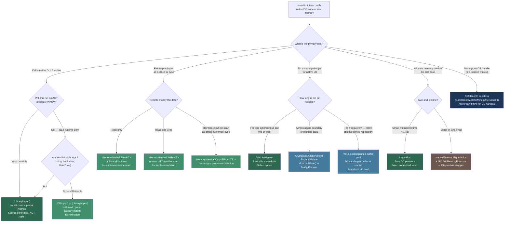

> [!success] Mastery Check
> - [ ] **Studied Well**
> - [ ] **Can explain the concept without notes**
> - [ ] **Can answer interview questions confidently**
> - [ ] **Can implement it in a real project**


## 📍 PART 0 — Navigation & Context

### Where This Topic Lives

```
C# Runtime Model
└── Memory & Interop
    ├── Value Types vs. Reference Types (2.01)        ← prerequisite
    ├── Spans, Memory, Zero-Copy (2.09)               ← prerequisite
    ├── GC Interaction and WeakReference (2.28)       ← prerequisite
    └── ► Unsafe Code and Interop (2.12)              ← YOU ARE HERE
```

### What You Need Before This

- **[[2.01 — Value Types vs. Reference Types]]** — you must understand struct layout and blittability before touching pointers; every interop type is a value type
- **[[2.09 — Spans, Memory, and Zero-Copy Patterns]]** — `Span<T>` is the safe wrapper over what this topic does unsafely; know the safe API before learning the mechanism beneath it
- **[[2.28 — GC Interaction and WeakReference]]** — pinning and `GCHandle` interact directly with GC generations and heap compaction; you cannot reason about their cost without this

### What This Unlocks After

- Writing platform-invocation wrappers for OS APIs (Windows, Linux, macOS system calls)
- Building high-performance binary protocol parsers using pointer arithmetic and `MemoryMarshal`
- Diagnosing GC heap fragmentation caused by long-lived pinned objects
- Understanding how `Span<T>`, `NativeMemory`, and `MemoryMarshal` work under the hood

### Why This Matters at Scale

Every .NET service that talks to the OS — file I/O, sockets, cryptography, hardware sensors, native image processing — goes through P/Invoke. Getting it wrong means memory corruption, silent data truncation, GC heap fragmentation from pinned memory, or resource leaks from incorrectly wrapped `SafeHandle` types. Getting it right means zero-overhead interop that outlives the third-party library version it wraps.

---

## 🧠 PART 1 — The Core Mental Model

### The Fundamental Rule

> **Unsafe code gives the C# programmer direct pointer access to memory, bypassing GC tracking. The price is that you are now responsible for every invariant the GC normally enforces: object lifetime, memory layout, pointer validity, and heap stability during compaction.**

Every concept in this topic is a consequence of that one tradeoff. `fixed` pins so the GC cannot compact. `GCHandle` pins across method boundaries. `SafeHandle` manages lifetime so you don't leak. `[StructLayout]` controls layout so the marshaler does not corrupt data. Understanding the tradeoff is the entire topic.

### The Plain-Language Analogy

Think of the GC as a professional moving company that rearranges your furniture (objects) to make the warehouse (heap) more efficient. Normally you trust them completely — they know where everything is and update every label (reference). Unsafe code is like bolting a piece of furniture to the floor before the movers arrive: the `fixed` statement is the bolt, and the movers (GC) are forbidden from touching that object while the bolt is in. The movers can still rearrange everything else, but now they have an obstacle — too many bolted items fragment the warehouse. `GCHandle.Alloc(obj, GCHandleType.Pinned)` is a bolt you install yourself and must remember to remove (`Free()`). `SafeHandle` is a bolt that automatically removes itself when no one holds a key to the room anymore. `IntPtr` is a raw address written on a sticky note — valid only as long as the furniture hasn't moved.

This analogy holds for the critical edge case: the moment the `fixed` block exits, the bolt is removed and the movers can compact. Any pointer you saved from inside that block is now dangling — the furniture may have moved.

### The Taxonomy Diagram

```mermaid
graph TD
    A["Unsafe Code and Interop"] --> B["Pointer Access\n(unsafe keyword)"]
    A --> C["Pinning"]
    A --> D["Platform Invocation\n(P/Invoke)"]
    A --> E["Struct Layout Control"]
    A --> F["MemoryMarshal\n(managed unsafe)"]
    A --> G["Native Memory\nAllocation"]

    B --> B1["pointer types: T*, void*"]
    B --> B2["pointer arithmetic\n(T* + n, T*[n])"]
    B --> B3["stackalloc\n(stack allocation)"]
    B --> B4["sizeof(T)\n(compile-time for blittable)"]
    B --> B5["fixed statement\n(pins managed object)"]

    C --> C1["fixed statement\n(lexical scope)"]
    C --> C2["GCHandle.Alloc\n(GCHandleType.Pinned)\n(explicit lifetime)"]
    C --> C3["GCHandle.Alloc\n(GCHandleType.Normal)\n(prevent collection, no pin)"]
    C --> C4["GCHandle.Alloc\n(GCHandleType.Weak)\n(allow collection)"]

    D --> D1["[DllImport] — legacy\n(runtime marshaling)"]
    D --> D2["[LibraryImport] — modern\n(source-generated, AOT-safe)"]
    D --> D3["SafeHandle\n(lifecycle management)"]
    D --> D4["Marshaling attributes\n([MarshalAs], [In], [Out])"]
    D --> D5["Calling conventions\n(Cdecl, StdCall, SysV, etc.)"]

    E --> E1["LayoutKind.Sequential\n(fields in declaration order)"]
    E --> E2["LayoutKind.Explicit\n(manual field offsets)"]
    E --> E3["LayoutKind.Auto\n(CLR can reorder — NOT for interop)"]
    E --> E4["Pack: int\n(alignment boundary)"]
    E --> E5["Charset: CharSet\n(string encoding in structs)"]

    F --> F1["MemoryMarshal.Read&lt;T&gt;\n(reinterpret bytes as T)"]
    F --> F2["MemoryMarshal.Cast&lt;TFrom,TTo&gt;\n(reinterpret span element type)"]
    F --> F3["MemoryMarshal.AsRef&lt;T&gt;\n(ref to first element)"]
    F --> F4["MemoryMarshal.GetReference\n(ref without bounds check)"]

    G --> G1["NativeMemory.Alloc\n(.NET 6+, malloc equivalent)"]
    G --> G2["NativeMemory.AlignedAlloc\n(SIMD-aligned memory)"]
    G --> G3["Marshal.AllocHGlobal\n(legacy, HeapAlloc)"]
    G --> G4["GC.AddMemoryPressure\n(inform GC of native allocation)"]

    style A fill:#1d3557,color:#fff
    style B fill:#2d6a4f,color:#fff
    style C fill:#457b9d,color:#fff
    style D fill:#6c584c,color:#fff
    style E fill:#40916c,color:#fff
    style F fill:#2d6a4f,color:#fff
    style G fill:#457b9d,color:#fff
```



> [!WARNING] `unsafe` is a Project-Level Opt-In
> Unsafe code requires `<AllowUnsafeBlocks>true</AllowUnsafeBlocks>` in the `.csproj`. The compiler enforces this so that codebases without a deliberate interop need stay protected. Every `unsafe` method is a contract with the reader: "I am bypassing safety guarantees here, intentionally."

---

## 🔬 PART 2 — Deep Mechanics

### 2.1 Blittable vs Non-Blittable Types — The Foundation of Marshaling

Interop works because some types have identical memory layouts in both managed (.NET) and native (C/C++) worlds. These are called **blittable** types. The marshaler can pass a pointer to the managed memory directly — zero copying, zero conversion.

Non-blittable types require the marshaler to allocate a native buffer and convert. This is where P/Invoke gets expensive.

```
BLITTABLE TYPES — safe to pass by pointer, zero copy:
┌──────────────────────────────────────────────────────────────┐
│  byte, sbyte, short, ushort, int, uint, long, ulong          │
│  float, double                                               │
│  IntPtr, UIntPtr                                             │
│  One-dimensional arrays of blittable types                   │
│  Structs containing only blittable fields                    │
│  (with LayoutKind.Sequential or LayoutKind.Explicit)         │
└──────────────────────────────────────────────────────────────┘

NON-BLITTABLE TYPES — require marshaling (copying + conversion):
┌──────────────────────────────────────────────────────────────┐
│  bool     — managed: 1 byte (0/1); native: 4-byte BOOL       │
│  char     — managed: UTF-16 2 bytes; native: often 1-byte    │
│  string   — managed: object on heap; native: char* or wchar* │
│  object   — managed: heap object; no native equivalent        │
│  decimal  — no C equivalent (96-bit BCD + flags)             │
│  DateTime — no C equivalent (100ns ticks since 1601)         │
│  bool[]   — array of non-blittable bool                      │
│  string[] — array of pointers on native side                 │
└──────────────────────────────────────────────────────────────┘

MARSHALING COST TABLE:
  Blittable arg (by value):       ~0 extra ns (pointer to stack copy)
  Blittable arg (by ref/pointer): ~0 extra ns (pass pointer directly)
  Non-blittable string (ANSI):    ~200-500 ns (alloc native buffer, WideCharToMultiByte)
  Non-blittable string (Unicode): ~50-100 ns (alloc native buffer, memcpy)
  Non-blittable bool:             ~10 ns (int→byte conversion)
  Large non-blittable struct:     O(fields) — each non-blittable field converted
```

> [!TIP] How to Test Blittability
> `GCHandle.Alloc(obj, GCHandleType.Pinned)` throws `ArgumentException` for non-blittable types. If you can pin it, it's blittable. This is also why you cannot pin a `bool[]` but you can pin an `int[]`.

### 2.2 The `fixed` Statement — Pinning with Lexical Scope

`fixed` is the safest pinning mechanism: it pins for exactly the duration of its block and the compiler enforces this.

```csharp
// What happens at the IL level when you write fixed():
//
// C#:
// fixed (byte* ptr = &buffer[0]) { Use(ptr); }
//
// IL (approximately):
//   pin managed byte& pinned ptr_pinned = &buffer[0];  // marks ref as pinned
//   byte* ptr = (byte*)ptr_pinned;
//   Use(ptr);
//   ptr_pinned = null;  // unpin: removes from pinned set
//
// The JIT tells the GC: "object at this address is pinned until null assignment"
// The GC tracks all pinned references in the "pinned handles table"
// During compaction, the GC skips pinned objects — it cannot move them

unsafe void EncryptBlock(byte[] plaintext, byte[] key, byte[] ciphertext)
{
    // fixed pins the array HEADER OBJECT, not just the data.
    // The entire array object cannot move for the duration of the block.
    // Cost: ~5-15 ns overhead for pin/unpin registration.
    fixed (byte* pPlain  = plaintext,
                 pKey    = key,
                 pCipher = ciphertext)
    {
        // Native AES routine — takes raw pointers
        NativeCrypto.AesEncryptBlock(pPlain, pKey, pCipher, plaintext.Length);
    }
    // All three arrays unpinned here. GC can compact them on next collection.
}
```

```
MEMORY PICTURE during fixed():

Managed Heap (before compaction):
┌───────────────────────────────────────────────────────────┐
│ [ObjA free] [plaintext ●PINNED] [ObjB free] [key ●PINNED]│
│             ↑                               ↑             │
│             ptr (fixed)                     pKey (fixed)  │
└───────────────────────────────────────────────────────────┘

GC wants to compact but cannot move PINNED objects.
Result: heap fragmentation if many objects are pinned simultaneously.

After fixed() exits (all unpinned):
┌───────────────────────────────────────────────────────────┐
│ [ObjA] [plaintext] [ObjB] [key]  ← GC can now compact    │
└───────────────────────────────────────────────────────────┘
```

**Edge case that bites engineers:** Pinning inside a hot loop that also triggers Gen0 GC collections. Each collection must work around the pinned objects, fragmenting the heap. Over time, LOH-like fragmentation appears in Gen0/Gen1. The fix: pin once outside the loop, not per-iteration.

### 2.3 `GCHandle` — Pinning Across Method Boundaries

`fixed` only works within a lexical scope. When you need a pin to outlive a method call — for example, passing a managed buffer to a native async operation — you need `GCHandle`.

```csharp
// Pattern: pin a buffer for the lifetime of a native async I/O operation

public sealed class NativeAsyncReader : IDisposable
{
    private readonly byte[]   _buffer;
    private          GCHandle _pin;
    private          bool     _disposed;

    public NativeAsyncReader(int bufferSize)
    {
        _buffer = new byte[bufferSize];
        // GCHandleType.Pinned: buffer cannot move, and GetAddrOfPinnedObject()
        // gives us a stable IntPtr to pass to native code.
        // Cost: one entry in the GC's pinned handles table (~100 ns to acquire).
        _pin = GCHandle.Alloc(_buffer, GCHandleType.Pinned);
    }

    public IntPtr BufferPointer => _pin.AddrOfPinnedObject();
    public int    BufferLength  => _buffer.Length;

    // The native library calls our callback when I/O completes
    public void OnNativeComplete(int bytesRead)
    {
        // Safe: the buffer is still pinned, the IntPtr is still valid
        ProcessBytes(_buffer, 0, bytesRead);
    }

    public void Dispose()
    {
        if (!_disposed)
        {
            _disposed = true;
            if (_pin.IsAllocated)
                _pin.Free(); // CRITICAL: must call Free() or the handle leaks
                             // Leaked GCHandle = object never collected, heap grows forever
        }
    }
}
```

```
GCHandle Types — Cost vs. Capability:
┌────────────────────┬──────────────────────────────────────────────────┐
│ GCHandleType       │ Behavior                                         │
├────────────────────┼──────────────────────────────────────────────────┤
│ Normal             │ Prevents collection. Does NOT pin (GC can move). │
│                    │ Use when native code holds a managed callback     │
│                    │ reference. ~50 ns alloc, ~30 ns free.            │
├────────────────────┼──────────────────────────────────────────────────┤
│ Pinned             │ Prevents collection AND movement.                │
│                    │ GC must avoid compacting it. Use for byte[]      │
│                    │ passed to native I/O. ~100 ns alloc.             │
│                    │ ⚠️ Fragments heap if held long-term.             │
├────────────────────┼──────────────────────────────────────────────────┤
│ Weak               │ Allows collection. Target becomes null when      │
│                    │ collected. For weak caches. ~50 ns alloc.        │
├────────────────────┼──────────────────────────────────────────────────┤
│ WeakTrackResurrect │ Like Weak but target stays alive through         │
│                    │ finalization (survives one extra GC cycle).      │
└────────────────────┴──────────────────────────────────────────────────┘
```

> [!DANGER] GCHandle Leak = Silent Memory Leak
> A `GCHandle` that is never `Free()`'d keeps the target object alive indefinitely. The GC cannot collect it. In a service that creates handles for every inbound request, this is a memory leak that grows linearly with request count. `GCHandle` must always be freed in a `finally` block or `Dispose()` — never rely on a finalizer, because `GCHandle` is a value type and has no finalizer.

### 2.4 P/Invoke — `[DllImport]` vs `[LibraryImport]`

`[DllImport]` is the traditional P/Invoke attribute. `[LibraryImport]` (introduced in .NET 7) is source-generated, AOT-compatible, and avoids runtime marshaling overhead for many types.

```csharp
// ── LEGACY: [DllImport] ──────────────────────────────────────────────
// Runtime marshaling: the CLR reads the attribute at first call,
// generates marshaling stubs dynamically using reflection.
// NOT AOT-compatible. Marshaling cost visible only at runtime.

[DllImport("kernel32.dll", SetLastError = true, CharSet = CharSet.Unicode)]
private static extern bool CreateDirectory(string lpPathName, IntPtr lpSecurityAttributes);

// ── MODERN: [LibraryImport] ──────────────────────────────────────────
// Source generator produces the marshaling code at compile time.
// AOT-compatible. Marshaling code is inspectable, debuggable.
// Requires: partial method + partial class.

public static partial class NativeFileApi
{
    // The source generator sees this declaration and emits the full
    // marshaling wrapper as a partial method implementation.
    // You can inspect the generated code in obj/Debug/generated/...
    [LibraryImport("kernel32.dll", SetLastError = true, StringMarshalling = StringMarshalling.Utf16)]
    [return: MarshalAs(UnmanagedType.Bool)]
    public static partial bool CreateDirectory(
        string lpPathName,
        IntPtr lpSecurityAttributes);
}

// ── What the source generator produces (approximately) ───────────────
// partial bool CreateDirectory(string lpPathName, IntPtr lpSecurityAttributes)
// {
//     fixed (char* __lpPathName_native = lpPathName)   // pin string data
//     {
//         bool __retVal = __PInvoke(__lpPathName_native, lpSecurityAttributes);
//         // Marshal.GetLastPInvokeError() captured here if SetLastError=true
//         return __retVal;
//     }
//     [DllImport("kernel32.dll", EntryPoint = "CreateDirectoryW", ...)]
//     static extern bool __PInvoke(char*, IntPtr);
// }
```

**Cost comparison:**

```
[DllImport] first call:
  ~500-2000 ns — JIT + reflection to build marshaling stub

[DllImport] subsequent calls (string arg):
  ~200-400 ns — stub already JIT'd, but string still marshaled at runtime

[LibraryImport] first call:
  ~50-150 ns — no JIT stub needed, source-generated code already compiled

[LibraryImport] subsequent calls (blittable args):
  ~10-50 ns — direct P/Invoke with no marshaling overhead

Baseline: a raw C function call across the P/Invoke boundary (blittable types):
  ~10-30 ns — the unavoidable overhead of mode switch + stack frame setup
```

### 2.5 `SafeHandle` — The Correct Way to Manage OS Handles

A raw `IntPtr` for an OS handle leaks if an exception fires before `CloseHandle()`. `SafeHandle` wraps the handle lifetime with `IDisposable` + finalization, so the handle is always released.

```csharp
// ⚠️ WRONG: Raw IntPtr — leaks on exception
[DllImport("kernel32.dll", SetLastError = true)]
static extern IntPtr CreateFile(string lpFileName, uint dwDesiredAccess,
    uint dwShareMode, IntPtr lpSecurityAttributes, uint dwCreationDisposition,
    uint dwFlagsAndAttributes, IntPtr hTemplateFile);

[DllImport("kernel32.dll", SetLastError = true)]
static extern bool CloseHandle(IntPtr hObject);

void ProcessFileBad(string path)
{
    IntPtr handle = CreateFile(path, 0x80000000, 0, IntPtr.Zero, 3, 0, IntPtr.Zero);
    // If an exception fires here → CloseHandle is never called → OS handle leak
    DoWork(handle);
    CloseHandle(handle);
}

// ✅ CORRECT: Derive from SafeHandleZeroOrMinusOneIsInvalid
// Handles the two most common "invalid" sentinel values: 0 and -1
public sealed class SafeFileHandle : SafeHandleZeroOrMinusOneIsInvalid
{
    // Private constructor for P/Invoke marshaler to call
    private SafeFileHandle() : base(ownsHandle: true) { }

    // The marshaler calls this — we don't call CloseHandle manually.
    // The base class finalizer calls ReleaseHandle() if Dispose() was never called.
    // This is the safety net for exceptional paths.
    protected override bool ReleaseHandle()
    {
        return CloseHandle(handle); // 'handle' is the protected IntPtr in the base class
    }

    [DllImport("kernel32.dll", SetLastError = true)]
    private static extern bool CloseHandle(IntPtr hObject);
}

// Updated P/Invoke: return SafeFileHandle instead of IntPtr
// The runtime knows SafeFileHandle is a handle type and marshals correctly
[LibraryImport("kernel32.dll", SetLastError = true, StringMarshalling = StringMarshalling.Utf16)]
static partial SafeFileHandle CreateFile(
    string lpFileName, uint dwDesiredAccess,
    uint dwShareMode, IntPtr lpSecurityAttributes,
    uint dwCreationDisposition, uint dwFlagsAndAttributes,
    IntPtr hTemplateFile);

void ProcessFileCorrect(string path)
{
    using SafeFileHandle handle = CreateFile(path, 0x80000000, 0,
        IntPtr.Zero, 3, 0, IntPtr.Zero);

    if (handle.IsInvalid)
        throw new Win32Exception(Marshal.GetLastPInvokeError());

    DoWork(handle);
    // handle.Dispose() called here by 'using' — CloseHandle called exactly once
}
```

**Cost:** `SafeHandle` adds a critical section on `DangerousAddRef`/`DangerousRelease` to handle the race between a thread using the handle and another thread disposing it. Cost: ~20-30 ns per `DangerousAddRef` call. The base class finalizer runs on the finalizer thread if `Dispose()` was never called — a 40-80 ms delay before the OS handle is released.

### 2.6 `MemoryMarshal` — Managed Unsafe Operations

`MemoryMarshal` provides safe-ish reinterpretation of memory without the `unsafe` keyword. It is the tool for high-performance binary protocol parsing.

```csharp
// Binary packet parsing: network protocol frame
// Frame layout: [magic:4][version:1][payloadLen:4][payload:N]
// All in big-endian (network byte order)

public static class PacketParser
{
    private const uint MagicBytes = 0xDEADBEEF;

    // MemoryMarshal.Read<T>: reinterpret the first sizeof(T) bytes of the span as T.
    // Zero allocation. Zero copy. O(1).
    // Constraint: T must be blittable (the compiler enforces this at call site).
    public static bool TryParseHeader(
        ReadOnlySpan<byte> data,
        out uint magic,
        out byte version,
        out int payloadLength)
    {
        magic = 0; version = 0; payloadLength = 0;

        if (data.Length < 9) return false; // 4 + 1 + 4 = minimum header size

        // Read the magic uint directly from the first 4 bytes.
        // No allocation, no copy — just a reinterpret of 4 bytes as uint.
        // ⚠️ Host is little-endian; network is big-endian — must reverse.
        magic = BinaryPrimitives.ReadUInt32BigEndian(data);

        version = data[4]; // single byte — no endian issue

        // Read int from bytes 5-8
        payloadLength = BinaryPrimitives.ReadInt32BigEndian(data[5..]);

        return magic == MagicBytes && payloadLength >= 0;
    }

    // MemoryMarshal.Cast<TFrom, TTo>: reinterpret a span of one type as a span of another.
    // Classic use: treat byte[] as int[] for bulk integer processing.
    // Constraint: sizeof(TTo) must divide evenly into the span length.
    public static ReadOnlySpan<int> AsInt32Span(ReadOnlySpan<byte> bytes)
    {
        // Zero allocation, zero copy.
        // ⚠️ Alignment not guaranteed — on some architectures (ARM) unaligned int reads fault.
        // Safe on x64 where unaligned loads are hardware-supported.
        return MemoryMarshal.Cast<byte, int>(bytes);
    }

    // MemoryMarshal.AsRef<T>: get a ref to the first element of the span, reinterpreted as T.
    // Used for writing structs directly into byte buffers.
    [StructLayout(LayoutKind.Sequential, Pack = 1)]
    public struct PacketHeader
    {
        public uint Magic;
        public byte Version;
        public int  PayloadLength;
    }

    public static ref PacketHeader GetHeaderRef(Span<byte> buffer)
    {
        // Returns a managed reference to the header struct embedded in the byte buffer.
        // Mutating the returned ref mutates the bytes in the buffer directly.
        // Zero allocation, zero copy.
        if (buffer.Length < 9)
            throw new ArgumentException("Buffer too small for packet header");
        return ref MemoryMarshal.AsRef<PacketHeader>(buffer);
    }
}
```

> [!WARNING] `MemoryMarshal` and Alignment
> On x64 (Intel/AMD), unaligned reads are handled in hardware with a small penalty (~1-3 ns). On ARM64 (Apple Silicon, AWS Graviton, mobile), unaligned reads of types larger than 1 byte can cause a bus error (SIGBUS) or be silently slow depending on the OS configuration. If your service runs on ARM, ensure `MemoryMarshal.Cast` results are only accessed through `BinaryPrimitives` (which handles alignment) rather than direct index access on the recast span.

---

## 💻 PART 3 — Production Code Patterns

### 3.1 The Zero-Copy Binary Protocol Parser

Parsing a binary network protocol (financial FIX-like frame) without allocating a single object per message. Used in high-frequency trading systems and IoT telemetry ingestion.

```csharp
// Frame layout (little-endian):
// [frameType:1][sequenceNum:8][timestamp:8][bodyLen:4][body:N][checksum:4]

[StructLayout(LayoutKind.Sequential, Pack = 1)]
public readonly struct FrameHeader
{
    public readonly byte   FrameType;
    public readonly long   SequenceNumber;
    public readonly long   TimestampUtcTicks;
    public readonly int    BodyLength;
}

public static class TelemetryFrameParser
{
    private static readonly int HeaderSize = Marshal.SizeOf<FrameHeader>(); // 21 bytes

    // Returns false if data is too short or checksum fails.
    // Zero allocation: ReadOnlySpan<byte> does not allocate.
    // Zero copy: MemoryMarshal.AsRef reinterprets bytes in-place.
    public static bool TryParse(
        ReadOnlySpan<byte> data,
        out FrameHeader header,
        out ReadOnlySpan<byte> body)
    {
        header = default;
        body   = default;

        if (data.Length < HeaderSize + 4) return false; // header + min checksum

        // Reinterpret first 21 bytes as FrameHeader struct — zero copy, zero alloc.
        // MemoryMarshal.Read<T> creates a copy of the T from the span bytes.
        // Use this (not AsRef) on ReadOnlySpan to avoid unsafe mutation.
        header = MemoryMarshal.Read<FrameHeader>(data);

        int totalExpected = HeaderSize + header.BodyLength + 4;
        if (data.Length < totalExpected) return false;

        body = data.Slice(HeaderSize, header.BodyLength);

        // Validate checksum (last 4 bytes after body)
        uint expectedChecksum = MemoryMarshal.Read<uint>(data.Slice(HeaderSize + header.BodyLength));
        uint actualChecksum   = ComputeChecksum(data[..^4]);

        return expectedChecksum == actualChecksum;
    }

    private static uint ComputeChecksum(ReadOnlySpan<byte> data)
    {
        // FNV-1a over the data — zero allocation, span-based
        uint hash = 2166136261u;
        foreach (byte b in data)
            hash = (hash ^ b) * 16777619u;
        return hash;
    }
}
```

### 3.2 The `[LibraryImport]` Wrapper for a Native Library

Wrapping a native image processing library for a document scanning service. Shows the complete pattern: `[LibraryImport]`, struct layout, `SafeHandle`, and error handling.

```csharp
// Native library API (C header, hypothetical):
// HANDLE ImageLib_Open(const wchar_t* path, int flags);
// int    ImageLib_GetDimensions(HANDLE h, int* width, int* height);
// int    ImageLib_Close(HANDLE h);
// Error codes: 0 = success, negative = error

public sealed class ImageLibHandle : SafeHandleZeroOrMinusOneIsInvalid
{
    private ImageLibHandle() : base(ownsHandle: true) { }

    protected override bool ReleaseHandle()
    {
        // Return value ignored in ReleaseHandle — always try to close
        NativeImageLib.ImageLib_Close(handle);
        return true;
    }
}

public static partial class NativeImageLib
{
    private const string LibName = "imagelib"; // resolves to imagelib.dll / libimagelib.so

    [LibraryImport(LibName, StringMarshalling = StringMarshalling.Utf16)]
    internal static partial ImageLibHandle ImageLib_Open(string path, int flags);

    // Blittable args (int*): no marshaling needed — pointer passed directly.
    // [Out] tells the source generator to marshal the output back after the call.
    [LibraryImport(LibName)]
    internal static partial int ImageLib_GetDimensions(
        ImageLibHandle handle,
        out int width,
        out int height);

    // Called by SafeHandle.ReleaseHandle — must accept raw IntPtr, not SafeHandle
    // (the handle is already being destroyed; we cannot use the SafeHandle wrapper)
    [LibraryImport(LibName)]
    internal static partial int ImageLib_Close(IntPtr handle);
}

public sealed class ImageDocument : IDisposable
{
    private readonly ImageLibHandle _handle;
    public int Width  { get; }
    public int Height { get; }

    public ImageDocument(string filePath)
    {
        // ImageLib_Open returns SafeHandle — runtime handles lifecycle from here
        _handle = NativeImageLib.ImageLib_Open(filePath, flags: 0);

        if (_handle.IsInvalid)
            throw new IOException($"Failed to open image: {filePath}. " +
                $"Error: {Marshal.GetLastPInvokeError()}");

        int result = NativeImageLib.ImageLib_GetDimensions(_handle, out int w, out int h);
        if (result != 0)
            throw new IOException($"Failed to read dimensions. Native error: {result}");

        Width  = w;
        Height = h;
    }

    public void Dispose() => _handle.Dispose();
}
```

### 3.3 The Pinned Buffer Pool

Avoiding repeated pin/unpin overhead for high-frequency native I/O by maintaining a pool of pre-pinned buffers. Used in a network socket server processing thousands of connections.

```csharp
// ⚠️ WRONG: Pin a new buffer on every receive call
// 10,000 connections × 1,000 receives/sec = 10M pin operations/sec
// Each pin/unpin: ~100 ns → 1 second wasted on pinning alone
async Task ReceiveBadly(Socket socket)
{
    while (true)
    {
        byte[] buffer = new byte[4096]; // new allocation per call
        fixed (byte* p = buffer)        // pin per call
        {
            int received = await socket.ReceiveAsync(new ArraySegment<byte>(buffer));
            Process(buffer, received);
        } // unpin per call
    }
}

// ✅ CORRECT: Pre-pin a pool of buffers at startup
public sealed class PinnedBufferPool : IDisposable
{
    private readonly byte[][]    _buffers;
    private readonly GCHandle[]  _handles;
    private readonly IntPtr[]    _pointers;
    private readonly ConcurrentBag<int> _available;

    public PinnedBufferPool(int bufferCount, int bufferSize)
    {
        _buffers   = new byte[bufferCount][];
        _handles   = new GCHandle[bufferCount];
        _pointers  = new IntPtr[bufferCount];
        _available = new ConcurrentBag<int>();

        for (int i = 0; i < bufferCount; i++)
        {
            _buffers[i]  = new byte[bufferSize];
            _handles[i]  = GCHandle.Alloc(_buffers[i], GCHandleType.Pinned);
            _pointers[i] = _handles[i].AddrOfPinnedObject();
            _available.Add(i);
        }
    }

    // O(1) — ConcurrentBag.TryTake: ~30 ns
    public bool TryRent(out int slot, out byte[] buffer, out IntPtr nativePointer)
    {
        if (_available.TryTake(out slot))
        {
            buffer        = _buffers[slot];
            nativePointer = _pointers[slot];
            return true;
        }
        buffer        = Array.Empty<byte>();
        nativePointer = IntPtr.Zero;
        return false;
    }

    // O(1) — ConcurrentBag.Add: ~20 ns
    public void Return(int slot) => _available.Add(slot);

    public void Dispose()
    {
        foreach (var handle in _handles)
            if (handle.IsAllocated)
                handle.Free(); // unpin all at shutdown
    }
}
```

### 3.4 `NativeMemory` — Allocating Outside the GC Heap

When you need memory that the GC never sees — for large image buffers, SIMD-aligned compute buffers, or long-lived native interop buffers.

```csharp
// .NET 6+ NativeMemory: wraps malloc/free from the C runtime.
// The GC never sees this memory — it cannot be compacted, collected, or tracked.
// YOU are responsible for Free()ing it. Always wrap in IDisposable.

public sealed unsafe class AlignedFloatBuffer : IDisposable
{
    private float* _ptr;
    private readonly int _length;
    private bool _disposed;

    public AlignedFloatBuffer(int length, int alignment = 64) // 64-byte = AVX-512 alignment
    {
        _length = length;
        // AlignedAlloc: alignment must be power of 2, size multiple of alignment.
        _ptr = (float*)NativeMemory.AlignedAlloc(
            byteCount: (nuint)(length * sizeof(float)),
            alignment: (nuint)alignment);

        if (_ptr == null)
            throw new OutOfMemoryException($"Failed to allocate {length * 4} bytes aligned to {alignment}");

        // Inform the GC that we've allocated native memory it can't see.
        // This prevents the GC from being too aggressive about delaying collections
        // when the managed heap looks small but native memory is huge.
        GC.AddMemoryPressure(length * sizeof(float));
    }

    // Span<float> over the native memory — safe access without the unsafe keyword at callsite
    public Span<float> AsSpan() => new Span<float>(_ptr, _length);

    public void Dispose()
    {
        if (!_disposed)
        {
            _disposed = true;
            NativeMemory.AlignedFree(_ptr);
            GC.RemoveMemoryPressure(_length * sizeof(float));
            _ptr = null;
        }
    }
}

// Usage in a neural network inference engine:
void RunInference(float[] inputData)
{
    using var inputBuffer  = new AlignedFloatBuffer(inputData.Length);
    using var outputBuffer = new AlignedFloatBuffer(1000); // 1000 classes

    inputData.AsSpan().CopyTo(inputBuffer.AsSpan());

    // Pass aligned native pointers to CUDA or MKL
    NativeInference.Forward(
        (IntPtr)Unsafe.AsPointer(ref inputBuffer.AsSpan()[0]),
        (IntPtr)Unsafe.AsPointer(ref outputBuffer.AsSpan()[0]),
        inputData.Length);

    // Read results back through Span — no copy needed
    ReadOnlySpan<float> scores = outputBuffer.AsSpan();
    int bestClass = IndexOfMax(scores);
}
```

### 3.5 Struct Layout for Interop — Matching Native ABI

Structurally incorrect interop structs silently corrupt data. This is a common source of bugs in payment terminal integrations and hardware driver interfaces.

```csharp
// Native C struct (Windows, x64):
// typedef struct _PAYMENT_RESULT {
//     DWORD    statusCode;      // 4 bytes, offset 0
//     BOOL     approved;        // 4 bytes (Windows BOOL = int), offset 4
//     char     authCode[8];     // 8 bytes, offset 8
//     double   amount;          // 8 bytes, offset 16 (aligned to 8)
//     FILETIME timestamp;       // 8 bytes, offset 24
// } PAYMENT_RESULT;             // Total: 32 bytes

// ⚠️ WRONG: Missing LayoutKind.Sequential and Pack — CLR may reorder or pad differently
public struct PaymentResultBad
{
    public uint   StatusCode;
    public bool   Approved;    // C# bool = 1 byte; native BOOL = 4 bytes — SIZE MISMATCH!
    // authCode missing entirely — memory read will be offset by 3 bytes for all subsequent fields
    public double Amount;
    public long   Timestamp;
}

// ✅ CORRECT: Explicit layout matching native ABI exactly
[StructLayout(LayoutKind.Sequential, Pack = 8, CharSet = CharSet.Ansi)]
public struct PaymentResult
{
    public uint StatusCode;              // offset 0,  size 4

    [MarshalAs(UnmanagedType.Bool)]      // maps C# bool → Windows 4-byte BOOL
    public bool Approved;                // offset 4,  size 4

    [MarshalAs(UnmanagedType.ByValTStr, SizeConst = 8)]
    public string AuthCode;              // offset 8,  size 8 (fixed-length char array)

    public double Amount;                // offset 16, size 8

    public long TimestampFiletime;       // offset 24, size 8 (FILETIME is two DWORDs = int64)
}

// Verify the layout at test time — not at production crash time:
// Debug.Assert(Marshal.SizeOf<PaymentResult>() == 32);
// Debug.Assert(Marshal.OffsetOf<PaymentResult>(nameof(PaymentResult.Amount)) == (IntPtr)16);
```

### 3.6 Pointer Arithmetic and `stackalloc` for Hot-Path Buffers

When you need a temporary scratch buffer in a hot path and the buffer is small enough to fit on the stack, `stackalloc` eliminates the heap allocation entirely.

```csharp
// Used in a high-frequency order matching engine for temporary price normalization

unsafe void NormalizePrices(ReadOnlySpan<double> rawPrices, Span<double> normalizedPrices)
{
    if (rawPrices.Length != normalizedPrices.Length)
        throw new ArgumentException("Spans must have equal length");

    int n = rawPrices.Length;

    // stackalloc: allocates on the stack, NOT the heap.
    // Zero GC pressure. Freed when method returns.
    // Limit: keep under ~1KB to avoid stack overflow risk.
    // n <= 64 doubles (512 bytes) is a reasonable limit.
    if (n > 64) throw new ArgumentException($"Too many prices for stack buffer: {n}");

    // Span<double> over the stackalloc'd memory — safe access from here on
    Span<double> tempBuffer = stackalloc double[n];

    // Pointer arithmetic for the inner loop — avoids bounds-check overhead
    fixed (double* pRaw = rawPrices, pNorm = normalizedPrices)
    fixed (double* pTemp = tempBuffer)
    {
        // Pass 1: compute sum using pointer arithmetic (no bounds checks)
        double sum = 0;
        double* p = pRaw;
        double* end = pRaw + n;
        while (p < end) sum += *p++;

        double mean = sum / n;

        // Pass 2: center the data
        p = pRaw;
        double* t = pTemp;
        while (p < end) *t++ = *p++ - mean;

        // Pass 3: compute std dev
        double variance = 0;
        t = pTemp;
        double* tEnd = pTemp + n;
        while (t < tEnd) { double d = *t++; variance += d * d; }
        double stdDev = Math.Sqrt(variance / n);

        // Pass 4: normalize into output
        t = pTemp;
        double* pOut = pNorm;
        while (t < tEnd) *pOut++ = *t++ / stdDev;
    }
}
```

### 3.7 `GC.AddMemoryPressure` — Signaling Native Allocations to the GC

When your managed code holds references to large native buffers the GC cannot see, the GC may decide collections are unnecessary — because from its perspective, the managed heap looks small. This defers the finalization/disposal of your native buffers, causing native OOM.

```csharp
// Pattern used in a medical imaging service loading large DICOM files into native memory

public sealed class DicomNativeBuffer : IDisposable
{
    private readonly IntPtr _nativePtr;
    private readonly long   _byteCount;
    private bool _disposed;

    public DicomNativeBuffer(long byteCount)
    {
        _byteCount  = byteCount;
        _nativePtr  = Marshal.AllocHGlobal(new IntPtr(byteCount));

        if (_nativePtr == IntPtr.Zero)
            throw new OutOfMemoryException($"Failed to allocate {byteCount:N0} native bytes");

        // Tell the GC: "I've allocated N bytes of memory you can't see."
        // Effect: the GC factors this into its collection threshold decisions.
        // If managed heap is 50 MB but native is 2 GB, without this call,
        // the GC may never trigger — allowing native OOM.
        GC.AddMemoryPressure(byteCount);
    }

    public IntPtr Pointer => _nativePtr;

    public void Dispose()
    {
        if (!_disposed)
        {
            _disposed = true;
            Marshal.FreeHGlobal(_nativePtr);
            // Always pair with RemoveMemoryPressure — failing to do so
            // causes the GC to collect aggressively even after the memory is freed,
            // degrading performance with unnecessary Gen2 collections.
            GC.RemoveMemoryPressure(_byteCount);
        }
    }
}
```

---

## ⚠️ PART 4 — Gotchas & Anti-Patterns

### Gotcha 1: The Dangling Pointer After `fixed` Exits

Engineers save a pointer from inside a `fixed` block and use it outside the block. The compiler does not prevent this in all cases (especially when the pointer is stored in a local and used after the block). After the `fixed` block, the GC is free to compact the heap, and the pointer is now dangling.

```csharp
// ⚠️ WRONG: Pointer escapes the fixed block
unsafe byte* GetDanglingPointer(byte[] buffer)
{
    byte* ptr;
    fixed (byte* p = buffer)
    {
        ptr = p;  // saving the pointer...
    }
    // fixed block exited — buffer can be moved by GC at any time
    return ptr; // DANGLING pointer — undefined behavior
}

// Usage: reading from this pointer after a GC collection = data corruption or crash
byte* bad = GetDanglingPointer(myBuffer);
GC.Collect(); // moves myBuffer
byte value = *bad; // reads garbage or crashes

// ✅ CORRECT: All pointer usage must happen INSIDE the fixed block
unsafe void ProcessBuffer(byte[] buffer, Action<IntPtr, int> nativeConsumer)
{
    fixed (byte* p = buffer)
    {
        // The native consumer runs synchronously inside the fixed block.
        // The pointer is valid for the entire duration of this call.
        nativeConsumer((IntPtr)p, buffer.Length);
    }
    // Pointer discarded here — no escape possible
}

// WHY: The fixed statement registers the object in the GC's pinned-handles set.
// When the fixed block exits, the pin is removed. Any copy of the pointer made
// inside the block becomes invalid the moment the next GC compaction runs.
```

### Gotcha 2: `bool` Marshaling Mismatch Silently Corrupts Data

C# `bool` is 1 byte. Windows `BOOL` is 4 bytes (typedef int). Without `[MarshalAs(UnmanagedType.Bool)]`, the marshaler passes 1 byte where the native function reads 4. The next 3 bytes are from an adjacent field. This does not crash — it just silently returns garbage.

```csharp
// ⚠️ WRONG: bool without MarshalAs — Windows BOOL is int (4 bytes), not byte (1 byte)
[DllImport("kernel32.dll")]
static extern bool SetEvent(IntPtr hEvent);
// On x64: the return value register holds a full int. The CLR reads only 1 byte.
// If the high byte of the return int is non-zero, the C# bool may read 'true'
// when the native function returned a non-success value, or vice versa.

// ✅ CORRECT: Explicit MarshalAs for Windows BOOL return value
[LibraryImport("kernel32.dll")]
[return: MarshalAs(UnmanagedType.Bool)]
static partial bool SetEvent(SafeWaitHandle hEvent);

// ✅ ALSO CORRECT: Use int and check != 0 explicitly
[LibraryImport("kernel32.dll")]
static partial int SetEvent(SafeWaitHandle hEvent);
bool success = SetEvent(handle) != 0;

// WHY: [DllImport] with bool return value uses UnmanagedType.Bool (4-byte int) by default
// on the return value, but NOT on struct fields. So struct fields need explicit [MarshalAs].
// [LibraryImport] requires explicit annotation everywhere — no hidden defaults.
```

### Gotcha 3: Pinning an Array Element Instead of the Array

`GCHandle.Alloc` with a struct value type creates a copy on the heap and pins that copy. Modifications through the native pointer do NOT go back to the original array. Engineers expect in-place modification and get silent data loss.

```csharp
// ⚠️ WRONG: Pinning a struct element — pins a COPY, not the original
float[] prices = new float[] { 1.0f, 2.0f, 3.0f };
float element = prices[0]; // copy of the element

// This pins the COPY of the float, not prices[0] in the array
GCHandle handle = GCHandle.Alloc(element, GCHandleType.Pinned);
IntPtr ptr = handle.AddrOfPinnedObject();

// Native code writes through ptr — modifies the COPY, not prices[0]
NativeLib.ModifyInPlace(ptr, newValue: 99.0f);

Console.WriteLine(prices[0]); // Still 1.0f! The modification was to the copy.
handle.Free();

// ✅ CORRECT: Pin the ARRAY, then take a pointer to the element
GCHandle handle = GCHandle.Alloc(prices, GCHandleType.Pinned); // pin the array object
IntPtr basePtr  = handle.AddrOfPinnedObject(); // pointer to prices[0]
IntPtr elemPtr  = basePtr + 0 * sizeof(float); // pointer arithmetic to element 0

NativeLib.ModifyInPlace(elemPtr, newValue: 99.0f);

Console.WriteLine(prices[0]); // 99.0f — correct, modification went to the array

handle.Free();

// WHY: GCHandle.Alloc pins the object reference passed to it. float is a value type —
// passing a float to GCHandle.Alloc boxes it into a new heap object and pins THAT.
// To pin the array's contents, you must pin the array object itself and compute element offsets.
```

### Gotcha 4: `LayoutKind.Auto` on an Interop Struct

The CLR uses `LayoutKind.Auto` by default for classes and structs unless you specify otherwise. With `Auto`, the JIT is free to reorder fields for alignment efficiency. This is great for managed-only code but catastrophic for P/Invoke structs — the field order at runtime may not match the native struct, and you get silent data corruption that only manifests on specific .NET versions or architectures.

```csharp
// ⚠️ WRONG: No explicit layout — CLR may reorder fields
// This struct is passed to a native function. On .NET 8 x64 it might work by accident.
// On ARM64 or a different CLR version it silently corrupts.
public struct NativeTimestamp
{
    public int    Seconds;      // CLR might place this at offset 8 (after the long)
    public long   Nanoseconds;  // CLR might place this at offset 0
}

// ✅ CORRECT: Always declare LayoutKind.Sequential for interop structs
[StructLayout(LayoutKind.Sequential, Pack = 1)]
public struct NativeTimestamp
{
    public int  Seconds;        // offset 0, size 4
    public long Nanoseconds;    // offset 4, size 8 (Pack=1 disables alignment padding)
}

// Verify in test code:
// int size   = Marshal.SizeOf<NativeTimestamp>(); // must be 12
// IntPtr off = Marshal.OffsetOf<NativeTimestamp>(nameof(NativeTimestamp.Nanoseconds)); // must be 4

// WHY: LayoutKind.Auto is the default for most structs, but the CLR specification
// explicitly reserves the right to reorder fields under Auto. The JIT currently
// tends not to, but future CLR versions or AOT compilation may differ.
// LayoutKind.Sequential is a hard guarantee: fields are in declaration order.
```

### Gotcha 5: Not Calling `GC.AddMemoryPressure` for Large Native Allocations

The GC collects based on managed heap pressure. A service that allocates 4 GB of native memory through `Marshal.AllocHGlobal` or `NativeMemory.Alloc` while keeping managed memory small will never trigger GC collections — and therefore never finalize the wrappers that call `FreeHGlobal`. The process runs out of native memory while the managed heap shows 50 MB.

```csharp
// ⚠️ WRONG: No GC.AddMemoryPressure — GC is ignorant of native allocations
public class VideoFrameBuffer : IDisposable
{
    private readonly IntPtr _nativeBuffer;
    private readonly int    _size;

    public VideoFrameBuffer(int width, int height)
    {
        _size          = width * height * 4; // RGBA
        _nativeBuffer  = Marshal.AllocHGlobal(_size);
        // The GC sees zero bytes allocated. Even if there are 1000 of these
        // objects, each holding 8 MB native, the GC never feels pressure to collect.
    }

    ~VideoFrameBuffer() { Marshal.FreeHGlobal(_nativeBuffer); }
    public void Dispose() { Marshal.FreeHGlobal(_nativeBuffer); GC.SuppressFinalize(this); }
}

// ✅ CORRECT: Inform the GC of the native allocation
public class VideoFrameBuffer : IDisposable
{
    private readonly IntPtr _nativeBuffer;
    private readonly long   _size;
    private bool _disposed;

    public VideoFrameBuffer(int width, int height)
    {
        _size         = (long)width * height * 4;
        _nativeBuffer = Marshal.AllocHGlobal(new IntPtr(_size));
        GC.AddMemoryPressure(_size); // GC now knows about this allocation
    }

    public void Dispose()
    {
        if (!_disposed)
        {
            _disposed = true;
            Marshal.FreeHGlobal(_nativeBuffer);
            GC.RemoveMemoryPressure(_size);
            GC.SuppressFinalize(this);
        }
    }

    ~VideoFrameBuffer()
    {
        if (!_disposed)
        {
            Marshal.FreeHGlobal(_nativeBuffer);
            GC.RemoveMemoryPressure(_size);
        }
    }
}

// WHY: GC.AddMemoryPressure adjusts the GC's collection thresholds to account for
// memory the GC cannot see. Without it, the GC defers collection indefinitely
// because managed heap pressure is low, and finalizers that release native memory
// are never called, causing native heap exhaustion.
```

---

## 📊 PART 5 — Performance Implications

### 5.1 Allocation Characteristics Table

| Scenario | Allocation Behavior | Approx Cost |
|---|---|---|
| `fixed (byte* p = array)` — pin and unpin | Zero allocation; GC pin table entry | ~5–15 ns per enter/exit |
| `GCHandle.Alloc(obj, Pinned)` | Zero allocation; GC handle table entry | ~100 ns alloc, ~50 ns free |
| `GCHandle.Alloc(valueType, Pinned)` | **Boxes value type** — heap allocation ~24 bytes | ~100–200 ns |
| `[DllImport]` with string arg (Unicode) | Native buffer allocation per call | ~200–500 ns marshaling overhead |
| `[DllImport]` with blittable struct | Zero copy — pointer to stack/heap object | ~10–30 ns P/Invoke overhead |
| `[LibraryImport]` with blittable args | Zero allocation; compiled marshal code | ~10–30 ns per call |
| `MemoryMarshal.Read<T>(span)` | Zero allocation; copies T from bytes | ~1–5 ns (effectively free) |
| `MemoryMarshal.Cast<TFrom,TTo>(span)` | Zero allocation; creates new Span header | ~1 ns (stack struct) |
| `NativeMemory.AlignedAlloc(n)` | Native heap allocation (outside GC) | ~50–500 ns (OS malloc) |
| `Marshal.AllocHGlobal(n)` | Native heap allocation (HeapAlloc) | ~100–1000 ns |
| `stackalloc byte[n]` (n ≤ 1024) | Stack allocation — zero GC pressure | ~1–5 ns (sp decrement) |
| `SafeHandle.DangerousAddRef()` | Zero allocation; interlocked ref count | ~20–30 ns |
| Long-lived pinned object during GC | Fragmentation of Gen0/Gen1 | Indirect: 2–20% GC slowdown at scale |

### 5.2 BenchmarkDotNet: Marshaling Strategy Comparison

```csharp
// Expected output (approximate, .NET 8, x64):
// ┌─────────────────────────────────────────┬───────────┬─────────┬───────────┐
// │ Method                                  │ Mean      │ Alloc   │ Gen 0     │
// ├─────────────────────────────────────────┼───────────┼─────────┼───────────┤
// │ PInvoke_BlittableStruct                 │ 18 ns     │ 0 B     │ -         │
// │ PInvoke_StringArg_DllImport             │ 310 ns    │ 120 B   │ 0.0001    │
// │ PInvoke_StringArg_LibraryImport         │ 85 ns     │ 0 B     │ -         │
// │ MemoryMarshal_Read                      │ 1.2 ns    │ 0 B     │ -         │
// │ MemoryMarshal_Cast                      │ 0.8 ns    │ 0 B     │ -         │
// │ Fixed_ArrayPerCall                      │ 22 ns     │ 0 B     │ -         │
// │ Fixed_ArrayOutsideLoop (amortized)      │ 3 ns      │ 0 B     │ -         │
// └─────────────────────────────────────────┴───────────┴─────────┴───────────┘

[MemoryDiagnoser]
[BenchmarkCategory("Interop")]
public class MarshalingBenchmark
{
    private byte[] _buffer = null!;
    private GCHandle _pinnedHandle;

    [GlobalSetup]
    public void Setup()
    {
        _buffer = new byte[1024];
        new Random(42).NextBytes(_buffer);
        _pinnedHandle = GCHandle.Alloc(_buffer, GCHandleType.Pinned);
    }

    [GlobalCleanup]
    public void Cleanup() => _pinnedHandle.Free();

    [Benchmark(Baseline = true)]
    public unsafe uint MemoryMarshal_Read()
    {
        // Reinterpret first 4 bytes as uint — fastest possible
        return MemoryMarshal.Read<uint>(_buffer);
    }

    [Benchmark]
    public unsafe ReadOnlySpan<uint> MemoryMarshal_Cast()
    {
        // Reinterpret byte span as uint span — zero cost
        return MemoryMarshal.Cast<byte, uint>(_buffer);
    }

    [Benchmark]
    public unsafe void Fixed_ArrayPerCall()
    {
        // Pin the array inside the method — represents the "pin per call" anti-pattern
        fixed (byte* p = _buffer)
        {
            _ = *(uint*)p; // read first uint
        }
    }

    [Benchmark]
    public unsafe void Fixed_PrePinned()
    {
        // Use the pre-pinned handle — represents amortized pinning
        byte* p = (byte*)_pinnedHandle.AddrOfPinnedObject();
        _ = *(uint*)p;
    }
}
```

### 5.3 When to Care / When to Ignore

**When this costs you:**

- Long-lived pinned objects in a service with high GC pressure. Gen0 collections that must skip many pinned objects fragment the heap; over hours, this causes promoted objects to survive into Gen2 unnecessarily, increasing GC pause duration.
- P/Invoke calls with string arguments in a tight loop. Each `[DllImport]` string marshaling allocates a native buffer, copies the string, and frees it. At 100K calls/second with a 32-byte string, that is 3.2 MB/sec of native-heap churn plus GC-tracked managed string pinning.
- Forgetting `GC.AddMemoryPressure` when loading large datasets into native buffers (e.g., ML model weights, video frames). The GC never collects old wrappers, and native heap exhaustion terminates the process.

**When this doesn't matter:**

- P/Invoke calls that happen < 1,000 times per second. The ~300 ns overhead of string marshaling is irrelevant at human-scale call rates.
- Startup-only interop: loading a configuration from a native registry key, initializing a hardware device, registering a callback. These happen once and their cost is invisible.
- `MemoryMarshal` operations: these are consistently sub-nanosecond and only become visible in extremely tight loops where you've already eliminated everything else.

---

## 🎤 PART 6 — Interview Arsenal

### 6.1 The Core Questions

---

> **Q: "What is a blittable type and why does it matter for P/Invoke performance?"**

**Average answer:** "Blittable types have the same representation in managed and native memory, so they don't need marshaling."

**Why that's insufficient:** Doesn't say what the practical consequence is, doesn't name which types are blittable vs not, and doesn't explain the cost model.

**Great answer:**
> "A blittable type has identical memory layout in both the .NET managed heap and native (C/C++) memory — meaning the marshaler can pass a direct pointer to the managed object instead of allocating a buffer and copying. The practical consequence is zero overhead: the P/Invoke call just passes the pointer, no conversion. The blittable types are the primitive numerics — byte through ulong, float, double, IntPtr — and structs containing only those. The non-blittable types that bite engineers most often are `bool` (1 byte managed vs 4-byte Windows BOOL), `char` (UTF-16 managed vs ANSI native), `string` (heap object managed vs null-terminated char* native), and `DateTime` which has no C equivalent at all. The moment you pass a string to a P/Invoke function, you're allocating a native buffer, copying the string data, and freeing it on return — that's 200-500 nanoseconds per call. In a tight loop calling a native function with a string argument, that's the bottleneck."

---

> **Q: "What is the difference between `fixed` and `GCHandle.Alloc` with `GCHandleType.Pinned`?"**

**Average answer:** "Both pin an object so the GC doesn't move it. `fixed` is a language keyword and `GCHandle` is a runtime API."

**Why that's insufficient:** Misses the lifetime semantics, the scope constraint, and the heap fragmentation implication.

**Great answer:**
> "The critical difference is scope and lifetime. `fixed` is a compiler construct that creates a lexically-scoped pin — the object is pinned for exactly the duration of the `fixed` block, and the compiler guarantees it by generating `null` assignment to the pinned ref when the block exits. `GCHandle.Alloc` with `GCHandleType.Pinned` is a runtime operation with an explicit lifetime that you control by calling `Free()`. You use `fixed` when you need a pin for a synchronous native call — it's the right choice 90% of the time. You use `GCHandle` when the pin must outlive a method boundary, like when you've handed a pointer to a native async I/O operation that will call back on a different thread after your method returns. The risk with `GCHandle` is that forgetting to call `Free()` creates a permanent pin: the object can never be moved or collected, and the GC's ability to compact the heap around that object degrades over time. Both kinds of pinning cause heap fragmentation if held long enough, because the GC must work around the pinned objects during compaction. Pre-allocated pinned buffer pools are the right answer for high-frequency I/O scenarios."

---

> **Q: "When would you use `SafeHandle` instead of `IntPtr` for a native resource?"**

**Average answer:** "SafeHandle manages the handle lifecycle automatically and prevents leaks."

**Why that's insufficient:** Doesn't mention the finalizer interaction, the race condition SafeHandle prevents, or the DangerousAddRef mechanism.

**Great answer:**
> "I always use `SafeHandle` — raw `IntPtr` for OS handles is almost always wrong. The reason isn't just about IDisposable. `SafeHandle` solves a specific race condition: between the moment a thread checks whether a handle is valid and the moment it uses it, another thread might close the handle. `SafeHandle` uses an internal reference count via `DangerousAddRef` and `DangerousRelease` — while the reference count is above zero, `ReleaseHandle` cannot run. The second thing `SafeHandle` provides is the finalizer safety net. If `Dispose()` is never called — maybe an exception fired before the `using` block was entered — the base class finalizer will eventually call `ReleaseHandle` on the finalizer thread. With a raw `IntPtr`, the OS handle leaks permanently. There's a real cost to `DangerousAddRef`: it's an interlocked operation, about 20-30 nanoseconds. But for anything involving OS handles, that's negligible compared to the actual I/O operation, and the correctness guarantee is non-negotiable."

---

> **Q: "What does `[LibraryImport]` buy you over `[DllImport]`?"**

**Average answer:** "LibraryImport is AOT-compatible and source-generated."

**Why that's insufficient:** Doesn't explain why AOT matters or what the runtime difference is.

**Great answer:**
> "There are three meaningful improvements. First: AOT compatibility. `[DllImport]` generates marshaling stubs at runtime using the JIT — that doesn't exist in NativeAOT or Blazor WebAssembly. `[LibraryImport]` emits the marshaling code as a C# partial method at compile time, so it's regular IL that any runtime can execute. Second: the generated code is inspectable. With `[DllImport]`, the marshaling logic is inside the CLR. With `[LibraryImport]`, you can open the `obj/` directory, find the generated file, and read exactly what the source generator produced. That transparency has caught marshaling bugs that `[DllImport]` was silently doing wrong for years. Third: performance. The source-generated path avoids the first-call JIT overhead of `[DllImport]` (which generates a stub using reflection) and can be more aggressive about inlining the marshaling logic. For blittable types, both are effectively free. For non-blittable types like strings, `[LibraryImport]` with `StringMarshalling.Utf16` generates a `fixed` statement over the string's internal char buffer rather than allocating a native copy — that's a meaningful allocation win in hot paths."

---

> **Q: "You have a byte array that you need to interpret as a sequence of `int` values. What are your options and what are the tradeoffs?"**

**Average answer:** "You can use `BitConverter.ToInt32` in a loop, or use `MemoryMarshal.Cast`."

**Why that's insufficient:** Doesn't compare cost, doesn't address endianness, doesn't mention when each is appropriate.

**Great answer:**
> "There are three options with very different costs. `BitConverter.ToInt32` in a loop is the safest: it handles endianness correctly and makes zero assumptions about alignment, but it's O(n) with a function call overhead per element and allocates nothing. `BinaryPrimitives.ReadInt32LittleEndian` or `ReadInt32BigEndian` is the better version of that pattern — it's explicit about byte order, works on `ReadOnlySpan<byte>` directly, and the JIT inlines it to essentially a 4-byte load instruction with optional byte-swap. `MemoryMarshal.Cast<byte, int>` is the fastest option: it reinterprets the span's element type at zero cost — no copy, no loop, just a new Span header pointing to the same memory with a different type. But it's only correct when the bytes are in the native host byte order, and on ARM64 with unaligned data it can fault. For binary protocol parsing where I control the byte order and know the source is little-endian, I use `BinaryPrimitives` for correctness with explicit endianness. For in-process data reinterpretation where endianness is the host's native order and alignment is guaranteed, `MemoryMarshal.Cast` is the right answer."

---

### 6.2 The Trick Questions

> [!WARNING] These Sound Simple

**"Is `stackalloc` always zero-cost compared to heap allocation?"**
*Trap:* "Yes, it's just a stack pointer decrement." *Correct:* Almost. `stackalloc` without initialization doesn't zero the memory (use `stackalloc byte[n]` and it may initialize, or use `[SkipLocalsInit]` to bypass zeroing). But the real trap: `stackalloc` can stack-overflow if the size is large or the method is recursive. The compiler won't warn you. Allocating 16 KB with `stackalloc` in a method that calls itself 10 levels deep = 160 KB of stack per thread = stack overflow. The rule of thumb: `stackalloc` for < 1 KB, known-bounded depth only.

**"Can you pin a `string` with `fixed`?"**
*Trap:* "No, strings are immutable." *Correct:* Yes, you can. `fixed (char* p = myString)` compiles. The string is pinned and you get a pointer to its internal UTF-16 character data. This is how `string.GetPinnableReference()` is implemented. You are not supposed to write through this pointer — strings are supposed to be immutable — but the compiler does not prevent it in `unsafe` code.

**"What happens when `GCHandle.Alloc` is called with a non-blittable type and `GCHandleType.Pinned`?"**
*Trap:* "It works but might be slow." *Correct:* It throws `ArgumentException` at runtime. Non-blittable types cannot be pinned because the GC has no way to provide a stable address for memory that contains managed references (which can be updated during compaction). You can test blittability by attempting this in a test.

**"Does `MemoryMarshal.Cast<byte, int>` copy the data?"**
*Trap:* "Yes, it creates a new span with the data reinterpreted." *Correct:* No copy. `Span<T>` is a stack struct containing a managed reference (pointer) and a length. `Cast` creates a new `Span<int>` pointing to the same memory with an adjusted length (`originalLength * sizeof(byte) / sizeof(int)`). Zero bytes are copied. Zero allocation. The operation cost is creating a stack struct: ~1 ns.

---

### 6.3 Red Flags to Avoid

```
❌ "Value types are always blittable" — bool, char, decimal, DateTime are value types
   that are NOT blittable. The test is: can it be pinned? Not: is it a value type?

❌ "fixed pins the data, not the object" — fixed pins the OBJECT (the array, string, or
   variable). The GC cannot move the entire object. The pointer to the data is stable
   because the object containing it cannot move.

❌ "GCHandle.Alloc doesn't allocate" — for value types with GCHandleType.Pinned,
   it boxes the value type (heap allocation). For reference types it does not allocate
   a new object, but it creates an entry in the GC handle table.

❌ "unsafe code is always faster" — unsafe code skips bounds checks, which can be
   faster in hot inner loops, but it also prevents JIT optimizations that require
   proof of bounds (range-check elimination, vectorization). Benchmarks first.

❌ "I can store a pointer from a fixed block in a field for later use" — the pointer
   is only valid inside the fixed block. Storing it in a field and reading it after
   the block exits is undefined behavior — the GC may have moved the object.

❌ "[DllImport] and [LibraryImport] are interchangeable" — [LibraryImport] requires
   partial class + partial method, does not support ref return marshaling in all
   cases, and has different behavior for some edge-case marshaling scenarios.
   They are semantically similar but not drop-in replacements without testing.

❌ "Marshal.SizeOf<T>() is the same as sizeof(T)" — sizeof(T) is a compile-time
   operator for blittable types (size in managed memory). Marshal.SizeOf<T>() is a
   runtime call that returns the size after marshaling to native layout (may differ
   due to Pack, CharSet, and non-blittable field conversions).
```

---

## 🔀 PART 7 — Decision Framework



---

## ✅ PART 8 — Self-Check

### Conceptual Questions

1. A struct has fields: `int A`, `bool B`, `int C`. You apply `[StructLayout(LayoutKind.Sequential)]` with no `Pack` setting. How does the native layout differ from `LayoutKind.Sequential, Pack=1`? What is `Marshal.SizeOf<T>()` for each? Draw the byte layout.

2. You call `GCHandle.Alloc(myStruct, GCHandleType.Pinned)` where `myStruct` is a local variable of a struct type. What actually gets pinned? How does this differ from `GCHandle.Alloc(myArray, GCHandleType.Pinned)`?

3. A colleague writes `fixed (byte* p = buffer)` inside a `for` loop that runs 1 million times. The loop calls a native function with `p`. What is the performance impact compared to pinning once outside the loop? What GC-level effect does the per-iteration pin/unpin have?

4. You have a `[LibraryImport]` declaration for a function that takes a `string` parameter. On what line of the generated source code does the actual P/Invoke call happen, and what does the generated code do with the string before that line?

5. The documentation for a native library says a function returns `BOOL`. You write `[return: MarshalAs(UnmanagedType.I1)]`. Is this correct? What does `UnmanagedType.I1` mean and when should you actually use it?

6. You have a `NativeMemory.AlignedAlloc`-based buffer holding 2 GB of ML model weights. You forgot to call `GC.AddMemoryPressure`. The managed heap is consistently 80 MB. Describe exactly what the GC does differently because of this omission, and what observable failure mode results.

7. `sizeof(bool)` in C# is `1`. `Marshal.SizeOf<bool>()` is `4`. Why are these different? When does each value matter?

8. You inherit a codebase that uses `[DllImport("mylib.dll")]` with a `struct` parameter that has `LayoutKind.Auto`. The tests pass on Windows x64. Under what conditions does this code produce incorrect behavior in production?

9. `SafeHandle.DangerousGetHandle()` returns the raw `IntPtr`. Why is it named "Dangerous"? Under what specific condition does using this IntPtr lead to a use-after-free?

10. `MemoryMarshal.Cast<byte, float>` on a 7-byte span throws at runtime. Why? What span length would succeed? What if you use a 7-byte source span with `Cast<byte, byte>`?

---

### Code Puzzles

**Puzzle 1:** Does this code have undefined behavior? What is the risk?
```csharp
unsafe byte ReadByte(byte[] buffer, int index)
{
    byte* ptr;
    fixed (byte* p = buffer)
        ptr = p + index;
    return *ptr; // ← is this safe?
}
```

<details>
<summary>Answer</summary>

**Yes, this has undefined behavior.**

`ptr = p + index` saves the pointer inside the `fixed` block. The moment the `fixed` block exits (the closing `}`), the array is unpinned. The GC is now free to compact the heap and move `buffer` to a different address. The `ptr` variable still holds the old address. `return *ptr` reads from a stale pointer — the data there may be from a different object, zero-initialized free memory, or whatever the GC left behind. This is a classic dangling pointer bug that only manifests intermittently when a GC compaction happens between the `fixed` exit and the `*ptr` read.

**Fix:** Move `return *ptr` inside the `fixed` block.
</details>

---

**Puzzle 2:** What is the output?
```csharp
[StructLayout(LayoutKind.Sequential)]
struct Packet
{
    public int   Length;
    public bool  IsValid;
    public int   Checksum;
}

Console.WriteLine(Marshal.SizeOf<Packet>());
Console.WriteLine(Marshal.OffsetOf<Packet>(nameof(Packet.Checksum)));
```

<details>
<summary>Answer</summary>

**Output:**
```
12
8
```

`LayoutKind.Sequential` without `Pack` uses the default alignment, which is the natural alignment of each field's type. `int` is 4 bytes and needs 4-byte alignment. `bool` is marshaled as 1 byte native, but the next field (`int Checksum`) needs 4-byte alignment, so 3 padding bytes are inserted after `IsValid`. Layout: `[Length:4][IsValid:1][pad:3][Checksum:4]` = 12 bytes total. `Checksum` is at offset 8.

If `Pack = 1` were specified, there would be no padding: `[Length:4][IsValid:1][Checksum:4]` = 9 bytes, `Checksum` at offset 5.
</details>

---

**Puzzle 3:** Where is the bug? What happens at runtime?
```csharp
// Native function signature (C):
// int ProcessData(const char* input, char* output, int outputSize);
// Returns number of bytes written to output.

[LibraryImport("datalib", StringMarshalling = StringMarshalling.Utf8)]
static partial int ProcessData(
    string input,
    byte[] output,
    int outputSize);

// Usage:
byte[] result = new byte[256];
int written = ProcessData("order-12345", result, result.Length);
string output = Encoding.UTF8.GetString(result, 0, written);
```

<details>
<summary>Answer</summary>

**Bug:** The `output` parameter is `byte[]` passed by reference (the native function writes through `char* output`), but `byte[]` is not automatically pinned for the duration of the call by `[LibraryImport]`. More critically, the native function receives a pointer to the managed array's data — if the GC runs during the P/Invoke call (which is possible for calls that cross into native code; the GC can collect while managed threads are in P/Invoke), the array can be moved.

**Fix:** Mark the output parameter correctly to ensure pinning:
```csharp
[LibraryImport("datalib", StringMarshalling = StringMarshalling.Utf8)]
static partial int ProcessData(
    string input,
    [Out] byte[] output,  // [Out] tells the marshaler to pin and marshal output
    int outputSize);
```

Or use `Span<byte>` directly (which `[LibraryImport]` handles with an implicit `fixed`):
```csharp
[LibraryImport("datalib", StringMarshalling = StringMarshalling.Utf8)]
static partial int ProcessData(
    string input,
    Span<byte> output,
    int outputSize);
```
</details>

---

**Puzzle 4:** What does this print, and is there a memory safety issue?
```csharp
unsafe void Test()
{
    int* arr = stackalloc int[3] { 10, 20, 30 };
    IntPtr saved = (IntPtr)arr; // save the pointer

    // Pass to a helper that captures the IntPtr
    Store(saved);
}

IntPtr _savedPointer;
void Store(IntPtr p) => _savedPointer = p;

// Later, in some other method:
unsafe void UseStored()
{
    int* p = (int*)_savedPointer;
    Console.WriteLine(*p); // what is printed?
}
```

<details>
<summary>Answer</summary>

**Undefined behavior / memory safety issue.**

`stackalloc int[3]` allocates 12 bytes on the stack frame of `Test()`. When `Test()` returns, that stack frame is popped and the memory is reclaimed — the stack pointer moves back. `_savedPointer` now holds an address inside a stack frame that no longer exists. When `UseStored()` runs, that memory may be part of a completely different method's stack frame, containing different data. `*p` reads whatever bytes happen to be at that stack address now. This is undefined behavior: could print anything, could crash, or could appear to work if the stack layout happens to be similar.

**Output:** Unpredictable. Could be `10` (if the stack hasn't been reused), any garbage value, or a segfault/access violation.

`stackalloc`-allocated memory is only valid for the lifetime of the method that allocated it. Never store a pointer to stackalloc memory beyond the method's return.
</details>

---

**Puzzle 5:** This P/Invoke wrapper is used in a financial transaction processing service. Find the bug that causes intermittent transaction corruption.
```csharp
[StructLayout(LayoutKind.Sequential)]
public struct TransactionResult
{
    public int    StatusCode;
    public bool   Approved;
    public double Amount;
}

[DllImport("paymentlib.dll")]
static extern bool SubmitTransaction(
    long transactionId,
    double amount,
    out TransactionResult result);

// Usage:
TransactionResult res;
bool ok = SubmitTransaction(txId, 99.99, out res);
if (res.Approved && res.StatusCode == 0)
    ProcessApproval(res.Amount);
```

<details>
<summary>Answer</summary>

**Bug:** `bool Approved` in the struct is marshaled as a 1-byte value (C# `bool` = 1 byte in managed memory), but the native `paymentlib.dll` almost certainly uses `BOOL` (Windows typedef for `int`, 4 bytes). Without `[MarshalAs(UnmanagedType.Bool)]` on the field, the struct layout seen by the native library is different from what the managed code produces.

Native struct layout (assumed): `[StatusCode:4][Approved:4][Amount:8]` = 16 bytes  
Managed struct layout: `[StatusCode:4][Approved:1][pad:3][Amount:8]` = 16 bytes (coincidentally same total, but `Approved` occupies only byte 4 of the native 4-byte BOOL field)

When the native library sets `Approved = 1` (true) as a 4-byte int at offset 4, the CLR reads only the first byte of those 4 bytes into the managed `bool`. On little-endian x64, byte 4 is the low byte of the int, so `Approved` reads as `1` (`true`) when the native value is `1` — it appears to work. But when the native library returns a non-zero success code like `0x00000001` (legitimate true), and the CLR reads the 1 byte at offset 4 as `0x01` — still works. The corruption happens when the value is, say, `0x00010000` (some native BOOL variant): the low byte is `0x00`, and the CLR reads `Approved = false` even though the native library said "approved."

**Fix:**
```csharp
[StructLayout(LayoutKind.Sequential)]
public struct TransactionResult
{
    public int StatusCode;
    [MarshalAs(UnmanagedType.Bool)]
    public bool Approved;    // now marshaled as 4-byte Windows BOOL
    public double Amount;
}
```
</details>

---

## 🔗 PART 9 — Connections & Resources

### A. Related Topics in This Vault

| Topic | Why It Connects |
|---|---|
| [[2.01 — Value Types vs. Reference Types]] | Blittable types are value types with identical managed/native layouts; understanding struct field embedding is required to design correct interop structs |
| [[2.09 — Spans, Memory, and Zero-Copy Patterns]] | `Span<T>` is the safe managed surface over what this topic does with unsafe pointers; `MemoryMarshal` bridges between `Span<T>` and raw byte interpretation |
| [[2.28 — GC Interaction and WeakReference]] | `GCHandle.Alloc(Pinned)` is a direct intervention in GC compaction; understanding GC generations explains why long-lived pins fragment the Gen0/Gen1 heap |
| [[2.15 — Performance — Zero-Allocation Patterns]] | `stackalloc`, `MemoryMarshal.Cast`, and pre-pinned buffer pools are zero-alloc tools; this topic provides the unsafe foundation they rest on |
| [[2.16 — IDisposable and Resource Management]] | `SafeHandle` inherits from `CriticalFinalizerObject` and implements `IDisposable`; the full dispose pattern with finalizer fallback is required for native handle safety |
| [[2.13 — Source Generators]] | `[LibraryImport]` is implemented entirely as a Roslyn source generator; the generated code is inspectable C# that shows you exactly what marshaling occurs |
| [[2.07 — async/await — The State Machine]] | `Span<T>` (a ref struct from this topic) cannot cross `await` boundaries; `Memory<T>` is the heap-safe wrapper that can — understanding why requires both topics |

### B. Books

| Book | Chapters | Why These Chapters |
|---|---|---|
| CLR via C# — Jeffrey Richter | Ch. 21 (Managed Heap, GC), Ch. 23 (Unsafe Code) | Richter's treatment of `GCHandle`, pinning costs, and the managed heap internals is the canonical source |
| Pro .NET Memory Management — Konrad Kokosa | Ch. 3 (Heap), Ch. 8 (Pinning) | The deepest treatment of pinning's effect on GC compaction and heap fragmentation patterns |
| Writing High-Performance .NET Code — Ben Watson | Ch. 9 (P/Invoke and Interop) | Production-focused treatment of marshaling cost measurement and optimization strategies |

### C. Essential Articles & Docs

- [Microsoft Docs: P/Invoke — LibraryImport](https://learn.microsoft.com/en-us/dotnet/standard/native-interop/pinvoke-source-generation) — official `[LibraryImport]` source generator documentation
- [Microsoft Docs: Blittable and Non-Blittable Types](https://learn.microsoft.com/en-us/dotnet/framework/interop/blittable-and-non-blittable-types) — the authoritative type classification table
- [Stephen Toub: SafeHandle and CriticalHandle](https://devblogs.microsoft.com/dotnet/managed-handles-and-safehandle/) — internal design of `SafeHandle` including the `DangerousAddRef` ref-counting mechanism
- [Adam Sitnik: Span Performance](https://adamsitnik.com/Span/) — measured performance of `MemoryMarshal` operations vs allocation-based alternatives
- [Microsoft Docs: NativeMemory (.NET 6+)](https://learn.microsoft.com/en-us/dotnet/api/system.runtime.interopservices.nativememory) — `NativeMemory.Alloc`, `AlignedAlloc`, and their relationship to `GC.AddMemoryPressure`
- [Miguel de Icaza / Mono team: Safe Pinning Patterns](https://learn.microsoft.com/en-us/dotnet/standard/garbage-collection/induced) — practical guidance on when and how to minimize pinning impact on GC

---

> [!NOTE] Template Meta-Note
> **This file is part of the C# Language Mastery series.** Each section serves a specific purpose:
> - Part 0: Navigation — orients you before any reading, shows prerequisites and what this unlocks
> - Part 1: Core Mental Model — one fundamental rule + physical analogy + full taxonomy diagram
> - Part 2: Deep Mechanics — what the runtime is actually doing (internals, memory layout, cost labels)
> - Part 3: Production Code — 5-7 real-world patterns with anti-patterns and named enterprise scenarios
> - Part 4: Gotchas — 5 production bugs written by experienced engineers, wrong→right→why format
> - Part 5: Performance — allocation table + runnable BenchmarkDotNet class + when to care/ignore
> - Part 6: Interview Arsenal — full Q&A with great answers + trick questions + red flags to avoid
> - Part 7: Decision Framework — Mermaid flowchart for "which unsafe/interop tool do I use"
> - Part 8: Self-Check — 10 conceptual questions + 5 code puzzles with collapsed answer blocks
> - Part 9: Connections — wiki links with specific relationship explanations + books + articles
>
> To create the next topic note, copy this structure and fill each section. The quality bar: every section should make you better at interviews AND better at production code.

---
*Last updated: 2026-06 · Domain: C# Language Mastery · Topic: 2.12*
