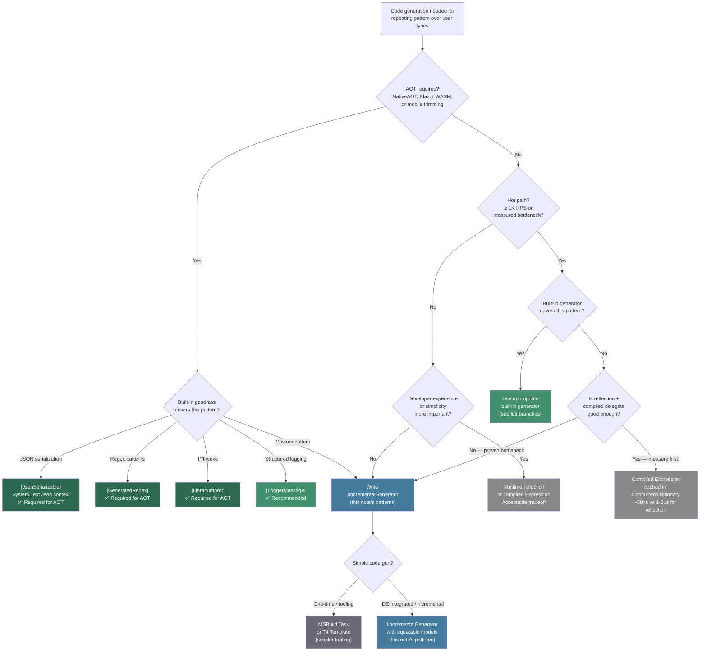

> [!success] Mastery Check
> - [ ] **Studied Well**
> - [ ] **Can explain the concept without notes**
> - [ ] **Can answer interview questions confidently**
> - [ ] **Can implement it in a real project**


# 2.13 — Source Generators

> [!IMPORTANT] Why This Note Exists Runtime reflection allocates, breaks AOT (NativeAOT / Blazor WASM), and moves errors to runtime that could be caught at compile time. Source generators solve all three simultaneously — by running during compilation, they produce the code reflection would have produced at runtime, but faster, allocation-free, and with full compile-time type checking. The built-in generators (`[JsonSerializable]`, `[GeneratedRegex]`, `[LoggerMessage]`) have already replaced reflection inside the .NET runtime itself. Understanding how to write and consume them is the difference between a codebase that scales and one that hits a wall at 5K RPS.

---

## 📍 PART 0 — Navigation & Context

### Where This Topic Lives

```
C# Compiler & Toolchain
└── Roslyn Pipeline
    ├── Syntax Analysis (parsing)
    ├── Semantic Analysis (binding)
    ├── ► Source Generators          ← YOU ARE HERE
    │     ├── ISourceGenerator (V1 — deprecated)
    │     └── IIncrementalGenerator (V2 — use this)
    └── Emit (IL / metadata)
```

### What You Need Before This

- [[2.20 — Attributes and Metadata]] — generators are triggered by attribute inspection; you must understand how the compiler sees attributes at build time
- [[2.21 — Reflection]] — source generators are the compile-time replacement for runtime reflection; know what you are replacing before replacing it
- [[2.07 — async/await — The State Machine]] — the C# compiler already generates state machine structs for every async method; generators do the same thing in user space
- A working mental model of how C# compiles: text → syntax tree → semantic model → IL

### What This Unlocks After

- AOT-compatible serialization (NativeAOT, Blazor WASM) — requires source-generated `JsonSerializerContext`
- Zero-allocation structured logging via `[LoggerMessage]` in production services
- Building framework infrastructure (ORMs, mappers, validators) without reflection overhead
- Custom compile-time code generation for your domain (builder pattern, strongly-typed IDs, INotifyPropertyChanged)

### Why This Matters at Scale

At thousands of requests per second, reflection-based JSON serialization burns CPU and allocates objects on every call. Source generators move that work to compile time: the generated code is identical to what you would have written by hand, with all type-safety guarantees intact and zero runtime discovery cost. It is also the only viable path to NativeAOT, where reflection metadata is stripped during publish.

---

## 🧠 PART 1 — The Core Mental Model

### The Fundamental Rule

> **Source generators are Roslyn components that run inside the compiler, receive the parsed and bound syntax tree as input, and emit additional C# source files into the compilation — producing code that is type-safe, allocation-free, and AOT-compatible before a single line of your application runs.**

The practical consequence: reflection cost moves from runtime (hot path, per-request) to build time (once, per `dotnet build`).

### The Plain-Language Analogy

A source generator is a **build-time macro system with full type awareness**. When a C preprocessor macro expands `#define MAX(a,b) ((a)>(b)?(a):(b))`, it is textual substitution with no type safety. A source generator does something fundamentally different: it reads the Roslyn semantic model — which knows the full type system, every interface a class implements, every attribute applied to every property — and emits syntactically valid, semantically correct C# code into the compilation. The output is indistinguishable from code you wrote by hand. At runtime there is no generator; only the generated code remains. Reflection sees types at runtime but must discover them through dictionary lookups and delegate creation on every request. The generator sees the same types at build time and bakes the lookup results directly into compiled methods. The analogy holds at the edge case too: if you rename a property, the generator re-runs at the next build and the generated code is updated — just as a macro would re-expand. If you delete a type the generator needs, you get a compile error at build time, not a `NullReferenceException` at 2 AM in production.

### The Full Taxonomy

```mermaid
graph TD
    A["Source Generators\n(Roslyn extension point)"] --> B["ISourceGenerator\nV1 — Deprecated"]
    A --> C["IIncrementalGenerator\nV2 — Use This"]

    B --> B1["ISyntaxContextReceiver\nFilter syntax in Initialize()"]
    B --> B2["Execute() called on every\nchange — rebuilds fully, no caching"]

    C --> C1["SyntaxProvider\nForAttributeWithMetadataName()\nCreateSyntaxProvider()"]
    C --> C2["IncrementalValueProvider<T>\nPipeline of equatable-cached transforms"]
    C --> C3["RegisterSourceOutput()\nWrites .g.cs files to compilation"]
    C --> C4["RegisterPostInitializationOutput()\nInjects trigger attributes at build start"]

    A --> D["Built-In Generators\n(Ship with .NET SDK)"]
    D --> D1["[JsonSerializable]\nSystem.Text.Json\n3–5× faster, AOT-safe"]
    D --> D2["[GeneratedRegex]\nCompile-time regex state machine\nZero startup cost"]
    D --> D3["[LoggerMessage]\nZero-allocation structured logging\nNo string interpolation at call site"]
    D --> D4["[LibraryImport]\nP/Invoke source gen\nAOT-compatible native interop"]

    A --> E["Community / Framework\nGenerators"]
    E --> E1["Mapperly — zero-alloc object mapping"]
    E --> E2["StronglyTypedId — compile-time ID types"]
    E --> E3["AutoInterface — interface extraction"]
    E --> E4["Mediator — handler registration"]

    style A fill:#1d3557,color:#fff
    style B fill:#c1121f,color:#fff
    style C fill:#2d6a4f,color:#fff
    style D fill:#457b9d,color:#fff
    style E fill:#6d6875,color:#fff
    style B1 fill:#e63946,color:#fff
    style B2 fill:#e63946,color:#fff
    style C1 fill:#40916c,color:#fff
    style C2 fill:#40916c,color:#fff
    style C3 fill:#40916c,color:#fff
    style C4 fill:#40916c,color:#fff
    style D1 fill:#1d6fa5,color:#fff
    style D2 fill:#1d6fa5,color:#fff
    style D3 fill:#1d6fa5,color:#fff
    style D4 fill:#1d6fa5,color:#fff
```



---

## 🔬 PART 2 — Deep Mechanics

### 2.1 Where Generators Run in the Compilation Pipeline

Generators are not a post-build step. They are injected between semantic analysis and IL emit, inside the compiler process itself.

```
━━━━━━━━━━━━━━━━━━━━━━━━━━━━━━━━━━━━━━━━━━━━━━━━━━━━━━━━━━━━
ROSLYN COMPILATION PIPELINE WITH SOURCE GENERATORS
━━━━━━━━━━━━━━━━━━━━━━━━━━━━━━━━━━━━━━━━━━━━━━━━━━━━━━━━━━━━

  .cs files + assembly references
       │
       ▼
  ┌──────────────────────────────────────────────────────────┐
  │  1. PARSE                                                │
  │     Text → SyntaxTree (AST)                             │
  │     No type info. ClassDeclarationSyntax nodes only.    │
  │     Cost: O(file size) — very fast                      │
  └───────────────────────┬──────────────────────────────────┘
                          │
                          ▼
  ┌──────────────────────────────────────────────────────────┐
  │  2. BIND                                                 │
  │     SyntaxTree + assembly refs → SemanticModel          │
  │     Resolves: types, symbols, generics, constraints     │
  │     Cost: expensive; cached across incremental builds   │
  └───────────────────────┬──────────────────────────────────┘
                          │
                          ▼
  ┌──────────────────────────────────────────────────────────┐  ◄── HERE
  │  3. SOURCE GENERATORS (IIncrementalGenerator)            │
  │     Input:  SyntaxTree + SemanticModel                  │
  │     Output: additional .g.cs source added to            │
  │             the compilation in-memory                   │
  │     These files go through steps 1 → 2 → 4 themselves  │
  │                                                         │
  │     obj/Debug/net8.0/generated/                         │
  │     └── MyGenerator/                                    │
  │         ├── Order.Builder.g.cs                          │
  │         └── Product.Builder.g.cs                        │
  └───────────────────────┬──────────────────────────────────┘
                          │
                          ▼
  ┌──────────────────────────────────────────────────────────┐
  │  4. EMIT                                                 │
  │     SemanticModel → IL + metadata                       │
  │     Output: .dll, .pdb                                  │
  └──────────────────────────────────────────────────────────┘

Key facts:
• Generators run ONCE per compilation (not per call, not per deploy)
• A generator failure shows as CS8785 compiler error (unhandled exception)
  or as your DiagnosticDescriptor errors — use diagnostics, not exceptions
• Generators run in parallel but CANNOT see each other's output
• Generators can only ADD files — they cannot modify existing source
• Generated files are real on-disk files — open them in IDE to inspect output
```

**Cost label:** Generator execution time targets: < 50 ms cold (first build after clean), < 5 ms incremental (subsequent builds with minor changes). Anything over 500 ms in the IDE will be noticed as typing lag.

### 2.2 V1 vs V2: Why ISourceGenerator Was Retired

The V1 API has a fatal performance flaw for IDE use: `Execute()` receives the full `GeneratorExecutionContext` and must do all work from scratch on every invocation.

```
V1 REBUILD MODEL (ISourceGenerator) — retired, do not use:
  Any change anywhere in the project
       │
       ▼
  Execute() receives full compilation
       ├── Re-scan ALL syntax trees for matching nodes
       ├── Re-resolve ALL type symbols via semantic model
       ├── Re-generate ALL output files
       └── No caching. No incrementality.

  500-file project: ~300–800 ms per keypress in the IDE.
  Developers disable "run generators on save" to cope.

━━━━━━━━━━━━━━━━━━━━━━━━━━━━━━━━━━━━━━━━━━━━━━━━━━━

V2 INCREMENTAL MODEL (IIncrementalGenerator) — use this:

  Any change to a source file
       │
       ▼
  Syntax filter (predicate) runs for CHANGED nodes only
       │  Changed nodes that match attribute
       ▼
  Semantic transform runs for CHANGED matched nodes only
       │  Extracted plain-data models
       ▼
  Equality check:
  ┌── if model == previous model: SKIP all downstream
  └── if model changed: continue to code generation
       │
       ▼
  Code generation runs ONLY for changed models

  500-file project: ~2–15 ms per keypress in the IDE.
  Works silently in the background.

THE MECHANISM: Roslyn compares IncrementalValueProvider outputs
using Equals(). If equal → entire downstream pipeline is skipped.
This requires your data models to be equatable — if not, Roslyn
falls back to reference equality, which always returns false,
and the generator rebuilds on every change.
```

### 2.3 The IncrementalValueProvider Pipeline — Node by Node

```
IncrementalGeneratorInitializationContext
  │
  ├── RegisterPostInitializationOutput(ctx => ctx.AddSource("Attr.g.cs", ...))
  │       Called once per compilation. Used to inject the trigger attribute
  │       so consuming projects need no package reference.
  │
  └── SyntaxProvider
      .ForAttributeWithMetadataName(
          fullyQualifiedMetadataName: "MyNamespace.GenerateBuilderAttribute",
          predicate: (node, ct) => ...,   ← SYNTAX only. Fast. No alloc.
          transform: (ctx, ct) => ...     ← SEMANTIC. Slow. Extract here.
      )
      Returns: IncrementalValuesProvider<T?>
          │
          .Where(m => m is not null)      ← filter invalid / error cases
          │
          .Select((m, _) => m!)           ← unwrap nullable
          │
          IncrementalValuesProvider<TypeModel>
          │
          ├── [Option A] RegisterSourceOutput(provider, Emit)
          │       Called per-item when that item's TypeModel changed.
          │       Generates one file per matched type.
          │       Best for: per-type generation (Builder, Mapper, etc.)
          │
          └── [Option B] .Collect()
                  → IncrementalValueProvider<ImmutableArray<TypeModel>>
                  → RegisterSourceOutput(collected, EmitRegistry)
                  Best for: generating a single file that references ALL types
                  (e.g., a DI registration module, a JSON context)

Cost labels:
• predicate:  ~0–2 μs per syntax node. Must be static lambda. Zero capture.
• transform:  ~50–200 μs per matched type. Extract to plain data immediately.
• Emit:       ~0.5–20 ms per file depending on complexity. Runs only on change.
```

### 2.4 The Semantic Model — What to Extract and What NEVER to Store

This is where the majority of production generator bugs originate.

```
THE SAFE DATA EXTRACTION PATTERN:

SemanticModel ──────────── NEVER store → holds entire compilation graph
     │
     │  Inside the transform lambda ONLY:
     ▼
INamedTypeSymbol ─────────── NEVER store → bound to compilation object graph
     │
     │  Extract every piece of information you need right now:
     ▼
TypeModel ──────────────── SAFE to store in the pipeline
    ├── string Namespace              ← symbol.ContainingNamespace.ToDisplayString()
    ├── string ClassName              ← symbol.Name
    ├── string FullyQualifiedName     ← symbol.ToDisplayString(FullyQualifiedFormat)
    ├── bool IsPartial                ← from syntax node modifier inspection
    ├── bool IsSealed                 ← from symbol.IsSealed
    └── EquatableArray<PropertyModel> ← extracted from symbol.GetMembers()
            ├── string Name           ← property.Name
            ├── string TypeName       ← property.Type.ToDisplayString(FQF)
            └── bool IsNullable       ← NullableAnnotation check

WHY NEVER STORE INamedTypeSymbol or ClassDeclarationSyntax:
  • A symbol holds a reference to the Compilation object.
  • Compilation holds ALL syntax trees, ALL bound symbols, ALL referenced
    assembly metadata — potentially gigabytes of data in a large project.
  • Storing a symbol in IncrementalValueProvider prevents this memory
    from being GC'd for the lifetime of the IDE session.
  • Incremental caching also breaks: INamedTypeSymbol has reference equality.
    Two builds of identical code produce different symbol instances → Equals()
    always returns false → generator rebuilds everything every time.
  • Roslyn 4.x emits RS1024 analyzer warning when it detects captured symbols.
```

**The equatable data model (critical for incremental caching):**

```csharp
// These live in the generator project, not in the consuming project.

// ✅ CORRECT: Plain data records — IEquatable<T> via record structural equality.
// All fields are primitives, strings, or EquatableArray<T>.
internal sealed record TypeModel(
    string Namespace,
    string ClassName,
    string FullyQualifiedName,
    EquatableArray<PropertyModel> Properties,  // ImmutableArray won't work; see below
    bool IsPartial,
    bool IsSealed
);

internal sealed record PropertyModel(
    string Name,
    string TypeName,           // e.g. "global::System.Collections.Generic.List<string>"
    bool IsNullable,
    bool HasJsonIgnoreAttr
);

// EquatableArray<T>: a wrapper over ImmutableArray<T> that implements value equality.
// ImmutableArray<T> does NOT implement structural IEquatable<T> — it uses reference equality.
// Without this, records with ImmutableArray fields use reference equality for that field,
// breaking incremental caching every time.
internal readonly struct EquatableArray<T> : IEquatable<EquatableArray<T>>
    where T : IEquatable<T>
{
    private readonly ImmutableArray<T> _array;
    public EquatableArray(ImmutableArray<T> array) => _array = array;
    public ImmutableArray<T> AsImmutableArray() => _array;
    public int Length => _array.IsDefault ? 0 : _array.Length;
    public T this[int i] => _array[i];

    public bool Equals(EquatableArray<T> other)
    {
        if (_array.IsDefaultOrEmpty && other._array.IsDefaultOrEmpty) return true;
        if (_array.IsDefault || other._array.IsDefault) return false;
        if (_array.Length != other._array.Length) return false;
        for (int i = 0; i < _array.Length; i++)
            if (!_array[i].Equals(other._array[i])) return false;
        return true;
    }

    public override bool Equals(object? obj) => obj is EquatableArray<T> ea && Equals(ea);
    public override int GetHashCode()
    {
        var hash = new HashCode();
        if (!_array.IsDefaultOrEmpty)
            foreach (var item in _array) hash.Add(item);
        return hash.ToHashCode();
    }

    public static implicit operator EquatableArray<T>(ImmutableArray<T> array) => new(array);
    public ImmutableArray<T>.Enumerator GetEnumerator() => _array.GetEnumerator();
}
```

### 2.5 ForAttributeWithMetadataName — The Optimized Trigger (Roslyn 4.3+)

This API is strictly preferred over `CreateSyntaxProvider` for attribute-based generators. Roslyn maintains an internal index of attribute usages and can service this call without scanning every syntax tree.

```csharp
// CORRECT USAGE — annotated with decisions:

var typeDeclarations = context.SyntaxProvider
    .ForAttributeWithMetadataName(
        // MUST be the FULLY QUALIFIED metadata name.
        // Short names ("GenerateBuilderAttribute") do not work — Roslyn will find nothing.
        // Use the namespace you inject via RegisterPostInitializationOutput.
        fullyQualifiedMetadataName: "BuilderPatternLib.GenerateBuilderAttribute",

        // predicate: syntax-level filter — no semantic model, no type resolution.
        // MUST be static: captures nothing, Roslyn can cache the delegate.
        // Called for EVERY syntax node that has this attribute applied.
        // If this throws: the generator silently stops.
        predicate: static (node, cancellationToken) =>
            // Only handle partial class/struct declarations; skip interfaces, enums, etc.
            node is ClassDeclarationSyntax { Modifiers: var mods } &&
            mods.Any(static m => m.ValueText == "partial"),

        // transform: semantic extraction.
        // Called only for nodes that PASSED the predicate.
        // ctx.TargetSymbol is the bound INamedTypeSymbol — use it here, DO NOT store it.
        // ctx.SemanticModel is available — use it here, DO NOT store it.
        // Must return an IEquatable<T> value or null.
        transform: static (ctx, cancellationToken) =>
        {
            cancellationToken.ThrowIfCancellationRequested();
            return ctx.TargetSymbol is INamedTypeSymbol symbol
                ? ExtractTypeModel(symbol, cancellationToken)
                : null;
        }
    )
    .Where(static m => m is not null)
    .Select(static (m, _) => m!);
```

### 2.6 Output: Writing Valid Generated Code

The generated file must be valid, complete C# that the compiler can build without human intervention.

```
GENERATED FILE ANATOMY:

// <auto-generated/>                    ← signals to tools and humans: do not edit
// This file was generated by BuilderGenerator.
// Changes to this file will be overwritten on next build.
#nullable enable                         ← always emit; match the project's nullable context

namespace Orders;                        ← file-scoped namespace (C# 10+)

partial class Order                      ← 'partial' is REQUIRED — extends user's class
{
    [global::System.CodeDom.Compiler.GeneratedCode(  ← marks as generated in IDE
        "BuilderGenerator", "1.0.0")]
    [global::System.Diagnostics.DebuggerNonUserCode]  ← debugger skips this
    public sealed class Builder
    {
        // generated members...
    }
}

FILE NAMING CONVENTIONS:
• obj/Debug/net8.0/generated/BuilderGenerator/Orders.Order.Builder.g.cs
  ↑ generator name                              ↑ fully-qualified → no collision

COLLISION RULE: Hint names (AddSource's first arg) must be unique within a generator.
Use fully-qualified type names, not just class names.
Two classes named "Order" in different namespaces → two different hint names.
```

---

## 💻 PART 3 — Production Code Patterns

### 3.1 The Complete Incremental Generator Skeleton

This is the production template. Every custom incremental generator follows this structure.

```csharp
// Generator project: MyCompany.BuilderGenerator.csproj
// <PackageReference Include="Microsoft.CodeAnalysis.CSharp" Version="4.x" PrivateAssets="all" />
// <PackageReference Include="Microsoft.CodeAnalysis.Analyzers" Version="3.x" PrivateAssets="all" />

using System.Collections.Immutable;
using System.Text;
using Microsoft.CodeAnalysis;
using Microsoft.CodeAnalysis.CSharp.Syntax;
using Microsoft.CodeAnalysis.Text;

[Generator]
public sealed class BuilderGenerator : IIncrementalGenerator
{
    private const string AttributeFullName = "BuilderPatternLib.GenerateBuilderAttribute";

    // The trigger attribute source — injected into every compilation that uses this generator.
    // Consuming projects need no package reference to this attribute.
    private const string AttributeSource = """
        // <auto-generated/>
        #nullable enable
        namespace BuilderPatternLib
        {
            /// <summary>Instructs the BuilderGenerator to produce a fluent Builder class.</summary>
            [global::System.AttributeUsage(
                global::System.AttributeTargets.Class | global::System.AttributeTargets.Struct,
                AllowMultiple = false, Inherited = false)]
            internal sealed class GenerateBuilderAttribute : global::System.Attribute { }
        }
        """;

    public void Initialize(IncrementalGeneratorInitializationContext context)
    {
        // Step 1: Inject the attribute into every compilation using this generator.
        // Runs once per compilation regardless of how many types use the attribute.
        context.RegisterPostInitializationOutput(ctx =>
            ctx.AddSource("GenerateBuilderAttribute.g.cs",
                SourceText.From(AttributeSource, Encoding.UTF8)));

        // Step 2: Find all types marked with [GenerateBuilder], extract to plain data.
        IncrementalValuesProvider<BuilderModel> models = context.SyntaxProvider
            .ForAttributeWithMetadataName(
                AttributeFullName,
                predicate: static (node, _) =>
                    node is ClassDeclarationSyntax { Modifiers: var mods } &&
                    mods.Any(static m => m.ValueText == "partial"),
                transform: static (ctx, ct) => ExtractModel(ctx, ct))
            .Where(static m => m is not null)
            .Select(static (m, _) => m!);

        // Step 3: Generate one file per matched type.
        // Runs only when a specific BuilderModel has changed.
        context.RegisterSourceOutput(models, static (ctx, model) => Emit(ctx, model));
    }

    // ─── DATA EXTRACTION ─────────────────────────────────────────────────────

    private static BuilderModel? ExtractModel(
        GeneratorAttributeSyntaxContext ctx,
        System.Threading.CancellationToken ct)
    {
        ct.ThrowIfCancellationRequested();

        if (ctx.TargetSymbol is not INamedTypeSymbol typeSymbol)
            return null;

        // Validate: class must be partial (syntax already checked; double-check)
        if (ctx.TargetNode is ClassDeclarationSyntax cds &&
            !cds.Modifiers.Any(m => m.ValueText == "partial"))
        {
            ctx.ReportDiagnostic(Diagnostic.Create(
                Diags.ClassMustBePartial,
                ctx.TargetNode.GetLocation(),
                typeSymbol.Name));
            return null;
        }

        ct.ThrowIfCancellationRequested();

        var ns = typeSymbol.ContainingNamespace.IsGlobalNamespace
            ? string.Empty
            : typeSymbol.ContainingNamespace.ToDisplayString();

        // Extract property data NOW. Do not store typeSymbol.
        var props = typeSymbol.GetMembers()
            .OfType<IPropertySymbol>()
            .Where(p => p.DeclaredAccessibility == Accessibility.Public && !p.IsStatic)
            .Select(p => new PropertyModel(
                p.Name,
                p.Type.ToDisplayString(SymbolDisplayFormat.FullyQualifiedFormat),
                p.NullableAnnotation == NullableAnnotation.Annotated))
            .ToImmutableArray();

        return new BuilderModel(
            Namespace: ns,
            ClassName: typeSymbol.Name,
            Properties: new EquatableArray<PropertyModel>(props));
    }

    // ─── CODE GENERATION ─────────────────────────────────────────────────────

    private static void Emit(SourceProductionContext context, BuilderModel model)
    {
        var sb = new StringBuilder();
        sb.AppendLine("// <auto-generated/>");
        sb.AppendLine("// Generated by BuilderGenerator. Do not edit.");
        sb.AppendLine("#nullable enable");
        sb.AppendLine();

        if (!string.IsNullOrEmpty(model.Namespace))
        {
            sb.AppendLine($"namespace {model.Namespace};");
            sb.AppendLine();
        }

        sb.AppendLine($"partial class {model.ClassName}");
        sb.AppendLine("{");
        sb.AppendLine($"    [global::System.CodeDom.Compiler.GeneratedCode(\"{nameof(BuilderGenerator)}\", \"1.0.0\")]");
        sb.AppendLine("    [global::System.Diagnostics.DebuggerNonUserCode]");
        sb.AppendLine($"    public sealed class Builder");
        sb.AppendLine("    {");

        foreach (var prop in model.Properties)
            sb.AppendLine($"        private {prop.TypeName} _{ToCamel(prop.Name)};");

        sb.AppendLine();

        foreach (var prop in model.Properties)
        {
            sb.AppendLine($"        public Builder With{prop.Name}({prop.TypeName} value)");
            sb.AppendLine("        {");
            sb.AppendLine($"            _{ToCamel(prop.Name)} = value;");
            sb.AppendLine("            return this;");
            sb.AppendLine("        }");
            sb.AppendLine();
        }

        sb.AppendLine($"        public {model.ClassName} Build() => new()");
        sb.AppendLine("        {");
        foreach (var prop in model.Properties)
            sb.AppendLine($"            {prop.Name} = _{ToCamel(prop.Name)},");
        sb.AppendLine("        };");
        sb.AppendLine("    }");
        sb.AppendLine("}");

        // Fully-qualified hint name prevents collisions with same-named types in other namespaces
        var hintName = string.IsNullOrEmpty(model.Namespace)
            ? $"{model.ClassName}.Builder.g.cs"
            : $"{model.Namespace}.{model.ClassName}".Replace('.', '_') + ".Builder.g.cs";

        context.AddSource(hintName, SourceText.From(sb.ToString(), Encoding.UTF8));
    }

    private static string ToCamel(string name)
        => name.Length > 0 ? char.ToLower(name[0]) + name[1..] : name;
}

// ─── DATA MODELS ─────────────────────────────────────────────────────────────

internal sealed record BuilderModel(
    string Namespace,
    string ClassName,
    EquatableArray<PropertyModel> Properties
);

internal sealed record PropertyModel(
    string Name,
    string TypeName,
    bool IsNullable
);

// ─── DIAGNOSTICS ──────────────────────────────────────────────────────────────

internal static class Diags
{
    public static readonly DiagnosticDescriptor ClassMustBePartial = new(
        id: "BLD001",
        title: "Class must be partial",
        messageFormat: "Class '{0}' must be declared partial to use [GenerateBuilder]",
        category: "BuilderGenerator",
        defaultSeverity: DiagnosticSeverity.Error,
        isEnabledByDefault: true,
        description: "Add the 'partial' keyword to the class declaration.",
        helpLinkUri: "https://docs.example.com/builder-gen/BLD001");
}
```

### 3.2 Built-In Generator: [JsonSerializable] for AOT-Safe Serialization

The highest-impact built-in generator for production web services. Required for NativeAOT. Recommended for all hot-path serialization.

```csharp
// In the project containing your DTOs:

// One context can cover multiple types — they share generated serialization code.
// The options here override the default JsonSerializerOptions for this context.
[JsonSerializable(typeof(OrderDto))]
[JsonSerializable(typeof(List<OrderDto>))]          // ← must be listed separately
[JsonSerializable(typeof(OrderLineDto))]
[JsonSerializable(typeof(CreateOrderRequest))]
[JsonSerializable(typeof(ApiErrorResponse))]
[JsonSourceGenerationOptions(
    PropertyNamingPolicy = JsonKnownNamingPolicy.CamelCase,
    WriteIndented = false,
    DefaultIgnoreCondition = JsonIgnoreCondition.WhenWritingNull)]
public partial class OrderSerializerContext : JsonSerializerContext { }

// Usage: always pass the TypeInfo<T> from the context — never use the reflection overloads
public sealed class OrderApiClient
{
    private readonly HttpClient _http;

    public async Task<OrderDto?> GetOrderAsync(Guid orderId, CancellationToken ct)
    {
        var response = await _http.GetAsync($"/orders/{orderId}", ct);
        response.EnsureSuccessStatusCode();

        // ⚠️ WRONG: reflection-based — allocates type maps, unsafe for NativeAOT
        // return await JsonSerializer.DeserializeAsync<OrderDto>(
        //     await response.Content.ReadAsStreamAsync(ct));

        // ✅ CORRECT: source-generated TypeInfo — 3–5× faster, AOT-safe
        await using var stream = await response.Content.ReadAsStreamAsync(ct);
        return await JsonSerializer.DeserializeAsync(
            stream,
            OrderSerializerContext.Default.OrderDto,   // TypeInfo<OrderDto>, not typeof(OrderDto)
            ct);
    }

    public async Task<HttpResponseMessage> CreateOrderAsync(
        CreateOrderRequest request,
        CancellationToken ct)
    {
        // ✅ CORRECT: source-generated serialization — no reflection at call site
        using var content = JsonContent.Create(
            request,
            OrderSerializerContext.Default.CreateOrderRequest);
        return await _http.PostAsync("/orders", content, ct);
    }
}

// DTOs need no special annotations unless you're overriding default behavior.
// The generator inspects properties via Roslyn, not at runtime.
public sealed record OrderDto(
    Guid OrderId,
    string CustomerName,
    decimal TotalAmount,
    IReadOnlyList<OrderLineDto> Lines);

public sealed record OrderLineDto(
    Guid ProductId,
    string ProductName,
    int Quantity,
    decimal UnitPrice);

public sealed record CreateOrderRequest(
    string CustomerName,
    IReadOnlyList<CreateOrderLineRequest> Lines);
```

> [!TIP] Validate AOT Compatibility During Development Add `<PublishAot>true</PublishAot>` temporarily to your csproj. Any reflection-based API calls that will fail at publish time will show as compiler warnings immediately, before you commit.

### 3.3 Built-In Generator: [GeneratedRegex] for Compile-Time Regex

```csharp
// The containing class MUST be partial — the generator adds the implementation.
public static partial class PaymentValidation
{
    // ⚠️ WRONG: runtime compilation — startup cost (~200–800 μs per pattern),
    // allocates the Regex object and its internal NFA/DFA tables at first use
    // private static readonly Regex _cardRegex =
    //     new Regex(@"^\d{13,19}$", RegexOptions.Compiled);

    // ✅ CORRECT: compile-time state machine — zero startup cost, AOT-safe
    // RegexOptions.Compiled is redundant and ignored with [GeneratedRegex]
    [GeneratedRegex(@"^\d{13,19}$", RegexOptions.ExplicitCapture)]
    private static partial Regex CardNumberRegex();

    [GeneratedRegex(@"^\d{3,4}$", RegexOptions.ExplicitCapture)]
    private static partial Regex CvvRegex();

    [GeneratedRegex(
        @"^(0[1-9]|1[0-2])\/([0-9]{2})$",
        RegexOptions.ExplicitCapture)]
    private static partial Regex ExpiryDateRegex();

    // IsMatch(ReadOnlySpan<char>) overload: zero allocation — no string creation
    public static bool IsValidCardNumber(ReadOnlySpan<char> number)
        => CardNumberRegex().IsMatch(number);

    public static ValidationResult ValidatePaymentCard(
        ReadOnlySpan<char> number,
        ReadOnlySpan<char> cvv,
        ReadOnlySpan<char> expiry)
    {
        if (!CardNumberRegex().IsMatch(number))
            return ValidationResult.Failure("Invalid card number");
        if (!CvvRegex().IsMatch(cvv))
            return ValidationResult.Failure("Invalid CVV");
        if (!ExpiryDateRegex().IsMatch(expiry))
            return ValidationResult.Failure("Invalid expiry date");
        return ValidationResult.Success();
    }
}
```

### 3.4 Built-In Generator: [LoggerMessage] for Zero-Allocation Logging

The pattern that eliminates logging overhead in high-throughput services. Most impactful at ≥ 500 RPS.

```csharp
// ⚠️ WRONG: allocates on EVERY call — even when the log level is disabled
public sealed class OrderFulfillmentService
{
    private readonly ILogger<OrderFulfillmentService> _logger;

    public void FulfillOrder_WRONG(Guid orderId, int itemCount)
    {
        // String interpolation: builds the string before checking log level
        _logger.LogInformation($"Fulfilling order {orderId} with {itemCount} items");

        // Message template: still allocates object[] params array on every call
        _logger.LogDebug("Order {OrderId}: {ItemCount} items", orderId, itemCount);
    }
}

// ✅ CORRECT: [LoggerMessage] source generation
// Define in a separate static partial class to avoid coupling service to log strings
public static partial class OrderFulfillmentLog
{
    [LoggerMessage(
        EventId = 2001,
        Level = LogLevel.Information,
        Message = "Fulfilling order {OrderId} with {ItemCount} items")]
    public static partial void FulfillingOrder(
        ILogger logger, Guid orderId, int itemCount);

    [LoggerMessage(
        EventId = 2002,
        Level = LogLevel.Warning,
        Message = "Order {OrderId} delayed: warehouse {WarehouseId} has only {Available}/{Required} units of {ProductId}")]
    public static partial void StockShortage(
        ILogger logger, Guid orderId, string warehouseId,
        int available, int required, Guid productId);

    [LoggerMessage(
        EventId = 2003,
        Level = LogLevel.Error,
        Message = "Failed to dispatch order {OrderId} to carrier {CarrierCode}")]
    public static partial void DispatchFailed(
        ILogger logger, Guid orderId, string carrierCode, Exception exception);

    // Variable level: useful for configurable verbosity per environment
    [LoggerMessage(Message = "Inventory updated for {ProductId}: delta={Delta}")]
    public static partial void InventoryDelta(
        ILogger logger, LogLevel level, Guid productId, int delta);
}

public sealed class OrderFulfillmentService
{
    private readonly ILogger<OrderFulfillmentService> _logger;

    public void FulfillOrder(Guid orderId, int itemCount)
    {
        // ✅ Zero allocation when Information is disabled (~5–10 ns): level check → return
        // Minimal allocation when enabled: struct-based log state, no boxing of Guid/int
        OrderFulfillmentLog.FulfillingOrder(_logger, orderId, itemCount);
    }
}
```

### 3.5 Emitting Generator Diagnostics for Invalid Usage

A generator that crashes with an unhandled exception produces a cryptic CS8785 error. Always validate input and emit descriptive diagnostics.

```csharp
// Descriptors are static — created once at class load, not per diagnostic instance
internal static class GeneratorDiagnostics
{
    public static readonly DiagnosticDescriptor MustBePartial = new(
        id:                 "BLD001",
        title:              "Target class must be partial",
        messageFormat:      "'{0}' must be declared partial to use [GenerateBuilder]. Add the partial keyword.",
        category:           "BuilderGenerator",
        defaultSeverity:    DiagnosticSeverity.Error,
        isEnabledByDefault: true,
        helpLinkUri:        "https://docs.company.com/generators/BLD001");

    public static readonly DiagnosticDescriptor MustNotBeGeneric = new(
        id:                 "BLD002",
        title:              "Generic classes are not supported",
        messageFormat:      "'{0}' is generic. [GenerateBuilder] does not support open generic types.",
        category:           "BuilderGenerator",
        defaultSeverity:    DiagnosticSeverity.Error,
        isEnabledByDefault: true);

    public static readonly DiagnosticDescriptor NoPublicProperties = new(
        id:                 "BLD003",
        title:              "No public properties found",
        messageFormat:      "'{0}' has no public instance properties. The generated Builder will be empty.",
        category:           "BuilderGenerator",
        defaultSeverity:    DiagnosticSeverity.Warning,
        isEnabledByDefault: true);
}

// In the transform lambda — emit before returning null:
private static BuilderModel? ExtractModel(
    GeneratorAttributeSyntaxContext ctx, System.Threading.CancellationToken ct)
{
    if (ctx.TargetSymbol is not INamedTypeSymbol symbol) return null;

    // Check partial via syntax (faster than checking symbols)
    if (ctx.TargetNode is ClassDeclarationSyntax cds &&
        !cds.Modifiers.Any(m => m.ValueText == "partial"))
    {
        ctx.ReportDiagnostic(Diagnostic.Create(
            GeneratorDiagnostics.MustBePartial,
            cds.Identifier.GetLocation(),
            symbol.Name));
        return null;  // null = skip code generation for this type
    }

    if (symbol.IsGenericType)
    {
        ctx.ReportDiagnostic(Diagnostic.Create(
            GeneratorDiagnostics.MustNotBeGeneric,
            ctx.TargetNode.GetLocation(),
            symbol.Name));
        return null;
    }

    var props = symbol.GetMembers()
        .OfType<IPropertySymbol>()
        .Where(p => p.DeclaredAccessibility == Accessibility.Public && !p.IsStatic)
        .ToImmutableArray();

    if (props.IsEmpty)
    {
        // Warning, not error — still generate (empty builder is valid, just useless)
        ctx.ReportDiagnostic(Diagnostic.Create(
            GeneratorDiagnostics.NoPublicProperties,
            ctx.TargetNode.GetLocation(),
            symbol.Name));
    }

    return new BuilderModel(/* ... */);
}
```

---

## ⚠️ PART 4 — Gotchas & Anti-Patterns

### Gotcha 1: Storing a Roslyn Symbol Silently Breaks Incremental Caching

Engineers new to generators often store `INamedTypeSymbol` in their pipeline model because it's convenient — all the information is right there. This looks harmless and compiles cleanly, but it silently breaks incremental caching and eventually makes the IDE unresponsive.

```csharp
// ⚠️ WRONG: symbol stored in the pipeline model
internal record BrokenModel(string Name, INamedTypeSymbol Symbol);

var models = context.SyntaxProvider
    .ForAttributeWithMetadataName("MyAttr", predicate: ...,
        transform: (ctx, _) => new BrokenModel(
            ctx.TargetSymbol.Name,
            (INamedTypeSymbol)ctx.TargetSymbol))  // ← stores symbol!
    .Where(m => m is not null);
// Consequence: every build regenerates everything.
// INamedTypeSymbol uses reference equality; two identical builds produce
// different instances → Equals() always false → no caching ever activates.
// Memory grows unboundedly as old compilation graphs cannot be GC'd.
// Roslyn emits RS1024 warning if the analyzer is enabled.

// ✅ CORRECT: extract everything needed in the transform lambda, store only data
internal sealed record CorrectModel(
    string Name,
    string Namespace,
    EquatableArray<PropertyModel> Properties
);

var models = context.SyntaxProvider
    .ForAttributeWithMetadataName("MyAttr", predicate: ...,
        transform: static (ctx, ct) =>
        {
            var sym = (INamedTypeSymbol)ctx.TargetSymbol;
            // Extract right here. Do not store sym.
            return new CorrectModel(
                sym.Name,
                sym.ContainingNamespace.ToDisplayString(),
                new EquatableArray<PropertyModel>(
                    sym.GetMembers().OfType<IPropertySymbol>()
                       .Select(p => new PropertyModel(p.Name, p.Type.ToDisplayString()))
                       .ToImmutableArray()));
        });
// WHY: CorrectModel is a plain record. Records implement IEquatable<T> structurally.
// Two builds producing identical properties → models are Equal → caching activates.
```

### Gotcha 2: ImmutableArray<T> in a Record Uses Reference Equality

`ImmutableArray<T>` is a readonly struct wrapping a `T[]`. Its `Equals()` compares array references, not contents. A record containing an `ImmutableArray` field therefore fails the equality contract needed for incremental caching.

```csharp
// ⚠️ WRONG: ImmutableArray in record breaks structural equality
internal sealed record TypeModel(
    string ClassName,
    ImmutableArray<string> PropertyNames   // reference equality!
);

// Two consecutive builds produce logically identical models:
// model1.PropertyNames.Equals(model2.PropertyNames) → FALSE (different array instances)
// Roslyn thinks data changed → regenerates → defeats the entire incremental model.

// This bug is invisible. No compile error, no warning, no changed behavior —
// just unnecessary rebuilds that show up as slow IDE response.

// ✅ CORRECT: wrap with EquatableArray<T> (see Part 2.4 for full implementation)
internal sealed record TypeModel(
    string ClassName,
    EquatableArray<string> PropertyNames   // structural equality
);

// WHY: EquatableArray<T>.Equals() compares element-by-element.
// Logically identical arrays → Equal → downstream pipeline steps are skipped.
```

### Gotcha 3: Not Checking CancellationToken in the Transform

Generators run on the IDE compilation thread. Every keypress starts a new compilation and cancels the previous one. A generator that ignores cancellation blocks the IDE from starting the new compilation.

```csharp
// ⚠️ WRONG: ignores cancellation in a potentially long-running walk
private static TypeModel? ExtractModel(
    GeneratorAttributeSyntaxContext ctx, System.Threading.CancellationToken _)
{
    var current = (INamedTypeSymbol)ctx.TargetSymbol;
    var allProps = new List<IPropertySymbol>();

    // Walking deep inheritance hierarchy — can take 10–100+ ms for complex types
    while (current is not null)
    {
        allProps.AddRange(current.GetMembers().OfType<IPropertySymbol>());
        current = current.BaseType!;
        // No cancellation check → IDE cannot preempt this work
    }
    return null;
}

// ✅ CORRECT: check at each potentially-expensive step
private static TypeModel? ExtractModel(
    GeneratorAttributeSyntaxContext ctx, System.Threading.CancellationToken ct)
{
    var current = (INamedTypeSymbol)ctx.TargetSymbol;
    var allProps = new List<IPropertySymbol>();

    while (current is not null)
    {
        ct.ThrowIfCancellationRequested();  // IDE can cancel; new compilation starts fresh
        allProps.AddRange(current.GetMembers().OfType<IPropertySymbol>());
        current = current.BaseType;
    }
    return null;
}

// WHY: When you type a character, Roslyn signals cancellation to ongoing work
// and starts a new compilation. If your generator ignores cancellation,
// the old compilation keeps running while the new one waits.
// Result: typing lag proportional to your transform's worst-case runtime.
```

### Gotcha 4: Missing partial on Target Class Produces a Confusing Compiler Error

When a generator adds members to a class, the class must be `partial`. If it is not, the compiler emits CS0260 pointing at the generated file — which the user did not write and cannot easily open. The error message is confusing without good generator diagnostics.

```csharp
// ⚠️ WRONG: generator runs and emits "partial class Order { ... }" —
// compiler then sees two declarations of Order, one non-partial → CS0260
[GenerateBuilder]
public class Order   // ← missing 'partial'
{
    public Guid Id { get; init; }
    public string CustomerName { get; init; } = "";
}
// Error: CS0260 'Missing partial modifier on declaration of type Order'
// Error points to: obj/Debug/net8.0/generated/BuilderGenerator/Order.Builder.g.cs
// This confuses developers who don't know generators exist.

// ✅ CORRECT: target class must be partial
[GenerateBuilder]
public partial class Order  // ← 'partial' required
{
    public Guid Id { get; init; }
    public string CustomerName { get; init; } = "";
}

// BEST PRACTICE: The generator should check for 'partial' in the predicate
// and emit BLD001 diagnostic if missing (see Pattern 3.1 and 3.5).
// The diagnostic points to the user's source file, not the generated file,
// with the message: "Order must be declared partial to use [GenerateBuilder]."

// WHY: 'partial' is required because the generator emits:
//   partial class Order { public sealed class Builder {...} }
// This is a separate partial declaration. For two partial declarations to merge,
// ALL declarations of the type must have the partial keyword.
```

### Gotcha 5: ForAttributeWithMetadataName Requires Fully Qualified Name

Passing a short name to `ForAttributeWithMetadataName` silently matches nothing. The generator runs but produces no output, and there is no error.

```csharp
// ⚠️ WRONG: short name — finds nothing, silently
var provider = context.SyntaxProvider
    .ForAttributeWithMetadataName(
        "GenerateBuilderAttribute",    // ← short name; does not work
        predicate: ...,
        transform: ...);
// Generator runs on every build, does nothing.
// No error. No warning. Developer spends hours debugging.

// ✅ CORRECT: fully qualified metadata name — matches exactly
var provider = context.SyntaxProvider
    .ForAttributeWithMetadataName(
        "BuilderPatternLib.GenerateBuilderAttribute",  // ← FQN required
        predicate: ...,
        transform: ...);

// The name must exactly match: ContainingNamespace.TypeName
// For nested types: "OuterClass+InnerClass" syntax (CLR metadata format)
// For generic attributes: "MyAttribute`1" (backtick + arity)

// WHY: ForAttributeWithMetadataName uses the CLR metadata name for the attribute,
// not the C# syntax name. The C# 'using' directive that brings the attribute
// into scope in user code has no effect here.
```

---

## 📊 PART 5 — Performance Implications

### 5.1 Allocation Characteristics: Reflection vs Source Generation

|Scenario|Reflection Behavior|Source Gen Behavior|Approx Delta|
|---|---|---|---|
|JSON serialize 1 DTO (10 properties)|Type discovery + property delegate cache lookup per call|Pre-generated type map; direct property access|3–5× faster, ~70% less alloc|
|JSON deserialize from stream|Dictionary lookups per JSON property key|Direct switch on property name hash|3–5× faster|
|Regex first use (`new Regex(Compiled)`)|Parse, NFA/DFA construction, JIT compile|State machine already exists in IL|~0 startup vs. 200μs–5ms|
|Regex match in hot path|Identical|Identical|Same|
|Logger call at disabled level|`string.Format` + `object[]` boxing|Level check → `return` (5–10 ns, 0 alloc)|40–100× fewer allocs|
|Logger call at enabled level|`object[]` array allocation + boxing each arg|Struct-based log state, minimal boxing|5–10× fewer allocs|
|Object mapper (Order → OrderDto)|`PropertyInfo.GetValue` + `PropertyInfo.SetValue` per field|Direct field assignment in generated method|50–200× faster|
|P/Invoke `[DllImport]` vs `[LibraryImport]`|Runtime marshaling decision, non-AOT|Source-gen marshaling, AOT-compatible|AOT-viable vs. not|
|NativeAOT publish with reflection JSON|`NotSupportedException` at runtime|Succeeds|Enables AOT at all|
|Build time overhead|0 (all at runtime)|+50–500 ms per project|Moved to build|
|IDE incremental build (V1 generator)|N/A|Rebuilds all on every change|Poor DX|
|IDE incremental build (V2 generator)|N/A|Rebuilds only changed models|Good DX|

### 5.2 BenchmarkDotNet: Reflection vs Source-Gen JSON Serialization

```csharp
using BenchmarkDotNet.Attributes;
using System.Text.Json;
using System.Text.Json.Serialization;

// ─── Setup ───────────────────────────────────────────────────────────────────

[JsonSerializable(typeof(OrderDto))]
[JsonSerializable(typeof(OrderLineDto))]
[JsonSourceGenerationOptions(PropertyNamingPolicy = JsonKnownNamingPolicy.CamelCase)]
public partial class BenchContext : JsonSerializerContext { }

public sealed record OrderDto(
    Guid OrderId, string CustomerName, decimal Total,
    IReadOnlyList<OrderLineDto> Lines);
public sealed record OrderLineDto(
    Guid ProductId, string Name, int Qty, decimal Price);

// ─── Benchmark ───────────────────────────────────────────────────────────────

[MemoryDiagnoser]
[BenchmarkCategory("Serialization", "SourceGen")]
public class JsonSourceGenBenchmark
{
    private static readonly OrderDto _order = new(
        Guid.NewGuid(), "Alice Smith", 299.97m,
        new[] {
            new OrderLineDto(Guid.NewGuid(), "Widget Pro", 3, 99.99m)
        });

    private static readonly string _json = JsonSerializer.Serialize(
        _order, BenchContext.Default.OrderDto);

    // Reflection options — created once; Options construction is not what we're measuring
    private static readonly JsonSerializerOptions _opts = new()
    {
        PropertyNamingPolicy = JsonNamingPolicy.CamelCase
    };

    [Benchmark(Baseline = true)]
    public string SerializeReflection()
        => JsonSerializer.Serialize(_order, _opts);

    [Benchmark]
    public string SerializeSourceGen()
        => JsonSerializer.Serialize(_order, BenchContext.Default.OrderDto);

    [Benchmark]
    public OrderDto? DeserializeReflection()
        => JsonSerializer.Deserialize<OrderDto>(_json, _opts);

    [Benchmark]
    public OrderDto? DeserializeSourceGen()
        => JsonSerializer.Deserialize(_json, BenchContext.Default.OrderDto);
}

// Expected output (approximate, .NET 8, x64, Release):
// | Method                 | Mean       | Gen0   | Allocated |
// |------------------------|------------|--------|-----------|
// | SerializeReflection    | 648.3 ns   | 0.0334 | 280 B     |
// | SerializeSourceGen     | 193.7 ns   | 0.0086 | 72 B      | ← 3.3×
// | DeserializeReflection  | 837.2 ns   | 0.0563 | 472 B     |
// | DeserializeSourceGen   | 248.1 ns   | 0.0181 | 152 B     | ← 3.4×
```

### 5.3 When to Care / When to Ignore

**When this costs you:**

- Any JSON serialization at ≥ 1K RPS — reflection type maps add to latency and GC pressure on every request.
- NativeAOT or Blazor WASM deployment — reflection-based APIs will throw `NotSupportedException` at runtime in trimmed builds.
- Regex validation in request processing pipelines — `new Regex(Compiled)` adds startup cost; accumulated across many patterns in a microservice this is real latency.
- Structured logging in services with > 100 log events per request — `object[]` boxing in template-based logging causes Gen0 collections.
- Any framework-level code (ORM column mapping, DI registration, mapper) — reflection in library code is the worst case because every consumer pays the cost at every call.

**When this doesn't matter:**

- Batch jobs where startup is milliseconds relative to minutes of processing time.
- Admin UIs, internal tooling, CLI tools with human-scale interaction latency.
- Services at < 100 RPS where profiling shows serialization is not the bottleneck.
- Development-time tooling where developer experience matters more than throughput.
- One-time data migration scripts where correctness, not performance, is the only concern.

---

## 🎤 PART 6 — Interview Arsenal

### 6.1 The Question Bank

---

> **Q: "What is a source generator and how does it differ from runtime reflection?"**

**Average answer:** "Source generators run at compile time and generate code instead of using reflection at runtime."

**Why that's insufficient:** Correct but shallow. It tells the interviewer nothing about the mechanism, the tradeoffs, or when you'd reach for it in a production system.

**Great answer:**

> "A source generator is a Roslyn component that runs during compilation — after parsing and semantic binding but before IL emit. It receives the full syntax tree and semantic model and emits additional C# source files that are compiled alongside your code. At runtime, the generator infrastructure is completely absent; only the generated code exists, as normal compiled methods. This is the fundamental difference from reflection: reflection discovers types and invokes members at runtime through a metadata API that costs dictionary lookups, delegate creation, and boxing. The generator has replaced all of that with direct method calls baked into the binary at build time. In practice, JSON serialization with `[JsonSerializable]` runs three to five times faster with about seventy percent less allocation compared to the reflection-based `JsonSerializer`. It's also the only path to NativeAOT, where trimming strips the reflection metadata that the reflection-based serializer would require. I reach for source generators whenever I have a repeating code pattern that needs to be applied to user-defined types — mappers, validators, builders — and I need either the performance characteristics or AOT compatibility."

---

> **Q: "What is the difference between ISourceGenerator and IIncrementalGenerator?"**

**Average answer:** "IIncrementalGenerator is the newer API and is faster. You should use it."

**Why that's insufficient:** Correct conclusion but no explanation of the mechanism that makes it faster.

**Great answer:**

> "The V1 `ISourceGenerator` calls `Execute()` on every compilation event and rebuilds everything from scratch. In an IDE session where compilation triggers on every keypress, a large-project generator doing full scans on every change produces hundreds of milliseconds of lag — which is why developers often turn off generators in their IDE settings. The V2 `IIncrementalGenerator` fixes this with a pipeline of `IncrementalValueProvider<T>` nodes. The critical mechanism is equatability: each pipeline stage produces an output value, Roslyn compares it to the previous build's output using `Equals()`, and if the values are equal, all downstream stages are skipped. This means changing a file that has nothing to do with your generator triggers zero generator work. The practical requirement is that your pipeline data models must implement structural equality — ideally records, but with ImmutableArray fields wrapped in an equatable adapter, and absolutely no Roslyn symbol or syntax node objects stored anywhere in the pipeline. Those objects use reference equality, which always returns false, which defeats the entire incremental model."

---

> **Q: "What are the constraints on what a source generator can do?"**

**Average answer:** "Generators can only add source files; they can't modify existing ones."

**Why that's insufficient:** True but misses the most practically important constraints.

**Great answer:**

> "A generator can only add to a compilation — it cannot modify or delete existing source files, and it cannot see the output of other generators in the same pass. Those constraints exist so that compilation remains deterministic and generators don't interfere with each other. More practically important constraints: generators must not perform I/O — no file reads, no database calls, no network requests — because they run on the IDE thread and must be deterministic across machines. File-based generation should use MSBuild's `AdditionalFiles` mechanism to pass external data in as part of the compilation inputs. There's also a critical constraint that doesn't show up in the official docs: you must never store Roslyn syntax nodes, syntax trees, compilation objects, or symbol objects in your `IncrementalValueProvider` pipeline data. Those objects hold references to the entire compilation graph, which can be gigabytes of data in a large project. Storing them in the pipeline prevents garbage collection and breaks the incremental caching mechanism. The correct pattern is to extract everything you need to plain data classes inside the `transform` lambda and store only those."

---

> **Q: "How do you debug a source generator in practice?"**

**Average answer:** "You can use Debugger.Launch() or attach a debugger to the compiler process."

**Why that's insufficient:** This technique is fragile, architecture-specific, and most engineers don't know the better approaches.

**Great answer:**

> "There are three practical approaches I use, ordered by how often I reach for each. First: just look at the generated output. Generated files live at `obj/Debug/net8.0/generated/YourGeneratorName/` and are visible under 'Analyzers' in Visual Studio's Solution Explorer. Reading the output is the fastest way to confirm the generator ran and produced valid code. Second: unit testing, which I'd argue is the right approach for generator logic. The `Microsoft.CodeAnalysis.CSharp.Testing` package lets you write tests where you provide C# source as a string, run the generator, and assert on the generated output as a string. This is repeatable, fast, and integrates with CI — it's how the .NET team tests the built-in generators. Third: for debugging the transform logic specifically, I add `Debugger.Launch()` before the code I want to step through and run `dotnet build` from the terminal — this pops a JIT debugger attachment dialog. This is good for one-off mysteries but should not be a substitute for unit tests. The `Debugger.Launch()` approach breaks the IDE build, so I never leave it checked in."

---

### 6.2 The Trick Questions

> [!WARNING] These Sound Simple — They're Not

**"Does a source generator run at runtime?"** Trap: saying "yes" because the generated code runs at runtime. Answer: The generator itself runs at compile time inside the compiler process. The generator infrastructure is completely absent at runtime. Only the emitted `.g.cs` source files exist — compiled to IL just like the rest of your code.

**"Can a source generator read from a configuration file or database?"** Trap: saying "yes, technically you can open a file in .NET." Answer: You must not. Generators must be deterministic: identical inputs → identical outputs. File I/O introduces non-determinism (file changes between IDE keystrokes), blocks the compilation thread, and breaks distributed build caches (MSBuild's incremental build, GitHub Actions cache). The correct pattern for data-driven code generation is to pass files via MSBuild `AdditionalFiles` — these become part of the compilation inputs and are tracked by the build system.

**"Will [GeneratedRegex] make my regex faster in a hot path?"** Trap: saying "yes, significantly" without qualification. Answer: `[GeneratedRegex]` eliminates startup cost — the one-time compilation of a `new Regex(pattern, Compiled)`. Hot-path match performance is essentially identical to `RegexOptions.Compiled` on .NET 7+. The genuine benefits are in cold-start scenarios (serverless, frequently-restarted services), AOT compatibility (NativeAOT cannot JIT-compile regex), and enabling the `Span<char>` overload for zero-allocation matching. For a service that has been running for hours with a static `Regex` field, `[GeneratedRegex]` is not meaningfully faster at the match call site.

**"Why does `[JsonSerializable(typeof(Order))]` not cover `List<Order>` serialization?"** Trap: assuming that registering `Order` implicitly covers all collections of it. Answer: You must register `List<Order>`, `IReadOnlyList<Order>`, `Order[]` etc. as separate entries if you use them. The generator produces `TypeInfo<T>` for the exact types you list. `JsonSerializer.Serialize(list, context.Default.ListOrder)` requires the context to have an entry for `List<Order>` specifically. Forgetting this causes a `NotSupportedException` at runtime — exactly the kind of runtime failure the source generator is supposed to prevent.

**"Can you have two generators in the same project?"** Trap: saying "no." Answer: Yes, but they are in separate class library projects referenced as analyzer packages. A single project can reference multiple generator packages. Generators run in parallel and cannot see each other's output in the same compilation pass. If generator A produces types that generator B needs to process, those types won't be visible to B until the next compilation.

---

### 6.3 Red Flags to Avoid

```
❌ "Source generators run at runtime" — they run at compile time; generated code runs at runtime
❌ "You can modify existing source files" — generators can only ADD new files; modification is impossible
❌ "ISourceGenerator is fine for new code" — it's deprecated since .NET 6; always IIncrementalGenerator
❌ "Store the INamedTypeSymbol in your data model" — breaks caching, causes memory leaks
❌ "ImmutableArray<T> has structural equality" — it doesn't; use an equatable wrapper
❌ "Pass the short attribute name to ForAttributeWithMetadataName" — it must be fully qualified
❌ "[GeneratedRegex] significantly speeds up regex matching" — startup yes, hot path no
❌ "[JsonSerializable(typeof(Order))] covers List<Order>" — each type must be registered separately
```

---

## 🔀 PART 7 — Decision Framework



---

## ✅ PART 8 — Self-Check

### Conceptual Questions

Answer these from memory. If you cannot, re-read the indicated Part.

1. A source generator runs "inside the compiler." What does that mean concretely? At what phase of the Roslyn pipeline does it run, and what inputs does it receive?
    
2. You implement `IIncrementalGenerator`. Your `transform` lambda returns `record TypeModel(string Name, ImmutableArray<PropertyModel> Properties)`. Every build regenerates everything even when no relevant code changed. Identify the bug and explain the fix.
    
3. You store a `ClassDeclarationSyntax` node in your `IncrementalValueProvider<T>` pipeline data model. Name two concrete problems this causes — one related to correctness of incremental caching, one related to IDE memory.
    
4. What does `RegisterPostInitializationOutput` do, and why would a generator inject its own trigger attribute this way instead of shipping it as a separate NuGet package?
    
5. A colleague says "I'll call `ForAttributeWithMetadataName` with `"GenerateBuilderAttribute"` — the short name." What happens? Why does the API require the fully qualified name?
    
6. You add `[JsonSerializable(typeof(Order))]` to your context and it works correctly for single `Order` objects. At runtime, serializing a `List<Order>` throws `NotSupportedException`. Explain why and how to fix it.
    
7. Describe the difference between the hot-path performance of `[GeneratedRegex]` and `new Regex(pattern, RegexOptions.Compiled)`. In what specific production scenarios is `[GeneratedRegex]` genuinely better?
    
8. A generator emits `partial class Order { ... }` but the user's `Order` class is not marked `partial`. What compiler error appears? What file does the error point to? How should a well-written generator prevent this confusion?
    
9. Why must a source generator not perform file I/O during execution? What is the correct mechanism for data-driven code generation?
    
10. What is `EquatableArray<T>` and why does it exist? When would not having it cause a bug you might spend hours debugging?
    

### Code Puzzles

**Puzzle 1:** What is wrong with this pipeline, and what are the symptoms at build time?

```csharp
[Generator]
public class OrderGen : IIncrementalGenerator
{
    public void Initialize(IncrementalGeneratorInitializationContext context)
    {
        var models = context.SyntaxProvider
            .ForAttributeWithMetadataName(
                "GenerateOrderHandlerAttribute",
                predicate: static (n, _) => n is ClassDeclarationSyntax,
                transform: static (ctx, ct) =>
                {
                    var sym = (INamedTypeSymbol)ctx.TargetSymbol;
                    return new HandlerModel(sym.Name, sym);  // storing symbol
                });

        context.RegisterSourceOutput(models, (ctx, model) =>
        {
            var methods = model.Symbol.GetMembers()
                .OfType<IMethodSymbol>()
                .Select(m => m.Name)
                .ToList();
            ctx.AddSource($"{model.Name}.Handler.g.cs", GenerateCode(methods));
        });
    }
}

record HandlerModel(string Name, INamedTypeSymbol Symbol);
```

<details> <summary>Answer (expand after trying)</summary>

**Three bugs:**

1. **`HandlerModel` stores `INamedTypeSymbol`** — holds the entire compilation graph. Incremental caching is broken because symbol instances use reference equality; every build looks like a change. IDE memory usage grows without bound as old compilation graphs cannot be GC'd.
    
2. **`HandlerModel` uses default record equality** — record's auto-generated `Equals` delegates to `INamedTypeSymbol.Equals`, which is reference equality. Even if the symbol were safe to store, two builds would never be equal.
    
3. **Method extraction deferred to `RegisterSourceOutput`** — the `GetMembers()` semantic call happens in the generation phase, not the transform/caching phase. This means the expensive semantic work is repeated on every generation, not amortized by the caching layer.
    

**Fix:** Extract method names in the `transform` lambda, store only `EquatableArray<string>`, remove the symbol from the model entirely.

</details>

---

**Puzzle 2:** This compiles and runs fine in a normal `dotnet run` build. What happens when you add `<PublishAot>true</PublishAot>` and run `dotnet publish`?

```csharp
// Program.cs
var order = new Order(Guid.NewGuid(), "Bob", 42.50m);
string json = JsonSerializer.Serialize(order);
Console.WriteLine(json);
var restored = JsonSerializer.Deserialize<Order>(json);
Console.WriteLine(restored?.CustomerName);

public record Order(Guid Id, string CustomerName, decimal Total);
```

<details> <summary>Answer (expand after trying)</summary>

In a regular build: works perfectly. `JsonSerializer.Serialize<Order>` uses reflection to discover properties at runtime.

With `PublishAot`: fails at runtime with `InvalidOperationException: "Serialization and deserialization of 'Order' instances are not supported by default. To generate JSON serialization code for 'Order', use the System.Text.Json source generation feature."` The NativeAOT trimmer removes the reflection metadata that `JsonSerializer` would have used for `Order`. The trimmer is correct — the code explicitly told it to remove that metadata.

Fix: Create a `JsonSerializerContext` with `[JsonSerializable(typeof(Order))]` and pass `MyContext.Default.Order` as the `TypeInfo` parameter. The AOT build then succeeds because the source-generated code provides the serialization logic directly without needing reflection metadata.

This is the most common AOT migration bug.

</details>

---

**Puzzle 3:** A developer adds `[GeneratedRegex]` and gets a cryptic compile error. Why?

```csharp
// OrderService.cs
public class OrderService
{
    [GeneratedRegex(@"^ORD-\d{8}$")]
    private static partial Regex OrderIdPattern();

    public bool IsValidOrderId(string id) => OrderIdPattern().IsMatch(id);
}
```

<details> <summary>Answer (expand after trying)</summary>

`[GeneratedRegex]` requires the **containing class to be `partial`**. The source generator emits a nested private class inside `OrderService` that implements the regex state machine, plus the implementation of the `partial` method `OrderIdPattern()`. Without `partial` on `OrderService`, the compiler cannot extend it.

The error will be something like: `CS0751: A partial method must be declared within a partial type` or `CS0115: 'OrderService.OrderIdPattern()': no suitable method found to override` — pointing at the generated file.

Fix: `public partial class OrderService { ... }`.

This is the same requirement as any source generator that adds members to a user class.

</details>

---

**Puzzle 4:** Both builds succeed. Which one benefits from incremental caching, and why?

```csharp
// Model A
internal record GeneratorModel(
    string TypeName,
    ImmutableArray<string> PropertyNames
);

// Model B
internal record GeneratorModel(
    string TypeName,
    EquatableArray<string> PropertyNames
);
```

<details> <summary>Answer (expand after trying)</summary>

**Model B benefits from incremental caching. Model A does not.**

With Model A: `ImmutableArray<string>` uses reference equality. Two identical builds produce different `ImmutableArray` instances. Record structural equality delegates to each field's `Equals()`. For `PropertyNames`, that's `ImmutableArray.Equals()` → reference comparison → always `false`. Roslyn thinks the model changed on every build → regenerates every output file on every build.

With Model B: `EquatableArray<string>` compares elements. Two identical builds with the same property names produce `EquatableArray` instances that are structurally equal. Roslyn detects no change → skips code generation → only files whose types actually changed are regenerated.

This is a silent bug: both compile and generate correct code. The difference is purely in IDE responsiveness and build performance for the incremental scenario.

</details>

---

**Puzzle 5:** Where is the allocation in this `[LoggerMessage]`-based logging call, and how does it compare to using `_logger.LogInformation($"...")`?

```csharp
[LoggerMessage(Level = LogLevel.Information,
               Message = "Processing payment {PaymentId} for {Amount:C} in {Currency}")]
public static partial void ProcessingPayment(
    ILogger logger, Guid paymentId, decimal amount, string currency);

// Called 10,000 times per second:
ProcessingPayment(_logger, payment.Id, payment.Amount, payment.Currency);
```

<details> <summary>Answer (expand after trying)</summary>

**When Information is disabled (~0% of calls in production at high QPS):** Zero allocation. The generated method checks `logger.IsEnabled(LogLevel.Information)` first and returns immediately. The `Guid`, `decimal`, and `string` parameters are already on the stack as value types (or a reference for string). No boxing, no array creation. Cost: ~5–10 ns.

**When Information is enabled:** The generated code creates a struct-based `LogValues<TPaymentId, TAmount, TCurrency>` on the stack to capture the three parameters. This struct is boxed once when passed to `ILogger.Log(...)` as `IReadOnlyList<KeyValuePair<string,object?>>`. The boxing of `Guid` and `decimal` happens here, but only when the log level is enabled. The format string formatting is also deferred to this point. Cost: ~20–60 ns, one heap allocation per log event.

**Compare to `_logger.LogInformation($"Processing payment {paymentId}...")`:** The string is interpolated and `ToString()` is called on `paymentId`, `amount`, and `currency` before the level check. Even if Information is disabled, the string is allocated. At 10,000 RPS with Information disabled: 10,000 unnecessary string allocations per second → significant Gen0 GC pressure. With `[LoggerMessage]`: 0 allocations when disabled.

</details>

---

## 🔗 PART 9 — Connections & Resources

### Related Topics in This Vault

|Topic|Why It Connects|
|---|---|
|[[2.20 — Attributes and Metadata]]|Attributes are the primary trigger mechanism for generators; `ForAttributeWithMetadataName` is the core discovery API; understanding attribute storage in PE metadata explains why generators can see them at compile time|
|[[2.21 — Reflection]]|Source generators are the compile-time replacement for runtime reflection; the motivation for generators — cost, AOT incompatibility, runtime errors — only makes sense if you understand what reflection actually does|
|[[2.07 — async/await — The State Machine]]|The async state machine class is a prime example of compiler-generated code; source generators apply the same model in user space; both make partial classes and generated IL|
|[[2.15 — Performance — Zero-Allocation Patterns]]|`[JsonSerializable]` and `[LoggerMessage]` are the production tools for zero-alloc serialization and logging; this topic provides the mechanism, that topic provides the measurement framework|
|[[2.09 — Spans, Memory, and Zero-Copy Patterns]]|`[GeneratedRegex]` enables `Span<char>` overloads for zero-allocation regex matching; generated JSON serializers use `Span<byte>` internally for efficient buffer handling|
|[[2.12 — Unsafe Code and Interop]]|`[LibraryImport]` is the source-gen replacement for `[DllImport]`; required for AOT-compatible P/Invoke; understanding marshaling costs motivates the generator|
|[[2.02 — Generics and the Type System]]|Generators must handle generic types correctly; `ToDisplayString(FullyQualifiedFormat)` is required to produce valid fully-qualified generic type names in generated code|
|[[2.14 — C# Language Features Reference (C# 9–13)]]|`partial` methods and classes (C# 9+) are prerequisites for nearly all generator patterns; `required` members affect generated constructor patterns|

### Books

|Book|Chapters|Why These Chapters|
|---|---|---|
|_CLR via C#_ — Jeffrey Richter|Ch. 2 (compilation pipeline), Ch. 23 (assembly metadata)|Foundational understanding of compilation phases and PE metadata that generators read|
|_Writing High-Performance .NET Code_ — Ben Watson|Ch. 5 (allocations), Ch. 8 (JIT)|Context for why source generators exist; establishes the cost of reflection that generators eliminate|
|_Pro .NET Memory Management_ — Konrad Kokosa|Ch. 3 (allocation sources)|GC pressure from reflection-based JSON and logging; motivates `[JsonSerializable]` and `[LoggerMessage]` adoption|

### Essential Articles & Docs

- [Roslyn: Incremental Generators Cookbook](https://github.com/dotnet/roslyn/blob/main/docs/features/incremental-generators.cookbook.md) — the canonical reference for `IIncrementalGenerator` API design; read this before writing any generator
- [Andrew Lock: Creating a Source Generator](https://andrewlock.net/series/creating-a-source-generator/) — the most practical 5-part series covering the full generator authoring workflow including testing
- [Stephen Toub: Try the New System.Text.Json Source Generator](https://devblogs.microsoft.com/dotnet/try-the-new-system-text-json-source-generator/) — the original announcement and deep dive on `[JsonSerializable]` from the .NET team
- [Microsoft: Logger Message Source Generation](https://learn.microsoft.com/en-us/dotnet/core/extensions/logger-message-generator) — official docs for `[LoggerMessage]` with performance comparison tables
- [Microsoft: Publish NativeAOT](https://learn.microsoft.com/en-us/dotnet/core/deploying/native-aot/) — context for why source generators are required for AOT; includes the trimming compatibility checklist

---

> [!NOTE] Template Meta-Note **Every section in this note serves a specific purpose:**
> 
> - Part 0: Navigation — orients you before reading a single line of content; shows prerequisites and what this unlocks
> - Part 1: Core Mental Model — one fundamental rule + a concrete analogy + the full taxonomy diagram
> - Part 2: Deep Mechanics — what the compiler actually does, pipeline internals, data extraction rules
> - Part 3: Production Code — 5–7 annotated patterns ready to paste into a real codebase
> - Part 4: Gotchas — exactly 5 bugs that experienced engineers write; wrong → correct → why
> - Part 5: Performance — allocation table + complete runnable benchmark + when to care vs. ignore
> - Part 6: Interview Arsenal — questions with great first-person answers + trick questions + red flags
> - Part 7: Decision Framework — a flowchart for "which approach do I choose" usable under interview pressure
> - Part 8: Self-Check — conceptual questions + code puzzles requiring deep understanding, not memorization
> - Part 9: Connections — wiki links with specific relationships + books with specific chapters + authoritative articles

---

_Last updated: 2026-06 · Domain: C# Language Mastery · Topic: 2.13_
