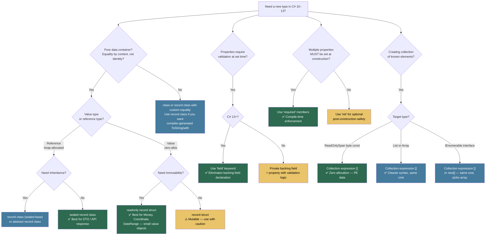

> [!success] Mastery Check
> - [ ] **Studied Well**
> - [ ] **Can explain the concept without notes**
> - [ ] **Can answer interview questions confidently**
> - [ ] **Can implement it in a real project**


## 📍 PART 0 — Navigation & Context

### Where This Topic Lives

```
C# Language Mastery
└── Level 4 — Advanced & Specialist
    ├── 2.47 — Dependency Injection Internals
    ├── 2.48 — Benchmarking with BenchmarkDotNet
    ├── 2.49 — Tiered Compilation, JIT Internals, and PGO
    ├── 2.50 — Advanced Async Patterns
    ├── 2.51 — Unsafe Code and Interop
    ├── 2.52 — Source Generators
    ├── 2.53 — Native AOT, Trimming, and Publish-Time Constraints
    └── ► 2.54 — C# Language Features Cheatsheet (C# 9–13)  ← YOU ARE HERE
                 The capstone reference: where every modern C# feature lives,
                 when each was introduced, and why each decision was made.
```

### What You Need Before This

- **[[2.19 — Records]]** — records (C# 9) and record structs (C# 10) are the single most interview-relevant features in this window
- **[[2.20 — Pattern Matching]]** — relational/logical/list patterns (C# 9–11) build on switch expression foundations
- **[[2.16 — Value Types vs Reference Types]]** — `ref struct` generics (C# 13), `record struct` (C# 10), and `allows ref struct` constraint
- **[[2.38 — Spans, Memory, and Zero-Copy Patterns]]** — `params ReadOnlySpan<T>` (C# 13), collection expressions producing spans (C# 12)

### What This Unlocks After

This is the **final topic** in the curriculum. It synthesises features from C# 9 through 13 into a single navigable reference. After this note, the path is real-world production code, code review, and interview practice — not more curriculum.

### Why This Matters in Production

Every major version of C# since 9 has shipped features that change how you should write production code — not optional syntax sugar, but features that eliminate entire categories of bugs (`required` members, NRT), eliminate allocations (`params Span<T>`, collection expressions), and simplify high-value patterns (primary constructors, `field` keyword). An engineer who doesn't know which version introduced which feature cannot reason about compatibility constraints, cannot answer "why was this written this way" in a code review, and will miss the correct modern solution to problems they already know exist.

---

## 🧠 PART 1 — The Core Mental Model

### The Fundamental Rule

> **Each C# version adds features driven by one of three forces: eliminating a class of bugs (correctness), reducing ceremony without losing power (ergonomics), or enabling new performance patterns (efficiency). Knowing which force drove each feature tells you when to use it and when the "simpler" new way is actually the right way.**

### The Plain-Language Analogy

Think of each C# version as a new edition of a professional toolkit. C# 9 added a new type of joint — records — that prevents an entire class of structural failure (mutable shared state). C# 10 made the workshop tidier (global usings, file-scoped namespaces) without changing how anything works. C# 11 added safety rails on the power tools (required members, generic math). C# 12 redesigned the most-used handles to be more ergonomic (primary constructors, collection expressions). C# 13 opened the safety cage on the angle grinder (`allows ref struct` in generics) because engineers had earned the trust. A craftsperson who only knows the tools from their apprenticeship can still build — but they're doing extra work on every job and occasionally cutting around a problem that the newer toolkit solves cleanly.

### The Version × Theme Taxonomy

```mermaid
graph TD
    A["C# 9–13 Feature Space"] --> B["Correctness"]
    A --> C["Ergonomics"]
    A --> D["Performance"]

    B --> B1["NRT enforcement hardening (9)"]
    B --> B2["init-only setters (9)"]
    B --> B3["required members (11)"]
    B --> B4["[StringSyntax] (11)"]
    B --> B5["partial properties (13)"]

    C --> C1["Records (9)"]
    C --> C2["Top-level statements (9)"]
    C --> C3["Target-typed new() (9)"]
    C --> C4["Global using / file-scoped NS (10)"]
    C --> C5["Lambda natural types (10)"]
    C --> C6["Raw string literals (11)"]
    C --> C7["Generic attributes (11)"]
    C --> C8["Primary constructors on classes (12)"]
    C --> C9["Collection expressions (12)"]
    C --> C10["Alias any type (12)"]
    C --> C11["field keyword in accessors (13)"]

    D --> D1["nint / nuint (9)"]
    D --> D2["Static lambdas (9)"]
    D --> D3["Record struct (10)"]
    D --> D4["with on structs (10)"]
    D --> D5["Static abstract interface members (11)"]
    D --> D6["ref fields in ref structs (11)"]
    D --> D7["params Span<T> (11→13)"]
    D --> D8["Inline arrays (12)"]
    D --> D9["Default lambda params (12)"]
    D --> D10["allows ref struct constraint (13)"]
    D --> D11["System.Threading.Lock (13)"]
    D --> D12["params ReadOnlySpan<T> (13)"]

    style A fill:#1d3557,color:#fff
    style B fill:#e63946,color:#fff
    style C fill:#2d6a4f,color:#fff
    style D fill:#457b9d,color:#fff
```



> [!TIP] How to Use This Note This note is structured as a per-version reference, then a production patterns section, then an interview arsenal. In a live interview when asked "what's new in C# 12?", the Decision Framework flowchart (Part 7) is your quick-recall map. The Self-Check puzzles (Part 8) test whether you know the features deeply enough to spot subtle interactions — the kind of question that distinguishes a "read the release notes" answer from a "uses this daily" answer.

---

## 🔬 PART 2 — Deep Mechanics: Per-Version Feature Reference

### 2.1 C# 9 (.NET 5, November 2020)

**Theme: Records, pattern matching maturity, init-only immutability, top-level convenience.**

#### Records (`record class`)

```csharp
// Compiler generates: primary constructor, init-only properties,
// Equals/GetHashCode (value-based), ToString, Deconstruct, clone operator (<Clone>$)
public record class CustomerOrder(Guid OrderId, decimal Total, string Currency);

// with-expression: creates a copy with changed properties
// Compiler calls the hidden <Clone>$ method, then sets changed properties
var original  = new CustomerOrder(Guid.NewGuid(), 99.99m, "USD");
var corrected = original with { Total = 109.99m }; // New object; original unchanged

// Value equality: two records with the same data are equal
var a = new CustomerOrder(Guid.Parse("..."), 99.99m, "USD");
var b = new CustomerOrder(Guid.Parse("..."), 99.99m, "USD");
bool equal = (a == b); // true — generated Equals compares all properties

// Inheritance: derived record must pass base args
public record class DiscountedOrder(Guid OrderId, decimal Total, string Currency,
                                    decimal DiscountPct)
    : CustomerOrder(OrderId, Total, Currency);
```

**Compiler-generated IL cost:** One heap allocation per `new` (reference type). `with` allocates one new record object. Generated `Equals` performs property-by-property comparison — O(n) in number of properties, no reflection.

#### `init`-only Setters

```csharp
// init: can be set in object initializers and constructors, never after
public class PaymentRequest
{
    public Guid   RequestId  { get; init; } = Guid.NewGuid();
    public decimal Amount    { get; init; }
    public string Currency   { get; init; } = "USD";
}

// ✅ OK — object initializer runs at construction time
var req = new PaymentRequest { Amount = 49.99m, Currency = "GBP" };

// ⚠️ Compile error — init property after construction
// req.Amount = 59.99m;  // CS8852: cannot assign to 'Amount' because it is init-only
```

**Why init over readonly property:** Readonly auto-properties can only be set in the constructor body, not in object initializers. `init` enables object initializer syntax (used by deserialisers, factory code, and test builders) while still preventing mutation after construction.

#### Target-Typed `new()`

```csharp
// The compiler infers the type from the left-hand side
// Eliminates redundant type name repetition

// ⚠️ BEFORE (C# 8 and earlier):
Dictionary<string, List<OrderLine>> orderMap = new Dictionary<string, List<OrderLine>>();

// ✅ C# 9: target-typed new
Dictionary<string, List<OrderLine>> orderMap = new();
OrderLine line = new("SKU-4421", 2, 9.99m);   // positional args still work

// Works in method calls:
void ProcessOrder(CustomerOrder order) { }
ProcessOrder(new(Guid.NewGuid(), 99.99m, "USD")); // type inferred from parameter
```

#### Pattern Matching Enhancements

```csharp
// Relational patterns:
bool IsStandardShipping(decimal weightKg) => weightKg is >= 0 and <= 30;
bool IsOversized(decimal weightKg) => weightKg is > 30;

// Logical patterns (and / or / not):
bool IsWeekday(DayOfWeek day) => day is not (DayOfWeek.Saturday or DayOfWeek.Sunday);

// Combined in switch expression:
string ClassifyOrder(decimal total) => total switch
{
    < 50          => "small",
    >= 50 and < 500 => "medium",
    >= 500        => "large",
    _             => "unknown"
};
```

#### Top-Level Statements

```csharp
// Program.cs — no class, no Main, no namespace required
// The compiler wraps this in a generated Program class with a Main method
using MyApp;

var app = WebApplication.CreateBuilder(args).Build();
app.MapGet("/health", () => "OK");
app.Run();

// Constraint: only ONE file per project may have top-level statements
// Args are available via the magic 'args' variable
// async is supported: await Task.Delay(100); works at top level
```

#### `nint` / `nuint` — Native-Sized Integers

```csharp
// nint = System.IntPtr (pointer-sized: 32-bit on x86, 64-bit on x64)
// nuint = System.UIntPtr
// Enables pointer arithmetic in safe code, interop with native APIs

nint offset = 0;
nint stride = 4;
nint address = baseAddress + (offset * stride); // arithmetic operators defined

// Primary use: Span<T> indexing patterns, P/Invoke, unsafe math
```

#### Static Lambdas

```csharp
// static modifier prevents capture of any variable → zero allocation for the delegate
// The compiler caches the delegate in a static field (Func<...> cached in <>c class)

// ⚠️ WRONG: captures 'multiplier' → allocates a closure object on every call
int multiplier = 3;
Func<int, int> fn = x => x * multiplier;  // heap allocation for display class

// ✅ CORRECT: static lambda — no capture possible, compiler enforces and caches
Func<int, int> fn = static x => x * 3;   // zero allocation; delegate is cached

// Compile error if you try to capture:
// static x => x * multiplier; // CS8821: a static lambda cannot capture 'multiplier'
```

#### Covariant Return Types

```csharp
// Overriding methods can now return a more derived type than the base declares
public class Animal  { public virtual  Animal  Clone() => new Animal(); }
public class Dog : Animal { public override Dog Clone() => new Dog(); }
// Dog.Clone() returns Dog (more derived), but satisfies the Animal.Clone() contract
// The CLR achieves this via a thunk method that handles upcasting
```

---

### 2.2 C# 10 (.NET 6, November 2021)

**Theme: Reducing ceremony; records for value types; lambda improvements.**

#### Global `using` Directives

```csharp
// GlobalUsings.cs (by convention)
// These apply to every file in the project — no per-file using needed
global using System;
global using System.Collections.Generic;
global using System.Linq;
global using Microsoft.Extensions.Logging;

// The SDK adds implicit global usings for common namespaces when
// <ImplicitUsings>enable</ImplicitUsings> is set in .csproj
// You can see the generated file: obj/Debug/net10.0/YourProject.GlobalUsings.g.cs
```

#### File-Scoped Namespace Declaration

```csharp
// ⚠️ BEFORE (block-scoped) — entire file indented one level
namespace MyApp.Orders
{
    public class OrderService { }
}

// ✅ C# 10: file-scoped — eliminates one level of indentation for every file
namespace MyApp.Orders;

public class OrderService { }
// One namespace per file (enforced). Cleaner diffs. Less rightward drift.
```

#### `record struct`

```csharp
// record struct: value semantics + compiler-generated members + value equality
// UNLIKE record class, record struct is a VALUE TYPE (stack/embedded, no heap alloc)
public record struct Money(decimal Amount, string Currency);

Money price = new(99.99m, "USD");
Money copy  = price with { Amount = 109.99m };  // with works on record structs too

// ⚠️ Key difference from record class:
// record class:  == compares properties (value equality)
// record struct: == compares properties (value equality) — same behaviour
// BUT: record struct is copied on assignment; record class shares the reference

// Mutable record struct (unusual but valid):
public record struct MutablePoint(int X, int Y);
var p = new MutablePoint(1, 2);
p.X = 10;  // ✅ Allowed — record struct fields are mutable by default
           // readonly record struct makes fields readonly like readonly struct
```

#### `with` on Non-Record Structs and Anonymous Types

```csharp
// C# 10 extends 'with' to any struct that has a copy constructor, and to anon types

// Struct (must have accessible copy constructor or compiler generates one):
var original = new System.Drawing.Point(1, 2);
// var shifted = original with { X = 10 };  // Works for compiler-generated structs

// Anonymous types:
var order = new { OrderId = 1, Total = 99.99m };
var updated = order with { Total = 119.99m };  // New anonymous object
```

#### Constant Interpolated Strings

```csharp
// In C# 9 and earlier, interpolated strings could not be const because
// string.Format is a method call (not a compile-time operation).
// C# 10: const interpolated strings work if ALL interpolated values are also const.

const string Prefix = "ORDER";
const string Separator = "-";
const string Template = $"{Prefix}{Separator}{{0}}";  // Valid in C# 10
// Template = "ORDER-{0}"
// Use case: const format strings for logging, SQL, regex patterns
```

#### Extended Property Patterns

```csharp
// C# 9: property pattern requires nested braces for nested properties
// C# 10: use dot notation inside property patterns

// C# 9:
bool IsUkPremium_Old(CustomerOrder o) =>
    o is { Customer: { Country: "UK", Tier: "Premium" } };

// C# 10 extended property pattern — cleaner:
bool IsUkPremium(CustomerOrder o) =>
    o is { Customer.Country: "UK", Customer.Tier: "Premium" };
```

#### Lambda Natural Types and `var` for Lambdas

```csharp
// C# 10: lambdas have a natural delegate type — can be assigned to var
// Compiler infers Func<T,R> or Action<T> from the lambda signature

var multiply = (int x, int y) => x * y;   // var → Func<int, int, int>
var greet    = (string name) => $"Hello, {name}"; // var → Func<string, string>
var log      = (string msg) => Console.WriteLine(msg); // var → Action<string>

// Explicit return type annotation on lambdas:
var parse = int (string s) => int.Parse(s); // Declares return type explicitly
var tryParse = bool (string s, out int n) => int.TryParse(s, out n);

// Attributes on lambdas (C# 10):
var validate = [DebuggerStepThrough] (Order o) => o.Total > 0;
```

---

### 2.3 C# 11 (.NET 7, November 2022)

**Theme: Required members, raw strings, generic math, ref fields, list patterns.**

#### `required` Members

```csharp
// required: compiler error if a required property is not set
// in an object initializer or constructor. Prevents the "forgot to set" bug.

public class ShipmentAddress
{
    public required string Street  { get; init; }
    public required string City    { get; init; }
    public required string Country { get; init; }
    public string? PostalCode      { get; init; }  // not required — optional
}

// ✅ OK: all required properties set
var addr = new ShipmentAddress
{
    Street  = "123 Main St",
    City    = "London",
    Country = "UK"
};

// ⚠️ Compile error CS9035: required member 'Street' must be set
// var bad = new ShipmentAddress { City = "London", Country = "UK" };

// [SetsRequiredMembers] on a constructor: constructor satisfies all required members
// (used in factory methods and copy constructors)
public class ShipmentAddress
{
    [System.Diagnostics.CodeAnalysis.SetsRequiredMembers]
    public ShipmentAddress(string street, string city, string country)
    {
        Street = street; City = city; Country = country;
    }
    // ... properties
}
```

#### Raw String Literals

```csharp
// Triple-quote raw strings: no escape sequences needed
// The number of $ signs controls interpolation delimiter depth

string json = """
    {
        "orderId": "ORD-001",
        "total": 99.99,
        "currency": "USD"
    }
    """;
// Leading whitespace (up to the closing """) is stripped automatically
// No escaping of " needed inside

// Multi-line with interpolation:
string name = "Alice";
string html = $"""
    <div class="user">
        <span>{name}</span>
    </div>
    """;

// $$ for interpolation that contains single braces (e.g. JSON templates):
string template = $$"""
    { "name": "{{name}}", "type": "user" }
    """;
// {{ and }} are literal braces; {{name}} is the interpolated expression
```

#### Generic Attributes

```csharp
// C# 11: attributes can have type parameters — previously required typeof()
// Works on any non-nullable, non-pointer, non-dynamic type argument

// BEFORE (C# 10 and earlier):
[Validate(typeof(RangeValidator<decimal>))]
public decimal Amount { get; set; }

// C# 11:
[Validate<RangeValidator<decimal>>]
public decimal Amount { get; set; }

// Useful for source generators, serialization, validation frameworks
public class ValidateAttribute<TValidator> : Attribute
    where TValidator : IValidator { }
```

#### List Patterns

```csharp
// Match against the structure of a list or array:
int[] ParseResult(int[] data) => data switch
{
    []            => Array.Empty<int>(),           // empty
    [var single]  => new[] { single },             // exactly one element
    [var first, .. var rest] => new[] { first * 2, .. rest }, // head + tail
    [_, _, ..]   => data[2..],                     // at least 2 elements, skip first 2
};

// List patterns in if statements:
if (csvLine.Split(',') is [var orderId, var amount, var currency])
{
    // Exactly three fields — all bound
    ProcessOrder(orderId, decimal.Parse(amount), currency);
}

// Slice pattern (..) captures the middle/rest:
if (tokens is [var verb, .., var last])
{
    // First and last token bound; middle ignored
}
```

#### Static Abstract Interface Members — Generic Math

```csharp
// C# 11 + .NET 7: operators and static methods as interface contracts
// Foundation for the System.Numerics generic math hierarchy

public interface IAddable<T> where T : IAddable<T>
{
    static abstract T operator +(T left, T right);
    static abstract T Zero { get; }
}

// A generic sum that works for any numeric type:
public static T Sum<T>(IEnumerable<T> items) where T : IAddable<T>
{
    T total = T.Zero;
    foreach (var item in items) total += item;  // resolved at JIT time, no boxing
    return total;
}

// Built-in: INumber<T>, IAdditionOperators<T,T,T>, IComparisonOperators<T,T,bool>
// Usage:
static T Max<T>(T a, T b) where T : INumber<T> => T.Max(a, b);
```

#### `ref` Fields in `ref struct`

```csharp
// C# 11: ref structs can have ref fields (managed pointers)
// This is how Span<T> is implemented in the BCL

public ref struct SpanLike<T>
{
    private ref T _reference;    // Managed pointer — points directly into memory
    private int   _length;

    public SpanLike(ref T reference, int length)
    {
        _reference = ref reference;
        _length    = length;
    }

    public ref T this[int index]
    {
        get
        {
            if ((uint)index >= (uint)_length)
                throw new IndexOutOfRangeException();
            return ref Unsafe.Add(ref _reference, index);
        }
    }
}
// Constraints: ref fields can only exist in ref structs.
// scoped keyword prevents ref from escaping the current scope.
```

#### `[StringSyntax]` Attribute

```csharp
// Tells IDEs the string parameter contains a specific syntax (regex, JSON, SQL, etc.)
// Enables syntax highlighting, IntelliSense, and error detection in string literals

public static Regex CompilePattern(
    [System.Diagnostics.CodeAnalysis.StringSyntax(StringSyntaxAttribute.Regex)]
    string pattern)
    => new Regex(pattern, RegexOptions.Compiled);

// The IDE will now syntax-highlight and validate the string argument at the call site:
var regex = CompilePattern(@"^ORD-\d{6}$");  // Regex validated in editor
```

---

### 2.4 C# 12 (.NET 8, November 2023)

**Theme: Primary constructors on classes, collection expressions, inline arrays, lambda defaults.**

#### Primary Constructors on Classes

```csharp
// C# 12 extends primary constructors (previously record-only) to classes and structs
// Parameters are in scope throughout the class body — not stored as fields automatically

public class OrderRepository(IDbContext db, ILogger<OrderRepository> logger)
{
    // 'db' and 'logger' are constructor parameters in scope everywhere below.
    // They are NOT automatically stored as fields (unlike records).
    // If you need them after construction, capture explicitly:
    private readonly IDbContext _db = db;  // explicit capture as field

    public async Task<Order?> FindAsync(Guid orderId, CancellationToken ct)
    {
        logger.LogDebug("Fetching order {OrderId}", orderId);  // direct use of param
        return await _db.Orders.FindAsync(new object[] { orderId }, ct);
    }
}

// ✅ Great for DI-injected services — eliminates constructor boilerplate
// ⚠️ If parameter is used only at construction time (for validation), no field needed
// ⚠️ If parameter is used later (stored), capture it explicitly for clarity
```

#### Collection Expressions

```csharp
// Single unified syntax for creating collections of any type
// The compiler chooses the most efficient construction path per target type

// Arrays:
int[] primes = [2, 3, 5, 7, 11];

// List<T>:
List<string> currencies = ["USD", "EUR", "GBP"];

// Span<T> — zero allocation when elements are constants:
ReadOnlySpan<byte> header = [0xFF, 0xD8, 0xFF];  // No heap allocation

// ImmutableArray<T>:
ImmutableArray<int> codes = [200, 201, 204, 400, 404, 500];

// Spread operator .. — inline elements from another collection:
int[] first  = [1, 2, 3];
int[] second = [4, 5, 6];
int[] all    = [..first, ..second, 7, 8];  // [1, 2, 3, 4, 5, 6, 7, 8]

// Empty collection:
List<Order> empty = [];  // Compiler may use List<T>.Empty or Array.Empty<T>
```

**Compiler optimizations for collection expressions:**

- `ReadOnlySpan<byte>` of constant bytes → stored in the PE's read-only data section (zero heap allocation, zero stack use — truly free)
- `int[]` of constants → `Array.Empty<int>()` for empty, or a statically-initialized array
- `List<T>` → `new List<T>(capacity)` with `Add` calls, or `CollectionsMarshal` tricks

#### Inline Arrays

```csharp
// A fixed-size buffer type that can be used like a stack-allocated array
// Primary use: replacing fixed-size buffers in ref structs for parsers/protocols

[System.Runtime.CompilerServices.InlineArray(16)]
public struct Buffer16<T>
{
    private T _element0;  // The single field becomes the template for all 16 slots
}

// Usage:
var buf = new Buffer16<byte>();
buf[0] = 0xFF;
buf[1] = 0xD8;

// The underlying mechanism: the JIT lays out 16 consecutive T values
// in a single value type with no overhead (no length field, no heap pointer)
// Used internally in .NET 8+ to implement Span<T> on fixed-size data
```

#### Default Lambda Parameters

```csharp
// Lambda parameters can have default values — same rules as method parameters

var greet   = (string name, string greeting = "Hello") => $"{greeting}, {name}!";
var process = (Order order, bool urgent = false, CancellationToken ct = default)
              => ProcessAsync(order, urgent, ct);

// ✅ Useful for Func<> delegates that need optional parameters
// Previously required writing a named method or extra overloads
```

#### `ref readonly` Parameters

```csharp
// ref readonly: pass by reference but the callee cannot modify the value
// Like 'in' but the call site MUST explicitly use 'ref' — prevents accidental copies

public static decimal ComputeDiscount(ref readonly PricingMatrix matrix)
    => matrix.BasePrice * matrix.DiscountRate;

// Call site:
var pricing = new PricingMatrix(...);
decimal discount = ComputeDiscount(ref pricing);
// The 'ref' at call site is required — it signals intentional by-ref passing

// Difference from 'in':
// 'in': ref passing is implicit at call site (no 'ref' keyword needed)
// 'ref readonly': ref passing is explicit at call site ('ref' keyword required)
// Use 'ref readonly' when you want the API to be visibly explicit about by-ref semantics
```

#### `using` Alias for Any Type

```csharp
// C# 12: type aliases can refer to any type (tuples, pointers, arrays, generics)
// Previously limited to named types

using OrderId   = System.Guid;
using Matrix4x4 = (float M00, float M01, float M02, float M03,
                   float M10, float M11, float M12, float M13,
                   float M20, float M21, float M22, float M23,
                   float M30, float M31, float M32, float M33);
using SafeBuffer = System.Span<byte>;

// Use like a type name:
OrderId id = Guid.NewGuid();
Matrix4x4 identity = (1,0,0,0, 0,1,0,0, 0,0,1,0, 0,0,0,1);

// Scope: file-scoped or global (global using alias MyType = ...;)
```

---

### 2.5 C# 13 (.NET 9, November 2024)

**Theme: `allows ref struct`, `System.Threading.Lock`, `field` keyword, `params` collections, partial properties.**

#### `allows ref struct` Generic Constraint

```csharp
// C# 13: generic type parameters can explicitly allow ref struct type arguments
// Enables generic algorithms that work with Span<T>, ReadOnlySpan<T>, and custom ref structs

// BEFORE C# 13: impossible — ref struct cannot be used as a type argument
// T Process<T>(T item) where T : struct  — ref structs were excluded

// C# 13:
public static void ForEach<T, TItem>(T collection, Action<TItem> action)
    where T : allows ref struct, IEnumerable<TItem>
{
    foreach (var item in collection)
        action(item);
}

// Now works with Span<T>:
Span<int> numbers = [1, 2, 3, 4, 5];
ForEach<Span<int>, int>(numbers, n => Console.WriteLine(n));

// The constraint means: T may be a ref struct, but the generic code
// must obey ref struct rules (no boxing, no async, no storing as field)
```

#### `System.Threading.Lock`

```csharp
// C# 13 / .NET 9: new Lock type replaces 'object' as the lock target
// Advantages: explicit intent, better tooling diagnostics, no accidental boxing,
// structured disposal via Lock.Scope

private readonly System.Threading.Lock _sync = new();

public void AddOrder(Order order)
{
    using (_sync.EnterScope())   // Lock.Scope is a ref struct — zero allocation
    {
        _orders.Add(order);
    }
}

// Also supports traditional lock statement with Lock object:
lock (_sync)  // C# 13 compiler emits EnterScope instead of Monitor.Enter for Lock
{
    _orders.Add(order);
}

// ⚠️ BEFORE (C# 12 and earlier):
private readonly object _lock = new();
lock (_lock) { _orders.Add(order); }
// Problem: any object can be a lock target (typos, accidental public lock objects)
// System.Threading.Lock is an explicit, typed, intentional synchronization primitive
```

#### `params` Collections — Any `IEnumerable`

```csharp
// C# 13: params parameter no longer requires T[] — any collection type works
// Most important: params ReadOnlySpan<T> — zero allocation for the params call

// BEFORE (C# 12): params always creates an array — heap allocation on every call
public static decimal Sum(params decimal[] amounts)
{
    decimal total = 0;
    foreach (var a in amounts) total += a;
    return total;
}
Sum(1m, 2m, 3m);  // Allocates decimal[3] on the heap

// C# 13: params ReadOnlySpan<T> — compiler uses stackalloc internally
public static decimal Sum(params ReadOnlySpan<decimal> amounts)
{
    decimal total = 0;
    foreach (var a in amounts) total += a;
    return total;
}
Sum(1m, 2m, 3m);  // Zero heap allocation — arguments go on the stack

// The BCL itself has already adopted this:
// string.Concat(params ReadOnlySpan<string> values)  — .NET 9
// string.Join(string sep, params ReadOnlySpan<string> values) — .NET 9
```

#### `field` Keyword in Property Accessors

```csharp
// C# 13: 'field' refers to the compiler-generated backing field of a property
// Eliminates the need to declare a separate backing field for simple validation

// BEFORE:
private decimal _price;
public decimal Price
{
    get => _price;
    set => _price = value >= 0 ? value : throw new ArgumentOutOfRangeException();
}

// C# 13 with 'field':
public decimal Price
{
    get;
    set => field = value >= 0 ? value : throw new ArgumentOutOfRangeException();
}
// 'field' refers to the auto-generated backing field — no separate declaration

// Mix auto and manual in same property:
public string Name
{
    get => field ?? "Unknown";   // use backing field with fallback
    set => field = value.Trim(); // normalize before storing
}
```

#### Partial Properties

```csharp
// C# 13: properties can be partial — declaration in one file, implementation in another
// Primary use: source generators that implement property logic

// In the user-authored file (e.g., Entity.cs):
public partial class TrackingRecord
{
    public partial string Status { get; set; }  // Declaration only
}

// In the source-generator-authored file (e.g., TrackingRecord.g.cs):
public partial class TrackingRecord
{
    private string _status = "pending";
    public partial string Status
    {
        get => _status;
        set
        {
            if (_status == value) return;
            OnStatusChanging(_status, value);
            _status = value;
            OnStatusChanged(value);
        }
    }
    partial void OnStatusChanging(string oldValue, string newValue);
    partial void OnStatusChanged(string newValue);
}
```

---

## 💻 PART 3 — Production Code Patterns

### 3.1 The Immutable Domain Object — Records Done Right (C# 9)

```csharp
// Scenario: payment domain — orders must be immutable after creation,
// equality must be value-based, and copying with changes must be safe.

// ✅ CORRECT: sealed record class — prevents unintended inheritance
// that breaks the generated Equals/GetHashCode contract.
public sealed record class PaymentIntent(
    Guid          IntentId,
    decimal       Amount,
    string        Currency,
    string        MerchantId,
    DateTimeOffset CreatedAt)
{
    // Custom validation in the record's primary constructor validation block:
    // Use 'init' accessor blocks when you need to validate:
    public string Currency { get; init; } = Currency?.ToUpperInvariant()
        ?? throw new ArgumentNullException(nameof(Currency));

    // Custom members beyond the primary constructor:
    public bool IsHighValue => Amount >= 10_000m;

    // Factory method enforces business invariants at creation time
    public static PaymentIntent Create(decimal amount, string currency, string merchantId)
    {
        if (amount <= 0)
            throw new ArgumentOutOfRangeException(nameof(amount), "Amount must be positive");
        return new PaymentIntent(
            IntentId:   Guid.NewGuid(),
            Amount:     amount,
            Currency:   currency,
            MerchantId: merchantId,
            CreatedAt:  DateTimeOffset.UtcNow
        );
    }
}

// Clone with modification — zero mutation of original:
var original = PaymentIntent.Create(99.99m, "USD", "MERCH-001");
var refunded = original with { Amount = -original.Amount };

// Value equality in tests:
var a = PaymentIntent.Create(99.99m, "USD", "MERCH-001");
// a == b only if ALL properties match — useful for assertion equality
```

### 3.2 The Required-Member Guard (C# 11)

```csharp
// Scenario: order submission API model where missing fields cause silent failures.
// 'required' turns missing-field bugs from runtime NullReferenceExceptions
// into compile-time errors.

public class SubmitOrderRequest
{
    public required Guid     OrderId    { get; init; }
    public required string   CustomerId { get; init; }
    public required decimal  TotalAmount { get; init; }
    public required string   Currency   { get; init; }

    // Optional — not required
    public string? PromoCode         { get; init; }
    public string? DeliveryInstructions { get; init; }
}

// ⚠️ Compile error — missing required members
// var bad = new SubmitOrderRequest { OrderId = Guid.NewGuid() };

// ✅ All required members present:
var request = new SubmitOrderRequest
{
    OrderId     = Guid.NewGuid(),
    CustomerId  = "CUST-4421",
    TotalAmount = 149.99m,
    Currency    = "USD"
};

// In deserialization: System.Text.Json respects [JsonRequired] attribute
// For source-generated contexts, [JsonRequired] and 'required' work together
```

### 3.3 The Zero-Allocation Collection Expression (C# 12)

```csharp
// Scenario: HTTP middleware that checks if a request path matches a known set
// of health check endpoints. Called on every request — allocation must be zero.

public class HealthCheckMiddleware
{
    // ✅ C# 12 collection expression for ReadOnlySpan<string>:
    // Compiler stores these strings in the PE's data section.
    // NO heap allocation. NO static constructor overhead.
    private static ReadOnlySpan<string> HealthPaths => ["/health", "/alive", "/ready"];

    // ⚠️ WRONG (C# 11 and earlier):
    // private static readonly string[] _healthPaths = new[] { "/health", "/alive", "/ready" };
    // This allocates a string[] on the heap at startup.

    public async Task InvokeAsync(HttpContext ctx, RequestDelegate next)
    {
        foreach (var path in HealthPaths)
        {
            if (ctx.Request.Path.Equals(path, StringComparison.OrdinalIgnoreCase))
            {
                ctx.Response.StatusCode = 200;
                await ctx.Response.WriteAsync("OK");
                return;
            }
        }
        await next(ctx);
    }
}
```

### 3.4 Primary Constructor DI Pattern (C# 12)

```csharp
// Scenario: typical ASP.NET Core service with injected dependencies.
// Primary constructor eliminates the constructor-body-and-field boilerplate
// that accounts for ~30% of lines in typical service classes.

// ⚠️ BEFORE (C# 11 and earlier) — 12 lines just for 3 dependencies:
public class OrderFulfillmentService_Old
{
    private readonly IOrderRepository _orders;
    private readonly IInventoryService _inventory;
    private readonly ILogger<OrderFulfillmentService_Old> _logger;

    public OrderFulfillmentService_Old(
        IOrderRepository orders,
        IInventoryService inventory,
        ILogger<OrderFulfillmentService_Old> logger)
    {
        _orders    = orders;
        _inventory = inventory;
        _logger    = logger;
    }
    // Business methods follow...
}

// ✅ C# 12 primary constructor — 1 line:
public class OrderFulfillmentService(
    IOrderRepository orders,
    IInventoryService inventory,
    ILogger<OrderFulfillmentService> logger)
{
    // Parameters are in scope in all methods below.
    // Capture only what you need beyond the constructor:

    public async Task FulfillAsync(Guid orderId, CancellationToken ct)
    {
        logger.LogInformation("Fulfilling {OrderId}", orderId);

        var order = await orders.GetAsync(orderId, ct)
            ?? throw new KeyNotFoundException($"Order {orderId} not found");

        bool reserved = await inventory.ReserveAsync(order.Lines, ct);
        if (!reserved)
        {
            logger.LogWarning("Inventory unavailable for {OrderId}", orderId);
            return;
        }
        await orders.MarkFulfilledAsync(orderId, ct);
    }
}
```

### 3.5 The `params ReadOnlySpan<T>` Logger (C# 13)

```csharp
// Scenario: structured audit logging utility that must handle variable numbers
// of key-value pairs without heap allocation on the hot path.

public static class AuditLog
{
    // ✅ C# 13: params ReadOnlySpan<(string Key, string Value)>
    // Callers get natural variadic syntax; implementation gets zero-allocation span.
    public static void Record(
        string eventType,
        params ReadOnlySpan<(string Key, string Value)> properties)
    {
        // Span iteration: no LINQ, no allocation
        var sb = new System.Text.StringBuilder(eventType);
        foreach (var (key, value) in properties)
        {
            sb.Append(' ');
            sb.Append(key);
            sb.Append('=');
            sb.Append(value);
        }
        // Write to the actual audit sink
        AuditSink.WriteRaw(sb.ToString());
    }
}

// Call site: reads like named parameters, allocates nothing for the span itself
AuditLog.Record("PaymentAuthorized",
    ("OrderId",    orderId.ToString()),
    ("Amount",     amount.ToString("F2")),
    ("MerchantId", merchantId));
```

### 3.6 The `field` Keyword for Validated Auto-Properties (C# 13)

```csharp
// Scenario: product catalogue entity where fields have business-rule constraints.
// C# 13's 'field' keyword eliminates backing field declarations.

public class ProductListing
{
    // ✅ C# 13 — 'field' references the auto-generated backing field:
    public string Sku
    {
        get;
        init => field = string.IsNullOrWhiteSpace(value)
            ? throw new ArgumentException("SKU cannot be empty")
            : value.ToUpperInvariant();
    }

    public decimal UnitPrice
    {
        get => field;
        set => field = value >= 0
            ? value
            : throw new ArgumentOutOfRangeException(nameof(UnitPrice),
                "Price cannot be negative");
    }

    public string DisplayName
    {
        get => field ?? Sku;        // Fallback to SKU if display name not set
        set => field = value.Trim();
    }

    // ⚠️ BEFORE C# 13 (equivalent verbosity):
    // private string? _displayName;
    // public string DisplayName
    // {
    //     get => _displayName ?? Sku;
    //     set => _displayName = value.Trim();
    // }
}
```

### 3.7 `System.Threading.Lock` — Intentional Synchronization (C# 13)

```csharp
// Scenario: order processing queue with thread-safe enqueue/dequeue.
// System.Threading.Lock replaces 'object' as the lock target with an
// explicit, diagnosable, analyzable primitive.

public class OrderQueue
{
    private readonly Queue<Order> _queue = new();

    // ✅ C# 13: explicit Lock type — intent is clear, tooling can analyze it
    private readonly System.Threading.Lock _lock = new();

    public void Enqueue(Order order)
    {
        // using-with-Scope: Lock.Scope is a ref struct — guaranteed zero allocation
        using (_lock.EnterScope())
        {
            _queue.Enqueue(order);
        }
    }

    public Order? TryDequeue()
    {
        lock (_lock)  // Traditional lock syntax also works with Lock in C# 13
        {
            return _queue.Count > 0 ? _queue.Dequeue() : null;
        }
    }

    public int Count
    {
        get
        {
            using (_lock.EnterScope())
                return _queue.Count;
        }
    }
}
```

---

## ⚠️ PART 4 — Gotchas & Anti-Patterns

### Gotcha 1: Record `with` Breaks Reference Equality — Silently

The `with` expression creates a new object. Engineers who mix value equality and reference equality checks on records are in for a surprise when identity matters.

```csharp
// ⚠️ WRONG: assuming 'with' produces the same object when nothing changes
public record class Shipment(Guid Id, string Status);

var original = new Shipment(Guid.NewGuid(), "Pending");
var copy     = original with { };  // No properties changed — but this is a NEW object

bool sameRef   = ReferenceEquals(original, copy);  // false — different objects
bool sameValue = (original == copy);                // true — same property values

// The bug: if you store 'copy' in a HashSet<Shipment>, the generated GetHashCode
// (based on property values) means both objects hash to the same bucket.
// But if you then change a property of 'original' and rely on the set NOT containing
// 'copy', you will get a wrong result because they were equal at insert time.

// WHY: records generate value-based GetHashCode. If you mutate a record used as
// a dictionary key, the entry becomes permanently unreachable (same key, wrong hash).
// Records should be immutable. If they're mutable, don't use them as collection keys.

// ✅ CORRECT: use sealed records; never mutate a record used as a dictionary key.
```

### Gotcha 2: Primary Constructor Parameters Are NOT Fields — Capture Is Your Job

```csharp
// ⚠️ WRONG: assuming primary constructor parameters are stored as fields
public class ReportGenerator(IDataSource dataSource, string reportName)
{
    // 'dataSource' and 'reportName' ARE in scope here...
    public string Title => $"Report: {reportName}";  // ✅ works

    // ...but 'dataSource' might be captured into a lambda that outlives the method:
    public Func<Task<ReportData>> LazyLoad => () => dataSource.LoadAsync();
    // ✅ This works — but if 'dataSource' is a scoped DI service and the Func
    // is stored longer than the scope, you have a captive dependency bug.
    // Worse: in a future refactor, if someone removes the usage of 'dataSource'
    // from all methods, the compiler does NOT warn you that it's still captured here.
}

// ✅ CORRECT: Capture explicitly with a private readonly field when the parameter
// outlives the constructor or is used in ways that need explicit lifetime:
public class ReportGenerator(IDataSource dataSource, string reportName)
{
    // Explicit capture makes lifetime intent visible
    private readonly IDataSource _dataSource = dataSource;

    public Func<Task<ReportData>> LazyLoad => () => _dataSource.LoadAsync();
    public string Title => $"Report: {reportName}"; // short-lived use, OK as param
}
```

### Gotcha 3: Collection Expressions and `IEnumerable<T>` Targets Don't Zero-Alloc

```csharp
// Engineers assume that collection expressions always optimize.
// They do — for concrete types. For interface targets, the compiler
// must allocate something that implements the interface.

// ✅ Zero allocation (target is ReadOnlySpan<byte> — constant bytes):
ReadOnlySpan<byte> header = [0xFF, 0xFE];

// ✅ Zero allocation (empty List uses List<T>.Empty-equivalent internal path in .NET 8+):
List<string> empty = [];

// ⚠️ NOT zero allocation (target is IEnumerable<int>):
IEnumerable<int> nums = [1, 2, 3];
// Compiler picks a concrete type — usually int[] — and allocates it.
// The allocation is still O(n) in element count, same as before.

// ✅ If you need zero-allocation IEnumerable-like iteration, use Span:
ReadOnlySpan<int> numsSpan = [1, 2, 3];
foreach (var n in numsSpan) Process(n);
```

### Gotcha 4: `required` Members Are Bypassed by `[SetsRequiredMembers]` Without Warning

```csharp
// [SetsRequiredMembers] tells the compiler "trust me, the constructor sets everything"
// If you add a new required member later, [SetsRequiredMembers] constructors
// will NOT produce a compile error — the new member silently goes unset.

public class OrderSummary
{
    public required Guid   OrderId  { get; init; }
    public required string Status   { get; init; }
    // NEWLY ADDED — required!
    public required string Region   { get; init; }
}

public class OrderSummaryFactory
{
    [System.Diagnostics.CodeAnalysis.SetsRequiredMembers]
    public OrderSummary Create(Guid id) => new()
    {
        OrderId = id,
        Status  = "Pending"
        // Region is NOT set — but NO compile error because [SetsRequiredMembers]
        // suppresses the check entirely. Region will be null/default at runtime.
    };
}

// ✅ FIX: Only use [SetsRequiredMembers] on constructors that provably set ALL
// required members. Prefer using the object initializer syntax which the compiler
// does verify. If using [SetsRequiredMembers], add a test that constructs via
// the factory and asserts all required properties are non-null.
```

### Gotcha 5: `record struct` Mutability — The Opposite of `record class`

```csharp
// record class properties are init-only by default — immutable after construction.
// record struct properties are MUTABLE by default.
// This asymmetry consistently surprises engineers switching between the two.

public record class  ImmutablePoint(int X, int Y);   // X, Y are init-only
public record struct MutablePoint(int X, int Y);      // X, Y are mutable!

var p = new MutablePoint(1, 2);
p.X = 10;  // ✅ Compiles and runs — p is { X = 10, Y = 2 }

// ⚠️ Bug: you expect record struct to be immutable like record class
void Shift(MutablePoint p) { p.X += 5; }  // Modifies a COPY — caller unchanged
var point = new MutablePoint(1, 2);
Shift(point);
Console.WriteLine(point.X);  // Still 1 — Shift received a copy

// ✅ FIX: Use 'readonly record struct' for immutable value-type records:
public readonly record struct ImmutableMoney(decimal Amount, string Currency);
// Now ALL fields are readonly; the compiler enforces immutability.
```

---

## 📊 PART 5 — Performance Implications

### 5.1 Allocation Characteristics per Feature

|Feature|Allocation Behavior|Approx Cost vs. Alternative|
|---|---|---|
|`record class` construction|One heap allocation (same as class `new`)|Same as equivalent class|
|`record class` `with` expression|One heap allocation (new object per with)|Same as `new` + property copy|
|`record struct` construction|Zero heap allocation (value type)|Same as struct `new`|
|`init`-only property|Zero overhead vs `set` — same IL|0 ns overhead|
|`required` members|Zero runtime cost — compile-time only|0 ns overhead|
|`target-typed new()`|Zero overhead — syntax sugar, same IL|0 ns overhead|
|`static lambda` (no capture)|Zero allocation — cached static delegate|vs. closure: saves ~40–80 bytes/call|
|Collection expression → `ReadOnlySpan<byte>` (const)|Zero allocation — PE data section|vs. `byte[]`: saves heap alloc|
|Collection expression → `List<T>` non-empty|One heap allocation (same as `new List<T>`)|Same as before|
|`params ReadOnlySpan<T>` (C# 13)|Zero heap allocation — stackalloc internally|vs. `params T[]`: saves ~24 + n*size bytes|
|Primary constructor (C# 12)|Zero overhead — same IL as explicit constructor|0 ns overhead|
|`System.Threading.Lock.EnterScope()`|Zero allocation — `Lock.Scope` is a `ref struct`|vs. `Monitor.Enter`: ~same speed, zero GC|
|`field` keyword (C# 13)|Zero overhead — compiler generates same backing field|0 ns overhead|
|`inline array` access|Zero allocation — same as fixed-size struct field access|vs. `T[]`: saves heap alloc|
|`allows ref struct` generic call|Zero overhead — erased at JIT level|Same as non-constrained generic|

### 5.2 BenchmarkDotNet: Old vs New Patterns

```csharp
// Expected output (approximate, .NET 9, x64):
// ┌────────────────────────────────────┬──────────┬──────────┬───────────┐
// │ Method                             │ Mean     │ Alloc    │ Notes     │
// ├────────────────────────────────────┼──────────┼──────────┼───────────┤
// │ CreateRecordClass                  │  45.2 ns │  88 B    │ heap      │
// │ CreateRecordStruct                 │   1.1 ns │   0 B    │ stack     │
// │ WithExpression_RecordClass         │  48.3 ns │  88 B    │ new heap  │
// │ WithExpression_RecordStruct        │   1.3 ns │   0 B    │ copy only │
// │ ParamsArray_3elements              │  18.4 ns │  48 B    │ T[] alloc │
// │ ParamsSpan_3elements               │   2.1 ns │   0 B    │ stackalloc│
// │ CollectionExpr_ConstByteSpan       │   0.1 ns │   0 B    │ PE data   │
// │ CollectionExpr_ListOfT             │  32.0 ns │  72 B    │ List alloc│
// │ StaticLambda_NoCapture             │   5.2 ns │   0 B    │ cached    │
// │ CapturingLambda                    │  41.0 ns │  48 B    │ closure   │
// └────────────────────────────────────┴──────────┴──────────┴───────────┘

[MemoryDiagnoser]
[BenchmarkCategory("ModernCSharp")]
public class ModernFeaturesBenchmark
{
    private static readonly object _oldLock = new();
    private static readonly System.Threading.Lock _newLock = new();
    private readonly int _multiplier = 3;

    [Benchmark]
    public object CreateRecordClass()
        => new CustomerRecord(Guid.NewGuid(), "Alice", 99.99m);

    [Benchmark]
    public CustomerStruct CreateRecordStruct()
        => new CustomerStruct(Guid.NewGuid(), "Alice", 99.99m);

    [Benchmark]
    public int ParamsArray_Sum() => SumArray(1, 2, 3, 4, 5);
    private static int SumArray(params int[] vals) { int s = 0; foreach (var v in vals) s += v; return s; }

    [Benchmark]
    public int ParamsSpan_Sum() => SumSpan(1, 2, 3, 4, 5);
    private static int SumSpan(params ReadOnlySpan<int> vals) { int s = 0; foreach (var v in vals) s += v; return s; }

    [Benchmark]
    public Func<int, int> CapturingLambda() => x => x * _multiplier;

    [Benchmark]
    public Func<int, int> StaticLambda() => static x => x * 3;

    [Benchmark]
    public void OldLock() { lock (_oldLock) { /* work */ } }

    [Benchmark]
    public void NewLock() { using (_newLock.EnterScope()) { /* work */ } }
}

public record class  CustomerRecord(Guid Id, string Name, decimal Balance);
public record struct CustomerStruct(Guid Id, string Name, decimal Balance);
```

### 5.3 When to Care / When to Ignore

**When modern features cost you:**

- **`record class` in extremely hot paths** (millions of allocations per second) — `record struct` or a plain `readonly struct` with manually implemented equality is faster.
- **`with` on large record classes** — each `with` allocates a full new object. If you're doing many incremental mutations, a builder pattern accumulating changes before constructing is cheaper.
- **Collection expressions targeting `IEnumerable<T>` interfaces** — the compiler emits an array allocation anyway. No magic optimization for interface targets.
- **`primary constructors` that capture large objects implicitly** — captured parameters can extend the lifetime of heavy dependencies unexpectedly. Explicit fields make lifetime visible.

**When modern features don't matter:**

- **`required` members, `init` properties, `field` keyword** — zero runtime overhead, purely compile-time mechanics. Use them freely.
- **Global usings, file-scoped namespaces, target-typed new()** — syntax only. No IL difference.
- **`record struct` for small value types in non-hot paths** — the ~1 ns difference vs a plain struct is irrelevant outside microbenchmark loops.
- **`System.Threading.Lock` vs `object` lock** — same underlying OS primitive. Performance difference is within noise. Use `Lock` for the clarity and tooling benefits.

---

## 🎤 PART 6 — Interview Arsenal

### A. The Question Bank

---

> **Q: "What's the difference between a `record class` and a `record struct` in C#?"**

**Average answer:** "Record class is a reference type and record struct is a value type."

**Why that's insufficient:** It misses the mutable-by-default asymmetry, the `with` allocation difference, the memory layout consequences, and the equality implementation cost difference.

> **Great answer:** "The fundamental difference is the type system category. A `record class` is a reference type — `new` allocates on the heap, assignment copies the reference, and `with` allocates a new heap object. A `record struct` is a value type — assignment copies the data, stack-local instances don't allocate, and `with` just copies the struct and patches the changed fields at zero allocation cost. The thing that consistently surprises engineers is the mutability default: `record class` properties generated from the positional syntax are `init`-only — immutable after construction. `record struct` properties are _mutable_ by default. If you want an immutable value-type record, you need `readonly record struct`. In production I reach for `record class` for domain entities where identity matters less than the data shape — API responses, configuration objects — and `readonly record struct` for small value objects like `Money`, `DateRange`, or `Coordinate` where I want zero allocation and value semantics."

---

> **Q: "What are `required` members in C# 11 and when would you use them?"**

**Average answer:** "They force you to set certain properties in the object initializer."

**Why that's insufficient:** It doesn't address _why_ this matters over constructor parameters, the `[SetsRequiredMembers]` escape hatch and its pitfall, or the deserialization story.

> **Great answer:** "Required members enforce that specific properties are set at construction time — either in an object initializer or a constructor marked `[SetsRequiredMembers]`. The important difference from mandatory constructor parameters is the API surface: a constructor with 15 parameters is unwieldy and easy to mis-order; required members with object initializers are named and can be set in any order. I use them on request DTOs and entity models where a missing field causes a silent null-reference failure downstream. The gotcha I warn my team about is `[SetsRequiredMembers]`: if a constructor is tagged with it, the compiler completely suppresses required-member checking for that constructor. Add a new `required` member later and the factory constructor won't warn you — the new member silently goes unset at runtime. I pair required members with integration tests that construct via the factory and verify all critical properties are non-null."

---

> **Q: "Explain collection expressions in C# 12. What's the performance story?"**

**Average answer:** "It's a new syntax — brackets instead of `new[]`."

**Why that's insufficient:** It completely misses the type inference, the spread operator, and the critical optimization for `ReadOnlySpan<byte>` with constant data.

> **Great answer:** "Collection expressions unify the creation syntax for arrays, `List<T>`, `Span<T>`, `ImmutableArray<T>`, and any collection type that implements a `[CollectionBuilder]`-attributed factory. The compiler picks the most efficient construction path based on the target type. The performance story varies dramatically by target type. When the target is `ReadOnlySpan<byte>` and all elements are compile-time constants, the compiler stores the data directly in the PE's read-only data section — zero heap allocation, zero stack use, genuinely free. For `List<T>`, it's equivalent to the old `new List<T> { ... }` — one allocation. For `IEnumerable<T>` interface targets, it still allocates an array. The spread operator `..` lets you inline elements from another span or array: `[..first, ..second, 7]` — the compiler fuses this into a single efficient construction. In practice, the biggest wins are in parser and protocol code where you want to define constant byte headers or status-code sets as `ReadOnlySpan<byte>` without touching the heap."

---

> **Q: "What does `allows ref struct` do in C# 13 and why did it take this long to add?"**

**Average answer:** "It lets you use `Span<T>` as a generic type argument."

**Why that's insufficient:** It doesn't address why the constraint existed in the first place, what invariants the compiler must enforce when the constraint is present, or the design tradeoff.

> **Great answer:** "Before C# 13, `ref struct` types like `Span<T>` could not be used as generic type arguments at all, because the generic infrastructure makes no guarantee that a `T` won't be stored in a class field, boxed to an interface, or transported across an async continuation — all of which are illegal for `ref struct`. The `allows ref struct` constraint lets a generic parameter opt into accepting `ref struct` arguments, but in exchange the compiler enforces all `ref struct` rules on every use of `T` inside that generic method: no storing as a field, no boxing, no async boundaries. It's a graduated capability — you can write a single algorithm that works for both `Span<T>` and `T[]` without duplicating code, but you must write it in a way that satisfies the stricter `ref struct` rules. The reason it took until C# 13 is that it required new constraint metadata in the CLR runtime and new enforcement in the compiler's flow analysis — it's not trivially addable to an existing type system."

---

> **Q: "What is `System.Threading.Lock` and why prefer it over `lock (someObject)`?"**

**Average answer:** "It's a new type in C# 13 for locking — basically the same as the old lock."

**Why that's insufficient:** It misses the explicit intent signal, the zero-allocation `EnterScope()` path, and the tooling / analyzer benefits.

> **Great answer:** "At the OS level, `System.Threading.Lock` uses the same primitives as `Monitor` — it's not faster in the contended case. The differences are ergonomics and safety. First, explicit intent: any `object` can be a lock target with the old pattern, which means a typo that picks the wrong object, or a `public` lock target that external code accidentally acquires, compiles and runs with no warning. `System.Threading.Lock` is a type whose only purpose is synchronization — tooling can analyze it, and you can't accidentally use it for anything else. Second, the `using (_lock.EnterScope())` pattern uses `Lock.Scope`, which is a `ref struct` — it is guaranteed to release on exit and allocates zero bytes, unlike the hidden `try/finally` block that `lock` compiles to, which has the same cost but is less visible. Third, in C# 13, `lock (myLock)` where `myLock` is a `System.Threading.Lock` is compiled to `EnterScope()` by the compiler — the keyword just gets smarter. I've switched to `Lock` in all new code for the clarity benefits."

---

### B. The Trick Questions

> **"Is `var x = new();` valid C# 12?"** **Trap:** `new()` requires a target type for inference. `var` is itself inferred — you can't have both sides needing inference. **Answer:** Compile error. The compiler cannot infer the type — you'd need `SomeType x = new();` or `var x = new SomeType();`.

---

> **"What does `readonly record struct Point(int X, int Y)` generate compared to `record struct Point(int X, int Y)`?"** **Trap:** Assuming `readonly` just makes fields readonly. **Answer:** `record struct` generates mutable properties. `readonly record struct` makes all auto-generated properties `readonly` AND makes the struct itself `readonly` — the JIT can skip defensive copies when calling methods on it in readonly contexts. It also prevents mutations like `p.X = 10` entirely. Two different runtime behaviours, not just a field modifier.

---

> **"In C# 12, `List<string> items = [];` — does this return a singleton empty list?"** **Trap:** "Yes, like `Array.Empty<T>()`." **Answer:** In .NET 8+ the compiler may optimize `[]` for `List<T>` to return an internal empty-list singleton in some cases, but this is an implementation detail — the spec guarantees the _result_ is an empty list, not that it's the same instance. Rely on `Count == 0`, not `ReferenceEquals`. For empty arrays, `[]` does use `Array.Empty<T>()` which is a singleton.

---

> **"Can you use `required` on a property of a `struct`?"** **Trap:** "No, `required` is only for classes." **Answer:** Yes. `required` works on both `class` and `struct` properties. For structs it has the same effect — the compiler requires the property to be set in an object initializer. Since structs always have a default parameterless constructor, `required` is especially useful for ensuring struct instances aren't left in an all-zero default state.

---

> **"What is the `field` keyword in C# 13, and what is the pre-existing `field` identifier in older C# code?"** **Trap:** Treating `field` as always being the new feature. **Answer:** In C# 13+, `field` inside a property accessor refers to the compiler-generated backing field — a new contextual keyword. Before C# 13, if you had a variable or parameter named `field`, it was a valid identifier and the name was legal. In C# 13+, using `field` as a variable name inside a property accessor is a breaking change — it now refers to the backing field, not your variable. The feature is technically "semi-reserved" — `field` is only a keyword _in the context of a property accessor_, so code outside accessors is unaffected.

---

### C. Red Flags to Avoid

- ❌ **"Value types live on the stack"** — in the context of C# 9+ this is tested constantly; `record struct` embedded in a class lives on the heap. Say "embedded at the declaration site" instead.
- ❌ **"Records are immutable"** — `record struct` is mutable by default. Only `readonly record struct` and positional `record class` properties with `init` are immutable. The unqualified claim fails on the first follow-up.
- ❌ **"`with` is free / doesn't allocate"** — true for `record struct`, false for `record class`. Know which.
- ❌ **"Collection expressions are always zero-allocation"** — only for certain target types with constant data. `IEnumerable<T>` targets still allocate.
- ❌ **"Primary constructors store parameters as fields automatically"** — they don't. Parameters are captured only when explicitly referenced in an initializer, method body, or lambda. Failing to understand this leads to subtle lifetime bugs in DI scenarios.
- ❌ **Confusing `global using` (C# 10) with `using static` (C# 6)** — `global using` imports a namespace across the whole project; `using static` imports static members of a single type into the current file.
- ❌ **"required is the same as non-null constructor parameters"** — `required` works with object initializers; constructor parameters work with constructors. They complement each other, not replace each other. Conflating them signals shallow reading.
- ❌ **"C# 13's `allows ref struct` means `Span<T>` can now go on the heap"** — it means the opposite: the constraint allows `Span<T>` to be used as a generic argument while _still enforcing_ all the rules that keep it off the heap.

---

## 🔀 PART 7 — Decision Framework



---

## ✅ PART 8 — Self-Check

### A. Conceptual Questions

1. `record class` generates a `<Clone>$` method. What is it for and when does the runtime call it?
    
2. A `record class Order(Guid Id, decimal Total)` is used as a `Dictionary<Order, string>` key. An engineer calls `order with { Total = 200m }` and uses the result as a new key. What happens to the original entry in the dictionary?
    
3. In C# 12, `primary constructors` on classes do not automatically store constructor parameters as fields. Describe exactly what the compiler _does_ generate, and under what circumstances a parameter is captured into a field automatically.
    
4. `static lambda` in C# 9 prevents variable capture. What is the concrete allocation win — what exactly is not allocated that would have been without `static`?
    
5. A colleague declares `public record struct Coordinates(double Lat, double Lon)` and then writes `coordinates.Lat = 45.0`. Is this legal? What would they need to change to prevent it?
    
6. What is the purpose of `[SetsRequiredMembers]` and what is its most dangerous failure mode in a team setting?
    
7. Explain the C# 13 `field` keyword: what type is `field`, when does it become a keyword vs a normal identifier, and what was the breaking-change risk Roslyn had to manage?
    
8. `params ReadOnlySpan<T>` in C# 13 achieves zero allocation at the call site. Describe the compiler mechanism — what does the compiler emit at the call site instead of a heap array allocation?
    
9. A C# 13 project uses `System.Threading.Lock`. A new developer on the team writes `lock (myLock)` where `myLock` is a `Lock`. Does this still work? What does the compiler emit?
    
10. `allows ref struct` is a generic constraint, not a requirement. What happens if you have `void Process<T>(T item) where T : allows ref struct` and you call it with a `string`? With a `Span<int>`?
    

### B. Code Puzzles

---

**Puzzle 1** — What is printed?

```csharp
public record class OrderLine(string Sku, int Qty)
{
    public int Qty { get; init; } = Qty > 0
        ? Qty
        : throw new ArgumentOutOfRangeException(nameof(Qty));
}

var line    = new OrderLine("SKU-001", 5);
var doubled = line with { Qty = line.Qty * 2 };
var bad     = line with { Qty = -1 };
Console.WriteLine(doubled.Qty);
```

<details> <summary>Answer (expand after attempting)</summary>

**Output:** `10` on the first `Console.WriteLine`.

**Then:** `ArgumentOutOfRangeException` is thrown on `line with { Qty = -1 }`.

**Why:** The `with` expression calls the generated clone method (copy constructor) and then calls the property setter for each changed property. For `record class`, changed properties go through their `init` accessor — and this `init` accessor validates the value. The validation runs during `with`, not just during the original construction. So `with { Qty = -1 }` triggers the throw before `Console.WriteLine` is reached.

**Key insight:** Custom `init` accessors on records run during `with` expressions — they are not bypassed. This is the correct behavior, but engineers sometimes assume `with` is a raw field copy.

</details>

---

**Puzzle 2** — Does this compile? If so, what does it print?

```csharp
public record struct Dimensions(double Width, double Height)
{
    public double Area => Width * Height;
}

var box = new Dimensions(10, 5);
box.Width = 20;
Console.WriteLine(box.Area);
```

<details> <summary>Answer (expand after attempting)</summary>

**Yes, it compiles.** Output: `100`

**Why:** `record struct` (without `readonly`) generates mutable properties by default. `box.Width = 20` is legal — it mutates the struct in place. `box.Area` is computed from the mutated values: `20 * 5 = 100`.

**Contrast:** If this were `readonly record struct Dimensions`, then `box.Width = 20` would be a compile error (CS8340: Instance members of readonly structs cannot have targets that are not readonly).

**The lesson:** `record struct` ≠ immutable. Use `readonly record struct` when you want the immutability guarantee.

</details>

---

**Puzzle 3** — How many heap allocations occur in this method?

```csharp
public static int SumStatusCodes(bool includeErrors)
{
    ReadOnlySpan<int> successCodes = [200, 201, 204];
    ReadOnlySpan<int> errorCodes   = [400, 404, 500];

    ReadOnlySpan<int> codes = includeErrors
        ? [..successCodes, ..errorCodes]
        : successCodes;

    int total = 0;
    foreach (var code in codes) total += code;
    return total;
}
```

<details> <summary>Answer (expand after attempting)</summary>

**When `includeErrors = false`:** Zero heap allocations. `successCodes` comes from the PE data section (constant bytes, no stack or heap). The conditional takes the `successCodes` branch — just a span reassignment.

**When `includeErrors = true`:** The spread `[..successCodes, ..errorCodes]` creates a new span of 6 ints. Since the length is known at compile time and the values are all constants, the compiler can store this in the PE data section as well — **zero heap allocation**. The compiler sees `[200, 201, 204, 400, 404, 500]` and emits the same constant data-section path.

**However:** If the spans were NOT of constant data (e.g., computed at runtime), the spread `[..a, ..b]` into `ReadOnlySpan<T>` would require a stack allocation (`stackalloc`) of appropriate size. Still zero heap — but stack space is used.

**Key insight:** Collection expression spread into `ReadOnlySpan<T>` with constant data = PE data section. With runtime data = stackalloc (still no heap).

</details>

---

**Puzzle 4** — Find the bug. What happens at runtime?

```csharp
public class ReportBuilder(IDataService data)
{
    private List<Func<Task<string>>> _sections = new();

    public ReportBuilder AddSection(string sectionName)
    {
        _sections.Add(async () =>
        {
            var content = await data.LoadSectionAsync(sectionName);
            return $"## {sectionName}\n{content}";
        });
        return this;
    }

    public async Task<string> BuildAsync()
    {
        var parts = await Task.WhenAll(_sections.Select(s => s()));
        return string.Join("\n\n", parts);
    }
}

// Usage:
var builder = new ReportBuilder(dataService);
foreach (var name in new[] { "Revenue", "Costs", "Summary" })
    builder.AddSection(name);

string report = await builder.BuildAsync();
```

<details> <summary>Answer (expand after attempting)</summary>

**Bug:** Classic loop variable capture. All three lambdas capture the variable `name`, not the _value_ of `name` at the time `AddSection` is called. In C# `foreach` with `string`, the loop variable `name` is re-declared per iteration — so this is actually **safe in C# 5+** for `foreach` (the compiler creates a new variable per iteration for `foreach`, unlike `for`).

**So: no bug with `foreach`.** All three sections capture distinct `name` variables ("Revenue", "Costs", "Summary") and the report builds correctly.

**The trap is real if you use `for`:**

```csharp
for (int i = 0; i < names.Length; i++)
    builder.AddSection(names[i]);
```

In this case, all closures capture the _same_ `i` variable. When they execute after the loop, `i == names.Length` and `names[i]` throws `IndexOutOfRangeException`. OR if you capture `i` directly in the lambda: all sections will use `names[3]` (out of bounds for length-3 array).

**Key insight:** `foreach` was fixed in C# 5 — each iteration gets its own copy of the loop variable for lambdas. `for` was not. This distinction matters every time you create closures in loops.

</details>

---

**Puzzle 5** — What does this print in C# 13? What would it print in C# 12?

```csharp
public class Counter
{
    public int Value
    {
        get => field;
        set => field = value >= 0 ? value : 0;
    }
}

var c = new Counter();
c.Value = -5;
Console.WriteLine(c.Value);
c.Value = 10;
Console.WriteLine(c.Value);
```

<details> <summary>Answer (expand after attempting)</summary>

**C# 13 output:**

```
0
10
```

`field` refers to the auto-generated backing field. `c.Value = -5` sets the backing field to `0` (clamped). `c.Value = 10` sets it to `10`. Reads return the backing field directly.

**C# 12 (and earlier):** This code does **not compile** in C# 12. `field` is not a keyword in property accessors before C# 13 — it would be treated as an unknown identifier and produce CS0103: "The name 'field' does not exist in the current context."

**Unless** — in C# 12, if there happened to be a local variable, parameter, or field named `field` in scope, it would resolve to that. This is the subtle breaking-change risk: any existing code that used `field` as a property-local variable name in an accessor silently changes meaning when the project is upgraded to C# 13.

**Mitigation:** The C# 13 `field` feature is classified as a **preview** in .NET 9 and must be explicitly opted into with `<LangVersion>preview</LangVersion>`. Stable opt-in is planned for C# 14.

</details>

---

## 🔗 PART 9 — Connections & Resources

### A. Related Topics Table

|Topic|Why It Connects|
|---|---|
|[[2.19 — Records]]|Records (C# 9) and record structs (C# 10) are the single deepest topic in this feature window; this note is the reference, that note is the deep-dive|
|[[2.20 — Pattern Matching]]|Relational/logical patterns (C# 9), extended property patterns (C# 10), and list patterns (C# 11) are all covered in that note's mechanics; this note shows the version timeline|
|[[2.16 — Value Types vs Reference Types]]|`record struct` (C# 10), `readonly record struct`, `inline arrays` (C# 12), and `allows ref struct` (C# 13) all deepen this topic's mechanics|
|[[2.38 — Spans, Memory, and Zero-Copy Patterns]]|Collection expressions targeting `ReadOnlySpan<T>` (C# 12), `params ReadOnlySpan<T>` (C# 13), and `allows ref struct` (C# 13) extend span usage into new syntactic contexts|
|[[2.39 — Threading Primitives]]|`System.Threading.Lock` (C# 13) is the modern replacement for `lock (object)` — the performance and safety story lives in that note|
|[[2.33 — Generics: Variance, Generic Math, and Advanced Patterns]]|Static abstract interface members (C# 11) enabling generic math is the foundational mechanism; `allows ref struct` constraint (C# 13) extends generics further|
|[[2.52 — Source Generators]]|Generic attributes (C# 11), partial properties (C# 13), and `[StringSyntax]` (C# 11) are all designed to work with or be generated by source generators|
|[[2.21 — Delegates, Func, Action, and Closures]]|Static lambdas (C# 9) and lambda natural types with `var` (C# 10) directly extend the delegate and closure mechanics in that note|

### B. Books

|Book|Chapters|Why These Chapters|
|---|---|---|
|C# in Depth — Jon Skeet (4th ed., covers to C# 8; supplemented by blog for C# 9+)|Ch. 2–4 (language evolution), Ch. 11–13 (records, patterns preview)|The historical context for WHY each feature exists — Skeet's "why was this designed this way" framing is uniquely valuable for interviews|
|Pro C# 10 with .NET 6 — Andrew Troelsen & Phil Japikse|Ch. 3–5, 15|Comprehensive coverage of C# 9–10 language features with production-oriented examples|
|Concurrency in C# Cookbook — Stephen Cleary (3rd ed.)|Ch. 12 (sync primitives)|Threading.Lock and modern synchronization fits the C# 13 threading story|

### C. Essential Articles & Docs

- [Microsoft: What's new in C# 9.0](https://learn.microsoft.com/en-us/dotnet/csharp/whats-new/csharp-9)
- [Microsoft: What's new in C# 10](https://learn.microsoft.com/en-us/dotnet/csharp/whats-new/csharp-10)
- [Microsoft: What's new in C# 11](https://learn.microsoft.com/en-us/dotnet/csharp/whats-new/csharp-11)
- [Microsoft: What's new in C# 12](https://learn.microsoft.com/en-us/dotnet/csharp/whats-new/csharp-12)
- [Microsoft: What's new in C# 13](https://learn.microsoft.com/en-us/dotnet/csharp/whats-new/csharp-13)
- [Stephen Toub: Performance improvements in .NET (yearly deep-dives)](https://devblogs.microsoft.com/dotnet/category/performance/) — shows how C# language features enable BCL performance improvements each release

---

> [!NOTE] Template Meta-Note **This note follows the 9-part C# Language Mastery template. Each section serves a distinct purpose:**
> 
> - **Part 0 — Navigation:** Orients you in the curriculum before a single line of content; tells you what to read first and what this unlocks. This is the final note — it points back to all related deep-dives.
> - **Part 1 — Core Mental Model:** One anchor sentence + physical analogy + taxonomy diagram. For this topic: the three-force taxonomy (correctness / ergonomics / performance) is the mental model to internalize.
> - **Part 2 — Deep Mechanics:** Per-version feature reference with code, IL notes, and cost labels. This section is the reference — return to it when "which version added X?" comes up in a review or interview.
> - **Part 3 — Production Code:** Seven annotated patterns from real business domains across the feature window. Each pattern uses the feature in the scenario where it provides the most value.
> - **Part 4 — Gotchas:** Five bugs that experienced engineers fall into — record mutation, primary constructor lifetime, collection expression over-optimism, `[SetsRequiredMembers]` silent failure, record struct mutability default.
> - **Part 5 — Performance:** Allocation table covering every major C# 9–13 feature + BenchmarkDotNet class + "when to care" guide. Key takeaway: most new syntax features cost nothing; record structs and `params ReadOnlySpan<T>` are the real performance wins.
> - **Part 6 — Interview Arsenal:** Five deep questions with great answers + five trick questions + eight red flags. The red flags section is especially important — these are the exact phrases that get candidates scored down by principal engineers.
> - **Part 7 — Decision Framework:** One flowchart covering: record class vs record struct vs readonly record struct, required vs init, collection expression target types. Use this in a live interview.
> - **Part 8 — Self-Check:** Ten conceptual questions + five code puzzles. Puzzle 5 on the `field` keyword is the highest-difficulty item — it tests both the feature and the upgrade-risk story.
> - **Part 9 — Connections:** Every related deep-dive topic linked with specific dependency reasons + three books + six official Microsoft sources (one per version band).

---

_Last updated: 2026-06 · Domain: C# Language Mastery · Topic: 2.54 — C# Language Features Cheatsheet (C# 9–13)_ _This is the final note in the 54-topic curriculum. Next step: production code, code review, mock interviews._
